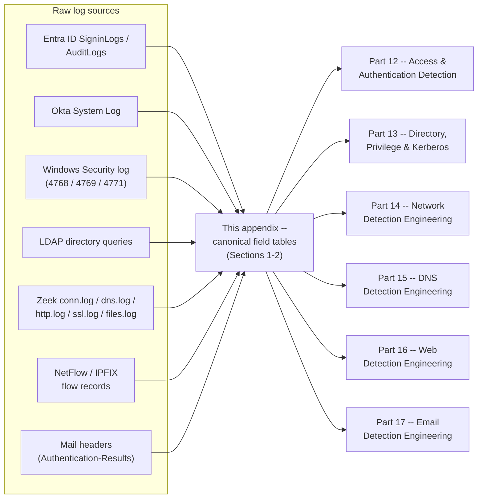

# Appendix A2 — Identity & Application Telemetry Field Reference

## Why this appendix exists

**[CONCEPT]** Parts 12, 13, 14, 15, 16, and 17 each build detection logic on top of a specific field — `ResultType`, `TicketEncryptionType`, `dns.question.entropy`, `dmarc=fail` — without re-deriving where that field comes from or what its neighbors mean, because re-deriving schema on every page would drown the analytic content this book is actually about. This appendix is where that derivation lives once: the identity/IdP/Kerberos/LDAP field set behind Parts 12–13, and the network/DNS/proxy/email field set behind Parts 14–17, each as a compact lookup table rather than a narrative. Part 3 and Part 4 own the fuller telemetry-engineering treatment — visibility, blind spots, volume, cost, retention — of the same log sources; this appendix owns only the field-by-field shape of the data once it's flowing.

Two conventions apply throughout:

- Field names are given in the vendor/protocol's own casing (`UserPrincipalName`, not `user_principal_name`) because that's what actually appears in a query against the live schema, matching the convention Parts 12–17 already use.
- Every table row that a specific chapter detection depends on is cross-referenced by part number, so a reviewer checking Part 13's Kerberos section against this appendix can confirm the field exists here and means what that chapter assumes.

This appendix does not repeat the Windows Event ID catalogue (Security/System/Application, Sysmon, PowerShell 4103/4104) — that reference lives in Appendix A1. Where a field below is carried on a Windows Security event (the Kerberos ticket events in particular), this appendix gives the field's meaning and detection relevance; A1 is the place to look up the event's full field list and general Windows-logging conventions.

---

## 1. Identity, IdP & Kerberos telemetry field reference

### 1.1 Entra ID (Azure AD) sign-in log fields

**[ENGINEERING]** The table below documents the `SigninLogs` fields Part 12 builds its brute-force, spray, MFA-abuse, and impossible-travel detections against. Okta's equivalent fields are cross-referenced in §1.3; Ping and Duo expose the same underlying concepts under their own field names, which this appendix does not enumerate — treat the concept column as the portable part and confirm your own provider's field name against its current schema documentation.

| Field | Meaning | Detection relevance | Used by |
|---|---|---|---|
| `UserPrincipalName` | The signed-in account's identity, in `user@domain` form | Primary entity key for almost every detection in this section | Part 12 §2–6 |
| `ResultType` | A numeric result/error code; `0` is success | Non-zero does **not** always mean "bad password" — expired accounts, blocked sign-ins, and conditional-access denials all produce distinct non-zero codes. Match specific codes, not "any non-zero," for brute-force/spray logic | Part 12 §2, §3 |
| `IPAddress` | Source IP of the sign-in attempt | Primary pivot for volumetric and geo-based detections; cheap for an attacker to rotate via VPN/proxy | Part 12 §2–6 |
| `LocationDetails` (nested; commonly `.countryOrRegion`, `.city`, `.state` in the default Sentinel schema — confirm nesting against your own workspace) | Geo-IP-resolved location of the source IP | Feeds impossible-travel and new-country logic; geo-IP-derived, not GPS-derived, so accuracy is bounded by the IP-geolocation database's own error rate | Part 12 §5, §6 |
| `DeviceDetail` (nested; `deviceId`, `isCompliant`/`complianceState`, `trustType`) | Device identity and compliance state, if device registration/Intune enrollment is in use | Feeds new-device logic; empty for any account whose device never enrolled | Part 12 §4 |
| `AuthenticationRequirement` | Whether the sign-in policy required single-factor or multi-factor auth | Distinguishes "MFA wasn't required" from "MFA was required and satisfied/denied" | Part 12 §4 |
| `ConditionalAccessStatus` | Outcome of conditional-access policy evaluation (`success`, `failure`, `notApplied`) | A `failure` here is a policy denial, not a credential failure — do not fold into a brute-force count | Part 12 §2–4 |
| `MfaDetail` | Detail on the specific MFA method and outcome | Feeds MFA-fatigue detection — distinguishes a single denied prompt from a rapid-fire prompt-bombing pattern | Part 12 §4 |
| `AppDisplayName` / `ResourceDisplayName` | The application/resource the sign-in was for | A failed sign-in to a decommissioned legacy app reads differently than one to the VPN gateway or a sensitive SaaS admin console | Part 12 §2–6 |
| `RiskLevelDuringSignIn` / `RiskState` | Entra ID Protection's own risk score for the sign-in, if licensed | Requires a P2-equivalent license tier — absent, not zero, on lower tiers; a query referencing it on an unlicensed tenant returns nothing, not an error | Part 12 §6 |
| `CorrelationId` | Groups related sign-in events from the same authentication flow | Useful for reconstructing a single SSO chain (one human login producing several app-specific sign-in records) | Part 12 §1 |
| `ClientAppUsed` | The client protocol/app category (browser, mobile app, legacy authentication protocol) | Legacy-auth protocols (IMAP, POP, older Exchange protocols) cannot enforce modern conditional access or MFA — a spray against a legacy-auth endpoint bypasses controls a browser-based sign-in would hit | Part 12 §2, §3 |

> **Engineering Reality**
> `SigninLogs` and `AuditLogs` are two different log sources with different schemas and different ingestion cadences, even though both originate from the same Entra ID tenant (see TERMINOLOGY.md § Log Source). A detection that needs "who signed in" and "what privileged change happened next" is joining across two sources with independently variable delivery lag — budget correlation-window slack for both, not just one.

### 1.2 Entra ID (Azure AD) audit log fields

**[ENGINEERING]** `AuditLogs` records directory and administrative changes — group membership, role assignment, application consent grants — as distinct from the authentication events in `SigninLogs` above.

| Field | Meaning | Detection relevance |
|---|---|---|
| `Category` | High-level grouping of the audited action (e.g., `RoleManagement`, `UserManagement`, `ApplicationManagement`) | Coarse filter to scope a query to a specific class of directory change before drilling into `ActivityDisplayName` |
| `ActivityDisplayName` | The specific action performed (e.g., "Add member to role") | The primary field for matching a specific privilege-change pattern |
| `OperationType` | Whether the action was an add, update, delete, or assign | Distinguishes "added to a group" from "removed from a group" when both share the same `ActivityDisplayName` category |
| `Result` / `ResultReason` | Whether the operation succeeded, and why if it failed | A failed privilege-escalation attempt still has evidentiary value even though the action itself didn't take effect |
| `InitiatedBy` (nested; app or user) | Who or what performed the action | Distinguishes a human admin action from an application/service-principal action — service-principal-initiated role changes are a common OAuth-consent-abuse vector cross-referenced from Part 18 |
| `TargetResources` (array; `displayName`, `type`, `modifiedProperties`) | What was changed, and the specific before/after property values | `modifiedProperties` is where the actual old-value/new-value pair lives for a role or group-membership change — the field most detections in this category actually filter or diff on |
| `CorrelationId` | Ties related audit events from the same operation together | Useful when one user action produces several `AuditLogs` rows (e.g., a bulk role assignment) |

### 1.3 Okta System Log fields

**[ENGINEERING]** Okta's System Log expresses the same underlying concepts as Entra ID's sign-in/audit logs, under different field names. The table below maps the two directly, since most organizations running Okta as their IdP will otherwise re-derive this mapping ad hoc every time a Part 12 detection gets ported.

| Okta System Log field | Entra ID equivalent (§1.1–1.2) | Meaning |
|---|---|---|
| `actor.alternateId` | `UserPrincipalName` | The acting account's identity, typically its login/email |
| `eventType` | `ActivityDisplayName` / `ResultType` context | A dotted event-type string (e.g., `user.session.start`, `user.authentication.auth_via_mfa`, `user.account.lock`) identifying the specific action |
| `outcome.result` | `ResultType` (mapped) | `SUCCESS`, `FAILURE`, `SKIPPED`, or `ALLOW`/`DENY` depending on `eventType` |
| `outcome.reason` | `ResultReason` | Free-text/coded reason for the outcome — the specific failure driver (bad password, MFA denied, locked account) |
| `client.ipAddress` | `IPAddress` | Source IP of the request |
| `client.geographicalContext` | `LocationDetails` | Geo-IP-resolved location; same GPS-vs-IP-geolocation caveat applies |
| `client.userAgent` | (no direct Entra field in §1.1) | Raw user-agent string; useful for fingerprinting scripted/automated login attempts distinct from a real browser |
| `authenticationContext.credentialType` | `AuthenticationRequirement` / `MfaDetail` context | The credential/factor type used (password, OTP, WebAuthn, push) |
| `debugContext.debugData.threatSuspected` | (no direct Entra field) | A boolean Okta sets when the request matched its own threat-intelligence signal (e.g., a known credential-stuffing source) — a genuinely high-value enrichment field when present, but its absence is not evidence of safety, only evidence Okta's own detection didn't fire |
| `target` (array) | `ResourceDisplayName` / `TargetResources` | The application or resource the event concerned |
| `transaction.id` | `CorrelationId` | Groups related System Log entries from the same request chain |
| `published` | `CreatedDateTime` (Entra) | Event timestamp — see Part 7 for event-time-vs-ingestion-time handling across both platforms |

> **Blind Spot**
> Neither table above carries a field that tells you whether a "successful" sign-in was performed by the legitimate account owner. Both `ResultType = 0` and `outcome.result = SUCCESS` mean "the presented credential and factor were valid," which is exactly what a successful credential-stuffing attempt or a session-token replay also produces. Detecting the account-takeover case requires the baselining and correlation layers in Parts 12, 31, and 33 — this field reference only tells you what the platform recorded, not what it means.

### 1.4 Kerberos ticket fields (Windows Security event log)

**[DETECTION ENGINEER]** These fields ride on the Kerberos-specific Windows Security events Part 13 builds against — Event ID 4768 (A Kerberos authentication ticket (TGT) was requested), Event ID 4769 (A Kerberos service ticket was requested), and Event ID 4771 (Kerberos pre-authentication failed). General auditing-prerequisite and event-schema conventions are Appendix A1's territory; this table gives the specific field semantics Part 13's Kerberoasting, AS-REP Roasting, and forged-ticket detections depend on.

| Field | Carried on | Meaning | Detection relevance |
|---|---|---|---|
| `TargetUserName` | 4768, 4769, 4771 | The requesting principal's account name on all three events, including 4769 — the client asking for the ticket, never the SPN-holding account the ticket is for | Primary entity key for identifying who is doing the requesting; a Kerberoasting hunt that counts distinct `ServiceName` values requested per `TargetUserName` in a short window is looking for one attacker-controlled account fanning out across many SPNs |
| `ServiceName` | 4769 | The service account or computer account the ticket was issued for — the SPN-holding account, and the field an attacker's Kerberoasting request is actually targeting | `krbtgt` here means routine TGT-renewal traffic, not a service-ticket request worth counting toward a Kerberoasting threshold. Do not confuse this with `TargetUserName` above — swapping the two silently points a "who's roasting" rule at the wrong identity |
| `TicketEncryptionType` | 4768, 4769 | Hex code for the ticket's encryption algorithm | `0x17` (RC4-HMAC) is the classic Kerberoasting tell because RC4 tickets are crackable offline at much higher speed than AES; `0x12` (AES256) and `0x11` (AES128) are the modern, harder-to-crack defaults. RC4 alone is not sufficient signal — see Part 13's Detection Autopsy on exactly this rule |
| `PreAuthType` | 4768 | The pre-authentication mechanism used | A value of `2` indicates normal encrypted-timestamp pre-authentication; the field's **absence** (not a specific value) is the tell for an AS-REP-Roastable account with pre-authentication disabled |
| `TicketOptions` | 4768, 4769 | A bitmask of requested ticket flags (forwardable, renewable, and others) | Decode against Microsoft's current Kerberos ticket-flag reference before hardcoding a bit position into a rule — this appendix does not enumerate every flag, to avoid silently drifting from the authoritative list |
| `IpAddress` (the raw field name; rendered as "Client Address" in the Event Viewer-friendly description) | 4768, 4769, 4771 | Source address of the request | Standard entity/pivot field; note this is the requesting client's address on all three events, including 4769, not the service account's |
| `Status` (the raw field name; rendered as "Failure Code" in the Event Viewer-friendly description) | 4771 | Hex failure code for a failed pre-authentication attempt | Commonly cited codes include `0x18` (pre-authentication failed — bad password) and `0x6` (client not found in the Kerberos database); treat the full code list as something to verify against Microsoft's current reference rather than a fixed table here, since new codes have been added over time |
| `TargetDomainName` | 4768, 4769, 4771 | The domain the ticket request was issued against | Relevant in multi-domain forests where the same account name can exist in more than one domain |

### 1.5 LDAP / Active Directory attribute reference

**[DETECTION ENGINEER]** These are directory object attributes queried directly via LDAP — either by an attacker's reconnaissance tooling or by a defender's own scheduled audit query — rather than fields carried on an event log record. Part 13 §7 covers the detection-relevant reconnaissance patterns; this table gives the attribute meanings that section assumes.

| Attribute | Meaning | Detection/hunting relevance |
|---|---|---|
| `distinguishedName` | The object's full path in the directory tree | Structural identifier; encodes OU placement, which itself can signal privilege tier (e.g., a Tier-0 OU) |
| `sAMAccountName` | The pre-Windows-2000-style short logon name | Most common join key back to Windows Security event fields like `TargetUserName` |
| `userPrincipalName` | The `user@domain` form of the account name | Join key back to Entra ID/hybrid-identity fields when the AD account is synced to the cloud |
| `objectClass` / `objectCategory` | The type of directory object (user, computer, group, etc.) | Scopes a query to the right object type before filtering further |
| `servicePrincipalName` | One or more SPNs registered on the account | A non-empty value marks the account as Kerberoastable — the exact attribute an attacker's `Get-ADUser -Filter {ServicePrincipalName -ne "$null"}` reconnaissance query targets, per Part 13's Hunter's Note |
| `userAccountControl` | A bitmask of account flags | The `0x400000` (`DONT_REQ_PREAUTH`) bit flags an AS-REP-Roastable account; `0x10000` (`DONT_EXPIRE_PASSWORD`) is a common hygiene flag worth correlating against service accounts with old passwords |
| `pwdLastSet` | Timestamp of the last password change | Feeds a Kerberoasting/AS-REP-Roasting remediation priority list — an SPN-bearing account with a stale password is a higher-value target than one rotated last week |
| `lastLogonTimestamp` | Approximate last-logon time, replicated with intentional imprecision across domain controllers | Useful for flagging dormant privileged accounts; not precise enough for real-time correlation — see Part 3 for its replication-lag caveats |
| `memberOf` | Group memberships (forward link) | Primary field for detecting privileged-group membership changes when paired with the `AuditLogs`/Windows Security equivalent event |
| `adminCount` | Set to `1` when an account has ever held privileged-group membership, and not automatically cleared when membership is removed | A stale `adminCount = 1` on an account no longer in a privileged group is a common audit finding, not itself a compromise indicator |

---

## 2. Network, DNS, proxy & email telemetry field reference

### 2.1 NetFlow / IPFIX field reference

**[ENGINEERING]** NetFlow (and its IETF-standardized successor, IPFIX) records flow-level metadata — who talked to whom, how much, for how long — with no payload visibility. Part 14's volumetric and rare-destination detections, and Part 4's NDR survey, both assume the field set below.

| Field (NetFlow v5/v9 naming) | Meaning | Detection relevance |
|---|---|---|
| `srcaddr` / `dstaddr` | Source and destination IP | Primary entity keys for connection-based detections |
| `srcport` / `dstport` | Source and destination port | Service-identification proxy in the absence of deep packet inspection; unreliable against non-standard-port usage |
| `prot` | IP protocol number (6 = TCP, 17 = UDP, etc.) | Filters flow type before applying protocol-specific logic |
| `dPkts` / `dOctets` (bytes) | Packet and byte counts for the flow | Volumetric exfiltration and beaconing-volume signals |
| `first` / `last` | Flow start/end timestamps | Duration and inter-flow-interval calculations (see Part 14's beaconing detection) |
| `input` / `output` | SNMP interface index the flow entered/exited on | Useful for reconstructing traffic direction and chokepoint at the router/switch level |
| `tcp_flags` | Cumulative OR of TCP flags seen in the flow | A flow showing only `SYN` with no `ACK` is evidence of a scan or a failed connection, not an established session |

> **Blind Spot**
> Flow export is frequently **sampled** on high-throughput routers — commonly 1-in-1,000 or 1-in-10,000 packets, not every packet — to keep exporter CPU load manageable. A sampled `dPkts`/`dOctets` count is a statistical estimate, not an exact figure, and a low-volume exfiltration attempt can fall entirely between sampled packets and produce no flow record at all. Confirm the sampling rate configured on your actual exporters before trusting a NetFlow-derived volume threshold at the scale Part 14's detections assume; an unsampled Zeek or firewall session log (§2.2) doesn't have this gap.

### 2.2 Zeek field reference

**[ENGINEERING]** Zeek's default log set gives full-fidelity, unsampled connection and protocol metadata. The fields below are the ones Part 4's NDR survey and Part 14's beaconing/lateral-movement detections cite by name.

**`conn.log` — connection summary**

| Field | Meaning |
|---|---|
| `ts` | Connection start timestamp |
| `uid` | Unique connection identifier — the join key across every other Zeek log for the same connection |
| `id.orig_h` / `id.orig_p` | Originator IP and port |
| `id.resp_h` / `id.resp_p` | Responder IP and port |
| `proto` | Transport protocol (tcp/udp/icmp) |
| `service` | Zeek's protocol-detection guess (based on payload inspection, not just port number) |
| `duration` | Connection duration in seconds |
| `orig_bytes` / `resp_bytes` | Payload bytes sent by originator/responder |
| `conn_state` | Connection-state flag (e.g., `S0` no reply, `SF` normal establish-and-close, `REJ` rejected) |
| `history` | A compact per-packet-flag history string — the sequence of flags/states observed, useful for distinguishing scan shapes from real sessions |

**`dns.log` — DNS transactions**

| Field | Meaning |
|---|---|
| `uid` | Joins back to the `conn.log` entry for the same DNS transaction |
| `query` | The queried name |
| `qtype_name` | The record type requested (see §2.3) |
| `rcode_name` | The response code (`NOERROR`, `NXDOMAIN`, etc.) |
| `answers` | The returned answer(s), if any |
| `TTLs` | TTL values for the returned answers |
| `rejected` | Whether the query was rejected by the responding server |

**`http.log` — HTTP transactions**

| Field | Meaning |
|---|---|
| `uid` | Joins back to `conn.log` |
| `method` | HTTP method (GET, POST, etc.) |
| `host` | `Host` header value |
| `uri` | Request path/query string |
| `referrer` | `Referer` header value |
| `user_agent` | Client `User-Agent` string |
| `status_code` | HTTP response status code |
| `resp_mime_types` | MIME type(s) Zeek identified in the response body |

**`ssl.log` — TLS handshake metadata**

| Field | Meaning |
|---|---|
| `uid` | Joins back to `conn.log` |
| `server_name` | SNI value presented in the ClientHello — visible even without decryption |
| `cipher` | Negotiated cipher suite |
| `subject` / `issuer` | Certificate subject and issuer |
| `validation_status` | Zeek's own certificate-chain validation result |
| `resumed` | Whether the session resumed a previous TLS session rather than negotiating fresh |

**`files.log` — extracted file metadata**

| Field | Meaning |
|---|---|
| `fuid` | Unique file identifier |
| `tx_hosts` / `rx_hosts` | Sending/receiving hosts for the file transfer |
| `mime_type` | Detected MIME type |
| `filename` | Filename, if observed in the transfer (e.g., `Content-Disposition`) |
| `sha1` | Hash of the extracted file, if Zeek's file-analysis framework computed one |

> **Hunter's Note**
> `uid` is the cheapest pivot across the entire Zeek log set for the same reason `TargetLogonId` is the cheapest pivot across Windows logon-adjacent events (Part 8): pull the `conn.log` `uid` for a suspicious connection first, then join `dns.log`, `http.log`, `ssl.log`, and `files.log` on that same `uid` before you correlate on IP or hostname — IPs and hostnames get reused across unrelated sessions and will pull in noise `uid` won't.

### 2.3 DNS record type reference

**[CONCEPT]** Part 15's tunnelling and TXT-abuse detections assume a working knowledge of what each record type is normally used for, since the discriminator between legitimate and abused use is almost always "does this query pattern match what this record type is for."

| Record type | Normal use | Detection-relevant abuse pattern |
|---|---|---|
| `A` | IPv4 address resolution | Baseline query type; volume/entropy scoring in Part 15 §5 applies here |
| `AAAA` | IPv6 address resolution | Same as `A`; often queried in pairs with `A` by dual-stack clients, which matters when counting distinct queries rather than distinct lookups |
| `CNAME` | Aliases one name to another | Long CNAME chains can be used to obscure the ultimate resolved domain from simple first-hop inspection |
| `MX` | Identifies a domain's mail servers | Legitimate mail-flow lookup; a client that isn't mail infrastructure issuing frequent `MX` queries is unusual in the same way unexpected `TXT` volume is (Part 15 §7) |
| `TXT` | Arbitrary free-text records — SPF (§2.5), domain verification, and increasingly abused as a data channel | Part 15's primary DNS-tunnelling vector: high TXT-query volume from a non-mail host against one apex is the pattern DET-15-04 targets |
| `NS` | Delegates a zone to authoritative name servers | Rarely queried directly by endpoints; unusual `NS` query volume from a workstation is itself a mild anomaly |
| `SOA` | Zone authority and refresh-timing metadata | Rarely relevant to endpoint-originated detection; more relevant to DNS-infrastructure monitoring |
| `PTR` | Reverse (IP-to-name) lookup | Used for reverse-DNS enrichment; PTR-record abuse for tunnelling is rarer than TXT but structurally similar |
| `SRV` | Service-location records (e.g., locating a domain controller) | High-value AD reconnaissance target — an attacker enumerating `SRV` records for `_ldap._tcp` or `_kerberos._tcp` is doing directory reconnaissance without ever touching LDAP directly (cross-reference Part 13 §7) |
| `NULL` | Rarely used in legitimate traffic; carries an opaque payload | Because it has almost no legitimate use on a typical endpoint, `NULL`-type queries are a strong, if rare, tunnelling signal — Part 15's composite score treats query-type skew toward `NULL`/`TXT` as a scoring input, not a standalone trigger |
| `CAA` | Constrains which certificate authorities may issue certs for a domain | Infrastructure-monitoring relevance more than endpoint-detection relevance |

### 2.4 Proxy, HTTP & web/WAF/API transaction field reference

**[ENGINEERING]** Part 14's proxy-based detections and Part 16's web/WAF/API detections both assume a normalized transaction record along these lines; exact field names vary by vendor (Squid, Bluecoat/Symantec, Zscaler, and most WAF products all use their own naming), so treat the concept column as the portable part.

| Concept | Common field-name examples | Meaning | Detection relevance |
|---|---|---|---|
| Source identity | `cs-username`, `src_user`, `c-ip` | Authenticated user or source IP of the request | Primary entity key; an authenticated identity is a stronger key than a shared/NATed source IP |
| Destination | `cs-host`, `dest`, `url` | Destination domain or full URL | Rarity/category scoring target |
| URL category | `category`, `url_category` | Vendor- or feed-assigned category for the destination | Feeds category-based allow/block logic — and the exact field Part 4's TLS-bypass-exfiltration detection (DET-04-01) filters on |
| Action taken | `action`, `disposition` | Allow, block, warn, or bypass | Distinguishes an attempted-and-blocked request from one that actually completed |
| TLS inspection state | `tls_inspected`, `ssl_decrypt_status` | Whether this specific session was decrypted by the inspecting proxy or only saw SNI/certificate metadata | The single largest proxy visibility gap — see Part 4 §3 |
| HTTP method | `cs-method`, `method` | GET, POST, PUT, etc. | Baseline-worthy per endpoint; unusual method usage against an API endpoint is a common abuse signal |
| Request path | `cs-uri`, `uri`, `request` | The requested path and query string | Primary field for injection/traversal/enumeration pattern matching in Part 16 |
| Status code | `sc-status`, `status_code` | HTTP response status | `4xx`/`5xx` spikes against one path are the baseline signal for endpoint discovery/brute-forcing in Part 16 |
| User agent | `cs(User-Agent)`, `user_agent` | Client-declared user agent | Trivially spoofed — useful as a weak signal combined with others, never alone (the "curl in UA" naive rule seeded in Part 16 and dismantled in Part 40) |
| Bytes transferred | `cs-bytes`, `sc-bytes` | Request/response body size | Volumetric signal for bulk upload/download detection |
| Block/deny reason | `waf_rule_id`, `block_reason` | The specific rule or signature that triggered a WAF action | Only present when a WAF/gateway layer exists in front of the application — its absence is a visibility gap, not evidence of no attack, per Part 4 §8 |

### 2.5 SPF, DKIM & DMARC header field reference

**[CONCEPT]** These three checks are computed by the receiving mail system and surfaced primarily through the `Authentication-Results` header; Part 17 §2 covers the failure-semantics analysis, and this table gives the underlying field/tag names that analysis reads.

**`Authentication-Results` header verdict fields**

| Field | Meaning |
|---|---|
| `spf=` | SPF verdict: `pass`, `fail`, `softfail`, `neutral`, `none`, `temperror`, or `permerror` |
| `smtp.mailfrom` | The envelope-sender address SPF actually evaluated (`Return-Path`) — not the visible `From` header |
| `dkim=` | DKIM verdict: `pass`, `fail`, or `none` (no signature present) |
| `header.d` | The domain that signed the message per its DKIM signature |
| `dmarc=` | DMARC verdict: `pass`, `fail`, or `bestguesspass` |
| `header.from` | The visible `From` domain DMARC checked for alignment against the SPF/DKIM-authenticated domain |

**`DKIM-Signature` header tags** (present on the message itself when DKIM-signed)

| Tag | Meaning |
|---|---|
| `v=` | DKIM version |
| `a=` | Signing algorithm (e.g., `rsa-sha256`) |
| `d=` | Signing domain |
| `s=` | Selector — identifies which public key (published as a DNS TXT record) to verify against |
| `h=` | The list of headers included in the signature |
| `bh=` | Body hash |
| `b=` | The signature value itself |

**DMARC DNS TXT record tags** (published at `_dmarc.<domain>`, not carried on the message)

| Tag | Meaning |
|---|---|
| `v=DMARC1` | Marks the record as a DMARC policy record |
| `p=` | Requested policy for the domain itself: `none`, `quarantine`, or `reject` |
| `sp=` | Requested policy for subdomains, if different from `p=` |
| `rua=` | Address(es) to send aggregate (summary) reports to |
| `ruf=` | Address(es) to send forensic (per-message) reports to |
| `pct=` | Percentage of failing messages the policy applies to — a domain mid-rollout may set this below 100 |
| `adkim=` / `aspf=` | Alignment mode (`r` relaxed or `s` strict) for DKIM/SPF-to-`From`-domain alignment |

---

## 3. Worked example — mapping a real DNS log to the canonical field set

**[ENGINEERING]** The excerpt below is real evidence from the same Pi-hole/`dnsmasq` resolver and capture window Part 15 draws on for its Figure 15.1 and Figure 15.2. It shows the `query`, `forwarded`, and `reply` verbs directly, using a slice of the capture — a `cari.com.my` lookup — that doesn't appear in either of those figures. The two remaining verbs this reference needs, `cached` and `gravity blocked`, are already captured verbatim in Part 15's Figure 15.2 and Figure 15.1 respectively; rather than reprint those same log lines under a new figure number and imply this is independent evidence, the mapping table below cites them by reference instead.

```text
Sep 15 08:32:49 dnsmasq[2221]: query[AAAA] cari.com.my from 192.168.1.126
Sep 15 08:32:49 dnsmasq[2221]: forwarded cari.com.my to 1.1.1.1
Sep 15 08:32:49 dnsmasq[2221]: query[A] cari.com.my from 192.168.1.126
Sep 15 08:32:49 dnsmasq[2221]: forwarded cari.com.my to 1.1.1.1
Sep 15 08:32:49 dnsmasq[2221]: reply cari.com.my is 104.26.1.204
Sep 15 08:32:49 dnsmasq[2221]: reply cari.com.my is 104.26.0.204
Sep 15 08:32:49 dnsmasq[2221]: reply cari.com.my is 172.67.71.236
Sep 15 08:32:49 dnsmasq[2221]: reply cari.com.my is 2606:4700:20::ac43:47ec
Sep 15 08:32:49 dnsmasq[2221]: reply cari.com.my is 2606:4700:20::681a:cc
Sep 15 08:32:49 dnsmasq[2221]: reply cari.com.my is 2606:4700:20::681a:1cc
```

**Figure A2.2 — `dnsmasq` log verbs mapped onto the canonical DNS-log field set (FIG-A2-02).** *REAL LAB EXAMPLE.* Captured from the CT100 Pi-hole resolver (`pct exec 100 -- tail -n 50 /var/log/pihole/pihole.log`), 2026-09-15, the same host and capture window as Part 15's Figures 15.1 and 15.2. `192.168.1.126` is a real LAN client device; `cari.com.my` is a real destination that client actually queried, not a lab-injected sample.

This excerpt does not use Zeek's `dns.log` schema (§2.2) — `dnsmasq`'s own log format predates and differs from it — but every field Zeek's `dns.log` names has a `dnsmasq`-log equivalent, which is exactly the kind of per-source field-name drift this appendix exists to resolve:

| Canonical concept | `dnsmasq` log rendering | Zeek `dns.log` field |
|---|---|---|
| Query name | The name following `query[TYPE]` or the verb (e.g., `cari.com.my` above) | `query` |
| Query type | The bracketed type on the `query` line (`[A]`, `[AAAA]`) | `qtype_name` |
| Response/disposition | The verb itself: `forwarded` (sent upstream), `reply` (answer returned) — both shown above; `cached` (served from cache, see Part 15's Figure 15.2) and `gravity blocked` (blocklist match, see Part 15's Figure 15.1) | No single Zeek field — `rcode_name` covers protocol-level result, but `dnsmasq`'s `forwarded`/`cached`/`gravity blocked` distinction is a resolver-local disposition Zeek's passive-capture model can't see at all, since Zeek observes wire traffic, not resolver-internal cache/blocklist decisions |
| Answer | The IP/CNAME after `is` on a `reply` line | `answers` |
| Source client | The address after `from` on a `query` line | `id.orig_h` (via the joined `conn.log` entry) |

> **Engineering Reality**
> Part 15's Figure 15.1 (`gravity blocked mobile.events.data.microsoft.com is ::` / `is 0.0.0.0`) shows Pi-hole answering the query itself with a null-route response rather than forwarding it — the query never reaches an upstream resolver at all. A detection pipeline built assuming every blocked query still produces a resolvable "attempted destination" via upstream `dns.log`/NetFlow correlation will find nothing for gravity-blocked traffic, because there is no upstream flow to correlate against. This is a genuine blind spot specific to resolver-side blocking, distinct from the general DNS blind spots Part 15 covers.

---

## 4. Worked example — correlating IdP fields for impossible travel

**[DETECTION ENGINEER]** This case study shows how the §1.1/§1.3 field mapping gets used in practice: an organization running both Entra ID (for Microsoft 365) and Okta (as a secondary IdP for a subset of SaaS apps) wants one impossible-travel detection that reasons over both sources instead of building and maintaining two independent rules.

CONCEPTUAL SAMPLE — illustrative cross-platform query; the join and threshold logic shown are a
teaching pattern, not a validated production rule, and this book has not tested it against real
Entra ID + Okta sign-in data run side by side.

```kql
// Illustrative Sentinel KQL: normalizes Entra ID SigninLogs and an ingested Okta System Log
// table onto a common shape, then flags a >500 mph implied travel speed between two
// successful sign-ins for the same human identity within a bounded window.
let EntraNormalized = SigninLogs
    | where ResultType == "0"
    | project Identity = UserPrincipalName, SignInTime = TimeGenerated,
              SourceIP = IPAddress, Country = tostring(LocationDetails.countryOrRegion),
              Source = "EntraID";
let OktaNormalized = OktaSystemLog                                   // table name depends on your Okta-to-Sentinel connector
    | where outcome_result == "SUCCESS" and eventType == "user.session.start"
    | project Identity = actor_alternateId, SignInTime = published,
              SourceIP = client_ipAddress, Country = tostring(client_geographicalContext.country),
              Source = "Okta";
EntraNormalized
| union OktaNormalized
| sort by Identity, SignInTime asc
| serialize
| extend PrevCountry = prev(Country), PrevTime = prev(SignInTime), PrevIdentity = prev(Identity)
| where Identity == PrevIdentity and Country != PrevCountry
| extend MinutesBetween = datetime_diff('minute', SignInTime, PrevTime)
| where MinutesBetween between (0 .. 240)                            // exclude same-identity matches from an unrelated prior session
// A real rule resolves Country pairs to an actual distance and divides by MinutesBetween
// to get implied travel speed, rather than treating "any country change within 4 hours" as
// sufficient alone -- see the False Positive Trap below and Part 12 Section 6.
```

> **False Positive Trap**
> "Country changed within N hours" alone fires constantly on legitimate VPN and corporate-proxy egress-point changes, and on any user genuinely travelling with a device that stays signed in — the exact false-positive driver Part 12 §6 names for impossible-travel logic generally. It also fires on pure data-quality noise: `LocationDetails.countryOrRegion` (Entra) and `client.geographicalContext.country` (Okta) both resolve to null for source IPs the geo-IP database can't place — a corporate NAT gateway or CGNAT range, commonly — and `Country != PrevCountry` evaluates true the moment one side of the pair is null, flagging a "country change" that isn't one. This illustrative query stops at the join; a deployable version needs the actual distance/speed computation Part 12 §6 describes, an exclusion for known corporate VPN/proxy egress ranges, and a null check on both `Country` values before comparing them, before it's safe to alert on rather than just log for review.

> **Blind Spot**
> The join assumes `UserPrincipalName` (Entra) and `actor.alternateId` (Okta) resolve to the identical literal string for the same human — true only when both identity providers expose the same domain suffix for that user. In a common hybrid setup where a user authenticates to Okta as `jane.doe@corp.com` but syncs into Entra as `jane.doe@corp.onmicrosoft.com`, `Identity == PrevIdentity` never evaluates true across the two sources, and the cross-platform correlation this query exists to provide silently returns zero matches for that entire population — an empty result set indistinguishable from "no impossible travel occurred" (see TERMINOLOGY.md § Entity Key / Entity Resolution). Separately, the fixed `0 .. 240`-minute window only catches travel implausible within four hours; an attacker (or a hijacked session) producing two sign-ins from distant countries five or six hours apart — still far faster than any commercial flight between them — clears this filter and is never evaluated for speed at all.

---

## 5. Cross-reference index

**[ENGINEERING]** The table below is the reverse lookup: given a part, which section of this appendix does its field-level content assume.

| Part | Field reference sections it depends on |
|---|---|
| Part 3 — Telemetry Engineering I | §1.1–1.5 (identity/Kerberos/LDAP field shape, as the analytic-layer companion to Part 3's telemetry-layer scoring) |
| Part 4 — Telemetry Engineering II | §2.1–2.5 (network/DNS/proxy/email field shape, as the analytic-layer companion to Part 4's telemetry-layer scoring) |
| Part 12 — Identity: Access & Authentication Detection | §1.1 (Entra sign-in fields), §1.3 (Okta System Log), §4 (worked impossible-travel example) |
| Part 13 — Identity: Directory, Privilege & Kerberos Detection | §1.2 (Entra audit log fields, for hybrid-identity cross-reference), §1.4 (Kerberos ticket fields), §1.5 (LDAP attributes) |
| Part 14 — Network Detection Engineering | §2.1 (NetFlow/IPFIX), §2.2 (Zeek `conn.log`/`ssl.log`) |
| Part 15 — DNS Detection Engineering | §2.2 (Zeek `dns.log`), §2.3 (DNS record types), §3 (worked `dnsmasq` field-mapping example) |
| Part 16 — Web Detection Engineering | §2.4 (proxy/HTTP/WAF/API transaction fields), §2.2 (Zeek `http.log`) |
| Part 17 — Email Detection Engineering | §2.5 (SPF/DKIM/DMARC header fields) |

---

## 6. Data flow: where this appendix sits in the pipeline

**[ENGINEERING]** The diagram below is the pipeline-shape summary of §§1–2: raw log sources at left, this appendix's field tables as the shared normalization layer in the middle, and the consuming parts at right.






**Figure A2.1 — Raw telemetry sources flowing through this appendix's field tables into their consuming parts (FIG-A2-01).** *CONCEPTUAL.* Rendered image: `assets/diagrams/fig-a2-01-telemetry-to-field-reference-flow.svg` (Mermaid source above is the editable version of record). Illustrates this appendix's role as a shared field-reference layer between the raw log sources at left and the analytic-layer parts at right; it does not represent an actual data pipeline, ingestion order, or timing relationship between the sources shown.

---

## 7. Known gaps and maintenance notes

**[SOC MANAGEMENT]** This appendix reflects field names and semantics as of the last-validated date in its front matter. Every vendor schema referenced here — Entra ID's `SigninLogs`/`AuditLogs` in particular — has been revised by its vendor before, sometimes silently (see TERMINOLOGY.md § Schema Drift). Treat any table row here as a starting point to confirm against your own tenant's live schema before hardcoding a field name into a production detection, not as a guarantee the field name is permanently stable.

Two gaps this appendix does not close, tracked here rather than papered over:

- **Ping and Duo field mappings.** Part 12 references both as equivalent IdPs to Entra ID/Okta but this appendix only tables Entra ID and Okta explicitly (§1.1, §1.3). Ping/Duo-specific field names are a documented gap, not an oversight.
- **Vendor-console screenshots of any of the tables above.** No screenshot of an Entra ID sign-in log blade, an Okta System Log entry, or a WAF rule-match console currently exists in this book's asset set, and none is fabricated here to fill the gap — see Part 12's own `[FIGURE PENDING — FIG-12-04]` note for the Entra ID case. A future pass should capture these from a real or lab tenant rather than reproducing a vendor UI from memory.
