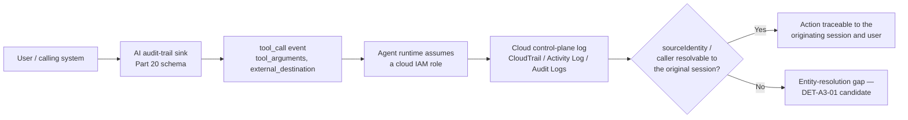

# Appendix A3 — Cloud & AI Telemetry Field Reference

## Scope

**[CONCEPT]** This appendix is a field-level lookup, not a narrative chapter — the reasoning behind every field listed here lives in the part that owns it, and this file exists so a detection engineer can check a field name or a delivery-lag figure without re-reading that part's prose. It covers two unrelated telemetry families that happen to share an appendix slot per `BOOK-INDEX.md`: the three major cloud providers' control-plane audit logs (companion reference for Part 4 §"AI and cloud sources," Part 18, and Part 19), and the AI systems audit-trail field model Part 20 builds layer by layer (companion reference for Parts 20 and 21). Section 3 below ties the two families together with one worked detection that only makes sense once both schemas exist side by side — an AI agent's tool call that reaches a cloud provider's control plane, and what happens when the two logs can't be joined back to the same identity.

This appendix does not cover identity-provider or SaaS-layer schemas (Entra ID, Okta, Google Workspace sign-in/audit fields) — that reference lives in Appendix A2, and Part 18 owns the reasoning. It does not cover Windows, Sysmon, or endpoint field references — Appendix A1. Where a field here is also relevant to identity-provider correlation (an assumed-role chain resolving back to a human sign-in), that overlap is called out inline with a pointer to A2 rather than duplicated.

None of the tables below are a full, exhaustive vendor schema — each carries the fields that matter for the detections built in Parts 18–20 and this book's cross-references. Verify the complete, current field list against your own provider's documentation and your own connector/ingestion version before building a detection on any field name here; provider schemas change, and connector field-mapping is itself a named failure mode (Schema Drift, `TERMINOLOGY.md`).

---

## 1. Cloud control-plane log references

**[ENGINEERING]** All three tables below list the fields Part 19's worked detections actually parse or filter on, plus the small number of additional fields needed to understand event shape and identity resolution. Field names are reproduced as documented by each provider at the time of writing; a provider API-version change can rename or restructure any of them without an ingest error (Schema Drift, `TERMINOLOGY.md`) — a query returning zero rows is not, by itself, evidence the activity didn't happen.

### 1.1 AWS CloudTrail event shape

The table below lists the CloudTrail record fields most detection logic in Part 19 depends on, to support quick lookup when writing or debugging a query against a CloudTrail-backed data source.

| Field | Type | Notes |
|---|---|---|
| `eventVersion` | string | CloudTrail log-record schema version — not the API version of the call itself. |
| `eventTime` | ISO-8601 timestamp | When the API call was made, not when the record was delivered — see §1.4 for the gap between the two. |
| `eventSource` | string | The service the call targeted, e.g. `iam.amazonaws.com`, `s3.amazonaws.com`. |
| `eventName` | string | The specific API action, e.g. `AssumeRole`, `PutBucketPolicy`, `AttachRolePolicy`. |
| `awsRegion` | string | Region the call targeted; global services (IAM, Route 53) log a fixed pseudo-region. |
| `sourceIPAddress` | string | The caller's IP address, or an AWS service principal name (`ecs.amazonaws.com`, etc.) when another AWS service made the call on a principal's behalf. |
| `userAgent` | string | Client/SDK string — distinguishes console, CLI, SDK, or third-party-tool origin. |
| `userIdentity.type` | string | `Root`, `IAMUser`, `AssumedRole`, `FederatedUser`, `AWSService`, and others — the starting filter for almost any identity-based query. |
| `userIdentity.arn` | string | The calling principal's ARN. See Part 19 §6 Blind Spot: this can be the *assumed role's* ARN, not the original human, once a chain is more than one hop deep. |
| `userIdentity.sourceIdentity` | string | Persists the original human identity through an assumed-role chain, once set on the initial assumption — that persistence depends on every subsequent role's trust policy allowing the `sts:SetSourceIdentity` action, not on those roles requiring it. |
| `requestParameters` | JSON object | The actual call arguments — the field most Part 19 queries parse for policy documents, security-group rules, or snapshot-sharing permissions. |
| `responseElements` | JSON object | What the call returned; null for most read-only calls. |
| `readOnly` | boolean | `true` for `Describe`/`List`/`Get`-style calls — the cheap way to separate discovery activity from mutating activity in a management-event trail that logs both. |
| `eventType` | string | `AwsApiCall` for the large majority of records relevant to detection; other values cover console sign-in and internal AWS service events. |
| `managementEvent` | boolean | `true` for control-plane events — distinguishes from the separately-billed data-event category (§1.4, Part 19 §1). |
| `recipientAccountId` | string | The account that logged the event — differs from the calling account in a cross-account access scenario. |

### 1.2 Azure Activity Log event shape

Filtering on subscription-level control-plane operations and resolving the calling identity depends on the Activity Log fields below.

| Field | Notes |
|---|---|
| `operationName` | The operation performed, formatted `{provider}/{resourceType}/{action}` — e.g. `Microsoft.Compute/virtualMachines/write`. |
| `category` | One of `Administrative`, `Security`, `ServiceHealth`, `Alert`, `Recommendation`, `Policy`, `Autoscale`, `ResourceHealth` — most control-plane detection logic targets `Administrative`. |
| `caller` | The UPN or application (service principal) ID of the identity that made the call — the closest Azure analog to CloudTrail's `userIdentity.arn`. Join back to a human sign-in via Appendix A2's Entra sign-in-log reference when the caller is a service principal acting on a user's behalf. |
| `correlationId` | Groups every Activity Log entry generated by one client-initiated operation, including asynchronous follow-on events — the closest Azure analog to grouping CloudTrail events by a single client action. |
| `resourceId` | The full ARM resource path the operation targeted. |
| `status.value` / `subStatus.value` | The operation's outcome (`Succeeded`, `Failed`, `Started`) and a finer-grained HTTP-style status. |
| `eventTimestamp` | When the event occurred. |
| `properties` | A vendor/resource-provider-specific detail bag — its internal shape varies by resource type and is the field most likely to need per-provider parsing logic. |

A source IP for the calling identity is not a stable, always-present top-level field in the Activity Log the way `sourceIPAddress` is in CloudTrail — it surfaces inconsistently inside `claims` or `properties` depending on resource provider and auth method. Verify its presence for your specific resource types before building a detection that depends on it.

### 1.3 GCP Cloud Audit Logs event shape

Most Cloud Audit Logs detection logic filters on the `protoPayload`-nested fields below.

| Field | Notes |
|---|---|
| `logName` | Identifies the log stream — ends in `activity` for Admin Activity logs (always on, free) or `data_access` for Data Access logs (opt-in, billed; see §1.4). |
| `protoPayload.methodName` | The specific API method called, e.g. `google.iam.admin.v1.SetIamPolicy`. |
| `protoPayload.authenticationInfo.principalEmail` | The calling identity — a user, service account, or federated-identity email. |
| `protoPayload.requestMetadata.callerIp` | The caller's IP address. |
| `protoPayload.authorizationInfo[].permission` / `.granted` | The specific IAM permission evaluated for the call and whether it was granted — useful for surfacing authorization-*denied* attempts, not only successful calls. |
| `resource.type` / `resource.labels` | The GCP resource type and its identifying labels (project ID, zone, instance ID). |
| `severity` | Log severity — most control-plane audit records log at `NOTICE` or `INFO` regardless of whether the underlying action is sensitive; severity here is not a proxy for detection priority. |
| `timestamp` | When the logged event occurred. |

### 1.4 Delivery-lag comparison

The table below supports a "how stale can this query's result set be" judgment call — the specific figures behind Part 19 §1's Engineering Reality box, in lookup form.

| Provider | Always-on / free layer | Opt-in / billed layer | Typical delivery lag | Formal SLA |
|---|---|---|---|---|
| AWS CloudTrail | Management events | Data events (S3 object-level, Lambda invocations, DynamoDB item operations) | ~15 minutes is the commonly cited typical figure | None documented |
| Azure Activity Log | Subscription-level control-plane operations | Resource-level data-plane operations, via a per-resource diagnostic setting | Generally reported faster than CloudTrail's typical figure in operational practice | None documented |
| GCP Cloud Audit Logs | Admin Activity | Data Access (opt-in per service) | Generally reported on the order of seconds to low minutes in operational practice | None documented |

> **Engineering Reality**
> None of the three providers publishes a contractual delivery-time SLA for its control-plane audit log, and every figure in the table above is a typical-case operational observation, not a guarantee. Under provider-side load or during a regional incident, delivery lag on any of the three can run well past its typical figure with no error surfaced anywhere in the pipeline. Treat a query's "as of" freshness as an explicit, stated assumption in every correlation window and "no alert fired" confidence statement built on these sources — see Part 19 §1 for the full argument and a worked consequence.

### 1.5 Cross-provider field mapping

The table below maps the same underlying concept across all three providers' schemas, to support writing one detection logic design (Part 19's "provider-agnostic in structure" framing) and then implementing it three times.

| Concept | AWS CloudTrail | Azure Activity Log | GCP Cloud Audit Logs |
|---|---|---|---|
| Calling identity | `userIdentity.arn` | `caller` | `protoPayload.authenticationInfo.principalEmail` |
| Source IP of caller | `sourceIPAddress` | Present inconsistently in `claims`/`properties`, not a stable top-level field — verify per resource provider | `protoPayload.requestMetadata.callerIp` |
| Action performed | `eventName` | `operationName` | `protoPayload.methodName` |
| Target resource | `requestParameters` and/or `resources[].ARN` | `resourceId` | `resource.type` + `resource.labels` |
| Call outcome | `errorCode` / `errorMessage` when present, else success implied | `status.value` / `subStatus.value` | `protoPayload.status.code` / `.message` |
| Always-on vs. opt-in/billed category | `managementEvent` (management events default-on; data events opt-in) | `category=Administrative` (automatic) vs. per-resource diagnostic setting (opt-in) | `logName` ending `activity` (always on) vs. `data_access` (opt-in) |
| Grouping key for one client-initiated operation | No direct field — approximate via `eventID` proximity and a bounded time window | `correlationId` | `operation.id` when the emitting service populates the `LogEntryOperation` block (not universal — many API methods never set it); otherwise approximate via `insertId` and a bounded time window |

---

## 2. AI systems telemetry field reference

**[ENGINEERING]** The tables below are the appendix-owned copy of the audit-trail field model Part 20 §3 builds, organized by the same four interaction layers (Part 20 §2) and carrying the same retention treatment Part 20 §7 argues for. Consult Part 20 for the reasoning behind any given field or retention choice; this section exists so a schema-design review can check a logging pipeline against the full field list in one place.

### 2.1 Identity, session, and device context

These fields anchor every other layer's fields back to a specific user, conversation, and device — the entity keys most downstream correlation depends on.

| Field | Layer | Retention treatment |
|---|---|---|
| `user_id` | Prompt/session | Long-term, metadata-only. Must resolve to the same Entity Key (`TERMINOLOGY.md`) used elsewhere in the identity stack, not a local AI-platform-specific ID with no join path back to the IdP (Appendix A2). |
| `session_id` | Prompt/session | Long-term, metadata-only. Groups every turn of one conversation or agent run — the AI-systems equivalent of a Windows Logon ID (Appendix A1). |
| `source_ip` / `source_app` | Prompt/session | Long-term, metadata-only. |
| `device_id` | Prompt/session, where available | Long-term where present; record its absence explicitly rather than leaving it silently null. |

### 2.2 Prompt, file, and classification metadata

These fields carry prompt-level context and classification without carrying the raw prompt text itself long-term.

| Field | Layer | Retention treatment |
|---|---|---|
| `prompt_classification` | Prompt/session | Long-term — this label, not the raw prompt text, carries the long-term audit weight (Part 20 §7). |
| `prompt_metadata` (length, language, truncation flag, attachment flag) | Prompt/session | Long-term — carries almost none of the privacy exposure of the prompt text itself. |
| `file_name`, `file_mime_type`, `file_hash` | Prompt/session, on upload | Long-term — a hash and MIME type carry no content exposure by themselves. |
| `data_classification` (input) | Prompt/session | Long-term. |
| Raw prompt text | Prompt/session | Short-window only, then dropped or irreversibly redacted (Part 20 §7). |

### 2.3 Model invocation and retrieval

These fields describe which model handled a request and what it retrieved, each retained as metadata rather than content.

| Field | Layer | Retention treatment |
|---|---|---|
| `model` | Model invocation | Long-term, metadata-only. |
| `model_version` | Model invocation | Long-term, metadata-only. |
| `token_counts` (prompt, completion, total) | Model invocation | Long-term, metadata-only — also a coarse anomaly signal (Part 20 §3.3). |
| `rag_query` | Retrieval | Short-window only for raw text; a hash or classification is the long-term substitute (Part 20 §7). |
| `rag_documents_returned` (document IDs, source, classification) | Retrieval | Long-term — join back to the source document store by ID rather than re-storing document text. |

### 2.4 Agent, tool-call, and downstream-action

These fields cover what an agent actually did — the tool it called, the arguments it passed, and any downstream system or cloud API it touched.

| Field | Layer | Retention treatment |
|---|---|---|
| `agent_id` / `agent_version` | Agent/tool-call | Long-term. |
| `tool_called` | Agent/tool-call | Long-term. |
| `tool_arguments` | Agent/tool-call | Long-term for structure; full content short-window only if it carries classified content (Part 20 §7). |
| `tool_result` | Agent/tool-call | Long-term (status and bounded summary). |
| `external_destination` | Agent/tool-call, at the trust-boundary crossing | Long-term — the single highest-value, lowest-privacy-exposure field in the whole model (Part 20 §3.4, §8). |
| `approval` (approver, method, timestamp) | Agent/tool-call, where a gate exists | Long-term. A null value where a gate is expected is itself a detection-relevant fact, not a benign absence. |
| `downstream_action` | Agent/tool-call | Long-term, where the receiving system can be instrumented. |

> **Blind Spot**
> Several popular agent frameworks expose the final tool call and its result cleanly but do not expose the model's intermediate reasoning that led to choosing that tool and those arguments — an audit trail built entirely from SDK-level hooks can show *what* an agent did without ever being able to reconstruct *why*. Verify your specific framework surfaces that content before an incident-response process assumes it can always answer "why did the agent do that." (Full discussion: Part 20 §2.)

---

## 3. Worked example: joining an AI agent's tool call to its cloud control-plane record

**[DETECTION ENGINEER]** The two field families above rarely meet inside a single query — the AI audit trail and the cloud provider's control-plane log are usually different data sources with different owners. They meet at exactly one seam: an agent tool call whose `tool_arguments` or `external_destination` shows it reached a cloud provider's API, and the cloud provider's own control-plane log for the action the agent's runtime credentials actually took. That seam inherits both parts' named blind spots at once — Part 19 §6's assumed-role-chain identity loss, and Part 20 §2's "SDK hook doesn't expose the reasoning" gap — and the detection below targets the resulting entity-resolution failure directly, not the underlying action.






**Figure A3.1 — Joining an AI-agent tool call to its downstream cloud control-plane record (FIG-A3-01).** *CONCEPTUAL.* Illustrates the entity-resolution join the worked detection below depends on: an AI audit-trail tool-call event, followed by the cloud provider's own control-plane record for the action the agent's assumed role actually took, and the point at which the join can fail. Not a capture from any specific product — combines the assumed-role blind spot named in Part 19 §6 with the agent tool-call fields defined in Part 20 §3.4.

**DET-A3-01 — Agent tool call using an assumed cloud role with no resolvable `sourceIdentity`.** This targets Microsoft Sentinel, joining a custom AI-audit table built to the Part 20 §3 schema (`AiAuditEvents`) against AWS CloudTrail ingested via Sentinel's native AWS S3 connector (table `AWSCloudTrail`), and flags any agent tool call that assumed a cloud IAM role where the matching `AssumeRole` event has no `sourceIdentity` populated.

```kql
// Sentinel KQL joining a custom AI-audit table (schema per Part 20 §3) to the AWSCloudTrail
// connector table; AWSCloudTrail field names and casing are approximate — validate against
// your actual connector version before deploying.
AiAuditEvents
| where event_type == "tool_call" and isnotempty(external_destination)
| extend agent_role_arn = tostring(parse_json(tool_arguments).assumed_role_arn)
| where isnotempty(agent_role_arn)
| project session_id, tool_ts = event_ts, tool_called, external_destination, agent_role_arn
| join kind=leftouter (
    AWSCloudTrail
    | where EventName in ("AssumeRole", "AssumeRoleWithWebIdentity")
    | extend AssumedRoleArn = tostring(parse_json(RequestParameters).roleArn)
    | project ct_ts = EventTime, AssumedRoleArn,
        SourceIdentity = tostring(parse_json(RequestParameters).sourceIdentity)
) on $left.agent_role_arn == $right.AssumedRoleArn
| where isnull(ct_ts) or tool_ts - ct_ts between (0m .. 15m)
// a shared/pooled execution role assumed by many concurrent agent sessions can produce more
// than one AssumeRole event inside the 15-minute window; keep only the nearest one per tool
// call instead of alerting once per matching row — see the note below on why this is a
// heuristic, not a guarantee, for a role several sessions assume at once
| summarize arg_max(ct_ts, *) by session_id, tool_ts, tool_called, agent_role_arn
| where isempty(SourceIdentity)
| project session_id, tool_ts, tool_called, agent_role_arn, ct_ts, SourceIdentity
```

This query's dependency chain is longer than most in this book: it needs `tool_arguments` to carry a recoverable `assumed_role_arn` field, which Part 20 §5's Engineering Reality box already flags as inconsistent across agent frameworks (best-effort, sometimes-truncated argument serialization), and a 15-minute join window that is a starting assumption, not a validated threshold. A row with `ct_ts` null means no matching `AssumeRole` event was found at all in the window — itself worth separating from a row where the call *was* found but `SourceIdentity` was empty, since the two represent different failure modes (missing correlation vs. confirmed identity loss). A null `ct_ts` is also not necessarily a real correlation failure: §1.4's typical CloudTrail delivery lag is itself close to this query's 15-minute window, so a scheduled run close to the tool-call time can see `ct_ts` as null simply because the matching `AssumeRole` record hasn't landed in `AWSCloudTrail` yet, not because the two events don't correlate — treat a null-`ct_ts` result as pending re-check on the next scheduled run, not as a confirmed finding, or delay the query's execution past the provider's typical delivery lag.

The `arg_max` step above keeps the query from alerting once per matching `AssumeRole` row when a shared execution role is assumed by several concurrent agent sessions in the same window — without it, one tool call could fan out into multiple duplicate alert rows purely from join cardinality, unrelated to how many actual sessions used the role. It only picks the *nearest-in-time* match, though; it cannot tell whether that nearest match is actually the `AssumeRole` call this particular session triggered, so a busy shared role can still get a tool call paired with a different session's `AssumeRole` event — one that happens to have `SourceIdentity` populated — and silently suppress a true positive rather than produce a duplicate.

This detection is also scoped by construction to agent runtimes that use STS role assumption for cloud access at all. An agent runtime provisioned with a static IAM user access key instead of an assumed role never generates an `AssumeRole` event, so the join has nothing to match against and the entire detection produces zero rows for that agent's cloud activity — not a false negative in the usual sense, since the query behaves exactly as written, but a `NO VISIBILITY`-tier coverage gap (`TERMINOLOGY.md`'s six-tier scale) on the cloud-control-plane side of the join, tied to that architecture choice rather than to any tunable threshold.

> **Detection Test**
> **Setup:** A lab or staging deployment with an AI agent runtime configured to assume a dedicated AWS IAM role for one specific tool, and CloudTrail management events enabled on the test account.
> **Action:** Run the agent through a tool call that assumes the role and calls an AWS API, without configuring the role's trust policy to require `sourceIdentity`.
> **Expected result:** One `tool_call` row in `AiAuditEvents` with `external_destination` populated, joined to an `AssumeRole` event in `AWSCloudTrail` for the matching assumed-role ARN (`RequestParameters.roleArn`) with an empty `sourceIdentity` — DET-A3-01 should return exactly this session.

> **Blind Spot**
> This detection only sees the case where the AI-audit and CloudTrail records *can* be joined by role ARN. If the agent framework's logged `tool_arguments` never captures which role it assumed at all — a real, common gap per Part 20 §5 — the row never reaches the join step, and the entity-resolution failure is invisible to this query even though it's identical in kind to the one the query is built to catch. The same failure mode applies to the query's first filter: if `external_destination` is never populated for a tool call that genuinely reached a cloud API, that row is dropped before the join ever runs, with no error and nothing left in the result set to signal the gap. This is a `TELEMETRY ONLY`-or-worse coverage gap (`TERMINOLOGY.md`'s six-tier scale) on the AI-audit side, not a logic defect in the query itself.

> **False Positive Trap**
> Most AWS accounts never configure a trust-policy condition requiring `sts:SourceIdentity`, so `sourceIdentity` is empty on the large majority of `AssumeRole` calls in a typical, unhardened account — CI/CD pipelines, third-party SaaS integrations, and every other role-assuming workload produce the same empty-`SourceIdentity` pattern this query is looking for, with no relationship to AI-agent activity at all. Deployed as written, expect this query to match most-to-all `AssumeRole` events for the roles in scope until you either restrict `EventName in (...)` to roles used only by known agent runtimes, or enforce `sts:SourceIdentity` on the trust policy of every role an agent is allowed to assume — enforcement, not query-side filtering, is the actual fix, since it makes the *absence* of the field a real signal instead of the default state.

**MITRE:** T1078.004 (Valid Accounts: Cloud Accounts) — mapped to the underlying account-abuse context this entity-resolution gap would obscure if the agent's cloud access were ever misused, not to the gap itself; a visibility gap is not forced into its own technique ID, per the same scope discipline Part 19 §3 applies to storage-exposure states.

---

## 4. Cross-reference index

**[ENGINEERING]** The table below points to where the reasoning behind each field family in this appendix is actually taught, for a reader who arrived here from a query and needs the narrative context.

| Concept | Primary part | This appendix |
|---|---|---|
| Cloud telemetry visibility/blind-spot/cost survey | Part 4 | §1 (field detail) |
| Cloud identity, IdP, SaaS, OAuth/conditional-access | Part 18 | Not covered here — see Appendix A2 |
| Cloud control-plane detection logic (IAM, storage, network, logging tamper, exfiltration) | Part 19 | §1 (field reference the detections cite) |
| AI systems audit-trail schema and privacy/retention model | Part 20 | §2 (field reference) |
| AI-specific detection logic built on this schema | Part 21 | §3 (one worked example bridging both schemas) |
| Entity Key / Entity Resolution failure modes generally | `TERMINOLOGY.md` §6 | §3 (concretely instantiated) |

---

## 5. Known gaps and maintenance notes

**[SOC MANAGEMENT]** This appendix reflects field names and semantics as of the last-validated date in its front matter. All three cloud providers' control-plane schemas, and every AI agent framework's own audit-trail shape, are revised by their vendors on their own release schedule — sometimes without a version bump a connector surfaces (Schema Drift, `TERMINOLOGY.md`). Treat every field name here as a starting point to confirm against your own account/tenant/framework's live schema and connector version before hardcoding it into a production detection, not as a guarantee it stays stable.

One gap this appendix does not close, tracked here rather than papered over:

- **Vendor-console and agent-framework screenshots.** No screenshot of the CloudTrail event history console, the Azure Activity Log blade, the GCP Cloud Audit Logs viewer, or any AI agent framework's own audit-trail UI currently exists in this book's asset set, and none is fabricated here to fill the gap. Figure A3.1 (§3) is a CONCEPTUAL flowchart of the entity-resolution join, not a capture from any of these consoles. A future pass should capture these from a real or lab account/tenant/deployment rather than reproducing a vendor UI from memory.
