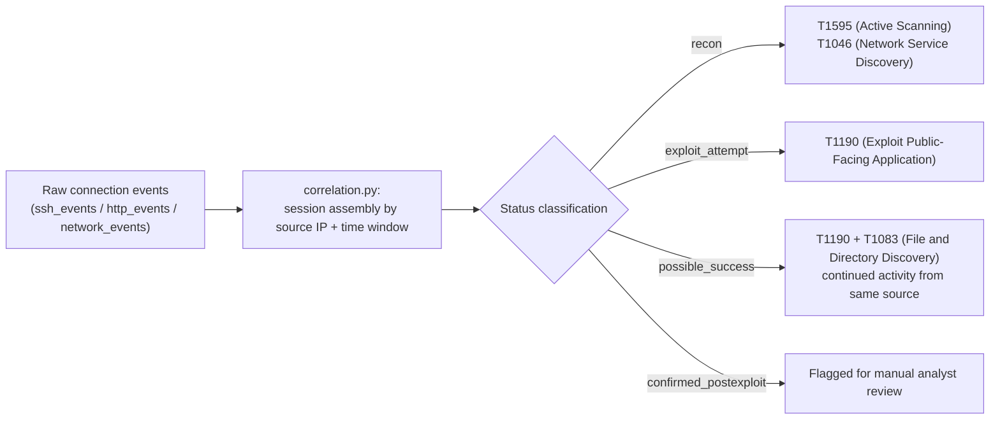

# Appendix A4 — MITRE ATT&CK Mapping Quick Reference

## Why this appendix exists

A reader mid-investigation — "I have a 4769 with an RC4 ticket, what is this called and who
owns the detection for it" — needs a lookup table, not another 14 pages of protocol
explanation. This appendix is that lookup table: a compact, tactic-ordered index of ATT&CK
techniques this book is genuinely confident about, each one pointed at its primary telemetry
source and the Part that owns building the detection for it. It is deliberately not exhaustive.
`MITRE-COVERAGE.md` is the living, detection-ID-level ledger that will eventually cross-reference
every `DET-####` in the book to a technique; that ledger does not exist yet at the time of this
appendix's drafting (no `DETECTION-INVENTORY.md` or `MITRE-COVERAGE.md` file is present in the
repo), so this table is scoped to what can be stated accurately right now — technique, telemetry,
owning Part — without inventing detection IDs that don't exist. Treat this appendix as the entry
point that gets extended, not replaced, once individual detections carry their own IDs.

## 1. Scope and conventions used in this reference

**[CONCEPT]** Three rules govern every row below:

- Only techniques whose ID and canonical name are stated here with confidence make the list.
  Per `STYLE-GUIDE.md` §5, a tenuous or guessed mapping is worse than an honest gap — nothing
  below is a guess.
- Sub-technique IDs are used only where this book is confident of the exact dot-suffix (e.g.,
  `T1558.003`); techniques listed at the parent level (e.g., `T1046`) are listed at that level
  because a specific sub-technique isn't the load-bearing distinction for the mapping, not
  because the sub-technique doesn't exist.
- "Primary Telemetry Source" names the one or two log sources a detection engineer would reach
  for first — it is not a complete source list. "Part" names where this book builds the actual
  detection logic, not every part that mentions the technique in passing.

This table is a lookup aid, not a coverage claim. Per `TERMINOLOGY.md` §5, bare "coverage" is an
incomplete sentence in this book — nothing here states whether a technique has `NO VISIBILITY`,
`TELEMETRY ONLY`, or `TESTED / RECENTLY VALIDATED` status in any specific environment. That
six-tier assessment belongs to Part 41 and Appendix A7, against a real deployed stack.

## 2. Quick reference table

**[DETECTION ENGINEER]** The table below maps each technique to the tactic it's listed under in
this book, the telemetry source a detection engineer would query first, and the Part that owns
building and maintaining the detection logic for it.

| Tactic | Technique | Primary Telemetry Source | Part |
|---|---|---|---|
| `TA0043` (Reconnaissance) | `T1595` (Active Scanning) | Firewall/NDR flow logs; honeynet connection logs | Part 14 |
| `TA0001` (Initial Access) | `T1190` (Exploit Public-Facing Application) | Web server / WAF request logs | Part 16 |
| `TA0001` (Initial Access) | `T1566.001` (Phishing: Spearphishing Attachment) | Email gateway logs, attachment metadata | Part 17 |
| `TA0001` (Initial Access) | `T1566.002` (Phishing: Spearphishing Link) | Email gateway logs, URL-click telemetry | Part 17 |
| `TA0001` (Initial Access) | `T1133` (External Remote Services) | VPN/remote-access gateway logs, firewall logs | Part 14 |
| `TA0001` (Initial Access) | `T1078` (Valid Accounts) | IdP/SSO sign-in logs | Part 12 |
| `TA0002` (Execution) | `T1059.001` (Command and Scripting Interpreter: PowerShell) | PowerShell logs (`4103`/`4104`) | Part 10 |
| `TA0002` (Execution) | `T1059.003` (Command and Scripting Interpreter: Windows Command Shell) | Sysmon Event ID 1 (Process Create) / Windows process creation (`4688`) | Part 9 |
| `TA0002` (Execution) | `T1204.002` (User Execution: Malicious File) | EDR/Sysmon process-creation telemetry | Part 11 |
| `TA0003` (Persistence) | `T1053.005` (Scheduled Task/Job: Scheduled Task) | Windows Security log / Sysmon process creation | Part 11 |
| `TA0003` (Persistence) | `T1547.001` (Boot or Logon Autostart Execution: Registry Run Keys / Startup Folder) | Sysmon Event ID 13 (Registry value set) | Part 11 |
| `TA0003` (Persistence) | `T1098` (Account Manipulation) | AD/directory audit events | Part 13 |
| `TA0003` (Persistence) | `T1136` (Create Account) | Windows Security log (`4720`) | Part 13 |
| `TA0004` (Privilege Escalation) | `T1548.002` (Abuse Elevation Control Mechanism: Bypass User Account Control) | Sysmon/EDR process telemetry | Part 11 |
| `TA0004` (Privilege Escalation) | `T1055` (Process Injection) | EDR process-access telemetry; Sysmon Event ID 8 (CreateRemoteThread) / 10 (ProcessAccess) | Part 11 |
| `TA0005` (Defense Evasion) | `T1070.001` (Indicator Removal: Clear Windows Event Logs) | Windows Security log (`1102`) | Part 8 |
| `TA0005` (Defense Evasion) | `T1027` (Obfuscated Files or Information) | PowerShell script-block logs, EDR file/telemetry | Part 10 |
| `TA0005` (Defense Evasion) | `T1562.001` (Impair Defenses: Disable or Modify Tools) | EDR agent-health/tamper telemetry | Part 11 |
| `TA0005` (Defense Evasion) | `T1218.011` (System Binary Proxy Execution: Rundll32) | Sysmon Event ID 1 (Process Create) | Part 9 |
| `TA0006` (Credential Access) | `T1110.001` (Brute Force: Password Guessing) | IdP sign-in logs; SSH auth logs | Part 12 |
| `TA0006` (Credential Access) | `T1110.003` (Brute Force: Password Spraying) | IdP sign-in logs | Part 12 |
| `TA0006` (Credential Access) | `T1003.001` (OS Credential Dumping: LSASS Memory) | Sysmon Event ID 10 (ProcessAccess) / EDR | Part 11 |
| `TA0006` (Credential Access) | `T1558.003` (Steal or Forge Kerberos Tickets: Kerberoasting) | Windows Security log (`4769`) | Part 13 |
| `TA0006` (Credential Access) | `T1558.004` (Steal or Forge Kerberos Tickets: AS-REP Roasting) | Windows Security log (`4768`) | Part 13 |
| `TA0007` (Discovery) | `T1046` (Network Service Discovery) | Firewall/NDR flow logs; honeynet connection logs | Part 14 |
| `TA0007` (Discovery) | `T1083` (File and Directory Discovery) | EDR/Sysmon process + file-access telemetry | Part 11 |
| `TA0007` (Discovery) | `T1087` (Account Discovery) | Directory/LDAP query logs | Part 13 |
| `TA0008` (Lateral Movement) | `T1021.001` (Remote Services: Remote Desktop Protocol) | Windows Security log (`4624` Type 10); network flow logs | Part 14 |
| `TA0008` (Lateral Movement) | `T1021.004` (Remote Services: SSH) | SSH daemon auth logs (`sshd`/auditd) | Part 14 |
| `TA0008` (Lateral Movement) | `T1550.002` (Use Alternate Authentication Material: Pass the Hash) | Windows Security log (NTLM logon fields on `4624`) | Part 13 |
| `TA0011` (Command and Control) | `T1071.004` (Application Layer Protocol: DNS) | DNS query logs | Part 15 |
| `TA0011` (Command and Control) | `T1105` (Ingress Tool Transfer) | EDR/network telemetry (file write following inbound connection) | Part 11 |
| `TA0040` (Impact) | `T1486` (Data Encrypted for Impact) | EDR file-system telemetry; mass file-modify rate | Part 45 |

> **Engineering Reality**
> Every technique above that maps to a Windows Security event ID — Event IDs 4769, 4768, 4720,
> 4624, and 1102 — is silently absent from the log if the corresponding audit subcategory was
> never enabled via Group Policy — the same gap Part 8 and Part 13 both call out for their own
> event IDs. A quick-reference table like this one can tell you where to look; it cannot tell you
> whether your domain controllers were actually configured to produce that data. Verify audit
> policy before trusting an empty query result as "not happening."

> **Blind Spot**
> This table lists one primary telemetry source per technique for lookup speed. Several
> techniques — `T1078` (Valid Accounts) most obviously — are detectable, if at all, only through
> correlation across multiple sources (sign-in log plus baseline plus downstream process
> activity), not from the single source named here. Treat the "Primary Telemetry Source" column
> as "where to start," not "everything you need."

> **Blind Spot**
> `T1059.001`'s listed source — Event ID 4103/4104 script-block logging — only exists for
> PowerShell version 5 and later's engine. An attacker who invokes `powershell.exe -Version 2`
> on a host where the legacy Windows PowerShell 2.0 engine is still installed — present as an
> optional feature on many Windows versions, though deprecated and not enabled by default on
> newer builds — runs entirely on the old engine, which does not implement
> script-block logging at all — no 4104, and 4103 module logging only fires for cmdlets, not for
> arbitrary script text. The 4688/Sysmon Event ID 1 process-creation record for `powershell.exe`
> still exists, but the payload itself is invisible to this row's primary source. Detecting the
> downgrade itself requires a separate rule on the command line's `-version 2` flag or on the
> engine version field, not on 4103/4104.

## 3. Worked case study: tagging a real honeynet session against ATT&CK

**[THREAT HUNTER]** The clearest illustration of technique-to-telemetry mapping in this book's
own lab evidence is the honeynet correlation pipeline running on the home lab's CT103 host. Its
`attack_sessions` table takes raw connection records from three separate telemetry streams
(`ssh_events`, `http_events`, `network_events`) and produces exactly the kind of session-level,
ATT&CK-tagged record this appendix's table is a static version of — the pipeline does at runtime
what this appendix does as a lookup.

Figure A4.1 sketches that pipeline's stages.





**Figure A4.1 — Honeynet session-to-ATT&CK correlation pipeline.** *CONCEPTUAL.* Illustrates the
stages the CT103 honeynet's `correlation.py` job actually runs — connection ingestion, session
assembly, status classification, technique tagging — based on reading that pipeline's real
output; the diagram itself is a sketch of the data flow, not a capture of code or a UI. Global ID:
`FIG-A401`.

The pipeline's real output, captured from the honeynet's own database, backs this up directly:

```text
session_id        source_ip       status            mitre_techniques_json
d48b795e...        16.5.0.236      possible_success  ["T1595", "T1046", "T1083", "T1190"]
ba0ab1f3...         45.156.128.45  exploit_attempt   ["T1595", "T1046", "T1190"]
```

*REAL LAB EXAMPLE.* Excerpted and abbreviated from `attack_sessions` on CT103 (Horizon Grid
honeynet collector backend), captured 2026-09-15, spanning inbound traffic from
2026-09-15T00:01–07:43 against the sacrificial AeroNex decoy segment
(`10.99.99.x`/`121.122.63.114`). Every source IP shown is external and unrelated to this lab's own
management network — see `lab/evidence/ct103-honeynet-correlated-attack-sessions.txt` for the
full 20-row capture, including 13 sessions the platform's own logic flagged `possible_success`
(an exploit-shaped request followed by continued activity from the same source) as worth manual
review.

**MITRE:** T1595 (Active Scanning), T1046 (Network Service Discovery), T1083 (File and Directory
Discovery), T1190 (Exploit Public-Facing Application).

> **Hunter's Note**
> `session_id` here is doing the same job `TargetLogonId` does for a Windows logon session (see
> Part 12's Hunter's Note on that pivot) — it's the one field that reliably ties every raw
> connection from one attacker's dwell against the honeynet into a single timeline. Pull it
> first when triaging a `possible_success` row; correlating on `source_ip` alone will miss the
> case where the same attacker rotates through a small pool of addresses mid-session.

**[DETECTION ENGINEER]** `correlation.py`'s source isn't in scope here, so its exact matching
rules can't be confirmed line-for-line — what's verifiable is the shape of the requests it has
actually tagged `exploit_attempt`/`T1190` in the raw evidence. The most concrete example is the
GPON router authentication-bypass RCE probe (`POST /GponForm/diag_Form`, CVE-2018-10561/10562)
captured in `lab/evidence/ct103-honeynet-http-events-exploit-probes.txt`. A Sigma-style rule
covering that same general class of signal — a small set of well-known exploit-shaped paths and
query-string patterns (path traversal, common CVE paths, SQL-injection-like syntax) — illustrating
the pattern rather than reproducing the honeynet's exact (Python, not Sigma) implementation,
looks like this:

CONCEPTUAL SAMPLE — illustrative field names; not a verified, deployed detection rule.

```yaml
title: Exploit-shaped HTTP request against exposed web service
id: a4-illustrative-t1190-http-probe
status: experimental
logsource:
  category: webserver
detection:
  selection_path:
    url.path|contains:
      - '../'
      - '/etc/passwd'
  selection_query:
    url.query|contains:
      - 'id='
      - 'UNION SELECT'
  condition: 1 of selection_*
falsepositives:
  - Authorized vulnerability scanning
  - Security research / bug-bounty traffic against a knowingly exposed asset
level: medium
```

This targets an Elastic Common Schema (ECS)-normalized backend, where the request path lands in
`url.path` — the actual ECS field for a URL path; there is no `http.request.uri_path` in ECS, and
a webserver log source shaped differently (IIS's raw `cs-uri-stem`, for example) needs the field
name swapped in before this rule matches anything. The `selection_query`/`url.query` half exists
because ECS defines `url.query` as everything after the `?`, excluding it from `url.path` by
design — a single `url.path|contains` selection (as an earlier draft of this rule had it) can
never match `id=` or `UNION SELECT`, since a real SQL-injection-style probe puts that content in
the query string, not the path, and the GPON probe in the real evidence above confirms the
inverse: its payload is entirely in the path (`/GponForm/diag_Form`) with no query string at all.
Splitting the selection across both fields is what makes the rule capable of matching either
shape. If a field is renamed or missing after a parser update or log-shipper version change, this
rule fails silently on whichever half broke — zero matches, no error, indistinguishable from
"nothing happened" (see `TERMINOLOGY.md` §5, Schema Drift).

> **Blind Spot**
> This rule matches literal substrings against whatever the log source recorded. A web server or
> log shipper that stores the request line percent-decoded will log `../` as `../`, but one that
> stores it raw will log a traversal attempt sent as `%2e%2e%2f` (or double-encoded as `%252e%252e%252f`)
> exactly as those literal characters — no `../` substring ever appears, and the rule never fires.
> The same applies to `UNION SELECT` sent with inline comments (`UNION/**/SELECT`) or alternate
> casing tricks that survive a WAF's own decoder but not this rule's. Matching on decoded,
> normalized fields (if your pipeline produces one) closes most of this gap; matching on raw
> request lines does not.

Its main limitation beyond that is exactly the one the real honeynet data above demonstrates — a
single exploit-shaped request is `exploit_attempt`, not `possible_success`, and this rule alone
can't distinguish a scanner's one-shot probe from the start of a real intrusion without the same
session-correlation logic the honeynet's `correlation.py` applies afterward.

> **What Would Change My Mind**
> This case study treats the honeynet's parent-level tags (`T1595`, `T1046`, `T1083`, `T1190`) as
> good enough for a quick-reference mapping. If a future capture showed the honeynet
> distinguishing, say, `T1595.002` (Vulnerability Scanning) from `T1595.001` (Scanning IP Blocks)
> in its own classifier logic, this appendix's stance that parent-level tagging is an acceptable
> simplification for a reference table — as opposed to a real gap — would need to be revised, and
> the table in §2 would need sub-technique-level rows wherever the source data actually supports
> them.

## 4. Known limitations of this reference

**[SOC MANAGEMENT]** A table like this one is easy to misread as a finished coverage claim in a
budget or audit conversation — it isn't. Read it alongside the limitations below before citing it
as evidence of anything beyond "we know what to call this and where the detection logic lives."

- **Not a coverage matrix.** This table names a technique and a Part; it makes no claim about
  whether any specific environment has `NO VISIBILITY`, `PARTIAL DETECTION`, or
  `TESTED / RECENTLY VALIDATED` status for that technique (`TERMINOLOGY.md` §5's six-tier scale).
  See Part 41 and Appendix A7 for that assessment against a real stack.
- **Not exhaustive.** ATT&CK Enterprise carries well over a hundred techniques across hundreds of
  sub-techniques; this appendix lists the 33 this book's authors are confident mapping without
  guessing an ID, spanning 11 of 14 tactics (missing Collection, Exfiltration, and
  Resource Development — not because those tactics are unimportant, but because this appendix
  doesn't yet have a high-confidence mapping for them ready to publish). Gaps here are honest
  gaps, not oversights to silently patch with an invented mapping.
- **No `DET-####` cross-reference yet.** Once `DETECTION-INVENTORY.md` and `MITRE-COVERAGE.md`
  exist with real detection IDs, this appendix should be extended with a column linking each
  technique to the specific `DET-####` entries that implement it — the structure this appendix
  is deliberately built to be extended into, not a final state.

## 5. Related appendices and cross-references

**[CONCEPT]** This appendix is one piece of a larger reference set; the pointers below are where
to go for the telemetry field detail, the tiered coverage assessment, and the methodology this
table's mappings ultimately feed into.

- **Appendix A1–A3** — field-level telemetry references for the sources named in the Primary
  Telemetry Source column above.
- **Appendix A7** — the six-tier ATT&CK coverage matrix this table is explicitly not a substitute
  for.
- **Part 41 (Detection Coverage)** — the methodology for turning a technique list like this one
  into an honest, tiered coverage statement.
