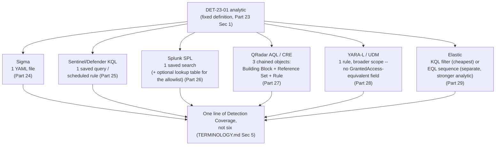

# Appendix A5 — Query Language Quick Reference

## Why this appendix exists

Parts 23–29 teach each query surface in depth — Sigma (Part 24), Sentinel/Defender KQL (Part 25),
Splunk SPL (Part 26), QRadar AQL (Part 27), YARA-L/Google SecOps (Part 28), and Elastic's three
surfaces, KQL/EQL/ES\|QL (Part 29) — anchored to one canonical analytic, **DET-23-01**, fixed at the
analytic layer in Part 23 §1: a process not on an approved allowlist opens a handle to `lsass.exe`
(the Local Security Authority Subsystem Service) with access rights sufficient for memory reading.
This appendix does not re-teach any of that. It is the page you land on mid-query to check how the
other seven surfaces spell the same primitive, or to see all eight implementations of DET-23-01
side by side instead of paging through six separate parts.

Every code fragment below is a **condensed pointer** back to its source part, not a replacement for
it — the full rule, its metadata, its Detection Test, and its Blind Spot/False Positive Trap
callouts live only in the part that owns the language. Where this appendix trims a query for table
width, it says so, and it never introduces a threshold, field name, or MITRE mapping the source part
didn't already establish.

> **Engineering Reality**
> Every syntax fragment in this appendix reflects the version and product behavior described in
> Parts 24–29 as of 2026-09-15. Query-language syntax, function libraries, and schema field names
> all change across vendor releases without notice to this book — verify a fragment against your
> own platform's current documentation before treating it as current, the same discipline Parts
> 24–29 each state individually for their own worked examples.

---

## 1. How to use this appendix

**[CONCEPT]** This section map orients the rest of the appendix:

- **§2** is a one-row-per-language identity table: platform, fence tag, owning part.
- **§3** covers single-event matching primitives (exact match, substring, negation, lists) side by
  side across all eight surfaces this book covers.
- **§4** covers aggregation, thresholds, and time windows.
- **§5** covers multi-event correlation — sequence, join, and stateful cross-event state — and where
  each platform actually deploys that logic as an artifact.
- **§6** is the fence-tag/disambiguation cheat sheet, condensed from STYLE-GUIDE.md §3 to the
  languages this appendix covers.
- **§7** is the worked example: DET-23-01, all eight implementations, side by side, with the actual
  detection ID each source part uses for it — which is not uniform across Parts 24–29, and this
  appendix says so directly rather than smoothing over the inconsistency.
- **§8** is a decision table: given an analytic's shape, which language fits it best and why.
- **§9** is a translation-loss quick table: the specific, named gap Parts 23 and 25–29 each
  documented for DET-23-01's own logic on their own backend.

---

## 2. Language identity at a glance

**[DETECTION ENGINEER]** This table maps a language's common name to the product it actually runs against,
the fence tag this book uses for it, and the part that teaches it — check here first if you're not
sure which part to go back to.

| Language | Runs against | Fence tag | Owning part | Portable or native |
|---|---|---|---|---|
| Sigma | Any backend with a pySigma pipeline (translation layer, not a runtime itself) | `yaml` | Part 24 | Portable authoring format |
| KQL (Sentinel/Defender) | Microsoft Sentinel (Log Analytics) and Microsoft Defender (Advanced Hunting) | `kql` | Part 25 | Native |
| Splunk SPL | Splunk Enterprise/Cloud | `spl` | Part 26 | Native |
| QRadar AQL | IBM QRadar (`events`/`flows` Ariel databases) | `sql` (see note below) | Part 27 | Native |
| YARA-L | Google SecOps (formerly Chronicle), against its Unified Data Model (UDM) | `yaral` | Part 28 | Native, schema-bound |
| Elastic KQL | Kibana search bar / Elastic Security "custom query" rules | `kql` | Part 29 §2 | Native |
| EQL | Elastic Security | `eql` | Part 29 §3 | Native |
| ES\|QL | Elastic Stack | `esql` | Part 29 §4 | Native |

STYLE-GUIDE.md §3 has no dedicated fence tag for AQL. Part 27's own code blocks use `` ```sql `` and
disambiguate AQL from standard SQL in the sentence immediately above each block — this appendix
follows that same precedent rather than inventing a new, unsupported tag no renderer highlights
correctly.

> **Engineering Reality**
> "KQL" names two unrelated languages that share a name and a large surface resemblance
> (`field:value`/`field == value`, `and`/`or`/`not`) but are maintained by different vendors with no
> cross-compatibility guarantee (Part 29 §2). Every table below that includes a KQL column means
> Sentinel/Defender KQL unless the row explicitly says Elastic KQL — check the row, not just the
> column header, before copying a fragment.

---

## 3. Core matching primitives, side by side

**[DETECTION ENGINEER]** The table below states, for each language, the syntax for the small set of
matching operations that make up the body of nearly every single-event detection — before any
aggregation or correlation logic gets added. An em dash means the language has no direct construct
for that row; the note explains what to reach for instead.

| Operation | Sigma | Sentinel/Defender KQL | Splunk SPL | QRadar AQL | YARA-L | Elastic KQL | EQL | ES\|QL |
|---|---|---|---|---|---|---|---|---|
| Exact field match | `field: value` | `field == "value"` | `field=value` | `"field" = 'value'` | `$e.field = "value"` | `field: "value"` | `field == "value"` | `WHERE field == "value"` |
| Substring/contains | `field\|contains: 'x'` | `field contains "x"` (or `has` for whole-term) | `field="*x*"` | `"field" ILIKE '%x%'` | `strings.contains($e.field, "x")` | `field: *x*` | `field : "*x*"` (fuzzy) | `WHERE field LIKE "*x*"` |
| Suffix match (`endswith`) | `field\|endswith: '\lsass.exe'` | `field endswith "\lsass.exe"` | `field="*\\lsass.exe"` | `"field" ILIKE '%lsass.exe'` | regex anchor: `field = /\\lsass\.exe$/` | `field: "*\\lsass.exe"` | `wildcard(field, "*\\lsass.exe")` | `WHERE field LIKE "*\\lsass.exe"` |
| Negation | `condition: selection and not filter` | `field != "value"` / `not(...)` | `NOT field=value` | `"field" != 'value'` | `not $e.field = "value"` | `not field: "value"` | `not field == "value"` | `WHERE NOT field == "value"` |
| List, OR semantics | List under one field is OR **by default** | `field in ("a","b")` | `field IN ("a","b")` | `field IN ('a','b')` | repeated `or`-joined conditions | `(field: "a" or field: "b")` | `field in ("a","b")` | `WHERE field IN ("a","b")` |
| List, AND semantics | `field\|contains\|all: [...]` (the `all` modifier — easy to omit by mistake, see Part 24 §2.3) | Chain with `and` | Multiple search terms, ANDed by default | Chain with `AND` | Multiple `$e.field = ...` lines, joined `and` | `(field: "a" and field: "b")` | `field == "a" and field2 == "b"` | `WHERE field == "a" AND field2 == "b"` |
| Case sensitivity default | Backend-pipeline-dependent — not fixed by Sigma itself | Case-sensitive; `=~` for case-insensitive | Case-insensitive for `search`; case-sensitive for some indexed-field comparisons | `LIKE` case-sensitive, `ILIKE` case-insensitive | Case-sensitive; `nocase` modifier on a string/regex match | Case-insensitive | Case-sensitive; `:` operator is case-insensitive fuzzy match | Case-sensitive; wrap in a case-normalizing function for insensitive compare |
| Field existence check | `field\|exists: true` (Sigma Specification v2 modifier; not every pySigma backend pipeline implements it yet — verify before relying on it) | `isnotempty(field)` | `field=*` | — (verify your schema's null representation directly) | `$e.field != ""` | `field:*` | `field != null` | `WHERE field IS NOT NULL` |

> **False Positive Trap**
> A substring/`contains`-style match is the single most common false-positive driver across every
> language in this table, not just one of them — `contains "svc"` matches `svchost.exe` and
> `mysvcbackup.exe` identically (Part 25 §2), and the equivalent Elastic KQL wildcard or Splunk
> glob has the same defect. Prefer an exact match or `endswith` against the specific expected path
> whenever the field's actual shape allows it, and reserve substring matching for fields — a full
> command line, a URL path — where the substring genuinely can appear anywhere.

---

## 4. Aggregation, thresholds, and time windows

**[DETECTION ENGINEER]** Every count-based or threshold-style detection reduces to the operations
below — "more than N of X, from the same Y, within a window." EQL has no aggregation stage of its
own; a detection needing one reaches for ES\|QL instead (Part 29 §6).

| Concept | Sigma | Sentinel/Defender KQL | Splunk SPL | QRadar AQL | YARA-L | ES\|QL |
|---|---|---|---|---|---|---|
| Count per group | Correlation rule, `type: event_count` | `summarize count() by <field>` | `stats count by <field>` | `SELECT COUNT(*) ... GROUP BY` | `condition: #e >= N` (count of matched `events` variable) | `STATS count() BY <field>` |
| Distinct count | — (not a native Sigma correlation type) | `summarize dcount(field) by ...` | `stats dc(field) by ...` | `UNIQUECOUNT()` | `count_distinct($e.field)` in `outcome` | `STATS count_distinct(field) BY ...` |
| Time bucket/window | `timespan: 5m` (correlation `timespan`) | `bin(TimeColumn, 5m)` inside `summarize` | `bucket`, or `earliest()`/`latest()` and an `eval` window check | `LAST 24 HOURS` / explicit `START`/`STOP` range | `match: $key over 24h` | `DATE_DIFF`/bucketing `EVAL`, or `WHERE` against a computed span |
| Post-aggregation threshold | Correlation `condition: {gte: 3}` | `\| where Count >= 3` after `summarize` | `\| where failed_attempts >= 3` after `stats` | `HAVING`-equivalent filter on the aggregated query, or a CRE "X events in Y minutes" Rule Test | `condition: #e >= 3` | `\| WHERE count >= 3` after `STATS` |
| Wide, unbucketed lookback (hunting) | Not this format's purpose — see Part 34 for hunt methodology | `summarize ... by` over a wide `ago()` range, no `bin()` | `stats ... by` over a wide `index` time range, no window `eval` | `LAST 30 DAYS` or wider, no `GROUP BY` time bucket | `match ... over` a wide window, per §5.2's caveat on per-rule window ceilings | `STATS ... BY` over the full retained index, no time bucketing — Part 29 §5's `HUNT-29-01` pattern |

> **Engineering Reality**
> Sigma's own correlation-rule types (`event_count`, `value_count`, `temporal`, `temporal_ordered`)
> are a newer, still-evolving part of the specification, and not every pySigma backend implements
> every type at the same maturity (Part 24 §4). Where a Sigma correlation rule's target backend has
> partial support, the native aggregation column for that backend — KQL's `summarize`/`bin()` or
> SPL's `stats`/`earliest()`/`latest()` — is frequently the more reliable path, not a fallback of
> last resort.

---

## 5. Multi-event correlation and where it actually lives

**[ENGINEERING]** Counting is one thing; expressing "event A, then event B, on the same entity,
within a window" is another, and the seven surfaces in this book do not treat that job as
symmetric. For each platform, the table below gives both the syntax and — the more consequential
fact for a detection engineer designing around it — whether the resulting logic is one deployed
artifact or several.

| Platform | Ordered sequence syntax | Unordered co-occurrence | Deployed as | Notes |
|---|---|---|---|---|
| Sigma | `type: temporal_ordered` correlation (narrow backend support) | `type: temporal` | One YAML file (base rule) plus one YAML file (correlation rule) | Two files, one deployment unit conceptually — Part 24 §4 |
| Sentinel/Defender KQL | `join` with a `between` time-range filter (no dedicated sequence operator) | `join kind=inner`/`leftsemi` on a shared key | One saved KQL query / one scheduled analytics rule | The query itself is the whole detection — Part 25 §4 |
| Splunk SPL | `transaction` with `startswith`/`endswith`/`maxspan`/`maxpause` | `stats` grouped by a shared key, no ordering enforced | One saved search (plus a `lookup` table if an allowlist is involved) | `transaction` holds open candidates in memory until closed — costly at high cardinality, Part 26 §3.2 |
| QRadar AQL / CRE | Not expressible as one AQL statement — see Notes | Not expressible as one AQL statement — see Notes | **Three chained objects:** a Building Block (`BB:`), a Reference Set, and a Rule | No single AQL query is the deployed detection at all — Part 27 §2–§3 |
| YARA-L | `match`/`condition` across `events` variables sharing a join key, within the `match` window | Same mechanism — YARA-L does not distinguish ordered from unordered multi-event logic the way EQL does | One rule file, single- or multi-event | Window ceiling per rule is a product-configuration detail, not a language limit — Part 28 §5.1 |
| Elastic EQL | `sequence by <key> with maxspan=<duration> [stage1] [stage2] ...` | `sample by <key> [stage1] [stage2] ...` | One saved EQL detection rule | `until` terminates a sequence early on an intervening event — Part 29 §3 |
| Elastic ES\|QL | No native sequence operator; approximate via `STATS`/`ENRICH` and self-joins | `STATS ... BY` grouping, no ordering | One saved ES\|QL query/rule | Aggregation-first language; not the tool for genuine ordering — Part 29 §4/§6 |

**[DETECTION ENGINEER]** QRadar's row is the one worth reading twice if you're coming from any of
the other six. A KQL `join`, an SPL `transaction`, an EQL `sequence`, or a Sigma correlation rule
are each, in their own language, still a single authored artifact that both matches the pattern and
is the deployed detection. QRadar decomposes the same logical statement into a Building Block (the
match condition), a Reference Set (the piece of state carried from one event to a later one, doing
the job a time-windowed join does elsewhere), and a Rule (the object that actually chains the two
and produces an Offense) — three separately versioned, separately permissioned objects, none of
which is individually the detection. Designing a QRadar-bound correlation analytic as if it will
collapse into one AQL statement, the way it would in KQL or SPL, is the single most common
mis-estimation an engineer moving between these platforms makes.

> **Blind Spot**
> A QRadar two-stage Reference Set chain (Part 27 §2.3) only closes the loop if the first-stage
> Rule actually fires and writes to the Reference Set. If an attacker's first-stage activity evades
> the specific Building Block written to detect it, the Reference Set entry is never created, and
> the second-stage Rule — which depends on that membership check — silently never fires either.
> This is a structural consequence of splitting correlation state across separately-evaluated
> objects, not a QRadar implementation bug, and it has no equivalent failure mode in a single-query
> KQL/SPL/EQL correlation, where both stages are evaluated by the same query at the same time.

---

## 6. Fence-tag and disambiguation cheat sheet

**[DETECTION ENGINEER]** Condensed from STYLE-GUIDE.md §3 to the languages this appendix covers — see that section for the
full code-block convention list, including non-query languages.

| Language shown | Fence tag | Disambiguate in the sentence above the block when... |
|---|---|---|
| Sigma | `yaml` | Never write `sigma` as the tag — no renderer highlights it. |
| Sentinel/Defender KQL | `kql` | The block is Sentinel/Defender KQL, not Elastic KQL — always say which platform. |
| Splunk SPL | `spl` | — |
| QRadar AQL | `sql` | The block is AQL, not standard SQL — say so; AQL has its own function set and no general-purpose `JOIN`. |
| YARA-L | `yaral` | If your renderer's lexer lacks `yaral` support, fall back to `yaml` only if the block is YAML-shaped; otherwise use `text`. |
| Elastic KQL | `kql` | The block is Elastic KQL, not Sentinel/Defender KQL — always say which platform. |
| EQL | `eql` | Never merge with `kql`. |
| ES\|QL | `esql` | — |

---

## 7. Worked example: DET-23-01 across every surface

**[DETECTION ENGINEER]** DET-23-01, fixed in Part 23 §1: a source process not on an approved
allowlist opens a handle to a target process image named `lsass.exe`, requesting an access-rights
combination that includes memory-read capability.

**MITRE:** T1003.001 (OS Credential Dumping: LSASS Memory).

Every fragment below is condensed for table-width and comparison purposes from the tested or
illustrative version in its own source part — **read the source part before deploying any of
these**; each one carries a Blind Spot and/or False Positive Trap this appendix does not repeat in
full (§9 gives the one-line version of each).

One inconsistency worth flagging before the comparison itself: **the detection ID Parts 24–29 use
for their own re-implementation of DET-23-01 is not uniform.** Parts 25, 26, 27, and 29 assign a
part-prefixed ID (DET-25-01, DET-26-01, DET-27-01, DET-29-01). Parts 24 and 28 keep the label
**DET-23-01** itself on their own re-implementation, and instead use a part-prefixed ID
(DET-24-01, DET-28-01) for a *different*, original detection each of those parts builds separately.
If you are building a coverage matrix (Appendix A4) from detection IDs alone, do not assume
"DET-23-01" appears in only one place — check the analytic each ID actually implements, not just
the number.

### 7.1 Sigma (Part 24 §3) — DET-23-01

**[DETECTION ENGINEER]** Targets Sysmon Event ID 10 (ProcessAccess) telemetry; `status: test`, a real reviewed rule, not a
conceptual sketch.

```yaml
title: Suspicious process access to LSASS memory
logsource:
  product: windows
  category: process_access
detection:
  selection:
    TargetImage|endswith: '\lsass.exe'
    GrantedAccess:
      - '0x1010'
      - '0x1410'
      - '0x1438'
      - '0x143a'
      - '0x1fffff'
  filter_known_tools:
    SourceImage|endswith:
      - '\wmiprvse.exe'
      - '\svchost.exe'
      - '\MsMpEng.exe'
  condition: selection and not filter_known_tools
level: high
```

Condensed from the full metadata-complete rule in Part 24 §3; the `GrantedAccess` value list is
illustrative of the general shape, not a verified-exhaustive set — validate against your own
environment before deployment (Part 24 §3, Part 9 §3.6).

### 7.2 Sentinel/Defender KQL (Part 25 §7) — DET-25-01

**[DETECTION ENGINEER]** Runs against a Microsoft Defender for Endpoint Advanced Hunting workspace — a genuinely different native
telemetry source than Sysmon, not a field-for-field retyping of the Sigma rule.

```kql
DeviceEvents
| where Timestamp > ago(1h)
| where ActionType == "OpenProcessApiCall"
| where FileName =~ "lsass.exe"
| where InitiatingProcessFileName !in~ ("wmiprvse.exe", "svchost.exe", "MsMpEng.exe")
| project Timestamp, DeviceName, InitiatingProcessFileName, FileName
```

`ActionType` values and the nesting of `GrantedAccess` inside `AdditionalFields` are part of a
schema Microsoft revises over time — verify both against the live Advanced Hunting schema
reference before trusting this as a scheduled rule (Part 25 §7.2).

### 7.3 Splunk SPL (Part 26 §5) — DET-26-01

**[DETECTION ENGINEER]** Also built on Sysmon Event ID 10, this time ingested into Splunk; depends on a maintained allowlist lookup table
rather than an inline exclusion list.

```spl
index=windows sourcetype="XmlWinEventLog:Microsoft-Windows-Sysmon/Operational" EventCode=10 TargetImage="*\\lsass.exe"
| search GrantedAccess IN ("0x1010", "0x1410", "0x1438", "0x143a", "0x1fffff")
| lookup lsass_access_allowlist.csv SourceImage OUTPUT is_allowlisted
| where isnull(is_allowlisted)
| stats count, values(GrantedAccess) as granted_access_values by ComputerName, SourceImage, TargetImage
```

Assumes `lsass_access_allowlist.csv` is a maintained lookup, not a live subsearch against a
fast-changing source — a subsearch here would carry the same silent-truncation risk Part 26 §4.2's
Detection Autopsy documents for a different exclusion list (Part 26 §5.2).

### 7.4 QRadar AQL / CRE (Part 27 §3) — DET-27-01

**[DETECTION ENGINEER]** Not one query. DET-27-01 is deployed as three chained QRadar objects (§5 above); the AQL below
is the investigative search used to validate the pattern before building the standing Rule, not the
deployed detection itself.

```sql
-- Investigative form only; custom property names are illustrative and depend on your
-- Sysmon DSM's field extraction (Part 27 §3.1).
SELECT starttime, sourceip, username,
       "Source Process Name", "Target Process Name", "Granted Access"
FROM events
WHERE QIDNAME(qid) = 'Process accessed'
  AND "Target Process Name" ILIKE '%lsass.exe%'
  AND ("Granted Access" = '0x1010' OR "Granted Access" = '0x1410')
LAST 24 HOURS
```

The deployed detection adds: Building Block `BB:LSASS-Access-Candidate` (the condition above,
as a Rule Test), Reference Set `RS-Allowlisted-LSASS-Tools` (the allowlist, checked by a second
Rule Test), and Rule `R: Suspicious LSASS Access — Unapproved Process` (chains both, creates the
Offense) — see Part 27 §3.3 for why no single AQL statement replaces this.

### 7.5 YARA-L / Google SecOps (Part 28 §4) — labeled DET-23-01 in its own text

**[DETECTION ENGINEER]** Built against UDM `PROCESS_OPEN` events; broader in scope than the Sysmon-native version below, because
no UDM field this book can confirm is a `GrantedAccess` equivalent.

```yaral
rule det_23_01_suspicious_lsass_access {
  events:
    $access.metadata.event_type = "PROCESS_OPEN"
    $access.target.process.file.full_path = /\\lsass\.exe$/ nocase
    $access.principal.process.file.full_path = $source_path
    not $source_path = /\\(wmiprvse|svchost|MsMpEng)\.exe$/ nocase

  condition:
    $access

  outcome:
    $risk_score = 65
}
```

This rule fires on any qualifying `PROCESS_OPEN` against `lsass.exe`, not only opens requesting
memory-read-capable access rights, and carries a correspondingly higher false-positive rate than
the Sysmon-native forms above until a parser-specific access-rights field is confirmed and the rule
is narrowed (Part 28 §1.1, §4).

### 7.6 Elastic KQL (Part 29 §2) — the cheapest correct implementation, part of DET-29-01

**[DETECTION ENGINEER]** Targets a Sysmon-sourced index via an Elastic Agent integration or the Winlogbeat Sysmon module.

```kql
event.code: "10" and winlog.event_data.TargetImage: "*\\lsass.exe" and
  not process.executable: ("*\\MsMpEng.exe" or "*\\WerFault.exe" or "*\\Taskmgr.exe")
```

`winlog.event_data.*` field names and availability depend on the specific integration version —
drift across integration upgrades with no ingest error (Part 29 §2).

### 7.7 Elastic EQL (Part 29 §3) — single-event form, part of DET-29-01

**[DETECTION ENGINEER]** The plain (non-sequence) form is functionally the same match as §7.6 and adds nothing for this
specific analytic; EQL earns its keep only once a sequence stage is added (a related, separate
analytic — Part 29 §3/§5, not a second implementation of DET-23-01 itself).

```eql
process where event.code == "10" and winlog.event_data.TargetImage : "*\\lsass.exe" and
  not process.executable in ("*\\MsMpEng.exe", "*\\WerFault.exe", "*\\Taskmgr.exe")
```

### 7.8 Elastic ES\|QL (Part 29 §4) — single-event form, part of DET-29-01

**[DETECTION ENGINEER]** As a single-event filter, no more expressive than §7.6/§7.7 above; ES\|QL's actual value for this
analytic family is the wide-lookback aggregation hunt in Part 29 §5, not this filter.

```esql
FROM logs-sysmon-*
| WHERE event.code == "10" AND winlog.event_data.TargetImage LIKE "*\\lsass.exe"
| WHERE NOT process.executable IN ("*\\MsMpEng.exe", "*\\WerFault.exe", "*\\Taskmgr.exe")
```

> **Blind Spot**
> Every exclusion list in §7.1–§7.8 filters by process-image name alone — `SourceImage|endswith`,
> `InitiatingProcessFileName`, `process.executable`, or a lookup keyed on the same field — with no
> path anchor to `\Windows\System32\` and no code-signing check. An attacker who renames a
> credential-dumping binary to `svchost.exe`, `MsMpEng.exe`, or `wmiprvse.exe` — T1036.005 (Match
> Legitimate Name or Location) — and runs it from any path is excluded by every
> implementation shown, identically. The Elastic forms (§7.6–§7.8) compound this: Task Manager's
> "Create dump file" action against `lsass.exe` is actually carried out by a spawned `WerFault.exe`
> process, not by `Taskmgr.exe` itself, so excluding `WerFault.exe` to suppress legitimate
> crash-dump noise also suppresses this specific, no-custom-tooling credential-theft technique.
> None of the exclusion lists in this appendix are safe without a path/signature check or a
> compensating detection on `WerFault.exe`'s command-line arguments.

> **False Positive Trap**
> §7.2 and §7.6–§7.8 match on event type and target image alone — none of them filter on
> `GrantedAccess` (or its Defender/Elastic equivalent), the field that separates a memory-reading
> open from a routine `PROCESS_QUERY_LIMITED_INFORMATION` enumeration. Antivirus, EDR agents, and
> Task Manager's own process listing open handles to `lsass.exe` at that lower access level
> constantly, so these four fragments — unlike §7.1, §7.3, and §7.4, which all filter on a specific
> `GrantedAccess` value list — will alert on that routine handle-opening traffic if deployed as
> shown. Add the equivalent access-rights condition (nested in `AdditionalFields` for
> Sentinel/Defender per Part 25 §7.2, or the corresponding field once confirmed against your
> Elastic integration's schema) before treating any of these four as more than a starting point.






**Figure A5.1 — DET-23-01's deployed artifact shape per backend (FIG-A5-01).** *CONCEPTUAL.*
Rendered image: `assets/diagrams/fig-a5-01-deployed-artifact-shape-per-backend.svg` (Mermaid source
above is the editable version of record). Illustrates that one fixed analytic produces a single
deployed artifact on five of the six native backends but three chained objects on QRadar, and that
all six re-implementations still roll up to one line of Detection Coverage — a coverage matrix
(Appendix A4) should count analytics, not artifacts or detection IDs. This is a structural summary
of Parts 23–29's own content, not a capture from any live platform.

---

## 8. Decision table: analytic shape to language fit

**[DETECTION ENGINEER]** This table generalizes the per-language guidance scattered across
Parts 24–29 (most directly, Part 29 §6's own version of this table for Elastic's three surfaces
alone) into one cross-platform reference. Match the analytic's actual shape to the row, not to
whichever language you already know best.

| Analytic shape | Reach for | Why, one clause |
|---|---|---|
| Single-event boolean match, no correlation | Sigma (if multi-backend); otherwise the target platform's native filter (KQL, Elastic KQL, an AQL ad hoc search, a single-event YARA-L rule) | Cheapest to write, read, and maintain — adding correlation machinery here buys nothing |
| Ordered, entity-joined sequence of related events within a bounded window | EQL `sequence`, SPL `transaction`, Sigma `temporal_ordered` (narrow backend support) | Native ordering/joining constructs beat hand-built time-window logic |
| Unordered co-occurrence sharing a join key, order doesn't matter | EQL `sample`, SPL `stats` by shared key, Sigma `temporal` | Purpose-built for "these things happened together" without sequence overhead |
| Threshold/rate logic ("N or more of X, same Y, within a window") | KQL `summarize`+`bin()`, SPL `stats`+`earliest()`/`latest()`, ES\|QL `STATS`, YARA-L `match ... over <window>` | Native aggregation with an explicit window is more auditable than an assumed scheduling interval (Part 24 §4.1, Part 25 §6) |
| Stateful correlation across two events with no shared timestamp window at all | QRadar Reference Set pattern; elsewhere, a maintained lookup/enrichment table joined at query time | The state has to persist between evaluations, not just within one query's time range (Part 27 §2.2) |
| Wide-lookback hunting with no fixed threshold | ES\|QL `STATS ... BY` unbucketed, SPL `stats` over a wide index range, KQL `summarize` over a wide `ago()` | The whole point is *not* bucketing by a short window — see Part 29 §5's `HUNT-29-01` |
| Ad hoc field parsing from an unparsed message string | ES\|QL `DISSECT`/`GROK`, SPL `rex` | Inline parsing stage; neither Sigma nor a pure filter language has an equivalent |

**[THREAT HUNTER]** The wide-lookback row above is the one most often skipped by an engineer
reaching for whatever language they already know instead of the one the hypothesis needs. A
threat hypothesis stated as "this repeats, slowly, over days" (Part 12's `HUNT-12-01`, Part 29's
`HUNT-29-01`) fails against any language's default short-window aggregation regardless of how well
that language is written — the fix is a wider lookback and a narrower group-by key, not a
different language.

---

## 9. Translation-loss quick reference

**[ENGINEERING]** Each row below gives the one-line version of the specific, named gap each backend's
own worked part documented for DET-23-01's logic — Part 23 §3 named the general categories
(correlation-semantics loss, field-mapping gaps, value/format normalization, backend feature
ceiling); what follows is the concrete instance of one or more of those categories, per backend.

| Backend | Documented gap for this specific analytic | Full treatment |
|---|---|---|
| Sysmon/Sigma reference form | Handle-duplication evasion — a caller can access `lsass.exe` via a handle another legitimate process already holds open, generating no new access event at all | Part 23 §1 Blind Spot |
| Sentinel/Defender KQL | `OpenProcessApiCall` is emitted from a user-mode API hook; direct/unhooked syscalls bypass it entirely | Part 25 §7.2 Blind Spot |
| Splunk SPL | Search-time field extraction breaks silently on a TA/schema change — the search still runs, returns zero matches, indistinguishable from "clean" | Part 26 §1.2 Detection Autopsy |
| QRadar AQL/CRE | Unmapped or partially-mapped Sysmon events land under a generic QID with none of `TargetImage`/`SourceImage`/`GrantedAccess` available — query runs clean, matches nothing | Part 27 §3.1 |
| YARA-L/UDM | No confirmed UDM field equivalent to Sysmon's `GrantedAccess` — the rule is structurally broader than the Sysmon-native version, not a narrower re-expression of it | Part 28 §1.1 Blind Spot |
| Elastic EQL (sequence variant) | `maxspan` is a bounded window — a dump-then-exfiltrate pattern spanning longer than the configured span produces no sequence match at all | Part 29 §3 Blind Spot |

> **What Would Change My Mind**
> This appendix treats each row above as a durable, named limitation worth checking before trusting
> any backend's version of DET-23-01 as complete. If a future revision of Parts 24–29 reported that
> a specific backend closed its gap — a confirmed UDM `GrantedAccess`-equivalent field for YARA-L,
> for instance, or syscall-level visibility added to the Defender sensor — this table's row for
> that backend should be corrected to say so, not left stale; a translation-loss table that never
> changes is itself a form of Documentation Debt (TERMINOLOGY.md § Detection Debt).

---

## Summary

This appendix carries no analytic authority of its own — DET-23-01's definition belongs to Part 23
§1, and every fragment, gap, and detection ID above is condensed from Parts 24–29 or from
STYLE-GUIDE.md §3. Any disagreement between a row in this appendix and the source part it's drawn
from should be resolved in the source part's favor and reported as a documentation-debt item
against this file. Its only job is to be the page you land on when you remember the primitive but
not which of the eight languages spells it which way.

**Cross-references:** Part 23 (Query Language Strategy), Part 24 (Sigma), Part 25 (KQL —
Sentinel/Defender), Part 26 (Splunk SPL), Part 27 (QRadar AQL), Part 28 (YARA-L / Google SecOps),
Part 29 (Elastic EQL/KQL/ES\|QL), Part 22 (Detection-as-Code), STYLE-GUIDE.md §3 (Code Block
Conventions), TERMINOLOGY.md (Analytic, Detection Rule, Detection Coverage), Appendix A4 (MITRE
ATT&CK Mapping Quick Reference).
