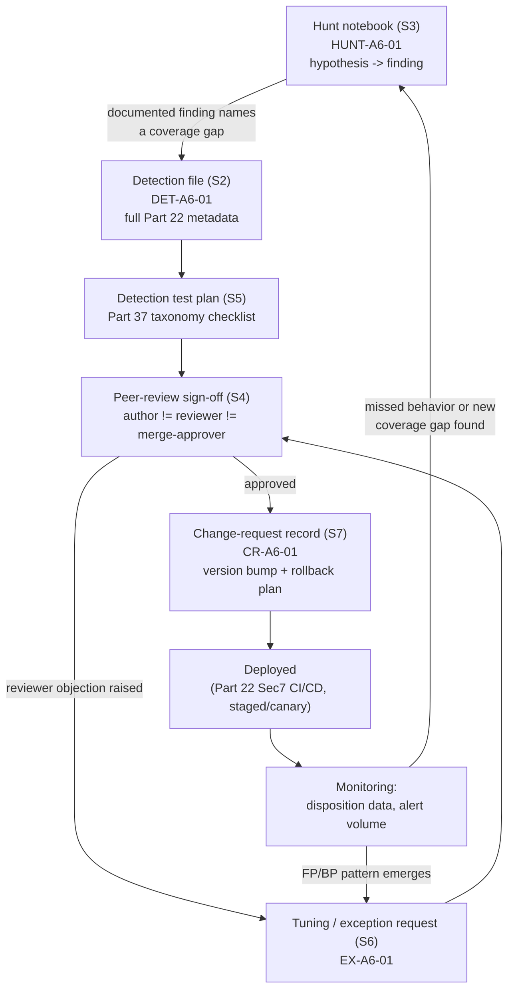

# Appendix A6 — Templates: Detection, Hunt, Review, Testing, Tuning & Change Request

## Why this appendix exists

Parts 22, 34, and 37–38 each teach the reasoning behind a document: why a Detection Rule needs a fixed metadata standard (Part 22 §4), why a Hunt needs to end in a documented artifact (Part 34 §1), why a test plan needs to cover more than "does it fire" (Part 37), and why a tuning or exception change needs its own accountable record (Part 38, TERMINOLOGY.md § Tuning, § Exception). None of those parts is the page you open at 4 PM on a Friday to actually fill in a new rule's fields before a pull request. This appendix is that page — six fillable templates, each paired with one fully worked, real-evidence example, and nothing else. It introduces no new analytic logic, no new thresholds, and no new MITRE mappings beyond what the source parts already establish or what the underlying lab evidence's own correlation output already carries.

Where this appendix's worked examples need a permanent ID of their own — because the source parts' worked examples (DET-22-01, HUNT-34-01, DET-37-01) belong to those parts, not this one — new IDs here carry the `A6` prefix (`DET-A6-01`, `HUNT-A6-01`, `EX-A6-01`, `CR-A6-01`), tracked the same way every other detection/hunt ID in the book is tracked, per `BOOK-INDEX.md`'s production model.

---

## 1. How to use this appendix

- **§2** — the detection file template, using the exact metadata standard Part 22 §4 defines.
- **§3** — the hunt notebook template, using the field set this appendix's authoring brief specifies and the methodology Part 34 defines.
- **§4** — the peer-review sign-off template, operationalizing the author/reviewer/merge-approver separation of duties from Part 22 §3.
- **§5** — the detection test plan template, structured against Part 37's test-case taxonomy.
- **§6** — the tuning/exception request template, distinguishing Tuning from Suppression from Exception per TERMINOLOGY.md §4.
- **§7** — the change-request record template, carrying Part 22 §8's versioning model into a single reviewable record.
- **§8** — one diagram showing how a single detection's lifecycle actually moves through all six templates in order.

Every worked example below reuses real, scrubbed evidence from `lab/evidence/` rather than inventing log lines — where the underlying finding is genuinely uncertain (attribution, coverage completeness), the template says so explicitly instead of rounding up to a confident-sounding claim.

> **Engineering Reality**
> A filled-in template is a record of what a human claimed at authoring time — it enforces nothing by itself. The separation of duties in §4 only becomes real when a git platform's branch protection settings block the merge button on a missing distinct approval (Part 22 §3); a test plan in §5 only becomes real when its checks run in CI and fail the build (Part 22 §5–§6). Treat every template in this appendix as the paperwork a pipeline should be checking, not a substitute for the pipeline.

---

## 2. Detection file template

**[DETECTION ENGINEER]** The field list, owner, and timing columns below are reproduced from Part 22 §4 exactly — this appendix does not redefine any field, it packages the same standard as a fillable form. See Part 22 §4 for the rationale behind each field; see Part 22 §8 for the `Version` bump rules referenced in the `Version` row.

### 2.1 Field template

| Field | Fill in with |
|---|---|
| `ID` | `DET-####` — assigned from the inventory ledger, never reused |
| `Name` | Short human-readable label |
| `Version` | Semantic version — MAJOR.MINOR.PATCH per Part 22 §8 |
| `Status` | `draft` \| `reviewed` \| `tested` \| `released` \| `deprecated` |
| `Threat Hypothesis` | Falsifiable behavioral claim (TERMINOLOGY.md § Threat Hypothesis) — not a topic |
| `Description` | Plain-language statement of what the rule does |
| `Risk` | Severity if a true positive — independent of confidence |
| `ATT&CK` | Full technique ID + name, STYLE-GUIDE.md §5 format — never invented |
| `Data Sources` | Named log source(s) the rule reads |
| `Required Telemetry` | Specific event types/fields that must actually be flowing |
| `Required Fields` | Literal field names the query depends on |
| `Logic` | Plain-language matching condition |
| `Time Window` | The Correlation Window, stated as a number — not "recent" |
| `Entity` | What's tracked/keyed on (TERMINOLOGY.md § Entity) |
| `Threshold` | Numeric trigger condition |
| `Normal Behaviour` | What legitimate activity looks like on the same fields |
| `Suspicious Behaviour` | What distinguishes the targeted activity |
| `Known FP` | Named legitimate sources that trigger this rule |
| `Known FN` | Named ways the behavior can evade this rule |
| `Blind Spots` | What this rule structurally cannot see |
| `Dependencies` | Other rules/enrichment/pipeline steps this rule assumes exist |
| `Example Query` | The actual implementation |
| `Correlation Opportunities` | Other signals this rule's output could join with |
| `Testing Method` | How this rule is validated — see §5 below and Part 37 |
| `Expected Volume` | A concrete number/range, not "low" or "high" |
| `Tuning Guidance` | What to adjust, and what not to, on FP/FN patterns — see §6 below |
| `Threat Hunt Variation` | How a hunter would explore this manually — see §3 below |
| `Escalation Context` | What an analyst checks first, and who to escalate to |
| `Owner` | Accountable individual or team |
| `Last Tested` | Date of most recent validation |
| `References` | Source material, cited per REFERENCES.md conventions |

### 2.2 Worked example: DET-A6-01

**[DETECTION ENGINEER]** This example is the direct output of the hunt in §3.2 below — a coverage gap a hunter found by hand, converted into a candidate detection per the Part 36 hunt-to-detection pipeline. It is deliberately left at `Status: draft` with `Last Tested: (none)`, because that is its honest current state — this appendix does not manufacture a passed test history for its own worked example.

```yaml
# CONCEPTUAL SAMPLE -- illustrative metadata and query record; the query has not been
# run against a live backend. Table/column names follow the real honeynet correlation
# schema described in lab/evidence/ct103-honeynet-correlated-attack-sessions.txt's own
# capture-command header; confirm current schema before deploying unmodified.

ID: DET-A6-01
Name: Coordinated multi-target scanning from a shared /24 against the honeynet decoy estate
Version: 1.0.0
Status: draft
Threat Hypothesis: >
  Three or more distinct source IPs from the same /24 CIDR block, each independently
  reaching exploit_attempt status or higher against two or more distinct honeynet decoy
  targets within a bounded window, represent one coordinated scanning campaign that the
  honeynet's existing per-source-IP session correlation does not group as a single event
  — and this is not fully explained by unrelated actors coincidentally sharing hosting
  infrastructure.
Description: >
  Fires when the honeynet's attack_sessions table shows three or more distinct source_ip
  values sharing the same /24 prefix, each with status exploit_attempt or higher, against
  two or more distinct target_system values, with first_seen timestamps within a 6-hour
  rolling window.
Risk: Medium — this rule targets a correlation gap, not a confirmed intrusion technique;
  a true positive here means "a coordinated block is probing multiple decoys," not
  "a decoy was compromised."
ATT&CK: "T1595 (Active Scanning), T1046 (Network Service Discovery), T1190 (Exploit Public-Facing Application)"
Data Sources:
  - Honeynet correlation backend, attack_sessions table (CT103 hp-platform), itself
    derived from raw ssh_events/http_events/network_events by correlation.py
Required Telemetry: >
  attack_sessions rows with source_ip, target_system, status, first_seen, and last_seen
  populated for every session — see lab/evidence/ct103-honeynet-correlated-attack-sessions.txt
  for the real field layout this depends on.
Required Fields:
  - source_ip
  - target_system
  - status
  - first_seen
  - last_seen
Logic: >
  Group attack_sessions rows by the /24 prefix of source_ip within a 6-hour rolling
  window; alert if the group contains at least 3 distinct source_ip values, at least 2
  distinct target_system values, and at least one row per contributing IP at status
  exploit_attempt or higher.
Time Window: 6-hour rolling window, chosen to cover the ~4-hour spread observed in the
  HUNT-A6-01 finding below with margin; not yet validated against a larger sample.
Entity: Source /24 CIDR block (derived from source_ip) — see the What Would Change My
  Mind box in §3.2 for why this specific grouping choice is a stated, checkable assumption
  rather than a settled design.
Threshold: >= 3 distinct source IPs, >= 2 distinct target_system values, same /24, 6-hour window.
Normal Behaviour: >
  Per the captured sample, most source IPs appear against exactly one target_system —
  isolated, single-target opportunistic probes are the baseline this rule is trying not
  to fire on.
Suspicious Behaviour: >
  Multiple distinct IPs from one /24 spreading across multiple decoy targets in a short
  window — the pattern found by hand in HUNT-A6-01 (§3.2) from three IPs in 198.235.24.0/24
  hitting three different decoys within roughly 4 hours.
Known FP: >
  Shared hosting, cloud, and CDN ranges routinely host multiple, unrelated scanning
  actors (commercial internet-wide scanners, unrelated opportunistic bots) that share a
  /24 by coincidence of provider allocation, not by coordination. This rule has no way to
  distinguish "one coordinated actor" from "three unrelated tenants of the same subnet"
  from session data alone.
Known FN: >
  A single actor rotating source IPs across multiple, unrelated /24 blocks (a residential
  proxy network or multi-region cloud infrastructure) produces no matching group under
  this rule's CIDR-based grouping, despite being the more sophisticated version of exactly
  the behavior this rule targets. Two cheaper evasions need no infrastructure change at
  all: (1) pacing per-IP probes more than 6 hours apart from the same /24 — the rolling
  window only ever sees a subset of the campaign at query time, so the group never
  simultaneously holds 3 distinct source IPs even though all of them eventually
  contributed; (2) limiting a campaign to exactly 2 source IPs from the same /24 against
  2+ distinct targets, one IP short of the >= 3 threshold. No row combination in the
  captured sample happens to show that exact 2-IP/2-target shape, but three separate /24
  blocks already in the sample — the `65.49.1.x`, `45.156.128.x`, and `199.45.154.x` pairs
  in `lab/evidence/ct103-honeynet-correlated-attack-sessions.txt` — show 2 distinct IPs
  sharing a /24 as an ordinary, uncoordinated occurrence; each pair happens to hit only one
  shared target in this sample, which is exactly why the `distinct_targets >= 2` gate
  already excludes them. Add one more probe against a second target to any such pair and
  it becomes indistinguishable from this same background pattern while still evading the
  source-count floor entirely — the sample shows the raw material for the evasion, not the
  evasion itself.
Blind Spots: >
  This rule only sees what the existing attack_sessions correlation already promoted to
  exploit_attempt or higher; a coordinated reconnaissance-only campaign that never crosses
  that status threshold is invisible to this rule even if the /24-grouping pattern is
  present. The /24-derivation logic itself only parses dotted-decimal IPv4 — see the
  Example Query below — so any source_ip captured as IPv6 or in any other non-dotted-decimal
  form does not raise an error; it produces a meaningless or empty prefix from the
  instr()/substr() chain and either silently drops out of every group or gets silently
  merged into whichever other row happens to compute the same malformed prefix. Confirm
  whether the honeynet's decoys accept IPv6 connections at all before trusting this rule's
  silence on IPv6-sourced campaigns.
Dependencies: >
  Requires attack_sessions to already be populated and correctly statused by
  correlation.py; this rule adds a second grouping pass on top of that table, not a
  replacement for it.
Example Query: See fenced SQL block below.
Correlation Opportunities: >
  Join the matched /24 against a threat-intel reputation/ASN-context source (Part 32) to
  separate "known hosting provider, low actor-coordination confidence" from "known bad
  infrastructure block" before this fires as anything more than an enrichment note.
Testing Method: >
  Not yet built. The only evidence behind this rule so far is the single naturally
  occurring finding in HUNT-A6-01 below, which itself lacks confirmed attribution — see
  §5.2 for what a real test plan for this rule still needs before it can move past
  Status: draft.
Expected Volume: >
  Unknown — no fixture corpus and no production run yet. Do not deploy with an assumed
  volume; build the true-positive/false-positive fixtures in §5.2 first.
Tuning Guidance: >
  If shared-hosting/CDN /24 blocks dominate the alert volume once this runs against real
  data, the likely fix is joining against a known-hosting-provider allowlist (Part 32),
  not raising the distinct-IP threshold — raising the threshold also hides a genuinely
  coordinated but smaller campaign.
Threat Hunt Variation: See HUNT-A6-01 (§3.2) — this rule is that hunt's detection candidate.
Escalation Context: >
  An analyst should first check whether the matched /24 resolves to a known commercial
  scanner (Shodan, Censys, GreyNoise-style ranges) before treating this as a targeted
  campaign; if not, pull the raw http_events/network_events rows for each contributing IP
  to check for a shared payload or user-agent signature before escalating.
Owner: (unassigned — draft, pending a designated honeynet-detection owner)
Last Tested: (none)
References:
  - lab/evidence/ct103-honeynet-correlated-attack-sessions.txt (REAL LAB EXAMPLE)
  - HUNT-A6-01 (this appendix, §3.2)
```

```sql
-- CONCEPTUAL SAMPLE -- illustrative SQL against the honeynet correlation backend's
-- attack_sessions table; not validated against a live database. Confirm the real
-- schema (column names, index availability on source_ip) before running unmodified.
-- The earlier draft of this query derived slash24_prefix as
-- substr(source_ip, 1, length(source_ip) - length(rtrim(source_ip, replace(source_ip, '.', '')))) --
-- that expression is wrong: it trims trailing *digits*, not the trailing octet, so it
-- returns a prefix of inconsistent length whenever the last octet's digit count differs
-- (e.g. ".5" vs ".204"), silently mis-grouping IPs that share a /24 and are only
-- correct here by coincidence, since all three worked-example IPs happen to have a
-- 3-digit last octet. The expression below locates the third dot explicitly instead.
-- This still assumes dotted-decimal IPv4 throughout: a source_ip stored as IPv6, or
-- anything else with no literal '.', makes instr() return 0 at every step and produces
-- a meaningless slash24_prefix rather than an error -- see the Blind Spots field above.
SELECT
    substr(
        source_ip, 1,
        instr(source_ip, '.')
          + instr(substr(source_ip, instr(source_ip, '.') + 1), '.')
          + instr(
              substr(
                  source_ip,
                  instr(source_ip, '.')
                    + instr(substr(source_ip, instr(source_ip, '.') + 1), '.') + 1
              ),
              '.'
            )
          - 1
    ) AS slash24_prefix,  -- illustrative /24 derivation; use a real CIDR/network function
                          -- (e.g. Postgres inet operators, a SIEM's native cidrmatch) in production
    count(DISTINCT source_ip)      AS distinct_sources,
    count(DISTINCT target_system)  AS distinct_targets,
    group_concat(DISTINCT source_ip) AS member_ips
FROM attack_sessions
WHERE status IN ('exploit_attempt', 'possible_success', 'confirmed_postexploit')
  AND first_seen >= datetime('now', '-6 hours')
GROUP BY slash24_prefix
HAVING distinct_sources >= 3
   AND distinct_targets  >= 2;
```

> **Blind Spot**
> `count(DISTINCT ...)` in SQL silently excludes `NULL` values from the count. If
> `target_system` or `source_ip` is null on a subset of rows — a parser gap upstream in
> `correlation.py`, not a hypothetical — this rule undercounts `distinct_sources` or
> `distinct_targets` rather than erroring, and a real coordinated campaign can fall just
> under the `>= 3` / `>= 2` threshold with no indication anything was dropped. There is no
> current alerting on `attack_sessions` rows with a null `source_ip` or `target_system`;
> that gap belongs to `[ENGINEERING]` pipeline monitoring, not to this rule's own logic.

---

## 3. Hunt notebook template

**[THREAT HUNTER]** Fields follow the order a working hunt actually accumulates them in, not alphabetical order — hypothesis and scope first, evidence in the middle, disposition and next steps last. Per TERMINOLOGY.md § Hunt, every completed notebook must end in either a documented negative finding naming the coverage gap it exposed, or a detection candidate — never a blank "Next Steps" field.

### 3.1 Field template

| Field | Fill in with |
|---|---|
| Hunt ID | `HUNT-####` |
| Hypothesis | The falsifiable Threat Hypothesis (subject + behavior + implied negation) |
| Threat | The adversary behavior/actor class this hunt is looking for |
| ATT&CK | Full technique ID(s) + name(s), STYLE-GUIDE.md §5 format |
| Scope | Population, time window, stop condition (Part 34 §4) |
| Telemetry | Data source(s) queried, with evidence class if from real data |
| Assumptions | What's assumed true but not independently verified this pass |
| Queries | The actual query/queries run, illustrative or real |
| Pivots | Entity-to-entity moves made and the join key used for each |
| Findings | What the data actually showed — facts, not interpretation |
| FP | Alternative, non-malicious explanations for the finding that haven't been ruled out |
| Confirmed Activity | What is actually confirmed, if anything — distinct from Findings |
| Coverage Gap | The named gap this hunt exposes in standing detection, if any |
| Detection Candidate | The rule ID this hunt fed, if it produced one |
| Next Steps | Concrete follow-up actions, owned |
| References | Evidence files, related parts, related detections |

### 3.2 Worked example: HUNT-A6-01

**[THREAT HUNTER]** This hunt is run entirely against one real evidence capture — `lab/evidence/ct103-honeynet-correlated-attack-sessions.txt` — and its finding is a genuine pattern present in that data, not a fabricated illustration. Its Confirmed Activity field is deliberately narrow, because a session-status table alone cannot confirm attacker coordination on its own.

| Field | Content |
|---|---|
| **Hunt ID** | `HUNT-A6-01` |
| **Hypothesis** | A source IP that reaches `possible_success` status against one honeynet decoy will also probe other decoys in the same estate within the same campaign window, and the honeynet's existing per-source-IP session correlation does not group this as one coordinated event — so a multi-target campaign spread across several IPs in the same block looks like several independent low-severity sessions instead of one. |
| **Threat** | Opportunistic internet-wide scanning/exploitation infrastructure probing exposed decoy services, potentially operating from a shared address block rather than a single IP. |
| **ATT&CK** | T1595 (Active Scanning), T1046 (Network Service Discovery), T1083 (File and Directory Discovery), T1190 (Exploit Public-Facing Application) — all four already carried in the source evidence's own `mitre_techniques_json` field, not assigned by this hunt. |
| **Scope** | Population: all `source_ip` values appearing in the captured `attack_sessions` sample (20 most recent sessions at `exploit_attempt`/`possible_success` severity, per the evidence file's own query). Time window: 2026-09-15 00:01–07:43 UTC, the full span of the captured sample. Stop condition: every distinct `source_ip` in the sample grouped and reviewed for cross-target or same-/24 patterns. |
| **Telemetry** | `attack_sessions` table, CT103 honeynet correlation backend — **REAL LAB EXAMPLE**, `lab/evidence/ct103-honeynet-correlated-attack-sessions.txt`. |
| **Assumptions** | Assumes `correlation.py` groups sessions per `(source_ip, target_system)` pair rather than per broader block — inferred from the fact that every row in the sample has exactly one `target_system`, not confirmed by reading the correlator's source code directly in this pass. |
| **Queries** | Manual grouping by `/24` prefix of `source_ip` across the 20-row sample (no query engine involved — the sample is small enough to group by inspection; a real recurring hunt would use the SQL in §2.2's `Example Query`). |
| **Pivots** | `source_ip` → shared `/24` prefix → the set of `target_system` values hit by every IP sharing that prefix → `first_seen`/`last_seen` spread across that set. |
| **Findings** | Three distinct IPs in `198.235.24.0/24` appear in the sample: `198.235.24.116` (01:05, target `10.99.99.11`), `198.235.24.179` (04:43–04:51, target `10.99.99.10`), and `198.235.24.204` (05:04–05:05, target `10.99.99.12`) — three different last octets, three different decoy targets, within a roughly 4-hour window. No other `/24` in the sample shows this cross-target spread: `16.5.0.236` repeats three times but is a single source IP, not multiple IPs in a shared block, and always hits `10.99.99.10`; the three distinct IPs in `64.62.156.0/24` (`.192`, `.196`, `.200`) and the two distinct IPs in the separate `64.62.197.0/24` block (`.68`, `.234`) each repeat against one target only (`10.99.99.10` in both cases) — real examples of multiple IPs sharing a /24 that do *not* spread across targets, which is exactly the condition `DET-A6-01`'s `distinct_targets >= 2` threshold is designed to exclude. |
| **FP** | Shared hosting/cloud-provider ranges routinely host multiple, unrelated scanning actors that coincidentally share a `/24` by allocation, not coordination — commercial internet-wide scanners (Shodan/Censys-style) are a common source of exactly this shape of finding. This has not been ruled out; no ASN/WHOIS lookup or payload-signature comparison was run in this pass. |
| **Confirmed Activity** | Confirmed only: three distinct IPs from the same `/24`, each independently reaching `exploit_attempt`-or-higher status, against three distinct decoy targets, within a single 4-hour window. Not confirmed: that this represents one coordinated actor rather than three independent tenants of the same subnet. |
| **Coverage Gap** | The honeynet's session-level correlation (`attack_sessions`) groups by individual `source_ip`, with no block-level (`/24`/ASN) aggregation layer — a coordinated actor spreading requests across several IPs in one subnet against several decoys is currently invisible as a single event; it is only visible via the manual cross-referencing done in this hunt. |
| **Detection Candidate** | `DET-A6-01` (§2.2) — a rule alerting when three or more distinct source IPs from the same `/24` each reach `exploit_attempt`-or-higher status against two or more distinct targets within a rolling window. |
| **Next Steps** | (1) Pull the raw `http_events`/`network_events` rows for the three `198.235.24.0/24` IPs to check for a shared request path, payload, or user-agent string before treating this as confirmed coordinated infrastructure. (2) Run a WHOIS/ASN lookup on the block before building `DET-A6-01`'s allowlist — see the tuning guidance already anticipated in that rule's metadata. (3) Re-run this same manual grouping against a larger retrospective window once `DET-A6-01`'s query (§2.2) is available to run directly, rather than by hand against a 20-row sample. |
| **References** | `lab/evidence/ct103-honeynet-correlated-attack-sessions.txt` (REAL LAB EXAMPLE); `DET-A6-01` (§2.2); Part 34 (hunt methodology); Part 35 (this is closest to an anomaly-based/gap-driven hunt type); Part 41 (this behavior currently sits at PARTIAL DETECTION at best — a rule exists for the per-IP case, none for the block-level case). |

> **What Would Change My Mind**
> This hunt's Coverage Gap finding assumes a `/24` prefix is a reasonable grouping unit for "same actor, different source IPs." If a WHOIS/ASN check on `198.235.24.0/24` showed it belongs to a large multi-tenant cloud or scanning-as-a-service provider with hundreds of unrelated customers routinely rotating through it, the finding would weaken from "a real coverage gap worth building `DET-A6-01`" to "an artifact of shared infrastructure the rule would need an allowlist for on day one" — a materially different confidence level than this notebook currently states, and exactly the check listed first under Next Steps.

---

## 4. Peer-review sign-off template

**[SOC MANAGEMENT]** This template operationalizes Part 22 §3's three-role separation of duties (author, reviewer, merge-approver) as a single signed record attached to a change, rather than trusting the roles to memory. It does not restate why the separation matters or what a two-person team should do about it — that reasoning, including the honest "a team of one has zero separation of duties regardless of settings" statement, belongs to Part 22 §3 and its SOC Management View box; this section is the form that record produces.

### 4.1 Field template

| Field | Fill in with |
|---|---|
| PR / Change ID | Repository pull-request or change-tracking ID |
| Target ID(s) | `DET-####` / `HUNT-####` affected |
| Change type | `MAJOR` \| `MINOR` \| `PATCH` (Part 22 §8), or `N/A` for a hunt/doc-only change |
| Author | Name/handle — writes the change, opens the PR |
| Reviewer | Name/handle, **must differ from Author** — technical-adversarial review |
| Merge-approver | Name/handle, **must differ from both Author and Reviewer** |
| CI status | Lint (§5 of Part 22) pass/fail; regression tests (§6 of Part 22) pass/fail |
| Reviewer's attempted objection | At least one specific thing the reviewer tried to break, and the outcome — never left blank |
| Branch-protection confirmation | Confirmation that self-approval is disabled and the merge-approver is not the reviewer |
| Approval statement | Reviewer's explicit approve/changes-requested, with timestamp |
| Merge-approver's release-readiness confirmation | Explicit statement that tests are green, reviewer approval is present, and the deployment window (§7) is appropriate |
| Sign-off date | Date of final merge approval |

### 4.2 Worked example

**[SOC MANAGEMENT]** The record below is the sign-off in progress for `DET-A6-01`'s own PR — filled
in honestly as an open review with an unresolved objection, not a completed approval invented to
make the template look finished.

| Field | Content |
|---|---|
| **PR / Change ID** | `PR-A6-014` (illustrative repository reference) |
| **Target ID(s)** | `DET-A6-01` |
| **Change type** | `MAJOR` — first release of a new rule (undeployed draft to `v1.0.0`), the same framing §7.2's `CR-A6-01` uses for this identical PR; not `N/A`, since `N/A` in the field template (§4.1) is reserved for a hunt- or documentation-only change with no rule version at stake |
| **Author** | Detection engineer who converted `HUNT-A6-01`'s finding into `DET-A6-01` |
| **Reviewer** | A second detection engineer, not the author |
| **Merge-approver** | The honeynet-detection team lead, not the author or the reviewer |
| **CI status** | Lint: not yet run (rule not yet checked into the repository lint pipeline). Regression tests: not yet run — no fixture corpus exists (see §5.2). |
| **Reviewer's attempted objection** | "The `/24`-grouping entity choice will over-alert on any shared hosting range with more than three tenants; I could not find a documented allowlist for known commercial scanner ranges anywhere in this PR. Requesting the tuning guidance already noted in the rule's own metadata be turned into an actual allowlist file before this leaves draft." |
| **Branch-protection confirmation** | N/A at this stage — rule is still in draft and has not been proposed for merge into a protected branch. |
| **Approval statement** | Changes requested, not yet approved — reviewer's objection above is unresolved. |
| **Merge-approver's release-readiness confirmation** | Not reached — a PR with an unresolved reviewer objection does not reach the merge-approver step (Part 22 §2). |
| **Sign-off date** | (none — this record documents an open review, illustrating that a template can honestly capture "not yet ready," not just a completed success) |

> **Blind Spot**
> A completed sign-off record with every role filled in correctly shows that the process was followed — it does not show that the reviewer's objection was the right objection to raise, or that no other flaw exists. This template is evidence of procedural compliance, not evidence of technical correctness; that second claim still depends on the test plan in §5 actually running and the rule surviving a real deployment window under monitoring (Part 22 §7).

---

## 5. Detection test plan template

**[DETECTION ENGINEER]** Categories below are Part 37's own test-case taxonomy, reproduced as a checklist rather than re-explained — Part 37 owns the reasoning behind each category and the general worked example (`DET-37-01`); this section is the form a specific rule's own test plan fills in against that taxonomy.

### 5.1 Test-category checklist

| Test category | Setup | Action | Expected result |
|---|---|---|---|
| Fires correctly | Lab/replay environment with a known-attack fixture | Inject the fixture | Alert produced, matching fields populated |
| Fires for the right reason | Same fixture, with the specific triggering field varied one at a time | Replay each variant | Alert disappears when the causal field is removed, confirming the logic — not a coincidental match |
| Doesn't fire on normal activity | Benign-activity baseline capture | Replay full baseline | Zero alerts |
| Missing fields | Fixture with a target field nulled on a subset of events | Replay modified fixture | Documented behavior — silent miss vs. graceful partial match, either is acceptable if intentional and documented |
| Duplicate events | Fixture with events duplicated | Replay duplicated fixture | No double-counted alert / no threshold gamed by duplication |
| Parser failures | Fixture routed through a deliberately broken/older parser version | Replay through broken parser | Rule's dependency on that parser becomes visible — expected to fail loudly or via a paired parser-health monitor, not silently |
| Event delays | Fixture with a subset of events delayed past the rule's window | Replay with injected delay | Documented: whether the delayed events are caught by a later window evaluation or lost at the boundary |
| Clock skew | Test host with NTP sync disabled | Run rule against skewed-clock events | Documented impact on time-window logic (Part 7) |
| Schema change | Fixture with a renamed/retyped field | Replay against current rule logic | Rule goes silent with zero errors — confirms the Schema Drift failure mode is real for this rule, not just theoretical |
| Case sensitivity | Fixture with inconsistent casing on a key field | Replay | Rule matches regardless of case, or documented as case-sensitive by design |
| Truncation | Fixture with a long field value truncated | Replay | Documented impact — especially for any free-text field the logic pattern-matches on |
| High volume | Load generator at 10x+ normal volume | Sustained run across multiple scheduled-search intervals | No missed evaluation windows, no rule-failure-rate increase |
| Time-window boundaries | Fixture with events placed exactly at window edges | Replay | Documented inclusive/exclusive boundary behavior |

### 5.2 Worked example (partial): what `DET-A6-01` still needs

**[DETECTION ENGINEER]** `DET-A6-01`'s own metadata (§2.2) already states `Testing Method: Not yet built`. The table below is what that statement means concretely — the specific gaps a real test plan for this rule has to close before `Status` can move past `draft`.

| Test category | Status for `DET-A6-01` |
|---|---|
| Fires correctly | Not started — no synthetic multi-IP/multi-target fixture built yet |
| Fires for the right reason | Not started — depends on the fixture above existing first |
| Doesn't fire on normal activity | Partially available — the rest of the `ct103` sample (single-IP, single-target sessions) is a candidate false-positive fixture, but has not been formally replayed |
| Schema change | Not started — column names assumed from the evidence file's capture-command header, never confirmed against a live schema |
| Event delays / Time-window boundaries | Not started — no fixture yet exercises the pacing-evasion gap now named in `DET-A6-01`'s `Known FN` (§2.2): probes from the same /24 spaced more than 6 hours apart never co-occur in one rolling-window evaluation |
| High volume | Not applicable yet — no production deployment to generate real volume against |

> **Detection Test**
> **Setup:** A copy of the `attack_sessions` schema (or a replay harness over a stored export) populated with the real `198.235.24.0/24` rows from `lab/evidence/ct103-honeynet-correlated-attack-sessions.txt`, plus the rest of that same sample as a false-positive fixture.
> **Action:** Run the §2.2 `Example Query` against both the isolated `/24` rows and the full sample.
> **Expected result:** The query in §2.2 returns exactly one group (`198.235.24`) with `distinct_sources = 3` and `distinct_targets = 3` when run against the isolated rows, and returns zero qualifying groups when run against the full 20-row sample with the `198.235.24.0/24` rows removed — confirming the rule's threshold logic matches the hand-found pattern from `HUNT-A6-01` and doesn't fire on the sample's other, single-target repeat IPs.

---

## 6. Tuning / exception request template

**[DETECTION ENGINEER]** TERMINOLOGY.md §4 distinguishes three related but different changes: **Tuning** (a logged change to the rule's own logic), **Suppression** (a filter that stops an alert reaching an analyst without touching the rule), and **Exception** (a specific, named, time-bounded carve-out written into the rule's logic, with a review/expiry date). This template forces the requester to name which one they mean before filling in the rest, since picking the wrong category is itself a common source of Tuning Debt (Part 38, Part 43).

### 6.1 Field template

| Field | Fill in with |
|---|---|
| Request ID | `EX-####` (for a Tuning or Exception change; reuse the same ledger regardless of type) |
| Type | `Tuning` \| `Suppression` \| `Exception` — pick one per TERMINOLOGY.md §4 |
| Target rule ID | `DET-####` and current `Version` |
| Requested by | Name/handle |
| Trigger data | The Disposition counts (FP/BP over what window) driving this request — not "it's noisy," an actual number |
| Proposed change | The specific exclusion, threshold change, or filter, stated exactly |
| Scope | The specific entity/pattern the change applies to — never "reduce noise generally" |
| Justification | Why the excluded activity is legitimate, cited to evidence where possible |
| Review / expiry date | Mandatory for `Exception`; recommended for `Suppression`; not applicable to a permanent `Tuning` logic fix |
| Approver | Who signed off — same separation-of-duties expectation as §4 for anything that changes deployed logic |
| Risk of not fixing | What keeps happening if this request is not approved (alert fatigue, analyst desensitization — TERMINOLOGY.md § Alert Fatigue) |

### 6.2 Worked example: `EX-A6-01`

**[DETECTION ENGINEER]** This is the exception request `DET-A6-01`'s own `Known FP`
field (§2.2) already anticipates, drafted proactively rather than after real alert volume
accumulates.

| Field | Content |
|---|---|
| **Request ID** | `EX-A6-01` |
| **Type** | `Exception` — a named, time-bounded carve-out written into `DET-A6-01`'s own logic, not a post-match filter |
| **Target rule ID** | `DET-A6-01`, `v1.0.0` |
| **Requested by** | Honeynet detection-engineering team, following the reviewer objection recorded in §4.2 |
| **Trigger data** | Not yet real — anticipatory. `DET-A6-01` has zero production runs; this request exists because the reviewer in §4.2 flagged the risk before deployment, not because disposition data has accumulated. |
| **Proposed change** | Add an ASN/CIDR allowlist filter excluding `/24` blocks confirmed to belong to known commercial internet-wide scanning services (the same class of infrastructure Part 32 discusses under threat-intel confidence scoring), reviewed against current WHOIS/ASN data before each addition. |
| **Scope** | Any `/24` block added to the allowlist by explicit ASN lookup — not a blanket cloud-provider exclusion, which would also blind the rule to a genuinely malicious actor renting infrastructure from the same provider. |
| **Justification** | Per the Known FP field already recorded in `DET-A6-01`'s own metadata (§2.2): shared hosting/CDN ranges routinely host multiple unrelated scanning actors that share a `/24` by allocation, not coordination. |
| **Review / expiry date** | 2026-12-15 — allowlist entries reviewed quarterly, since scanning-service IP ranges reassign over time. |
| **Approver** | Honeynet detection-engineering team lead (same role as the merge-approver in §4.2) |
| **Risk of not fixing** | Without this exception, `DET-A6-01` is expected to alert repeatedly on ordinary internet-background-noise scanning against the honeynet's own decoys — exactly the kind of high-volume, low-value alert pattern that produces Alert Fatigue (TERMINOLOGY.md) and gets a rule muted within a quarter, the same failure mode named in Part 34's Detection Autopsy box for a different rule. |

---

## 7. Change-request record template

**[ENGINEERING]** A change-request record is the single artifact a deployment window's stakeholders (the merge-approver from §4, and anyone reviewing the rollback plan) can read without re-deriving the change from the PR diff. It carries Part 22 §8's versioning model (MAJOR/MINOR/PATCH) and Part 22 §7's rollback expectations into one record, rather than leaving them scattered across a commit message and a chat thread.

### 7.1 Field template

| Field | Fill in with |
|---|---|
| CR ID | `CR-####` |
| Linked PR / commit | Repository reference |
| Target rule ID | `DET-####` |
| Version bump | `MAJOR` \| `MINOR` \| `PATCH`, per Part 22 §8's definitions |
| Change description | What actually changes, in plain language |
| Motivation | Linked Tuning/Exception request (§6) or hunt finding (§3), if applicable |
| Risk assessment | What could go wrong from this specific change, not a generic disclaimer |
| Rollback plan | The specific `git revert` + redeploy path (Part 22 §8); note explicitly if the rule is stateful (a baseline/correlation) per Part 22 §8's Engineering Reality box |
| Deployment window | When this goes out, and whether it's a staged/canary rollout (Part 22 §7) |
| Sign-off | Cross-reference to the §4 peer-review record covering this change |
| Monitoring plan | What's watched post-deploy, and for how long, before this is considered stable |
| Status | `Proposed` \| `Approved` \| `Deployed` \| `Rolled back` |

### 7.2 Worked example: `CR-A6-01`

**[ENGINEERING]** This is the change-request record for the same PR referenced in
§4.2, carrying a `Proposed` status blocked on that section's open reviewer objection rather than a
completed deployment.

| Field | Content |
|---|---|
| **CR ID** | `CR-A6-01` |
| **Linked PR / commit** | `PR-A6-014` (§4.2) |
| **Target rule ID** | `DET-A6-01` |
| **Version bump** | `MAJOR` — this would be the rule's first release, not a change to an existing deployed version, so the version-bump framing applies to the jump from undeployed draft to `v1.0.0` release rather than to a logic change on top of a prior release |
| **Change description** | Deploy `DET-A6-01` (§2.2) with the ASN/CIDR allowlist from `EX-A6-01` (§6.2) included from first release, rather than deploying without it and adding the exception reactively after alert volume proves the reviewer's concern correct. |
| **Motivation** | `HUNT-A6-01` (§3.2)'s coverage-gap finding, gated by the unresolved reviewer objection in §4.2 and the exception request in §6.2. |
| **Risk assessment** | Primary risk is exactly the one the reviewer named: without the allowlist, expected high false-positive volume from shared-hosting ranges. Secondary risk: the `/24`-grouping entity choice itself may under- or over-scope actual coordinated actors (see the What Would Change My Mind box in §3.2) — this is a design-level uncertainty the allowlist does not resolve. |
| **Rollback plan** | Standard `git revert` of the merge commit, redeploy prior state (i.e., `DET-A6-01` undeployed) through the same CI/CD path (Part 22 §8). This rule holds no rolling baseline state of its own — it queries `attack_sessions` directly rather than maintaining a separate baseline table — so rollback here is clean, not subject to the stateful-rollback caveat Part 22 §8 raises for baseline-dependent rules. |
| **Deployment window** | Not yet scheduled — this CR cannot move to `Approved` while §4.2's reviewer objection remains open, per Part 22 §2's ordering (human review gates before merge-approval, merge-approval gates before deployment). |
| **Sign-off** | See §4.2 — currently `Changes requested`, not approved. |
| **Monitoring plan** | Shadow-mode logging (Part 22 §7) for at least one full week to capture a realistic sample of allowlist misses before any alert reaches an analyst queue, given the rule has zero production history to date. |
| **Status** | `Proposed` |

---

## 8. How the six templates connect

**[ENGINEERING]** The worked examples above are not six independent documents — they are one detection's lifecycle, viewed through six different forms at six different stages. The diagram below traces that path using this appendix's own IDs, including the loop back into a new hunt when monitoring turns up a gap the rule itself can't see.

**Figure A6.1 — One detection's lifecycle across all six templates in this appendix.** *CONCEPTUAL.* Illustrates the path from a hunt's coverage-gap finding through detection authoring, testing, peer review, change-request deployment, and the two feedback loops — tuning/exception requests back into a new change request, and a monitoring-surfaced coverage gap back into a new hunt. Traced using this appendix's own worked IDs (`HUNT-A6-01` → `DET-A6-01` → `EX-A6-01` → `CR-A6-01`); this is a template-relationship sketch, not a capture from a running pipeline. Diagram ID `FIG-A6-01`.





---

## Summary

This appendix carries no analytic authority of its own — every field name, ID format, and lifecycle rule above is sourced from Part 22 (detection metadata and CI/CD), Part 34 (hunt methodology), Part 36 (hunt-to-detection conversion), Part 37 (test-case taxonomy), Part 38 (tuning/exception/suppression distinctions), or from this book's own real lab evidence. Where a worked example's finding is genuinely uncertain — attribution behind `HUNT-A6-01`'s `/24` pattern, whether `DET-A6-01`'s entity choice is the right one — the template says so directly rather than rounding up to a confident-sounding record, on the theory that a template teaching false confidence is worse than a template with an honest open question in it.

**Cross-references:** Part 1 (detection lifecycle vocabulary), Part 22 (Detection as Code — metadata standard, separation of duties, CI/CD, versioning), Part 34 (Threat Hunting Fundamentals), Part 36 (Hunt to Detection), Part 37 (Detection Testing), Part 38 (False Positive Engineering), Part 43 (Detection Debt), TERMINOLOGY.md (Detection Rule, Hunt, Tuning, Suppression, Exception, Disposition), STYLE-GUIDE.md §5 (MITRE ID formatting), Appendix A4 (MITRE ATT&CK Mapping Quick Reference), Appendix A7 (coverage/QA checklists this appendix's templates feed).
