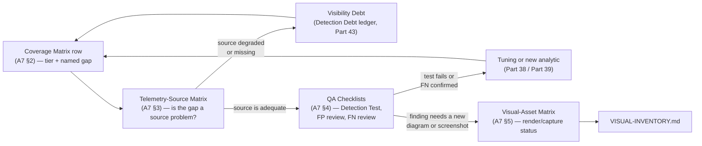

# Appendix A7 — Coverage, Telemetry & QA Matrices and Checklists

## Why this appendix exists

Parts 3, 4, 37, 38, 39, and 41 teach the reasoning behind detection coverage, telemetry scoring, detection testing, false-positive engineering, and false-negative engineering — why a six-tier model beats a single percentage, why a false positive and a benign positive need different fixes, why a false negative is a structurally different failure mode. None of those parts is a form to fill out. This appendix is that form: the blank and worked templates a program actually copies into a spreadsheet or a ticketing system, plus the checklists a reviewer works from line by line rather than from memory.

This appendix carries no analytic authority of its own. Every tier definition, scoring axis, taxonomy row, and checklist item below is sourced directly from Parts 3, 4, 37, 38, 39, or 41; any disagreement between a table here and the narrative part it is drawn from should be resolved in the narrative part's favor. Its only job is to be the page a reviewer or engineer opens when they need the row schema, not the argument for why the schema looks that way.

---

## 1. How to use this appendix

- **§2** — the ATT&CK coverage matrix template: the six-tier state model from Part 41, the row schema, a blank template, and one worked row grounded in this book's own lab evidence.
- **§3** — the telemetry-source matrix template: the eight-axis scoring model from Parts 3–4, a blank template, and a worked scoring pass over this book's own captured lab evidence.
- **§4** — QA/FP/FN review checklists distilled from Parts 37–39: the detection-test-case checklist, the false-positive disposition and tuning checklist, and the false-negative review checklist.
- **§5** — the visual-asset render/capture status matrix template, including a worked snapshot of this repository's own current render state as of 2026-09-15.
- **§6** — a diagram of how the four matrices above feed one another.
- **§7** — one detection candidate walked through all four matrices end to end, with illustrative query syntax.

---

## 2. ATT&CK coverage matrix template

### 2.1 The six-tier state model (recap)

**[CONCEPT]** TERMINOLOGY.md § Detection Coverage and Part 41 §2.1 fix these six tiers as the only standard expression of detection coverage in this book. Report coverage as a distribution across them — never as a single aggregate percentage, and never skip a tier's evidence requirement because a row "obviously" belongs there.

| Tier | What It Claims | Evidence Required |
|---|---|---|
| `NO VISIBILITY` | No telemetry exists for this technique at all. | A named, checked absence — not silence. |
| `TELEMETRY ONLY` | The needed log source is flowing, but no analytic evaluates it. | A confirmed, populated field/event in the pipeline, with no rule referencing it. |
| `PARTIAL DETECTION` | A deployed analytic exists with a named, specific evasion path. | The analytic's own logic plus a documented gap. |
| `RELIABLE DETECTION` | An acceptable false-positive rate against production data, from one telemetry source. | Disposition history (TP/FP counts) over a stated window. |
| `MULTI-SOURCE DETECTION` | Two or more independent sources would each, on their own, catch the technique. | Two analytics, different log sources, each independently validated. |
| `TESTED / RECENTLY VALIDATED` | Proven via Adversary Emulation within a defined recency window. | A dated Atomic Test / emulation run, analytic fired as expected, inside the recency window (commonly 90 days). |

The full promotion/regression state diagram for these six tiers is Part 41's own FIG-41-01; this appendix does not re-render it — see §6 below for a different, complementary diagram specific to how this appendix's four templates relate to each other.

### 2.2 Coverage-matrix row schema

**[DETECTION ENGINEER]** A row that records only a technique ID and a tier color is a heatmap, not a coverage matrix (Part 41 §1). Every row needs the eight fields below at minimum.

| Field | Required | Notes |
|---|---|---|
| Technique / sub-technique ID + name | Yes | Sub-technique granularity required — see TERMINOLOGY.md § MITRE ATT&CK Technique / Sub-technique. |
| Tier | Yes | One of the six values in §2.1, never an invented intermediate label. |
| Telemetry source(s) | Yes | Named `Log Source(s)` (TERMINOLOGY.md), not a vendor product name alone. |
| Detection Rule ID(s) | If any exist | `DET-####`; use an em dash if the tier is `NO VISIBILITY` or `TELEMETRY ONLY`. |
| Evidence reference (dated) | Yes | A specific artifact — a disposition count, an emulation run ID, a log excerpt citation — not the word "yes." |
| Last validated date | If applicable | Em dash for tiers with nothing yet to validate; never a placeholder date. |
| Owner | Yes | A named person, team, or role — not "SOC." |
| Named gap | Required below `MULTI-SOURCE DETECTION` | The specific evasion path, missing source, or untested condition keeping the row off the next tier up. |

### 2.3 Blank matrix template

**[DETECTION ENGINEER]** The table below is copy-paste scaffolding — every cell in the template row is a placeholder, not a value, and must be replaced before the row is usable.

| Technique | Tactic | Tier | Telemetry Source(s) | Detection Rule ID(s) | Evidence Reference | Last Validated | Owner | Named Gap |
|---|---|---|---|---|---|---|---|---|
| `T####.###` (Technique Name) | (Tactic) | (one of six tiers) | (log source name) | `DET-####` or — | (dated artifact citation) | `YYYY-MM-DD` or — | (named owner) | (specific gap, or — if `MULTI-SOURCE DETECTION`/`TESTED`) |

### 2.4 Worked example row: grounded in real lab evidence

**[DETECTION ENGINEER]** Following Part 41 §3.2's own precedent — that a matrix row's evidence field should point to something this specific — the row below is built from `lab/evidence/ct104-vulnscan-ssh-failed-logins-btmp.txt`, a genuine `btmp` capture (via `lastb`) of dozens of failed `root`/`admin` SSH authentications against CT104 within a couple of minutes, already worked through in Part 38 §1 and Appendix A1 §6.4.

| Technique | Tactic | Tier | Telemetry Source(s) | Detection Rule ID(s) | Evidence Reference | Last Validated | Owner | Named Gap |
|---|---|---|---|---|---|---|---|---|
| `T1110.001` (Password Guessing) | Credential Access | `PARTIAL DETECTION` | `sshd` authentication log (primary); `btmp` login-accounting (corroborating outcome only) | `DET-A7-01` (illustrative, §7 below) | `lab/evidence/ct104-vulnscan-ssh-failed-logins-btmp.txt`, captured 2026-09-15 — real burst of `root`/`admin` attempts peaking at 20 within a single minute (01:02) and totaling roughly 95 across a 6-minute span | 2026-09-15 | Detection Engineering (lab) | A distributed guesser splitting attempts across many source IPs, or throttling under the per-source-IP threshold, evades the count-based rule; `btmp` shares the same underlying authentication event as `sshd`'s own log, so it corroborates outcome rather than acting as a genuinely independent second signal — this is why the row is not `MULTI-SOURCE DETECTION` yet. |

> **What Would Change My Mind**
> This row treats "few distinct accounts, many failed attempts" as the right discriminator for `T1110.001` specifically, as opposed to `T1110.003` (Password Spraying) or `T1110.004` (Credential Stuffing). If this lab's honeynet SSH credential capture (`lab/evidence/ct103-honeynet-ssh-honeypot-credentials.txt`) showed that most real internet-sourced brute-force sessions against an exposed host actually vary the username per attempt rather than repeating a small fixed set, the discriminator — and the rule this row's coverage claim depends on — would need to shift toward a spraying/stuffing shape instead of a guessing shape, and the tier would need re-deriving against that different rule, not just a relabeled sub-technique.

### 2.5 Regression triggers quick reference

**[DETECTION ENGINEER]** Part 41 §2.2 models five promotion edges and five regression edges for the tier ladder; the table below is the same information in lookup form, for a reviewer checking whether a specific real-world event should trigger a re-check of a row's tier.

| Real-World Trigger | Tier Movement |
|---|---|
| Log source onboarded | `NO VISIBILITY` → `TELEMETRY ONLY` |
| Analytic built and deployed | `TELEMETRY ONLY` → `PARTIAL DETECTION` |
| Evasion path closed, FP rate acceptable | `PARTIAL DETECTION` → `RELIABLE DETECTION` |
| Second independent source validated | `RELIABLE DETECTION` → `MULTI-SOURCE DETECTION` |
| Adversary emulation passes in-window | `MULTI-SOURCE DETECTION` → `TESTED / RECENTLY VALIDATED` |
| Recency window expires, no re-test | `TESTED / RECENTLY VALIDATED` → `MULTI-SOURCE DETECTION` |
| One source breaks silently (schema drift) | `MULTI-SOURCE DETECTION` → `RELIABLE DETECTION` |
| New evasion path discovered | `RELIABLE DETECTION` → `PARTIAL DETECTION` |
| Telemetry source stops flowing | `PARTIAL DETECTION` → `TELEMETRY ONLY` |
| Log source decommissioned or defunded | `TELEMETRY ONLY` → `NO VISIBILITY` |

---

## 3. Telemetry-source matrix template

### 3.1 Eight-axis scoring model (recap)

**[CONCEPT]** Part 3 §1 fixes eight scoring axes so that "Sysmon is good telemetry" is a checkable claim rather than received wisdom; Part 4 §1 carries the same eight axes forward unchanged and adds one qualifier specific to network/application sources — **path dependency**: a network-based source only sees what actually crosses the point in the topology where it is deployed, where a host-based source sees a process regardless of network segment.

| Axis | What It Actually Asks |
|---|---|
| Visibility | What categories of activity does this source capture at all? |
| Blind spots | What specific technique, transport, or condition produces no record here, even when the source works exactly as designed? |
| Volume | Roughly how many events per host per day at typical configuration? |
| Quality | Given an event exists, is the field you need present, correctly typed, and unambiguous? |
| Retention | What's the realistic retention window this source supports at typical cost? |
| Cost | What does ingesting and storing this source at production volume actually cost? |
| Field completeness | Does the schema vary by OS/agent/vendor build in a way that breaks an existing rule? |
| Parser reliability | How often does a vendor-side format change silently break the field mappings a detection depends on? |

### 3.2 Blank matrix template

**[ENGINEERING]** The table below is the same copy-paste scaffolding as §2.3, one row per telemetry source under evaluation, to support the decision of where to spend the next telemetry-engineering budget cycle (Part 3 §12, Part 4 §12).

| Source | Visibility | Blind Spots | Volume | Quality | Retention | Cost | Field Completeness | Parser Reliability |
|---|---|---|---|---|---|---|---|---|
| (log source name) | (categories captured) | (named specific gap) | (events/host/day, stated org size) | (actionable fraction) | (realistic window) | (licensing/ingest/compute) | (schema stability across builds) | (silent-break frequency) |

### 3.3 Worked example: scoring this book's own real lab evidence honestly

**[ENGINEERING]** The table below scores five telemetry categories against the axes above, using this book's own captured evidence (`lab/evidence/`) rather than heuristic, illustrative ratings — a deliberately narrower and more honest exercise than Part 3 §11's or Part 4 §12's comparative rollups, which are explicitly marked `(CONCEPTUAL SAMPLE)`. Retention is marked with an em dash throughout: every evidence file in this lab is a point-in-time export, not a measurement of the source's actual rotation/retention policy, and this appendix does not fabricate a retention figure it did not verify.

| Source (Evidence File) | Visibility (Observed) | Volume (Observed) | Retention | Parser Reliability (Observed) |
|---|---|---|---|---|
| DNS query log, CT100 Pi-hole (`ct100-pihole-dns-query-log.txt`) | Every query the resolver-configured device sent it, including cache/NXDOMAIN outcomes | Per-query lines; one capture line shows a routine mistyped-hostname lookup resolving `NXDOMAIN` | — | Stable, plain-text `dnsmasq` line format |
| `sudo` invocation log, CT100 + CT104 (`ct100-pihole-sudo-invocations.txt`, `ct104-vulnscan-sudo-invocations.txt`) | Invoking user, target user, command, and `TTY` presence/absence | CT104's health-check script recurs roughly every 40–60 minutes; every captured CT100 invocation is interactive (`TTY=pts/1`) | — | Stable `sudo`/`journalctl` line format across both hosts |
| SSH auth outcome, CT104 (`ct104-vulnscan-ssh-failed-logins-btmp.txt`) | Authentication outcome and source IP via `btmp`; no password or negotiation detail | Failed `root`/`admin` attempts peaking at 20 in a single minute (dozens per minute across a 6-minute burst), in a ~95-line sample spanning roughly 4.5 hours | — | Stable `lastb` output shape; no negotiation-layer fields to break |
| Honeynet SSH decoy credentials, CT103 (`ct103-honeynet-ssh-honeypot-credentials.txt`) | Attacker-supplied username/password pairs against a real internet-facing decoy | `ssh_events` table holds 10,000+ rows total | — | Stable, honeypot-owned schema |
| systemd unit-state log, CT104 web unit (`ct104-vulnscan-web-systemd-state-changes.txt`) | `Starting`/`Started`/`Stopping`/`Deactivated`/`Stopped` keyword sequence per unit | Multiple legitimate restart cycles across a 2-day development window | — | Stable `journalctl` keyword sequence |

> **Engineering Reality**
> Every row above leaves Retention as an honest em dash. A one-time capture for a book's worked examples proves a source *can* produce a given shape of record; it proves nothing about how long a real deployment keeps that record queryable, because retention is a rotation/forwarding/storage-budget configuration this project never set out to verify. A production telemetry matrix that fills a Retention cell from "the export I happened to capture went back this far" is making the same mistake as a coverage row that fills a validation date because the template has a date field — see §2.4's row schema note on the same failure mode.

---

## 4. QA/FP/FN review checklists

### 4.1 Detection-test-case checklist

**[DETECTION ENGINEER]** Part 37 defines 13 test-case patterns a rule should clear before it ships, organized into five groups (baseline questions, data-shape, parser/schema, timing, and scale). The checklist below is that list in pass/fail form, for a reviewer working a specific `DET-####` end to end.

| Check | What It Catches | Part 37 § | Result |
|---|---|---|---|
| Fires correctly | The rule never matches the attack it's supposed to catch | §2.1 | — |
| Fires for the right reason | The rule matches, but via a coincidental mechanism, not the named behavior | §2.2 | — |
| Doesn't fire on normal activity | The rule is unusably noisy against real, benign traffic | §2.3 | — |
| Missing fields | The rule depends on a field that isn't always populated | §3.1 | — |
| Duplicate events | At-least-once delivery double-counts a threshold or double-fires an alert | §3.2 | — |
| Truncation | A length cap cuts the exact substring the rule matches on | §3.3 | — |
| Case sensitivity | A case-sensitive comparison misses a differently-cased but identical value | §3.4 | — |
| Parser failures | The parser stops extracting a field the rule needs, with no ingest error | §4.1 | — |
| Schema change | A vendor/agent upgrade renames or retypes a field the rule references | §4.2 | — |
| Event delays | Pipeline lag pushes an event outside the rule's correlation window | §5.1 | — |
| Clock skew | Two sources disagree on "now" by more than the rule's window tolerates | §5.2 | — |
| Time-window boundaries | An event lands exactly at the edge of a fixed or sliding window | §5.3 | — |
| High volume | The rule times out, samples, or silently truncates results at real scale | §6.1 | — |

Fill the Result column with `Pass`, `Fail`, or `Not Run` — an unfilled em dash left at ship time is itself a finding (Testing Debt, TERMINOLOGY.md § Detection Debt), not a neutral default.

### 4.2 False-positive disposition and tuning checklist

**[ANALYST]** Before any rule change, settle the disposition itself. Part 38 §1 draws the line precisely: a **False Positive** means the rule's own logic is defective; a **Benign Positive** means the logic matched exactly what it was built to match and the activity is legitimate; neither applies cleanly to every closed alert.

| Question | If the Answer Is Yes |
|---|---|
| Did the rule's stated logic actually match, exactly as written? | Move to the next question — the logic is not the defect on its face. |
| Is the matched activity legitimate, authorized, and non-risky in context? | Disposition: **Benign Positive** — see Part 38 §4 (Suppression, not a logic rewrite). |
| Is the matched activity ambiguous — internal source, no clear authorization on record? | Disposition: **Unable to Determine** — do not default to Benign Positive just because the source is internal (Part 38 §1's own worked CT104 example). |
| Did the rule match unrelated, coincidental activity that only superficially resembles the targeted behavior? | Disposition: **False Positive** — the logic itself needs Tuning (Part 38 §3), not a Suppression. |

**[DETECTION ENGINEER]** Once a False Positive disposition recurs across multiple alerts with the same reason code (not a single isolated case — Part 38 §3), work the fork below before touching the rule.

| Cause (Part 38 §1 Taxonomy) | Typical Fix |
|---|---|
| Logic too broad | Rewrite: narrow the condition with an additional field or tighter threshold |
| Wrong entity resolution | Rewrite: change the join key or add a resolution step |
| Environmental drift | Suppression or time-bound Exception, scoped and dated |
| Coincidental match | Rewrite: add a correlating field tying the clauses together |
| Stale baseline | Rewrite: move the threshold to a baseline-relative comparison (Part 31) |

Once the cause is named, the table below settles which of the two non-interchangeable fixes applies (TERMINOLOGY.md § Suppression, § Tuning) — picking the wrong one either leaves a real defect in place or churns rule logic to solve a problem that was never in the logic.

| Decision Point | Suppression | Tuning |
|---|---|---|
| Is the rule's logic correct for this case? | Yes — logic matched as designed, activity is benign | No — the logic itself is defective |
| What changes? | Nothing in the rule; an allowlist/exception filters the alert after the match | The rule's own matching condition |
| Regression risk | Low — underlying detection capability unchanged | Real — narrowing a condition can create a new False Negative (Part 39) |

### 4.3 False-negative review checklist

**[DETECTION ENGINEER]** Part 39 §2 names six mechanisms behind most real false negatives; the seventh row below (schema drift) is not a distinct mechanism but the meta-point the taxonomy itself makes — schema drift is usually the *trigger* for one of the other six, not a fully separate category.

| Cause | How It's Usually Found |
|---|---|
| Missing telemetry | Data Feasibility review done retroactively, or a post-mortem asking "what would have shown this" |
| Wrong assumption baked into logic | Comparing stated logic against real telemetry samples never tested against |
| Overly specific matching | A minor attacker variation a slightly broader rule would still have caught |
| Parser/extraction breakage | Field-population monitoring catching a field gone unexpectedly null |
| Data gaps (partial fleet coverage) | Fleet/asset inventory reconciled against actual telemetry coverage |
| Attacker variation | Threat intel on technique evolution, or a hunt built to test a known variant |
| Schema drift | Same detection method as parser breakage — usually the cause, not a distinct symptom |

**[SOC MANAGEMENT]** Part 39 §11 formalizes finding false negatives as a standing process, not a one-off. The checklist below is that loop's decision sequence.

| Step | Question to Answer | Routes To |
|---|---|---|
| 1. Trigger | Post-mortem, emulation result, threat-intel disclosure, or analyst/hunter suspicion? | Step 2 |
| 2. Retroactive query | Does the telemetry exist for the window in question, queried directly? | If no telemetry existed: classify as Visibility Debt, skip to Step 4 — do not route to a detection engineer to "fix the rule." |
| 3. Confirm | Is there corroborating evidence (a second source, a red-team report) the miss is genuine, against Ground Truth? | An uncorroborated suspicion stays an open question, not a closed finding either way. |
| 4. Root-cause | Which of the seven causes named above does this match? | Step 5 |
| 5. Log | Recorded in the Detection Debt register (Part 43)? | Step 6 |
| 6. Remediate | Fix logic, telemetry, or parser as the root cause dictates | Step 7 |
| 7. Regression-test | Added as a Detection Test (Part 37), not left as a one-time fix | Step 8 |
| 8. Re-validate | Adversary emulation confirms the fix inside the recency window | Close the finding |

---

## 5. Visual-asset render/capture status matrix template

### 5.1 Schema

**[ENGINEERING]** Per STYLE-GUIDE.md §10, a Mermaid fence with no paired rendered image is not a finished figure. The fields below are what a row in `VISUAL-INVENTORY.md` needs to make that check enforceable rather than a manual spot-check.

| Field | Notes |
|---|---|
| Figure ID | `FIG-####` (part-scoped serial, e.g. `FIG-41-01`) or the appendix form (`FIG-A#-##`) |
| Title | Matches the caption's bracketed title exactly |
| Evidence class | One of the four STYLE-GUIDE.md §9.1 tags, or `PENDING` if not yet captured |
| Mermaid source present | Yes/No — per STYLE-GUIDE.md §10 the editable source of truth is the ` ```mermaid ` fence committed in the chapter/appendix file itself; a standalone `.mmd` file under `assets/diagrams/` is a bonus, not a requirement |
| Rendered image present (`.svg`/`.png`) | Yes/No |
| Owner | Named person/team responsible for closing the gap if pending |
| Status | `RENDERED`, `PENDING — no source yet`, or `PENDING — source exists, not rendered` |

### 5.2 Worked example: this repository's own current render status (verified 2026-09-15)

**[ENGINEERING]** The rows below are not illustrative — they were produced by listing `assets/diagrams/` directly against every `FIG-####`/`Figure N.M` reference found in the currently-committed chapter text, as of this appendix's own `last_validated` check.

| Figure ID | Source Part | Mermaid Source (`.mmd`) | Rendered (`.svg`) | Status |
|---|---|---|---|---|
| `FIG-41-01` | Part 41 §2.2 | Yes | Yes | `RENDERED` |
| `FIG-41-02` | Part 41 §6 | Yes | Yes | `RENDERED` |
| `FIG-A1-01` | Appendix A1 §7 | Yes | Yes | `RENDERED` |
| `FIG-A2-01` | Appendix A2 | Yes | Yes | `RENDERED` |
| `FIG-37-01` | Part 37 §7 | Yes | Yes | `RENDERED` |
| Figure 38.1 (no `FIG-####` assigned) | Part 38 §3 | Yes (in-chapter fence) | Yes | `RENDERED` |
| `FIG-39-01` | Part 39 §2 | Yes (in-chapter fence) | Yes | `RENDERED` |
| `FIG-39-02` | Part 39 §11 | Yes (in-chapter fence) | Yes | `RENDERED` |
| `FIG-42-01` | Part 42 §11 | Yes | Yes | `RENDERED` |
| `FIG-43-01` | Part 43 §6 | Yes (in-chapter fence) | Yes | `RENDERED` |
| `FIG-A7-01` | This appendix, §6 | Yes | Yes | `RENDERED` (rendered as part of authoring this appendix) |

> **Blind Spot**
> This matrix can only report what it can check. `VISUAL-INVENTORY.md` now exists at the project root, and a full render pass on 2026-09-15 closed every gap this table used to track — `Figure 38.1`, `FIG-39-01`, `FIG-39-02`, and `FIG-43-01` all now have a committed `.svg` in `assets/diagrams/` alongside their in-chapter Mermaid source, joining `FIG-37-01` and `FIG-42-01`, which closed the same gap in an earlier pass. `VISUAL-INVENTORY.md` itself has not caught up to that render pass yet — as of this check it still lists `Figure 38.1`, `FIG-39-01`, and `FIG-39-02` as "render pending," which is now inaccurate and should be corrected there directly rather than re-derived here each time. The residual blind spot this appendix does still have: it can only catch drift between chapter prose, `VISUAL-INVENTORY.md`, and the `assets/diagrams/` directory listing at the moment someone runs the cross-reference by hand — exactly the manual spot-check a build-time check (STYLE-GUIDE.md §10) is supposed to make unnecessary.

---

## 6. How the four matrices interlock

**[CONCEPT]** The three template matrices and the checklist section above are not independent filing exercises — a gap found in one is supposed to route into another rather than dead-ending as a spreadsheet cell nobody revisits. The diagram below is this appendix's own, original map of that routing: a coverage-matrix gap (§2) gets checked against the telemetry matrix (§3) to see whether it's a source problem or a logic problem; a logic problem routes into the QA checklists (§4); any finding that needs a new diagram or screenshot to document routes into the visual-asset matrix (§5).






**Figure A7.1 — The four coverage/telemetry/QA/visual-asset matrices as one feedback loop.** *CONCEPTUAL.* Illustrates the routing this appendix's own sections imply but never states directly elsewhere: a coverage gap is not resolved by re-coloring the matrix cell, it is resolved by determining whether the gap is a telemetry problem, a rule-logic problem, or a documentation problem, and closing the loop back to the coverage row only once the underlying fix is validated. This is an original sketch of this appendix's own internal structure, not a capture of any specific vendor platform's workflow. Rendered image: `assets/diagrams/fig-a7-01-four-matrix-feedback-loop.svg` (Mermaid source above is the editable version of record). Diagram ID `FIG-A7-01`.

---

## 7. Worked example: one detection candidate through all four matrices (A7-XREF-01)

**[DETECTION ENGINEER]** This walkthrough takes the §2.4 coverage row (`T1110.001` (Password Guessing), SSH password guessing against CT104-shaped telemetry) and runs it through §3, §4, and §5 in sequence, to show the four templates operating as one pipeline rather than four disconnected forms.

**Step 1 — Coverage matrix (§2.4):** Tier `PARTIAL DETECTION`, telemetry sources `sshd` log (primary) + `btmp` (corroborating outcome only), named gap: a distributed or throttled guesser evades the per-source-IP count threshold.

**Step 2 — Telemetry matrix (§3.3):** The `sshd`/`btmp` row shows stable parser reliability and adequate visibility for the outcome-only question this rule asks — the gap identified in Step 1 is a **logic problem** (the threshold's shape), not a telemetry problem. This routes the finding to the QA checklists rather than to a telemetry-onboarding backlog, per §6's diagram.

**Step 3 — QA checklists (§4.1, §4.2):** The illustrative rule below is a `DET-A7-01` candidate for this coverage row.

The following illustrative SPL query targets a Splunk-shaped index over `sshd` authentication log lines, structured after the real CT104 evidence cited in §2.4 and §3.3 (`lab/evidence/ct104-vulnscan-ssh-failed-logins-btmp.txt`); field names are illustrative of the threshold/discriminator shape, not a syntax-checked production query.

CONCEPTUAL SAMPLE — invented `target_user` field and threshold values, illustrating the count/distinct-account discriminator shape only.

```spl
| index=linux_auth sourcetype=sshd
| eval outcome=if(match(_raw, "Accepted"), "success", "failed")
| where outcome="failed"
| bin _time span=5m
| stats count as failed_count, dc(target_user) as distinct_accounts by src_ip, _time
| where failed_count >= 11 AND distinct_accounts <= 2
```

The narrow `distinct_accounts <= 2` clause is what discriminates guessing (T1110.001) from spraying/stuffing — see the coverage row's What Would Change My Mind box in §2.4. Its main limitation is the same gap named in the coverage row: a source distributing the same 15 attempts across 10 source IPs, at roughly one to two attempts per IP, never crosses `failed_count >= 11` for any single `src_ip` and produces zero alerts despite a real guessing attempt in progress.

> **Blind Spot**
> `bin _time span=5m` creates a hard, non-rolling boundary, not a sliding window. A guesser pacing 10 attempts every 5 minutes against the same one or two accounts, indefinitely, never crosses `failed_count >= 11` in any single bucket — no distributed source IPs required, just patience. The distinct-account clause does nothing to catch this: `distinct_accounts` stays at 1 the whole time, only `failed_count` needed pacing, and pacing is a one-line change to any brute-force tool's delay argument.

**MITRE:** T1110 (Brute Force), T1110.001 (Password Guessing).

> **Detection Test**
> **Setup:** Lab Linux host with `sshd` and `btmp` logging enabled, matching the real CT104 evidence shape — the same lab prerequisite as Part 37 §2.1's `DET-37-01`.
> **Action:** `for i in $(seq 1 15); do sshpass -p "wrongpass$i" ssh -o StrictHostKeyChecking=no root@<target>; done`
> **Expected result:** At least one alert with `failed_count` ≥ 11 and `distinct_accounts` ≤ 2 against `src_ip` matching the test host, inside the 5-minute window — checked against §4.1's "fires correctly" and "fires for the right reason" rows before anything else on that checklist.

> **False Positive Trap**
> A vulnerability scanner or monitoring tool that authenticates against many hosts on a schedule using a stale credential produces the same failed-authentication burst shape this rule targets — this project's own `ct104-vulnscan-ssh-failed-logins-btmp.txt` evidence is itself exactly this shape, and Part 38 §1's own review of it settled on **Unable to Determine**, not an automatic Benign Positive, because the source device's intent was never confirmed (§4.2's disposition checklist, row three). Maintain an explicit allowlist of confirmed scanner/service-account source IPs; do not raise `failed_count` to compensate.

> **Engineering Reality**
> This query is scoped to `sshd` telemetry from a specific internal host (CT104's own vulnerability-scan target). Point the identical query at an internet-facing bastion or jump host instead, and the threshold stops discriminating anything: mass automated SSH scanning against any public IPv4 address is the constant background state of the internet, not an occasional event, so `failed_count >= 11` in a 5-minute window fires continuously from dozens of unrelated scanning sources rather than a small number of genuine attacks. Deploying `DET-A7-01` unmodified against internet-facing telemetry, without a known-scanner/ASN allowlist or an equivalent reputation gate scoped to that host population, produces an alert volume no analyst queue can absorb — the same rule that is appropriately sensitive on an internal host becomes unusable noise on a perimeter one.

**Step 4 — Visual-asset matrix (§5.2):** This walkthrough introduces no new diagram of its own beyond FIG-A7-01 already logged in §5.2/§6 above — no additional visual-asset row is needed for `DET-A7-01` unless a future reviewer adds a sequence diagram for the discriminator logic, in which case it gets its own row with `Status: PENDING — no source yet` until rendered.

---

## Summary

This appendix is the fill-in-the-form companion to Parts 3, 4, 37, 38, 39, and 41 — the six-tier coverage model, the eight-axis telemetry scoring model, the detection-test/false-positive/false-negative checklists, and the visual-asset tracking schema, each reproduced as a template plus one worked example grounded in this book's own real lab evidence rather than invented data. Report any disagreement between a table here and its source part as documentation debt against this file, not the other way around.

**Cross-references:** Part 3 (Telemetry Engineering I), Part 4 (Telemetry Engineering II), Part 37 (Detection Testing), Part 38 (False Positive Engineering), Part 39 (False Negative Engineering), Part 41 (Detection Coverage), Part 42 (Detection Quality), Part 43 (Detection Debt), Appendix A1 (Windows & Endpoint Telemetry Field Reference), Appendix A4 (MITRE ATT&CK Mapping Quick Reference), Appendix A6 (Templates), STYLE-GUIDE.md §9–§10 (figure evidence classes and diagram rendering), TERMINOLOGY.md (Detection Coverage, Telemetry Coverage, Disposition, False Positive, Benign Positive, False Negative, Visibility Debt, Detection Debt).
