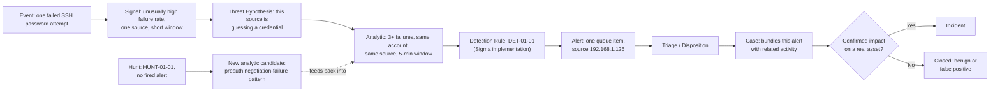
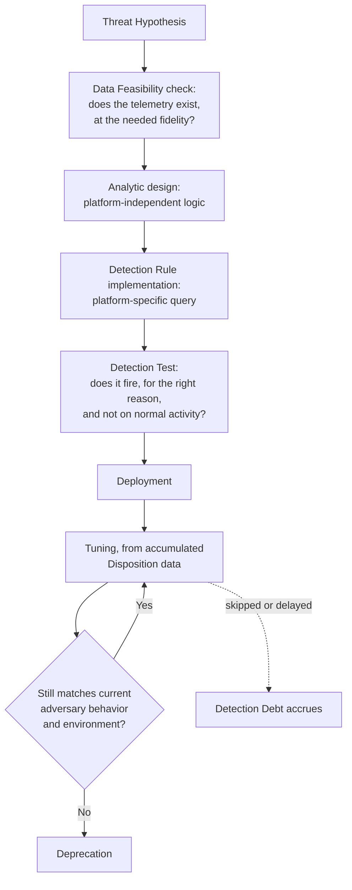

# Part 1 — Detection Engineering Foundations

## Why this part exists

**[CONCEPT]** Every later part in this book uses "rule," "analytic," "detection," "alert," "incident," and "hunt" as if they mean different, specific things — because they do, and the difference is load-bearing, not decorative. A manager who asks "how many detections do we have" and a detection engineer who answers with a rule count are having two different conversations without knowing it: one rule can implement one analytic, one analytic can be deployed as several platform-specific rules, and none of that tells you whether the underlying use case actually has working coverage. This part gives the nine terms in the pipeline — event, signal, analytic, detection rule, detection, alert, incident, use case, and hunt — one worked example each, names the four detection paradigms as points on a spectrum rather than a checklist of four unrelated techniques, and walks the detection lifecycle once at the level this book will assume for the next 47 parts. The canonical, binding definition of every term used here lives in `TERMINOLOGY.md`; this part is that glossary's designated narrative home for the pipeline-vocabulary terms — if anything below and the glossary ever disagree, the glossary wins and this file gets corrected.

This part deliberately does not teach detection-as-code mechanics (version control, CI/CD, peer review gates — that's Part 22) or the coverage matrix (the six-tier telemetry-to-validated-detection scale — that's Part 41). Both get a one-paragraph terminology preview in §5 so the vocabulary is on the table early, and both get a forward reference rather than a re-explanation.

## 1. Why vocabulary is a detection engineering problem, not a pedantry problem

**[CONCEPT]** V1 of this handbook used "detection" to mean the query text in one paragraph and the whole owned capability — logic, ownership, testing, review history — three paragraphs later, with no signal to the reader that the word had shifted meaning. That collapse has a real cost: a coverage spreadsheet that counts rules is measuring something different from one that counts validated analytics, and the two numbers can differ by a large multiple on the same environment without either being wrong on its own terms. A single analytic — "a process other than LSASS itself opens a handle to `lsass.exe` with memory-read rights" — might ship as one Sigma rule in one SIEM and three separately tuned native queries across three acquired subsidiaries running different platforms. Counting "detections" as "rules" here reports three; counting them as "analytics with working coverage" reports one, with three implementations of varying quality. Both numbers are real. They answer different questions, and a program that doesn't distinguish them will eventually report a coverage number to a CISO that the underlying detection quality can't back up.

> **SOC Management View**
> When a board or auditor asks "how many detections protect us against ransomware," the honest answer names the use case first ("credential theft, lateral movement, and backup tampering — three use cases, covered by roughly a dozen analytics, implemented as around 20 platform-specific rules across two SIEMs") rather than a single number that collapses use case, analytic, and rule into one figure nobody can audit. If your program can only produce one number for that question, that itself is worth reporting as a gap.

## 2. One behavior, named at every layer: a worked example

**[CONCEPT]** The cleanest way to see why these terms don't collapse into each other is to take one real behavior and name it at every layer without skipping any. The behavior below is real, not invented for the example — it's a genuine failed-SSH-authentication burst captured from this book's own home lab, against a real host (CT104, a Linux vulnerability-scanner container), from a real internal device on the network. It happens to originate from a misconfigured internal host rather than an external attacker, which the lab's own DHCP lease table confirms — a fact this section returns to below because it matters for disposition, not because it changes which terms apply.

### 2.1 The behavior, captured

**[CONCEPT]** An `Event` is a single, immutable record; the raw material here is dozens of individual SSH authentication failures, each one an event in its own right, regardless of whether anything downstream ever looks at them.

**Figure 1.3 — Repeated failed SSH authentication against CT104, sourced from `btmp`.** *REAL LAB EXAMPLE.* `lastb` output read from `/var/log/btmp` on CT104 (a Linux container in the author's home lab), showing dozens of failed `admin` and `root` SSH logon attempts within a roughly 15-minute span on 2026-09-14, all from a single internal source, `192.168.1.126`. The lab's own Pi-hole DHCP lease table resolves that address to a real device on the network (hostname `LAPTOP-JB22RNU3`) — this is a real internal host failing SSH authentication repeatedly against CT104, not a synthetic or external example. `lastb` does not expose the attempted password, so no redaction was needed before inclusion here.

```text
admin    ssh:notty    192.168.1.126    Mon Sep 14 01:17 - 01:17  (00:00)
root     ssh:notty    192.168.1.126    Mon Sep 14 01:06 - 01:06  (00:00)
root     ssh:notty    192.168.1.126    Mon Sep 14 01:06 - 01:06  (00:00)
root     ssh:notty    192.168.1.126    Mon Sep 14 01:05 - 01:05  (00:00)
root     ssh:notty    192.168.1.126    Mon Sep 14 01:05 - 01:05  (00:00)
root     ssh:notty    192.168.1.126    Mon Sep 14 01:04 - 01:04  (00:00)
[... dozens more entries, same source, spanning 01:01-01:17 ...]
```

> **Engineering Reality**
> `lastb`/`btmp` tells you an authentication attempt failed, the target account, the source address, and the timestamp — it does not tell you which password was tried, whether the account exists, or whether the source is internal or external to your network. That last fact came from a separate source (the DHCP lease table), not from the SSH telemetry itself. Any detection built on this log source alone inherits that same blind spot: you will need enrichment (see TERMINOLOGY.md § Enrichment) from somewhere else — asset inventory, IPAM, threat intel — to answer "is this ours" at all.

### 2.2 Event, signal, and threat hypothesis

**[CONCEPT]** No single line in Figure 1.3 is interesting by itself — one failed login is unremarkable. The `Signal` is the property that becomes visible only once you look at more than one event together: an unusually high count of failed authentications against the same account from the same source in a short window. A detection engineer or hunter turns that signal into a `Threat Hypothesis` before writing any query: "a source authenticating this many times, this fast, against this account, is attempting to guess a valid credential rather than mistyping one." That sentence has a subject (the source), a behavior (rapid repeated authentication failure), and an implied negation (a legitimate user does not fail this many times this fast) — which is what makes it a hypothesis rather than a topic like "let's look at SSH logs."

### 2.3 Analytic and detection rule

**[DETECTION ENGINEER]** The `Analytic` is the platform-independent statement of the pattern: *three or more failed SSH password-authentication attempts against the same account, from the same source address, within a 5-minute window.* Note what that sentence does not contain — no field name, no query syntax, no SIEM. It is a design, and it could be validated as logic (does this pattern actually correlate with credential-guessing in practice, or does it just as often correlate with a broken automation script?) before anyone commits to implementing it anywhere.

**MITRE:** T1110 (Brute Force), T1110.001 (Password Guessing).

**DET-01-01 — Repeated failed SSH password authentication from one source.** The `Detection Rule` below is one possible implementation of that analytic, written against a generic Linux `sshd` authentication log source (the kind of source that produces the `btmp`/`lastb` records in Figure 1.3, but referencing the underlying auth-log event rather than the `lastb` summary view).

CONCEPTUAL SAMPLE — illustrative Sigma syntax with an invented rule ID; not validated against a specific SIEM backend or replayed against a real false-positive corpus. The two-field `by SourceIp, TargetAccount` grouping shown below is also not guaranteed to be portable — some Sigma backends only support a single grouping field per aggregation, so a real implementation may need a derived composite field (`SourceIp_TargetAccount`) instead of a literal comma-separated `by` clause.

```yaml
title: Repeated failed SSH password authentication from one source
id: 8f21c1c4-01a1-4b7a-9e2e-a1b2c3d4e5f6
status: experimental
description: >
  Detects three or more failed SSH password authentication attempts against
  the same target account, from the same source address, within a 5-minute
  window. Illustrative implementation of the analytic described in
  Part 1 §2.3 (DET-01-01).
logsource:
  category: authentication
  product: linux
  service: sshd
detection:
  selection:
    EventType: 'failed_password'
  timeframe: 5m
  condition: selection | count() by SourceIp, TargetAccount >= 3
falsepositives:
  - Automation or monitoring scripts retrying a stale or rotated credential
  - A legitimate user who mistypes a passphrase repeatedly on a slow connection
level: medium
```

This rule only evaluates true once an attempt reaches the password-authentication stage of the SSH handshake. It has nothing to say about a source that fails during protocol or key-exchange negotiation and never gets that far — see the Blind Spot box in §2.7, where that exact gap turns into a hunt. It also depends on `SourceIp` and `TargetAccount` both being populated on the same record: if a PAM or `sshd` logging configuration ever emits a failure line before the source address is attached, or with the account field blank (some `sshd` builds do this for a malformed or empty username), that record silently drops out of the `by SourceIp, TargetAccount` grouping instead of raising an error — the count undercounts the real attempt volume rather than failing loudly.

> **Blind Spot**
> DET-01-01 only accumulates a count against one `SourceIp, TargetAccount` pair inside one rolling 5-minute window, so it catches exactly one attack shape: fast, single-source, single-account guessing. An attacker who paces two attempts per 5-minute window instead of three stays under the threshold indefinitely without meaningfully slowing the attack. Spraying the same small number of guesses across many target accounts from one source, or against one account from many source addresses (a botnet or a rotating proxy list), also evades it — neither pattern ever puts three matching events on the same `SourceIp, TargetAccount` pair, even though the underlying T1110.001 password-guessing activity is identical. None of these require a different tool or technique, only a different distribution of the same attempts; catching them needs a separate analytic grouped by source alone or by account alone, not a threshold change to this one.

> **False Positive Trap**
> A misconfigured monitoring agent or backup job retrying a stale or rotated SSH credential on a fixed interval produces the identical shape — three or more failures, same account, same source, inside one 5-minute window — with no attacker involved. On a small internal network like the one in Figure 1.3, expect this to fire on the order of one to a handful of times a week from legitimate infrastructure rather than an attacker; pointed at an internet-facing bastion host exposed to routine scanning, expect tens to low hundreds of alert instances a day. Maintain an allowlist of known automation/backup source addresses and exclude them at the query level rather than raising the count threshold — a higher threshold just gives a real credential-guessing attempt more free guesses before it trips the rule.

> **Detection Test**
> **Setup:** A lab Linux host running `sshd`, forwarding auth events to wherever this rule's log source lands, with no valid credentials configured for a throwaway test account.
> **Action:** From a second host, attempt six SSH logons in quick succession against the test account with a deliberately wrong password each time: `for i in $(seq 1 6); do ssh baduser@target-host; done`.
> **Expected result:** Six failed-password entries for `baduser` from the test host's source address within under a minute, and one alert instance from DET-01-01 once the count crosses three within the 5-minute window.

**[DETECTION ENGINEER]** DET-01-01's query text is only the implementation. The `Detection` — the thing this book means whenever it uses the word without qualifying it as "analytic" or "rule" — is DET-01-01's query text plus its documented Blind Spot, its False Positive Trap and allowlist, its Detection Test, and whoever owns tuning it as disposition data comes in. Swap out the query for a different SIEM's syntax and the detection is still the same detection, as long as that ownership and documentation travel with it; strip the documentation away and keep only the query, and what's left is a rule with no detection behind it.

### 2.4 Alert, triage, and disposition

**[ANALYST]** Once DET-01-01's condition evaluates true against live telemetry, it produces an `Alert` — a single queue item, timestamped, naming the source (`192.168.1.126`), the target account (`root`), and the count. The alert is a claim, not a verdict: it says the pattern matched, not that this is necessarily an attacker. `Triage` is the analyst pulling context — is `192.168.1.126` a known device, does the account normally receive login attempts from it, is there a matching successful logon afterward — to reach a `Disposition`. In this real case, the DHCP lease lookup resolves the source to a real internal laptop rather than a spoofed or misattributed address, which rules out the simplest false-positive explanation. It does not, by itself, establish intent. Dozens of `admin`/`root` attempts in roughly 15 minutes is far too fast to be a person mistyping a password, but the lab's own record doesn't distinguish a compromised or malicious process on that laptop from a stale, misconfigured automation or backup script hammering a rotated-out credential — precisely the scenario DET-01-01's own `falsepositives` list names. Absent evidence ruling that out, the honest disposition here is `Unable to Determine`, escalated on the strength of the rate and target-account pattern alone, not a confident `True Positive` — collapsing "the rule's logic matched" into "the activity was malicious" is itself a common triage failure mode, not a shortcut this book endorses. Severity and confidence are separate questions from disposition regardless of how it's ultimately resolved: an unresolved brute-force-shaped alert from a compromised or misconfigured internal device is not automatically lower severity than one from the internet, and treating "internal" as synonymous with "safe" is its own failure mode this book returns to in Part 12.

### 2.5 Case and incident

**[ANALYST]** If this alert correlates with others — the same source hitting other internal hosts, or the same account seeing similar bursts elsewhere — an analyst bundles them into a `Case`: one owned investigative container holding every related alert and the actions taken against them. A case is not automatically an `Incident`. The honeynet evidence below shows the distinction concretely, from a real, independently correlated attacker dataset rather than this book's own SSH example.

**Figure 1.4 — Correlated honeynet attack sessions, CT103.** *REAL LAB EXAMPLE.* Output from the honeynet platform's own `attack_sessions` correlation table on CT103, showing genuine inbound sessions against decoy hosts (`10.99.99.x`) tagged by the platform's own logic with real MITRE ATT&CK technique IDs and a status field distinguishing `exploit_attempt` from `possible_success` (an exploit-shaped request followed by continued activity from the same source). Captured 2026-09-15; the platform, not this book's author, assigned the technique tags and status values shown.

```text
session_id     source_ip        status            mitre_techniques_json                 notes
d48b795e...    16.5.0.236        possible_success  ["T1595","T1046","T1083","T1190"]     exploit attempt observed, followed by continued
                                                                                          activity from the same source -- worth manual review
ba0ab1f3...    45.156.128.45     exploit_attempt   ["T1595","T1046","T1190"]             exploit-category alert observed (traversal/CVE-path/
                                                                                          SQLi-like); no follow-on activity yet
```

**MITRE:** T1595 (Active Scanning), T1046 (Network Service Discovery), T1083 (File and Directory Discovery), T1190 (Exploit Public-Facing Application).

Every row in Figure 1.4 is a session — the honeynet platform's own version of a case, bundling raw connection-level alerts into one working record per attacker. `exploit_attempt` sessions close as investigated-and-benign-to-the-honeynet (the "attack" landed on a decoy, by design) without ever becoming an incident. A `possible_success` session — an exploit-shaped request followed by continued attacker activity from the same source — is exactly the kind of case that would justify escalating to a formally declared incident in a production environment where the target was a real asset rather than a sacrificial decoy; the honeynet's own operational value is that it can watch that escalation happen with zero actual impact, because there was never a real asset to lose.

### 2.6 Use case: the layer above the rule

**[SOC MANAGEMENT]** Neither DET-01-01 nor the honeynet's exploit-detection logic exists in a vacuum — each is one implementation of a broader `Use Case` a security program decided to fund: "detect credential-guessing and unauthorized-access attempts against SSH-exposed hosts" is a use case that DET-01-01 partially satisfies, and that a second analytic (successful-logon-after-failure-burst, source-reputation scoring, geographic anomaly) would satisfy more completely alongside it. The use case is what a budget conversation is actually about; the rule is what an engineer is actually about. Reporting use-case coverage ("SSH credential-guessing: two of three planned analytics deployed and tuned") gives a CISO a defensible answer. Reporting rule counts alone does not, because rule count says nothing about whether the use case's actual risk is addressed.

> **What Would Change My Mind**
> This section treats "use case," "analytic," and "detection rule" as three genuinely distinct layers worth tracking separately. If a program of meaningful size — not a two-person shop where one person necessarily wears every hat — could run its detection function just as well collapsing all three into a single "detection" line item, with no loss of clarity in prioritization, staffing, or coverage reporting, that would undermine this part's central claim that the distinction is load-bearing rather than academic.

### 2.7 Hunt: the layer with no fired alert

**[THREAT HUNTER]** DET-01-01 only evaluates true once an attempt reaches password authentication. A source that never gets that far — one that fails during protocol or key-exchange negotiation — produces no failed-password event, and DET-01-01 never fires, regardless of intent. That gap is real in this lab, not hypothetical: the honeynet edge host (CT108) logged exactly this kind of traffic from another internal host on the same network.

> **Blind Spot**
> DET-01-01 matches only on the `failed_password` event its `selection` field names. A source that offers a legacy key-exchange algorithm, an unsupported host-key type, or an SSHv1 banner never reaches that stage — `sshd` rejects it during preauth negotiation and logs a negotiation error instead, with no `Failed password` line ever produced. That source is invisible to DET-01-01 regardless of intent, whether it's the lab's own scanner (Figure 1.5) or an external attacker running the same reconnaissance for real.

**Figure 1.5 — Legacy SSH protocol/algorithm probing against the honeynet edge, CT108.** *REAL LAB EXAMPLE.* `sshd`/systemd journal entries from CT108 showing connection attempts from `192.168.1.96` (the lab's own vulnerability-scanner host, CT104) offering legacy key-exchange methods (`diffie-hellman-group1-sha1`), legacy host-key types (`ssh-rsa`, `ssh-dss`), and at least one SSHv1 banner — all rejected during negotiation, before any password authentication is attempted. Captured 2026-09-10 and 2026-09-13.

```text
Unable to negotiate with 192.168.1.96 port 43036: no matching key exchange method found. Their offer: diffie-hellman-group1-sha1 [preauth]
Unable to negotiate with 192.168.1.96 port 43058: no matching host key type found. Their offer: ssh-rsa [preauth]
error: Protocol major versions differ: 2 vs. 1
banner exchange: Connection from 192.168.1.96 port 43042: could not read protocol version
```

**HUNT-01-01 — Would a legacy-SSH-algorithm probe ever reach the failed-auth rule?**

**MITRE:** T1595 (Active Scanning).

**Threat Hypothesis:** A source performing SSH protocol/algorithm reconnaissance — offering legacy KEX methods, legacy host-key types, or an SSHv1 banner — never reaches the password-authentication stage against a modern `sshd` configuration that rejects those offers during negotiation. If that's true, DET-01-01's failed-auth-count analytic never evaluates true for this behavior, and an external attacker doing the same reconnaissance for real (rather than the lab's own scanner doing it for legitimate vulnerability-assessment purposes) would be equally invisible to it.

**Finding:** Confirmed. Every rejected offer in Figure 1.5 is logged with `[preauth]` and never produces a `Failed password` line — the exact event type DET-01-01's `selection` field matches on. The source here is the lab's own scanner, so this instance is not itself an attack, but the mechanism is identical regardless of who's on the other end: DET-01-01 has a real, confirmed coverage gap for this reconnaissance style, not a theoretical one.

**Disposition:** Negative finding against the existing rule, positive finding for a new analytic candidate — filed, not yet built: alert on repeated `[preauth]` negotiation failures from one source against one host within a short window, keyed on the specific legacy algorithm strings offered, independent of whether authentication is ever attempted. That candidate becomes an input to Part 12 and Part 36 (Hunt to Detection), not something this part builds out further — Part 1's job is to show the hunt happened and where it feeds, not to finish it.

> **Hunter's Note**
> Preauth negotiation failures are cheap to pivot on because the field set is small and specific — key exchange algorithm, host key type, protocol version — and legitimate clients running a currently supported SSH implementation essentially never offer `diffie-hellman-group1-sha1` or an SSHv1 banner. Pull the offered-algorithm string first; it's a much sharper filter than source IP alone, which tells you nothing about intent.

### 2.8 The chain, end to end

**[CONCEPT]** Figure 1.1 lays out every layer named above in one flow, including the point where a hunt with no fired alert can still feed back into the standing detection.

**Figure 1.1 — One SSH behavior, named at every layer of the detection pipeline.** *CONCEPTUAL.* Illustrates the terminology chain built in §2, anchored to the real evidence in Figures 1.3 through 1.5; it is a structural diagram of the pipeline, not a capture of any single tool's own workflow view. Diagram ID `FIG-01-01`.





## 3. Four detection paradigms, one spectrum

**[CONCEPT]** Signature-based, behavioural, correlation-based, and risk-based detection are usually taught as four separate techniques a program picks between. That framing understates how they actually relate: each one is a point on a single spectrum of *how much interpretation happens between the raw signal and the alert*, and most mature analytics sit somewhere between the anchor points rather than purely at one of them.

### 3.1 Signature-anchored detection

**[DETECTION ENGINEER]** At one end, the match is against a specific, low-durability artifact — a hash, a domain, a known-bad source IP — what TERMINOLOGY.md defines as an `IOC`. The interpretation load is nearly zero: either the artifact is present or it isn't. That's also the failure mode — it stops working the instant the artifact changes, which is why an attacker who rotates infrastructure defeats it for free.

### 3.2 Behavioural detection

**[DETECTION ENGINEER]** Moving along the spectrum, the match is against a pattern of activity — an `IOA` — rather than a fixed artifact: DET-01-01's "three or more failed attempts, same account, same source, short window" is behavioural, because it survives the source IP changing on the next attempt and would still fire against a different IP running the same pattern. The interpretation load is higher: someone had to decide the count and the window, and both are tunable, falsifiable claims rather than fixed facts.

### 3.3 Correlation

**[DETECTION ENGINEER]** Further along, the verdict comes from combining two or more individually weak signals — a `Correlation` — where no single constituent event would justify an alert alone. A failed-auth burst followed by a successful logon from the same source, joined on the source address within a bounded `Correlation Window`, is a stronger claim than either event alone, but it now depends on `Entity Resolution` holding across both events — the exact mechanism TERMINOLOGY.md flags as the thing most likely to silently break a correlation when a join key changes format or isn't available at the same fidelity on both sides.

### 3.4 Risk-based detection

**[DETECTION ENGINEER]** At the far end, no single signal or pairing fires a standalone rule at all — every weak signal contributes points to a running `Risk Score` for an entity, and an alert fires only when the accumulated score crosses a threshold over a time window. A `Risk-Based Alerting` model built around this behavior might award points for the failed-auth burst itself, more points if the target account has no prior successful logon history from that source, and more again if the source has no prior interaction with this host at all — summing to a score that clears the bar even though no individual signal would have.

### 3.5 One behavior, four points on the spectrum

**[DETECTION ENGINEER]** The table below places one detection idea for the SSH failed-authentication behavior at each anchor point, in increasing order of interpretation load and, generally, operational cost to build and maintain (CONCEPTUAL SAMPLE).

| Paradigm | What counts as suspicious | Illustrative logic | Primary failure mode |
|---|---|---|---|
| Signature / IOC-anchored | Source address matches a known-bad scanner list | `SourceIp in known_bad_ssh_scanners` | Worthless once the source rotates; catches nothing on a first-seen attacker address, including the real internal source in Figure 1.3 |
| Behavioural / IOA-anchored | The failed-auth pattern itself, regardless of source | `count(failed_password) by SourceIp, Account >= 3 within 5m` (DET-01-01) | Needs a real threshold decision; too low floods the queue with automation retries, too high misses slow, low-rate guessing |
| Correlation | The pattern joined to a second, independently weak signal | Failed-auth burst **followed by** a success from the same source within the same window | Depends on Entity Resolution holding across both events; a broken join key returns zero results that look identical to "nothing happened" |
| Risk-based | A weighted contribution to a running score, no standalone threshold | `+15` per failed-auth burst; `+25` more if the account has no prior successful logon from that source in 30 days | The score's own weighting needs validation against real disposition data; a badly weighted score is a slower, harder-to-audit version of the same guess |

> **SOC Management View**
> Moving right along this table costs more in engineering time, baseline data, and ongoing tuning at every step — a risk-based model needs a maintained per-entity history the signature-based version never touches. Don't fund the right-hand end of this spectrum before the program has the disposition data and staffing to keep the score's weights honest; an unvalidated risk score is detection debt with an extra layer of math on top of it.

> **What Would Change My Mind**
> This section claims signature, behavioural, correlation, and risk-based detection are one spectrum rather than four disjoint categories. If working detection teams routinely found a given rule impossible to place anywhere along this axis — genuinely disjoint in practice, not just awkward to classify — that would undermine the spectrum framing and argue for treating the four as separate techniques after all, which is the more common way this material gets taught.

## 4. The detection lifecycle

**[CONCEPT]** Every analytic in this book, in principle, moves through the same sequence of stages, whether the whole thing takes an afternoon or a quarter.

**Figure 1.2 — The detection lifecycle, from hypothesis to deprecation.** *CONCEPTUAL.* Illustrates the stage sequence this book assumes throughout; it is a process model, not a capture of any specific team's ticketing workflow. Part 37 (Detection Testing) expands the test stage; Part 42–43 (Detection Quality, Detection Debt) expand the tuning/deprecation loop and what accrues when it's skipped. Diagram ID `FIG-01-02`.





**[ENGINEERING]** The `Data Feasibility` check in stage two is the step most often skipped under deadline pressure, and skipping it is the single most common reason a "detection" exists only on paper: a team designs an analytic assuming a field or log source is available, builds the rule, deploys it, and only discovers during an incident review that the field was never populated or the source was never onboarded. Checking feasibility before designing the analytic — not after — is cheap; discovering its absence during a real intrusion is not.

## 5. Detection-as-code and coverage, previewed

**[ENGINEERING]** Two terms recur constantly from here forward and deserve a name now, without their full treatment. `Detection-as-Code` means managing analytics and the detection rules that implement them with the same discipline as application software — version control, peer review, automated true/false-positive testing, CI/CD deployment, rollback — instead of unreviewed live edits in a vendor console. Part 22 owns the mechanics: branching models, metadata standards, lint and regression testing, and the CI-enforced separation of author from reviewer this book's own production model uses for every part, including this one.

**[SOC MANAGEMENT]** `Coverage` is a dangerously incomplete word on its own — this book never lets it stand alone. Telemetry coverage (does the data exist) and detection coverage (does a tested, tuned analytic exist that can reliably act on that data) are different claims, and TERMINOLOGY.md's six-tier scale — from no visibility through tested/recently validated — exists specifically because a single aggregate coverage percentage hides which of those tiers any given technique actually sits at. Part 41 owns the full matrix; the only thing worth fixing in memory now is that "we have coverage for X" is not a complete sentence in this book, and any part that uses it that way should be corrected.

## 6. Where this goes next

**[CONCEPT]** The terms defined here recur without redefinition for the rest of the book. Part 2 traces one attack end to end through the telemetry pipeline these terms assume exists. Parts 3–4 survey what telemetry is actually available before any analytic gets designed against it. Parts 12 and 30–33 build out the paradigm spectrum from §3 into working analytics, starting with the exact brute-force-adjacent behavior used as this part's worked example. Parts 34–36 pick the hunt methodology sketched in §2.7 back up in full. Parts 22 and 41 deliver the detection-as-code and coverage material previewed in §5. Nothing past this point should need to re-explain what a rule, an analytic, a use case, an alert, a detection, an incident, or a hunt is — it should just use the word correctly.
