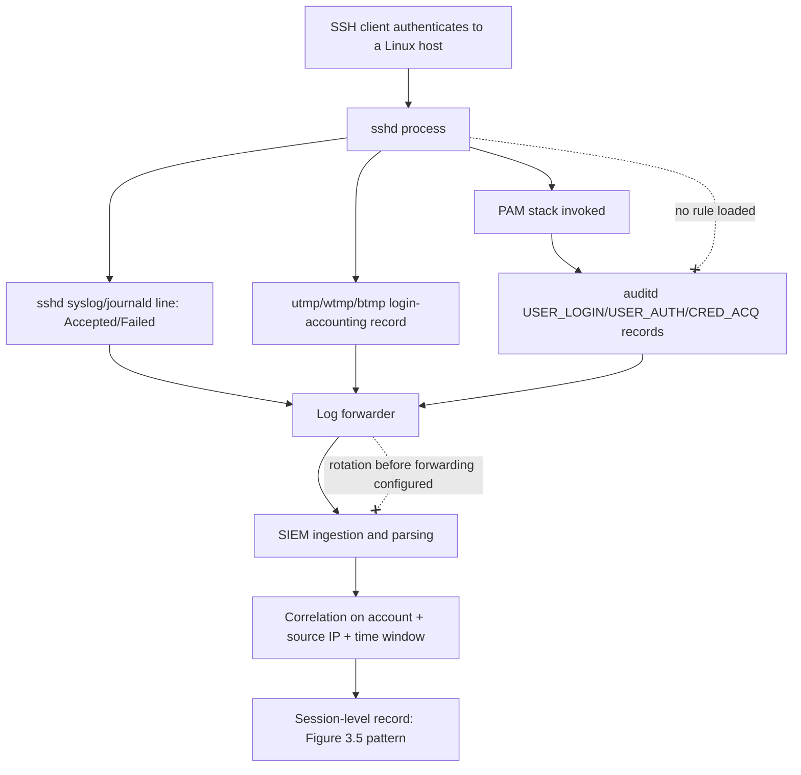

# Part 3 — Telemetry Engineering I: Host & Identity Sources

## Why this part exists

Part 2 walked the pipeline spine once, end to end, with one worked example. This part applies that spine to every major host and identity telemetry source a SOC actually ingests, and scores each one on the same eight axes so a reader can compare them honestly instead of trusting a vendor data sheet. This is telemetry-layer content — what the data is, what it actually captures, and where it silently lies to you. It is not the analytic layer: this part does not build detection logic for Windows Security events (that's Part 8), Sysmon (Part 9), PowerShell (Part 10), cross-OS endpoint analytics (Part 11), or authentication/identity analytics (Parts 12 and 13). Where this part does show a worked detection or hunt, it's illustrative of a telemetry-engineering point — a field dependency, a volume problem, a blind spot — not a substitute for the deeper analytic buildout those later parts own.

Two sources get systematic treatment here and nowhere else in the book: Linux host telemetry (`syslog`/`journald`/auditd) and generic, vendor-neutral EDR telemetry. Neither has a dedicated later part the way Windows does, so this is where their architecture, blind spots, and cost profile get the depth Windows telemetry gets spread across three parts. SSH authentication and session telemetry gets the same depth for the same reason — no other part in the book owns it end to end.

The worked examples in this part use real telemetry captured from a home-lab environment (Proxmox containers running Pi-hole DNS, a vulnerability-scanner platform, and an internet-facing honeynet), not synthetic log samples. Every real excerpt is labeled `REAL LAB EXAMPLE` per the evidence-classification rules in `STYLE-GUIDE.md` §9, and every figure states plainly what it does and doesn't prove.

---

## 1. Scoring model: the eight axes this part uses

**[CONCEPT]** Every telemetry source in this part gets scored on the same eight axes, so "Sysmon is good telemetry" or "auditd is noisy" are claims you can check rather than received wisdom:

| Axis | What it actually asks |
|---|---|
| Visibility | What categories of activity does this source capture at all — process execution, network connection, file access, authentication, privilege change? |
| Blind spots | What specific technique, transport, or condition produces no record here, even though the source is working exactly as designed? |
| Volume | Roughly how many events per host per day at default/typical configuration, and what drives that number up or down? |
| Quality | Given an event exists, how much of it is directly usable — is the field you need present, correctly typed, and unambiguous, or does it require a join to mean anything? |
| Retention | What's the realistic retention window this source supports at typical cost, separate from what your SIEM vendor's marketing implies is standard? |
| Cost | What does ingesting and storing this source at production volume actually cost — licensing, per-GB ingestion, compute for parsing, or all three? |
| Field completeness | Does the schema vary by OS version, agent version, or vendor build in a way that breaks a rule written against an earlier version? |
| Parser reliability | How often does a vendor-side format change silently break the field mappings a detection depends on, and how would you know? |

None of these axes is "quality" alone — a source can score high on visibility and low on retention, or high on volume and low on quality, and the combination is what determines whether a detection built on it is durable. Data Feasibility (TERMINOLOGY.md §2) is this scoring exercise performed *before* an analytic is designed; this part exists to make that check fast instead of ad hoc.

> **Engineering Reality**
> No vendor data sheet reports these eight axes honestly in one place. Visibility claims come from the product page; volume and cost surface only after the pilot; field completeness and parser reliability surface only after the first agent upgrade breaks a rule. Budget the discovery cost of these last two axes into every new source onboarding — they are the two most likely to be wrong in the optimistic direction.

---

## 2. Windows Security & System event log

**[ENGINEERING]** The native Windows Security and System event logs are the oldest host telemetry source in this book and the one Part 8 covers at field-by-field depth. This section states only what the telemetry-layer scoring looks like, so the comparison in §11 is complete.

Visibility: authentication (Event ID 4624 — An account was successfully logged on; Event ID 4625 — An account failed to log on), privilege use (Event ID 4672 — Special privileges assigned to new logon), process creation when Command Line Process Auditing is enabled (Event ID 4688 — A new process has been created), and account/group management (Event ID 4720 — A user account was created). Blind spots: 4688's `CommandLine` field is empty unless the Group Policy setting is explicitly enabled — it is not on by default — and the native log has no image-load, no DNS, and no registry-value telemetry at all. Volume: 4624/4625 alone routinely exceeds 10,000 events a day on a 5,000-seat domain. Cost: low per-event (already licensed as part of the OS), but volume drives SIEM ingestion cost up fast if collected unfiltered. Field completeness: stable across supported Windows Server versions, but the *presence* of high-value fields (command line, parent process) depends entirely on GPO settings most default builds don't turn on.

> **Blind Spot**
> The native Windows log was never designed as a security telemetry product — it's an OS audit log that security tooling adopted. It has no concept of a process's full ancestry chain, no image-load events, and no built-in network-connection record. Every one of those gaps is why Sysmon (Part 9) exists as a separate source rather than a configuration option on this one.

---

## 3. Sysmon

**[ENGINEERING]** Sysmon is the Sysinternals-provided kernel-level instrumentation layer that fills the native log's process/network/file gaps, and Part 9 covers its configuration and deployment in depth. Telemetry-layer summary: visibility extends to process creation with full command line and parent chain (Sysmon Event ID 1, Process Create), network connections (Sysmon Event ID 3, Network Connection), and file creation (Sysmon Event ID 11, FileCreate), disambiguated from Windows Security IDs on first use per the numbering convention because both use low numbers.

Volume is the dominant axis here: a permissive config generates ten times the event count of a filtered one on the same host, mostly from Event ID 3 on routine browser and update traffic. Quality is high where configured — command lines, hashes, and parent-child relationships are populated by design — but entirely absent for any event type not enabled in the active config, which is the single most common Sysmon deployment mistake: assuming coverage that the deployed config file doesn't actually provide.

> **Engineering Reality**
> Sysmon has no built-in tamper-alert mechanism of its own beyond what the OS and EDR layer provide — an attacker with local admin can stop or reconfigure the Sysmon service, and unless something else (a Windows Event Forwarding heartbeat check, an EDR self-protection feature) is watching for that, the gap produces silence, not an alert. Silence is exactly what "nothing happened" also looks like.

---

## 4. PowerShell logging

**[ENGINEERING]** PowerShell telemetry — Module Logging (Event ID 4103) and Script Block Logging (Event ID 4104) — is Part 10's exclusive analytic territory; this section states the telemetry-layer facts that Part 10 assumes as background. Visibility: 4104 captures the deobfuscated script text at the moment it executes, which is why it survives most string-obfuscation tricks that would defeat a static signature. Neither is enabled by default in any currently supported Windows version — both require Group Policy. Volume scales with how much PowerShell activity a host legitimately runs, which on a developer or admin workstation can be substantial. Field completeness: reliable once enabled, but retroactively worthless — a host with the GPO applied only after an incident has no historical script-block record for the period before that.

> **Blind Spot**
> Constrained Language Mode and AMSI integration change what PowerShell *can* do, not what gets logged — an attacker downgrading to PowerShell version 2 (where it's still installed) bypasses both the newer logging and the newer security controls simultaneously. Whether version 2 is even present is itself worth checking as a standing hardening item, independent of any detection built on 4103/4104.

---

## 5. Generic, vendor-neutral EDR telemetry

**[ENGINEERING]** Every commercial EDR agent — regardless of vendor — sits on the same rough architecture: a kernel-mode driver or ETW consumer capturing process, file, registry, network, and image-load events; a user-mode agent that enriches those events (parent-child chains, hash computation, reputation lookups, sometimes a local behavioral model); and a cloud or on-prem backend that stores, correlates, and exposes the data via a query API and/or a SIEM export.

### 5.1 What an EDR agent actually sees

**[ENGINEERING]** Visibility is broader than any single native OS log: process creation with full ancestry, network connections correlated to the originating process, file writes, registry modifications, image loads (DLL/driver loads), and — for most vendors — some memory-level signal (handle access to sensitive processes, code-injection heuristics). This is the superset Sysmon approximates on Windows and that Linux has no single native equivalent for, which is part of why commercial EDR adoption on Linux fleets has lagged Windows fleets by years.

**MITRE:** T1055 (Process Injection), T1003.001 (OS Credential Dumping: LSASS Memory) — both are the canonical examples of behavior EDR memory-access telemetry is built to surface; neither is fully covered by any single native OS log on any platform.

### 5.2 EDR blind spots and tamper surface

> **Blind Spot**
> EDR visibility depends entirely on the agent staying installed, running, and unmodified. An attacker with sufficient privilege can disable the agent's driver, corrupt its local queue, or — for agents relying on user-mode hooking rather than kernel telemetry — unhook the specific API calls their tooling uses. None of this produces "the EDR alerted on tampering" unless the vendor's self-protection and heartbeat-loss detection are both configured and actually monitored; a silently dead agent looks identical to a healthy, quiet one from a dashboard that only shows "installed" counts.

**MITRE:** T1562.001 (Impair Defenses: Disable or Modify Tools). Tactic: TA0005 (Defense Evasion).

**[ENGINEERING]** A second, less discussed blind spot: EDR agents routinely ship a built-in exclusion list for "known noisy" or "known trusted" processes to control false-positive volume — backup agents, patch-management tools, the vendor's own updater. That exclusion list is opaque to most SOC teams unless they explicitly pull and review it, and it is a documented technique for attackers to abuse: living inside a process the agent has already decided not to watch closely.

> **What Would Change My Mind**
> This part assumes most EDR agents' default exclusion lists are not routinely audited by the SOC teams running them. If a survey of production EDR deployments showed exclusion lists are reviewed on a fixed schedule (quarterly or better) as standard practice rather than the exception, this section's framing of exclusion-list opacity as an underappreciated blind spot would need to soften.

### 5.3 EDR volume, retention, and cost

**[ENGINEERING]** Volume varies more by vendor telemetry philosophy than by fleet size: some agents forward every raw event to the cloud backend for server-side filtering; others filter locally and forward only what matched a rule or crossed a noise threshold. The first model gives better retroactive hunting (Part 34–36) at meaningfully higher cost; the second is cheaper but means a technique that wasn't flagged at the time is often simply gone by the time a hunter goes looking for it.

> **SOC Management View**
> EDR licensing is almost always per-endpoint, not per-GB, which decouples the vendor bill from data volume in a way SIEM ingestion cost never is — but retention of the *raw telemetry* behind that license is frequently capped at a much shorter window (commonly 30 to 90 days) than the license term itself, and extending it is a separate line item. Before approving an EDR renewal, confirm the raw-telemetry retention window matches your incident-response and hunt requirements, not just the license duration — a 12-month license with 45 days of queryable raw telemetry is a common and expensive surprise.

### 5.4 EDR field completeness and parser reliability across vendors

**[ENGINEERING]** Because there is no cross-vendor EDR schema standard the way ECS/OCSF aim to normalize SIEM data (Part 6), the same conceptual event — a process-injection heuristic firing — can arrive with entirely different field names, severity scales, and enrichment depth depending on vendor, and depending on *agent version* within the same vendor. A detection rule built against one agent version's field layout is not guaranteed to survive the next agent upgrade; this is Parser Debt (TERMINOLOGY.md §5) in its purest form, because an EDR agent upgrade produces zero ingest errors even when it silently renames or restructures the fields a rule depends on.

> **Engineering Reality**
> Budget a detection-regression test pass into every EDR agent upgrade cycle, the same way you would for a SIEM platform upgrade. Vendors publish release notes for new detection capabilities far more reliably than they publish a diff of field-schema changes — the schema changes are usually discovered by whichever rule goes silent first.

---

## 6. Linux host telemetry: syslog, journald, and auditd

**[ENGINEERING]** Linux host telemetry has no single dominant product the way Sysmon dominates the Windows conversation — it's built from three layers that a detection engineer has to understand as separate pieces with separate failure modes.

### 6.1 syslog and journald as generic transport

`syslog` (via `rsyslog` or `syslog-ng`) and `journald` (systemd's binary structured logging layer, queryable via `journalctl`) are transport and storage mechanisms, not telemetry sources in their own right — they carry whatever any given daemon chooses to write to them. `sshd`, `sudo`, `systemd` itself, and most system services log through one or both. `journald` on a modern systemd-based distribution captures structured fields (`_COMM`, `_PID`, `_UID`, boot ID) that plain-text `syslog` output discards, which matters directly for query reliability — the evidence in §6.3 below shows exactly this distinction.

**[ENGINEERING]** Retention on both is local-disk by default and rotated aggressively unless explicitly configured otherwise — a fresh install with no forwarding configuration routinely retains only a few days to a few weeks of history before rotation deletes it, far short of most SOC retention requirements (Part 7 covers retention-window mechanics generally). Forwarding to a central collector (via `rsyslog` relay, a Filebeat/Fluentd agent, or a syslog-to-SIEM pipeline) is a separate onboarding decision this part treats as a prerequisite, not an assumption.

### 6.2 auditd architecture and rule model

**[CONCEPT]** `auditd` is the Linux Audit Framework's userspace daemon, consuming events from a kernel-side audit subsystem via a netlink socket. Unlike `syslog`/`journald`, which record whatever a program chooses to emit, `auditd` records specific *syscalls and kernel-level events* according to rules loaded via `auditctl` (or a persistent `/etc/audit/rules.d/` file) — nothing is captured unless a rule says to watch for it. This is the single most important architectural fact about auditd for a detection engineer: it is not a firehose by default, it is a firehose only for the syscalls you tell it to watch, and everything else is invisible.

A typical rule watches a specific syscall (`execve`, `open`, `connect`) or a specific file path, and the resulting `SYSCALL` record is normally paired with an `EXECVE` record (full argument list for a process execution) and further paired with `PATH` or `CWD` records depending on what the rule targets. Key fields that matter for correlation: `auid` (the *login* UID — the identity of the human or process that authenticated the session, which survives a `su`/`sudo` privilege change and is therefore more durable than `uid` for tracking "who actually did this"), `exe` (the resolved binary path), `comm` (the process name as reported by the kernel, which can differ from `exe` and is spoofable by the process itself), and `success` (whether the syscall itself succeeded, independent of whether the *security-relevant outcome* the analyst cares about did).

> **Hunter's Note**
> Pull `auid`, not `uid`, whenever the question is "who is actually behind this session," the same way Logon ID is the right pivot on Windows rather than username. `uid` reflects the *current* effective identity of a process, which changes on every `sudo`/`su`; `auid` reflects the identity of the session that originally authenticated, and stays constant across privilege escalations within that session — which is exactly the property you need when hunting for privilege-escalation abuse rather than being defeated by it.

### 6.3 auditd volume, tuning, and the performance tradeoff

> **Engineering Reality**
> A ruleset that watches every `execve` on a busy multi-tenant host generates enough volume to measurably affect the host's own performance under load, not just SIEM ingestion cost — every syscall audited adds a kernel-context-switch cost on top of the syscall itself. Production auditd deployments almost universally tune rules down to specific paths, specific syscalls, and specific UID ranges (excluding well-known noisy service accounts) rather than running an unfiltered watch-everything ruleset, and that tuning is itself a detection-engineering decision with real coverage tradeoffs, not a purely operational one.

**[ENGINEERING]** Volume without tuning easily exceeds Sysmon's on an equivalently busy host, because auditd's `execve` watch captures every child process of every shell script and cron job, including the ones a legitimate automated task spawns dozens of times a minute. The real-lab evidence below is a clean illustration of exactly this pattern at a smaller scale, using scheduled sudo invocations rather than raw syscall auditing, but the volume-driver mechanism is the same: automation is loud, and a rule that doesn't distinguish automation from an attacker drowns in its own baseline.

**Figure 3.1 — Scripted sudo invocation vs. interactive sudo invocation.** *REAL LAB EXAMPLE.* Two `journalctl`/`auth.log` excerpts from two different lab hosts, showing the field-level difference between a scheduled automation's sudo pattern and a human administrator's sudo pattern.

```text
# CT104 "vulnscan" - health-check script polling its own database via sudo,
# captured via `journalctl _COMM=sudo --no-pager`, repeats on a roughly
# periodic interval - mostly 45-60 minutes apart in the full sample, with
# occasional outliers (two queries one second apart, one gap near two hours):

Sep 10 05:42:02 vulnscan sudo[2229]:     root : PWD=/root ; USER=vulnscan ; \
  COMMAND=/usr/bin/sqlite3 /opt/vulnscan/data/vulnscan.db 'SELECT count(*) FROM scanner_errors;'
Sep 10 06:38:57 vulnscan sudo[2393]:     root : PWD=/root ; USER=vulnscan ; \
  COMMAND=/usr/bin/sqlite3 /opt/vulnscan/data/vulnscan.db 'SELECT count(*) FROM scanner_errors;'

# CT100 "pihole" - a human administrator's interactive sudo sessions,
# captured via `grep sudo /var/log/auth.log`, irregular timing, varied
# commands, real TTY attached:

Jul 07 11:54:58 pihole sudo[33546]:     root : TTY=pts/1 ; PWD=/root ; USER=root ; \
  COMMAND=/usr/bin/ss -tulpn
Aug 17 15:28:38 pihole sudo[143836]:     root : TTY=pts/1 ; PWD=/root ; USER=root ; \
  COMMAND=/usr/bin/pihole-FTL --config
```

The scripted pattern has three durable properties a detection can lean on: a bounded, roughly periodic interval (not perfectly fixed — the full 40-line sample includes a back-to-back pair one second apart and one gap of nearly two hours — but nothing resembling human typing cadence), an identical `USER=` target every time, and no `TTY=` field (there is no attached terminal for a cron-launched process). The interactive pattern has none of those regularities. A rule that baselines "this service account's sudo commands should come from a small, fixed command allowlist with no TTY" would fit the CT104 pattern; the same rule would be a source of constant false positives if applied to a human administrator's account. This is exactly why Part 31 (Baselining) treats "service account" and "human account" as different entity classes rather than one undifferentiated "account" baseline — the evidence above is a small, concrete illustration of why that distinction has to exist before any rule is written.

**MITRE:** T1548.003 (Abuse Elevation Control Mechanism: Sudo and Sudo Caching). Tactic: TA0004 (Privilege Escalation).

### 6.4 auditd blind spots

> **Blind Spot**
> auditd only records what its loaded ruleset tells it to watch, and the ruleset itself is a plain file an attacker with root can edit or a service they can stop — `auditctl -e 0` disables auditing outright, and `service auditd stop` (where permitted) removes the collection layer entirely, in both cases with no tamper alert unless something else independently monitors the audit subsystem's own health. This mirrors the EDR tamper blind spot in §5.2 almost exactly: the collection layer and the thing it's supposed to detect tampering *of* are the same layer, which is a structural weakness common to host-based auditing generally, not specific to auditd.

**MITRE:** T1562.001 (Impair Defenses: Disable or Modify Tools). Tactic: TA0005 (Defense Evasion). Note: `auditctl -e 0` and stopping the `auditd` service disable *future* collection — they are Impair Defenses, the same technique used for the EDR case in §5.2, not T1070.002 (Clear Linux or Mac System Logs), which covers deleting or wiping *existing* log content (`wtmp`/`btmp`/`journalctl --vacuum-*`, shell-history clearing) and is a different action with a different telemetry footprint.

> **False Positive Trap**
> Configuration-management tooling (Ansible, Puppet, Chef) and container-orchestration health checks routinely spawn short-lived processes at high frequency, and if `execve` auditing is enabled broadly, every one of those child processes produces a `SYSCALL`/`EXECVE` pair. The fix is not to disable `execve` auditing — narrow the watched UID range and path set to exclude the specific service accounts these tools run as, and validate the exclusion doesn't also blind you to an attacker who compromises and runs as that same service account (a real tension, not a clean fix — see Part 31 on distinguishing baseline drift from compromise within a single account's own pattern).

---

## 7. SSH authentication and session telemetry

**[ENGINEERING]** SSH telemetry is assembled from several independent sources that most SOC teams treat as one thing and are not: `sshd`'s own log lines (via `syslog`/`journald`), the kernel-adjacent `utmp`/`wtmp`/`btmp` login-accounting databases (readable via `last`, `lastb`), and — if configured — `auditd`'s `USER_LOGIN`/`USER_AUTH`/`CRED_ACQ` record types for the PAM stack SSH authenticates through. None of these three sees the whole picture alone.

### 7.1 Where SSH events actually come from

**[ENGINEERING]** `sshd` logs the authentication outcome and method directly: `Accepted password for <user> from <ip>`, `Accepted publickey for <user> from <ip>`, `Failed password for <user> from <ip>`, and connection-level events (protocol/algorithm negotiation failures, disconnects) that occur *before* any authentication attempt is even possible. `btmp` (failed logins, queried via `lastb`) and `wtmp` (successful logins, queried via `last`) are separate binary accounting files maintained by the login stack, not by `sshd` itself, and they record the *outcome* with none of the negotiation-level detail `sshd`'s own log carries. auditd's PAM-stack records add the `auid` linkage described in §6.2, which neither of the other two sources carries on its own.

### 7.2 Worked evidence: a real failed-login burst

**Figure 3.2 — SSH failed-login burst against CT104 "vulnscan," captured from `/var/log/btmp`.** *REAL LAB EXAMPLE.* 100 lines of genuine, pre-existing `btmp` records read via `lastb -n 100` on a real home-lab host; source `192.168.1.126` resolves (via the DHCP lease table) to a real device on this network, not an external attacker.

```text
admin    ssh:notty    192.168.1.126    Mon Sep 14 01:17 - 01:17  (00:00)
root     ssh:notty    192.168.1.126    Mon Sep 14 01:06 - 01:06  (00:00)
root     ssh:notty    192.168.1.126    Mon Sep 14 01:06 - 01:06  (00:00)
root     ssh:notty    192.168.1.126    Mon Sep 14 01:06 - 01:06  (00:00)
[... dozens more root/admin attempts from the same source IP, same minute-level
     bursts, spanning 2026-09-13 20:31 through 2026-09-14 01:17 ...]
```

**[DETECTION ENGINEER]** Two things this evidence shows that a synthetic sample wouldn't make as concrete: only two account names appear across the whole capture (`admin`, `root`) — this is not the wide dictionary-style username sweep a naive mental model of "brute force" might assume — and the window is dominated by one long, unbroken run of `root` attempts bracketed by short `admin` clusters at each end, rather than a tight turn-by-turn alternation between the two. Multiple attempts also land in the exact same minute repeatedly — consistent with an automated retry loop rather than a human manually retyping a password. `lastb` does not expose the attempted password, so a `btmp`-only detection has no visibility into *what* was tried, only *that* an attempt failed, against which account, from which source. Note also that with only two distinct usernames in play here, DET-03-01's `distinct_usernames >= 3` branch (§7.4) would not be what catches this specific burst — the sheer connection count is what would.

### 7.3 Detection Autopsy — the naive failed-login-count rule

> **Detection Autopsy — "alert on N failed SSH logins from one source in an hour"**
>
> **The rule:** Count `Failed password` lines (or `btmp` entries) grouped by source IP within a sliding one-hour window; alert if the count exceeds a fixed threshold.
>
> **Why it shipped:** It's the textbook brute-force signal, it needs no enrichment or baseline, and the query is a one-line `stats count by src_ip` — cheap to write and easy to explain in a design review.
>
> **How it failed:** `sshd`'s `MaxAuthTries` setting (default 6 in most distributions) permits multiple password prompts *within a single TCP connection* before the connection drops. A human who mistypes a password twice before getting it right, or a legitimate script with a stale credential retried by a connection-pooling client, can generate several `Failed password` lines from one benign event — and the raw count metric cannot distinguish that from a scripted attacker making one attempt per connection across several connections. The evidence in Figure 3.2 shows real automated bursts landing in the same minute, which a naive count-only rule would catch — but it would catch a misconfigured internal script with equal confidence, and the false-positive rate against ordinary retry behavior was the actual driver of alert fatigue in early deployments of this rule pattern.
>
> **The fix:** Count *distinct connections* (unique `sshd` PID per attempt, or unique `btmp` session boundary) rather than raw failed-password line count, and separately track distinct *usernames* tried per source — a source cycling through many usernames in a short window is a materially stronger signal than a high raw count against one username. See DET-03-01 below for the corrected version.

### 7.4 DET-03-01 — SSH failed-authentication burst detection, corrected for connection-count inflation

**[DETECTION ENGINEER]** The following is illustrative Splunk SPL, targeting `sshd` syslog/journald ingestion normalized to at minimum a timestamp, source IP, target username, and outcome field. It has not been run against a production Splunk instance and should be validated against your own field names before deployment.

CONCEPTUAL SAMPLE — illustrative SPL; field names assume a normalized sshd source

```spl
index=linux_auth sourcetype=sshd "Failed password"
| rex field=_raw "Failed password for (invalid user )?(?<target_user>\S+) from (?<src_ip>\S+) port (?<src_port>\d+)"
| eval conn_key = src_ip . ":" . src_port
| stats dc(conn_key) as distinct_connections, dc(target_user) as distinct_usernames, count as raw_failed_lines by src_ip
| where distinct_connections >= 5 OR distinct_usernames >= 3
| sort - distinct_connections
```

This query targets Splunk with `sshd` logs ingested via a syslog or journald forwarder; it depends on the source port surviving ingestion unmodified, which some log-shipping configurations strip or rewrite — verify the `src_port` field is actually populated before trusting the `distinct_connections` count, since a missing port collapses every attempt from one IP into a single connection key regardless of how many real connections occurred. The regex itself is also OpenSSH-specific: Dropbear and other non-OpenSSH daemons — common on embedded devices, routers, and IoT gear sharing a subnet with the Linux fleet — log failed authentication in a different format entirely (`bad password attempt for 'user' from ip:port`), so this query silently returns zero matches against them rather than erroring; that is the Parser Debt failure mode named in TERMINOLOGY.md §5, not a sign the host is clean.

Expected false-positive rate depends entirely on how exposed the host is: on an internal, non-internet-facing Linux fleet with no routine scanning, this should fire rarely enough that every alert is worth a look. On an internet-facing SSH host, or one regularly hit by an internal vulnerability scanner or SSH configuration auditor (see the False Positive Trap immediately below), expect a handful to a few dozen alerts a week purely from scanner and auditor traffic before the allowlist is in place — size analyst triage capacity for that volume, not just the volume after tuning.

> **Blind Spot**
> Both thresholds only bound what a *single source IP* can do inside one search window — they say nothing about how little it takes to stay under that bound. Four connections against one privileged account, each using every `MaxAuthTries` password prompt before disconnecting, is 24 real guesses that never trips `distinct_connections >= 5` or `distinct_usernames >= 3`. The same structural gap defeats this query from the other direction: Figure 3.4's own honeypot capture shows the identical `admin`/`admin` and `support`/`support` pairs arriving from many unrelated source IPs (`186.242.162.94`, `130.12.180.51`, `46.8.31.44`, `8.136.128.232`, `122.246.112.107`, plus the `176.53.159.196`–`.198` cluster), each individually well under either threshold — grouping `by src_ip` never aggregates a distributed spray into one signal. Catching either pattern needs a second analytic keyed on target username or credential pair across all sources, not on source IP alone.

> **False Positive Trap**
> Vulnerability scanners and SSH configuration auditors (including the vulnscan platform itself, per the honeynet evidence in §7.5 below) deliberately open many short-lived SSH connections with mismatched or legacy algorithms as part of normal, authorized scanning. Maintain an explicit allowlist of known scanner source IPs and exclude them at the query level, the same pattern used for lateral-movement false positives elsewhere in this book — and confirm the allowlist is reviewed on a schedule, since an unreviewed scanner exclusion is exactly the kind of undocumented exception that becomes Tuning Debt.

> **Detection Test**
> **Setup:** A Linux test host running `sshd` with default `MaxAuthTries`, `sshpass` installed on the test client, log forwarding to the SIEM under test.
> **Action:** `for i in $(seq 1 8); do sshpass -p 'wrongpassword' ssh -o PreferredAuthentications=password -o PubkeyAuthentication=no -o StrictHostKeyChecking=no baduser@testhost; done` (wrong password each time, from a fixed source IP).
> **Expected result:** Eight distinct `sshd` connection records for the source IP — one per `ssh` invocation — each pairing to at least one `Failed password` line. `distinct_connections` for that source IP should equal 8, the number of `ssh` invocations actually run; `raw_failed_lines` may come back higher than 8 if `MaxAuthTries` allows more than one password prompt per connection. That gap between the two counts, reproduced on demand, is exactly what this query is built not to be fooled by.

`sshpass` (or an equivalent non-interactive credential feeder) is load-bearing in the action above, not a convenience: without it, `ssh` either blocks on a manual password prompt when stdin is a real terminal, or — when stdin isn't a TTY, as in a cron job or CI runner — skips password authentication entirely and produces zero `Failed password` lines, letting the test pass silently without ever exercising the detection.

**MITRE:** T1110 (Brute Force), T1110.001 (Password Guessing). Note: the real honeynet evidence in §7.5 below is a default-credential sweep — attackers guessing common username/password pairs with no prior knowledge of real credentials — which maps to Password Guessing, not T1110.004 (Credential Stuffing); stuffing implies reuse of breached, real credential pairs, which this evidence does not show.

### 7.5 HUNT-03-01 — hunting legacy SSH protocol and algorithm negotiation attempts

**[THREAT HUNTER]** **Threat Hypothesis:** A host or scanner probing this network for SSH endpoints running outdated key-exchange or host-key algorithms (or attempting a raw SSHv1 handshake) would leave a distinctive `sshd`-level signature — negotiation failures before any authentication attempt — that a pure authentication-outcome detection (like DET-03-01) would never see, because the connection never reaches the authentication stage.

**Figure 3.3 — Legacy SSH key-exchange and host-key algorithm probe against CT108 "honeynet-edge."** *REAL LAB EXAMPLE.* Genuine `journalctl -u ssh` output; source `192.168.1.96` is the lab's own vulnerability-scanner host performing an authorized internal protocol/cipher audit — internal traffic, not an external attacker, but a realistic example of the exact `sshd` log signature this hunt targets.

```text
Sep 10 16:21:03 honeynet-edge sshd[540]: error: Protocol major versions differ: 2 vs. 1
Sep 10 16:21:03 honeynet-edge sshd[540]: banner exchange: Connection from 192.168.1.96 port 43042: could not read protocol version
Sep 10 16:21:03 honeynet-edge sshd[539]: Unable to negotiate with 192.168.1.96 port 43036: no matching key exchange method found. Their offer: diffie-hellman-group1-sha1 [preauth]
Sep 10 16:21:03 honeynet-edge sshd[541]: Unable to negotiate with 192.168.1.96 port 43058: no matching host key type found. Their offer: ssh-rsa [preauth]
Sep 10 16:21:04 honeynet-edge sshd[552]: Unable to negotiate with 192.168.1.96 port 43090: no matching host key type found. Their offer: ecdsa-sha2-nistp384 [preauth]
```

**Pivot:** Search for `Unable to negotiate` and `Protocol major versions differ` lines grouped by source IP over a rolling window, independent of any authentication outcome — these connections never reach the point where an authentication-outcome rule would evaluate them at all. A source offering a *sequence* of different legacy algorithms in quick succession (as shown above — `diffie-hellman-group1-sha1`, then `ssh-rsa`, then `ecdsa-sha2-nistp384`) across several connections seconds apart is a stronger recon signal than a single failed negotiation, which can also happen from a legitimately outdated but benign internal client.

**Finding:** In this lab, the pattern traced cleanly to the internal vulnerability-scanner host performing an intentional audit — a negative finding for malicious intent, but a positive finding for *coverage*: the sshd-level negotiation-failure signature is real, distinguishable from noise, and not covered by DET-03-01 at all. Filed as a new detection candidate: a standing rule on `Unable to negotiate`/protocol-version-mismatch line volume per source, with the lab's own scanner host as the first allowlist entry.

**MITRE:** T1595 (Active Scanning), T1595.002 (Vulnerability Scanning). Tactic: TA0043 (Reconnaissance).

### 7.6 SSH blind spots

> **Blind Spot**
> `sshd` authentication logging, `btmp`/`wtmp`, and PAM/auditd records all stop at the authentication boundary. None of them tell you what a successfully authenticated SSH session actually *did* once the shell started — that requires shell-history logging (which an attacker can disable or clear), auditd `execve` watching on the session's `auid` (§6.2), or an EDR agent's own process-tree telemetry (§5). An attacker using a stolen, valid SSH key produces an `Accepted publickey` line indistinguishable from the legitimate key owner's own login. This is the same structural gap Part 2 names for Windows 4624: a clean successful authentication event is not, on its own, evidence that the session that followed was legitimate.

Real internet-facing SSH telemetry looks meaningfully different from internal lab traffic, which matters when tuning any of the detections above for an internet-exposed host:

**Figure 3.4 — SSH honeypot credential-stuffing/default-credential-sweep capture.** *REAL LAB EXAMPLE.* Genuine SSH honeypot events from the honeynet's decoy listener, showing real internet source IPs attempting common default credential pairs.

```text
id     ts                           src_ip           username  password
10104  2026-09-10T09:07:30Z         176.53.159.196   support   support
10097  2026-09-10T08:21:03Z         176.53.159.196   support   support
10092  2026-09-10T07:47:47Z         186.242.162.94   admin     admin
10036  2026-09-10T02:26:30Z         47.93.39.183      root     KgW41vmgMK
```

**[DETECTION ENGINEER]** Source `176.53.159.196` (and near-neighbor addresses `.197`/`.198`) repeated the identical `support`/`support` pair against this one decoy across multiple days — a sustained, low-and-slow sweep, not a single noisy burst, which is a meaningfully different volume and timing profile than the internal `btmp` burst in Figure 3.2. A detection tuned only against high-frequency bursts (like the naive rule in §7.3) would miss this slower pattern entirely — and so would DET-03-01 as written: this sweep uses one username/password pair per source at a rate of at most a few attempts a day, which clears neither the `distinct_connections >= 5` nor the `distinct_usernames >= 3` threshold inside any single hourly search window. Catching a low-and-slow single-credential sweep needs a different analytic — one that counts the number of distinct days or weeks a source has appeared at all against a given host, rather than counting attempts within an hour. That gap is a genuine, named blind spot of DET-03-01, not a case it already handles.

---

## 8. Session-level correlation: what the pipeline looks like once it's working

**[ENGINEERING]** Sections 6–7 covered raw sources in isolation. It's worth showing, once, what the *output* of a working correlation pipeline over those sources looks like when the joins in Part 30 (Correlation Engineering) and the entity-resolution mechanics in TERMINOLOGY.md §6 actually succeed — not as a template to copy, but as a concrete picture of the target state this part's raw sources are meant to feed.

**Figure 3.5 — Correlated, MITRE-tagged honeynet attack sessions.** *REAL LAB EXAMPLE.* Output from the honeynet platform's own session-correlation logic, joining raw connection/HTTP/SSH events into `attack_sessions` records tagged with real ATT&CK technique IDs and a severity/status pipeline (`recon` → `probe` → `exploit_attempt` → `possible_success` → `confirmed_postexploit`).

```text
source_ip        first_seen            last_seen             status            mitre_techniques
16.5.0.236       2026-09-15T06:08:21Z  2026-09-15T06:08:23Z  possible_success  T1595, T1046, T1083, T1190
64.62.156.192    2026-09-15T00:01:56Z  2026-09-15T00:07:06Z  possible_success  T1595, T1046, T1083, T1190
45.156.128.45    2026-09-15T05:40:20Z  2026-09-15T05:40:20Z  exploit_attempt   T1595, T1046, T1190
```

This is telemetry engineering's payoff made visible: raw connection and request events, individually low-signal, joined on source IP within a bounded window into a session record that a human analyst can actually triage in seconds rather than reconstructing by hand from raw logs. It is exactly the Correlation and Entity concepts defined in TERMINOLOGY.md §6, built from telemetry this part's earlier sections describe — the honeynet's own logic flagged `possible_success` sessions specifically because it observed an exploit-shaped request *followed by continued activity from the same source*, which is a sequence condition, not a single-event match.

**MITRE:** T1595 (Active Scanning), T1046 (Network Service Discovery), T1083 (File and Directory Discovery), T1190 (Exploit Public-Facing Application).

> **What Would Change My Mind**
> This figure is presented as a positive example of correlation output, not as evidence that the underlying `possible_success` classification is always correct. If a manual review of a sample of these flagged sessions showed a high rate of benign explanations (a second, unrelated scanner reusing the same source IP shortly after a real exploit attempt, for instance), the confidence this section implicitly places in "exploit attempt followed by continued activity = worth escalation" would need to drop, and the classification logic itself would need a documented false-positive rate rather than being taken at face value.

---

## 9. systemd service-state telemetry

**[ENGINEERING]** systemd unit state transitions (`Starting`, `Started`, `Stopping`, `Deactivated successfully`, `Stopped`) are a frequently overlooked host telemetry source: they're the cleanest available signal for "did a security-relevant service (the SSH daemon, the EDR agent's own service unit, an application's own auth layer) stop and restart outside a known maintenance window."

**Figure 3.6 — systemd unit state transitions for a real application service.** *REAL LAB EXAMPLE.* Genuine `journalctl -u vulnscan-web` output showing the canonical `Stopping` → `Deactivated` → `Stopped` → `Starting` → `Started` sequence across several legitimate restart cycles.

```text
Sep 09 19:26:06 vulnscan systemd[1]: vulnscan-web.service: Deactivated successfully.
Sep 09 19:26:06 vulnscan systemd[1]: Stopped vulnscan-web.service - Vulnerability Scanner Dashboard (web).
Sep 09 19:26:07 vulnscan systemd[1]: Starting vulnscan-web.service - Vulnerability Scanner Dashboard (web)...
Sep 09 19:26:07 vulnscan systemd[1]: Started vulnscan-web.service - Vulnerability Scanner Dashboard (web).
```

Visibility here is binary and cheap: the unit transitioned, full stop — no detail on *why* beyond whatever the unit's own application log says separately (visible above as the `uvicorn` worker-process lines interleaved in the same journal). Quality is high for the fact of the transition and low for root cause, which has to be joined from the application's own log lines using the timestamp and PID as the join key. Volume is low unless a service is crash-looping, in which case the *rate* of Starting/Started cycles becomes the signal worth alerting on directly — a service restarting every few seconds is functionally an availability incident whether or not it's security-relevant, and either way is worth a standing rule independent of any specific attack hypothesis.

> **Hunter's Note**
> If you suspect an attacker stopped a logging or security-agent service to operate quietly and then restarted it to avoid raising an availability alert, systemd's own journal is one of the only sources that survives that exact maneuver — the stop/start pair is recorded by `systemd` itself (PID 1), not by the service being stopped, so disabling the *service* doesn't erase the record of it having been disabled, unless the attacker also has enough privilege to tamper with the journal itself (§6.4's blind spot applies here too).

---

## 10. Identity telemetry: directory and IdP sign-in logs

**[ENGINEERING]** Identity telemetry — on-prem Active Directory Security log authentication events, Kerberos ticket-request events, and cloud IdP (Entra ID, Okta, Google Workspace) sign-in logs — gets its analytic-layer treatment in Part 12 (access/authentication behavior) and Part 13 (directory/privilege/Kerberos behavior), and its cloud-specific telemetry treatment in Parts 18 and 19. This section limits itself to the telemetry-layer scoring that feeds §11's comparison below.

Visibility: on-prem, Event IDs 4624, 4625, 4672, 4768, and 4769 (the last two are Kerberos ticket-granting and service-ticket events, covered in depth in Part 13) form the backbone; cloud IdPs expose a sign-in log with richer contextual enrichment out of the box (client app, device compliance state, conditional-access decision, risk score) but a materially different schema per vendor. Blind spots: on-prem AD logging depends on domain-controller-level audit policy being configured consistently across every DC in the forest — a DC missed during a policy rollout produces a silent, partial visibility gap that looks identical to "nothing happened on that DC" until someone checks. Field completeness: the entity-resolution problem from TERMINOLOGY.md §6 is sharpest here — a SID, a UPN, and a cloud `object_id` can all refer to the same human, and no single field survives unchanged across an on-prem-to-cloud identity sync boundary (Azure AD Connect / Entra Connect) without an explicit join.

> **Engineering Reality**
> "We ingest sign-in logs from our IdP" is a Telemetry Coverage statement, not a Detection Coverage one (TERMINOLOGY.md §5) — and it is routinely treated as the latter in coverage reporting. A cloud IdP sign-in log with no corresponding baseline, no correlation to the on-prem identity it's synced from, and no analytic built against it is Visibility Debt sitting on a dashboard that looks like progress.

---

## 11. Comparative scoring rollup

The table below applies the eight axes from §1 across every source this part covers, as a single reference point for prioritizing onboarding and tuning effort. **(CONCEPTUAL SAMPLE)** — these are illustrative, heuristic ratings based on typical production deployments, not measured values from a specific environment; your own visibility and volume will vary by OS build, agent version, and configuration choices described in each section above.

| Source | Visibility | Volume | Retention (typical) | Parser reliability |
|---|---|---|---|---|
| Windows Security/System log | Auth, privilege use, limited process | High | 30–90 days | Stable — OS-native schema |
| Sysmon | Process, network, file, image-load | High, config-dependent | 30–90 days | Stable if config is version-pinned |
| PowerShell (4103/4104) | Full script-block text | Medium, host-dependent | 30–90 days | Stable once GPO-enabled |
| Generic EDR | Process, network, file, registry, memory-access heuristics | High | 30–90 days, often shorter than license term | Volatile across agent versions |
| syslog/journald | Whatever daemons choose to emit | Low to medium | Days to weeks unless forwarded | Stable transport, variable payload |
| auditd | Only what rules explicitly watch | Low if tuned, very high if not | Local disk, short unless forwarded | Stable schema, coverage depends on ruleset |
| SSH (`sshd`/`btmp`/`wtmp`) | Auth outcome and negotiation detail; no session content | Low to medium | Days to weeks unless forwarded | Stable, but three separate sources to reconcile |
| Identity (on-prem + cloud IdP) | Auth, privilege, Kerberos, sign-in context | High | 30–90 days on-prem; often longer in cloud IdP | Stable per source; breaks across cloud/on-prem join |

---






**Figure 3.7 — One SSH authentication event's journey across three independent Linux telemetry sources.** *CONCEPTUAL.* Illustrates why `sshd`'s own log, the `utmp`/`wtmp`/`btmp` accounting files, and auditd's PAM-stack records must be treated as three separately-failing paths rather than one telemetry source: the dashed lines mark two real, independent failure points from this part — an auditd ruleset with no PAM watch configured (§6.2) produces no `USER_LOGIN` record at all, and local log rotation racing ahead of a forwarding agent (§6.1) can drop `sshd`/`journald` records before they ever reach the SIEM. Neither failure produces an ingest error; both produce a query that silently returns fewer results than the real event count. This is a sketch of expected data flow and known failure points, not a capture from a specific incident.

---

## 12. Cost, retention, and staffing tradeoffs across this part's sources

> **SOC Management View**
> Every source in this part competes for the same two constrained resources: SIEM ingestion budget (usually billed per GB) and analyst attention (a fixed headcount that doesn't scale with data volume). auditd and unfiltered EDR telemetry are the two most likely sources in this part to blow through an ingestion budget if onboarded without the tuning described in §5.3 and §6.3 — and once a team is over budget, the typical response is retention-window cuts, which quietly reduce hunt and incident-response capability months before anyone notices, because a shorter retention window fails exactly the way a broken detection does: silently, until someone needs data that's already gone. Treat the tuning work in this part as a cost-control measure with a security payoff, not just an engineering nicety — it's the cheapest lever available before cutting retention becomes the only remaining option.

Every axis in this part's scoring model (§1) ultimately feeds one of two downstream questions Part 41 (Detection Coverage) and Part 43 (Detection Debt) formalize: does the telemetry exist at the fidelity a given analytic needs, and will it still exist, in that shape, a year from now. Getting the sources right at the telemetry-engineering layer — before a single detection rule is written against any of them — is what keeps those later coverage and debt assessments from discovering the gap after an incident already has.
