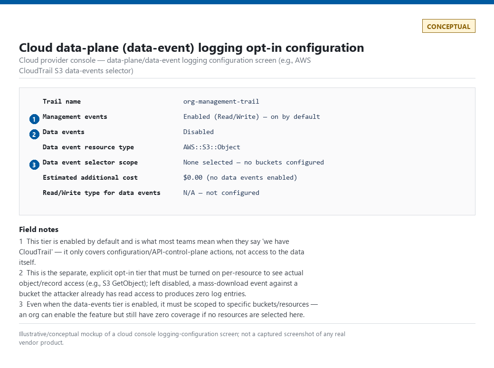
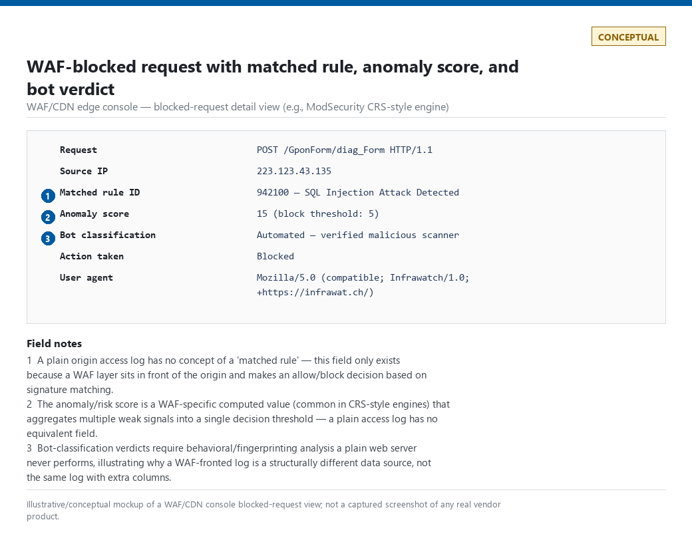
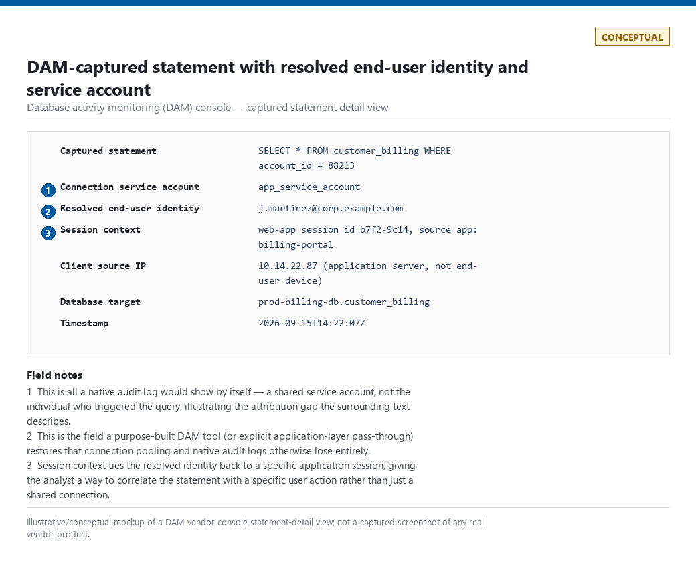
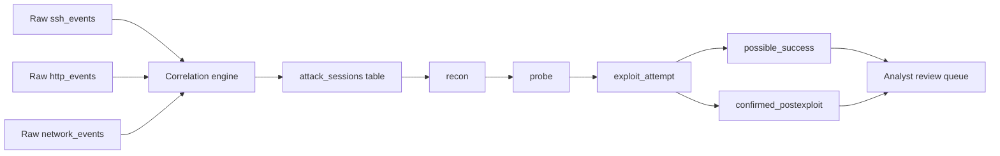

# Part 4 — Telemetry Engineering II: Network, Application & AI Sources

## Why this part exists

Part 3 scored host and identity telemetry — Windows, Sysmon, PowerShell, EDR, Linux/auditd, SSH — on visibility, blind spots, volume, quality, retention, cost, field completeness, and parser reliability. This part applies the same scoring model to everything that isn't sitting on an endpoint: DNS, proxy, firewall, network detection and response (NDR)/Zeek/NetFlow, email, cloud, web/WAF/API, database, and AI systems telemetry.

The split matters for a specific reason beyond organization. Several of these sources get a dedicated analytic-layer part later in the book — DNS tunnelling logic belongs to Part 15, web injection detections to Part 16, email/BEC to Part 17, cloud identity and infrastructure to Parts 18 and 19, AI prompt/tool-call detection to Part 21. This part treats those sources at the telemetry layer only: what the data is, what it actually captures, and where it silently fails you. Four sources — proxy, firewall, NDR/NetFlow, and database — get no dedicated deep-dive part anywhere else in the book. This part goes deep on those four, including real worked detections, because if the depth doesn't happen here, it doesn't happen.

Every real log excerpt in this part is captured from a genuine home-lab Proxmox environment running an internet-exposed honeynet, a Pi-hole DNS resolver, and a decoy web application — not a synthetic sample built to look plausible. Where the lab doesn't cover a topic (most Windows-specific telemetry, most cloud-console UI, most WAF/DAM vendor products), this part substitutes a labeled CONCEPTUAL illustration of the relevant fields instead of inventing a screenshot.

---

## 1. The scoring model, extended to network and application telemetry

**[CONCEPT]** Part 3's eight-dimension scoring model carries over unchanged:

- **Visibility** — what fraction of the relevant activity does this source actually see, and from where in the traffic path.
- **Blind spots** — the named, specific conditions that defeat the source entirely, not a vague "encryption is a problem" disclaimer.
- **Volume** — realistic events-per-second or GB/day at a stated organization size, because "high volume" without a number is not a planning input.
- **Quality** — how much of the volume is actionable signal versus routine noise baked into the protocol itself.
- **Retention** — what's actually affordable to keep, and for how long, at the volume this source generates.
- **Cost** — licensing, storage, and compute cost, including costs the vendor's default configuration doesn't disclose up front.
- **Field completeness** — whether the fields a detection needs are present, or only present under a non-default configuration flag.
- **Parser reliability** — how often this source's schema changes underneath a deployed detection with no ingest error raised (see Schema Drift, `TERMINOLOGY.md`).

Network and application sources add one wrinkle host telemetry doesn't have as sharply: **path dependency**. A host-based source like Sysmon sees a process regardless of which network segment the host sits on. A network-based source only sees what actually crosses the point in the topology where it's deployed — a proxy sees nothing that bypasses the proxy, a firewall sees nothing that traverses a path it doesn't inspect, and an NDR sensor sees nothing on a span port that isn't mirrored to it. Every blind spot in this part traces back to that one fact: **network telemetry is a statement about a wire, not about an endpoint.**

> **Engineering Reality**
> Every network-layer telemetry source in this part answers a narrower question than its marketing suggests. A firewall log tells you what the firewall decided to permit or deny, not what actually happened on the wire. A proxy log tells you what passed through the proxy, not everything the host sent. An NDR platform tells you what its sensor placement could see, not the whole network. Read every claim of "network visibility" in this part as "visibility at this specific point in the topology," and check the topology before trusting the claim.

---

## 2. DNS query telemetry

### 2.1 What a DNS query log actually captures

**[CONCEPT]** A DNS query log is a record of resolution requests and responses observed by a resolver — not by the client that issued them and not by the authoritative server that answered them. Depending on where the resolver sits, the log carries some subset of: query name, query type (A, AAAA, TXT, CNAME, etc.), requesting client IP, response code (NOERROR, NXDOMAIN, SERVFAIL, REFUSED), resolved value or CNAME chain, and whether the answer came from cache, from an upstream forward, or from a local blocklist match.

Figure 4.1 below is a real excerpt from this lab's Pi-hole/dnsmasq resolver — the same kind of log a small-to-mid-size organization's internal DNS forwarder produces, minus enterprise features like split-horizon views or DNSSEC validation status.

```text
Sep 15 08:32:47 dnsmasq[2221]: query[A] mykulprint.atrapa.deloitte.com from 192.168.1.169
Sep 15 08:32:47 dnsmasq[2221]: cached mykulprint.atrapa.deloitte.com is NXDOMAIN
Sep 15 08:32:47 dnsmasq[2221]: query[AAAA] mykulprint.atrapa.deloitte.com from 192.168.1.169
Sep 15 08:32:47 dnsmasq[2221]: cached mykulprint.atrapa.deloitte.com is NXDOMAIN
Sep 15 08:32:47 dnsmasq[2221]: query[AAAA] mykulprint.lan from 192.168.1.169
Sep 15 08:32:47 dnsmasq[2221]: config mykulprint.lan is NXDOMAIN
Sep 15 08:32:47 dnsmasq[2221]: query[A] mykulprint.lan from 192.168.1.169
Sep 15 08:32:47 dnsmasq[2221]: config mykulprint.lan is NXDOMAIN
Sep 15 08:32:47 dnsmasq[2221]: query[A] mykulprint.deloitte.com from 192.168.1.169
Sep 15 08:32:47 dnsmasq[2221]: cached mykulprint.deloitte.com is NXDOMAIN
Sep 15 08:32:47 dnsmasq[2221]: query[AAAA] mykulprint.deloitte.com from 192.168.1.169
Sep 15 08:32:47 dnsmasq[2221]: cached mykulprint.deloitte.com is NXDOMAIN
Sep 15 08:32:49 dnsmasq[2221]: query[AAAA] mobile.events.data.microsoft.com from 192.168.1.169
Sep 15 08:32:49 dnsmasq[2221]: gravity blocked mobile.events.data.microsoft.com is ::
Sep 15 08:32:49 dnsmasq[2221]: query[A] mobile.events.data.microsoft.com from 192.168.1.169
Sep 15 08:32:49 dnsmasq[2221]: gravity blocked mobile.events.data.microsoft.com is 0.0.0.0
```

**Figure 4.1 (FIG-04-01) — Pi-hole/dnsmasq query log excerpt, DNS suffix search-list resolution and a default-blocklist hit.** *REAL LAB EXAMPLE.* Captured 2026-09-15 from a genuine pre-existing Pi-hole instance (CT100) on this lab's home network via `tail -n 50 /var/log/pihole/pihole.log`. The three-domain retry pattern (`mykulprint.atrapa.deloitte.com`, `mykulprint.lan`, `mykulprint.deloitte.com`, each queried as both A and AAAA) is a Windows client's DNS suffix search list retrying a local printer's short hostname against every configured domain suffix, all resulting in NXDOMAIN. The `mobile.events.data.microsoft.com` block is Pi-hole's default gravity blocklist matching a legitimate Microsoft telemetry endpoint. No secrets are present in a DNS query log by construction; nothing here is redacted.

**[ANALYST]** Nothing in Figure 4.1 is malicious. That's the point of including it: this is what ordinary NXDOMAIN churn and blocklist activity look like on a real network, and any DNS-based detection has to be tuned against traffic exactly like this, not against a clean synthetic sample.

### 2.2 Blind spots and encrypted DNS

> **Blind Spot**
> A resolver-based DNS log only sees queries that actually reach that resolver. DNS-over-HTTPS (DoH) and DNS-over-TLS (DoT) let a client — including malware with a hardcoded DoH endpoint — resolve names against a public resolver (Cloudflare, Google, Quad9) over an encrypted HTTPS or TLS connection that never touches the organization's internal resolver at all. If your only DNS visibility is the internal resolver's query log, a client using DoH to a public resolver is invisible to it — the traffic looks, to a firewall or proxy that isn't specifically decrypting and inspecting it, like ordinary outbound HTTPS to a well-known cloud IP.

**[ENGINEERING]** Closing that gap requires either blocking known public DoH endpoints outright (a blunt, maintenance-heavy control, since the list of public DoH providers keeps growing) or gaining visibility into TLS handshake metadata — SNI or JA3 fingerprint — to identify DoH traffic without decrypting it, which pushes the actual detection logic into the NDR/proxy domain covered in §3 and §5.

DNS tunnelling scoring, domain-generation-algorithm (DGA) detection, and entropy-based rare-domain analytics are covered in full in Part 15, which owns that analytic logic exclusively. This part stops at telemetry: what the query log contains, what it doesn't, and why a query log alone is a weak substrate for tunnelling detection without the entropy/frequency logic Part 15 builds on top of it.

### 2.3 A naive detection that breaks on real Pi-hole data

**[DETECTION ENGINEER]** Figure 4.1's blocklist hit is real, genuine evidence of exactly why "the resolver blocked it" cannot be the alerting condition on its own.

> **Detection Autopsy — "blocklist hit means malicious"**
>
> **The rule:** Alert on any DNS query that resolves against a threat-intelligence or ad/tracker blocklist, treating a block event as evidence of compromise.
>
> **Why it shipped:** A blocklist hit feels like a clean binary signal — either the domain is on the list or it isn't — and it requires no threshold tuning to stand up.
>
> **How it failed:** Figure 4.1 shows exactly why: `mobile.events.data.microsoft.com` is on Pi-hole's default gravity blocklist because it's a Microsoft telemetry/advertising endpoint, not because it's malicious. Any Windows host with default settings queries it routinely. A blocklist built to reduce ad/tracker noise for privacy reasons and a blocklist built to catch C2 infrastructure are different lists serving different purposes, and conflating them turns every ordinary Windows telemetry callback into a page-out alert.
>
> **The fix:** Segment blocklists by intent before wiring them into an alert. A privacy/ad blocklist governs what gets silently dropped for bandwidth and tracking reasons; only a maintained threat-intelligence feed (with source, confidence, and last-seen metadata — see Part 32) should ever page an analyst. If the two lists share infrastructure, tag each entry with its source list and filter the alerting rule to threat-intel sources only.

**MITRE:** No single technique maps to this Detection Autopsy — it's a data-source hygiene failure rather than an adversary behavior, and forcing a MITRE tag onto it would be exactly the kind of invented mapping this book avoids.

---

## 3. Proxy telemetry

### 3.1 Explicit, transparent, and TLS-inspecting proxies

**[CONCEPT]** A web proxy sits between the client and the destination and can be deployed three ways: **explicit** (the client is configured with the proxy's address and sends traffic to it deliberately — PAC file, browser setting, or system-wide config), **transparent** (network routing forces traffic through the proxy without client configuration, usually via policy-based routing or a WCCP/PAC-less redirect), or as part of a **secure web gateway (SWG)** that also does TLS inspection, URL categorization, and content filtering inline. The proxy log's value depends entirely on which of these three you're running and whether TLS inspection is actually enabled for the traffic in question.

### 3.2 Fields, volume, and cost

**[CONCEPT]** A useful proxy log carries, at minimum: source user or IP (ideally resolved to an authenticated identity, not just an IP), destination URL or domain, URL category, action taken (allow/block/warn/bypass), bytes sent and received, HTTP method and status code, and whether TLS inspection actually decrypted this particular session or only saw the SNI/certificate metadata — the single field that determines whether every other field in this list reflects real content or just connection metadata.

**[ENGINEERING]** Proxy log volume scales with every HTTP(S) request an organization's users make, not just distinct sessions — a single modern web page can generate dozens of individual requests (ads, analytics beacons, CDN assets). A mid-size organization easily generates tens of millions of proxy log lines a day. TLS inspection multiplies the compute cost of every one of those requests, since the proxy has to terminate and re-establish the TLS session on both sides — this is why so many TLS-inspection deployments ship with broad bypass-category exclusions (see §3.3) that exist purely to keep CPU load manageable, not for any security reason.

### 3.3 Blind spots

**[CONCEPT]** The single largest gap in proxy visibility isn't a missing log field — it's a deliberate, documented exclusion built into every TLS-inspecting proxy for performance and compatibility reasons.

> **Blind Spot**
> Every SWG ships with a default bypass list for TLS inspection — usually banking sites (regulatory/liability reasons), major SaaS and collaboration platforms with certificate pinning that inspection would break (Zoom, Teams, some banking and VPN apps), and often broad categories like "personal cloud storage" or "streaming media" added purely to reduce compute load. Traffic in a bypass category is logged at the connection-metadata level only — destination, bytes, duration — never at the content level. An attacker who can get traffic classified into (or route it through infrastructure that happens to sit in) a bypassed category gets a free pass through the one control layer built specifically to look inside encrypted traffic.

### 3.4 DET-04-01 — TLS-bypass exfiltration via proxy category allowlist

**[DETECTION ENGINEER]** This detection targets the blind spot in §3.3 directly: it doesn't try to see inside bypassed traffic — that's structurally impossible without breaking the bypass policy itself — it flags when the *volume pattern* of bypassed traffic looks like a bulk transfer rather than the interactive use the bypass category was designed for.

The following SPL targets a Splunk deployment ingesting a generic SWG proxy log (field names shown match a common normalized proxy sourcetype; confirm against your own product's actual field names before deploying).

```spl
index=proxy category IN ("personal_cloud_storage","file_sharing") tls_inspected=false
| bin _time span=1h
| stats sum(bytes_out) as total_bytes_out, dc(dest_domain) as distinct_domains, count as request_count by src_user, _time
| where total_bytes_out > 500000000
| sort - total_bytes_out
```

This flags any user account with more than 500 MB of uninspected outbound traffic to a personal-cloud-storage or file-sharing category domain within a single hour. It does not identify what was uploaded — TLS bypass means that's never visible to the proxy — only that a bulk-transfer-shaped volume occurred through a category the inspection policy doesn't look inside.

> **Blind Spot**
> `bin _time span=1h` creates fixed, clock-aligned buckets (00:00–01:00, 01:00–02:00, and so on), not a rolling window. A transfer split across a bucket boundary — 450 MB at 12:47 and 450 MB at 13:04, for instance — never produces a single bucket total above the 500 MB threshold even though 900 MB moved in under twenty minutes. Defeating this doesn't require real sophistication; splitting the transfer across the top of the hour is enough, and it happens by accident too, whenever a legitimate large sync job happens to straddle the boundary. A sliding window, or a secondary per-user daily-total check run alongside this hourly one, catches what the fixed-bin version misses.

> **False Positive Trap**
> Legitimate backup software, CI/CD artifact publishing, and large approved-vendor SaaS integrations (a marketing team syncing a large asset library to an approved cloud storage tenant) all produce the exact same volume signature as exfiltration through a bypass category — that's the whole point of the bypass existing. The fix is an allowlist of known-legitimate bulk-transfer service accounts and scheduled jobs, reviewed on the same cadence as any other detection exception (see Exception, `TERMINOLOGY.md`), not a threshold increase — raising the byte threshold to suppress backup noise just raises the bar for an attacker moving the same volume.

**MITRE:** T1567.002 (Exfiltration to Cloud Storage).

> **What Would Change My Mind**
> This detection assumes an attacker moving bulk data through a TLS-bypass category produces a volume anomaly distinguishable from routine backup traffic by hour-of-day or account role. If a production tuning pass showed personal-device backup and shadow-IT file-sync tools are common enough on a given estate that legitimate bypass-category bulk transfers happen from dozens of ordinary user accounts daily — not just known service accounts — this detection's precision would collapse and it would need to move to an allowlist-of-known-good rather than a volume threshold entirely.

---

## 4. Firewall telemetry

### 4.1 Session/connection logs vs. threat-module logs

**[CONCEPT]** A next-generation firewall (NGFW) produces at least two structurally different log types that are easy to conflate. **Session/connection logs** record every permitted or denied connection — five-tuple (source IP, source port, destination IP, destination port, protocol), duration, bytes and packets in each direction, and the policy rule that matched — regardless of whether anything suspicious happened. **Threat/IPS/AV module logs** only fire when a signature-based inspection engine matches known-bad content inside an already-permitted (or blocked) session. Most App-ID and URL-category fields also live in the connection log, since App-ID classification happens as part of allowing the session, not as a separate detection pass.

The distinction matters because session logs are complete (every connection produces one) while threat-module logs are selective (only signature matches produce one) — a session log tells you what happened on the wire; a threat-module log tells you only what a specific, updatable signature set recognized.

### 4.2 NAT and the attribution problem

> **Blind Spot**
> Source/destination NAT rewrites the IP addresses a firewall session log actually contains. If the firewall's own NAT translation log isn't joined to the session log at query time — a join that requires a shared session/connection identifier, and not every vendor exposes one cleanly — a session log showing traffic from `203.0.113.5` may really be dozens of internal hosts behind a single outbound NAT pool, and a detection keyed on source IP silently collapses all of them into one entity. This is the same entity-resolution failure mode described generally in `TERMINOLOGY.md` § Entity Key / Entity Resolution, applied specifically to firewall telemetry.

**[ENGINEERING]** Confirm, before building any firewall-log detection keyed on IP address, whether the log you're querying is pre-NAT or post-NAT, and whether the NAT translation table is retained long enough and joinable at all. Many firewall platforms log the *original* internal IP alongside the translated one specifically to avoid this problem — but only if that field is enabled, which it isn't always by default.

### 4.3 DET-04-02 — App-ID/port mismatch as a policy-evasion signal

**[DETECTION ENGINEER]** App-ID (application identification via payload inspection, not port number) is one of the few firewall-native fields that directly detects protocol/port evasion: an attacker running a C2 channel over TCP port 443 that isn't actually TLS, or a service deliberately run on a non-standard port to avoid port-based policy, produces a session where the App-ID field disagrees with what the destination port would normally imply.

The following KQL targets Microsoft Sentinel ingesting a firewall connector's normalized session logs (field names vary by connector — this is illustrative of the join logic, not a copy-paste-ready query for every firewall vendor's schema).

```kql
CommonSecurityLog
| where DeviceAction == "allow"
| where DestinationPort in (443, 80, 22, 53)
| where ApplicationProtocol !in ("ssl", "http", "ssh", "dns") and isnotempty(ApplicationProtocol)
| summarize ConnectionCount = count(), TotalBytes = sum(SentBytes + ReceivedBytes) by SourceIP, DestinationIP, DestinationPort, ApplicationProtocol, bin(TimeGenerated, 1h)
| where ConnectionCount > 5
```

This flags allowed sessions on well-known ports where the firewall's own payload-based App-ID classification disagrees with what that port normally carries — for example, App-ID reporting `generic-tcp` or `unknown` on port 443 instead of `ssl`.

> **False Positive Trap**
> QUIC (HTTP/3) is not a classification failure — it's a distinct, correctly-identified, entirely legitimate protocol, and it is not in the `ssl`/`http`/`ssh`/`dns` exclusion list because it isn't TLS-over-TCP; it's its own protocol running over UDP port 443. A large and growing share of ordinary browser traffic to Google, YouTube, and any Cloudflare-fronted site now negotiates QUIC natively. On an environment where QUIC isn't blocked — most of them — App-ID reports something like `quic`, this rule treats every one of those sessions as a port/protocol mismatch, and the resulting volume buries any real evasion signal within the first hour of deployment. Add the platform's actual QUIC App-ID value to the exclusion list explicitly; don't assume the `ssl` term already covers it.

> **Engineering Reality**
> App-ID classification itself can fail open. Most NGFW platforms default to permitting a session whose App-ID engine hasn't yet classified the traffic (common in the first few packets of any connection, before enough payload has been seen), which means a short-lived C2 beacon that closes before classification completes may never populate a distinguishing App-ID value at all — it just shows up as `incomplete` or `unknown`, indistinguishable from ordinary classification lag on legitimate traffic. Treat `unknown`/`incomplete` App-ID as a weak signal requiring correlation (session count, destination rarity), never a standalone alert condition.

**MITRE:** T1571 (Non-Standard Port).

> **SOC Management View**
> Firewall session-log retention is usually the cheapest telemetry an organization has per event — a five-tuple-plus-counters record is a fraction of the size of a full packet capture or an EDR process-creation event — which makes it tempting to retain it for a year or more at low cost. The tradeoff is that session logs alone rarely resolve an investigation on their own; budget for the NDR/Zeek-layer protocol detail in §5 as the thing that actually answers "what happened," not as an optional upgrade. A firewall-log-only SOC is buying cheap coverage that looks complete on a source-count dashboard while remaining thin on real investigative capability.

---

## 5. NDR, Zeek, and NetFlow

### 5.1 Flow summaries vs. protocol-aware logs

**[CONCEPT]** NetFlow/IPFIX and Zeek represent two different depths of passive network visibility, and confusing them leads to over-promising detection coverage. **NetFlow/IPFIX** is a flow *summary*: five-tuple, byte/packet counts, duration, and a small set of router/switch-derived metadata — no payload inspection, generated cheaply by network hardware as a byproduct of routing, at very high volume and very low per-record cost. **Zeek** (and commercial NDR platforms built on similar packet-inspection engines) parses protocol content from a packet capture or span/tap feed into structured, protocol-specific logs — `conn.log` (connection summaries, richer than NetFlow), `dns.log`, `http.log`, `ssl.log` (including negotiated cipher, certificate chain, and JA3/JA3S TLS fingerprints), `x509.log`, and dozens more — at substantially higher storage and compute cost because it has to actually parse application-layer protocol content, not just count bytes.

A commercial NDR platform typically layers behavioral baselining and machine-learning-based anomaly scoring on top of a Zeek-like protocol-parsing engine — the detection logic is additive to what's described here, not a replacement for understanding what the underlying protocol logs actually contain.

### 5.2 JA3/JA3S and the fingerprinting arms race

**[DETECTION ENGINEER]** JA3 fingerprints a TLS `ClientHello` — the TLS version, cipher suites, extensions, and elliptic curves offered, in the order the client offered them — into a single hash, letting a defender identify a specific client TLS library/malware family without decrypting anything. JA3S does the same for the server's `ServerHello` response. This was, for years, a durable way to fingerprint C2 frameworks and malicious tooling by their TLS library signature alone.

> **Engineering Reality**
> Modern browsers now randomize the order (and sometimes the set) of TLS extensions in each `ClientHello` specifically to defeat static fingerprinting like JA3 — a technique generally referred to as TLS ClientHello randomization/permutation. The practical effect: a static JA3 hash that reliably fingerprinted a specific browser version two years ago may no longer match that same browser today, and building a detection around an exact JA3 hash match now needs an explicit maintenance plan (JA3N or other order-independent variants, combined with other signals) rather than a "collect once, match forever" allowlist. Verify your NDR platform's JA3 handling accounts for this before trusting a JA3-based detection's stated false-positive rate.

### 5.3 Blind spots

> **Blind Spot**
> Passive NDR sensors depend entirely on sensor placement and span/tap coverage. Asymmetric routing — where outbound and inbound traffic for the same connection take physically different paths through the network — means a sensor mirrored on only one path sees half a conversation, which breaks Zeek's connection-state tracking and any detection logic that depends on seeing both directions (a completed TCP handshake, a full HTTP request/response pair). East-west traffic between two hosts on the same switch, with no traffic ever crossing a mirrored uplink, is invisible to a perimeter-only NDR deployment regardless of how good the analytics behind it are.

The following real evidence shows exactly why protocol-aware inspection matters beyond what an application's own log records. A source (`3.131.220.121`) sent raw TLS `ClientHello` bytes directly to a plain-HTTP port on a lab decoy host — a classic "is this actually a TLS port" protocol-confusion probe used by mass internet scanners checking whether a service silently accepts TLS on a non-standard port.

```text
3.131.220.121 - - [15/Sep/2026:07:41:19 +0000] "\x16\x03\x01\x01" 400 539 "-" "-"
3.131.220.121 - - [15/Sep/2026:07:42:44 +0000] "\x16\x03\x01" 400 539 "-" "-"
```

**Figure 4.2 (FIG-04-02) — Apache access log entries for a TLS-ClientHello-over-plain-HTTP protocol-confusion probe.** *REAL LAB EXAMPLE.* Captured 2026-09-15 from `/var/log/apache2/access.log` on CT113 ("aeronex-legacy"), an internet-exposed decoy host in this lab's honeynet. The literal byte sequence `\x16\x03\x01` is the start of a TLS handshake record (`0x16` = handshake content type, `0x03 0x01` = TLS 1.0 version field commonly used in a `ClientHello` for backward compatibility) sent to a plain-HTTP listener, which Apache correctly rejects as a malformed HTTP request (400) because it isn't one.

**[THREAT HUNTER]** An application-layer log like Figure 4.2 tells you Apache saw garbage and rejected it — accurate, but thin. A Zeek-style protocol-aware sensor watching the same wire traffic would additionally recognize the byte pattern as a TLS handshake attempt (regardless of what port it arrived on) and could log it as a distinct `weird.log` protocol-violation event, which is a far more specific and huntable signal than a generic HTTP 400. This is the concrete difference between application-log visibility and NDR visibility: the same bytes on the same wire, described at two different depths.

### 5.4 DET-04-03 — Beaconing via connection periodicity

**[DETECTION ENGINEER]** Beaconing detection looks for a source/destination pair with connection timing regular enough, and byte-count consistent enough, to suggest an automated check-in rather than human-driven browsing. The core statistical building blocks are inter-connection interval variance (low variance = regular = suspicious) and byte-count variance across repeated connections to the same destination.

The following SPL targets Splunk ingesting Zeek `conn.log` (or an equivalent connection-summary source with `ts`, `id.orig_h`, `id.resp_h`, and `duration` fields).

```spl
index=zeek sourcetype=zeek:conn
| sort id.orig_h, id.resp_h, _time
| streamstats current=f last(_time) as prev_time by id.orig_h, id.resp_h
| eval interval=_time-prev_time
| where isnotnull(interval)
| stats avg(interval) as avg_interval, stdev(interval) as stdev_interval, count as conn_count by id.orig_h, id.resp_h
| where conn_count > 20 AND stdev_interval < (avg_interval * 0.1)
```

This flags source/destination pairs with more than 20 connections in the search window where the standard deviation of connection interval is under 10% of the mean interval — a signature of machine-regular timing, not human browsing.

> **Detection Autopsy — "fixed interval means C2"**
>
> **The rule:** Alert on any source/destination pair whose connection interval standard deviation falls below a fixed low-variance threshold, on the assumption that regular timing is inherently suspicious.
>
> **Why it shipped:** Classic C2 beacon literature (and most red-team tooling) defaults to a fixed check-in interval, so low timing variance reads as a textbook beacon signature.
>
> **How it failed:** Legitimate infrastructure beacons on a fixed schedule constantly — health-check probes, monitoring agents (this lab's own CT104 vulnerability scanner produces exactly this pattern against the honeynet decoys, visible in the same evidence set as regular, scripted HTTP sweeps), SaaS heartbeat connections, and NTP/time-sync traffic. A pure timing-regularity rule fires on nearly every automated monitoring tool in the environment before it fires on a single real beacon.
>
> **The fix:** Combine timing regularity with destination rarity (has this destination been seen from other hosts, or ever before, on this network — see Baselining, Part 31) and exclude known infrastructure/monitoring source-destination pairs by an explicit, reviewed allowlist. Timing alone is a necessary condition, never a sufficient one.

> **Blind Spot**
> This detection only catches beacons with near-zero timing jitter. Every mainstream C2 framework in current use — Cobalt Strike, Sliver, Mythic, and Metasploit's jittered sleep — supports a jitter percentage on the check-in interval specifically to defeat stdev-based periodicity detection like this one, and 20–50% jitter is a default or documented-recommended setting, not an advanced evasion technique. A beacon jittered at 30% against a 60-second base interval easily pushes `stdev_interval` past 10% of the mean, and this rule produces zero alerts against it. Treat a hit from this rule as unsophisticated or misconfigured C2 (or infrastructure that merely looks like it) — a jittered beacon needs destination-rarity or frequency-domain analysis, not raw interval variance, to surface at all.

**MITRE:** T1071.001 (Web Protocols).

> **Detection Test**
> **Setup:** Lab host with Zeek (or equivalent) monitoring a span port; a second lab host able to make outbound HTTP requests on a script-controlled schedule.
> **Action:** Run a script issuing an HTTP GET to a fixed test destination every 60 seconds for at least 20 minutes: `while true; do curl -s http://test-destination/ -o /dev/null; sleep 60; done`
> **Expected result:** `conn.log` entries for the source/destination pair with inter-connection interval standard deviation near zero; the SPL query above should surface the pair once `conn_count` exceeds 20.

---

## 6. Email telemetry

**[CONCEPT]** Email telemetry splits into mail-flow logs (message trace: accepted, queued, delivered, quarantined, bounced, with sender/recipient/subject metadata) and authentication-result logs (SPF, DKIM, and DMARC pass/fail/none results attached to each inbound message, plus any sandbox/attachment-detonation verdict a secure email gateway records). This part treats these as data sources only — what fields exist and what they don't cover; the analytic logic for phishing, business email compromise (BEC), header-spoofing detection, and malicious inbox-rule detection belongs to Part 17, which owns it exclusively.

> **Blind Spot**
> Internal-to-internal mail — a compromised mailbox sending phishing to other mailboxes in the same tenant — often bypasses the inbound-mail-flow inspection path entirely on some platforms, since that inspection point is architecturally positioned for internet-to-tenant mail, not tenant-to-tenant. Confirm whether your mail platform's internal mail flow actually transits the same filtering/logging path as inbound external mail, or a separate, lighter-inspected path — this is a common, under-checked assumption.

**[ENGINEERING]** SPF/DKIM/DMARC results are recorded per-message at delivery time; a message that later gets forwarded, auto-replied to, or moved by a mailbox rule doesn't re-evaluate those results, and a forwarded copy commonly shows the *forwarding* server's authentication status rather than the original sender's — a frequent source of confusing DMARC-fail signals that turn out to be legitimate forwarding, not spoofing.

---

## 7. Cloud telemetry

**[CONCEPT]** Cloud telemetry at the control-plane level (AWS CloudTrail, Azure Activity Log, GCP Cloud Audit Logs) splits into **management-plane events** (who changed what configuration — IAM policy changes, security-group edits, resource creation/deletion) and **data-plane events** (who accessed what data — object reads/writes, database queries, API invocations against the resource itself). This part covers the telemetry-layer distinction; cloud identity analytics belong to Part 18 and cloud infrastructure analytics to Part 19.

> **Engineering Reality**
> Data-plane logging is frequently off by default and billed separately from management-plane logging, because data-plane events (every S3 `GetObject`, every DynamoDB read) occur at a volume orders of magnitude higher than management-plane events. An organization that enabled "CloudTrail" and considers cloud audit logging solved has, in the common default configuration, management-plane visibility only — meaning a mass-download exfiltration event against an S3 bucket the attacker already has read access to may generate zero log entries at all, not a noisy one. Verify data-plane/data-event logging is explicitly enabled for the specific services and buckets a coverage claim depends on; "we have CloudTrail" is not, by itself, a data-access visibility statement.

**[SOC MANAGEMENT]** Budgeting for cloud telemetry means budgeting for data-plane event volume specifically, not just the base control-plane logging most cloud providers include at low or no cost — the two have meaningfully different cost profiles, and treating them as one line item in a security budget undercounts the real spend needed for genuine data-access visibility.

**[DETECTION ENGINEER]** Delivery lag is a second, separate issue: management-plane events in most cloud platforms deliver within minutes, but this is not a hard real-time guarantee, and delivery delays of up to 15 minutes or more are a documented, normal occurrence, not a pipeline fault — a detection with a tight time-window assumption (see Correlation Window, `TERMINOLOGY.md`) needs to account for this lag explicitly rather than assuming near-instant arrival.



**Figure 7.1 — Data-plane/data-event logging opt-in configuration.** *CONCEPTUAL — illustrative field breakdown; not a captured screenshot.* Illustrates that the data-event/data-plane logging tier (e.g., AWS CloudTrail's S3 data-events selector or Azure's per-resource diagnostic-settings pane) is a separate, explicit opt-in from the base management-plane trail. It supports the Engineering Reality box above: that "we have CloudTrail" describes management-plane visibility only unless this specific screen has been configured.

---

## 8. Web, WAF, and API telemetry

### 8.1 What raw web/app logs capture

**[CONCEPT]** A web server access log (Apache, Nginx) records, per request: source IP, timestamp, HTTP method, request path, protocol version, response status code, response size, referer, and user agent — nothing about *why* a request was allowed or blocked, because a plain web server doesn't make that decision; it just serves or errors. A web application firewall (WAF) or CDN edge layer sitting in front of the origin adds the fields a plain access log lacks: which rule or signature matched, an anomaly/risk score (common in ModSecurity CRS-style engines), a bot-classification verdict, and the block/challenge/allow decision itself. An API gateway layer adds authenticated-identity/token claims, rate-limit state, and schema-validation failures specific to structured API traffic rather than free-form web requests.



**Figure 8.1 — WAF-blocked request with matched rule, anomaly score, and bot verdict.** *CONCEPTUAL — illustrative field breakdown; not a captured screenshot.* Illustrates the fields §8.1 describes a WAF layer as adding on top of a plain access log: matched rule ID, anomaly/risk score, and bot-classification verdict. It supports the claim in §8.1 that a plain origin log and a WAF-fronted log are structurally different data sources, not the same log with extra columns.

The real evidence below is a raw origin access log with no WAF or CDN layer in front of it — exactly the gap between §8.1's two log types made concrete.

```text
223.123.43.135   POST     /GponForm/diag_Form                                    Hello, World
89.21.67.141     GET      /sse                                                    Mozilla/5.0 (compatible; Infrawatch/1.0; +https://infrawat.ch/)
89.21.67.165     GET      /mcp                                                    Mozilla/5.0 (compatible; Infrawatch/1.0; +https://infrawat.ch/)
193.176.31.228   GET      /api/mcp                                                Mozilla/5.0 (compatible; Infrawatch/1.0; +https://infrawat.ch/)
185.223.235.56   GET      /mcp/                                                   Mozilla/5.0 (compatible; Infrawatch/1.0; +https://infrawat.ch/)
```

**Figure 4.3 (FIG-04-03) — Honeynet HTTP event capture: a GPON RCE exploit-path probe and an MCP-endpoint scanning campaign.** *REAL LAB EXAMPLE.* Captured 2026-09-15 from the honeynet collector backend (CT103), a SQLite-backed HTTP event store populated by a real internet-facing decoy; events span 2026-09-09 17:06–21:39. The `POST /GponForm/diag_Form` request from `223.123.43.135` is the well-known request path for the GPON router authentication-bypass RCE (CVE-2018-10561/10562), a vulnerability still mass-scanned for by internet-wide bots years after disclosure. The remaining rows, all sharing the user agent `Infrawatch/1.0`, are a research/attack-surface-mapping scanner probing specifically for exposed MCP (Model Context Protocol) server endpoints — evidence that internet-wide reconnaissance for AI-agent infrastructure is already an active scanning category, not a hypothetical future concern.

### 8.2 DET-04-04 — Exploit-path POST against a known vulnerable endpoint

**[DETECTION ENGINEER]** This detection targets requests to a small, known set of paths that map directly to a specific disclosed CVE against common appliance/router firmware — a signature-style detection, appropriate here because the path itself (not general request behavior) is the durable indicator; see IOC vs. IOA vs. TTP, `TERMINOLOGY.md`, for why this is a legitimate use of a low-durability IOC-style match rather than the anti-pattern that term describes elsewhere.

The following KQL targets `AppServiceHTTPLogs` in Microsoft Sentinel/Azure Monitor, using that table's actual field names (`CsMethod`, `CsUriStem`); a different web/application-gateway connector will normalize the same request-method and path data under different field names, so confirm the real schema before adapting this query to another source.

```kql
AppServiceHTTPLogs
| where CsMethod == "POST"
| where CsUriStem has_any ("/GponForm/diag_Form", "/GponForm/", "/boaform/admin/formLogin")
| project TimeGenerated, CIp, CsUriStem, UserAgent, ScStatus
```

This is a narrow, high-confidence match against known exploit paths for specific appliance CVEs — it will never catch an unknown or novel exploit path, which is exactly the tradeoff a signature-style IOC match always carries.

> **Blind Spot**
> The match is a literal string comparison against `CsUriStem` as logged — it does not decode percent-encoding first. A request written as `/GponForm/diag_Form` with the slash, dot, or a letter percent-encoded (`%2F`, `%2E`, `%67ponForm`) can still reach a vulnerable back end once the web server or framework normalizes the path before routing, while the raw, as-received string logged to `CsUriStem` never contains the literal terms this rule matches on. This is the same gap literal-path signature rules have fought for two decades; closing it needs either a normalization step before matching or a WAF/gateway layer that logs the decoded path rather than the raw one.

> **False Positive Trap**
> This lab's own evidence contains the false positive to guard against directly: the same honeynet's HTTP event table also logged a burst of requests from `192.168.1.96` — this lab's own vulnerability-scanning platform (CT104) running a deliberate HTTP-client-library fingerprint sweep (Nmap NSE, `curl`, `python-urllib`, `PHP/`, `MFC_Tear_Sample`, `Snoopy`, `GT::WWW` user agents) against the same decoy. An authorized internal vulnerability scanner probing the same paths an external attacker would probe produces request patterns indistinguishable from real reconnaissance at the single-request level. The fix is a maintained allowlist of known scanner source IP ranges and scheduled scan windows — exactly the same pattern as the backup/scanner exclusion described in the False Positive Trap worked example in `STYLE-GUIDE.md` §6.5 — not a path-based exception, which would blind the detection to real attackers using the same path.

**MITRE:** T1190 (Exploit Public-Facing Application).

### 8.3 HUNT-04-01 — Hunting for agentic/MCP endpoint scanning

**[THREAT HUNTER]** **Threat Hypothesis:** internet-wide reconnaissance scanners have begun specifically probing for exposed MCP (Model Context Protocol) and other agentic-AI tooling endpoints — as opposed to only traditional web application paths — and any organization exposing such an endpoint should expect this traffic *before* deploying any actual AI-agent infrastructure, not after.

**Pivot approach:** Pull all external-source web/API access logs for the trailing 30 days and search request paths for a small known-pattern set (`/mcp`, `/mcp/`, `/api/mcp`, `/sse`, `/.well-known/mcp`, and any path segment containing `mcp` or `sse` outside of an approved application's own routing table). Group by user agent and source ASN to identify scanner campaigns (a single user agent hitting the same path set from many source IPs in a short window is a scanner signature, not organic traffic — the same `Infrawatch/1.0` and `ModatScanner/1.2` signatures recur across both this lab's honeynet HTTP events and its separate decoy web server, captured independently, which is itself evidence of a real, recurring internet-wide campaign rather than a one-off).

**Expected finding if the hypothesis holds:** a cluster of requests to MCP-shaped paths from a small number of user-agent strings, spread across many source IPs, arriving in tight time clusters — consistent with automated internet-wide scanning infrastructure rather than any individual attacker's manual reconnaissance.

**Disposition:** This hunt, run against this lab's own evidence, confirms the hypothesis — filed as a validated finding, not a negative. The resulting detection candidate: a standing rule matching MCP/agentic-endpoint path patterns from external sources, tagged low-severity/high-confidence recon (see Severity vs. Analytic Confidence, `TERMINOLOGY.md`) rather than a high-severity alert, since a scan alone confirms only that the endpoint is being mapped, not that it's vulnerable or exposed.

> **Blind Spot**
> This pivot clusters on exact user-agent string plus source IP/ASN, which only works here because `Infrawatch/1.0` and `ModatScanner/1.2` identify themselves honestly. A scanning operation that rotates a pool of ordinary browser user-agent strings and routes through diverse or residential-proxy IP space specifically to avoid this kind of clustering produces no distinguishable cluster in this pivot at all — the hunt would miss it entirely rather than flag it as inconclusive. This isn't hypothetical; it's the same evasion credential-stuffing and scraping tooling already uses against rate-limiting and bot-detection systems for unrelated reasons, and any well-resourced actor probing for AI-agent endpoints deliberately (rather than sweeping opportunistically) has every reason to use it here too.

**MITRE:** T1595.003 (Wordlist Scanning).

---

## 9. Database telemetry

### 9.1 Native audit logs and DAM

**[CONCEPT]** Database telemetry comes from two structurally different places: **native audit logging** built into the database engine itself (MySQL's general/audit log, PostgreSQL's `log_statement` and `pgaudit` extension, Microsoft SQL Server Audit and Extended Events, Oracle's Unified Audit Trail) and **database activity monitoring (DAM)** — a network-tap or agent-based tool sitting outside the database engine that observes queries on the wire or via a lightweight kernel/driver hook, independent of what the engine itself chooses to log. Native audit logging sees everything the engine processes but costs engine performance to generate; DAM avoids that performance cost but only sees what actually crosses the point it's tapped, which reintroduces the same path-dependency blind spot described in §1 for network sources generally.

### 9.2 Blind spots unique to databases

> **Blind Spot**
> Connection pooling — nearly universal in any application with real traffic volume — means the database server sees connections from a small, fixed set of application service-account identities, not from the individual end users whose actions those connections represent. A database audit log showing `app_service_account` running 1,000 queries a minute carries no per-end-user attribution unless the application layer explicitly passes through a user context (a `SET CONTEXT_INFO`-style call in MSSQL, an application-set session variable, or a similar mechanism) *and* the database engine is configured to log it. Without that explicit pass-through, database telemetry alone cannot answer "which end user ran this query" — only "which service account's connection ran it."



**Figure 9.1 — DAM-captured statement with resolved end-user identity and service account.** *CONCEPTUAL — illustrative field breakdown; not a captured screenshot.* Illustrates a DAM (database activity monitoring) statement capture alongside its resolved end-user identity, session context, and the service account the connection actually ran under. It supports the claim just made: that connection pooling and native audit logs lose per-end-user attribution unless a purpose-built tool like DAM (or explicit application-layer pass-through) restores it.

**[ENGINEERING]** High-privilege accounts (`root`, `sa`, backup service accounts, replication accounts) are routinely excluded from statement-level audit logging specifically to control volume, since these accounts also generate the highest query rate through legitimate bulk operations — which means the accounts most capable of doing real damage if compromised are frequently the least-logged. Stored procedures compound the visibility gap further: an audit log showing `EXEC sp_GetCustomerReport` doesn't reveal which underlying tables that procedure actually touched unless the audit configuration specifically captures the procedure's internal statement execution, not just the call itself.

> **Engineering Reality**
> Statement-level database audit logging is genuinely expensive in production — every logged statement is an extra write the database engine has to perform on top of the query itself, and on a high-transaction-volume system this can measurably degrade query latency. This is the real reason so many production databases run with audit logging disabled, sampled, or restricted to DDL (schema-change) events only, leaving DML (`SELECT`/`INSERT`/`UPDATE`/`DELETE`) largely unlogged even where compliance requirements (PCI-DSS, HIPAA) nominally require it. Confirm what's actually enabled before writing a detection that assumes full statement-level coverage — a silently sampled or DDL-only audit configuration will make a DML-dependent detection produce zero results forever, which reads as "clean" rather than "not instrumented."

### 9.3 DET-04-05 — Bulk export via anomalous row-count SELECT

**[DETECTION ENGINEER]** This detection targets a common data-exfiltration precursor: a single query, or a tight burst of queries, returning a row count far outside that account's normal pattern — the query-level equivalent of the mass-file-access detections built for host telemetry in Part 11.

The following SPL targets Splunk ingesting a native database audit log with `user`, `rows_returned`, and `query_text` fields (schema varies significantly by database engine; confirm actual field names before deploying).

```spl
index=db_audit rows_returned > 0
| stats avg(rows_returned) as avg_rows, stdev(rows_returned) as stdev_rows, max(rows_returned) as max_rows by user, sourcetype
| eval rowcount_zscore=(max_rows-avg_rows)/stdev_rows
| where rowcount_zscore > 4 AND max_rows > 10000
```

This flags an account whose largest single-query row count is more than four standard deviations above its own historical average and exceeds an absolute floor of 10,000 rows — a per-account baseline (see Baselining, Part 31) rather than a fixed threshold shared across every account, since a reporting service account's normal query volume and an individual analyst's normal query volume are not comparable.

This version has a real statistical weakness worth naming rather than leaving implicit: `avg_rows` and `stdev_rows` are computed over the same window that contains the outlier row itself, so a genuinely massive export inflates its own baseline and understates its z-score — a single 500,000-row exfiltration query can pull `stdev_rows` up enough to fail the `> 4` threshold that a clean historical baseline would have cleared easily. Computing the baseline from a trailing window that excludes the current day or the current query (a lookup against a separately maintained per-account baseline table, refreshed on a schedule) closes this gap; the single-pass version above is a starting point, not the production-ready form.

A second, independent gap sits in what the query measures, not how it computes the baseline: this rule only ever looks at `max_rows`, the single largest query in the window. It has no per-account cumulative-row-count check across multiple queries. An attacker (or a malicious insider) who paginates the same export into many requests of, say, 2,000 rows each stays under both the z-score and the 10,000-row floor indefinitely, while moving an arbitrarily large total over the session. Closing this needs a second rule summing `rows_returned` per account per window rather than taking the max — run alongside this one, not as a replacement for it, since the two catch different shapes of the same behavior.

> **False Positive Trap**
> Scheduled reporting jobs, business-intelligence dashboard refreshes, and backup/ETL processes routinely run large `SELECT` statements as their entire job — a monthly reporting job's normal 50,000-row export looks identical, at the single-query level, to an attacker exfiltrating the same table. The fix is maintaining an explicit exception list of known scheduled-job service accounts with their expected query patterns and schedule windows, reviewed with an expiry date like any other Exception (`TERMINOLOGY.md`), rather than excluding "any large query" — that exclusion would blind the detection to an attacker using the same service account's credentials, which is a realistic risk precisely because service accounts are a common lateral-movement target.

**MITRE:** This maps loosely to T1213 (Data from Information Repositories) when the database functions as a shared collaborative data store, though the fit is directional rather than exact — ATT&CK's technique taxonomy doesn't cleanly separate "database as application backing store" from "database as information repository," and a coverage matrix entry built on this detection should note that ambiguity rather than presenting the mapping as precise.

> **SOC Management View**
> Enabling full statement-level database audit logging is frequently a compliance requirement (PCI-DSS explicitly requires logging of access to cardholder data) that competes directly with a DBA team's performance budget. This is a genuine risk-acceptance decision, not a pure engineering one — someone at the risk-owner level needs to explicitly accept either the performance cost of full logging or the detection gap of partial logging, and that decision should be documented with a review date, the same discipline applied to any other detection exception in this book.

---

## 10. AI systems telemetry (preview)

**[CONCEPT]** What to actually log for LLM and agent systems — prompts, tool-call invocations, retrieval events, connector actions — and the privacy/data-minimization tradeoffs involved in doing so, is covered in full in Part 20; the analytic layer built on top of that telemetry (prompt injection detection, RAG poisoning, agent/tool abuse) is covered in Part 21. This part's contribution is narrower and, in a specific sense, more urgent: the real evidence in §8.1 (Figure 4.3) shows internet-wide scanning infrastructure already probing for exposed MCP endpoints against a decoy host that runs no actual AI-agent tooling at all. The telemetry-and-detection gap Parts 20 and 21 exist to close isn't a hypothetical future need — the reconnaissance phase against it is already running today, against infrastructure that hasn't deployed the target technology yet.

> **What Would Change My Mind**
> This part treats the MCP-endpoint scanning in Figure 4.3 as evidence of broad, opportunistic internet-wide reconnaissance rather than a targeted campaign against this lab specifically. If the same source infrastructure (matching user agent, matching source ASN ranges) were later observed making authenticated, targeted follow-up requests against a specific organization's AI-agent endpoints rather than the same untargeted path sweep seen everywhere else, that would indicate a shift from opportunistic scanning to targeted reconnaissance — a meaningfully different threat model that would raise this section's priority from "log and monitor" to "actively hunt."

---

## 11. Case study: correlating DNS, web, and network telemetry into an attack session

### 11.1 The pipeline

**[ENGINEERING]** This lab's honeynet backend doesn't just store raw events from each telemetry source separately — it runs a correlation process that joins raw `ssh_events`, `http_events`, and `network_events` records by source IP and time proximity into session-level records, tagged with MITRE technique IDs and a status field that escalates as more corroborating activity arrives. This is a real, working example of the correlation pattern Part 30 covers in the abstract: joining low-signal individual events on a shared entity key within a bounded window to produce a verdict no single event would justify alone.






**Figure 4.4 (FIG-04-04) — Honeynet multi-source correlation and status-escalation pipeline.** *CONCEPTUAL.* Illustrates the correlation logic observed in this lab's honeynet backend — raw events from three independently-logged telemetry sources joined by source IP and time proximity into a session record, escalated through a status pipeline as corroborating activity accumulates. This diagram is a sketch of the pipeline's observed behavior, not a reproduction of its internal source code. The Mermaid source above stays in the file as the editable source of truth alongside the rendered SVG, per `STYLE-GUIDE.md` §10.

### 11.2 A possible_success session, end to end

```text
d48b795e47c04c6fbb456b17ddd219b9  16.5.0.236       2026-09-15T06:08:21Z  2026-09-15T06:08:23Z  10.99.99.10  possible_success  ["T1595","T1046","T1083","T1190"]
```

**Figure 4.5 (FIG-04-05) — A correlated `possible_success` attack session from the honeynet's `attack_sessions` table.** *REAL LAB EXAMPLE.* Captured 2026-09-15 from the honeynet collector backend (CT103), one of 20 sessions returned by a query filtering for `exploit_attempt`, `possible_success`, and `confirmed_postexploit` status, spanning 2026-09-15T00:01–07:43. `10.99.99.10` is an internal AeroNex decoy address, confirming this is a genuine inbound hit against the sacrificial honeynet segment. The `possible_success` status means the platform's own correlation logic observed an exploit-shaped request from `16.5.0.236` followed by continued activity from the same source within the correlation window — a two-second span here — flagged for manual analyst review rather than auto-closed.

**[ANALYST]** `possible_success` is not a confirmed compromise — it's the correlation engine's own honest statement of uncertainty: an exploit attempt happened, and something followed it from the same source, and a human needs to look at what that something actually was before this becomes a declared Incident (`TERMINOLOGY.md`). Several sessions in the same capture share the source IP `16.5.0.236` and `64.62.156.192/196/200`, each recurring against the same decoy target (`10.99.99.10`) at multiple timestamps hours apart — the kind of repeat-visit pattern that turns an isolated alert into a hunting lead (§11.4), which asks the next question this table alone can't answer: does the same infrastructure also hit the *other* decoy targets.

### 11.3 DET-04-06 — Escalating exploit_attempt to possible_success

**[DETECTION ENGINEER]** This is the correlation rule underlying the status field in Figure 4.5, expressed as a standing SPL detection for a Splunk deployment ingesting joined web-access and firewall-connection logs, rather than the honeynet platform's internal Python logic — a Detection Rule implementing the same Analytic (`TERMINOLOGY.md`).

CONCEPTUAL SAMPLE — field names below are illustrative, adapted from this lab's SQLite session schema rather than a deployed SIEM's actual normalized field names; verify against your platform's real schema before implementing.

```spl
index=web_or_network sourcetype IN ("web_access","firewall_conn")
| eval event_category=if(match(request_path, "(GponForm|boaform|\.\./\.\.)"), "exploit_attempt", "recon")
| transaction source_ip startswith=(event_category="exploit_attempt") endswith=(event_category="exploit_attempt") maxspan=10m
| where eventcount > 1
| eval status="possible_success"
| table source_ip, _time, duration, eventcount, status
```

This groups events by source IP into a transaction anchored on an exploit-shaped request, and escalates the status when more than one qualifying event from the same source falls inside a 10-minute correlation window — the same entity-key-plus-window pattern described generally in Part 30, applied concretely to this lab's own real data.

> **Blind Spot**
> `maxspan=10m` means two exploit-shaped requests from the same source more than ten minutes apart never join into the same transaction and never escalate. An attacker who validates that an exploit path is reachable, waits fifteen minutes, and then returns to actually run the exploit stays classified as `exploit_attempt` forever in this pipeline — indistinguishable from a probe nobody followed up on. Ten minutes is a tuning choice, not a law of attacker behavior; it trades missed slow attackers against a bounded, cheap correlation window, and widening it increases the risk of grouping two unrelated sources' activity together the moment source IP stops being a safe entity key (see the Hunter's Note below).

> **False Positive Trap**
> The `event_category` match is the same exploit-path regex driving DET-04-04, so it inherits the same blind spot: §8.2's own evidence shows this decoy's honeynet also logged a burst of exploit-shaped-looking requests from `192.168.1.96` (the lab's own CT104 vulnerability scanner) in under a second. A scanner that retries the same path, or sweeps several exploit-category paths against one target in a single pass, satisfies `eventcount > 1` inside the 10-minute window just as well as a real attacker validating a successful exploit — and escalates to `possible_success` on that basis alone. The fix is the same known-scanner allowlist described in DET-04-04's False Positive Trap, applied before this correlation rule runs, not after — an authorized scanner should never reach the transaction stage in the first place.

> **Hunter's Note**
> Source IP alone is a weak, reusable entity key for this kind of correlation — shared hosting, NAT pools, and Tor exit nodes all put multiple unrelated actors behind one IP. It's the right key here specifically because a honeynet has no legitimate traffic to confuse it with; on a production network, the same correlation logic against a shared-egress NAT pool would need a better entity key (a session cookie, an authenticated identity, a device fingerprint) before status escalation could be trusted the way it can be here.

**MITRE:** T1595 (Active Scanning), T1046 (Network Service Discovery), T1083 (File and Directory Discovery), T1190 (Exploit Public-Facing Application) — the four techniques this lab's own correlation engine tagged against the sessions in Figure 4.5.

### 11.4 HUNT-04-02 — Pivoting across decoys for shared attacker infrastructure

**[THREAT HUNTER]** **Threat Hypothesis:** source IPs that trigger a `possible_success` session against one decoy target should also appear, at other times, against other decoys in the same honeynet — because commodity scanning/exploitation infrastructure typically sweeps an entire address range rather than returning to a single previously-hit target.

**Pivot approach:** From the 20 sessions in Figure 4.5's capture, pull the distinct `source_ip` values and search the full `attack_sessions` table (not just the top-20 filtered view) for every other session — any status, any target — involving those same source IPs. `16.5.0.236` alone appears against `10.99.99.10` at three separate timestamps hours apart in this one capture window; the pivot checks whether it (or `64.62.156.192/196/200`, which shows the same clustering) also hit `10.99.99.11`, `10.99.99.12`, or `121.122.63.114` — the other decoy addresses visible in the same table.

**Expected finding if the hypothesis holds:** the same small set of source IPs recurring across multiple decoy targets over the capture window, consistent with a single scanning operation sweeping the whole exposed address range rather than several unrelated actors independently finding the same one host.

**Disposition:** documented either way — a confirmed cross-target pattern becomes a new detection candidate (a standing rule that raises severity when one source IP is seen against more than one internal decoy/honeypot target within a defined window, a much stronger signal than any single-target hit); a negative finding (no cross-target recurrence) documents that this particular capture window's activity looks like independent, unrelated scanning rather than one coordinated sweep — itself a useful, recorded conclusion, not a discarded null result.

---

## 12. Scoring summary across Part 4 sources

The table below applies the §1 scoring model qualitatively across every source this part covers, to support prioritization conversations about where to invest telemetry engineering effort next. Ratings are directional judgments grounded in the patterns described throughout this part, not measurements from a specific deployed environment — treat this as a starting framework to re-score against your own environment, not a universal truth. *(CONCEPTUAL SAMPLE — ratings are illustrative and environment-dependent.)*

| Source | Visibility | Biggest Blind Spot | Volume | Field Completeness | Parser Reliability |
|---|---|---|---|---|---|
| DNS | High for resolver-routed traffic | DoH/DoT bypass of internal resolver | Moderate | Depends on resolver product | Generally stable, simple schema |
| Proxy | High for proxy-routed traffic | TLS-inspection bypass categories | Very high | Depends heavily on TLS-inspection scope | Moderate — category taxonomy drifts by vendor update |
| Firewall (session log) | Complete for traffic crossing the firewall | NAT/attribution, east-west traffic bypassing it | Very high | Good for 5-tuple, weak for payload context | Generally stable |
| NDR/Zeek/NetFlow | Depends entirely on sensor placement | Asymmetric routing, encrypted payload | High (NetFlow) to very high (Zeek) | Excellent for Zeek, minimal for NetFlow | Zeek stable; commercial NDR schemas vary |
| Email | High for tenant-inspected mail flow | Internal-to-internal mail path | Low relative to network sources | Good, standardized (SPF/DKIM/DMARC fields) | Stable |
| Cloud (control plane) | High for management plane, low by default for data plane | Data-plane logging off by default | Low (mgmt) to extreme (data-plane) | Good when enabled | Stable within a provider; breaks across provider API versions |
| Web/WAF/API | High at the layer deployed | No WAF layer means no block-reason context | Very high | Poor without a WAF/gateway layer, good with one | Moderate |
| Database | Low by default in production | High-privilege account exclusion, connection pooling attribution loss | Extreme if fully enabled | Poor without explicit configuration | Weak — schema and privilege exclusions vary widely by engine and version |
| AI systems | Emerging, product-dependent | No mature standard yet (see Part 20) | Unknown, likely high per active session | Poor — no mature standard yet | Unproven at scale |

**[SOC MANAGEMENT]** Read this table as a prioritization tool, not a scorecard. Database and cloud data-plane telemetry both show "low visibility by default" for the same underlying reason — the fully-instrumented configuration is expensive and usually not turned on — which makes them the two highest-value places to spend the next telemetry-engineering budget cycle if detection coverage against data-access and exfiltration techniques (T1567.002, Exfiltration to Cloud Storage; T1005, Data from Local System; T1213, Data from Information Repositories) is a stated program priority.
