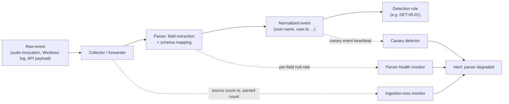
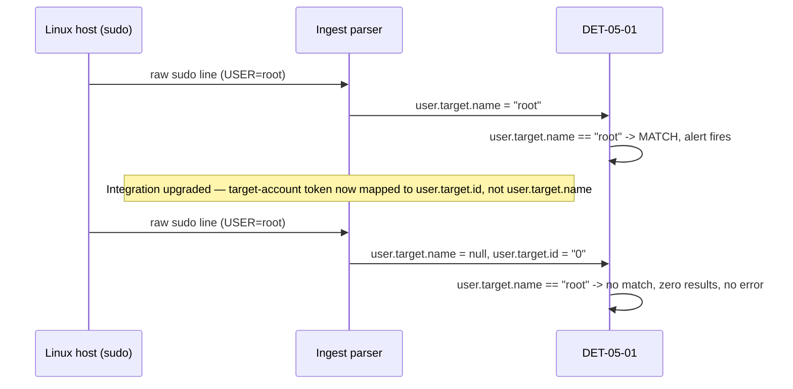
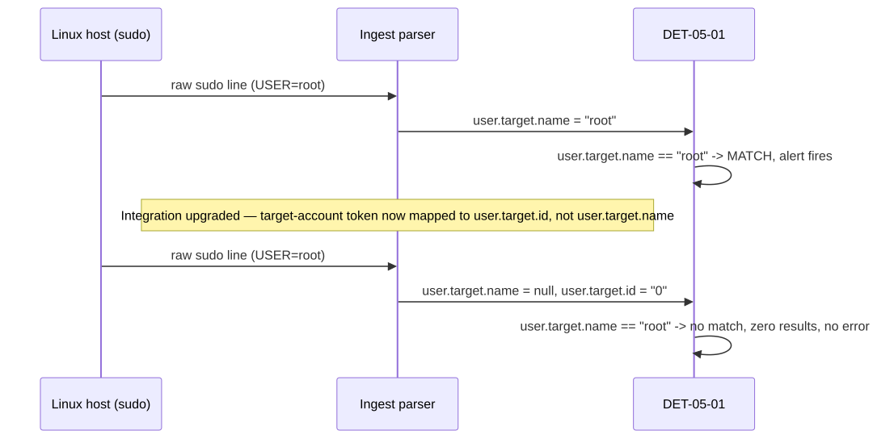

# Part 5 — Parsers

## Why this part exists

**[CONCEPT]**
Part 2 walked the pipeline once, end to end: attacker action → OS/API call → artifact → log → collector → parser → normalization → SIEM/lake → analytic. Parts 3 and 4 scored log sources on visibility, volume, and — among other properties — parser reliability, without stopping to explain what "parser reliability" actually means in practice. This part stops there. The parser is the single hop in that chain most likely to be wrong in a way that produces no error, no dropped-event count, and no ingest-health alert — just a field that used to have a value and now doesn't. Every detection rule in this book, and every rule you will ever write, is a bet that the parser handed it the field it asked for. This part is about what happens when that bet is wrong.

This part covers the parser as a component that fails — field-mapping drift, encoding mismatches, truncation, partial ingestion, and vendor format changes — plus a monitoring pattern for catching those failures before a red team or an incident does. It does not cover schema-mapping strategy across normalization standards (ECS, OCSF, UDM, ASIM); that comparative treatment is Part 6's job. Where this part needs a normalized field name to make a concrete example concrete, it borrows ECS terminology without re-explaining ECS itself.

---

## 1. What a parser actually does

**[CONCEPT]**
A parser takes an unstructured or semi-structured blob — a syslog line, a Windows Event Log XML blob, a JSON payload from a cloud API — and turns it into named fields a query language can reference. `TargetUserName`, `user.name`, `src_ip`, `process.command_line`: none of these exist in the raw bytes an Event captures. They exist because a parser — a regex, a Grok pattern, a vendor-supplied Fleet integration, a custom Logstash filter, a SIEM's built-in "source type" definition — decided that the fourth space-delimited token in a syslog line is the username and mapped it there.

Consider a real raw line captured from a lab host running sudo:

```text
Jul 07 11:54:58 pihole sudo[33546]:     root : TTY=pts/1 ; PWD=/root ; USER=root ; COMMAND=/usr/bin/ss -tulpn
```

*(REAL LAB EXAMPLE — captured via `journalctl`/`auth.log` on the home lab's CT100 "pihole" host; see `lab/evidence/ct100-pihole-sudo-invocations.txt` for full capture context.)*

Nothing here is structured. A parser has to decide that the text before the first colon is the invoking account, that `USER=` marks the target account, and that everything after `COMMAND=` is the literal command — and it has to make that decision the same way, every time, across every sudo version, every locale, and every distro's slightly different log format. A detection rule doesn't see this line. It sees whatever the parser decided the fields were. If the parser's decision is wrong, or changes, the rule inherits that silently — it has no way to tell the difference between "the field is empty because nothing happened" and "the field is empty because the parser stopped populating it."

This is the mechanism behind Schema Drift (see `TERMINOLOGY.md` § Schema Drift): a Log Source's field names, types, or value distribution change — from a vendor update, an agent migration, or an API version bump — and a rule referencing the old field compiles, runs, and returns zero results, because zero matching events is a valid result for almost every query language. No ingest error. No failed-parse counter incrementing. The dashboard that shows events-per-second flowing in still looks green.

The table below names the five failure modes this part covers and what each one does to ingest volume — the property most SOCs actually watch, and the property that stays deceptively normal in four of the five cases.

**Table 5.1 — Parser failure modes at a glance.** The table below supports one decision: which health signal actually catches each failure mode, since "events are still arriving" catches none of them.

| Failure Mode | What Breaks | Ingest Volume Appearance | What Actually Catches It |
|---|---|---|---|
| Field-mapping drift | A field is renamed, retyped, or repointed at ingest | Normal | Per-field null-rate monitoring |
| Encoding mismatch | Non-ASCII bytes garble, or a delimiter collides with field content | Normal | Field-content validation, character-set audits |
| Truncation | A field is cut at a length limit, dropping the part a rule matches on | Normal | Max-length distribution monitoring on high-value fields |
| Partial ingestion | Some events are dropped before the parser ever sees them | Depends on the drop mechanism | Source-side vs. SIEM-side event-count reconciliation |
| Vendor log-format change | The whole log shape changes on an agent/product upgrade | Normal at first, may drop later | Canary detections, scheduled Adversary Emulation |

---

## 2. Field-mapping drift

**[ENGINEERING]**
Field-mapping drift is what happens when the same underlying data point gets mapped to a different field name, a different field type, or a different value shape than it was yesterday — usually because something upstream of the parser changed, not because the parser itself was edited. A vendor ships a new integration version that reclassifies a field. A cloud provider adds a new API version with renamed attributes. An EDR agent update decides a field that used to carry a short username now carries a numeric identifier instead, and moves the username to a different field entirely.

None of these changes are announced to the detection engineer who wrote a rule against the old field. The rule doesn't error. It just stops matching, because the field it filters on is now null, or holds a different data type than the rule's comparison expects, or lives at a different path in the event.

> **Blind Spot**
> A rule that depends on one field name has no way to tell you it broke. It will report exactly the same thing whether the technique it targets stopped happening, the environment got safer, or a vendor renamed a field eight releases ago. All three produce identical output: zero alerts. You need a signal external to the rule itself — a null-rate check, a canary, a scheduled replay — to distinguish "quiet because nothing happened" from "quiet because it's broken."

Section 8 works through one field-mapping drift case end to end, with real before/after query behavior. Section 7 covers the monitoring pattern that catches this class of failure across every rule at once, instead of one rule at a time.

---

## 3. Encoding mismatches

**[ENGINEERING]**
A parser has to assume a character encoding to make sense of raw bytes. When that assumption is wrong — a log source emits Windows-1252 or UTF-16 and the parser assumes UTF-8, or a BOM (byte-order mark) prefixes a file the parser doesn't expect one on — the result is rarely a hard failure. It's mangled text: multi-byte characters split into replacement characters, a filename with an accented letter turning into `é` instead of `é`, or a delimiter character that happens to appear inside a field's content (a comma inside a quoted CSV field the parser doesn't quote-aware split correctly) shifting every subsequent field over by one column.

> **Engineering Reality**
> Command-line logging is the field this bites hardest. An attacker or a legitimate script running a command with non-ASCII arguments — a file path with a non-English character, a base64 blob containing bytes that don't map cleanly to the assumed encoding — can produce a `process.command_line` (or `CommandLine`) value that a substring-match rule silently fails to match, not because the command wasn't logged, but because what got logged doesn't byte-for-byte equal what the rule's pattern expects. This isn't hypothetical: it's the same reason internationalized phishing and living-off-the-land command obfuscation research keeps surfacing encoding-based detection evasion as a real, low-effort technique.

A field-shift from a bad delimiter split is worse than a garbled string, because it doesn't just corrupt one field — it silently swaps every field after the break point into the wrong column. A rule matching `dest_port` might actually be evaluating what should have been `bytes_out`. This produces plausible-looking values that pass basic sanity checks (a number where a number is expected) while being entirely wrong, which makes it one of the harder classes of parser failure to catch by inspection alone — you need field-level distribution monitoring (does `dest_port` ever contain a value outside 0–65535?) to surface it at all.

---

## 4. Truncation

**[ENGINEERING]**
Every log pipeline has length limits somewhere: a syslog transport's maximum message size, an agent's configured field-length cap, a SIEM ingest API's payload limit, a database column width from a decade-old schema nobody revisited. When a field's actual content exceeds that limit, the overflow doesn't error — it gets cut, and the truncated value is what ships downstream.

This is exactly the Detection Debt worked example from `TERMINOLOGY.md`: an EDR agent migration truncates `CommandLine` (the field carried by Sysmon Event ID 1 (Process Create), and by native Windows Event ID 4688 (A new process has been created)) to a shorter maximum length than the previous agent used. A rule matching a suspicious argument sequence deep in a long, obfuscated command line — the exact place attackers put the malicious payload precisely because it's deep in the string — stops matching, because the string it's evaluating against no longer contains that substring. The rule goes silent with zero errors and zero new false positives. It reads as "clean" rather than "broken" until something else — a red-team exercise, an incident retrospective — finds the gap, by which point the debt has compounded across telemetry, testing, and documentation simultaneously.

> **Blind Spot**
> Truncation is selectively invisible: short, benign command lines are unaffected and continue to match normally, so the rule keeps firing on the traffic it was always going to catch anyway. The exact case truncation defeats — a long, heavily obfuscated invocation — is also the exact case most likely to be the one you actually care about. Sample a rolling distribution of field lengths on your highest-value string fields; a spike of values sitting exactly at a round number (255, 1024, 4096, 8192) is the signature of a length cap, not a coincidence in attacker behavior.

---

## 5. Partial and lossy ingestion

**[ENGINEERING]**
Field-mapping drift and truncation both assume the event arrives at the parser. Partial ingestion is the case where some events never do. This happens for reasons that have nothing to do with parsing logic itself: a forwarder's local buffer fills during a burst and starts dropping the oldest queued events; an ingest API enforces a rate limit and returns a rejection the sender doesn't retry correctly; a multi-line event (a stack trace, a formatted JSON blob spanning several physical lines) gets split by a parser that doesn't recognize the continuation and is ingested as several malformed fragments instead of one coherent event; disk pressure on a collector causes it to silently drop the tail of a batch rather than block.

None of these are parser bugs in the narrow sense — the parser correctly handles every event it receives. The failure is upstream of it, in what never arrives to be parsed at all. The result looks identical from a rule's point of view to field-mapping drift: the rule references a field correctly, evaluates correctly, and simply never sees the event that would have triggered it, because that event didn't survive the trip.

The only reliable way to catch this class of failure is comparing event counts at two independent points in the pipeline — source-side (what the originating system actually generated or attempted to send) against SIEM-side (what actually landed) — rather than trusting either count in isolation. A collector reporting "100% forwarded successfully" tells you what it attempted, not what the far end received; a SIEM's own ingest dashboard tells you what arrived, not what was lost before it ever reached the collector.

---

## 6. Vendor log-format changes

**[ENGINEERING]**
The most disruptive version of field-mapping drift is a wholesale format change: a vendor ships a major agent or product version that restructures its log output — new field names, a different nesting structure, a different default encoding, sometimes an entirely different transport (syslog to a structured HTTP API, for instance). Every parser built against the old shape needs updating, and every rule built against the old field names inherits whatever the parser update does or doesn't preserve.

This is where the interaction between Section 2's drift and Section 6's vendor change matters: a vendor format change is the trigger, and field-mapping drift is the mechanism through which it reaches your rules. The fix at the parser layer — updating the parser to understand the new format — doesn't automatically fix rules built on the old field names; it just means the parser stops erroring on the new format while your rules keep silently matching nothing, because "understands the new format" and "maps it to the field names your rules already expect" are two different engineering tasks, frequently done by two different teams on two different schedules.

> **Engineering Reality**
> Vendor release notes for a log-format change are, in practice, aimed at other engineers integrating the new format for the first time — not at every downstream team with existing rules built on the old one. Treat every vendor agent/integration major-version upgrade as a scheduled schema-drift review, not an operational non-event, even when the vendor markets it as a drop-in replacement.

---

## 7. Parser-health monitoring: an operational pattern

**[ENGINEERING]**
Every failure mode above shares the same underlying problem: the pipeline has no independent signal that tells you a parser's output changed shape, separate from the rules that happen to depend on the fields it produces. The fix is to monitor the parser's output directly, not just the rules built on top of it.

### 7.1 What to monitor

**[ENGINEERING]**
Three signals, in order of how cheaply they can be built and how much they catch:

- **Per-field null/empty rate, tracked over time, per log source.** If a field that has been populated on 98% of events for six months drops to 40% populated overnight, something changed upstream — whether or not any rule currently depends on that specific field. This is the single highest-leverage check in this section: it catches Section 2's drift and Section 4's truncation (a truncated field often becomes empty, not just shortened, when the cut lands before content even starts) without needing to know in advance which field will break next.
- **Source-side vs. SIEM-side event-count reconciliation.** Comparing "events the origin system generated or attempted to send" against "events that landed and parsed successfully" catches Section 5's partial ingestion, which a null-rate check on any single field will not — the events are simply missing, not malformed.
- **Canary events.** A known, low-volume, reliably recurring real event — a scheduled service's own heartbeat log line, a daily automated login — that a monitor checks for on a fixed schedule. If the canary's expected shape changes (fields present, field values populated, event count roughly stable), something in the parsing path changed, independent of any specific detection rule.

### 7.2 Turning the pattern into a rule

**[DETECTION ENGINEER]**
The monitoring pattern above becomes actionable once it's expressed as its own scheduled query, alerting on parser health the same way any other analytic alerts on attacker behavior — see DET-05-03 in Section 8 for a worked version of this against the case study's own log source.


**Figure — Parser-health dashboard: per-field null-rate trend.** *CONCEPTUAL — illustrative field breakdown; not a captured screenshot.* Depicts a parser-health dashboard panel — per-field null-rate trend for a small set of high-value fields — showing a visible step-change at the point a field mapping shifted. Supports the claim in §7.1 that a null-rate trend line makes drift visually obvious the moment it happens, rather than requiring a rule-by-rule audit to notice.

**Figure 5.1 — Parser-health monitoring attached to the ingest pipeline.** *CONCEPTUAL.* Illustrates where three independent health signals (null-rate, source/parsed count reconciliation, canary heartbeat) attach to the pipeline from Part 2, upstream of and independent from any individual detection rule. This is a conceptual data-flow sketch, not a capture from a running monitoring stack — see the conceptual dashboard figure above for the per-field null-rate illustration. Diagram ID `FIG-05-01`.





> **Detection Test**
> **Setup:** Any lab log source with a stable, known-good field (a field that populates on effectively every event of a given type over a multi-day baseline).
> **Action:** Manually null out or rename that field in a test copy of the parser config, then replay a batch of previously-good raw events through it.
> **Expected result:** The per-field null-rate monitor's computed rate for that field jumps from its baseline (near 0%) to reflect the injected break within one monitoring cycle — confirming the monitor actually reacts to a real mapping change rather than only ever showing a static baseline number.

---

## 8. Case study: the `user.target.name` → `user.target.id` break

> **Detection Autopsy — the sudo-to-root rule that assumed `user.name` would always exist**
>
> **The rule:** Fires when a sudo invocation's target account is `root` (matched on `user.target.name`) and the invoking account isn't on an approved-admin list (matched separately on `user.name`).
>
> **Why it shipped:** `user.name` and `user.target.name` are both standard ECS fields, both populated and correct in every sample event reviewed during rule development, and the rule is a two-clause filter — cheap to write, easy to explain in a design review.
>
> **How it failed:** The ingest integration for this log source was upgraded. The new integration version maps the sudo target-account token to `user.target.id` instead of `user.target.name` for this event type, leaving `user.target.name` present in the schema but null on every event going forward. The rule compiles and runs exactly as before. It returns zero results, silently, from the moment of the upgrade.
>
> **The fix:** Match on both fields (DET-05-02), and add an independent per-field null-rate monitor (DET-05-03) so the next field rename — on this rule or any other — surfaces on its own, instead of waiting for someone to notice a rule has gone quiet.

### 8.1 The rule that shipped

**[DETECTION ENGINEER]**
The raw event this rule is built against is a genuine sudo invocation captured on the home lab's CT100 host:

```text
Jul 07 11:54:58 pihole sudo[33546]:     root : TTY=pts/1 ; PWD=/root ; USER=root ; COMMAND=/usr/bin/ss -tulpn
```

*(REAL LAB EXAMPLE — `lab/evidence/ct100-pihole-sudo-invocations.txt`.)*

The ingest pipeline's parser (version in place at the time of writing) maps the invoking-account token (the text before the first colon) into a normalized `user.name` field, and the target-account token (`USER=root`) into `user.target.name` — ECS's `user.*` fields describe the acting/invoking user, and `user.target.*` describes the user an action is performed as or against. The illustrative post-parse structure looks like this:

```text
// CONCEPTUAL SAMPLE — illustrative post-parse structure. The raw line above is real; the specific
// field-mapping shown is a simplified teaching illustration of what an ECS-aligned ingest pipeline
// produces, not a literal export from a specific vendor product. In this particular captured line
// the invoking account and the target account are both "root" (root ran sudo on itself), so
// user.name and user.target.name carry the same value here — a coincidence worth flagging, since
// this one evidence line alone can't show whether a rule is correctly checking the target account
// or the invoking account by field name.
{
  "@timestamp": "2026-07-07T11:54:58Z",
  "event.action": "sudo-command",
  "user.name": "root",
  "user.target.name": "root",
  "process.command_line": "/usr/bin/ss -tulpn",
  "host.name": "pihole"
}
```

Targeting an illustrative Linux/sudo log source normalized to ECS-style fields, the rule below implements the analytic described in the Detection Autopsy box above.

```yaml
# CONCEPTUAL SAMPLE — illustrative Sigma rule. Field names follow the real ECS convention (user.name
# is the acting/invoking user, user.target.name is the account a privileged action is performed as),
# but the specific selection logic is simplified for teaching purposes and has not been validated
# against a production false-positive corpus.
title: Sudo Escalation to Root Outside Approved Admin List
id: 05a10000-0005-0001-0000-000000000001
status: experimental
logsource:
  product: linux
  service: sudo
detection:
  selection:
    event.action: 'sudo-command'
    user.target.name: 'root'
  filter:
    user.name|expand: '%approved_admins%'
  condition: selection and not filter
falsepositives:
  - Legitimate root-targeted sudo during an approved change window, if the invoking account is
    missing from the approved-admin list
level: medium
```

**MITRE:** T1548.003 (Sudo and Sudo Caching)

This rule targets the platform's illustrative Linux/sudo log source described above; its main limitation, independent of the break described next, is that it depends entirely on an accurately maintained `approved_admins` allowlist — every account added to that system without a corresponding allowlist update is a guaranteed false positive the first time it runs sudo to root. The allowlist cuts both ways: an attacker who compromises credentials for an account already on `approved_admins` inherits that account's exemption and produces no alert at all, since the filter has no way to distinguish a legitimate admin session from a stolen one — a property of allowlist-based filtering generally, not a defect specific to this rule.

> **False Positive Trap**
> The real evidence line quoted in §8.1 shows `root` itself invoking sudo to run a command as
> `root` — common when cron jobs or admin scripts unconditionally prefix commands with `sudo` for
> portability, or when an interactive root shell still has `sudo` in muscle memory. Because
> `approved_admins` is meant to list human admin accounts, `root` is unlikely to be on it, so this
> rule alerts on every one of those invocations. Add `root` to `approved_admins` if this pattern is
> expected on a given host, or track it as its own dated Exception (see `TERMINOLOGY.md` §
> Exception) — don't silently widen the allowlist without recording why.

> **Blind Spot**
> This detection — and the field-resilient version in §8.4 — only sees privilege escalation that
> goes through `sudo`. An attacker who escalates to root via `su`, a SUID/SGID binary exploiting
> T1548.001 (Setuid and Setgid), a `pkexec`/Polkit exploit, direct root SSH login (if
> `PermitRootLogin` is enabled), or a container/kernel escape produces no sudo log line at all,
> and neither this rule nor the null-rate monitor in §8.4 will ever see it — there's no field to
> go null, because there's no event to parse in the first place. This rule is detection coverage
> for T1548.003 specifically, not for root-privilege escalation in general.

### 8.2 What changed upstream

**[ENGINEERING]**
The ingest integration for this log source was upgraded to a newer release. The new release's field-mapping logic treats the sudo target-account token differently: rather than populating `user.target.name` with the human-readable account name, it populates `user.target.id` with a numeric identifier (`0` for root) and leaves `user.target.name` unset for this specific event type, on the reasoning — internal to the new integration, never surfaced to downstream rule authors — that a numeric ID is the more stable long-term join key. Nothing about this decision is unreasonable from the integration author's perspective. Nothing about it was communicated to a team with a rule already depending on the old field.

The same raw line, ingested after the upgrade, now parses to:

```text
// CONCEPTUAL SAMPLE — same raw sudo line, illustrating the post-upgrade parser output. The
// invoking-user field (user.name) is unaffected by this change; user.target.name is now null, and
// user.target.id carries the value the old field used to hold.
{
  "@timestamp": "2026-09-10T07:35:56Z",
  "event.action": "sudo-command",
  "user.name": "root",
  "user.target.name": null,
  "user.target.id": "0",
  "process.command_line": "/usr/bin/ss -tulpn",
  "host.name": "pihole"
}
```

### 8.3 How it failed silently

**[DETECTION ENGINEER]**
DET-05-01's selection clause, `user.target.name: 'root'`, evaluates against a field that is now null on every event of this type. The rule doesn't error — Sigma's translated query, whatever backend it runs on, evaluates `user.target.name == "root"` against a null field and correctly returns false every time. Ingest volume for this log source is unaffected; the SIEM shows the same steady stream of sudo events it always has. The rule's alert count simply drops to zero and stays there.

> **Blind Spot**
> A rule that has fired zero times in the last quarter is indistinguishable, from the alert queue alone, between three very different situations: the technique genuinely didn't occur, the environment got safer, or the rule is dead. Nothing in a standard alert-volume dashboard tells you which.

**[ANALYST]**
From a triage seat, this is invisible by construction. A quiet rule looks exactly like a clean environment — there's no alert to triage, no ticket to open, no reason for anyone to look at this specific rule until something else (a periodic detection-coverage review, a red-team exercise deliberately testing sudo-to-root escalation, or — worse — a real incident that should have fired this rule and didn't) forces the question. This is precisely why Rule Failure Rate is tracked as a pipeline-health metric independent of alert volume: alert volume alone cannot distinguish "working and quiet" from "silently broken."

### 8.4 The fix

**[DETECTION ENGINEER]**
Two independent changes, not one. First, make the rule itself resilient to the specific field rename that already happened:

```yaml
# CONCEPTUAL SAMPLE — corrected version of DET-05-01. Checks both the pre-migration and post-migration
# field names so the rule keeps firing across this specific schema change, without requiring a
# coordinated rule-and-parser release.
title: Sudo Escalation to Root Outside Approved Admin List (Field-Resilient)
id: 05a10000-0005-0001-0000-000000000002
status: experimental
logsource:
  product: linux
  service: sudo
detection:
  selection_by_name:
    event.action: 'sudo-command'
    user.target.name: 'root'
  selection_by_id:
    event.action: 'sudo-command'
    user.target.id: '0'
  filter:
    user.name|expand: '%approved_admins%'
  condition: (selection_by_name or selection_by_id) and not filter
falsepositives:
  - Legitimate root-targeted sudo during an approved change window, if the invoking account is
    missing from the approved-admin list
level: medium
```

**MITRE:** T1548.003 (Sudo and Sudo Caching)

DET-05-02 still inherits DET-05-01's allowlist-maintenance dependency — an account missing from `approved_admins` is a guaranteed false positive regardless of which field matched — and it carries one new, narrower risk: `user.target.id: '0'` is written as a string literal because ECS defines `user.target.id` as a keyword (string) field, which matches the illustrative post-upgrade event in §8.2. That typing is a convention, not a guarantee — an integration that doesn't follow ECS typing could populate `user.target.id` as a genuine integer, in which case a backend that enforces strict type comparison would silently fail this half of the `or` condition the same way `user.target.name` failed after the original rename. Matching on two field names doesn't retire the type-mismatch failure mode this part opened with; it only narrows where it can still bite.

Second, and more important: fixing one rule's field reference doesn't fix the underlying problem, which is that nothing caught the rename for however long it took someone to notice DET-05-01 had gone quiet. The independent monitor from Section 7 closes that gap — for this field, and for the next field this same integration decides to rename without telling anyone.

Targeting a Sentinel/KQL environment (disambiguated here as Sentinel KQL, not Elastic), the following illustrative query implements the null-rate monitor from §7.1 against this specific log source, tracking the populated-rate of the field carrying the target-account name hour over hour. Note the naming shift from the rest of this section: Sentinel tables don't use ECS's dot-notation (`user.target.name`); the illustrative table below uses Sentinel's own PascalCase convention (`TargetUserName`) — the same underlying data, named differently by platform, which is exactly the kind of cross-source field-name inconsistency Part 6 covers in depth.

```kql
// CONCEPTUAL SAMPLE — illustrative Sentinel KQL scheduled query. Thresholds are illustrative starting
// points, not validated against this source's real baseline variance.
LinuxAuthEvents
| where TimeGenerated > ago(24h)
| where EventAction == "sudo-command"
| summarize Total = count(), Populated = countif(isnotempty(TargetUserName)) by bin(TimeGenerated, 1h)
| where Total >= 20
| extend NullRatePct = round(100.0 * (Total - Populated) / Total, 1)
| where NullRatePct > 5
```

This targets a Sentinel-backed pipeline ingesting the illustrative `LinuxAuthEvents` table shape used throughout this section. Two limitations, not one: latency — a 1-hour bucket means the fastest this can plausibly surface a break is within the current hour's window, still a materially better outcome than the months-to-never detection window a silent rule failure otherwise gets — and small-sample noise, which is why the `Total >= 20` guard is there. Without it, an hour with three events and one coincidental null reads as a 33% null rate and pages someone over statistically meaningless variance; tune the floor to the log source's real hourly volume rather than trusting the default shown here.

**MITRE:** none — this query detects pipeline health, not an adversary technique, and is deliberately not tagged to an ATT&CK ID.

> **Detection Test**
> **Setup:** Lab host with sudo logging shipped through the parser under test, plus a non-admin test account not on the approved-admin allowlist.
> **Action:** `sudo whoami` run from the test account, targeting root.
> **Expected result:** An alert from DET-05-02, with either `user.target.name` = `root` or `user.target.id` = `0` populated in the underlying event depending on which parser version is currently deployed — confirming the rule fires regardless of which field the current integration version happens to populate.

**Figure 5.2 — Before and after the field rename.** *CONCEPTUAL.* Illustrates the same raw sudo invocation producing different structured output before and after an ingest integration upgrade, and the resulting change in DET-05-01's evaluation outcome. This is a conceptual sequence diagram of the mechanism described in §8.2–8.3, not a capture from a live replay. Diagram ID `FIG-05-02`.





---

## 9. Who catches this: hunting for silent parser breaks

**[THREAT HUNTER]**
The monitoring pattern in Section 7 is the standing defense. It still assumes someone built a null-rate monitor for the specific field that's about to break, which — for a field nobody has broken yet — nobody has. A periodic hunt closes the gap the standing monitor can't: it looks for rules that have gone quiet without an obvious environmental explanation, on the hypothesis that a subset of them are broken, not idle.

**HUNT-05-01 — Rules with anomalous zero-alert streaks**

**Threat Hypothesis:** A production Detection Rule that fired regularly for a sustained baseline period, then dropped to zero alerts with no corresponding change in the underlying technique's real-world prevalence, is more likely to be silently broken by schema or field drift than to reflect a genuine reduction in the targeted behavior.

**Procedure:** Pull each rule's historical fire-rate baseline against its trailing 30/60/90-day fire rate; flag rules with a sustained drop to zero that isn't explained by a known environmental change (a decommissioned host population, a retired log source). For each flagged rule, replay its query logic against a small sample of recent raw events from the same log source, by hand, to check whether the fields it references are still populated as expected.

**Finding:** Replaying DET-05-01 against post-upgrade raw sudo events during this kind of review is exactly how the break in Section 8 would be caught without waiting for a red-team exercise or an incident — the hunt produces a concrete new detection candidate (DET-05-02, plus the standing monitor in DET-05-03) rather than a "looks fine, moving on."

> **Hunter's Note**
> Before running any live-data hunt for this pattern, grep your rule repository for the specific field names your highest-value detections depend on, and cross-reference that list against every log source's current schema documentation. Half the value of this hunt is finding the mismatch in five minutes of static comparison, before you ever touch live telemetry — the live replay is for confirming a mismatch you already suspect, not for discovering one from scratch every time.

> **SOC Management View**
> Parser-health monitoring is infrastructure work with no MITRE tag and no CVE to point to, which makes it chronically underfunded relative to net-new detection coverage — a coverage dashboard rewards "we shipped ten new rules this quarter" and is structurally blind to "three of last year's rules have been silently dead for months." Assign explicit ownership for parser-health monitoring separately from rule-authoring throughput, and report Rule Failure Rate as its own metric in the same review cadence as new-coverage numbers — otherwise the incentive structure will always favor building the next rule over verifying the last hundred still work.

---

## 10. Key takeaways

- A parser failure is defined by what it does to a rule's *field references*, not by whether ingest volume looks healthy — four of the five failure modes in this part leave volume completely normal.
- "Zero alerts" is not evidence of anything on its own. It is consistent with a clean environment, a genuinely absent technique, and a silently broken rule, and no alert-volume dashboard distinguishes between the three.
- Field-mapping drift, truncation, and vendor format changes all share the same failure signature — a query that compiles, runs, and returns nothing, with no error anywhere in the pipeline — which is exactly why they need a monitor external to the rules themselves, not better rule-writing discipline alone.
- The fix for a specific broken rule (query it against both the old and new field) and the fix for the underlying class of problem (a standing null-rate/canary monitor) are two different pieces of work; shipping only the first guarantees you'll be back here for the next field rename.
