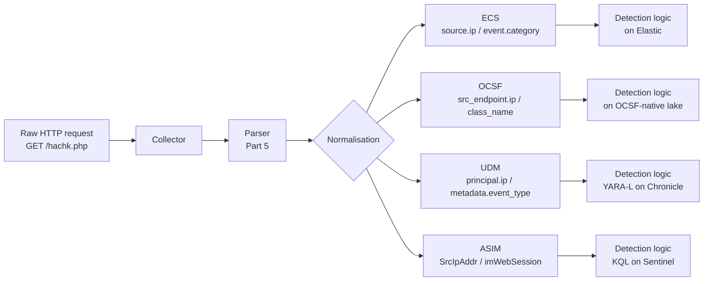
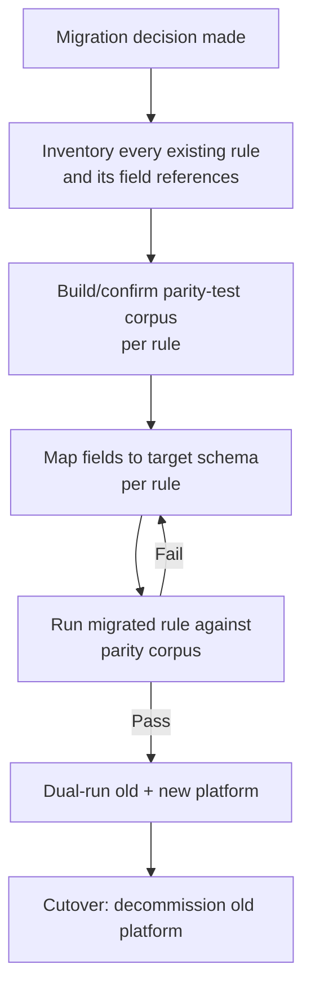

# Part 6 — Normalisation

## Why this part exists

Part 5 covered what happens when a parser gets a field wrong. This part covers the step immediately after a parser gets every field right: normalisation, the process of taking correctly parsed fields from a dozen different log sources and mapping them into one shared field model so a detection written once can run against all of them.

Normalisation is a translation problem, not a data-cleaning problem. The raw event doesn't change; what changes is which name you use for "the IP address that initiated this connection" and which bucket you file the event under. Get the translation wrong and you don't get an error — you get a query that compiles, runs, and returns zero rows, forever, against a source that's flowing correctly. That failure mode is exactly why this part exists, and exactly why SIEM-migration cost belongs here rather than in a separate finance-and-procurement chapter: every dollar a migration burns beyond the license renewal is the cost of re-doing this translation for every detection you already own.

**[CONCEPT]** This part teaches ECS, OCSF, UDM, and ASIM as four competing answers to the same translation problem, using one real event mapped into all four side by side, then follows the consequence of that translation problem through to what it actually costs to move a detection program from one schema to another.

---

## 1. Normalisation as a translation problem

### 1.1 What normalisation actually does

**[CONCEPT]** A firewall, a proxy, an EDR agent, and a cloud API all produce a record of the same underlying fact — "host A connected to host B" — using none of the same field names, none of the same nesting structure, and not even the same idea of what counts as one event. A Zeek `conn.log` line has `id.orig_h` and `id.resp_h`. A Palo Alto firewall log has `src` and `dst`. A CloudTrail record buries the equivalent fact inside `requestParameters` on an API call that only looks like a connection if you already know the API. None of these vendors got it "wrong" — each schema was designed for its own product, not for a detection engineer trying to write one rule that covers all three.

Normalisation is the pipeline stage that takes each of those already-parsed events (Part 5 got the fields *out* of the raw log correctly) and remaps their field names, types, and categorization into a single target schema — so `source.ip` means the same thing whether the underlying event came from a firewall, a proxy, or an EDR agent. A detection written against the normalised schema doesn't need to know which of the three produced the event it just matched.

> **Engineering Reality**
> A vendor claiming a log source "conforms to ECS" (or OCSF, or CIM) almost never means every field the schema defines is populated — it usually means the fields the vendor's own engineers found easiest to map are populated, and everything else either lands in a generic `labels`/custom-fields bucket or is silently dropped. Read the actual field-mapping table for a connector before you write a detection against a field it implies exists. "ECS-compliant" is a claim about vocabulary, not about completeness.

### 1.2 Where normalisation sits in the pipeline

**[ENGINEERING]** Normalisation happens after parsing and before (or sometimes as part of) the analytic layer: raw log → collector → parser (extracts fields, Part 5) → normalisation (remaps fields to a target schema) → SIEM/lake storage → detection logic. Two deployment patterns exist for where the remapping actually runs:

- **Normalise at ingest.** The pipeline (a Logstash pipeline, a Cribl pipeline, a vendor's own ingest connector) rewrites every event into the target schema before it's stored. Queries are cheap and portable across sources; the ingest layer carries the translation cost and any bug there silently mis-maps every event of that type going forward.
- **Normalise at query time.** Raw fields are stored as-is, and a query-time view, function, or parser (Sentinel's ASIM parsers are the clearest production example of this) does the remapping only when a query actually asks for the normalised field. Storage stays closer to the source schema; every query pays a small translation cost, and a parser bug affects only the queries that reference the broken view rather than corrupting stored data.

Neither pattern is universally correct — normalise-at-ingest wins when many different rules query the same source repeatedly; normalise-at-query-time wins when you need to keep raw fidelity for forensics while still exposing a common schema for daily detection work. Most mature programs end up running both simultaneously for different sources, which is itself a normalisation-strategy decision, not an accident (see §7).

---

## 2. The schemas: ECS, OCSF, UDM, ASIM, and vendor dialects

**[CONCEPT]** No single normalised schema has won the market, and betting the whole detection program on one winning is a live risk this book won't pretend to resolve. The table below orients the four schemas this part focuses on, plus the vendor-proprietary model most programs still run into — specifically, which platform each schema locks you into and how its category model shapes the detections you can write portably.

| Schema | Steward | Structure | Category Model | Primarily Lives In |
|---|---|---|---|---|
| ECS (Elastic Common Schema) | Elastic | Flat, dot-notation field names (`source.ip`, `http.request.method`) | `event.category` / `event.type` — small, multi-value arrays | Elasticsearch, Elastic Security, Logstash/Beats pipelines |
| OCSF (Open Cybersecurity Schema Framework) | Open-source project backed by AWS, Splunk, and others | Deeply nested objects grouped into numbered classes and categories | Numbered `category_uid`/`class_uid` taxonomy with named profiles/extensions layered on top | AWS Security Lake, Splunk, and a growing set of data-lake-first platforms |
| UDM (Unified Data Model) | Google (Chronicle / Google SecOps) | Nested objects keyed around `principal`/`target`/`src`, plus metadata blocks | `metadata.event_type` enum, plus a separate detection layer (YARA-L) that reads UDM | Google SecOps (Chronicle) |
| ASIM (Advanced Security Information Model) | Microsoft | Query-time normalized *views* (`imWebSession`, `imNetworkSession`) returned by parser functions over KQL, not a storage-layer document schema | Schema families per activity type (network session, web session, DNS, etc.) | Microsoft Sentinel / Defender XDR (KQL workspaces) |

**[CONCEPT]** The single most important structural difference to internalize: ECS, OCSF, and UDM are all *document* schemas — they describe the shape of a stored event. ASIM is a *query-time view* schema — an ASIM table is what you get back from a KQL query over a parser, not the shape data is stored in underneath. That difference matters directly for §1.2: ASIM is Microsoft's production example of normalise-at-query-time, while ECS/OCSF/UDM are normally deployed normalise-at-ingest, even though nothing stops a team from storing raw data and building ECS-shaped views at query time too.

### 2.1 ECS in one paragraph

**[CONCEPT]** ECS uses flat, dotted field names and small controlled-vocabulary arrays for categorization (`event.category: ["network"]`, `event.type: ["connection"]`). It's the schema most detection engineers coming from an Elastic Security or Beats/Logstash background already know, and its flat naming makes it easy to write ad-hoc KQL/EQL against without learning a nested-object query syntax first.

### 2.2 OCSF in one paragraph

**[CONCEPT]** OCSF organizes events into numbered classes (e.g., a class for network activity, a distinct class for HTTP activity, a distinct class for file activity) nested under numbered categories, with named "profiles" and vendor extensions layered on top of the base classes to cover fields the base schema doesn't define. That numbered-taxonomy design is explicitly built for interchange between vendors and data-lake products rather than for any one query language — which is also its sharpest edge (see the Engineering Reality box in §3.3).

### 2.3 UDM in one paragraph

**[CONCEPT]** UDM organizes an event around "who did what to whom" — a `principal` (actor), a `target` (object acted on), and a `metadata.event_type` classification — reflecting Chronicle/Google SecOps's origin as a threat-detection-first platform where the actor/target relationship, not the raw network tuple, is the thing most queries actually pivot on. Detections against UDM are written in YARA-L, not a general-purpose query language.

### 2.4 ASIM in one paragraph

**[CONCEPT]** ASIM ships as a set of parser functions (`imNetworkSession`, `imWebSession`, `imDns`, and others) that any Sentinel/Defender KQL query can call to get a normalized view over whatever raw tables are actually ingested, regardless of vendor. Detections written against an ASIM parser survive a change of log source underneath — swap the firewall vendor, and the ASIM parser (once someone updates its mapping) keeps the detection's field references valid without touching the rule itself.

### 2.5 Vendor-proprietary schemas — Splunk CIM and friends

**[ENGINEERING]** Splunk's Common Information Model (CIM) predates OCSF and plays a similar role inside Splunk specifically: a set of field-name and eventtype conventions (`src`, `dest`, `action`, data models like `Network_Traffic` and `Web`) that Splunk apps are expected to map into so searches built against the data model work regardless of the underlying add-on. It's not covered field-by-field in this part because it's Splunk-internal rather than cross-platform, but the lesson is identical: CIM, ECS, OCSF, UDM, and ASIM are all the same idea — a shared field vocabulary — solving the same problem for five different ecosystems, none of which speaks the others' vocabulary without an explicit mapping.

---

## 3. One real event, four schemas

**[DETECTION ENGINEER]** The clearest way to see what "translation problem" means concretely is to take one real event and map it into all four schemas side by side. The event below is a genuine HTTP request captured against this book's honeynet lab — not constructed for the example.

**Source event (REAL LAB EXAMPLE).** Captured on CT103, the honeynet's HTTP decoy listener, 2026-09-09T21:39:39.936738+00:00 UTC. Source: `lab/evidence/ct103-honeynet-http-events-exploit-probes.txt`. Reformatted below from the evidence file's tabular query output into key/value form for readability; the values themselves are unchanged.

```text
id=695  ts=2026-09-09T21:39:39.936738+00:00  src_ip=189.18.97.61
method=GET  path=/hachk.php  user_agent=proxy-prefilter/1
```

`/hachk.php` is a path pattern automated scanners request looking for an already-planted webshell — a low-cost, high-volume probe, not a targeted exploit against a specific CVE the way the GPON router path (`/GponForm/diag_Form`, also present in the same evidence file, mapped to CVE-2018-10561/10562) is. It's picked here specifically *because* it's simple: one source IP, one method, one path, no credentials, no request body — which keeps the mapping table below about the schemas, not about the event's own complexity.

> **Blind Spot**
> The query that produced this event captured `id`, `ts`, `src_ip`, `method`, `path`, and `user_agent` — it did not capture a `dst_ip` column, because the honeypot's own event table doesn't store it (every request already hits the one fixed decoy listener, so the collector's author didn't bother). Every schema below has a field for the destination address. None of them can be populated with data the source system never captured. Normalisation can rename and recategorize a field; it cannot manufacture one that was never collected — that gap has to be closed with enrichment at collection time, not fixed downstream.

### 3.1 Field-by-field translation

**[DETECTION ENGINEER]** The table below maps the same conceptual field across all four target schemas, so a detection engineer can see exactly what changes (and what has to be looked up) when the same rule logic is re-expressed in a different backend.

| Concept | ECS | OCSF | UDM | ASIM |
|---|---|---|---|---|
| Source IP | `source.ip` | `src_endpoint.ip` | `principal.ip` | `SrcIpAddr` |
| Destination IP | `destination.ip` | `dst_endpoint.ip` | `target.ip` | `DstIpAddr` |
| HTTP method | `http.request.method` | `http_request.http_method` | `network.http.method` | `HttpRequestMethod` |
| Request path/URL | `url.path` | `http_request.url.path` | `target.url` | `Url` |
| User agent | `user_agent.original` | `http_request.user_agent` | `network.http.user_agent` | `HttpUserAgent` |
| Event timestamp | `@timestamp` | `time` | `metadata.event_timestamp` | `TimeGenerated` |
| Category/classification | `event.category` array, e.g. `["network","web"]` | `class_name` / `category_name` (e.g. HTTP Activity / Network Activity) | `metadata.event_type` (e.g. `NETWORK_HTTP`) | Parser/view name itself (`imWebSession`) |

> **Engineering Reality**
> Field names for ECS above are the actual documented dotted paths — that's a mature, stable schema and this table can be trusted as written. The OCSF, UDM, and ASIM field names shown reflect each schema's general, consistently documented naming *pattern*, but exact field availability shifts across schema versions and product releases faster than ECS does — OCSF in particular is still adding classes and revising extension mechanics release to release. Treat every non-ECS row here as "this is the shape of the answer," and verify the exact field against the schema version your platform is actually running before you ship a rule against it. This is precisely the schema-versioning risk normalisation introduces on top of the schema-*drift* risk Part 5 covers for parsers — two different failure modes that both produce the same silent symptom: a query that runs clean and returns nothing.

### 3.2 The same event, hand-mapped into ECS

**[DETECTION ENGINEER]** `CONCEPTUAL SAMPLE` — a hand-built illustrative ECS document for the event above; the field values are real, but this document was written for this example, not produced by an actual Elastic Agent/ingest run.

```json
{
  "@timestamp": "2026-09-09T21:39:39.936738Z",
  "event": {
    "category": ["network", "web"],
    "type": ["connection"],
    "outcome": "unknown"
  },
  "source": { "ip": "189.18.97.61" },
  "http": { "request": { "method": "GET" } },
  "url": { "path": "/hachk.php" },
  "user_agent": { "original": "proxy-prefilter/1" }
}
```

`event.outcome` is set to `"unknown"` rather than `"success"` or `"failure"` because the source event carries no HTTP status code — another instance of §3.1's Blind Spot: the field exists in the target schema, the value doesn't exist in the source data, and no amount of correct mapping logic invents one.

### 3.3 Where the schemas actually disagree

**[DETECTION ENGINEER]** Field renaming is the easy 80% of normalisation. The hard 20% — the part that actually breaks detections during a migration — is that the schemas don't agree on how many events one underlying action should produce, or where the categorization boundary sits.

- ECS's `event.category` is a short array of broad buckets (`network`, `web`, `authentication`, `process`, and a limited set of others); a single event can carry several categories at once.
- OCSF's class/category taxonomy is deeper and more specific — HTTP Activity is its own class distinct from generic Network Activity, so an event that ECS files simply under `["network","web"]` has one specific, less ambiguous OCSF home, but the assignment logic to get it there is more involved to implement correctly.
- UDM collapses the same fact into a single `metadata.event_type` enum value rather than a multi-value array, which is simpler to query but loses the "this event is legitimately more than one kind of thing at once" nuance ECS's array preserves.
- ASIM doesn't classify via a field at all — the table you query (`imWebSession` vs. `imNetworkSession`) *is* the classification, decided by which parser normalized the source data in the first place.

> **Engineering Reality**
> OCSF's extension/profile mechanism means two vendors can both legitimately claim "OCSF-compliant" output for the same real-world event and still produce documents that don't diff cleanly — one vendor's connector might populate a vendor-specific extension field the other omits, or choose a different (also valid) profile for an ambiguous event. "Normalised" does not mean "identical across vendors." It means "described using the same vocabulary," which is a real improvement over no shared vocabulary at all, but it is not the same guarantee as byte-for-byte interchangeability, and a detection built assuming the latter will quietly under-match against the vendor whose connector chose the other valid profile.






**Figure 6.1 (FIG-06-01) — One raw event fanned out into four normalised schemas.** *CONCEPTUAL.* Illustrates the translation step this section walks through field-by-field: one parsed event becomes four structurally different, non-interchangeable documents, each of which then feeds a schema-specific detection layer. Not a capture from a live pipeline run — see §3.2 for the one schema (ECS) mapped out as an actual illustrative document.

---

## 4. Detections that survive translation

### 4.1 The naive migration

**[DETECTION ENGINEER]** Migration cost stops being an abstract line item the moment a specific rule survives the platform swap syntactically but not semantically — the case below is that failure mode, not a hypothetical.

> **Detection Autopsy — "the copy-pasted field-name rule"**
>
> **The rule:** A web-recon detection flags any request to a small set of known-bad path patterns (`/hachk.php`, `/GponForm/diag_Form`, and similar) from an external source IP, written as `source.ip != <internal ranges> AND url.path IN (<pattern list>)` against an ECS-backed Elastic stack.
>
> **Why it shipped:** The team migrated log ingestion from the Elastic stack to an OCSF-native data lake as part of a broader platform consolidation, and — reasonably, on the surface — assumed "normalisation" meant the underlying fields were interchangeable. The rule was copied into the new platform's query editor with only the query *syntax* translated, field names left untouched, on the assumption that a normalised pipeline made the field names portable too.
>
> **How it failed:** OCSF has no field called `source.ip` or `url.path`; the equivalents are `src_endpoint.ip` and `http_request.url.path`. The migrated query compiled — most query languages don't error on referencing an undefined field, they just never match it — and ran clean, returning zero results, for six weeks. The web-recon detection wasn't degraded. It was completely dead, and nothing in the platform said so, because "zero matches" is a valid result for almost every query language, exactly as it is for the parser-level schema drift covered in Part 5.
>
> **The fix:** The team built a small parity-test corpus — a set of known-true-positive raw events (including this exact `/hachk.php` probe from the honeynet capture) replayed against every migrated rule before the old platform was decommissioned, specifically to catch a rule that compiles but silently stops matching. That corpus is now re-run as a CI check on every rule change, not just at migration time.

### 4.2 Writing detections that don't assume one schema forever

**[DETECTION ENGINEER]** Three practices reduce how much a future schema migration costs, paid for as a small amount of extra discipline now:

1. **Centralize field references, don't inline them.** A detection-as-code pipeline (Part 22) that lets a rule reference a named constant (`$SRC_IP`) resolved once per target platform, rather than hard-coding `source.ip` in fifty separate rule files, turns a schema migration into one mapping-table edit instead of fifty rule edits.
2. **Keep a parity-test corpus per rule, not per migration.** The corpus built under duress in §4.1 should exist from the day the rule ships, replayed on every change — not invented for the next migration.
3. **Document the analytic separately from the query.** Per `TERMINOLOGY.md`'s Analytic vs. Detection Rule distinction, write down the implementation-independent logic ("a request to a known-webshell-probe path from a source IP outside the internal ranges") once, then treat each schema-specific query as one of potentially several implementations of that one analytic — which is exactly the mental model that makes "the same rule in four schemas" (§3) a normal engineering task rather than a from-scratch rewrite every time.

### 4.3 Worked detection — DET-06-01

**[DETECTION ENGINEER]** The analytic from §4.1, expressed against two of the four schemas from this part, to make the "one analytic, several implementations" claim concrete rather than asserted.

**Analytic (schema-independent):** Alert when an HTTP request from a source IP outside the organization's internal address ranges targets a URL path matching a known webshell/exploit-probe pattern list.

**MITRE:** T1190 (Exploit Public-Facing Application)

**Dependencies and failure mode:** The analytic depends on three populated, correctly mapped fields, not two — the source IP, the request path, and the event's own categorization: `event.category == "web"` for the EQL query, and correct routing into the `imWebSession` view for the KQL query (ASIM decides which table an event lands in via parser logic, not a queryable field — see §2.4). As §3's Blind Spot box already showed for this same honeynet capture, a collector that doesn't record source IP or path can't be normalised into a value that was never captured. §3.3 already names categorization as the hard, least-portable part of normalisation for exactly this reason: a source that gets the IP and path right but miscategorizes the event — files it as generic `network` without the `web` sub-category, or routes it to an ASIM table other than `imWebSession` — produces the same silent zero-match outcome as a null field, with no error and no size-of-gap signal to distinguish "this rule is broken" from "this behavior didn't happen." All three dependencies fail the same way — zero matches, no error — exactly the failure mode Part 5 covers for parsers and §4.1 covers for a full migration.

The following Elastic EQL query implements the analytic against an ECS-backed index. `CONCEPTUAL SAMPLE` — illustrative field names and logic, not validated against a live Elastic deployment.

```eql
network where event.category == "web" and
  url.path : ("/hachk.php", "/GponForm/diag_Form") and
  not cidrMatch(source.ip, "10.0.0.0/8", "172.16.0.0/12", "192.168.0.0/16")
```

The following Sentinel KQL query implements the same analytic against ASIM's normalized web-session view. `CONCEPTUAL SAMPLE` — illustrative field names and logic, not validated against a live Sentinel workspace.

```kql
imWebSession
// contains, not has_any: has-family operators match whole tokens split on
// non-alphanumeric characters, so they aren't reliable for path strings that
// contain "/" and "." — "/hachk.php" would never equal a single whole token.
| where Url contains "/hachk.php" or Url contains "/GponForm/diag_Form"
| where not(ipv4_is_match(SrcIpAddr, "10.0.0.0/8")
    or ipv4_is_match(SrcIpAddr, "172.16.0.0/12")
    or ipv4_is_match(SrcIpAddr, "192.168.0.0/16"))
| project TimeGenerated, SrcIpAddr, HttpRequestMethod, Url, HttpUserAgent
```

`ipv4_is_match()` is used rather than `!startswith "10."`/`!startswith "192.168."` deliberately: string-prefix matching can't express the 172.16.0.0/12 range at all (it isn't a fixed dotted-decimal prefix), so a `startswith`-based exclusion silently under-excludes internal RFC 1918 space and is not equivalent to the EQL query's `cidrMatch` — the two implementations of one analytic must exclude the same ranges, or they aren't actually the same analytic.

> **Detection Test**
> **Setup:** A test host outside the organization's declared internal ranges, with network reachability to the monitored web listener.
> **Action:** Issue a `GET` request to one of the listed known-bad paths (e.g., `curl http://<target>/hachk.php`) from the external test host.
> **Expected result:** One matching event in either query above, with `source.ip`/`SrcIpAddr` populated from the test host and the requested path present in `url.path`/`Url`.

Neither query implementation catches a path pattern not already on the list — this is a signature-style detection (an IOC-adjacent path list, in `TERMINOLOGY.md`'s IOA/IOC/TTP terms), not a behavioral one, and it degrades to zero the moment an attacker uses a webshell path that isn't in the pattern list yet.

> **Blind Spot**
> This rule cannot distinguish a targeted exploit attempt against your specific host from indiscriminate internet-wide background scanning that happens to be probing everyone for the same known webshell path — the `/GponForm/diag_Form` and `/hachk.php` hits in this part's own source evidence are exactly that: mass, opportunistic internet scanning, not activity aimed at this honeynet specifically. Treat a match as "someone tried this known-bad path against your public IP," not as "you were targeted" — severity triage still needs to check whether the source IP is scanning broad internet space (low severity, common) or is a known-hostile actor otherwise linked to your environment (higher severity).

> **Blind Spot**
> Both queries assume `source.ip`/`SrcIpAddr` is the attacker's own address. If the monitored listener sits behind a reverse proxy, load balancer, or CDN, that field holds the proxy's address, not the client's — and if the proxy's address happens to fall inside the internal ranges being excluded (a common topology: an internet-facing edge terminating TLS and forwarding to an internal-IP origin), the `not` clause silently excludes every real external request the proxy forwards, on top of the false positives it was written to filter out. ECS defines a separate `client.ip` field for exactly this case (populated from `X-Forwarded-For` or an equivalent header by a parser that decodes it), but populating it is the parser's job, not a given — confirm which IP your collector actually resolves into `source.ip` versus `client.ip` (or the ASIM equivalent, verified per connector) before trusting this exclusion logic on any listener sitting behind a proxy.

> **False Positive Trap**
> An authorized external vulnerability scan or penetration test that checks for the same known-webshell paths as part of a standard web-app assessment will trigger this rule from outside the internal ranges, exactly as designed — that's a Benign Positive, not a False Positive, per `TERMINOLOGY.md`: the logic matched correctly, the activity is authorized. Maintain an allowlist of scheduled scan-window source IPs/ASNs (the pentest vendor's known ranges) rather than narrowing the path list to "fix" this, since narrowing the list is what actually degrades true-positive detection of a real attacker using the same paths.

Because the path list is narrow and specific, the expected false-positive rate against genuine internal traffic is close to zero — the honeynet's own capture in §3 shows internal vulnerability-scan traffic (CT104, 192.168.1.96) hitting generic paths like `/admin` and `/`, not the listed webshell paths, and it's excluded from both queries anyway by the internal-range filter. The dominant source of *alert volume* (not false positives in the strict sense) is internet-wide background scanning per the Blind Spot above, which is real, matching activity — just not necessarily activity worth an incident response page every time it fires.

---

## 5. Hunting for broken normalisation

**[THREAT HUNTER]** A migration doesn't just risk breaking one detection the way §4.1 shows — it risks breaking a whole log source's mapping at once, silently, in exactly the way that produces the "zero matches, looks clean" symptom across dozens of rules simultaneously. That's a hunt, not a standing detection, because there's no reliable alert condition for "a field that should be populated is null" without first knowing which fields are supposed to be populated for a given source.

**HUNT-06-01 — Fields that should be populated after a normalisation migration but aren't.**

**Threat Hypothesis:** A log source migrated to a new normalisation layer within the last review cycle has at least one field that is supposed to be populated (per its documented mapping) but is null or empty across effectively 100% of recent events — indicating a broken mapping, not a genuinely absent value.

**Hunt procedure:**

1. For each log source normalised within the last review cycle, pull a sample of recent events and compute the null rate for every field the target schema's mapping claims that source populates.
2. Flag any field at or near 100% null where the source's own raw event (pre-normalisation) shows the equivalent data present — that gap is the mapping, not the source.
3. Cross-check against the parity-test corpus (§4.2) for any rule that reads the flagged field: if a rule silently went from matching to zero matches around the same date the source was migrated, that's corroborating evidence, not coincidence.

> **Hunter's Note**
> Don't hunt this by staring at dashboards for "low alert volume" — a rule that's completely dead produces the same graph as a rule that's healthy and the attack behavior it targets genuinely didn't occur that week. Hunt the *field*, not the alert count: pull raw events from the source, pull normalised events from the same window, and diff which fields actually made it across. This is the same "verify the field, don't trust the empty result" discipline Part 5 teaches for parsers, applied one layer downstream.

A hunt run against this hypothesis either documents a specific, named mapping gap (feeding a Detection Debt / Visibility Debt entry per `TERMINOLOGY.md`) or documents that the sampled sources' mappings hold up — both are a valid, recorded finding; neither is "nothing found, moving on."

---

## 6. SIEM migration cost as a normalisation problem

### 6.1 What actually costs money

> **SOC Management View**
> The license and infrastructure cost of a SIEM migration is the visible, budgeted line item. The cost that actually blows budgets and timelines is the one this part has been describing all along: every existing detection rule's field references have to be re-verified against the new schema, one at a time, and every one that silently stops matching (§4.1) is a coverage gap that exists with no error message and no alert to tell you it's there. Budget migration cost as (rule count × per-rule re-mapping and parity-test effort), not as a platform swap-out — a hundred-rule program that skips the parity-test step doesn't save the hundred rules' worth of engineering time, it just defers discovering which of them broke until an incident post-mortem finds the gap, which is a strictly worse and more expensive time to find it.

**[SOC MANAGEMENT]** Concretely, a migration's real cost has four components, and only the first is a platform-vendor line item:

- **Platform cost** — license, infrastructure, professional services for the new platform itself.
- **Mapping cost** — the one-time effort to translate every existing rule's field references into the new schema (§4.1's failure mode is what happens when this line is estimated at zero).
- **Parity-testing cost** — building and running the corpus (§4.1, §4.2) that proves each migrated rule still fires on the same test cases it fired on before.
- **Dual-running cost** — the period, often 60–90 days on a mature program, where both the old and new platforms run in parallel specifically so a broken migrated rule is caught by its still-working counterpart on the old platform rather than by an actual missed intrusion.

Programs that skip dual-running to save that cost are explicitly trading a bounded, budgeted expense for an unbounded, undiscovered one — the same trade §4.1's rule made by accident, made on purpose and at full scale.

### 6.2 Reducing the cost

**[ENGINEERING]** The practices from §4.2 (centralized field references, a standing parity-test corpus, analytic/rule separation) aren't just good hygiene — each one directly reduces which of the four cost components above scales linearly with rule count during a future migration. A program with a parity-test corpus already built for every rule pays the mapping cost once per rule at migration time and gets the parity-testing cost close to free, because the tests already exist; a program without one pays both, discovering the parity-test requirement under the time pressure of a live cutover, which is the worst possible time to design a test corpus.

> **What Would Change My Mind**
> This part treats OCSF's numbered class/category taxonomy as more implementation-effort than ECS's flat arrays for a team building a mapping from scratch. If OCSF tooling matures to the point that vendor connectors reliably auto-generate a correct class/category assignment with no manual mapping decision left for the adopting team, that specific claim about relative migration cost would need to be revised — the schema's *design* complexity wouldn't have changed, but the *practical* cost of adopting it would have dropped toward ECS's.






**Figure 6.2 (FIG-06-02) — SIEM migration as a per-rule mapping-and-parity loop.** *CONCEPTUAL.* Illustrates the migration process this section argues for: cost scales with rule count because steps B through E repeat per rule, and the dual-run step (F) exists specifically to catch a rule that passed its own parity test but still misses something the old platform's still-running equivalent would have caught. Not a capture of any specific team's actual migration runbook.

---

## 7. Choosing and living with a normalisation strategy

**[ENGINEERING]** No part of this chapter argues for one schema over the others as a universal answer — the honest position, given how much the right choice depends on which platform already anchors your detection stack, is that the schema decision is mostly made for you the moment you pick a primary SIEM/lake vendor, and the real decision left is *how much* of your detection logic you write in a way that survives leaving that vendor later.

Three practical defaults follow from everything above:

- Prefer normalise-at-query-time (ASIM's model) when you expect to keep evaluating multiple downstream platforms and want to preserve raw fidelity; prefer normalise-at-ingest (the typical ECS/OCSF/UDM deployment pattern) when one platform is a settled, long-term commitment and query-time translation cost matters more than raw-storage flexibility.
- Treat the analytic/detection-rule separation from §4.2 as mandatory, not aspirational, for any rule you'd be upset to lose — it's the one practice that pays for itself regardless of which schema you're on today or migrate to next.
- Build the parity-test corpus per rule from day one. Every cost this part describes in §6 is smaller for a program that already has one and larger, sometimes by a catastrophic amount, for a program that doesn't.

None of this makes the schema choice itself disappear as a real, consequential decision — it just moves the point where that decision actually costs you money from "the day you migrate" to "the day you decided not to build a parity-test corpus," which is a decision made much earlier and far less visibly.
