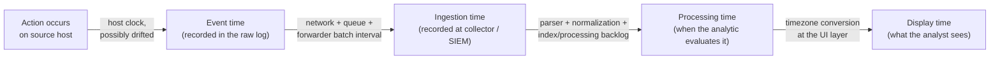
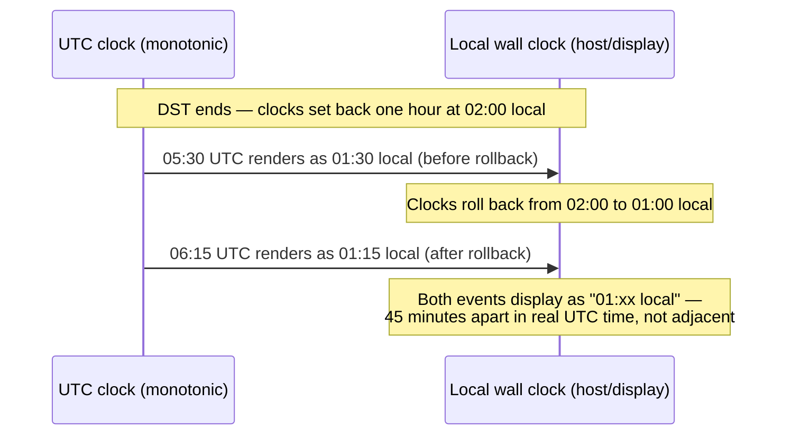
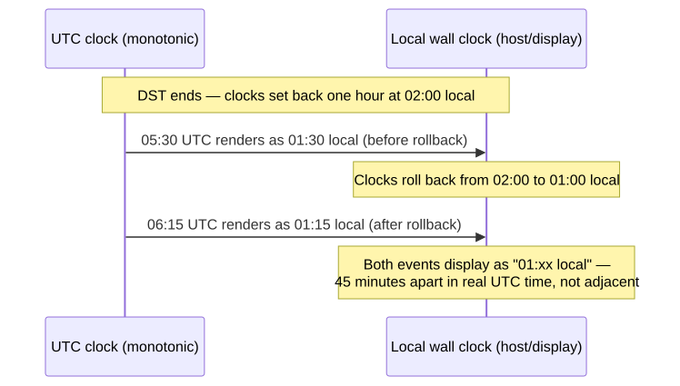

# Part 7 — Time

## Why this part exists

**[CONCEPT]** Every detection rule with a time window, every baseline with a "30-day rolling" label, every correlation that joins two events "within 10 minutes of each other" is making a silent assumption: that the timestamps it's comparing mean the same thing. They usually don't. A timestamp can be the moment something happened on a host, the moment a collector received it, the moment an analytic evaluated it, or the moment an analyst's browser rendered it in their own timezone — four different instants, frequently disagreeing by seconds, sometimes by hours, occasionally (across a daylight-saving transition) by something worse than a fixed offset: ambiguity about which hour it even was.

This part treats time as a telemetry problem, not a formatting detail. It covers the four clocks a detection pipeline actually runs on, why UTC and local time keep breaking things in different and specific ways, clock drift, pipeline delay, and the daylight-saving-time (DST) transition as a concrete, worked correlation-rule failure. It closes with retention windows — how long you keep data at all — because retention is also a time decision with a direct cost and investigative consequence, not a separate topic. Part 30 (Correlation Engineering) builds directly on the failure modes introduced here; Part 37 (Detection Testing) lists clock skew as one of its standard test cases and assumes this part's vocabulary; Part 42 and Part 43 (Detection Quality, Detection Debt) both treat stale retention and undetected drift as measurable debt, not an aside.

---

## 1. Four clocks: event time, ingestion time, processing time, and display time

**[CONCEPT]** A single event carries at least four distinct timestamps by the time an analyst looks at it, and a detection pipeline conflates them at its own risk:

- **Event time** — when the action actually happened, per the clock of the system that logged it. This is the timestamp field inside the raw record (`@timestamp` in many normalized schemas, `TimeCreated` in Windows Event Log, the leading syslog date on a Linux host).
- **Ingestion time** — when the collector, forwarder, or SIEM index actually received and stored the record. This is a property of the pipeline, not the source, and it is frequently a separate field (`_indextime` in Splunk, an `ingested_at`-style field in a log lake) from event time.
- **Processing time** — when a detection rule or analytic actually evaluated the record. For a real-time streaming rule this can be seconds after ingestion; for a scheduled search that runs every 15 minutes, it can lag ingestion by up to that entire interval.
- **Display time** — the timestamp as rendered to a human, after whatever timezone conversion the SIEM's UI or the analyst's own browser/OS applies. This is the one most likely to differ from all three of the others without anyone noticing, because it's cosmetic by design — the UI is doing exactly what it's supposed to do, converting for readability, and that conversion is the thing that silently breaks time math done downstream by eye.

**Figure 7.1 — Four clocks in a detection pipeline (FIG-07-01).** *CONCEPTUAL.* Illustrates where each of the four timestamps is generated relative to the others and what commonly introduces drift or delay at each hop — host clock skew between action and event time, network/queueing/batching delay between event time and ingestion time, scheduled-search interval between ingestion time and processing time, and timezone conversion between processing time and display time. This is a conceptual data-flow sketch, not a capture from a specific vendor pipeline.




> **Engineering Reality**
> A correlation rule written against "event time" almost always actually runs against whatever timestamp field the query engine defaults to, and that default is not consistently event time across platforms — some default to ingestion time unless a rule explicitly parses and re-casts the event's own timestamp field. Check which clock your query engine sorts and windows on by default before trusting a time-window join; the documentation and the actual default behavior of a given deployment have a way of disagreeing.

**[ENGINEERING]** The practical consequence: a correlation window of "10 minutes" is only meaningful if every event compared inside it is measured on the same clock. Mixing event time from one source with ingestion time from another inside a single time-bounded join doesn't fail loudly — it just silently shifts the window, sometimes wide enough to miss the correlation entirely, sometimes narrow enough to falsely correlate two unrelated events that happened to be *ingested* close together even though they occurred far apart.

---

## 2. UTC vs. local time — and why raw logs lie to you about both

**[CONCEPT]** UTC (Coordinated Universal Time) doesn't observe daylight saving and has no timezone offset to track, which is exactly why every serious detection pipeline should normalize to it internally and treat local time as a display-only concern. The problem isn't that UTC is hard — it's that most of the raw telemetry feeding the pipeline was never written with UTC in mind, and normalizing it correctly requires information the raw record often doesn't carry.

**[ENGINEERING]** Classic syslog is the clearest example, and the lab evidence in this book's collection shows it directly. A real capture from this project's home-lab host CT104 (`lab/evidence/ct104-vulnscan-sudo-invocations.txt`) looks like this:

```text
Sep 10 05:42:02 vulnscan sudo[2229]:     root : PWD=/root ; USER=vulnscan ; COMMAND=/usr/bin/sqlite3 /opt/vulnscan/data/vulnscan.db 'SELECT count(*) FROM scanner_errors;'
```

That timestamp has no year and no UTC offset. To turn "Sep 10 05:42:02" into an unambiguous instant, the parser has to already know — from somewhere outside the log line itself — what year it is and what timezone the host's clock was set to at that moment. If the host's local timezone configuration changes (a container redeployed with a different `TZ` environment variable, a VM template cloned with the wrong locale), every subsequent log line's true UTC instant shifts by the offset difference, and nothing in the raw text tells the parser this happened. The same file's `lastb`-derived failed-SSH-login capture (`lab/evidence/ct104-vulnscan-ssh-failed-logins-btmp.txt`) carries the identical gap — entries like `Mon Sep 14 01:17 - 01:17 (00:00)` are genuine records of a real internal host (`192.168.1.126`) failing SSH authentication against CT104 in rapid bursts, and every one of those local timestamps depends on the analyst already knowing which timezone and which year CT104's clock was in at capture time.

> **Blind Spot**
> A parser that assumes a fixed timezone offset for a log source is correct only until that source's actual clock configuration changes, and a schema-drift-style silent failure follows: timestamps still parse, still produce a value, and are now systematically off by a fixed offset (often exactly one hour, from a DST misconfiguration) with no error anywhere in the pipeline. This is functionally the same failure shape as Schema Drift (Part 5, Part 6) but for the time field specifically, and it's easy to miss because "the query still returns results" looks identical to "the query is correct."

**[ANALYST]** When triaging an alert that involves a time-based judgment ("this happened right after that"), check the source host's configured timezone and NTP health before trusting the displayed sequence — not just the two event timestamps side by side. Two events that look 45 minutes apart in the SIEM's display timezone can be 5 minutes apart in real elapsed time if one source's raw timestamp was parsed with the wrong offset.

Windows Event Log timestamps are less ambiguous at the storage layer — `TimeCreated` is stored as UTC internally regardless of the host's local timezone setting — but Event Viewer and most SIEM front-ends convert it to a display timezone by default, which reintroduces the same "which clock am I actually reading" question at the point a human looks at it, just one layer later in the pipeline than the syslog case.

---

## 3. Clock drift: why two accurate-looking timestamps can both be wrong

**[ENGINEERING]** Clock drift is the gradual divergence of a system's own clock from true time, absent any deliberate change — a hardware clock running fractionally fast or slow, an NTP client that's stopped syncing, a virtualized host whose clock pauses when the hypervisor suspends it and doesn't fully catch up on resume. None of this produces an error. The host keeps logging events with timestamps that look perfectly well-formed; they're just wrong by an amount that grows the longer NTP sync has been broken.

For a correlation rule, drift matters less as an absolute number and more as a *relative* one: if host A's clock is 5 minutes fast and host B's clock is accurate, a correlation window built to join events across A and B on a 5-minute-or-tighter window will silently miss real correlated activity, because the actual gap between "true" A-time and "true" B-time is wider than the window assumes. Widening the window to compensate just weakens every other correlation on the same rule, including the ones that didn't need it.

**DET-07-01 — Host clock drift exceeding a 5-minute threshold.** A pipeline-health detection, not an attacker-behavior detection: it alerts on the *plumbing*, not on malicious activity, which puts it squarely under `[ENGINEERING]` rather than `[DETECTION ENGINEER]` scope. The following is illustrative Splunk SPL — it targets a generic setup where both the event's own timestamp field and Splunk's ingestion-time field (`_indextime`) are available on every event; adjust field names for your actual normalized schema.

CONCEPTUAL SAMPLE — illustrative field names; validate against your own normalized schema before deploying

```spl
index=* earliest=-1h
| eval drift_seconds=abs(_indextime - _time)
| where drift_seconds > 300
| stats count min(drift_seconds) as min_drift max(drift_seconds) as max_drift by host
| where count > 5
```

`_time` is already a numeric epoch value internal to Splunk (the timestamp Splunk extracted from the raw event at parse time), not a string — an earlier draft of this query ran `_time` through `strptime()` as if it needed reformatting, which returns null against an already-numeric field and would have made `drift_seconds` null for every event, silently zeroing out the entire detection. That failure mode is worth naming explicitly: it's the exact "query runs, returns nothing, looks clean" trap this part warns about in §2 and §5, just self-inflicted at the query-authoring stage rather than caused by upstream schema drift.

This targets a generic Splunk deployment with standard `_time`/`_indextime` fields; it does not distinguish clock drift from genuine forwarder backlog (a host queuing events during a network outage and bursting them on reconnect produces the same symptom — see §4 below), so treat a hit as "investigate," not "confirmed broken clock." It also depends on `_indextime` actually being populated for the sourcetype in question — some HEC-forwarded or summary-indexed events don't carry a meaningful `_indextime`, in which case this rule silently evaluates against nulled-out data rather than erroring, the same failure shape called out above. Expect this to fire rarely on a healthy fleet (most legitimate drift sources — NTP hiccups, hypervisor pause/resume — self-correct within minutes) but to fire persistently on any host with NTP genuinely broken, so a sustained per-host hit across multiple runs is a stronger signal than a single one-off.

> **Detection Test**
> **Setup:** Lab-safe Linux test host with NTP sync temporarily disabled (`sudo timedatectl set-ntp false`), forwarding to a test index.
> **Action:** `sudo timedatectl set-time "$(date -d '+10 minutes')"` to shift the host's clock forward by more than the detection's 5-minute threshold, then generate at least six log events (e.g., `for i in $(seq 1 6); do sudo whoami; sleep 5; done`) — one drifted event alone will not clear the query's `count > 5` per-host threshold.
> **Expected result:** Each forwarded event's own timestamp field is roughly 10 minutes ahead of the SIEM's ingestion timestamp for the same record; with six or more such events landing in the same scheduled-search run, DET-07-01 fires for that host. Revert with `sudo timedatectl set-ntp true` immediately after the test.

> **Blind Spot**
> DET-07-01 can only see drift on events where Splunk successfully extracted `_time` from the raw record. If a sourcetype's timestamp extraction is broken — a new log format, an unanchored `TIME_FORMAT` regex, a truncated field from an agent upgrade — Splunk falls back to stamping `_time` with the time of indexing, which is by definition close to `_indextime`. `drift_seconds` then reads near zero regardless of how far the host's real clock has actually drifted, and the detection reports a clean host that is, in fact, both drift-affected and silently mis-parsed. A sustained drop in `drift_seconds` to near-zero for a host that previously showed nonzero drift is worth checking against extraction health, not just reading as "fixed."

**[THREAT HUNTER]** A drifted clock and a *deliberately altered* clock produce identical telemetry. An attacker who sets a compromised host's system clock backward before running a payload, then forward again afterward, can push their own activity's event timestamps outside the window a standing correlation rule or a hunt's own search bounds actually cover — the events still exist in the log, just time-stamped to look like they happened outside the period anyone is looking at. There's no ATT&CK technique cleanly mapped to system-clock manipulation itself as of this writing (the closest, T1070.006 (Timestamp Modification), covers modifying *file-system* timestamps to defeat forensic timeline analysis — a different mechanism, scoped to file MAC(E) times, not the host's own system clock; see Part 11 for that coverage). Don't force the mapping. If you're hunting for this, the discriminator is behavioral, not technical: a real clock drift trends slowly and consistently across a host's whole event stream; a deliberate shift-and-revert produces a discrete jump, a gap, and a jump back, all inside a single session.

**HUNT-07-01 — Event-time / ingestion-time skew as a tamper or infrastructure-failure signal.**

- **Hypothesis:** Hosts whose event timestamps are systematically ahead of or behind their own ingestion timestamps by more than a set threshold, with no corresponding NTP-outage or connectivity ticket for that window, represent either an unmanaged host silently losing time sync or a deliberately altered clock used to push activity outside a correlation window or hunt scope.
- **Approach:** Pull the DET-07-01 drift metric (or its underlying query) across the full retained window rather than a single alerting threshold; plot per-host drift over time. A slow, monotonic ramp is consistent with ordinary NTP failure. A step change — flat, then a sudden jump, then a return to flat — is not, and warrants pulling that host's full event history for the jump window specifically.
- **Disposition:** If every flagged host maps to a known NTP outage or a documented maintenance window, file the finding as a negative result naming the visibility gap (no current alerting on NTP health itself, only on its downstream symptom). If a step-change host doesn't map to anything documented, escalate as a detection-candidate case, not a closed hunt.

> **Blind Spot**
> This hunt's "per-host drift over time" plot assumes `host` identifies the same physical or logical machine across the entire retained window. In a containerized or cloud-instance environment where hostnames are reused (a short-lived pod or auto-scaled instance gets the same name as a previous, unrelated one), the plotted "step change" for a given hostname can just be two different machines' unrelated drift histories concatenated — a false step that has nothing to do with tampering or NTP failure on either one. Before escalating a step-change hit, confirm the hostname maps to a single stable entity for the full window (instance ID, `ProcessGuid`-style identifier, or equivalent), not just a name string.

---

## 4. Pipeline delay: "real time" is a range, not a point

**[ENGINEERING]** Even with perfectly synchronized clocks, event time and processing time are never equal — there's always a pipeline delay between when something happened and when a detection rule actually got to evaluate it. That delay has several independent components stacked on top of each other: agent-side batching (many endpoint agents and forwarders buffer events for some interval before sending, to reduce connection overhead), network transit and any intermediate queue, the SIEM's own ingest/parse/index backlog under load, and — for a scheduled rather than streaming rule — however much of the rule's own run interval elapses before the next execution picks the event up.

Cloud control-plane logging adds a source-specific version of the same problem: several major cloud providers document their audit/control-plane logs (e.g., AWS CloudTrail management events) as typically arriving within roughly 15 minutes of the underlying API call, though real-world delivery lag varies by service and load and can exceed that documented figure during provider-side incidents. A detection rule that assumes near-real-time delivery from a cloud control-plane source will have systematic, and sometimes large, gaps between "the API call happened" and "the rule could possibly have seen it" — this is a Part 19 (Cloud Infrastructure Detection Engineering) concern in its specifics, but the underlying mechanism is the same pipeline-delay problem covered here.

> **Engineering Reality**
> "Real-time detection" is marketing shorthand for "the total pipeline delay is short enough that nobody complains." It is never actually zero, and every hop in the chain — agent batching, network, queue, parser, index, scheduled-search interval — can independently add delay without any single component failing. A correlation rule with a 5-minute window and a pipeline that regularly takes 6 minutes end-to-end for one of its two data sources will intermittently, and silently, fail to correlate events that a human reviewing the same data an hour later would see as obviously related.

**[SOC MANAGEMENT]** Pipeline delay is a cost lever, not just an engineering constant: shortening it — smaller forwarder batch windows, higher-frequency scheduled searches, streaming rather than batch ingestion for a given source — generally costs more (compute, licensing tier, or both) in exchange for a shorter detection-to-alert gap. Deciding how much delay is acceptable for a given use case (a ransomware-precursor detection wants the shortest delay you can afford; a slow-burn insider-risk baseline tolerates hours of delay without losing value) is a risk-and-budget decision, not a purely technical one, and it belongs in the same conversation as the retention-window cost tradeoff covered in §6.

---

## 5. DST transitions: the correlation window's favorite failure

**[CONCEPT]** Daylight saving time (DST) transitions are where the UTC-vs-local problem and the clock-drift problem combine into something worse than either alone: for 1–2 hours, twice a year, the *mapping* between local wall-clock time and true elapsed time stops being one-to-one. When DST ends and clocks are set back (in most of the U.S., at 2:00 a.m. local on the relevant Sunday), the local hour from 1:00 a.m. to 1:59 a.m. happens twice — once before the clocks change, once after. When DST begins and clocks are set forward, the local hour from 2:00 a.m. to 2:59 a.m. never happens at all. UTC has neither problem; it's monotonic straight through both transitions. Any detection logic that buckets, windows, or diffs timestamps in *local* time inherits both problems on transition day, even if it works flawlessly the other 363 days of the year.

### 5.1 The naive rule: bucket by local wall-clock hour

**[DETECTION ENGINEER]** The following is a constructed, illustrative scenario built to demonstrate the mechanism — it is not a capture of a real incident, though the underlying ambiguity it demonstrates (a repeated local hour with no timezone-aware disambiguation) is the same real gap visible in the raw syslog and `lastb` evidence quoted in §2.

> **Detection Autopsy — the naive local-hour correlation window**
>
> **The rule:** Correlates a burst of failed SSH authentication attempts followed by a success from the same source, by grouping events into hourly buckets keyed on the event's *local* wall-clock hour (a field the parser derived once, at ingest time, from the raw local timestamp plus the host's configured offset), then computing elapsed time between bucketed events as a simple subtraction of local clock values.
>
> **Why it shipped:** Analysts think and read dashboards in local time, and bucketing by local hour made the rule's output match what a human triaging the alert would expect to see on a shift-pattern chart. The subtraction-based elapsed-time math is a one-line calculation and was already working correctly for 363 days of the year in testing, because testing happened outside the DST transition window.
>
> **How it failed:** On the day DST ends, a failed-login burst at what the host's clock reports as 1:15 a.m. (still on the pre-transition offset) and a successful login at what the host's clock reports as 1:40 a.m. (now on the post-transition offset, after the 2:00 a.m. rollback) are 85 minutes apart in true elapsed time, because the second reading's offset is a full hour further from UTC than the first — but the rule's naive local-hour subtraction sees "1:40 minus 1:15" and computes 25 minutes, well inside its correlation window, and fires. Worse, a second, unrelated failed-login burst that happened the *previous* day at genuinely 1:15 a.m. local can land in the same local-hour bucket as this transition day's events if the bucketing key is hour-of-day rather than a full date-time, correlating two sessions that never had anything to do with each other. In the opposite direction — DST beginning, clocks springing forward — any event whose true UTC instant falls in the skipped local hour either gets silently reassigned to an adjacent hour by the timezone library's own DST-resolution rule (varies by library and platform) or, if the ingest-time offset conversion used a stale pre-transition offset, ends up bucketed an hour off from every event around it. Either way, the rule's elapsed-time math is now measuring against a clock that isn't monotonic, and nothing in the pipeline raises an error — the query runs, returns a number, and that number is wrong.
>
> **The fix:** Never do time-window math, bucketing, or elapsed-time subtraction on a local wall-clock field. Normalize every event's timestamp to a UTC epoch value once, at parse time, and perform all correlation, windowing, and duration logic exclusively against that epoch value. Local time becomes a pure display-layer conversion applied only when rendering a result to an analyst — never fed back into the comparison logic itself.

### 5.2 Fixing it: correlate on UTC, display in local

**[DETECTION ENGINEER]** The corrected version of the same rule looks almost identical in structure — the fix is entirely about *which field* the time math runs against, not about the correlation logic itself.

The following targets Microsoft Sentinel/Defender KQL against a generically normalized sign-in/authentication table; adjust table and field names to your actual schema before use.

CONCEPTUAL SAMPLE — illustrative table/field names; validate against your actual normalized schema

```kql
let window = 1h;
let lookback = 24h;
SigninLogs
| where TimeGenerated >= ago(lookback)     // TimeGenerated is UTC — never converted to local before this point
| where ResultType != "0"                    // not a clean success — see limitation below
| summarize FailCount = count(), FirstFail = min(TimeGenerated) by SourceIP, bin(TimeGenerated, 5m)
| where FailCount >= 5
| join kind=inner (
    SigninLogs
    | where TimeGenerated >= ago(lookback)
    | where ResultType == "0"               // successful sign-in
    | project SuccessTime = TimeGenerated, SourceIP
  ) on SourceIP
| where SuccessTime between (FirstFail .. FirstFail + window)  // UTC-to-UTC comparison, DST-transition-safe
| project SourceIP, FirstFail, SuccessTime, FailCount
```

This DST-safe version still has real limitations worth stating rather than glossing over. First, it depends entirely on `TimeGenerated` actually being UTC and not silently re-localized somewhere upstream in a connector or parser — the same trust-but-verify caution from §1's Engineering Reality box applies here too, and the correlation logic is only as DST-safe as its input field genuinely is. Second, `ResultType != "0"` is broader than "failed sign-in": Microsoft Entra ID's `ResultType` codes include interrupt states that aren't failures at all — an MFA challenge in progress or a device-registration prompt can surface as a non-zero, non-permanent code before the same sign-in attempt completes successfully a few seconds later. Counted naively, a single legitimate MFA flow can look like several "failures," inflating `FailCount` and moving the correlation window closer to firing on ordinary sign-in friction rather than a real credential-guessing burst — confirm which `ResultType` values your tenant treats as genuine failures before deploying this at the stated threshold, rather than trusting the inequality as-is.

> **False Positive Trap**
> `SourceIP` is the join key on both sides of this query, and it identifies a network egress point, not a person. Behind a corporate NAT gateway, VPN concentrator, or CGNAT range, dozens of unrelated employees can share one `SourceIP`. Five unrelated password typos from five different people, followed minutes later by a sixth, unrelated person's legitimate successful sign-in from the same shared egress IP, satisfies this query's logic exactly — a real burst-then-success pattern that has nothing to do with credential guessing. The fix: don't raise the count threshold to compensate, since that just as easily lets a real attacker's burst through a busy egress IP hide under a higher bar. Correlate on `SourceIP` scoped to a single account (join failures and successes on the same `UserPrincipalName` in addition to `SourceIP`) wherever possible, or flag known shared-egress ranges (corporate NAT, VPN pools) for a separate, higher threshold — the same "identify the shared source and give it its own bar" pattern used for scanner/backup accounts elsewhere in this book.

**DET-07-02 — DST-safe failed-then-successful authentication correlation.** Corrected version of the rule dissected above. Same detection intent (a burst of failed authentication followed by a success from the same source, within a bounded window) as the general pattern owned in depth by Part 12 (Identity: Access & Authentication Detection) — Part 12 covers the full threshold-tuning and false-positive analysis for this rule family; this part's version exists specifically to demonstrate the UTC-vs-local time-math fix, not to re-litigate the count threshold itself.

**Figure 7.2 — Local-hour ambiguity across a fall-back DST transition (FIG-07-02).** *CONCEPTUAL.* Illustrates why two events that are 45+ minutes apart in true UTC time can land in what looks like the same local-hour bucket immediately after clocks are set back, the mechanism underlying the Detection Autopsy above. This is a conceptual sequence sketch of the ambiguity, not a capture of a real transition event.






---

## 6. Retention windows: time as an investigative budget and a line item

### 6.1 What 7, 30, 90, and 365 days actually buy and deny you

**[ENGINEERING]** Retention isn't just a storage setting — it's a hard ceiling on how far back any hunt, investigation, or retrospective detection run can ever reach, regardless of how good the analytic is. A perfect analytic run today against data that was purged last week finds nothing, and produces no error telling you it found nothing because the data no longer exists rather than because nothing happened.

The table below states, plainly, what each commonly used retention window actually buys an investigation and what it denies one — the decision this table supports is how much dwell time (see TERMINOLOGY.md § Dwell Time) your program can realistically investigate against at all.

| Window | Typical role | What it buys you | What it denies you |
|---|---|---|---|
| 7 days | Minimum operational buffer, often hot-tier only | Same-week triage, fast-moving incident reconstruction | Almost any real intrusion with double-digit dwell time is already outside the window before anyone starts looking |
| 30 days | Common compliance/operational baseline | Catches the median opportunistic attack and most single-month audits | A patient, low-and-slow intrusion (privilege escalation staged over weeks, infrequent beaconing) can dwell longer than this and still be invisible to a retrospective hunt |
| 90 days | Common SIEM hot-tier default; supports quarterly hunts | A meaningful window against real reported dwell-time figures in industry incident reports, and enough runway for a scheduled quarterly hunt program | Still shorter than some documented long-dwell intrusions; anything beyond 90 days requires cold-tier retrieval, which is slower and sometimes a separate request process |
| 365 days | Common regulatory/forensic minimum, usually cold/archive tier | Satisfies most compliance mandates and supports year-over-year baseline and audit work | Query latency and retrieval friction at this tier are usually high enough that it's not where you *first* look during active incident response — it's where you look once you already know what you're looking for |

> **Blind Spot**
> A retention window shorter than your actual attacker dwell time doesn't just limit an investigation — it makes the intrusion's early stages permanently unrecoverable, not merely slow to retrieve. Once the retention clock expires, no amount of budget, urgency, or executive attention brings that data back. This is the single most concrete argument for treating retention length as a security control, not a cost-optimization target — it directly bounds the maximum dwell time your program can ever discover through hindsight, independent of how good any single detection is.

> **What Would Change My Mind**
> This section treats 90 days as "enough runway for a scheduled quarterly hunt program" as a reasonable default. If your program's own post-incident reviews show a pattern of confirmed dwell times regularly exceeding 90 days before detection — not a one-off outlier, but a repeated pattern — that's a direct signal the hot-tier retention default needs to move, or that more of the investigative workflow needs to route through cold-tier retrieval as a matter of course rather than as an exception.

### 6.2 Hot vs. cold storage: the cost side of the same decision

**[SOC MANAGEMENT]** Retention length and storage tier are the same decision viewed from two sides. Hot (indexed, immediately queryable) storage is what makes a 10-minute correlation window and a live dashboard possible; it's also, across essentially every major SIEM and log-lake platform, priced well above cold/archive tiers per gigabyte per month — the exact multiple varies by vendor, tier, and contract, but the gap between hot and cold pricing is never small enough to ignore in a retention-length conversation. Cold/archive tiers are cheap enough to make 365-day-plus retention affordable at scale, at the direct cost of query latency: a cold-tier query is commonly a rehydration/restore job measured in minutes to hours, not the sub-second-to-seconds response time a hot-tier query gives an analyst mid-triage.

This is why 90-day-hot-plus-365-day-cold is a common real-world compromise rather than either pure extreme: it keeps the window a live triage or active-incident query actually needs inside the fast tier, while keeping the longer compliance/forensic window affordable in the slow tier. The tradeoff a SOC manager is actually making when setting these numbers isn't "how much data can we afford to keep" — it's "how much of our maximum tolerable investigative blind spot are we willing to buy back, and at what tier of query speed."

> **SOC Management View**
> A retention-and-tiering decision is a budget conversation that should be framed around dwell time and blind-spot risk, not GB-per-month cost in isolation. "We can save X% on storage by dropping hot retention from 90 to 30 days" is an incomplete sentence in this book's terms — the complete version states what dwell-time window that change gives up fast-tier visibility into, and whether the cold tier's retrieval latency is acceptable for however many of last year's actual incidents needed data older than 30 days to resolve.

None of the correlation-window fixes in §5, or the drift detection in §3, matter if the underlying event never made it into a queryable tier at all by the time anyone goes looking for it. Part 30 picks up the correlation-engineering thread from here; Part 43 (Detection Debt) tracks a retention window that's quietly drifted shorter than the program's actual dwell-time exposure as a form of accumulated debt, not a one-time configuration choice.
