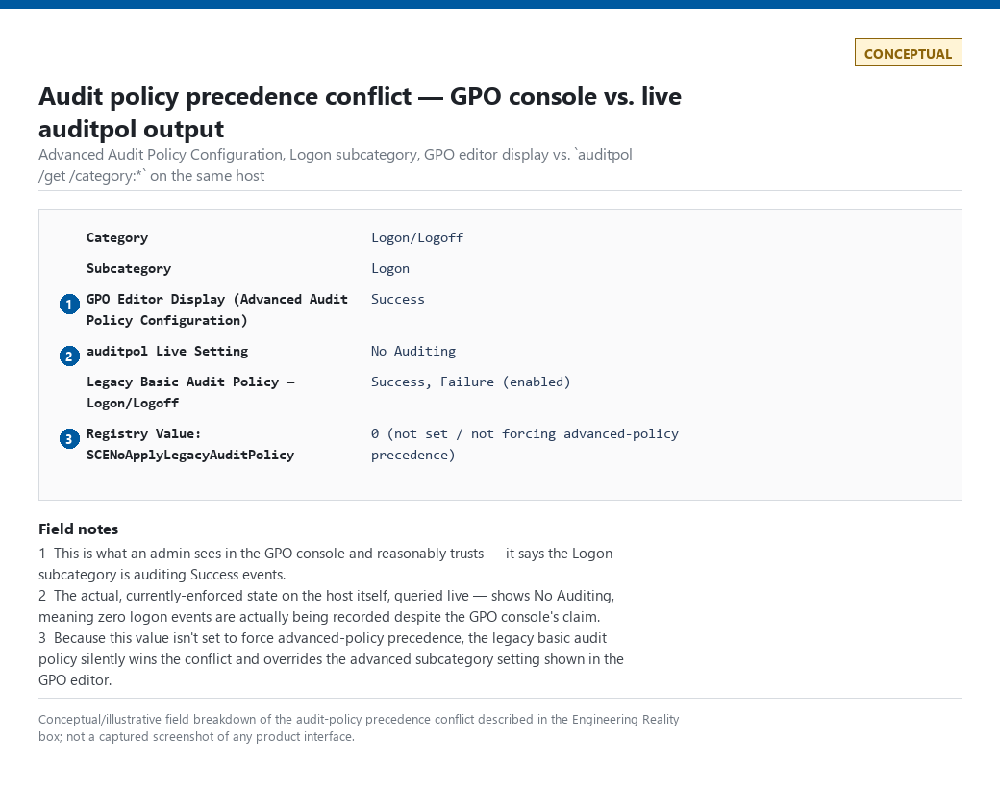
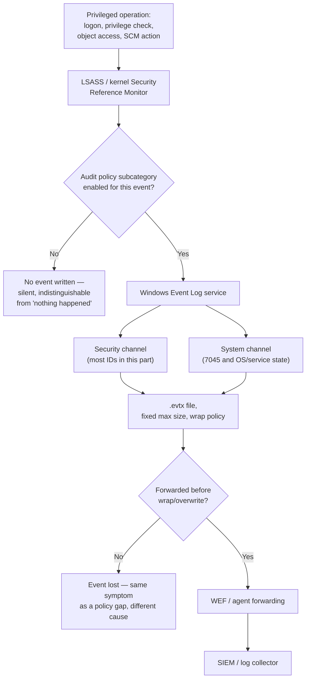
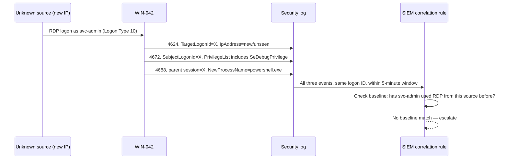
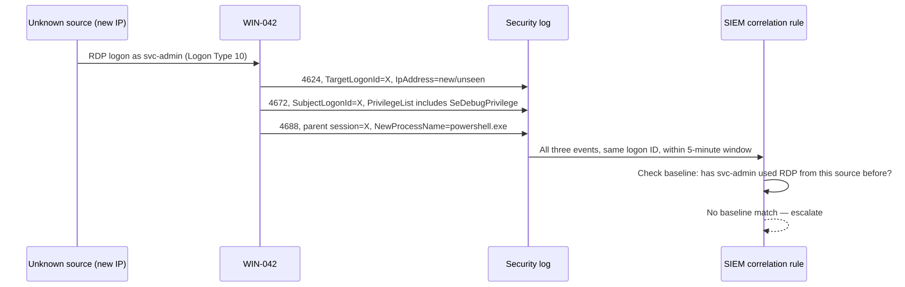
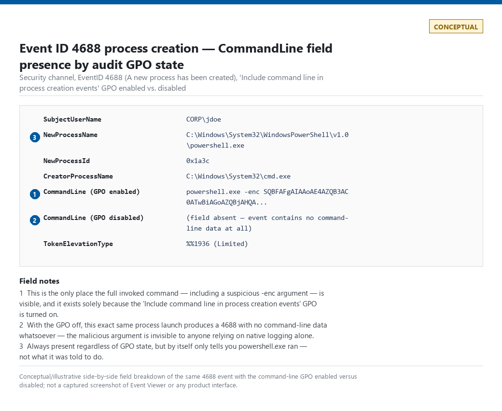

# Part 8 — Windows Detection Engineering

## Why this part exists

**[CONCEPT]** This part is the telemetry layer for native Windows logging — the Security and System event channels that exist on every Windows host with no third-party agent installed, and the audit-policy configuration that determines whether they actually record anything useful. It does not re-teach Sysmon (Part 9) or PowerShell script-block logging (Part 10); both of those are separate telemetry sources layered *on top of* what this part covers, and both get their own dedicated treatment. Where this part's event IDs and those sources overlap — process creation is the clearest case, native `4688` versus Sysmon Event ID 1 (Process Create) — this part says explicitly what the native event does and doesn't capture, then points forward rather than duplicating.

The scope is: the Security Reference Monitor and Event Log service architecture that produces these events at all; a first-pass look at Event Tracing for Windows (ETW) as the substrate other telemetry sources build on; and field-by-field depth on the specific event IDs a Windows-focused detection engineer touches constantly — logon and credential-validation events, Kerberos ticket events, process/service/task creation, account and privilege-management changes, discovery-adjacent enumeration events, and audit-log tampering. Analytic-layer content that belongs to later parts — Kerberoasting rule design (Part 13), lateral-movement correlation patterns (Part 11), authentication anomaly scoring (Part 12) — is referenced here only to the depth needed to explain what the underlying event records, not rebuilt.

A full field-level dump for every event discussed here lives in Appendix A1 (Windows & Endpoint Telemetry Field Reference); this part covers the fields that actually drive detection and triage decisions, not an exhaustive schema reprint.

---

## 1. Windows Security and System log architecture

**[CONCEPT]** Windows records security-relevant activity through a chain of components, not a single log file. The Local Security Authority Subsystem Service (LSASS) and the kernel-mode Security Reference Monitor generate audit records as privileged operations occur — a logon attempt, a privilege check, an object-access decision. Those records are handed to the Windows Event Log service, which writes them into one of several named channels. The two that matter for this part are **Security** (authentication, authorization, and object-access auditing — most of the event IDs below live here) and **System** (service, driver, and OS-level state changes — Event ID 7045 (A service was installed in the system) lives here specifically because it comes from the Service Control Manager, not the security-auditing subsystem).

**[ENGINEERING]** Whether an event fires at all depends on **audit policy**, and audit policy is where most "why didn't this alert fire" investigations end. Windows ships two audit-policy models that can be active at once and conflict with each other:

- **Legacy basic audit policy** — nine broad categories (Logon/Logoff, Account Management, Privilege Use, and so on), configured via Group Policy's "Audit Policy" node. Coarse: enabling "Account Management" turns on account creation, deletion, group changes, and password resets together, with no way to enable one without the others.
- **Advanced Audit Policy Configuration** — dozens of granular subcategories (Logon, Kerberos Authentication Service, Security System Extension, Other Object Access Events, and more), each independently on/off for Success and/or Failure. This is the model every event ID in this part assumes, because several of them — the scheduled-task creation/update events and one of the two service-installation events covered in §6 — simply do not exist under the basic model's default subcategory groupings on most builds.

> **Engineering Reality**
> A domain's Default Domain Controllers Policy enabling basic audit policy and Advanced Audit Policy Configuration at the same time is a documented Microsoft footgun: Windows disables the advanced settings unless the registry value forcing advanced-policy precedence (`SCENoApplyLegacyAuditPolicy`) is also set. An environment can look correctly configured in the GPO editor and still silently produce zero events for a subcategory the advanced policy claims to enable, because the legacy policy is the one actually winning. Verify with `auditpol /get /category:*` on the host itself, not the GPO console, before trusting that a subcategory is really active.

**[ENGINEERING]** Once an event is written to a channel, it sits in a `.evtx` file with a configured maximum size and a wrap behavior (overwrite oldest, archive, or never overwrite). A high-volume Security log on a busy domain controller — driven mostly by Kerberos service-ticket request volume (§5) — can wrap in under an hour if the max size is left at a small default and no forwarding agent is reading fast enough. This has nothing to do with Event ID 1102 (The audit log was cleared — the malicious/intentional log-clear event covered in §9) — it's silent, unintentional loss, and it produces exactly the same downstream symptom a SIEM analyst cares about: a gap in coverage with no alert marking it.


> A side-by-side of `auditpol /get /category:*` output against the Advanced Audit Policy GPO console for the same host, showing a subcategory that displays as "Success" in the GPO editor but "No Auditing" in the live `auditpol` output. CONCEPTUAL — illustrative field breakdown; not a captured screenshot. Supports the audit-policy-precedence claim in the Engineering Reality box above.

The following diagram shows the path from a privileged operation to a queryable event, and the two points — audit-policy scoping and log-channel wrap — where telemetry can be silently incomplete before it ever reaches a SIEM.






**Figure 8.1 — Native Windows event path from privileged operation to SIEM.** *CONCEPTUAL.* Illustrates where telemetry can go missing before a detection rule ever evaluates it — an audit-policy subcategory that isn't actually enabled, or a log channel that wraps before a forwarding agent reads it — rather than depicting a captured system. Rendered above; Mermaid source above is the editable version of record.

**[SOC MANAGEMENT]** A coverage claim of "we collect Windows Security logs" is a Telemetry Coverage statement (see TERMINOLOGY.md), not a Detection Coverage one — and per §1 of this section, it isn't even a reliable telemetry-coverage statement until someone has verified the live audit policy and the log-channel sizing on a representative sample of hosts, not just the GPO that's supposed to configure them.

---

## 2. ETW: the telemetry substrate underneath the event log

**[CONCEPT]** Event Tracing for Windows (ETW) is the kernel-level logging framework the Windows Security auditing pipeline is itself built on top of, and it's also the framework Sysmon, most commercial EDR agents, and the .NET/PowerShell logging providers tap directly. An ETW **provider** (a component instrumented to emit events — the kernel, a driver, an application) writes to an ETW **session**; a **consumer** subscribes to that session and reads events in near-real time, without necessarily going through the Event Log service or a `.evtx` file at all.

This matters for a Windows-focused detection engineer for one concrete reason: the Security event log is *one consumer* of *some* of what's instrumented on a Windows host, filtered through audit policy and written to disk with all the overhead that implies. A tool that consumes ETW directly — as Sysmon and most EDR agents do — can see events with lower latency, richer fields (a full command line, not one gated behind a GPO switch — see the Blind Spot box in §6), and no dependency on Security audit-policy subcategories being correctly enabled. That's the architectural reason Sysmon and EDR telemetry consistently out-perform the native Security log on process-creation visibility, and it's covered as its own topic in Part 9 rather than repeated here — this part's job is only to establish that the Security log is not the only, or even the richest, tap on the same underlying activity.

> **Hunter's Note**
> If a native Security-log-based detection is producing zero results and you're not sure whether that means "nothing happened" or "the audit policy is wrong," don't trust the absence. Pull the same time window from any ETW-consuming source you have — Sysmon, EDR telemetry, even Windows Defender's own operational log — and check whether *that* source saw the activity. A gap that's real in one source and populated in another is an audit-policy or forwarding problem, not a clean result.

---

## 3. Logon events and logon types: 4624, 4625, 4648

**[CONCEPT]** Every interactive or network authentication against a Windows host produces a logon event, and the single most important field on that event is **Logon Type** — a small integer that changes what the rest of the event means. The same account, the same source IP, and the same time of day describe a completely different risk profile depending on whether the logon type is 2 (someone sitting at the console) or 10 (an RDP session from a network address). Treating all logon events as one undifferentiated "someone logged on" signal is the single most common under-engineering mistake in Windows detection content, and it's the reason this section leads with the logon-type table before touching field-level detail on any specific event ID.

The table below maps Windows Logon Type values to their typical legitimate trigger and common attacker-abuse pattern, since the same field value means very different things depending on the number that appears in it.

| Logon Type | Name | Typical Legitimate Trigger | Common Attacker-Abuse Pattern |
|---|---|---|---|
| `2` | Interactive | Physical console logon — keyboard/screen at the machine | Attacker with physical or KVM/console access using stolen credentials directly at the box |
| `3` | Network | SMB share access, mapped drives, most service-to-service auth over the network | Lateral movement over SMB/admin shares, remote service installation, password-spray attempts against a network-facing auth endpoint |
| `4` | Batch | Scheduled Task execution under a stored account context | Persistence via a malicious scheduled task run under a captured account (see 4698/4702 in §6) |
| `5` | Service | A Windows service starting under its configured account | A malicious service installed to execute payloads under a stolen or over-privileged service account (see 4697/7045 in §6) |
| `7` | Unlock | Workstation unlock after screen-lock idle timeout | Rarely the primary signal on its own; relevant when correlating shared-workstation misuse or timing anomalies |
| `8` | NetworkCleartext | Legacy web auth (IIS Basic authentication) or other mechanisms that hand the password to the authentication package in a recoverable form | Endpoints logging this way are attractive brute-force/spray targets because the exposed auth path is usually the weakest one on the estate |
| `9` | NewCredentials | `RunAs /netonly` — keeps the current session's token but uses alternate credentials for outbound network connections | Offensive tooling using cached/stolen credentials for network authentication while leaving the local session's original token untouched, avoiding a "cleaner" interactive logon trail |
| `10` | RemoteInteractive | RDP / Terminal Services session | RDP-based lateral movement and remote hands-on-keyboard access — the logon type in the worked example in §10 |
| `11` | CachedInteractive | Domain logon using cached credentials when a domain controller is unreachable (laptop off-network) | Not a primary attack vector by itself; matters for tuning — don't flag a legitimately offline laptop's cached logon as anomalous just because no DC round-trip occurred |

**[DETECTION ENGINEER]** Logon type 10 is worth naming explicitly here because it maps cleanly to T1021.001 (Remote Desktop Protocol) when the surrounding context is abusive, and logon type 3 maps to T1021.002 (SMB/Windows Admin Shares) under the same condition — but the logon type alone never earns either tag. A logon type is a classifier for *what kind* of session this was, not a verdict on whether it was legitimate. That distinction is the entire point of the worked example in §10.

### 4624 — An account was successfully logged on

**[DETECTION ENGINEER]** Event ID 4624 (An account was successfully logged on) is the event fired on every successful logon of any type, and it's usually the highest-volume single event ID in a domain's Security log. The fields that actually drive detection logic:

| Field | What It Tells You |
|---|---|
| `TargetUserName` / `TargetDomainName` | The account that successfully authenticated |
| `TargetLogonId` | The session identifier — the cheapest correlation key across every subsequent event in that logon session, including 4672 and 4688 |
| `LogonType` | Which of the logon types above this was |
| `IpAddress` / `IpPort` | Source address for network-originated logon types (3, 8, 10); often blank or `-` for local types (2, 5) |
| `WorkstationName` | Source hostname as reported by the client — client-supplied, so treat it as informative, not authoritative |
| `LogonProcessName` / `AuthenticationPackageName` | Which subsystem handled the logon (`NtLmSsp`, `Kerberos`, `Negotiate`) — useful for spotting unexpected NTLM where Kerberos should be in play on a fully patched domain |
| `ElevatedToken` | Whether the resulting token carries elevated (administrative) rights — a fast pre-filter before checking 4672 separately |

> **Hunter's Note**
> `TargetLogonId` is the cheapest pivot you have for stitching one session together across event types — pull it first, before correlating on username or source IP, both of which get reused across sessions and pull in noise the logon ID won't.

### 4625 — An account failed to log on

**[DETECTION ENGINEER]** Event ID 4625 (An account failed to log on) shares most of 4624's fields plus `Status` and `SubStatus` — hex codes that distinguish *why* the logon failed, and that distinction changes the right detection response entirely:

| Status/SubStatus | Meaning | Detection Implication |
|---|---|---|
| `0xC000006A` | Bad password, valid username | The core signal for password-guessing/spray detection |
| `0xC0000064` | Username doesn't exist | Enumeration signal — a spray tool hitting invalid accounts, distinct from a guessing attempt against a real one |
| `0xC0000234` | Account locked out | Consequence event, not the attack itself — correlate backward to the 4625 burst that caused it |
| `0xC0000072` | Account disabled | Someone is attempting to use a deliberately disabled account — worth an explicit check regardless of volume |
| `0xC0000071` | Password expired | Routine, not an attack signal on its own |

> **False Positive Trap**
> A password-spray or brute-force threshold built purely on 4625 count will fire constantly on shared service accounts and legacy applications with hardcoded, occasionally-rotated credentials that a dozen scheduled jobs still reference with the old password after a rotation. Segment the threshold by whether the failing account is human-interactive versus a known service-account identity, and expect the service-account bucket to need a much higher, separately-tuned threshold rather than a shared one.

### 4648 — A logon was attempted using explicit credentials

**[DETECTION ENGINEER]** Event ID 4648 (A logon was attempted using explicit credentials) fires when a process running as one account explicitly supplies *different* credentials to authenticate elsewhere — `runas`, mapping a drive with alternate credentials, a scheduled task configured to run as another user, or credential-reuse tooling. Key fields: `SubjectUserName` (who initiated it), `TargetUserName`/`TargetServerName` (the identity and destination the explicit credentials were used against), and `ProcessName` (what launched the request).

**[THREAT HUNTER]** 4648 is a strong hunting pivot precisely because legitimate use is comparatively rare and concentrated (IT admins doing cross-account administration, a handful of service accounts). A hunt that baselines the normal `SubjectUserName → TargetUserName` pairs for 4648 over 30 days and flags any new pairing is cheap to build and catches credential-reuse patterns that a pure logon-type rule misses — HUNT-08-01 below is exactly this pattern.

> **HUNT-08-01 — Novel explicit-credential pairings.**
> **Hypothesis:** an account that has never used explicit alternate credentials against a given target before, and does so now, is worth a look even with no other signal present.
> **Method:** build a 30-day baseline of `(SubjectUserName, TargetUserName, TargetServerName)` triples from 4648, then flag any triple seen for the first time in the current day's data.
> **Disposition path:** a first-seen triple explained by a legitimate new admin task or onboarding closes as a documented negative finding; an unexplained triple involving a privileged target account becomes a detection candidate.
> **MITRE:** T1078 (Valid Accounts).
> **Honest false-positive rate:** high, and not evenly distributed — most 30-day windows contain a long tail of one-off, entirely legitimate first-time pairings (a new server build, a one-time migration task, a consultant's first day on a project), so expect the bulk of daily hits to be genuinely novel-but-benign. This hunt earns its keep on volume, not precision: it's cheap to run and cheap to close negative findings from, not a source of high-confidence pages. Don't promote it to a standing alerting rule without the same baseline-staleness caveat DET-08-02 carries.
> **Trivial bypass:** an attacker who reuses explicit credentials against a target the compromised account has *already* legitimately hit in the past 30 days (a service account scripting against its usual set of servers, an admin's normal jump-host list) never produces a novel triple and this hunt never surfaces it — same blind spot as DET-08-02's account/host baseline, for the same structural reason: the model flags novelty, not malice, and an attacker operating inside an account's existing footprint has no novelty to flag.
> **Missing telemetry:** 4648 depends on the "Audit Logon" subcategory being enabled for Success events; if that subcategory isn't enabled (it's a common gap outside domain controllers — member servers and workstations often only audit Logon failures by default), this hunt runs against an empty or partial dataset with no error, just a baseline that never grows and a first-seen count that looks unremarkable. Confirm the subcategory is enabled with `auditpol /get /category:Logon/Logoff` on a sample of hosts before trusting a quiet result.
> **Test it:** on a lab host, run `runas /user:domain\otheraccount cmd` (or map a network drive with alternate credentials) from an account with no prior 4648 history against that target, then confirm the resulting 4648's `(SubjectUserName, TargetUserName, TargetServerName)` triple is absent from the 30-day baseline query and appears in the next run's first-seen output. Re-run the same command a second time and confirm it does *not* reappear as first-seen — that's the check that the baseline logic itself is querying the right window and not just re-flagging every row.

---

## 4. Special privileges and NTLM validation: 4672 and 4776

### 4672 — Special privileges assigned to new logon

**[DETECTION ENGINEER]** Event ID 4672 (Special privileges assigned to new logon) fires immediately after a 4624 whenever the resulting token carries at least one "sensitive" privilege from a fixed Windows list — `SeDebugPrivilege`, `SeBackupPrivilege`, `SeTakeOwnershipPrivilege`, and similar. The key field is `PrivilegeList`, a space-separated string of every sensitive privilege granted; `SubjectLogonId` ties it back to the originating 4624 via the same logon ID. Like every event in this part, it's gated by an audit subcategory — "Audit Special Logon" — which is on by default under a standard Advanced Audit Policy Configuration but is still subject to the legacy/advanced policy conflict described in §1; if that subcategory silently loses precedence, 4672 stops firing entirely and every detection built on it goes dark with no error to page on.

> **Detection Autopsy — "alert on every 4672"**
>
> **The rule:** Fire an alert on every single Event ID 4672.
>
> **Why it shipped:** 4672 is documented as tied to privileged/administrative logons, and the query is a one-line filter on event ID alone — cheap to write, easy to justify in a design review as "we alert on privilege escalation."
>
> **How it failed:** Every local administrator logon, every UAC elevation, and every service starting under an account with a sensitive privilege produces a 4672. On a 5,000-seat estate that's 2,000–6,000 events a day, essentially all of it routine IT administration and scheduled service activity — none of it an attacker.
>
> **The fix:** Alert on 4672 only when it lacks a matching baseline entry — no prior history of that account holding privileged rights on that host, or a privileged logon at a time/location outside the account's established pattern (Part 31 covers baseline construction in depth). The raw event is not the detection; the *absence of a baseline match* is.

> **SOC Management View**
> Reporting "we monitor privileged logons" without stating the current false-positive rate against that monitoring invites exactly the failure mode above — a control that technically exists but generates enough noise that the SOC has quietly stopped triaging it. If a privileged-logon detection's disposition data shows a benign-positive rate near 100%, that's a staffing-relevant fact for a risk conversation, not a detail to omit from a coverage report.

> **DET-08-02 — Privileged logon without a matching baseline entry.**
> **MITRE:** T1078 (Valid Accounts).
> **Data sources:** Event ID 4624, Event ID 4672, joined on `TargetLogonId`/`SubjectLogonId`; a maintained baseline table of `(account, host)` pairs with prior privileged-logon history.
> **Limitation:** This is trivially bypassed by scope, not just stealth — an attacker who compromises a privileged account and reuses it against a host that account has *legitimately* logged into before (its own workstation, a jump box it already administers) produces a baseline match and never surfaces, because the anti-join only flags account/host pairs, not intent. Privileged accounts by definition already have a set of baselined hosts to hide inside. It also depends entirely on the "Audit Special Logon" subcategory actually being enforced (see §1's legacy/advanced policy conflict); if that subcategory silently loses precedence, 4672 stops firing and this detection produces zero results indistinguishable from "no privileged logons occurred." Catch that failure mode with a volume check, not an error log: alert if the estate-wide daily 4672 count drops sharply below its own rolling baseline, the same technique used to catch a wrapped or unforwarded log channel in §1.

The following Sentinel KQL is illustrative, teaching-only logic — the baseline join and lookback window are invented for exposition, not copied from a deployed rule.

```kql
// CONCEPTUAL SAMPLE — invented baseline table name and 30-day window, illustrating the join logic only.
// Targets Microsoft Sentinel / Log Analytics against the SecurityEvent table.
SecurityEvent
| where EventID == 4672
| project TimeGenerated, Account, Computer, SubjectLogonId
| join kind=leftanti (
    PrivilegedLogonBaseline_CL   // invented baseline table — not a real deployed schema
    | where TimeGenerated > ago(30d)
    | project Account, Computer
  ) on Account, Computer
// Rows surviving the anti-join are privileged logons with no matching baseline entry.
```

This query depends entirely on the baseline table being refreshed on a schedule shorter than a typical attacker dwell time; a 30-day-stale baseline that still lists a decommissioned admin account as "expected" will suppress the exact alert this rule exists to raise.

> **False Positive Trap**
> The fixed rule still fires on every legitimate first-time privileged logon to a host — a helpdesk technician touching a new workstation, an admin onboarded to a new team, or an admin logging into a freshly provisioned server all produce an unbaselined account/host pair identical at the field level to a compromised account's first use of a new box. In an environment with frequent host turnover (autoscaling, ephemeral VDI, routine server builds) this can dominate the alert volume. Enrich the alert with a change-ticket or provisioning-record lookup before paging, rather than trying to fix this by widening the baseline window — a wider window just delays the same false positive, it doesn't remove it.

> **Detection Test**
> **Setup:** Lab host with a test account added to the local Administrators group, no prior logon history for that account on the host.
> **Action:** Log on interactively as the test account.
> **Expected result:** Event ID 4624 (`LogonType` 2) immediately followed by Event ID 4672 with a non-empty `PrivilegeList`, both carrying the same `TargetLogonId`/`SubjectLogonId`; with no baseline entry present, DET-08-02's anti-join should surface the pair.

### 4776 — The domain controller attempted to validate the credentials for an account

**[DETECTION ENGINEER]** Event ID 4776 (The domain controller attempted to validate the credentials for an account) is NTLM-specific — it fires on the machine authoritative for the credential (typically a domain controller for domain accounts, but also a standalone/member server validating its own local accounts) when a client authenticates (or attempts to) using NTLM rather than Kerberos. Key fields: `TargetUserName`, `Workstation` (the client-supplied source computer name — same caveat as `WorkstationName` on 4624), and `Status` (an error code on failure, using the same code space as 4625's `Status`/`SubStatus`).

> **Blind Spot**
> 4776 tells you a domain controller validated (or rejected) NTLM credentials for an account — it does not tell you what happened on the client machine that initiated the request, and it does not fire at all for Kerberos authentication, which is the default path on a healthy, fully patched domain. An estate seeing a high proportion of 4776 relative to 4768/4769 has either a lot of legacy NTLM-dependent applications or a lot of NTLM being deliberately forced (a common pass-the-hash and relay pattern) — 4776 alone can't distinguish the two; it needs to be read alongside what's generating the NTLM fallback in the first place.

---

## 5. Kerberos ticket events: 4768, 4769, 4771

**[CONCEPT]** On a domain using Kerberos as its default authentication protocol, three event IDs on the domain controller cover the ticket lifecycle: a Ticket Granting Ticket (TGT) request, a service-ticket request against that TGT, and a pre-authentication failure. This part covers what each event records at the field level; the analytic patterns built on top of them — T1558.003 (Kerberoasting) detection built on the service-ticket event's encryption-type field, T1558.004 (AS-REP Roasting) detection built on the TGT event's pre-authentication flag — belong to Part 13 (Identity: Directory, Privilege & Kerberos Detection), which owns the Kerberos analytic layer.

### 4768 — A Kerberos authentication ticket (TGT) was requested

**[DETECTION ENGINEER]** Event ID 4768 (A Kerberos authentication ticket (TGT) was requested) fires on every TGT request against a domain controller. Fields that matter: `TargetUserName` (the requesting account), `ServiceName` (typically `krbtgt` for a normal TGT request), `TicketEncryptionType` (RC4 = `0x17`, AES128 = `0x11`, AES256 = `0x12` — the field Part 13's AS-REP/legacy-encryption analytics key on), `PreAuthType` (whether pre-authentication was used at all — `0` or absent is the T1558.004 (AS-REP Roasting) precondition Part 13 builds on), `ResultCode`, and `IpAddress`.

### 4769 — A Kerberos service ticket was requested

**[DETECTION ENGINEER]** Event ID 4769 (A Kerberos service ticket was requested) fires on every service-ticket request against a domain controller. Fields that matter: `TargetUserName` (requester), `ServiceName`/`ServiceSid` (the service the ticket is for — an SPN mapped to a service account is the T1558.003 (Kerberoasting) target surface Part 13 covers), `TicketEncryptionType` (same code space as 4768), `TicketOptions`, `ResultCode`, and `IpAddress`. This is typically the single highest-volume event on a domain controller — every SMB share access, every SPN-mapped service connection, and routine Kerberos ticket renewal all generate it, which is exactly why a naive filter on this event's encryption-type field alone floods a domain with false positives from legacy, non-AES-capable applications (see the style guide's own worked Kerberoasting Detection Autopsy for the canonical version of this failure — this part doesn't repeat that analytic build here, since it's Part 13's material).

### 4771 — Kerberos pre-authentication failed

**[DETECTION ENGINEER]** Event ID 4771 (Kerberos pre-authentication failed) fires when a TGT request's pre-authentication step fails. Fields that matter: `TargetUserName`, `IpAddress`, and `Status`/failure code — `0x18` is bad password, `0x25` is clock skew between client and domain controller exceeding the Kerberos tolerance, `0x12` covers disabled/expired/locked account states. The `0x25` clock-skew code is worth flagging specifically here because it's a pipeline problem, not a security one — see Part 7 (Time) for why clock drift produces exactly this failure mode and how to distinguish it from a real credential-guessing pattern.

> **What Would Change My Mind**
> This part treats 4768/4769/4771 as pure telemetry and defers all Kerberoasting/AS-REP-roasting analytic design to Part 13, on the assumption that keeping the telemetry-layer and analytic-layer content physically separate reduces duplication risk more than it costs in reader convenience. If reviewer feedback consistently shows readers landing on this part looking for the Kerberoasting rule itself and bouncing without following the Part 13 cross-reference, that would be a concrete reason to reconsider and pull a condensed version of that analytic back into this part.

---

## 6. Process, service, and scheduled task creation: 4688, 4697, 7045, 4698, 4702

### 4688 — A new process has been created

**[DETECTION ENGINEER]** Event ID 4688 (A new process has been created) fires under the "Audit Process Creation" advanced audit subcategory. Core fields: `NewProcessId`/`NewProcessName`, `ProcessId` (the parent process, by ID — resolving it to a name requires joining back to that process's own 4688 record), `SubjectUserName` (the account context the new process runs under), and `TokenElevationType` (whether the process token is a full, limited, or default UAC elevation type).

> **Blind Spot**
> By default, 4688 does not include the process command line — the `CommandLine` field only populates if the GPO "Include command line in process creation events" is separately enabled (it sets a registry value under `HKLM\SOFTWARE\Microsoft\Windows\CurrentVersion\Policies\System\Audit`), and that GPO is off by default on every supported Windows version as of this writing. Without it, 4688 tells you *that* `powershell.exe` launched and *who* launched it, but not *what argument string* it launched with — which is exactly the detail that distinguishes a routine PowerShell invocation from an encoded or obfuscated one. Sysmon Event ID 1 (Process Create) captures the command line unconditionally and is the more reliable source for this field — covered in Part 9, not repeated here.

### 4697 and 7045 — A service was installed in the system

**[DETECTION ENGINEER]** Event ID 4697 (A service was installed in the system) and Event ID 7045 (A service was installed in the system — introduced in §1) share almost the same official description and the same underlying trigger — a new Windows service registered with the Service Control Manager — but they live in different log channels with different default enablement, and treating them as interchangeable is a common gap:

| | `4697` | `7045` |
|---|---|---|
| Log channel | Security | System |
| Trigger subsystem | Security auditing (Audit Security System Extension subcategory) | Service Control Manager directly |
| Enabled by default | No — requires advanced audit policy | Yes, on a standard build |
| Key fields | `SubjectUserName`, `ServiceName`, `ServiceFileName`, `ServiceAccount` | `ServiceName`, `ImagePath`, `AccountName` |

> **Engineering Reality**
> An environment that has never explicitly enabled "Audit Security System Extension" will still see every malicious service installation in 7045 on the System channel, because that one is on by default — but will see nothing in 4697, and a detection built only against 4697 with no fallback to 7045 has a coverage gap that looks identical to "no service installations happened" until someone checks the System log directly. Build the service-installation detection against 7045 first for this reason, and treat 4697 as a Security-log corroborating source once the advanced audit subcategory is confirmed enabled — not the other way around.

**[DETECTION ENGINEER]** Service installation maps to T1543.003 (Create or Modify System Process: Windows Service) when the installed service is the persistence or execution mechanism itself, which covers classic PsExec-style lateral movement and most service-based persistence.

### 4698 and 4702 — Scheduled task created / updated

**[DETECTION ENGINEER]** Event ID 4698 (A scheduled task was created) and Event ID 4702 (A scheduled task was updated) fire under the "Audit Other Object Access Events" advanced subcategory — not enabled under most default configurations, worth checking explicitly rather than assuming. Key fields: `SubjectUserName` (who created/modified the task), `TaskName`, and `TaskContent` — an embedded XML blob containing the task's action definition, including the command and arguments it runs. `TaskContent` is worth parsing specifically, because that's where an attacker-defined payload command actually shows up, not in a top-level field. Maps to T1053.005 (Scheduled Task).

---

## 7. Account, group, and audit policy changes: 4720, 4724, 4728, 4732, 4740, 4719

**[DETECTION ENGINEER]** This section covers the field-level shape of account and privilege management events; the analytic layer for identity-directed abuse of these events — what a healthy admin-group-change baseline looks like, how to distinguish routine joiner/mover/leaver activity from privilege-escalation abuse — is Part 13's material, referenced here only where the field itself needs explaining.

| Event ID | Name | Key Fields | Typical MITRE Mapping When Abused |
|---|---|---|---|
| `4720` | A user account was created | `SubjectUserName` (creator), `TargetUserName`/`SamAccountName` (new account), `UserAccountControl` | T1136 (Create Account) — `.002` (Domain Account) on a domain controller, `.001` (Local Account) on a standalone host |
| `4724` | An attempt was made to reset an account's password | `SubjectUserName`, `TargetUserName` | T1098 (Account Manipulation) |
| `4728` | A member was added to a security-enabled **global** group | `SubjectUserName`, `MemberName`/`MemberSid`, `TargetUserName` (the group) | T1098 (Account Manipulation) |
| `4732` | A member was added to a security-enabled **local** group | Same shape as 4728, scoped to a local group (frequently `Administrators`) | T1098 (Account Manipulation) |
| `4740` | A user account was locked out | `TargetUserName`, `TargetDomainName`, caller computer name | — (consequence event; correlate to the 4625 burst that caused it) |
| `4719` | System audit policy was changed | `SubjectUserName`, `SubcategoryId`, `AuditPolicyChanges` | T1562.002 (Disable Windows Event Logging) when the change reduces auditing rather than legitimately reconfiguring it |

> **False Positive Trap**
> 4740 lockout storms are frequently self-inflicted, not an attack: a mobile device or mapped-drive connection retrying a stale cached password after a routine password rotation will lock an account out through dozens of rapid automated retries with no human — and no attacker — involved. Before escalating a lockout as suspicious, check whether the same device/service consistently causes the same account's lockouts across rotations; if so, it's a stale-credential hygiene problem, not an incident.

**[ANALYST]** `4728`/`4732`'s `MemberSid` field is occasionally recorded but doesn't resolve to a name (some SID-resolution failures render as a raw SID string, or historically as a literal `-`, depending on build and whether the member account still exists) — don't treat an unresolved member identity as itself suspicious; check the raw SID against AD directly before assuming the field is hiding something.

**[ANALYST]** 4719 deserves specific triage attention because a legitimate administrative audit-policy retune and an attacker disabling logging to cover tracks produce the identical event — the only distinguishing signal is *whether the resulting policy state makes sense operationally* (tightening a subcategory that was over-logging noise is normal; broadly disabling Logon or Object Access subcategories immediately before other suspicious activity is not).

---

## 8. Discovery telemetry: 4798 and 4799

**[DETECTION ENGINEER]** Event ID 4798 (A user's local group membership was enumerated) and Event ID 4799 (A security-enabled local group membership was enumerated) fire when something queries local group membership — commands like `net user <account> /domain`, `net localgroup administrators`, or equivalent API calls used by both legitimate management tooling and reconnaissance. Key fields: `TargetUserName`/`TargetSid` (the account or group being enumerated), `CallerProcessName` (what issued the query — `net.exe`, PowerShell, a management agent), and `SubjectUserName` (who ran it).

**[THREAT HUNTER]** These two are high-volume and individually low-signal — most enumeration is routine management tooling — but they map cleanly to T1069.001 (Permission Groups Discovery: Local Groups), and a hunt that pivots on `CallerProcessName` values outside the known management-tool set, on hosts that don't normally see interactive administrative activity, is a cheap way to surface hands-on-keyboard recon that a standing detection isn't tuned to catch at this volume.

> **Blind Spot**
> The `CallerProcessName` pivot only works if the enumerating binary's name is itself unusual. An attacker who renames their tool to `net.exe`, or who runs the enumeration from a legitimately-signed interpreter already common on the estate (PowerShell's `Get-LocalGroupMember`, WMI queries via `wmic.exe`), produces a `CallerProcessName` indistinguishable from routine management activity, and the "outside the known set" baseline never flags it. Pair this pivot with a hash or signer check on the actual binary at the reported path, not the process name alone.

---

## 9. Log tampering: 1102

**[DETECTION ENGINEER]** Event ID 1102 (The audit log was cleared) fires when the Security event log is explicitly cleared, and it is one of the very few events in this book that carries almost no legitimate high-frequency use case — routine log management is retention and rollover, not manual clearing. Fields: `SubjectUserName`, `SubjectDomainName`, `SubjectLogonId` — identifying exactly who (or what account context) issued the clear. Maps to T1070.001 (Indicator Removal: Clear Windows Event Logs).

> **SOC Management View**
> Because legitimate reasons to manually clear a Security log are rare and almost always tied to a specific, documented maintenance action, this is one of the few events where a program can reasonably commit to zero tuning and zero suppression as a standing policy — every occurrence pages, every occurrence gets a Tier 2 look, and if a team finds itself routinely closing 1102 as noise, that's a signal to fix the maintenance process generating it, not to raise the rule's threshold.

> **Detection Test**
> **Setup:** Lab domain-joined or standalone Windows host, local administrator rights on the test account.
> **Action:** `wevtutil cl Security`
> **Expected result:** A single Event ID 1102 entry appears as the first record in the now-cleared Security log, with `SubjectUserName` matching the account that ran the command.

> **DET-08-03 — Any occurrence of 1102 on any host.**
> **MITRE:** T1070.001 (Indicator Removal: Clear Windows Event Logs).
> **Data sources:** Event ID 1102, Security log, no correlation needed — the event alone is the alert condition.
> **Limitation:** This detection depends entirely on the clear action itself being forwarded before the log-writing pipeline that would carry it is itself disrupted; an attacker with a live agentless foothold and enough privilege to both clear the log and disable or delay the forwarding agent in the same session can outrun this detection. It should be paired with forwarding-agent heartbeat monitoring (Part 5), not treated as sufficient on its own.

> **Blind Spot**
> 1102 only fires when the log is cleared through the documented "clear log" API (`wevtutil cl`, Event Viewer's Clear Log action, or the equivalent Win32 call) — it does not fire if an attacker with SYSTEM or local-admin rights stops the Windows Event Log service, deletes or overwrites the underlying `.evtx` file directly, and restarts the service to get a fresh, empty log. That sequence produces the exact same operational result — no prior history left to review — with no 1102 anywhere to page on, which is a different and more complete evasion than the forwarding-race case above.

---

## 10. Worked example: from a bare 4624 Type 10 to a real detection

**[ANALYST]** This is the fully worked version of the point this part keeps returning to: an individual event, even a well-chosen one, is rarely a verdict. Event ID 4624 with `LogonType` 10 (RemoteInteractive) means "someone opened an RDP session" — nothing more. On any estate with legitimate remote administration, that alone fires constantly and tells an analyst nothing actionable. The same event becomes worth a page only once it's read alongside the right co-occurring signals.

**[DETECTION ENGINEER]** Consider a single account, `svc-admin`, logging on to workstation `WIN-042` via RDP. On its own, a 4624/Type 10 for that account proves nothing. Layer in, in order:

1. **A new source.** The originating `IpAddress` on the 4624 has never been seen for this account in the prior 30 days of baseline history (Part 31 covers baseline construction; here it's just an input).
2. **A privileged identity.** `svc-admin` is a domain-privileged service account, not a routine interactive user — its normal behavior profile doesn't include RDP sessions at all.
3. **A matching 4672.** The same `TargetLogonId` produces Event ID 4672 with a `PrivilegeList` including `SeDebugPrivilege` — consistent with the account's normal privilege level, but now happening inside a session type it never normally uses.
4. **A matching 4688.** Within the same session, Event ID 4688 shows `powershell.exe` launched as a child process, with `TokenElevationType` indicating a full elevation token.
5. **An unexpected PowerShell shape.** Where the command line is visible at all (see the Blind Spot in §6 — this depends on the process-creation command-line GPO being enabled, and is more reliably sourced from Sysmon per Part 9), the invocation carries an encoded or heavily obfuscated argument string inconsistent with this account's normal scripted maintenance tasks.

No single one of these five signals is sufficient. A new source alone might be a legitimate admin working from an unregistered new laptop. A privileged identity using RDP might be an intentional, approved break-glass session. A 4672 alongside a 4624 is expected on this account by design. A `powershell.exe` child process off an RDP session is routine administrative behavior on most estates. It is the conjunction — new source, on a privileged identity that doesn't normally use this logon type, immediately producing a privileged token and an unusual PowerShell invocation, all within one correlation window — that is worth a page.






**Figure 8.2 — Correlation sequence for the Type 10 privileged-RDP worked example.** *CONCEPTUAL.* Illustrates the event sequence and correlation logic described in the surrounding prose; not a capture from a real attack run. Rendered above.

> **DET-08-01 — Privileged RDP (Type 10) logon from a new source, correlated with 4672 `SeDebugPrivilege` and a suspicious 4688 PowerShell child process.**
> **MITRE:** T1021.001 (Remote Desktop Protocol), T1078 (Valid Accounts).
> **Data sources:** Event ID 4624 (`LogonType`=10), Event ID 4672, Event ID 4688, joined on `TargetLogonId`/`SubjectLogonId`; a per-account 30-day source-IP baseline.
> **Limitation:** Depends on all three events firing and sharing a resolvable logon ID — if the "Include command line in process creation events" GPO is off (see the Blind Spot in §6), the 4688 leg still matches on process name but loses the command-line evidence that distinguishes routine PowerShell use from an obfuscated invocation, weakening the conjunction to four signals instead of five. Expected false-positive driver: broadly-scoped break-glass accounts that legitimately RDP from a wide, rotating pool of sources (see the What Would Change My Mind box below). To catch this rule silently going dark — a broken join key after a schema change, or the "Audit Special Logon"/"Audit Logon" subcategories losing precedence per §1 — track its daily alert *and* raw-input volume (count of 4624 Type 10 events feeding the join) against a rolling baseline; a correlation rule that goes from a normal trickle of alerts to zero is far more likely a plumbing failure than an estate that suddenly stopped having privileged RDP activity, and periodic re-runs of the Detection Test below are the cheapest way to confirm the pipe is still live.

**[DETECTION ENGINEER]** The illustrative Sentinel KQL query below implements the correlation described above. It is teaching-only — the specific 30-day lookback and the invented baseline table name are choices made for exposition, not a tested production threshold.

```kql
// CONCEPTUAL SAMPLE — invented baseline table, illustrating the join/correlation shape only.
// Targets Microsoft Sentinel / Log Analytics against the SecurityEvent table.
let PrivilegedAccounts = datatable(Account: string) ["svc-admin"];   // invented allowlist for illustration
SecurityEvent
| where EventID == 4624 and LogonType == 10
| where Account in (PrivilegedAccounts)
| join kind=leftanti (
    RdpSourceBaseline_CL          // invented baseline table — not a real deployed schema
    | where TimeGenerated > ago(30d)
    | project Account, IpAddress
  ) on Account, IpAddress
| join kind=inner (
    SecurityEvent
    | where EventID == 4672
    | project SubjectLogonId, PrivilegeList
  ) on $left.TargetLogonId == $right.SubjectLogonId
| join kind=inner (
    SecurityEvent
    | where EventID == 4688 and NewProcessName has "powershell.exe"
    | project SubjectLogonId, CommandLine
  ) on $left.TargetLogonId == $right.SubjectLogonId
| where PrivilegeList has "SeDebugPrivilege"
```

This query's main limitation is the same one that applies to every baseline-anti-join pattern in this part: it is only as good as `RdpSourceBaseline_CL`'s refresh cadence, and it silently under-alerts against an account that has legitimately RDP'd from a wide, poorly-scoped range of sources in the past — the baseline needs to be built per-account, not shared across a role, or a genuinely new-and-suspicious source from a role with historically broad access will pass the anti-join unnoticed.

> **Blind Spot**
> If the RDP session passes through an RD Gateway, RD Connection Broker, or any jump host, the `IpAddress` on the Type 10 4624 is the intermediary's address, not the original client's — every attacker routing through the same jump host legitimate admins already use looks like a previously-seen source, and the source-IP anti-join never fires. The query also only matches `NewProcessName has "powershell.exe"`: an attacker who spawns `cmd.exe`, `mshta.exe`, or any other LOLBin as the post-logon child process produces the same RDP-to-privileged-session pattern but satisfies neither the 4688 join nor the detection. The `PrivilegeList has "SeDebugPrivilege"` filter has the same problem — an account whose sensitive privileges are `SeBackupPrivilege` or `SeTakeOwnershipPrivilege` instead never matches, even though the underlying abuse pattern is identical.

> **Detection Test**
> **Setup:** Domain-joined lab host, a test service account with no prior RDP history, RDP enabled, "Include command line in process creation events" GPO applied for this test (see the Blind Spot in §6 for why that GPO matters here).
> **Action:** RDP to the test host as the test account from a source IP with no baseline history, then run `powershell.exe -enc <base64 string>` inside the session.
> **Expected result:** One Event ID 4624 (`LogonType=10`), one Event ID 4672 (`PrivilegeList` populated), and one Event ID 4688 (`NewProcessName` = `powershell.exe`, `CommandLine` containing the `-enc` argument), all sharing the same logon ID within the correlation window.

> **What Would Change My Mind**
> This worked example assumes a 30-day source-IP baseline per privileged account is a reasonable window for "new source." If a production audit showed privileged accounts routinely and legitimately RDP from a rotating pool of sources wider than 30 days would capture (a break-glass process using a different jump box each time, for instance), the right fix would be baselining against a *known jump-box allowlist* rather than raw source-IP history, and this section's confidence in the illustrated threshold would need to drop accordingly.

---

## 11. What native Windows logging can't see

**[CONCEPT]** Everything in this part comes from the Security and System event log channels as populated by Windows' own built-in auditing subsystem, gated by audit policy. That's a real, load-bearing telemetry source — every domain-joined Windows host produces it with no additional agent — and it's also structurally limited in ways worth naming plainly before handing off to the parts that cover what sits on top of it:

- **Command-line visibility is opt-in and incomplete.** 4688 only carries `CommandLine` if a specific GPO is enabled, and even then it's one field on one event, not a full process-tree view. Part 9 covers Sysmon's more complete process-creation telemetry.
- **No network-connection correlation.** The native Security log tells you a logon or a process launch happened; it does not tell you what network connections that process subsequently made. That's Sysmon Event ID 3 (Network Connect) territory or dedicated network telemetry (Part 14).
- **No script content.** 4688 shows that `powershell.exe` ran and, if enabled, its top-level command line — it does not show the actual script block content executed inside a session, which is what Event ID 4104 and AMSI-based logging exist to capture (Part 10).
- **Audit-policy dependence is a single point of silent failure.** Every event in this part can simply not exist if the relevant subcategory isn't enabled — and, per §1, "the GPO says it's enabled" is not the same fact as "the host is actually recording it."

None of this makes native Windows logging a weak telemetry source — it's the one guaranteed to exist on every Windows host in an estate with zero additional agent deployment, which makes it the right first place to build detection coverage before any endpoint agent is rolled out. It's limited in specific, namable ways, and knowing exactly where those limits sit is what tells you when the native log is enough and when it isn't.


> A Windows Event Viewer screenshot of a real Event ID 4688 entry with the command-line GPO disabled, next to the same event with it enabled, showing the missing `CommandLine` field directly. CONCEPTUAL — illustrative field breakdown; not a captured screenshot. Supports the Blind Spot claim in §6 with a direct visual rather than a described field difference.
