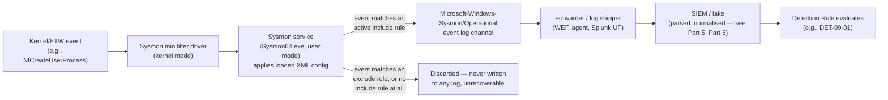
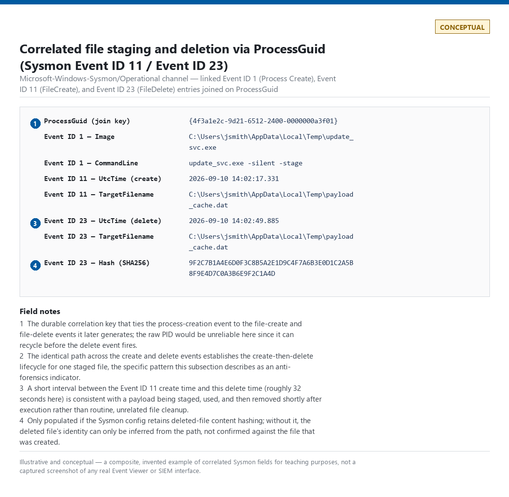

# Part 9 — Sysmon Detection Engineering

## Why this part exists

Part 8 covered what the native Windows Security and System logs give you before Sysmon exists in the picture — successful and failed logon events, process creation if audit policy and command-line logging are both turned on, and the gaps that leaves. This part starts from where Part 8 left off: Sysmon (System Monitor), a free Microsoft Sysinternals driver-plus-service pair that has become the de facto baseline endpoint telemetry source for any Windows estate that either can't afford a commercial EDR agent everywhere or wants a vendor-independent telemetry layer underneath one.

Sysmon is not a detection engine. It has no correlation logic, no alerting, no console. It is a telemetry generator with a configuration language that decides what to keep and what to throw away before it ever reaches your SIEM. That configuration is the actual engineering surface of this part — a Sysmon deployment is only as good as the config file driving it, and a bad config produces either a flood of Sysmon Event ID 1 (Process Create) noise that nobody can afford to retain, or a silently incomplete log stream that looks clean because nothing is actually being captured. This part treats that config as a versioned artifact with its own lifecycle, walks the event ID surface you actually build detections against, and is honest about where Sysmon stops seeing anything at all — including the fact that Sysmon itself is a normal, stoppable, tamperable Windows service unless you go out of your way to harden it.

This part does not re-teach commercial EDR telemetry (Part 3 covers EDR generically, at the same eight-dimension scoring model applied to every telemetry source in that part) or PowerShell-specific logging (Part 10 owns 4103/4104 and AMSI exclusively). Where Sysmon and EDR telemetry overlap — both can report process creation, both can report network connections — this part says so explicitly rather than re-arguing which is "better."

---

## 1. Where Sysmon sits in the telemetry chain

**[CONCEPT]** Sysmon installs a kernel-mode minifilter driver and a user-mode service (`Sysmon64.exe` on 64-bit Windows) that both register for kernel and ETW (Event Tracing for Windows) callbacks the native Security log does not expose at all — process creation with full command line and parent/child linkage by `ProcessGuid` (a value that survives PID reuse, unlike the raw PID), network connections tied to the initiating process, DLL and driver loads with signature status, registry modifications, named-pipe creation, and DNS queries resolved at the endpoint before they ever reach a resolver log. None of this requires Windows Advanced Audit Policy configuration the way Event ID 4688 (A new process has been created)'s command-line field does (see Part 8) — Sysmon's own config is the only gate.

Sysmon writes its output to its own event log channel, `Microsoft-Windows-Sysmon/Operational`, not to the Security or System channel — a detail that matters for anyone writing a collector or forwarder config, since a Sysmon-blind pipeline that only forwards the Security channel will silently drop every Sysmon event with no ingest error anywhere.

> **Engineering Reality**
> A surprising number of first Sysmon deployments this book's authors have seen fail not because the config is wrong, but because the log forwarder (Windows Event Forwarding subscription, a Splunk universal forwarder's `inputs.conf`, an agent's channel list) was never updated to include `Microsoft-Windows-Sysmon/Operational`. The service runs, the local Event Viewer shows events, and the SIEM shows zero — a textbook Telemetry Debt case (see TERMINOLOGY.md § Detection Debt) that looks like "nothing happened" rather than "nothing arrived."

### 1.1 Sysmon vs. commercial EDR telemetry

**[ENGINEERING]** Part 3 scores commercial EDR telemetry on the same eight dimensions (visibility, blind spots, volume, quality, retention, cost, field completeness, parser reliability) applied to every other source in that part — read that scoring there rather than here. The short version for this part's purposes: a commercial EDR agent typically captures a superset of what Sysmon captures (in-memory injection detection, AMSI-integrated script content, kernel callback protection for its own driver) at a real per-endpoint licensing cost, while Sysmon is free, open in its config format, and stops at whatever its documented event types can see. Most mature Windows estates run both — EDR for its behavioral detections and tamper resistance, Sysmon for a vendor-independent, fully-owned telemetry stream that keeps working if the EDR agent's own service is disabled or the contract lapses. Treat this part's event ID walkthrough as the Sysmon-specific instance of a telemetry source Part 3 already taught you how to evaluate generically.

The diagram below traces one Sysmon event from the kernel event that generates it to the analytic that consumes it, the same abstract hop-by-hop model Part 2 introduced for telemetry generally, instantiated for Sysmon specifically.

**Figure 9.1 — Sysmon event data flow, kernel to detection rule.** *CONCEPTUAL.* Illustrates the path a single kernel event takes through the Sysmon driver, the config-driven include/exclude decision, and the log-forwarding chain, including the discard path most engineers underestimate — an event that never matches an include rule is gone before it reaches disk, not just filtered downstream. Not a capture from a real system — §3.12 has the part's one rendered screenshot-style figure, also CONCEPTUAL for the same lab-availability reason. Diagram ID `FIG-09-01`.




---

## 2. Config-as-code: treating the Sysmon config as a versioned artifact

**[ENGINEERING]** Sysmon's behavior is controlled entirely by one XML configuration file, loaded at install time (`sysmon64.exe -i config.xml`) or pushed to a running instance without a service restart (`sysmon64.exe -c config.xml`). That file is the actual detection-relevant artifact in a Sysmon deployment — two hosts running the identical Sysmon binary with different configs produce meaningfully different telemetry, and a config that silently regresses (a bad merge, a manually-edited exception nobody logged) produces the exact silent-gap failure mode Detection Debt describes: zero errors, zero new alerts, and a coverage hole that only shows up when a hunt or a red-team exercise goes looking for an event type that stopped arriving months ago.

Part 22 (Detection as Code) owns the full treatment of git-based rule repos, PR review gates, and CI/CD for detection logic generally — apply that model to the Sysmon config file itself, not just to the SIEM-side detection rules that consume its output:

- **Version control.** The XML config lives in the same git repository discipline as any Sigma rule — one canonical file (or a small set, if different host roles genuinely need different configs), diffed on every change, never hand-edited on a production host.
- **Schema version pinning.** The config's `<Sysmon schemaversion="X.XX">` attribute must match a schema version the installed binary actually supports; deploying a newer-schema config against an older binary fails to load specific rule blocks it doesn't recognize, and it fails quietly in the sense that the service keeps running on whatever it could parse — verify the exact failure behavior against your specific binary version before assuming "some events" beats "no events."
- **Config validation before rollout.** Run `sysmon64.exe -c config.xml` against a test host (or even just a syntax/schema check) before pushing to the fleet — a malformed rule group can prevent the whole config from loading, which reverts every host it touches to whatever config (or none) was previously active.
- **Config hash as a fleet health check.** Track the deployed config's file hash as a fleet-wide inventory field, the same way you'd track detection rule versions, so a host silently running last quarter's config is visible on a dashboard rather than discovered during an incident.

> **Detection Autopsy — "one Sysmon config for the whole fleet, updated by hand on the domain controller"**
>
> **The rule:** A single `config.xml`, edited directly on the file share it's deployed from whenever someone wants to add an exclusion, with no version history.
>
> **Why it shipped:** It's the fastest path from "we should exclude this backup agent's noise" to "the noise is gone" — one edit, one GPO refresh cycle, done.
>
> **How it failed:** Six months in, nobody could say which exclusions were still needed, which were added by someone who's since left, or whether an overly broad exclusion (`<Image condition="contains">backup</Image>`, added to quiet one specific backup tool) was also silently hiding a different process that happened to have "backup" in its path — including, in the post-mortem, an attacker-renamed binary staged as `backup_update.exe`.
>
> **The fix:** The config moved into the same git repo as the Sigma rules it feeds, with every exclusion added as a reviewed PR carrying a name, a justification, and a review date — the same Exception discipline TERMINOLOGY.md requires for detection-rule carve-outs, applied to the telemetry layer instead of the rule layer.

---

## 3. Event ID coverage

**[CONCEPT]** The table below maps the Sysmon event IDs this part covers to what each one captures and the detection use each is most commonly built for — use it as an index into the subsections that follow, not as a substitute for reading them; several of these IDs carry meaningful false-positive drivers that don't fit in a table cell.

| ID | Captures | Primary detection use | Example MITRE technique |
|---|---|---|---|
| `1` | Process creation, full command line, parent/child linkage | Execution, LOLBin abuse, obfuscated command lines | T1059 (Command and Scripting Interpreter) |
| `3` | Network connection, tied to the initiating process | C2 beaconing, unexpected outbound from a server role | T1071 (Application Layer Protocol) |
| `6` | Driver load, signature/signing status | BYOVD, EDR/AV tampering, rootkit staging | T1562.001 (Impair Defenses: Disable or Modify Tools) |
| `7` | Image (DLL) load, signature/signing status | DLL sideloading, unsigned module injection | T1574.002 (Hijack Execution Flow: DLL Side-Loading) |
| `8` | CreateRemoteThread into another process | Process injection | T1055 (Process Injection) |
| `10` | One process opening a handle to another with specific access rights | Credential dumping via LSASS access, process-hollowing precursors | T1003.001 (OS Credential Dumping: LSASS Memory) |
| `11` | File creation, target path | Dropped payloads, staging directories | T1105 (Ingress Tool Transfer) |
| `12` / `13` | Registry key/value create, delete, or set | Persistence via run keys, config tampering | T1547.001 (Registry Run Keys / Startup Folder) |
| `15` | Alternate data stream creation on a file | Mark-of-the-Web evasion, hidden payload staging | T1564.004 (Hide Artifacts: NTFS File Attributes) |
| `17` / `18` | Named pipe creation and connection | C2 frameworks using named pipes for local/SMB-based comms | — |
| `22` | DNS query issued by a named process | Endpoint-side C2 domain resolution, DGA lookups | T1071.004 (Application Layer Protocol: DNS) |
| `23` | File deletion (with content hash, if configured) | Anti-forensics, log/tool cleanup after use | T1070.004 (Indicator Removal: File Deletion) |

No clean, durable MITRE mapping exists for named-pipe creation/connection as a standalone technique — Cobalt Strike-style SMB named-pipe C2 is a known real-world pattern, but forcing it under an ATT&CK ID that doesn't specifically describe pipe abuse would be exactly the invented-mapping problem the style guide warns against; report it in prose (§3.10) instead of a table cell.

This table is deliberately not exhaustive. Sysmon also emits WMI-subscription events (Event IDs 19–21: `WmiEventFilter`, `WmiEventConsumer`, `WmiEventConsumerToFilter`) that map to T1546.003 (Event Triggered Execution: Windows Management Instrumentation Event Subscription) — a real, commonly abused persistence mechanism — and this part does not walk through them; Part 11 and Part 44 pick up WMI-based persistence and lateral movement. Treat the omission here as a stated scope boundary, not evidence that WMI persistence lacks Sysmon-level visibility.

### 3.1 Sysmon Event ID 1 (Process Create)

**[DETECTION ENGINEER]** The highest-volume and highest-value event type Sysmon produces. Fields that matter: `Image` (the executable path), `CommandLine` (the full invocation, unlike 4688's optional and often-truncated equivalent), `ParentImage` and `ParentCommandLine`, `User`, `IntegrityLevel`, `Hashes` (if configured — SHA256 alone is enough for most matching; enabling all four hash algorithms roughly quadruples the field's storage cost for no detection benefit over one strong algorithm), and `ProcessGuid`, which is the durable join key across every other event type this process later generates — use it instead of the raw PID when correlating Event ID 1 to a later 3, 8, 10, or 11 from the same process, since PIDs recycle within hours on a busy host and `ProcessGuid` does not.

> **Hunter's Note**
> `ParentImage` is where most naive "this LOLBin is suspicious" rules should start but don't. `certutil.exe` downloading a file is a real pattern (T1105) — but `certutil.exe` spawned by `winword.exe` is a materially different prior than `certutil.exe` spawned by a scheduled task running as SYSTEM at 3 AM. Pull the parent chain before you write the rule, not after it starts firing on both.

On a typical 5,000-endpoint Windows fleet with a reasonably permissive config, Sysmon Event ID 1 alone commonly runs into the tens of millions of events a day — this is the single biggest volume/cost driver in a Sysmon deployment, and §4 covers the filtering strategy that keeps it from being the reason the project gets killed at renewal time.

### 3.2 Sysmon Event ID 3 (Network Connect)

**[DETECTION ENGINEER]** Captures `SourceIp`/`SourcePort`, `DestinationIp`/`DestinationPort`, `Protocol`, and — critically, the field that distinguishes this from a firewall or NetFlow log covering the same connection — `Image`, the initiating process. This is what lets an endpoint-side rule say "this specific process opened this connection," a join that network telemetry alone (Part 14) cannot make without a separate process-to-connection correlation step.

> **False Positive Trap**
> Every browser, every update client, and every piece of legitimate SaaS/telemetry software on a modern endpoint opens dozens of outbound connections a minute. A bare "alert on any Event ID 3 to a rare destination" rule drowns in this within hours. Scope Event ID 3 rules to a specific process population (server-role processes that should never make arbitrary outbound connections, or a named list of LOLBins with no legitimate reason to reach the network) rather than trying to threshold rarity across every process on the host — that's a job for baselining (Part 31) and risk-based scoring (Part 33), not a standalone Sysmon rule.

### 3.3 Sysmon Event ID 6 (Driver Loaded)

**[DETECTION ENGINEER]** Captures `ImageLoaded` (the driver's file path) and `Signed`/`Signature`/`SignatureStatus`. This is the event that catches Bring Your Own Vulnerable Driver (BYOVD) activity — an attacker with local admin loading a legitimately-signed-but-exploitable driver to get a kernel-mode primitive that user-mode EDR hooks can't see, often specifically to disable or blind security tooling.

> **DET-09-02 — Unsigned or newly-observed kernel driver load**
>
> **Analytic:** A Sysmon Event ID 6 fires for a driver whose `SignatureStatus` is not `Valid`, or whose `ImageLoaded` hash has no prior occurrence anywhere in the fleet's driver-load history.
>
> **MITRE:** T1562.001 (Impair Defenses: Disable or Modify Tools).

The rule below implements only the first half of that analytic — the signature check. The second half (hash never seen before in the fleet) is not expressible as a static Sigma selection at all: Sysmon's own event carries no fleet-wide history, so "newly observed" requires joining `ImageLoaded`/`Hashes` against an external driver inventory built and refreshed over time (Part 31's baselining model), not a field the event itself provides. Treat the two halves as separate detection rules with separate false-positive profiles, not one query.

```yaml
# CONCEPTUAL SAMPLE — illustrative Sigma-style logic, not validated against a live backend.
# Covers the signature-check half of the analytic only — see prose above.
title: Sysmon driver load with invalid signature status
id: 09-det-02-conceptual
status: experimental
logsource:
  product: windows
  category: driver_load
detection:
  selection:
    SignatureStatus:
      - 'Unavailable'
      - 'Invalid'
      - 'Unsigned'
  filter_known_good:
    Signature|contains:
      - 'Microsoft Windows'
  condition: selection and not filter_known_good
```

This depends on `SignatureStatus` and `Signature` actually being populated, which in turn depends on Sysmon's own signature-checking being enabled and able to run — see the Engineering Reality box below for the specific way that silently fails. If `SignatureStatus` is null or absent from the event (a stripped field, or a schema mismatch after a Sysmon upgrade), the `selection` clause never matches: the rule goes quiet with zero errors, which reads as "no bad drivers" rather than "this rule stopped evaluating," the same Detection Debt failure mode this part keeps naming.

> **Engineering Reality**
> Signature validation for Event ID 6 involves a certificate-revocation check, and on a host with no outbound path to a CRL/OCSP endpoint — an isolated lab segment, a server VLAN with tight egress rules, a host mid-boot before network is up — that check can time out and report `SignatureStatus` = `Unavailable` for a driver that is, in fact, validly signed. The selection clause above treats `Unavailable` the same as `Invalid`/`Unsigned`, so a network-isolated fleet segment will show a materially higher false-positive rate on this rule than a fully connected one, for a reason that has nothing to do with driver trustworthiness. This is exactly why the sample above pairs the `SignatureStatus` check with a `Signature|contains: 'Microsoft Windows'` exclusion — the signer name field is still populated even when revocation status can't be confirmed, so it survives the `Unavailable` case for in-box drivers.

> **False Positive Trap**
> Two legitimate sources drive most of this rule's noise. First, ordinary third-party hardware and peripheral drivers (printers, VPN clients, virtualization host drivers, some GPU and storage tools) are routinely signed with a cross-signing or catalog-signing chain that Sysmon reports as valid but with a non-Microsoft signer, or occasionally as `Unavailable` per the Engineering Reality box above — expect a real, non-attacker baseline rate here on any heterogeneous hardware fleet, not zero. Second, if the fleet ever implements the hash-novelty half of the analytic, a routine Windows Update or vendor driver-package rollout will make every endpoint's driver hash "newly observed" fleet-wide on the same day, producing a spike that looks like a coordinated event but is patch Tuesday. The fix for both: baseline by signed publisher and known-good driver package identity (Part 31), not by raw hash or presence/absence of a Microsoft signer string, and expect a non-trivial one-time tuning pass after each new hardware onboarding or major Windows Update wave.

> **Detection Test**
> **Setup:** Isolated Windows test VM — not a production host, given the kernel-mode risk of loading an arbitrary test driver — with Sysmon Event ID 6 enabled and network access to a CRL/OCSP endpoint (to avoid the `Unavailable` confound above).
> **Action:** Enable test signing (`bcdedit /set testsigning on`, reboot), then load a self-signed or test-signed non-Microsoft kernel driver via `sc create <name> type= kernel binPath= <path>` followed by `net start <name>`.
> **Expected result:** A Sysmon Event ID 6 entry with `ImageLoaded` pointing at the test driver's path and `SignatureStatus`/`Signature` reflecting the test certificate rather than a trusted Microsoft or known-vendor chain — confirming the selection logic fires on a driver that is signed but not by an excluded, trusted publisher, which is the actual condition the rule targets.

> **Blind Spot**
> `SignatureStatus` tells you whether the driver's certificate is currently valid — it does not tell you whether the driver is malicious. BYOVD attacks specifically use drivers that are validly signed by a real vendor and have a real, legitimate purpose (an old anti-cheat driver, an outdated hardware-monitoring tool with a kernel read/write primitive) — the signature check passes cleanly, and the exploit is in how the driver's own functionality gets abused after it loads, which Event ID 6 alone cannot see. A hash-based known-vulnerable-driver blocklist (Microsoft publishes one) closes part of this gap; it does not close all of it against a driver that hasn't been publicly flagged yet.

### 3.4 Sysmon Event ID 7 (Image Loaded)

**[DETECTION ENGINEER]** Captures DLL loads into a process — `ImageLoaded`, `Signed`, `SignatureStatus`, tied to the loading process via `ProcessGuid`. This is the highest-volume event type after Event ID 1 on most hosts (a single browser launch loads dozens of DLLs), which makes it the event type most in need of aggressive filtering (§4) — most detection value here is narrow and targeted: DLL sideloading (a legitimate, signed executable loading an attacker-planted malicious DLL from its own working directory instead of the expected system path) and unsigned modules loading into a small set of sensitive processes (browsers, LSASS, remote-access tools), not a blanket "log every DLL load fleet-wide" policy.

### 3.5 Sysmon Event ID 8 (CreateRemoteThread)

**[DETECTION ENGINEER]** Fires when one process creates a thread inside another process's address space — `SourceImage` and `TargetImage`, plus `StartAddress`/`StartModule`/`StartFunction` if Sysmon can resolve them. This is a classic process-injection primitive, but the technique surface is broader than this one API call, and that gap is the point of the next callout.

> **Detection Autopsy — "any CreateRemoteThread into a browser is process injection"**
>
> **The rule:** Fires on any Sysmon Event ID 8 where `TargetImage` matches a known browser executable.
>
> **Why it shipped:** Injecting into a browser process is a well-documented credential-theft and ad-injection pattern, and `CreateRemoteThread` is the textbook API for it — the rule reads as an obviously correct, narrowly-scoped detection in a design review.
>
> **How it failed:** Several legitimate categories of software — accessibility tools, some antivirus engines' own self-protection hooks, and a handful of enterprise remote-support tools — use `CreateRemoteThread` into browser processes for entirely benign reasons (screen-reader hooking, in-process content scanning). On an estate running any of these, the rule generates several false positives a day per affected host, and the security team spends more analyst time closing benign positives than the rule would ever save by catching a real injection attempt.
>
> **The fix:** Narrow to `StartModule` values that resolve to an unbacked or unknown memory region (no legitimate module name) rather than any named module, and explicitly exclude the fleet's known accessibility/AV/remote-support tool set by signed publisher rather than by filename — see §3.6's Blind Spot below for a worked case (DET-09-01) where a filename-only exclusion is the exact thing that lets a renamed binary through.

> **Blind Spot**
> `CreateRemoteThread` is one injection primitive among several — process hollowing, `QueueUserAPC`-based injection, and reflective DLL loading via manual mapping can all place and execute code in a remote process without ever calling the specific API Sysmon Event ID 8 hooks. A host with zero Event ID 8 alerts over 90 days has not been shown to be injection-free; it has been shown to be free of *this specific* injection primitive. Sysmon Event ID 25 (ProcessTampering) narrows part of this gap — it fires on process-image-change conditions consistent with hollowing and Process Herpaderping specifically — but it is a separate event type this part does not walk through in depth, and it does not extend coverage to `QueueUserAPC` or manual-mapping injection either. Part 11 covers the broader process-injection detection surface across techniques, not just this one event.

### 3.6 Sysmon Event ID 10 (ProcessAccess) — worked example

**[DETECTION ENGINEER]** This is the event type TERMINOLOGY.md itself uses as its running example for the Analytic/Detection Rule distinction, so it earns the fully worked treatment here. Sysmon Event ID 10 fires when one process opens a handle to another process with `OpenProcess`, capturing `SourceImage`, `TargetImage`, `GrantedAccess` (the access-rights bitmask requested), and `CallTrace` if configured. The single highest-value instance of this event type is `TargetImage` = `lsass.exe`, because `lsass.exe` holds credential material in memory and a process reading it with sufficient access rights is the mechanism behind most non-network credential-dumping tooling.

**Analytic (implementation-independent):** "A process other than a small, known set of legitimate system components opens a handle to `lsass.exe` with `GrantedAccess` sufficient for memory reading, and that source process is not on an approved allowlist." This is deliberately the same analytic TERMINOLOGY.md's own Signal and Analytic entries use — the point of repeating it here is to show the same logical statement implemented as an actual Sysmon-backed detection rule rather than left abstract.

**MITRE:** T1003.001 (OS Credential Dumping: LSASS Memory).

**Detection Rule (illustrative, one platform's implementation):**

The following is written as a Sigma rule targeting Sysmon's `process_access` logsource — see Part 24 for full Sigma syntax and Part 23 for how the same logic looks translated into KQL, SPL, and the other query languages this book covers. It targets Sysmon (any recent schema version with Event ID 10 enabled) and depends on `GrantedAccess` being present in the event, which requires the config's Event ID 10 rule group to not strip that field. If `GrantedAccess` is absent or null — a stripped field, a schema mismatch after a Sysmon upgrade — the `selection` clause has nothing to match against and evaluates false: the rule produces zero alerts, indistinguishable from "no LSASS access happened" rather than "this rule stopped evaluating." Confirm the field is actually populated in a sample of real Event ID 10 output before trusting a quiet queue.

```yaml
title: Suspicious process access to LSASS memory
id: 09-det-01-conceptual
status: experimental
logsource:
  product: windows
  category: process_access
detection:
  selection:
    TargetImage|endswith: '\lsass.exe'
    GrantedAccess:
      - '0x1010'
      - '0x1410'
      - '0x1438'
      - '0x143a'
      - '0x1fffff'
  filter_known_tools:
    SourceImage|endswith:
      - '\wmiprvse.exe'
      - '\svchost.exe'
      - '\MsMpEng.exe'
  condition: selection and not filter_known_tools
```

This example's main limitation: the `GrantedAccess` value list above is illustrative of the general shape of a memory-read-capable access mask, not a verified-exhaustive list for every Windows build — treat it as a starting point to validate against your own environment's actual LSASS-access telemetry, not as a drop-in production rule. The `filter_known_tools` exclusion is a short, deliberately named allowlist, not a broad category exclusion — the pattern the Detection Autopsy in §3.5 argues for.

> **False Positive Trap**
> Endpoint security products that legitimately scan `lsass.exe`'s memory as part of their own credential-theft protection feature will trip this rule unless explicitly excluded — and because that scanning is itself a security control, teams sometimes hesitate to exclude it, worried they're creating a blind spot. Before exclusions are current, expect this to fire dozens to low hundreds of times a day across a mid-size (5,000-endpoint) estate, driven almost entirely by whichever AV/EDR products do their own LSASS scanning; after the known-tool allowlist is current and re-verified post-upgrade, a healthy estate should see this drop to single digits a day or fewer, with anything above that treated as a signal the allowlist has drifted rather than tolerated as "normal noise." Exclude by signed publisher and specific product version, and re-verify the exclusion after every AV/EDR agent upgrade — a version bump can change the scanning process's image path or access-mask pattern and either reopen the false-positive flood or silently stop matching the exclusion.

> **Detection Test**
> **Setup:** Domain-joined or standalone Windows test host, Sysmon installed with Event ID 10 enabled and not excluding `lsass.exe` as a target, no EDR agent active on the test host to avoid a confounding legitimate LSASS scan.
> **Action:** `mimikatz.exe "sekurlsa::logonpasswords"` run from a non-elevated test account added temporarily to local admins. (`Rubeus.exe dump` is not a dependable substitute for this specific test — it retrieves ticket material through the LSA RPC interface rather than by opening a direct memory-reading handle to `lsass.exe`, so it does not reliably reproduce the `GrantedAccess` pattern this rule targets.)
> **Expected result:** A Sysmon Event ID 10 entry with `TargetImage` ending in `\lsass.exe`, `SourceImage` pointing at the test tool's binary path, and a `GrantedAccess` value matching (or close to) one of the values in the rule's selection list above.

> **Blind Spot**
> `filter_known_tools` matches `SourceImage` by filename suffix only (`\wmiprvse.exe`, `\svchost.exe`, `\MsMpEng.exe`) — not by path, hash, or signer. An attacker with the local admin rights this technique already requires can drop a renamed copy of their credential-dumping tool as `svchost.exe` or `MsMpEng.exe` anywhere on disk, and the exclusion matches it exactly as it would the real process: `selection and not filter_known_tools` evaluates false, and the LSASS access is discarded before an analyst ever sees it. Event ID 10 itself carries no hash or signature field for `SourceImage`, so closing this gap requires joining this event's `ProcessGuid` back to that process's own Event ID 1 (Process Create) entry and checking `Hashes`/signature there instead of trusting the filename.

> **What Would Change My Mind**
> This rule assumes the short, named allowlist of legitimate LSASS-accessing processes is genuinely short and stable in most environments. If a production rollout showed more than a handful of distinct legitimate binaries accessing `lsass.exe` with matching access rights across a representative sample of hosts, the allowlist-based approach would need to move toward a signed-publisher allowlist or a baselined-rarity model (Part 31) instead of a short filename list, and this section's confidence should drop from "starting point, validate before trusting" to "needs environment-specific redesign."

### 3.7 Sysmon Event ID 11 (FileCreate)

**[DETECTION ENGINEER]** Captures `TargetFilename` and the creating process's `Image`. High-value narrow uses: files written to autorun-adjacent locations (Startup folder, common persistence paths), executables written to user-writable temp directories by an unexpected parent process, and — paired with Event ID 15 below — files written with an alternate data stream carrying a Mark-of-the-Web-relevant zone identifier. Like Event ID 7, this is a high-volume event type on any host doing normal file I/O; scope by target path pattern, not by trying to log and evaluate every file creation fleet-wide.

### 3.8 Sysmon Event ID 12 and 13 (RegistryEvent)

**[DETECTION ENGINEER]** Event ID 12 covers registry key/value creation and deletion; Event ID 13 covers a value being set, and — the field that actually makes this useful for detection — includes the new `Details` value for a subset of monitored value types. Registry-based persistence (`Run`/`RunOnce` keys, service configuration, scheduled-task-adjacent registry entries) is the primary detection use; both event types depend entirely on which registry paths the config's `RegistryEvent` rule group actually monitors — Sysmon does not watch the whole registry by default, and a config that doesn't explicitly include the relevant `Run` key paths will never generate the event a persistence rule depends on. Verify the monitored path list against the specific persistence techniques Part 11 and Part 44 describe, rather than assuming "we have Event ID 13 enabled" means every persistence-relevant key is covered.

### 3.9 Sysmon Event ID 15 (FileCreateStreamHash)

**[DETECTION ENGINEER]** Fires when a named alternate data stream (ADS) is created on a file, most commonly the `Zone.Identifier` stream Windows attaches to files downloaded from the internet (the mechanism behind Mark-of-the-Web/SmartScreen warnings). Detection use: files created with a stream indicating internet origin, later executed despite that marking, or — the more specific attacker pattern — payloads deliberately stripped of or never carrying that stream to evade the same SmartScreen check, which this event type alone cannot distinguish from a file that simply never touched a zone-aware application in the first place.

### 3.10 Sysmon Event ID 17 and 18 (PipeEvent)

**[DETECTION ENGINEER]** Event ID 17 fires on named-pipe creation, Event ID 18 on a client connecting to one, both capturing `PipeName` and the owning process's `Image`. Several well-known post-exploitation frameworks use named pipes with a small number of recurring, semi-predictable name patterns for local inter-process or SMB-based command-and-control comms — matching on those specific known pipe-name patterns is a real, if low-durability, detection (see TERMINOLOGY.md § IOC vs. IOA vs. TTP: a fixed pipe-name string is an IOC-level indicator, not a durable behavioral one, and a framework operator can rename it in minutes). As the table in §3 notes, there is no clean standalone MITRE ID for this pattern; tag the surrounding correlation (the C2 channel it supports) with whatever technique the broader session maps to, and don't force a pipe-specific ID that doesn't exist.

### 3.11 Sysmon Event ID 22 (DNSEvent)

**[DETECTION ENGINEER]** Captures `QueryName`, `QueryStatus`, and `QueryResults`, tied to the querying process via `Image`. This is endpoint-side DNS visibility — which process on which host asked for which name — distinct from resolver-side DNS telemetry (a DNS server's own query log, covered generically in Part 3/Part 4 and in full analytic depth in Part 15). The two are complementary, not redundant: resolver-side logging sees every query that reaches the resolver regardless of which process asked, while Sysmon Event ID 22 sees the process attribution resolver logs typically lack, at the cost of only covering endpoints where Sysmon is actually deployed and this event type is actually enabled.

> **Engineering Reality**
> This part's lab evidence set includes real resolver-side DNS query logs captured from a live Pi-hole instance in the home-lab environment referenced throughout this book's worked examples — genuinely useful for Part 15's domain-rarity and tunneling material, since that's resolver-side telemetry. It is not Sysmon Event ID 22 output, and this part does not relabel it as such: Sysmon's DNS event is endpoint-side and process-attributed in a way a resolver log structurally cannot be, and conflating the two evidence sources would misrepresent what either one actually proves. No captured Sysmon Event ID 22 entry appears in this part, for the same lab-availability reason noted in §3.12's figure caption — it is left as a gap rather than substituted with the resolver-side evidence above.

Requires DNS query monitoring to actually be enabled in the config — it was added to Sysmon later than the process/network/registry event types, and older configs cloned from pre-DNS-support templates simply don't have an Event ID 22 rule group at all, which produces the same silent zero-events-not-zero-errors failure mode described throughout this part.

### 3.12 Sysmon Event ID 23 (FileDelete)

**[DETECTION ENGINEER]** Captures file deletion, with the deleted file's content hash available if the config retains it (Sysmon can archive deleted file content to a local folder (the config's `ArchiveDirectory`) — there's no built-in automatic pruning of that archive, so it's a real, unbounded disk-space cost worth sizing and actively managing before enabling it fleet-wide). Detection use: deletion of a tool or payload shortly after it executed (anti-forensics/cleanup), and deletion of security-relevant logs or configuration files outside a normal maintenance window. Pair with Event ID 11 (FileCreate) via `ProcessGuid` and target path to build a create-then-delete lifecycle view of a single staged file rather than treating either event in isolation.



**Figure — Linked Sysmon Event ID 11 / Event ID 23 pair joined by `ProcessGuid`.** *CONCEPTUAL — illustrative field breakdown; not a captured screenshot.* Shows a Windows Event Viewer or SIEM-style view of a linked Sysmon Event ID 11 / Event ID 23 pair (file staged, then deleted) alongside the originating Event ID 1 process-creation event, demonstrating the `ProcessGuid` join across all three. This part's authoring pass had no Windows Sysmon lab available; the home lab's captured evidence set (`lab/evidence/`) is Linux/network-only, so the field values shown are illustrative rather than captured. Supports the create-then-delete correlation pattern described in this subsection.

---

## 4. Filtering strategy: include vs. exclude, and the cost of getting it wrong

**[ENGINEERING]** Sysmon's config groups rules by event type, and each group operates in one of two modes, set by the group's `onmatch` attribute:

- **`onmatch="exclude"`** — capture everything of this event type by default, and drop only what matches the listed conditions. This is a default-allow, denylist model: safe against missing a new attack pattern you haven't written a rule for yet, expensive because it captures the full volume of a high-frequency event type minus whatever you've explicitly carved out.
- **`onmatch="include"`** — capture nothing of this event type by default, and keep only what matches the listed conditions. This is a default-deny, allowlist model: cheap, because you're only paying ingestion cost for what you deliberately decided mattered, but it means anything you didn't think to include is invisible with no error and no warning.

```xml
<!-- CONCEPTUAL SAMPLE — illustrative config fragment, not a complete or tested Sysmon config. -->
<Sysmon schemaversion="4.90">
  <EventFiltering>
    <RuleGroup name="" groupRelation="or">
      <ProcessCreate onmatch="exclude">
        <Image condition="end with">MsMpEng.exe</Image>
      </ProcessCreate>
      <ProcessAccess onmatch="include">
        <TargetImage condition="end with">lsass.exe</TargetImage>
      </ProcessAccess>
    </RuleGroup>
  </EventFiltering>
</Sysmon>
```

Most production configs mix both modes across event types deliberately: `ProcessCreate` (Event ID 1) is almost always run in exclude mode, because process creation is exactly the event type you can least afford to have an unknown gap in — you'd rather pay the volume cost of a few noisy known-benign processes than miss an attacker's first execution because it didn't match a narrow include list. High-volume, narrow-value event types like `ImageLoad` (Event ID 7) or `ProcessAccess` (Event ID 10) are commonly run in include mode, scoped to the specific processes or targets that actually drive detection value (§3.6's `lsass.exe` example above), because logging every DLL load or every process-access handle fleet-wide is rarely affordable and rarely adds detection value proportional to its cost.

> **SOC Management View**
> Sysmon Event ID 1 and Event ID 7 volume are the two line items most likely to blow a SIEM ingestion budget on a Sysmon rollout, and the fix is a config decision, not a licensing negotiation. A 5,000-endpoint estate running default-permissive `ProcessCreate` and `ImageLoad` rule groups can easily generate several hundred GB/day of raw Sysmon telemetry; the same estate with a tuned exclude list for `ProcessCreate` and a narrow include list for `ImageLoad` commonly cuts that by an order of magnitude with no loss of detection value for the analytics actually in production. Budget the config-tuning engineering time before the ingestion-tier upgrade, not after.

> **Engineering Reality**
> `onmatch="exclude"` rule groups feel safer to write and to review — "we're only removing known-noisy stuff" reads better in a change ticket than "we're only keeping what we thought of" — which is exactly why exclude-mode configs tend to accumulate unreviewed exclusions over time (see the Detection Autopsy in §2) while include-mode configs tend to accumulate unreviewed gaps instead. Neither failure mode announces itself; both require the same periodic audit discipline Part 38 and Part 43 describe for detection rules generally, applied to the config that feeds them.

---

## 5. Deployment at scale

**[ENGINEERING]** Packaging and rollout for Sysmon itself is a solved, boring problem — install via GPO startup script, Intune Win32 app, SCCM package, or configuration-management tooling (Ansible, Chef, whatever the estate already uses for Windows), same as any other agent. Updating the config in place (`sysmon64.exe -c newconfig.xml`) does not require a reinstall or reboot, which makes config iteration fast — and makes config drift (a host that missed one push and is now three revisions behind) easy to lose track of without an explicit inventory check.

Three things matter more than the installation mechanism itself:

- **Fleet consistency verification.** Track the deployed config's file hash (or a version string embedded in a config comment, if your tooling doesn't expose file hashing cheaply) as a queryable fleet inventory field — via osquery, an EDR fleet-query feature, or a scheduled config-hash collection job — so a host running a stale or hand-modified config surfaces on a dashboard instead of during an incident review.
- **Interaction with other kernel drivers.** Sysmon's minifilter driver shares the kernel-mode filter-manager stack with antivirus, EDR, and DLP minifilters already on the host. Driver load-order conflicts and occasional BSOD-on-boot issues after an EDR agent upgrade are a documented real-world failure mode, not a hypothetical — validate any EDR agent version bump against a Sysmon-installed canary group before fleet-wide rollout, the same staged-rollout discipline you'd apply to a detection rule change.
- **Health monitoring for Sysmon itself.** Sysmon logs its own service state changes and internal errors to its Operational channel. A host with zero events of any type for an extended window is not evidence the host is quiet — it's evidence worth checking whether the service is still running at all (§6 covers why an attacker with local admin might have made sure of exactly that).

> **Engineering Reality**
> "We deployed Sysmon to the fleet" is a Telemetry Coverage claim, not a Detection Coverage one (see TERMINOLOGY.md § Coverage) — and even the telemetry claim needs an actual measured deployment percentage attached to it, not an assumption. GPO-based rollouts routinely miss a meaningful minority of endpoints: laptops that were offline during the policy refresh window, hosts in an OU the GPO link never covered, servers explicitly excluded because "we didn't want to risk it." Report Sysmon deployment coverage as a measured percentage against your actual asset inventory, the same six-tier discipline Part 41 applies to detection coverage generally — "deployed" without a number is exactly the bare, unqualified coverage claim TERMINOLOGY.md flags as an incomplete sentence.

---

## 6. Sysmon's own blind spots and tamper surface

**[DETECTION ENGINEER]** Sysmon is a normal Windows service and a normal (if kernel-mode) driver — which means it is, by default, stoppable by anyone with local administrator rights on the host it runs on. This matters directly: an attacker who has already escalated to local admin — a precondition many of the techniques earlier sections describe already require — can disable the exact telemetry source that would otherwise document what they do next.

> **Blind Spot**
> Sysmon has no built-in tamper protection against a local administrator by default. `sysmon64.exe -u` uninstalls it outright; stopping the service, unloading the driver, or replacing the config with an empty one all silently degrade or eliminate telemetry with no alert from Sysmon itself, because the component generating the alert is the component being disabled. Recent Sysmon versions support running the service as a protected process to raise the bar against a straightforward `net stop`/`sc stop` — verify whether that protection is actually enabled in your specific deployed version and configuration rather than assuming it by default, since this is exactly the kind of documented-but-unverified control gap the Engineering Reality callouts in this part keep warning about.

The practical mitigation is architectural, not configurational: monitor Sysmon's own service-state-change events and driver-unload events from a *separate* telemetry path the attacker would also have to compromise to fully blind you — forward Windows System-log service-control events and any EDR-agent-reported driver-tamper signal alongside Sysmon's own output, so losing Sysmon produces a loud signal on a different channel rather than silence on the only channel that would have said anything.

> **HUNT-09-01 — Sysmon coverage gaps as a tamper signal**
>
> **Threat Hypothesis:** A host with local-admin-level compromise that disables or degrades Sysmon should show a detectable discontinuity in its own event volume — a gap, not just an absence — distinguishable from a host that is simply idle.
>
> **Method:** Baseline each host's typical Sysmon Event ID 1 volume per hour (Part 31 covers baselining generally). Query for hosts whose Event ID 1 volume drops to zero or near-zero for a sustained window without a corresponding planned-maintenance or scheduled-shutdown record, and without a Windows System-log Service Control Manager event (Event IDs 7036/7040, recording the Sysmon service's own start/stop/start-type change) on that separate channel explaining the gap. Requiring the corroborating event on a *different* channel matters: a Sysmon Event ID 4 (service state changed) on Sysmon's own Operational channel is not independent corroboration, since an attacker who disables Sysmon cleanly can produce that event on the same channel they've just blinded.
>
> **MITRE:** T1562.001 (Impair Defenses: Disable or Modify Tools).
>
> **Finding disposition:** If the gap correlates with a documented maintenance window or a reboot with a clean service restart recorded, close as a negative finding and note the coverage gap this hunt was designed to catch was not present this run. If the gap has no such explanation, escalate as a detection-candidate: a "Sysmon event volume drop with no corresponding service-state or maintenance record" analytic, submitted through the hunt-to-detection pipeline Part 36 describes.

> **Blind Spot**
> This method catches an attacker who stops the service, unloads the driver, or blanks the config outright — all of which change overall Event ID 1 *volume*. It does not catch an attacker who instead pushes a narrow config update via `sysmon64.exe -c` that adds a single `onmatch="exclude"` rule scoped to their own tool's `Image` path: every other process on the host keeps generating Event ID 1 normally, so the hourly baseline shows no discontinuity to flag. A live config push like this does generate a Sysmon Event ID 16 (Sysmon config state changed) on Sysmon's own Operational channel — but that is the same channel the attacker just edited, so it fails the independence test this Method already applies to Event ID 4. Catching this variant requires reconciling every Event ID 16 against the config's own git change history (§2): an Event ID 16 with no matching, reviewed commit is the tamper signal here, not a volume drop.

> **False Positive Trap**
> Laptops that sleep or hibernate overnight or over a weekend produce the same signature this hunt flags: Event ID 1 volume drops to zero with no Service Control Manager 7036/7040 event, because the OS is suspended rather than the Sysmon service being stopped. Cross-reference a candidate gap against host power-state or last-checkin telemetry (an EDR heartbeat, an asset-management check-in, or the host's own resume-from-sleep record) before escalating — otherwise this hunt turns into a nightly page for every laptop that closed its lid.

> **SOC Management View**
> "We have Sysmon deployed" is not the same operational guarantee as "we would notice if Sysmon stopped." The second claim requires the separate-channel monitoring this section describes, and it's worth stating as its own line item in a coverage review rather than assumed as a side effect of deployment — the gap between the two is exactly where a determined attacker with local admin operates undetected on an estate that otherwise looks well-instrumented.

---

## 7. Cross-referencing to commercial EDR telemetry

**[ENGINEERING]** Repeating §1.1's point with the operational consequence attached: where an estate runs both Sysmon and a commercial EDR agent, build the same analytic (§2's Analytic/Detection Rule distinction) as separate Detection Rules against each telemetry source rather than picking one and ignoring the other's version. They fail independently — an EDR agent tamper-protected against a local admin stopping it, and a Sysmon service that isn't, is a real asymmetry worth having both sources cover the same behavior for. Part 3's telemetry-source comparison is the place to evaluate that tradeoff quantitatively (cost, retention, field completeness) for a specific environment; this part's job was to make sure the Sysmon side of that comparison is fully specified before the comparison gets made.

---

## Summary

Sysmon's value is entirely a function of its config, and its config is a versioned engineering artifact, not a set-once installer option. The event ID surface in §3 gives you process, network, driver, image-load, injection, registry, file, and DNS visibility the native Windows log doesn't provide on its own (Part 8) — at a volume and cost that has to be actively managed (§4) and a deployment that has to be actively verified, not assumed (§5). None of it protects itself: Sysmon is exactly as tamperable as any other unprotected Windows service unless you deliberately harden and independently monitor it (§6). Part 10 picks up the PowerShell-specific telemetry gap Sysmon's process-creation event alone doesn't close (a `CommandLine` field can be truncated or obfuscated at the shell level before Sysmon ever sees it); Part 11 picks up the cross-OS analytic layer this part's event IDs feed into for LOLBin, injection, and persistence detection generally.
