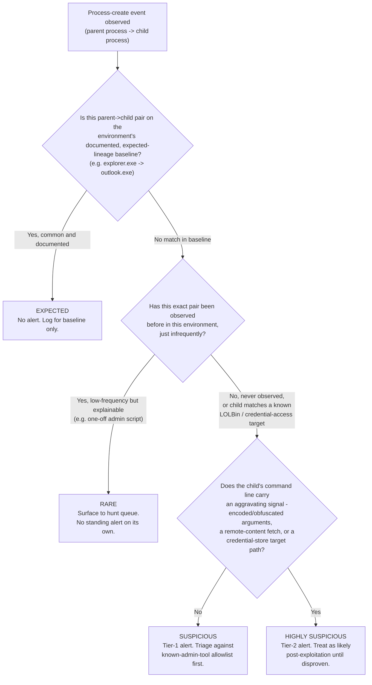
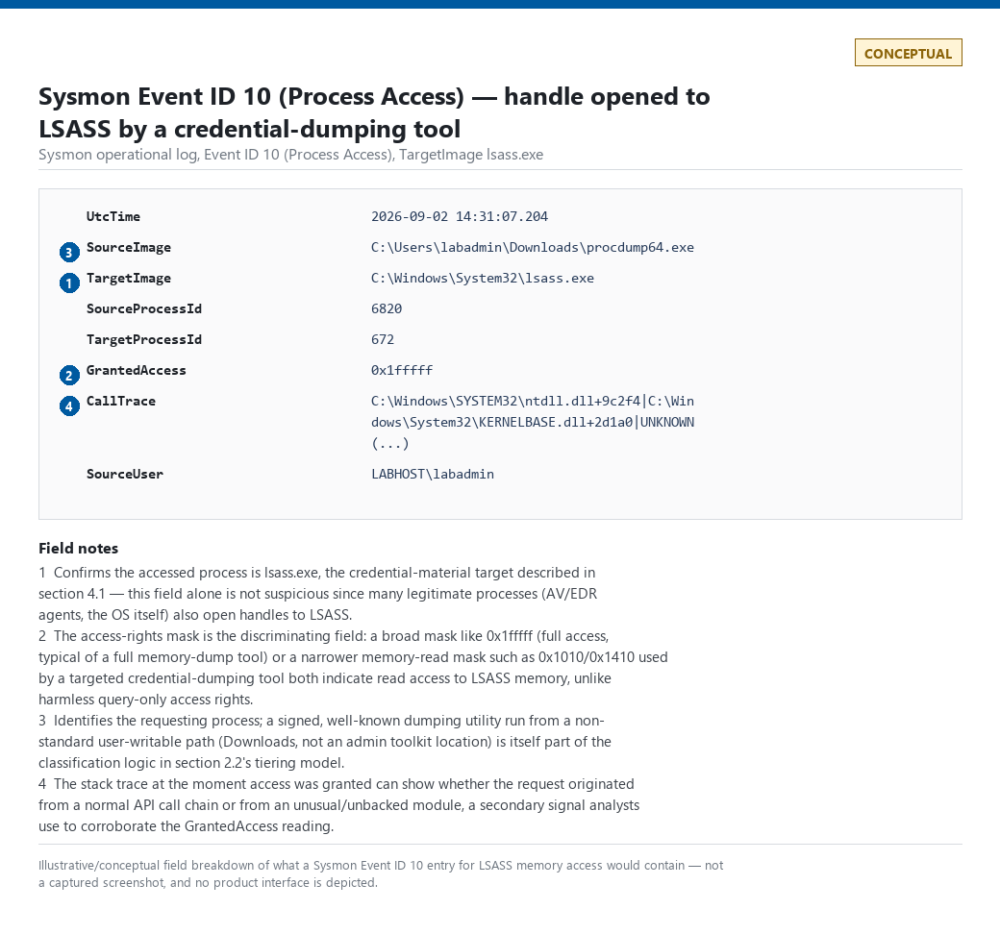
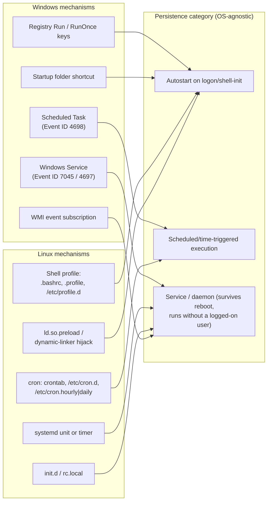
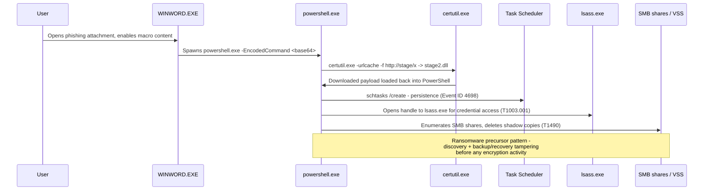
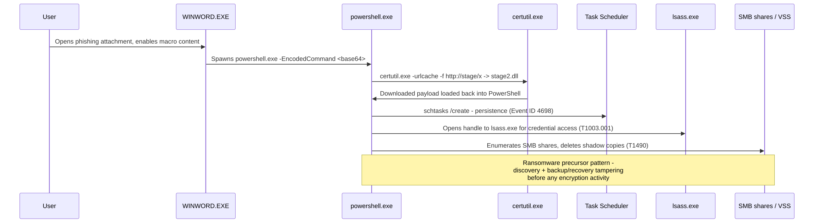

# Part 11 — Endpoint Detection Engineering

## Why this part exists

Parts 8, 9, and 10 taught you what the Windows Security log, Sysmon, and PowerShell logging actually capture — the telemetry layer for one operating system. This part is the analytic layer, and it is deliberately not Windows-only. An attacker who lands on a Linux web server doesn't stop being an attacker because there's no `lsass.exe` to dump — they read `/etc/shadow`, steal an SSH private key, or plant a cron job instead. Every pattern in this part — process lineage, living-off-the-land execution, credential theft, persistence, ransomware precursors, defense evasion — has a Windows expression and a Linux (and, for credential theft, a cloud) expression, and the analytic logic is closer than most Windows-only training materials suggest.

**[CONCEPT]** The organizing idea for the whole part: none of these behaviors are inherently malicious. A parent-child process relationship, a `certutil.exe` invocation, a new cron entry, a handle opened to `lsass.exe` — every one of these also happens constantly for entirely legitimate reasons. The job of endpoint detection engineering is not to find "the malicious API call." There isn't one. The job is to build classification logic — lineage, context, prevalence, argument shape — that separates the nine-hundred-and-ninety-nine legitimate instances from the one that isn't, and to be honest in the rule's own design about which tier of confidence it's actually operating at.

---

## 1. Scope: the analytic layer, across every OS

**[CONCEPT]** This part owns the *behavior* — the analytic logic for what a process tree, a LOLBin invocation, a credential-access attempt, a persistence mechanism, and a ransomware precursor look like, and how to classify them. It explicitly does not re-teach:

- Windows Security log architecture, ETW, or field-by-field Event ID walkthroughs — that's Part 8.
- Sysmon deployment, config-as-code, or Sysmon's own blind spots — that's Part 9.
- PowerShell-specific logging (Event ID 4104 — Creating Scriptblock text, AMSI, encoding/obfuscation, download cradles) — that's Part 10, and PowerShell process-creation *lineage* (who spawned it) is covered here only to the extent it feeds the classification model; the payload-analysis half stays in Part 10.
- Kerberos/AD-protocol credential abuse (Kerberoasting, DCSync, pass-the-ticket) — that's Part 13. This part covers credential theft *from host artifacts* (memory, disk, cloud metadata), not protocol abuse against a domain controller.
- The full ransomware kill-chain model, including encryption-stage response — that's Part 45. This part covers only the pre-encryption behaviors that also serve as general-purpose defense-evasion and discovery signals.
- Hunt methodology itself (hypothesis formation, pivoting mechanics) — that's Parts 34–36. The Hunter's Note boxes here are tactical asides, not a methodology course.

The throughline for this part is **cross-OS symmetry**: for nearly every Windows mechanism discussed, there is a Linux analog, and the underlying analytic question — is this lineage/binary/access-pattern expected, rare, suspicious, or highly suspicious — doesn't change with the OS. What changes is the telemetry source and the specific field names, which is exactly why this is the analytic layer and Parts 3, 8, and 9 are the telemetry layer underneath it.

> **Engineering Reality**
> Most EDR vendors market "unified cross-platform detection" and ship it as two separately-maintained rule sets with different field names, different default sensitivity, and different lag behind the Windows product. Budget for parity testing between your Windows and Linux detection coverage as its own recurring task, not an assumption that shipping a Windows rule "should" imply an equivalent Linux rule already exists.

---

## 2. Process trees and lineage classification

### 2.1 Why lineage, not the process alone

**[CONCEPT]** A process name or hash tells you what ran. It tells you almost nothing about whether it should have run *here*, spawned by *this parent*, with *these arguments*. `powershell.exe` running is unremarkable on a Windows fleet — it runs thousands of times a day from Group Policy, from scheduled tasks, from remote monitoring and management (RMM) agents, from legitimate admin scripts. `powershell.exe` spawned as a child of `WINWORD.EXE` two seconds after a user opened an email attachment is a materially different event, even though the process name, and often even the binary hash, is identical. Lineage — the parent-child (and grandparent) chain — is one of the highest-value, cheapest-to-collect signals in endpoint detection because, in the overwhelming majority of intrusions, attackers don't bother to choose their parent process; the exploitation or social-engineering vector that got them code execution determines it for them by default, and most tooling doesn't override it.

The same logic holds on Linux, with a different cast of parents: a web application process (`w3wp.exe`'s rough Linux equivalent is something like `nginx`, `php-fpm`, `java` running Tomcat, or a Python WSGI worker) spawning a shell is the Linux expression of the same underlying idea — a service process that should never itself need to run `/bin/sh` doing exactly that.

### 2.2 A four-tier classification model

**[DETECTION ENGINEER]** Treat every parent-child pair as falling into one of four tiers, rather than writing a single "is this bad" boolean. Collapsing to a boolean is what produces both the false-positive floods and the missed-detection gaps this part spends the next several sections dissecting.

The table below defines the four tiers this part uses throughout. Build the tiering logic from a baseline of observed parent-child pairs (see Part 31 for the general baselining mechanics) plus a small set of hard-coded "always at least Suspicious" child processes (LOLBins, script interpreters, credential-access targets).

| Tier | Definition | Standing action |
|---|---|---|
| Expected | Pair is common and explainable — on the environment's own baseline, not a generic industry list | No alert; log for baseline maintenance |
| Rare | Pair has occurred before, infrequently, with a plausible benign explanation (a one-off admin script, an unusual but real IT process) | Surface to a hunt/review queue; no standing alert |
| Suspicious | Pair has no baseline history, or the child is a known LOLBin/script interpreter, but no aggravating command-line signal is present | Tier-1 alert |
| Highly Suspicious | Suspicious conditions plus an aggravating signal — encoded/obfuscated arguments, a remote-content fetch, a credential-store target, or a chain into a second LOLBin | Tier-2 alert, treat as likely post-exploitation pending disproof |

**Figure 11.1 (FIG-11-01) — Cross-OS process-lineage classification flow.** *CONCEPTUAL.* Illustrates the decision flow a detection engineer walks through when classifying a new process-create event into one of the four tiers; it is a design sketch of the logic, not a capture of a running system.





> **Blind Spot**
> Lineage is cheap and high-value precisely because most attackers don't bother spoofing it — but a determined one can. On Windows, `CreateProcess` with the `PROC_THREAD_ATTRIBUTE_PARENT_PROCESS` attribute (parent PID spoofing) can hand a new process a chosen parent — including `explorer.exe` or `services.exe` — so the `ParentImage`/`ParentProcessId` fields Sysmon Event ID 10 (Process Access) and Sysmon Event ID 1 (Process Create) report can be attacker-controlled, not just attacker-influenced. On Linux, a double-fork/daemonize sequence or a process re-parented under `init`/`systemd` after its real parent exits produces a similarly misleading lineage. Every detection in this section that classifies purely on the reported parent-child pair inherits this blind spot. Whether a given EDR/Sysmon build's parent-tracking field resists this specific spoofing technique varies by product and version — verify against your own tooling rather than assuming either way — and correlating against a second, harder-to-spoof signal (command-line shape, timing relative to the actual causal event, or an image-load anomaly) narrows the gap even where the parent field itself can't be trusted.

> **Detection Autopsy — "unsigned process = malware"**
>
> **The rule:** Fires on any process whose binary lacks a valid Authenticode (Windows) or equivalent code-signing (macOS Gatekeeper-style) signature.
>
> **Why it shipped:** Real malware is frequently unsigned, and "check the signature" is a one-line condition that's cheap to explain to a review board: "if it's not signed, we don't trust it."
>
> **How it failed:** Enormous volumes of legitimate software are unsigned — in-house line-of-business tools, many open-source utilities, most PowerShell scripts (script files aren't binary-signed the way EXEs are), one-off IT department scripts, and a large fraction of the long tail of installers on any real fleet. On a several-thousand-endpoint estate this produces dozens to hundreds of daily alerts, the overwhelming majority benign, and it trains analysts to reflexively close "unsigned" alerts without reading them — the exact Alert Fatigue mechanism (TERMINOLOGY.md §4).
>
> **The fix:** Signature status becomes one input into the lineage-tier model above, not a standalone verdict. An unsigned binary spawned by a Suspicious or Highly Suspicious parent-child pair raises that pair's tier; an unsigned binary with an Expected lineage (a known internal tool launched the way it always is) stays Expected. This is paid off in full, alongside the book's other seeded naive rules, in Part 40.

### 2.3 Worked lineage patterns

**[ANALYST]** The five patterns below recur across nearly every Windows intrusion this book discusses elsewhere, and each has meaningfully different base rates and failure modes. Learn the pattern, not just the process names — the same logic transfers to whatever specific binaries your environment actually runs.

**`WINWORD.EXE` → `powershell.exe`** (or `cmd.exe`, `mshta.exe`, `wscript.exe`). Office applications spawning a shell or script interpreter is the single highest-value Highly Suspicious signal in the phishing kill chain, because Word, Excel, and PowerPoint have no legitimate reason to launch a general-purpose interpreter as a direct child in ordinary document use — the only common exception is a macro-driven internal tool, which should itself be a documented, baselined exception, not an assumption. This is the point where a document macro (Excel 4.0/XLM macros, VBA `Shell()` calls, or `AutoOpen` payloads) hands off execution.

**`explorer.exe` → `cmd.exe`.** This one sits closer to Rare than the others by default, because a user double-clicking a shortcut, or opening a command prompt from the Start menu, produces exactly this lineage — it's routine, high-volume, and mostly benign. The signal that moves it toward Suspicious isn't the pair itself; it's what happens immediately after — a `cmd.exe` that then spawns an encoded PowerShell invocation, or that immediately pulls a file from the network, is a different story than one that runs `dir` and exits.

> **False Positive Trap**
> Remote-management and helpdesk tools (ConnectWise Control, TeamViewer's command-execution feature, and many other RMM agents) legitimately spawn `cmd.exe` or `powershell.exe` as children of their own agent process, which itself is often a child of `explorer.exe` in an interactive support session. If your RMM tooling isn't in the lineage baseline as a named, documented exception, every helpdesk session becomes an alert. Maintain the exception against the RMM agent's own process name and code-signing identity, not against `explorer.exe -> cmd.exe` generically — loosening the general pattern to accommodate RMM tooling reopens the exact gap an attacker abusing a compromised RMM agent would walk through.

**`services.exe` → unexpected binary.** `services.exe` is the Windows Service Control Manager; its children should be service host processes (`svchost.exe`) and a known, largely static set of registered service binaries. A `services.exe` child that isn't on that list — especially one running from a user-writable path like `%TEMP%` or `%APPDATA%` — is a strong signal of a maliciously installed service (see §5.2) and should default to at least Suspicious even with no other context, because the population of legitimate exceptions here is small and mostly static compared to the other four patterns.

**`w3wp.exe` → `cmd.exe`** (or, on the Linux/Java side, an application server worker process spawning a shell). `w3wp.exe` is the IIS worker process; it should be handling HTTP requests and calling into the application's own code, not spawning a system shell. This lineage is the classic signature of a web shell — an attacker who has uploaded a script to a vulnerable web application uses it to execute OS commands, and the resulting process tree shows the web server's own worker process as the parent. On Linux, the equivalent pattern is `nginx`/`apache2`/`php-fpm`/`java` (running a servlet container) spawning `/bin/sh` or `/bin/bash` — same underlying logic, different process names, and this is one of the cleanest examples of true cross-OS lineage symmetry in this part.

**Browser → script interpreter.** A browser process (`chrome.exe`, `msedge.exe`, `firefox.exe`) spawning `wscript.exe`, `mshta.exe`, `powershell.exe`, or a similar interpreter as a direct child is the process-tree signature of a successful browser-based download-and-execute chain — a user downloaded and ran something the browser itself launched, or a malicious HTA/script was opened directly from a download prompt. This one carries a routine confound: a user legitimately double-clicking a downloaded `.ps1`, `.hta`, or Office file from their Downloads folder can produce a lineage that looks identical at the process-tree level to a drive-by chain. Command-line arguments and the specific interpreter (raw `mshta.exe` execution of a remote HTA is far more suspicious than a user-invoked local script) are what separate the two.

> **Detection Test**
> **Setup:** Domain-joined Windows test host with Sysmon installed (Sysmon Event ID 1, Process Create), Office installed with macros enabled for testing (a lab-only setting — never disable macro-security controls on a production host to run this test).
> **Action:** Open a test `.docm` containing a macro with `Shell "powershell.exe -WindowStyle Hidden -Command Write-Host test"`.
> **Expected result:** A Sysmon Event ID 1 (Process Create) entry with `ParentImage` = `...\WINWORD.EXE`, `Image` = `...\powershell.exe`, and `ParentProcessId` matching the Word process — this is DET-11-01, the WINWORD-to-PowerShell lineage detection, and it should classify as Highly Suspicious under the model in §2.2 even before the command-line content is evaluated. This test is also the regression check for silent failure: if Sysmon tampering (§7), a config change that drops `WINWORD.EXE`/`powershell.exe` from the scoped image list, or an EDR-agent upgrade stops populating `ParentImage`, the expected event above simply never appears — with no error raised anywhere — so re-running this exact test on a schedule against a canary host, and alerting on its absence, is the only way to notice before an actual phishing chain runs through the gap.

**MITRE:** T1204.002 (User Execution: Malicious File), T1566.001 (Phishing: Spearphishing Attachment), T1059.001 (Command and Scripting Interpreter: PowerShell).

---

## 3. Living-off-the-land binaries: LOLBAS and GTFOBins

### 3.1 What counts as a LOLBin

**[CONCEPT]** A living-off-the-land binary is a legitimate, vendor-signed (or, on Linux, distro-packaged) executable that ships as part of the operating system or a commonly installed application, and that an attacker can repurpose to download, execute, encode/decode, or otherwise advance an intrusion without ever introducing a custom malicious binary to the host. The two community-maintained catalogs this book refers to throughout are LOLBAS (Living Off The Land Binaries, Scripts and Libraries) for Windows and GTFOBins for Linux/Unix — both document, per binary, the specific abuse primitive (download, execute, bypass, credential theft, and so on) it supports.

The reason LOLBins matter so much to detection engineering specifically: signature- and hash-based detection is structurally blind to them, because the binary itself is exactly what the vendor shipped, correctly signed, present on every clean install. The only thing that distinguishes malicious use from benign use is context — the arguments, the parent process, the network destination, and the lineage classification from §2.

### 3.2 Windows LOLBAS patterns

**[DETECTION ENGINEER]** The table below is a representative slice, not an exhaustive list — LOLBAS currently documents well over a hundred binaries, and the list changes as researchers find new abuse primitives in existing Windows components. Build detection logic around the *abuse primitive category*, not a fixed binary list, so a new addition to LOLBAS extends your existing rule categories instead of requiring a new rule from scratch.

| Binary | Legitimate use | Abuse primitive | Detection signal |
|---|---|---|---|
| `certutil.exe` | Certificate/PKI management | Download (`-urlcache`), base64 encode/decode | Command line containing `-urlcache` or `-decode` with a non-certificate file target |
| `mshta.exe` | Runs `.hta` (HTML Application) files | Execute remote script content | Command line referencing an `http(s)://` URL, or any invocation with no local `.hta` file argument |
| `regsvr32.exe` | Registers COM DLLs | Remote script execution via `scrobj.dll` ("Squiblydoo") | `/i:http` pattern in the command line, or `/s /n /u` combined with a scriptlet reference |
| `rundll32.exe` | Runs a function exported from a DLL | Proxy execution of arbitrary code, including from a remote path | DLL path outside `System32`/`SysWOW64`, or a UNC/HTTP path as the DLL argument |
| `bitsadmin.exe` | Background Intelligent Transfer Service management | Download files, evading some proxy-aware AV | `/transfer` with a remote source and a write path to a user-writable directory |
| `msbuild.exe` | Compiles .NET projects | Executes inline C#/task code embedded in a project file, bypassing application allowlisting | `msbuild.exe` invoked outside a build pipeline context, especially from a user profile path |

Only three of the six binaries above are System Binary Proxy Execution in the strict ATT&CK sense. `certutil.exe` and `bitsadmin.exe` don't have their own T1218 sub-technique — ATT&CK maps certutil's download primitive to Ingress Tool Transfer and its decode primitive to Deobfuscate/Decode Files or Information, and bitsadmin's download primitive to BITS Jobs. `msbuild.exe` maps to Trusted Developer Utilities Proxy Execution, a sibling technique to T1218 rather than a member of it. Tagging all six binaries under T1218 would be the kind of tenuous, invented mapping this book avoids — check the specific abuse primitive against ATT&CK's own technique, not the general "LOLBin" label.

**MITRE:** T1218 (System Binary Proxy Execution), T1218.005 (Mshta), T1218.010 (Regsvr32), T1218.011 (Rundll32), T1105 (Ingress Tool Transfer), T1140 (Deobfuscate/Decode Files or Information), T1197 (BITS Jobs), T1127.001 (Trusted Developer Utilities Proxy Execution: MSBuild).

> **Blind Spot**
> Every detection signal in the table above keys on a literal binary name (`certutil.exe`, `mshta.exe`, and so on) or a path pattern. Renaming the binary — copying `certutil.exe` to `update.exe` and running that instead, a trivial one-line step for an attacker with local write access — defeats a rule that matches on `Image` or a process-name field alone. Sysmon and most EDR agents also record the executable's `OriginalFileName` from its PE version-info header (still `CertUtil.exe` after the rename, since renaming the file doesn't rewrite its embedded metadata), so pair the name-based signal with an `OriginalFileName` check where your telemetry source populates it, and treat a mismatch between the on-disk name and `OriginalFileName` as a suspicious signal in its own right. This has no equivalent mitigation on Linux: `argv[0]`/`comm` is attacker-controlled with no separate embedded-metadata field to fall back on, so a renamed `curl` binary invoked from a GTFOBins-style chain is materially harder to catch by name than its Windows counterpart.

### 3.3 Linux GTFOBins patterns

**[DETECTION ENGINEER]** GTFOBins catalogs the same idea for Unix-like systems, usually framed around privilege escalation (a binary that, if runnable via `sudo` or carrying a SUID bit, can spawn a privileged shell) and shell-breakout/file-read/file-write primitives rather than remote download specifically, though several entries (`curl`, `wget`) cover download-and-execute chains directly.

| Binary | Legitimate use | Abuse primitive | Detection signal |
|---|---|---|---|
| `find` | File search | `find . -exec /bin/sh \; ` spawns a shell, inherits caller's (often elevated) privileges if run via sudo | `find` as a parent of a shell process, especially following a `sudo` invocation |
| `awk` | Text processing | `awk 'BEGIN {system("/bin/sh")}'` spawns a shell | `awk`/similar interpreter as the direct parent of `/bin/sh` or `/bin/bash` |
| `vim`/`less`/`man` | Editing/paging | Shell-escape sequences (`:!sh` in vim, `!sh` in less/man pagers) spawn a shell | Any pager/editor process as the direct parent of a shell, particularly under a `sudo` context |
| `tar` | Archive extraction | `tar --checkpoint-action=exec=/bin/sh` executes arbitrary commands during extraction | `tar` invoked with `--checkpoint` flags, or as the parent of an unexpected shell/binary |
| `curl`/`wget` | HTTP transfer | Download-and-pipe-to-shell (`curl ... \| sh`) | Network process directly piped into a shell interpreter in the same command line |
| `systemctl` | Service management | If runnable via sudo without a full path restriction, can invoke an editor (`systemctl edit`) that itself breaks out to a shell | `systemctl` spawning an editor process as an unexpected child under an elevated context |

> **Hunter's Note**
> Don't hunt for the binary name alone — GTFOBins' whole point is that dozens of completely mundane Linux utilities can be coerced into a shell. Hunt for the *shape*: a shell process (`/bin/sh`, `/bin/bash`, `/bin/dash`) whose parent is anything other than another shell, a terminal emulator, `sshd`, or a small set of known service-manager processes. That one query catches the entire GTFOBins category — `find`, `awk`, `vim`, `tar`, `systemctl`, and whatever new entry gets added to the list next month — without you needing to keep the rule current against a list you don't control.

> **Blind Spot**
> The shape above still matches on the *child* being a recognizable shell binary (`/bin/sh`, `/bin/bash`, `/bin/dash`). Two trivial moves defeat that: statically compiling or simply copying the shell to a differently-named path (`cp /bin/dash /tmp/.update; /tmp/.update`) produces a child process whose name never appears in the shell-name list at all, and skipping the fork entirely — having the LOLBin call `execve()` to replace its own image in place rather than spawning a genuine child — leaves no new parent-child pair for either HUNT-11-01 or DET-11-02 to observe, since `find`'s documented `-exec` primitive forks by design but a scripted equivalent calling `execve` directly does not have to. Neither the hunt nor DET-11-02 catches this by construction. Narrowing the gap means moving one layer down the stack — inspecting the actual `execve` argv/interpreter behavior at syscall level rather than trusting a process-name field — or broadening the hunt to flag *any* newly observed executable image spawned by a non-shell, non-terminal, non-service-manager parent, not just images matching a fixed shell-name list.

> **False Positive Trap**
> Configuration-management tooling (Ansible, Puppet, Chef, Salt) and CI/CD runners routinely invoke `curl`/`wget` piped into a shell as a completely legitimate installation pattern (`curl -sSL https://get.docker.com | sh` is a real, common, vendor-recommended install command). Scope the download-pipe-to-shell detection to exclude your known automation service accounts and CI runner hosts by identity, not by blanket-excluding the pattern — otherwise this detection is unusable in any environment that does infrastructure automation at all, which is most of them.
>
> The same trap recurs at larger scale in the Hunter's Note shell-parent shape above (and in HUNT-11-01). Any application runtime that shells out via `system()`, `popen()`, or `subprocess` with `shell=True` will dominate the result set on a fleet running any of that, none of it GTFOBins abuse. So will monitoring/health-check agents (Nagios NRPE, Zabbix agent, Prometheus textfile-collector scripts) that fork a shell on every check interval, often every one to five minutes. Scope by the calling application's own identity, not by loosening the shell-parent pattern itself.

> **Detection Test**
> **Setup:** Linux test host with auditd configured to log `execve` syscalls (`-a always,exit -F arch=b64 -S execve`), no special privileges required for the test account beyond ordinary shell access.
> **Action:** `find . -maxdepth 0 -exec /bin/sh -p \; -quit`
> **Expected result:** An auditd `EXECVE` record for `/bin/sh` with a parent process (`ppid`) resolving to the `find` process — this is DET-11-02, the LOLBin-to-shell lineage detection, and it fires regardless of which specific GTFOBins entry produced the shell. Because this depends on auditd still logging `execve` at all, re-running this test on a schedule and confirming the record still appears is how you'd catch an `auditctl -e 0` flush or a dropped rule (§7) before assuming the absence of alerts means the absence of GTFOBins activity.

**MITRE:** T1059.004 (Command and Scripting Interpreter: Unix Shell), T1548.001 (Abuse Elevation Control Mechanism: Setuid and Setgid).

---

## 4. Credential access beyond Windows

### 4.1 LSASS memory access

**[CONCEPT]** `lsass.exe` (Local Security Authority Subsystem Service) holds cached credential material — password hashes, Kerberos tickets, and (depending on configuration) plaintext credentials — in process memory on every Windows host, which is exactly why it's the single most consistently targeted credential-theft surface across commodity and advanced tooling alike. A process that opens a handle to `lsass.exe` with memory-read access rights, and isn't one of a small, stable set of legitimate callers (the OS itself, antivirus/EDR agents, a small number of enterprise password-vault agents), is attempting credential theft.

**[DETECTION ENGINEER]** Sysmon Event ID 10 (Process Access) is the standard telemetry source: it logs `SourceImage` (the process requesting access), `TargetImage` (`lsass.exe`), and `GrantedAccess` (the access-rights mask). Detection logic should filter on `GrantedAccess` values that include memory-read rights (commonly `0x1010` or `0x1410` in real-world tooling, though the exact mask an attacker requests varies by tool and by which specific API — `OpenProcess` then `ReadProcessMemory`, versus a full memory dump via `MiniDumpWriteDump` — they use) rather than alerting on every handle-open to `lsass.exe`, since a wide range of harmless access rights (querying process information, for instance) also produce this event.

> **Blind Spot**
> Sysmon Event ID 10 (Process Access) tells you a process opened a handle to `lsass.exe` with certain rights; it does not tell you the process actually read or exfiltrated anything from that memory. An attacker who requests broader access rights than they end up using, or a security tool doing legitimate introspection, produces the same event as a successful credential dump. Pair this with the actual dump behavior where possible (a subsequent Sysmon Event ID 11, FileCreate, for a `.dmp` file, or a network connection immediately following the access) rather than trusting the access event alone as proof of theft. A more complete evasion skips the event entirely: an attacker can duplicate an existing handle to `lsass.exe` that another process already holds (via `NtDuplicateObject`/`DuplicateHandle`) instead of calling `OpenProcess` directly, so no `SourceImage`-to-`lsass.exe` access event ever names the attacker's process. `WerFault.exe` is both the legitimate caller you'd allowlist after a real LSASS crash and the specific process this handle-theft technique targets — allowlist it against an actual preceding crash event, not blanket by name, or the allowlist reopens the gap it's meant to close.



**Figure 11.5 — Sysmon Event ID 10 (Process Access) entry for a handle opened to LSASS by a credential-dumping tool.** *CONCEPTUAL — illustrative field breakdown; not a captured screenshot.* Shows the `TargetImage: C:\Windows\System32\lsass.exe` field and a memory-read `GrantedAccess` value as they would appear from a lab-run credential-dumping tool; this part's author has lab access to Linux/home-network infrastructure but no isolated Windows AD lab to safely run a credential-dumping tool against, so this is a conceptual field breakdown rather than an actual capture. It illustrates the DET-11-04 rule description in §4.1 with a representative set of field values rather than a real fired-alert example.

> **Detection Test**
> **Setup:** Windows test host (isolated VM, not a host with real secrets) with Sysmon installed and configured to log Event ID 10 for `lsass.exe` as the `TargetImage`, local administrator rights on the test account.
> **Action:** Run Sysinternals ProcDump against LSASS: `procdump64.exe -accepteula -ma lsass.exe lsass_test.dmp`. This is a legitimate, signed Microsoft tool — no attacker tooling is required to trigger the detection — but it produces a real, unredacted memory dump containing credential material; delete the output file immediately and never run this outside an isolated lab.
> **Expected result:** A Sysmon Event ID 10 (Process Access) entry with `SourceImage` = `...\procdump64.exe`, `TargetImage` = `...\lsass.exe`, and a broad `GrantedAccess` mask (ProcDump requests full access for a complete memory dump, typically `0x1fffff`) — this is DET-11-04. Note this mask is wider than the narrower `0x1010`/`0x1410` memory-read-only masks cited above for a targeted credential-dumping tool; a rule that only alerts on the narrow masks would miss this test run, which is itself a useful negative-testing data point when tuning the `GrantedAccess` filter. `lsass.exe` is also a common target for volume-driven tuning mistakes — an analyst trying to cut noise from other, chattier Process Access targets can accidentally scope Event ID 10 collection away from `lsass.exe` entirely, silently killing this detection with no error anywhere in the pipeline. Re-running this exact ProcDump test on a schedule against an isolated canary host, and alerting if the expected event doesn't appear, is how you'd catch that regression instead of discovering it during a real intrusion.

**MITRE:** T1003.001 (OS Credential Dumping: LSASS Memory).

### 4.2 SAM and registry-hive credential theft

**[DETECTION ENGINEER]** The Security Account Manager (SAM) database stores local account password hashes; an attacker with sufficient privilege can extract it directly from the registry hive (`HKLM\SAM`, alongside `HKLM\SYSTEM` for the machine key needed to decrypt it) rather than touching `lsass.exe` memory at all — a path that evades any detection scoped only to process-access events. The most common mechanical signature is a process using the Volume Shadow Copy service or the registry `save` API to copy the SAM and SYSTEM hives to a file (classically via `reg.exe save hklm\sam` and `reg.exe save hklm\system`), which produces a process-creation event for `reg.exe` with `save` and a hive name in the command line — a comparatively rare, specific, and high-confidence pattern with very few legitimate callers outside backup software.

**MITRE:** T1003.002 (OS Credential Dumping: Security Account Manager).

### 4.3 DPAPI-protected secrets

**[CONCEPT]** The Windows Data Protection API (DPAPI) is the encryption mechanism underneath several Windows credential stores — saved browser passwords, Wi-Fi keys, some VPN client credentials, and Windows Credential Manager entries — rather than a credential store in its own right. An attacker who can access a user's DPAPI master key (protected by the user's own login credential, and recoverable in several documented ways once an attacker has SYSTEM or domain-level compromise) can decrypt any DPAPI-protected secret belonging to that user, which makes DPAPI theft a force-multiplier: one successful key recovery can unlock several unrelated credential stores at once.

This book treats DPAPI-abuse detection at the general level here rather than pinning specific sub-technique tags with high confidence: it spans several distinct ATT&CK sub-techniques (browser credential stores, Credential Manager, Wi-Fi profile secrets), and mapping any single generic "DPAPI decryption" event to one exact sub-technique ID would overstate precision this book doesn't have. Treat DPAPI master-key access and mass credential-store decryption as a Highly Suspicious signal under the §2.2 model when it comes from a process with no legitimate reason to touch multiple users' protected-data stores, and map to the specific credential-store sub-technique (browser, Credential Manager, and so on) that matches the actual target rather than a generic DPAPI tag.

### 4.4 Linux: `/etc/shadow` and SSH private key theft

**[DETECTION ENGINEER]** `/etc/shadow` holds password hashes for local accounts and is readable only by root by default — any read access to it by a non-root, non-authentication-service process is a strong signal, and file-integrity/access monitoring (auditd watch rules: `-w /etc/shadow -p r -k shadow_access`) is the standard telemetry path. The equivalent of "opening a handle to `lsass.exe`" on Linux is closer to "any process other than `passwd`, `login`, `sshd`, `sudo`, and PAM modules themselves reading `/etc/shadow`" — a narrow, well-defined allowlist compared to the much larger legitimate-caller population around Windows credential stores.

SSH private keys deserve separate treatment because they're a *portable* credential — a stolen key from `~/.ssh/id_rsa` (or `id_ed25519`) works from any machine, immediately, with no further exploitation required, and often grants access to other hosts the compromised account can reach. Detection signal is less about the read itself (a user's own shell reading their own key on login is entirely normal) and more about bulk enumeration — a process reading multiple users' `~/.ssh/` directories in a short window, or reading key files belonging to an account other than the one the process is running as.

> **Hunter's Note**
> `find / -name "id_rsa*" -o -name "*.pem" 2>/dev/null` is close to a universal first move for an attacker who's landed on a Linux host and wants to pivot — it's fast, needs no special tooling, and the search pattern itself (a `find` process enumerating home directories for key-shaped filenames across multiple user profiles, not just its own) is a distinctive, high-signal pivot even without any file actually being read yet. Hunt for the enumeration pattern; don't wait for confirmed exfiltration.

**MITRE:** T1003.008 (OS Credential Dumping: /etc/passwd and /etc/shadow), T1552.004 (Unsecured Credentials: Private Keys).

### 4.5 Cloud instance-metadata credential theft

**[CONCEPT]** Every major cloud provider exposes an Instance Metadata Service (IMDS) reachable only from inside the running instance, at a fixed, well-known, non-routable address (`169.254.169.254` across AWS, Azure, and GCP) — and, critically, that endpoint hands out temporary credentials for whatever IAM role/managed identity is attached to the instance, with no authentication required beyond being able to reach the address at all. An attacker with any code-execution foothold on the instance — including, notably, through a server-side request forgery (SSRF) vulnerability in a web application running on that instance, which doesn't require full host compromise — can request those credentials directly and walk away with valid, time-limited cloud API access scoped to whatever the instance's role permits.

**[DETECTION ENGINEER]** The detection surface splits into two distinct telemetry sources that need to be correlated, not treated as substitutes for each other: host-level telemetry (an outbound HTTP request from an application process to `169.254.169.254` that the application has no documented reason to make — this host-level sweep is HUNT-11-02) and cloud-side telemetry (the resulting API calls made using the stolen credential, visible in CloudTrail/Azure Activity Log/GCP Cloud Audit Logs as originating from the instance's role but performing actions outside that workload's normal behavior). AWS's IMDSv2, which requires a session token obtained via a PUT request before GET requests to the metadata service succeed, meaningfully raises the bar against blind SSRF (a vulnerability that can only issue GET-shaped requests can no longer retrieve credentials at all) but does not eliminate the attack for an attacker who can issue arbitrary HTTP methods.

> **Engineering Reality**
> IMDSv2 enforcement is a per-instance configuration setting, not a platform-wide default that flips retroactively — instances launched before your organization adopted the IMDSv2-required setting, or launched by a template/AMI that predates the policy, silently remain vulnerable to the IMDSv1-style blind-SSRF credential theft path until someone re-launches or explicitly reconfigures them. A detection coverage claim of "we require IMDSv2" needs to be measured against actual running instances, not against the default for newly launched ones.

> **Detection Test**
> **Setup:** A cloud VM instance (AWS EC2 is the most common target for this exact pattern) with an attached IAM role, CloudTrail enabled, and host-level network logging capable of seeing outbound connections to link-local addresses.
> **Action (illustrative — run only against infrastructure you own, scoped for this test):** `curl http://169.254.169.254/latest/meta-data/iam/security-credentials/<role-name>`
> **Expected result:** A host-level network log entry showing an outbound connection from the requesting process to `169.254.169.254:80`, and, on the cloud side, no CloudTrail entry for the metadata request itself (IMDS calls aren't API calls and don't appear in CloudTrail) but a subsequent CloudTrail entry using the retrieved temporary credential's access-key ID, which is the pivot point for correlating "who actually used the stolen token." This hunt's host-side leg depends entirely on whatever agent captures outbound connections at the endpoint continuing to see and forward link-local traffic — a common host-network-monitoring blind spot is excluding link-local/RFC 3927 destinations as "internal, not worth logging," which would make HUNT-11-02 go quiet with nothing to indicate it happened. Re-running the curl test above periodically against a canary instance and confirming the connection is still visible in host-side logs is the check; the absence of hits across a fleet is not, on its own, evidence the fleet is clean.

**MITRE:** T1552.005 (Unsecured Credentials: Cloud Instance Metadata API).

---

## 5. Persistence: Windows and Linux side by side

### 5.1 The cross-OS persistence map

**[CONCEPT]** Every persistence mechanism, regardless of OS, exists to answer one of three questions for the attacker: "how do I run again when a user logs on," "how do I run again on a schedule, independent of any user," and "how do I run as a service/daemon that survives reboot without needing an interactive session at all." Windows and Linux each have a small, well-known set of mechanisms per category, and — this is the point worth internalizing — an environment that monitors only the Windows side of this map has full visibility into roughly half the attacker's actual persistence options the moment any Linux host is in scope.

**Figure 11.2 (FIG-11-02) — Cross-OS persistence mechanism map.** *CONCEPTUAL.* Groups the Windows and Linux persistence mechanisms discussed in this section by the underlying category (autostart, scheduled, service/daemon) they satisfy, to illustrate that the categories — not the specific mechanism names — are what a detection strategy should be organized around.





### 5.2 Windows: services, scheduled tasks, and Registry Run keys

**[DETECTION ENGINEER]** Event ID 7045 (A service was installed in the system) fires in the System log for every new service installation — a small, low-volume, high-signal event on most fleets, since new legitimate service installs are relatively rare compared to routine process activity. The corresponding Security-log equivalent, Event ID 4697 (A service was installed in the system), requires the "Audit Security System Extension" subcategory to be enabled and carries additional identity context (which account performed the install). A service binary path pointing to a user-writable location (`%TEMP%`, `%APPDATA%`, a user profile directory) rather than `Program Files` or `System32` is close to an automatic Suspicious classification regardless of any other context, echoing the `services.exe` lineage pattern from §2.3.

Event ID 4698 (A scheduled task was created) is the Task Scheduler equivalent — again a comparatively rare, high-signal event, and one where the `Command` field (the actual executable/script the task will run) deserves the same LOLBin scrutiny as any other process-creation lineage. Registry Run/RunOnce keys (`HKLM\...\Run`, `HKCU\...\Run`, and their `RunOnce` counterparts) are the oldest and still commonly abused autostart mechanism; Sysmon Event ID 13 (Registry value set) targeting these specific key paths is the standard telemetry source, and — because legitimate software installers write to these keys constantly — this is one of the noisier persistence-detection surfaces in this section, needing a baseline of known-legitimate registry writers more than most.

**MITRE:** T1543.003 (Create or Modify System Process: Windows Service), T1053.005 (Scheduled Task/Job: Scheduled Task), T1547.001 (Boot or Logon Autostart Execution: Registry Run Keys / Startup Folder).

### 5.3 Linux: cron, systemd, and init

**[DETECTION ENGINEER]** Cron persistence takes several forms — a user's own `crontab -e` entry, a system-wide entry dropped into `/etc/cron.d/`, or a script placed in `/etc/cron.hourly`, `/etc/cron.daily`, and similar directories that `run-parts` executes on schedule — and file-integrity monitoring on these specific paths, plus auditd watch rules, is the standard telemetry approach, since cron itself doesn't produce a rich structured log of "a new job was added" the way Windows Event ID 4698 does; most environments are reconstructing "a cron entry changed" from syslog `CRON` execution lines after the fact, or from direct file-integrity monitoring of the crontab files themselves, rather than from a single authoritative "job created" event.

systemd persistence is the more modern Linux equivalent of a Windows service: a unit file dropped into `/etc/systemd/system/` (or a user-scope equivalent) with an `[Install]` section enabling it (`WantedBy=multi-user.target` and an active `systemctl enable`) survives reboot exactly like a Windows service does, and `journalctl` records the resulting state transitions — `Starting`, `Started`, `Stopping`, `Deactivated successfully`, `Stopped` — for every unit, legitimate and malicious alike.

**Figure 11.3 (FIG-11-03) — Baseline of legitimate systemd service-restart cycles on a real host.** *REAL LAB EXAMPLE.* Captured via `journalctl -u vulnscan-web --no-pager` on CT104 in the author's home lab (Proxmox host, Debian-based container), spanning 2026-09-09 through 2026-09-10, showing the canonical `Stopping → Deactivated successfully → Stopped → Starting → Started` sequence for `vulnscan-web.service` across several legitimate development-driven restarts, plus the corresponding `uvicorn` worker process log lines. This is what an *expected* new-unit or restart pattern looks like in `journalctl` output — the shape a detection rule for an *unexpected* new unit needs to be measured against, since the state-transition sequence itself is identical for a malicious unit; what differs is the unit name, the executable path it points to, and whether that unit name has any history at all.

```text
Sep 09 19:26:06 vulnscan systemd[1]: vulnscan-web.service: Deactivated successfully.
Sep 09 19:26:06 vulnscan systemd[1]: Stopped vulnscan-web.service - Vulnerability Scanner Dashboard (web).
Sep 09 19:26:07 vulnscan systemd[1]: Starting vulnscan-web.service - Vulnerability Scanner Dashboard (web)...
Sep 09 19:26:07 vulnscan systemd[1]: Started vulnscan-web.service - Vulnerability Scanner Dashboard (web).
Sep 09 19:26:07 vulnscan uvicorn[1290]: INFO:     Started server process [1290]
```

*(Full capture: `lab/evidence/ct104-vulnscan-web-systemd-state-changes.txt`.)*

> **Detection Autopsy — "new systemd unit = persistence, alert on every one"**
>
> **The rule:** Fires on every `systemd[1]: Starting <unit>` journal line for a unit name not seen before on that host.
>
> **Why it shipped:** A genuinely new, never-before-seen systemd unit *is* a legitimate, well-documented persistence technique — T1543.002 (Create or Modify System Process: Systemd Service) — and "alert on first occurrence of a new unit name" reads as a clean, defensible detection design.
>
> **How it failed:** Ordinary software deployment on any actively maintained host creates new units constantly — a new application version ships with a renamed or versioned unit file, a config-management run adds a monitoring agent, a container runtime spins up transient scope/slice units by design. On CT104 in this book's own lab, `vulnscan-web.service` itself would have triggered this rule on first deployment despite being the platform's own legitimate dashboard service — see the capture above.
>
> **The fix:** Gate on the unit's `ExecStart` target rather than the unit name alone — a new unit pointing to a binary in `/tmp`, a user home directory, or a path with no corresponding package-manager record is a materially different event than a new unit pointing into `/opt/<known-application>/` or a path a configuration-management tool just deployed to. Correlate against your deployment pipeline's own change log where one exists, so a CI/CD-driven unit rollout doesn't need a standing exception written by hand. This corrected rule is DET-11-03.

> **Blind Spot**
> The fix above still gates on the ExecStart *path*, not on what that path does when the target is a shell or interpreter. `ExecStart=/bin/bash -c "curl ... | sh"` — or any unit whose ExecStart is `/bin/sh`, `/usr/bin/python3`, or another interpreter already present on every host — points at a completely unremarkable, package-managed binary, the exact case the fixed rule was designed to pass through, while the actual payload rides in the command-line arguments the fix never inspects. Extend the check to parse the full ExecStart command line, not just the leading binary path, whenever that path resolves to a shell or script interpreter.

> **Detection Test**
> **Setup:** Linux test host (systemd-based distro), root access to write unit files, journald logging enabled, and DET-11-03's ExecStart-gating logic wired up rather than the naive by-name rule from the Detection Autopsy above.
> **Action:** Create and start two throwaway units: `legit-test.service` with `ExecStart=/opt/known-app/run.sh` (a path your fleet's config-management tool would plausibly own), and `evil-test.service` with `ExecStart=/tmp/implant` (a world-writable path with no package-manager record).
> **Expected result:** Both produce an identical `systemd[1]: Starting/Started <unit>` journal sequence — confirming the naive rule would have flagged (or missed) them identically — but DET-11-03 should classify only `evil-test.service` as Suspicious/Highly Suspicious, since the gate is the `ExecStart` path's provenance, not the unit name. If your implementation flags both or neither, the path gate isn't wired up correctly. Remove both test units afterward.
>
> This test also doubles as the regression check for silent failure: DET-11-03 depends on whatever telemetry source (journald parsing, auditd, or an EDR's own unit-install event) actually captures the `ExecStart=` line, not just the unit name. An agent upgrade or logging-config change that stops carrying that field silently collapses the rule back to name-only matching — with no error raised — so periodically re-running the two-unit test above against a canary host, and confirming the *path*, not just the unit name, shows up in the classification, is the only way to catch that regression before an attacker does.

`/etc/rc.local` and legacy `init.d` scripts are less common on modern systemd-based distributions but persist as a compatibility mechanism on many still-supported systems, and the equivalent of Registry Run keys — shell profile files (`~/.bashrc`, `~/.profile`, `/etc/profile.d/*.sh`) executed on every new shell or login — round out the autostart category. `ld.so.preload` (and the `LD_PRELOAD` environment variable more generally) is a dynamic-linker hijack technique with no close Windows analog covered elsewhere in this part: a library listed there gets loaded into every dynamically linked executable that starts afterward, giving an attacker code execution inside essentially any process on the host, including ones run by other users if the preload file is system-wide.

> **False Positive Trap**
> Configuration-management agents (Ansible via cron-triggered pull mode, Puppet, Chef, Salt-minion) and container orchestration tooling (Kubernetes, Docker Compose with restart policies) create, modify, and restart cron entries and systemd units as their entire normal operating mode — a Kubernetes node's kubelet alone can generate a continuous stream of transient systemd scope units for every pod. Exclude by the managing tool's own service-account identity and by systemd's own transient-unit naming convention (`run-*.scope`, `session-*.scope`) rather than trying to allowlist every individual unit name a fast-moving deployment pipeline produces — the individual names change too often to maintain by hand.

**MITRE:** T1053.003 (Scheduled Task/Job: Cron), T1543.002 (Create or Modify System Process: Systemd Service), T1037.004 (Boot or Logon Initialization Scripts: RC Scripts), T1574.006 (Hijack Execution Flow: Dynamic Linker Hijacking).

---

## 6. Ransomware precursors

**[CONCEPT]** By the time file encryption is visible, the detection opportunity has already been mostly lost — encryption is fast, typically completes across a meaningful fraction of a fileshare or fleet before an analyst can respond, and post-encryption response is recovery, not prevention. Part 45 owns the full ransomware kill-chain model; this section covers the specific pre-encryption behaviors that also double as general-purpose discovery and defense-evasion signals, because they're the highest-leverage place to catch a ransomware operator while there's still something left to save.

**[DETECTION ENGINEER]** Four precursor patterns carry disproportionate weight:

- **Shadow-copy and backup deletion.** `vssadmin.exe delete shadows /all`, `wbadmin.exe delete catalog`, and direct manipulation of Volume Shadow Copy Service settings remove the most common local recovery path before encryption begins, and there are very few legitimate reasons to delete all shadow copies outside a deliberate, documented storage-management action. This is one of the highest-confidence single-event ransomware precursor signals in this part.
- **Mass discovery activity.** Rapid enumeration of SMB shares, file servers, and directory structures across many hosts in a short window (T1135, Network Share Discovery, combined with T1083, File and Directory Discovery) reflects an operator mapping what's worth encrypting and where it lives, ahead of the actual encryption pass.
- **Security/backup software service stops.** An attacker stopping antivirus, EDR, or backup-agent services immediately before encryption (T1489, Service Stop) removes both detection capability and recovery capability in the same action — see §7 for the broader defense-evasion pattern this belongs to.
- **A sudden burst of file renames/rewrites with a consistent new extension across many files in a short window**, which is the closest thing to "the encryption itself," included here because in practice most organizations' actual first alert on a live ransomware event is this pattern, not any of the earlier ones — a sobering fact about how much precursor coverage typically goes unbuilt in practice.

> **Detection Test**
> **Setup:** Disposable Windows test VM with Sysmon installed (Sysmon Event ID 1, Process Create) and at least one shadow copy present (`vssadmin list shadows` should return a result before the test — create one with `wmic shadowcopy create` if not). Run only on a VM you're prepared to lose the local recovery point on.
> **Action:** `vssadmin.exe delete shadows /all`
> **Expected result:** A Sysmon Event ID 1 (Process Create) entry with `Image` = `...\vssadmin.exe` and `CommandLine` containing `delete shadows /all` — this is DET-11-05. Confirm the shadow copies are actually gone with `vssadmin list shadows` returning none, since a rule tested only against the process-creation event and never against the actual deletion outcome could pass its own test while still missing a variant that achieves the same result through the VSS COM API directly (no `vssadmin.exe` process at all) rather than the command-line tool.

> **Blind Spot**
> DET-11-05 as tested above is scoped to `vssadmin.exe`. `wmic.exe shadowcopy delete` and `diskshadow.exe` (scriptable via `diskshadow /s script.txt` with a `delete shadows all` directive) are both signed, built-in Windows binaries that achieve the identical result, and several ransomware families use them specifically because `vssadmin.exe` is the binary most environments already monitor. Alert on the outcome — shadow-copy count dropping to zero, checked periodically — in addition to any single binary's process-creation event, or extend the rule to cover all three binaries plus the direct VSS COM API path already noted above.

> **SOC Management View**
> Shadow-copy deletion (`vssadmin delete shadows /all`) is one of the few endpoint events, like Event ID 1102 (audit log cleared) discussed elsewhere in this book, where the correct SOC policy is zero-tolerance, no-tuning, immediate Tier 2 escalation — there is no routine, high-volume, legitimate business process that deletes *all* shadow copies on a host. If your team is tuning this alert down because of volume, that volume itself is the finding: something in the environment is running this command as a matter of course, and that needs a policy conversation, not a suppression rule.

**MITRE:** T1490 (Inhibit System Recovery), T1489 (Service Stop), T1083 (File and Directory Discovery), T1135 (Network Share Discovery).

---

## 7. Defense evasion and security-tool tampering

**[CONCEPT]** An attacker who has to choose between staying hidden and staying capable will often choose capability once they believe they've been noticed, or once they've reached a stage (like the pre-encryption moment in §6) where continued stealth stops mattering. Security-tool tampering — stopping or uninstalling AV/EDR agents, disabling logging subsystems, clearing logs after the fact — is simultaneously a defense-evasion technique in its own right and one of the highest-confidence signals available, because almost nothing legitimate does it outside a documented maintenance window.

**[DETECTION ENGINEER]** On Windows, watch for: security-product services stopped via the Service Control Manager (a `services.exe`-lineage event, tying back to §2.3) or via `taskkill` against a known AV/EDR process name; Windows Event Log service itself being stopped or its channels cleared (1102 in the Security log; a corresponding System-log entry when the Event Log service is stopped outright); and Windows Defender-specific tampering (disabling real-time protection or adding broad exclusions via PowerShell `Set-MpPreference`, which overlaps with — but is distinct from — the PowerShell-logging detections owned by Part 10).

On Linux, the equivalent surface is: auditd itself being stopped or its rules flushed (`auditctl -e 0`, or a service stop against `auditd`/`auditd.service`); syslog/rsyslog being reconfigured to drop specific facilities or stopped outright; and firewall/iptables rules being flushed or rewritten to open unexpected inbound access. T1562.006 (Impair Defenses: Indicator Blocking) is the closest ATT&CK mapping for auditd-rule tampering specifically; broader AV/EDR service stops map to T1562.001 (Impair Defenses: Disable or Modify Tools).

> **False Positive Trap**
> AV/EDR vendors routinely stop and restart their own service during a signed, scheduled agent upgrade — the exact service-stop-then-relaunch pattern this detection is built to catch. Distinguish the two by correlating the stop event against the vendor's own update process/installer as the initiating actor, or a change-managed patch window, rather than exempting the service name outright — a bare service-name exemption is precisely what an attacker abusing that same vendor's uninstall/repair tooling would walk through.

### 7.1 Process injection: the broader surface behind one Sysmon event

**[DETECTION ENGINEER]** Part 9 covers Sysmon Event ID 8 (CreateRemoteThread) as a worked example and is explicit that it hooks exactly one injection primitive — this is the broader surface that Detection Autopsy box promised. Process injection (T1055) covers a family of techniques an attacker uses to run code inside another process's address space, mainly to inherit that process's privileges, network trust, or simply to hide from a process listing that expects to see a benign browser or system binary rather than a new, unexplained process. `CreateRemoteThread` into a remote process is one primitive; process hollowing (T1055.012 — launching a legitimate process suspended, unmapping its original image, and mapping malicious code in its place), `QueueUserAPC`-based injection (T1055.004), and reflective DLL loading (mapping a DLL into memory without ever calling the normal Windows loader, so no Sysmon Event ID 7 (Image Load) event fires for it) all achieve a similar outcome through different APIs, and a detection strategy built only around Event ID 8 is blind to the other three by construction. Cross-referencing lineage (§2) and image-load anomalies (a legitimate-looking process whose loaded-module list doesn't match its on-disk version, or a process with an unusually small number of Event ID 7 entries for its type) closes some, not all, of that gap.

On Linux, the closest analog is `ptrace`-based injection (attaching to a running process via `PTRACE_ATTACH` to write and redirect execution) and direct writes to a target process's `/proc/[pid]/mem`, plus the `LD_PRELOAD`/`ld.so.preload` mechanism already discussed in §5.3 as a persistence technique — worth remembering that the same primitive that gets an attacker persistence across reboots also gets them code execution inside every subsequently launched process on the host, which is why it appears in both this section and §5.3 rather than being purely one or the other.

> **Blind Spot**
> Every detection in this section shares the same structural weakness: if the tampering succeeds *before* the tampering event itself is transmitted off the host, the SIEM never sees it — a locally stopped logging agent doesn't get to forward its own "I was just stopped" event, because it's already stopped. This is the single strongest argument in this book for out-of-band forwarding (an EDR agent's own tamper-protection heartbeat, or a network-based indicator like a sudden drop in expected log volume from a host that's still otherwise reachable) as a required complement to host-log-based tampering detection, not an optional enhancement.

> **Detection Test**
> **Setup:** Linux test host with auditd running and a remote syslog/log forwarder configured (this test is only meaningful if you can check whether the event actually left the host).
> **Action:** `sudo auditctl -e 0`
> **Expected result:** A local audit record (type `CONFIG_CHANGE`, `audit_enabled=0 old=1`) at the moment the command runs — this is DET-11-06's auditd-side detection. Check both ends: confirm the record exists in the local audit log *and* separately confirm whether it actually reached the remote collector before the local forwarder itself would have gone dark. If it only shows up locally, that's the Blind Spot above made concrete, not a passing test.

**MITRE:** T1562.001 (Impair Defenses: Disable or Modify Tools), T1562.006 (Impair Defenses: Indicator Blocking), T1070.001 (Indicator Removal: Clear Windows Event Logs), T1070.002 (Indicator Removal: Clear Linux or Mac System Logs), T1055 (Process Injection), T1055.012 (Process Hollowing), T1055.004 (Asynchronous Procedure Call).

---

## 8. Worked case study: phishing document to ransomware precursor

**[DETECTION ENGINEER]** This section carries one attack chain through every layer discussed above, end to end, to show how the individual detections in §§2–7 compose into a single incident narrative rather than existing as isolated rules. Treat the query syntax below as **illustrative** — it demonstrates the join logic a real correlation rule would need, written in a Sentinel-style KQL shape, but has not been run against production telemetry and field names will need verification against your own schema before deployment.

**The scenario:** A user opens a phishing attachment. The macro spawns PowerShell, which downloads a second-stage payload via a LOLBin, registers a scheduled task for persistence, attempts LSASS credential access, and begins share enumeration and shadow-copy deletion — the ransomware precursor stage — all within a few minutes.

**Figure 11.4 (FIG-11-04) — Illustrative attack-chain sequence for the worked case study.** *CONCEPTUAL.* Sequences the process-creation, LOLBin, persistence, credential-access, and ransomware-precursor events discussed in this section into a single timeline; it is a teaching sequence diagram of an assembled, representative chain, not a capture from a real incident or lab run.





The following illustrative correlation query — targeting a Microsoft Sentinel workspace with the Microsoft Defender for Endpoint data connector enabled — expresses the join logic across the chain, correlating on `ComputerName` and a bounded time window rather than requiring every stage to fire from a single rule. `DeviceProcessEvents` is Defender's own advanced-hunting schema, not a Sysmon export; a workspace ingesting Sysmon directly (via the `Event` table or a custom Sysmon table) would need the equivalent joins written against that schema's own field names instead:

```kql
// CONCEPTUAL SAMPLE — illustrative join logic across the case-study chain;
// field names assume a Defender-for-Endpoint-via-Sentinel schema (DeviceProcessEvents)
// and have not been validated against a live workspace. Verify table/field names before deploying.
let lookback = 15m;
DeviceProcessEvents
| where InitiatingProcessFileName =~ "WINWORD.EXE" and FileName =~ "powershell.exe"
| project OfficeSpawnTime = Timestamp, ComputerName = DeviceName, AccountName
| join kind=inner (
    DeviceProcessEvents
    | where FileName =~ "certutil.exe" and ProcessCommandLine has "-urlcache"
    | project LolbinTime = Timestamp, ComputerName = DeviceName
) on ComputerName
| where LolbinTime between (OfficeSpawnTime .. (OfficeSpawnTime + lookback))
| join kind=inner (
    DeviceProcessEvents
    | where FileName =~ "vssadmin.exe" and ProcessCommandLine has "delete shadows"
    | project PrecursorTime = Timestamp, ComputerName = DeviceName
) on ComputerName
| where PrecursorTime between (OfficeSpawnTime .. (OfficeSpawnTime + lookback))
| project ComputerName, AccountName, OfficeSpawnTime, LolbinTime, PrecursorTime
```

This query's main limitation, stated directly rather than left implicit: it requires all three stages to land in the same 15-minute window on the same host, which misses a slower, more patient operator who spaces the stages out over hours or days specifically to defeat exactly this kind of tight correlation window — see Part 30 for the general tradeoff between correlation-window tightness and evasion resistance.

> **What Would Change My Mind**
> This case study's ordering — persistence before credential access before discovery/precursor — reflects one common playbook, not the only one. If a body of real incident data (rather than this illustrative construction) showed operators routinely doing discovery and precursor staging *before* establishing persistence, the detection priority in this section — which treats persistence and credential-access events as the higher-urgency early-warning signals — would need to shift toward weighting discovery-stage signals equally rather than treating them as confirmatory of an already-suspected chain.

---

## 9. Coverage summary and forward references

**[SOC MANAGEMENT]** The detections and hunts introduced in this part (DET-11-01 through DET-11-06, HUNT-11-01 and HUNT-11-02) sit mostly at the PARTIAL DETECTION and RELIABLE DETECTION tiers of the six-tier scale (Part 41) against a meaningful slice of TA0002 (Execution), TA0003 (Persistence), TA0005 (Defense Evasion), and TA0006 (Credential Access): each rule here runs off a single telemetry source, and several (lineage classification, LSASS access, security-tool tampering) have a documented evasion path in this part's own Blind Spot boxes rather than being a closed case. See Part 41 for how to report that as a full six-tier distribution rather than a single aggregate percentage. None of the individual rules here should be reported as "ransomware coverage" or "credential-theft coverage" in isolation; they're precursor and behavioral signals that materially shorten dwell time when they fire, not a guarantee of catching every variant.

This part hands off to: Part 12 (identity/authentication analytics that pick up where host-level credential theft leaves off — what happens once a stolen credential is actually used to authenticate), Part 13 (Kerberos/AD-protocol abuse using credentials obtained via the techniques in §4), Part 45 (the full ransomware kill-chain model, building on the precursors in §6), and Part 40 (where the "unsigned process = malware" naive rule seeded in §2.3 gets its full capstone treatment alongside the book's other seeded naive rules).

**Detection ledger for this part:** DET-11-01 (WINWORD-to-PowerShell lineage), DET-11-02 (LOLBin-to-shell lineage), DET-11-03 (unexpected new systemd unit by `ExecStart` target), DET-11-04 (LSASS Process Access with memory-read rights), DET-11-05 (shadow-copy/backup deletion), DET-11-06 (security-tool service stop / auditd rule flush).

**Hunt ledger for this part:** HUNT-11-01 (shell-process-parent sweep for undocumented GTFOBins abuse across the Linux fleet), HUNT-11-02 (outbound requests to `169.254.169.254` from application processes with no documented metadata-service dependency).
