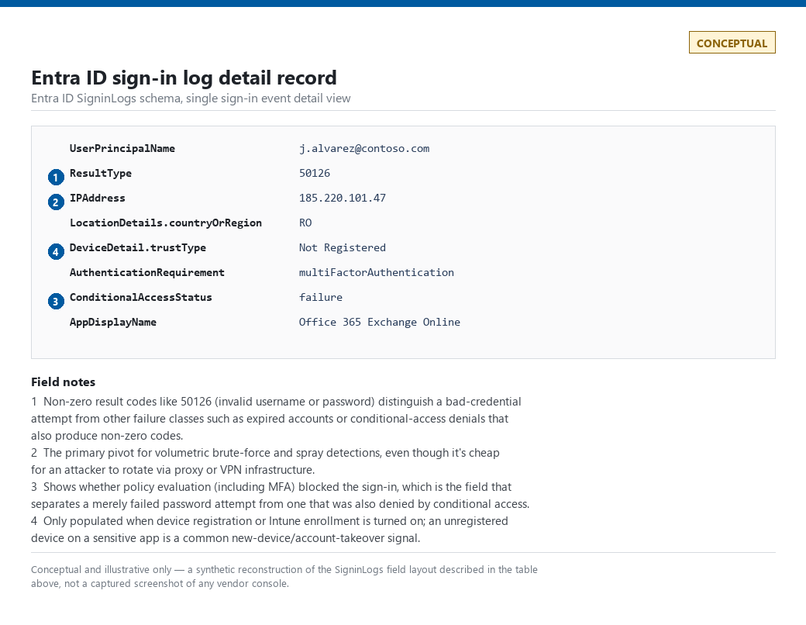
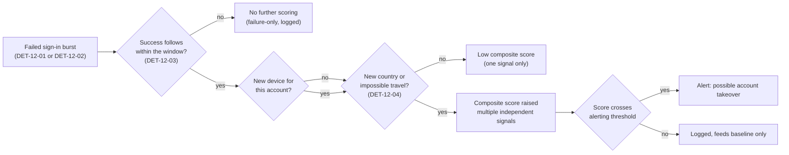

# Part 12 — Identity: Access & Authentication Detection

## Why this part exists

**[CONCEPT]** Every other telemetry source in this book records what happened *after* someone got in. Identity telemetry is the one source that records the getting-in itself — the sign-in log is the closest thing a detection program has to a front door with a camera on it. This part covers the access-and-authentication half of identity: brute force, password spray, the successful logon that follows a failure burst, MFA abuse and MFA fatigue, impossible travel, and the composite judgment call called account takeover — all driven by IdP/SSO sign-in logs (Entra ID, Okta, Ping, Duo, and equivalents). Part 13 covers the other half — privilege changes, Kerberos abuse, DCSync, LDAP enumeration — driven by Active Directory and Kerberos protocol telemetry instead. The split exists because the telemetry, the protocols, and the primary reader (a SOC analyst triaging a spray alert vs. one dissecting a Kerberoasting attempt) genuinely differ; treat this part as "logging in," Part 13 as "what an authenticated identity does with directory privilege."

Two naive rules get seeded in this part and are not fully dismantled here — both get the full capstone treatment in Part 40, cross-referenced back to this chapter: **"five failed logins equals brute force"** and **"a foreign country equals compromise."** Both sound reasonable enough to ship on day one. Both generate a specific, predictable failure mode this part names precisely, because naming the failure mode is the actual content — not the fact that the rule is "too simple," which tells a reader nothing they can act on.

---

## 1. The identity telemetry layer: what a sign-in log actually contains

**[CONCEPT]** A sign-in log record is not a Windows logon event with different field names. It is built around three things Event ID 4624 (An account was successfully logged on) doesn't natively carry in one place: an application context (which app or resource the sign-in was for), a conditional-access/policy evaluation result (was MFA required, was it satisfied, was the device compliant), and — because the identity provider sits in front of every downstream cloud app — a much higher volume, since one human "logging in" in the morning can generate a dozen application-specific sign-in records within a few minutes as SSO tokens get issued to Slack, the email client, the VPN, and three SaaS tools in sequence.

The fields that matter across almost every detection in this part, using Entra ID's `SigninLogs` schema as the running example (Okta's System Log, Ping's log API, and Duo's admin API expose the same concepts under different field names):

| Concept | Typical field (Entra ID `SigninLogs`) | Why it matters |
|---|---|---|
| Who | `UserPrincipalName` | The account identity — the primary entity key for this whole part |
| Result | `ResultType` | `0` is success; every other value a documented failure/error code — non-zero doesn't always mean "bad password" (expired accounts, blocked sign-ins, and conditional-access denials also produce non-zero) |
| Source | `IPAddress` | Cheap to spoof-adjacent via VPN/proxy, but still the primary pivot for volumetric detections |
| Location | the location sub-object (commonly nested as `LocationDetails.countryOrRegion`, `.city`, `.state` in Sentinel's default schema — confirm the exact nesting against your own workspace, since Microsoft has adjusted it before) | Feeds impossible-travel and new-country logic; geo-IP-derived, not GPS-derived — see the False Positive Trap in §6 |
| Device | `DeviceDetail` (device ID, compliance state, trust type) | Feeds new-device logic; only populated at all if the org has device registration/Intune enrollment turned on |
| MFA/policy | `AuthenticationRequirement`, `ConditionalAccessStatus`, `MfaDetail` | Whether MFA was required for this sign-in and whether it was satisfied, denied, or never prompted |
| App context | `AppDisplayName`, `ResourceDisplayName` | What the sign-in was actually for — a failed sign-in to a decommissioned legacy app reads very differently than one to the VPN gateway |

> **Engineering Reality**
> A meaningful fraction of the fields above simply do not exist for every tenant. Risk-scoring fields (`RiskLevelDuringSignIn`, `RiskState`) and some conditional-access detail require an Entra ID P2-equivalent license tier; MFA-denial detail depends on which second factor the org actually deployed; device-compliance fields are empty for any account that never enrolled a managed device. Before building any detection in this part, confirm which of these fields your tenant's license and configuration actually populate — a query that references an unlicensed field doesn't error, it silently returns nothing, which reads as "clean" and is actually "unmeasured."

**[ENGINEERING]** Sign-in logs also arrive later and less reliably than most engineers assume. Entra ID's own documentation describes sign-in log delivery to a SIEM connector as typically within a few minutes but explicitly not guaranteed within any fixed SLA; Okta's System Log API has its own polling-interval lag. A correlation window built for "5 minutes" in query logic needs a few minutes of slack on ingestion delay layered on top, or a real attacker's second event lands after the window closes and the correlation silently never fires — the same failure mode covered in general in Part 7.

> **Engineering Reality — knowing when a detection has gone quiet**
> Every detection in this part (`DET-12-01` through `DET-12-05`) and both hunts (`HUNT-12-01`, `HUNT-12-02`) fails the same way when it breaks: not with an error, but with zero rows, which is indistinguishable from "nothing bad happened" unless something else is watching the pipeline. The concrete failure modes that produce this silently: the diagnostic-settings connector stops forwarding `SigninLogs` after an Azure-side reconfiguration; a conditional-access policy change reroutes sign-ins through an app that stops populating `MfaDetail`; an Entra license downgrade drops a field a query depends on (§1's Engineering Reality box above); or a scheduled analytics-rule run silently fails and nobody notices because a failed run and a zero-hit run produce the same visible outcome — no alert. Two checks catch this that no amount of query tuning does: (1) a daily canary query with no filters beyond a time window — `SigninLogs | where TimeGenerated > ago(1d) | count` — alerting if the row count drops far below the trailing 7-day average, which catches connector and ingestion failures independent of any detection logic; and (2) tracking each detection's own hit rate over time and alerting on an unexplained drop to zero over a period where the account population is known to still be authenticating (a detection that fired at least weekly for a year and then goes silent for a month is a broken query or a broken pipeline far more often than it's a sudden absence of bad logins). Treat "this alert hasn't fired in a while" as a question to answer, not a result to trust.


> **Figure 12.4 — Entra ID sign-in log detail fields.** *CONCEPTUAL — illustrative field breakdown; not a captured screenshot.* Shows the field layout described in the table above, annotated against the concepts each field feeds. Would support the field-mapping claims in the table directly above this note. Tracked as `FIG-12-04` in `VISUAL-INVENTORY.md`.

---

## 2. Brute force detection: the first naive rule

**[CONCEPT]** Brute force, in the identity context, is repeated authentication attempts against **one account** using different guessed credentials, from one source or a small rotating set of sources, until one guess lands or the attacker gives up. It maps to MITRE ATT&CK T1110.001 (Password Guessing) for the general case and T1110 (Brute Force) as the parent technique.

> **Detection Autopsy — "five failed logins equals brute force"**
>
> **The rule:** Fires when a single account accumulates five or more `ResultType != 0` (non-zero result) sign-in events within a 5-minute window, from any source.
>
> **Why it shipped:** Five is a memorable, defensible-sounding number — it matches the account-lockout threshold a lot of identity teams already configure in the directory itself, so the rule feels like it's just restating an existing policy in detection form. It's also a one-line filter, cheap to write and cheap to explain in a design review.
>
> **How it failed:** It fires constantly on completely benign causes that have nothing to do with an attacker — a user with a cached expired password on three signed-in devices retrying the same stale credential, a mobile app silently retrying a token refresh against a just-rotated password, or a legacy on-prem app doing basic-auth retries against a service account. On a mid-sized tenant this produces double-digit false positives a day, drowning out the rare real spray or stuffing attempt that a fixed 5-count threshold would also miss entirely if it's spread across many accounts instead of one (see §3). Part 40 dissects the full failure mode, including why raising the threshold doesn't fix it either.
>
> **The fix:** Separate "many attempts, one account" (the actual brute-force shape) from "few attempts, many accounts" (password spray, §3) as two different detections with two different thresholds, baseline the per-account failure rate instead of using a fixed constant, and require the failures to come from a result code that actually indicates a bad-credential attempt rather than any non-zero code — see DET-12-02 below.

**[DETECTION ENGINEER]**

### 2.1 DET-12-02 — Repeated-credential brute force against a single account

The following Microsoft Sentinel KQL query targets the `SigninLogs` table (Entra ID sign-in logs ingested via the standard Azure AD diagnostic-settings connector).

```kql
// Microsoft Sentinel KQL — DET-12-02: single-account brute force, credential-guess result codes only.
SigninLogs
| where TimeGenerated > ago(30m)
| where ResultType in ("50126", "50053")          // bad password / account locked out from repeated bad password — verify current codes against Microsoft's sign-in error code reference before relying on this list; it has been extended before
| summarize
    FailedAttempts = count(),
    DistinctSourceIPs = dcount(IPAddress),
    SourceIPs = make_set(IPAddress, 10)
    by UserPrincipalName, bin(TimeGenerated, 30m)
| where FailedAttempts >= 10                       // tune against your own 30-day per-account baseline, not a fixed constant carried over from a lockout policy
| extend RotatesSources = DistinctSourceIPs > 3
```

This narrows to result codes that specifically indicate a wrong-credential attempt rather than any failure, which removes the expired-password-retry and legacy-basic-auth noise the naive version caught. It still misses an attacker who correctly guesses on the first or second try — brute force detection by definition cannot catch a guess that succeeds before the count threshold is reached; that gap is covered by the correlation logic in §4 and §7, not by this query.

> **Blind Spot**
> `bin(TimeGenerated, 30m)` creates fixed, clock-aligned windows (`:00`–`:30`, `:30`–`:00`), not a sliding 30-minute lookback. An attacker who paces attempts to straddle a bin boundary — five guesses at `00:28`–`00:29` and five more at `00:31`–`00:32` — produces two 5-count bins instead of one 10-count bin, and neither crosses the `FailedAttempts >= 10` threshold even though 10 guesses landed within 4 real minutes. The same fixed-bin evasion applies to DET-12-01's 1-hour bins and DET-12-05's 10-minute bins below. A sliding-window or overlapping-bin implementation closes it, at the cost of re-evaluating overlapping data on every run.

> **False Positive Trap**
> A password-manager browser extension or a mobile mail client that hasn't picked up a recent password change will retry the stale credential automatically, often faster than a human would, producing a tight burst of `50126` results from one account and one IP that looks identical to an automated guessing tool. The fix is not a higher count threshold — that just raises the bar for a real attacker too. Instead, correlate against the directory's own password-change event: suppress (not tune away) alerts where the account's last password change occurred within the lookback window and the retries stop immediately once a `ResultType == 0` success appears from the same device.

> **Detection Test**
> **Setup:** A test tenant account with MFA disabled and no conditional-access policy attached, so failures resolve to a clean bad-password code rather than a policy block.
> **Action:** Script 10 sign-in attempts against the test account within 2 minutes, each using a different incorrect password, from one IP address.
> **Expected result:** 10 `SigninLogs` rows for the test account with `ResultType` = `50126`, all sharing `UserPrincipalName` and `IPAddress`, timestamps within the 2-minute window.

**MITRE:** T1110 (Brute Force), T1110.001 (Password Guessing)

---

## 3. Password spray detection

**[CONCEPT]** Password spray inverts the brute-force shape: **few attempts per account, many accounts**, usually one or two commonly-guessed passwords tried against a large account list, from a source or small pool of sources, specifically to stay under any single-account lockout or count threshold. It maps to T1110.003 (Password Spraying). Credential stuffing — the same shape but using credentials leaked from an unrelated prior breach instead of guessed passwords — maps to T1110.004 (Credential Stuffing) and is detected with the same query logic; the distinguishing signal (a real leaked password vs. a guessed common one) usually isn't visible from the sign-in log alone.

**[DETECTION ENGINEER]**

### 3.1 DET-12-01 — Password spray across the tenant

This query runs against the same `SigninLogs` table as DET-12-02, grouped by source instead of by account.

```kql
// Microsoft Sentinel KQL — DET-12-01: many accounts, few attempts each, from a shared source or ASN.
SigninLogs
| where TimeGenerated > ago(1h)
| where ResultType in ("50126", "50053")
| summarize
    FailedAccounts = dcount(UserPrincipalName),
    TotalAttempts = count(),
    SampleAccounts = make_set(UserPrincipalName, 10)
    by IPAddress, bin(TimeGenerated, 1h)
| extend AttemptsPerAccount = round(1.0 * TotalAttempts / FailedAccounts, 2)
| where FailedAccounts >= 15 and AttemptsPerAccount <= 3   // many distinct accounts, one or two guesses each — the spray signature that a per-account threshold structurally cannot see
| order by FailedAccounts desc
```

This is the corrected shape §2's naive rule cannot catch by construction: no single account crosses a 5-count (or even a 10-count) threshold, because the whole point of a spray is staying under exactly that. Grouping by source IP is the cheapest version of this query and the first thing to break — see the case study below.

> **False Positive Trap**
> An IdP-side or SSO-side outage that forces a directory sync retry, or a bulk password-expiry policy that lands on the same day for a whole department, produces the identical statistical shape: many accounts, one or two failures each, clustered in a short window, all pointing at the IdP's own service endpoints as the "source." Cross-reference against a change calendar or maintenance-window flag before escalating a spray alert that spikes immediately after a known directory-sync or policy-rollout event — this is a case where the fix is process (check the calendar) rather than a query change, since making the query itself calendar-aware just moves the same blind spot one layer down. A large office egressing through one corporate NAT gateway produces a milder version of the same shape every single day with no outage involved at all — ordinary password typos across enough employees add up to `FailedAccounts >= 15` on that one shared IP purely by chance — so a known high-volume corporate egress IP needs its own, much higher per-IP threshold (or dynamic per-source baselining) rather than the same fixed constant applied to an unknown external IP.

### 3.2 Case study: two real brute-force shapes from the home-lab honeynet

**[DETECTION ENGINEER]** The two log excerpts below are real captures from a home-lab honeynet SSH decoy, not Windows or cloud IdP telemetry — but the shapes they show are exactly the two patterns §2 and §3 are built to tell apart, and seeing them side by side against real internet traffic makes the "why one query misses the other" argument concrete rather than theoretical.

```text
admin    ssh:notty    192.168.1.126    Mon Sep 14 01:17 - 01:17  (00:00)
admin    ssh:notty    192.168.1.126    Mon Sep 14 01:17 - 01:17  (00:00)
admin    ssh:notty    192.168.1.126    Mon Sep 14 01:17 - 01:17  (00:00)
root     ssh:notty    192.168.1.126    Mon Sep 14 01:06 - 01:06  (00:00)
root     ssh:notty    192.168.1.126    Mon Sep 14 01:06 - 01:06  (00:00)
[... dozens more root/admin attempts from the same source, often 15-20 hits inside a single minute ...]
```

**Figure 12.1 (FIG-12-01) — SSH brute-force burst against two accounts from one source.** *REAL LAB EXAMPLE.* Captured via `lastb -n 100` against `/var/log/btmp` on CT104 ("vulnscan"), a real LXC container on the author's home Proxmox lab. The source, `192.168.1.126`, resolved via the network's own DHCP lease table to a real device on the same LAN (not a simulated attacker) rapidly retrying `root` and `admin` against SSH — dozens of attempts per minute, one account each burst. This is the exact shape DET-12-02's single-account brute-force logic targets: a small, fixed set of accounts, high attempt volume, one dominant source. Captured 2026-09-15; `lastb` does not expose the attempted password, so a count-only correlation is all this source can support.

```text
id     ts                           src_ip           username  password
10104  2026-09-10T09:07:30Z         176.53.159.196   support   support
10097  2026-09-10T08:21:03Z         176.53.159.196   support   support
10085  2026-09-10T07:44:57Z         176.53.159.196   support   support
10064  2026-09-10T05:56:15Z         176.53.159.196   support   support
[... same credential pair from 176.53.159.196 and two adjacent /24 neighbors (.197, .198), spaced roughly 30 minutes to under 2 hours apart across multiple days ...]
9943   2026-09-09T19:05:48Z         130.12.180.51    admin     admin
9938   2026-09-09T19:05:47Z         46.8.31.44       admin     admin
9840   2026-09-08T13:27:42Z         130.12.180.51    admin     admin
9835   2026-09-08T13:27:20Z         8.136.128.232    admin     admin
```

**Figure 12.2 (FIG-12-02) — Low-and-slow credential stuffing against an SSH honeypot.** *REAL LAB EXAMPLE.* Captured from the `ssh_events` table of the author's honeynet collector (CT103, `/opt/hp-platform/data/honeypot.db`), a real SSH decoy listener that has logged over 10,000 genuine internet-sourced connection attempts. Two patterns appear in the same dataset: `176.53.159.196` and two adjacent /24 neighbors (`.197`, `.198` — almost certainly the same operator rotating source addresses) retrying the exact same `support`/`support` pair on a roughly 30-minute-to-2-hour cadence across multiple days — paced specifically to stay under any short-window count threshold and spread across just enough source addresses to dilute a naive per-IP grouping too — and the unrelated `admin`/`admin` pair arriving from several independent, non-adjacent source IPs, which is not one coordinated campaign at all but many different opportunistic scanners converging on the same default-credential guess. Captured range 2026-09-08 through 2026-09-10; the attacker-supplied credentials are the scanners' own fabricated guesses, not real secrets, so no redaction was required.

Neither DET-12-01 nor DET-12-02 as written catches the `support`/`support` pattern in Figure 12.2: one account, roughly one attempt every half hour to over an hour, split thinly across three near-neighbor source addresses — under any count-in-a-short-window threshold on either axis, and the /24 rotation means a per-source-IP grouping like DET-12-01's is also splitting an already-low volume three ways instead of concentrating it on one address. A per-source-IP grouping also cannot connect the `admin`/`admin` hits across the three unrelated source IPs in Figure 12.2, because there's no shared infrastructure to group on; the only thing tying them together is the credential pair itself. Pivoting on the (username, password) pair — a signal neither an Entra ID nor an Okta sign-in log actually exposes for failed attempts, since neither logs the attempted password — is exactly the gap the illustrative logic below is trying to name.

CONCEPTUAL SAMPLE — invented generic auth-event schema (`auth_events`), not tied to a specific product; illustrates why a per-source, short-window rule structurally cannot see either the low-and-slow single-source pattern or the multi-source same-credential pattern shown above.
```spl
index=auth_events event_outcome=failure
| bin _time span=24h
| stats dc(src_ip) as distinct_sources, count as attempts by username, password, _time
| where distinct_sources >= 3 OR attempts >= 5
```

Widening the correlation window to 24 hours and grouping by the credential pair rather than the source catches both shapes in the real evidence above, at the cost of a much noisier baseline to tune against — a tradeoff worth naming explicitly rather than treating as a free improvement. Real IdP sign-in logs don't carry the attempted password at all (by design — logging attempted passwords is its own liability), so this exact pivot only works against a telemetry source that does, like the SSH honeypot data above; the cloud-IdP equivalent is grouping by ASN or by a threat-intel-flagged IP reputation list instead of by raw source IP, which is a weaker but available substitute.

> **Detection Test**
> **Setup:** A test tenant with at least 20 disposable test accounts sharing no real production data.
> **Action:** Script one failed sign-in attempt (`50126`) against each of 20 test accounts within a 5-minute window, using the same guessed password, from a single test IP.
> **Expected result:** 20 `SigninLogs` rows, one per account, `ResultType` = `50126`, sharing `IPAddress`; DET-12-01 should fire (`FailedAccounts` = 20, `AttemptsPerAccount` = 1) while a naive single-account count rule would not.

**MITRE:** T1110.003 (Password Spraying), T1110.004 (Credential Stuffing)

---

## 4. Login-after-failure: correlating the burst with the win

**[DETECTION ENGINEER]** A failure burst that ends in nothing is a nuisance. A failure burst that ends in a success is the moment brute force or spray detection actually earns its keep — the correlation in Terminology's sense (§6, TERMINOLOGY.md): no single event here justifies an alert; the join across two low-signal events does.

### 4.1 DET-12-03 — Successful sign-in following a failure burst

This Microsoft Sentinel KQL query joins the `SigninLogs` table against itself, correlating each account's own failure history with its own later successes.

```kql
// Microsoft Sentinel KQL — DET-12-03: a success landing inside the tail of a failure burst for the same account.
let FailureThreshold = 5;
let FollowWindow = 15m;
let Lookback = 1h;                                   // bounds both branches of the join to a rolling window — see the note below
let Failures =
    SigninLogs
    | where TimeGenerated > ago(Lookback)
    | where ResultType in ("50126", "50053")
    | summarize FailedCount = count(), LastFailure = max(TimeGenerated) by UserPrincipalName
    | where FailedCount >= FailureThreshold;
SigninLogs
| where TimeGenerated > ago(Lookback)
| where ResultType == "0"
| join kind=inner Failures on UserPrincipalName
| where TimeGenerated between (LastFailure .. LastFailure + FollowWindow)
| project UserPrincipalName, LastFailure, SuccessTime = TimeGenerated, IPAddress, DeviceDetail, AppDisplayName
```

Both branches are bounded to the same rolling `Lookback` window. An earlier version of this query left both `SigninLogs` references unbounded: with no `ago()` filter, the `Failures` subquery computed each account's all-time failure count and most-recent-ever failure timestamp instead of a recent burst, so an account with five failures scattered across the last two years would satisfy `FailedCount >= FailureThreshold` on totally unrelated historical noise, and the outer query re-scanned the table's full retention on every run to check it. Whether the success comes from the *same* source IP as the failures or a *different* one changes the read entirely: same-source is consistent with the attacker simply guessing correctly on attempt six; different-source is consistent with the account owner's own retry after fixing a typo, landing coincidentally inside the window — which is exactly the false-positive shape below.

> **Blind Spot**
> This detection only fires when a failure burst precedes the success. An attacker who already holds a correct, stolen credential — from a phishing kit, an infostealer log, or a prior breach dump — succeeds on the first attempt, produces zero preceding failures, and is completely invisible to this query and to DET-12-01/DET-12-02 alike. Catching that case requires the impossible-travel and new-device signals in §§6–7, not failure correlation.

> **False Positive Trap**
> A legitimate user who mistypes their password two or three times before getting it right, from their own normal device and normal location, satisfies this query's literal condition just as well as an attacker does. This is why DET-12-03 is written as an *input* to the composite scoring in §7 rather than a standalone alert — a bare failure-then-success join, with no device/location context added, is one of the noisiest possible identity rules on its own.

> **Detection Test**
> **Setup:** Test tenant account, MFA disabled, no conditional-access policy attached.
> **Action:** Script 5 sign-in attempts with an incorrect password against the test account, then, within 2 minutes of the last failure, sign in successfully with the correct password from the same device and IP.
> **Expected result:** DET-12-03 returns one row for the test account, with `LastFailure` matching the timestamp of the fifth failed attempt and `SuccessTime` falling inside the 15-minute `FollowWindow`.

**MITRE:** T1110 (Brute Force), T1078 (Valid Accounts)

---

## 5. MFA abuse and MFA fatigue

**[CONCEPT]** MFA fatigue — also called push bombing — is an attacker who already holds a valid password sending repeated MFA push prompts to the legitimate user's device, hoping the user approves one out of annoyance, habit, or genuine confusion about whether it's their own login attempt. It has its own dedicated ATT&CK entry, T1621 (Multi-Factor Authentication Request Generation), reflecting how common the technique became once password theft alone stopped being sufficient against MFA-protected accounts.

**[DETECTION ENGINEER]**

### 5.1 DET-12-05 — Repeated MFA prompts in a short window

This query again targets `SigninLogs` in Microsoft Sentinel, filtered to rows where an MFA challenge was actually issued.

```kql
// Microsoft Sentinel KQL — DET-12-05: unusually dense MFA-prompt volume for one account.
SigninLogs
| where AuthenticationRequirement == "multiFactorAuthentication"
| where isnotempty(MfaDetail)                        // narrows to rows where an MFA challenge was actually issued, not just required by policy
| summarize PromptCount = count(), Results = make_set(ResultType), Resources = make_set(ResourceDisplayName, 5) by UserPrincipalName, bin(TimeGenerated, 10m)
| where PromptCount >= 4                              // baseline against your own tenant's normal push-retry rate before fixing this constant
```

The specific error/result codes that distinguish "user denied the prompt," "prompt timed out," and "prompt approved" differ by identity provider and have shifted numbering in Entra ID's own documentation before — check the current sign-in error code reference for your tenant rather than hardcoding a specific denial code into this query.

> **Engineering Reality**
> Whether this detection is even possible depends on which second factor is deployed. Number-matching push MFA and phone-call MFA log a denial/approval per attempt that this query can see; a legacy TOTP-code-only deployment has no "push" to bombard in the first place, and some third-party MFA integrations proxy the challenge outside the IdP entirely, so the IdP's own sign-in log never sees the repeated prompts at all — it only sees one final result. Confirm your organization's actual MFA method before assuming this detection covers what it appears to cover.

> **False Positive Trap**
> A user with a flaky mobile connection who taps "approve" but the response never reaches the server triggers an automatic re-prompt from the client side, producing three or four legitimate re-sends that look identical to an attacker's repeated push spam. The distinguishing signal is usually the *outcome*: a legitimate flaky-connection retry sequence ends in an approval from the same device that received every prior prompt; an actual push-bombing attack ends in an approval that the account owner did not knowingly grant, which the query above cannot tell apart on its own — pair this detection with the account owner's own after-the-fact confirmation during triage (see §9), not a purely automated disposition. A second, more common source has nothing to do with network flakiness: an org running per-resource step-up conditional access can legitimately prompt one user for four distinct MFA challenges — VPN, a sensitive SaaS app, a break-glass tool, email — inside one morning SSO burst (see §1), each approved without hesitation. The `Resources` field added to the query above is the cheapest way to tell the two apart: real push-bombing repeats the same `ResourceDisplayName`, since the attacker is trying to get into one thing; a legitimate multi-app morning burst spreads across several distinct resources.

> **Detection Test**
> **Setup:** Test tenant account with number-matching push MFA enabled as the only registered second factor.
> **Action:** Trigger four sign-in attempts against the test account within 10 minutes, each satisfying the password step and issuing a push prompt, denying or ignoring each prompt.
> **Expected result:** DET-12-05 returns one row for the test account with `PromptCount` >= 4 inside a single 10-minute bin; `Results` contains the provider's denial/timeout code, not a success.

**MITRE:** T1621 (Multi-Factor Authentication Request Generation), T1078 (Valid Accounts)

---

## 6. Impossible travel, new device, and new country: the second naive rule

**[CONCEPT]** Impossible travel compares two successful sign-ins for the same account and flags the pair if the geographic distance between them divided by the elapsed time exceeds any plausible travel speed — the geo-IP equivalent of noticing someone badged into a building in London and then a building in Tokyo 4 minutes later. New-device and new-country logic are the simpler cousins: has this account ever authenticated from this device fingerprint, or from this country, before.

> **Detection Autopsy — "a foreign country equals compromise"**
>
> **The rule:** Fires on any successful sign-in where the resolved country in the sign-in log differs from the account's "home" country (usually the org's HQ country or a manually maintained allowlist).
>
> **Why it shipped:** It matches an intuitive mental model — "our people work from our country" — and it's trivial to implement as a single field comparison against a static list, with an obvious story for a design review: foreign sign-in, foreign attacker.
>
> **How it failed:** Legitimate travel, remote employees, contractors and outsourced staff based genuinely outside the "home" country, and — the single biggest driver — VPN and corporate egress infrastructure that geo-IP-resolves to wherever the VPN exit node physically sits, all trip this rule constantly, while producing no actionable signal at all: most large orgs generate this alert dozens of times a day and tune it into an ignored queue within weeks. Meanwhile it does nothing for an attacker sitting on infrastructure that happens to geo-resolve inside the "home" country — cloud VPS instances rented in-region are cheap and common. Part 40 walks through why a country-allowlist approach specifically, as opposed to velocity-based reasoning, is the part that's structurally broken here.
>
> **The fix:** Replace a static country check with velocity-based impossible-travel logic (this section, DET-12-04) plus new-device/new-country-*for-this-specific-account* baselining rather than a single org-wide list, and treat known corporate VPN egress ranges as a first-class exclusion rather than noise to tune away later.

**[DETECTION ENGINEER]**

### 6.1 DET-12-04 — Geovelocity-based impossible travel

This Sentinel KQL query walks each account's successful `SigninLogs` rows in timestamp order and compares each row's resolved country to the immediately preceding one.

```kql
// Microsoft Sentinel KQL — DET-12-04: successive successful sign-ins for one account, compared for country change and elapsed time.
SigninLogs
| where TimeGenerated > ago(24h)                     // bounds the scan to a rolling window — see the edge-effect note below
| where ResultType == "0"
| where isnotempty(tostring(LocationDetails.countryOrRegion))   // drop unresolvable-geo rows before comparing — see the note below
| sort by UserPrincipalName asc, TimeGenerated asc
| extend PrevTime = prev(TimeGenerated), PrevUser = prev(UserPrincipalName),
         PrevCountry = prev(tostring(LocationDetails.countryOrRegion))   // confirm this exact property path against your workspace schema
| where UserPrincipalName == PrevUser
| extend MinutesBetween = datetime_diff('minute', TimeGenerated, PrevTime)
| extend CountryChanged = tostring(LocationDetails.countryOrRegion) != PrevCountry
| where CountryChanged and MinutesBetween < 120   // 2 hours is a starting point, not a validated constant — see the note below
```

A 2-hour cutoff is deliberately conservative and still wrong for some real country pairs: 2 hours is impossible between London and Tokyo but entirely possible between two adjacent European countries with a short direct flight, or between any two points connected by a train. A production version of this query should compare against a minimum realistic travel-time table keyed on the specific country pair, not one global constant — which is itself extra engineering work worth budgeting for rather than skipping. Bounding the scan to a rolling 24-hour window also means the very first sign-in an account has inside that window is compared against nothing (`prev()` returns `null`), even if a real prior sign-in exists just outside it — a travel pair straddling the 24-hour boundary is caught on whichever scheduled run's window happens to contain both events, which is added detection latency of up to one run interval, not a silent miss.

The `isnotempty()` filter above exists because `LocationDetails.countryOrRegion` is not guaranteed to be populated on every row — a source IP in a private/CGNAT range during testing, a geo-IP database miss, or a client that bypasses normal network path resolution can all leave the field blank. Without that filter, one blank-country row next to one resolved-country row satisfies `CountryChanged` (`"" != "Japan"` is `true`) with zero actual travel involved, and the query has no way to tell that apart from a real country change; dropping unresolvable rows trades a small, honest blind spot (an unresolvable leg of a real trip goes uncompared) for removing a false-positive source that would otherwise fire on data quality noise, not attacker behavior.

> **Blind Spot**
> An attacker who deliberately routes through a proxy or VPN exit node that geo-resolves to the victim's own country — a real, purchasable capability in the underground residential-proxy market, chosen specifically to match the victim's location — never trips `CountryChanged` at all. Impossible-travel logic only catches an attacker who is careless or resource-constrained about egress location; it does nothing against one who paid for a matching one, and it should never be presented as coverage against a targeted, well-resourced actor on its own.

> **False Positive Trap**
> Corporate VPN concentrators, CDN-based zero-trust proxies, and mobile carrier NAT gateways routinely produce sign-ins that geo-resolve to a location far from the user's actual physical location, and a user roaming between a home ISP and a corporate VPN mid-session produces a same-account, different-resolved-country pair with zero actual travel involved. Maintain an explicit, reviewed allowlist of known corporate egress ranges/ASNs and exclude them before computing velocity — don't widen the time threshold to compensate, since that just makes the detection blind to a shorter real impossible-travel window too.

> **What Would Change My Mind**
> This detection assumes geo-IP resolution is accurate enough, at the country level, to be a meaningful travel-time input. If a review of confirmed benign alerts showed geo-IP country resolution disagreeing with the user's actual country more than roughly 5% of the time — a real risk with satellite ISPs, some mobile carriers, and IPv6 allocation quirks — the velocity threshold would need to be treated as advisory context feeding the composite score in §7, not a standalone alerting condition on its own.

> **Detection Test**
> **Setup:** Test tenant account, two egress points that geo-resolve to different countries (for example, a home ISP connection and a commercial VPN exit node in another country).
> **Action:** Sign in successfully from the first egress point, then sign in successfully again from the second egress point within 30 minutes.
> **Expected result:** DET-12-04 returns one row for the test account with `CountryChanged` = `true` and `MinutesBetween` under 120, `PrevCountry` and the current row's country matching the two egress points used.

**MITRE:** T1078 (Valid Accounts), T1078.004 (Valid Accounts: Cloud Accounts)

---

## 7. Account takeover: composing the signals into one verdict

**[DETECTION ENGINEER]** No single signal in §§2–6 is trustworthy alone at production scale — that's the throughline of every False Positive Trap box above. Account takeover detection, in practice, is the composite judgment built from several of those weak signals landing on the same account within a bounded window: a failure burst, followed by a success, from a new device, in a new country, is a materially different claim than any one of those four facts alone. This is a preview of the full risk-scoring treatment in Part 33 (Risk-Based Detection) — this part shows the identity-specific inputs that feed that model; Part 33 shows the general scoring mechanism.






**Figure 12.3 (FIG-12-03) — Account-takeover signal composition.** *CONCEPTUAL.* Illustrates how the individually weak signals from §§2–6 (failure burst, login-after-failure, new device, impossible travel/new country) combine into one account-takeover verdict rather than alerting independently. This is a sketch of the intended decision flow, not a capture from a running risk-scoring engine — see Part 33 for the general risk-based alerting mechanism this diagram is an identity-specific instance of.

> **Blind Spot**
> Every signal in this composite assumes the attacker performs a fresh, live interactive authentication that the IdP itself evaluates — a password attempt, a device check, an MFA prompt. Adversary-in-the-middle phishing kits (Evilginx and similar) proxy the real login page, let the victim complete their own password and MFA step, and steal the resulting session token instead of a credential. Replaying that token produces a session with zero failed attempts, no MFA prompt at all, and — depending on how the IdP binds tokens to device and location — no new-device or new-country flag either, because nothing about the *credential* changed. None of DET-12-01 through DET-12-05, or the composite scoring above, is built to see this; catching it requires token-binding and continuous-access-evaluation controls, plus session-anomaly detection on the token's own claims, which is out of scope for this part.

> **Hunter's Note**
> When a real account-takeover case lands in your queue, pull every sign-in for that account across the *entire* window between the first suspicious failure and the confirmed compromise action, not just the ones that matched a rule. The attacker's own MFA-satisfaction sign-ins, the exact application they touched first after getting in, and any subsequent device registration they performed are usually sitting in the same `SigninLogs`/audit-log pair right next to the alert that fired — and they tell you what to hunt for on every *other* account that shows the same early-stage pattern but hasn't reached the same score yet.

---

## 8. Threat hunting identity access

**[THREAT HUNTER]**

### 8.1 HUNT-12-01 — Low-and-slow credential reuse that never crosses a count threshold

**Threat Hypothesis:** An attacker or scanner pacing failed authentication attempts against the same account (or the same guessed credential pair, across many accounts) below any reasonable per-window count threshold should still be findable by pivoting on the repeated exact credential value or account name across a wide time window, even though no standing count-based rule will ever fire on it.

Grounded directly in the real honeynet evidence in §3.2 — the `support`/`support` pair recurring from `176.53.159.196` and its two near-neighbor addresses roughly every 30 minutes to 2 hours across multiple days is exactly this pattern, paced and lightly source-rotated specifically to stay under a short-window, per-IP threshold. The hunt widens the lookback to weeks, groups by the (account, credential-guess-pattern) pair rather than a time-boxed count or a single source IP, and treats "same account, wrong password, every day for 2 weeks, never succeeding" as the finding worth investigating even with zero individual alerts fired. Ends either in a documented negative finding (the pattern exists but the account was already disabled, so no real exposure) or a new low-and-slow detection candidate with a multi-day window — never in "nothing found."

Against real IdP telemetry this pivot changes shape: Entra ID and Okta sign-in logs never expose the attempted password (see §3.2), so the grouping key becomes (account, source ASN or IP-reputation list) rather than the literal credential pair — a weaker pivot, but the only version of it that runs against production identity telemetry rather than honeypot data that happens to log the raw credential.

> **What this hunt will also surface, and why that's not a false positive**
> A wide, multi-week lookback grouped by account will also catch an account with a permanently stale saved credential in one abandoned client — a decommissioned mobile device, an old script with a hardcoded password nobody rotated — retrying on its own schedule for months with zero attacker involvement. That is a legitimate hit for this hunt, not noise to filter out before reporting: the point of HUNT-12-01 is that both cases (an attacker pacing guesses, and a forgotten client hammering a dead credential) look identical from outside and both deserve the same next step — identify the source and either disable it or confirm it's benign — which is exactly why the write-up above says every run ends in a documented finding, never "nothing found." An attacker who *also* wants to evade this hunt just needs to pace even slower than the multi-week window covers or rotate the guessed credential itself over time; there is no lookback long enough to make a sufficiently patient, sufficiently varied low-and-slow attempt structurally undetectable by count or pattern alone — which is the honest limit of this hunt, not a flaw specific to how it's written here.
>
> **Running it:** Pull `SigninLogs` (or the honeypot/auth-log equivalent) for a 14–30 day window, `summarize count(), min(TimeGenerated), max(TimeGenerated) by UserPrincipalName, IPAddress` (or the ASN/reputation-list grouping against production IdP data), and sort by the ratio of elapsed time to attempt count — a large elapsed span with a small, steady count is the signature; a hunt run that finds zero such accounts across a real 30-day production window is itself worth noting in the write-up, since it's a claim about the environment ("no low-and-slow pattern present this cycle") that the next run should be able to check against.

**MITRE:** T1110.001 (Password Guessing), T1110.004 (Credential Stuffing)

### 8.2 HUNT-12-02 — Interactive sign-ins on accounts flagged non-interactive

**Threat Hypothesis:** A directory account tagged as service, non-interactive, or break-glass emergency-access should never produce a sign-in log entry with a real device fingerprint and an interactively-satisfied MFA challenge; any account matching that profile that does produce one is either a directory-tagging error worth fixing or a takeover of a highly privileged, rarely-monitored account.

This hunt exists because standing detections in §§2–7 are all built around *human* account behavior baselines; a compromised service account with a static, unrotated credential can walk straight through all of them by never producing a failure burst at all — the attacker already has the one credential that always works. Pull the directory's own account-type metadata, join against `SigninLogs` for any interactive/MFA-satisfied row on an account tagged non-interactive, and treat every hit as worth a manual look regardless of volume.

> **What this hunt depends on, and where it structurally can't see**
> This hunt is only as good as the directory's account-type tagging, which is a real dependency, not a formality: on tenants where service accounts are inconsistently tagged, expect the first run to surface a batch of stale-tag false positives (accounts that were legitimately converted to human use, or automation accounts that were never tagged in the first place) before it surfaces anything actionable — that noisy first pass is itself useful, since it's the same pass that fixes the tagging data every later run depends on. It also has a hard blind spot by design: it only looks for *interactive* sign-ins with an MFA challenge, so an attacker who steals a service account's static credential and uses it exactly the way the service account is supposed to be used — a non-interactive, programmatic API call or client-credential grant, with no device fingerprint and no MFA prompt to satisfy — produces nothing for this hunt to find at all. That gap is real and not closed by this hunt; catching a service-account credential abused non-interactively requires baselining the account's *normal* call volume, source, and API pattern and hunting for deviation from that baseline instead, which is a different hunt built on different telemetry (application/resource audit logs, not sign-in logs) and is out of scope here.
>
> **Running it:** Join the directory's service-principal/account-type export against `SigninLogs` on `UserPrincipalName`, filter to rows where `AuthenticationRequirement == "multiFactorAuthentication"` and `isnotempty(DeviceDetail)`, and hand-review every match — the expected weekly volume on a well-tagged tenant is low enough (single digits) that "regardless of volume" in the paragraph above is a realistic bar, not an aspirational one; if a tenant's untagged/mistagged account population is large enough to make that untrue, fixing the tagging is the actual first finding.

**MITRE:** T1078 (Valid Accounts), T1078.004 (Valid Accounts: Cloud Accounts)

---

## 9. Analyst triage for identity alerts

**[ANALYST]** Most of the detections above are deliberately built to be composite inputs, not standalone verdicts — which means triage on any one of them should start by asking what else fired for the same account in the same window, not by disposing of the single alert in isolation.

A practical triage sequence for a fired account-takeover-composite alert:

1. Pull the account's own sign-in history for the prior 30 days — is the "new" device or country actually new, or is the baseline just too short to have seen it yet?
2. Check whether the account owner is reachable and ask directly whether they recognize the sign-in, the device, and the approximate time and location — this single step resolves more identity alerts correctly than any amount of additional query logic.
3. Check the failure-burst source IP and the success source IP against each other and against known corporate egress ranges — same-source failures-then-success reads very differently from different-source.
4. If MFA was involved, confirm with the user whether they approved a prompt they didn't recognize requesting, or denied one — a denied prompt with a subsequent successful sign-in from a different method is a stronger signal than an approved one taken at face value.
5. Escalate to session revocation and credential rotation immediately if any step above cannot be resolved to a confident benign explanation — the cost of a false escalation here is far lower than the cost of leaving a live account-takeover session active while triage continues.

---

## 10. Managing identity detection at the program level

**[SOC MANAGEMENT]**

> **SOC Management View**
> Identity alerts carry a wider blast radius per true positive than almost any other alert category in this book — a compromised identity can pivot into email, cloud storage, source control, and the SIEM itself, depending on what that account can reach. That argues for a lower alerting threshold and faster escalation SLA on identity-specific composite alerts than the equivalent threshold you'd accept for, say, a single endpoint's process-creation alert — even knowing it costs more analyst hours on false positives. If your identity alert queue is tuned to the same volume tolerance as every other queue in the SOC, that's a risk-acceptance decision that should be made explicitly by whoever owns the program's risk posture, not one that falls out silently from a shared default threshold.

---

## 11. Coverage summary

**[DETECTION ENGINEER]** The table below maps each named detection and hunt in this part to its MITRE ATT&CK technique, for use in a program-level coverage matrix (Part 41).

| ID | Behavior | MITRE |
|---|---|---|
| `DET-12-01` | Password spray across the tenant | T1110.003 (Password Spraying), T1110.004 (Credential Stuffing) |
| `DET-12-02` | Single-account repeated-credential brute force | T1110 (Brute Force), T1110.001 (Password Guessing) |
| `DET-12-03` | Successful sign-in following a failure burst | T1110 (Brute Force), T1078 (Valid Accounts) |
| `DET-12-04` | Geovelocity-based impossible travel | T1078 (Valid Accounts), T1078.004 (Valid Accounts: Cloud Accounts) |
| `DET-12-05` | Repeated MFA prompts in a short window | T1621 (Multi-Factor Authentication Request Generation), T1078 (Valid Accounts) |
| `HUNT-12-01` | Low-and-slow credential reuse below count thresholds | T1110.001 (Password Guessing), T1110.004 (Credential Stuffing) |
| `HUNT-12-02` | Interactive sign-in on a non-interactive-tagged account | T1078 (Valid Accounts), T1078.004 (Valid Accounts: Cloud Accounts) |

Both naive rules seeded in this part — "five failed logins equals brute force" (§2) and "a foreign country equals compromise" (§6) — get their full comparative dissection across every source part in Part 40; this part's Detection Autopsy boxes are the teaser, not the final word.
