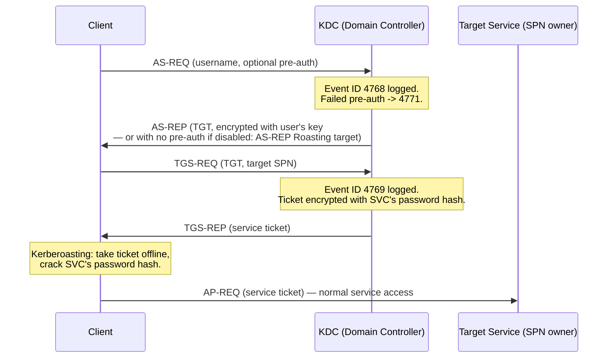
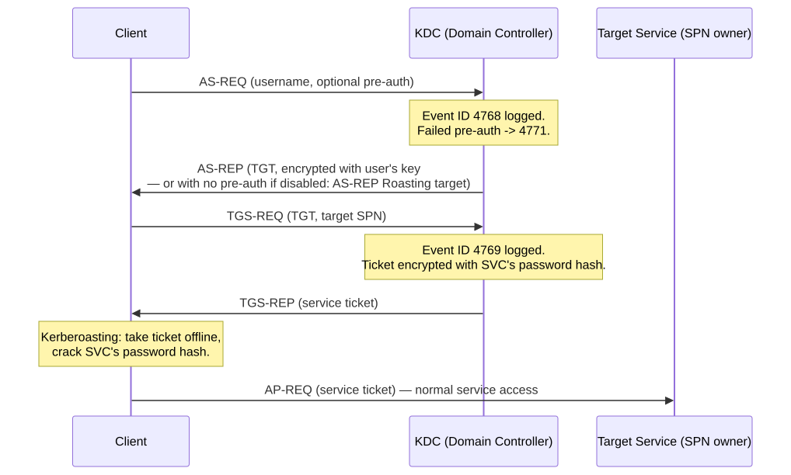
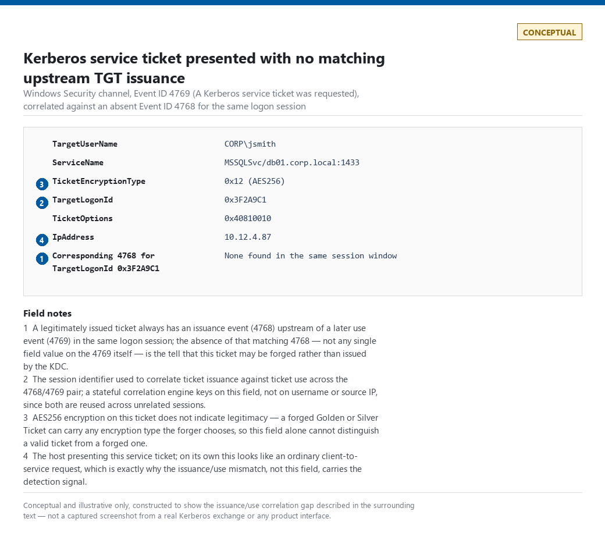
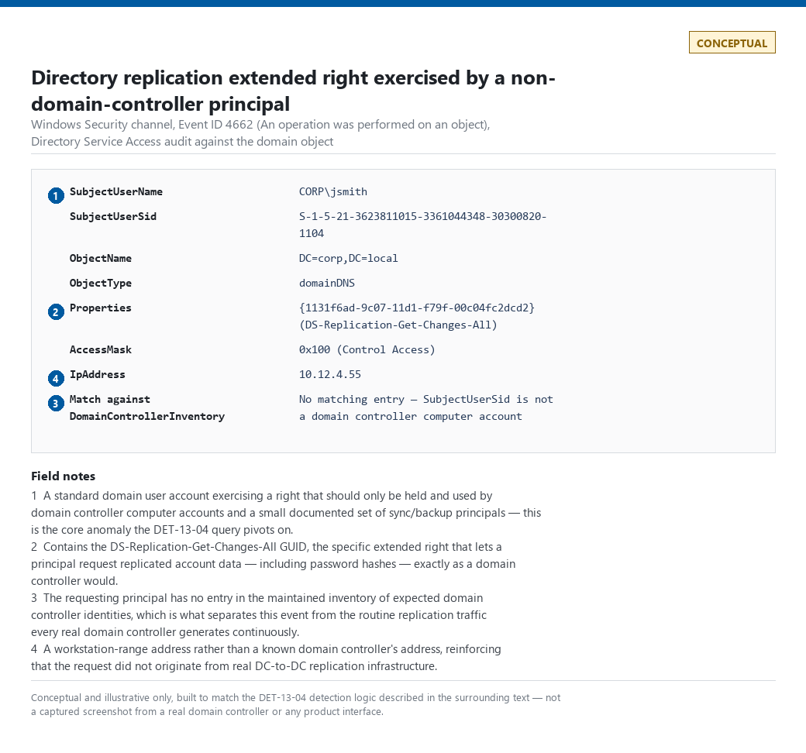

# Part 13 — Identity: Directory, Privilege & Kerberos Detection

## Why this part exists

Active Directory and Kerberos generate their own protocol-level attack surface, distinct from
the sign-in-log-driven identity attacks Part 12 covers. Nobody sprays passwords against a
Kerberos ticket-granting service the way they spray an Okta login page, and nobody DCSyncs an
IdP. The telemetry is different (Windows Security event log and LDAP, not IdP sign-in logs), the
protocol internals matter (ticket encryption types, extended rights, SPNs), and the primary
reader is more often a Windows-focused detection engineer or AD administrator than a SOC analyst
triaging a spray alert. This part is the analytic layer for that surface: it assumes the
telemetry survey in Part 3 already covers what Windows Security and Kerberos telemetry looks
like at a field level, and it builds detection logic on top of that survey rather than
re-explaining it.

**[CONCEPT]** Kerberos was designed in the 1980s to solve a narrower problem than "detect a
compromised domain" — mutual authentication over an untrusted network without sending a
password on the wire. Every attack in this part abuses a legitimate protocol feature (a ticket
can be requested offline-crackable, a domain controller can be asked to replicate password
hashes, a directory object's permissions can be queried by anyone with read access) rather than
exploiting a bug. That framing matters for detection design: you are not looking for malformed
protocol traffic, you are looking for legitimate protocol operations happening in a context, at a
volume, or from a principal that doesn't match how the environment actually uses Active
Directory.

This part does not cover: brute force, password spray, or MFA abuse against an IdP sign-in
endpoint (Part 12 owns that layer exclusively); credential theft from memory via LSASS or SAM
(Part 11); cloud identity platforms — Entra ID, Okta, Google Workspace (Part 18); or the
kill-chain-level synthesis of identity compromise across Parts 12, 13, and 18, which Part 46
owns. Field-level reference for every event ID and LDAP attribute named below lives in Appendix
A2.

## 1. Scope and the telemetry this part assumes

**[CONCEPT]** Everything in this part is analytic-layer content sitting on top of two telemetry
sources: the Windows Security event log on domain controllers (Kerberos and directory-service
audit events) and LDAP query/directory-object telemetry. Part 3 covers what these sources
capture, at what fidelity, and their collection prerequisites, in more depth than this part
repeats. Where this part states an audit-policy prerequisite (most of Section 6 below, for
example), it's doing so because a missing prerequisite silently zeroes out every downstream
detection — not because it's re-teaching Part 3's telemetry survey.

> **Engineering Reality**
> Kerberos Event IDs 4768, 4769, and 4771 do not exist in the Security log unless "Audit
> Kerberos Authentication Service" and "Audit Kerberos Service Ticket Operations" are explicitly
> enabled via Group Policy on every domain controller — neither is on by default in a base
> Windows Server install. A domain onboarded to the SIEM with the default audit policy will show
> zero Kerberos events, which reads identically to "no Kerberoasting is happening" and to "the
> audit policy was never turned on." Verify the GPO is applied and linked to the Domain
> Controllers OU before trusting an empty Kerberos-event result set as clean.

## 2. Kerberos protocol fundamentals

**[CONCEPT]** A Kerberos authentication exchange has two rounds, and almost every detection in
this part hangs off one of them:

1. **AS exchange (Authentication Service).** The client proves it knows the account's secret
   (usually a password hash) to the Key Distribution Center (KDC — a role every domain
   controller performs) and receives a Ticket-Granting Ticket (TGT). This produces Event ID 4768
   (A Kerberos authentication ticket (TGT) was requested), and a failed pre-authentication
   attempt produces Event ID 4771 (Kerberos pre-authentication failed).
2. **TGS exchange (Ticket-Granting Service).** The client presents its TGT to request a service
   ticket for a specific Service Principal Name (SPN) — a named service instance, such as
   `MSSQLSvc/db01.corp.local:1433`, registered on a service account or computer account. This
   produces Event ID 4769 (A Kerberos service ticket was requested).

A service ticket is encrypted with a key derived from the *target service account's* password
hash, not the requesting user's — which is the single fact that makes Kerberoasting possible:
anyone who can authenticate to the domain can request a ticket for any SPN and take the encrypted
ticket offline to attack the service account's password, without the service account or the
target host ever being touched.






**Figure 13.1 — Kerberos AS/TGS exchange with attack points annotated.** *CONCEPTUAL.* Illustrates
the standard two-round Kerberos exchange and marks where AS-REP Roasting (§4) and Kerberoasting
(§3) attach to normal protocol messages, rather than exploiting a defect in the protocol. Not a
capture from a real exchange — see Figure 13.3 (§5) and Figure 13.4 (§6) for illustrative
field-level breakdowns of the specific event entries this figure's attack points would produce.

## 3. Kerberoasting (T1558.003)

**[CONCEPT]** T1558.003 (Kerberoasting) requests a TGS-REP for any account with a registered SPN
— disproportionately service accounts, which are more likely to have old, rarely-rotated, and
weak passwords than a human account subject to a password policy and reset cadence. The attacker
does this once for every SPN of interest, takes every ticket offline, and cracks at leisure with
no further contact against the domain.

### 3.1 4769 — A Kerberos service ticket was requested

Fields that matter: `TargetUserName` (the account whose SPN was requested — the account under
attack, not the requester), `ServiceName`, `TicketEncryptionType` (`0x12` = AES256, `0x17` = RC4,
`0x1` = DES — DES is effectively never legitimate on a modern domain), `IpAddress` (requesting
client), and `TicketOptions`.

> **Detection Autopsy — "flag every account with a spike in 4769 requests"**
>
> **The rule:** Counts 4769 events per `TargetUserName` in a rolling window and fires when any
> single service account crosses a fixed threshold — say, 50 requests an hour.
>
> **Why it shipped:** Kerberoasting tools request tickets for many SPNs in a short burst, so a
> volume spike on the target account looked like a clean, cheap signal, and "count events, alert
> on threshold" is the easiest correlation rule a new detection engineer writes.
>
> **How it failed:** A single shared service account backing a web farm or a clustered SQL
> instance can legitimately receive hundreds of TGS requests an hour, one from every application
> server or client connection in the farm — the account's normal traffic pattern already exceeds
> the threshold every business day, so the rule either never stops paging or gets tuned up to a
> threshold no real Kerberoasting run would ever reach on a well-secured domain, at which point it
> stops catching anything.
>
> **The fix:** Stop counting per-account request volume in isolation and instead count *distinct
> requesting source hosts* against the volume. Legitimate high-volume TGS traffic against a
> shared service account comes from a small, stable set of application-server source IPs;
> Kerberoasting traffic comes from one or two attacker-controlled hosts requesting tickets for
> many *different* service accounts in the same burst. Pivot the anomaly onto the requester, not
> the target.

**[DETECTION ENGINEER]**

<a id="det-13-01"></a>**DET-13-01 — Kerberoasting via requester fan-out, not ticket-encryption
type.** The following targets Microsoft Sentinel and assumes Windows Security events are ingested
into the `SecurityEvent` table (legacy Log Analytics agent/AMA schema). It has not been validated
against a real Kerberoasting run in this book's lab — no AD domain controller exists in the
author's lab environment as of this writing — so treat the thresholds as an illustrative starting
point, not a tuned production rule.

CONCEPTUAL SAMPLE — illustrative Sentinel KQL, untested against real Kerberoasting traffic.

```kql
// Targets a single requesting host requesting tickets for an unusually large number of
// distinct SPN-bearing accounts in a short window — the requester-fan-out signal, not
// ticket-encryption type (see Blind Spot below for why encryption type alone is insufficient).
SecurityEvent
| where EventID == 4769
| where TargetUserName !endswith "$"          // exclude computer-account TGS requests
| where ServiceName != "krbtgt"               // exclude routine TGT-renewal noise
| summarize DistinctServiceAccounts = dcount(TargetUserName),
            RequestedAccounts = make_set(TargetUserName)
      by IpAddress, bin(TimeGenerated, 15m)
| where DistinctServiceAccounts >= 5           // one host, five-plus distinct SPN accounts, 15 min
| order by DistinctServiceAccounts desc
```

**MITRE:** T1558.003 (Kerberoasting).

> **Blind Spot**
> Filtering only on `TicketEncryptionType` `0x17` (RC4) misses Kerberoasting entirely on a domain
> where AES is enforced or where the attacker's tooling requests AES256 tickets deliberately to
> dodge exactly this filter. AES-encrypted tickets are exactly as crackable offline as RC4 ones if
> the target account's password is weak — the encryption type changes the cracking tool's hash
> format, not whether the attack works. Any rule that hard-codes RC4 as the detection condition
> has a known, trivial bypass. The requester-fan-out pivot above has its own bypass: an attacker
> who already knows — from HUNT-13-01's own SPN-exposure audit, or from prior reconnaissance —
> exactly which two or three service accounts are worth cracking never generates a fan-out at all,
> since `DistinctServiceAccounts` never crosses the threshold for a targeted, low-volume request.
> A sufficiently informed attacker defeats both signals in this section at once.

> **False Positive Trap**
> Legacy line-of-business applications and some network appliances that predate AES support in
> your domain's functional level will request RC4 tickets as routine behavior, not as an attack
> attempt. If your Kerberoasting rule still keys on encryption type as one signal among several,
> maintain an explicit allowlist of known legacy-RC4 service accounts rather than excluding RC4
> traffic domain-wide — a domain-wide RC4 exclusion also excludes the RC4 requests a real
> attacker's tooling makes by default. Separately, the fan-out pivot itself false-positives on any
> shared jump box, Citrix/RDS farm, or automation host: dozens of users authenticating through one
> front-end IP will legitimately request tickets for half a dozen different SPN-bearing services
> (mail, file share, SQL, print) inside any 15-minute window, crossing `DistinctServiceAccounts >=
> 5` with zero attacker involvement. Exclude known multi-user front-end IPs from `IpAddress`, or
> repivot on distinct accounts fanned out *per logon session* rather than per source IP alone.

> **Detection Test**
> **Setup:** Domain-joined Windows test host, no local admin rights required, one AD service
> account with a registered SPN and a deliberately weak password for the test only.
> **Action:** `Rubeus.exe kerberoast /outfile:hashes.txt`
> **Expected result:** One or more Event ID 4769 entries with `TargetUserName` matching the test
> service account, source `IpAddress` matching the test host, and — if run against several SPNs
> in sequence — a `DistinctServiceAccounts` count from the query above high enough to cross the
> threshold from that single host.

### 3.2 Hunting SPN exposure before the attack happens

**[THREAT HUNTER]**

> **Hunter's Note**
> Don't wait for a 4769 spike. Every Kerberoastable account is discoverable ahead of time by
> querying the directory itself for any object with a non-empty `servicePrincipalName` attribute
> — the same query an attacker runs during reconnaissance (`Get-ADUser -Filter
> {ServicePrincipalName -ne "$null"}` or an equivalent LDAP search). Run that query yourself on a
> schedule, cross-reference the results against `PasswordLastSet` and whether the account is
> flagged for AES-only Kerberos, and you have a prioritized remediation list — the accounts a real
> attacker would target first — before anyone requests a single ticket.

<a id="hunt-13-01"></a>**HUNT-13-01 — SPN exposure and crackability audit.**

- **Threat Hypothesis:** A meaningful fraction of SPN-registered service accounts in the domain
  have passwords old enough, or short enough, to be crackable within a realistic offline attack
  budget, and no standing detection measures this exposure directly.
- **Scope:** All directory objects with a non-empty `servicePrincipalName`, cross-referenced
  against `PasswordLastSet`, `msDS-SupportedEncryptionTypes` (whether AES-only is enforced for
  the account), and group membership (privileged accounts with SPNs are the highest-priority
  finding).
- **Pivot:** Rank by password age, then by privilege — an SPN-bearing account with Domain Admin
  membership and a five-year-old password is a finding to remediate today, not a Kerberoasting
  detection to tune.
- **Disposition:** This hunt should end in a remediation ticket per exposed account (rotate the
  password, restrict SPN-account privilege, or enforce AES-only), not a new standing rule — the
  standing detection for the attack itself is DET-13-01 above. A hunt with no fired alert to chase
  still needs a documented finding; "we found 11 crackable service accounts, three with
  Domain Admin membership" is that finding.

**MITRE:** T1558.003 (Kerberoasting), T1087.002 (Account Discovery: Domain Account).

## 4. AS-REP Roasting (T1558.004)

**[CONCEPT]** T1558.004 (AS-REP Roasting) targets accounts with Kerberos pre-authentication
disabled — a per-account setting ("Do not require Kerberos preauthentication") that lets anyone
request an AS-REP for that account with no proof of password knowledge at all. The AS-REP comes
back encrypted with a key derived from the account's password hash, which the attacker then
cracks offline exactly like a Kerberoasted service ticket — no service ticket or SPN required,
and no failed-logon signal generated, because there's no password check to fail.

### 4.1 4768 and pre-authentication

Fields that matter on Event ID 4768: `TargetUserName`, `PreAuthType` (its absence, rather than a
specific value, is the tell for a pre-auth-disabled account — a normal pre-authenticated request
carries a `PreAuthType` of `2`), `TicketEncryptionType`, and `IpAddress`.

**[DETECTION ENGINEER]**

<a id="det-13-02"></a>**DET-13-02 — AS-REP Roasting: TGT requests with no pre-authentication.** Same platform
assumption and validation caveat as DET-13-01 above.

CONCEPTUAL SAMPLE — illustrative Sentinel KQL, untested against real AS-REP Roasting traffic.

```kql
// Flags 4768 requests missing the pre-authentication field, joined against a maintained list
// of accounts where "Do not require Kerberos preauthentication" is expected to be set — the
// remainder is the anomaly.
SecurityEvent
| where EventID == 4768
| where isempty(PreAuthType) or PreAuthType == "0"
| where TargetUserName !endswith "$"
// leftanti against KnownPreAuthExemptAccounts (out-of-band inventory table) — this join is not
// optional: without it, every legitimately pre-auth-exempt account pages on every single request
// it ever makes (see False Positive Trap below)
| join kind=leftanti (KnownPreAuthExemptAccounts) on TargetUserName
| project TimeGenerated, TargetUserName, IpAddress, TicketEncryptionType
```

**MITRE:** T1558.004 (AS-REP Roasting).

> **False Positive Trap**
> A small number of legacy applications and some non-Windows Kerberos clients legitimately
> require pre-authentication disabled to function, and those accounts will generate this pattern
> continuously as expected behavior, not as an attack. This is exactly the tuning tradeoff the
> **What Would Change My Mind** box below addresses — an allowlist-based approach beats a raw
> count threshold once the exempt population is nontrivial.

> **What Would Change My Mind**
> This detection assumes legitimate pre-auth-disabled accounts are rare enough that a bare
> presence-of-the-pattern alert, with a small hand-maintained exemption list, is workable. If a
> directory audit showed more than roughly 2% of accounts have pre-authentication
> disabled for a legitimate reason, the exemption list would stop being maintainable by hand and
> this detection would need to move to a scheduled directory-configuration audit (find every
> pre-auth-disabled account and justify it) rather than an event-stream alert.

> **Blind Spot**
> This detection can only flag a pre-auth-disabled account it doesn't already have an
> exemption-list entry for. An attacker who identifies — via the same directory query HUNT-13-01
> runs, or via `Get-ADUser -Filter {DoesNotRequirePreAuth -eq $true}` directly — an account that's
> already sitting in `KnownPreAuthExemptAccounts` for a legitimate business reason can AS-REP-roast
> that exact account with zero alert, because the join exists specifically to suppress it. The
> presence-based design does fail loud rather than silent in the most common failure mode, though:
> if `KnownPreAuthExemptAccounts` is ever missing, empty, or fails to load, the join returns no
> rows to exclude, and every pre-auth-disabled account in the domain fires at once rather than the
> query going quiet. The quieter failure mode is the opposite one — an exemption list that's grown
> too permissive (see **What Would Change My Mind** above) suppresses real attacks against every
> account it lists, with no error and no volume change to notice.

> **Detection Test**
> **Setup:** Domain-joined Windows test host, no local admin rights required, one test AD account
> with "Do not require Kerberos preauthentication" explicitly set and not present in
> `KnownPreAuthExemptAccounts`.
> **Action:** `Rubeus.exe asreproast /user:<test-account> /format:hashcat /outfile:asrep.txt`
> **Expected result:** One Event ID 4768 entry for the test account with `PreAuthType` absent or
> `0`, source `IpAddress` matching the test host, and no matching exemption-list entry — so the
> query above returns the row rather than filtering it out.

## 5. Pass-the-Hash, Pass-the-Ticket, and forged tickets

**[CONCEPT]** Three related but distinct techniques let an attacker reuse or forge
authentication material instead of ever learning a plaintext password:

- **Pass-the-Hash — T1550.002.** An NTLM hash captured from one host authenticates as that
  account to other hosts, without cracking it to plaintext. This is an NTLM-protocol technique,
  not a Kerberos one, but it belongs in this part because it's the credential-material analog to
  the ticket-reuse techniques below and shares the same directory-privilege blast radius.
- **Pass-the-Ticket — T1550.003.** A captured or forged Kerberos ticket is replayed from a
  different host or session than the one that originally requested it.
- **Golden Ticket (T1558.001) and Silver Ticket (T1558.002).** An attacker who has stolen the
  `krbtgt` account's hash (Golden Ticket) or a specific service account's hash (Silver Ticket)
  forges a fully valid TGT or service ticket for any account, including ones that don't exist,
  bypassing the KDC's own issuance logic entirely for that ticket.

**[ANALYST]** The single hardest thing about all three: a forged or replayed ticket that respects
normal field values produces a logon that looks exactly like a real one. A Golden Ticket forged
correctly can even carry a `TargetLogonId` and downstream Event ID 4624 (An account was
successfully logged on) and Event ID 4672 (Special privileges assigned to new logon) entries
indistinguishable from a legitimate admin logon — the anomaly, if there is one, lives in facts the ticket forger has to
guess or that don't refresh the way real Kerberos state does: a nonexistent or since-changed
`krbtgt` key version number, a ticket lifetime inconsistent with domain policy, or (the most
reliable tell in practice) the *absence* of a corresponding 4768 for a TGT that's being presented
in a later 4769 or logon event — a legitimately issued ticket always has an issuance event
upstream of its use; a forged one doesn't.

> **Blind Spot**
> None of the event IDs discussed in this part can, on their own, distinguish a validly issued
> ticket being used from a suspicious host from a forged ticket carrying identical field values —
> both present as a normal-looking Kerberos exchange. Reliable Golden/Silver Ticket detection
> depends on correlating ticket issuance events against ticket *use* events across the session's
> full lifetime and flagging use with no matching issuance, which needs a stateful correlation
> engine (Part 30), not a single-event rule.

**[DETECTION ENGINEER]**

<a id="det-13-03"></a>**DET-13-03 — NTLM fallback from an AES-Kerberos-only account.** A narrower,
achievable signal for Pass-the-Hash-adjacent activity: an account whose Kerberos configuration
enforces AES-only tickets should never legitimately authenticate via NTLM (Event ID 4776 — the
domain controller attempted to validate the credentials for an account). NTLM presence from such an
account is either a fallback from a technique that skips Kerberos to use a stolen hash directly,
or a genuine legacy-application dependency that needs remediation either way.

CONCEPTUAL SAMPLE — illustrative SPL, untested against real Pass-the-Hash traffic. Requires a
maintained lookup of accounts configured for AES-only Kerberos.

```spl
index=wineventlog EventCode=4776
| lookup aes_only_accounts.csv TargetUserName OUTPUT is_aes_only
| where is_aes_only="true"
// presence, not volume, is the primary signal here, but see the False Positive Trap below —
// "AES-only for Kerberos" does not mean "NTLM is impossible for this account"
| stats count values(Workstation) as source_workstations by TargetUserName
```

The main limitation: this only covers the subset of the environment where AES-only enforcement is
actually configured — on an unhardened domain with no such enforcement, this detection has no
population to alert against, and Pass-the-Hash detection coverage falls back entirely to
endpoint-side LSASS protections (Part 11), which this part does not re-cover. It also depends on
"Audit Credential Validation" being enabled on the domain controllers generating 4776 — confirm
that audit subcategory is active before trusting an empty result set; if it isn't, this detection
produces zero events domain-wide, which reads identically to "no NTLM fallback is happening."

> **False Positive Trap**
> `msDS-SupportedEncryptionTypes` restricted to AES only constrains which encryption types the
> account will accept *if Kerberos is used* — it does nothing to force Kerberos to be attempted in
> the first place. A client that reaches a resource by IP address rather than hostname, a target
> with no registered SPN, a workgroup or non-domain-joined resource, or a partner domain/forest
> trust that doesn't support AES will still authenticate over NTLM for that specific connection
> regardless of how the account itself is configured, because Kerberos negotiation never happens
> for that connection. Expect a nonzero baseline of legitimate NTLM hits from a correctly configured
> AES-only account in any environment with IP-based service access or older trusts — this
> detection's honest false-positive rate is "low but not zero, concentrated in a small number of
> known IP-addressed targets," not "zero by design." Maintain a secondary allowlist of known
> legitimate IP-access targets per account rather than treating every row as an incident.

> **Blind Spot**
> Event ID 4776 does not carry a routable source IP address — only the client's NetBIOS
> `Workstation` name, self-reported by the requesting machine and trivially spoofable, with no
> reliable IP-to-host resolution guaranteed for it. `source_workstations` above is a pivot for
> triage, not a trustworthy identity claim; treat a match on this detection as "investigate which
> host this account authenticated from" rather than as a resolved source.

> **Detection Test**
> **Setup:** Domain-joined Windows test host, one AD service account configured for AES-only
> Kerberos (`msDS-SupportedEncryptionTypes` restricted to AES) and added to `aes_only_accounts.csv`.
> **Action:** Force an NTLM authentication from the test account, e.g. `runas
> /netonly /user:CORP\<test-account> cmd` against a resource that negotiates NTLM (or `net use
> \\<target>\share /user:CORP\<test-account> <password>` with Kerberos unavailable to the target).
> **Expected result:** One Event ID 4776 entry with `TargetUserName` matching the test account and
> a `Workstation` value matching the test host; the query above returns that account with a
> nonzero count.

**MITRE:** T1550.002 (Pass the Hash), T1550.003 (Pass the Ticket), T1558.001 (Golden Ticket),
T1558.002 (Silver Ticket).



**Figure 13.3 — Event ID 4769 entry with no matching upstream 4768.** *CONCEPTUAL — illustrative
field breakdown; not a captured screenshot.* Shows a service ticket request whose `TargetLogonId`
has no corresponding Event ID 4768 issuance event in the same logon session — the issuance/use
mismatch described above. This would support the correlation claim made in the "hardest thing
about all three" paragraph above.

## 6. DCSync and directory replication abuse (T1003.006)

**[CONCEPT]** T1003.006 (OS Credential Dumping: DCSync) abuses the legitimate directory
replication protocol that domain controllers use to stay in sync with each other. Any principal
holding the `DS-Replication-Get-Changes` and `DS-Replication-Get-Changes-All` extended rights on
the domain object can ask a domain controller to replicate account data — including password
hashes — to them, exactly as if they were another domain controller, with no code execution on
the DC itself required.

### 6.1 4662 and the replication extended rights

Event ID 4662 (An operation was performed on an object) logs the extended-rights check when
"Audit Directory Service Access" is enabled *and* a SACL is configured on the domain object
itself for those two rights — neither is on by default. The `Properties` field on a matching 4662
entry contains the GUIDs for the rights being exercised: `1131f6aa-9c07-11d1-f79f-00c04fc2dcd2`
(`DS-Replication-Get-Changes`) and `1131f6ad-9c07-11d1-f79f-00c04fc2dcd2`
(`DS-Replication-Get-Changes-All`).

> **Engineering Reality**
> DCSync detection via 4662 requires two separate configuration steps most teams miss one of:
> "Audit Directory Service Access" must be enabled (an audit-policy setting, same category as the
> Kerberos audit policies in §1), *and* a SACL naming "Everyone" or a similarly broad principal
> for those specific extended rights must exist on the domain object itself — auditing doesn't log
> an access check that has no matching SACL entry to trigger it. A domain that enabled the audit
> policy but never added the SACL will show zero matching 4662 events forever, indistinguishable
> from "no DCSync attempts."

> **Detection Autopsy — "any 4662 with the replication GUIDs is DCSync"**
>
> **The rule:** Fires on every 4662 event whose `Properties` field contains either replication
> extended-right GUID, with no further filtering.
>
> **Why it shipped:** The replication rights are exactly what DCSync abuses, and the GUIDs are
> published and well known, so filtering directly on them looked like a precise, high-confidence
> signal — a rare case where the "attacker technique" and "detection condition" appear to line up
> one-to-one.
>
> **How it failed:** Every domain controller legitimately exercises these exact rights against
> every other domain controller continuously, as ordinary Active Directory replication traffic —
> that's what the rights are *for*. A domain with six domain controllers generates this event
> pattern as routine, healthy replication dozens of times an hour, and a naive version of this
> rule pages on essentially every replication cycle in the domain. Beyond the DCs themselves,
> Azure AD Connect / Entra Connect's sync account also legitimately holds and exercises these
> rights for hybrid identity sync, and some backup and directory-migration tools do too.
>
> **The fix:** Maintain an explicit inventory of principals expected to hold these rights — every
> domain controller's computer account, the AAD/Entra Connect sync account, and any documented
> backup/migration tooling — and alert only when the *requesting* principal in the 4662 event
> falls outside that inventory, or when a known-inventoried principal requests from a source host
> that isn't itself.

**[DETECTION ENGINEER]**

<a id="det-13-04"></a>**DET-13-04 — DCSync by a non-inventoried principal.**

CONCEPTUAL SAMPLE — illustrative Sentinel KQL, untested against real DCSync traffic. Requires a
maintained `DomainControllerInventory` table (computer-account SIDs of every real DC *and* each
DC's own expected source IP address) and a `KnownReplicationPrincipals` table (AAD Connect sync
account, documented backup tooling).

```kql
SecurityEvent
| where EventID == 4662
| where Properties has "1131f6aa-9c07-11d1-f79f-00c04fc2dcd2"   // DS-Replication-Get-Changes
     or Properties has "1131f6ad-9c07-11d1-f79f-00c04fc2dcd2"   // DS-Replication-Get-Changes-All
| where SubjectUserSid !in (KnownReplicationPrincipals)
| join kind=leftouter (DomainControllerInventory) on SubjectUserSid
| where isnull(ExpectedIpAddress)             // subject isn't an inventoried DC identity at all
     or IpAddress != ExpectedIpAddress        // inventoried DC identity, but not from that DC's
                                               // own host — e.g. a stolen DC machine-account
                                               // credential replayed from an attacker host
| project TimeGenerated, SubjectUserName, SubjectUserSid, ObjectName, IpAddress, ExpectedIpAddress
```

The main limitation: this depends entirely on the two audit-policy/SACL prerequisites in the
Engineering Reality box above being correctly configured on every domain controller, and on the
inventory tables being kept current — a newly promoted domain controller not yet added to
`DomainControllerInventory` will self-alert as a DCSync attacker on its first replication cycle.
The `IpAddress != ExpectedIpAddress` branch is itself only as reliable as the inventory's IP
data: a multi-homed DC, a DC behind a load balancer, or a virtualized/cloud-hosted DC with a
non-static address will need that field kept current too, or it will self-alert the same way a
missing SID entry does.

**MITRE:** T1003.006 (OS Credential Dumping: DCSync).

> **Blind Spot**
> The `SubjectUserSid !in (KnownReplicationPrincipals)` filter is a trust boundary, not just a
> noise filter: an attacker who compromises the credentials of a principal already on that list —
> most realistically the Azure AD Connect / Entra Connect sync account, which routinely holds these
> exact rights and is a well-documented real-world target precisely because compromising it yields
> DCSync-equivalent access — runs a DCSync this query is explicitly designed not to alert on. The
> same is true of a real domain controller: an attacker who gets code execution on an actual DC and
> runs DCSync locally, using that DC's own machine-account credential from that DC's own IP address,
> matches every field this query checks (`SubjectUserSid` inventoried, `IpAddress` equal to
> `ExpectedIpAddress`) and produces an event indistinguishable from routine inter-DC replication.
> Neither case is a logic bug — both principals legitimately need this access — but it means this
> detection's real coverage is "an *uninventoried* principal doing this," not "DCSync" in general,
> and compromising an already-trusted identity is how sophisticated DCSync abuse actually happens.

> **Detection Test**
> **Setup:** Isolated AD lab, a low-privileged domain user account granted the replication
> extended rights deliberately for the test (Mimikatz's DCSync requires holding or being granted
> these rights — it does not bypass the permission model).
> **Action:** `mimikatz # lsadump::dcsync /domain:corp.local /user:krbtgt`
> **Expected result:** One or more Event ID 4662 entries with `SubjectUserName` matching the test
> account (not a real domain controller), `Properties` containing the GetChanges/GetChangesAll
> GUIDs, and `SubjectUserSid` absent from the domain-controller inventory table.

### 6.2 Auditing who already holds these rights

**[THREAT HUNTER]**

<a id="hunt-13-02"></a>**HUNT-13-02 — Over-permissioned replication rights audit.**

- **Threat Hypothesis:** Principals beyond domain controllers and documented sync/backup tooling
  currently hold the DS-Replication-Get-Changes / DS-Replication-Get-Changes-All rights on the
  domain object, as a result of accumulated, undocumented delegation rather than deliberate
  design.
- **Scope:** Query the domain object's ACL directly (not the event log — this hunt finds latent
  exposure, not activity) for every ACE granting either replication GUID, then cross-reference
  each grantee against the maintained inventory used in DET-13-04.
- **Pivot:** Any non-DC, non-inventoried grantee found this way is a privilege-escalation path
  regardless of whether it's ever been exercised — a principal with these rights can DCSync at
  any time with no further access needed.
- **Disposition:** Remove or justify every unexpected grant, then feed the corrected inventory
  back into DET-13-04. This hunt directly reduces both attack surface and the false-negative risk
  in the standing detection, which depends on the inventory being complete.

> **Hunter's Note**
> This is the same "who actually holds this permission" question BloodHound-style tooling is
> built to answer, and it's worth running the audit query directly against the domain object's ACL
> rather than trying to infer the permission set from event-log history — an unexercised
> over-permission produces no events at all, so log-based hunting alone will never surface it.

A directory-object ACL misconfiguration like this is not a clean fit for T1222 (File and
Directory Permissions Modification), which targets filesystem ACLs, not AD object ACLs — forcing
that mapping would be exactly the invented-coverage problem STYLE-GUIDE.md §5 warns against. The
closer discovery-side fit for this hunt's own activity is Permission Groups Discovery.

**MITRE:** T1003.006 (OS Credential Dumping: DCSync), T1069.002 (Permission Groups Discovery:
Domain Groups).



**Figure 13.4 — Event ID 4662 entry showing a replication extended right exercised by a
non-domain-controller principal.** *CONCEPTUAL — illustrative field breakdown; not a captured
screenshot.* Shows the `Properties` field with the DS-Replication-Get-Changes-All GUID visible,
requested by a principal absent from the domain-controller inventory. Supports the worked
DET-13-04 query above with an illustrative field-layout reference.

## 7. LDAP enumeration and directory reconnaissance

**[CONCEPT]** Before Kerberoasting, DCSync-adjacent privilege abuse, or lateral movement, an
attacker with any valid domain credential — including a low-privileged one — can query the
directory itself for almost everything needed to plan the rest of the intrusion: which accounts
have SPNs (§3), which groups hold privileged membership (§8), which accounts are trust
relationships or admin-protected, and the domain's password and lockout policy. LDAP is a read
protocol available to any authenticated principal by default, so this reconnaissance rarely
requires exploiting anything.

**[ENGINEERING]** Reliable LDAP-query-volume telemetry is harder to get than Kerberos-event
telemetry: standard Windows Security auditing does not log the content of ordinary LDAP search
requests by default, and enabling verbose LDAP diagnostic logging is expensive at scale and
usually reserved for troubleshooting rather than left running continuously. Where this telemetry
gap matters most, and what the realistic alternative sources are (network-level LDAP capture,
directory-service performance counters, or endpoint-side logging of the enumeration tool itself
rather than the LDAP traffic it generates), is a telemetry question Part 3 and Appendix A2 are
the better reference for than this part repeating it.

**[ANALYST]** In practice, most real LDAP-enumeration detection is process-based rather than
protocol-based: flagging known enumeration tooling (`Get-ADUser`/`Get-ADGroup` with
reconnaissance-shaped filter arguments, `dsquery`, third-party AD-recon tools) via command-line
telemetry from Part 11's process-creation detections, not by parsing raw LDAP wire traffic. Treat
this section as scoping the *what* an attacker is after via LDAP; treat command-line-based
detection of the *tool* used to ask for it as Part 11's territory, cross-referenced here rather
than duplicated.

> **Blind Spot**
> Directory reconnaissance conducted through a native Windows API (a domain-joined host simply
> calling standard directory-lookup functions, with no third-party tool involved) produces no
> command-line signature for Part 11's process-based detections to catch and, absent verbose LDAP
> diagnostic logging, no protocol-level log either. An attacker using only built-in tooling and
> API calls for reconnaissance can be effectively invisible to a program that hasn't specifically
> invested in LDAP telemetry.

**MITRE:** T1087.002 (Account Discovery: Domain Account), T1069.002 (Permission Groups
Discovery: Domain Groups), T1482 (Domain Trust Discovery), T1201 (Password Policy Discovery).

## 8. Privilege and admin-group changes

**[CONCEPT]** Membership in a privileged AD group is one of the highest-leverage things an
attacker can obtain, and — unlike most attacks in this part — the relevant events are
comparatively well-covered by default auditing on most domains, because account-management
auditing is commonly enabled earlier than the Kerberos-specific policies in §1 and §6.

Event IDs 4728 (a member was added to a security-enabled global group), 4732 (a member was added
to a security-enabled local group), 4756 (a member was added to a security-enabled universal
group), and 4735 (a security-enabled local group was changed) cover membership changes to the
built-in and custom privileged groups (Domain Admins, Enterprise Admins, Schema Admins,
Administrators). Event ID 4738 (a user account was changed) covers broader account-attribute
changes, including ones relevant to §4 and §5 (enabling/disabling pre-authentication, changing
supported encryption types).

> **Engineering Reality**
> Despite the name, the `TargetUserName`/`TargetSid` fields on 4728, 4732, and 4756 hold the
> **group's** name and SID, not a user — Microsoft's schema reuses the generic "Target" field
> names across all account-management events regardless of whether the target is a user, group,
> or computer object. The account that was *added* is `MemberName`/`MemberSid`; the account that
> *made the change* is `SubjectUserName`/`SubjectUserSid`. Confusing these three is a common
> source of a rule that silently keys its lookup or exclusion logic against the wrong identity.

**[DETECTION ENGINEER]**

<a id="det-13-05"></a>**DET-13-05 — Unscheduled privileged-group membership change.**

CONCEPTUAL SAMPLE — illustrative SPL, untested against real production change-management data.
Targets Splunk with the Windows TA's default 4728/4732/4756 field extraction. Requires a
maintained lookup of known-privileged group names, keyed on `TargetUserName` (the group — see the
Engineering Reality box above), and an approved-change-window lookup configured as a genuine
time-bounded lookup (a plain CSV `lookup` command matches fields exactly; it cannot itself express
"is `_time` inside this window" — the change-window table must be defined with `time` fields in
`transforms.conf`, or the window check has to be done with `| eval` range comparisons after
looking up window start/end times as separate output fields). The window lookup must be keyed on
`TargetUserName` **and** `MemberName` together, not the group alone — a lookup keyed only on the
group approves *any* addition made during a recurring maintenance window (patch Tuesday, a
nightly batch window), which an attacker who has learned that schedule can simply wait for and
add their own account inside; keying on the specific member the ticket actually names means an
attacker's own account never matches the approved row even if the timing lines up.

```spl
index=wineventlog (EventCode=4728 OR EventCode=4732 OR EventCode=4756)
| lookup privileged_groups.csv TargetUserName OUTPUT is_privileged_group
| where is_privileged_group="true"
| lookup approved_change_windows.csv TargetUserName MemberName OUTPUT window_start window_end
| where NOT (_time >= window_start AND _time <= window_end)
| table _time SubjectUserName MemberName TargetUserName
```

> **False Positive Trap**
> Legitimate, scheduled administrative onboarding and offboarding accounts for the large majority
> of real privileged-group changes on most domains. The fix here is not a broader exclusion list —
> it's an approved-change-window join, exactly as shown above: alert on privileged-group changes
> that fall *outside* a documented, ticketed change window, and treat "no matching change ticket"
> as the anomaly rather than trying to characterize legitimate admin behavior well enough to
> exclude it directly.

> **Detection Test**
> **Setup:** Domain-joined Windows test host, a test domain user account, and a privileged group
> whose additions are covered by the rule above.
> **Action:** `Add-ADGroupMember -Identity "Domain Admins" -Members <test-account>` run outside any
> entry in `approved_change_windows.csv` for that group.
> **Expected result:** One Event ID 4728 entry with `TargetUserName` matching the group, `MemberName`
> matching the test account, and no matching row in the change-window lookup — the query above
> returns the row. Re-run with a matching change-window entry present for that exact group *and*
> member and confirm the row is suppressed; then re-run once more with a window entry present for
> the group only, keyed to a *different* member, and confirm the test account's row still fires —
> to catch a change-window join that silently approves the whole window rather than the one
> ticketed member.

> **Blind Spot**
> This detection depends entirely on the attacker adding an account to a monitored group via a
> group-membership *change event* — but privilege equivalent to Domain Admins can be granted
> without ever touching 4728, 4732, 4756, or 4735. Writing a permissive ACE directly onto a
> sensitive object (for example, granting a principal `GenericAll` or `WriteDACL` on the domain
> object, an OU, or another privileged account — or nesting the account into an unprivileged-looking
> group that itself holds delegated rights over a privileged one) produces a different event (4662,
> or no audited event at all if no SACL covers that object) and never enters this query's input set.
> HUNT-13-02 exists specifically because this class of privilege grant is invisible to
> group-membership monitoring; a program that watches only 4728/4732/4756/4735 has coverage for the
> crude version of this attack and a blind spot for the ACL-based one.

This book does not map "added to a privileged AD group" to a more specific ATT&CK sub-technique:
T1098 (Account Manipulation)'s published sub-techniques (additional cloud credentials, email
delegate permissions, cloud roles, SSH authorized keys, device registration, additional
container-cluster roles) don't include an on-premises AD-group-membership variant as of this
writing. Tag at the parent-technique level
rather than forcing a sub-technique that doesn't fit; see STYLE-GUIDE.md §5 on not inventing
mappings.

**MITRE:** T1098 (Account Manipulation).

> **SOC Management View**
> Privileged-group membership change is one of the few areas in this part where the fix is process,
> not detection tuning: if your organization cannot answer "who is authorized to approve a Domain
> Admins addition, and where is that approval recorded" at all, no query against 4728 will ever
> distinguish legitimate from illegitimate changes reliably, because the distinguishing fact lives
> in a change-management system, not in the event itself. Fund the change-ticket integration before
> funding a more elaborate detection rule.

## 9. Service-account misuse

**[CONCEPT]** Service accounts are a recurring theme across §3 (Kerberoasting), §6 (DCSync
inventory), and here, because they share a structural property that makes them attractive
targets: they authenticate constantly (so anomaly-based baselining has a lot of signal to work
with), they're rarely monitored as closely as human accounts, and their passwords rotate less
often — sometimes never, if a legacy application hardcodes the credential.

**[THREAT HUNTER]**

> **Hunter's Note**
> A service account has a job, and that job has a shape: the same small set of source hosts, the
> same rough time-of-day pattern (often near-continuous for a backend service, or tightly clustered
> around a batch-job schedule), and usually a narrow set of target systems. When a baselined
> service account (Part 31 covers baselining mechanics in depth) authenticates interactively — a
> logon type that implies a human at a keyboard — or from a source host it's never used before,
> that's a stronger anomaly signal for a service account than the same deviation would be for a
> human account with genuinely variable behavior.

**[ANALYST]** Triage checklist for a service-account anomaly: confirm the logon type (interactive
logons from a service account are rarely legitimate); check whether the source host is a known
application server for that service or something new; and check whether the account's owning team
has a change record for new deployment infrastructure that would explain a new source host — a
service migration is the most common benign explanation for "new source host for a service
account," and it's usually easy to confirm or rule out with one message to the owning team.

**MITRE:** T1078.002 (Valid Accounts: Domain Accounts).

## 10. Bringing it together: an identity kill-chain worked example

**[CONCEPT]** The techniques in this part are rarely used alone. A realistic path from initial
domain-user access to Domain Admin compositing everything above looks like this:

```mermaid
flowchart LR
    A[Valid but low-privileged\ndomain credential] --> B["LDAP enumeration\n(§7): find SPN-bearing\naccounts, group membership"]
    B --> C["Kerberoasting (§3):\ncrack a weak service-\naccount password offline"]
    C --> D["Service account has\nlocal admin somewhere;\ncredential material harvested"]
    D --> E["Pass-the-Hash / Pass-\nthe-Ticket (§5): reuse\nharvested material laterally"]
    E --> F["Reach a host where a\nDomain Admin has a live\nsession or cached material"]
    F --> G["Privileged-group\nmembership change (§8):\nadd attacker-controlled\naccount to Domain Admins"]
    G --> H["DCSync (§6): replicate\nkrbtgt and all account\nhashes for persistence"]
```




**Figure 13.2 — LDAP recon through DCSync as one continuous chain.** *CONCEPTUAL.* Illustrates how
the individually-scoped sections of this part compose into a single realistic intrusion path; it
does not represent every real intrusion, and several steps (D, F) depend on environment-specific
conditions — a flat local-admin-password reuse pattern or an exposed cached credential — that this
part does not detail on its own. Part 44 and Part 46 cover this composition at kill-chain-model
depth; this figure exists to make the connective tissue between this part's own sections visible,
not to duplicate that later synthesis.

**[SOC MANAGEMENT]** Every individual detection in this part has value on its own, but the
program-level argument for investing in *all* of them together is that each step above is a
chokepoint the chain can be broken at — a program with good SPN-exposure hygiene (HUNT-13-01)
breaks the chain at step B/C even with weak DCSync detection, and a program with a tight
replication-rights inventory (HUNT-13-02, DET-13-04) breaks it at step H even if Kerberoasting
succeeded. Detection Coverage (Part 41) reported per-technique in isolation understates the value
of covering even one link in a chain like this.

## 11. What this part does not cover

**[CONCEPT]** For clarity, restating the scope boundaries named throughout: IdP/SSO sign-in-log-driven identity
attacks — brute force, spray, MFA fatigue, impossible travel — are Part 12's exclusively. Memory-
resident credential theft (LSASS, SAM, DPAPI) is Part 11's. Cloud identity platforms (Entra ID,
Okta, Google Workspace, cross-tenant/guest risk, conditional-access bypass) are Part 18's.
Kill-chain-level synthesis across this part, Part 12, and Part 18 is Part 46's. This part owns,
exclusively: privilege and admin-group changes, service-account misuse patterns, Kerberoasting, AS-
REP Roasting, Pass-the-Hash/Pass-the-Ticket and forged-ticket indicators, DCSync, and LDAP
enumeration — the AD/Kerberos-protocol-driven surface.
