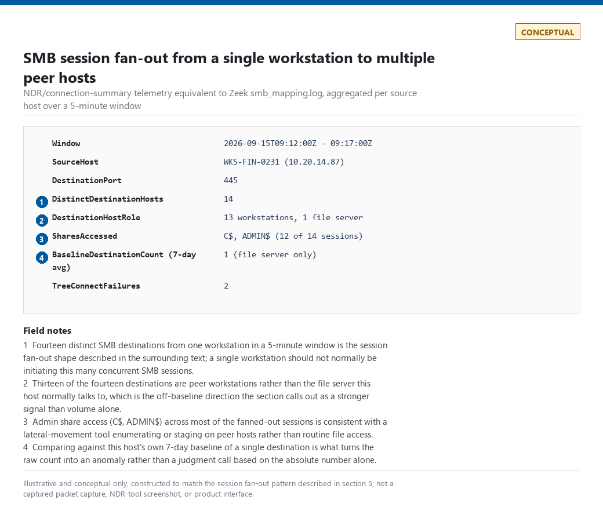
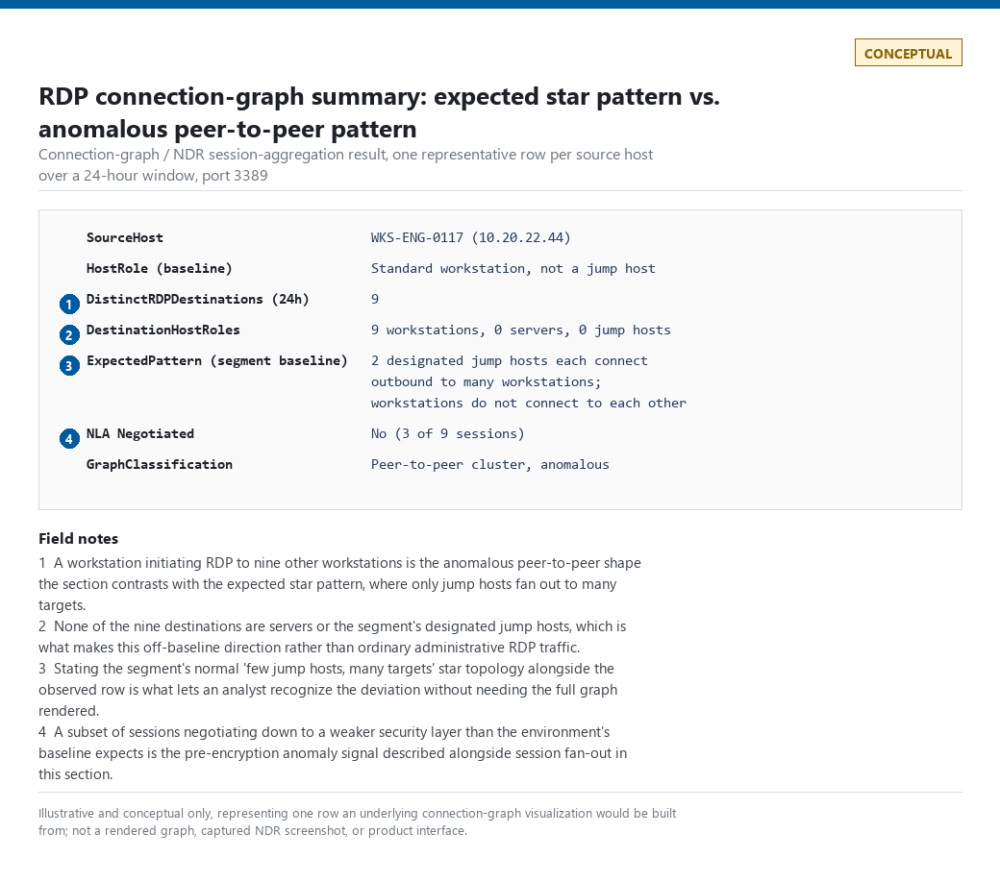
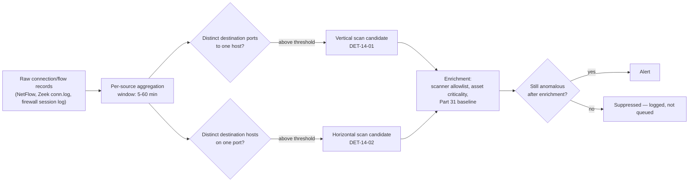
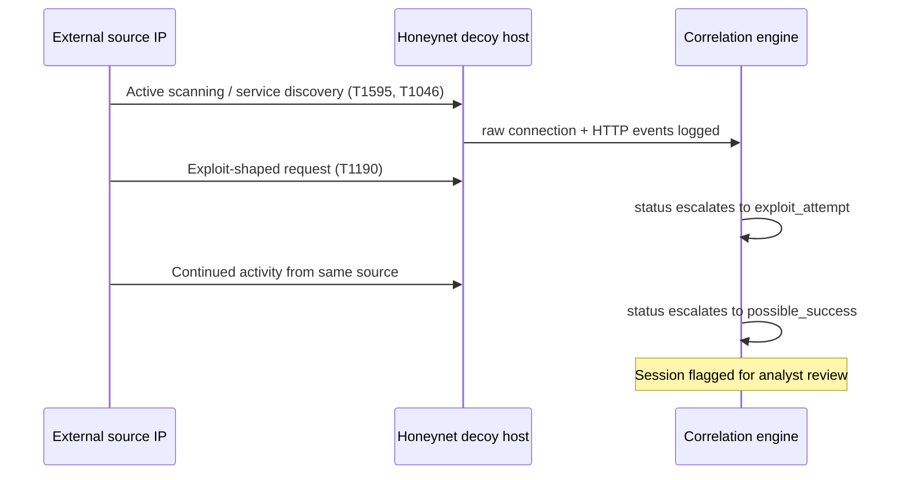
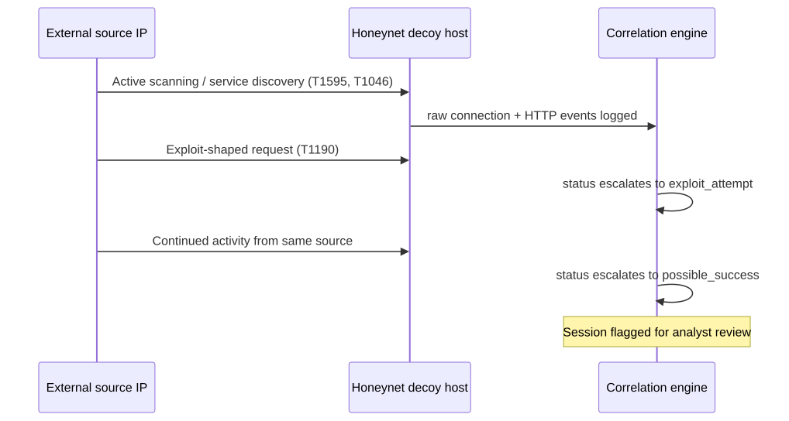

# Part 14 — Network Detection Engineering

## Why this part exists

**[CONCEPT]** This part is the analytic layer built on top of the network telemetry surveyed in Part 4 (DNS, proxy, firewall, NDR/Zeek/NetFlow) — it assumes that telemetry exists and asks what you build with it. It covers the traffic-pattern side of network abuse: port and service scanning, beaconing and command-and-control (C2) traffic, rare-destination scoring, TLS/encrypted-traffic signals, SMB/RDP/SSH abuse as seen from the wire rather than the endpoint log, Tor and proxy abuse, and exfiltration.

Two scope boundaries matter before anything else:

- **DNS tunnelling and domain-rarity scoring are excluded here and owned exclusively by Part 15.** Entropy scoring, first-seen/rare-domain logic, NXDOMAIN patterns, and DGA detection all live there. Where this part references "rare destination," it means a rare IP/ASN/port combination, not a rare domain name.
- **Windows-specific event IDs for SMB and RDP are not re-taught here.** Part 8 (native Windows Security/System events) and Part 11 (endpoint analytics) own that ground. This part covers what the same abuse looks like on the wire — connection fan-out, session-establishment patterns, protocol-negotiation behavior — which is visible even when host-level logging is absent, degraded, or the attacker has disabled it.

Several real evidence excerpts in this part come from the author's home-lab honeynet and vulnerability-scanner platform (containers referred to as CT103, CT104, CT108, CT113 below) — genuine captured telemetry, not synthetic samples, scrubbed of anything sensitive. Where the topic isn't covered by that evidence (packet-level SMB/RDP session captures), this part uses rendered CONCEPTUAL diagrams instead of inventing a screenshot (§5).

---

## 1. Port and service scanning: horizontal, vertical, and the difference that matters

**[CONCEPT]** A **vertical scan** is one source touching many ports on one destination — "what's open on this host." A **horizontal scan** is one source touching the same port (or small port set) across many destinations — "who on this network runs this service." The distinction matters because the two patterns get caught by different query shapes: vertical scan detection groups by (source, destination) and counts distinct destination ports; horizontal scan detection groups by (source, port) and counts distinct destination hosts. A rule written for one will not reliably catch the other — a horizontal scan against a single port produces a low, unremarkable distinct-port count per destination, and a vertical scan against a single host produces a distinct-host count of one.

A **vertical scan** against one target is what T1595.002 (Active Scanning: Vulnerability Scanning) usually looks like in practice; scanning across an address range is closer to T1595.001 (Active Scanning: Scanning IP Blocks). Both feed T1046 (Network Service Discovery) once the attacker has network visibility and is enumerating what's reachable.

### 1.1 A worked vertical-scan detection

**[DETECTION ENGINEER]** The following targets Splunk with Zeek `conn.log` (or an equivalent connection-summary source) mapped into the Network Traffic data model. It counts distinct destination ports per (source, destination) pair in a rolling window and alerts above a threshold.

```spl
CONCEPTUAL SAMPLE — invented field aliases for illustration; adjust to your actual conn.log field mapping
| tstats count from datamodel=Network_Traffic.All_Traffic
    where All_Traffic.action=allowed
    by All_Traffic.src, All_Traffic.dest, All_Traffic.dest_port
    span=10m
| stats dc(All_Traffic.dest_port) as distinct_ports
    values(All_Traffic.dest_port) as ports_touched
    by All_Traffic.src, All_Traffic.dest, _time
| where distinct_ports > 20
| lookup known_scanner_allowlist src as All_Traffic.src OUTPUT is_known_scanner
| where isnull(is_known_scanner)
```

**MITRE:** T1595.002 (Active Scanning: Vulnerability Scanning), T1046 (Network Service Discovery)

This detection's main limitation is the threshold itself — 20 distinct ports in a 10-minute window is arbitrary and needs tuning against your own network's baseline before deployment; treat it as a starting point, not a validated value.

> **False Positive Trap**
> The lab's own vulnerability-scanner platform (CT104, running a weekly `nmap` + CVE-matching pass against 15 internal hosts) produces exactly the fan-out pattern this rule targets — one real run (`scanner.log`, 2026-09-13 03:02–03:14, roughly 12 minutes) touched all 15 hosts from a single source and found zero to nine *open* ports per host. Don't confuse that "111 alerts" figure with this section's detection: it's CT104's own CVE/finding-count alert, from an unrelated pipeline, not a hit on the port-scan rule above — and "nine open ports" isn't the number this rule counts either. `nmap`'s normal profile probes on the order of a thousand common ports per host regardless of how many come back open, so the *distinct-destination-ports-touched* count this rule actually evaluates runs far higher than nine — comfortably past the 20-port threshold — even on a host where only nine of those probes found something listening. Every legitimate scanning tool in your environment — vulnerability scanners, asset-discovery tools, monitoring agents doing port checks — needs an explicit allowlist entry keyed on source IP or asset tag, not a raised threshold. Raising the threshold to accommodate a scanner that probes a thousand ports also raises the bar for an attacker doing the same reconnaissance from a compromised host that isn't on the allowlist.

> **Detection Autopsy — "any host touching 20+ distinct ports is scanning"**
>
> **The rule:** Fires on any source IP that connects to more than 20 distinct destination ports on a single host within a 10-minute window.
>
> **Why it shipped:** It's the textbook definition of a vertical scan, it's cheap to compute from connection-summary data alone, and it needed no new telemetry — every environment with any flow logging already has the fields this needs.
>
> **How it failed:** It fired on the internal vulnerability scanner every single week, and it fired on legitimate multi-service applications — a monitoring dashboard polling health-check endpoints across a microservice fleet touches a comparable number of ports on the same host in a similar window, with no attacker involved. Within a month the rule had a 90%+ false-positive rate and the team started ignoring it.
>
> **The fix:** Split the population before scoring it. Maintain an explicit allowlist of known scanner/monitoring source IPs (checked and reviewed on a schedule, not a one-time entry), and separately baseline each *non-allowlisted* source's normal port-touch behavior (Part 31) so the threshold is relative to what that source has done before, not a single global number applied to every host in the environment equally.

> **Detection Test**
> **Setup:** Lab network segment with flow/connection logging enabled on at least one host acting as the "scanner," and a single target host reachable on multiple ports.
> **Action:** `nmap -sS -p 1-100 <target-host-ip>` from the scanner host.
> **Expected result:** One connection-summary record per (scanner IP, target IP, destination port) combination for each of the 100 probed ports; the vertical-scan query above should return a `distinct_ports` value at or near 100 for that (source, destination) pair within the same 10-minute bucket, regardless of how many of those ports actually respond as open — this is the field this rule depends on missing entirely if your telemetry source only logs *successful* (open-port) connections rather than every attempt, which under-counts distinct_ports and can push a real scan below threshold.

**Silent-failure check:** This rule depends on the CIM mapping for `All_Traffic.action`, `All_Traffic.dest_port`, and `All_Traffic.src` staying intact under `datamodel=Network_Traffic.All_Traffic`. A Technology Add-on upgrade or a Zeek log-format change that shifts one of those fields breaks the mapping silently — `tstats` returns fewer rows or none at all, with no ingest error — and a rule that used to fire on CT104's weekly scan can go quiet for a month before anyone notices the mapping broke rather than the scanning stopped (the same failure mode Part 26 §1.2's Splunk field-extraction Detection Autopsy walks through in detail). Monitor the raw event count feeding this data model node on a schedule, independently of this rule's own alert count; re-running the Detection Test above monthly, not just at deployment, is the cheapest way to catch the regression before a real scan slips through unnoticed.

### 1.2 A worked horizontal-scan detection

**[DETECTION ENGINEER]** Same telemetry, different grouping — this one counts distinct destination hosts per (source, port) pair, which is the shape a "who's running SSH on this subnet" or "who's got 445 open" sweep produces.

```kql
// CONCEPTUAL SAMPLE — illustrative KQL against a generic network-session table;
// field names approximate DeviceNetworkEvents / CommonSecurityLog shapes, not a literal schema
DeviceNetworkEvents
| where ActionType == "ConnectionSuccess" or ActionType == "ConnectionAttempted"
| summarize DistinctHosts = dcount(RemoteIP) by LocalIP, RemotePort, bin(Timestamp, 10m)
| where DistinctHosts > 15
| join kind=leftanti (KnownScannerAssets) on $left.LocalIP == $right.AssetIP
```

**MITRE:** T1595.001 (Active Scanning: Scanning IP Blocks), T1046 (Network Service Discovery)

The framing limitation here is the same as above — the 15-host threshold has no empirical basis until it's validated against your own subnet sizes and legitimate multi-host tooling (patch-management agents, backup software, and SSO health checks all sweep whole subnets on a single port routinely).

> **False Positive Trap**
> A forward web proxy, a NAT/CGNAT egress gateway, or a DNS resolver is a single `LocalIP` that legitimately talks to dozens or hundreds of distinct `RemoteIP`s on the same port (443, 53) within any 10-minute window, as a normal byproduct of aggregating many users' or many devices' traffic behind one address — not a scan, and far above the 15-host threshold on a daily basis. This is a bigger volume driver than a dedicated scanning tool, because it fires continuously rather than on a weekly schedule: expect an unfiltered deployment of this rule to alert on every proxy, NAT gateway, and resolver `LocalIP` in the environment on essentially every run, a false-positive rate near 100% until those addresses are allowlisted — at which point the residual rate depends entirely on how completely that list is maintained, not on anything the query itself improves. Allowlist every known proxy, NAT gateway, and resolver `LocalIP` explicitly, and treat any (`LocalIP`, port) pair that isn't on a maintained list of aggregation points as the only population this rule should score.

> **Detection Test**
> **Setup:** Lab network segment with flow/connection logging enabled on at least one host acting as the "scanner."
> **Action:** `nmap -sS -p 22,80,443,3389,445 192.168.1.0/24`
> **Expected result:** One connection-summary record per (scanner IP, target IP, port) combination for every live host in the range; the horizontal-scan query above should return a `DistinctHosts` value at or near the number of responsive hosts on the subnet for at least one of the scanned ports within the same 10-minute bin — this depends on the source table logging attempted connections and not only successful ones; if `ActionType` values in your environment never populate `"ConnectionAttempted"` for closed-port probes, a sweep against mostly-closed ports undercounts `DistinctHosts` the same way DET-14-01 undercounts `distinct_ports` under equivalent telemetry loss.

**Silent-failure check:** This depends on the `DeviceNetworkEvents`-equivalent table continuing to ingest and on `RemoteIP`/`RemotePort`/`LocalIP` keeping their current names and types across a connector or schema update — a renamed or retyped field returns null for `dcount(RemoteIP)`, and the query still runs without error, just against nothing. Track the underlying table's row count (or a simple hourly heartbeat count of `ConnectionSuccess` events) independently of this rule's alert volume; a horizontal-scan rule with zero alerts for weeks reads identically to a broken one unless something else is watching the input.

> **Blind Spot**
> Both scan detections in this section group by a single source and score within one fixed window (10 minutes), so both are defeated the same way: spread the same total port/host coverage across enough source IPs (a small botnet, one probe per bot) or slow it down enough that no single 10-minute bucket ever crosses the threshold (1 port every 40 seconds keeps a vertical scan at 15 ports per 10-minute window indefinitely, while still covering hundreds of ports over an hour). Neither query, as written, ever accumulates that activity into one row it can threshold against — a longer lookback with a lower per-bucket floor, or session-level aggregation keyed on source ASN/subnet rather than single IP, is required to catch either evasion, and neither is built here.

### 1.3 Fingerprinting the scanner itself: banners, timing, and user-agent

**[THREAT HUNTER]** Distinct-port and distinct-host counts tell you *that* something is scanning; they don't tell you *what* is scanning or how automated it is. Two cheap secondary signals help here: connection timing (a scripted scanner's inter-connection intervals cluster tightly; a human doing manual reconnaissance doesn't) and, at the application layer, the client-identification string the tool sends — a User-Agent header for HTTP, a version-string banner for SSH.

A real, genuinely internet-sourced example from the lab's honeynet (CT103, an HTTP decoy) shows this well. Alongside real attacker traffic, the log also captured internal fingerprinting activity from the lab's own vulnerability scanner deliberately walking through a set of HTTP client libraries against the same decoy path in under 1 second:

```text
REAL LAB EXAMPLE — CT103 honeynet http_events, captured 2026-09-15, internal
fingerprint sweep from the lab's own CT104 vulnscan host (192.168.1.96):
2026-09-09T17:06:46.072973  192.168.1.96  GET /       PHP/
2026-09-09T17:06:46.284785  192.168.1.96  GET /       Python-urllib/2.5
2026-09-09T17:06:46.482027  192.168.1.96  GET /admin  Mozilla/5.0 (compatible; Nmap Scripting Engine; ...)
2026-09-09T17:06:46.657467  192.168.1.96  GET /       GT::WWW
2026-09-09T17:06:46.782759  192.168.1.96  GET /       Snoopy
2026-09-09T17:06:46.924561  192.168.1.96  GET /       MFC_Tear_Sample
2026-09-09T17:06:47.091632  192.168.1.96  GET /       HTTP::Lite
```

Seven distinct client-library signatures against the decoy's root path (one of them, the Nmap probe, against `/admin` instead) in a little over 1 second is not a human browsing; it's an automated fingerprint sweep — and the raw capture has an eighth request a fraction of a second later, a second `Nmap Scripting Engine` hit against `/admin`, that isn't shown above. The same honeynet, in the same capture window, also logged genuine external internet traffic from two clearly automated tools: a research/attack-surface-mapping bot identifying itself as `Infrawatch/1.0` probing `/`, `/favicon.ico`, `/mcp`, `/mcp/`, `/api/mcp`, `/sse`, and `/zc` from seven different source IPs within about 21 seconds — consistent with someone mapping exposed Model Context Protocol server endpoints across the internet — and a `ModatScanner/1.2` internet-wide recon bot requesting `/` and `/favicon.ico` from the same source IP less than a second apart.

> **Hunter's Note**
> User-Agent strings are the cheapest, laziest pivot in your recon-hunting toolkit — and exactly because they're cheap, they're also the easiest thing for an attacker to fake. Use a distinctive User-Agent (`curl`, `python-requests`, a known scanner signature) as a starting *filter* to find candidate automated traffic fast, never as a standalone verdict. The honeynet evidence above also captured plain `curl/7.74.0` and `curl/7.64.1` requests from a real internet source — worth remembering before you build a rule around that observation (see the Detection Autopsy below).

---

## 2. Beaconing and command-and-control traffic patterns

**[CONCEPT]** Beaconing is a compromised host checking in with an external controller on a roughly periodic interval — the network signature of most C2 frameworks, regardless of what protocol carries it. The core signal is **regularity**: legitimate application traffic (browsing, API polling with jittered retry logic, streaming) tends to have irregular or workload-driven timing; a beacon implant checks in on a schedule the malware author picked, often with light jitter added specifically to defeat naive fixed-interval detection.

### 2.1 A worked beaconing detection

**[DETECTION ENGINEER]** This targets a SIEM with connection-summary logs (Zeek `conn.log`, firewall session logs, or proxy logs) and scores the *coefficient of variation* of inter-connection intervals for each (source, destination) pair — a low coefficient of variation means the intervals are unusually consistent, which is the beaconing tell.

```spl
CONCEPTUAL SAMPLE — illustrative only; the delta/stdev logic is directionally correct
but has not been benchmarked against production beacon traffic
| tstats count from datamodel=Network_Traffic.All_Traffic
    where All_Traffic.dest!=<internal_cidr>
    by All_Traffic.src, All_Traffic.dest, _time
    span=1m
// explicit sort required: streamstats computes delta from event order in the
// pipeline, not from _time itself -- late-arriving or out-of-order-indexed
// events (multiple indexers, a lagging forwarder) will otherwise produce
// negative or nonsensical deltas that silently corrupt avg/stdev below
| sort 0 All_Traffic.src, All_Traffic.dest, _time
| streamstats current=f last(_time) as prev_time by All_Traffic.src, All_Traffic.dest
| eval delta=_time-prev_time
| stats count as connections avg(delta) as avg_interval stdev(delta) as stdev_interval
    by All_Traffic.src, All_Traffic.dest
| eval cv=stdev_interval/avg_interval
| where connections > 20 AND cv < 0.15 AND avg_interval > 30 AND avg_interval < 3600
```

**MITRE:** T1071.001 (Application Layer Protocol: Web Protocols), T1573 (Encrypted Channel), T1008 (Fallback Channels)

The threshold combination (more than 20 connections, coefficient of variation under 0.15, interval between 30 seconds and 1 hour) is illustrative and untested against real beacon traffic — see the falsifiability note below before trusting these exact numbers. There's also a resolution problem baked into the query itself: the initial `tstats` bucket is `span=1m`, so two connections landing in the same one-minute bucket produce a delta of 0 and two connections one bucket apart produce a delta of roughly 60 seconds regardless of their real spacing — the bucketing quantizes any interval shorter than the span into multiples of it. That's fine for the 1-hour end of the stated range but actively corrupts the coefficient-of-variation calculation for anything near the 30-second floor this query claims to support. Either narrow the span to a few seconds (at the cost of a much larger intermediate result set) or treat 30-second-interval beacon detection as out of scope for this specific query shape and raise the practical floor to several minutes.

> **What Would Change My Mind**
> This detection assumes real C2 jitter still leaves inter-connection intervals tight enough to produce a coefficient of variation under roughly 0.15. Modern C2 frameworks increasingly support randomized jitter ranges of 30–50% around the base interval specifically to defeat this kind of statistical test. If a red-team exercise using a current-generation C2 framework with default jitter settings evaded this rule, the confidence in coefficient-of-variation-based beacon detection alone would need to drop from a standing detection to a hunting technique (Part 34) requiring human review of borderline cases, not an automated alert.

> **Blind Spot**
> Coefficient-of-variation scoring assumes the beacon's *interval* is what's regular, even if payload size and byte counts vary. It does not see beacon traffic deliberately blended into legitimate high-frequency background noise — a C2 channel riding on a legitimate, frequently-polled SaaS API (webhook relays, chat-app APIs, cloud-storage sync clients) inherits that service's own irregular, workload-driven timing and produces a high coefficient of variation indistinguishable from normal application traffic. Domain/destination reputation and payload-size analysis have to carry the weight this timing signal can't.

> **False Positive Trap**
> The single biggest source of noise for this rule in practice isn't malware — it's your own infrastructure. Cron-driven syncs, monitoring-agent heartbeats, license-check phone-homes, and update checkers all connect to a fixed external endpoint on a fixed schedule, which is precisely what a low coefficient of variation measures. Expect this rule to surface a short, stable list of legitimate internal automation the first time it runs, not a clean hit list. The fix: maintain an allowlist of known scheduled-task/agent destinations (keyed on destination, not source, since many hosts share the same update-checker), and route anything not on it to analyst review rather than to a raised threshold — a raised threshold makes room for a real beacon in the same interval range.

> **Detection Test**
> **Setup:** Lab host with outbound connectivity to a destination you control and can log connections from.
> **Action:** A cron entry (or a small script) issuing `curl -s https://<test-listener>/checkin` every 60 seconds for at least 25 minutes, to clear the `connections > 20` floor.
> **Expected result:** The query should return a `cv` well under 0.15 and an `avg_interval` near 60 for that (source, destination) pair once 20+ connections have accumulated — confirming the query actually flags a fixed-interval check-in before you rely on it against real traffic.

**Silent-failure check:** The explicit `sort` before `streamstats` this query depends on (see the comment in the SPL itself) is exactly the kind of step a later well-meaning edit removes to save runtime — at which point `delta` starts including negative or nonsensical values, `stdev_interval` and `cv` degrade quietly rather than erroring, and the rule keeps running and keeps returning *some* results, just wrong ones. Re-running the Detection Test's fixed-interval check-in on a schedule (not just once at deployment) and confirming `cv` still lands under 0.15 is the cheapest way to catch that regression, an upstream data-model field-mapping break, or an accelerated-datamodel lag before a real beacon slips through unnoticed.

### 2.2 A real worked case study: reading a correlated honeynet attack session

**[THREAT HUNTER]** The lab's honeynet platform (CT103) doesn't just log raw connections — it runs its own correlation pass, grouping raw SSH/HTTP/network events into sessions and tagging them with MITRE technique IDs and a status that escalates as the session looks more dangerous: `recon` → `probe` → `exploit_attempt` → `possible_success` → `confirmed_postexploit`. A genuine capture from 2026-09-15 shows this pipeline working end to end against internal decoy addresses (`10.99.99.x`):

```text
REAL LAB EXAMPLE — CT103 attack_sessions table, captured 2026-09-15
session d48b795e...  src 16.5.0.236       target 10.99.99.10  status: possible_success
    MITRE: T1595, T1046, T1083, T1190
    notes: exploit attempt observed, followed by continued activity from the
    same source -- worth manual review
session be97051a...  src 64.62.156.192    target 10.99.99.10  status: possible_success
    MITRE: T1595, T1046, T1083, T1190
    duration: 2026-09-15T00:01:56Z -> 2026-09-15T00:07:06Z (5m10s of continued activity)
```

Reading this as a detection engineer rather than just a log: `possible_success` isn't a single event, it's a *sequence* — T1595 (Active Scanning) and T1046 (Network Service Discovery) establish that the source is probing, an exploit-shaped request against the web-facing decoy — T1190 (Exploit Public-Facing Application) — crosses the line from recon to attack, and T1083 (File and Directory Discovery) plus *continued* activity from the same source after the exploit attempt is what separates "probably just scanned and moved on" from "worth a human looking at this today." No single one of those four techniques, alone, would justify the escalated status — it's the correlation across time from one source IP that does.

**MITRE:** T1595 (Active Scanning), T1046 (Network Service Discovery), T1083 (File and Directory Discovery), T1190 (Exploit Public-Facing Application)

> **Hunter's Note**
> When a correlation engine hands you a "possible success" verdict, the highest-value first pivot is duration, not source reputation — a source that touched the target once and vanished is much more likely to be a one-shot mass scanner than a source with 5 or 10 minutes of continued activity after the exploit attempt. Sort your review queue by post-exploit dwell time within the session, not by source IP or alphabetically by session ID.

---

## 3. Rare destinations, without the DNS layer

**[CONCEPT]** A rare-destination score at the network layer asks "has this source, or this class of source, ever talked to this IP/ASN/port combination before" — the same statistical shape as domain rarity (Part 15), applied to the connection tuple instead of the domain name. This part owns that IP/ASN-level version; domain-name rarity, entropy, and first-seen-subdomain scoring stay in Part 15 exclusively, even though both ultimately feed the same kind of baseline (Part 31) and the same kind of risk-scoring model (Part 33).

**[DETECTION ENGINEER]** In practice, rare-destination scoring is rarely deployed as a standalone alert — the false-positive rate on "first time this host has talked to this IP" alone is unworkable at scale, since new destinations are constantly and legitimately created (new SaaS vendor, new CDN edge, a partner's changed IP). It earns its value as an *enrichment* field (Part 6, §"Enrichment") attached to other signals: a beaconing candidate to a destination the source has talked to for six months is a much weaker case than a beaconing candidate to a destination first seen an hour ago.

> **Engineering Reality**
> Sampled NetFlow (1-in-N packet sampling, common on high-throughput core switches to control collector load) silently drops a meaningful fraction of short, low-volume connections — exactly the shape of a single beacon check-in or a brief scan probe. A rare-destination baseline built on sampled flow data will under-count first contacts and can show a destination as "seen before" purely because the *previous* connection to it happened to survive sampling while this one and several others didn't. Verify your flow-collection sampling rate before trusting a rare-destination score's precision, and prefer full-capture sources (Zeek, firewall session logs) for this specific analytic where the connection volume allows it.

---

## 4. TLS and encrypted-traffic signals

**[CONCEPT]** Most inbound and outbound traffic that matters is now encrypted, which means detection has to work from the metadata the encryption doesn't hide: certificate properties (self-signed, freshly issued, mismatched subject/SAN), TLS client fingerprints (JA3/JA3S-style hashes of the ClientHello's cipher suite and extension order), SNI (Server Name Indication) values, and protocol-negotiation behavior itself — whether the traffic on a given port is actually the protocol the port number implies.

### 4.1 A worked detection: protocol confusion on the wire

**[DETECTION ENGINEER]** A genuine internet-sourced capture from the honeynet's exposed decoy web server (CT113) shows exactly this signal. A source that had just issued a normal HTTP request followed it, minutes later, with raw TLS ClientHello bytes sent to the same plaintext HTTP port:

```text
REAL LAB EXAMPLE — CT113 Apache access.log, captured 2026-09-15, source 3.131.220.121
(referer "visionheight.com/scan" -- a scanning-service signature):
07:37:54  GET / HTTP/1.1                 200  (normal request)
07:39:25  GET / HTTP/1.1                 200  (normal request, repeated)
07:41:19  "\x16\x03\x01\x01"              400  (raw TLS ClientHello bytes sent to the plain-HTTP port)
07:42:44  "\x16\x03\x01"                  400
```

`\x16\x03\x01` is the TLS record-layer header for a Handshake record using TLS 1.0's legacy version field (still used in the ClientHello for backward compatibility even by modern TLS 1.2/1.3 clients) — in plain terms, "is this actually a TLS port," sent by a mass internet scanner checking whether the service on this port will silently accept an encrypted handshake regardless of what port number implies. The web server correctly rejects it with an HTTP 400, but the *attempt itself* is the useful signal: a legitimate browser or API client never probes a port with a mismatched protocol.

```suricata
alert tcp any any -> $HOME_NET [80,8080] (msg:"Protocol confusion - TLS ClientHello sent to HTTP port"; \
    content:"|16 03|"; offset:0; depth:2; content:"|01|"; offset:5; depth:1; \
    flow:to_server,established; classtype:protocol-command-decode; \
    sid:9014001; rev:1;)
```

This targets Suricata inline with a plaintext HTTP listener; its main limitation is that it only catches the confusion when it happens on a port your Suricata deployment is actually inspecting — it says nothing about the reverse case (real TLS traffic sent to a port expecting plaintext), which needs a separate rule matching on the absence of an expected banner instead.

**MITRE:** T1595.002 (Active Scanning: Vulnerability Scanning), T1046 (Network Service Discovery)

> **False Positive Trap**
> `nmap`'s service/version detection (`-sV`, on by default in many scan profiles) speculatively tries an SSL/TLS handshake against ports it can't otherwise identify, as part of normal fingerprinting — not just against known-HTTPS ports. An internal vulnerability scanner running a full service-detection sweep will trip this exact signature against every ambiguous port it touches, which is a much higher volume than an external attacker doing the same probe once. Allowlist your own scanner's source IP the same way §1.1's vertical-scan rule does; don't drop the rule's specificity to compensate.

> **Blind Spot**
> TLS 1.3 encrypts most of the handshake's negotiation content that TLS 1.2 left in the clear, and encrypted ClientHello (ECH) — increasingly deployed by major CDNs — additionally hides the SNI field itself. Detections built around SNI matching or plaintext certificate inspection at the network layer will progressively lose visibility as ECH adoption grows; JA3-style fingerprinting of the *unencrypted* portions of the handshake (record layer, extension presence/ordering before encryption applies) is more durable against this trend than SNI-based rules, but neither survives a fully encrypted handshake indefinitely.

> **Detection Test**
> **Setup:** Lab host with a listener on TCP port 80 serving plain HTTP, and a packet-crafting tool (`scapy`, `hping3`, or a raw `openssl s_client` pointed at the wrong port).
> **Action:** `echo -n | openssl s_client -connect <lab-host>:80` (forces a TLS ClientHello to be sent to the HTTP port)
> **Expected result:** The web server logs a malformed-request entry (HTTP 400 or equivalent) with a request line containing the raw `\x16\x03\x01` byte sequence; the Suricata rule above should alert on the same connection.

**Silent-failure check:** A ruleset reload that disables `sid:9014001` — a common side effect of a vendor ruleset merge, or a later `suppress`/`threshold` rule added on top of it — produces no error; Suricata simply stops evaluating it. Check the rule's own hit counter in `eve.json`'s `stats` event (or `suricatasc -c dump-counters`) on a schedule, and confirm the sid is still enabled after every ruleset update. Re-running the Detection Test above periodically is the only way to tell "no attacker tried this" apart from "the rule stopped running" when both look identical from the alert queue.

---

## 5. SMB and RDP abuse: what's visible from the wire

**[CONCEPT]** Part 8 and Part 11 own the Windows-event-log side of SMB (T1021.002, SMB/Windows Admin Shares) and RDP (T1021.001, Remote Desktop Protocol) lateral movement in field-by-field depth. This section covers the same abuse from a network-only vantage point — useful specifically because it stays visible even when endpoint logging is disabled, tampered with, or simply not deployed on every host, which is common on legacy systems, IoT/OT segments, and unmanaged devices.

**[DETECTION ENGINEER]** From connection-summary or full-packet telemetry alone (Zeek's `smb_files.log`/`smb_mapping.log`, or firewall/NDR session logs), the durable signals are:

- **Session fan-out** — one source host establishing SMB (port 445 / legacy 139) or RDP (port 3389) sessions to an unusual number of distinct destination hosts in a short window, the same horizontal-scan shape from §1 applied specifically to these two lateral-movement protocols.
- **Off-baseline direction** — a workstation *initiating* SMB/RDP sessions to other workstations, when your environment's normal pattern is workstations only ever receiving RDP from a small set of jump hosts and only ever initiating SMB to file servers, not to each other.
- **Authentication-negotiation anomalies visible pre-encryption** — RDP's initial connection-request PDU exposes whether Network Level Authentication (NLA) was offered and accepted before the encrypted session establishes; a session that negotiates down to a weaker/legacy security layer than your baseline expects is worth flagging even without decrypting anything past that point.


**Figure — SMB session fan-out from a single workstation.** *CONCEPTUAL — illustrative field breakdown; not a captured screenshot.* Would support the "session fan-out" bullet above with a concrete example rather than a description alone.


**Figure — RDP connection-graph pattern, expected star vs. anomalous peer-to-peer.** *CONCEPTUAL — illustrative field breakdown; not a captured screenshot.* Would support the "off-baseline direction" bullet with a rendered example instead of a text description alone.

**MITRE:** T1021.001 (Remote Desktop Protocol), T1021.002 (SMB/Windows Admin Shares), T1046 (Network Service Discovery)

---

## 6. SSH abuse: protocol scanning, downgrade probes, and brute force

**[CONCEPT]** SSH abuse splits into two layers this book keeps separate: the *authentication* side (username/password guessing against a real login prompt) belongs primarily to Part 12's identity/authentication analytics once the traffic reaches an IdP-adjacent or host-auth log; this part owns the *network/protocol* side — connection-rate patterns, protocol-version and algorithm-negotiation probing, and the reconnaissance that typically precedes an actual credential-guessing attempt.

### 6.1 A real, worked example: legacy protocol and algorithm probing

**[DETECTION ENGINEER]** A genuine capture from the lab's honeynet edge host (CT108) shows the lab's own vulnerability scanner (192.168.1.96) running an SSH protocol/cipher enumeration sweep — not malicious in this instance, but the exact log signature a legacy-algorithm-probe detection needs to fire on regardless of who's producing it:

```text
REAL LAB EXAMPLE — CT108 honeynet-edge sshd journal, captured 2026-09-15, source
192.168.1.96 (the lab's own vulnerability scanner):
16:21:03  Unable to negotiate: no matching key exchange method found. Their offer: diffie-hellman-group1-sha1 [preauth]
16:21:03  Unable to negotiate: no matching host key type found. Their offer: ssh-rsa [preauth]
16:21:04  Unable to negotiate: no matching host key type found. Their offer: ssh-dss [preauth]
16:21:03  error: Protocol major versions differ: 2 vs. 1
16:21:03  banner exchange: could not read protocol version
16:21:04  Unable to negotiate: no matching host key type found. Their offer: ecdsa-sha2-nistp384 [preauth]
```

The six negotiation-failure lines above are a trimmed excerpt; the full journal entry for this sweep runs from 16:19:33 to 16:22:20 (about 2 minutes 40 seconds) and contains 13 distinct connections from the same source, 10 of which carry a specific algorithm-mismatch or protocol-version reason — an SSHv1 banner probe, `diffie-hellman-group1-sha1` (deprecated, weak), `ssh-rsa` and `ssh-dss` host-key offers, and multiple elliptic-curve variants — with the tightest cluster of six of those landing within about 2 seconds of each other (16:21:03–16:21:05). A legitimate SSH client tries one negotiation configuration per connection attempt; this shape (many different algorithm combinations, same source, same target, a burst of connections seconds apart repeated over a multi-minute sweep) is what an automated protocol/cipher scanner looks like regardless of intent.

```spl
CONCEPTUAL SAMPLE — illustrative; assumes sshd auth logs (syslog or journald) are
ingested with the raw message field searchable
sourcetype=syslog OR sourcetype=journald
    ("Unable to negotiate" OR "Protocol major versions differ" OR "banner exchange")
| rex field=_raw "(?:from|with|by) (?<src_ip>[\d\.]+)"
| bucket _time span=2m
| stats count as negotiation_failures dc(_raw) as distinct_offers by src_ip, _time
| where negotiation_failures > 5
```

**MITRE:** T1595.002 (Active Scanning: Vulnerability Scanning), T1046 (Network Service Discovery)

Two gaps in this query, not one: first, it depends on the exact log-message text OpenSSH emits, which has changed wording across major versions before and will again — treat the regex as version-pinned to whatever OpenSSH build produced your training data, and re-validate it after any SSH server upgrade. Second, the source IP isn't in a consistent position across message types — real OpenSSH output uses "Unable to negotiate **with** `<ip>`," "banner exchange: Connection **from** `<ip>`," and "Connection closed **by** `<ip>`," which is why the regex above alternates on all three; an earlier version matching only "from" would silently mis-group most `Unable to negotiate` events under an empty `src_ip`. Even with all three alternatives covered, `error: Protocol major versions differ: 2 vs. 1` carries no IP at all in OpenSSH's own output — attributing it to a source requires joining on the process ID shared with the adjacent `banner exchange` line for the same connection, which this single-line regex can't do; treat that line type as context for the cluster rather than as independently attributable.

> **False Positive Trap**
> Legacy IoT devices, network appliances, and old backup/monitoring agents that still ship with an outdated SSH client are a legitimate (if infrequent) source of the exact same negotiation failures this rule targets — a device offering only `ssh-rsa` or `diffie-hellman-group1-sha1` because its firmware was never updated looks identical, in this log signature, to a scanner probing for the same weak algorithms. Unlike the vulnerability-scanner case above, these devices usually connect once and stop, so the `negotiation_failures > 5` threshold filters most of them out on its own; the residual risk is a legacy device that retries aggressively on failure, which needs the same source-IP allowlist treatment as the scanner.

> **Detection Test**
> **Setup:** Lab host running `sshd` with logging to syslog/journald, and a second host that can issue outbound SSH connection attempts with explicitly forced algorithms.
> **Action:** `for a in diffie-hellman-group1-sha1 ssh-rsa ssh-dss; do ssh -o KexAlgorithms=+$a -o HostKeyAlgorithms=+$a -o StrictHostKeyChecking=no test@<target> 2>&1; done` (forces several legacy/deprecated algorithm offers in quick succession against one target).
> **Expected result:** Multiple `Unable to negotiate` entries in the target's sshd journal within the same few seconds, one per forced algorithm, all from the test host's source IP — the SPL query above should return `negotiation_failures` above 5 for that `src_ip` in the same 2-minute bucket.

**Silent-failure check:** This is the same failure mode as Part 26 §1.2's own Detection Autopsy about a Splunk SSH-brute-force rule that "went silent after a TA upgrade": an OpenSSH or syslog/journald-forwarder version bump that shifts the negotiation-failure message wording (already flagged above as a known risk) doesn't error — it just stops matching, and `negotiation_failures` quietly drops to zero for every host behind that log source. Track the raw match count for the underlying search on a schedule, independently of the `> 5` alert threshold, and re-run the Detection Test after every `sshd` or log-forwarder version upgrade rather than only at initial deployment; a rule with zero hits for a month is otherwise indistinguishable from "nobody probed us."

> **Blind Spot**
> This rule only sees an attacker who *fails* negotiation — it depends on the client offering an algorithm the server rejects, repeatedly, in a burst. A single connection attempt from a current OpenSSH client using default modern algorithms negotiates successfully on the first try, produces zero `Unable to negotiate` lines, and is entirely invisible to this detection — including a targeted attacker who already knows (from other recon, or simply from trying once) what the server accepts and never needs to probe. This rule catches automated, careless multi-algorithm sweeps, not a single well-informed connection attempt.

### 6.2 Connection-rate bursts, independent of authentication outcome

**[THREAT HUNTER]** Separate from protocol negotiation, raw connection *rate* to the SSH port is itself a network-layer signal, visible before any authentication attempt even completes. A genuine capture from the lab's own vulnerability-scanner host (CT104) shows this pattern clearly — dozens of SSH connection attempts per minute from a single internal source, sustained over hours:

```text
REAL LAB EXAMPLE — CT104 vulnscan /var/log/btmp via `lastb`, captured 2026-09-15;
source 192.168.1.126, a real device on the lab network (not an external attacker
in this instance, but a genuine example of the burst pattern this rule targets):
01:01  admin x5
01:02  root x17
01:03  root x16
01:04  root x17
01:05  root x18
01:06  root x8
btmp begins 2026-09-13 20:31:08 -- window covers roughly 20:31 to 01:17,
dozens of attempts per minute sustained across that span
```

**MITRE:** T1110 (Brute Force), T1046 (Network Service Discovery)

This particular capture is genuinely internal and not credential-guessing against a real target of value, but it is a strong stand-in for what the pattern looks like on the wire: the connection-rate signal alone — independent of whether any given attempt reaches the authentication stage or what the outcome is — is enough to build a threshold rule on, and it stays available even for encrypted-payload traffic where you can't see which username or key was tried.

> **Hunter's Note**
> When a connection-rate burst and a legacy-algorithm-probe pattern both hit the same source/destination pair close together in time, treat that as one investigation, not two alerts — an attacker doing recon against an SSH service commonly probes protocol/cipher support first (cheap, doesn't need valid credentials) and then pivots to credential guessing once they know what the server will accept. Pivoting on source IP across both signal types, within a short correlation window, surfaces that sequence a lot faster than working each alert type's queue independently.

> **Blind Spot**
> None of the network-layer signals in this section can distinguish a scanner that's purely fingerprinting (never tries a real credential) from one that immediately follows up with a credential-guessing attempt — that distinction requires the authentication-outcome telemetry Part 12 owns. A network-only SOC with no host-auth-log correlation will see the recon and have to guess at intent; pairing this section's signals with Part 12's failed/successful-logon analytics closes that gap.

---

## 7. Tor and proxy abuse

**[CONCEPT]** Tor exit-node traffic and open/anonymizing proxy abuse both aim at the same defensive problem: an attacker's real source IP is hidden behind infrastructure designed specifically for that purpose. Tor maps to T1090.003 (Proxy: Multi-hop Proxy); simpler single-hop proxy abuse (open HTTP/SOCKS proxies, compromised residential devices resold as proxy exit points) maps to the broader T1090 (Proxy).

**[DETECTION ENGINEER]** Two practical approaches, used together rather than alone:

- **Reputation-list matching against known Tor exit-node IP ranges.** The Tor Project publishes a current exit-node list; matching egress destinations (or, for inbound traffic, source IPs) against it is cheap and precise for *known* nodes, but the list changes constantly and any list-based approach has a built-in staleness window — an exit node that rotated out an hour ago still matches a list refreshed daily.
- **Behavioral proxy detection**, for the abuse a reputation list can't catch: an ASN classified as residential/consumer suddenly generating access patterns consistent with automated tooling (consistent timing, sequential resource enumeration, no referrer/no typical browser fingerprint) is a stronger signal for "this is a resold residential proxy" than any static list, because the abuse infrastructure itself — the compromised home router or IoT device — was never on any watchlist to begin with.

**MITRE:** T1090 (Proxy), T1090.003 (Proxy: Multi-hop Proxy)

> **Engineering Reality**
> Tor exit-node and commercial-VPN IP reputation feeds age out faster than most teams' update schedules assume — daily refresh is a reasonable floor, not a comfortable margin, and a feed that updates weekly will silently miss a meaningful fraction of currently active nodes at any given moment. If you're not tracking feed freshness as its own metric, you don't actually know your Tor-detection coverage; you know your Tor-detection coverage *as of the last successful update job*, which is a different and unmeasured number.

> **Blind Spot**
> Staleness isn't the only failure mode — some Tor traffic is architecturally unlistable, not just recently rotated. Tor bridges and pluggable transports (obfs4, meek, Snowflake) exist specifically so a client can reach the Tor network without connecting to any publicly enumerable relay; the Tor Project deliberately does not publish a complete bridge list, by design, to keep them usable in censored networks. No refresh cadence, however fast, puts bridge-relay IPs on a reputation feed that was never meant to contain them. The behavioral approach in this section's second bullet — and traffic-shape signals like obfs4's own distinctive handshake — are the only lever against this traffic; a reputation list alone has a hard ceiling on what it can ever see here, regardless of update frequency.

---

## 8. Data exfiltration signals

**[CONCEPT]** Network-visible exfiltration signals fall into three families: **volume/direction** (a source sending far more outbound than it receives inbound — an asymmetric byte ratio that's the opposite of most legitimate client traffic), **destination novelty** (large transfers to a rare or newly-seen destination, per §3 above), and **timing/staging** (a large single transfer versus a slow, low-and-slow drip designed to stay under any single-event volume threshold — T1030 (Data Transfer Size Limits) from the attacker's side).

### 8.1 A worked exfiltration detection

**[DETECTION ENGINEER]** This combines byte-ratio scoring with the rare-destination enrichment from §3, illustrating the "signal plus enrichment" pattern the book uses throughout Part 30 onward.

```spl
CONCEPTUAL SAMPLE — illustrative; byte-ratio and threshold values are starting
points, not validated against production exfiltration traffic
| tstats sum(All_Traffic.bytes_out) as bytes_out sum(All_Traffic.bytes_in) as bytes_in
    from datamodel=Network_Traffic.All_Traffic
    where All_Traffic.dest_category=external
    by All_Traffic.src, All_Traffic.dest
    span=1h
| eval byte_ratio=bytes_out/(bytes_in+1)
| where byte_ratio > 10 AND bytes_out > 50000000
| lookup rare_destination_baseline dest as All_Traffic.dest OUTPUT first_seen_days_ago
| eval risk_boost=if(first_seen_days_ago<7, 20, 0)
```

**MITRE:** T1041 (Exfiltration Over C2 Channel), T1048.003 (Exfiltration Over Alternative Protocol: Exfiltration Over Unencrypted/Obfuscated Non-C2 Protocol)

The framing limitation: this catches large, bursty transfers well and is close to blind to genuinely low-and-slow exfiltration that stays under the 50-megabyte-per-hour threshold by design — an attacker aware of typical volume-threshold detection will simply throttle below whatever bar they estimate your environment uses. Neither of this part's two hunts targets that gap directly (HUNT-14-01 is scoped to beaconing, HUNT-14-02 to proxy abuse); treat low-and-slow, threshold-aware exfiltration as an open coverage gap for this part rather than one this book has already handed you a hunt for. It also depends on `dest_category` being populated and correct — a flow record with no internal/external classification, or one where an RFC1918 destination is mistagged as external (common right after a new peering/VPN range is added and the asset-classification table lags), either produces a silent false negative (real external transfer never evaluated) or a burst of false positives (internal backup traffic scored as external).

> **SOC Management View**
> Byte-ratio exfiltration rules are one of the few network detections where the tuning conversation has a real cost tradeoff worth surfacing to leadership explicitly: lowering the volume threshold to catch slower exfiltration multiplies false positives from legitimate large uploads (backup jobs, code deployments, media uploads) roughly in proportion, and each of those false positives costs analyst time to triage. Treat the threshold as a deliberate risk-acceptance decision with a documented rationale, not a "lower is always safer" default.

> **Detection Test**
> **Setup:** Lab host with outbound connectivity to an external-facing test destination you control, tagged as `external` in your `dest_category` enrichment.
> **Action:** `curl -T bigfile.bin https://<test-destination>/upload` where `bigfile.bin` is at least 50 MB, with negligible inbound traffic on the same connection.
> **Expected result:** The query should return a `byte_ratio` well above 10 and `bytes_out` above 50,000,000 for that (source, destination) pair in the same 1-hour bucket; `risk_boost` should be 20 if the test destination is newly added to the rare-destination baseline, 0 if it's been seen for more than a week.

**Silent-failure check:** Track the percentage of external-bound connection records with a populated, non-null `dest_category` as its own monitored metric, separate from this rule's alert count. The mistagging failure mode described above degrades this rule gradually rather than breaking it outright — each newly-added peering/VPN range that lags the asset-classification table chips away at coverage a little more — so a stable or even zero alert volume can mean either "no exfiltration happened" or "the classification lookup quietly stopped covering a growing slice of real external traffic," and the alert count alone can't tell you which.

> **Blind Spot**
> The `AND` between `byte_ratio > 10` and `bytes_out > 50000000` means a large transfer is invisible to this rule if the ratio condition alone fails — and the ratio is trivial to keep low without reducing `bytes_out` at all. Exfiltration riding a genuinely bidirectional channel (an interactive C2 with heavy two-way chatter, or abuse of a legitimate two-way sync client that also pulls deltas/metadata inbound) can move tens or hundreds of megabytes out while `bytes_in` stays large enough to hold `byte_ratio` under 10 for the whole hour. This rule only catches asymmetric exfiltration; a bidirectional channel needs a separate absolute-volume check that doesn't gate on ratio at all.

---

## 9. From naive network rules to real ones: the curl User-Agent trap

**[CONCEPT]** This section seeds one of the naive-rule patterns this book returns to and fully dissects in Part 40's capstone: "a `curl` (or generic scripting-library) User-Agent in a request means it's an attacker." The lab's own honeynet captured a clean, real-world example of exactly why that shortcut breaks.

> **Detection Autopsy — "curl in the User-Agent means it's an attacker"**
>
> **The rule:** Flags any inbound HTTP request whose User-Agent header contains `curl`, `python-requests`, `wget`, or a similar scripting-library signature, treating the match as evidence of automated attacker/scanner activity.
>
> **Why it shipped:** Real attacker tooling and mass internet scanners genuinely do send these signatures constantly — the honeynet's own capture shows real external source IPs (`47.250.83.81`, in this instance) hitting the decoy with bare `curl/7.74.0` and `curl/7.64.1` User-Agents, and it feels like a clean, cheap win: one string match, no false negatives against lazy scanners that don't bother spoofing a browser string.
>
> **How it failed:** The exact same honeynet capture, in the same short window, also logged the lab's *own* vulnerability-scanner platform running a deliberate HTTP-client fingerprint sweep against the same decoy — `PHP/`, `Snoopy`, `GT::WWW`, `Python-urllib/2.5`, `HTTP::Lite`, and `MFC_Tear_Sample` all appear as User-Agent values from a single internal, authorized source within one second. More broadly, `curl` and `python-requests` are two of the most common User-Agents in any environment's *legitimate* traffic — health checks, CI/CD pipelines, internal service-to-service calls, and countless cron jobs all default to whatever HTTP client ships with the runtime, which is `curl` or a scripting library far more often than a real browser string. Any rule alerting on the bare presence of these signatures either drowns in internal false positives or, if scoped only to external traffic, still can't distinguish a legitimate third-party integration's health-check bot from a scanner.
>
> **The fix:** Treat the User-Agent as one weak signal contributing to a risk score (Part 33), never a standalone verdict — combine it with destination rarity (§3), request-path targeting (hitting `/admin`, `/.env`, `/GponForm/diag_Form`-style exploit paths rather than a normal application route), and volume/timing, and allowlist known-internal automation explicitly by source rather than trying to out-guess every legitimate use of a common HTTP client. This part's payoff is scoped to network/web-recon context; Part 40 revisits the same underlying pattern once more, alongside its five sibling naive-rule failures, as a synthesis exercise across the whole book.

---

## 10. Where this part stops

**[CONCEPT]** Network detection engineering, as scoped here, does not cover: DNS-layer analytics of any kind (Part 15, exclusively); Windows-native SMB/RDP event-ID-level detail (Parts 8 and 11); SSH/network authentication *outcome* analytics — success/failure disposition, credential-level detail (Part 12); cloud control-plane network exposure (Part 19); the statistical baselining and risk-scoring machinery this part's rarity and beaconing analytics lean on without re-deriving (Parts 31 and 33); and the correlation-engineering mechanics (time windows, entity keys, join failure modes) that every multi-event detection in this part assumes (Part 30). Where this part's real evidence — the honeynet's correlated attack sessions in particular — shows those mechanics working, it's meant as a preview, not a substitute for reading that part directly.

---






**Figure 14.1 (FIG-14-01) — From raw connection records to a scan verdict.** *CONCEPTUAL.* Illustrates the general data-flow shape behind the vertical- and horizontal-scan detections in §1 — raw connection aggregation, threshold check, allowlist/baseline enrichment, and final suppression-or-alert decision. This is a generic pipeline sketch, not a capture from any specific SIEM's execution graph.






**Figure 14.2 (FIG-14-02) — Correlated attack-session status escalation.** *CONCEPTUAL.* Illustrates the recon-to-possible-success status pipeline described narratively in §2.2, modeled on the shape of real sessions captured from the lab's honeynet correlation engine (CT103, 2026-09-15) but redrawn as a generic sequence rather than reproduced as a captured screenshot of the platform's own interface.

---

## Summary table: detections introduced in this part

**[DETECTION ENGINEER]** The table below maps each detection built in this part to the scan/abuse pattern it targets and its MITRE coverage, to support quick lookup when cross-referencing from Part 41's coverage matrix.

| ID | Targets | Platform (illustrative) | MITRE |
|---|---|---|---|
| DET-14-01 | Vertical port scan (distinct ports, one host) | Splunk SPL | T1595.002 (Active Scanning: Vulnerability Scanning), T1046 (Network Service Discovery) |
| DET-14-02 | Horizontal port scan (distinct hosts, one port) | KQL | T1595.001 (Active Scanning: Scanning IP Blocks), T1046 (Network Service Discovery) |
| DET-14-03 | Beaconing via connection-interval regularity | Splunk SPL | T1071.001 (Application Layer Protocol: Web Protocols), T1573 (Encrypted Channel), T1008 (Fallback Channels) |
| DET-14-04 | SSH legacy protocol/algorithm downgrade probe | Splunk SPL | T1595.002 (Active Scanning: Vulnerability Scanning), T1046 (Network Service Discovery) |
| DET-14-05 | TLS ClientHello sent to a non-TLS port (protocol confusion) | Suricata | T1595.002 (Active Scanning: Vulnerability Scanning), T1046 (Network Service Discovery) |
| DET-14-06 | Exfiltration via asymmetric byte ratio to a rare destination | Splunk SPL | T1041 (Exfiltration Over C2 Channel), T1048.003 (Exfiltration Over Alternative Protocol: Exfiltration Over Unencrypted/Obfuscated Non-C2 Protocol) |

---

## Hunts introduced in this part

**[THREAT HUNTER]**

> **HUNT-14-01 — Low-and-slow beaconing under the standing threshold.** DET-14-03's coefficient-of-variation rule requires more than 20 connections and a fairly tight timing signature; an implant checking in once every 6 hours with generous jitter, or one using a domain-fronting/CDN-fronted channel that varies its apparent destination, will never accumulate enough same-destination connections within DET-14-03's own (much shorter, typically same-day) search window to trip it. The count math has to match the interval being hunted, though: a 6-hour check-in produces roughly 4 connections a day, so a 30-day pull would put that exact implant at ~120 same-ASN connections — well above any "still below DET-14-03's threshold" band, and no longer distinguishable from a chatty but legitimate destination. This hunt instead pulls external connections from hosts with elevated asset criticality over a 30-day lookback, buckets by destination ASN rather than raw IP (to catch CDN/fronting rotation), and counts connections per (source, ASN) pair *within each rolling 24-hour sub-window* of that lookback — manually reviewing any pair that lands between 3 and 20 in a given day — a band that brackets the ~4-a-day central estimate for the 6-hour example above with room for jitter on either side, and covers multi-hour-interval implants generally — for interval regularity a human can recognize that the automated coefficient-of-variation test, at that low a daily sample size, can't reliably compute. The review band's own floor is a genuine coverage boundary, not just a tuning choice: an implant checking in once or twice a day (12–24-hour interval) produces 1–2 same-ASN connections per 24-hour sub-window, below the 3-connection floor this hunt reviews, and falls through both DET-14-03 and this hunt uncovered — treat sub-3-per-day check-in intervals as an acknowledged residual gap this hunt does not close, the same way §8.1 acknowledges low-and-slow exfiltration as an open gap rather than papering over it. Expect a non-trivial review queue in practice, too: any criticality-tagged host that talks to a handful of chatty but legitimate SaaS/CDN destinations in that same per-day frequency band will surface here on every run, so this hunt only pays off if the queue is actually worked each time, not run-and-forget. This hunt's own inputs can go stale silently: if the destination-ASN enrichment lookup stops updating, connections quietly fall back to ungrouped raw IPs (defeating the CDN/fronting-rotation grouping the hunt exists for) with no error, and if the asset-criticality table drifts stale, in-scope hosts quietly drop out of the pull. Check both lookups' last-updated timestamps before trusting a "nothing found" result from any given run.

> **HUNT-14-02 — Residential-proxy abuse with no matching reputation-list hit.** Reputation-list-based Tor/proxy detection (§7) is structurally blind to freshly compromised residential devices resold as proxy exit points, since those IPs were never on any watchlist. This hunt looks for source IPs classified by ASN as residential/consumer ISPs generating access patterns inconsistent with a human browsing session — sequential/enumerative request paths, consistent sub-second timing between requests, absent or generic browser fingerprints — against externally-facing services, as a gap-driven hunt (Part 35) specifically targeting the blind spot §7's Engineering Reality box names. Like DET-14-06 and the Tor/VPN feeds in §7, this hunt is only as good as its ASN-to-residential/consumer-ISP classification feed's freshness — a stale feed doesn't error, it silently misclassifies newly reassigned IP ranges, producing a quietly shrinking or drifting result set rather than an obvious failure. Check that feed's last-updated date before treating a quiet run as a clean one, not just before deploying it.
