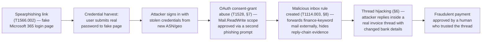
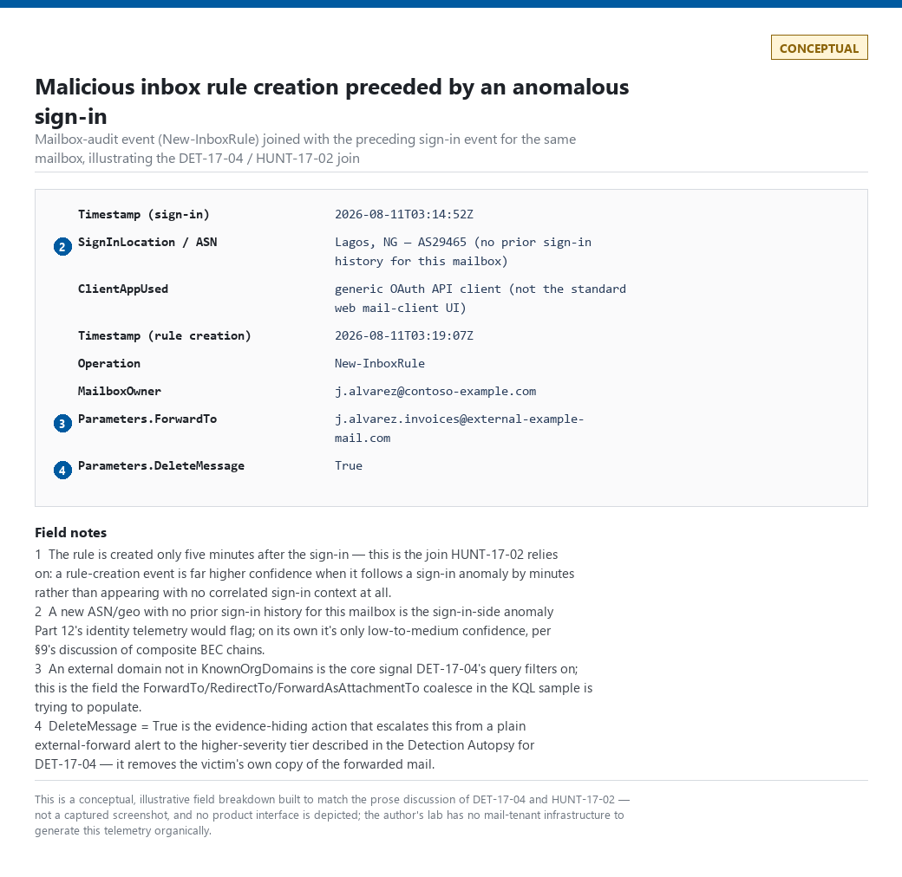
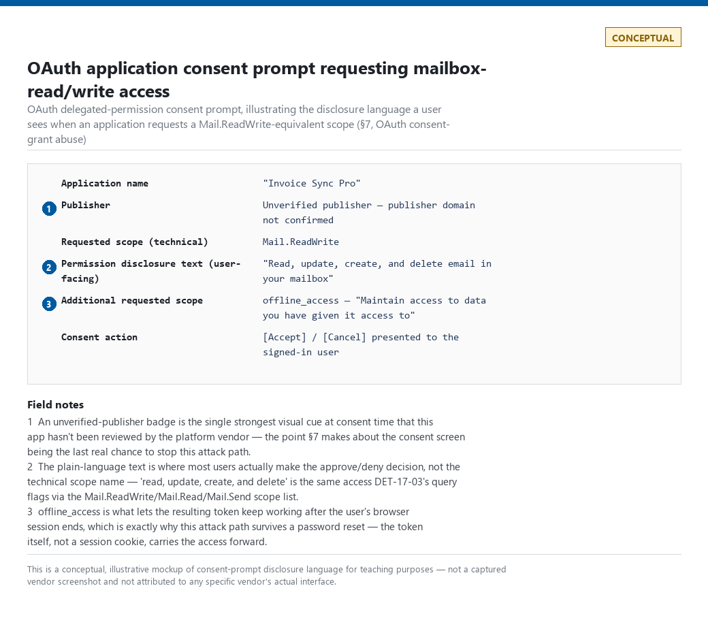

# Part 17 — Email Detection Engineering

## Why this part exists

**[CONCEPT]** Email is the oldest attack surface in this book and still the one that gets an organization compromised the fastest — a single clicked link or approved OAuth consent prompt can hand an attacker a foothold that no endpoint control ever sees, because the entire exchange happens inside a trusted business application (the mail client) that every user is trained to open dozens of times a day. This part covers the analytic layer built on top of the email and messaging telemetry surveyed in Part 4 (mail-gateway logs, message headers, Unified Audit Log / mailbox-audit events, and OAuth application-consent events) — it assumes that telemetry exists and asks what you build with it: phishing and spearphishing detection, sender-impersonation and lookalike-domain analysis, SPF/DKIM/DMARC failure semantics, URL and attachment analysis, QR-code phishing, business email compromise (BEC) patterns, OAuth consent-grant abuse, and malicious inbox-rule persistence.

Two scope boundaries matter before anything else:

- **This part does not re-teach general phishing-awareness content.** It assumes the reader already knows phishing exists and is asking a narrower question: what does a detection engineer actually build, and where does that detection fail?
- **Cloud-identity-side OAuth abuse (conditional-access bypass, cross-tenant app abuse, guest-account risk) is owned by Part 18.** This part covers the mailbox-facing half of OAuth abuse specifically — the consent grant that gives an attacker-controlled application `Mail.Read` or `Mail.ReadWrite` scope over a compromised or targeted mailbox — and hands off to Part 18 for the broader identity-platform picture.

The lab evidence set referenced elsewhere in this book (SSH, sudo, systemd, DNS, and honeynet captures) does not cover email — the author's home lab has no mail infrastructure generating organic phishing or BEC traffic. Every illustrative query, header excerpt, and log line in this part is therefore explicitly marked `CONCEPTUAL SAMPLE`, and every diagram or screenshot that anchors a claim is rendered as a labeled `CONCEPTUAL` illustration rather than a real vendor-console capture. Nothing here should be read as a captured artifact.

---

## 1. Email telemetry: what you actually have to work with

**[CONCEPT]** Three broadly different telemetry shapes feed email detection, and confusing them is the most common early mistake:

- **Mail-flow / gateway logs** — the record of a message transiting a secure email gateway (SEG) or the platform's own transport service: sender, recipient, subject, size, attachment hashes, and a spam/malware/authentication verdict. This is closest to Telemetry Coverage for "did a message arrive" and "what did the gateway decide about it."
- **Message headers** — carried inside the message itself, including `Authentication-Results` (the SPF/DKIM/DMARC verdicts computed by the receiving system), `Received` chains (the hop-by-hop transport path), and the `From`/`Reply-To`/`Return-Path` triple that impersonation detection depends on. Headers are available at ingest time even without a gateway product, which matters for organizations relying solely on the mailbox platform's native logging.
- **Mailbox-activity and audit logs** — actions taken *inside* the mailbox after delivery: rule creation, forwarding-configuration changes, delegate-access grants, and (for cloud mailbox platforms) OAuth application-consent events. This is the telemetry that catches BEC persistence and OAuth abuse; gateway logs never see it, because by the time a malicious inbox rule fires, the message has already been delivered and accepted.

> **Engineering Reality**
> Gateway and mailbox-platform vendors log different things by default, and the gap is rarely obvious until an investigation needs the missing field. Native cloud-mailbox audit logging for granular mailbox actions (rule creation, folder permission changes) has historically required an explicit license tier or audit-policy setting to be enabled — it is not a given that every tenant has it turned on, and a detection built against mailbox-audit events will silently return zero results in a tenant where that logging was never enabled, with no error to flag the gap.

**[ENGINEERING]** Retention is the other trap: mailbox-audit and sign-in logs are frequently retained for a much shorter window than the gateway's own message trace, and the two systems are rarely joined by a common identifier out of the box — a message-trace record and the mailbox-rule-creation event it eventually triggers usually have to be correlated by recipient address and timestamp proximity, not a shared message ID, because the rule-creation event doesn't carry the ID of the message that prompted the victim to click.

---

## 2. SPF, DKIM, and DMARC: failure semantics that matter

**[CONCEPT]** SPF, DKIM, and DMARC are three separate, complementary checks. Reading an `Authentication-Results` header well means tracing a DMARC failure back to *which* underlying check failed and *why* — a bare "dmarc=fail" says nothing on its own, and the failure mode differs case to case.

- **SPF (Sender Policy Framework)** checks whether the sending mail server's IP is authorized to send on behalf of the envelope-sender domain (`Return-Path`, not the visible `From` header) — a DNS TXT record lists the authorized IPs/hosts. SPF breaks the moment a message is forwarded through an intermediate server not on the original domain's authorized list, because the forwarding server's IP is what the recipient's SPF check actually evaluates.
- **DKIM (DomainKeys Identified Mail)** checks a cryptographic signature over specific message headers and body content, verified against a public key published in DNS by the signing domain. DKIM survives simple forwarding (the signature travels with the message) but breaks the moment any part of the signed content is modified in transit — a mailing-list footer added by an intermediate relay, or a security gateway that rewrites URLs or subject lines, invalidates the signature even though the message is legitimate.
- **DMARC (Domain-based Message Authentication, Reporting, and Conformance)** does not perform its own cryptographic check — it requires that *at least one* of SPF or DKIM both pass and **align**: the domain that passed SPF or DKIM must match (exactly, under "strict" alignment, or at the organizational-domain level, under "relaxed" alignment) the domain in the visible `From` header. This alignment requirement is the entire point of DMARC — it's what stops an attacker from sending a message with a perfectly valid SPF pass from their own attacker-controlled domain while spoofing a different domain in the visible `From` header, which SPF alone cannot catch.

CONCEPTUAL SAMPLE — illustrative Authentication-Results header; exact field syntax and
ordering vary by receiving platform and were not validated against a specific product build.

```text
Authentication-Results: mx.example.com;
  spf=pass smtp.mailfrom=billing@vendor-example.com;
  dkim=pass header.d=vendor-example.com;
  dmarc=fail (p=reject sp=reject) header.from=vendor-example.net
```

This header shows the exact pattern that catches most naive impersonation attempts: SPF and DKIM both pass — because the attacker legitimately controls `vendor-example.com` and sent from real, correctly configured infrastructure — but the visible `From` header claims `vendor-example.net`, a lookalike domain the recipient's DMARC alignment check catches even though both underlying protocol checks passed cleanly.

The table below summarizes what each check actually verifies, so an analyst reading an `Authentication-Results` header knows which specific failure mode a given result maps to instead of treating "fail" as one undifferentiated signal.

| Check | What it verifies | Commonly broken by | What it does **not** protect against |
|---|---|---|---|
| SPF | Sending server IP is authorized for the envelope-sender (`Return-Path`) domain | Forwarding through a server not on the original domain's SPF record | A lookalike domain with its own valid SPF record |
| DKIM | Cryptographic signature over signed headers/body matches the signing domain's published key | Any in-transit content modification (mailing-list footers, gateway URL rewriting) | A lookalike domain with its own valid DKIM key |
| DMARC | At least one of SPF/DKIM passes **and** aligns with the visible `From` domain | A misaligned `From` domain even when SPF/DKIM pass on their own sending domain's behalf | A lookalike domain that configures its own correct SPF, DKIM, and DMARC records |

> **Blind Spot**
> DMARC alignment only protects the exact domain (or organizational domain, under relaxed alignment) that publishes a DMARC policy. It does nothing for a lookalike domain the attacker registers and configures correctly — `vendor-exarnple.com` (note the character substitution) can publish its own valid SPF, DKIM, and DMARC records and pass every one of these checks on its own behalf, because DMARC never claims that a domain *is* legitimate, only that a message claiming to be from a given domain actually came from infrastructure that domain's owner authorized. Lookalike-domain detection (§3) is a separate control that has to run regardless of a clean DMARC pass.

### 2.1 A worked detection: impersonation via DMARC-fail plus display-name spoof

**[DETECTION ENGINEER]**

<a id="det-17-01"></a>**DET-17-01 — Executive-impersonation via DMARC failure plus display-name match.** The following targets a cloud email-security platform's advanced-hunting-style query surface over parsed mail-flow and header data. It has not been validated against a real phishing run — the author's lab has no mail-tenant infrastructure to generate this telemetry organically — so treat it as an illustrative starting point, not a tuned production rule. It looks for the specific combination that catches most executive-impersonation attempts: a DMARC failure, a display name matching a real internal executive or finance contact, and a `From` domain that does not match any domain the organization owns.

CONCEPTUAL SAMPLE — illustrative query against a generic mail-events table; exact table
and field names approximate common cloud-email-security schemas and were not validated
against a specific product version.

```kql
EmailEvents
| where AuthenticationDetails has "dmarc=fail" or DmarcVerdict == "fail"
| extend SenderDomain = tostring(split(SenderFromAddress, "@")[1])
| where SenderDomain !in (KnownOrgDomains)
| join kind=inner (VipDisplayNames) on $left.SenderDisplayName == $right.DisplayName
| project Timestamp, RecipientEmailAddress, SenderDisplayName, SenderFromAddress,
          SenderDomain, Subject, DmarcVerdict
```

**MITRE:** T1656 (Impersonation)

The signal this rule keys on — a DMARC-misaligned `From` domain plus a display-name match — says nothing about how the payload arrives, and the most common real-world executive-impersonation message (a plain-text request to buy gift cards or redirect a wire, no link or attachment at all) has no delivery mechanism to tag at all. Forcing a T1566.001/.002 sub-technique onto this rule would claim a payload type it never inspects, so only the impersonation technique is tagged here; tag the matching T1566 sub-technique on the specific incident once triage confirms what, if anything, the message actually delivered.

This detection's main dependency is the `VipDisplayNames` lookup table — a maintained list of executive and finance-team display names — and its main blind spot is any impersonation attempt that skips the display-name match entirely and just uses a plausible generic name ("IT Support," "HR Department"); that variant needs a separate, lower-precision rule scored with additional signals rather than this exact-match join. A message that bypasses standard header parsing — relayed through an internal system that strips or never populates `AuthenticationDetails` — drops out of the DMARC filter with no error, and one with an empty `SenderDisplayName` never reaches the join at all; both failure modes make the rule fail closed (silently no alert) rather than fail loud, so a parsing gap here is invisible without separately monitoring parse-failure volume on the `EmailEvents` feed.

> **False Positive Trap**
> Legitimate third-party services that send mail *on behalf of* your executives — travel-booking confirmations, calendar-scheduling tools, expense-report systems — routinely set the display name to the real executive's name while sending from the service's own domain, which is functionally identical to the pattern this rule targets and will fail DMARC alignment in exactly the same way if the service isn't a proper DKIM-signing partner. Maintain an explicit allowlist of known legitimate sending domains for each such service, reviewed when new tools are procured — do not loosen the DMARC-fail condition to fix this, since that's the exact signal that makes the rule work against real impersonation.

> **Blind Spot**
> The join above uses exact string equality (`==`) between `SenderDisplayName` and the `VipDisplayNames` entry. An attacker defeats this with no loss of impersonation effectiveness: a trailing or doubled space, a middle initial, a trailing title ("Jane Doe, CFO"), or a Unicode homoglyph substituted into the display name string all read as identical to the real executive to a human recipient but fail exact match and never reach the join at all. Normalize both sides — trim whitespace, case-fold, strip common suffixes — and use an edit-distance or fuzzy match rather than equality before treating a non-matching display name as evidence the message isn't impersonating a VIP.

> **Detection Test**
> **Setup:** A test mailbox on a domain the organization doesn't own, with SPF/DKIM configured correctly for that test domain (so the message passes both underlying checks cleanly) but a display name set to match an entry in the `VipDisplayNames` lookup.
> **Action:** Send a test message from the test domain to a recipient inside the target tenant, with the display name field set to the impersonated executive's name.
> **Expected result:** The message shows `dmarc=fail` in `Authentication-Results` (misaligned `From` domain despite SPF/DKIM passing on the sending domain's own behalf), and DET-17-01 returns a matching row keyed on the test recipient and the impersonated display name.

---

## 3. Header analysis and sender impersonation

**[ANALYST]** Beyond the SPF/DKIM/DMARC verdict itself, three header fields carry most of the manual triage signal for a suspected impersonation:

- **`Reply-To` vs. `From` mismatch** — a message claiming to be from a known contact's address in the `From` header, but with a `Reply-To` pointing to an unrelated free-mail or lookalike-domain address, is one of the highest-precision manual signals available: there is essentially no legitimate reason for these to differ in routine business mail, though some legitimate mass-mailing and CRM platforms do set a distinct `Reply-To` deliberately, which is why this signal is weighted, not absolute.
- **`Return-Path` vs. visible `From`** — the SPF check evaluates `Return-Path` (the envelope sender), which the recipient's mail client never displays; an attacker can present any `From` address they want while the actual bounce-handling address (`Return-Path`) reveals attacker-controlled infrastructure.
- **The `Received` chain** — reading top-to-bottom shows the path a message actually took; an unexpected hop through infrastructure with no plausible business relationship to the claimed sending organization is a secondary corroborating signal, though it is the weakest of the three because legitimate mail routinely transits several unrelated relays (spam-filtering services, marketing platforms, forwarding rules) for entirely benign reasons.

**[THREAT HUNTER]** Lookalike-domain detection is the hunting angle that catches what DMARC alignment cannot (see the Blind Spot above): the attacker's domain is technically legitimate and passes every protocol check on its own behalf. The practical approach is a similarity-scoring pass — edit distance, homoglyph substitution, and added/removed hyphens or TLD swaps — run against the organization's own domain list and its known top-vendor domain list, over the population of `From` domains seen in the last rolling window.

> **Hunter's Note**
> Don't just look for domains that look like yours — pull the list of domains your organization's finance team has actually *paid* in the last twelve months (from AP records or ERP vendor tables, not from mail data) and run the same similarity scoring against that list. Attackers researching a BEC target overwhelmingly register lookalikes of a real vendor the target already has an active invoicing relationship with, not a lookalike of the target's own domain — a "your CEO's name, your domain" spoof is easy to defeat with the DMARC rule above; a "your actual roofing contractor's domain, one character off" spoof is what gets a real wire transfer approved, because the invoice looks completely routine.

**[SOC MANAGEMENT]** Lookalike-domain monitoring has a real cost tradeoff worth stating plainly: defensively registering every plausible typo-variant of your own domain (a common vendor recommendation) has a real, ongoing dollar cost per domain per year that scales with how many variants you try to cover, and it never covers the vendor-impersonation case above at all, because you don't own the vendor's domain space. Most programs get more value per dollar from the similarity-scoring detection against inbound mail than from defensive domain registration alone — treat registration as a secondary control for your own highest-value brand variants, not a substitute for detection.

---

## 4. URL and attachment analysis

**[CONCEPT]** URL and attachment analysis both face the same core engineering problem: the payload the recipient actually sees at click-time is frequently not the payload that existed at delivery-time. A benign-looking landing page at delivery can be swapped for a credential-harvesting page hours later without ever touching the original message — this is why time-of-click rewriting and re-scanning exist as a control category, and why a detection relying solely on delivery-time reputation is structurally incomplete.

**[DETECTION ENGINEER]** Beyond raw reputation lookups (domain age, hosting ASN, known-bad-infrastructure lists — all covered generally in Part 4 and Part 15's rare-destination logic), three patterns carry useful signal specifically for phishing URLs:

- **URL/display-text mismatch** — the visible link text or button claims one destination while the underlying `href` resolves somewhere else, a pattern almost never present in legitimate transactional mail.
- **Redirect-chain depth and host diversity** — a link that redirects through three or more distinct hosts before landing on a final page is disproportionately represented in credential-harvesting campaigns, which use open redirects and URL-shortener chains specifically to defeat delivery-time reputation checks against the final host.
- **Newly-observed hosting infrastructure for a brand-impersonation page** — a landing page whose visual content matches a well-known login page (Microsoft 365, Google Workspace, a common VPN portal) but resolves to infrastructure first seen in DNS within the last few days is a strong composite signal, combining brand-similarity scoring (typically a visual/DOM-based classifier, out of scope for this book's query-level detail) with domain-age data this book's DNS part (Part 15) already covers.

**[DETECTION ENGINEER]** Attachment analysis for phishing specifically (as opposed to general malware-attachment detection, covered under endpoint and file-analysis controls elsewhere in this book) centers on container-format abuse: password-protected archives and ISO/IMG disk-image attachments exist almost exclusively, in a phishing context, to move the actual payload past a gateway's content-inspection engine, which frequently cannot open an encrypted archive or mount a disk image to inspect its contents. An attachment-type rule flagging password-protected ZIP/7z and mountable disk-image formats arriving from an external sender, with no established prior correspondence from that sender, is cheap and high-value specifically because there is very little legitimate reason for a first-contact external message to arrive that way.

> **Detection Autopsy — "block every password-protected archive attachment"**
>
> **The rule:** Quarantines any inbound message with a password-protected ZIP or 7z attachment, regardless of sender history.
>
> **Why it shipped:** Password-protected archives are a well-documented technique for evading gateway content inspection, the logic is a one-line attachment-type-plus-encryption-flag check, and several real campaigns in the preceding quarter had used exactly this pattern.
>
> **How it failed:** Legitimate business processes — password-protected tax documents from accountants, encrypted legal documents from outside counsel, vendor-delivered license files — use the identical container format for entirely benign reasons, and the rule had no way to distinguish them from a first-contact phishing payload. Legal and finance teams, who receive a disproportionate share of legitimately encrypted attachments, filed the largest share of complaints within the first week.
>
> **The fix:** Condition the rule on sender novelty (no prior message history between sender and recipient in the correlation window) rather than attachment format alone, and route flagged-but-not-blocked messages to a sandboxed detonation step instead of an outright quarantine — this keeps the format signal but stops punishing an established business relationship for using a normal container format.

---

## 5. QR-code phishing ("quishing")

**[CONCEPT]** QR-code phishing embeds a malicious URL as an image rather than as clickable text or an `href` — the recipient's phone camera resolves the URL, not the mail client, which is the entire point from the attacker's side: most URL-scanning and rewriting controls inspect text-based links and message content, not the pixel data of an embedded image, so a QR code carrying the same credential-harvesting URL an attacker would otherwise put in a text link routinely sails past controls tuned for text-based phishing. It is worth stating plainly that this is not a new attack technique with its own MITRE mapping — it is T1566.002 (Phishing: Spearphishing Link) delivered through a different rendering mechanism, and detections should be framed that way rather than as a distinct threat category.

**[DETECTION ENGINEER]** The practical detection approach is image-content extraction: decode any QR code present in an inbound message's image attachments or inline images at scan time, extract the encoded URL, and run that URL through the same reputation, redirect-chain, and brand-impersonation checks §4 already applies to text-based links. The engineering cost is running an image-decode step in the mail pipeline that most gateways did not originally build for this purpose, which is why quishing detection coverage lagged adoption of the technique by a meaningful margin across the industry — the telemetry (image attachments) existed the whole time; the analytic (decode-and-check) had to be added on top of it.

> **False Positive Trap**
> Legitimate marketing email, event-registration confirmations, restaurant menus, and multi-factor-authentication enrollment flows all routinely embed QR codes for entirely benign reasons, and the raw "message contains a QR code" signal alone has a very high false-positive rate against ordinary business and consumer mail. Score the decoded URL through the same checks any other link gets — sender novelty, domain age, brand-impersonation similarity — rather than alerting on QR-code presence by itself; presence alone tells you almost nothing.

> **Hunter's Note**
> If your gateway's QR decode-and-check step is new, go back through the last month of quarantine and spam-folder disposition data and manually decode any QR-bearing message that was previously scored *only* on text-based signals — the rule almost certainly missed campaigns that were sitting there the whole time, since the image itself was never inspected before the capability existed. This is a cheap, bounded hunt with a near-certain finding the first time you run it against a gap that just closed.

---

## 6. Business email compromise: the pattern behind the technique

**[CONCEPT]** BEC is not one technique — it's a fraud outcome achieved through several different technical paths that converge on the same goal: getting a human to authorize a payment, a credential disclosure, or a data transfer based on a false belief about who they're communicating with. The three most common paths are external domain impersonation (§2–3), a genuinely compromised mailbox sending from real, correctly authenticated infrastructure (which defeats every SPF/DKIM/DMARC check because the mail really is from that domain), and **thread hijacking** — an attacker who has already compromised one party's mailbox replies inside a real, pre-existing email thread with altered payment instructions, inheriting the entire thread's legitimate history and tone.

Thread hijacking is the hardest of the three to catch with header-level or authentication-based detection, because every technical signal is clean: correct sending domain, correct DKIM signature, a real prior conversation. The signal has to come from content and behavior instead — a payment-detail change (new bank account, new routing number, a request to redirect an in-progress wire) introduced mid-thread, especially paired with urgency language and a request to bypass a normal verification step.

### 6.1 A worked detection: lookalike-domain first-contact to a finance distribution list

**[DETECTION ENGINEER]**

<a id="det-17-02"></a>**DET-17-02 — Lookalike-domain first-contact to a finance recipient.** Targets the domain-impersonation path specifically — a first-contact message (no prior correspondence history between sender domain and recipient) from a domain scoring above a similarity threshold against either the organization's own domain or a maintained list of paid-vendor domains, landing in a finance-team distribution list or an individual with an "invoice" or "payment" keyword hit in the subject.

CONCEPTUAL SAMPLE — illustrative SPL against a generic mail-events index; field names
approximate common gateway/mail-platform log shapes and were not validated against a
specific product.

```spl
index=mail_events sourcetype=mail:message
| eval sender_domain=mvindex(split(sender_address, "@"), -1)
| lookup domain_similarity_lookup sender_domain OUTPUT similarity_score matched_domain
| where similarity_score > 0.85 AND matched_domain != sender_domain
| where recipient IN (finance_distribution_list)
| eval subject_flag=if(match(subject, "(?i)invoice|payment|wire|remittance|bank details"), 1, 0)
| where subject_flag=1
| lookup prior_correspondence_lookup sender_domain recipient OUTPUT prior_contact_count
| where isnull(prior_contact_count) OR prior_contact_count=0
```

**MITRE:** T1566 (Phishing), T1656 (Impersonation)

The query never inspects the message for a link or attachment — it keys on domain similarity, recipient list, and a subject keyword — so it doesn't earn a T1566.001/.002 sub-technique tag either; the actual payload could be an attached fake invoice, a link to a "portal," or nothing at all (a pure text request to change a bank account carries no attachment or link). Tag the specific sub-technique on the incident once triage confirms what the message actually delivered.

This detection's main limitation is the `domain_similarity_lookup` and `prior_correspondence_lookup` tables, both of which need a real maintenance process behind them — a similarity-scoring algorithm with no tuned threshold and a correspondence history with a retention window shorter than typical vendor-relationship cadence (many legitimate vendor relationships have gaps of several months between invoices) will both drift toward false positives or false negatives without periodic review. A sender domain with no entry at all in `domain_similarity_lookup` — a lookalike registered too recently for the scoring job to have picked it up — returns a null `similarity_score`, which fails the `> 0.85` comparison and drops the event silently; this rule only catches lookalikes the similarity job has already scored, not every lookalike that exists at query time.

> **Blind Spot**
> Two of this query's gates are trivial for an attacker who has done even cursory reconnaissance to route around without losing the fraud outcome. The keyword check only inspects `subject` — a message with the actual fraud content and a bank-account change entirely in the body, with a subject line like "Following up" or "Q3 documents," never sets `subject_flag` and drops out before the correspondence check even runs. Separately, `prior_contact_count` is keyed only on sender domain and recipient with no content requirement of its own: an attacker who sends one innocuous first message from the lookalike domain — nothing suspicious, no invoice language — establishes a nonzero prior-contact count before sending the actual fraud message, which then passes `isnull(prior_contact_count) OR prior_contact_count=0` and never fires. Both gaps mean this rule reliably catches the unsophisticated, single-shot version of the attack and misses the two-message warm-up sequence BEC operators already use routinely.

> **What Would Change My Mind**
> This detection assumes a first-contact message that scores above the similarity threshold against the org's own domain or an already-paid vendor's domain is rare enough in legitimate traffic to alert on directly. A genuinely new vendor's real domain shouldn't trip that similarity gate at all unless it coincidentally resembles a domain already in the lookup — which does happen in crowded industries with similar company names, or after a vendor rebrand or spinoff, but is not "every new vendor," contrary to how this looked in an earlier draft. If a production tuning pass showed double-digit weekly false positives specifically from that coincidental-similarity case, rather than from first-contact-with-invoice-language generally, the detection would need to move from a standing alert to a lower-confidence signal feeding a risk score (Part 33) — combined with sender-reputation age and payment-detail change history — rather than firing on its own.

> **Detection Test**
> **Setup:** A test domain that scores above 0.85 similarity against an entry already in `domain_similarity_lookup` (e.g., a one-character substitution of a domain on the paid-vendor list), and a test finance-distribution mailbox with no prior correspondence from that test domain.
> **Action:** Send a test message from the test domain to the test finance recipient, subject line containing "invoice," with no prior message history between the two addresses.
> **Expected result:** DET-17-02 returns one row for the test sender domain and recipient, with `similarity_score` above 0.85, `subject_flag` = 1, and `prior_contact_count` null or 0.

### 6.2 The hunt: catching thread hijacking a standing rule can't see

**[THREAT HUNTER]**

<a id="hunt-17-01"></a>**HUNT-17-01 — Mid-thread payment-detail change audit.**

- **Threat hypothesis:** A compromised-mailbox thread-hijacking attempt introduces a payment-detail change into an otherwise-legitimate, multi-message thread, and this change is detectable by content diffing even though every authentication signal on the messages themselves is clean.
- **Scope:** Threads (grouped by conversation/thread ID, not by sender) touching finance-related keywords over a lookback window, with bank-account and routing-number entities extracted and compared — manually for a small volume, or via a text-similarity/entity-extraction pass for a larger one — across messages in the same thread.
- **Pivot:** A genuine finding takes the shape: message 1 through message 6 of a thread reference a bank account ending in one set of digits; message 7, sent from the same address with clean DKIM and SPF, introduces a different account for "an updated remittance process," with no out-of-band confirmation ever requested by either party.
- **Disposition:** This hunt should end in a specific finding — a flagged thread routed to a mandatory out-of-band verification step (see the Detection Autopsy below) — not a new unattended block rule. The entity-extraction and cross-message diff logic has enough false-positive surface (legitimate account changes do happen) that it's a better fit for hunt-driven review of flagged threads than for automated action.

> **Blind Spot**
> This hunt's content-diffing only works against bank-account and routing-number strings the extraction pass can actually see in the message body. An attacker who puts the changed payment details in an attached PDF, image, or scanned "updated invoice" — a completely routine-looking way to deliver this kind of update — produces a thread whose message text contains no extractable account number at all; the hunt finds nothing unless the extraction pass also runs against attachment content (including OCR for image/PDF attachments), not just message bodies.

**MITRE:** No clean mapping for the hijacking action itself — the finding this hunt targets is a mid-thread content change from an already-established, technically legitimate sending path, not a new phishing delivery, so tagging it T1566.001/.002 would misrepresent what actually happened. If the investigation traces the original mailbox compromise to a specific vector (credential phishing, OAuth consent abuse), tag *that* stage with the matching technique from §2–§7 rather than tagging this hunt's finding.

> **Detection Autopsy — "flag any thread with a mid-conversation bank-account change"**
>
> **The rule:** Extracts bank-account/routing-number entities per message in a thread and fires when a later message introduces an account number not seen earlier in the same thread.
>
> **Why it shipped:** It directly targets the exact mechanism of the highest-loss BEC pattern, and entity extraction over structured financial identifiers is a comparatively tractable NLP problem compared to general fraud-intent detection.
>
> **How it failed:** Legitimate mid-relationship bank-account changes happen — vendors switch banks, add a second account for a specific invoice type, or correct an earlier typo — and the rule fired on all of them with no way to distinguish a legitimate change from a fraudulent one using message content alone, since a fraudulent message making this request reads exactly like a legitimate one asking for the same thing.
>
> **The fix:** Treat the detection's output as a hunt queue item requiring a specific, defined verification step (an out-of-band phone confirmation to a previously-known number, not a number in the flagged message) before any payment action proceeds, rather than an automated block — this is one of the clearer cases in this book where the correct engineering answer is a mandatory human process control, not a better query.

---

## 7. OAuth consent-grant abuse

**[CONCEPT]** An illicit consent-grant attack tricks a user into approving an OAuth application's request for delegated permissions — most dangerously, mailbox-read/write scopes like `Mail.Read` or `Mail.ReadWrite` — through a legitimate-looking consent prompt, usually reached via a phishing link. Once granted, the attacker-controlled application can read, search, and in some cases send mail as that user through the platform's own API, with a valid OAuth token rather than a stolen password — which means the attack survives a password reset entirely. This is the mailbox-facing half of OAuth abuse this part owns; see Part 18 for the broader cloud-identity picture (cross-tenant app risk, conditional-access interaction, admin-consent workflow abuse).

The attack is dangerous specifically because it defeats the two most common account-takeover remediations: a password reset does nothing to a valid OAuth token, and MFA does nothing to stop the initial consent grant, because the user is genuinely authenticated when they approve the prompt — the compromise is in what they approved, not in who they are.

**[DETECTION ENGINEER]**

<a id="det-17-03"></a>**DET-17-03 — High-risk OAuth consent grant burst.** Targets consent-grant events for applications requesting mailbox-scoped permissions, filtered to publishers not on a maintained allowlist of known/verified vendors, and further weighted by how many distinct users granted consent to the same unfamiliar application within a short window — a burst of consent grants to the same newly-seen app across multiple mailboxes is a materially stronger signal than any single grant alone.

CONCEPTUAL SAMPLE — illustrative query against a generic OAuth-application audit table;
exact table/field names approximate common cloud-identity audit log schemas and were
not validated against a specific product version.

```kql
OAuthConsentEvents
| where PermissionScopes has_any ("Mail.Read", "Mail.ReadWrite", "Mail.Send", "MailboxSettings.ReadWrite")
| where PublisherVerified == false and PublisherDomain !in (KnownVendorAllowlist)
| summarize DistinctUsers = dcount(UserId), Grants = count() by AppId, AppDisplayName, PublisherDomain, bin(Timestamp, 1h)
| where DistinctUsers >= 3
```

**MITRE:** T1528 (Steal Application Access Token)

This detection's precision depends entirely on the `KnownVendorAllowlist` staying current — a new, entirely legitimate SaaS tool onboarded by a business unit without IT's involvement (a real and common occurrence) will trip this rule on its first few users, and the fix for that is a fast allowlist-review process, not loosening the threshold in a way that also hides a real malicious app spreading the same way.

> **Blind Spot**
> This detection only sees consent grants that actually reach the audit log the query runs against — an attacker who successfully social-engineers *admin* consent (bypassing the per-user consent prompt entirely and granting an application tenant-wide access in one action) produces a single event, not a multi-user burst, and needs a separate, lower-volume rule watching specifically for administrative consent-grant events rather than relying on the user-count threshold this rule is built around. The same threshold is just as easily evaded without admin consent at all: an attacker phishing individual users one or two at a time, or spacing grants more than an hour apart so no single `bin(Timestamp, 1h)` window ever accumulates three distinct users, stays under `DistinctUsers >= 3` indefinitely while still harvesting mailbox access from everyone who falls for it. A burst threshold shapes volume for an unsophisticated or automated campaign; it isn't a floor on what a patient attacker can get away with. Pair it with a periodic, unbounded-lookback distinct-user count per app, not just the rolling 1-hour bin.

> **Detection Test**
> **Setup:** A test tenant with a registered test OAuth application requesting `Mail.Read` scope, not on the tenant's vendor allowlist, and at least three test-user accounts available to grant consent.
> **Action:** Complete the consent flow for the test application from three or more distinct test-user accounts within the same hour.
> **Expected result:** A single row from DET-17-03 for the test `AppId`, with `DistinctUsers` at or above the three-user threshold and `PublisherVerified` false.

> **SOC Management View**
> Illicit consent-grant risk is a direct argument for restricting which users can consent to third-party OAuth applications at all — moving from "any user can approve any app's requested scopes" to "user consent allowed only for a reviewed, lower-risk scope tier; anything requesting mailbox or directory-wide scopes requires admin approval" is a policy decision, not a detection-engineering one, and it closes this entire attack path structurally rather than relying on catching each grant after the fact. Every detection in this section is a compensating control for an org that hasn't made that policy change yet, not a substitute for making it.

---

## 8. Malicious inbox rules

**[CONCEPT]** Once an attacker has any foothold in a mailbox — stolen credentials, a session token, or an OAuth grant from §7 — creating an inbox rule is one of the cheapest, highest-value persistence and data-collection moves available, and it requires no malware and no further exploitation. A rule that silently forwards messages matching finance-related keywords to an external address, or moves incoming replies from a specific vendor domain straight to a rarely-checked folder (hiding the victim's own out-of-band verification attempts during an active BEC fraud), can run indefinitely with no further attacker interaction.

**[DETECTION ENGINEER]**

<a id="det-17-04"></a>**DET-17-04 — External auto-forwarding rule with evidence-hiding action.** Targets mailbox-audit or Unified-Audit-Log-style events for inbox-rule creation or modification, filtered to rules whose action includes forwarding to an external domain, combined with a keyword-based or delete/move action targeting the mailbox's own visible evidence trail.

CONCEPTUAL SAMPLE — illustrative query against a generic mailbox-audit events table;
exact table/field/operation names approximate common cloud-mailbox audit log schemas
and were not validated against a specific product version.

```kql
MailboxAuditEvents
| where Operation in ("New-InboxRule", "Set-InboxRule", "UpdateInboxRules")
// New-InboxRule/Set-InboxRule can forward externally through three different parameters —
// ForwardTo, RedirectTo, and ForwardAsAttachmentTo — and a rule using only the latter two
// never populates ForwardTo at all; checking ForwardTo alone misses those rules entirely.
| extend ForwardTarget = coalesce(tostring(Parameters["ForwardTo"]),
                                   tostring(Parameters["RedirectTo"]),
                                   tostring(Parameters["ForwardAsAttachmentTo"]))
| extend ForwardDomain = tostring(split(ForwardTarget, "@")[1])
| where isnotempty(ForwardDomain) and ForwardDomain !in (KnownOrgDomains)
| extend HidesEvidence = Parameters["DeleteMessage"] == "True" or Parameters["MoveToFolder"] has "RSS"
| project Timestamp, MailboxOwner, ClientIP, Operation, ForwardDomain, HidesEvidence, RuleConditions
```

**MITRE:** T1114.003 (Email Collection: Email Forwarding Rule)

The framing limitation here is `KnownOrgDomains` coverage — an organization with recently acquired subsidiaries, unlisted partner domains, or personal-forwarding policies that were never centrally documented will generate false positives against every one of those legitimate external-forwarding cases until the allowlist catches up.

> **False Positive Trap**
> `HidesEvidence` only recognizes one hiding pattern by name — moving matched mail to the RSS Feeds folder, chosen in the query above because it's a real folder almost no user ever checks. An attacker who picks any other rarely-used folder, or a newly created custom folder with an innocuous name, produces `HidesEvidence = false` and gets scored as a lower-severity plain external forward instead of an evidence-hiding one. This weakens the severity split in the Detection Autopsy below without causing a missed detection outright — the external-forward condition still fires — so treat `HidesEvidence` as a severity enhancer that under-fires, not as a reliable signal that a forward is *not* hiding anything when it reads false.

> **Blind Spot**
> This query only matches forwarding configured through an inbox rule (`New-InboxRule`/`Set-InboxRule`, whichever of the `ForwardTo`/`RedirectTo`/`ForwardAsAttachmentTo` parameters is populated). Cloud mailbox platforms also support mailbox-level automatic forwarding, configured through a completely different operation (Exchange Online's `Set-Mailbox` with `-ForwardingSmtpAddress`/`-ForwardingAddress`, not an inbox rule at all) that this query's `Operation in (...)` filter never matches. An attacker — or a compromised admin account acting on the attacker's behalf — who sets mailbox-level forwarding instead of creating a rule produces zero results here and needs a companion query watching `Set-Mailbox` operations for a newly-populated forwarding-address parameter pointing outside `KnownOrgDomains`.

> **Detection Test**
> **Setup:** A test mailbox on a domain the query treats as internal, with permission to create an inbox rule and access to a distinct external test-domain mailbox to forward to.
> **Action:** Create an inbox rule on the test mailbox with `-ForwardTo` set to the external test address and `-DeleteMessage $true`.
> **Expected result:** A `New-InboxRule` (or `Set-InboxRule`) entry in `MailboxAuditEvents` for the test mailbox, with `ForwardDomain` resolving to the external test domain and `HidesEvidence` = `true`.

> **Detection Autopsy — "alert on any inbox rule forwarding externally"**
>
> **The rule:** Fires on any `New-InboxRule` or `Set-InboxRule` event where the rule's action includes forwarding to an address outside the organization's domain list.
>
> **Why it shipped:** External auto-forwarding is genuinely one of the highest-value BEC persistence signals, and the underlying audit event exists in most cloud-mailbox platforms without any extra logging configuration.
>
> **How it failed:** A meaningful share of users legitimately forward work mail to a personal account for reasons the security team never sanctioned but that predate any compromise — checking mail from a personal device without the corporate app installed, or a departing employee's manager forwarding their mail during a transition. These generated a steady background rate of alerts that had nothing to do with attacker activity, and after several weeks of triaging "employee forwards mail to Gmail, again" the team started closing the alert type without real review.
>
> **The fix:** Split the rule into two severities instead of one: any external-forward alert still fires, but severity escalates sharply when the rule also matches finance/payment keywords, deletes or hides the forwarded message from the mailbox owner's own view, or was created immediately following a suspicious sign-in (impossible travel, a new device, a failed-then-successful MFA challenge) — correlating with Part 12's sign-in anomaly detections turns an undifferentiated noisy signal into a prioritized one without dropping the underlying visibility.

### 8.1 The hunt: rules created through the API, not the mail client UI

**[THREAT HUNTER]**

<a id="hunt-17-02"></a>**HUNT-17-02 — API-created inbox rules with no prior sign-in history.**

- **Threat hypothesis:** An attacker with a stolen OAuth token or session cookie creates inbox rules directly through the platform's API rather than through the normal web mail-client UI, and this leaves a detectably different signature in the audit event even when the rule's own configuration looks identical to one a real user might create by hand.
- **Scope:** Every inbox-rule-creation event over a lookback window, grouped by originating client application and IP/ASN.
- **Pivot:** Rule-creation events attributed to a generic API client ID or a script-like user-agent string, from an IP/ASN with no prior sign-in history for that mailbox, rank highest.
- **Disposition:** A confirmed finding feeds directly into tightening DET-17-04's severity logic (client-application context as an additional weighting signal) or, if the volume warrants it, a new standing rule scoped to API-originated rule creation specifically — otherwise, document the negative finding (no API-originated rules found this cycle) so the gap this hunt covers stays visible on the coverage matrix.

**MITRE:** T1114.003 (Email Collection: Email Forwarding Rule), T1528 (Steal Application Access Token).

> **Hunter's Note**
> Cross-reference the timestamp of every externally-forwarding inbox rule against that mailbox's own sign-in log, not just its own rule-creation event — a rule created within minutes of a sign-in from a new country, a new ASN, or a client type the account has never used before is a far stronger finding than the rule-creation event alone, and it's a join you can do with data you almost certainly already have from Part 12's identity telemetry. Most teams hunting inbox rules never make this join and miss the strongest corroborating signal sitting one query away.

---

## 9. Putting it together: a worked case study

**[ANALYST]** The individual detections in this part rarely fire in isolation during a real BEC intrusion — they represent sequential stages of one attack chain, and reading them together is what actually confirms a compromise rather than a series of unrelated low-confidence alerts. A realistic path looks like this:




<a id="fig-17-01"></a>**Figure 17.1 (FIG-17-01) — A composite BEC attack chain from initial phishing link to fraudulent payment.** *CONCEPTUAL.* Illustrates how the individually-scoped detections in this part (§2–§8) compose into a single realistic intrusion path; it does not represent every real BEC intrusion, and several steps (particularly D, the second consent-grant phishing prompt) depend on the attacker choosing that specific escalation path rather than proceeding directly from stolen credentials to inbox-rule creation without an OAuth step at all.

**[ANALYST]** The triage-relevant point of Figure 17.1 is that steps C through E are individually low-to-medium confidence on their own — a new-ASN sign-in, an OAuth consent grant to an unfamiliar app, and an external-forwarding inbox rule can each have an innocent explanation — but the combination, correlated on the same mailbox within a short window, is high confidence. An analyst who sees only the DET-17-04 inbox-rule alert, without pulling the sign-in history and consent-grant history for the same mailbox in the surrounding hours, is looking at roughly a third of the actual picture.



**CONCEPTUAL — illustrative field breakdown; not a captured screenshot.** A mailbox-audit log entry showing a `New-InboxRule` operation with an external `ForwardTo` parameter and a `DeleteMessage` flag set, alongside the sign-in event that preceded it; supports DET-17-04 and the HUNT-17-02 join, using the same illustrative field names introduced above.



**CONCEPTUAL — illustrative field breakdown; not a captured screenshot.** An OAuth application-consent prompt showing the kind of permission-scope disclosure language a user sees for a `Mail.ReadWrite`-equivalent request, to support §7's discussion of why the consent screen itself is often the last real chance to stop this attack path before it succeeds; not attributed to any specific vendor's actual interface.

---

## Summary

**[CONCEPT]** Email detection engineering is less about any single clever query and more about which telemetry layer a given attack stage actually shows up in — SPF/DKIM/DMARC and header analysis catch the delivery stage, URL/attachment/QR analysis catch the payload stage, and OAuth consent and inbox-rule monitoring catch the post-compromise persistence stage that gateway logs never see at all. The recurring failure mode across nearly every detection in this part is the same one named in the Detection Autopsy boxes above: a rule built around one clean, mechanically correct signal (a DMARC fail, a password-protected archive, an external forward) that turns out to have a large legitimate population producing the identical signal for entirely benign reasons. The fix, almost every time, is the same pattern — add a second, independent signal (sender novelty, a keyword match, a correlated sign-in anomaly) rather than raising the threshold on the first one, because raising the threshold degrades detection of the real attacker right along with the false positives.
