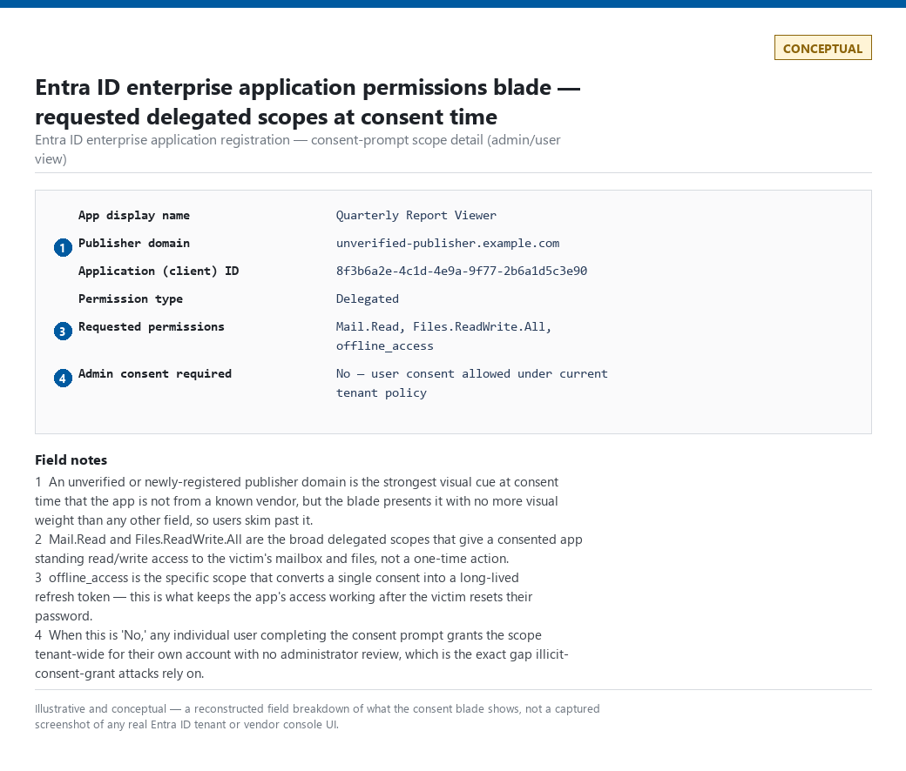
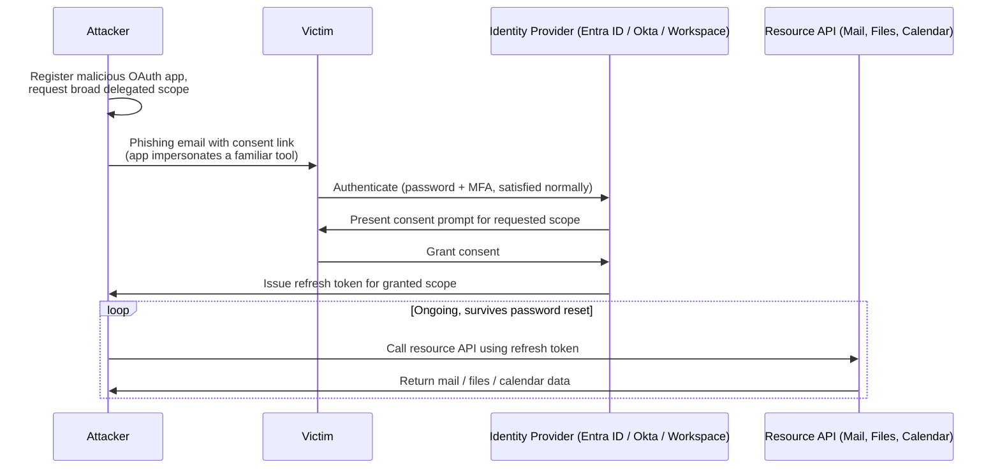
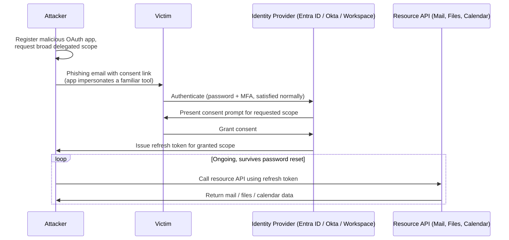
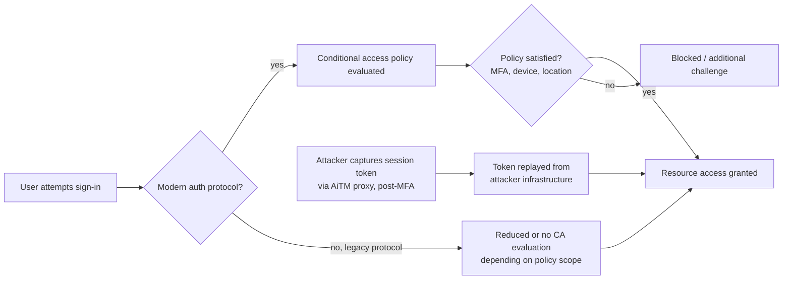

# Part 18 — Cloud Identity & SaaS Detection Engineering

## Why this part exists

**[CONCEPT]** Part 12 covers the shape of authentication abuse — brute force, spray, impossible travel, MFA fatigue — as a general pattern that applies to any identity provider's sign-in log, Entra ID's, Okta's, Ping's, or Duo's alike. This part assumes that layer and goes one level deeper into what is specific to running identity as a cloud platform rather than a single directory: an OAuth app registration that a user can consent to without IT ever provisioning an account for it, a guest invite that hands cross-tenant access to a human your directory has never authenticated directly, and a conditional access policy that can be satisfied by something other than the login it was built to gate. None of that exists in an on-prem AD/Kerberos model, which is why Part 13 — directory privilege, Kerberoasting, DCSync, LDAP enumeration — stays a separate part with a separate telemetry base.

Three boundaries worth stating explicitly, because this part's scope overlaps with three neighbors on paper: Part 17 owns the *email-delivery* half of OAuth consent-grant abuse — the phishing lure, the malicious inbox rule an attacker plants after consent lands — while this part owns the *identity* half: the app registration object itself, the consent-grant audit trail, scope-abuse patterns, and app governance, regardless of which downstream surface (mail, files, calendar) the granted scope actually touches. Part 19 owns AWS/Azure/GCP control-plane IAM — role assumption chains, storage-bucket exposure, resource-level permissions — while this part owns Entra ID, Okta, Google Workspace, and M365 specifically in their role as identity provider and SaaS-app-consent surface; Entra ID sits at the seam, since it is simultaneously Azure's directory and a general-purpose IdP, and a chapter that needs Azure Resource Manager role-assignment detail belongs in Part 19, not here. And where Part 12 already generalized brute force, spray, and impossible travel across every IdP, this part does not re-derive those queries for Okta or Google Workspace specifically — it only covers what genuinely differs at the cloud-identity-and-SaaS layer: OAuth/app-consent abuse, cross-tenant and guest risk, and conditional-access bypass.

---

## 1. The cloud identity and SaaS telemetry layer

**[CONCEPT]** A cloud identity platform produces at least two structurally different log types that Part 12 treats as one thing for simplicity: a **sign-in log** (an authentication event — who logged in, from where, whether policy was satisfied) and an **audit log** (a directory-management event — an app was registered, a permission was consented to, a guest was invited, a role was assigned). Every detection in this part reads primarily from the audit-log side, because OAuth consent, guest invitation, and most conditional-access configuration changes are directory actions, not authentication events — they can happen with no sign-in at all, or happen once and then grant access that gets *used* through many subsequent sign-ins that look completely ordinary.

The table below maps the log sources this part's detections actually depend on, since "cloud identity" is not one schema across the four platforms in scope.

| Provider | Log Source | What It Captures | Note |
|---|---|---|---|
| Entra ID | `SigninLogs` | Authentication events (Part 12's primary source) | Covered in depth in Part 12; referenced here only for correlation. |
| Entra ID | `AuditLogs` | Directory-management actions: app consent, app registration, role assignment, guest invitation, conditional-access policy edits | Primary source for §§2–4 below. |
| Microsoft 365 | Unified Audit Log | A superset view across Exchange, SharePoint, and Entra ID directory operations surfaced in one Purview-searchable log | Consent operations recorded here overlap with Entra ID `AuditLogs` — check which pipeline your tenant actually routes to your SIEM before assuming both are redundant copies of the same event. |
| Okta | System Log | Authentication, MFA, application-assignment, and OAuth/authorization events, exposed via `eventType` values in an evolving taxonomy | Okta has revised `eventType` naming across API versions before — verify current values against Okta's own System Log event-type reference rather than hardcoding one from memory or from this book. |
| Google Workspace | Admin console audit logs (Login, Admin, Token, Drive/Calendar activity logs) | The Token audit log specifically records third-party app authorization (`authorize`) and revocation (`revoke`) activity | Split across several distinct log types by design — a single "Workspace audit log" query target does not exist; each activity type is its own feed. |

> **Engineering Reality**
> Every one of the four platforms above gates some fraction of this telemetry behind a licensing tier: Entra ID's richer audit detail and Identity Protection risk detections require a P1/P2-equivalent license, Google Workspace's more granular admin audit logs are an Enterprise-tier feature, and Okta's System Log retention window varies by subscription plan rather than being fixed. A detection query built against a feature your tenant's license doesn't include compiles and runs cleanly, returns zero rows, and looks identical to "this behavior never happened" — confirm your tenant's actual license tier and enabled audit categories before trusting an empty result set from any query in this part.



**Figure 18.0 — Entra ID enterprise application permissions blade, requested-scope detail.** *CONCEPTUAL — illustrative field breakdown; not a captured screenshot.* Illustrates the fields an admin or user would see at consent time — app display name, publisher domain, requested delegated scopes — reconstructed for teaching purposes rather than captured from a live tenant. Supports the consent-flow description in §2 directly.

---

## 2. OAuth and app-consent abuse

**[CONCEPT]** OAuth's delegated-permission model lets a user (or, for higher-privilege scopes, an admin) grant a third-party application standing API access to their mailbox, files, calendar, or directory data without ever handing that application a password. That is also exactly the property an attacker exploits in an **illicit consent grant** attack: register or compromise an application, get a target to complete a consent prompt for a broad delegated scope (`Mail.Read`, `Files.ReadWrite.All`, `offline_access`), and receive a refresh token that keeps working after the victim resets their password — because the token was never a password to begin with. Microsoft's own incident-response guidance documented this pattern as a real, actively used phishing technique, not a theoretical one.

**Figure 18.1 (FIG-18-01) — Illicit consent grant attack flow.** *CONCEPTUAL.* Illustrates the sequence by which a malicious OAuth app registration converts a single successful phishing-driven consent into standing API access that a password reset alone does not revoke. This is a sequence sketch of the documented technique's mechanics, not a capture from a real attack run.






> **Detection Autopsy — "any consent grant to a high-privilege scope is malicious"**
>
> **The rule:** Fires on any audit-log consent event where the requested scope includes a small deny-list of high-privilege permissions — `Mail.Read`, `Files.ReadWrite.All`, `Directory.ReadWrite.All`.
>
> **Why it shipped:** Those exact scopes appear in nearly every published illicit-consent-grant writeup, so the mapping from "documented attack pattern" to "one-line scope filter" feels direct and defensible in a design review.
>
> **How it failed:** A tenant with self-service user consent enabled — the default in many Microsoft 365 tenants until an admin explicitly restricts it — sees dozens of legitimate SaaS integrations request exactly these scopes every month: e-signature tools, meeting-scheduling add-ins, backup and eDiscovery platforms, and RPA/low-code connectors all legitimately need `Mail.Read` or `Files.ReadWrite.All` to do their advertised job. The naive rule fires on essentially every routine SaaS onboarding, which trains whoever triages it to close consent alerts on reflex — the exact alert-fatigue failure mode this behavior category can least afford, given how long a granted token keeps working unnoticed.
>
> **The fix:** Stop alerting on scope alone. Weight the same event by publisher-verification status (an unverified publisher requesting broad scope is a materially different claim than a verified one), whether the app is multi-tenant versus registered in your own directory, whether the grant came from user self-consent when your tenant's policy default should have required admin consent, and whether the app name/publisher domain matches anything on a known-malicious-app list. See DET-18-01 below for the combined query.

**[DETECTION ENGINEER]**

### 2.1 DET-18-01 — Suspicious OAuth app consent grant

The following illustrative Microsoft Sentinel KQL query targets Entra ID's `AuditLogs` table, filtering on the consent operation and layering the discriminating signals the Detection Autopsy above calls for. Verify the exact `OperationName` string and the shape of `TargetResources`/`AdditionalDetails` against your own tenant's current schema — Microsoft has adjusted audit-log field nesting before, and this query is illustrative of the join logic, not a guaranteed drop-in.

```kql
// Microsoft Sentinel KQL — DET-18-01: OAuth consent grant with discriminating risk signals, not scope alone.
AuditLogs
| where OperationName == "Consent to application"
| extend RequestedScope = tostring(TargetResources[0].modifiedProperties)
| extend ConsentedBy = tostring(InitiatedBy.user.userPrincipalName)
// AdditionalDetails is a key/value array (e.g. [{"key":"AdminConsent","value":"True"}]); a plain
// `has "AdminConsent"` substring check matches on the *key name* whether the value is True or
// False, which silently defeats the filter below. Extract the actual value instead.
| mv-expand AdminDetail = AdditionalDetails
| where tostring(AdminDetail.key) == "AdminConsent"
| extend IsAdminConsent = tobool(tostring(AdminDetail.value))
| where RequestedScope has_any ("Mail.Read", "Files.ReadWrite.All", "Directory.ReadWrite.All", "offline_access")
| where IsAdminConsent == false                                          // user self-consent on a high-privilege scope is the discriminating case
| project TimeGenerated, ConsentedBy, RequestedScope, Result, CorrelationId
```

This narrows to self-consented high-privilege grants, which removes the routine admin-approved SaaS-onboarding noise the naive scope-only filter catches. It still requires a second enrichment pass — checking the app's publisher-verification status and multi-tenant flag via Microsoft Graph — that this query alone does not perform; treat this as the first-stage filter, not the final verdict.

> **Engineering Reality**
> `mv-expand` on `AdditionalDetails` drops any consent event that never carries an `AdminConsent`
> key at all — a schema variant, an older API version, or a consent type this book didn't test
> against. That failure is silent: the row disappears rather than erroring, so a drop in DET-18-01
> volume after a tenant or API change looks identical to "consent activity went down." Validate the
> key actually exists across a sample of real events from your tenant before trusting this filter,
> and treat `RequestedScope`, which is the raw stringified `modifiedProperties` array rather than a
> parsed scope list, as a substring-match convenience, not a clean field — confirm it against your
> tenant's actual audit-log shape before relying on it for anything beyond this first-stage filter.

> **False Positive Trap**
> Low-code/RPA platforms (Power Automate flows a business user builds themselves, third-party workflow-automation tools) routinely request `Mail.Read` or `Files.ReadWrite.All` under self-consent, because the whole point of the tool is letting a non-admin user wire up an integration without filing an IT ticket. Maintain an allowlist of already-vetted publisher app IDs and exclude them at the query level, and treat every *new*, previously-unseen app ID requesting the same scope class as the thing actually worth an analyst's attention — the fix here is delta-based novelty, not a permanent scope exclusion.

> **Detection Test**
> **Setup:** A dedicated test tenant with self-service user consent enabled and at least one disposable non-admin test account.
> **Action:** Register a test multi-tenant app requesting the `Mail.Read` delegated permission, then complete the consent flow as the non-admin test account.
> **Expected result:** One `AuditLogs` row with `OperationName` = `Consent to application`, `InitiatedBy` matching the test account, and the requested scope in `TargetResources` including `Mail.Read`, with no corresponding admin-consent marker.

Expect this narrowed query to fire far less often than the naive scope-only version, but not rarely: a tenant with self-service consent on and any meaningful SaaS adoption should still expect several to dozens of self-consented high-privilege grants a month before the publisher-verification/novelty enrichment pass in the False Positive Trap above is applied — treat every hit as a triage item requiring that second pass, not as a pre-qualified true positive.

> **Blind Spot**
> `IsAdminConsent == false` is what makes this query usable — it cuts the routine-SaaS-onboarding noise the Detection Autopsy above describes — but it also means admin-consent phishing (tricking or social-engineering a Global Administrator or Privileged Role Administrator into approving the same broad scope tenant-wide) produces `IsAdminConsent == true` and is filtered out entirely, even though it's the higher-impact variant of the same attack. A grant created programmatically against Microsoft Graph or Azure AD PowerShell by an already-compromised privileged token, rather than through the interactive consent UI, may not emit `OperationName == "Consent to application"` at all. Cover the admin-consent path with a separate rule that alerts on `IsAdminConsent == true` for scopes outside a defined admin-approved-apps baseline — don't assume self-consent is the only case worth watching.

**MITRE:** T1528 (Steal Application Access Token), T1550.001 (Use Alternate Authentication Material: Application Access Token)

---

## 3. Cross-tenant and guest identity risk

**[CONCEPT]** B2B guest access lets an external user authenticate with their *own* organization's credentials and be granted access inside your tenant as a guest object — convenient for contractors, vendors, and partner collaboration, and a real risk surface for exactly the same reason: your tenant is extending a trust decision to an identity your own directory never issued a credential for and cannot itself lock, reset, or fully audit at the source. Cross-tenant access settings compound this — many tenants ship with defaults that let any user invite an external guest, and separately govern whether *your* users can be invited as guests into other tenants, which is an inbound trust decision most security teams never explicitly reviewed.

**[DETECTION ENGINEER]**

### 3.1 DET-18-02 — Guest account granted a privileged role or added outside a known invitation pattern

```kql
// Microsoft Sentinel KQL — DET-18-02: guest principal receiving a privileged directory role assignment.
// TargetResources holds one entry for the user and one for the role, but the array's element
// order is not a documented API contract — pinning extraction to a fixed index (TargetResources[0])
// silently reads the wrong object's fields on any event where the order isn't the one you tested
// against, dropping either the UPN or the role name with no error. Pull each by `type` instead.
let RoleAssignments =
    AuditLogs
    | where OperationName in ("Add member to role", "Add eligible member to role")
    | project Id, TimeGenerated, InitiatedBy, Result, TargetResources;
let UserTargets =
    RoleAssignments
    | mv-expand TargetResource = TargetResources
    | where tostring(TargetResource.type) == "User"
    | extend TargetUPN = tostring(TargetResource.userPrincipalName)
    | project Id, TargetUPN;
let RoleTargets =
    RoleAssignments
    | mv-expand TargetResource = TargetResources
    | where tostring(TargetResource.type) == "Role"
    // modifiedProperties is an array of {displayName, oldValue, newValue} objects, not a single
    // role field — pull the specific "Role.DisplayName" entry rather than aliasing the whole array.
    | mv-expand RoleProp = TargetResource.modifiedProperties
    | where tostring(RoleProp.displayName) == "Role.DisplayName"        // confirm this exact displayName string against your tenant; Microsoft has adjusted audit schema field names before
    | extend RoleName = trim('"', tostring(RoleProp.newValue))
    | project Id, RoleName;
RoleAssignments
| join kind=inner UserTargets on Id
| join kind=inner RoleTargets on Id
| where TargetUPN has "#EXT#"                        // Entra ID's default guest UPN suffix — confirm your tenant hasn't customized it
| project TimeGenerated, InitiatedBy, TargetUPN, RoleName, Result
```

If a given role-assignment event doesn't carry a `Role.DisplayName` modified property under that exact name, this query drops the row rather than surfacing it with a blank role name — treat a sudden drop in DET-18-02 volume as a signal to re-check the property name against a real sample event, not as evidence that guest role assignments stopped happening.

This catches a guest object receiving a directory role directly. It does not catch a guest reaching the same privileged access indirectly through group membership inherited from a nested group assignment — that requires walking the group-membership graph rather than filtering audit-log role events alone, and is a better fit for a periodic access-review hunt (§5) than a standing real-time rule.

> **Blind Spot**
> This detection, and most guest-risk logic teams build, only reasons about *outbound* trust — guests your tenant invited in. Cross-tenant access settings separately govern whether *your* users can be invited as guests into another organization's tenant, and whether that other tenant's conditional-access and MFA posture is trusted to satisfy your own policies for that user's session. A compromised partner tenant that already holds a legitimate cross-tenant trust relationship with yours can pivot in without ever appearing in *your* guest-invitation audit trail at all, because from your tenant's perspective nothing was invited — the trust was already standing.

> **False Positive Trap**
> A genuine merger, acquisition, or large contractor-onboarding event produces a burst of new guest invitations and, often, deliberate privileged-role assignments to specific external consultants — a legitimate business event that looks identical, at the query level, to an attacker methodically escalating a foothold guest account. Cross-reference against a change calendar or a named business sponsor for the invitation batch before escalating; this is a case where the fix is a documented approval record attached to the exception, not a query threshold.

Outside a merger, acquisition, or contractor-onboarding wave, expect this query to fire rarely, honestly close to zero most weeks in a well-governed tenant, since directly assigning a built-in privileged role to a guest object is an uncommon, deliberate action rather than routine administration. That rarity is what makes the query usable without heavy tuning, but it also means a sudden run of several hits in a short window is itself the finding, not noise to filter further — treat volume as a signal on this one, unlike DET-18-01 where routine SaaS onboarding guarantees a steady background rate.

> **Detection Test**
> **Setup:** A test tenant with B2B guest invitations enabled and a disposable external test account to invite as a guest.
> **Action:** Invite the external test account as a guest, then assign it a built-in privileged directory role (e.g., Application Administrator) directly, not through a group.
> **Expected result:** One `AuditLogs` row with `OperationName` = `Add member to role`, `TargetUPN` containing `#EXT#`, and `RoleName` resolving to the assigned role's display name.

If your tenant has customized the guest UPN suffix away from the `#EXT#` default, `TargetUPN has "#EXT#"` silently stops matching any guest at all — the same zero-rows-no-error failure as the missing `Role.DisplayName` property above. Confirm the current guest UPN convention against a known guest object in your own tenant before trusting this filter.

**MITRE:** T1199 (Trusted Relationship), T1078.004 (Valid Accounts: Cloud Accounts)

---

## 4. Conditional access bypass

**[CONCEPT]** Conditional access is a policy-evaluation layer sitting in front of a sign-in — require MFA, require a compliant device, block a legacy protocol, restrict by network location — and it is only as strong as the assumption that every path to a resource actually passes through it. Three ways that assumption breaks in practice: **legacy authentication protocols** (IMAP, POP, older SMTP AUTH, some ActiveSync implementations) that were built before conditional access existed and, depending on the specific protocol and how a tenant has scoped its policies, may not carry the same signals a modern-auth sign-in does; **token theft and replay**, where an adversary-in-the-middle (AiTM) phishing proxy captures a session token *after* the legitimate user has already completed MFA, so the stolen token itself carries a policy-satisfied state the attacker never had to earn; and **device-code-flow abuse**, where an attacker tricks a user into approving a device-code sign-in on the attacker's behalf, again inheriting whatever policy state that flow satisfies.

> **Detection Autopsy — "conditional access satisfied means the sign-in is trustworthy"**
>
> **The rule:** Suppresses or deprioritizes any sign-in alert where the conditional-access evaluation result reads success — the policy engine already said this login was fine, so no further scrutiny is warranted.
>
> **Why it shipped:** It is a reasonable-sounding shortcut: conditional access exists specifically to make this judgment, so re-litigating every policy-satisfied sign-in with additional detection logic feels redundant and expensive to build.
>
> **How it failed:** An AiTM phishing proxy that captures a session token after a real user completes a genuine MFA challenge presents that stolen token to the identity provider as an already-satisfied session — the conditional-access evaluation reads success because, from the policy engine's point of view, MFA genuinely was satisfied; it just wasn't satisfied by the party now using the token. Separately, a legacy-auth protocol sign-in can, depending on the specific protocol and how narrowly a tenant has scoped its policies, avoid full modern-auth policy evaluation entirely while still producing a result that a downstream rule reads as "not blocked." Both cases defeat the naive rule's core assumption that a success result and a trustworthy session are the same fact.
>
> **The fix:** Treat conditional-access success as one input, not a safe-listing signal on its own. Alert independently on legacy-protocol usage against any tenant that intends to have blocked it (§4.1), and add session-binding/anomaly signals — the same session or refresh token used from a device fingerprint, IP, or geography inconsistent with the one that originally satisfied the policy — as a second, independent check that does not defer to the conditional-access result at all (§4.2).

**Figure 18.2 (FIG-18-02) — Three paths to the same resource-access outcome.** *CONCEPTUAL.* Illustrates how the intended modern-auth-plus-conditional-access path and two bypass paths — legacy protocol usage and post-MFA token replay — can converge on the same "resource access granted" outcome, which is why a detection relying on the conditional-access result alone cannot distinguish them. This is a sketch of the decision paths involved, not a capture from a running identity platform.






**[DETECTION ENGINEER]**

### 4.1 DET-18-03 — Legacy authentication protocol usage against a tenant with an intended block policy

```kql
// Microsoft Sentinel KQL — DET-18-03: legacy-auth client usage, for tenants that intend to have blocked it.
SigninLogs
| where ClientAppUsed in ("Other clients", "IMAP4", "POP3", "Exchange ActiveSync", "Authenticated SMTP")
| where ResultType == "0"                             // a legacy-auth success, specifically — the interesting case for this rule
| project TimeGenerated, UserPrincipalName, ClientAppUsed, IPAddress, AppDisplayName, ConditionalAccessStatus
```

A successful legacy-auth sign-in against a tenant whose documented policy intends to block legacy auth entirely is a policy-enforcement gap worth investigating on its own, independent of whether the account itself is compromised — it means the block has a scoping hole (an app, a service account, or a specific protocol the policy doesn't actually cover) that any attacker could walk through the same way.

A sign-in with a `ClientAppUsed` value this query doesn't list — Microsoft has added and renamed values in this field before — simply doesn't match and produces no row, not an error; treat the client-app value list as something to re-verify against your tenant's current sign-in logs periodically, not a fixed constant. Likewise, `ConditionalAccessStatus` is carried through in the projection for triage context only — it is not filtered on, since a legacy-auth success can legitimately show `notApplied` (the expected gap this rule flags) or, depending on tenant configuration, `success`/`failure` from a narrower policy that does apply to the protocol.

> **False Positive Trap**
> Multifunction printers and scan-to-email appliances, and a handful of legacy line-of-business applications with hardcoded SMTP or IMAP integration, are the most common source of "legitimate" legacy-auth traffic that a blanket block breaks — which is exactly why many tenants carve out narrow per-account exceptions rather than a clean universal block. Maintain those exceptions as named, dated, reviewed entries (see `Exception` in `TERMINOLOGY.md`) and alert on any legacy-auth success from an account **not** on that exception list, rather than tuning the rule to ignore legacy auth broadly — a broad exclusion silently recreates the exact bypass path this detection exists to close.

Honestly, in a tenant that has actually enforced the block, expect this query's hits to cluster almost entirely on that small, named exception list — a handful of rows a day at most, from the same few identities week over week — rather than being spread across the user population. Any hit from an account that is *not* already on the exception list is the rare, high-value case this rule exists to surface, and should be triaged as a scoping gap or possible compromise immediately, not batched in with the routine exception traffic.

> **Detection Test**
> **Setup:** A test tenant with a conditional access policy that blocks legacy authentication tenant-wide, and one disposable test account not on any exception list.
> **Action:** Attempt an IMAP4 sign-in against the test account using a mail client configured for basic authentication.
> **Expected result:** If the block is correctly scoped, `ResultType` is a failure code, not `0`, and no row appears in this query — that is the passing case. A `ResultType` of `0` with `ClientAppUsed` = `IMAP4` on this test account is the query firing correctly and also means the block itself has a scoping gap worth fixing before this test account represents a real one.

**MITRE:** T1078.004 (Valid Accounts: Cloud Accounts). No ATT&CK technique cleanly captures "legacy protocol falls outside a conditional access policy's enforcement scope" as its own behavior — T1556.009 (Conditional Access Policies) is the closest-sounding ID but does not fit: it specifically covers an adversary with administrative access modifying or disabling a conditional access policy, not a protocol gap in a policy nobody touched. T1078.004 covers the valid-credential-use aspect of this detection; the policy-scope gap itself is an honest coverage gap, not something to force a tag onto.

### 4.2 DET-18-04 — Session or refresh token used from an inconsistent device or network fingerprint

CONCEPTUAL SAMPLE — invented generic session-telemetry fields, illustrating the join logic for session-binding anomaly detection rather than a specific vendor's exact schema.

```text
// Illustrative logic, not a specific platform's query language —
// join a session/refresh-token identifier against the device and network
// fingerprint recorded at issuance versus at each subsequent use.
SELECT session_id, issued_ip, issued_device_fp, used_ip, used_device_fp, used_at
FROM session_usage_events
WHERE session_id IN (
    SELECT session_id FROM session_usage_events
    GROUP BY session_id
    HAVING COUNT(DISTINCT used_ip) > 1 OR COUNT(DISTINCT used_device_fp) > 1
)
```

Whether your specific identity platform exposes the fields needed to actually run this join — a stable session or refresh-token identifier visible in the log, plus a device fingerprint captured at both issuance and each later use — varies by platform and license tier; Microsoft's own token-protection and Continuous Access Evaluation capabilities are aimed at exactly this problem, but their concrete log fields have evolved and this book does not assert a specific current schema for them. Treat the query above as the shape of the join to look for once you have confirmed what your platform actually exposes, not as ready-to-run logic.

That dependency is also this detection's main silent-failure mode: if a platform update, license downgrade, or API version change stops populating `session_id`, `used_ip`, or `used_device_fp` — or starts issuing a new session identifier on every request instead of a stable one — the `GROUP BY session_id ... HAVING COUNT(DISTINCT ...) > 1` clause simply stops matching anything, and the query returns zero rows indistinguishable from "no session anomalies today." Confirm the underlying fields are still populating, and that a known multi-device legitimate session in test data still produces more than one distinct `used_ip`/`used_device_fp` per `session_id`, on a recurring basis rather than trusting a quiet query.

> **False Positive Trap**
> A single `session_id` legitimately crossing multiple `used_ip` and `used_device_fp` values within one workday is common, not exceptional: a mobile user's visible IP changes every time the carrier hands the device off between towers or it switches from cellular to Wi-Fi, and a double-NAT'd home or corporate network can present a different egress IP on consecutive requests with no device change at all. A naive `COUNT(DISTINCT used_ip) > 1` threshold, run against real mobile and remote-work traffic, flags most active sessions rather than the rare AiTM-replay case. Score IP changes by network distance (ASN, country, or a real geo-velocity check — an IP change within the same ASN or metro minutes apart is a different claim than a cross-country jump) and require the device fingerprint to shift too, rather than alerting on either signal alone.

> **What Would Change My Mind**
> This section treats session-binding anomaly detection as the correct answer to AiTM-driven conditional-access bypass, on the reasoning that a stolen token used from an inconsistent fingerprint is structurally detectable even when the conditional-access result itself reads success. If a specific platform's token-binding telemetry turned out to be reliably spoofable by an attacker who also controls the device fingerprint reported at token-use time — not just the token — that would undercut this section's confidence and shift the answer back toward reducing session lifetime and forcing more frequent re-authentication instead of relying on fingerprint-consistency detection.

> **Detection Test**
> **Setup:** A test tenant with a disposable account and a lab-safe AiTM simulation tool (a scoped, authorized phishing-proxy test framework such as Evilginx run only against your own test tenant and test account) — never against a production tenant or a real user, and only with explicit authorization.
> **Action:** Complete a simulated AiTM-proxied sign-in against the test account, including MFA satisfaction through the proxy, then use the captured session from a network location and device fingerprint distinct from the one the legitimate test sign-in used.
> **Expected result:** Two sign-in/session-usage records sharing the same session or refresh-token identifier, with differing source IP and device fingerprint — the specific pattern DET-18-04's join logic is written to surface, subject to your platform actually exposing that identifier at query time.

**MITRE:** T1550.004 (Use Alternate Authentication Material: Web Session Cookie). T1556.009 (Conditional Access Policies) does not apply here either, for the same reason noted under DET-18-03 above — replaying a stolen session token doesn't modify the conditional access policy itself, it reuses a policy-satisfied state the legitimate user already earned.

---

## 5. Threat hunting cloud identity and SaaS

**[THREAT HUNTER]**

### 5.1 HUNT-18-01 — Dormant high-privilege OAuth apps

**Threat Hypothesis:** An OAuth app that was granted a high-privilege delegated scope but has made few or no API calls using that grant since consent is either a forgotten, never-actually-deployed integration or a backdoor an attacker registered, phished consent for, and has not yet activated — and either finding is worth surfacing, since a standing high-privilege grant with zero usage history has no legitimate reason to keep existing.

Pull every app registration with a consented scope in the high-privilege class named in §2, join against the tenant's own API-usage telemetry (Graph API sign-in activity for service principals, where available), and flag any grant older than 30 days with no corresponding usage. This does not require a fired alert — it is a standing hygiene sweep that a real-time consent-grant rule structurally cannot replace, since DET-18-01 only sees the moment of consent, not what happens to the grant afterward. Ends in either a documented negative finding (the app is legitimate but genuinely unused, and gets its grant revoked as cleanup) or an escalation to incident response if the app's registration details don't match any known legitimate integration.

The most common false positive here is not malicious at all: a legitimate integration that runs infrequently by design — an annual compliance-attestation tool, a disaster-recovery failover script, a backup verification job scheduled quarterly — will show 30+ days of zero usage between runs and look identical, on this query alone, to a genuinely abandoned or backdoored grant. Cross-check the app's registration description or business owner before escalating rather than treating every dormant hit as a security finding; expect a real tenant to surface a non-trivial background rate of these legitimate-but-quiet apps every sweep, not a rare exception. This hunt also has a specific silent-failure mode worth naming: the service-principal API-usage telemetry it joins against is itself gated behind licensing in some tenants (§1's Engineering Reality box), so if that feed is unavailable or silently returns empty, every high-privilege grant in the tenant will appear "dormant" at once — a mass positive spike, not a mass negative, is the tell that the usage join broke rather than that every app went quiet simultaneously. Validate the sweep against one deliberately-unused test app and one lightly-used test app before trusting a production run.

**MITRE:** T1528 (Steal Application Access Token)

### 5.2 HUNT-18-02 — Guest access reached through nested group membership rather than direct role assignment

**Threat Hypothesis:** A guest account that never appears in a direct-role-assignment audit event (the case DET-18-02 catches) may still hold equivalent effective access through inherited group membership, and that path is invisible to any detection that only reads role-assignment audit events rather than resolving the full effective-permission graph.

Enumerate every guest object's group memberships, resolve each group's effective directory-role and application-role assignments, and compare the resulting effective-permission set against what a straightforward audit-log query for "guest granted a role" would have surfaced. Any gap between the two is the finding — a structural blind spot in standing detection, not necessarily an active compromise — and the deliverable is either a new detection candidate that walks the group graph directly or a documented access-review recommendation to tighten which groups guests can be nested into at all.

Expect this gap to be large and mostly benign: nested-group membership is the standard, intended mechanism most enterprises use to grant any access at scale, guest or otherwise, so this hunt will typically surface many guests with indirect privileged access that is entirely deliberate design, not an oversight. Treat the output as an access-review worklist to be triaged against business justification, not a list of findings that are each individually suspicious — a hunt that reports every gap as equally urgent will be tuned out after the first review cycle. The hunt also has a real coverage limit worth stating rather than assuming away: a group-resolution script that only expands one level of nesting will silently under-count any guest whose privileged access sits two or more levels down a group-membership chain, and dynamic-membership or on-prem-synced groups may not fully resolve through the same API call used for cloud-native security groups. Seed a canary guest account nested three or more levels deep into a privileged-role-assigned group before trusting a production run of this hunt — if that canary doesn't surface in the output, the recursive walk is truncating early and the hunt is under-reporting without any error to signal it.

> **Hunter's Note**
> Pull the app registration's `createdDateTime` and the identity of whoever registered it before you pull anything else about a suspicious OAuth grant. A 10-minute-old registration by an account that has never registered an app before is a fundamentally different starting point than a 2-year-old registration by your platform team's own service account — and it tells you within seconds whether you're looking at a fresh phishing infrastructure stand-up or a legitimate integration somebody forgot to document.

**MITRE:** T1078.004 (Valid Accounts: Cloud Accounts)

---

## 6. Analyst triage for cloud identity and SaaS alerts

**[ANALYST]** A fired OAuth-consent or guest-risk alert is rarely resolvable from the alert fields alone — it almost always requires pulling the app or guest object's own metadata, which the audit-log event itself doesn't carry.

A practical triage sequence for a fired suspicious-consent alert (DET-18-01):

1. Pull the app registration's publisher-verification status, multi-tenant flag, and creation date directly from the directory — an unverified, multi-tenant, days-old app requesting broad scope is a very different claim than a verified single-tenant app your own platform team registered last year.
2. Check whether the consenting user recalls interacting with this app and why — most benign self-consent grants have an obvious, recallable business reason; most illicit ones involve a link the user doesn't remember clicking with any real intent.
3. Check whether the app has actually used the granted scope yet (see HUNT-18-01's logic) — a grant with zero subsequent API activity is lower urgency than one already pulling mail or files.
4. If the grant looks illegitimate, revoke the app's consent grant and any issued refresh tokens directly — revoking consent, not just resetting the user's password, is the action that actually closes this access path, since the underlying token was never password-dependent.

For a guest-risk or conditional-access-bypass alert, add: confirm whether the access matches a documented business sponsor or change record before escalating, and for any suspected AiTM/token-replay case, revoke the specific session/refresh token and force re-authentication rather than assuming a password reset alone resolves it.

---

## 7. Managing cloud identity risk at the program level

**[SOC MANAGEMENT]**

> **SOC Management View**
> Whether user self-consent is allowed at all is a risk-acceptance decision, not a detection-tuning problem, and it belongs with whoever owns the organization's SaaS-adoption and productivity tradeoffs, not with the detection team alone. Restricting consent to admin-approved apps only closes the illicit-consent-grant path almost entirely, at the direct cost of turning every legitimate new SaaS integration into an IT-ticket queue item instead of a self-service action — a real productivity tax, not a free security win. If your organization has never had this conversation explicitly and simply left self-service consent on by default, that is itself the risk-acceptance decision, made silently, and it is worth surfacing to whoever owns that budget rather than treating DET-18-01's alert volume as a detection-engineering problem to quietly tune down.

---

## Coverage summary

The table below maps each named detection and hunt in this part to its MITRE ATT&CK technique, for use in a program-level coverage matrix (Part 41).

| ID | Behavior | MITRE |
|---|---|---|
| DET-18-01 | Suspicious OAuth app consent grant (illicit consent grant pattern) | T1528 (Steal Application Access Token), T1550.001 (Use Alternate Authentication Material: Application Access Token) |
| DET-18-02 | Guest account granted a privileged directory role | T1199 (Trusted Relationship), T1078.004 (Valid Accounts: Cloud Accounts) |
| DET-18-03 | Legacy authentication protocol success against an intended-block policy | T1078.004 (Valid Accounts: Cloud Accounts) — no clean ATT&CK ID for the policy-scope-gap behavior itself; see §4.1 |
| DET-18-04 | Session/refresh token used from an inconsistent device or network fingerprint | T1550.004 (Use Alternate Authentication Material: Web Session Cookie) |
| HUNT-18-01 | Dormant high-privilege OAuth app with no post-consent usage | T1528 (Steal Application Access Token) |
| HUNT-18-02 | Guest access reached via nested group membership, not direct role assignment | T1078.004 (Valid Accounts: Cloud Accounts) |

This part deliberately did not re-seed a new naive-rule teaser for Part 40 the way Part 12 does twice — both Detection Autopsy boxes above (illicit consent grant by scope alone, and conditional-access success as a safe-listing signal) are recent enough, cloud-specific patterns that they are dissected fully here rather than deferred to the capstone; Part 40 cross-references both without repeating the walkthrough.
