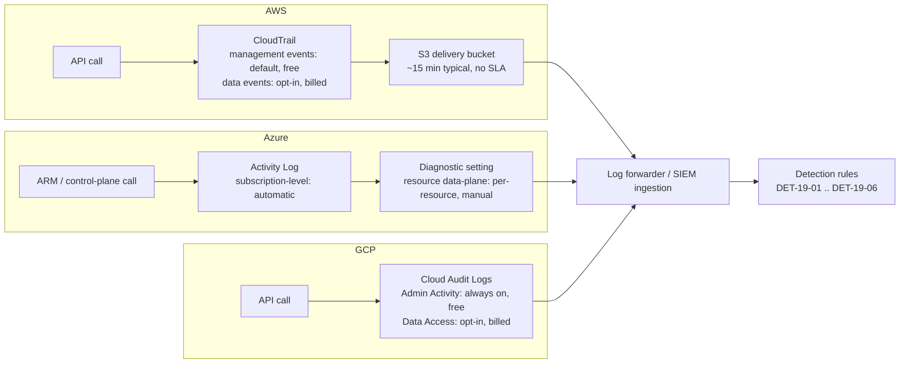
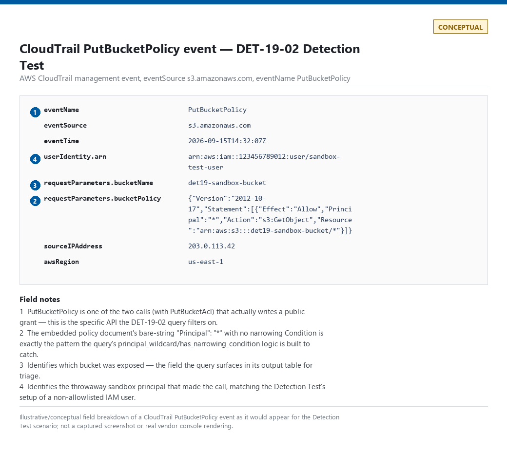
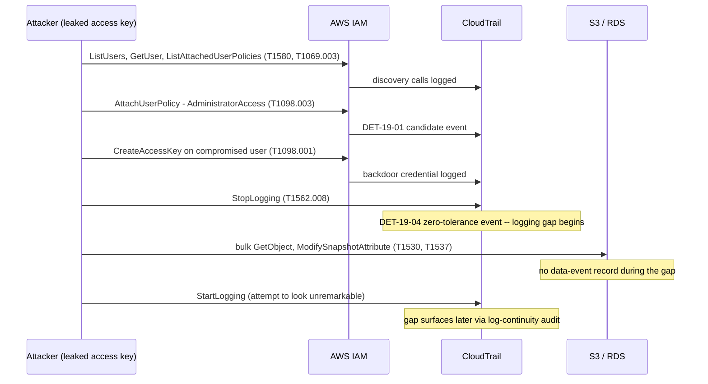
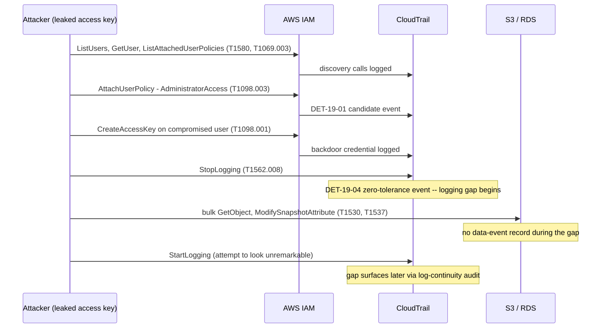

# Part 19 — Cloud Infrastructure Detection Engineering

## Why this part exists

**[CONCEPT]** This part covers the cloud provider's own control plane — AWS, Azure, and GCP — as opposed to the identity-provider and SaaS layer that sits on top of it. **Part 18 owns Entra ID, Okta, Google Workspace, M365, OAuth/app-consent abuse, cross-tenant and guest risk, and conditional-access bypass.** This part owns what happens once a principal — human or machine, native cloud IAM identity or a federated one Part 18 already authenticated — starts calling the provider's own management APIs: IAM policy changes, storage and network exposure, admin API actions, credential usage, and mass data access or exfiltration from cloud-native data stores. The two parts meet at exactly one seam: Part 18 tells you *who* authenticated and *how*; this part tells you what that identity then *did* to the infrastructure, and how the infrastructure's own logging tells you about it — or fails to.

Part 4 already surveyed cloud telemetry at the same visibility/blind-spot/volume/cost scoring level as every other log source in that part; this part assumes that survey and goes deep on the analytic layer built on top of it. Appendix A3 carries the field-level reference for CloudTrail, the Azure Activity Log, and GCP Cloud Audit Logs — this part cites specific fields inline but doesn't re-derive the full schema for any of the three.

Three scope boundaries matter before anything else:

- **This part is provider-agnostic in structure and AWS-heavy in worked examples.** AWS CloudTrail has the largest deployed base and the richest public detection-engineering literature, so most fully-worked queries below target it. Where Azure or GCP's equivalent mechanism differs in a way that changes the detection logic — not just the field names — that difference is called out explicitly rather than assumed to be a find-and-replace exercise.
- **No real captured evidence backs this part.** The author's home lab is entirely on-premises (Proxmox, containers, a physical network) — it has no AWS, Azure, or GCP footprint to draw genuine telemetry from. Every diagram below is rendered and tagged `CONCEPTUAL`; the one screenshot reference is labeled as an illustrative, non-captured breakdown rather than a real capture. None is fabricated as a captured example, and no vendor console screenshot appears anywhere in this part.
- **Workload-level detection inside a compromised cloud instance or container is out of scope here.** Once an attacker is executing code on an EC2 instance, an Azure VM, or a GCE instance, Part 11's cross-OS endpoint analytics apply the same way they would on-premises. This part stops at the control-plane boundary — the API calls that create, modify, expose, or delete cloud resources — and says so explicitly at every point where that boundary creates a blind spot.

---

## 1. Control-plane logging architecture and delivery-lag characteristics

**[ENGINEERING]** All three major providers generate a control-plane audit trail as a byproduct of every management API call, but the three differ in what's on by default, what costs extra, and how long a record takes to actually reach a place you can query it.

- **AWS CloudTrail** records two event categories. **Management events** (IAM changes, security group changes, most `Create`/`Delete`/`Modify` API calls against account-level resources) are logged by a default trail at no extra cost. **Data events** (S3 object-level `GetObject`/`PutObject`, Lambda invocations, DynamoDB item-level operations) are off by default and billed per-event once enabled — this single fact is the most common reason a mass-access detection later in this part turns out to have nothing to alert on.
- **Azure Activity Log** captures subscription-level control-plane operations (role assignments, resource creation/deletion) automatically, with no configuration required and no direct cost. Resource-level *data-plane* operations — a read against a specific blob, a query against a specific database — require a per-resource diagnostic setting pointing at a Log Analytics workspace, Event Hub, or storage account, and that step is easy to miss on any resource provisioned outside a hardened deployment template.
- **GCP Cloud Audit Logs** splits the same way: **Admin Activity** audit logs (resource configuration changes) are always on, cannot be disabled, and are free. **Data Access** audit logs (read/write access to the data inside a resource — object reads, database queries) are opt-in per service and billed, with a smaller number of GCP services supporting them at all compared to the breadth of AWS data events.

The pattern across all three: **the "who changed what" layer is close to free and on by default; the "who read what data" layer costs money, needs explicit enablement, and is the layer mass-exfiltration detection actually depends on.** A team that onboarded "cloud logging" by turning on the default trail, the default Activity Log, or the always-on Admin Activity logs has real IAM-abuse visibility and close to zero object-level access visibility, without necessarily realizing the gap exists.

> **Engineering Reality**
> CloudTrail's documented delivery target is roughly 15 minutes from API call to log delivery, and that number has no formal SLA behind it — it is a typical figure, not a guarantee. Under provider-side load, during a regional incident, or for a multi-region trail aggregating from a region under stress, delivery lag can run considerably longer with no error surfaced anywhere in your pipeline; a query that assumes "if it happened, it's queryable within 20 minutes" will occasionally be wrong in exactly the window that matters most — the first hour of an active intrusion. Azure Activity Log and GCP Cloud Audit Logs carry similar undocumented-but-real lag under load. Build correlation windows and "no alert fired" confidence statements with this lag as an explicit assumption, not a silent one.

> **Engineering Reality — knowing when a detection has gone quiet**
> Every detection in this part (`DET-19-01` through `DET-19-06`) and both hunts (`HUNT-19-01`, `HUNT-19-02`) fails silently, not loudly: a broken query, a stale lookup, a renamed field after a log-source upgrade, or a stopped forwarder all produce zero rows — indistinguishable from "nothing bad happened" unless something else is watching the pipeline. Concrete failure modes specific to this part: the AWS Add-on for Splunk (or an equivalent CloudTrail parser) changes a field path or sourcetype name on upgrade and every `spath`/`rex` extraction in §§2–7 silently stops matching; a trail's S3 delivery bucket policy is tightened and object delivery stops while `IsLogging` still reports `true` (§5's own Blind Spot); or a lookup file (`known_cicd_principals_lookup`, `known_partner_accounts_lookup`, `known_dangerous_managed_policies_lookup`) stops being refreshed after the job that seeds it breaks, so it keeps serving stale-but-present data instead of erroring. Two checks catch this independent of any one query's own logic: (1) a daily canary count against the raw sourcetype with no `eventName` filter — `sourcetype=aws:cloudtrail eventSource=iam.amazonaws.com | stats count` — alerting on a sharp drop from the trailing 7-day baseline, which catches ingestion and connector failures directly, independent of whether any specific detection logic still works; and (2) tracking each detection's own weekly hit count and alerting on an unexplained drop to zero. §2.1's own stated baseline — "roughly one to five alerts a week" for `DET-19-01` once the CI/CD allowlist is current — makes this concrete: a month of zero `DET-19-01` hits in an environment still running active Terraform pipelines is a broken query or broken lookup, not a quiet month, and should be treated as a pipeline-health finding to chase down rather than a result to trust.

**[CONCEPT]** MITRE ATT&CK's Cloud platform scope is the right frame for almost everything in this part — most techniques below carry a `.0XX` cloud-specific sub-technique distinct from the on-premises version of the same idea, and mixing the two up is a common, avoidable mapping error.




**Figure FIG-19-01 — Control-plane log delivery paths across AWS, Azure, and GCP.** *CONCEPTUAL.* Illustrates the general shape of the "on by default vs. opt-in and billed" split described above and where a detection's telemetry dependency actually terminates before it reaches a SIEM. This is a generic architecture sketch, not a capture from any specific account or tenant.



---

## 2. IAM policy abuse and cloud privilege escalation

**[CONCEPT]** Cloud privilege escalation almost never involves an exploit — it involves a principal that already has *some* permissions using them to grant itself more, through the same IAM APIs a legitimate administrator uses for routine access management. AWS alone has more than 20 documented IAM-permission combinations that let a principal escalate to full administrative control (attaching a policy to itself, creating a new policy version, passing a role with broader permissions to a service that will then execute using it, and others) — the common thread across all of them is that each individual API call is completely ordinary, and it's the *sequence and target* that turns it into an attack.

**MITRE:** T1098.003 (Account Manipulation: Additional Cloud Roles), T1548.005 (Abuse Elevation Control Mechanism: Temporary Elevated Cloud Access), T1069.003 (Permission Groups Discovery: Cloud Groups)

### 2.1 A worked privilege-escalation detection

**[DETECTION ENGINEER]** This targets AWS CloudTrail ingested into Splunk via the AWS Add-on, and flags any principal attaching or creating an IAM policy whose document grants broad wildcard access, cross-referenced against a maintained allowlist of the CI/CD and infrastructure-as-code service principals expected to do exactly this as routine automation.

The event names below do not share one request shape: `AttachUserPolicy`/`AttachRolePolicy`/`AttachGroupPolicy` attach an existing managed or customer-managed policy by ARN and carry no embedded policy document at all, while `PutUserPolicy`/`PutRolePolicy`/`PutGroupPolicy`/`CreatePolicyVersion` carry an inline `policyDocument`. Parsing only `policyDocument` — an earlier version of this query's only mistake — silently drops every `Attach*` event, including the exact `AdministratorAccess` attach the §8 case study walks through, because there is no document there to match. The group-scoped calls matter on their own: a principal that reaches `AdministratorAccess` by attaching it to a group it already belongs to, rather than to itself or its role directly, produced no alert at all in a version of this query scoped only to user/role events. The wildcard check also matches `"Action"`/`"Resource"` written as a single-element array (`"Action": ["*"]`), not just the bare string form (`"Action": "*"`) — IAM accepts both, and they grant identically.

CONCEPTUAL SAMPLE — invented field paths approximating the AWS Add-on's CloudTrail sourcetype; validate against your actual ingested schema before deploying.
```spl
sourcetype=aws:cloudtrail eventSource=iam.amazonaws.com
    (eventName=AttachUserPolicy OR eventName=AttachRolePolicy OR eventName=AttachGroupPolicy
     OR eventName=PutUserPolicy OR eventName=PutRolePolicy OR eventName=PutGroupPolicy
     OR eventName=CreatePolicyVersion)
| eval policy_arn=coalesce('requestParameters.policyArn', "")
| lookup known_dangerous_managed_policies_lookup policy_arn OUTPUT is_dangerous_managed_policy
| spath input=requestParameters.policyDocument output=policy_doc
| eval grants_wildcard_inline=if(isnotnull(policy_doc) AND
    (match(policy_doc, "\"Action\"\s*:\s*(\"\*\"|\[\s*\"\*\"\s*\])") OR
     match(policy_doc, "\"Resource\"\s*:\s*(\"\*\"|\[\s*\"\*\"\s*\])")), 1, 0)
| eval grants_wildcard=if(grants_wildcard_inline=1 OR is_dangerous_managed_policy=1, 1, 0)
| where grants_wildcard=1
| lookup known_cicd_principals_lookup arn as userIdentity.arn OUTPUT is_known_cicd
| where isnull(is_known_cicd)
| table _time, userIdentity.arn, userIdentity.type, eventName, sourceIPAddress, requestParameters.policyName, requestParameters.policyArn
```

**MITRE:** T1098.003 (Account Manipulation: Additional Cloud Roles)

This query now branches on event shape: `Attach*Policy` calls (user, role, or group) are scored against a maintained lookup of dangerous AWS-managed and customer-managed policy ARNs (`AdministratorAccess`, `PowerUserAccess`, `IAMFullAccess`, and any customer-managed policy previously flagged as wildcard-granting), while `Put*Policy`/`CreatePolicyVersion` calls are scored by parsing the inline document. A customer-managed policy attached by ARN that has never been scored before — created outside this pipeline's visibility, or scored before a later `CreatePolicyVersion` made it more permissive — will not appear in the lookup and produces a silent false negative rather than an error; refreshing the lookup from a periodic `CreatePolicyVersion`/`CreatePolicy` sweep, not a one-time seed, is what keeps this gap from growing. On a mid-sized AWS Organization with active Terraform/IaC pipelines, expect this tuned version to produce roughly one to five alerts a week once the CI/CD allowlist is current — materially different from the "well over a hundred alerts a day" the naive version produced.

> **Detection Autopsy — "any policy-attachment call is an alert"**
>
> **The rule:** Fires on any `AttachUserPolicy`, `AttachRolePolicy`, `PutUserPolicy`, or `PutRolePolicy` CloudTrail event, regardless of what the policy actually grants or who called it.
>
> **Why it shipped:** It's the single API call every cloud privilege-escalation write-up names as the final step, it needs no policy-document parsing, and it maps cleanly to a training deck's "watch for this call" slide.
>
> **How it failed:** A mid-sized environment's Terraform pipeline, onboarding automation, and access-request workflow collectively call these four APIs dozens of times a day as completely routine access management — the rule generated well over a hundred alerts a day within its first week, almost none of which an analyst could distinguish from legitimate access grants without opening the policy document by hand every single time.
>
> **The fix:** Score the policy document's actual content — does it grant a wildcard action or resource, an administrator-equivalent managed policy, or a permission the granting principal itself doesn't hold (a privilege-escalation-specific red flag distinct from ordinary over-provisioning) — and exclude the specific, named CI/CD and IaC service principals that perform this action as their job, reviewed on the same schedule as any other exception (TERMINOLOGY.md § Exception).

> **False Positive Trap**
> Terraform, CloudFormation, and any GitOps-driven IAM pipeline call exactly the same APIs this detection targets, as their entire purpose. The fix is an allowlist keyed on the exact principal ARN of the deployment role or service account — never a blanket exclusion for "automation," which an attacker who compromises a CI/CD credential (a real, common initial-access path in its own right) would also match.

> **Blind Spot**
> This detection sees the policy *attachment* event. It does not see a principal that already holds `iam:PassRole` combined with permission to launch a compute resource or Lambda function — the classic "pass a role with broader permissions to a service that will assume it on your behalf" escalation path never calls `AttachPolicy` at all, so a rule scoped only to attachment events is structurally blind to one of the most common documented AWS escalation techniques. Covering that path requires a separate detection built around `iam:PassRole` combined with a resource-creation call in the same short window from the same principal — a correlation, not a single-event match. The same class of gap covers `AddUserToGroup`: a principal added to a group that already carries an `AdministratorAccess` (or otherwise wildcard) attachment gains full access with no `Attach*Policy` or `Put*Policy` call of its own — the group's original attachment event, if it predates this detection's deployment or falls outside whatever lookback window a hunt against it uses, is the only place the actual grant is visible.

> **Detection Test**
> **Setup:** Isolated AWS sandbox account, one throwaway IAM user not on the CI/CD allowlist, CloudTrail enabled with management events.
> **Action:** `aws iam attach-user-policy --user-name <sandbox-user> --policy-arn arn:aws:iam::aws:policy/AdministratorAccess`
> **Expected result:** An `AttachUserPolicy` CloudTrail event with `requestParameters.policyArn` equal to the AdministratorAccess ARN and `requestParameters.userName` matching the sandbox user; the query above should return this event (via the dangerous-managed-policy lookup path, not the inline-document path) within the provider's typical delivery window, with `is_known_cicd` null.

---

## 3. Storage exposure: public buckets, containers, and object-level access changes

**[CONCEPT]** A storage bucket, blob container, or GCS bucket becomes internet-accessible through an ordinary policy or ACL change — `PutBucketPolicy` or `PutBucketAcl` in AWS, a storage account's public-access-level setting in Azure, or an IAM binding granting `allUsers`/`allAuthenticatedUsers` in GCP. **ATT&CK doesn't carry a dedicated technique for the exposure state itself** — creating a public bucket is a misconfiguration, not an attacker action, unless an attacker with existing access deliberately opens one for later staged exfiltration. Where that's the scenario, the exposure-creation call is best understood as enabling T1530 (Data from Cloud Storage) rather than forced into a technique of its own.

### 3.1 A worked detection: policy change introducing public access

**[DETECTION ENGINEER]** Scoped to AWS CloudTrail, this flags any `PutBucketPolicy` or `PutBucketAcl` call whose resulting policy grants read or write access to `"Principal": "*"` without a compensating condition (a source-IP or VPC-endpoint restriction narrowing that wildcard back down).

`PutBucketPolicy` and `PutBucketAcl` encode "public" completely differently in CloudTrail: a bucket policy grants access via a JSON `Principal` element, while an ACL grants access via a `Grantee` pointing at one of S3's two fixed predefined-group URIs (`AllUsers`, `AuthenticatedUsers`) — there is no `Principal` field anywhere in an ACL grant, so matching both event types against the same `Principal` regex, as an earlier version of this query did, silently drops every public-via-ACL case. `Principal` also has two valid JSON shapes — the bare string `"Principal": "*"` and the object form `"Principal": {"AWS": "*"}` (or `{"AWS": ["*"]}`) — both grant the same public access, and an earlier version of this query matched only the bare-string form. Separately, checking only whether a `Condition` block exists at all, rather than what it actually restricts, means adding any `Condition` — including a no-op one — suppressed the alert; the query below requires a specific narrowing key instead, though even that can't yet tell a real restriction from a no-op value (see the Blind Spot below).

CONCEPTUAL SAMPLE — illustrative; production use needs the same field-shape care noted in §2.1.
```spl
sourcetype=aws:cloudtrail eventSource=s3.amazonaws.com
    (eventName=PutBucketPolicy OR eventName=PutBucketAcl)
| spath input=requestParameters.bucketPolicy output=policy_doc
| spath input=requestParameters.AccessControlPolicy output=acl_doc
| eval principal_wildcard=if(match(policy_doc, "\"Principal\"\s*:\s*\"\*\"") OR
    match(policy_doc, "\"Principal\"\s*:\s*\{\s*\"AWS\"\s*:\s*(\"\*\"|\[\s*\"\*\"\s*\])"), 1, 0)
| eval has_narrowing_condition=if(match(policy_doc,
    "aws:SourceIp|aws:SourceVpce|aws:SourceVpc|aws:PrincipalOrgID"), 1, 0)
| eval grants_public=case(
    eventName="PutBucketPolicy", if(principal_wildcard=1 AND has_narrowing_condition=0, 1, 0),
    eventName="PutBucketAcl", if(match(acl_doc, "groups/global/(AllUsers|AuthenticatedUsers)"), 1, 0),
    true(), 0)
| where grants_public=1
| table _time, userIdentity.arn, requestParameters.bucketName, eventName, sourceIPAddress
```

**MITRE:** T1530 (Data from Cloud Storage) — mapped to the *consequence* this configuration change enables, not the change itself, per the scope note above.

> **False Positive Trap**
> A bucket deliberately hosting a static website, a public dataset, or public release artifacts legitimately carries the same `Principal: "*"` policy or `AllUsers` ACL grant this detection targets — S3 static-website hosting and public open-data buckets are not edge cases, they're a documented, supported AWS pattern. The fix is an allowlist of bucket names/ARNs approved for public hosting, reviewed on the same exception schedule as §2.1's CI/CD allowlist, not a blanket exclusion for "buckets with a website configuration," since an attacker who can enable static-website hosting on a bucket they've already compromised would trivially qualify for that exclusion too.

> **Blind Spot**
> This detection only fires on `PutBucketPolicy` and `PutBucketAcl` — the two calls that actually write a public grant. It does not see `PutPublicAccessBlock` (or the account-level `DeletePublicAccessBlock`) removing S3 Block Public Access from a bucket that already carries a dormant wildcard policy or ACL grant predating this detection's deployment — disabling Block Public Access on such a bucket makes it publicly reachable immediately, with no `PutBucketPolicy`/`PutBucketAcl` event anywhere near that moment for this query to match. Also unresolved: a policy author can add a `Condition` block referencing `aws:SourceIp` with a value of `0.0.0.0/0` — syntactically a narrowing condition, functionally a no-op — and the key-presence check above treats it the same as a real restriction. Closing both gaps needs a separate check on `PutPublicAccessBlock`/`DeletePublicAccessBlock` events and, for the condition case, parsing the actual condition value rather than just its key.

> **Detection Test**
> **Setup:** Isolated AWS sandbox account, one throwaway S3 bucket with no real data, CloudTrail enabled with management events.
> **Action:** `aws s3api put-bucket-policy --bucket <sandbox-bucket> --policy '{"Version":"2012-10-17","Statement":[{"Effect":"Allow","Principal":"*","Action":"s3:GetObject","Resource":"arn:aws:s3:::<sandbox-bucket>/*"}]}'`
> **Expected result:** A `PutBucketPolicy` CloudTrail event with `requestParameters.bucketName` matching the sandbox bucket and a `bucketPolicy` value containing `"Principal": "*"`; the query above should return exactly this event within the provider's typical delivery window.



**Figure — CloudTrail event view of the `PutBucketPolicy` call from the Detection Test above.** *CONCEPTUAL — illustrative field breakdown; not a captured screenshot.* This part's evidence set is entirely on-premises and has no cloud-provider footprint to draw a real capture from; the breakdown illustrates the field values the DET-19-02 query matches against (`eventName`, `userIdentity.arn`, `requestParameters.bucketName`, and the `Principal": "*"` bucket policy document) rather than proving a live capture.

---

## 4. Network exposure: security groups, NSGs, and firewall rules opened to the world

**[CONCEPT]** The cloud-native equivalent of "opened a port to the internet" is a security group ingress rule (AWS), a network security group rule (Azure), or a firewall rule (GCP) that permits `0.0.0.0/0` on a sensitive port — administrative ports (22, 3389), database ports (3306, 5432, 6379, 27017), or an internal management interface never meant to face the internet at all.

**[DETECTION ENGINEER]** Built for AWS, the query below flags `AuthorizeSecurityGroupIngress` calls introducing a `0.0.0.0/0` (or `::/0`) source range on a defined sensitive-port list.

Two gaps in an earlier version of this query: matching `fromPort` against an exact list of sensitive ports missed a rule with `ipProtocol: "-1"` (all protocols, all ports) or a wide range (e.g., `fromPort: 0, toPort: 65535`) that contains a sensitive port without being numerically equal to it — either opens strictly more than one sensitive port would, and both defeated the naive exact-match regex. Watching only `AuthorizeSecurityGroupIngress` also missed `ModifySecurityGroupRules` — the newer bulk-edit API the EC2 console uses to widen an existing rule's CIDR to `0.0.0.0/0` in place — which never calls `Authorize*` at all. The two event types nest their rule fields differently (`ipPermissions[].fromPort`/`IpRanges[].CidrIp` vs. `SecurityGroupRules[].SecurityGroupRule.FromPort`/`CidrIpv4`); validate the exact field paths and casing against your own ingested schema before deploying either branch.

CONCEPTUAL SAMPLE — sensitive-port list is a starting point, not exhaustive; extend it to match your own environment's actual exposed services.
```spl
sourcetype=aws:cloudtrail eventSource=ec2.amazonaws.com
    (eventName=AuthorizeSecurityGroupIngress OR eventName=ModifySecurityGroupRules)
| eval rule_json=case(
    eventName="AuthorizeSecurityGroupIngress", spath(_raw, "requestParameters.ipPermissions{}"),
    eventName="ModifySecurityGroupRules", spath(_raw, "requestParameters.SecurityGroupRules{}.SecurityGroupRule"))
| mvexpand rule_json
| eval opened_to_world=if(match(rule_json, "0\.0\.0\.0/0") OR match(rule_json, "::/0"), 1, 0)
| rex field=rule_json "(?i)\"ipProtocol\"\s*:\s*\"(?<protocol>[^\"]+)\""
| rex field=rule_json "(?i)\"fromPort\"\s*:\s*(?<from_port>-?\d+)"
| rex field=rule_json "(?i)\"toPort\"\s*:\s*(?<to_port>-?\d+)"
| eval from_port=coalesce(from_port, -1), to_port=coalesce(to_port, -1)
| eval sensitive_port=if(protocol="-1" OR from_port=-1 OR
    (from_port<=22 AND to_port>=22) OR (from_port<=3389 AND to_port>=3389) OR
    (from_port<=3306 AND to_port>=3306) OR (from_port<=5432 AND to_port>=5432) OR
    (from_port<=6379 AND to_port>=6379) OR (from_port<=27017 AND to_port>=27017), 1, 0)
| where opened_to_world=1 AND sensitive_port=1
| table _time, userIdentity.arn, requestParameters.groupId, eventName, protocol, from_port, to_port, sourceIPAddress
```

**MITRE:** T1562.007 (Impair Defenses: Disable or Modify Cloud Firewall)

This catches only the moment a rule is *created* or *modified* to add the exposure; a security group that was already misconfigured before logging began, or before this rule was deployed, produces no event for this query to match — the standing-exposure case needs a periodic configuration snapshot compared against policy, not an event-stream detection, and belongs to a cloud-security-posture-management process rather than this part's real-time analytic layer.

> **False Positive Trap**
> A load balancer's security group, or a bastion host explicitly designed for internet-facing SSH access, both legitimately carry `0.0.0.0/0` ingress on ports this rule would otherwise flag. Maintain an explicit exception list of resource IDs — not port numbers — that are deliberately internet-facing by design, reviewed against the same expiry discipline as any other exception, and alert unconditionally on any *new* security group or a change to a security group not already on that list.

> **Hunter's Note**
> When you find one over-permissive security group rule during a hunt, pivot immediately to `requestParameters.groupId` across the full CloudTrail history for that group, not just the most recent change — a common pattern is a rule opened briefly for a legitimate one-off need, followed by someone forgetting to close it back down months earlier than the change that actually drew your attention. The group's full modification history usually tells you whether this is a fresh attacker action or old accumulated drift, faster than asking the resource owner.

> **Detection Test**
> **Setup:** Isolated AWS sandbox account, one throwaway security group not on the internet-facing-by-design exception list, CloudTrail enabled with management events.
> **Action:** `aws ec2 authorize-security-group-ingress --group-id <sandbox-sg> --protocol tcp --port 22 --cidr 0.0.0.0/0`
> **Expected result:** An `AuthorizeSecurityGroupIngress` CloudTrail event with `requestParameters.groupId` matching the sandbox group and an `ipPermissions` entry showing `fromPort` 22 and a `0.0.0.0/0` CIDR; the query above should return this event, since the sandbox group is neither an existing exception nor a load balancer/bastion.

---

## 5. Admin API actions and logging-tamper detection

**[ANALYST]** Some cloud API calls carry enough inherent risk that the correct triage posture is unconditional escalation regardless of context — most of them cluster around disabling or narrowing the provider's own audit trail. `StopLogging` and `DeleteTrail` (AWS CloudTrail), deleting or disabling a diagnostic setting (Azure), and deleting a logging sink (GCP Cloud Audit Logs) all share the same defining property: **a successful call to any of them means the next several minutes to hours of activity from that account may never be recorded at all.**

**[DETECTION ENGINEER]** Scoped to AWS, this fires on any of the small, high-value set of logging-control-plane calls.

`PutEventSelectors` belongs on this list alongside `StopLogging`/`DeleteTrail`/`UpdateTrail`: it can narrow a trail's management- or data-event selectors down to nothing while `IsLogging` stays `true` and no Stop/Delete call ever fires — the trail looks healthy in the console while recording almost nothing.

CONCEPTUAL SAMPLE — the eventName list is the complete set worth zero-tolerance treatment for CloudTrail specifically; extend with GuardDuty/Config equivalents.
```spl
sourcetype=aws:cloudtrail eventSource=cloudtrail.amazonaws.com
    (eventName=StopLogging OR eventName=DeleteTrail OR eventName=UpdateTrail
     OR eventName=PutEventSelectors)
| table _time, userIdentity.arn, userIdentity.type, eventName, requestParameters.name, sourceIPAddress, awsRegion
```

**MITRE:** T1562.008 (Impair Defenses: Disable or Modify Cloud Logs)

> **SOC Management View**
> This detection belongs on the same zero-tolerance policy tier as Windows Event ID 1102 (audit log cleared) elsewhere in this book: no tuning, no volume-based suppression, page-out on every occurrence regardless of whose credentials made the call, because a legitimate reason to disable the account's own audit trail should be rare enough that it's coordinated with the SOC in advance, not discovered after the fact. If your team is routinely closing these as benign, that's a signal the organization has a standing operational practice worth formalizing as a documented change window, not a reason to tune the detection down.

> **Blind Spot**
> This detection only sees calls to CloudTrail's own control API. It does not see the delivery path broken from the S3 side — deleting the destination bucket, changing its policy to deny CloudTrail's `PutObject` permission, or adding a lifecycle rule that expires objects on arrival all stop logs from landing anywhere queryable, with `IsLogging` still reporting `true` and none of `StopLogging`/`DeleteTrail`/`UpdateTrail`/`PutEventSelectors` ever firing. Catching that requires a separate check — periodically confirming new objects are actually arriving in the trail's delivery bucket, not just that the trail's own API reports itself as enabled.

> **Detection Test**
> **Setup:** Isolated AWS sandbox account with a non-default trail configured (never disable logging on a production trail to test this).
> **Action:** `aws cloudtrail stop-logging --name <sandbox-trail>`
> **Expected result:** A `StopLogging` CloudTrail management event for the API call itself, since CloudTrail logs the call that disables it before the disabling takes effect — this is the one moment the detection can rely on, and the reason the rule above has no false-negative gap for this specific call despite its target being "logging itself."

---

## 6. Credential usage: long-lived keys, instance metadata theft, and assumed-role chains

**[CONCEPT]** Cloud credential material comes in two shapes with very different risk profiles. **Long-lived credentials** — an IAM user's access key, a service account's JSON key file — don't expire on their own and remain valid until someone explicitly rotates or revokes them, which makes a leaked one (checked into a public repository, embedded in a mobile app, left in a CI log) dangerous indefinitely. **Temporary credentials** — issued by `sts:AssumeRole`, an instance's attached role via the Instance Metadata Service (IMDS), a workload identity federation token — expire on their own, typically within an hour, which limits blast radius but adds a distinct attack surface: an attacker who can reach the metadata endpoint from inside a compromised workload, or who can call `AssumeRole` with existing permissions, gets valid credentials without ever touching a stored secret.

**MITRE:** T1078.004 (Valid Accounts: Cloud Accounts), T1552.005 (Unsecured Credentials: Cloud Instance Metadata API), T1098.001 (Account Manipulation: Additional Cloud Credentials)

> **Engineering Reality**
> IMDSv2 (AWS's session-token-required metadata API version) closes the classic SSRF-to-credential-theft path that made the Capital One breach a widely cited case study — a request without a valid session token gets refused. It is not the account-wide default for every instance that has ever existed: instances launched before IMDSv2 became the platform default, or launched from an AMI/launch template that doesn't explicitly enforce it, still accept the older, unauthenticated IMDSv1 calls unless an administrator has gone back and hardened them individually. "We're on AWS in 2026" is not evidence IMDSv2 is enforced fleet-wide; check the actual per-instance metadata-options setting.

> **Blind Spot**
> An assumed-role chain — a human assumes Role A, which assumes Role B, which assumes Role C to reach the resource actually being accessed — frequently loses the original human identity along the way. AWS's `sourceIdentity` field is designed to persist that original identity through the chain, but it's only populated when every role in the chain explicitly requires it in its trust policy, which most environments don't configure. Without it, the CloudTrail record for the final action shows only the immediately-preceding role's ARN, not the person or system that started the chain — the same entity-resolution failure named generally in `TERMINOLOGY.md` § Entity Key / Entity Resolution, concretely instantiated here as "which human actually did this" being unrecoverable from the log alone once a chain is more than one hop deep.

### 6.1 A hunting angle: anomalous AssumeRole usage

**[THREAT HUNTER]** Standing detections on `AssumeRole` calls struggle with the same problem every high-volume, mostly-legitimate API faces: the call itself is completely ordinary — it's the backbone of how cross-account access and service-to-service permission delegation work in any mature AWS environment. A hunt-shaped approach works where a standing threshold rule doesn't: pull every `AssumeRole` event over a 30-day window, group by (role ARN, source IP/ASN, calling principal), and manually review any combination that's never occurred before in that window — a role that's always been assumed from a corporate VPN egress range, assumed for the first time from a residential ASN or a cloud-hosting provider's IP range, is a much stronger candidate for manual review than any fixed-threshold rule could isolate on its own.

> **What Would Change My Mind**
> This hunt assumes that a role's assuming-source population is stable enough over 30 days that a genuinely new (role, source) pair is rare and worth a human's time. If a production review showed a given environment's roles are routinely assumed from a wide, constantly-changing set of ephemeral compute sources (serverless functions scaling across many IPs, a CI/CD fleet with rotating egress addresses) as completely normal behavior, the "never seen before" framing would produce too many benign hits to be worth the manual-review cost, and this hunt would need to shift to ASN-level or account-level grouping instead of raw source IP.

An attacker who wants to evade this hunt outright has one reliable option: assume the role from a source that's already inside the 30-day "seen before" population — a compromised host on the corporate VPN egress range, or a compromised CI/CD runner whose IP or ASN is already an established source for that exact role. Nothing about grouping on (role ARN, source ASN, calling principal) distinguishes a legitimate call from that source from a malicious one; the hunt's entire value is catching the *first* time a role is assumed from somewhere new, not catching abuse from somewhere already trusted. That's the honest limit of a novelty-based hunt, not a flaw specific to this write-up. Running it concretely: pull 30 days of `AssumeRole` events, `stats count, min(_time) as first_seen by requestParameters.roleArn, source_asn, userIdentity.arn` (deriving `source_asn` from `sourceIPAddress` via an IP-to-ASN lookup, since CloudTrail doesn't carry ASN natively), and manually review every row where `first_seen` falls in the final day or two of the window — a null or unresolvable `source_asn` (a lookup gap, not a missing CloudTrail field) should be reviewed rather than dropped, since an unresolvable IP is at least as suspicious as a resolvable-but-new one.

---

## 7. Mass access and exfiltration from cloud data stores

**[CONCEPT]** Bulk data theft from a cloud environment usually looks like one of three shapes: a spike in object-read volume against a storage bucket or database, a snapshot or machine image deliberately shared to an external account, or a bulk export/backup action pointed at a destination outside the environment's own account boundary. All three route through ordinary, legitimate-looking API calls — the same `GetObject`, `CreateSnapshot`, and `ModifySnapshotAttribute` calls a backup job or a legitimate cross-account data-sharing arrangement uses routinely.

**MITRE:** T1530 (Data from Cloud Storage), T1537 (Transfer Data to Cloud Account)

### 7.1 A worked detection: cross-account snapshot sharing

**[DETECTION ENGINEER]** Also built for AWS, this flags any EBS snapshot or RDS snapshot whose access permissions are modified to add an AWS account ID outside a maintained allowlist of known partner/DR accounts.

The event types below encode the newly-added grantee under four different field paths — EBS snapshots nest it under `createVolumePermission`, AMIs use the same nested shape under `launchPermission` instead, RDS snapshots use a flat list of account-ID strings under `valuesToAdd` with no nested `userId` key at all, and Aurora cluster snapshots (`ModifyDBClusterSnapshotAttribute`) use that same flat `valuesToAdd` shape under a completely different eventName — a query scoped only to `ModifyDBSnapshotAttribute`, as an earlier version of this query was, never sees an Aurora share. All four shapes also accept the literal value `"all"` in place of a 12-digit account ID, to make the snapshot or image public to every AWS account rather than one named account; a regex that extracts only 12-digit numbers, as an earlier version of this query did, silently drops every "made public" case even though public sharing is strictly more exposure than sharing to one external account. Because Splunk's `mvexpand` drops any event whose target field is null, a bare `"all"` grant (no account ID present at all) is rewritten to a `PUBLIC` sentinel before `mvexpand` runs — otherwise the public-sharing case would vanish from the results the same way the 12-digit-only version silently dropped it.

CONCEPTUAL SAMPLE — illustrative; the allowlist lookup is the load-bearing control here and needs active maintenance, not a one-time entry.
```spl
sourcetype=aws:cloudtrail
    (eventName=ModifySnapshotAttribute OR eventName=ModifyDBSnapshotAttribute
     OR eventName=ModifyDBClusterSnapshotAttribute OR eventName=ModifyImageAttribute)
| spath input=requestParameters.createVolumePermission.add output=ebs_added
| spath input=requestParameters.launchPermission.add output=ami_added
| spath input=requestParameters.valuesToAdd output=db_added
| eval added_perms=coalesce(ebs_added, ami_added, db_added)
| rex field=added_perms max_match=0 "(?:userId\"?\s*[:=]\s*\"?|^\[?\"?)(?<added_account_id>\d{12})"
| eval shared_publicly=if(match(added_perms, "\"group\"\s*:\s*\"all\"") OR
    match(added_perms, "(^|[\[,\s])\"?all\"?\s*($|[\],])"), 1, 0)
| eval added_account_id=if(isnull(added_account_id) AND shared_publicly=1, "PUBLIC", added_account_id)
| mvexpand added_account_id
| lookup known_partner_accounts_lookup account_id as added_account_id OUTPUT is_known_partner
| where isnotnull(added_account_id) AND isnull(is_known_partner)
| table _time, userIdentity.arn, eventName, requestParameters.snapshotId, added_account_id, sourceIPAddress
```

**MITRE:** T1537 (Transfer Data to Cloud Account)

This query now also covers Aurora cluster snapshots (`ModifyDBClusterSnapshotAttribute`) and public sharing (a bare `"all"` value in place of an account ID) — both were silent false negatives in the account-only, RDS/EBS/AMI-only version. `PUBLIC` in the `added_account_id` field below always means the snapshot or image was shared with every AWS account, not one; treat it as strictly higher severity than a single unknown account ID, not the same finding with a different value.

> **Detection Test**
> **Setup:** Isolated AWS sandbox account, one throwaway EBS snapshot with no real data, CloudTrail enabled with management events.
> **Action:** `aws ec2 modify-snapshot-attribute --snapshot-id <sandbox-snapshot> --attribute createVolumePermission --operation-type add --user-ids <external-account-id>`
> **Expected result:** A `ModifySnapshotAttribute` CloudTrail event with `requestParameters.createVolumePermission.add` containing the external account ID; the query above should return this event with `added_account_id` matching that account and `is_known_partner` null, since the test account isn't on the partner allowlist.

> **Blind Spot**
> This detection depends entirely on S3, EBS, or database-service *data events* — the object- or snapshot-level access layer §1 named as opt-in and billed on every provider covered in this part. An account that enabled only the default management-event trail has zero visibility into bulk `GetObject` volume itself; the snapshot-sharing detection above still works, because sharing permissions is a management-event action, but a rule scored purely on GetObject-count spikes will silently return nothing — not an error, nothing — in an environment that never turned data events on. Confirm data-event logging is actually enabled before trusting an empty result from any object-level access-volume query as "no mass access occurred."

> **What Would Change My Mind**
> The volume-based half of mass-access detection (a GetObject count or byte-volume threshold per principal per hour) assumes real exfiltration produces a distinguishable spike above legitimate bulk-read workloads — ETL jobs, backup verification, data-warehouse loads. If a production baseline showed legitimate bulk-read jobs routinely exceed any threshold tight enough to catch a deliberately-throttled attacker, this section's confidence in a standalone volume threshold would need to drop, and the detection would need to shift toward the discovery-then-access sequence (unusual `ListBuckets`/`ListObjects` enumeration immediately preceding the read spike) rather than volume alone.

---

## 8. Case study: a stolen access key, traced end to end through CloudTrail

**[THREAT HUNTER]** The following case study is a composite, illustrative walk-through — not a captured real incident — built from the documented, commonly reported shape of AWS access-key-leak intrusions (a static key committed to a public code repository, found within minutes by automated scanning, and used the same day) to show how the detections in this part chain together in the order an analyst would actually encounter them.

**Hour 0.** A developer accidentally commits a `.env` file containing a long-lived IAM user access key to a public GitHub repository. Automated credential-scanning bots — a well-documented, real phenomenon independent of any targeted attacker — find and test it within minutes.

**Hour 0–1: discovery.** The attacker calls `ListUsers`, `GetUser`, `ListAttachedUserPolicies`, and `ListRoles` in quick succession from a cloud-hosting-provider IP address the compromised user's account has never used before — T1580 (Cloud Infrastructure Discovery) and T1069.003 (Permission Groups Discovery: Cloud Groups). Individually unremarkable read-only calls; collectively, an enumeration pattern no legitimate developer workflow produces in that sequence from that source.

**Hour 1: privilege escalation.** The compromised user happens to hold `iam:AttachUserPolicy` on itself — a common over-provisioning mistake, not a deliberate backdoor. The attacker calls `AttachUserPolicy`, attaching the AWS-managed `AdministratorAccess` policy to the compromised user — the exact pattern DET-19-01 (§2.1) is built to catch, assuming the source principal isn't already sitting on a CI/CD allowlist it has no legitimate reason to be on.

**Hour 1: persistence.** With administrative access secured, the attacker calls `CreateAccessKey` against the same compromised user, minting a second, attacker-controlled long-lived credential — T1098.001 (Account Manipulation: Additional Cloud Credentials) — so that rotating or deleting the originally-leaked key won't cut off access.

**Hour 1–2: defense evasion.** The attacker calls `StopLogging` against the account's CloudTrail trail — the exact call DET-19-04 (§5) treats as zero-tolerance — opening a window during which subsequent activity produces no management-event record. This is also the highest-leverage single point in the entire chain for a SOC that's actually paging on logging-tamper events: catching it here ends the intrusion with no data loss at all.

**Hour 2–4: collection and exfiltration, inside the logging gap.** With the trail disabled, the attacker enumerates S3 buckets and pulls a substantial fraction of a customer-data bucket's contents — T1530 (Data from Cloud Storage) — and separately shares a database snapshot to an external AWS account under the attacker's control — T1537 (Transfer Data to Cloud Account), the pattern DET-19-05 (§7.1) targets. Because logging was disabled for this window, the `GetObject` calls themselves produce no record even if data-event logging had been enabled beforehand; the snapshot-sharing call, made *after* the attacker re-enables logging to avoid drawing attention (see below), is the one action from this phase that does leave a trace.

**Hour 4: re-enablement.** The attacker calls `StartLogging` again, reasoning — correctly, in many real environments — that a trail found disabled during a later audit draws more scrutiny than one that was briefly off and is now back on.

**MITRE:** T1078.004 (Valid Accounts: Cloud Accounts), T1580 (Cloud Infrastructure Discovery), T1069.003 (Permission Groups Discovery: Cloud Groups), T1098.003 (Account Manipulation: Additional Cloud Roles), T1098.001 (Account Manipulation: Additional Cloud Credentials), T1562.008 (Impair Defenses: Disable or Modify Cloud Logs), T1530 (Data from Cloud Storage), T1537 (Transfer Data to Cloud Account)




**Figure FIG-19-02 — A composite privilege-escalation-to-exfiltration chain, traced through CloudTrail event types.** *CONCEPTUAL.* Illustrates the sequence and MITRE mapping of the case study above; built from the commonly reported shape of real leaked-access-key intrusions, not a capture from any specific incident or lab run.



> **SOC Management View**
> Every step in this case study before the logging-tamper call produces a normal, individually-explainable event; the single highest-leverage control point in the whole chain is treating `StopLogging`/`DeleteTrail` as an unconditional, zero-tolerance page (§5) — an organization that gets that one detection right catches this intrusion at hour one to two with no data loss, regardless of how well-tuned every other detection in this part is. If a budget conversation forces a choice about where to invest first in cloud-infrastructure detection maturity, the logging-tamper detection is the one with the highest return relative to its build cost — it's a single, narrow, low-noise rule with essentially no legitimate false-positive population to tune against.

---

## 9. Where this part stops

**[CONCEPT]** Cloud infrastructure detection engineering, as scoped here, does not cover: identity-provider and SaaS-layer detection — sign-in analytics, OAuth/app-consent abuse, conditional-access bypass (Part 18, exclusively); workload-level detection once an attacker is executing inside a compromised instance or container (Part 11's cross-OS endpoint analytics apply unchanged); container-orchestration-specific abuse (Kubernetes RBAC, pod escape, image-registry poisoning) which this part's control-plane scope does not reach; the statistical baselining and risk-scoring machinery a mature version of any detection in this part leans on (Parts 31 and 33); and the entity-resolution mechanics needed to reliably join a cloud principal's assumed-role chain back to a human identity across CloudTrail, Azure Activity Log, and an upstream identity provider (Part 30). The field-level schema reference for all three providers' audit logs lives in Appendix A3, not repeated here.

---

## Summary table: detections introduced in this part

**[DETECTION ENGINEER]** The table below maps each detection built in this part to the abuse pattern it targets and its MITRE coverage, to support quick lookup when cross-referencing from Part 41's coverage matrix.

| ID | Targets | Platform (illustrative) | MITRE |
|---|---|---|---|
| `DET-19-01` | IAM privilege escalation via policy attachment/creation | Splunk SPL (AWS CloudTrail) | T1098.003 (Account Manipulation: Additional Cloud Roles) |
| `DET-19-02` | Storage bucket/container exposed via public policy or ACL change | Splunk SPL (AWS CloudTrail) | T1530 (Data from Cloud Storage) |
| `DET-19-03` | Security group ingress opened to `0.0.0.0/0` on, or spanning, a sensitive port | Splunk SPL (AWS CloudTrail) | T1562.007 (Impair Defenses: Disable or Modify Cloud Firewall) |
| `DET-19-04` | CloudTrail logging disabled or deleted | Splunk SPL (AWS CloudTrail) | T1562.008 (Impair Defenses: Disable or Modify Cloud Logs) |
| `DET-19-05` | Snapshot/image sharing to an external, non-allowlisted account, or made fully public | Splunk SPL (AWS CloudTrail) | T1537 (Transfer Data to Cloud Account) |
| `DET-19-06` | Backdoor long-lived credential created on an existing identity | Splunk SPL (AWS CloudTrail) | T1098.001 (Account Manipulation: Additional Cloud Credentials) |

`DET-19-06` corresponds to the persistence step in the §8 case study (`CreateAccessKey` against an already-compromised user) and is built the same way as `DET-19-01` — a targeted-eventName filter against `iam.amazonaws.com`, joined against a recent-privilege-escalation or anomalous-login signal to cut down the routine-key-rotation noise a bare `CreateAccessKey` filter would otherwise produce; it is not repeated as a full code block above since its structure directly mirrors §2.1's query shape with a different `eventName`. Concretely, the join key is `userIdentity.arn`: a `CreateAccessKey` event scores as a candidate only when the same principal has a `DET-19-01` match, a `PutUserPolicy`/`AttachUserPolicy` event, or a HUNT-19-01 never-seen-before `AssumeRole` source within the preceding hour — a bare `CreateAccessKey` filter with no such join produces dozens of daily hits from ordinary key rotation and CI/CD onboarding, with no way to separate them from an attacker-minted backdoor key. If that correlating signal is missing or delayed (see §1's delivery-lag Engineering Reality box), this detection degrades silently to the unusably noisy baseline it was built to avoid, rather than failing loudly — worth a periodic check that the join is actually matching events, not just compiling. A separate, structural bypass: the join only fires when the *same* principal produced a matching precursor event. A principal that was already administrator-equivalent from the start — no escalation call needed — or one that escalated through a technique this part doesn't instrument (§2.1's own Blind Spot names `iam:PassRole` combined with a resource-launch call as one such path) can call `CreateAccessKey` on itself with no `DET-19-01`, `PutUserPolicy`/`AttachUserPolicy`, or `HUNT-19-01` signal to correlate against — a true negative from this detection's point of view, not a pipeline failure, and the reason `DET-19-06` is a noise-reduction layer over routine key creation rather than a general-purpose backdoor-key detector.

---

## Hunts introduced in this part

**[THREAT HUNTER]**

> **HUNT-19-01 — Anomalous AssumeRole source population.** §6.1's full hunting procedure: group 30 days of `AssumeRole` events by (role ARN, source ASN, calling principal) and manually review any combination with no prior occurrence in that window, prioritizing roles with sensitive attached permissions. This is a gap-driven hunt (Part 35) aimed directly at the blind spot named in §6's Blind Spot box — assumed-role chains that lose the original human identity are exactly the case a standing detection on `AssumeRole` volume alone can't reliably separate from routine cross-account delegation.

> **HUNT-19-02 — Dormant long-lived credential reactivation.** IAM access keys and service-account key files that haven't been used in 90-plus days, per each provider's own last-used tracking (AWS `GetAccessKeyLastUsed`, GCP service account key metadata), represent exactly the kind of forgotten, unrotated credential a leaked-secret scan or an old CI/CD job might surface to an attacker long after anyone remembers it exists. This hunt pulls the full inventory of long-lived credentials with a last-used timestamp older than 90 days, cross-references it against the same window's authentication activity, and flags any credential from that population that suddenly gets used — a much higher-confidence signal than "credential used," full stop, because the dormancy itself is what makes reactivation notable.
>
> **Running it and what it costs:** Pull `iam list-access-keys` plus `GetAccessKeyLastUsed` per key (or the GCP service-account-key equivalent) across the full account/org inventory, filter to `LastUsedDate` older than 90 days (or a null `LastUsedDate` for a key that has *never* been used, an even stronger signal), then re-check that same population against the following period's CloudTrail/audit-log activity for any call attributed to one of those key IDs. Expect a real inventory to surface a non-trivial resting population of dormant-but-valid keys — that population size, tracked over time, is itself a metric worth reporting even before any reactivation occurs. Two things legitimately produce a hit with no attacker involved and should be resolved as documented negatives, not silently dropped from the write-up: a scheduled disaster-recovery failover drill that deliberately exercises a credential nobody has touched since the last drill, and an annual compliance or audit process that authenticates with a break-glass key specifically because it's normally dormant — both are genuine reactivations of a genuinely dormant credential, and the hunt is working correctly when it surfaces them; the follow-up step is confirming the reactivation against a known change ticket, not tuning the hunt to ignore the pattern.
>
> An attacker who knows this hunt exists has a straightforward evasion: touch the credential often enough to never cross the 90-day dormancy line — a single low-frequency, low-privilege call every 60–80 days keeps `LastUsedDate` perpetually "recent" without ever triggering a volume-based detection either. This hunt only catches reactivation *after* a genuine dormancy gap; a credential an attacker deliberately keeps warm from the moment they obtain it is invisible to it by construction, which is the honest limit of a dormancy-based signal and the reason it's a hunt run periodically against the inventory, not a standing real-time detection.
