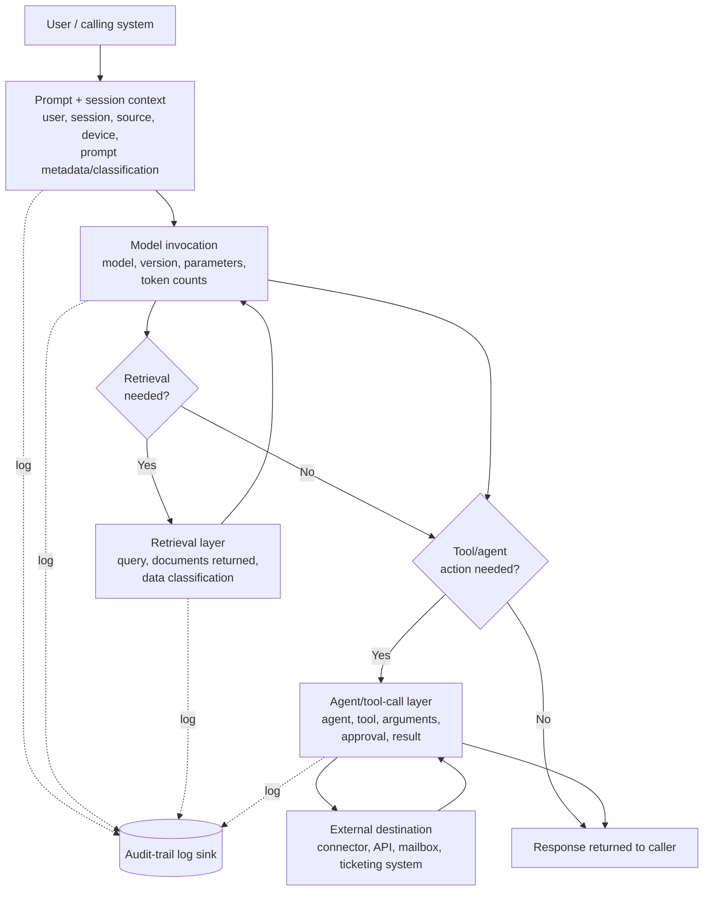
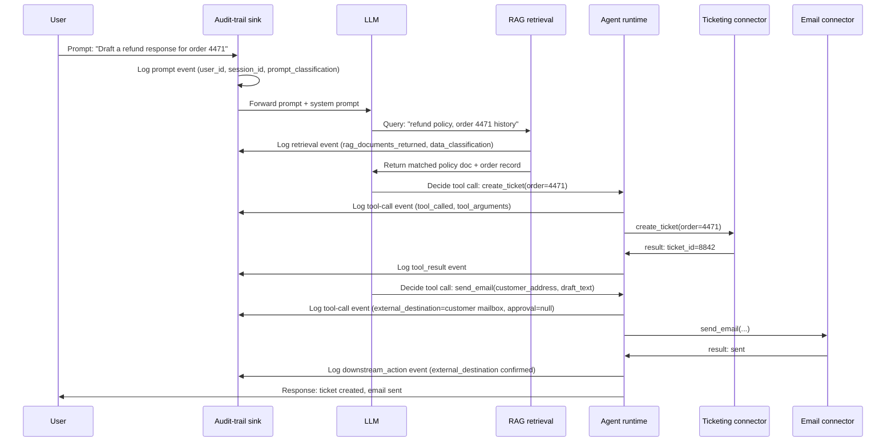
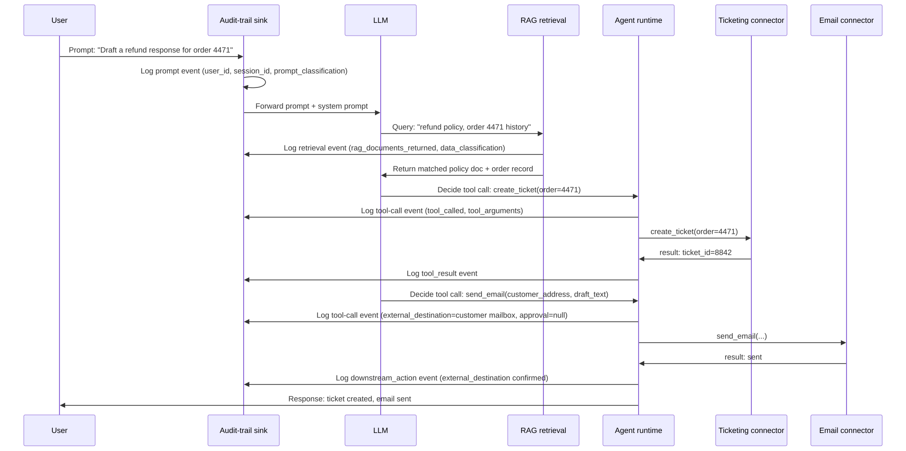

# Part 20 — AI Systems Telemetry & Audit-Trail Engineering

## Why this part exists

**[CONCEPT]** Part 4 §10 previewed AI systems telemetry as the one source in this book's telemetry survey with "no mature standard yet" in every scoring column, and showed real evidence — internet-wide scanners already probing for exposed MCP (Model Context Protocol) endpoints against this book's own honeynet, against a decoy that runs no actual AI-agent tooling at all (Figure 4.3). This part is where that preview gets a real answer: what to actually log for an LLM or agent system, field by field, and how to build a defensible audit trail out of it without creating a second, less-protected copy of every sensitive thing a user ever typed.

The split from Part 21 (AI Security Detection Engineering) follows the same telemetry-layer/analytic-layer separation this book applies everywhere else. This part does not cover prompt injection detection, RAG poisoning, or agent-abuse analytics — that is Part 21, built directly on the schema this part defines. This part's job is narrower and comes first: what data exists or should exist before any of those detections can be written at all, and the privacy and retention tradeoffs that come with logging it. Skipping this part and jumping to Part 21 is the AI-systems version of designing a correlation rule against a field your log source was never configured to populate — Part 1's `Data Feasibility` check, applied to a domain most programs haven't applied it to yet.

Scope: what to log across the prompt/session layer, the model-invocation layer, the retrieval (RAG) layer, and the agent/tool-call/connector layer; a defensible audit-trail field model built from those four layers; and the privacy and data-minimisation tradeoffs that come from logging natural-language content instead of structured event fields. This part explicitly does not recommend logging raw sensitive prompts forever — §7 argues the opposite in detail. Appendix A3 (Cloud & AI Telemetry Field Reference) carries the full field-by-field schema reference this part builds; treat this part as the reasoning behind that reference, not a duplicate of it.

---

## 1. Why AI systems break the existing telemetry model

**[CONCEPT]** Every telemetry source earlier in this book — Windows Security events, Sysmon, firewall session logs, database audit records — shares one property: the event's meaning is fixed by a schema the vendor or standard defined in advance. Event ID 4624 means the same thing every time it fires. A `conn.log` five-tuple means the same thing on every Zeek sensor. An LLM or agent system breaks that assumption at the most basic level: the "input" is unstructured natural language with no fixed shape, the "output" is nondeterministic (the same prompt against the same model can produce different completions), and a growing share of systems don't stop at producing text — they take real actions with real side effects, through tool calls and connectors, on the basis of that nondeterministic output.

This changes what "telemetry" even means for the source. A Windows logon event tells you an authentication happened; it doesn't need to also capture *why* LSASS decided to grant it, because the decision logic is fixed and well-documented elsewhere. An LLM's decision to call a `send_email` tool with a specific set of arguments has no equivalent fixed decision logic to point to — the "why" lives inside a model's weights, and the only record of it that will ever exist is whatever the system chose to log about that specific invocation, at that specific moment. If nothing captured the prompt, the retrieved context, and the exact tool call and arguments, there is no reconstructing after the fact what happened or why — unlike a Windows host, where the audit-policy gap in Part 8 §1 at least leaves open the possibility of finding the same activity through a different telemetry source (Sysmon, EDR, ETW). For a model's decision process, there usually isn't a second source to fall back on.

> **Engineering Reality**
> Model API providers vary widely, and inconsistently, in what they log or retain server-side by default — some enterprise agreements specify zero data retention for prompt content, others retain briefly for abuse monitoring and then delete, and a self-hosted or open-weight deployment logs exactly what you configured it to and nothing else. Do not assume a vendor's own logs exist to reconstruct an incident after the fact; confirm the specific retention terms of the specific provider and deployment mode in use, in writing, before a program's incident-response plan depends on someone else's log retention. If your own audit trail is the only place a given field is ever recorded, that's the normal case for this domain, not a gap to be embarrassed about — it's the reason this part exists.

**[ENGINEERING]** A second structural difference: most of the sources earlier in this book log *what happened on a system*. AI systems telemetry has to log *what happened on a system, plus the specific piece of natural-language content and retrieved data that caused it* — which means the audit trail itself now routinely contains the same category of sensitive content (customer PII pasted into a support prompt, a confidential document pulled back by a retrieval query) that the rest of the security program exists to protect. That single fact is why this part treats privacy and data-minimisation (§7) as a first-class engineering concern rather than a compliance afterthought bolted onto a finished logging design.

---

## 2. The four layers of an AI system interaction

**[CONCEPT]** Splitting "AI systems telemetry" into four layers keeps the field model in §3 from turning into an undifferentiated list of 40 fields with no structure. Every interaction with an LLM or agent system — a single chatbot turn, or a multi-step autonomous agent run — passes through some subset of these four layers, and each layer has a different owner, a different failure mode, and a different privacy-sensitivity profile:

1. **Prompt and session layer** — who asked, from where, in what session, and what the input actually was (or a classification of it, per §7).
2. **Model invocation layer** — which model, which version, with what parameters, consuming and producing how many tokens.
3. **Retrieval (RAG) layer** — what was queried against a knowledge base or vector store, what documents came back, and what those documents are classified as.
4. **Agent/tool-call and connector layer** — what the system decided to *do* as a result: which tool, with what arguments, against what external destination, under what approval, producing what downstream effect.

Not every interaction touches all four — a plain single-turn chatbot response with no retrieval and no tool access only touches layers 1 and 2. An autonomous agent resolving a support ticket by pulling a policy document and sending an email touches all four, and it's exactly that fourth layer — the one with real external side effects — that turns a logging gap from "we can't fully explain a chat transcript" into "we can't explain why an external system received data, from whom, or under what authority."






**Figure 20.1 (FIG-20-01) — The four layers of an AI system interaction, and where each one should emit to the audit-trail sink.** *CONCEPTUAL.* Illustrates the structural model this part uses to organize the field list in §3 — a single interaction may touch only layers 1–2 or all four, and the dotted lines mark the points a logging integration has to hook regardless of which vendor framework or model provider sits underneath. Not a capture of any specific product's internal architecture.

> **Blind Spot**
> This diagram shows the *intended* logging points. It says nothing about whether a given agent framework's SDK actually exposes a hook at each of them. Several popular agent frameworks expose the final tool call and its result cleanly but do not expose the model's intermediate reasoning that led to choosing that tool and those arguments — so an audit trail built entirely from SDK-level hooks can tell you *what* the agent did without ever being able to reconstruct *why* it decided to do it. If your incident-response process assumes it can always answer "why did the agent do that," verify your specific framework actually surfaces that content before promising it can.

---

## 3. The audit-trail field model

**[DETECTION ENGINEER]** The field groups below are organized by the four layers in §2. Every field carries a note on where in the pipeline it's populated and, where relevant, a forward pointer to the privacy tradeoff discussed in full in §7 — several of these fields are exactly the ones that should *not* default to unlimited raw retention.

### 3.1 Identity, session, and device context

The table below maps the identity and context fields every AI system interaction should carry, regardless of which of the four layers it touches — these are the fields that let an audit-trail record be joined back to the rest of the security program's existing identity and endpoint telemetry (Parts 3 and 12).

| Field | Populated at | Why it matters |
|---|---|---|
| `user_id` | Prompt/session layer | The authenticated identity issuing the request — must resolve to the same `Entity Key` (TERMINOLOGY.md) used elsewhere in the identity stack, not a local, AI-platform-specific user ID with no join path back to your IdP. |
| `session_id` | Prompt/session layer | Groups every turn of a multi-turn conversation or agent run into one correlatable unit — the AI-systems equivalent of a Windows Logon ID (see the Hunter's Note in Part 8 §3 on why a stable session key is the cheapest pivot you have). |
| `source_ip` / `source_app` | Prompt/session layer | Where the request originated — a browser session, a first-party mobile client, or a downstream service calling the model API on a user's behalf. Distinguishing a human-originated request from a service-to-service call changes what "normal" volume and timing look like for baselining (Part 31). |
| `device_id` | Prompt/session layer, if available | Ties the interaction to a managed-endpoint identity where one exists. Frequently unavailable for API-only or third-party-client access — record its absence explicitly rather than leaving the field silently null with no indication whether that's expected. |

### 3.2 Prompt, file, and classification metadata

These fields cover the input content itself and anything a user attaches to it — the layer most directly implicated in the privacy tradeoffs of §7, which is why every row below has a data-minimisation note rather than an unqualified "log the content" instruction.

| Field | Populated at | Why it matters |
|---|---|---|
| `prompt_classification` | Prompt/session layer, ideally before the model ever sees the raw text | A label — "contains PII," "contains credentials," "public/no sensitivity detected" — from a DLP-style classifier run on the prompt text. This is the field §7 argues should carry the long-term audit weight, not the raw prompt text itself. |
| `prompt_metadata` | Prompt/session layer | Length, language, whether the input was truncated, whether it included an attachment — structured facts about the prompt that carry almost none of the privacy exposure of the prompt text itself and are safe to retain long-term. |
| `file_name`, `file_mime_type`, `file_hash` | Prompt/session layer, on any file upload or attachment | The same triad this book's endpoint parts (Parts 3, 11) already treat as baseline forensic fields for any file object — a hash is joinable against threat intel and internal DLP scan results without ever needing to retain the file content itself in the AI system's own audit trail. |
| `data_classification` (input) | Prompt/session layer, from DLP scan of prompt text and any attached file | The organization's existing sensitivity taxonomy (public/internal/confidential/restricted, or equivalent), applied consistently to AI-system input the same way it's applied to a file share or an email attachment — see §6 for why this consistency, not novelty, is the actual engineering challenge. |

> **Engineering Reality**
> `prompt_classification` is only as good as the classifier running it, and running a full DLP-grade classifier synchronously, in the request path, on every single prompt adds latency a user-facing chat product will notice. Most production deployments compromise: a fast, cheap pattern/keyword pass runs synchronously and blocks or flags obvious cases (a pasted credential, a pasted SSN-shaped string), while a slower, more thorough classification pass runs asynchronously against the same logged prompt and updates the classification field after the fact. Design the audit-trail schema to support a classification field that can be written twice — a provisional value at request time, a revised value minutes later — rather than assuming it's final the moment the request completes.

### 3.3 Model invocation and retrieval fields

Here the fields shift to what the model itself consumed and produced, plus what the retrieval layer fed into it — the fields a cost-accounting report and a RAG-poisoning detection (Part 21) both draw from.

| Field | Populated at | Why it matters |
|---|---|---|
| `model` | Model invocation layer | The specific model identifier — not just "GPT" or "Claude" as a family name. Model behavior, safety tuning, and known failure modes differ meaningfully between versions of the same family. |
| `model_version` | Model invocation layer | The specific dated or numbered release. A prompt-injection mitigation or a tool-use behavior change between versions is invisible in an audit trail that only records the family name — you cannot correlate an incident to a model change you never recorded happening. |
| `token_counts` (prompt, completion, total) | Model invocation layer | Drives cost accounting (§9) and doubles as a coarse anomaly signal: a session whose completion token count is an order of magnitude above that user's baseline is worth a look, independent of what the content actually says. |
| `rag_query` | Retrieval layer | The query text or embedding sent to the retrieval system — same minimisation logic as the prompt itself (§7); many programs log a hash or a classification rather than the raw query. |
| `rag_documents_returned` (document IDs, source, classification) | Retrieval layer | The actual identifiers of what was retrieved and fed into the model's context window, plus each document's own classification tag. This is the field that lets you answer "did this session ever have a confidential document in its context" without needing to store the document text a second time inside the AI system's own logs — join back to the source document store by ID instead. |

> **Blind Spot**
> Logging which documents were *retrieved* is not the same as knowing which retrieved content actually made it into the model's final answer, or was passed on to a tool call. A retrieval system commonly returns more candidate documents than a model actually uses in its response — if your audit trail only distinguishes "retrieved" from "not retrieved" and never attempts to trace which retrieved content the output or a downstream tool call actually drew on, you can prove a confidential document was *available* to a session but not prove — or rule out — that it was *used*. Part 21 covers RAG/KB-poisoning detection built on this same retrieval-event data; that detection layer inherits this exact limitation.

### 3.4 Agent, tool-call, and downstream-action fields

This last group covers what an agent decided to do and what happened as a result — the fields that determine whether DET-20-01, below, has anything to join against at all.

| Field | Populated at | Why it matters |
|---|---|---|
| `agent_id` / `agent_version` | Agent/tool-call layer | Which named agent or automation, and which version of its configuration/prompt/tool-set, took the action — the same "which version" discipline as `model_version`, because an agent's tool permissions and system prompt can change between deployments the same way a model can. |
| `tool_called` | Agent/tool-call layer | The specific tool or function invoked — `create_ticket`, `send_email`, `http.post`, a named MCP server capability. |
| `tool_arguments` | Agent/tool-call layer | The actual parameters passed — this is where a `send_email` call's recipient, or an `http.post` call's destination URL and payload, live. Arguments frequently carry the same sensitive-content exposure as a prompt and should be classified/minimised the same way (§7). |
| `tool_result` | Agent/tool-call layer | Status and a bounded summary of what the tool call returned — full success, partial failure, an error the agent then had to reason about. |
| `external_destination` | Agent/tool-call layer, wherever a call leaves the trust boundary | The specific external system, domain, mailbox, or API endpoint data left toward — the single most security-relevant field in this whole model, because it's the field that turns "the agent did something" into "the agent sent data somewhere outside our control." |
| `approval` (approver, method, timestamp) | Agent/tool-call layer, where a human-in-the-loop gate exists | Whether a human authorized this specific action before it executed, and how — a UI click, an API-level approval token, a policy-based auto-approval rule. An action with a required approval gate and a null value in this field is not "unapproved" in some abstract sense — it's evidence the gate was bypassed or never actually wired up, and it belongs in a Detection Rule, not just a compliance report (see §4). |
| `downstream_action` | Agent/tool-call layer | What actually happened as a further consequence of the tool call succeeding — a ticket that itself triggers a notification, an email that itself gets auto-forwarded by a mail rule. Frequently the field a first-pass logging design forgets entirely, because it requires instrumenting the receiving system, not just the calling one. |

---

## 4. Worked example: instrumenting one agentic workflow end to end

**[DETECTION ENGINEER]** Consider a common, unglamorous agent deployment: an internal support agent that can search a policy knowledge base (RAG), open a ticket, and send a follow-up email to a customer, with no human review gate on the email step because the team judged the risk low when they built it. This is a deliberately mundane example — the point is that the audit-trail fields from §3 apply just as much to a low-drama internal tool as to a headline-grabbing autonomous agent, and that gaps in mundane deployments are exactly where `Visibility Debt` (TERMINOLOGY.md) accumulates unnoticed.






**Figure 20.2 (FIG-20-02) — One agentic support workflow, traced through every audit-log emission point.** *CONCEPTUAL.* Illustrates where each field group from §3 should be written for a single, ordinary agent run — a policy-lookup RAG query, a ticket-creation tool call, and an unreviewed outbound email — not a capture of any specific vendor's agent framework internals.

Two things fall out of tracing this one workflow field-by-field that don't fall out of reading the field table in the abstract. First, the `external_destination` field on the email step is the only place in the entire trace that records data leaving the organization's control at all — the ticket-creation step stays inside an internal system. Second, the `approval` field on that same step is null not because a human reviewed and waived it, but because no approval gate exists on this tool at all. Those two facts together — an unreviewed step, and it being the one step with an external destination — are exactly the pattern the detection below is built to catch, and exactly why "the agent worked as designed" and "the design has a gap" are compatible statements.

> **Detection Autopsy — the naive "scan the prompt for secrets" rule**
>
> **The rule:** Fires on any prompt or tool-call-argument text matching a keyword/regex list for sensitive content — `"confidential"`, an SSN-shaped digit pattern, `"password"`.
>
> **Why it shipped:** It's cheap, it's a one-line filter over the raw text field, and it sounds like it directly addresses "don't let sensitive data leak through the AI system" without needing any of the retrieval-layer or classification infrastructure described in §3 and §6.
>
> **How it failed:** It only ever looks at the prompt text field. In the workflow above, the sensitive content that actually reaches an external destination — the order history and policy detail pulled back by the RAG query in §4 — never appears in the user's typed prompt at all; it enters through `rag_documents_returned`, a field this naive rule never inspects. The rule also fires constantly on harmless matches — a support ticket number that happens to be digit-shaped like the SSN pattern, or a customer literally asking "how do I reset my password" — producing false positives that train the reviewing team to ignore its alerts.
>
> **The fix:** Classify content at the point it enters the system — prompt, file upload, *and* retrieved document — using the `data_classification` field from §3, and alert on a classification-crossing event (confidential-classified retrieval content reaching a tool call with an external destination and no approval record), not a raw-text keyword match on one field. This is exactly the detection built out below.

**DET-20-01 — Confidential-classified retrieval content reaching an unapproved external-destination tool call.** The illustrative query below assumes the reference schema in §3, joined into a single `AiAuditEvents` table with an `event_type` field distinguishing `prompt`, `retrieval_event`, `tool_call`, and `downstream_action` rows — it is not a captured query from any specific vendor product's native audit table, and table/field names will need to be adapted to whatever schema an actual deployment produces.

CONCEPTUAL SAMPLE — illustrative KQL-style query against the reference schema in §3, not a captured query from a specific vendor's native AI-audit table.
```kql
AiAuditEvents
| where event_type == "retrieval_event" and data_classification in ("confidential", "restricted")
| project session_id, retrieval_ts = event_ts, rag_documents_returned, data_classification
| join kind=inner (
    AiAuditEvents
    | where event_type == "tool_call" and isnotempty(external_destination)
    | project session_id, tool_ts = event_ts, tool_called, tool_arguments, external_destination, approval
) on session_id
| where tool_ts - retrieval_ts between (0m .. 10m)        // same session, retrieval precedes the call
| where isempty(approval)                                 // no human-in-the-loop approval on record
| project session_id, retrieval_ts, tool_ts, data_classification, tool_called, external_destination
```

The query joins a `retrieval_event` classified confidential or higher to a later `tool_call` in the same session whose `external_destination` is populated and whose `approval` field is empty — the exact shape of the workflow traced in Figure 20.2. Its main limitation is the join window and the join key: it depends on `session_id` reliably tying the retrieval and the tool call together (the same `Entity Resolution` concern TERMINOLOGY.md flags generally), and a 10-minute window is a starting assumption, not a validated threshold — a long-running agent session that retrieves early and acts much later would evade it as written.

Two field-dependency failure modes matter as much as the window. If `session_id` is regenerated or dropped across an agent handoff — routine in multi-agent frameworks where a sub-agent spins up its own session context — the join returns zero rows for that session: the detection fails silently as a false negative, not as an error, and nothing else in the pipeline flags that it happened. And because `isnotempty(external_destination)` is the filter that scopes the `tool_call` side of the join, any connector that HUNT-20-01 would flag as under-mapped — one added after the logging pipeline's field-mapping logic was last reviewed, still writing `tool_call` rows but leaving `external_destination` null — evades this detection through the exact mechanism that hunt is built to surface. Run HUNT-20-01 against a deployment before trusting a clean result from DET-20-01 in it.

> **Blind Spot**
> This query only joins against `event_type == "tool_call"` rows carrying a populated `external_destination`. It never queries `downstream_action` rows at all. A tool call that stays entirely internal — `create_ticket`, no `external_destination` — passes this filter and drops out of the join, even when that ticket is itself auto-forwarded to an external distribution list, or the ticketing system's own webhook posts the ticket contents to a third-party integration, a moment later. That external effect would show up only as a `downstream_action` event, which this query does not inspect. The same confidential-retrieval-to-external-leak pattern DET-20-01 exists to catch can complete entirely through that path and produce zero alert.

This schema has no production disposition history to measure a real false-positive rate against (TERMINOLOGY.md's `Analytic Confidence` is a measured, not assumed, figure — there isn't one yet for an illustrative query). Treat the expected rate as high until proven otherwise: any organization whose legitimate workflow routinely sends classified content to its rightful recipient — a signed contract, an approved quote, a case update sent to the customer named in the case — will trip this correlation every time that ordinary workflow runs. That is the exact case the False Positive Trap below exists to filter before an alert reaches an analyst, and it is why this detection ships with that enrichment step rather than as a bare join.

> **False Positive Trap**
> Plenty of confidential-classified retrieval followed by an external-destination tool call is completely legitimate — a sales agent retrieving a confidential pricing sheet and then emailing an approved quote to the actual customer it concerns is the intended behavior, not an incident. The fix is not to loosen the classification threshold; it's to enrich the alert with whether the `external_destination` is a known, expected recipient for that classification tier (an allowlisted customer-facing mailbox domain, versus an unknown external address) before it reaches an analyst, the same allowlist-enrichment pattern this book uses for scanner and backup service accounts elsewhere (Part 4 §4, Part 14).

> **Detection Test**
> **Setup:** A lab or staging deployment of the workflow in Figure 20.2, with audit logging wired to all four emission points and no approval gate on the email tool (matching the real gap this detection targets).
> **Action:** Run the agent against a test order whose retrieved policy document is tagged `confidential` in the source knowledge base, and let it complete the `send_email` step without any approval step firing.
> **Expected result:** One `retrieval_event` row with `data_classification = confidential`, followed within the join window by one `tool_call` row for `send_email` with `external_destination` populated and `approval` empty — DET-20-01 should return exactly this session.

**MITRE:** T1048 (Exfiltration Over Alternative Protocol) — mapped loosely and directionally, not exactly. The email connector here is a legitimate business tool being used for its intended purpose, not a purpose-built alternative-protocol C2 channel; a coverage-matrix entry built on this detection should note that the mapping describes the exfiltration *shape* (sensitive classified content leaving over a channel outside the organization's outbound-content controls), not a literal match to ATT&CK's C2-alternative-protocol threat model. Part 21 covers the fuller AI-specific technique taxonomy this detection is a precursor to.

---

## 5. Connector and tool-call logging in practice

**[ENGINEERING]** The `external_destination` and `tool_arguments` fields from §3.4 are the two hardest to get right in practice, for the same underlying reason: an agent framework's own tool-call abstraction frequently doesn't distinguish "called an internal, fully-trusted tool" from "called a connector that reaches an arbitrary external system," and logging both identically means the audit trail can't tell the two apart either. MCP (Model Context Protocol) and similar connector standards make this worse in one specific way: they're designed so a new tool/server can be added to an agent's available toolset at runtime, by configuration, without a code change — which means the set of `tool_called` values an audit-trail schema needs to expect isn't fixed at design time the way a Windows Event ID's field set is. A logging pipeline that hard-codes which tool names populate `external_destination` will silently under-log every new connector added after the pipeline was built.

Part 4 §8.1 (Figure 4.3) already showed why this matters operationally, not just architecturally: real internet-wide scanning infrastructure was observed probing this book's own honeynet decoy for exposed `/mcp`, `/sse`, and `/api/mcp` paths, months before any real MCP server was deployed anywhere near that host. That reconnaissance activity is not evidence this book's own home lab is a specific target — Part 4's own hunt (HUNT-04-01) treats it as broad, opportunistic scanning — but it is direct, first-hand evidence that adversary reconnaissance for AI-agent connector infrastructure is already running against exposed hosts generally, ahead of most organizations' actual deployment of that infrastructure. The practical consequence for this part: instrument connector-call logging *before* the first connector goes into production, not after the first incident involving one, because the attacker-side reconnaissance timeline does not wait for your deployment timeline.

> **Engineering Reality**
> Most agent frameworks log a tool call's name and a truncated or best-effort serialization of its arguments, not a guaranteed complete one — a large file payload, a binary attachment, or an argument object with a circular reference can get silently truncated or dropped from the logged record while the call itself executes normally against the real connector. Verify what your specific framework actually writes to its own logs under a large or unusual argument payload before trusting `tool_arguments` as a complete record during an investigation; "the call succeeded" and "the call was fully logged" are not the same claim.

**HUNT-20-01 — Does the audit pipeline actually log every connector type currently enabled, or only the ones present when it was built?**

**Threat Hypothesis:** A connector or MCP server added to an agent's toolset after the logging pipeline's initial build does not automatically populate `external_destination` and `tool_arguments` the same way the connectors present at build time do — because the pipeline's field-mapping logic was written against a fixed, then-current tool list rather than derived generically from the framework's own tool-call event shape. If true, every connector added since the pipeline was last reviewed is a `TELEMETRY ONLY`-or-worse coverage gap (TERMINOLOGY.md's six-tier scale) that no dashboard currently reflects, because the connector's *calls* still show up in the logs — just without the fields a detection actually needs.

**Pivot approach:** Enumerate every connector/tool currently enabled across all agent deployments (not just the ones documented in the original design doc — configuration drift here is the point), then pull a sample of real `tool_call` events for each one and check whether `external_destination` and `tool_arguments` are populated with real values or are null/empty specifically for the tools added after the pipeline's last logging review date.

**Expected finding if the hypothesis holds:** A cluster of connectors, likely the most recently added ones, whose `tool_call` events exist but whose `external_destination` field is consistently null — not because those calls never leave the organization's boundary, but because nobody updated the field-mapping logic to recognize them.

**Disposition:** File as a negative finding naming the specific gap (which connectors, added when, missing which fields) if the hypothesis holds, or a validated-clean finding if every connector maps correctly — either way, this is exactly the kind of hunt `Hunt` (TERMINOLOGY.md) requires an artifact from, not a "looked fine, moved on."

> **Hunter's Note**
> Don't trust a connector inventory pulled from a design document or an onboarding ticket — pull it from the agent runtime's own live configuration, the same way Part 8's Hunter's Note tells you not to trust a GPO console over `auditpol` output on the actual host. Configuration drift between "what we documented" and "what's actually enabled" is the normal state for a fast-moving agent deployment, not an edge case.

---

## 6. Data classification: the consistency problem, not a novelty problem

**[DETECTION ENGINEER]** Every field group in §3 that carries a `data_classification` or `prompt_classification` value assumes the organization already has a sensitivity taxonomy — public/internal/confidential/restricted, or an equivalent — applied to files, emails, and database records elsewhere in the environment. The actual engineering work in this section is not inventing a new taxonomy for AI systems; it's making sure the *same* taxonomy, with the *same* meaning, gets applied consistently across all four layers in §2, because a classification label that means something different depending on which system attached it is worse than no classification at all — it produces false confidence rather than an honest gap.

Three concrete places this consistency breaks in practice:

- **Prompt text has no upstream DLP scan to inherit from.** A file has a classification the moment it's created or scanned by an existing DLP tool; a sentence a user types directly into a chat box has never touched that pipeline before it reaches the model. The classification has to happen fresh, in the request path or shortly after (see the Engineering Reality box in §3.2), and a classifier tuned against structured documents frequently performs worse against short, informal, typo-laden chat input than against the file types it was originally built for.
- **Retrieved documents carry a classification from the source system, but the response built from them doesn't automatically inherit it.** If a RAG pipeline retrieves a `restricted`-classified document and the model's response paraphrases part of it, the output text itself has no classification field unless something explicitly propagates one — and most agent frameworks don't do this by default.
- **A tool call's arguments can contain classified content copied from either of the above**, and by the time it reaches `tool_arguments`, the connector receiving it has no visibility into where that content originated or what it was classified as at the source — which is exactly why `data_classification` needs to be logged at the retrieval and prompt layers directly, rather than assumed recoverable later from the tool-call record alone.

> **Blind Spot**
> A classification field populated by an automated classifier is a probabilistic label, not a guarantee — it will miss sensitive content that doesn't match its training patterns (a novel PII format, a domain-specific confidential term list the classifier was never tuned against) and will occasionally over-flag benign content. Treat an empty or "no sensitivity detected" classification value as "not flagged," never as "confirmed clean" — the distinction matters directly for how much weight a detection or an incident-response process should put on the absence of a classification hit.

---

## 7. Privacy and data-minimisation: what not to log forever

**[SOC MANAGEMENT]** Everything in §3 through §6 sets up the central tension this section resolves: security and incident response want as much raw content retained for as long as possible, because the richer the record, the easier a future investigation is. Privacy, legal, and a growing body of regulation want the opposite — the least sensitive content retained for the shortest time that still serves a legitimate purpose. AI systems make this tension sharper than almost any other telemetry source in this book, because the "event" being logged is frequently the literal sensitive content itself — a customer's account details typed into a support prompt, a patient's symptoms described to a healthcare triage bot, a draft legal document pasted for summarization — not a structured field describing an action taken on that content.

**This part's explicit position: do not recommend logging raw sensitive prompts, retrieved documents, or tool arguments at full fidelity, unredacted, for an unlimited retention period.** Doing so builds a second copy of exactly the sensitive data the rest of the security program exists to protect, frequently under weaker access controls than the source system it came from — a support agent's audit log becomes a searchable archive of every sensitive detail every customer ever typed, often reachable by a broader set of internal staff (support leads, AI-platform administrators, anyone with log-search access) than the narrower set of people authorized to query the source system directly.

A defensible middle path, built directly from the field model in §3:

- **Short-window, full-fidelity retention for incident response.** Raw prompt, retrieval, and tool-argument content is retained at full detail for a short, deliberately bounded window — days to a few weeks, scoped to how long a realistic detection-to-triage timeline actually needs, not a default "keep everything" setting — specifically to support investigating an incident discovered shortly after it happened.
- **Long-window, metadata-and-classification-only retention for everything else.** Past that window, raw content is dropped or irreversibly redacted, while the structured fields — `user_id`, `session_id`, `model`, `token_counts`, `data_classification`, `tool_called`, `external_destination`, `approval` — are retained far longer, because they carry almost all of the detection and audit value in §3 through §6 without carrying the raw-content privacy exposure.
- **Retention length scaled inversely to classification sensitivity, not applied uniformly.** A `restricted`-classified interaction is the one you can least afford to lose early *and* the one you can least afford to over-retain — resolve that by shortening its raw-content window relative to lower-sensitivity content, not by extending it, and lean harder on the classification and metadata fields for its long-term record.
- **Access to the audit trail itself scoped to the sensitivity of what it can contain**, not to whoever happens to administer the AI platform. An audit log that can contain restricted-classified prompt content needs the same access-control rigor as the systems that content originally came from — and needs periodic review for scope creep, because "can search chat history for troubleshooting" is a permission that quietly turns into "can read anything any customer ever told the support bot" if nobody revisits it.

> **SOC Management View**
> The retention-window decision in this section is a genuine risk-acceptance tradeoff, not a technical detail to delegate purely to engineering — shortening the raw-content retention window measurably reduces what a future investigation can reconstruct, and extending it measurably increases the organization's exposure if the audit-log store itself is ever breached or subpoenaed. Frame this explicitly as a risk-acceptance decision with a named owner and a documented review date, the same discipline this book expects of any detection `Exception` (TERMINOLOGY.md) — not a default a logging vendor's out-of-the-box setting quietly makes on the organization's behalf.

> **What Would Change My Mind**
> This section assumes a short raw-content retention window plus long-term classification/metadata retention captures enough investigative value to be worth the reduced raw-data availability. If real incident post-mortems in a program using this pattern repeatedly hit a wall — the metadata confirms *that* sensitive content reached an external destination but the raw-content window had already expired before anyone knew to look — that would be direct evidence the window is set too short for that program's actual detection-to-discovery timeline, and the fix is to lengthen the window for the specific classification tiers where this kept happening, not to abandon tiered retention altogether.

---

## 8. Putting it together: reference schema and known gaps

**[ENGINEERING]** The table below is not a new field list — it's every field named in §3, in one place, tagged with which of the four §2 layers populates it and a one-line note on its §7 retention treatment, as a single reference a logging pipeline's schema design can be checked against directly. This is the same information the Appendix A3 field reference carries in fuller form; use this table as the summary view and A3 as the exhaustive one.

| Field group | Fields | Layer | Retention treatment |
|---|---|---|---|
| Identity/session/device | `user_id`, `session_id`, `source_ip`/`source_app`, `device_id` | Prompt/session | Long-term, metadata-only — none of these carry raw sensitive content themselves. |
| Prompt content | `prompt_classification`, `prompt_metadata`, raw prompt text | Prompt/session | Classification and metadata long-term; raw text short-window only (§7). |
| File attachments | `file_name`, `file_mime_type`, `file_hash` | Prompt/session | Long-term — a hash and MIME type carry no content exposure by themselves. |
| Input classification | `data_classification` (input) | Prompt/session | Long-term. |
| Model invocation | `model`, `model_version`, `token_counts` | Model | Long-term, metadata-only. |
| Retrieval | `rag_query`, `rag_documents_returned`, retrieval `data_classification` | Retrieval | Document IDs and classification long-term; raw query text short-window only (§7). |
| Agent identity | `agent_id`, `agent_version` | Agent/tool-call | Long-term. |
| Tool call | `tool_called`, `tool_arguments`, `tool_result` | Agent/tool-call | Tool name and result status long-term; full argument content short-window only if it carries classified content (§7). |
| Action authorization | `external_destination`, `approval` | Agent/tool-call | Long-term — these are the highest-value fields for audit and the least likely to carry raw sensitive content directly. |
| Downstream effect | `downstream_action` | Agent/tool-call | Long-term, where the receiving system can be instrumented to report it at all. |

**[SOC MANAGEMENT]** Two rows in that table deserve a direct read for a budget or staffing conversation: `external_destination`/`approval` and `downstream_action` are simultaneously the cheapest to retain long-term (low content-privacy exposure) and the highest-value for actually answering "did this system send something somewhere it shouldn't have" — which makes them the right place to spend the first engineering effort if a program is instrumenting AI-systems audit logging for the first time and can't do all four layers at once. A program that ships perfect prompt-classification logging but never wires up `downstream_action` on its connectors has spent its first engineering cycle on the layer that answers "was the input sensitive" while leaving the layer that answers "did it leave" uninstrumented — backwards, given that the second question is the one an incident actually turns on.

An LLM or agent system's audit trail has to answer four questions a traditional telemetry source rarely has to: who asked, what was actually retrieved and fed into the model's context, what the model or agent decided to do about it, and where any resulting action's effects actually went. The field model in §3, grouped by the four layers in §2, is built to answer all four without defaulting to the naive fix of logging every raw prompt and document forever — §7's tiered retention model exists specifically because that naive fix trades a detection-and-audit problem for a data-protection problem, on the exact data the rest of the program exists to protect. Part 21 picks up from here: given this telemetry actually exists, what does prompt injection, RAG poisoning, sensitive-data leakage, and agent/tool/connector abuse look like in it, and how do you build a detection that fires on the right sessions instead of every legitimate retrieval-then-action sequence in the environment.
