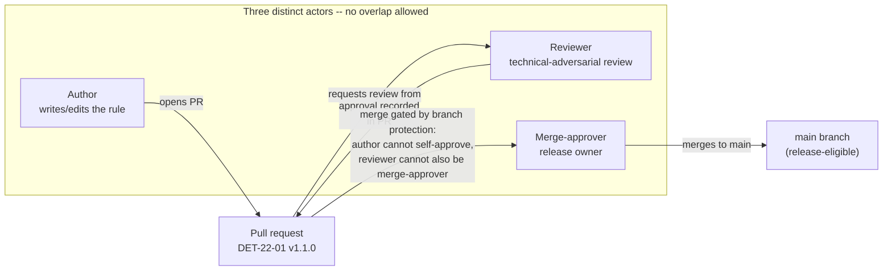
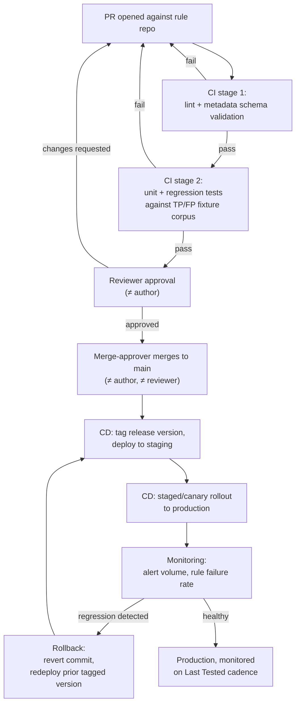

# Part 22 — Detection as Code

## Why this part exists

**[CONCEPT]** TERMINOLOGY.md defines Detection-as-Code as managing Analytics and the Detection Rules that implement them with the same engineering discipline as application software: version control, peer review, automated true/false-positive testing, CI/CD deployment, and rollback, instead of direct, unreviewed edits in a vendor console. Part 1 named this discipline and forward-referenced it rather than explaining it, because the mechanics deserve their own part. This is that part.

The core claim is narrow and mechanical, not aspirational: a Detection Rule is a piece of software with a lifecycle, and every failure mode software engineering already solved decades ago — an untested change shipping broken, one person's typo reaching production with no second set of eyes, nobody knowing which version is actually running, a bad change with no way back — happens to detection rules too, usually with less visibility, because a broken rule doesn't crash or throw an error. It just silently stops firing, and silence is indistinguishable from a quiet day.

This part covers the git-based rule repository, the branching and pull-request model, the exact metadata standard every detection record in this book's own inventory follows, the CI stages that lint and test a rule before it can merge, the CD stages that release and roll it back, and the ownership fields that keep a shipped rule from rotting unnoticed. It reintroduces separation of duties — author, reviewer, and merge-approver as three distinct people or roles, never collapsed into one — and shows the concrete CI mechanism (branch protection, required distinct approvals, no self-approval) that turns it from the policy statement in `BOOK-INDEX.md`'s own production model into something a pipeline actually enforces.

**Scope boundary:** this part owns the pipeline mechanics — where a check runs, what gates on what, who is allowed to approve what. It does not own the exhaustive test-case taxonomy (missing fields, clock skew, schema drift, duplicate events) — that catalogue belongs to Part 37 (Detection Testing), and §6 below points there rather than repeating it. It does not own query syntax for any specific platform — that is Parts 23–29. It does not own how Detection Coverage or quality are measured once a rule is live — that is Parts 41 and 42. This part is about the pipe the rule travels through from an engineer's idea to a running query, and back out again when it needs to stop running.

---

## 1. Why a rule repository, not a console

**[ENGINEERING]** Every major SIEM and EDR platform ships a web console that lets someone with the right role click "new rule," type a query, and save it — live, immediately, with no required review step built into the product. This is the default most detection programs actually run on, and it is the direct cause of most of the failure modes this part exists to close: no record of who changed what or why, no way to see what the rule looked like last week, no gate that stops a change from reaching production the moment someone hits save, and no test that runs before the change is live.

A git-based rule repository fixes this by making the console a deployment target instead of an editing surface. The Detection Rule's actual source of truth is a file in version control — a Sigma YAML file, a KQL `.kql` file, an SPL saved-search definition checked in as text — and the console-visible rule is generated from that file by a deployment step, never edited by hand in the console itself.

> **Engineering Reality**
> Nearly every vendor console still allows a direct, unreviewed edit alongside the pipeline-managed one, because the platform has no concept of "this rule is git-managed, block manual edits." A detection engineer with console access can still click into DET-22-01's deployed rule and change the threshold by hand, and the platform will not stop them or leave a git-tracked record of it. Closing this gap is a permissions and process control (restrict who has direct console write access to detection logic, and audit console-side changes against the repository's last-known-deployed state), not something the pipeline itself can enforce from outside the vendor's product.

**[DETECTION ENGINEER]** The repository layout that makes this work in practice is one file per Detection Rule (not one file per Analytic, since one analytic can have several platform-specific implementations — see Part 23), named by its permanent ID, with the metadata block (§4) as YAML front matter or a parallel `.meta.yaml` file and the query logic as the file body. `git log` on that file becomes the rule's own audit trail — every tuning change, every threshold adjustment, every exclusion added, each with an author, a timestamp, and — because of the branching model in §2 — a linked pull request explaining why.

---

## 2. Branching, pull requests, and the review gate

**[ENGINEERING]** The rule repository uses a standard trunk-based branching model: a protected `main` branch that mirrors what is actually deployed (or eligible to be deployed) to production, and a short-lived feature branch per change, named by the detection ID and the nature of the change (`det-22-01-tune-service-account-exclusion`, `det-22-01-v2-lsass-access`). One branch, one pull request, one logical change — a PR that touches both a new detection and an unrelated tuning fix on an existing one is a review-process smell, not a convenience.

A pull request against this repository is not primarily a code-diff review. It is where four separate things happen, in order, before a single line of query logic reaches anything that can fire against live telemetry:

1. **Automated lint and schema validation** (§5) — does the metadata block have every required field, correctly typed, and does the query parse as valid syntax for its target platform?
2. **Automated unit and regression testing** (§6) — does the rule fire against its stored true-positive fixtures and stay silent against its stored false-positive fixtures?
3. **Human technical review** (§3) — a second person reads the logic, the metadata, and the test results, and is expected to try to break the rule's reasoning, not rubber-stamp it.
4. **Merge approval** (§3) — a third role, distinct from both, confirms the PR is release-ready and merges it.

Steps 1 and 2 are CI checks that block the merge button directly — GitHub, GitLab, and equivalent platforms all support marking specific CI jobs as required status checks, meaning the PR is structurally unmergeable while they're red, not merely "discouraged." Steps 3 and 4 are the human gate the next section covers in detail.

---

## 3. Separation of duties as a CI-enforced gate

**[SOC MANAGEMENT]** `BOOK-INDEX.md`'s own production model states the requirement in one sentence: every chapter, detection, and hunt file carries a mandatory `reviewer` field, a different person from the `author`, and nothing ships to `released` without that reviewer recording at least one attempted technical objection. That's a policy statement about the book's own production process. Applied to a live detection repository, the same three-role split needs a fourth property policy statements don't have on their own: it has to be structurally impossible to bypass, not merely against the rules.

**[ENGINEERING]** Concretely, this means three named roles on every merged change, enforced by the platform's branch protection settings rather than trusted to memory or a wiki page:

- **Author** — writes or edits the rule and its metadata, opens the PR.
- **Reviewer** — a different individual, performs technical-adversarial review: tries to find the false-positive source the author missed, checks the metadata against the actual query logic, confirms the test fixtures genuinely exercise the claimed behavior. Recorded as a formal PR approval.
- **Merge-approver** — a third role (commonly a team lead, detection engineering manager, or a designated release owner), confirms the change is release-ready — tests green, reviewer approval present, deployment window appropriate — and performs the merge itself.

Branch protection rules that make this real, not aspirational: require at least one approving review from someone other than the PR's own author — every major git platform supports this natively (GitHub's "Require a pull request before merging" plus "Require approvals"; a PR author cannot submit their own review as an approval on GitHub, full stop, no setting toggles this on or off); require the CI status checks from §2 to pass; restrict who is allowed to merge into the protected branch to a designated merge-approver group (GitHub's "Restrict who can push to matching branches," GitLab's equivalent protected-branch merge permissions); and — the part most teams skip — use a `CODEOWNERS`-style mapping so a change to a given detection's file requires approval from someone in that rule's designated review group, not just any repository contributor. On a small team, this is the part that actually costs something (§3.1), which is why it's the first thing to erode under headcount pressure if it isn't a structural gate.

> **Engineering Reality**
> No mainstream git platform ships a native toggle for "the person who approved this PR may not also be the one who merges it." Restricting merge rights to a separate group only guarantees the merger isn't the *author* — it does not, by itself, guarantee the merger is a distinct *third* person from the *reviewer*, if the same individual happens to sit in both the reviewer pool and the merge-approver group. Getting the full three-way split therefore takes one of two things beyond branch protection settings: keeping the reviewer and merge-approver groups genuinely disjoint as a staffing/process control, or adding a custom required check — a bot or Action that inspects the PR's recorded approvals against the identity of the account performing the merge — since the platform's own settings stop at "not the author."

**Figure 22.1 — Three-role separation of duties enforced by branch protection.** *CONCEPTUAL.* Illustrates the three distinct actors a pull request against the rule repository must pass through — author, reviewer, and merge-approver — and the combination of native branch-protection settings (no self-approval) and merge-rights restrictions plus process discipline (see the Engineering Reality box in §3) needed to make the reviewer/merge-approver split structural rather than a norm. Diagram ID `FIG-22-01`.






> **SOC Management View**
> A detection engineering team of two people cannot structurally separate author, reviewer, and merge-approver into three different humans for every change — someone has to double up, most commonly reviewer and merge-approver being the same senior person while the author role rotates. That's a legitimate staffing-constrained compromise, not a violation, as long as the author is never also the reviewer or the merge-approver on their own change. What isn't acceptable, and what a CISO conversation about headcount should name directly: a team of one, where the same person authors, reviews, and merges every rule, has zero separation of duties regardless of what the pipeline's branch protection settings say — the settings can require "an approval from someone other than the author," but if the only other person with repository access is the same person wearing two hats on alternating weeks, the control is theater. Budget for a minimum of three people with detection-repository write access, or explicitly accept and document the risk of not having that — don't let the gap go unstated.

---

## 4. The metadata standard

**[DETECTION ENGINEER]** Every Detection Rule in this book's own inventory (and the standard this part recommends for any real program) carries the same fixed metadata block, filled in fully before a PR can be reviewed — an incomplete metadata block is a lint failure (§5), not a "fill in later" placeholder. The table below defines every field, who's expected to populate it, and when.

| Field | Populated by | When | Purpose |
|---|---|---|---|
| `ID` | Author (assigned from the inventory ledger) | At creation | Permanent, position-independent identifier (`DET-####`) — never reused, never renumbered on reorganization. |
| `Name` | Author | At creation | Short human-readable label for the rule, distinct from the ID. |
| `Version` | Author, bumped by whoever makes the change | Every merged change | Semantic version of the rule's own logic — see §8 for the bump rules. |
| `Status` | Author, then advanced by reviewer/tester | Through lifecycle | `draft` → `reviewed` → `tested` → `released` → `deprecated`. |
| `Threat Hypothesis` | Author | At creation | The falsifiable behavioral claim this rule tests, per TERMINOLOGY.md's definition — not a topic. |
| `Description` | Author | At creation | Plain-language statement of what the rule does, for a reader who won't parse the query. |
| `Risk` | Author, reviewed by reviewer | At creation | Severity if the matched activity is a true positive — independent of confidence (TERMINOLOGY.md §7). |
| `ATT&CK` | Author | At creation | Full technique ID + name per STYLE-GUIDE.md §5 — never invented, gaps stated honestly. |
| `Data Sources` | Author | At creation | Named log sources the rule reads from. |
| `Required Telemetry` | Author, verified by reviewer | At creation | The specific event types/fields that must actually be flowing — the Data Feasibility check made explicit and durable. |
| `Required Fields` | Author | At creation | The literal field names the query logic depends on — the first thing Schema Drift breaks. |
| `Logic` | Author | At creation | Plain-language statement of the matching condition, separate from the query syntax itself. |
| `Time Window` | Author | At creation | The Correlation Window, if any — bare "recent" is not acceptable here. |
| `Entity` | Author | At creation | What's being tracked/keyed on — see TERMINOLOGY.md §6. |
| `Threshold` | Author, tuned over time | At creation, revised under Tuning | The specific numeric trigger condition, stated as a number, not "several." |
| `Normal Behaviour` | Author | At creation | What legitimate activity looks like against the same fields — the baseline the rule is discriminating against. |
| `Suspicious Behaviour` | Author | At creation | What distinguishes the targeted activity from the normal case above. |
| `Known FP` | Author, appended by analysts over time | Ongoing | Named legitimate sources that trigger this rule — feeds Suppression/Exception decisions. |
| `Known FN` | Author, appended after hunts/incidents | Ongoing | Named ways the targeted behavior can evade this specific rule. |
| `Blind Spots` | Author, reviewer | At creation | What this rule structurally cannot see, even when working correctly. |
| `Dependencies` | Author | At creation | Other rules, enrichment sources, or upstream pipeline steps this rule assumes exist. |
| `Example Query` | Author | At creation | The actual implementation — see §4.1 for the worked example. |
| `Correlation Opportunities` | Author, threat hunter | At creation or later | Other signals this rule's output could be joined with to raise confidence. |
| `Testing Method` | Author, tester | At creation | How this rule is validated — see §6 and Part 37. |
| `Expected Volume` | Author, revised from production data | At creation, revised ongoing | A concrete number or range, not "low" or "high." |
| `Tuning Guidance` | Author, updated by whoever tunes | Ongoing | What to adjust, and what not to, when FP/FN patterns emerge. |
| `Threat Hunt Variation` | Author, threat hunter | At creation or later | How a hunter would explore this same behavior manually if the standing rule missed it. |
| `Escalation Context` | Author, analyst | At creation | What an analyst should check and who to escalate to on a fired alert. |
| `Owner` | Assigned at creation, reassigned on transfer | At creation, on ownership change | The accountable individual or team — see §9. |
| `Last Tested` | Tester, updated by CI on automated runs | Every test run | Date of the most recent validation — feeds Testing Debt (Part 43). |
| `References` | Author | At creation | Source material — vendor docs, prior incidents, research — cited per REFERENCES.md conventions. |

> **Blind Spot**
> A complete metadata block describes what the rule's author believes to be true about the rule's behavior — it is not independent evidence that the belief is correct. A `Known FP` field that lists two exclusions and a `Blind Spots` field that names one evasion path reflects what's been discovered so far, not an exhaustive account. Treat every field as a living record updated by Tuning and incident post-mortems, not a form filled in once at creation and never revisited — a metadata block frozen at `v1.0.0` while the rule has been tuned four times since is itself a form of Documentation Debt (TERMINOLOGY.md, Detection Debt).

### 4.1 Worked example: DET-22-01

**[DETECTION ENGINEER]** The lab evidence in this book's collection includes two real, contrasting sudo-invocation captures from the home-lab environment: `lab/evidence/ct100-pihole-sudo-invocations.txt`, showing a legitimate admin running `gravity.sh --force`, `ss -tulpn`, and `pihole-FTL --config` as root — routine administrative commands on a small set of known binaries — and `lab/evidence/ct104-vulnscan-sudo-invocations.txt`, showing an automated health-check script invoking `sqlite3` against a fixed database path on a fixed schedule. Both are genuine, scrubbed captures, not fabricated log lines, and both describe *normal* sudo activity for their respective hosts — which is exactly the baseline a real detection needs before it can call anything else suspicious.

DET-22-01 below is this part's fully worked example: a Detection Rule for sudo invocation of a command outside a host's established baseline set, implemented as an illustrative Sigma rule and carried through every stage of the pipeline (lint, test, review, release) in the sections that follow.

```yaml
# CONCEPTUAL SAMPLE — illustrative Sigma logic and metadata record; the query has not been
# validated against a live backend. Field names follow a generic auditd/syslog sudo logsource;
# confirm the exact field names your own sudo log parser produces before deploying unmodified.

ID: DET-22-01
Name: Sudo invocation of a command outside the host's established baseline
Version: 1.1.0
Status: tested
Threat Hypothesis: >
  A service account or interactive user on a monitored Linux host invokes a sudo command
  that does not match any command previously observed for that account, on that host, over
  the prior baseline period — and this is not explained by a documented change window.
Description: >
  Fires when a sudo invocation's target command does not appear in the per-account,
  per-host baseline of previously observed sudo commands, built from at least 14 days of
  prior sudo log history for that account/host pair.
Risk: Medium — a new sudo command alone is not evidence of compromise, but it is the
  cheapest early signal available for both misconfiguration and post-exploitation privilege
  use on a host where sudo is otherwise highly repetitive.
ATT&CK: "T1548.003 (Abuse Elevation Control Mechanism: Sudo and Sudo Caching)"
Data Sources:
  - Linux auditd / sudo log (syslog `sudo[PID]:` lines, or auditd equivalent)
Required Telemetry: >
  Sudo command-invocation logging must be enabled and forwarded; the invoking user, target
  user, and full command string must all be present in the parsed event (see
  lab/evidence/ct104-vulnscan-sudo-invocations.txt for the real field layout this depends on).
Required Fields:
  - invoking_user
  - target_user
  - command
  - host
  - event_time
Logic: >
  For each (invoking_user, target_user, host) triple, compare the invoked command's binary
  path against a rolling 14-day baseline set of previously seen (command, target_user) pairs
  for that same triple. Alert if the command has not previously been seen for that specific
  target_user, and the triple has at least 5 prior baseline days of history (to avoid
  alerting on every command during a new host's first two weeks). Keying on target_user as
  well as the command path matters here specifically: both real lab captures show a single
  invoking_user (root) baselining differently depending on which target_user it sudos to —
  see Normal Behaviour below.
Time Window: 14-day rolling baseline; alert evaluated per event, not batched.
Entity: (invoking_user, target_user, host) triple.
Threshold: Zero prior occurrences of the exact (command binary path, target_user) pair in the
  14-day baseline window.
Normal Behaviour: >
  Per lab/evidence/ct100-pihole-sudo-invocations.txt, the invoking_user is `root` in every
  captured line, but the target_user varies by task: `root` sudos to `pihole` to run
  gravity.sh (the blocklist updater), and separately sudos to itself (`root`) to run `ss` and
  `pihole-FTL --config` — the same invoking_user producing two distinct, stable
  (command, target_user) baselines on one host. Per
  lab/evidence/ct104-vulnscan-sudo-invocations.txt, `root` repeatedly sudos to the `vulnscan`
  target_user to run a single scripted sqlite3 invocation against a fixed database path, on
  a health-check interval.
Suspicious Behaviour: >
  A sudo command with no baseline history for that invoking_user/target_user/host triple — a
  new binary path never seen for that target_user, a known binary invoked against an
  unexpected target_user it has never previously run under (the same gravity.sh path
  suddenly run with `USER=root` instead of `USER=pihole`, for example), or a shell/
  interpreter invocation from a triple whose baseline never included one.
Known FP: >
  Scheduled maintenance (patching, cron-driven one-off scripts) legitimately introduces a
  new command on its first run, before any baseline exists for it. Package upgrades that
  change a script's own invocation path (e.g., a version-pinned binary path) also trigger
  this on the first post-upgrade run.
Known FN: >
  An attacker who uses an already-baselined (command, target_user) pair for a new, malicious
  purpose — e.g., reusing the environment's own legitimate sqlite3 invocation pattern against
  the same target_user but a different database file or query — produces no new-baseline-
  entry signal at all; this rule only sees the binary path and target_user, not the
  arguments the command is invoked with. The severe case of this same gap: if the baselined
  binary is itself a shell or interpreter, binary-path matching is a total bypass, not a
  partial one. lab/evidence/ct100-pihole-sudo-invocations.txt already shows
  `/usr/bin/bash /opt/pihole/gravity.sh --force` as a legitimate baseline entry for
  (root, pihole, ct100) — so `/usr/bin/bash` is a baselined command for that triple. Once that
  entry exists, `sudo -u pihole /usr/bin/bash -c '<anything>'` matches the same binary path and
  never alerts, no matter what the attacker runs, because the Threshold compares binary paths,
  not full command lines. Any host where an interpreter (bash, sh, python, perl) is
  legitimately baselined for a given target_user has an unconditional bypass for that
  target_user, not a tuning gap. Widening the match to the full command line trades this for a
  different failure — every one-off legitimate argument becomes a new alert — so this is a
  design tradeoff to state to stakeholders, not a bug to quietly patch.
Blind Spots: >
  This rule has no visibility into sudo invocations that never happen (an attacker with a
  full interactive root shell obtained some other way doesn't need sudo again), and no
  visibility into command *arguments* for an already-baselined (command, target_user) pair —
  see Known FN above. The same blind spot covers the more common real-world path: an attacker
  who obtains the target account's own credentials directly (a leaked SSH key or password for
  `pihole` or `vulnscan`, for example) authenticates as that account without ever invoking
  sudo, leaving no sudo-log event for this rule to evaluate at all — not a mismatched event, no
  event. It also depends on the sudo log parser reliably populating `command`
  and `target_user` on every event: if the parser silently drops a malformed line (a command
  containing an embedded newline or unescaped shell metacharacter, for instance), that event
  never reaches this rule at all and produces neither an alert nor an error — indistinguishable
  from a quiet baseline period, the same silent-failure pattern the Engineering Reality box in
  §5 describes for Schema Drift generally. If the parser instead emits the event with
  `command` or `target_user` present but empty/null rather than dropping it, the opposite
  failure occurs: an empty value has no baseline history by definition, so every such event
  alerts, producing a false-positive burst tied to a parser defect rather than to any actual
  new sudo activity. Treat a sudden spike of alerts with a blank `command` or `target_user`
  field as a parser-health incident to fix, not a batch of triage-worthy detections.
Dependencies: >
  Requires the 14-day baseline table to be built and refreshed by a separate scheduled job;
  this rule produces no output at all — not an error, just silence — if that job has never
  run for a given host.
Example Query: See fenced Sigma block below.
Correlation Opportunities: >
  Join on Entity with a concurrent or immediately-preceding authentication anomaly (Part 12)
  to raise confidence that the sudo use follows compromised access rather than legitimate
  administration.
Testing Method: >
  Regression-tested against two fixture sets: a true-positive fixture (a synthetic new
  command not present in either lab capture) and two false-positive fixtures (the full
  ct100 and ct104 lab captures, replayed to confirm zero alerts against genuine baseline
  activity). See §6 and the Detection Test box below.
Expected Volume: >
  Under 5 alerts per 100 monitored hosts per week once each host's baseline is fully built;
  materially higher (up to one alert per host) during the first 14 days after onboarding a
  new host, before any baseline exists.
Tuning Guidance: >
  If a specific scripted maintenance command recurs across many hosts and repeatedly
  triggers this rule on its first run each time, add it to a documented allowlist rather
  than shortening the baseline window — shortening the window reduces the rule's ability to
  catch a genuinely new command from a compromised account, too.
Threat Hunt Variation: >
  A hunter can run the same baseline comparison retrospectively over 90 days of retained
  sudo logs instead of the rule's live 14-day window, to check whether a slower-moving
  attacker's sudo use would have stayed under this rule's shorter baseline threshold long
  enough to normalize itself before ever tripping the live rule.
Escalation Context: >
  An analyst should first check whether the new command correlates with a known, documented
  change window (see Known FP). If not, pull the account's authentication history (Part 12)
  and recent process-creation events for the same host before escalating to Tier 2.
Owner: detection-engineering-team-linux
Last Tested: 2026-09-15
References:
  - lab/evidence/ct100-pihole-sudo-invocations.txt (REAL LAB EXAMPLE)
  - lab/evidence/ct104-vulnscan-sudo-invocations.txt (REAL LAB EXAMPLE)
```

```yaml
# CONCEPTUAL SAMPLE — illustrative Sigma implementation of DET-22-01's Logic field; not
# validated against a live backend. A real deployment needs the baseline-lookup mechanism
# (a lookup list or a join against a separately maintained baseline table) that Sigma's
# static rule format cannot express natively — most SIEMs implement this as a scheduled
# search with a lookup table populated by a separate baseline-refresh job, not a single
# self-contained Sigma detection block. This fragment shows the matching condition only.
# Two more notes on what NOT to copy verbatim: `id` below is a mnemonic placeholder, not a
# real UUID — the Sigma spec requires `id` to be a UUIDv4, and a real rule file needs one
# generated properly (e.g. `uuidgen`), not a hand-written string like this. `in_list` is
# not a Sigma field modifier defined in the spec (the real supported modifiers are things
# like `contains`, `startswith`, `re`, `cidr`) — it's invented here purely to name the
# baseline-membership condition in prose form; a real backend expresses this as a
# lookup-table join or a backend-specific list macro, not this literal syntax.
title: Sudo invocation of a command outside the host's established baseline
id: 00000000-0000-4000-8000-000000220001  # placeholder UUID format, not a generated one
status: experimental
logsource:
  product: linux
  service: sudo
detection:
  selection:
    event_type: sudo_command
  filter_baseline:
    command: baseline_commands_for_entity  # conceptual placeholder only — see note above;
                                            # real implementation is a lookup-table join,
                                            # keyed on (invoking_user, target_user, host),
                                            # populated by the separate baseline job
  condition: selection and not filter_baseline
```

> **Detection Test**
> **Setup:** A test host (or a replay harness pointed at stored log fixtures) with the sudo-baseline job already run against at least 14 days of history for the test account.
> **Action:** Invoke a sudo command never previously run by that account on that host — e.g., `sudo /usr/bin/nc -lvp 4444`, chosen specifically because it does not appear in either lab capture's baseline.
> **Expected result:** One alert instance, `command` field showing the new binary path, `invoking_user`, `target_user`, and `host` matching the test account, test target user, and test host, and — critically — replaying the full `ct100-pihole-sudo-invocations.txt` and `ct104-vulnscan-sudo-invocations.txt` captures through the same harness produces zero alerts, confirming the rule doesn't fire on either real baseline pattern even though both captures show the same invoking_user (`root`) switching to more than one target_user.

> **False Positive Trap**
> Both real captures behind this rule's false-positive fixtures — ct100 (a Pi-hole appliance) and ct104 (an automated vulnerability-scanner health check) — are narrow, single-purpose hosts where the same handful of commands repeats for months. A general-purpose Linux jump box or admin host, where humans run dozens of distinct one-off diagnostic commands (`journalctl`, `systemctl status`, `tail`, `netstat`, `vim` on a config never opened before) as routine troubleshooting, keeps introducing new (command, target_user) pairs indefinitely — the baseline never converges the way it does on ct100 or ct104. The `Expected Volume` estimate above is measured against two low-diversity hosts; treat it as a floor for that host class, not a program-wide number, and re-measure expected volume per host class (single-purpose service host vs. general-purpose admin host) before setting alert-fatigue expectations for a Tier 1 queue.

---

## 5. Lint and syntax validation

**[ENGINEERING]** The first automated CI stage a pull request hits is cheap, fast, and deliberately dumb — it checks form, not substance:

- **Metadata schema lint** — every field from §4's table present, correctly typed (`Version` parses as semver, `ATT&CK` matches the `T####.###` pattern from STYLE-GUIDE.md §5, `Last Tested` parses as a date), and no field left as placeholder text.
- **Query syntax validation** — the query parses as valid syntax for its declared target platform. For Sigma, this is a schema/syntax validator (does the YAML conform to the Sigma spec) rather than a backend-specific check; for a native KQL or SPL rule, most platforms expose a syntax-check API endpoint that validates without executing against real data.
- **Style conformance** — code-block language tags, Event ID/MITRE ID formatting, and the other mechanical rules from STYLE-GUIDE.md, if the detection file's prose documentation is checked by the same pipeline as the book's own chapters.

> **Engineering Reality**
> A rule that passes lint is a rule that *parses*. Lint has no opinion on whether the logic is correct, whether the threshold is sane, or whether the query will return results at all against real data — a syntactically perfect Sigma rule with a field name that doesn't exist in your actual log schema passes lint cleanly and then produces zero alerts forever, which is exactly the Schema Drift failure mode from TERMINOLOGY.md §5. Lint catches the typo that breaks the parser; it cannot catch the typo that just silently returns nothing. That's what §6's test stage exists for.

---

## 6. Unit and regression testing

**[DETECTION ENGINEER]** The second CI stage runs the rule against a stored corpus of fixture data — real or realistic log excerpts labeled with the expected outcome — and fails the build if the rule's actual behavior against that corpus doesn't match the label. Two fixture categories, both required for every rule before it can reach `tested` status:

- **True-positive fixtures** — log excerpts (synthetic, or from a controlled lab run per STYLE-GUIDE.md §9's evidence classes) that should trigger the rule. A rule with no TP fixture has never actually been shown to fire at all.
- **False-positive fixtures** — log excerpts of genuine legitimate activity that should *not* trigger the rule. This is where real lab evidence earns its keep specifically: `lab/evidence/ct100-pihole-sudo-invocations.txt` and `lab/evidence/ct104-vulnscan-sudo-invocations.txt` are exactly this kind of fixture for DET-22-01 — real, scrubbed, organically-captured legitimate activity, reused as a regression guard rather than invented from a guess at what "normal" looks like.

A regression suite is the same corpus, re-run automatically on every subsequent change to the same rule (or to any shared dependency, like a parser or normalization mapping it relies on), specifically to catch the case where a tuning change meant to fix one false positive quietly breaks the true-positive case, or vice versa. This is unit/regression testing in the CI-gate sense — it runs on every PR, blocks the merge if red, and is scoped to one rule's own fixture corpus. It is deliberately narrower than Part 37's full test-case taxonomy (missing fields, duplicate events, clock skew, schema change, and the rest), which is a methodology for *designing* comprehensive test cases in the first place, not a description of what runs in this CI stage. Build your fixture corpus using Part 37's taxonomy as the checklist; run it through the mechanism described here.

> **Engineering Reality**
> A regression suite is only as good as its fixture corpus, and fixture corpora rot the same way baselines do: a false-positive fixture captured from a system that's since been decommissioned, or a true-positive fixture built against a tool version the adversary no longer uses, gives a false sense of Detection Coverage the rule no longer actually delivers. Log a `Last Tested` date specifically because "this rule passed CI six months ago against fixtures from six months ago" and "this rule is currently correct" are different claims, and only the second one matters to an analyst triaging an alert today.

---

## 7. CI/CD pipeline end to end

**[ENGINEERING]** Putting §2 through §6 together, the full lifecycle of a change to a detection rule — from an engineer's first commit to a monitored production deployment, with a rollback path if it goes wrong — looks like this:

**Figure 22.2 — The detection-as-code CI/CD pipeline, PR to production, with the rollback loop.** *CONCEPTUAL.* Illustrates every gate a change to a Detection Rule passes through: automated lint and test stages that block the merge button directly, the two-role human approval gate from Figure 22.1, staged/canary deployment, and the monitoring-triggered rollback path back to a prior tagged version. This is a process diagram of the pipeline's intended behavior, not a capture from a specific vendor's CI/CD product. Diagram ID `FIG-22-02`.






**[ENGINEERING]** The staged/canary step deserves a specific word of caution most detection-as-code writeups skip: unlike an application rollout, a detection canary can't be validated by "does it error out" alone, because a broken detection rule doesn't error — it either fires correctly, over-fires, or stays silent, and only the third outcome looks identical to success on a dashboard that only counts alert volume. A reasonable canary policy deploys the new rule version alongside the old one in shadow mode (logging what it *would* alert on, without paging anyone) for a short window before cutting over, specifically so a volume anomaly gets caught before it reaches an analyst's queue rather than after.

> **Blind Spot**
> A fully green pipeline — lint passed, tests passed, two humans approved, canary deployed cleanly — demonstrates that the rule behaves as designed against its own test fixtures and didn't break anything the monitoring stage checks for. It does not demonstrate that the rule catches the real-world attacker behavior it claims to, against telemetry the fixture corpus never anticipated. A pipeline this thorough is a strong signal of engineering discipline; treat it as evidence the rule was built carefully, not as evidence the rule works — that second claim needs the Detection Coverage and quality measurement in Parts 41 and 42, and eventually a real Adversary Emulation run (TERMINOLOGY.md §8), not a green CI badge.

---

## 8. Versioning, release, and rollback

**[DETECTION ENGINEER]** The `Version` field follows a semantic-versioning-style convention adapted to what actually changes in a detection rule, distinct from what a MAJOR/MINOR/PATCH bump means for application code:

- **MAJOR** — the rule's core matching logic changes in a way that alters what behavior it targets (a new Analytic entirely, or a fundamentally different detection approach for the same behavior). Requires full re-review and re-testing as if it were a new rule.
- **MINOR** — a threshold, exclusion, or scope change that tunes the existing logic without changing what it's fundamentally trying to catch (adding a Known-FP exclusion, adjusting the baseline window). DET-22-01's `1.1.0` in §4.1 is this category — the underlying Threat Hypothesis and Logic are unchanged from `1.0.0`; the baseline-window parameter was tuned.
- **PATCH** — metadata or documentation corrections only, no change to deployed query behavior (fixing a typo in `Description`, adding a missed `Known FP` entry after the fact).

**[ENGINEERING]** Every merge to `main` that changes a rule's `Version` gets a corresponding git tag, and the CD stage deploys from that tag rather than from a moving branch head — this is what makes rollback a mechanical, low-drama operation rather than an emergency reconstruction. Rollback is `git revert` of the offending merge commit (preserving history, rather than a force-push that erases it), which triggers the same CD pipeline to redeploy the prior tagged version through the same staging/canary path, not a separate manual "hotfix" process with weaker review.

> **Engineering Reality**
> Rollback is clean for stateless matching rules and considerably messier for anything stateful — a rolling baseline (like DET-22-01's own 14-day window) or a multi-event correlation with in-flight state. Reverting the *rule* to its prior version doesn't retroactively fix a baseline table that was populated under the new version's logic; depending on the platform, you may need to also purge or rebuild the baseline state, which can mean a period with reduced detection fidelity immediately after a rollback, not immediately after the bad deploy. Plan the rollback runbook for a stateful rule to include this step explicitly — "redeploy the old version" is necessary but not sufficient.

---

## 9. Ownership, review cadence, and deprecation

**[SOC MANAGEMENT]** The `Owner` field is not a courtesy — it's the field a `CODEOWNERS`-style mapping in §3 uses to route review requests automatically, and the field that answers "who do I page when this rule breaks" without a wiki search. An unowned rule (a former team member's name still in the field, or a blank field that lint should have caught) is an immediate Documentation Debt item, and an orphaned rule with no clear owner is functionally undeployable in a well-run program, because nobody has standing to approve a change to it.

`Last Tested` is the field that turns "we have 400 detection rules" into an honest statement instead of a vanity metric. A review cadence — every rule re-validated against current telemetry at a fixed interval, or after any material environment change (an EDR migration, a major parser update) — is what keeps `Last Tested` meaningful rather than a date frozen at creation. Part 43 (Detection Debt) treats a stale `Last Tested` date as Testing Debt directly; this part is where the review cadence that prevents it actually gets scheduled and owned.

**[DETECTION ENGINEER]** `Status: deprecated` is a real, first-class state, not a silent deletion. A rule gets deprecated — flagged in the repository, undeployed from production, but kept in version history — when its Analytic is superseded by a better one, when the telemetry it depends on has been retired, or when it has accrued enough Known FP/Known FN entries that a rewrite is cheaper than continued tuning. Deleting the file outright loses the audit trail of why the behavior it targeted is or isn't covered anymore, which is exactly the kind of silent gap the six-tier Detection Coverage model in Part 41 is built to surface, not hide.

> **What Would Change My Mind**
> This part treats a fully CI-gated pipeline — lint, test, two-role human approval, canary, monitored rollback — as worth the engineering investment for any team running more than a handful of detection rules. If a small team with three or fewer detection engineers and under 50 rules showed measurably better mean-time-to-tune and equally low false-negative rates using a lighter process (peer review via chat plus a shared changelog, no CI enforcement at all), that would be a real data point against mandating full pipeline automation below some team-size or rule-count threshold — the case for CI enforcement in this part assumes a scale where manual discipline has already been observed to erode, not asserts it erodes universally at every scale.

---

Part 23 picks up immediately where this part's metadata standard leaves off: it carries a single canonical Analytic — the same suspicious LSASS-access pattern Part 9 introduced as DET-09-01 — through the branching, review, and testing mechanics described here, expressed in turn across the six query languages Parts 24–29 cover. Part 36 (Hunt to Detection) closes its own loop back into this part's pipeline, treating a hunt's validated finding as just another PR that has to clear the same lint, test, and separation-of-duties gates before it becomes a standing rule.
