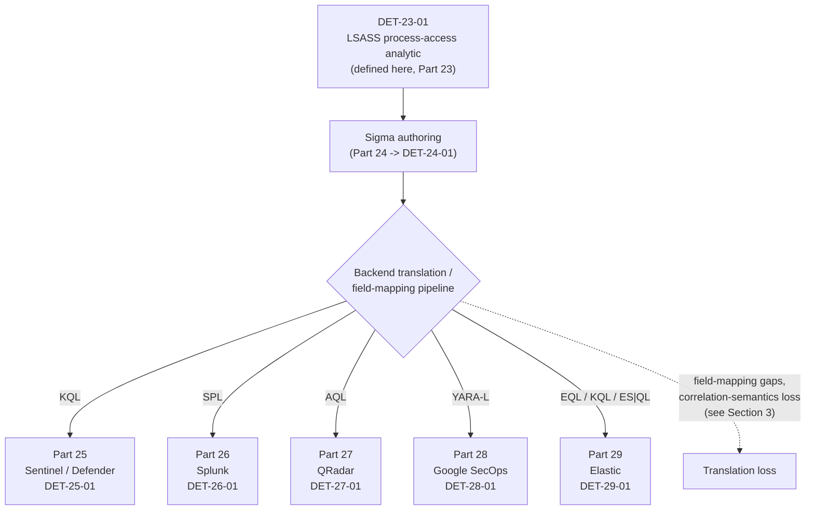

# Part 23 — Query Language Strategy

## Why this part exists

**[CONCEPT]** Part 1 introduced the distinction between an `Analytic` (the implementation-independent logical statement of what pattern in telemetry indicates a targeted behavior) and a `Detection Rule` (the literal, deployed, versioned logic that evaluates live telemetry in one specific platform) using exactly the example this part now formalizes: a process other than LSASS itself opening a handle to `lsass.exe` with memory-read rights. Part 22 covered the git-based, peer-reviewed pipeline that any detection rule — in any language — should live inside before it ever reaches production. This part sits between those two and the six language-specific parts that follow it (Parts 24–29), and it exists to answer one question those parts otherwise leave implicit: when one analytic has to run correctly across six different query languages, what does the translation from "the logic" to "the deployed query" actually cost you?

This part is deliberately short. It does not teach Sigma syntax (Part 24 owns that), KQL, SPL, AQL, YARA-L, or Elastic's three query surfaces (Parts 25–29 own those, one each), or the CI/CD mechanics a rule repository needs regardless of language (Part 22 owns that). What it does is name one canonical detection — **DET-23-01**, a suspicious `lsass.exe` process-access pattern — precisely enough that Parts 24 through 29 can each re-implement it file-for-file, and use that single fixed point to make the tradeoff between Sigma-as-portable-authoring and native-query authoring concrete instead of abstract. Every field-mapping gap and correlation-semantics loss described below is described against this one detection, not against six unrelated toy examples, because a reader comparing Part 24's Sigma rule to Part 26's SPL rule for the same behavior can see exactly where they diverge and why.

---

## 1. The canonical detection: DET-23-01

**[CONCEPT]** Stated at the analytic layer, independent of any query language: a process, not on an approved allowlist, opens a handle to `lsass.exe` (the Local Security Authority Subsystem Service, the Windows process that holds credential material in memory) with access rights sufficient to read that memory. This is the standard technique behind tools that dump credentials from a running system rather than from disk — Mimikatz's `sekurlsa::logonpasswords` module and generic memory-dumping utilities pointed at `lsass.exe` both produce this exact pattern, whatever their command-line differences.

**MITRE:** T1003.001 (OS Credential Dumping: LSASS Memory).

Part 9 §3 already lists Sysmon Event ID 10 (ProcessAccess) as the primary telemetry source for this technique family. DET-23-01 pins that down to a specific, re-implementable analytic:

> **DET-23-01 — Suspicious process access to `lsass.exe`**
>
> A source process that is not on an approved allowlist opens a handle to a target process image named `lsass.exe`, requesting an access-rights combination that includes memory-read capability. The fields that matter, using Sysmon Event ID 10's own names since that is this book's reference telemetry source for this pattern: `SourceImage` (the accessing process), `TargetImage` (must resolve to a path ending `\lsass.exe`), `GrantedAccess` (the access-rights bitmask granted to the source process), `SourceProcessId`/`TargetProcessId`, and `SourceUser`. The allowlist is not optional — see the False Positive Trap below — and belongs at the analytic level, not bolted onto each backend's translated query independently.

If `GrantedAccess` or `TargetImage` isn't populated for a given Event ID 10 record — a Sysmon config that strips the field, a schema change after an agent upgrade — the selection logic has nothing to match against and evaluates false: the analytic produces zero alerts, indistinguishable from "no LSASS access happened" rather than a broken rule. Part 9 §3.6 covers this failure mode directly against the raw Sysmon telemetry; every backend in Parts 24–29 inherits the same risk again at its own field-mapping layer (see §3 and §4 below), which is why field-mapping validation against a known-positive test event, not just successful translation, has to be a required step for each one.

The Sigma block below is the reference-authoring form of DET-23-01 that Part 24 will formalize, test, and version. It is shown here to ground the rest of this part's discussion in a concrete rule, not because Part 23 is where Sigma syntax gets taught.

```yaml
# CONCEPTUAL SAMPLE — illustrative Sigma logic for DET-23-01, not validated against a live
# backend or a specific pySigma pipeline. Part 24 carries this forward as its own tested,
# versioned implementation (DET-24-01).
title: Suspicious process access to lsass.exe
id: 23-det-01-conceptual
status: experimental
logsource:
  product: windows
  category: process_access
detection:
  selection:
    TargetImage|endswith: '\lsass.exe'
    GrantedAccess|contains:
      - '0x1010'   # commonly cited in public LSASS-access rules as including PROCESS_VM_READ
      - '0x1410'
  filter_known_tools:
    SourceImage|endswith:
      - '\MsMpEng.exe'
      - '\WerFault.exe'
      - '\Taskmgr.exe'
  condition: selection and not filter_known_tools
```

The exact `GrantedAccess` bitmask values that reliably indicate memory-read capability are worth verifying against your own Sysmon version and the specific access-rights combinations you observe in your own telemetry rather than trusting the two values above as exhaustive — access-mask combinations for this technique have shifted across Windows and Sysmon releases, and this block is illustrative of the *shape* of the rule, not a validated production threshold.

That incompleteness has a second, independent cause beyond version drift: Sigma's `contains` modifier does a literal substring match on the hex string, not a bitwise AND against the underlying access mask. A tool that requests `PROCESS_VM_READ` alongside additional rights — `0x1438` or `0x1fffff` (`PROCESS_ALL_ACCESS`, which ProcDump and several real dumping tools request by default), both commonly observed in production — will not match `'0x1010'` or `'0x1410'` even though the same VM_READ bit is set underneath, because neither literal substring appears in the resulting hex string. Enumerating every literal hex value actually observed in your own telemetry, rather than reasoning about which bits *should* be present, is the only reliable way to keep this list from silently under-matching.

> **False Positive Trap**
> Antivirus and EDR engines, Windows Error Reporting (`WerFault.exe` generating a legitimate crash dump), Task Manager's own "Create dump file" action, and legitimate diagnostic tooling (Process Explorer, a sanctioned ProcDump invocation run for troubleshooting) all produce the identical access pattern DET-23-01 targets. Before allowlisting, expect AV/EDR engines to dominate the match volume on any fleet with real-time protection enabled — this book has not validated a specific per-day count against production telemetry, but a well-instrumented estate should see this settle to a low-volume rule (single digits to low tens of matches a day fleet-wide) once the allowlist is populated, not a high-volume one like an unfiltered authentication-event rule. The fix is a maintained `SourceImage` allowlist — by full path and, ideally, by binary hash rather than filename alone, since filename-only exclusions are trivially defeated by an attacker who renames their tool to `Taskmgr.exe`. Do not "fix" this by loosening the `GrantedAccess` filter instead — that just narrows the rule's actual detection surface to satisfy an unrelated noise problem.

> **Blind Spot — handle duplication**
> DET-23-01 as written depends on the source process itself calling into `lsass.exe` directly and Sysmon's driver observing that call. Some LSASS-access tooling avoids that call entirely by duplicating a handle that another, already-legitimate process holds open to `lsass.exe`, rather than requesting a new handle itself — a technique that produces no new `SourceImage`-to-`lsass.exe` access event of the kind Event ID 10 is built to capture. This is a real, documented evasion category for this technique, not a hypothetical one, and no single-event Sysmon rule closes it; it needs either a broader access-pattern baseline or a different telemetry source entirely (see Part 11 for endpoint detection engineering approaches that go past a single access event).

> **Blind Spot — allowlist evasion**
> The `SourceImage` allowlist is itself an exploitable gap, not just an FP filter. Task Manager's "Create dump file" action against `lsass.exe` is a real, tool-free LSASS-dumping technique — an attacker with the local privilege needed to reach that GUI menu evades DET-23-01 by design, since `Taskmgr.exe` sits on the allowlist for the exact reason the False Positive Trap above names it. Hash-based allowlisting doesn't close this either: a hash authenticates the binary's identity, not the intent of the thread currently executing inside it, so injecting into any allowlisted image (`WerFault.exe`, `MsMpEng.exe`) causes the injected code's LSASS access to inherit that image's exemption. Closing either path needs a compensating control outside this single rule — for example, correlating the resulting `.dmp` file write — Sysmon Event ID 11 (FileCreate) — against an unexpected destination path, or flagging `Taskmgr.exe`-sourced access specifically rather than blanket-excluding it.

> **Detection Test**
> **Setup:** An isolated Windows test host with Sysmon installed and a config that logs Event ID 10 for any target image ending `\lsass.exe`, no local admin rights required to observe the resulting log entries (admin rights are required to run the test action itself).
> **Action:** Run a credential-dumping tool against the live LSASS process — for example, Mimikatz's `sekurlsa::logonpasswords`, or a ProcDump-style invocation targeting `lsass.exe` by process ID.
> **Expected result:** One or more Sysmon Event ID 10 entries with `TargetImage` ending `\lsass.exe`, `SourceImage` matching the test tool's path, and a `GrantedAccess` value consistent with memory-read rights — and, if the allowlist in DET-23-01 is correctly scoped, no suppression of this specific event, since the test tool should not appear on it.

---

## 2. Sigma as portable authoring: the pitch

**[CONCEPT]** Sigma is a generic, YAML-based language for describing detection logic — the `selection`/`condition` structure shown above — that a backend converter (the pySigma toolchain and its collection of platform-specific backends and pipelines) translates into a native query for a target SIEM or EDR console. The pitch for authoring DET-23-01 in Sigma first, rather than writing six independent native queries, is straightforward: one reviewed rule becomes the single source of truth, and every backend's version is a mechanical translation of it rather than an independently-maintained fork that can drift from the other five. For an organization running more than one SIEM — after an acquisition, during a platform migration, or simply because different business units standardized on different tools — this collapses what would be six-times the review and maintenance burden down to one rule plus five translation configs. It is also how a large share of publicly shared community detection content (the SigmaHQ rule repository being the best-known example) gets distributed at all: a rule published once in Sigma is usable by anyone with a working backend for their platform, without the publisher needing to know or support every target query language themselves.

> **Engineering Reality**
> Sigma is a detection-logic description language, not a runtime. Writing DET-23-01's Sigma block above produces exactly zero alerts on its own — it requires a backend, a field-mapping pipeline that resolves Sigma's generic field names (`TargetImage`, `GrantedAccess`) to the actual field names your specific log source populates, and a working, tested connection to real telemetry before it does anything. Treat "we have the Sigma rule" and "we have a working detection" as two different claims with a real gap between them, the same gap Part 22 requires a CI/CD pipeline to close and verify before calling a rule deployed.

---

## 3. Where translation loses meaning

**[DETECTION ENGINEER]** Converting DET-23-01's Sigma form into a native query is not a lossless, purely mechanical operation, and the loss shows up in a few specific, recurring places rather than as a vague "translation is imperfect" disclaimer:

- **Correlation and aggregation semantics.** DET-23-01 as shown is a single-event match with no correlation logic, but the moment a related rule needs to say "this access pattern, more than once, within a window" or "this access pattern followed by a second, different event," Sigma's own correlation-rule constructs (count, value-count, and temporal correlation) do not map onto every backend's native windowing model the same way. A time-windowed join that KQL's `summarize ... bin()` or SPL's `transaction`/`stats` expresses natively may force a materially different query shape — or may not be expressible at all at the same fidelity — once translated for a backend with a more limited correlation model. Part 27 flags exactly this for QRadar AQL specifically; it is a real constraint on what a Sigma-authored correlation rule can guarantee across all six backends, not evenly distributed risk.
- **Field-mapping completeness.** Every backend needs its own mapping from Sigma's generic field names to whatever that platform's actual schema calls the same data — and that mapping is a separate, maintained artifact (a pySigma pipeline config), not something the Sigma rule itself carries. If a pipeline's mapping for `GrantedAccess` is missing, stale, or points at a field your specific log source doesn't populate, the translated query compiles and runs cleanly — and matches nothing, silently. This is Detection Debt's defining failure mode (see TERMINOLOGY.md § Detection Debt) applied specifically to the translation layer: a broken mapping produces zero errors and zero alerts, which looks identical to "the technique isn't happening."
- **Value and format normalization.** `GrantedAccess` arrives as a hexadecimal bitmask in Sysmon's own event; a different telemetry source feeding the same logical field might represent access rights as a decimal value, a named constant, or not expose an equivalent field at all. Wildcard and string-matching case sensitivity also differs by backend query engine — a Sigma `contains` match that behaves case-insensitively against one backend's default settings may not against another's.
- **Backend feature ceiling.** Not every pySigma backend implements the full Sigma specification (including newer correlation-rule constructs) at the same level of maturity at any given time. A rule that translates cleanly today against a well-supported backend can fail to translate, or degrade to a weaker approximation, against a backend whose maintainers haven't yet implemented the construct the rule depends on.

> **Detection Autopsy — "author once in Sigma, deploy everywhere, done"**
>
> **The rule:** DET-23-01 authored once in Sigma and pushed through the standard pySigma toolchain to five backends using each backend's default, community-maintained field-mapping pipeline.
>
> **Why it shipped:** A single source of truth across six platforms sounded like it eliminated six-fold rule maintenance in one move — write it once, review it once, trust the translation for the rest.
>
> **How it failed:** One backend's default field-mapping pipeline had no entry for `GrantedAccess` at all — that backend's actual log source represented access rights under a differently-named field the community pipeline predated. The translated rule compiled, deployed, and ran without error. It matched zero events for months, on a backend nobody was separately watching because "the Sigma rule is deployed everywhere" had been treated as equivalent to "the detection works everywhere."
>
> **The fix:** Field-mapping validation — running the translated rule against a known-positive test event on each specific backend, not just confirming the translation step completed without a syntax error — became a required, versioned step in the detection-as-code pipeline (Part 22) for every backend a Sigma rule targets, exactly like the syntax and unit tests already required for natively-authored rules.

---

## 4. Backend field-mapping gaps, illustrated for DET-23-01

**[ENGINEERING]** The table below anchors the field-mapping problem to DET-23-01's own fields rather than a generic warning — a structural illustration of where mapping effort has to go, not a finished field dictionary. The left two columns are the confident, source-of-truth mapping — Sigma's generic field name against the literal Sysmon field it originates from. The right column states the general category of gap a given backend family typically introduces, without asserting a specific field name this book hasn't validated against a live tenant of each platform; Parts 25–29 give the validated, platform-specific field names and queries for their own backend directly, and that detail belongs there, not duplicated here from a position of lower confidence.

**(CONCEPTUAL SAMPLE)**

| Sigma Generic Field | Sysmon Native Field (Source of Truth) | Typical Cross-Backend Mapping Gap |
|---|---|---|
| `TargetImage` | `TargetImage` | Usually maps cleanly — most backends carry an equivalent "target process path" field, though the exact table/column name and whether it's truncated differs by platform. |
| `SourceImage` | `SourceImage` | Same as above; watch for path-normalization differences (forward vs. backward slashes, case) between the source telemetry and the backend's own schema. |
| `GrantedAccess` | `GrantedAccess` | The highest-risk field in this rule. Some backends have no direct equivalent at all — the underlying log source they ingest may not expose a process-access-rights concept the way Sysmon Event ID 10 does — which is a structural gap, not a renamed field, and no pipeline mapping fixes it. |
| `SourceProcessId` / `TargetProcessId` | `SourceProcessId` / `TargetProcessId` | Usually present in some form, but PID reuse within a single host session means a backend that only carries PID, with no durable process-identity equivalent to Sysmon's `ProcessGuid`, can misattribute a correlated event to the wrong process instance under load. |

> **What Would Change My Mind**
> This part treats Sigma-first authoring as the right default for any organization running more than one SIEM or EDR-query backend against the same detection logic. If a controlled comparison across Parts 24–29's six implementations of DET-23-01 — run against identical, real telemetry — showed the Sigma-translated versions carrying a materially higher false-negative rate than natively hand-tuned equivalents (not just cosmetic field-name differences, but genuinely missed detections caused by the translation itself), the default recommendation would flip: native-first authoring, with Sigma reserved for the subset of simple, single-event pattern matches where translation loss is provably negligible.

---

## 5. When Sigma-first authoring pays off, and when it doesn't

**[DETECTION ENGINEER]** Sigma-first authoring earns its keep when the same logic genuinely needs to run on more than one backend — multi-SIEM environments from an acquisition or a platform migration, or a program that wants to consume and contribute to a shared community rule set like SigmaHQ without maintaining six separate translations by hand. In that setting, DET-23-01's Sigma form is the actual artifact under version control and peer review (Part 22's pipeline), and each backend's translated output is a generated, tested downstream product of it.

Sigma-first authoring pays for itself less clearly in a single-platform shop that has invested heavily in that platform's own native features — multi-table joins across KQL's Advanced Hunting schema, SPL's `transaction` command, or a backend-specific machine-learning or risk-scoring construct with no Sigma equivalent at all. Forcing that logic through Sigma's lowest-common-denominator feature set to preserve theoretical portability nobody currently needs is a cost with no matching benefit.

**[SOC MANAGEMENT]** A hybrid pattern is common in practice: author the simple, single-event pattern-match portion of an analytic (DET-23-01's core selection logic) in Sigma for the population of backends that need it, and hand-author the complex, multi-stage correlation logic natively wherever a single platform's own query language expresses it more directly and reliably. Reporting this honestly to a budget conversation means naming which detections are Sigma-portable and which are deliberately platform-specific, rather than claiming blanket "we author everything in Sigma" coverage that the actual rule repository doesn't support — an inflated portability claim is a form of the same coverage-count confusion Part 1 warns about between rule counts and validated analytics, just one layer further removed.

> **Engineering Reality**
> Sigma-first authoring does not remove the need for backend-specific detection testing (Part 37). Every translated rule still has to be validated against real telemetry on its own backend before anyone trusts it — the same test discipline a natively-authored rule needs. Sigma reduces how many times the *logic* has to be independently designed and reviewed; it does not reduce how many times the *deployed result* has to be independently verified.

---

## 6. How DET-23-01 carries forward through Parts 24–29

**[CONCEPT]** DET-23-01, as defined in §1, is the fixed reference point for the six parts that follow. Each language part re-implements the same analytic under its own part-prefixed detection ID — DET-24-01 for the tested Sigma implementation, DET-25-01 for the KQL (Sentinel/Defender) implementation, DET-26-01 for Splunk SPL, DET-27-01 for QRadar AQL, DET-28-01 for YARA-L/Google SecOps, and DET-29-01 for Elastic's query surfaces — each one explicitly documented as a re-implementation of DET-23-01's analytic, not a new analytic in its own right. That ID discipline is what keeps a coverage count honest: six deployed rules implementing one analytic across six platforms is one line of detection coverage, not six, and Part 1's warning about conflating rule counts with analytic counts applies directly here.






**FIG-23-01 — DET-23-01 carried from canonical analytic through Sigma authoring to five native-backend implementations.** *CONCEPTUAL.* Illustrates the intended re-implementation path this part sets up for Parts 24–29 and the point in that path (the backend translation/field-mapping step) where §3's translation-loss categories actually occur. This is a structural diagram of the book's own cross-part design, not a capture of any real translation pipeline's output.

The six parts that follow are not free to redefine what DET-23-01 detects — the allowlist boundary, the `GrantedAccess` intent, and the MITRE mapping stay fixed at §1's definition. What each part owns is how faithfully its specific query language and backend can express that fixed logic, and where — per §3 and §4 — the expression falls short of the original intent. That gap, made explicit and specific per backend rather than glossed over, is the actual comparison this bridging part exists to set up.
