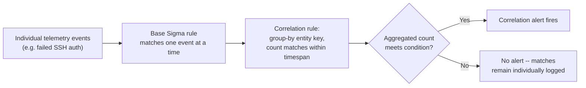

# Part 24 — Sigma

## Why this part exists

Part 23 carried one canonical analytic — a process other than a short, approved allowlist opening a handle to `lsass.exe` with memory-read-capable access rights, tracked in this book's detection ledger as DET-23-01 — through a preview of how it would look expressed in each of the six query languages this section of the book covers. This part stops previewing and goes deep on the first of those six: Sigma, the vendor-neutral YAML rule format that lets DET-23-01 (and every other analytic in this book) be authored once and compiled to a target backend rather than hand-rewritten per platform.

This part's scope is narrow and deliberate. It covers Sigma's own syntax — the metadata fields, the `logsource`/`detection`/`condition` block, `falsepositives`, `level`, `tags` — Sigma's correlation-rule extension for multi-event logic, how to test a Sigma rule before it ships, and where the translation from portable Sigma to a real backend query leaks meaning. It does not re-argue Sigma-versus-native-query tradeoffs (Part 23 already made that case), does not re-teach the git-repo/CI/peer-review mechanics of detection-as-code generally (Part 22 owns that; this part only covers how Sigma specifically plugs into it), and does not re-derive the deeper theory of correlation windows, entity resolution, or clock skew (Part 30 owns that content layer — this part covers only how Sigma's own syntax expresses correlation, not how to design one well). Parts 25–29 pick up the same canonical detections in KQL, SPL, AQL, YARA-L, and the Elastic query surfaces.

---

## 1. What Sigma is, and isn't

**[CONCEPT]** Sigma is a YAML-based rule format for expressing a `Detection Rule` (see TERMINOLOGY.md § Detection Rule) against generic, backend-independent field names, so the same authored logic can be compiled — via a translation layer, most commonly the `pySigma` library and its `sigma-cli` front end — into a native query for whichever SIEM or data lake actually runs it. Sigma is not itself a query engine. Writing a Sigma rule produces nothing that executes on its own; it produces a portable statement of intent that a backend-specific pipeline turns into something that does.

This matters for how you should think about a Sigma rule's own identity: the Sigma YAML file is Sigma's version of the `Detection Rule` — the literal, versioned, deployable logic — while the underlying `Analytic` (TERMINOLOGY.md § Analytic) it implements is the implementation-independent statement, in this book's running example: "a process other than a small, known set of legitimate system components opens a handle to `lsass.exe` with `GrantedAccess` sufficient for memory reading, and that source process is not on an approved allowlist." Part 9 introduced that analytic and sketched an illustrative, unfinished version of its Sigma expression. The rest of this part finishes it.

> **Engineering Reality**
> Sigma's stated goal is "write once, run anywhere," and for the `detection` block's core logic, that mostly holds. It does not hold for the full rule end to end: `logsource` values, field names, and available modifiers are all backend-dependent at compile time through a pySigma pipeline, and two backends receiving the identical Sigma YAML can legitimately produce queries with different matching behavior if their pipelines map fields or normalize case differently. Treat "the Sigma rule is correct" and "the compiled query for backend X behaves as the Sigma rule intends" as two separate claims that both need verification — §6 covers exactly where this gap opens up.

---

## 2. Anatomy of a Sigma rule

### 2.1 Metadata fields

**[DETECTION ENGINEER]** Every Sigma rule opens with a block of metadata fields that carry no matching logic themselves but are what make a rule set searchable, auditable, and safe to deprecate. The table below states what each field is for, not just its name — the metadata is what a reviewer, a coverage matrix, or a future maintainer actually reads first.

The table below maps each core Sigma metadata field to its purpose and whether the current specification treats it as required.

| Field | Purpose | Required |
|---|---|---|
| `title` | Short, human-readable statement of what the rule detects — the line an analyst sees in an alert queue. | Yes |
| `id` | A stable UUID identifying this rule, independent of its title or file path — the anchor a correlation rule (§4) or a cross-reference in another rule's `references` points to. | Not required to parse; functionally mandatory (SigmaHQ contribution rules reject a rule without one, and §4's correlation rules have no other way to reference a base rule) |
| `status` | Rule maturity: commonly `stable`, `test`, or `experimental`, with `deprecated` and `unsupported` used to retire a rule without deleting its history. | Recommended |
| `description` | Longer prose explanation of the behavior and, ideally, why it matters — the field a reviewer reads to understand intent before reading the logic. | Recommended |
| `references` | URLs or internal citations backing the rule's design — a blog post describing the technique, an internal incident, or (as in this book's examples) a cross-reference to the chapter that derived it. | Recommended |
| `author` | Who wrote the rule — needed for the separation-of-duties model Part 22 requires (author ≠ reviewer). | Recommended |
| `date` / `modified` | Creation and last-edit dates — the raw input `last_validated`-style staleness checks (Part 43) are built from. | Recommended |
| `tags` | MITRE ATT&CK and other taxonomy labels (§2.6). | Recommended |
| `falsepositives` | Named legitimate activity expected to trigger the rule (§2.4). | Recommended |
| `level` | Sigma's own severity field (§2.5). | Recommended |

None of the "Recommended" fields — nor `id`, despite how load-bearing it is in practice — are enforced by Sigma's base schema the way `title`/`logsource`/`detection` are: a rule missing `falsepositives`, `author`, or even `id` still parses and still compiles. Enforcing them is a decision your own CI pipeline makes (Part 22), not something Sigma's parser forces on you, which is precisely why an unenforced field is the field most likely to go missing under deadline pressure — `id` most consequentially, since a missing `id` silently breaks any correlation rule (§4) that would otherwise reference it.

### 2.2 `logsource`

**[DETECTION ENGINEER]** The `logsource` block declares which telemetry category a rule targets — `product` (e.g., `windows`, `linux`), `category` (e.g., `process_access`, `process_creation`, `authentication`), and optionally `service` (e.g., `sshd`, `security`) — using Sigma's own generic taxonomy rather than any one backend's literal index or table name. A pySigma pipeline is what maps `logsource: {product: windows, category: process_access}` to an actual Sysmon-Event-ID-10-shaped source in a given SIEM; the Sigma rule itself never names an index, a sourcetype, or a table.

`logsource` is also the field that silently determines whether a rule can even compile for a given backend: if the target pipeline has no mapping for a particular `product`/`category`/`service` combination, the rule fails to translate — not because the detection logic is wrong, but because that backend's pipeline author never wired up that log source at all. This is a first, mild instance of the backend-translation-limits theme §6 covers in depth.

### 2.3 The `detection` block: `selection` and modifiers

**[DETECTION ENGINEER]** The `detection` block holds one or more named sub-blocks — conventionally `selection`, `filter`, or any other identifier — each a YAML mapping of field names to match values. Field names accept modifiers, appended with a pipe: `TargetImage|endswith`, `CommandLine|contains|all`, `SourceIp|cidr`. Common modifiers include `contains`, `startswith`, `endswith`, `re` (regular expression), and `cidr` for network ranges; `all` changes list-matching behavior, covered below.

The single most common authoring mistake in this block is assuming a YAML list under one field means every item must match. It doesn't, by default:

```yaml
detection:
  selection:
    CommandLine|contains:
      - '-enc'
      - '-w hidden'
  condition: selection
```

The example above targets a Windows-agnostic PowerShell-invocation log source (any source populating a `CommandLine` field) and is written to look for both an encoded-command flag and a hidden-window flag together. Its main limitation is exactly what the callout below explains: this is not what it does.

> **Detection Autopsy — "a list of strings under one field means AND"**
>
> **The rule:** The `selection` block above lists `-enc` and `-w hidden` as `CommandLine|contains` values, with `condition: selection`.
>
> **Why it shipped:** The author read the rule intent as "flag command lines containing both an encoded-command switch and a hidden-window switch" and wrote what looked like a natural list expressing that — it reads correctly in a design review to anyone who doesn't already know Sigma's list-matching default.
>
> **How it failed:** Sigma's default semantics for a list of values under one field is a logical OR — match if *any* value in the list is present, not all. This rule fires on any command line containing `-enc` alone, or `-w hidden` alone, which covers a much wider set of legitimate PowerShell invocations (plenty of scheduled tasks and management scripts run with a hidden window and no encoding at all) than the author intended, producing several times the expected alert volume with no detection-value gain to justify it.
>
> **The fix:** Either apply the `all` modifier (`CommandLine|contains|all: ['-enc', '-w hidden']`), which changes the list's semantics to AND for that field, or split the two conditions into separate named blocks joined explicitly in `condition` (`selection_enc and selection_hidden`). Both fixes make the AND relationship visible in the rule's own logic instead of relying on an author's mistaken assumption about YAML list defaults.

### 2.4 `condition`

**[DETECTION ENGINEER]** The `condition` field is a boolean expression over the names of the blocks defined in `detection`, using `and`, `or`, `not`, and parentheses for grouping, plus two shorthand quantifiers: `1 of selection*` (true if at least one block whose name starts with `selection` matches) and `all of filter*` (true only if every block whose name starts with `filter` matches). `condition: selection and not filter_known_tools` — the shape used throughout this part's worked examples — reads exactly as it sounds: the `selection` block must match, and the `filter_known_tools` block must not.

A rule with multiple `selection`-style blocks and no `condition` field at all does not default to matching any of them — Sigma requires `condition` to be present and explicit; there is no implicit combination of named blocks. This is a deliberate design choice, not an oversight: it forces every rule's actual boolean logic to be visible as text rather than inferred from block naming conventions.

### 2.5 `falsepositives`

**[DETECTION ENGINEER]** `falsepositives` is a list of short strings naming specific legitimate activity known to trigger the rule — the Sigma-native home for exactly the kind of finding a False Positive Trap callout documents in this book's prose. Writing `falsepositives: ['Unknown']` when nothing has actually been characterized yet is honest and better than inventing a plausible-sounding cause that was never observed; writing nothing at all just means the next person to inherit the rule starts from zero.

**[ANALYST]** At triage time, `falsepositives` is the first thing worth reading on an unfamiliar alert, before pulling any other context — it tells you what the rule's own author already knows commonly trips it, which narrows the disposition question from "is this malicious" to "does this alert match one of the rule's known benign patterns, or something else."

### 2.6 `level`

**[DETECTION ENGINEER]** `level` takes one of a small fixed set of values — `informational`, `low`, `medium`, `high`, `critical` — and is Sigma's own severity field, analogous to but not identical to this book's `Severity` axis (TERMINOLOGY.md §7). Treat `level` as an input to Severity, not a substitute for the full Priority calculation: a `high`-level rule firing on a low-criticality test host and a `high`-level rule firing on a domain controller carry the same `level` value but should not carry the same operational Priority once Entity criticality is folded in (Part 33).

### 2.7 `tags`

**[DETECTION ENGINEER]** `tags` is a YAML list carrying, most commonly, MITRE ATT&CK technique references in the community-standard lowercase form: `attack.t1003.001` for the technique, and a tactic-level tag such as `attack.credential_access` for the tactic it falls under. This lowercase, underscore-separated, `attack.`-prefixed string is a Sigma-ecosystem convention, not a violation of this book's own MITRE ID formatting rules (STYLE-GUIDE.md §5) — those rules govern how a technique ID is written in this book's prose (`T1003.001 (LSASS Memory)`), and this section's `attack.t1003.001` is the separate, literal tag string a machine-readable rule field actually contains. Keep the two conventions straight: write `T1003.001 (LSASS Memory)` in a sentence, `attack.t1003.001` inside a `tags:` list, and never merge the two formats into one.

---

## 3. Worked example: DET-23-01 as a complete Sigma rule

**[DETECTION ENGINEER]** Part 9 sketched an illustrative, deliberately unfinished version of the LSASS-access analytic's Sigma expression, with a placeholder `id` and no `falsepositives`, `level`, or `tags` fields, to keep that part's focus on Sysmon's own event semantics. The version below is the same analytic finished into a spec-complete rule — DET-23-01, targeting Sysmon (any recent schema version with Sysmon Event ID 10 (ProcessAccess) enabled) and depending on `GrantedAccess` being present in the event, the same platform and field dependency Part 9 stated. Its main limitation, unchanged from Part 9's version, is that the `GrantedAccess` value list is illustrative of the general shape of a memory-read-capable access mask, not a verified-exhaustive list for every Windows build — validate it against your own environment's telemetry before treating it as production-ready, and the endpoint-security-scanner false-positive driver Part 9 §3.6 documents in full still applies here; this section adds only the metadata fields that section didn't need for its own purpose.

```yaml
title: Suspicious process access to LSASS memory
id: 8f2b6f1a-2c3e-4b9a-9a7d-6e2f6c8a9b10
status: test
description: >
  A process other than a short, approved allowlist opens a handle to lsass.exe
  with an access mask sufficient for memory reading -- the mechanism behind
  most non-network credential-dumping tooling. Canonical analytic DET-23-01
  (Part 23); Sysmon field walkthrough in Part 9 Sec 3.6.
references:
  - internal://detection-engineering-handbook/part09#3.6
  - internal://detection-engineering-handbook/part23#det-23-01
author: Detection Engineering Handbook
date: 2026-09-15
modified: 2026-09-15
tags:
  - attack.credential_access
  - attack.t1003.001
logsource:
  product: windows
  category: process_access
detection:
  selection:
    TargetImage|endswith: '\lsass.exe'
    GrantedAccess:
      - '0x1010'
      - '0x1410'
      - '0x1438'
      - '0x143a'
      - '0x1fffff'
  filter_known_tools:
    SourceImage|endswith:
      - '\wmiprvse.exe'
      - '\svchost.exe'
      - '\MsMpEng.exe'
  condition: selection and not filter_known_tools
falsepositives:
  - Endpoint security products scanning lsass.exe as part of their own credential-theft protection feature
  - Unlisted legitimate diagnostic tools not yet added to filter_known_tools
level: high
fields:
  - SourceImage
  - TargetImage
  - GrantedAccess
  - SourceUser
```

**MITRE:** T1003.001 (LSASS Memory)

> **Blind Spot**
> `filter_known_tools` matches only the final path segment of `SourceImage`, not a verified binary identity — Event ID 10 (ProcessAccess) carries no code-signing or hash field this rule checks. An attacker who copies or renames a credential-dumping tool to any of the three filtered names (`copy mimikatz.exe C:\Users\Public\svchost.exe` needs no elevation) produces a `SourceImage` value that matches the filter, gets excluded by `not filter_known_tools`, and generates no alert at all — a silent false negative, not a noisy one. Closing this needs a signal the filter doesn't have — signed-binary verification, or matching the full canonical path (`C:\Windows\System32\svchost.exe` exactly) instead of any path ending in `\svchost.exe` — at the backend or EDR layer, not inside this Sigma rule alone.

> **Detection Test**
> **Setup:** Domain-joined or standalone Windows test host, Sysmon installed with Event ID 10 (`ProcessAccess`) enabled and not excluding `lsass.exe` as a target, no EDR agent active on the test host to avoid the confounding legitimate LSASS scan the `falsepositives` list above names.
> **Action:** `sigma convert -t splunk -p sysmon det-23-01.yml` to compile the rule against a Splunk-targeting pySigma pipeline, then run `mimikatz.exe "sekurlsa::logonpasswords"` from a non-elevated test account temporarily added to local admins. The exact `sigma-cli` flags shown are illustrative — verify current flag names against your installed pySigma/sigma-cli version before relying on this command.
> **Expected result:** `sigma convert` exits successfully and prints a compiled SPL query referencing the pipeline's mapped field names; running that query against the test host's ingested Sysmon data returns at least one match with `SourceImage` pointing at the test tool's binary path and `TargetImage` ending in `\lsass.exe`.

---

## 4. Correlation rules

**[CONCEPT]** Every example so far evaluates one event at a time. Sigma's correlation-rule extension adds a second rule type — `correlation` — that references one or more already-defined base rules by `id` and aggregates their matches across a time window, producing a verdict from a pattern of matches rather than any single one. This is Sigma's own syntax for expressing exactly what TERMINOLOGY.md's `Correlation` entry defines generically: a verdict built from combining low-signal events joined on an `Entity Key` within a bounded `Correlation Window`. Part 30 covers how to design that window and key well — clock skew, late/duplicate events, entity resolution failure — in depth; this section covers only how Sigma's own spec expresses the result of that design.

A correlation rule's own `correlation` block names a `type` (commonly `event_count`, `value_count`, `temporal`, or `temporal_ordered`), the base-rule `id`(s) it aggregates via `rules`, the `group-by` field(s) that define the entity key, a `timespan`, and a `condition` (`gte`, `lte`, `eq`, or a range) evaluated against the aggregated count. This is a newer, still-evolving part of the Sigma specification — verify the exact field names against the current specification before treating the shape below as fixed.






**FIG-24-01 — Sigma correlation-rule data flow, base rule to aggregated alert.** *CONCEPTUAL.* Illustrates how a Sigma correlation rule sits on top of an already-matching base rule rather than replacing it — the base rule still evaluates every event; the correlation rule only decides whether the *count* of matches, grouped by entity key, within the timespan, crosses the stated threshold. This is a structural diagram of the spec's own logic, not a capture from a running backend.

### 4.1 Worked example: DET-24-01 — SSH failed-authentication burst as a correlation rule

**[DETECTION ENGINEER]** Part 1 introduced DET-01-01 and Part 3's corrected DET-03-01 as single-query aggregations ("count failed-password events by source and account, alert past a threshold") against real evidence captured from this book's own home lab: repeated failed SSH authentication attempts against the `admin` and `root` accounts on CT104, all originating from one internal source. The rule below, DET-24-01, expresses the same threat hypothesis — a source failing SSH password authentication repeatedly against the same account in a short window is attempting to guess a credential, not mistyping one — as a native two-part Sigma correlation rule instead, to show the syntax this section is actually teaching rather than repeating the earlier parts' aggregation-query framing.

**FIG-24-02 — Failed SSH authentication burst against CT104, from `/var/log/btmp`.** *REAL LAB EXAMPLE.* The same underlying capture referenced as Figure 1.3 in Part 1, shown again here mapped to the two fields the correlation rule below groups by: source address (`192.168.1.126`, resolved by the lab's own Pi-hole DHCP lease table to a real internal device) and target account (`admin`, then `root`). A representative excerpt:

```text
admin    ssh:notty    192.168.1.126    Mon Sep 14 01:17 - 01:17  (00:00)
root     ssh:notty    192.168.1.126    Mon Sep 14 01:06 - 01:06  (00:00)
root     ssh:notty    192.168.1.126    Mon Sep 14 01:06 - 01:06  (00:00)
root     ssh:notty    192.168.1.126    Mon Sep 14 01:05 - 01:05  (00:00)
```

`lastb` output does not expose the attempted password, so no redaction was applied to this excerpt. Full capture: `lab/evidence/ct104-vulnscan-ssh-failed-logins-btmp.txt`.

The base rule below targets a generic `sshd`-backed authentication log source (any source that normalizes a failed-password event into an `EventType`, `SourceIp`, and `TargetUser` field, which a real deployment's pySigma pipeline is responsible for mapping from the specific log format in use — `btmp`/`lastb`, raw `auth.log`, or a forwarded syslog stream). Its main limitation is the same one Part 3 §7.4 already documents for the equivalent aggregation query: counting raw failed-password lines over-counts a single retried connection attempt as multiple failures on some SSH client/server combinations, so a production version should count distinct connections, not raw log lines.

If the pipeline mapping the real log source into this schema drops or nulls `SourceIp` or `TargetUser` on some events — a parser regression, a log line truncated mid-forward — those events still match the base rule (its own `condition` only checks `EventType`) but cannot be grouped into any burst: the correlation rule's `group-by` silently excludes them from every bucket, and a burst that included a run of un-grouped events will under-count against the `gte: 3` threshold rather than fail loudly. Confirm `SourceIp` and `TargetUser` are actually populated in a sample of real matches before trusting a quiet correlation-rule queue the same way Part 9 §3.6 warns for `GrantedAccess`.

```yaml
title: Failed SSH password authentication
id: 3a7c9e10-5f4b-4a2d-8e11-9b6d4f2a7c31
status: test
description: Matches a single failed SSH password authentication attempt.
logsource:
  category: authentication
  service: sshd
detection:
  selection:
    EventType: 'failed_password'
  condition: selection
falsepositives:
  - A legitimate user mistyping a password
  - A monitoring or backup agent retrying a stale or rotated credential on a fixed interval
level: informational
```

```yaml
title: SSH failed-authentication burst against a single account
id: 6b1e2f44-8a3c-4d19-9e7a-1c5b8f3d2a99
status: test
description: >
  Correlates the failed-SSH-password base rule (id 3a7c9e10-...) into a burst
  pattern: three or more failed attempts against the same account, from the
  same source, within a 5-minute window. DET-24-01; same threat hypothesis as
  DET-01-01/DET-03-01, expressed as a native Sigma correlation rule.
correlation:
  type: event_count
  rules:
    - 3a7c9e10-5f4b-4a2d-8e11-9b6d4f2a7c31
  group-by:
    - SourceIp
    - TargetUser
  timespan: 5m
  condition:
    gte: 3
level: medium
tags:
  - attack.credential_access
  - attack.t1110.001
```

**MITRE:** T1110.001 (Password Guessing)

> **False Positive Trap**
> A misconfigured monitoring agent or backup job retrying a stale or rotated SSH credential on a fixed interval produces the identical shape this rule targets — three or more failures, same account, same source, inside one 5-minute window — with no attacker involved; Part 1 §2.3 documents this exact driver for the same underlying threat hypothesis. On a small internal network like this book's own lab, expect that pattern to fire on the order of one to a handful of times a week from legitimate automation; pointed at an internet-facing bastion host exposed to routine scanning, expect tens to low hundreds of correlation-rule alerts a day before tuning. Maintain an allowlist of known automation/backup source addresses (as a `filter` block joined into `condition` on the base rule, or as a `group-by` exclusion on the correlation rule) rather than raising the `gte` threshold — a higher threshold just gives a real credential-guessing attempt more free guesses before it trips the rule.

> **Blind Spot**
> `group-by: [SourceIp, TargetUser]` only sees a burst that stays on one source against one account. A distributed password spray — a handful of passwords tried against many different accounts, or one account attacked from many different source addresses (a botnet, a rotating proxy pool, successive Tor exit nodes) — splits across buckets that never individually reach `gte: 3`, so it produces no correlation alert regardless of the total guesses made. An attacker who knows the 5-minute `timespan` can also just pace two attempts per account/source pair every 5 minutes indefinitely, never tripping the threshold. Neither pattern is a flaw in this rule so much as a reminder that it answers one narrow question — catching either needs a companion correlation keyed on `SourceIp` alone or `TargetUser` alone, with a wider window and a higher count, not a change to this rule.

> **Detection Test**
> **Setup:** Test `sshd` host forwarding authentication events into a pipeline whose `logsource` mapping matches the base rule above (`category: authentication`, `service: sshd`), and a pySigma-compatible or platform-native execution engine that supports Sigma correlation rules.
> **Action:** From a separate test host, attempt four SSH logins in quick succession against a throwaway account with a deliberately wrong password: `for i in 1 2 3 4; do ssh baduser@testhost true; done`.
> **Expected result:** Four individual matches against the base rule, and one correlation-rule alert once the third failure crosses the `gte: 3` threshold within the 5-minute `timespan`, grouped on the test host's `SourceIp` and `TargetUser` values matching the test account and source address.

> **Engineering Reality**
> Not every backend a pySigma pipeline targets implements Sigma's correlation-rule types yet, and support varies by type — `event_count` is the most widely implemented; `temporal_ordered` (which additionally requires the matches to occur in a specific sequence) has narrower backend support as of this writing. Converting a correlation rule against a backend whose pipeline doesn't implement the required type either fails to compile outright or, in a worse case, silently compiles only the base rule and drops the correlation semantics entirely — producing an alert on every single failed login instead of only on a burst. Check the target pipeline's own documentation for correlation-type support before assuming a correlation rule that compiles cleanly for one backend will compile the same way for another; Parts 25 and 26 show how KQL and SPL express the same aggregation natively, which is often the more reliable path on a backend with partial correlation-rule support.

---

## 5. Testing Sigma rules

**[DETECTION ENGINEER]** `sigma-cli`, the command-line front end to pySigma, provides a `check` subcommand that validates a rule's YAML structure and modifier usage against Sigma's schema, and a `convert` subcommand that compiles a rule (or a rule collection) against a named backend and pipeline. Both are appropriate CI gate steps in the pipeline Part 22 describes generically: `sigma check` on every pull request catches a malformed rule before it merges, and `sigma convert` against every backend your program actually runs catches a rule that's syntactically valid Sigma but incompatible with a specific target's pipeline.

> **Engineering Reality**
> `sigma check` validates that a rule is well-formed Sigma — correct YAML, valid modifiers, a `condition` that references blocks that actually exist. It does not validate that the field names inside `selection` and `filter` blocks correspond to anything real once a pipeline maps them for a specific backend. A rule can pass `sigma check` cleanly, reference a field name that resolves to nothing after pipeline translation, and compile into a query that runs forever and matches nothing — the same "zero matching events is a valid result" failure mode TERMINOLOGY.md's Schema Drift entry describes, just introduced by an author's field-name error instead of an upstream schema change.

> **Blind Spot**
> Neither `sigma check` nor `sigma convert` proves a rule fires against real telemetry — both operate on the rule text and, for `convert`, the pipeline's field mappings, with no live data involved at all. A rule that checks clean and converts clean can still never fire in production because the underlying event type simply never occurs in your environment, because a `GrantedAccess` value list doesn't match your actual Windows build's access-mask encoding, or because the log source the `logsource` block targets isn't actually flowing. Closing that gap needs the kind of live-data replay a Detection Test callout, or the fuller taxonomy Part 37 (Detection Testing) covers, actually performs — static validation and live-fire testing answer two different questions, and passing the first is not evidence for the second.

---

## 6. Backend translation limits

**[ENGINEERING]** A pySigma pipeline is the component that does the actual translation work this part has referenced throughout: it maps Sigma's generic `logsource` values to a backend's real indexes or tables, renames generic field names (`TargetImage`) to the backend's literal field names (a Sysmon-forwarding product's own schema might call the same value something else entirely), and decides which Sigma modifiers and correlation types it knows how to express in the target query language. Every one of those three jobs is a place a translation can be incomplete, and none of them produce a visible error by default when they are.

Field-mapping gaps are the most common failure: if a pipeline's field map doesn't include an entry for a field a rule references, most pipelines either drop the condition silently or raise a compile-time error, depending on the pipeline's own strictness settings — a rule author who only tests against one backend's pipeline can ship a rule that compiles fine there and drops a filter condition entirely on a second backend, widening the rule's effective match set without anyone deciding that on purpose. Aggregation and correlation-type support (§4) is the second: not every backend's native query language expresses `event_count`-style grouped counting or `temporal_ordered` sequencing the same way pySigma's abstraction assumes, so a correlation rule's compiled behavior needs backend-specific verification, not just a clean `sigma convert` exit code. Modifier support is the third and most granular: less common modifiers (`|windash` for Windows command-line dash-style normalization, `|cased` for case-sensitive matching against a backend that's case-insensitive by default) are not guaranteed to exist for every backend's pipeline, and a pipeline that doesn't implement a modifier a rule uses will either error at compile time or — the failure mode worth actually worrying about — silently ignore the modifier and fall back to a looser match than the rule author intended.

> **What Would Change My Mind**
> This section treats "verify the compiled output against each target backend, don't trust a clean `sigma convert` exit code alone" as a necessary discipline rather than an occasional precaution. If a majority of the backends this book's later parts cover (Parts 25–29) converged on full, conformance-tested support for Sigma's complete modifier set and all four correlation types, with a shared test suite the Sigma project itself maintains and backend authors are required to pass, the recommendation would soften to "trust the compiler for anything covered by the conformance suite, hand-verify only what isn't." As of this writing, that level of cross-backend conformance testing does not exist for the full modifier and correlation-type surface, which is why this section states the verification step as a rule, not a suggestion.

> **False Positive Trap**
> A `contains` modifier matches a substring anywhere in the field value, including inside a path component that only coincidentally contains the string you meant to target. `ParentImage|contains: 'powershell'` matches `C:\Users\jsmith\powershell_scripts\build.exe` — a benign build script living in a folder someone named after the language it automates — exactly as readily as it matches an actual `powershell.exe` invocation. Prefer `endswith` for matching a specific binary by its expected path suffix, and reserve `contains` for fields (like a full command line) where the substring genuinely can appear anywhere; the fix here is choosing the narrower modifier for the field's actual shape, not adding exceptions after the false positives show up.

---

## 7. Sigma in the detection-as-code pipeline

**[ENGINEERING]** Part 22 describes the general shape of a detection-as-code pipeline — git-hosted rules, peer review, CI-run tests, versioned deployment. For a Sigma-authored rule set specifically, that pipeline's CI stage has a natural three-step shape this part's own tooling maps onto directly: `sigma check` against every changed rule (catches malformed YAML and invalid modifier usage before a human reviewer's time is spent on it), `sigma convert` against every backend the program actually runs (catches a rule that's valid Sigma but incompatible with a specific pipeline, per §6), and a live-telemetry or recorded-sample replay (catches the gap neither static step can, per the Blind Spot in §5). A rule that fails any of the three blocks the merge, the same author-not-reviewer gate Part 22 describes generically, applied specifically to what a Sigma rule set's CI can mechanically check before a human reviewer ever opens the diff.

**[SOC MANAGEMENT]** The concrete cost case for writing detections in Sigma rather than natively per platform is a migration-cost argument, not a detection-quality one: a program running Sigma-authored rules against a SIEM migration (Part 6 covers the underlying normalisation-driven cost of a SIEM migration generally) re-points its pySigma pipelines at the new backend and re-runs `sigma convert`, instead of manually rewriting every rule's query text from scratch. That saves real engineering time proportional to rule-set size, and it is worth stating honestly what it doesn't save: the pipeline mapping work for the new backend still has to happen once, correlation-type and modifier support still has to be re-verified per §6, and a rule set that was never disciplined about `falsepositives`/`level`/`tags` metadata doesn't become disciplined just because it's now expressed in a portable format.
