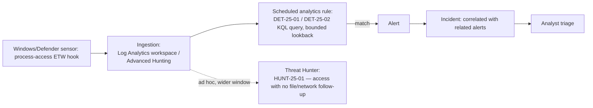
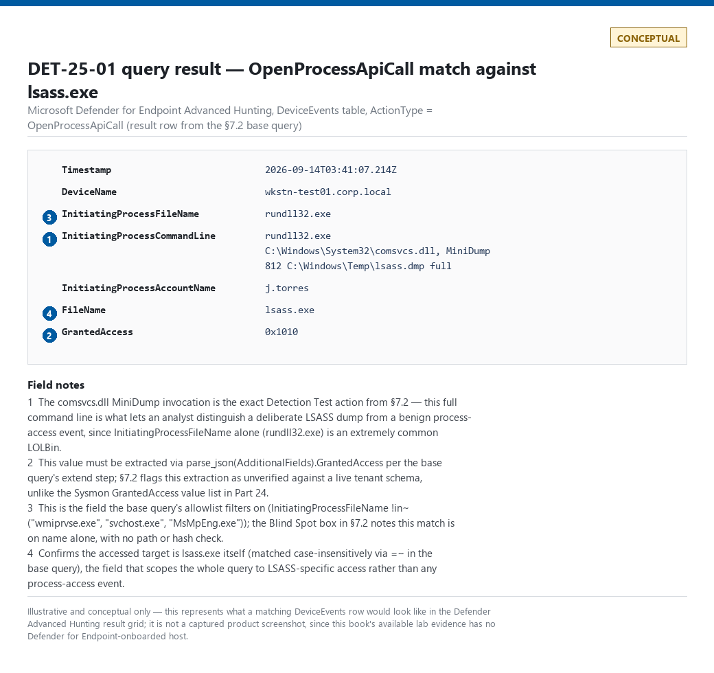

# Part 25 — KQL (Sentinel/Defender)

## Why this part exists

Kusto Query Language (KQL) is the query surface for two Microsoft platforms a working detection
engineer will almost always touch together: Microsoft Sentinel (the SIEM, backed by a Log
Analytics workspace) and Microsoft Defender (the XDR product family, queried through Advanced
Hunting). Both speak the same KQL dialect against different table catalogs, and as of this
writing both are reachable from the unified Defender portal for a Sentinel-onboarded tenant — so
"which product am I querying" matters less than it used to, but "which table catalog am I
querying" still matters a great deal, because table names, retention, and field schemas differ
between the two.

This part builds directly on Part 23 and Part 24. Part 23 fixed the canonical Analytic this whole
section of the book carries forward — DET-23-01, a suspicious `lsass.exe` process-access pattern —
and Part 24 finished it into a tested Sigma `Detection Rule` (see TERMINOLOGY.md § Analytic and §
Detection Rule for why those are two different claims) against Sysmon Event ID 10 (Process Access)
telemetry, plus
a second worked example, DET-24-01, an SSH failed-authentication burst expressed as a Sigma
correlation rule against this book's own real lab evidence. Part 24 §4.1 explicitly flagged that
KQL's native aggregation is often the more reliable path for that second detection than Sigma's
still-maturing correlation-rule syntax — this part delivers on that pointer directly, alongside the
KQL translation of DET-23-01 itself.

This part does not cover: the Sigma-to-KQL translation mechanics or field-mapping gaps in the
abstract (Part 23 owns that framing — this part supplies the concrete backend-specific detail Part
23 §4 deferred to it); Sentinel analytics-rule YAML, CI/CD wrapper metadata, or rule-repository
structure (Part 22); or general-purpose KQL for non-security Azure Monitor workloads, which shares
the language but not the table catalog or the detection-engineering concerns this part cares about.

## 1. The KQL pipe model and where the data actually lives

**[CONCEPT]** A KQL query is a chain of tabular operators connected by the pipe character `|`:
each operator takes the table produced by the one before it and produces a new table, read top to
bottom. There is no `SELECT`/`FROM` inversion to parse — the first line names a table, and every
following line is a transformation applied to whatever came out of the line above it.

```kql
DeviceEvents
| where Timestamp > ago(1h)
| where ActionType == "OpenProcessApiCall"
| project Timestamp, DeviceName, ActionType
```

The query above targets a Microsoft Defender for Endpoint Advanced Hunting workspace; its main
limitation is that it returns every process-access event matching that `ActionType`, not just
LSASS-targeted ones — see §7 for the filtered version implementing DET-25-01.

**[ENGINEERING]** Which tables exist depends on which product surface a query runs against:

| Table (illustrative selection) | Surface | Typical content |
|---|---|---|
| `SecurityEvent` | Sentinel (Log Analytics, via the Azure Monitor Agent (AMA) or legacy agent) | Windows Security event log, forwarded per configured audit policy |
| `Event` | Sentinel (Log Analytics) | Generic Windows Event Log channels, including Sysmon, as raw XML-backed rows — requires manual parsing |
| `Syslog` | Sentinel (Log Analytics, via the AMA syslog connector) | Linux syslog facilities, including `auth`/`authpriv` — the source table for §6's SSH example |
| `DeviceEvents` | Defender (Advanced Hunting) | Miscellaneous endpoint security events, including process-access API calls, keyed by `ActionType` |
| `DeviceProcessEvents` | Defender (Advanced Hunting) | Process creation, one row per process |
| `DeviceLogonEvents` | Defender (Advanced Hunting) | Endpoint logon activity |
| `DeviceNetworkEvents` | Defender (Advanced Hunting) | Outbound/inbound connection metadata |

The table above supports one decision: which surface to query first when a detection needs a
Windows endpoint signal — `SecurityEvent`/`Event` if the tenant only forwards Windows event logs
into Sentinel with no Defender for Endpoint sensor, `DeviceEvents`/`DeviceProcessEvents` if
Defender for Endpoint is deployed and its richer, pre-normalized schema is available.

> **Engineering Reality**
> DET-23-01's Sigma rule (Part 24 §3) is written against Sysmon Event ID 10's own field names —
> `SourceImage`, `TargetImage`, `GrantedAccess`, `User`. A tenant forwarding Sysmon into a Log
> Analytics workspace through the legacy or Azure Monitor Agent gets those events into the generic
> `Event` table with the full field set buried inside a raw XML blob, needing an explicit `parse`
> or `parse_xml` step before any of this part's filtering logic applies. A tenant running Defender
> for Endpoint instead gets a *different* native table (`DeviceEvents`) with a *different* field
> set that does not carry a one-to-one `GrantedAccess` equivalent — this is Part 23 §4's
> field-mapping-gap warning, observed directly rather than described abstractly; §7 below shows
> exactly where it bites.

## 2. Core filtering and shaping syntax

**[DETECTION ENGINEER]** The small set of operators below covers most of what a detection rule's
body does before any join or aggregation:

- `where` — filters rows by a boolean predicate. Always the first operator after the table name
  when a time column is available; see §3 for why ordering here is a performance decision, not
  just a style preference.
- `project` — selects and renames columns, discarding the rest. `project-away` does the inverse:
  keep everything except the named columns.
- `extend` — adds a computed column without dropping the existing ones.
- `distinct` — deduplicates rows across the named columns.
- `sort by` / `order by` — synonyms; sort descending by default, `asc` to reverse.
- `take N` / `limit N` — synonyms; caps the row count returned, with no guaranteed ordering unless
  paired with `sort by` first.

**[DETECTION ENGINEER]** String-match operator choice has a real performance cost at scale, not
just a syntax preference: `==` and `has` match against Kusto's term index and are fast even over a
wide time range; `contains` and `matches regex` fall back to a substring or regex scan of the raw
column value and get proportionally slower as the scanned row count grows. `has` matches whole
terms (delimited by whitespace/punctuation), so it is not a drop-in replacement for `contains`
when the target is a substring inside a larger token — but wherever a whole-term match is
semantically correct, prefer it.

> **False Positive Trap**
> `InitiatingProcessFileName contains "svc"` will match `svchost.exe`, but also `mysvcbackup.exe`,
> `wsvc_updater.exe`, and any other legitimate binary that happens to contain the substring — a
> broad `contains` filter written to "catch service-named processes" catches unrelated ones too.
> Match on the exact expected filename with `==` or `has`, and if the intent is genuinely "any
> process whose name looks like a Windows service host," say so with a specific, reviewed list
> rather than a substring guess.

## 3. Time-window functions

**[DETECTION ENGINEER]** Every table in Sentinel and Defender carries a primary timestamp column
(`TimeGenerated` in most Sentinel tables, `Timestamp` in most Defender Advanced Hunting tables).
The core time functions:

- `ago(timespan)` — a duration back from the query's evaluation time: `ago(1h)`, `ago(30m)`,
  `ago(7d)`.
- `now()` — the query's evaluation time; rarely needed directly, since `ago()` already anchors to
  it.
- `between (datetime1 .. datetime2)` — an explicit closed range, useful for backtesting a rule
  against a known incident window instead of "now minus N."
- `bin(datetime_column, timespan)` — rounds a timestamp down to the start of its containing
  bucket; the standard way to group events into fixed windows for a `summarize` (§5).
- `startofday()`, `startofweek()`, `startofmonth()`, `startofyear()` — convenience wrappers around
  the same bucketing idea for calendar-aligned windows rather than arbitrary fixed-size ones.
  There is no `startofhour()` in KQL — for a calendar-hour boundary, use `bin(datetime_column,
  1h)` instead, which already rounds down to the top of the hour.

```kql
DeviceProcessEvents
| where Timestamp between (datetime(2026-09-01) .. datetime(2026-09-08))
| where FileName == "rundll32.exe"
| summarize Count = count() by DeviceName, bin(Timestamp, 1h)
```

This query targets a Defender for Endpoint Advanced Hunting workspace and is meant for
backtesting a rule against a known 1-week window rather than running on a schedule; its main
limitation is that `rundll32.exe` is an extremely common legitimate LOLBin, and this alone
produces no usable signal without the additional filtering shown in §7.

**[ENGINEERING]** Put the time filter first, immediately after the table name, whenever the query
targets a table large enough that a full scan matters. Kusto pushes a leading time-range predicate
down to the storage layer and prunes data extents that fall entirely outside the range before any
other operator touches them; a `where TimeGenerated > ago(1h)` placed after several other `where`
clauses still works logically, but it can no longer prune extents as effectively as a leading one,
so the engine ends up scanning more raw data than the query strictly needs.

> **Engineering Reality**
> A scheduled analytics rule's "lookback" (how far back each run queries) and its "run frequency"
> (how often it runs) are two independent settings, and mismatching them creates a real coverage
> gap: a rule set to run every 15 minutes with a query lookback of exactly 15 minutes will miss any
> event whose ingestion lagged behind evaluation time by even a few minutes, because that event
> simply wasn't in the workspace yet when the run fired. The standard fix is to set the lookback
> window wider than the run frequency (commonly two to three times as wide) and rely on the rule's
> own alert-deduplication/suppression logic to avoid re-alerting on events already actioned in a
> prior run — not to make the lookback exactly equal to the schedule.

## 4. Joins

**[DETECTION ENGINEER]** A `join` combines rows from two tabular expressions on one or more shared
key columns — the mechanism KQL uses for what TERMINOLOGY.md calls Correlation: producing a
verdict from two or more individually low-signal events joined on a shared Entity Key within a
bounded Correlation Window. The join kinds a detection rule actually reaches for:

- `kind=inner` (default) — keep only rows with a match on both sides.
- `kind=leftouter` — keep every left-side row, with right-side columns null where no match exists;
  the standard choice for enrichment, where the left side is the event you already care about and
  the right side is optional context.
- `kind=leftsemi` — keep left-side rows that have a match, but only the left side's columns; useful
  for "does a matching row exist at all" without carrying the joined columns forward.
- `kind=leftanti` — the inverse of `leftsemi`: keep left-side rows with *no* match — the shape a
  detection needs when the analytic is "X happened without a corresponding Y" (an allowlist
  exclusion is usually written this way, or as a `where ... !in` against a precomputed list).

```kql
let LsassAccess = DeviceEvents
    | where Timestamp > ago(1h)
    | where ActionType == "OpenProcessApiCall"
    | where FileName =~ "lsass.exe";
LsassAccess
| join kind=leftouter (
    DeviceLogonEvents
    | where Timestamp > ago(1h)
    | project DeviceId, LogonTimestamp = Timestamp, AccountName, LogonType
) on DeviceId
| where LogonTimestamp between ((Timestamp - 30m) .. Timestamp)
| project Timestamp, DeviceName, InitiatingProcessFileName, AccountName, LogonType
```

This query targets a Defender for Endpoint Advanced Hunting workspace and adds "who was logged on
to this device around the time of the LSASS access" as enrichment context; its main limitation is
that `DeviceId` alone is not a sufficiently precise Entity Key on a multi-user host with several
concurrent sessions — the trailing `between` clause narrows the logon window, but on a host with
back-to-back logons in the same 30-minute band it can still attribute the access to the wrong
session (see TERMINOLOGY.md § Entity Key / Entity Resolution for why no single field survives
every join across every table).

**[ENGINEERING]** Join order and size matter at scale. Left without an explicit strategy hint,
Kusto's query engine picks a join strategy automatically from its own size estimate of each side —
commonly shuffling both sides across cluster nodes by key when both are large, which is correct but
expensive. `hint.strategy=broadcast` overrides that automatic choice and tells the engine to send
the smaller side to every node instead, which is faster when that side is genuinely small (a short
allowlist, a handful of known-bad indicators) and counterproductive when it isn't — treat the hint
as a deliberate override of the engine's own estimate, not as a fix for a join that's slow for an
unrelated reason. Filter and `project` down to only the columns and rows each side actually needs
*before* the join, not after — a join computed over 10 columns per side and then trimmed with
`project` still paid the cost of moving all 10 columns across the cluster, regardless of which
strategy was used.

## 5. `summarize` and aggregation

**[DETECTION ENGINEER]** `summarize` collapses rows into groups and computes an aggregate per
group — the operator behind almost every threshold-based detection ("more than N of X from the
same Y within a window") and every noise-reduction step that turns a flood of raw events into one
row per entity.

Common aggregation functions: `count()`, `dcount(column)` (approximate distinct count — fast, but
approximate at high cardinality), `make_set(column)` (collects distinct values into an array, with
a default cap on set size), and `arg_max(TimeColumn, *)` / `arg_min(TimeColumn, *)` (returns the
full row corresponding to the maximum or minimum of the named column per group — the standard way
to get "the most recent event per entity" without a separate sort-and-take step).

**[ENGINEERING]** `summarize` forces a full materialization of its input — every row in scope has
to be read and grouped before the first output row exists, unlike `where`/`project`, which can
stream. Put every filter that can run before the `summarize` there, not after: filtering
post-`summarize` still paid the cost of aggregating rows the query is about to discard.

## 6. Worked example: DET-25-02 — SSH failed-authentication burst, natively aggregated

**[DETECTION ENGINEER]** Part 24 §4.1 expressed DET-24-01 — the same SSH failed-authentication
burst threat hypothesis introduced as DET-01-01/DET-03-01 against real evidence captured from this
book's own home lab (`lab/evidence/ct104-vulnscan-ssh-failed-logins-btmp.txt`, referenced there as
FIG-24-02) — as a two-part Sigma correlation rule, and flagged that not every backend implements
Sigma's correlation-rule types at the same maturity. DET-25-02 below is the native KQL equivalent
Part 24 pointed toward: `summarize` with `bin()` replaces the base-rule-plus-correlation-rule split
entirely, in one query, against Linux syslog forwarded into a Sentinel workspace.

```kql
Syslog
| where TimeGenerated > ago(1d)
| where Facility in ("auth", "authpriv")
| where ProcessName == "sshd"
| where SyslogMessage has "Failed password"
| parse SyslogMessage with * "Failed password for " Account " from " SourceIP " port " Port " " *
| extend Account = replace_string(Account, "invalid user ", "")
| summarize FailCount = count() by SourceIP, Account, bin(TimeGenerated, 5m)
| where FailCount >= 3
```

This query targets a Sentinel workspace ingesting Linux syslog via the Azure Monitor Agent's
syslog connector into the `Syslog` table; its main limitation is the same one Part 24 §4.1
documents for the equivalent Sigma rule, plus one specific to the `parse` step above. OpenSSH logs
a materially different message shape for an unknown account (`Failed password for invalid user
<account> from ...`), and the literals in this `parse` pattern still match that shape — `Account`
just ends up holding `"invalid user <account>"` instead of `"<account>"`. Left unhandled, that
splits one attacker's attempts into two separate `Account` group keys (the plain name and the
`invalid user`-prefixed name), which can keep either bucket under the `FailCount >= 3` threshold
even though the combined attempt volume clears it — a mis-grouping false negative, not a dropped
row. The `replace_string` line above strips the prefix before the `summarize` so both message
shapes collapse into one group key; a production version should still confirm no legitimate
account name genuinely starts with `invalid user ` before relying on this normalization.

> **Detection Test**
> **Setup:** Linux test host forwarding `sshd` authentication log lines to a Sentinel workspace via
> the AMA syslog connector, `auth`/`authpriv` facility included in the data collection rule.
> **Action:** From a separate host, `for i in 1 2 3 4; do ssh baduser@testhost true; done` — four
> failed attempts in quick succession against a throwaway, deliberately wrong-password account.
> **Expected result:** Four ingested `Syslog` rows with `SyslogMessage` matching `Failed password
> for baduser from <test host's IP> ...`, and one row from DET-25-02 once the third failure lands
> inside the same 5-minute `bin()` bucket for that `SourceIP`/`Account` pair — the same threshold
> and grouping Part 24's correlation rule uses, reached here with one `summarize` instead of two
> chained rule definitions.

> **Blind Spot**
> DET-25-02 matches only the `Failed password` message OpenSSH logs for password-based failures —
> a failed public-key, keyboard-interactive, or `none`-method attempt logs a different message
> shape (`Failed publickey for ...`, `Failed none for ...`) this query never matches, so a
> credential-stuffing or key-guessing campaign that never submits a password produces zero rows
> here regardless of volume. The `bin(TimeGenerated, 5m)` grouping is also a fixed window, not a
> sliding one: an attacker pacing attempts at two per 5-minute bucket, or whose burst happens to
> straddle a bucket boundary, never accumulates `FailCount >= 3` in any single bucket even at a
> sustained rate well above human error. Finally, this query depends on `sshd` still logging to the
> `auth`/`authpriv` facility; a hardened host with `SyslogFacility` redirected to a custom facility
> — a common practice for separating SSH logs from other auth traffic — returns zero rows with no
> error, indistinguishable from "no failed logons occurred."

> **False Positive Trap**
> A legitimate user who mistypes a just-rotated password, or a scheduled job whose stored
> credential lags a password-rotation policy by a few minutes, routinely produces three or more
> `Failed password` attempts for the same account from the same source within one 5-minute window
> — indistinguishable from a slow guessing attempt at this threshold. Check for a subsequent
> successful logon from the same `SourceIP`/`Account` pair before escalating: a `FailCount` that
> resolves into a success within the next few minutes is lower-priority than one that never does.

**MITRE:** T1110.001 (Password Guessing).

## 7. Worked example: DET-25-01 — LSASS memory-access, implemented in KQL

### 7.1 The analytic and the detection rule

**[DETECTION ENGINEER]** DET-23-01, the canonical Analytic fixed in Part 23 and finished as a
Sigma `Detection Rule` in Part 24 §3, states: a process other than `lsass.exe` itself, not on an
approved allowlist, opens a handle to `lsass.exe` with access rights sufficient for memory reading.
DET-25-01 below is this book's KQL implementation of that same analytic, targeting a Microsoft
Defender for Endpoint Advanced Hunting workspace rather than the Sysmon-Event-ID-10 telemetry the
Sigma rule targets directly — a deliberate choice to show a genuinely different native backend,
not a mechanical field-for-field re-typing of the Sigma rule's own field names. §7.2's framing
sentence states exactly where that choice costs fidelity.

**MITRE:** T1003.001 (OS Credential Dumping: LSASS Memory).

### 7.2 The base query

**[DETECTION ENGINEER]** The query below is DET-25-01 itself — the base query, before the
volume-tuning pass in §7.3:

```kql
DeviceEvents
| where Timestamp > ago(1h)
| where ActionType == "OpenProcessApiCall"
| where FileName =~ "lsass.exe"
| extend GrantedAccess = tostring(parse_json(AdditionalFields).GrantedAccess)
| where InitiatingProcessFileName !in~ ("wmiprvse.exe", "svchost.exe", "MsMpEng.exe")
| project Timestamp, DeviceName, InitiatingProcessFileName, InitiatingProcessCommandLine,
          InitiatingProcessAccountName, FileName, GrantedAccess
| order by Timestamp desc
```

This query targets a Defender for Endpoint Advanced Hunting workspace, current as of this writing,
and reuses the same `filter_known_tools` allowlist (`wmiprvse.exe`, `svchost.exe`, `MsMpEng.exe`)
Part 9 §3.6 and Part 24 §3 both use for the Sysmon-based version of DET-23-01, so the two
implementations diverge only in telemetry source, not in which callers are treated as legitimate.
Its main limitation is that `ActionType` values and the exact nesting of fields inside
`AdditionalFields` are part of a schema Microsoft revises over time (see the Engineering Reality
callout in §8) — verify both against the live Advanced Hunting schema reference before deploying
this as a scheduled rule, and treat the `GrantedAccess` extraction above as unverified against a
live tenant, unlike the Sysmon `GrantedAccess` value list in Part 24 §3, which this book's other
parts have exercised directly.

> **Detection Test**
> **Setup:** Domain-joined Windows test host with the Defender for Endpoint sensor active,
> isolated from production, local admin rights on the test account.
> **Action:** `rundll32.exe C:\Windows\System32\comsvcs.dll, MiniDump <lsass_PID> C:\Windows\Temp\lsass.dmp full`
> **Expected result:** A `DeviceEvents` row with `ActionType` equal to `OpenProcessApiCall`,
> `FileName` equal to `lsass.exe`, `InitiatingProcessFileName` equal to `rundll32.exe`, and a
> `GrantedAccess` value consistent with full memory-read rights, plus a companion
> `DeviceFileEvents` row for the creation of `lsass.dmp` — the corroborating signal the Blind Spot
> box below depends on.

> **Blind Spot**
> `OpenProcessApiCall` telemetry is emitted from a user-mode API hook the Defender sensor attaches
> to; a loader that reaches `lsass.exe` through direct or unhooked syscalls, bypassing the
> documented `OpenProcess`/`NtOpenProcess` API surface the sensor instruments, can access the same
> memory without generating this event at all — a different mechanism from, but the same practical
> effect as, the handle-duplication evasion Part 23 §1 names for the Sysmon-based version. This
> detection rule sees API-level access; it does not see every possible path to the same memory, and
> a scheduled rule built only on this query should not be represented as complete LSASS-access
> coverage on its own. The base query's own exclusion filter is a second, independent blind spot:
> `InitiatingProcessFileName !in~ (...)` matches on process name alone, with no path or hash check,
> so a credential-dumping loader renamed to `svchost.exe` (or any other allowlisted name) and
> launched from any directory is excluded from this query's output before it ever reaches an
> analyst — not merely under-detected, but actively suppressed by the same line meant to cut noise.
> HUNT-25-01 in §9 inherits this same gap, since it also scopes to callers *not* on this allowlist.

> **False Positive Trap**
> Endpoint-protection and backup/PAM agents routinely open `lsass.exe` with broad access rights as
> part of legitimate self-protection or credential-vaulting behavior, and a crash in an unrelated
> process can trigger Windows Error Reporting (`WerFault.exe`) to take a memory dump that touches
> `lsass.exe` if it happens to be involved in the crash context — the same driver Part 9 §3.6's
> False Positive Trap names for the Sysmon-based rule. The fix is the same allowlist discipline:
> maintain the `InitiatingProcessFileName` list by signed, verified path (ideally by hash, not
> filename alone), and re-verify it after every AV/EDR agent upgrade. Do not "fix" this by widening
> the `GrantedAccess` filter instead — that raises the bar for a real credential-dumping tool too.

### 7.3 Tuning volume with `summarize`

**[DETECTION ENGINEER]** A single confirmed LSASS memory-read is high-severity on its own — this
is not a threshold-based analytic the way DET-25-02 in §6 is — but an environment running an
unreviewed backup or monitoring agent can still generate dozens of matching rows a day before the
allowlist in §7.2 is fully tuned. `summarize` by the initiating binary is the fastest way to find
what an allowlist is missing during that tuning period:

```kql
DeviceEvents
| where Timestamp > ago(7d)
| where ActionType == "OpenProcessApiCall"
| where FileName =~ "lsass.exe"
| summarize Occurrences = count(), Devices = dcount(DeviceName) by InitiatingProcessFileName
| order by Occurrences desc
```

This query targets the same Defender for Endpoint Advanced Hunting workspace over a 7-day window
for tuning purposes, not as the deployed rule itself; its main limitation is that it reports
volume, not maliciousness — a high-volume legitimate agent and a low-volume real attacker look
identical in this view, so it feeds the allowlist review in §7.2, not the alerting decision.

## 8. Performance at scale

**[ENGINEERING]** The patterns above compound differently once a query runs against a real
workspace's actual retention and ingestion volume rather than a lab dataset:

- **Filter first, on the indexed time column.** Every example in this part opens with a `where` on
  `Timestamp`/`TimeGenerated` immediately after the table name, for the extent-pruning reason
  covered in §3 — the single highest-leverage performance habit in this whole part.
- **Project down before a join or `summarize`.** Both operators materialize their input; carrying
  unused columns into either one costs real time and memory for no benefit.
- **Prefer `has`/`==` over `contains`/regex** wherever a whole-term match is semantically correct
  (§2) — the difference is an index lookup versus a scan.
- **Use `let` and `materialize()` for a sub-result reused more than once in the same query.**
  Without `materialize()`, Kusto may recompute an expensive `let`-bound subquery every time it's
  referenced rather than caching the result once.
- **Hint join strategy deliberately, not by default.** `hint.strategy=broadcast` helps only when
  one side is genuinely small (§4); applying it to a large-vs-large join makes things worse, not
  better.
- **Know the timeout you're actually running under.** Interactive queries in the Sentinel/Defender
  portals are bounded by a shorter timeout than scheduled analytics rules get; a query that's "slow
  but finishes" interactively can still be the right shape for a scheduled rule, and a query that
  never finishes interactively needs restructuring regardless of which context runs it.

> **Engineering Reality**
> Advanced Hunting table and field names are part of a Microsoft-controlled schema that changes
> over time — a field renamed, moved under `AdditionalFields`, or retired between portal updates
> produces exactly the failure mode TERMINOLOGY.md calls Schema Drift: the query still compiles,
> still runs, and returns zero rows, with no ingest error anywhere to flag that anything broke.
> Zero rows from a KQL detection rule is indistinguishable from "the technique genuinely isn't
> happening" without a separate, scheduled canary query (or the Adversary Emulation / Atomic Test
> practice from Part 35–36) confirming the rule still fires against a known-good event on some
> regular cadence.

> **SOC Management View**
> Standard Analytics-tier Log Analytics billing (the default for `SecurityEvent`, `Syslog`, and
> most Sentinel tables) is driven mainly by data ingested and retained, not by a per-query scan
> charge — but Basic Logs and Auxiliary Logs tables, the cheaper tiers some teams route
> high-volume, low-value sources into, do bill per gigabyte scanned on every query, and a scheduled
> rule with a missing leading time filter run every 15 minutes against one of those tables is a
> recurring line item, not a one-time inefficiency. Even against Analytics-tier tables where the
> query itself carries no separate bill, an unfiltered scan still consumes shared workspace compute
> and can slow or throttle every other scheduled rule sharing that workspace. Reviewing a new
> scheduled rule's query shape before it ships — and knowing which billing tier its source table
> sits in — belongs in the same approval gate as reviewing its detection logic, not as a separate
> cost-optimization pass months later after the bill arrives.

> **Hunter's Note**
> `union withsource=SourceTable DeviceEvents, DeviceProcessEvents, DeviceNetworkEvents` lets a
> hunter search across several tables' shared columns in one pass, tagging each result row with
> which table it came from — useful for an exploratory pass ("show me everything this device did
> in the 10 minutes around the LSASS access") before committing to which specific table-and-join
> shape a standing detection rule should use.

## 9. Threat hunting angle: HUNT-25-01

**[THREAT HUNTER]** DET-25-01 depends on a corroborating `DeviceFileEvents` row (the `.dmp` file)
to distinguish a confirmed dump from a broad-but-legitimate access, per the Blind Spot box in §7.2.
HUNT-25-01 inverts that dependency as a standing hunting query rather than a standing detection:
pull every `OpenProcessApiCall` match against `lsass.exe` from an initiating process *not* already
on the reviewed allowlist, over a wider window than any scheduled rule's lookback, and manually
review the ones with no corresponding file-write or network event nearby — the pattern a fileless,
memory-only credential-theft technique that never writes a `.dmp` to disk would produce, and that
a rule keyed on the file-write corroboration alone would never surface.





**Figure 25.1 (FIG-25-01) — KQL detection and hunting data flow, Sentinel/Defender.** *CONCEPTUAL.* Illustrates
how the same underlying telemetry feeds both a bounded, scheduled KQL detection rule (DET-25-01 or
DET-25-02) and a wider, ad hoc hunting query (HUNT-25-01) against the same tables, and where each
path ends up (an incident queue versus a documented hunt finding). This is a data-flow sketch, not
a capture from a real workspace. Rendered above; the Mermaid source above is the editable version
of record.



**Figure 25.2 — DET-25-01 query result: `OpenProcessApiCall` match against `lsass.exe`.**
*CONCEPTUAL — illustrative field breakdown; not a captured screenshot.* Shows the field values a
matching `DeviceEvents` row from the §7.2 base query would carry — `InitiatingProcessFileName`,
`InitiatingProcessCommandLine`, `GrantedAccess`, and the rest of the projected columns — for the
`rundll32.exe`/`comsvcs.dll` MiniDump scenario described in that section's Detection Test box.
This book's available lab evidence (see `lab/evidence/`) is drawn from a Linux-based home lab with
no Windows/Defender-for-Endpoint-onboarded host, so a real captured screenshot from a live
Advanced Hunting tenant is deferred to whichever contributor has that access; this figure supports
the worked example in §7 with an illustrative field breakdown in the meantime, not a substitute
claim of a real capture.

> **What Would Change My Mind**
> This part treats `OpenProcessApiCall` plus a `GrantedAccess` filter as a reasonably reliable
> signal for LSASS memory access once the allowlist in §7.2 is tuned. If a production audit showed
> a broad, non-security-tool class of legitimate software routinely requesting the same access
> rights against `lsass.exe` — not just the three allowlist entries carried from Part 9/Part 24 —
> the allowlist-based approach would need to move toward a behavioral baseline per host (has this
> specific binary ever done this before, on this fleet) rather than a static process-name list, and
> this section's confidence in the query as shown would drop from a reasonable starting point to
> "needs environment-specific tuning before deployment."
