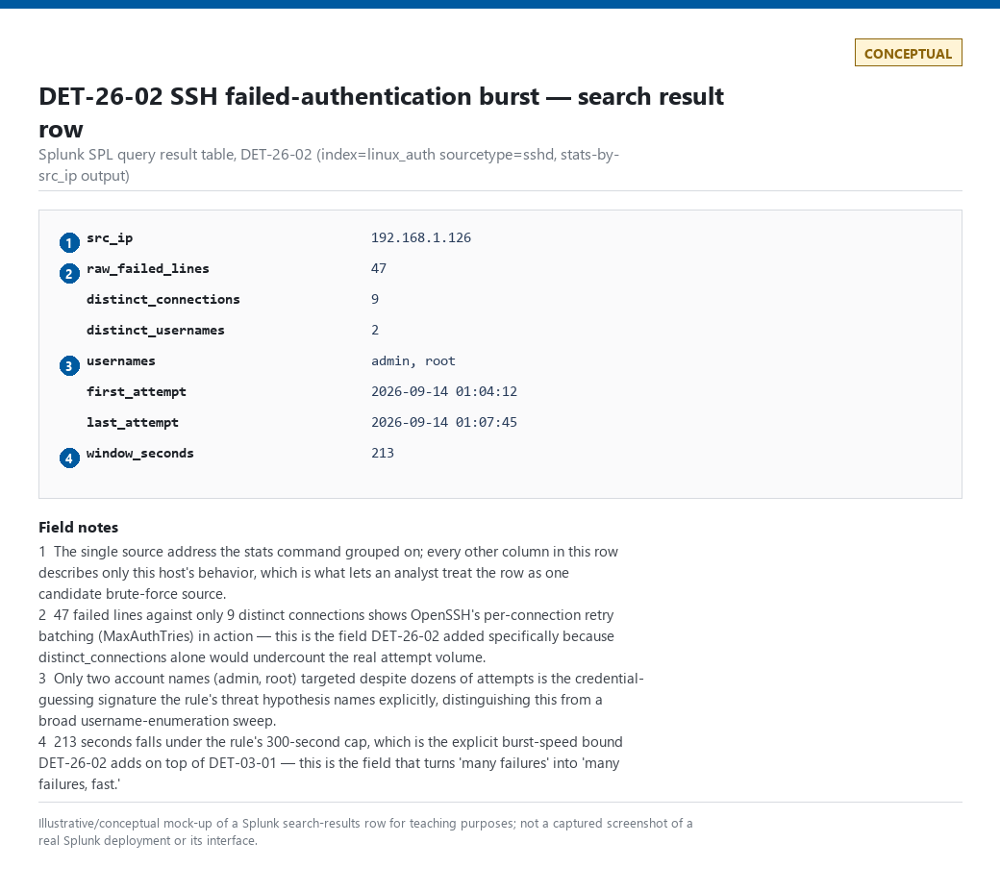
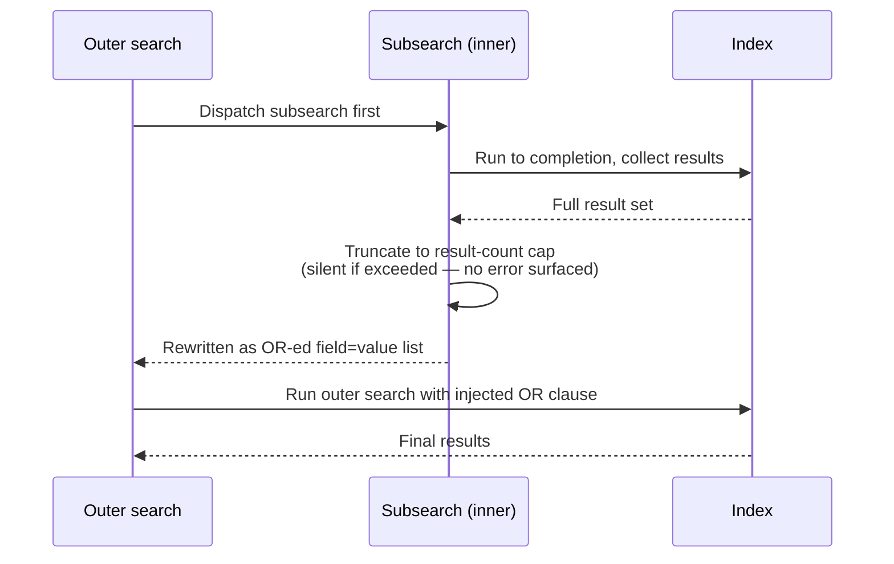
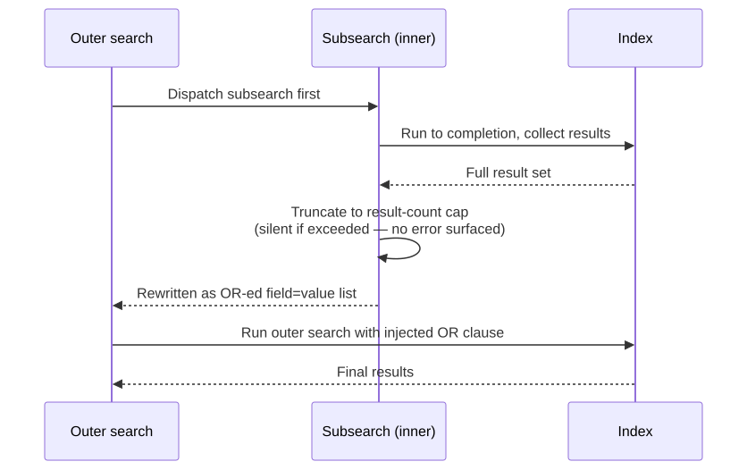

# Part 26 — Splunk SPL

## Why this part exists

Part 23 introduced one canonical analytic — a process other than a small, known set of legitimate system components opening a handle to `lsass.exe` with memory-read access, tracked in this book's detection ledger as DET-23-01 — and carries it through Parts 24–29 so the same logic can be compared language to language instead of six disconnected syntax dumps. Part 24 implemented it in Sigma. Part 25 implemented it in KQL as DET-25-01. This part implements it in Splunk's Search Processing Language (SPL), the native query language of the Splunk platform, as DET-26-01 — and SPL is a genuinely different kind of language than the two you've just read. Sigma is a portable detection-authoring format with no execution engine of its own. SPL is a pipeline language that runs directly against Splunk's own indexed-event model, and that model — specifically, the split between what gets fixed into the index at ingest time and what gets computed fresh on every search — is the thing this part spends the most time on, because it is the single most common source of a Splunk detection that looks correct and silently isn't.

The rest of the part covers SPL's two workhorse aggregation commands — `stats`, which collapses events into summary rows, and `transaction`, which stitches raw events into sessions — and the specific cost trap subsearches create when a detection engineer reaches for one without understanding how Splunk actually executes it. Along the way it also revisits DET-03-01, Part 3's own illustrative SPL rendering of the SSH failed-authentication-burst analytic first stated as DET-01-01, and hardens it — the `stats` mechanics this part teaches in depth turn out to be exactly what that earlier illustrative query was missing. It closes by implementing DET-23-01 as a real SPL search, building on the Sysmon Event ID 10 (ProcessAccess) walkthrough from Part 9 §3.6 and the Sigma version from Part 24.

This part does not cover Splunk administration, index/bucket lifecycle management, or `tstats`/data-model acceleration in depth — Part 22 owns pipeline and platform architecture generally, and a full accelerated-search treatment belongs in a dedicated performance-engineering appendix, not here. Where scale matters to a specific SPL choice covered below, this part says so and points forward rather than re-deriving Splunk's storage architecture from scratch.

---

## 1. The SPL execution model

**[CONCEPT]** SPL is a pipeline language: a search string is a sequence of commands separated by the pipe character, each one taking the result set of everything before it and transforming it before handing it to the next stage. This is mechanically similar to a Unix shell pipeline, and the analogy holds well enough to be useful — `search | filter | reshape | aggregate` is the shape of nearly every real SPL query, in that order, even though Splunk doesn't enforce the ordering syntactically.

### 1.1 Pipes and the search pipeline

**[DETECTION ENGINEER]** A bare SPL search starts with an implicit `search` command scoping which events to pull from the index — `index=windows sourcetype=WinEventLog:Security EventCode=4625` — and everything after the first `|` operates on the result set that search produced, not on the raw index again. This matters for cost: filtering as early as possible in the pipeline (narrowing by `index`, `sourcetype`, and any indexed field before the first pipe) reduces how many raw events Splunk has to read off disk and decompress before any later command runs. A `where` clause placed after three unrelated `eval` and `rex` commands still only operates on events that already survived every earlier stage — cost is paid in the order commands appear, left to right.

### 1.2 Search-time fields vs. index-time fields

**[ENGINEERING]** This is the distinction that separates SPL from most of the other five languages in this book's Rosetta Stone, because none of KQL, AQL, or Elastic's query surfaces expose an equivalent split as directly. Splunk events are stored as raw text (`_raw`) plus a small, fixed set of fields written into the index at ingestion — `_time`, `host`, `source`, `sourcetype`, and any field you've explicitly configured for **indexed field extraction** or index-time transforms. Every other field a search reports — the `SourceImage`, `GrantedAccess`, `src_ip`, `attempted_user` you're used to seeing in a results table — is a **search-time field**: extracted fresh, on every search, from `_raw` by whatever field extractions (`props.conf`/`transforms.conf` regex-based extractions, or an ad hoc `rex` in the query itself) are active for that event's `sourcetype` at the moment the search runs.

The practical consequence: changing or adding a search-time field extraction affects every future search retroactively over already-indexed data, because the extraction runs at query time against the same unchanged `_raw` text. Changing an index-time extraction only affects events indexed *after* the change — historical data keeps whatever fields (or lack of them) it was indexed with, permanently, because `_raw` is the only thing actually written to disk for that purpose, and you cannot append an index-time field to an event that's already on disk without reindexing it. Reindexing anything already ingested is a bulk-cost, back-fill operation, not a config change you push and forget.

> **Engineering Reality**
> Adding a field to index-time extraction is not "free capture" — every additional indexed field is written into every matching event's metadata forever, and it inflates the index size measured against your license the same way retaining more raw data does. The default and correct choice for the overwhelming majority of fields — `SourceImage`, `GrantedAccess`, `src_ip`, `attempted_user`, all the fields this part's detections actually filter and group on — is search-time extraction. Reach for index-time extraction only for a small number of fields you genuinely need indexed for `tstats`-accelerated searches at scale, and treat every one you add as a deliberate storage-cost decision, not a default.

This split is also where Schema Drift (see TERMINOLOGY.md § Schema Drift) shows up in a Splunk-specific way: a search-time field extraction is a regex against raw text, and a vendor log-format change that shifts a field's position, delimiter, or label breaks the regex silently. The search still runs. It returns zero matches for that field, which Splunk cannot distinguish from "this field genuinely never appeared" — no ingest error, no field-extraction error, just a quietly empty column where a value used to be.

> **Detection Autopsy — "the SSH brute-force rule that went silent after a TA upgrade"**
>
> **The rule:** `stats count by src_ip` over failed-SSH events, keyed on a search-time-extracted `src_ip` field pulled from `_raw` via a `props.conf` regex tied to the Splunk Add-on for Unix and Linux's `linux_secure` sourcetype.
>
> **Why it shipped:** The extraction worked in testing against a sample of real `auth.log` lines, and `stats by src_ip` is the obvious, cheap way to count failed attempts per source.
>
> **How it failed:** A minor version bump to the TA changed the `sshd` log line's field order slightly (a locale-formatting change in the timestamp preceding the message body shifted where the regex's capture group anchored). The rule's regex stopped matching the new line shape. `src_ip` came back null on every subsequent event; `stats by src_ip` silently grouped all of them under an empty value, and the count never crossed the alert's per-source threshold again because no single "source" ever accumulated enough events under the broken grouping key.
>
> **The fix:** A parser-health monitor (the same pattern Part 5 §7 builds for null-rate detection) watching `src_ip`'s null rate on this specific `sourcetype`, alerting independently of whether the brute-force rule itself ever fires — so a TA upgrade that breaks the extraction is caught within a day, not discovered during the next incident review.

### 1.3 A working syntax reference

**[DETECTION ENGINEER]** The table below is an index into the commands this part actually uses, not an exhaustive SPL reference — use it to orient before the worked sections, not as a substitute for reading them.

| Command | Does | Used for in this part |
|---|---|---|
| `search` | Filters events by index, sourcetype, keyword, and field-value match; implicit at the start of every query | Scoping the pipeline as early and as cheaply as possible |
| `eval` | Computes a new field from an expression, applied per event | Deriving `window_seconds`, decoding a bitmask, normalizing a value |
| `where` | Filters the current result set by a boolean expression, evaluated after upstream commands | Post-aggregation thresholds (`where failed_attempts >= 20`) |
| `rex` | Extracts a field from another field's text via regex, at search time, for this query only | One-off extraction when no persistent field extraction exists yet |
| `lookup` | Joins the result set against an external CSV or KV store table on a matching field, non-streaming | Allowlist/denylist joins — see §4.3 |
| `stats` | Aggregates events into one summary row per group, computing functions like `count`, `dc`, `values`, `min`/`max` | §2 |
| `transaction` | Groups raw events into multi-event transactions by a shared field and time constraints | §3 |
| `join` | SQL-style join against a second, independently-run search | Rarely the right choice — see §4 |
| `tstats` | Aggregates directly over indexed/accelerated fields without reading raw events | Named where scale matters; not covered in depth here |

---

## 2. `stats` — the aggregation workhorse

**[DETECTION ENGINEER]** `stats` is the command that turns a stream of individual events into one row per group, and the large majority of production Splunk detections are, structurally, a `search` narrowing the event population followed by a `stats ... by <grouping fields>` and a `where` threshold on the aggregated result. It scales well because Splunk can compute most `stats` functions incrementally as events stream through, without holding the full raw event set in memory the way `transaction` does (§3).

### 2.1 Syntax and the functions that matter

```spl
<search terms>
| stats count, dc(<field>) as distinct_count, values(<field>) as all_values, earliest(_time) as first_seen, latest(_time) as last_seen by <grouping field>
```

**[DETECTION ENGINEER]** The functions that come up constantly in detection logic: `count` (raw event count per group), `dc()` (distinct-count — cardinality of a field within the group, the workhorse for "how many different X did this entity touch"), `values()` (the full distinct set of a field's values within the group, useful for showing an analyst exactly what happened without a second query), and `earliest()`/`latest()` on `_time` to derive the group's time span. `min`/`max`/`avg`/`sum` behave as expected over numeric fields.

### 2.2 Worked example: hardening DET-03-01 with `stats`

**[DETECTION ENGINEER]** Part 3 §7.4 already gave an illustrative SPL rule for this book's running SSH-brute-force analytic — first stated at the analytic layer as DET-01-01 in Part 1, then corrected in Part 3 for connection-count inflation and re-implemented as a native Sigma correlation rule in Part 24 (DET-24-01). That illustrative query, DET-03-01, targets Splunk with `sshd` logs ingested via a syslog or journald forwarder and is worth reproducing here as the reference point this section actually teaches the `stats` syntax from:

```spl
index=linux_auth sourcetype=sshd "Failed password"
| rex field=_raw "Failed password for (invalid user )?(?<target_user>\S+) from (?<src_ip>\S+) port (?<src_port>\d+)"
| eval conn_key = src_ip . ":" . src_port
| stats dc(conn_key) as distinct_connections, dc(target_user) as distinct_usernames, count as raw_failed_lines by src_ip
| where distinct_connections >= 5 OR distinct_usernames >= 3
| sort - distinct_connections
```

Its main dependency: `src_port` has to survive ingestion unmodified — a log-shipping config that strips or rewrites the source port collapses every attempt from one IP into a single `conn_key` regardless of how many real connections occurred.

DET-03-01 as written has one gap this part's own subject matter directly closes: it has no time bound at all. `stats dc(conn_key) by src_ip` with no window constraint counts distinct connections *over whatever time range the search itself covers*, which means the rule's actual behavior depends entirely on how wide a scheduled search's lookback happens to be set — five distinct connections spread evenly across a calm 30-day window and five distinct connections in one loud minute both pass `distinct_connections >= 5` identically, even though only one of those is a burst. `earliest()`/`latest()` closes exactly this gap:

> **DET-26-02 — SSH failed-authentication burst, DET-03-01 hardened with an explicit window check**
>
> Same threat hypothesis as DET-01-01/DET-03-01/DET-24-01: a source failing SSH authentication many times, fast, against a small set of accounts, is attempting to guess a credential. This version adds the burst-window bound DET-03-01 left implicit in the search's own time range, making the "fast" part of the hypothesis an explicit, auditable field instead of an assumption about scheduling.
>
> **MITRE:** T1110 (Brute Force), T1110.001 (Password Guessing).

```spl
index=linux_auth sourcetype=sshd "Failed password"
| rex field=_raw "Failed password for (invalid user )?(?<target_user>\S+) from (?<src_ip>\S+) port (?<src_port>\d+)"
| eval conn_key = src_ip . ":" . src_port
| stats count as raw_failed_lines, dc(conn_key) as distinct_connections, dc(target_user) as distinct_usernames, values(target_user) as usernames, earliest(_time) as first_attempt, latest(_time) as last_attempt by src_ip
| eval window_seconds = last_attempt - first_attempt
| where (distinct_connections >= 5 OR distinct_usernames >= 3 OR raw_failed_lines >= 20) AND window_seconds <= 300
```

> **Blind Spot**
> `distinct_connections` assumes roughly one auth attempt per TCP connection, which holds for most brute-force tooling but isn't guaranteed: OpenSSH's default `MaxAuthTries` (6) lets a single connection carry up to six password guesses before the server drops it, so a tool that batches guesses per connection racks up dozens of real attempts against one account while opening only a handful of connections — staying under both the `distinct_connections >= 5` and `distinct_usernames >= 3` branches. `raw_failed_lines` (added above) closes most of this gap by thresholding on total failed-attempt count regardless of connection or username diversity, but an attacker who also spreads that same batching across enough separate low-volume windows can still stay under all three branches.

The real signal this targets is genuine: a `lastb -n 100` capture against CT104 ("vulnscan"), a real host in the lab, shows source `192.168.1.126` (an internal lab device, `LAPTOP-JB22RNU3`, per the lab's own Pi-hole DHCP lease table) attempting SSH logon as `admin` and `root` dozens of times a minute within roughly a 15-minute window on 2026-09-14 (01:01–01:17) — the same evidence FIG-01-03, Figure 3.2, and FIG-24-02 already draw on. (The underlying `/var/log/btmp` file itself contains older entries reaching back to 2026-09-13 20:31, but the dozens-per-minute burst these detections target is the 15-minute span above, not the full multi-hour span of the raw file.) `lastb`'s output doesn't carry a Splunk `sourcetype` or expose the connection-level detail `conn_key` depends on; the query above targets the syslog-line equivalent of the same failed-password event, so treat the field names as illustrative of the real `sshd` log shape rather than a literal replay of the captured `lastb` text.



**Figure — DET-26-02 search-results row.** *CONCEPTUAL — illustrative field breakdown; not a captured screenshot.* A Splunk search-results table showing DET-26-02's output run against real ingested `sshd` syslog data from the home lab. The lab's SSH honeypot and vulnerability-scan hosts are not currently forwarding raw `auth.log` lines into a Splunk instance — the real evidence available (above) was captured via `lastb` reading `/var/log/btmp` directly, not via Splunk ingestion — so this row is an illustrative reconstruction of what the query's output shape would look like, not a literal replay of the captured `lastb` text. It supports the claim that this exact query surfaces the CT104 brute-force pattern inside a live Splunk deployment.

This query's main limitation, unchanged from DET-03-01: bounding `window_seconds` to catch a fast burst is exactly what makes it blind to the opposite profile. Part 3 §7.6 documents a real low-and-slow sweep against a different honeynet decoy — the same source repeating one `support`/`support` credential pair across multiple days rather than many attempts in one sitting. That pattern produces a *low* `distinct_connections` count and a *low* `distinct_usernames` count inside any single 300-second window, since the source isn't varying either field quickly — it fails both branches of this rule, not just the burst branch, precisely because the rule's window is tuned for speed and this profile has none. Closing it needs a second rule with a materially longer window (days, not seconds) and a threshold on repetition against one fixed pair over that window, not a stricter version of the burst rule above.

> **Detection Test**
> **Setup:** Lab-safe Linux SSH target with `auth.log`/`secure` forwarded into Splunk under a known `sourcetype`, no rate limiting or fail2ban active on the target for the duration of the test.
> **Action:** `for i in $(seq 1 8); do ssh -o PreferredAuthentications=password -o PubkeyAuthentication=no baduser@testhost; done` (wrong password each time, from a fixed source IP).
> **Expected result:** Eight or more distinct `sshd` connection records for the source IP; DET-26-02 returns one row for that source IP with `distinct_connections` at or above the number of `ssh` invocations run, `window_seconds` well under 300, and `last_attempt`/`first_attempt` spanning only the seconds the loop actually took to run.

> **False Positive Trap**
> Vulnerability scanners and configuration-management tools that intentionally test weak-credential exposure (the same category of legitimate scanning CT104 itself performs against other lab hosts) produce an identical burst shape from a known, fixed source. Maintain an explicit allowlist of scanner/service-account source IPs and exclude them at the query level with a `lookup` (§4.3) rather than raising the `distinct_connections` threshold — raising the threshold just gives a real attacker more free attempts before the rule notices them too.

> **Engineering Reality**
> A scheduled search only ever sees the slice of time inside its own lookback window, and `stats`/`eval` re-derive `window_seconds` fresh on every run with no memory of the previous run's results. A burst that straddles a scheduling boundary — a 5-minute-interval search with a 5-minute lookback, and the real burst running from :58 to :03 — gets split across two separate runs, each of which may see too few distinct connections, usernames, or raw lines to cross any threshold on its own, even though the full burst would have tripped it easily in one piece. Overlap the lookback past the schedule interval (e.g., a 10-minute lookback on a 5-minute schedule, deduplicating on the aggregated group) or move this to a summary index that accumulates state across runs to close this gap.

---

## 3. `transaction` — sessionizing events, and what it costs

**[DETECTION ENGINEER]** `transaction` groups raw events sharing a common field into a single multi-event transaction bounded by time constraints — the SPL-native way to build what TERMINOLOGY.md calls a Correlation across a Correlation Window, when the thing you want out the other end is the reconstructed sequence of events itself, not just an aggregate count.

### 3.1 Syntax

```spl
<search terms>
| transaction <grouping field> startswith=<eval-filtered condition> endswith=<eval-filtered condition> maxspan=<duration> maxpause=<duration>
```

**[DETECTION ENGINEER]** `maxspan` bounds the transaction's total duration from first to last event; `maxpause` bounds the gap allowed between any two consecutive events before Splunk considers the transaction closed. `startswith`/`endswith` let you anchor a transaction to specific event shapes (a connection open and a connection close) rather than relying purely on time gaps.

### 3.2 Why `transaction` is expensive

**[ENGINEERING]** Unlike `stats`, which can typically be computed incrementally as events stream past, `transaction` has to hold every candidate event for an open transaction in memory until that transaction closes (by hitting `maxpause`, `maxspan`, or an `endswith` match), because it cannot know in advance which later event will complete the group. On a high-cardinality grouping field — a source IP with millions of distinct values, rather than a small set of hostnames — this means potentially millions of concurrently open transactions in memory at once. Splunk bounds this with configurable limits in `transactions.conf` (`maxopentxn`, `maxopenevents`); once those limits are hit, Splunk closes or drops transactions to stay within them rather than raising a query error — a query that appears to complete successfully while having silently discarded some of the sessions it should have produced. Consult your own `transactions.conf` (or the defaults for your Splunk version) before trusting a `transaction`-based detection's completeness at real production volume.

> **Hunter's Note**
> Before reaching for `transaction`, ask whether `stats` with `earliest()`/`latest()`/`values()` by the same grouping field actually gets you what you need. If all you want out of the correlation is "how many distinct paths did this source IP hit, and over what time span," `stats` computes that at a fraction of the cost and scales to cardinalities `transaction` can't touch. Reach for `transaction` specifically when the *ordered sequence* of events matters to the detection logic itself — not just their count or span.

### 3.3 Worked example: sessionizing honeynet HTTP recon

**[DETECTION ENGINEER]** The home lab's honeynet (CT103) runs its own Python correlation logic (`correlation.py`) that groups raw `http_events` rows — `src_ip`, `ts`, `method`, `path`, `user_agent` — into session-level records in an `attack_sessions` table, tagged with a status (`recon` → `probe` → `exploit_attempt` → `possible_success` → `confirmed_postexploit`) and MITRE technique IDs. A real capture of the raw `http_events` table from CT103 shows exactly the kind of rows that feed this: a scanner identifying itself as `Infrawatch/1.0` probing `/mcp`, `/mcp/`, `/api/mcp`, `/sse`, and `/zc` in sequence, and a separate source (`223.123.43.135`) sending a single `POST /GponForm/diag_Form` request — the well-known exploit path for a real, still-actively-scanned-for GPON router authentication-bypass RCE (CVE-2018-10561/10562). A real correlated output row for a different source shows the platform's own logic flagging a session as `possible_success` — an exploit-shaped request followed by continued activity from the same source — worth a manual analyst look.

DET-26-03 below builds the same kind of session record `correlation.py` builds in Python, if this telemetry were ingested into Splunk directly instead of queried from the honeynet platform's own SQLite backend, and it's illustrative of that equivalence — it targets the real field shapes captured from CT103's `http_events` table, but it has not been run against a live Splunk index, since this evidence currently lives in the honeynet platform's own database rather than a Splunk deployment.

> **DET-26-03 — Recon-shaped request breadth via `transaction`**
>
> A source IP issuing more than one HTTP request against more than one distinct path within a bounded window, sessionized directly from raw request events rather than from a pre-correlated table — the SPL-native equivalent of the honeynet's own `recon`-stage classification.
>
> **MITRE:** T1595 (Active Scanning).

CONCEPTUAL SAMPLE — illustrative of the transaction-based equivalent to correlation.py's session
logic; field names match the real http_events schema captured from CT103, but this query has not
been executed against a live Splunk index.

```spl
index=honeynet sourcetype=hp_http_events
| transaction src_ip maxpause=5m maxspan=30m
| eval distinct_paths = mvcount(mvdedup(path))
| where eventcount >= 2 AND distinct_paths >= 2
| table src_ip, eventcount, distinct_paths, path, user_agent, duration
```

This example's main limitation: it reproduces only the "more than one request, more than one distinct path, within a bounded window" recon-shaped heuristic — it does not carry forward the exploit-signature matching (the GPON path check, the credential-field inspection) that makes CT103's own `possible_success` classification meaningfully more precise. A production version needs the same kind of path/signature enrichment CT103's platform already does before the `transaction` grouping, not after it.

> **Blind Spot**
> A `transaction` grouped purely on `src_ip` conflates every distinct actor sharing that source — a NAT gateway, a shared proxy, or a cloud provider's rotating egress pool — into one session. The `possible_success` sessions in the real CT103 capture are single, stable source IPs making this a reasonable grouping key for a honeynet specifically, but the same query against production inbound traffic through a corporate NAT or CDN would merge unrelated legitimate and malicious traffic into one artificial "session." It's also blind to pacing: any two consecutive requests more than `maxpause=5m` apart close the transaction and start a new one, so a source that paces its recon slower than one request every five minutes never accumulates `eventcount >= 2` inside a single transaction and evades this query entirely, no matter how many total paths it eventually touches. Catching that profile needs a `stats`-based rollup over a much longer window — the same low-and-slow fix named for the SSH case in §2.2 — not a stricter `transaction`.

> **False Positive Trap**
> The thresholds above (`eventcount >= 2 AND distinct_paths >= 2`) are only defensible because this query targets a honeynet segment that receives no legitimate traffic by design — on a decoy host, any two requests against any two different paths are inherently worth a look. Pointed at a real, internet-facing web server instead, this exact query matches ordinary browser behavior constantly (a page load followed by a favicon or `robots.txt` fetch is already two paths) and any legitimate multi-page crawl, producing overwhelming noise rather than a usable recon signal. Raise both thresholds by at least an order of magnitude and add the exploit-signature enrichment named above before pointing this query at anything but a zero-legitimate-traffic decoy.

---

## 4. Subsearch cost

**[DETECTION ENGINEER]** A subsearch — `search ... [ subsearch ]` — is the SPL construct that runs an inner search to completion first, then substitutes its results into the outer search as a set of `OR`-ed field-value matches. It routinely makes an SPL detection both slow and silently wrong at once, because most authors reach for it expecting SQL-style join semantics it does not actually have.

### 4.1 How a subsearch actually executes

**[ENGINEERING]** The inner search runs first, completely, before the outer search begins at all — there is no streaming or interleaving between the two. Its results are then capped (by default, a relatively small result-count limit) and rewritten into a boolean `OR` clause injected into the outer search. Two consequences follow directly: the outer search cannot start narrowing anything until the entire inner search finishes, and if the inner search's true result count exceeds the cap, the subsearch silently uses only the first N results and drops the rest — with no error, no warning in the search results themselves, just an outer search that behaves as if some legitimate matches never existed.






**Figure 26.1 — Two-phase subsearch execution and its silent truncation point.** *CONCEPTUAL.* Illustrates the sequential, non-streaming relationship between a subsearch and its outer search, and the specific point — the result-count cap — where a subsearch can silently drop legitimate matches with no error surfaced anywhere in the returned results. This is a sequence diagram of expected SPL execution behavior, not a capture from a live Splunk job inspector; see the pending figure note in §2.2 for a related uncaptured artifact. Diagram ID `FIG-26-01`.

### 4.2 Detection Autopsy: the naive scanner-exclusion subsearch

**[DETECTION ENGINEER]** The truncation mechanism in §4.1 is abstract until it breaks a real exclusion list.

> **Detection Autopsy — "exclude known scanners via a subsearch against the asset inventory"**
>
> **The rule:** A lateral-movement detection excludes known vulnerability-scanner hosts by nesting `NOT [ search index=cmdb tag=scanner | fields host ]` directly inside the outer detection search.
>
> **Why it shipped:** It reads cleanly in a design review — "exclude anything the asset inventory tags as a scanner" — and avoids hard-coding a static IP list that goes stale the moment a scanner host gets reassigned.
>
> **How it failed:** The CMDB index held several thousand tagged scanner assets across the environment, well past the subsearch's default result-count cap. The subsearch silently returned only a truncated slice of the tagged hosts — alphabetically or by whatever internal ordering the search happened to produce — so the exclusion worked for some scanner hosts and not others, and nobody noticed until a specific scanner (alphabetically past the cutoff) started tripping the lateral-movement rule every scan cycle.
>
> **The fix:** Replaced the subsearch with a `lookup` against a CSV export of the same CMDB data (§4.3), which has no comparable result-count cap and makes the full exclusion list an inspectable, versioned artifact instead of a live query nobody thought to check the size of.

### 4.3 Alternatives: `lookup`, careful `join`, and when a subsearch is still fine

**[DETECTION ENGINEER]** A `lookup` against a CSV file or KV store collection is almost always the right replacement for a subsearch used purely for allowlist/denylist matching — it has no equivalent result-count truncation risk for reasonably sized reference tables, it's a single streaming operation rather than a two-phase dispatch, and the reference data becomes a versioned, reviewable artifact (the same Exception-tracking discipline TERMINOLOGY.md requires for detection-rule carve-outs) instead of a live query whose result size nobody is watching. `join` exists for genuine multi-field correlation a `lookup` can't express, but it inherits most of a subsearch's two-phase-execution cost and its own row-limit truncation behavior — treat it as a last resort, not a default alternative to a subsearch.

A subsearch remains a reasonable choice when the inner result set is small and bounded by construction — pulling a handful of currently-active maintenance-window host names to exclude for the next hour, for instance — where the realistic result count sits comfortably under the cap and is unlikely to grow past it without a corresponding, noticeable change in the environment.

---

## 5. Worked example: DET-26-01 — LSASS memory-access, implemented in SPL

**[DETECTION ENGINEER]** DET-23-01, the canonical Analytic carried from Part 23, states: a process other than a small, known set of legitimate system components opens a handle to `lsass.exe` with `GrantedAccess` sufficient for memory reading, and that source process is not on an approved allowlist. That statement is implementation-independent — Part 9 §3.6 grounded it in Sysmon's own event semantics, Part 24 implemented it as a tested Sigma rule, and Part 25 implemented it as DET-25-01 in KQL. DET-26-01 below is this book's SPL Detection Rule implementing the same analytic, targeting Sysmon telemetry ingested into Splunk.

### 5.1 The analytic and telemetry it depends on

**MITRE:** T1003.001 (OS Credential Dumping: LSASS Memory).

**[DETECTION ENGINEER]** The underlying event is Sysmon Event ID 10 (ProcessAccess), carrying `SourceImage`, `TargetImage`, `GrantedAccess`, and `CallTrace` if the Sysmon config's Event ID 10 rule group is not stripping those fields. Sourcetype and field-extraction conventions for Sysmon telemetry inside Splunk vary by which add-on ingests it — the Splunk Add-on for Sysmon commonly lands this as `sourcetype=XmlWinEventLog:Microsoft-Windows-Sysmon/Operational` with `EventCode=10`, extracting `SourceImage`/`TargetImage`/`GrantedAccess` as top-level search-time fields from the underlying XML; a different TA or a hand-rolled parser may flatten this differently. Confirm your own environment's field names with a raw `EventCode=10` search before trusting the query below unmodified.

### 5.2 The SPL search

**[DETECTION ENGINEER]** DET-26-01 targets the same `GrantedAccess` value set and the same short, named source-process allowlist as the Sigma version in Part 24 — the point of the Rosetta Stone structure is that the logic itself doesn't change between languages, only its expression.

```spl
index=windows sourcetype="XmlWinEventLog:Microsoft-Windows-Sysmon/Operational" EventCode=10 TargetImage="*\\lsass.exe"
| search GrantedAccess IN ("0x1010", "0x1410", "0x1438", "0x143a", "0x1fffff")
| lookup lsass_access_allowlist.csv SourceImage OUTPUT is_allowlisted
| where isnull(is_allowlisted)
| stats count, values(GrantedAccess) as granted_access_values, earliest(_time) as first_seen, latest(_time) as last_seen by ComputerName, SourceImage, TargetImage
```

This query's main dependency, and its main limitation: it assumes `lsass_access_allowlist.csv` is a maintained lookup table (`SourceImage`, `is_allowlisted` columns) rather than a subsearch against a live CMDB or EDR-exclusion index — exactly the §4.3 lesson applied here, since a subsearch pulling a large or fast-changing EDR-agent-image allowlist would carry the same silent-truncation risk the Detection Autopsy in §4.2 describes. The `GrantedAccess` value list is the same illustrative-not-exhaustive set Part 9 and Part 24 use; validate it against your own environment's real LSASS-access telemetry before trusting it as a drop-in production rule.

> **Detection Test**
> **Setup:** Domain-joined or standalone Windows test host, Sysmon installed with Event ID 10 enabled and not excluding `lsass.exe` as a target, telemetry flowing into the same Splunk index/sourcetype the query above targets, no EDR agent active on the test host to avoid a confounding legitimate LSASS scan.
> **Action:** `Rubeus.exe dump` or `mimikatz.exe "sekurlsa::logonpasswords"` run from a non-elevated test account added temporarily to local admins.
> **Expected result:** One result row from the SPL query above, with `TargetImage` ending in `\lsass.exe`, `SourceImage` pointing at the test tool's binary path, and `granted_access_values` containing at least one value from the rule's `GrantedAccess` list.

> **Blind Spot**
> This search only evaluates `GrantedAccess` values already known to be sufficient for memory reading, and it depends entirely on Sysmon's Event ID 10 rule group actually being configured to log accesses to `lsass.exe` as a target — a config that excludes `lsass.exe` from the ProcessAccess include list (deliberately, to cut volume, or accidentally, through a bad merge) produces zero matching events with no error anywhere, indistinguishable from "no credential-dumping activity occurred." Verify the Sysmon config's Event ID 10 rule group directly (Part 9 §2) rather than trusting an empty result set from this query as evidence of a clean host. It's also blind to injection: an attacker who injects into, or hijacks, a process already sitting in `lsass_access_allowlist.csv` — a legitimate EDR agent, a backup tool, any other allowlisted binary — inherits that binary's `SourceImage` path and gets filtered out by `isnull(is_allowlisted)` exactly as the rule intends for the legitimate case, which makes the allowlist itself the bypass. Widening the `GrantedAccess` list or shrinking the allowlist doesn't fix this; it needs a companion detection on the injection technique itself, not a change to this rule.

---

## 6. Threat hunting with `stats`: HUNT-26-01

**[THREAT HUNTER]** The `attack_sessions` correlation logic on CT103 classifies sessions into a fixed pipeline — `recon` → `probe` → `exploit_attempt` → `possible_success` → `confirmed_postexploit` — using thresholds and signatures built into `correlation.py`. Any fixed classification pipeline has a blind spot: activity that sits just below whatever threshold promotes a session out of `recon` never gets a human's attention, by construction, no matter how suspicious the underlying pattern actually is.

> **HUNT-26-01 — Recon sessions with unusually broad path diversity but no exploit-signature match**
>
> **Threat Hypothesis:** A source IP issuing requests against many distinct, unrelated paths in a short window — broader than typical single-CVE scanning, narrower than full-crawl behavior — represents attack-surface reconnaissance that the platform's own exploit-signature matching won't promote out of `recon`, even though the breadth of paths targeted is itself a signal worth a look.
>
> **Approach:** Run a `stats dc(path) as distinct_paths, values(path) as paths_hit by src_ip` over the raw `http_events` population still classified `recon`, sorted descending on `distinct_paths`. The real capture from CT103 already shows a candidate pattern worth this kind of pivot — a scanner identifying itself as `Infrawatch/1.0` hitting `/mcp`, `/mcp/`, `/api/mcp`, `/sse`, and `/zc` in sequence, a spread of paths consistent with attack-surface mapping for exposed AI-agent infrastructure specifically, rather than a single-CVE probe.
>
> **Finding:** A hunt run this way either confirms the `Infrawatch`-style pattern is common enough across sources to be background internet noise (in which case it's a documented negative finding — the coverage gap is real but low-value to close) or turns up a small number of sources worth a new analytic candidate scoped to "high path diversity, no known exploit signature, non-trivial request count" — a detection the existing `possible_success`/`exploit_attempt` pipeline was never designed to produce on its own.

Part 27 carries DET-23-01 into QRadar AQL next, where a more limited correlation model forces a different detection design than either Sigma's portability or SPL's pipeline-plus-`stats`/`transaction` flexibility allow for. The subsearch-cost lesson in §4 is worth carrying forward specifically — every query language in this book's Rosetta Stone has its own version of "the join-like construct that looks free and isn't," and SPL's subsearch is simply the first one this book names explicitly.
