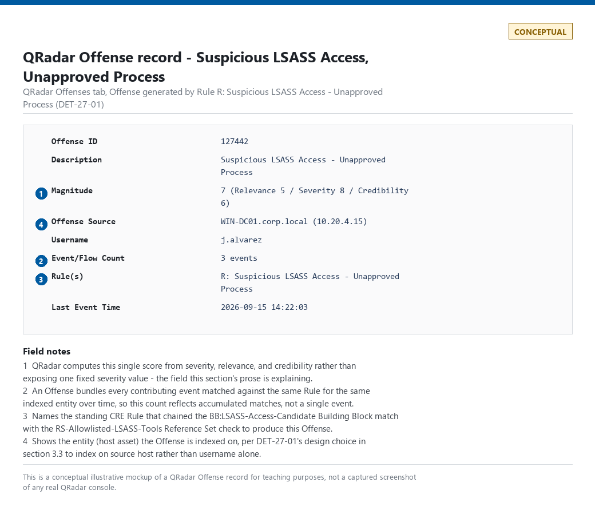
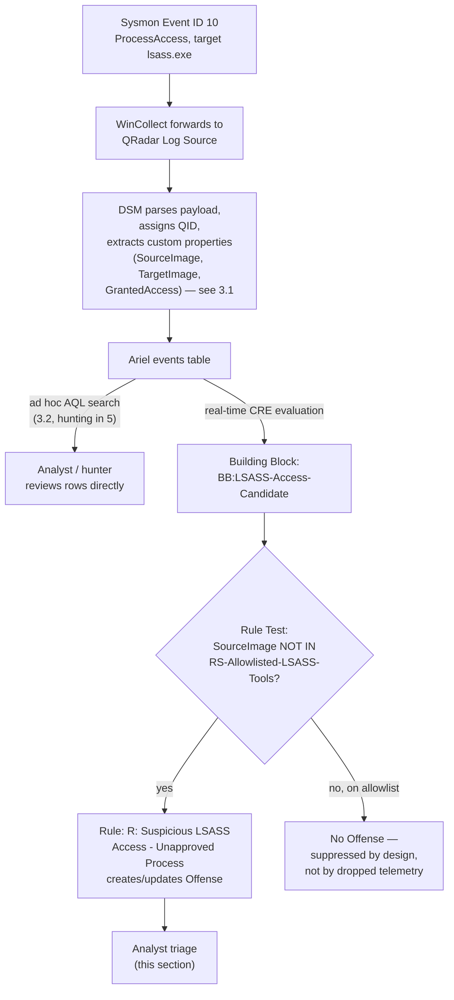
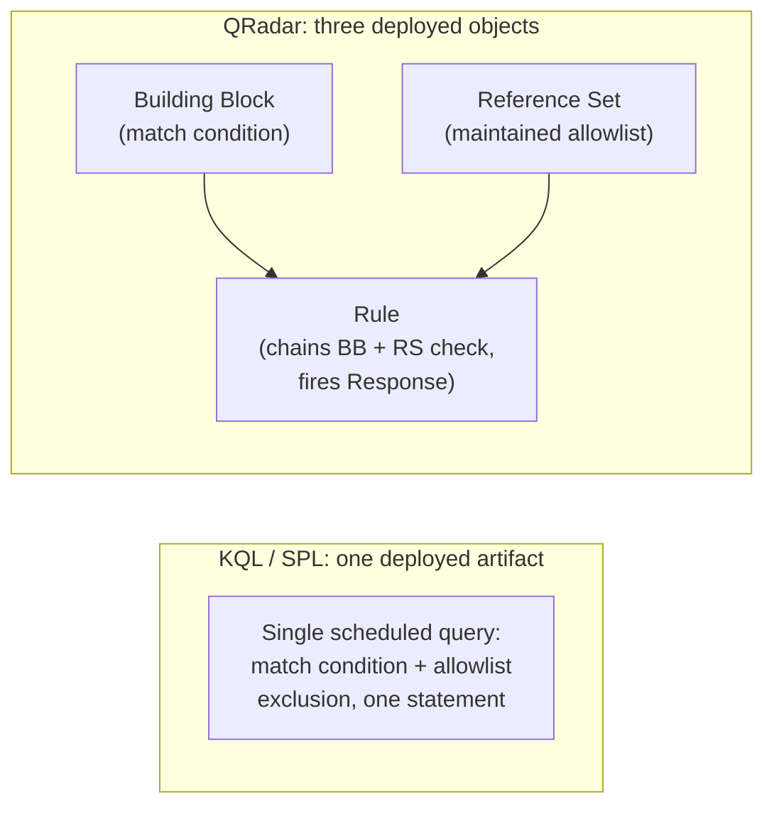

# Part 27 — QRadar AQL

## Why this part exists

**[CONCEPT]** Part 23 named one canonical detection — DET-23-01, a suspicious `lsass.exe` process-access pattern — and flagged one specific claim it would leave for this part to prove rather than assert in the abstract: "Part 27 flags exactly this for QRadar AQL specifically," referring to a correlation model that does not map the same windowing and join semantics onto every backend. This part pays off that claim. AQL (Ariel Query Language) is IBM QRadar's SQL-shaped search language, and on the page it looks close enough to KQL or SPL that a reader coming from either could assume the same authoring pattern carries over: write one query with a join or a time-windowed aggregation, save it, and it becomes the standing detection. That assumption is wrong in a way that matters for how you design a rule, not just how you spell the syntax.

QRadar splits "search my data" and "correlate my data into an alert" across two different subsystems. AQL is the query language for the first. The second — the Custom Rules Engine (CRE), built from Building Blocks, Rule Tests, and Reference Sets — is a separate, largely point-and-click rule-authoring system that AQL only touches at the edges. This part covers AQL's own syntax first, then spends most of its length on why that split exists and what it forces a detection engineer to do differently: decompose DET-23-01's single logical statement into three separate QRadar objects instead of one query, because no single AQL statement is the deployed detection the way a Sigma rule, a KQL scheduled analytics rule, or an SPL saved search is.

This part assumes Part 9's Sysmon Event ID 10 (ProcessAccess) telemetry model, Part 22's detection-as-code pipeline discipline, and Part 23's DET-23-01 definition and field list. It does not re-teach any of those, and it does not re-argue Sigma-first-vs-native authoring — Part 23 §5 already covers that tradeoff generically. What follows is QRadar-specific: how AQL is actually written, where correlation logic actually lives in this platform, and what DET-27-01 — QRadar's re-implementation of DET-23-01 — has to look like as a result.

---

## 1. AQL syntax fundamentals

**[CONCEPT]** AQL queries two Ariel databases — `events` and `flows` — plus supporting lookups such as asset data and reference-set/reference-table data, and functions like `NETWORKNAME()` that resolve a raw IP into the network-hierarchy segment your admins have named it (Admin > Network Hierarchy), rather than a separately queryable network-hierarchy table. Everything in this section is search syntax: it retrieves rows for a human or a downstream process to look at. None of it, on its own, produces a QRadar Offense (the platform's alert-and-case container — see §6). That distinction is the whole argument of this part, stated once here so §2 can build on it without re-explaining it every time.

### 1.1 The events and flows tables

**[DETECTION ENGINEER]** `events` holds one row per normalized log record — the QRadar equivalent of what Part 6 calls a normalized event, after a Log Source's raw data has been parsed by its Device Support Module (DSM) and mapped to QRadar's internal schema. `flows` holds network-flow records (source/destination IP and port, byte and packet counts, application classification) generated by QRadar's own flow collectors or ingested from a third-party flow source (NetFlow, sFlow, packet capture). A basic AQL query looks like this:

```sql
-- QRadar AQL — uses SELECT/FROM/WHERE syntax close enough to standard SQL that most
-- renderers' generic SQL highlighting is readable, but AQL is not SQL: it has its own
-- function set, its own time-window shorthand, and no general-purpose JOIN across
-- arbitrary tables the way a relational database does.
SELECT sourceip, destinationip, username, QIDNAME(qid) AS "Event Name"
FROM events
WHERE LOGSOURCETYPENAME(devicetype) = 'Microsoft Windows Security Event Log'
LAST 24 HOURS
```

This query's main limitation for detection work: it returns rows for a human to read in the Log Activity tab, or for a script to pull via the QRadar REST API — it is not, by itself, a standing rule that produces an Offense when it matches. §2 covers what has to wrap around a query shaped like this before it alerts on anything.

### 1.2 Functions that decode QRadar's internal integers

**[DETECTION ENGINEER]** QRadar stores several of its most useful fields as internal integer IDs rather than human-readable strings, for storage and lookup efficiency, and AQL exposes a set of translation functions to read them back as text:

- `QIDNAME(qid)` — resolves the internal QID (QRadar's own event-taxonomy identifier, distinct from any vendor's native event ID) to its display name, e.g., `'Process accessed'` for the QID a Sysmon-aware DSM maps Event ID 10 onto. QID is the load-bearing concept for everything in this part — see §3.1.
- `CATEGORYNAME(category)` — resolves QRadar's own high-/low-level category taxonomy (a normalization layer roughly analogous to what Part 6 calls a normalized event-category field) to a readable name.
- `LOGSOURCENAME(logsourceid)` and `LOGSOURCETYPENAME(devicetype)` — resolve, respectively, the specific configured Log Source instance and its DSM-defined type (e.g., `'Microsoft Windows Security Event Log'`, `'WinCollect'`) to text.

Custom properties — fields a DSM extracts from a log's raw payload via regex or a structured parser, beyond QRadar's built-in schema — are referenced in AQL by their configured display name in double quotes, e.g., `"Source Process Name"`, exactly the way the query above already does for a computed column alias. Unlike `sourceip` or `qid`, a custom property's availability depends entirely on whether the DSM parsing this specific log source was ever configured to extract it — see §3.1.

### 1.3 Time windows, grouping, and search cost

**[ENGINEERING]** AQL's time-window shorthand (`LAST 24 HOURS`, `LAST 30 MINUTES`) or an explicit `START`/`STOP` timestamp range is mandatory in practice, if not always in syntax — an unbounded search against a busy Ariel database of any real retention depth will run long enough to time out or exhaust search resources shared with every other analyst's concurrent search. AQL supports `GROUP BY` with the standard aggregate functions (`COUNT()`, `SUM()`, `UNIQUECOUNT()`) for the kind of "how many of X grouped by Y" question a hunt or an investigation asks routinely.

> **Engineering Reality**
> QRadar is licensed by sustained Events Per Second (EPS) and Flows Per Minute (FPM), not by data volume or seat count. A Sysmon rollout that widens its config to log Event ID 1 (Process Create) fleet-wide, or a new Log Source that pushes the environment's actual sustained rate over its licensed EPS tier, does not silently get ingested for free — QRadar logs a license-overage condition and can begin dropping or delaying event processing under sustained overage. Before this part's DET-27-01 or any other new analytic goes into a production QRadar deployment, check the EPS budget the way Part 3/4's telemetry cost dimension already asks you to for any source — a detection design that assumes unlimited event volume the way a cloud-native SIEM's storage-based pricing might is the wrong mental model here.

---

## 2. Where correlation actually happens: the Custom Rules Engine

**[CONCEPT]** QRadar's real-time correlation engine — the Custom Rules Engine, universally abbreviated CRE — evaluates every incoming normalized event and flow against a set of deployed Rules as it arrives, independently of whether anyone ever runs an AQL search against the same data. A Rule is built from Rule Tests, chosen from a fixed catalog the Rule Wizard UI presents (point-and-click test selection, not free-form query authoring), and Rules can reference Building Blocks — named, reusable Rule Test groupings that behave like a shared subroutine other Rules can include by name instead of re-specifying the same condition repeatedly.

This is the structural fact that makes AQL's "more limited correlation model" concrete rather than a vague complaint: **a native KQL scheduled analytics rule or an SPL saved search is itself the deployed detection.** A QRadar Rule is a separate object from any AQL search, built through a different authoring surface, evaluated by a different engine, on a different cadence. Learning AQL syntax alone does not teach you how QRadar detections actually get built.

### 2.1 Building Blocks and Rule Tests

**[DETECTION ENGINEER]** A Rule Test is one condition drawn from the Rule Wizard's catalog — common categories include "when the event matches any/all of the following Building Blocks or Rules," "when the event(s) were detected by one or more of these log source types," "when at least *X* events are seen with the same *property* in *Y* minutes" (QRadar's built-in threshold/aggregation test), and "when *this property* is contained in / not contained in *this reference set*." A Rule chains one or more of these tests with AND/OR logic and attaches a Response — create or contribute to an Offense, add an entry to a Reference Set, send an email, trigger a script.

A Building Block is exactly the same authoring mechanism, saved under a name (conventionally prefixed `BB:`) so multiple Rules can share it without re-specifying the underlying condition. The exact wording and available test categories in the Rule Wizard have shifted across QRadar releases — verify the current catalog against your own deployment's version before assuming a specific phrasing exists.

### 2.2 Reference sets: QRadar's answer to a join

**[DETECTION ENGINEER]** Where KQL expresses "this event, joined to a related event elsewhere, within a window" as a `join` and SPL expresses the same idea with `transaction` or a `stats`-then-`where` pipeline, QRadar's standard mechanism for tying one event's observation to another event's later evaluation is the Reference Set (or its typed relatives — Reference Map, Reference Table) — a named, persistent collection of values a Rule Response can add to, and a later Rule Test can check membership against.

*Example:* a Rule fires on event A (a first-stage indicator) and, as its Response, adds the source IP to Reference Set `RS-Stage1-Seen`; a second Rule fires on event B (a second-stage indicator) with a Rule Test checking "when the source IP is contained in `RS-Stage1-Seen`," and only that second match creates the Offense. This is stateful correlation across two events with no shared timestamp window at all — the state lives in the Reference Set until it expires or is cleared, not in a query's time-bounded join condition. It is a genuinely different mechanism from a KQL/SPL time-windowed join, not the same idea wearing different syntax: a Reference Set has no built-in expiry tied to a correlation window unless you configure a time-to-live on the set itself, so an unmanaged Reference Set can accumulate stale entries indefinitely.

### 2.3 What AQL can and can't do inside a rule

**[ENGINEERING]** AQL's role inside this architecture is narrower than its role as a search language. It is the language you use to *investigate* — pivoting from an Offense to the contributing events, running an ad hoc hunt (§5), building a saved search to review before deciding it's worth a standing Rule. Whether a given QRadar version lets you anchor a Rule Test directly to a saved AQL search, and whether that evaluation runs on a true near-real-time streaming basis or a periodic re-run interval, is a version-dependent capability that has changed across releases — check your specific deployment's Rule Wizard and documentation before designing around it, rather than assuming either capability or its absence.

> **Blind Spot**
> A Rule built from point-and-click Rule Tests and Reference Sets evaluates each incoming event against fixed conditions as it streams in, which is genuinely real-time for single-event and simple threshold logic. But because QRadar's standing correlation model does not give you an arbitrary multi-event AQL join running continuously the way a KQL/SPL scheduled query does, any correlation pattern that would naturally be expressed as "join these two differently-shaped events on a shared key within N minutes" has to be decomposed into the Reference Set pattern in §2.2 — and if the engineer building that decomposition misses a case (the first-stage Rule doesn't fire, so the Reference Set entry never gets added), the second-stage Rule silently never fires either, with no error anywhere. An attacker whose first-stage activity evades the specific Building Block written to catch it defeats the entire two-stage chain, not just the first half.

---

## 3. Case study: DET-27-01 — LSASS access, carried from DET-23-01

**[DETECTION ENGINEER]** DET-23-01's analytic, unchanged: a source process not on an approved allowlist opens a handle to a target process image named `lsass.exe`, requesting an access-rights combination that includes memory-read capability. MITRE ATT&CK maps this to T1003.001 (OS Credential Dumping: LSASS Memory). The reference telemetry source is Sysmon Event ID 10 (ProcessAccess), re-anchored here in full since the last mention was several sections back. DET-27-01 is QRadar's re-implementation of that same analytic — the allowlist boundary and the `GrantedAccess` intent stay exactly as Part 23 §1 fixed them; what changes is how QRadar's architecture forces that logic to be expressed.

**MITRE:** T1003.001 (OS Credential Dumping: LSASS Memory).

### 3.1 The prerequisite nobody skips for free: QID mapping

**[ENGINEERING]** Nothing in this section works until Sysmon's Event ID 10 has a DSM path into QRadar that assigns it a specific QID and extracts `TargetImage`, `SourceImage`, and `GrantedAccess` as custom properties. If Sysmon events reach QRadar via WinCollect forwarding the `Microsoft-Windows-Sysmon/Operational` channel, that requires either IBM's own DSM support for Sysmon (coverage and field extraction depth vary by QRadar release) or a community-maintained DSM extension mapped to it — QRadar does not know what a Sysmon event ID means natively any more than a generic log-parsing pipeline does before someone writes the parser (Part 5). An unmapped or partially-mapped Sysmon event still lands in the `events` table under a generic "unknown log" QID, with none of `TargetImage`, `SourceImage`, or `GrantedAccess` available as a queryable custom property — the query in §3.2 returns zero rows against that log source, and it fails the same way Part 23 §3 already warned a Sigma-to-native field-mapping gap fails: no error, no exception, a query that runs cleanly and finds nothing.

> **Engineering Reality**
> Verify the DSM/QID mapping for your specific Sysmon collection path against a known-positive test event (Part 23's Detection Test — run a credential-dumping tool against a lab LSASS process, then check whether the resulting Sysmon Event ID 10 entry shows up in QRadar with `GrantedAccess` populated as a custom property) before writing a single line of AQL or a single Rule Test against it. Populated is not the same as usable: also confirm the exact string format the DSM assigns to `GrantedAccess` — hex (`0x1010`) versus decimal, zero-padded versus not — since both §3.2's query and `BB:LSASS-Access-Candidate`'s Rule Test match it as a literal value comparison. A DSM that emits `4112` where the query or Building Block expects `0x1010` fails exactly like a missing field: the property shows populated data in every event, the query runs without error, and it still returns zero rows. Confirming the DSM mapping is a one-time cost per Log Source type; skipping it is how a QRadar deployment ends up with a Rule that has been silently matching nothing since the day it was deployed.

### 3.2 The ad hoc AQL search

**[DETECTION ENGINEER]** This is DET-23-01's fields expressed as an AQL search — the investigative form, useful for validating the pattern exists in your data before building the standing Rule in §3.3, and for the hunting use in §5.

```sql
-- CONCEPTUAL SAMPLE — custom property names ("Source Process Name", "Target Process Name",
-- "Granted Access") are illustrative, and so is the QID display name 'Process accessed'.
-- The actual AQL property names, and the exact QID display string your DSM assigns to
-- Sysmon Event ID 10, depend entirely on which DSM/DSM extension parses this Log Source
-- and which version you're running (see §3.1) — verify both against your own Log
-- Activity > Advanced Search field list and QID list before reusing this query unmodified.
SELECT starttime, sourceip, username,
       "Source Process Name", "Target Process Name", "Granted Access"
FROM events
WHERE QIDNAME(qid) = 'Process accessed'
  AND "Target Process Name" ILIKE '%lsass.exe%'
  AND ("Granted Access" = '0x1010' OR "Granted Access" = '0x1410')
LAST 24 HOURS
```

This query's main limitation, beyond the field-name uncertainty already flagged: it has no allowlist exclusion built in, unlike DET-23-01's Sigma form — an AQL `NOT` clause against a short, hardcoded list of `SourceImage` values would work for a one-off investigation, but the maintained allowlist belongs in a Reference Set (§2.2), checked at Rule-evaluation time, not copy-pasted into every ad hoc search that touches this pattern.

### 3.3 Turning the search into a standing rule

**[DETECTION ENGINEER]** DET-27-01 as a deployed detection is not the query above — it is three QRadar objects working together:

1. **Building Block `BB:LSASS-Access-Candidate`** — a Rule Test condition equivalent to §3.2's `WHERE` clause: the event's QID resolves to the Sysmon process-access category, `"Target Process Name"` ends in `lsass.exe`, and `"Granted Access"` matches the memory-read-capable value set.
2. **Reference Set `RS-Allowlisted-LSASS-Tools`** — the maintained allowlist DET-23-01 requires, populated with the same intent as Part 23's `SourceImage` exclusion list (`MsMpEng.exe`, `WerFault.exe`, `Taskmgr.exe`, extended with your own environment's legitimate LSASS-touching tools), by full path and — where your Sysmon config's DSM extraction supports it — by binary hash rather than filename alone, for the same reason Part 23's False Positive Trap gives: a filename-only exclusion is trivially defeated by an attacker who renames their tool to `Taskmgr.exe`.
3. **Rule `R: Suspicious LSASS Access — Unapproved Process`** — chains a Rule Test matching `BB:LSASS-Access-Candidate` AND a Rule Test checking `"Source Process Name"` is **not** contained in `RS-Allowlisted-LSASS-Tools`, with a Response that creates or contributes to an Offense indexed on the source host asset (or the `username` field, depending on which entity your program prioritizes for this analytic).

No single AQL statement is this detection. The Building Block, the Reference Set, and the Rule are three separately versioned, separately permissioned objects, and all three have to exist and be correctly wired together before this analytic produces an Offense — a materially different deployment unit than a single Sigma file or a single KQL scheduled query.

> **False Positive Trap**
> The same legitimate LSASS-accessing tools DET-23-01 already names — antivirus/EDR engines scanning `lsass.exe` as part of their own credential-theft protection, Windows Error Reporting generating a crash dump, Task Manager's "Create dump file" action — trigger `BB:LSASS-Access-Candidate` in QRadar exactly as they trigger the Sigma selection in Part 23. The fix is the same: maintain `RS-Allowlisted-LSASS-Tools` by path and hash, and re-verify its entries after every AV/EDR agent upgrade, since a version bump can change a scanning process's binary path and either reopen the false-positive flood or silently stop matching an exclusion nobody re-tested.

> **Detection Test**
> **Setup:** A QRadar deployment with the Sysmon DSM mapping from §3.1 validated, `BB:LSASS-Access-Candidate` and `R: Suspicious LSASS Access — Unapproved Process` both deployed and enabled, `RS-Allowlisted-LSASS-Tools` populated with your environment's known-legitimate tools but not the test tool.
> **Action:** Run a credential-dumping tool against the live LSASS process on a test host reporting Sysmon telemetry into QRadar — for example, Mimikatz's `sekurlsa::logonpasswords`.
> **Expected result:** A Sysmon-sourced event in QRadar's Log Activity matching `BB:LSASS-Access-Candidate` (`"Target Process Name"` ending `lsass.exe`, `"Granted Access"` in the memory-read-capable set), the test tool's path absent from `RS-Allowlisted-LSASS-Tools`, and a new or updated Offense from `R: Suspicious LSASS Access — Unapproved Process` visible in the Offenses tab within QRadar's normal real-time correlation latency for a single-event Rule.

### 3.4 Where this diverges from a KQL or SPL implementation of the same analytic

**[DETECTION ENGINEER]** Part 23 §3 already named the general failure mode: "a time-windowed join that KQL's `summarize ... bin()` or SPL's `transaction`/`stats` expresses natively may force a materially different query shape... once translated for a backend with a more limited correlation model." DET-27-01 is the concrete instance. DET-23-01 itself is a single-event match with no correlation logic, so a KQL or SPL implementation of it is, in each of those languages, one query — a scheduled analytics rule in KQL, a saved search in SPL — that both matches the pattern and excludes the allowlist in the same statement, because both languages let you express "match this, and not that" as one filtered query that is itself the deployed rule.

QRadar cannot express DET-27-01 as one artifact that way. The allowlist exclusion has to live in a Reference Set — a mutable, separately-maintained object outside the matching logic — checked by a second Rule Test rather than folded into the same `WHERE`-equivalent condition. This costs nothing extra for DET-27-01's simple case: a Reference Set membership check is a cheap, well-supported Rule Test, and the three-object pattern is a one-time authoring cost, not a recurring one. It costs considerably more the moment an analytic needs a genuine multi-event, multi-source join — the exact case Part 23 flagged this part to cover, and the reason §2.2's Reference Set pattern, not a native AQL join, is QRadar's real answer to that need. A detection engineer moving a KQL-native multi-stage correlation rule to QRadar should expect to redesign it as a chain of Rules and Reference Sets, not to find an equivalent single-query translation.

---

## 4. Design consequences: decomposing correlation logic for AQL and the CRE

**[DETECTION ENGINEER]** DET-27-01's three-object pattern generalizes. Any analytic that would be one query with a join, a `transaction`, or a multi-clause `summarize` in KQL/SPL becomes, in QRadar, some combination of: a Building Block per distinct event shape being matched, a Reference Set per piece of state that has to survive from one event to a later one, and a Rule that chains Building Block matches and Reference Set membership tests together with a Response that both creates the Offense and updates any Reference Set a downstream Rule depends on.

A second, shorter example makes the threshold-style version of this pattern concrete. **DET-27-02 — repeated authentication failure against one account, from one source, QRadar-style** re-implements the same underlying analytic Part 1's DET-01-01 defines for SSH (three or more failed authentications, same account, same source, within a short window), using QRadar's own threshold mechanism instead of a query-level `count(...) >= 3`. Unlike DET-01-01, which is scoped to one Log Source type (`sshd` auth logs) with a known field layout, this version is deliberately written broader — across whatever Log Source types QRadar has mapped to an authentication-failure category — which is exactly the design decision the paragraph after the query has to call out:

```sql
-- CONCEPTUAL SAMPLE — investigative form only. The standing detection is the Rule
-- described below, not this query; this search exists to validate the pattern
-- against real telemetry before building the Rule. QIDNAME ILIKE '%failed%' matches
-- against every mapped QID with "failed" in its display name, across every Log
-- Source type QRadar has DSM coverage for — verify in Log Activity which QIDs this
-- actually pulls in before trusting the count, and narrow with an explicit
-- LOGSOURCETYPENAME(devicetype) filter for a single, known-consistent source
-- before promoting this into a Building Block.
SELECT sourceip, username, COUNT(*) AS "Failed Attempts"
FROM events
WHERE QIDNAME(qid) ILIKE '%failed%'
  AND CATEGORYNAME(category) ILIKE '%authentication%'
GROUP BY sourceip, username
LAST 5 MINUTES
```

The standing version is a single Rule with a built-in aggregation Rule Test — "when at least 3 events are seen with the same source IP and username in 5 minutes," matching a failed-authentication Building Block — and a Response that creates an Offense. No `GROUP BY`, no `HAVING`-equivalent post-filter, and no Reference Set are needed here, because this pattern is exactly the shape QRadar's native threshold test was built for: one event type, one grouping key, one count.

This example carries limitations DET-27-01 doesn't, because it trades DET-01-01's single-source precision for QRadar-threshold-test generality:

- **Cross-source conflation.** Same as Part 1's DET-01-01, it counts raw failed-authentication events, not distinct connection attempts, and inherits the connection-count-inflation failure mode Part 3 §7 already documents for the same underlying pattern on a different platform. But the failed-auth Building Block behind this Rule can also span multiple, semantically different Log Source types at once (SSH, a VPN concentrator, a local Windows logon) unless it's explicitly narrowed to one — a `username` that happens to match across two unrelated identity namespaces (a coincidence, not the same account) would silently merge into one grouping and either inflate the count toward a false positive or, more subtly, mask which source actually crossed the threshold.
- **Missing-field behavior.** If a matched Log Source type doesn't populate `sourceip` or `username` for its failed-authentication QIDs — some application-layer auth failures log only a session ID or an internal client identifier — the Rule Test's grouping key is null for that event. QRadar doesn't error on this; it either drops that event from meaningful grouping or, if the null itself groups consistently, silently accumulates a count against no identifiable source at all. Confirm both fields are populated for every Log Source type the Building Block is meant to cover before deploying it, the same way §3.1 requires for DET-27-01's custom properties.
- **No allowlist for expected retry noise.** DET-01-01's own Detection Test and False Positive Trap are written against a single SSH source with no such carve-out needed; this generalized version has no equivalent yet.

> **Blind Spot**
> This Rule's grouping key — same source IP and same username, at least three failures in five minutes — is trivially evaded by pacing or spreading the attempts: two failed logons every six minutes against one account never crosses "three in five," and neither password spraying (many accounts, one source, one or two attempts each) nor distributed credential stuffing (many sources, one account, one or two attempts each) ever accumulates enough failures against any single (source, account) pair to fire. Catching either pattern needs a second Rule keyed differently — distinct-username-count per source IP within a longer window for spraying, distinct-source-count per username for stuffing — not a lower threshold or a wider window on this one, since either of those changes also makes the existing rule noisier without closing the gap.

> **False Positive Trap**
> A user who changed their password recently, or a service account with a stale cached credential in a mapped drive, scheduled task, or mobile mail client, retries the same failed authentication automatically every few minutes from one device — same account, same source, same failure signature this Rule targets, with no attacker involved. Add an exclusion Reference Set for known password-rotation windows or, better, correlate against a subsequent success from the same source within the same session before treating the failure burst alone as actionable; do not raise the count threshold to suppress this, since that also raises the bar for a real password-guessing attempt.

Expect a meaningfully higher false-positive rate from this generalized Rule than from DET-01-01's SSH-scoped version until it's narrowed to a specific Log Source type or given the allowlist above — this is the direct cost of choosing "QRadar's native threshold test, applied broadly" over "one query, one source, one field layout." Test it the same way DET-01-01's own Detection Test does: generate six-plus failed authentications for one test account from one source against the specific Log Source type you've scoped the Building Block to, and confirm the Offense fires once the count crosses three within 5 minutes, with `sourceip` and `username` both populated on the contributing events.

The general lesson: **decide early whether an analytic's correlation shape is "count of one event type, one key, one window" (QRadar's native threshold test handles this natively and cheaply) or "state from one event type checked against a later, different event type" (this needs the Reference Set pattern, and costs real design and maintenance effort).** Neither shape is exotic — most real analytics are one or the other — but conflating them, or assuming AQL itself will express whichever one you need the way a KQL/SPL query would, is the specific mistake this part exists to prevent.

---

## 5. Threat hunting in AQL

**[THREAT HUNTER]** AQL's ad hoc search strength is exactly where a standing Rule's fixed Building Block conditions are weakest: a hunter can loosen a condition a deployed Rule holds fixed and see what falls out, without touching production correlation logic at all.

**HUNT-27-01 — Would DET-27-01's `GrantedAccess` value list miss a real access-rights variant?**

**Threat Hypothesis:** DET-23-01's `GrantedAccess` filter (`0x1010`, `0x1410`) is stated as illustrative, not exhaustive — Part 23 §1 says so directly. If real LSASS-access telemetry in this environment shows other `GrantedAccess` values also carrying memory-read capability, `BB:LSASS-Access-Candidate` never evaluates true for those events, and a tool using one of the unlisted values would be invisible to DET-27-01 regardless of whether it's on the allowlist.

**Approach:** Run an AQL search with the `GrantedAccess` filter removed entirely, scoped only to `"Target Process Name"` ending `lsass.exe`, over a representative multi-week window, and group by the distinct `"Granted Access"` values observed:

```sql
-- CONCEPTUAL SAMPLE — hunting query, deliberately looser than DET-27-01's own Building
-- Block condition. Not a standing rule; intended for one-off review of the full value
-- distribution, then discarded or promoted into a new candidate. As in §3.2, the property
-- names and the QID display string are illustrative — confirm both against your own
-- environment first.
SELECT "Granted Access", "Source Process Name", COUNT(*) AS "Occurrences"
FROM events
WHERE QIDNAME(qid) = 'Process accessed'
  AND "Target Process Name" ILIKE '%lsass.exe%'
GROUP BY "Granted Access", "Source Process Name"
LAST 30 DAYS
```

**Finding (illustrative — treat as a template for a real hunt, not a captured result):** A hunt run this way against real telemetry either confirms the two listed values cover the overwhelming majority of legitimate and any tested malicious access attempts in this environment — a negative finding worth documenting, per TERMINOLOGY.md's Hunt definition, as evidence the current threshold is reasonably scoped rather than silence about having looked — or surfaces additional `GrantedAccess` values worth triaging individually: some will be legitimate tools requesting a narrower access right than memory read (an argument for leaving them out), and any that plausibly carry memory-read capability and aren't already on `RS-Allowlisted-LSASS-Tools` become a new detection candidate to fold into `BB:LSASS-Access-Candidate`'s value list, closing exactly the gap DET-23-01's own What Would Change My Mind box anticipates.

> **Hunter's Note**
> Group by `"Source Process Name"` alongside `"Granted Access"` in this kind of hunt, not `"Granted Access"` alone — a value seen exclusively from one signed, well-known binary path across every occurrence reads very differently from the same value seen from a handful of distinct, unfamiliar paths. The count alone tells you frequency; the process-name grouping tells you whether that frequency is one tool asking for the same thing on every host, or something closer to opportunistic, varied tooling worth a closer look.

---

## 6. Analyst triage: reading a QRadar Offense

**[ANALYST]** A QRadar Offense is not quite either an Alert or a Case in TERMINOLOGY.md's strict sense — it behaves like a hybrid of both. An Offense is the queue item an analyst opens (functioning like an Alert instance), but it is also QRadar's own mechanism for bundling every contributing event that matched the same Rule against the same indexed entity into one record over time (functioning like a Case), with a `magnitude` score QRadar computes from severity, relevance, and credibility rather than a single fixed severity value. Treat "one Offense" as "one entity's accumulated matches against this Rule," not as "one event."

For DET-27-01 specifically, triaging a fired Offense means pulling the contributing event(s) — `"Source Process Name"`, `"Target Process Name"`, the resolved `username`, the source host asset — and asking the same question Part 23's own detection asks at the analytic level: is this source process a legitimate tool that should have been on `RS-Allowlisted-LSASS-Tools` and wasn't (a Benign Positive that should become a Tuning change — add it to the Reference Set, don't loosen the Building Block), or is this a genuinely unrecognized process touching `lsass.exe` with memory-read rights (a True Positive candidate that warrants the same escalation any confirmed LSASS-access hit would get, regardless of which query language produced it).



**Figure — QRadar Offense record for DET-27-01.** *CONCEPTUAL — illustrative field breakdown; not a captured screenshot.* Shows the fields an analyst reviews on a fired `R: Suspicious LSASS Access — Unapproved Process` Offense — its magnitude score and its expanded contributing-event list — supporting this section's claim that magnitude bundles severity, relevance, and credibility into one score; compare against Figure 27.1's structural diagram below.






**Figure 27.1 (FIG-27-01) — DET-27-01's path from Sysmon event to QRadar Offense.** *CONCEPTUAL.* Illustrates the two separate consumption paths this part's own argument depends on — ad hoc AQL search on one side, real-time Custom Rules Engine evaluation on the other — both reading the same underlying Ariel `events` table row, and the point (DSM parsing and QID assignment) where the whole chain fails silently if §3.1's mapping prerequisite is skipped. This is a structural diagram of the book's own worked example, not a capture of a real QRadar console. The Mermaid source above stays in the file as the editable source of truth alongside the rendered SVG, per `STYLE-GUIDE.md` §10.






**Figure 27.2 (FIG-27-02) — Same analytic, different deployment unit.** *CONCEPTUAL.* Illustrates the structural contrast this part's §3.4 and §4 argue from prose: one query-shaped artifact in KQL or SPL versus three separately versioned, separately permissioned objects in QRadar for the same logical analytic. Not a capture of any real rule repository. The Mermaid source above stays in the file as the editable source of truth alongside the rendered SVG, per `STYLE-GUIDE.md` §10.

**[SOC MANAGEMENT]** The three-object pattern in Figure 27.2 has a direct staffing consequence worth naming to anyone budgeting a QRadar detection-engineering program against headcount sized for a KQL or SPL shop: reviewing "one detection" in QRadar means reviewing a Building Block, a Reference Set's current membership and maintenance owner, and a Rule's chained logic, as three separately-changeable artifacts that can drift out of sync with each other (a Rule updated to reference a renamed Building Block that a reviewer forgot to update, for instance) in ways a single-file Sigma or native query simply cannot. Budget code review time for a QRadar rule set accordingly — per-detection review cost is not the same across platforms just because the underlying analytic is identical, and reporting "we reviewed N detections" without naming which platform's detections those were is exactly the kind of coverage-count confusion Part 1 and Part 23 §5 both warn against.
