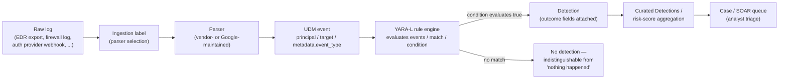
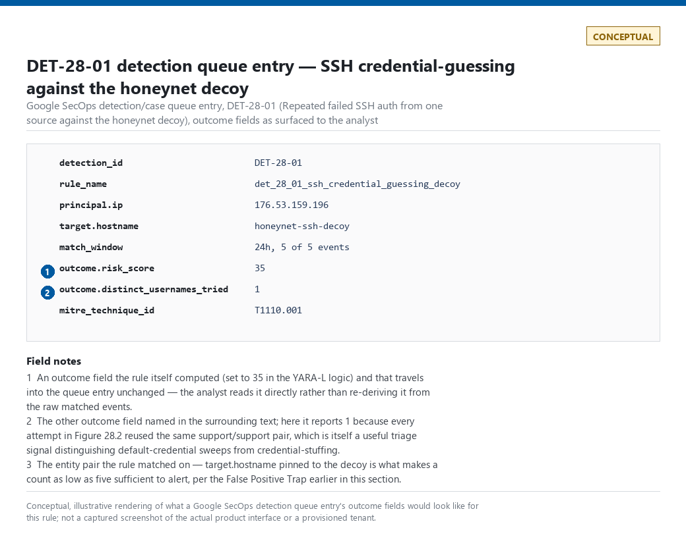

# Part 28 — YARA-L / Google SecOps

## Why this part exists

Part 23 introduced one canonical detection — a suspicious `lsass.exe` process-access pattern, tracked as DET-23-01 — and carries it through Parts 24–29 so each query-language part can be read as "here is the same analytic, in this platform's own syntax" rather than six disconnected tutorials. Part 24 (Sigma), Part 25 (KQL), Part 26 (SPL), and Part 27 (AQL) all express that same analytic against a platform where the detection language and the underlying storage schema are two separate products from two separate teams, sometimes two separate vendors. Google SecOps (formerly Chronicle) is the odd one out in that lineup, and that difference is this part's whole reason for existing: YARA-L is not a general-purpose query language bolted onto whatever schema the platform happened to land on. It is a detection language written specifically to match against one schema — the Unified Data Model (UDM) — that Part 6 already introduced as one of four competing normalization answers. You cannot learn YARA-L syntax usefully without learning UDM's shape at the same time, because every field a YARA-L rule references is a UDM path, not a raw vendor log field.

This part covers YARA-L's rule syntax (`meta`, `events`, `match`, `condition`, `outcome`), the practical difference between a single-event rule and a multi-event correlation rule, and what it actually means to design a detection "UDM-native" rather than translating a rule that was designed against some other vendor's raw schema first. It re-implements DET-23-01 in YARA-L as the required cross-language comparison point, and builds one original worked detection (DET-28-01) against real evidence from this book's own honeynet lab, because Google SecOps's UDM model is genuinely different enough from a flat log schema that a second, fully-worked example earns its place. It does not re-teach UDM's field-by-field mapping against ECS/OCSF/ASIM — that comparison lives in Part 6 — and it does not cover Google SecOps's SOAR case-management layer beyond the point where a rule match becomes a triage-ready item; Part 29 (Elastic) picks up the next query-language comparison once this one is done.

---

## 1. UDM as the substrate every YARA-L rule reads

**[CONCEPT]** Part 6 §2.3 already described UDM's shape: every event normalizes around a `principal` (the actor), a `target` (the object acted on), and a single `metadata.event_type` enum value classifying what kind of event it is — no multi-value category array the way ECS's `event.category` allows, one enum slot per event. That single structural fact is why YARA-L looks the way it does. A YARA-L rule's `events` section is a set of assertions about UDM field values and about how separate UDM events relate to each other through shared variables — it has no concept of a raw log line, a source-specific field name, or a vendor-specific event code, because by the time a rule ever sees the data, a parser has already thrown all of that away in favor of the UDM shape. Writing a "UDM-native" detection means designing the analytic in terms of `principal`/`target`/`metadata.event_type` from the start, rather than mentally drafting a Sysmon-shaped or Zeek-shaped rule and then hunting for the closest UDM field to bolt it onto.





**Figure 28.1 (FIG-28-01) — Data flow from a raw log to an analyst-facing detection in Google SecOps.** *CONCEPTUAL.* Illustrates the hop-by-hop path a YARA-L rule actually sits on: ingestion-label selection decides which parser runs, the parser decides what UDM shape the rule ever gets to see, and a rule that references a UDM field the parser never populates produces the same "no match" outcome as a rule with correct logic evaluated against activity that genuinely didn't happen. Not a capture from a live tenant; it is a structural diagram of the pipeline described in this section and in Part 6 generally.

> **Engineering Reality**
> Which parser runs against a given raw log is decided by the log's ingestion label, not by the rule. Two customers piping the same EDR vendor's export through two differently configured forwarders can end up on two different ingestion labels, get two different parsers, and populate different subsets of the UDM schema for what is, on the wire, identical data. A YARA-L rule that works perfectly in a demo tenant against one ingestion label can silently stop matching in a production tenant using a different label for the same source — verify the ingestion label a rule is meant to run against, not just the vendor name, before trusting it ported cleanly.

### 1.1 The fields a YARA-L rule actually touches

**[DETECTION ENGINEER]** The table below lists the UDM event types this part's worked examples build against. Treat the exact field paths as illustrative of the general shape, not a verified-current schema reference — Google revises UDM's field set and its `metadata.event_type` enum between releases, and this book cannot track that faster than the vendor's own documentation can.

| `metadata.event_type` | Typical source activity | Primary detection use | Example MITRE technique |
|---|---|---|---|
| `PROCESS_LAUNCH` | A process starts, with command line and parent linkage | Execution, LOLBin abuse | T1059 (Command and Scripting Interpreter) |
| `PROCESS_OPEN` | One process opens a handle to another | Credential access via memory-resident secrets, injection precursors | T1003.001 (OS Credential Dumping: LSASS Memory) |
| `USER_LOGIN` | An authentication attempt, success or failure | Brute force, password guessing, credential stuffing | T1110 (Brute Force) |
| `NETWORK_CONNECTION` | A network connection, endpoint- or network-sourced | C2 beaconing, lateral movement | T1071 (Application Layer Protocol) |
| `NETWORK_DNS` | A DNS query/response pair | DGA lookups, C2 domain resolution | T1071.004 (Application Layer Protocol: DNS) |

> **Blind Spot**
> `PROCESS_OPEN` is the UDM event type closest in spirit to Sysmon Event ID 10 (ProcessAccess) — one process reaching into another's address space — but that structural similarity does not guarantee field-for-field parity. Sysmon's raw `GrantedAccess` bitmask (the specific access rights requested on the handle) has no UDM field this book can point to with confidence as its normalized equivalent, and whether a given parser surfaces anything like it at all depends on that parser's own extension fields, not on UDM's core schema. This is Part 6's normalization lesson in a specific, load-bearing instance: normalization can rename and recategorize a field, but it cannot manufacture one the source parser never populated. §4 below builds DET-23-01 around this exact gap rather than pretending it away.

---

## 2. YARA-L rule anatomy

**[DETECTION ENGINEER]** A YARA-L rule is built from up to five named sections, always in the same order: `meta`, `events`, `match` (multi-event rules only), `condition`, and `outcome`. Treat the keyword-level syntax in this section as the general shape of the language, not a guaranteed-current reference — verify exact syntax against Google SecOps's own documentation for the product version you're deploying against before shipping a rule built only from this section.

### 2.1 `meta`

Free-form documentation fields — author, description, a severity label, a MITRE technique reference — plus a small set of keys the platform's own UI treats specially (severity and priority commonly render as filterable/sortable fields in the detection queue rather than staying inert documentation text). Which specific keys get that special treatment has changed across product iterations, so confirm the current reserved-key list rather than assuming every `meta` field you write is purely cosmetic.

### 2.2 `events`

The pattern-matching core: one or more statements asserting a UDM field's value, using a shared `$variable` name to tie separate assertions — within one event or across several — to the same underlying entity. A single-event rule's `events` section describes conditions that must all be true of one UDM event. A multi-event rule's `events` section describes conditions across two or more separately-arriving UDM events, joined by a variable that must resolve to the same value in each (the same host, the same principal, the same target) for the rule to consider them related.

### 2.3 `match`

Present only in multi-event rules: names the grouping variable(s) events must share, and the time window within which they must all occur — for example, grouping on a hostname variable over a stated span. This section is what turns "these separate events share an entity" into "these separate events happened close enough together in time to be the same behavior," the Correlation Window concept TERMINOLOGY.md defines generically, expressed in YARA-L's own syntax.

### 2.4 `condition`

The boolean expression the rule actually evaluates — referencing the `events` section's variables directly for presence/absence, and referencing count-style aggregation (how many times a given event variable matched within the window) for threshold logic like "three or more failed logins."

### 2.5 `outcome`

Computed fields attached to the detection once `condition` evaluates true — a risk-score contribution, a MITRE tag, an extracted field pulled from whichever event variable holds it — that travel with the detection into the triage queue rather than requiring an analyst to re-derive them by hand. This is the section that feeds Risk-Based Alerting (TERMINOLOGY.md §6) when a program aggregates several rules' outcome scores against the same entity rather than treating each rule's match as a standalone alert.

---

## 3. Single-event vs. multi-event rules

**[DETECTION ENGINEER]** The single most consequential design decision in a YARA-L rule is whether it needs a `match` section at all. A single-event rule evaluates one UDM event in isolation and fires the moment that event's fields satisfy `condition` — cheap to evaluate, low latency, and structurally incapable of expressing "this happened more than once." A multi-event rule evaluates a window of related events and can express count-based and sequence-based logic, at the cost of a real design decision about how wide that window needs to be and what happens to the pattern if the window is wrong in either direction: too narrow and a real multi-day pattern never accumulates enough matching events inside any single window to cross a count threshold; too wide and unrelated, individually benign events start getting grouped together under a shared entity variable that was never a meaningful correlation in the first place.

> **Hunter's Note**
> Before writing a multi-event rule, pull the raw event distribution for the pattern you're targeting and actually look at the gaps between events, not just the total count. A pattern that looks like "five failed logins" in a summary count can be five events three seconds apart, or five events spread across four days — those are different analytics with different correct window sizes, and guessing the window from the count alone is how a rule ships that either never fires or fires on noise.

§4 below builds a single-event rule (the LSASS-access analytic evaluates true or false on one event, with no repetition required). §5 builds a multi-event rule against a pattern that, per the real evidence behind it, genuinely spans days rather than minutes — and shows what picking the wrong window size costs.

---

## 4. Worked example — DET-23-01, the canonical LSASS-access analytic, in YARA-L

**[DETECTION ENGINEER]** Part 9 §3.6 established the platform-independent analytic this detection implements: *a process other than a small, known set of legitimate system components opens a handle to `lsass.exe` with access rights sufficient for memory reading, and that source process is not on an approved allowlist.* Part 9 implemented it as a Sigma rule against Sysmon's `process_access` logsource (DET-09-01); Part 23 carries the same analytic forward as DET-23-01 for cross-language comparison. This section implements it a second time, natively against UDM, rather than translating the Sigma rule's field names directly — the point of a UDM-native rewrite is that it exposes exactly which parts of the Sysmon-based version depend on a field UDM does not promise to carry.

The rule below targets a Google SecOps tenant ingesting endpoint telemetry (any parser populating `PROCESS_OPEN` events with `target.process` and `principal.process` fields) and depends on that ingestion label's parser actually populating `target.process.file.full_path` — not guaranteed for every EDR/Sysmon-forwarding parser, per the Blind Spot in §1.1.

**MITRE:** T1003.001 (OS Credential Dumping: LSASS Memory). Tactic: TA0006 (Credential Access).

`CONCEPTUAL SAMPLE` — illustrative YARA-L syntax targeting UDM `PROCESS_OPEN` events, not validated against a live Google SecOps tenant or a specific parser's actual field population; re-implements the analytic behind DET-09-01 (Part 9) as DET-23-01.

```yaral
rule det_23_01_suspicious_lsass_access {
  meta:
    author = "detection-engineering-handbook"
    description = "Non-allowlisted process opens a handle to lsass.exe"
    mitre_technique_id = "T1003.001"
    severity = "HIGH"

  events:
    $access.metadata.event_type = "PROCESS_OPEN"
    $access.target.process.file.full_path = /\\lsass\.exe$/ nocase
    $access.principal.process.file.full_path = $source_path
    $access.principal.hostname = $hostname

    // Named allowlist of known legitimate LSASS-touching components — kept as an
    // explicit, reviewed exclusion list rather than a broad path/category match,
    // the same discipline Part 9's Detection Autopsy argues for.
    not $source_path = /\\(wmiprvse|svchost|MsMpEng)\.exe$/ nocase

  condition:
    $access

  outcome:
    $risk_score = 65
    $mitre_tactic = "TA0006"
}
```

This rule's main limitation is exactly the one the §1.1 Blind Spot names: it never references an access-rights-mask field, because this book cannot confirm one exists at the same fidelity as Sysmon's raw `GrantedAccess` across the parsers likely to feed this ingestion label. That means the rule is broader than DET-09-01's Sigma version — it fires on any qualifying `PROCESS_OPEN` against `lsass.exe`, not only opens requesting memory-read-capable access rights — which raises its false-positive rate relative to the Sysmon-native version until a specific parser is confirmed to expose an equivalent field and the rule is narrowed to use it.

> **Blind Spot**
> The exclusion list matches on filename only — `principal.process.file.full_path` ending in `svchost.exe`, `wmiprvse.exe`, or `MsMpEng.exe` is excluded with no path or signature check behind it. A credential-dumping tool renamed to one of those three filenames and run from any directory — `C:\Users\Public\svchost.exe`, for instance — still opens its handle to `lsass.exe`, still satisfies `$access`, and is silently excluded by this rule's own allowlist before `condition` ever evaluates. That's a trivial, one-line evasion an attacker doesn't need to know YARA-L exists to find, and it's the concrete reason the False Positive Trap below prefers a signature-based exclusion over this filename-substring one.

> **False Positive Trap**
> The allowlist above excludes by filename substring, which Part 9 §3.5 already flagged as the weaker exclusion pattern compared to excluding by signed publisher. UDM's `principal.process` object generally carries a certificate/signature sub-object where the parser populates one — prefer excluding a legitimate EDR/AV self-scan process by that field once you've confirmed your specific parser populates it, rather than shipping the filename-substring version above as a long-term rule.

> **Detection Test**
> **Setup:** A lab endpoint reporting into the Google SecOps tenant via whatever parser/ingestion label the rule targets, with no EDR agent active on the test host to avoid a confounding legitimate LSASS scan (same confound Part 9's Detection Test box for DET-09-01 flags).
> **Action:** Run a credential-dumping tool against `lsass.exe` from a non-allowlisted test binary — for example, `Rubeus.exe dump` from a renamed copy outside any excluded path.
> **Expected result:** A UDM search for `metadata.event_type = "PROCESS_OPEN"` and `target.process.file.full_path` ending in `lsass.exe` returns an event with `principal.process.file.full_path` pointing at the test binary, and the rule above produces a detection with `outcome.risk_score` set to 65.

> **What Would Change My Mind**
> This section treats the missing access-rights field as an acceptable, named gap rather than a blocking problem, on the assumption that a broader-than-ideal LSASS-access rule is still more useful than no rule while the field question gets resolved. If a production tuning pass showed this rule's false-positive rate is high enough that analysts start reflexively closing every instance without real review — the exact Alert Fatigue mechanism TERMINOLOGY.md warns about — that would argue for holding the rule back until a confirmed access-rights-equivalent field is available, rather than shipping the broad version now.

---

## 5. Worked example — DET-28-01, SSH credential-stuffing against a honeypot decoy in UDM

**[DETECTION ENGINEER]** This section builds a second, original detection from real evidence rather than a translated one, because UDM's multi-event correlation model is different enough from a single flat query that DET-23-01's single-event rewrite doesn't exercise it. The evidence is a genuine capture from this book's own honeynet lab: an SSH decoy listener logging attacker-supplied username/password pairs from real internet sources.

**Figure 28.2 — SSH honeypot credential capture, CT103.** *REAL LAB EXAMPLE.* Rows from the honeynet platform's `ssh_events` table on CT103, showing genuine inbound credential-guessing attempts against the SSH decoy listener. Captured 2026-09-15; events shown span 2026-09-10.

```text
id     ts                           src_ip           username  password
10117  2026-09-10T09:08:30.443603Z  107.174.80.154   root      ------fuck------
10104  2026-09-10T09:07:30.815869Z  176.53.159.196   support   support
10097  2026-09-10T08:21:03.680909Z  176.53.159.196   support   support
10085  2026-09-10T07:44:57.880172Z  176.53.159.196   support   support
10064  2026-09-10T05:56:15.117525Z  176.53.159.196   support   support
10055  2026-09-10T05:20:45.798672Z  176.53.159.196   support   support
10048  2026-09-10T04:06:34.893977Z  176.53.159.196   support   support
10041  2026-09-10T03:36:18.692872Z  176.53.159.196   support   support
```

Per the honeynet collector's own capture notes, `176.53.159.196` (and near-neighbor addresses) hit the `support`/`support` combination repeatedly across multiple days, not just within the roughly seven-hour span the excerpt above shows. That detail matters directly to the window-sizing decision below.

**MITRE:** T1110 (Brute Force), T1110.001 (Password Guessing). This is a default-credential sweep — common username/password pairs guessed with no evidence of a breached, real credential list behind them — which maps to Password Guessing rather than T1110.004 (Credential Stuffing), the same distinction Part 3 §7.5 draws for the related SSH evidence from this lab.

### 5.1 Hand-mapped into UDM

`CONCEPTUAL SAMPLE` — a hand-built illustrative UDM document for one row of the evidence above; the field values are real, the document structure was written for this example, not produced by an actual Chronicle forwarder/parser run.

```json
{
  "metadata": { "event_type": "USER_LOGIN", "event_timestamp": "2026-09-10T09:07:30.815869Z" },
  "principal": { "ip": "176.53.159.196" },
  "target": { "hostname": "honeynet-ssh-decoy", "port": 2222 },
  "target.user": { "userid": "support" },
  "security_result": { "action": "FAIL" }
}
```

No field in the source `ssh_events` row carries a destination IP for the decoy itself in this excerpt, which is why `target.hostname` above is a label rather than an address — another instance of §1.1's Blind Spot: the schema has room for an address, the honeypot's own event table doesn't store one for this query, and no amount of correct mapping invents it.

### 5.2 The naive version, and why it misses this exact evidence

> **Detection Autopsy — "three failed SSH logins in five minutes, same source"**
>
> **The rule:** A multi-event YARA-L rule matching on `principal.ip` over a 5-minute window, firing when three or more `USER_LOGIN` events with `security_result.action = "FAIL"` share that IP.
>
> **Why it shipped:** It's the direct UDM translation of the textbook brute-force pattern (the same shape as DET-01-01's Sigma rule in Part 1), and a 5-minute window is a reasonable default for a source hammering a login prompt as fast as the SSH handshake allows.
>
> **How it failed:** Figure 28.2 shows `176.53.159.196` retrying the same credential roughly every 30–90 minutes across a single day, and per the collector's notes, across multiple days beyond that — a deliberately slow cadence, whether by design or by the scanning tool's own rate limit. None of those attempts land inside the same 5-minute window as another, so the count-based condition never crosses three, and the rule never fires against the exact real pattern it was built to catch.
>
> **The fix:** Widen the match window to cover the actual observed cadence, or move to a longer-window aggregation rule evaluated less frequently — both of which trade detection latency for recall against slow, patient sources, a tradeoff §5.3 makes explicit rather than picking a window size and hoping.

### 5.3 DET-28-01

`CONCEPTUAL SAMPLE` — illustrative YARA-L syntax; window size chosen to match the cadence observed in Figure 28.2, not a verified-optimal value for a live tenant.

```yaral
rule det_28_01_ssh_credential_guessing_decoy {
  meta:
    author = "detection-engineering-handbook"
    description = "Repeated failed SSH auth from one source against the honeynet decoy"
    mitre_technique_id = "T1110.001"
    severity = "MEDIUM"

  events:
    $login.metadata.event_type = "USER_LOGIN"
    $login.principal.ip = $src_ip
    $login.target.hostname = "honeynet-ssh-decoy"
    $login.security_result.action = "FAIL"

  match:
    $src_ip over 24h

  condition:
    #login >= 5

  outcome:
    $risk_score = 35
    $distinct_usernames_tried = count_distinct($login.target.user.userid)
}
```

> **False Positive Trap**
> The `target.hostname = "honeynet-ssh-decoy"` filter is load-bearing, not decorative: a honeypot decoy has no legitimate users, so every `USER_LOGIN`/`FAIL` event against it is inherently suspicious, which is what lets this rule alert at a count as low as five with no allowlist at all. Delete that filter and point the identical logic at a real production identity provider's UDM stream and it becomes a much noisier analytic — an employee retrying a just-rotated password, or a service account riding out an expired-credential window, produces the same five-failures-from-one-source/24-hour pattern with zero malicious intent behind it. Do not reuse this rule's threshold or logic against general authentication telemetry without re-adding an equivalent target/asset scope and revisiting the count — "5 in 24h" is calibrated to a target with zero legitimate traffic, not to a real login surface.

> **Engineering Reality**
> A 24-hour match window is materially more expensive to evaluate continuously than a 5-minute one, and Google SecOps enforces some maximum window per rule that this book will not state a specific figure for, since that limit is a product-configuration detail that changes independently of anything in this chapter — verify the current ceiling for your tenant before assuming a multi-day pattern like this one fits inside a single standing rule's window at all. If it doesn't, a scheduled retrohunt-style query run periodically over a longer lookback, rather than a continuously-evaluated multi-event rule, is the correct tool for a pattern this slow.

> **Blind Spot**
> Even a 24-hour window only catches this pattern if the same source IP is used for the full duration and paces attempts faster than roughly one every 4.8 hours (24h ÷ 5). A credential-stuffing operation that rotates source addresses across a botnet — never repeating the same `principal.ip` five times against the same target — produces the same underlying behavior (many guesses, one campaign) while defeating a rule keyed on source IP entirely. So does a single patient source that simply paces slower than the threshold — the identical mechanism that defeated the naive 5-minute-window version in the Detection Autopsy above, just replayed at a longer timescale against the fix. Catching either variant needs a different entity key (shared target + shared credential pair, grouped across many source IPs) or a longer retrohunt-style lookback, not a wider standing-rule window.

> **Detection Test**
> **Setup:** A lab SSH listener configured as a decoy (or a disposable test account with no real access), reachable from a second host that plays the attacker role, with its UDM `target.hostname` populated as `honeynet-ssh-decoy` (or whatever value matches the rule's scope filter above — the rule will not match at all if this doesn't line up).
> **Action:** From the second host, attempt five SSH logons against the decoy with the same wrong username/password pair, spaced roughly 30 minutes apart to mirror Figure 28.2's cadence — for example, `sshd`-side failures generated via `ssh support@decoy-host` repeated on a cron/loop with a 30-minute sleep.
> **Expected result:** Five `USER_LOGIN` / `security_result.action = "FAIL"` UDM events sharing `principal.ip`, and a DET-28-01 detection once the fifth attempt lands inside the rolling 24-hour window, with `outcome.distinct_usernames_tried` reporting 1.

---

## 6. Triage: from a rule match to a curated detection

**[ANALYST]** A YARA-L rule matching does not, by itself, page anyone. It produces a detection instance carrying whatever `outcome` fields the rule attached, which lands in the platform's detection/case queue as the Alert TERMINOLOGY.md describes generically — a claim the match happened, not a verdict on it. Google SecOps additionally ships a set of vendor-curated, managed rule packs (marketed as Curated Detections) covering common patterns without requiring every customer to author them from scratch; treat those the same way you'd treat any vendor-supplied Sigma or Elastic detection rule pack — a starting point to validate against your own telemetry and tune, not a substitute for understanding what the rule actually checks.

The first thing worth pulling for any UDM-based detection is the entity graph around the `principal`/`target` pair the rule matched on — prior detections against the same entity, the account's or host's own history, anything already known about the source IP. That's UDM's own version of Triage (TERMINOLOGY.md), executed against the entity model rather than a separate correlation the analyst has to build by hand.

> **SOC Management View**
> Google SecOps prices ingestion by data volume rather than by query volume or rule count, which changes a program's cost conversation relative to a platform that charges per-search: writing more multi-event rules with wider windows doesn't directly add to the licensing bill the way it might on a metered-query platform, but ingesting a new, high-volume log source to feed those rules does. Budget the cost conversation around "what are we ingesting and at what retention," not "how many rules do we have running" — the second number is close to free to grow once the first is already paid for.



**Figure 28.3 — Google SecOps detection/case queue entry for DET-28-01.** *CONCEPTUAL — illustrative field breakdown; not a captured screenshot.* Shows DET-28-01's outcome fields (`risk_score`, `distinct_usernames_tried`) as they would appear rendered in the analyst-facing queue. Supports the claim above that `outcome` fields travel with the detection into the analyst-facing queue rather than requiring manual re-derivation.

---

## 7. Threat hunting against UDM: visibility debt as a query, not a dashboard

**[THREAT HUNTER]** §1.1's Blind Spot named a specific risk: a parser that doesn't populate the field a rule depends on produces a silent zero-match result indistinguishable from "this doesn't happen here." That risk is directly huntable, because UDM's uniform shape makes "how often is this field actually populated for this event type" a single query rather than a per-source-system investigation.

> **HUNT-28-01 — Field-population gaps behind a standing UDM rule**
>
> **Threat Hypothesis:** For any UDM event type a standing rule depends on, some fraction of events matching that `metadata.event_type` arrive with the specific field the rule filters on left null or absent, because of a parser gap rather than an absence of the underlying activity — and that fraction varies by ingestion label, not uniformly across the whole event type.
>
> **Method:** For each ingestion label feeding `PROCESS_OPEN` events, query the fraction of events where `target.process.file.full_path` is null or empty, broken out by label rather than aggregated across all of them. A label showing a materially higher null rate than its peers is a parser-coverage gap, not evidence that hosts on that label see less LSASS-adjacent activity.
>
> **Finding disposition:** A label with a confirmed high null rate is filed as Visibility Debt (TERMINOLOGY.md §5) against that specific parser/label pairing, not against DET-23-01 itself — the rule's logic is unchanged; its effective coverage on that label is what needs correcting, either by fixing the parser mapping or by explicitly scoping the rule away from that label until it's fixed, so the coverage matrix (Part 41) reports the gap honestly instead of reporting uniform coverage that doesn't actually exist on every label.

---

## 8. Operational realities: ingestion labels, quotas, and rule lifecycle at scale

**[ENGINEERING]** Everything in §§4–7 assumes a rule that compiles and runs; getting there at fleet scale carries its own recurring costs worth naming plainly rather than discovering at rollout:

- **Ingestion-label sprawl.** Every distinct combination of log source and parser version is its own ingestion label, and a program that onboards sources faster than it retires or consolidates labels ends up with dozens of near-duplicate labels for what is conceptually one log source — each one a separate thing a rule's field-population assumption has to be re-verified against, exactly the surface HUNT-28-01 targets.
- **Retrohunt vs. live evaluation.** A rule authored against live, forward-evaluated data does not automatically apply to historical data the same way — running the same logic retroactively over already-ingested telemetry (a retrohunt) is a distinct operation with its own cost and latency characteristics, and it's the right tool for exactly the multi-day, low-and-slow pattern §5.3's Engineering Reality callout flags as a poor fit for a continuously-evaluated window.
- **Reference lists for tuning.** Google SecOps supports named reference lists (allowlists/denylists referenced from within a rule's `condition`) as the preferred mechanism for the kind of named, reviewed exclusion Part 9's Detection Autopsy argues for over an inline filename pattern — maintaining DET-23-01's LSASS allowlist as a reference list rather than a hardcoded regex means updating the exclusion doesn't require re-deploying the rule itself.

> **Engineering Reality**
> A rule that references a reference list by name fails differently than one with an inline exclusion: if the list is ever deleted, renamed, or left empty by a bad automation run, the rule doesn't error — it just stops excluding anything, silently reverting to its unfiltered false-positive rate. Treat reference-list changes with the same change-control discipline Part 22 (Detection as Code) requires for the rule logic itself, not as a lower-stakes configuration tweak.

---

## Summary

YARA-L's syntax is inseparable from UDM's shape — `principal`, `target`, and `metadata.event_type` are not stylistic choices this part could have skipped past; they are the only vocabulary a rule has, which is why §1 covered the schema before §2 covered the language built to match against it. DET-23-01's rewrite in §4 shows that translating an analytic to a new platform surfaces real gaps (the missing access-rights field) that a same-platform tuning pass would never expose. DET-28-01 in §5 shows the reverse risk: a rule can be syntactically correct UDM-native YARA-L and still miss the exact real pattern it was built for, if the match window doesn't match the attacker's actual cadence — which is a design failure, not a language failure, and would look the same in KQL or SPL. Part 29 picks up Elastic's three query surfaces next, closing out the query-language comparison Part 23 opened.
