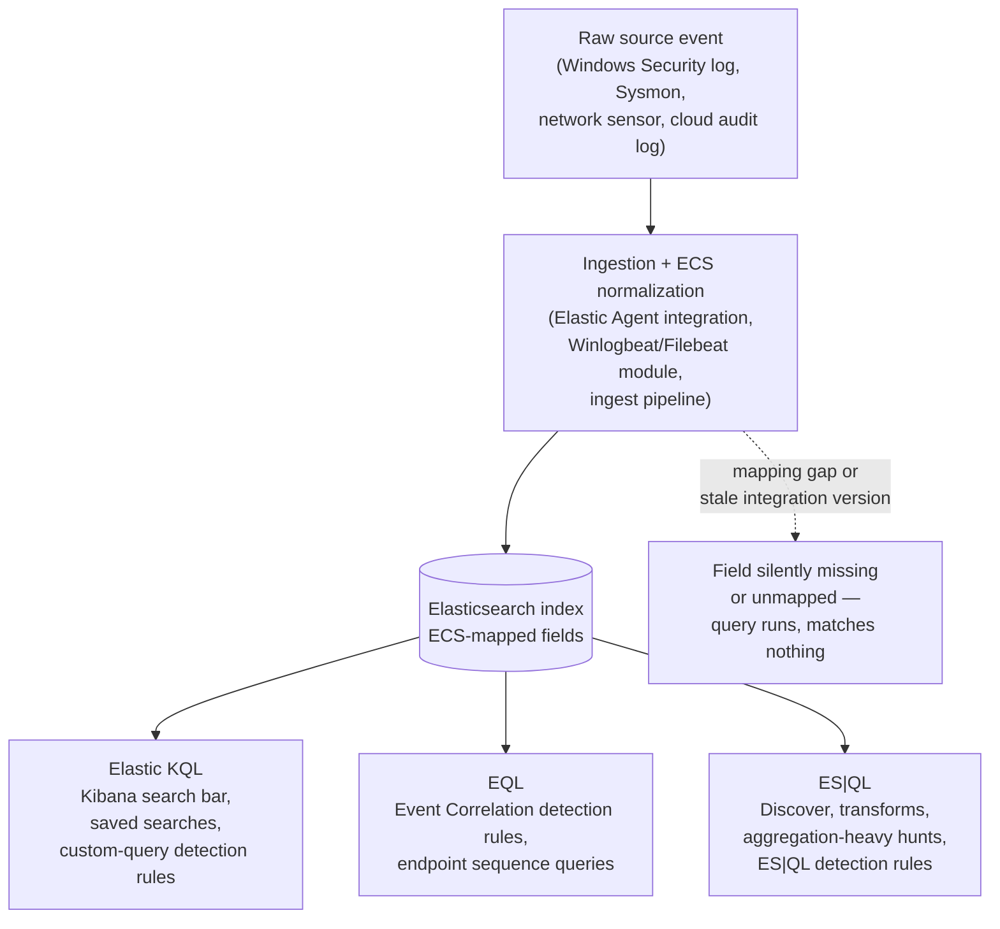
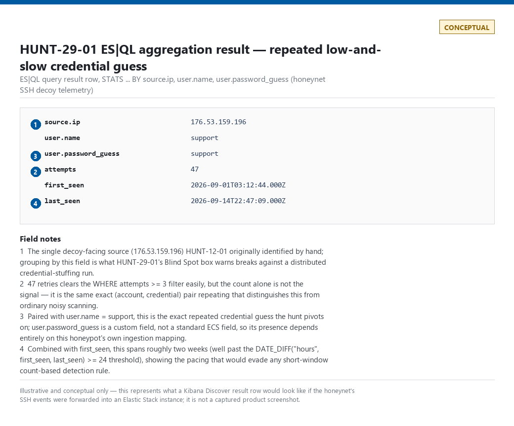

# Part 29 — Elastic (EQL/KQL/ES|QL)

## Why this part exists

**[CONCEPT]** Every other platform in Parts 24–28 gives you one query language for detection logic. Elastic gives you three, in the same product, and expects you to know which one to reach for: **Elastic KQL** (a boolean filter language, typed into the Kibana search bar or dropped into a "custom query" detection rule), **EQL** (Event Query Language, purpose-built for matching a single event or a time-ordered sequence of related events), and **ES|QL** (Elasticsearch Query Language, a pipe-based compute language that reads more like SPL or a dataframe API than either of the other two). None of the three is a strict superset of the others — each one exists because the other two are the wrong tool for a specific job, and a rule author who defaults to whichever one they learned first will eventually write a query that technically runs but structurally cannot express what the analytic needs.

This part does not re-teach Sigma (Part 24 owns that) or repeat the field-mapping and translation-loss argument Part 23 already made in general terms. It gives you the syntax for each of Elastic's three surfaces, a decision rule for when to use which, and one worked implementation of Part 23's canonical detection — **DET-23-01**, carried forward here as **DET-29-01** — expressed across all three, so the "when to use which" argument has a fixed point to argue from instead of three disconnected toy examples.

---

## 1. Three surfaces, one stack

**[CONCEPT]** All three query surfaces read against the same underlying data: events normalized, wherever the ingestion pipeline is configured correctly, into the **Elastic Common Schema (ECS)** — a shared field-naming convention (`process.name`, `source.ip`, `event.category`, `event.action`) that lets one query work across Windows, Linux, cloud, and network telemetry without a source-specific field name for every concept. That normalization step is exactly the field-mapping layer Part 23 §4 flagged as the highest-risk part of any cross-platform translation, and it is where Elastic's own version of that risk lives — see the Engineering Reality box in §3.

- **Elastic KQL** lives in the Kibana search bar, in saved searches, and as the query body of a Security "custom query" detection rule. It filters; it does not correlate, sequence, or aggregate.
- **EQL** is the native language of Elastic Security's "Event Correlation" detection rule type and of endpoint-side querying against Elastic Defend telemetry. It matches a single event, or an ordered sequence of related events joined on a shared field within a bounded time span.
- **ES|QL** is a general-purpose, pipe-based compute language usable from Discover, from Observability, from transforms, and (more recently) as its own detection rule type. It is the surface built for aggregation, multi-stage transformation, and ad hoc analysis — the same job SPL's `stats`/`transaction` commands or KQL-for-Sentinel's `summarize` do on their respective platforms.






**Figure 29.1 (FIG-29-01) — Elastic's three query surfaces against one normalized data layer.** *CONCEPTUAL.* Illustrates where Elastic KQL, EQL, and ES|QL sit relative to the same ECS-normalized index and where the field-mapping failure mode described in the Engineering Reality box below actually occurs — at ingestion, before any of the three query surfaces ever runs. This is a structural sketch of the book's own explanation, not a capture of a real cluster's ingest pipeline.

> **Engineering Reality**
> ECS normalization is a property of your ingestion pipeline, not a guarantee the platform makes for you. An Elastic Agent integration that predates a Sysmon config change, a custom Logstash pipeline missing a field mapping, or a Beats module running an older version than your Sysmon schema will all produce an index where a query referencing the "correct" ECS field name compiles, runs, and returns zero results — silently, with no error, exactly the failure mode Part 23 §3 named for Sigma-to-backend translation. Verify a field is actually populated in your own index (`FROM your-index | WHERE field IS NOT NULL | LIMIT 5` in ES|QL is the fastest way) before trusting an empty result set as "clean."

---

## 2. Elastic KQL — filtering syntax

**[DETECTION ENGINEER]** Elastic KQL is a boolean filter language: given a field and a value, it narrows a result set. It has no correlation construct, no aggregation, and no way to reference "the previous event" — every clause evaluates against one document (one event) at a time.

- **Field match:** `event.action:"process_access"` — quote values containing special characters or spaces; unquoted single-word values work but quoting is the safer default.
- **Boolean operators:** `and`, `or`, `not` (lowercase, or the equivalent symbols in some Kibana versions) — `process.name:"powershell.exe" and not user.name:"svc-backup"`.
- **Wildcards:** `*` for zero-or-more characters, e.g. `winlog.event_data.TargetImage:*\\lsass.exe`.
- **Ranges:** `bytes >= 1000 and bytes <= 5000`, or the shorthand `bytes:[1000 TO 5000]` in the older Lucene-syntax mode Kibana still accepts as a fallback.
- **Existence:** `field_name:*` matches any document where the field is present (any value); useful for checking whether an integration actually populates a field at all before building a rule on it.
- **Nested/grouped clauses:** parentheses group precedence exactly as in any boolean expression — `(event.action:"process_access" or event.action:"already_running") and not process.executable:"*\\MsMpEng.exe"`.

The following Elastic KQL query (not Sentinel/Defender KQL — see the Engineering Reality box below) targets a Sysmon-sourced index ingested via an Elastic Agent Windows/Sysmon integration or the Winlogbeat Sysmon module, the same reference telemetry source Part 23 pins DET-23-01 to:

```kql
event.code: "10" and winlog.event_data.TargetImage: "*\\lsass.exe" and
  winlog.event_data.GrantedAccess: ("0x1010" or "0x1410" or "0x1438" or "0x143a" or "0x1fffff") and
  not process.executable: ("*\\MsMpEng.exe" or "*\\WerFault.exe" or "*\\Taskmgr.exe")
```

This carries Part 23's own field-mapping warning forward unchanged: `winlog.event_data.*` field names and availability depend on the specific integration version shipping your Sysmon events into Elasticsearch, and drift across integration upgrades without any ingest error.

> **False Positive Trap**
> Without the `GrantedAccess` clause above, this fires on nearly every process on the host. Windows lets ordinary, non-malicious processes open a handle to `lsass.exe` constantly — enumerating sessions, checking process state, routine OS bookkeeping — and Sysmon logs every one of those as Sysmon Event ID 10 (ProcessAccess) regardless of what rights the handle actually carries. `GrantedAccess` is the raw access mask Sysmon records for the handle; `0x1010`, `0x1410`, `0x1438`, `0x143a`, and `0x1fffff` are the values most consistently cited across published LSASS-access detections because all of them include the `PROCESS_VM_READ` bit (`0x0010`) — the right actually needed to read credential material out of memory, as opposed to a query-only handle that can't. (An earlier, wider candidate list sometimes floating around also includes `0x1400` — `PROCESS_QUERY_INFORMATION | PROCESS_QUERY_LIMITED_INFORMATION` — but that mask has no `PROCESS_VM_READ` bit set at all and is exactly the routine, non-reading query access described above; it belongs on the noise side of this list, not the watch side, so it's deliberately left out here.) Treat this as a starting set, not a validated one: confirm it against a capture from your own environment, and expect to extend it if a legitimate EDR/AV agent on your estate requests memory-read access to `lsass.exe` as part of its own scanning. This part has no measured false-positive rate for this query on real production traffic — say so rather than inventing a number.

> **Engineering Reality**
> "Elastic KQL" and "Sentinel/Defender KQL" share a name and a large surface-level resemblance (`field:value`, `and`/`or`/`not`) but are different languages maintained by different vendors, with different function libraries and no cross-compatibility guarantee — a query written for one will not run unmodified against the other. When this book says "KQL" without qualification elsewhere, check the surrounding sentence for which one is meant; this part is always the Elastic one.

Elastic KQL is the query body Kibana's older **Lucene query syntax** predates and mostly superseded — Lucene syntax (`field:value^2 AND other:value~`, with boosting and fuzzy-match operators) is still accepted in the same search bar for backward compatibility and for a handful of operations, like fuzzy matching, that KQL itself does not expose. New rule authoring should default to KQL; treat Lucene syntax as a fallback for the specific operations KQL cannot do, not a parallel first-choice language.

> **Blind Spot**
> Elastic KQL cannot express "this same entity did X, then later did Y" — there is no join, no sequence, and no lookback to a prior event from within a single KQL filter. A detection that needs to correlate two related events, however simple, has already outgrown what a "custom query" KQL detection rule can express on its own; that is exactly the job EQL and ES|QL exist to do (§3–§4).

---

## 3. EQL — sequence and correlation

**[DETECTION ENGINEER]** EQL originated as a language built by the Endgame team specifically for endpoint event correlation, and it kept that focus after Elastic's acquisition of Endgame — it is the surface built to answer "did event A happen, and did a related event B happen after it, within a bounded window, on the same entity" without falling back to a generic aggregation query to express that ordering.

**Single-event query — the base case.** Targeting the same Sysmon-via-Elastic-Agent index as §2's KQL example:

```eql
process where event.code == "10" and winlog.event_data.TargetImage : "*\\lsass.exe" and
  winlog.event_data.GrantedAccess in ("0x1010", "0x1410", "0x1438", "0x143a", "0x1fffff") and
  not (process.executable like "*\\MsMpEng.exe" or process.executable like "*\\WerFault.exe" or process.executable like "*\\Taskmgr.exe")
```

This is functionally the same match as the Elastic KQL query in §2 — an EQL query with no `sequence` clause is a single-event filter, and for a single-event match like this, EQL buys you nothing over Elastic KQL except access to EQL-specific functions (string manipulation, `cidrMatch`) that some KQL versions don't expose. Note the syntax this actually allows: EQL's `:` operator and its `like`/`like~` keywords natively support `*`/`?` glob wildcards, so matching `*\lsass.exe` needs nothing more than the `:` operator shown above (or an equivalent `like` clause) — the same bare `*` glob KQL allows. Only `==`/`!=` require an exact value; `in` is the list form of that exact match, which is why `in` — not `:` or `like` — is still the right operator for the `GrantedAccess` clause: those values are exact, not wildcarded — see the False Positive Trap in §2 for why that clause is there at all. The category keyword (`process` above) must match one of the event categories your ECS mapping actually populates — using the wrong category returns zero matches with no error, the same silent-failure shape as the field-mapping gaps named in §1 and the False Positive Trap above.

**Sequence query — where EQL actually earns its keep.** It re-implements DET-23-01's core selection logic as the first stage of a sequence, then adds a second stage the canonical analytic itself does not require: the same process (joined on `process.entity_id`, Elastic's process-identity field, the rough ECS analogue of Sysmon's own `ProcessGuid`) making an outbound network connection within 5 minutes of the LSASS access. This models the "dump, then exfiltrate or relay" pattern and is exactly the kind of two-event, ordered, entity-joined correlation Elastic KQL structurally cannot express in one query.

CONCEPTUAL SAMPLE — illustrative EQL, not validated against a live Elastic Security tenant; Part 24–29's own tested implementations of DET-23-01 use the plain single-event form above, not this sequence extension, which is a related but separate analytic (see §5).
```eql
sequence by process.entity_id with maxspan=5m
  [process where event.code == "10" and winlog.event_data.TargetImage : "*\\lsass.exe" and
    winlog.event_data.GrantedAccess in ("0x1010", "0x1410", "0x1438", "0x143a", "0x1fffff") and
    not (process.executable like "*\\MsMpEng.exe" or process.executable like "*\\WerFault.exe" or process.executable like "*\\Taskmgr.exe")]
  [network where event.code == "3" and destination.ip != null]
```

Its main limitation — how a wide `maxspan` trades false negatives for false positives and vice versa — is covered in the Blind Spot box below.

> **Detection Test**
> **Setup:** Windows test host running Elastic Defend or Winlogbeat with the Sysmon module, Sysmon configured to log Event ID 10 (ProcessAccess) and Event ID 3 (NetworkConnect) for the target process, events confirmed flowing into the expected index.
> **Action:** Run a credential-dumping tool against `lsass.exe` (e.g., Mimikatz's `sekurlsa::logonpasswords`), then have the same process — or a tool chained to it — open an outbound network connection within the `maxspan` window.
> **Expected result:** The EQL sequence query returns a two-event match: a `process` stage with `TargetImage` ending `\lsass.exe`, `GrantedAccess` in the tracked memory-read set, and a `SourceImage` not on the allowlist, followed by a `network` stage sharing the same `process.entity_id`, both within 5 minutes.

> **Blind Spot**
> A `sequence` query only fires when both stages are present in the window you defined. An attacker who dumps LSASS memory and exfiltrates it minutes or hours later — past whatever `maxspan` you set — produces the same two underlying events with no sequence match at all, because EQL's sequence operator has no concept of "eventually," only "within this bounded span." Widening `maxspan` indefinitely to compensate turns the query into a much weaker correlation and raises false-positive risk from unrelated network activity by the same process; there is no threshold that closes this gap cleanly, only a tradeoff to make deliberately and document.

**Other EQL constructs worth knowing:**

- **`sample`** — matches a set of events by a shared join field with no ordering requirement, for "these things co-occurred" hypotheses where sequence order isn't the point.
- **`until`** — terminates a sequence early if a specified event occurs, useful for excluding matches where an intervening event (e.g., a process terminating cleanly) should invalidate the pattern.
- **`with runs=<N>`** — an EQL sequence modifier, not a rule-scheduling setting: it requires the same sequence pattern to match N times in a row before the query returns a result, for a hypothesis like "this exact pattern needs to repeat several times before it's worth an alert" rather than firing on the first occurrence. Don't confuse it with the separate, product-level rule schedule/interval ("runs every") setting in Elastic Security's rule-creation UI, which controls how often the saved query re-executes and lives outside the query language entirely.

---

## 4. ES|QL — the pipeline language

**[DETECTION ENGINEER]** ES|QL is a source-command-then-pipe language: a `FROM` clause names the index or index pattern, and every subsequent `|`-prefixed stage transforms, filters, or aggregates the result of the stage before it — the same compositional model as SPL's pipe chain or KQL-for-Sentinel's tabular operators, applied to Elasticsearch data without going through Query DSL or Lucene syntax at all.

Core commands:

- **`FROM <index-pattern>`** — the source command every ES|QL query starts with.
- **`WHERE <condition>`** — filters rows; supports the same comparison and boolean operators you'd expect (`==`, `!=`, `>`, `and`, `or`, `not`, `LIKE`, `IN`).
- **`STATS <aggregation> BY <fields>`** — the aggregation stage; `count()`, `sum()`, `avg()`, `min()`, `max()` and similar functions, grouped by one or more fields.
- **`EVAL <field> = <expression>`** — computes a new field from existing ones, including date-bucketing functions for time-windowed aggregation.
- **`SORT`, `LIMIT`, `KEEP`, `DROP`, `RENAME`** — row ordering, row/column limiting, and column projection — mechanical, not detection-logic-bearing.
- **`ENRICH <policy>`** — joins in precomputed lookup data (an enrichment policy) by a match key, the ES|QL analogue of a lookup table.
- **`DISSECT` / `GROK`** — inline parsing of a semi-structured string field into new fields, useful when a source event arrives with an unparsed message string rather than pre-split fields.

The same single-event DET-23-01 match, targeting the same Sysmon-via-Elastic-Agent index as §2 and §3:

CONCEPTUAL SAMPLE — illustrative ES|QL, not validated against a live cluster.
```esql
FROM logs-sysmon-*
| WHERE event.code == "10" AND winlog.event_data.TargetImage LIKE "*\\lsass.exe"
| WHERE winlog.event_data.GrantedAccess IN ("0x1010", "0x1410", "0x1438", "0x143a", "0x1fffff")
| WHERE NOT (process.executable LIKE "*\\MsMpEng.exe" OR process.executable LIKE "*\\WerFault.exe" OR process.executable LIKE "*\\Taskmgr.exe")
| KEEP @timestamp, host.name, process.executable, winlog.event_data.GrantedAccess, user.name
```

As a single-event filter this is no more expressive than the Elastic KQL or plain EQL forms of DET-23-01 above, and carries the identical `winlog.event_data.*` field-mapping dependency both of those carry — ES|QL's actual value-add for this canonical analytic shows up once you aggregate, which is the worked example in §5. Note the same operator gotcha as EQL: ES|QL's `IN` only performs exact-value matching, so the process-name exclusion needs `LIKE` clauses chained with `OR` rather than wildcard patterns inside `IN` — `IN` is correct for the exact-value `GrantedAccess` clause (see the False Positive Trap in §2) but would silently match nothing if used for the wildcarded executable paths.

> **Engineering Reality**
> ES|QL is a comparatively recent addition to the Elastic Stack relative to KQL and EQL, and its supported command set, join capability, and detection-rule integration have expanded across releases. Check your specific Elastic Stack version's documentation before assuming a given command or capability described here is available — do not assume feature parity with whatever version this book was written against.

---

## 5. DET-29-01 and HUNT-29-01: the canonical detection, three ways

**[CONCEPT]** DET-23-01 is a single-event match: a process not on an allowlist opens a memory-reading handle to `lsass.exe`. MITRE ATT&CK maps this to T1003.001 (OS Credential Dumping: LSASS Memory). Nothing about that logic requires correlation across two events, which means the honest answer to "which Elastic language should implement DET-29-01" is: **whichever one your rule-authoring workflow already uses for simple custom-query rules** — Elastic KQL, shown in §2, is the cheapest correct implementation, and the plain (non-sequence) EQL form in §3 adds nothing over it for this specific analytic. That is a useful result in its own right: it demonstrates that reaching for EQL by default, because it's "the Elastic detection language," is a habit worth checking against whether the analytic actually needs a sequence.

**MITRE:** T1003.001 (OS Credential Dumping: LSASS Memory).

Where EQL earns its keep is the **sequence extension** in §3 — LSASS access followed by an outbound connection from the same process — which is a genuinely different, stronger analytic than DET-23-01 itself, not just a different syntax for the same thing. Keep that distinction explicit in your own coverage tracking: the sequence variant is a related but separate analytic, not a second implementation of DET-23-01, per the same rule-count-vs.-analytic-count discipline Part 23 §6 and Part 1 both insist on.

> **Blind Spot**
> All three DET-29-01 forms still miss two evasions that never touch the `GrantedAccess` list at all. First, `rundll32.exe comsvcs.dll, MiniDump` — a living-off-the-land LSASS dump using a signed Windows binary — commonly requests `0x1fffff` (`PROCESS_ALL_ACCESS`); the expanded value set above catches that specific request, but any custom loader requesting an uncatalogued combination that still carries `PROCESS_VM_READ` evades it again, because these queries do exact-value matching against an enumerated list, not a bitwise test against the `0x0010` bit itself. Second, a process that obtains its LSASS handle via `NtDuplicateObject`/`DuplicateHandle` from another process that already holds one — instead of calling `OpenProcess` against `lsass.exe` directly — never generates a Sysmon Event ID 10 for the attacker's own process at all, since ProcessAccess fires on the open call, not on handle inheritance or duplication. Neither gap has a clean fix inside Elastic KQL, EQL, or ES\|QL as used here: the first needs a bitwise-AND capability none of the three surfaces used above expose, and the second needs a different telemetry source (a kernel driver or ETW provider logging `DuplicateHandle` calls), not a better query.

**[THREAT HUNTER]** ES|QL's own natural fit for DET-23-01's family isn't the single-event match at all — it's the aggregation angle a threat hunter reaches for when a standing detection's threshold is exactly the thing under question. Part 12 §3.2 and §8.1 already worked this pattern for identity telemetry: real SSH honeypot captures from the home lab's honeynet (CT103) showed a source (`176.53.159.196`) retrying the exact same `support`/`support` credential pair roughly every 30-plus minutes across several days — paced specifically to stay under any short-window count threshold — which Part 12 named **HUNT-12-01** and left as a threat hypothesis: pivot on the repeated (account, credential) pair over a wide lookback instead of a short-window count.

**HUNT-29-01** is that same threat hypothesis, re-implemented in ES|QL against the same real evidence (see Part 12 Figure 12.2 for the raw captured rows and full evidence citation — this part does not re-cite the raw data a second time), targeting a hypothetical index the honeynet's SSH decoy events would land in if shipped through Filebeat with a custom ECS mapping:

CONCEPTUAL SAMPLE — illustrative ES|QL, not validated against a live cluster; `user.password_guess` is not a real ECS field (ECS has no standard field for a captured credential-stuffing guess) and stands in here for whatever custom field a given honeypot's own ingestion pipeline maps that value to.
```esql
FROM logs-honeynet-ssh-*
| STATS attempts = count(), first_seen = min(@timestamp), last_seen = max(@timestamp)
  BY source.ip, user.name, user.password_guess
| WHERE attempts >= 3 AND DATE_DIFF("hours", first_seen, last_seen) >= 24
| SORT attempts DESC
```

The same field-mapping caveat §1's Engineering Reality box names generically shows up here in concrete form: the `password_guess` field only exists because this specific honeypot's pipeline was built to capture it, and no ECS standard guarantees an equivalent field on any other platform. The query groups by the (source, account, credential-guess) triple over the full retention window rather than any short bucket, which is the entire point — it is built to surface the `176.53.159.196`/`support`/`support` pattern precisely because a bounded time-window rule would not.



**Figure 29.2 — HUNT-29-01 ES|QL aggregation result: repeated credential-guess pattern.** *CONCEPTUAL — illustrative field breakdown; not a captured screenshot.* Illustrates the row HUNT-29-01's `STATS ... BY` aggregation would surface for the `176.53.159.196`/`support`/`support` pattern from Part 12 Figure 12.2 — the (source, account, credential) triple, the attempt count, and the wide `first_seen`/`last_seen` span that distinguishes this pattern from anything a short-window count threshold would catch. The honeynet's SSH events (Figure 12.2) live in the collector's own SQLite backend and have not been forwarded into an Elastic Stack instance, so this is a conceptual field breakdown of the expected result, not a captured Kibana Discover screenshot.

**Threat Hypothesis:** Same as HUNT-12-01 — an attacker or scanner pacing repeated identical-credential attempts against a decoy service below any reasonable per-window count threshold should still be findable by pivoting on the repeated exact (source, account, credential) triple across a wide lookback, even though no standing count-based detection rule will fire on it.

**MITRE:** T1110.001 (Password Guessing), T1110.004 (Credential Stuffing).

> **Hunter's Note**
> `STATS ... BY` with a wide time range and no window-bucketing at all is the ES|QL move for exactly this class of hunt — start with the widest lookback your retention policy allows, group by the narrowest combination of fields that actually defines "the same behavior repeating," and only add a time-bucketed `EVAL`/`BUCKET` stage back in once you've confirmed the pattern exists and you're ready to turn it into a scheduled rule with an actual threshold.

> **False Positive Trap**
> A legitimate, misconfigured automated client — a monitoring agent or a scheduled job with a stale credential — retrying the same failing login on a fixed interval for days produces the identical statistical shape as the credential-stuffing pattern this hunt targets: one source, one account or credential pair, low-and-slow, never succeeding. Before escalating a HUNT-29-01 finding, confirm the source IP isn't an internal or known-partner system with a stale scheduled task — the fix is an allowlist keyed to the source's actual identity, not raising the `attempts` threshold, which just re-hides the pattern the hunt exists to find.

> **Blind Spot**
> This hunt only surfaces a single-source, low-and-slow pattern like the honeynet's `176.53.159.196` capture — grouping by `source.ip` is exactly what breaks against a distributed credential-stuffing run, the more common real-world shape, where a botnet or residential-proxy pool spreads the same `(user.name, user.password_guess)` pair across dozens or hundreds of source IPs specifically to stay under any per-source threshold. Each row in that case shows `attempts = 1`, the `WHERE attempts >= 3` filter never matches, and the query returns nothing — not because the pattern isn't there, but because the grouping key hides it. A follow-up hunt that drops `source.ip` from the `BY` clause and groups only on `(user.name, user.password_guess)` is the natural next step, at the cost of losing the ability to attribute the pattern to any single attacking host.

---

## 6. When to use which

**[DETECTION ENGINEER]** The table below is the decision rule this part exists to give you — anchor a new Elastic rule's language choice to what the analytic actually requires, not to whichever surface you're most comfortable in.

| Analytic shape | Reach for | Why |
|---|---|---|
| Single-event boolean match, no correlation | Elastic KQL | Cheapest to write, read, and maintain; the "custom query" detection rule type runs it directly with no added complexity. |
| Ordered, entity-joined sequence of two or more related events within a bounded window | EQL | `sequence`/`until` express ordering and joins natively; forcing this into KQL is not possible, and forcing it into ES\|QL means hand-building the join/ordering logic a `sequence` clause gives you for free. |
| Unordered co-occurrence of events sharing a join key | EQL (`sample`) | Purpose-built for "these things happened together, order doesn't matter" without the overhead of aggregation syntax. |
| Aggregation, counting, rate/threshold logic, wide-lookback hunting, cross-index joins via `ENRICH` | ES\|QL | `STATS ... BY` and a wide, unbucketed lookback are the natural shape for "how often, how many, over what range" questions neither KQL nor EQL answer directly. |
| Ad hoc field parsing from an unparsed message string | ES\|QL (`DISSECT`/`GROK`) | Neither KQL nor EQL has an inline parsing stage; ES\|QL's pipe model makes this a normal intermediate step. |
| Quick interactive filtering in Discover/Kibana search bar during triage | Elastic KQL | It's what the search bar speaks natively; reserve EQL/ES\|QL for anything the search bar's simple filter can't express. |

> **SOC Management View**
> Some Elastic Security features referenced in this part — including specific detection rule types, prebuilt detection content, and endpoint response actions — are gated by subscription tier, and which tier gates which feature has changed across Elastic Stack releases. Confirm your organization's actual licensed tier against the current Elastic subscription matrix before committing a design to a rule type your team may not be licensed to run in production; this is a procurement check, not a technical one, and it's cheaper to make before the detection is built than after.

---

## 7. Where this fits in the detection-as-code pipeline

**[ENGINEERING]** Nothing in this part changes Part 22's requirements: every DET-29-01 variant above — the KQL filter, the EQL sequence, the ES|QL aggregation — is a versioned artifact that needs peer review, a documented false-positive driver, and a scheduled re-test against live telemetry, the same as a Sigma rule or a native SPL query. Elastic's own rule-management UI supports storing detection rules as exportable JSON/NDJSON, which can be version-controlled the same way a Sigma YAML file is — treat "the rule is saved in Kibana" as equivalent to "the rule is untracked" until it's also in the git repository Part 22 describes.

> **What Would Change My Mind**
> This part treats "match the language to the analytic's shape" as the right default, over "standardize the whole detection program on one Elastic query surface for consistency." If a team's own incident data showed that language-switching between KQL, EQL, and ES|QL rules materially increased on-call analysts' mean time to understand a fired alert — not just a stated preference for fewer languages, but a measured comprehension or response-time cost — that would be a real argument for standardizing on ES|QL alone (the most expressive of the three) even at the cost of writing simple single-event rules in a pipe syntax that's more verbose than a one-line KQL filter.

---

## Detections and hunts introduced in this part

The table below maps each ID introduced in this part to its Elastic implementation surface and MITRE coverage, to support quick lookup when cross-referencing from Part 41's coverage matrix.

| ID | Name | MITRE |
|---|---|---|
| `DET-29-01` | Suspicious process access to `lsass.exe` (Elastic re-implementation of DET-23-01) — Elastic KQL and plain EQL forms; EQL sequence extension with outbound-network correlation as a related, separate analytic | T1003.001 (OS Credential Dumping: LSASS Memory) |
| `HUNT-29-01` | Low-and-slow credential-stuffing pivot via ES\|QL wide-lookback aggregation (re-implementation of HUNT-12-01's threat hypothesis against real honeynet SSH evidence) | T1110.001 (Password Guessing), T1110.004 (Credential Stuffing) |
