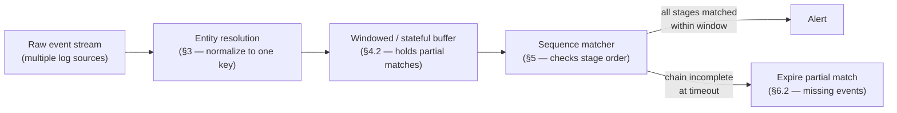
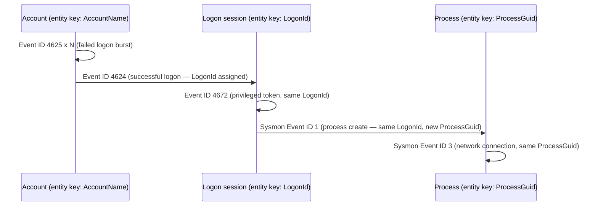
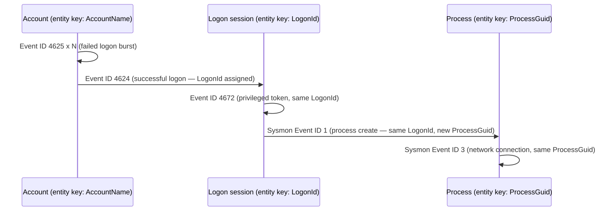
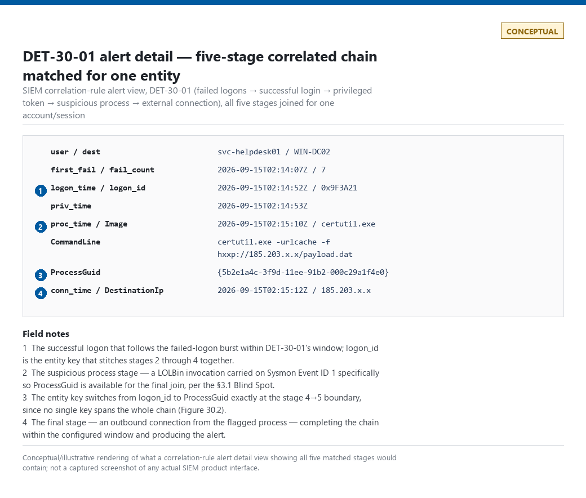

# Part 30 — Correlation Engineering

## Why this part exists

**[CONCEPT]** Most of the detections covered so far in this book evaluate one event against one set of conditions and decide, on the spot, whether to alert. A correlation is different: it withholds judgment until it has seen two or more individually unremarkable events line up in a specific way, joined on a shared identity, inside a bounded span of time. That's a more powerful detection shape — it's also a more fragile one, because it now depends on every one of those events actually arriving, in a recognizable order, tagged with a way to tell they belong to the same story, on clocks that agree with each other closely enough for "within 10 minutes" to mean the same thing on both sides of the join.

Part 7 (Time) covered why clocks disagree in the first place — event time versus ingestion time, drift, pipeline delay, DST. This part picks that thread up and builds the rest of the correlation engineering problem on top of it: when a single-event rule is the right tool and when it isn't, how a correlation window and an entity key turn a pile of unrelated events into one tracked sequence, how a join is actually implemented (not just "and then it matches"), what a sequence-logic rule adds on top of a plain join, and the five failure modes — late events, missing events, duplicate events, out-of-order arrival, and clock skew — that break a correlation rule silently, the same way a schema-drift bug breaks a single-event rule silently. It closes with a fully worked, five-stage correlation: failed logons, a successful login, a privileged-token assignment, a suspicious process, and an external connection — the shape most real "this looks like a compromised account" detections actually take.

---

## 1. Single-event rules vs. multi-event correlation

**[CONCEPT]** A single-event rule evaluates one record and decides on the spot: Event ID 4625 (An account failed to log on) with a specific status code, a specific process name spawning `cmd.exe` with `-EncodedCommand`, a DNS query for a domain on a known-bad list. The rule needs nothing but that one record to reach a verdict.

A Correlation (see TERMINOLOGY.md § Correlation) needs two or more of those records, individually below any reasonable alerting threshold, joined on a shared Entity Key within a bounded Correlation Window, before it produces a verdict a single one of them couldn't justify alone. Five failed logons in isolation are noise — every account fat-fingers a password occasionally. Five failed logons followed by a success, on the same account, inside 5 minutes, is a different claim entirely, and neither event on its own carries that claim.

The design question this part keeps returning to is: **does this behavior have a single-event fingerprint at all, or is the actual signal in the relationship between events?** Some techniques genuinely do have a clean single-event tell — a specific registry key write, a specific LOLBin invocation with a specific argument. Most credential-theft and lateral-movement patterns don't; the individual API call, logon, or process launch is something the environment does thousands of times a day for entirely legitimate reasons, and the only thing that distinguishes the attack is the sequence it appears in.

> **Engineering Reality**
> A correlation rule costs more than a single-event rule at every layer: it has to hold state (which entities have already matched stage 1, and since when), it has to re-evaluate that state as new events arrive rather than judging one record in isolation, and it has to decide what to do with a partially matched chain that never completes. Many SIEM platforms handle a two-event join natively in a single scheduled search; stitching together four or five stages usually means either a purpose-built sequence-detection feature (where the platform supports one), an external stream-processing layer, or a chain of simpler rules that write intermediate state to a lookup table for the next rule to pick up. Budget engineering time for this accordingly — a five-stage correlation is not "the same rule, just longer."

---

## 2. The correlation window: borrowing Part 7's clocks

**[ENGINEERING]** A Correlation Window (see TERMINOLOGY.md § Correlation Window) is only as meaningful as the clock every event inside it is measured against — which is exactly the four-clocks problem from Part 7 §1. "Failed logons followed by a success within 5 minutes" is a claim about *event time*: the true elapsed time between when the failures actually happened on the source and when the success actually happened. If the query engine defaults to ingestion time instead — because that's what it sorts and windows on unless a rule explicitly re-casts the event's own timestamp field, per Part 7's Engineering Reality box in §1 — the window silently measures something else: how far apart the two records happened to land in the pipeline, which drifts from true elapsed time by exactly however much pipeline delay (Part 7 §4) each source carries, and by a different amount for each source if they don't share an ingestion path.

Two failure directions follow from getting this wrong, and both are silent — the query still returns results, it just returns the wrong ones:

- **Window too narrow for the real elapsed time.** If one of the two joined sources has several minutes of pipeline delay the rule didn't account for, a genuinely correlated pair of events can arrive further apart, by ingestion time, than the window allows — and the rule never fires on a real chain.
- **Window too wide for what it's actually measuring.** Widening the window to compensate for #1 raises the odds of stitching together two events that happened to land close together in the pipeline but weren't actually related — a false correlation that looks, on paper, exactly like a real one.

Neither direction produces an error. Both look, from the outside, like "the rule just didn't fire" or "the rule fired," with no signal that the window's actual meaning drifted away from the window's stated meaning. §6.5 returns to this specifically for clock skew across hosts; the point here is narrower and comes first: pick the clock the window measures against deliberately, verify what your platform actually defaults to, and don't assume "event time" just because that's the field name in the schema.

---

## 3. Entity keys and entity resolution across sources

**[CONCEPT]** An Entity (see TERMINOLOGY.md § Entity) is the "thing" a correlation is tracking — an account, a host, a process, a session. An Entity Key is the field, or combination of fields, used to assert that two events concern the same entity (see TERMINOLOGY.md § Entity Key / Entity Resolution). Every correlation rule is a bet that the entity key it joins on actually, reliably ties the events together across the specific sources it's joining — and that bet is the single most common place a correlation rule breaks without anyone noticing, because a join that silently returns zero rows is indistinguishable, downstream, from "nothing correlated happened."

### 3.1 Choosing an entity key

**[DETECTION ENGINEER]** No single field survives across every event type a correlation typically needs. The table below supports choosing which field to join on for a given pair of log sources — what actually ties two events together for a handful of common cross-source joins, and where each one breaks.

| Log Source Pair | Candidate Entity Key | Stability | Where It Breaks |
|---|---|---|---|
| Failed logon → successful logon (same host) | `AccountName` + `Computer` | Stable while the account/host pair doesn't change | Shared jump boxes and service accounts make this key match unrelated sessions from different real users |
| Successful logon → process creation | `TargetLogonId` (from 4624) matched to `SubjectLogonId` (on 4688) | Stable for the life of one logon session | `LogonId` recycles after reboot/logoff; a stale cached value from a prior session will silently join to the wrong one |
| Process creation → network connection (Sysmon) | `ProcessGuid` | Stable for the life of one process, globally unique | Windows Security's 4688 has no `ProcessGuid` field at all — this join only works if the process-creation telemetry comes from Sysmon 1, not 4688 |
| On-prem logon → cloud sign-in for the same human | `AccountName`/`DomainName` resolved to a cloud `object_id` | Not directly comparable without an identity-sync mapping | The two identity systems represent the same person with entirely different primary keys; joining them requires an intermediate lookup, not a direct field match |
| Honeynet SSH/HTTP/network probes → one attacker session | `source_ip` | Stable for the length of one campaign from a stable source | NAT, shared hosting, and Tor egress nodes put many unrelated actors behind one IP, and a rotating-infrastructure attacker defeats it entirely |

> **Blind Spot**
> `ProcessGuid` is the right key for tying a process to its own network connections, but Windows Security's Event ID 4688 (A new process has been created) does not carry it — only Sysmon Event ID 1 (Process Create) does. A correlation rule written against 4688 alone, trying to reach a Sysmon Event ID 3 (Network connection detected) event for the same process, has no reliable field to join on and typically falls back to matching `NewProcessId` (a reused, host-scoped PID) plus a timestamp proximity heuristic — a much weaker join than the ProcessGuid-based one Sysmon actually makes possible.

### 3.2 Entity resolution across sources: the honeynet's own correlation

**[ENGINEERING]** Entity resolution is the practice of reliably mapping different identifiers — an IP, a session ID, a cloud principal — to one consistent entity across sources that represent identity differently (see TERMINOLOGY.md § Entity Key / Entity Resolution). This project's home-lab honeynet does exactly this in production, and the output is real, captured evidence of what a working entity-resolution pipeline looks like once it's built.

The honeynet backend (CT103) runs three raw telemetry tables — `ssh_events`, `http_events`, and `network_events` — and a `correlation.py` process that resolves all of them into a single `attack_sessions` table, joined on `source_ip`, with a severity/status pipeline (`recon` → `probe` → `exploit_attempt` → `possible_success` → `confirmed_postexploit`) and MITRE ATT&CK technique tags attached per session:

```text
session_id                       source_ip      first_seen                        last_seen                         target_system  status            mitre_techniques_json
d48b795e47c04c6fbb456b17ddd219b9 16.5.0.236     2026-09-15T06:08:21.629489+00:00  2026-09-15T06:08:23.042885+00:00  10.99.99.10    possible_success  ["T1595", "T1046", "T1083", "T1190"]
4f078ab0e60941b8b78dd526c60edce1 198.235.24.179 2026-09-15T04:43:47.571589+00:00  2026-09-15T04:51:07.921315+00:00  10.99.99.10    possible_success  ["T1595", "T1046", "T1190"]
```

*REAL LAB EXAMPLE.* Captured 2026-09-15 from CT103's `attack_sessions` table (`lab/evidence/ct103-honeynet-correlated-attack-sessions.txt`); this is the honeynet platform's own automated correlation output, not raw uncorrelated logs. Several of the flagged sessions above (`possible_success`) are the platform's own logic recognizing an exploit-shaped web request followed by continued activity from the same source as worth manual review — precisely the "individually unremarkable, jointly meaningful" pattern §1 describes, running against genuine internet-sourced scanning and probing traffic against the sacrificial honeynet segment.

`source_ip` is a workable entity key here specifically because the honeynet's threat model is opportunistic internet scanners, not a patient, infrastructure-rotating adversary — for that threat model, the same IP reappearing across sessions (16.5.0.236 shows up three separate times in the same 20-row sample) is itself a useful signal, not a limitation. It would be the wrong key to build an enterprise lateral-movement correlation on, where NAT and shared egress make `source_ip` alone unreliable — see the Blind Spot above and the hunt in §8.2.

---

## 4. Joins: how correlation logic actually combines events

**[DETECTION ENGINEER]** "The two events match" hides real implementation choices that change what a correlation rule actually catches.

### 4.1 Temporal joins vs. sequence joins

**[DETECTION ENGINEER]** A **temporal join** asserts that two (or more) events occurred within a bounded time window of each other, with no requirement on which came first — useful when the underlying behavior genuinely has no meaningful order (two independent signals about the same host that both need to be true, regardless of which logged first).

A **sequence join** additionally asserts ordering: event A must precede event B, not merely occur near it. This matters whenever the attack narrative itself has a direction — a failed-then-successful logon pattern is only meaningful in that order; a successful-then-failed pattern (an account that logs in fine, then someone else fails to log in as it) is a different, far less interesting story, and a temporal-only join can't tell the two apart.

### 4.2 Stateful vs. batch correlation architectures

**[ENGINEERING]** A **batch join** re-runs on a schedule, querying a fixed lookback window each time and joining across it in one pass — simple to build, and the standard shape for scheduled-search-based SIEM correlation rules. Its cost shows up at the edges of the window: an event pair that straddles two consecutive scheduled runs (stage 1 in one run's lookback window, stage 2 arriving just after that run already executed) can be missed entirely if the next run's lookback doesn't overlap far enough back to catch it.

A **stateful join** keeps a running record of partially matched entities — "account X hit stage 1 at time T, still waiting on stage 2" — and evaluates each new event against that live state as it arrives, rather than re-scanning a fixed window from scratch. This is the architecture real streaming correlation engines and native sequence-detection features use, and it avoids the batch join's window-boundary gap, at the cost of needing somewhere to persist that partial-match state and a policy for how long to keep waiting on a chain that never completes (§6.2).

---

## 5. Sequence logic: ordering as a detection condition

**[DETECTION ENGINEER]** A sequence-logic rule is a sequence join (§4.1) with named stages and, usually, a state machine tracking which stage each entity has reached. **Figure 30.1** sketches the general shape any multi-stage correlation engine follows, independent of which specific stages it's tracking.

**Figure 30.1 — Multi-event correlation engine, general architecture (FIG-30-01).** *CONCEPTUAL.* Illustrates the stages a correlation rule passes through from raw event stream to alert: entity resolution first (so every downstream stage is keyed consistently), then a windowed/stateful buffer holding partial matches, then a sequence matcher checking stage order, then the alert decision. This is a conceptual data-flow sketch of correlation-engine architecture in general, not a capture from any specific vendor platform.





A state machine formalizes this: each entity starts at stage 0 (unmatched), advances one stage per matching event received in the correct order, and either reaches the final stage (fires) or times out at whatever stage it stalled on (§6.2 covers what to do with that stall). This is the structure the worked example in §7 uses directly.

---

## 6. Failure modes: late, missing, duplicate, and out-of-order events

**[ENGINEERING]** A single-event rule that never sees an event just never fires — a clean, if incomplete, failure. A correlation rule that's missing one event out of a five-stage chain, or sees two of them out of order, or sees a duplicate of one, doesn't fail cleanly: it produces a plausible-looking wrong answer, and the query returning a result at all makes the wrong answer easy to trust. The table below names each failure mode this section covers, its mechanism, and what it actually does to a correlation rule.

| Failure Mode | Mechanism | Effect on Correlation | Mitigation |
|---|---|---|---|
| Late arrival | Pipeline delay (Part 7 §4) pushes one source's events past the window boundary | Real chain misses the join; looks identical to "nothing happened" | Grace-period re-evaluation (§6.1, DET-30-02) |
| Missing event | Source never captured or never forwarded the event at all | Chain can never complete; entity stalls at whatever stage it reached | Explicit timeout/expiry policy per chain, not silent drop |
| Duplicate event | Retry logic, multi-line log records, or forwarder replay produce more than one record for one real occurrence | Rule double-counts a stage, satisfying a count-based threshold on noise | Dedup on a stable per-event identifier before counting |
| Out-of-order arrival | Network jitter or multi-source ingestion delivers events to the pipeline in a different order than they occurred | Sequence join sees stage B before stage A and never advances the state machine | Buffer briefly and re-sort by event time, not arrival time, before sequence matching |
| Clock skew | Two joined sources' clocks disagree (Part 7 §3) | Window measures the wrong elapsed time; correlates too eagerly or misses real pairs | Normalize to UTC at parse time; monitor drift per Part 7's DET-07-01 |

### 6.1 Late events

**[ENGINEERING]** A batch join with a fixed lookback window (§4.2) misses a stage whose event lands in the pipeline after that run already executed, even though the event's true event-time timestamp falls well inside the intended window. This is the correlation-specific version of Part 7 §4's pipeline-delay problem: it doesn't matter that the window was defined correctly if one source's delivery lag routinely exceeds it.

> **What Would Change My Mind**
> This section treats a fixed grace-period re-check (DET-30-02, §7.3) as sufficient for late arrivals. If a specific log source's delivery lag turned out to be unbounded or highly variable rather than a roughly stable typical delay — a cloud provider's audit log during a documented regional incident, for instance — a fixed grace period stops being the right fix, and the correlation would need to move to a genuinely event-driven, no-fixed-lookback architecture instead.

### 6.2 Missing events

**[ENGINEERING]** Some chains never complete, and not always because nothing happened. The raw SSH honeypot capture from CT103 shows this shape directly: many connections never progress past a banner exchange to an actual credential attempt.

```text
10124  2026-09-10T09:23:00.527187Z  77.239.124.130
10123  2026-09-10T09:23:00.127753Z  77.239.124.130          SSH-2.0-OpenSSH_9.2p1 Debian-2+deb12u3
10122  2026-09-10T09:22:59.491002Z  77.239.124.130  2222
```

*REAL LAB EXAMPLE.* Captured 2026-09-15 from CT103's `ssh_events` table (`lab/evidence/ct103-honeynet-ssh-honeypot-credentials.txt`) — a genuine port probe and SSH banner exchange from a real internet scanner against the honeynet's decoy listener on port 2222, with no follow-on username/password attempt in this sample. A correlation rule waiting for "port probe → banner exchange → credential attempt" as a three-stage chain will hold this entity in a permanently incomplete state unless something explicitly expires it.

A correlation engine needs a stated policy for this, not a default: either expire and discard a partially matched chain after some maximum wait (losing the ability to ever complete it late, but bounding how much state the engine holds), or keep it and count "reached stage N, never reached stage N+1" as its own reportable outcome — genuinely useful for a scanner-fingerprinting or reconnaissance-rate use case, where the incomplete chains are the finding, not noise to discard.

### 6.3 Duplicate events

**[ENGINEERING]** A single logical action can legitimately produce more than one log line, and a correlation rule that counts lines instead of actions will overcount. CT104's own `sudo` invocations show the pattern clearly: one `sudo` command produces four separate journal lines — the command itself, a `pam_limits` line, a session-opened line, and a session-closed line, all sharing one PID:

```text
Sep 10 05:42:02 vulnscan sudo[2229]:     root : PWD=/root ; USER=vulnscan ; COMMAND=/usr/bin/sqlite3 /opt/vulnscan/data/vulnscan.db 'SELECT count(*) FROM scanner_errors;'
Sep 10 05:42:02 vulnscan sudo[2229]: pam_limits(sudo:session): Could not set limit for 'core' to soft=0, hard=-1: Operation not permitted; uid=0,euid=0
Sep 10 05:42:02 vulnscan sudo[2229]: pam_unix(sudo:session): session opened for user vulnscan(uid=999) by (uid=0)
Sep 10 05:42:02 vulnscan sudo[2229]: pam_unix(sudo:session): session closed for user vulnscan
```

*REAL LAB EXAMPLE.* Captured 2026-09-15 from CT104's systemd journal (`lab/evidence/ct104-vulnscan-sudo-invocations.txt`) — a genuine automated health-check script invoking `sudo` on a schedule. A count-based correlation rule ("privileged command executed 4+ times in 1 minute") that naively counts journal lines rather than distinct `sudo` PIDs would count this single invocation as four, not one — the exact overcounting mechanism this section warns about, on real telemetry.

This is a *structural* multi-line pattern (one action, several always-co-occurring lines), not a true duplicate — the distinction matters, because deduplicating by PID+command fixes the structural case but would wrongly collapse a genuine duplicate delivery (the same PID's lines forwarded twice by a retrying agent) into looking normal. Dedup logic needs a stable identifier for "one real occurrence" that survives both cases: for `sudo`, that's the PID plus the exact command line; for a forwarder-replayed Windows event, it's typically the event's own `RecordId`/`EventRecordID`, not any field the pipeline adds on ingest.

### 6.4 Out-of-order arrival and timestamp granularity

**[ENGINEERING]** A sequence join needs to know which event happened first, and the source data doesn't always support that at the resolution the rule needs. CT104's own failed-SSH-login capture, read via `lastb`, only reports minute-level resolution — no seconds:

```text
root     ssh:notty    192.168.1.126    Mon Sep 14 01:05 - 01:05  (00:00)
root     ssh:notty    192.168.1.126    Mon Sep 14 01:05 - 01:05  (00:00)
root     ssh:notty    192.168.1.126    Mon Sep 14 01:05 - 01:05  (00:00)
```

*REAL LAB EXAMPLE.* Captured 2026-09-15 from CT104's `/var/log/btmp` via `lastb` (`lab/evidence/ct104-vulnscan-ssh-failed-logins-btmp.txt`) — a genuine internal host (192.168.1.126) failing SSH authentication against CT104 at a rate of dozens of attempts per minute. Every one of the 18 attempts shown at "01:05" is a distinct failed login, but `lastb`'s own output format cannot tell an analyst — or a sequence-logic rule reading this source directly — which of those 18 happened first. A rule that needs strict sub-minute ordering (rather than just a count-per-window threshold, which this data supports fine) cannot get it from this source; it would need the underlying `/var/log/btmp` binary records read at higher resolution, or a different collection path entirely.

This is a distinct failure mode from clock skew (§6.5): the clock isn't wrong here, it's just coarser than the ordering claim the rule wants to make. A rule design that only needs "did N failures happen in this window" tolerates this source fine; a rule design that needs "which failure was last, immediately before the success" does not, and picking the wrong telemetry source for the ordering granularity a rule actually requires is a design error caught at review time, not at query time.

### 6.5 Clock skew

**[ENGINEERING]** Clock skew across hosts is Part 7 §3's clock-drift problem applied specifically to a cross-host join: if host A's clock runs 5 minutes fast and host B's is accurate, a correlation window built to join events across A and B on a 5-minute-or-tighter window silently misses real correlated activity, because the true gap between them is wider than the window assumes — the exact mechanism Part 7 §3 describes, and the reason DET-07-01 (Part 7's clock-drift detection) is worth running as a standing health check on any host whose events feed a cross-host correlation rule, not treated as a one-off diagnostic.

---

## 7. Worked example: failed logons → successful login → privileged token → suspicious process → external connection

**[DETECTION ENGINEER]** This is the five-stage chain most "this account looks compromised" detections are actually built from, in some variant. Windows Security supplies the first three stages cleanly; the last two need Sysmon specifically, for the entity-resolution reason flagged in the §3.1 Blind Spot.

- **Stage 1 — failed logons.** Event ID 4625 (An account failed to log on), a burst against one account.
- **Stage 2 — successful login.** Event ID 4624 (An account was successfully logged on), same account, shortly after the burst.
- **Stage 3 — privileged token.** Event ID 4672 (Special privileges assigned to new logon) — TERMINOLOGY.md's own False Positive entry already uses this exact event as its worked example, chained to process creation, for good reason: it's one of the highest-value, highest-noise pivots in Windows telemetry.
- **Stage 4 — suspicious process.** Sysmon Event ID 1 (Process Create), not Windows Security's 4688, specifically so `ProcessGuid` is available for stage 5's join.
- **Stage 5 — external connection.** Sysmon Event ID 3 (Network connection detected), joined to stage 4 by `ProcessGuid`.

**Figure 30.2 — The five-stage chain across two entity keys (FIG-30-02).** *CONCEPTUAL.* Illustrates how the chain's entity key changes partway through: stages 1–4 join on account identity and then logon session (`TargetLogonId`/`LogonId`), while stage 4→5 joins on `ProcessGuid` instead, because no single key spans all five stages — the same entity-resolution problem named in §3.1 and in TERMINOLOGY.md's Entity Key example, shown as a concrete sequence. This is a conceptual sequence sketch of the intended correlation logic, not a capture of a real attack run.







**Figure 30.3 — DET-30-01 alert detail, all five stages matched for one entity.** *CONCEPTUAL — illustrative field breakdown; not a captured screenshot.* Shows the stage timestamps and the entity keys (`logon_id`, then `ProcessGuid`) that a SIEM correlation-rule alert detail view would surface once all five stages of the chain match. This book's home-lab environment does not currently run a domain-joined Windows host instrumented with Sysmon behind a SIEM, so no real capture of this specific chain exists yet; this illustrates the claim in this section that the chain is deployable as a single correlated alert rather than five separate ones.

### 7.1 The naive version

**[DETECTION ENGINEER]** Before building the five-stage chain, it's worth dissecting the two-event version most teams try first.

> **Detection Autopsy — "4672 followed by 4688"**
>
> **The rule:** Fires on any Event ID 4672 (privileged logon) followed by any Event ID 4688 (process creation) on the same host within 5 minutes — the exact naive rule TERMINOLOGY.md's own False Positive entry uses as its canonical example, extended here with the full five-stage ambition behind it.
>
> **Why it shipped:** It's a two-event join with no entity-resolution work required — same host, tight window, done. It reads as "privileged account, then it did something" and got approved as a reasonable proxy for "compromised privileged account, then it did something."
>
> **How it failed:** It fires on essentially every routine admin login and scheduled task, because a privileged logon followed by *some* process creation within 5 minutes describes almost all interactive admin activity on any given host — logging in and then opening a management console, running a script, or launching Task Manager all satisfy it. It also has no entity key tying the 4672 to the specific 4688 beyond "same host" — on a shared jump box with several admins logged in concurrently, it will happily pair one admin's privileged logon with a completely unrelated admin's routine process launch and call that a match.
>
> **The fix:** Add the two missing stages on both ends — the failed-logon burst before the successful login (so the rule requires evidence of a compromise attempt, not just routine privileged use), and the suspicious-process-to-external-connection pair after (so the rule requires evidence of post-logon misuse, not just any process at all) — and replace "same host" with the actual entity chain from Figure 30.2: `LogonId` linking stages 1–4, `ProcessGuid` linking stage 4 to stage 5.

### 7.2 The corrected rule — DET-30-01

**[DETECTION ENGINEER]** The following targets a generic Splunk deployment ingesting normalized Windows Security and Sysmon data into a common index; adjust field and index names to your own normalized schema before use. It is illustrative of the join structure, not a drop-in production rule — the thresholds (failure count, window lengths) are placeholders to be tuned against your own environment's baseline, per Part 31.

CONCEPTUAL SAMPLE — illustrative field/index names and thresholds; validate against your own normalized schema before deploying

```spl
| tstats count as fail_count, min(_time) as first_fail
    from datamodel=Authentication where Authentication.action="failure" Authentication.signature_id=4625
    by Authentication.user, Authentication.dest
| where fail_count >= 5
| rename Authentication.user as user, Authentication.dest as dest
| join type=inner user dest
    [ search index=windows sourcetype="WinEventLog:Security" EventCode=4624
      | eval logon_time=_time
      | rename TargetLogonId as logon_id
      | table user, dest, logon_id, logon_time ]
| where logon_time > first_fail AND logon_time <= first_fail + 300
| join type=inner logon_id
    [ search index=windows sourcetype="WinEventLog:Security" EventCode=4672
      | rename SubjectLogonId as logon_id
      | eval priv_time=_time
      | table logon_id, priv_time ]
| join type=inner logon_id
    [ search index=windows sourcetype="WinEventLog:Sysmon" EventCode=1
      | rename LogonId as logon_id
      | eval proc_time=_time
      | table logon_id, ProcessGuid, Image, CommandLine, proc_time ]
| join type=inner ProcessGuid
    [ search index=windows sourcetype="WinEventLog:Sysmon" EventCode=3
      | eval conn_time=_time
      | table ProcessGuid, DestinationIp, DestinationPort, conn_time ]
| where proc_time > priv_time AND conn_time > proc_time
| table user, dest, first_fail, fail_count, logon_time, logon_id, priv_time, ProcessGuid, Image, CommandLine, proc_time, DestinationIp, conn_time
```

This query enforces ordering explicitly (`where ... > ...` at each hop) rather than trusting the joins alone to preserve sequence, and switches entity keys exactly where Figure 30.2 says it must — `user`/`dest` for the failed-to-successful-logon join, then a normalized `logon_id` alias for the logon-session join. That alias matters mechanically, not just cosmetically: 4624 carries the new session's ID as `TargetLogonId`, but 4672 does not have a `TargetLogonId` field at all — its own logon-session field is `SubjectLogonId`, the same "subject" naming 4688 and Sysmon Event ID 1 use for the account the event is about. Joining stage 3 on a literal `TargetLogonId` field name (a mistake worth naming explicitly, since it's an easy one to make by analogy with stage 2) would silently return zero rows — the query compiles, runs, and just never matches, which is exactly the "looks like nothing happened" failure §6 warns about. Renaming both sides to the shared `logon_id` alias immediately after each subsearch's real field name is what makes the join key actually line up. The process-to-connection join still uses `ProcessGuid` directly, unaliased, since both Sysmon events already share that literal field name. Each subsearch also renames its own `_time` with `eval` before the `table` command, not inline inside `table` itself — SPL's `table` command takes a bare field list and doesn't support `AS` aliasing the way `stats`/`tstats` do, so `table logon_id, _time as priv_time` would be a syntax error, not a working alias. The rule's main limitation is the same one named throughout §6: it assumes all five stages arrive inside one batch run's lookback window, with no tolerance for late arrival on any of them — §7.3 addresses that directly.

**MITRE:** T1110 (Brute Force) for the failed-logon-burst stage; T1078 (Valid Accounts) for the successful login that follows it. The privileged-token, suspicious-process, and external-connection stages are deliberately left unmapped in this summary line — which specific process ran and which protocol the outbound connection used determine the actual technique, and forcing a single ID onto a generic "process ran, then something connected out" condition would be exactly the invented mapping this book's style guide prohibits.

Expected false-positive rate for the corrected rule is not a measured figure — this exact five-stage chain has no deployment history in this project's environment to draw a number from, and stating one here would be exactly the kind of confident-sounding fabrication the style guide bans. What can be said with confidence: each of the three stages added on top of the naive "4672 then 4688" rule (the failed-logon antecedent, the suspicious-process stage, the external-connection stage) narrows the matching population further, so the corrected rule's raw alert volume should be a small fraction of the naive rule's — but the False Positive Trap below identifies at least one legitimate pattern that reproduces the entire chain regardless, so "fewer alerts than the naive version" is not the same claim as "an acceptable false-positive rate." Treat the volume as unknown until measured against real disposition data per Part 42.

> **Blind Spot**
> Every join in this chain depends on `logon_id` (and, for the last hop, `ProcessGuid`) actually being a distinct, populated value on both sides. Windows reuses one constant Logon ID — `0x3e7` — for every process running in the SYSTEM security context on a host; if any stage of a real attack chain runs as SYSTEM rather than under the compromised user's own interactive session, its Sysmon Event ID 1 record carries that same shared `0x3e7` value instead of a value unique to one logon, and the stage 3→4 join in DET-30-01 will either match it against every other unrelated SYSTEM-context process on the host in the same window (a false stitch) or fail to match anything meaningful at all, depending on how the earlier stages resolved. This is a different failure than the missing-event case in §6.2 — the field isn't absent, it's present but non-discriminating — and no amount of retrying or widening the window fixes it; the rule needs an explicit check that `logon_id` isn't `0x3e7` before trusting the join.

> **False Positive Trap**
> A scheduled or service-account-driven task can reproduce this entire shape without an attacker anywhere near it: a monitoring script that retries a failed connection a few times before succeeding (satisfying the failed-then-successful-logon stages), running under an account with legitimate elevated rights (privileged token), that then launches a helper process which makes a routine outbound call to a vendor API (suspicious process, external connection). CT104's own automated `sudo`-driven health-check script — real telemetry, not a hypothetical — shows exactly this kind of legitimate, scripted, privileged, recurring activity pattern (`lab/evidence/ct104-vulnscan-sudo-invocations.txt`). The fix is an explicit allowlist of known service-account `LogonId`-to-account mappings excluded at the query level, reviewed on the same cadence as any other Exception (TERMINOLOGY.md § Exception) — not a threshold increase, which would just as easily let a genuine slow-and-careful attacker through.

> **Detection Test**
> **Setup:** Domain-joined Windows test host, Sysmon installed with process-creation and network-connection logging enabled, local admin rights on the test account.
> **Action:** Trigger several failed RDP logons against a test account with a deliberately wrong password, then log in successfully with the correct one; from that session, launch a LOLBin known to make outbound connections (e.g., `certutil.exe -urlcache -f <test URL>` against a sanctioned test endpoint).
> **Expected result:** Event ID 4625 entries for the failed attempts, an Event ID 4624 for the success with a `TargetLogonId`, an Event ID 4672 whose `SubjectLogonId` matches that same value, a Sysmon Event ID 1 for the LOLBin sharing that logon ID (as `LogonId`) and carrying a `ProcessGuid`, and a Sysmon Event ID 3 for that same `ProcessGuid` showing the outbound connection — DET-30-01 should fire once all five are present within its configured windows.

**How you'd know DET-30-01 silently stopped working:** the rule's final alert count hitting zero is not itself a signal — a genuinely quiet week and a broken join produce that exact same zero, which is the same "looks like nothing happened" failure named throughout §6 and §3, just applied to the whole rule instead of one hop. The distinguishing signal has to come from stage-level volume, not the end alert: track each subsearch's own row count (the stage-1 candidates clearing the `fail_count >= 5` threshold, then the stage-2, stage-3, stage-4, and stage-5 join results) against its own trailing baseline, the same drift-detection logic Part 42's HUNT-42-01 applies to whole rules, applied here per hop. A sustained drop at any single stage — most likely stage 4, since it depends on Sysmon actually running and forwarding Event ID 1 on the hosts in scope, the exact coverage-gap tamper signal Part 9's HUNT-09-01 watches for — means that hop's source went dark, not that the underlying behavior stopped occurring, and it should page the same way a parser-health null-rate spike does (DET-05-03), not get treated as good news.

### 7.3 Handling late-arriving stage events — DET-30-02

**[DETECTION ENGINEER]** DET-30-01 assumes every stage lands inside one scheduled run's lookback window. In practice, the network-connection stage is often the one most exposed to pipeline delay (§6.1) — Sysmon network events on a busy endpoint can queue behind other agent telemetry, and any cloud-delivered enrichment on the destination IP adds its own lag on top. The following targets Microsoft Sentinel/Defender KQL and re-checks a rolling lookback rather than a single fixed window, so a stage 5 event arriving after DET-30-01's run already executed still gets picked up on the next run.

CONCEPTUAL SAMPLE — illustrative table/field names; validate against your own normalized schema

```kql
let gracePeriod = 30m;
let chainWindow = 15m;
PartialMatches
| where MatchedStage == "privileged_token_and_process"        // written by DET-30-01's earlier stages
| where TimeGenerated >= ago(chainWindow + gracePeriod)         // rolling lookback, not a single tumbling window
| join kind=inner (
    SysmonNetworkConnection
    | where TimeGenerated >= ago(chainWindow + gracePeriod)
    | project ProcessGuid, DestinationIp, ConnTime = TimeGenerated
  ) on ProcessGuid
| where ConnTime between (TimeGenerated .. TimeGenerated + chainWindow)
| project ProcessGuid, DestinationIp, StageTime = TimeGenerated, ConnTime
```

This assumes a `PartialMatches` table populated by DET-30-01's earlier stages — the stateful-join pattern from §4.2 — so a chain that's stalled at stage 4 stays queryable for the full grace period rather than being discarded the moment the first run's window closes. Its main limitation is the grace period itself: 30 minutes is a starting assumption, not a measured figure, and per the What Would Change My Mind box in §6.1, a source with genuinely unbounded delivery lag would need a different architecture entirely, not a longer fixed grace period.

DET-30-02 doesn't introduce a new false-positive driver of its own — it re-evaluates the same chain DET-30-01 defines, so the False Positive Trap above (service-account and scripted-task activity reproducing the whole shape) applies here unchanged; the same exclusion list needs to cover both rules, not just the first one someone happened to tune. Testing it specifically means testing the *lateness*, not just the chain: run the Detection Test from §7.2, but hold the resulting Sysmon Event ID 3 record back in a lab log forwarder (or queue it behind an artificial delay) long enough that DET-30-01's own scheduled run executes and misses it, then confirm `PartialMatches` still shows the entity stalled at stage 4 and that DET-30-02's next run picks up the delayed connection event and completes the chain within `chainWindow + gracePeriod` of the original stage-4 match.

The same silent-failure risk named above for DET-30-01 applies to `PartialMatches` itself: if the write that populates it from DET-30-01's earlier stages ever breaks, DET-30-02 doesn't error, it just has nothing to re-check, and produces the same trustworthy-looking zero. Monitor `PartialMatches`' own row count against baseline for the same reason stage-level volume is monitored above — an empty grace-period table is only good news if the stage-1–4 volume upstream of it is also normal.

---

## 8. Hunting the chain: what standing correlation rules miss

**[THREAT HUNTER]** A standing correlation rule only catches the chain shape it was built to catch. Two specific ways this chain gets missed are worth hunting for on a schedule rather than waiting for DET-30-01 to fire on its own.

### 8.1 Chains that skip the failed-logon stage

**[THREAT HUNTER]** **HUNT-30-01 — Successful privileged logons with no antecedent failed-logon burst.**

- **Hypothesis:** An attacker using valid, stolen credentials — via T1550.002 (Pass the Hash) or any other technique that doesn't require guessing — produces a clean Event ID 4624 straight into Event ID 4672 with no preceding 4625 burst at all, which is exactly the case DET-30-01's stage-1 requirement is built to demand and therefore exactly the case it cannot catch.
- **Approach:** Query for `TargetLogonId` values that reach stage 3 (privileged token) within the retained window with zero matching 4625 events for the same account in the preceding hour, cross-referenced against known service-account and SSO-federated logon patterns to rule out the legitimate reasons a clean login has no failures behind it.
- **Disposition:** If every flagged case maps to a documented SSO/federation flow or a known-clean service account, file as a negative finding naming the coverage gap this represents: DET-30-01, as written, structurally cannot detect a stolen-credential login that skips the brute-force stage, and that gap needs either a second, differently-triggered detection or an explicit, written acceptance of the blind spot. If a flagged case doesn't map to anything documented, escalate as a candidate incident, not a closed hunt.

> **Blind Spot**
> DET-30-01's entire design assumes the attacker's path into the account includes a failed-logon burst. An attacker who already holds a valid credential or ticket — via credential theft elsewhere, a Pass-the-Hash technique, or a purchased/leaked password that happens to be correct on the first try — produces a chain that starts at stage 2, not stage 1, and DET-30-01 as written never begins evaluating it. This is the single largest gap in the worked example, and it's the reason HUNT-30-01 exists rather than treating DET-30-01 as sufficient coverage on its own.

### 8.2 Entity resolution breaking in both directions

**[THREAT HUNTER]** **HUNT-30-02 — Sessions where `source_ip`-based entity resolution over-merges or under-merges.**

- **Hypothesis:** The honeynet's `source_ip`-keyed session correlation (§3.2) either merges unrelated actors sharing one address (a NAT gateway, a shared hosting IP) into one false "session," or fails to merge one actor's activity across an IP rotation into what should be a single tracked campaign — both are entity-resolution failures the current key can't distinguish from a correctly resolved single-actor session.
- **Approach:** Pull the full `attack_sessions` table and cluster by adjacent `/24` ranges and known ASN groupings rather than exact `source_ip` alone — the repeated appearances of `16.5.0.236` and the `64.62.156.x` / `64.62.197.x` neighbors in the same 20-row sample (`lab/evidence/ct103-honeynet-correlated-attack-sessions.txt`) are a concrete starting point for testing whether nearby addresses in that range behave like one rotating actor or several unrelated ones.
- **Disposition:** A finding that a specific IP range consistently represents one actor rotating addresses becomes a detection-candidate case (widen the entity key to the range for that specific infrastructure pattern). A finding that the current exact-IP key is already correctly resolving sessions for this threat model is a valid negative result and should be documented as such, not silently dropped.

> **Hunter's Note**
> When a source IP reappears across multiple sessions in a short window — like `16.5.0.236` and the `176.53.159.196` cluster in this project's own honeynet data, the latter hitting the same `support`/`support` credential pair across multiple separate days — don't just note "seen before." Pivot to the /24 and the ASN before concluding it's one actor: a single scanning operator running from a rented block will often show up as several *adjacent* addresses over time, not the same one repeated, and an entity key of exact `source_ip` alone will under-merge that campaign into several unrelated-looking sessions.

---

## 9. SOC management view: the cost of chaining stages

**[SOC MANAGEMENT]** Chaining more stages onto a correlation rule is a cost decision, not just a logic decision.

> **SOC Management View**
> Every additional stage in a correlation chain is a real increase in engineering and operational cost, not just query complexity: more state to persist, more sources whose delivery lag and schema now matter jointly instead of independently, and a wider set of "why didn't this fire" investigations when a real incident is later found not to have triggered it. Before approving a five-stage correlation like the one in §7, ask whether a shorter chain — two or three stages, accepting a higher false-positive rate — would deliver most of the same detection value at a fraction of the engineering and maintenance cost, and treat the extra stages as a deliberate precision-for-cost tradeoff, not a free upgrade. The right chain length is the shortest one that gets acceptable precision, not the longest one the platform can technically support.

None of this replaces the work Part 31 (Baselining) does next — this part gets events joined into one entity's story; Part 31 is what decides whether that story is actually unusual for that entity, and Part 33 (Risk-Based Detection) covers what to do when no single chain, complete or not, crosses a firm threshold on its own but several partial signals for the same entity add up anyway.
