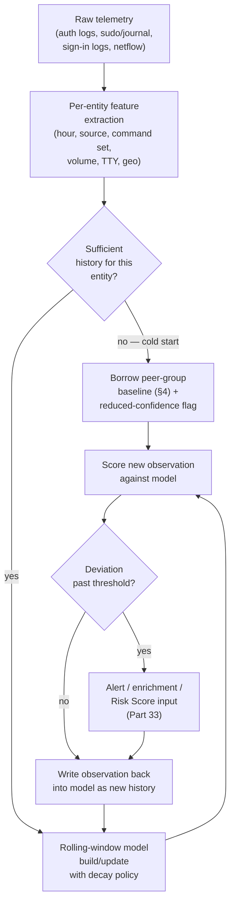
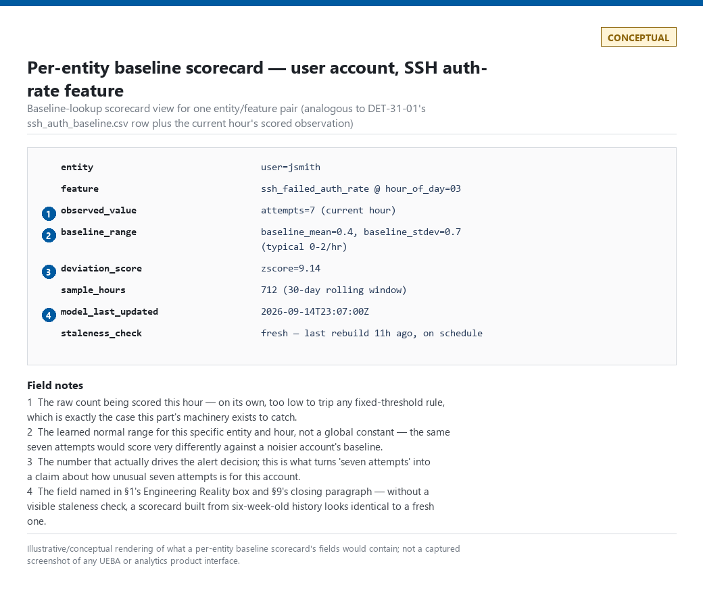

# Part 31 — Baselining

## Why this part exists

**[CONCEPT]** Every earlier part in this book detects a *known bad shape*: a specific event, a specific sequence, a specific field value that a technique reliably produces. Baselining is the opposite move — it detects deviation from a *known normal shape*, for an entity that has no fixed signature at all, because the thing being watched for isn't "did this match a bad pattern" but "is this different from what this specific user, host, or service account usually does." A login at 3 a.m. is not inherently malicious. A login at 3 a.m. for an account that has never once authenticated outside 08:00–18:00 in 90 days of history is a different claim entirely, and it is a claim this part's machinery — not the login event itself — makes possible.

TERMINOLOGY.md § Baseline is the load-bearing definition this part builds on: a baseline is a statistical or rule-based model of expected values for a given Entity over a defined feature set, built from historical observation over a stated window with an explicit update/decay policy, scored for deviation rather than matched against a fixed signature. Everything in this part is an elaboration of that one sentence — which entity, which features, how much history, how the model decays, and what happens before any history exists at all.

This part also draws a line the scope list blurs on first read. "User/host/role/peer-group/service-account/application/network/time/geo baselines" sounds like nine peers, but they split into two different kinds of thing. Six of them are Entities in the TERMINOLOGY.md § Entity sense — a user, a host, a service account, a peer group, an application, a network segment — each with its own identity and its own entity key. The other two, time and geo, are not entities; they are *feature dimensions* almost always baselined jointly with an entity ("this user's typical hour-of-day," "this host's typical source-ASN set") rather than standing alone as a thing with a baseline of its own. Confusing the two leads to a bad design instinct: trying to build a single global "time baseline" or "geo baseline" that fires the same way for every entity, which throws away exactly the per-entity context that makes baselining worth the engineering cost over a fixed threshold in the first place.

Part 30 built the entity-resolution machinery (stable keys, the failure modes of joining across sources) that every baseline in this part depends on to know it's scoring the same thing twice. Part 32 and Part 33 both treat statistical rarity as an input signal — "how unusual is this, historically" — and neither can answer that question honestly without a baseline behind it, which is why this part sits immediately before them.

---

## 1. What a baseline actually is, and the naive alternative it replaces

**[CONCEPT]** Before any baseline exists, the naive alternative is a fixed global threshold: "more than five failed logins," "any login from outside the country," "any process not on the allowlist." Part 12 and Part 40 dissect two specific versions of that naive alternative in depth. The structural problem baselining exists to fix is simpler than either dissection: a single global threshold treats every entity as interchangeable, when in practice a domain admin, a help-desk account, and a backup service account have wildly different *normal*, and a threshold set to avoid false positives on the noisiest of the three misses genuine anomalies on the quietest one entirely.

A baseline replaces the fixed constant with four things, each of which is a real design decision, not a detail to default on:

| Design decision | What it answers | Where it goes wrong if skipped |
|---|---|---|
| Entity | What is being modeled — one user, one host, a peer group, a service account | Modeling the wrong entity (e.g., baselining a shared jump-box account per-user when ten admins share it) produces a baseline that is really an average of ten different behaviors and flags all of them equally |
| Feature set | Which observable properties get modeled — logon hour, source ASN, command set, request volume | Too few features misses the anomaly (a new source IP that still falls inside normal hours); too many features means most real observations look "new" on some feature, drowning the signal |
| Window and decay | How much history, and how old data loses weight | A window that's too short overfits to a slow week; one that's too long — or with no decay — bakes in behavior from a role the person no longer has |
| Scoring rule | How "different from usual" becomes a number or a boolean | A rule with no calibration against real data (fixed z-score cutoffs borrowed from a different feature's distribution) either never fires or fires on routine variance |

> **Engineering Reality**
> None of the four decisions above is free to compute. A baseline is a live table (or a feature store, or a lookup) that has to be built, refreshed, and monitored for its own staleness, exactly like a detection rule — except a broken baseline fails the same way Detection Debt does in general: silently. A baseline lookup that stopped updating 6 weeks ago doesn't error; it just keeps scoring everyone against 6-week-old behavior, and every subsequent alert or suppression built on it is quietly wrong in a way no dashboard will show unless someone checks the lookup's own last-updated timestamp.

**[CONCEPT]** Baselines feed detection logic in one of three ways, and it matters which: as a hard gate ("suppress this alert if the source falls inside the account's baseline ASN set" — see Suppression, TERMINOLOGY.md § 4), as a weighted signal into a Risk Score (Part 33), or as the enrichment attached to an alert so an analyst doesn't have to look the history up by hand at triage time (Enrichment, TERMINOLOGY.md § 6). A common design mistake is building the baseline table once and never deciding which of the three consumption modes it feeds — which means every downstream rule author re-decides it differently, and the same baseline ends up hard-suppressing alerts in one rule while merely enriching them in another, with no single owner able to say which behavior is intended.

---

## 2. The cold-start problem

**[CONCEPT]** A baseline needs history to exist before it means anything, and every entity has a day zero: a new hire, a freshly provisioned host, a service account created an hour ago, a newly onboarded log source with no retained history at all (Data Feasibility, TERMINOLOGY.md § 2, is a precondition here — a baseline over telemetry that doesn't exist yet isn't a design problem, it's a missing-data problem). During cold start, "never seen before" is true of almost everything, which makes a baseline that treats novelty itself as the anomaly signal fire constantly and correctly identify nothing — every single observation for a brand-new entity is technically novel, and treating all of them as suspicious is functionally the same as having no detection at all, just with more alerts.

Three practical strategies handle this, none of them free:

- **Borrow from a peer group** (§4). A new hire in the finance department inherits the finance department's aggregate baseline until their own individual history accumulates — imperfect, since it can't yet distinguish this specific person's habits from the group's, but far better than either "flag everything" or "flag nothing" for the first 30 days.
- **A grace period with reduced confidence, not silence.** Score the entity, but weight the baseline-deviation signal down (or suppress alerting on it alone, while still logging it) until a minimum sample size is reached — a week of data, or a stated number of observed sessions, whichever the feature actually needs to stabilize. The grace period must still generate enrichment data an analyst can see; it should reduce alerting confidence, not go dark.
- **Explicit "insufficient baseline" as its own state**, surfaced to the analyst rather than silently defaulted to either "normal" or "anomalous." An alert enriched with "no baseline available, entity is 4 days old" reads completely differently to a triage analyst than one enriched with "baseline available, 60-day history, this observation is a 6-sigma outlier" — collapsing the two into the same UI field throws away information the analyst needs to weight the alert correctly.

**[ENGINEERING]** Cold start is not a one-time problem solved at rollout. Every environment perpetually has entities in cold start — new employees, decommissioned-and-reprovisioned hosts, rotated service-account credentials that reset the account's effective history if the baseline keys on credential identity rather than logical role. A baseline pipeline that only handles cold start for the initial backfill and has no ongoing logic for entities that are perpetually new (a churn-heavy contractor pool, an auto-scaling fleet where hosts live for hours) will silently degrade to "flag everything from short-lived hosts" — which, on a fleet that autoscales, means the newest and often most attacker-relevant hosts get the least useful baseline coverage of any tier in the environment.

> **Hunter's Note**
> When you're handed an alert enriched with "no baseline, insufficient history" and told to triage it anyway, don't try to force a verdict from the baseline logic — pull the peer group instead. "Is this normal for *this specific account's 4-day history*" is unanswerable; "is this normal for *what every other account in this role does on day four*" almost always has a real answer, and it's the fastest unstick available when the entity itself has nothing to compare against.

---

## 3. User and host baselines

**[CONCEPT]** User and host baselines are the two most direct implementations of the model in §1 — one entity, its own history, scored against itself. The feature set is usually some combination of: authentication timing (hour-of-day, day-of-week), source (IP, ASN, device), volume (logon count, command count, bytes transferred), and — for hosts specifically — the set of accounts that normally authenticate to it and the set of processes that normally run on it (the latter overlapping heavily with Part 11's endpoint baselines, which this part does not re-derive).

**[DETECTION ENGINEER]**

### 3.1 DET-31-01 — Per-account authentication-rate baseline, scored against a fixed correlation rule's blind spot

Part 1, Part 3, and Part 24 (FIG-24-02) already document a real, loud SSH authentication burst captured from this book's own home lab: dozens of failed `admin`/`root` attempts a minute against CT104 from one internal source (`lab/evidence/ct104-vulnscan-ssh-failed-logins-btmp.txt`), and Part 24's fixed-threshold correlation rule catches it correctly, because the volume in a short window is high enough to cross almost any reasonable static count. A baseline earns its engineering cost on the version that rule structurally cannot see: the same account failing at, say, three attempts an hour, every hour, for a week — never once crossing a fixed per-window threshold, while sitting far above that specific account's own near-zero historical failure rate for every hour of every prior week.

The following Splunk SPL targets a generic `linux:secure`-equivalent sourcetype normalized into `user`, `src_ip`, and `action` fields (adjust to your own TA's field extraction) and runs in two stages: a nightly scheduled search that rebuilds a per-account, per-hour-of-day baseline lookup over a 30-day window, and a search that scores the current hour against it.

```spl
// Splunk SPL — DET-31-01 (stage 1, scheduled nightly): rebuild the per-account,
// per-hour-of-day SSH failed-auth-rate baseline over a rolling 30-day window.
// Note: the base search intentionally does NOT filter to action=failure — it pulls
// every auth event (success and failure) so that hours where the account authenticated
// with zero failures still produce a row with attempts=0. Filtering to action=failure
// here would silently drop every zero-failure hour from the average, inflating
// baseline_mean for any account that fails rarely — exactly the low-noise account this
// detection is built to protect.
index=linux_auth sourcetype=linux:secure earliest=-30d@d latest=@d
| eval hour_of_day=strftime(_time, "%H")
| bin _time span=1h
| stats count(eval(action="failure")) as attempts by user, hour_of_day, _time
| stats avg(attempts) as baseline_mean, stdev(attempts) as baseline_stdev, count as sample_hours by user, hour_of_day
| outputlookup ssh_auth_baseline.csv
```

```spl
// Splunk SPL — DET-31-01 (stage 2, runs hourly): score the last hour against the baseline lookup.
// Grouping stays at user + hour_of_day to match the grain the baseline was built at
// (stage 1 aggregates across all source IPs for a given user/hour) — grouping by
// src_ip here too would compare a single source's count against an all-source mean,
// which is not the same population and silently undercounts split-source attempts.
// src_ip is carried through as context for the analyst, not as a scoring dimension.
// Schedule this search with a few minutes of trailing buffer past the hour boundary
// (e.g., :07 past the hour, not :00) rather than exactly on it — a search that fires
// the instant the hour closes will miss any event still sitting in forwarder/indexer
// queue lag, and because this search only ever evaluates earliest=-1h@h latest=@h once,
// an event that lands after it ran is never rescored; that hour is silently under-counted
// forever, not retried.
index=linux_auth sourcetype=linux:secure action=failure earliest=-1h@h latest=@h
| eval hour_of_day=strftime(_time, "%H")
| stats count as attempts, values(src_ip) as src_ips by user, hour_of_day
| lookup ssh_auth_baseline.csv user, hour_of_day OUTPUT baseline_mean, baseline_stdev, sample_hours
| eval cold_start=if(isnull(baseline_mean) OR sample_hours<10, "true", "false")
// A flat floor of 1 for zero-variance accounts would require 4+ failures/hour to ever
// cross zscore>=4, no matter how close to zero baseline_mean actually is — silently
// defeating this detection's own stated purpose on exactly the quietest accounts it
// exists to protect (an account with a genuinely zero-failure 30-day history, hit at
// 3 attempts/hour, would score zscore=3 under the old floor and never alert). Floor
// stdev at sqrt(baseline_mean) instead — a Poisson-consistent variance estimate for a
// low-count process — with a 0.1 minimum so a mean of exactly 0 doesn't divide by zero;
// this way sensitivity scales down toward zero as the account gets quieter, not up
// toward a fixed floor.
| eval baseline_stdev=if(baseline_stdev=0 OR isnull(baseline_stdev), sqrt(max(baseline_mean, 0.1)), baseline_stdev)
| eval zscore=round((attempts-baseline_mean)/baseline_stdev, 2)
| where cold_start="true" OR zscore>=4
```

This scores deviation, not volume, which is the entire point — it will flag a three-attempts-an-hour account with a genuinely near-zero history at a `zscore` well above 4 even though three is a number no fixed-threshold rule would ever alert on. Its main limitation is the one §2 names directly: `cold_start="true"` fires identically for a brand-new account and for a real 4-sigma outlier, and this query alone cannot tell the two apart — a production version routes cold-start hits to the reduced-confidence path in §2, not to the same queue as a scored deviation. A second limitation is inherent to scoring low, discrete counts with a mean/stdev z-score at all: hourly failure counts for a quiet account are closer to a sparse Poisson process than a normal distribution, so `zscore>=4` is not literally "roughly 1-in-31,000 by chance" the way a one-directional threshold would be under a true Gaussian — treat 4 as a starting threshold to validate against your own accounts' actual fired-alert volume over a trial period, not as a calibrated false-positive rate.

> **Detection Test**
> **Setup:** A test account on a host forwarding into the same `linux:secure`-equivalent sourcetype, with the stage 1 baseline search already run at least once so `ssh_auth_baseline.csv` has `sample_hours` ≥ 10 for that account showing a near-zero historical failure rate.
> **Action:** Script three failed SSH logins an hour against the test account for at least four consecutive hours — e.g. `for i in $(seq 1 4); do for j in 1 2 3; do ssh baduser@testhost; done; sleep 3600; done` — staying well under any fixed-count-per-window threshold.
> **Expected result:** Stage 2's output includes a row for the test account with `attempts` around 3, `cold_start=false`, and `zscore` at or above 4 for the corresponding `hour_of_day`.

> **False Positive Trap**
> A role change — someone moved from day shift to a follow-the-sun on-call rotation, a host repurposed from a batch job to a service that now runs interactively — produces a real, sustained shift in an account's behavior that a 30-day rolling baseline eventually absorbs as the new normal, but generates a predictable run of deviation alerts for roughly as many days as the window is long while the old behavior ages out. Don't suppress these by shortening the window across the board, since that also shortens how much real history every other, unchanged account gets scored against; instead, give the analyst a documented-role-change flag that temporarily discounts the deviation signal for that specific entity, tied to an actual HR/CMDB change record rather than the analyst's own guess that "this is probably fine."

**MITRE:** T1110.001 (Password Guessing) — this query filters to `action="failure"` only, so it scores guessing-attempt volume, not authenticated-session behavior; it does not itself cover T1078 (Valid Accounts), which would require a companion baseline over *successful* logons to catch a guessed credential being used undetected afterward (see Part 12).

**[ANALYST]** An alert built on this baseline arrives with a `zscore` and a `cold_start` flag, not a raw event count — check `cold_start` first, but don't treat every `cold_start=true` hit the same way. `sample_hours<10` fires for two structurally different situations this one flag can't distinguish on its own: a genuinely new account with no meaningful history anywhere, versus a long-standing account with plenty of history at *other* hours that has simply never once authenticated during this specific hour before. The second case is not a coverage gap — it's a dead hour for that account, and an attacker who has profiled an account's normal working hours can deliberately target its dead hours precisely because a first hit there resolves to `cold_start=true` and reads as low-priority under a blanket "treat as coverage note" rule. Before routing a cold-start hit to the peer-group track in §4, check whether `ssh_auth_baseline.csv` has rows for that user at other hours at all — if it does, this is a never-before-seen-hour hit on a mature account and deserves the same triage urgency as a scored deviation, not less.

---

## 4. Peer-group and role baselines

**[CONCEPT]** A peer group is a set of entities expected to behave similarly by virtue of a shared role, department, job function, or Active Directory/IdP group membership — "role" and "peer group" describe the same modeling move from two directions: role is the *label* that groups entities together, peer group is the *baseline built from that grouping*. Peer-group baselining solves two problems self-baselining structurally cannot: cold start (§2 — a group has history even when a specific member doesn't), and the case where an individual account's own history is itself already compromised or already drifted, since a self-baseline built entirely from an attacker's own prior sessions would learn to consider the attacker's behavior normal.

The feature set is usually the same one used for individual baselines (logon hours, source ASNs, resource-access patterns, command sets) aggregated across the group instead of one entity, then an individual's observation is scored against both: their own baseline where it has enough history, and the peer group's where it doesn't, or as a secondary signal even where it does.

**[DETECTION ENGINEER]** Peer-group definition is where this quietly breaks in practice, and it breaks on the entity-resolution ground Part 30 already covers: the "group" has to be a real, current, queryable set of accounts, not a static list someone exported once. An HR system's job-title field, an AD security group, and a "department" attribute on the identity provider frequently disagree about who's actually in a given peer group at any moment, and a peer-group baseline built from a stale export drifts the same way any other baseline does if nobody re-pulls group membership on a schedule.

> **Engineering Reality**
> Peer-group size matters more than most first designs account for. A peer group of three accounts produces a baseline that is really just those three specific people's combined habits, indistinguishable from three individual baselines glued together — any one of them doing something slightly unusual for themselves but identical to what a groupmate already does will read as "normal for the group" and never get flagged, even though it might be exactly the kind of anomaly a self-baseline would have caught. There's no universal minimum group size that works everywhere; validate that a candidate peer group actually reduces variance versus scoring members individually before deploying it, rather than assuming any shared job title is a usable group.

---

## 5. Service-account and application baselines

**[CONCEPT]** A service account has a property no human account has: it should, by design, do the *same thing, the same way, on the same schedule*, indefinitely, because a script is invoking it rather than a person making a new decision each time. That makes service accounts the easiest entity in this part to baseline well — tight variance is the expected state, not a lucky coincidence — and the most dangerous to get wrong, because a compromised service account is frequently the highest-privilege, least-monitored account in the environment precisely because "it's just automation" led someone to assume it needed no behavioral watch at all.

**[DETECTION ENGINEER]** Part 3's Figure 3.1 already captures two real, contrasting examples from this book's own lab: `vulnscan`'s scripted sudo invocations (`lab/evidence/ct104-vulnscan-sudo-invocations.txt`) and `pihole`'s interactive admin sudo sessions (`lab/evidence/ct100-pihole-sudo-invocations.txt`). Baselining reframes that same evidence as a feature-vector comparison rather than a side-by-side raw-log read:

The table below encodes what a service-account behavioral profile actually looks like once built from that real evidence, contrasted with what a compromise of the same account would plausibly look like.

| Feature | `vulnscan` service account (REAL LAB EXAMPLE) | `pihole` human admin sudo (REAL LAB EXAMPLE) | Hypothetical compromised `vulnscan` (CONCEPTUAL SAMPLE) |
|---|---|---|---|
| Target user | `vulnscan` | `pihole` / `root` | `vulnscan` |
| Command set | One repeated `sqlite3 ... SELECT` pattern | Varied: `gravity.sh --force`, `ss -tulpn`, `pihole-FTL --config` | New command never in the profile's baseline set, e.g. `useradd` |
| Invocation interval | Mostly 45–60 minutes, one ~2-hour gap in this sample — tight relative to a human's, not perfectly metronomic | Irregular, days to weeks apart | Off-schedule, outside the learned interval window |
| TTY presence | None — no `TTY=` field in the sudo log line at all, a script, not a shell | `TTY=pts/1` present — a live interactive session | TTY present where the baseline has none in its entire history |
| Invoking principal | `root` | `root` | `root` (unchanged — this alone would not distinguish it) |

The last column is invented for teaching, not observed — no compromise of either real account occurred in this lab — and is marked accordingly per this book's evidence-classification rules. It illustrates the actual point: of the features in the table, `TTY presence` and `new command` are the two an attacker mimicking the account's schedule and target user cannot easily fake, because faking them requires either automating the exact same query pattern (in which case nothing useful to an attacker gets accomplished) or accepting that an interactive session on an account with zero historical interactive sessions is itself the anomaly, regardless of timing.

The following Sentinel KQL is a conceptual sample — illustrative field-extraction logic against a generic Syslog ingestion of `sudo` invocation lines, not a validated production query — showing how the profile above becomes scoring logic:

```kql
// CONCEPTUAL SAMPLE — Microsoft Sentinel KQL, DET-31-02: service-account sudo
// behavioral-profile deviation. Field extraction assumes raw sudo log lines land
// in a generic Syslog table; exact regex/field names depend on your own CEF/Syslog
// parsing and should be validated against real ingested data before use.
let Lookback = 30d;
let Baseline =
    Syslog
    | where TimeGenerated > ago(Lookback)
    | where ProcessName == "sudo"
    | extend TargetUser = extract(@"USER=(\S+)", 1, SyslogMessage),
             // Command captures only the invoked binary path (extract() stops at the
             // first whitespace) — it will never see the SQL/argument text that follows,
             // by design: baselining full argument strings would make almost every
             // invocation look "new" and drown the signal this feature is for. See the
             // Blind Spot box below for the coverage gap this specific tradeoff opens up.
             Command     = extract(@"COMMAND=(\S+)", 1, SyslogMessage),
             // "has" tokenizes on delimiters like "=" and "/", so "TTY=" would never
             // match as a whole term against "TTY=pts/1" — use contains for a literal
             // substring match instead.
             HasTTY      = SyslogMessage contains "TTY="
    | summarize
        // make_set caps at 128 distinct values by default; a service account with a
        // genuinely wide but legitimate command repertoire (unlike vulnscan's single
        // repeated query) can have entries silently dropped past the cap, which then
        // score as "never seen" the next time they legitimately recur. Raise the cap
        // explicitly (make_set(Command, 1000)) for any account whose real command
        // variety is unknown rather than trusting the default.
        KnownCommands = make_set(Command, 128),
        TTYRate       = countif(HasTTY) * 1.0 / count(),
        InvocationCount = count()
        by Computer, TargetUser;
// Ingestion latency can exceed a tight hourly schedule in Sentinel just as it can in
// Splunk (see the scheduling note on DET-31-01's stage 2 query) — an event that lands
// after this query already ran for its hour is never rescored. Schedule with a short
// trailing overlap (e.g., ago(75m) instead of ago(1h)) and dedupe on a stable event key
// if you widen the window, rather than trusting a bare ago(1h) to catch everything.
Syslog
| where TimeGenerated > ago(1h)
| where ProcessName == "sudo"
| extend TargetUser = extract(@"USER=(\S+)", 1, SyslogMessage),
         Command     = extract(@"COMMAND=(\S+)", 1, SyslogMessage),
         HasTTY      = SyslogMessage contains "TTY="
| join kind=leftouter Baseline on Computer, TargetUser
| where isnull(KnownCommands)                              // cold start — no profile yet
   or not(set_has_element(KnownCommands, Command))         // command never seen for this account —
                                                             // "in (KnownCommands)" does not test dynamic-array
                                                             // membership the way a bare comma list does; use
                                                             // set_has_element() against the make_set() output
   or (HasTTY and TTYRate < 0.02)                           // interactive session on an account that is essentially never interactive
```

Its main limitation is the same regex fragility every log-line-parsing approach carries (Part 5's parser-debt concerns apply directly): a vendor or OS update that reformats the `sudo` log line's field order, or a shell that quotes `COMMAND=` differently, silently breaks the `extract()` calls and returns zero deviations forever, which reads as "this account is behaving perfectly" rather than "this query stopped working."

> **Blind Spot**
> This detection only sees activity that reaches a `sudo` invocation line. It has no visibility into a compromise of the service account's own direct credentials — its SSH key or password, if either exists and is reachable — used to log in and act as `vulnscan` without ever invoking `sudo`; that path produces zero rows for this query to join against. It is equally blind to malicious use of the exact command already in the profile: an attacker who runs the same `sqlite3` binary against the same database, using `.shell`, `ATTACH DATABASE`, or a crafted `SELECT` to read or exfiltrate something else, passes both the `set_has_element` check and the TTY check, because `Command` captures only the binary path, never the query text that follows it. Catching either case needs a separate telemetry source — command-level auditing (`auditd` `execve` logging, or shell-history forwarding) on the account itself — not sudo-invocation profiling alone.

> **Detection Test**
> **Setup:** A lab host with `sudo` invocations flowing into the `Syslog` table, and the `Baseline` subquery already covering at least a few days of the target service account's normal scripted, no-TTY invocations.
> **Action:** From an interactive shell on that host, run `sudo -u <service-account> id` once — a real TTY session, and a command outside the account's normal set.
> **Expected result:** The scoring query returns a row for that `Computer`/`TargetUser` pair with `HasTTY=true` and the baseline's `TTYRate` near 0, satisfying the `HasTTY and TTYRate < 0.02` clause (and independently, `Command` = `id` failing the `set_has_element(KnownCommands, Command)` check too, since it was never in the profile).

> **False Positive Trap**
> An on-call engineer bridged into an incident will sometimes use a service account's own credentials to run a one-off diagnostic command interactively, because it's the account with the right database permissions already configured. That's a real `TTY=` hit on an account with zero historical interactive sessions — exactly the signal this detection is built to catch — and it is also completely legitimate, incident-driven behavior. Don't suppress the TTY feature to fix this; instead, require a linked, time-bounded incident-ticket reference (an Exception, TERMINOLOGY.md § 4, not a permanent rule change) before an analyst closes this specific alert type as benign, so the exception is auditable and expires rather than quietly becoming "we always ignore TTY hits on this account now."

> **Hunter's Note**
> TTY presence is the cheapest high-value feature in this whole section, and it's available on day one — you don't need 30 days of interval history to know whether an account has *ever* opened an interactive shell. If you're standing up service-account baselining for the first time and don't have engineering time for the full interval/command-set model yet, ship the TTY-presence check alone first; it catches the single highest-value compromise indicator (an attacker actually using the stolen credential by hand) with almost none of the cold-start problem the volume- and interval-based features carry.

**MITRE:** T1078.003 (Valid Accounts: Local Accounts), T1136.001 (Create Account: Local Account) — the last mapped only to the *hypothetical* compromised-account row above, not to any observed lab activity.

---

## 6. Network and geo baselines: travel, VPN, and the entity-key problem

**[CONCEPT]** Network and geo are the two feature dimensions named in this part's scope that most often get mistaken for entities in their own right (see the entity-vs-feature-dimension distinction drawn in "Why this part exists," above). "Geo baseline" almost never means modeling a country's behavior; it means modeling *this account's* typical source-country/ASN set, or *this host's* typical peer-connection set, and scoring a new observation against that specific entity's history — the geography is the feature, the account or host is the entity.

Part 12 already covers the account-takeover-facing detections built on top of this — impossible travel, new-country logins, MFA-fatigue correlation — and Part 14 covers network-segment scan/beacon detection built on connection-graph baselines. This part deliberately does not re-derive either; it names the baseline-construction problem underneath both, which is entity resolution across a boundary that changes the account's or host's apparent identity mid-session:

- **VPN and travel both break the same assumption**, from opposite directions. A VPN exit node makes a stationary user's source IP/ASN look like it moved; real travel makes it *actually* move. A baseline that can't distinguish "this account's source ASN changed because they're on the corporate VPN from a hotel" from "this account's source ASN changed because someone else has the password" needs a feature beyond raw source IP — a VPN-exit-node allowlist as a suppression input, or device-trust signals that survive the network hop, not a wider geo-distance threshold (a wider threshold just makes real impossible-travel cases wider too).
- **Cloud identity chains break the entity key itself**, not just the feature. TERMINOLOGY.md § Entity Key documents this directly: `AccountName + DomainName` may be a stable on-prem key, but it has to resolve against a cloud identity's `object_id` before a network/geo baseline built from on-prem VPN logs can be joined to the same user's Entra ID sign-in geo data. A baseline that silently fails this join doesn't error — it just builds two disconnected, half-populated baselines for what is actually one person, each blind to the history the other one holds.

> **Engineering Reality**
> Geo-IP resolution is inherently approximate and commercial providers update their databases on their own schedule, not yours — the same source IP can resolve to a different city, or even a different country, between two consecutive baseline rebuilds with no change in the underlying network at all. A geo baseline that treats geo-IP output as ground truth will occasionally manufacture its own false "impossible travel" purely from a provider's database update, which is a data-quality failure mode indistinguishable from a real anomaly unless the baseline pipeline logs which provider/database version resolved each historical observation.

---

## 7. Time and seasonality

**[CONCEPT]** Time is the other feature dimension this part's scope names, and — like geo — it is almost always baselined jointly with an entity rather than alone. The recurring engineering trap is treating "unusual time" as a single scalar (hour-of-day) when real organizational time has multiple independent cycles stacked on top of each other: hour-of-day, day-of-week (weekday vs. weekend), and calendar seasonality (month-end close for finance accounts, tax season for accounting firms, holiday retail volume, a fiscal-year-end change freeze). A baseline built only on hour-of-day will flag a finance team's legitimate month-end 11 p.m. batch-close activity every single month, forever, because the feature set never captured that "day-of-month" was the variable actually driving the behavior.

**[ENGINEERING]** Part 7 already covers the mechanics that make time baselines fragile at the infrastructure level — event time vs. ingestion time, clock drift, DST transitions — and none of that is repeated here; it applies to a time-feature baseline exactly as it applies to a correlation window. What's specific to baselining is the window/decay interaction from §1: a rolling 30-day window that isn't aligned to a calendar-month boundary will, by construction, only ever see a month-end event once or twice before the window ages it back out, which means a genuinely monthly-recurring pattern can never accumulate enough samples to be learned as "normal" under a naive rolling-window design — it needs either a longer window with explicit day-of-month bucketing, or a separate model keyed on day-of-month rather than day-of-week.

---

## 8. Maintenance windows and role changes: where baselines rot

**[ENGINEERING]** A baseline is a model of a past that keeps changing underneath it, and two specific real-world events break it in predictable, recurring ways that a purely statistical design does not self-correct for:

- **Planned maintenance windows** produce real, sanctioned deviation — a patch cycle that spikes reboot counts, a bulk credential rotation that spikes authentication volume, a migration that moves a fleet of hosts to new source IPs overnight. Feeding maintenance-window activity into the baseline unfiltered teaches the model that this spike is now part of normal, which dilutes its ability to catch the next real anomaly that happens to land near the next scheduled maintenance date. The fix is a change-calendar integration: tag known maintenance windows and either exclude that data from baseline training entirely or weight it down, rather than letting an entire fleet's worth of sanctioned reboots quietly raise the "normal" bar for reboot volume going forward.
- **Role changes** — promotion, transfer, a contractor converting to full-time, an account's job function changing without its username or SID changing — invalidate the entity's own history without changing the entity key Part 30's resolution logic keys on, which means nothing in the pipeline signals that the baseline needs to reset. §3's False Positive Trap names the analyst-facing symptom (a predictable run of deviation alerts as the window absorbs new behavior); the underlying fix is a hook into whatever HR/CMDB/IdP system records role changes, so the baseline can be explicitly reset or given a shortened, faster-converging window for that one entity, rather than waiting out a full 30 days of manufactured alerts every time someone gets promoted.

> **Engineering Reality**
> Most baseline implementations have no explicit code path for "this specific entity just had a documented role change" — the pipeline either resets the whole model on a fixed schedule or never resets it at all, because building a hook into an HR/CMDB feed is extra integration work that rarely makes the initial cut. In practice that means the choice between an immediate reset (a fresh cold-start grace period exactly when a promotion raises the account's privilege and its compromise would matter most) and slow natural decay (a couple of weeks of noisy, low-confidence alerts in exchange for continuous coverage through the transition) isn't actually being made by anyone — it's whatever the original engineer's default happened to be, silently, for every role change that will ever occur against that pipeline.

---

## 9. Building and maintaining the baseline table

**[ENGINEERING]** Every worked example in this part assumes the same underlying shape: a table (a Splunk lookup, a KQL materialized view, a feature store, a plain database table) keyed on entity + feature, holding the learned statistics, rebuilt on a schedule, and consulted at score time. FIG-31-01 makes that lifecycle explicit as a single flow, because every failure mode named earlier in this part — cold start, decay, role-change staleness, maintenance-window contamination — is a failure at one specific stage of this loop, not a property of baselining in the abstract.

**Figure 31.1 — Baseline construction and scoring lifecycle (FIG-31-01).** *CONCEPTUAL.* Illustrates the loop every baseline in this part runs: telemetry collection, per-entity feature extraction, model build/update against a rolling window with decay, scoring of new observations against the current model, and the decision point where a scored deviation either reaches an analyst directly, feeds a Risk Score (Part 33), or gets written back into the model as new history. This is a conceptual data-flow sketch of the pipeline shape, not a capture from a specific vendor's feature-store implementation.







**Figure 31.2 — Per-entity baseline scorecard.** *CONCEPTUAL — illustrative field breakdown; not a captured screenshot.* Shows the fields a per-entity baseline scorecard would carry for one account/feature pair — current observed value, learned baseline range, deviation score, and the model's own staleness/last-updated timestamp — supporting the "staleness is invisible without an explicit check" claim in §1's Engineering Reality box with a concrete view of what that check should look like, rather than a description alone.

**[ENGINEERING]** The one field every design in this section needs and every worked example above assumes without dwelling on: a `last_updated` (or `sample_hours` / `sample_count`, as used in DET-31-01) column on the baseline table itself, checked at score time. Without it, a baseline that silently stopped rebuilding 6 weeks ago and a baseline that rebuilt an hour ago are indistinguishable to every rule that consumes the lookup — both simply return a `baseline_mean` and both look equally trustworthy, which is exactly the failure mode named in §1.

---

## 10. Threat hunting against baselines: the mimicry blind spot

**[THREAT HUNTER]** A self-baseline's own logic contains its blind spot: it can only flag deviation *from this entity's own past*, which means an attacker who moves slowly enough, and stays inside the compromised account's own historical variance, produces no deviation signal at all — not because the detection failed, but because the attacker's activity is, by the baseline's own measure, statistically normal for that account. This is the mimicry problem, and it is the honest answer to "why doesn't baselining just solve account takeover outright": a baseline built entirely from an account's own history cannot distinguish "the real user, behaving as always" from "an attacker who has been quietly studying the real user's own patterns before acting."

### 10.1 HUNT-31-01 — Peer-group divergence for accounts that pass their own self-baseline

**Threat Hypothesis:** An account that has been slowly and deliberately kept inside its own historical baseline (self-consistent, low-deviation) should still diverge from its peer group if the behavior driving that self-consistency is attacker-directed rather than the account owner's own routine — because the attacker is optimizing against the account's own history, not against what the rest of that role actually does.

**Scope:** Accounts in a defined peer group (§4) with no standing self-baseline deviation alert in the lookback window — deliberately the population a self-baseline-only detection has already cleared.

**Method:** For each account passing the self-baseline check, compute the same feature set against the peer-group aggregate baseline instead of the individual one, and rank by divergence from the group even where individual deviation is near zero. Pivot into session-level detail (Entity Key from Part 30 — logon session ID, not username, to avoid conflating two different sessions from the same reused account) for the highest-divergence accounts to look for a coherent narrative rather than statistical noise: a genuinely unusual but benign role (a lone senior engineer with real, idiosyncratic habits) looks different under manual review than a pattern that also correlates with a real risk signal — an atypical destination, an access to a resource the account has never touched before, timing that doesn't match the account owner's known working pattern from other systems.

**Expected outcome, either direction:** If the hunt confirms individually-consistent-but-group-divergent accounts with no corroborating risk signal, the negative finding itself is the deliverable — it names peer-group comparison as a coverage gap in the standing self-baseline detections and is a candidate follow-up analytic, not a dead end (Hunt, TERMINOLOGY.md § 2 — this hunt must end in a documented finding either way, never a quiet "found nothing, moving on"). If it surfaces a real corroborating signal, it becomes a new detection candidate feeding Part 33's risk-scoring model rather than a standalone rule, since a single peer-group-divergence score alone is exactly the kind of weak, ambiguous signal Part 33 §"Risk-Based Alerting" is built to combine with others rather than alert on by itself.

> **Hunter's Note**
> Don't run this hunt against the whole environment at once looking for a needle — run it against one specific peer group at a time, the smaller and more behaviorally consistent the better (a 5-person on-call rotation beats "everyone in engineering"). A tight peer group makes genuine divergence visually and statistically obvious within an afternoon; a huge, behaviorally diverse group produces so much natural internal variance that a real mimicry case gets lost in the same noise floor the peer-group model was supposed to reduce.

---

## 11. What this part does not solve

**[CONCEPT]** Baselining answers "is this different from what's normal here," and stops there — it does not, by itself, answer "does that difference matter." A baseline deviation is a Signal (TERMINOLOGY.md § 1), weak on its own by design, the same as any other signal this book covers: it needs Enrichment, correlation, or a Risk Score to become something an analyst can act on with confidence, and treating a raw deviation score as a verdict repeats the exact mistake the naive fixed-threshold rules in §1 made, just with a statistically fancier threshold underneath it. Part 32 folds threat-intelligence confidence into the same scoring problem next; Part 33 is where this part's deviation scores, Part 32's intel confidence, and everything else this book has built finally combine into one number a SOC actually alerts on.
