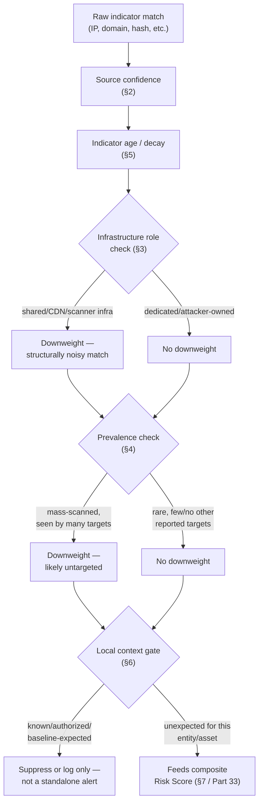

# Part 32 — Threat Intelligence in Detection

## Why this part exists

An analyst opens an alert that reads "connection to known-malicious IP address" and, on that sentence alone, has learned almost nothing actionable. The indicator might be a dedicated attacker-controlled VPS that has done nothing but serve malware for 6 months, or it might be a shared cloud load balancer that 100 other tenants — most of them legitimate — sit behind this week and a different 100 will sit behind next week. It might have been reported to the feed 9 minutes ago or 900 days ago. It might have hit this specific host once, or it might be hitting every internet-facing IP address on the planet today as part of an opportunistic, untargeted sweep. "Known-malicious" collapses all of that into one bit, and that one bit is not enough to decide anything.

This part is placed immediately before Part 33 (Risk-Based Detection) and after Part 31 (Baselining) deliberately, per `BOOK-INDEX.md`: Part 33's scoring model treats threat intelligence confidence and statistical rarity as two of its named inputs, and teaching an input after the technique that consumes it is a forward-reference bug this book's part ordering exists specifically to avoid. Part 31 already built the machinery for "has this been seen before, and how does that change with more history" — this part is the threat-intelligence-specific instance of the same question, applied to indicators an outside party reported rather than to activity your own environment generated. Everything below is organized around one throughline: **IP bad does not mean incident.** A reputation match is one signal among several this part names — confidence, indicator age, first/last-seen, infrastructure role, prevalence, and local context — and none of those six, alone, earns a page-out.

## 1. Scope: what this part owns, and what it doesn't

**[CONCEPT]** `TERMINOLOGY.md` §8 already draws the IOC vs. IOA vs. TTP distinction this part assumes throughout: an IOC (Indicator of Compromise) is a low-durability artifact — a hash, a domain, an IP, a mutex name — that an attacker can change trivially, and this part is specifically about how to consume IOC-shaped threat intelligence without overtrusting it. This part owns the analytic layer that turns a raw indicator match into a scored, contextualized enrichment: reputation and confidence scoring, indicator age and first/last-seen semantics, infrastructure-role classification, prevalence, and local context. It assumes indicators arrive already structured — a feed, a TIP (threat intelligence platform), a sharing community export — and scores what to do with a match, not how that indicator was produced.

This part does not cover:

- **Intelligence collection and analysis tradecraft** — attribution, campaign clustering, actor profiling, and the analytic-writing discipline of a CTI (cyber threat intelligence) team producing original reporting. That's a distinct discipline from detection engineering and is out of scope for this book.
- **TIP platform selection, feed ingestion, and deduplication mechanics** — the pipeline plumbing that gets an indicator from a vendor feed or a sharing community into a queryable table in your SIEM. That's `[ENGINEERING]` territory covered by the telemetry and pipeline parts; this part assumes the indicator is already sitting in a table you can join against.
- **STIX/TAXII protocol mechanics** — the transport and object-model standard most TI sharing runs over. Mentioned only where its confidence-scoring convention matters to §2.

> **Detection Autopsy — "rare domain = malicious"**
>
> **The rule:** Alert on any DNS query for an apex domain that has never been observed in the environment's own DNS history before — the first-seen baseline from Part 15 §3 and Part 31, inverted into a standalone alerting condition rather than a weak signal.
>
> **Why it shipped:** The premise is directionally true in aggregate threat research: newly registered and rarely-used domains are disproportionately represented in phishing and command-and-control infrastructure, because attacker-controlled domains are typically young and used for a short window before rotation. Turning "rare correlates with malicious in aggregate" into "rare domain, therefore alert" looks like a defensible one-line rule, and it needs no vendor feed at all — just a locally maintained baseline, which feels like a strength.
>
> **How it failed:** A cold-start baseline has seen nothing yet, and every legitimate domain a host touches for the first time is, by definition, rare against an empty or immature history — which is most of them, on any newly onboarded host or freshly deployed monitoring pipeline. §6 below walks through real evidence of exactly this: one routine Windows Update on a home-lab client resolves through four distinct, never-before-seen apex domains across three unrelated providers in under a second, none of them malicious. Past the cold-start problem, the rule keeps failing indefinitely: any SaaS vendor rotating multi-tenant CDN hostnames, any company registering a new marketing or product domain, and any CDN's own traffic-manager routing keeps generating genuinely rare, genuinely benign domains for the life of the environment.
>
> **The fix:** Deferred. §6 below builds the actual replacement — infrastructure role and local context layered on top of rarity, not a rarity threshold alone. The full comparative teardown of this rule against every other naive rule seeded across this book ships in Part 40.

## 2. Reputation and confidence: what a match actually claims

**[CONCEPT]** Per `TERMINOLOGY.md` §1, a threat-intelligence indicator match is a **Signal** — a property that correlates with malicious behavior, not itself a verdict. A reputation feed match claims exactly one thing: some external party's collection process observed this artifact in a context that party judged malicious, at some point, with some degree of confidence that party assigned. It does not claim the artifact is malicious in every context, that it is still malicious today, or that its appearance against your environment specifically means anything beyond "this artifact matched."

**[DETECTION ENGINEER]** Confidence scoring conventions vary by source and are worth naming generally rather than assuming one standard. STIX 2.1 — the interoperable threat-intelligence data model most TIP-to-TIP sharing runs over — carries an optional numeric confidence field, typically expressed on a 0–100 scale, that the producing party sets at their own discretion; there is no cross-vendor guarantee that a confidence of 80 from one feed means the same thing as an 80 from another. Older tradecraft uses the Admiralty/NATO System — a source-reliability letter (A through F) crossed with an information-credibility number (1 through 6) — which separates "how much do we trust who reported this" from "how corroborated is the claim itself," a distinction most single-number confidence scores collapse. Neither convention tells you anything about *your* environment; both describe the producing party's confidence in the indicator, which is a different question from whether a match against your telemetry deserves an analyst's attention right now. Do not confuse either with the Traffic Light Protocol (TLP) marking a shared indicator often carries — TLP governs who you're allowed to re-share the indicator with, not how confident anyone is that it's actually malicious.

The rest of this part is the general shape of how a raw match becomes a usable enrichment: confidence from the source (this section), decayed or held steady by indicator age (§5), weighted down if the indicator's own infrastructure role means the match is structurally noisy (§3), weighted down further if the indicator is mass-hitting everyone rather than you specifically (§4), and finally gated by whatever your own environment already knows about the entity involved (§6) before it ever reaches a composite score (§7).






**Figure 32.1 (FIG-32-01) — Threat-intelligence enrichment pipeline, from raw match to composite score.** *CONCEPTUAL.* Illustrates the sequence this part argues for: a raw indicator match is progressively contextualized by source confidence, indicator age, infrastructure role, prevalence, and local context before it is allowed to contribute to a Risk Score (Part 33), rather than alerting on the raw match alone. This is a sketch of the intended decision flow, not a capture from a running enrichment pipeline.

> **Engineering Reality**
> Most commercial and open-source TI feeds ship a numeric confidence or severity score with no published methodology behind it, and different feeds scoring the same indicator will disagree — sometimes sharply — because they weight source reliability, corroboration, and recency differently and rarely document how. Treat a vendor confidence score as one input from one source, not as ground truth, and if you're paying for more than one feed, expect to build reconciliation logic for indicators multiple feeds disagree on rather than assuming they'll agree.

## 3. Infrastructure role: why "IP bad" is already the wrong question

**[CONCEPT]** The same raw IP address plays structurally different roles depending on what actually sits behind it, and the role determines how much a match should move your confidence at all. A dedicated, attacker-registered VPS that has only ever been observed serving malware or C2 traffic is a very different match than a shared hosting IP, a CDN edge node, a Tor exit node, a residential-proxy pool endpoint, or a known internet-wide research/recon scanner — all of which get flagged by aggressive feeds precisely because they touch enormous numbers of hosts, the overwhelming majority for reasons that have nothing to do with you.

**[ANALYST]** The real HTTP honeynet capture below shows exactly this mix arriving at a single decoy web listener within about an hour.

```text
id   ts                                src_ip           method  path                 user_agent
---  --------------------------------  ---------------  ------  -------------------  -------------------------------------------------------------------------------------------------------------------------------------
695  2026-09-09T21:39:39.936738+00:00  189.18.97.61     GET     /hachk.php           proxy-prefilter/1
694  2026-09-09T21:36:41.187764+00:00  223.123.43.135   POST    /GponForm/diag_Form  Hello, World
693  2026-09-09T21:28:40.194169+00:00  89.21.67.141     GET     /sse                 Mozilla/5.0 (compatible; Infrawatch/1.0; +https://infrawat.ch/)
692  2026-09-09T21:28:39.410032+00:00  89.21.67.165     GET     /mcp                 Mozilla/5.0 (compatible; Infrawatch/1.0; +https://infrawat.ch/)
691  2026-09-09T21:28:39.276423+00:00  193.176.31.228   GET     /api/mcp             Mozilla/5.0 (compatible; Infrawatch/1.0; +https://infrawat.ch/)
686  2026-09-09T20:40:51.502493+00:00  85.217.149.47    GET     /favicon.ico         ...ModatScanner/1.2 (+https://modat.io/)
685  2026-09-09T20:40:50.810213+00:00  85.217.149.47    GET     /                    ...ModatScanner/1.2 (+https://modat.io/)
```

**Figure 32.2 (FIG-32-02) — Mixed research-scanner and opportunistic-exploit traffic against a single decoy web listener.** *REAL LAB EXAMPLE.* Captured from the `http_events` table of the author's honeynet collector (CT103, `/opt/hp-platform/data/honeypot.db`), spanning 2026-09-09 17:06–21:39. Row 694 is a genuine, if opportunistic, exploit-shaped request — `POST /GponForm/diag_Form` is the well-documented path for a GPON router authentication-bypass RCE that is still mass-scanned for today. The `Infrawatch/1.0` and `ModatScanner/1.2` requests are self-identified, internet-wide attack-surface-mapping research scanners probing for exposed endpoints across the entire address space, not activity targeted at this host specifically — a naive "any inbound request from a reputation-flagged scanner IP is an incident" rule would treat both rows identically, when only one is an actual exploitation attempt.

> **False Positive Trap**
> Reputation feeds routinely flag known scanner infrastructure — Shodan, Censys, and the smaller research/attack-surface-mapping crawlers like the ones above — as malicious, because scanning is literally what that infrastructure does at internet scale, and a feed built to flag "hosts that touch many targets indiscriminately" will catch research scanners and attacker recon infrastructure with the same rule. Treating every hit from flagged scanner infrastructure as an incident on your own internet-facing assets conflates "someone scanned me" — which happens to every routed IP address on the public internet, continuously, regardless of what you do — with "someone specifically targeted me." Maintain a maintained allowlist of known research-scanner ASNs/user-agents distinct from your general reputation-feed ingestion, and route hits from it to a lower-priority recon queue rather than the same queue a dedicated attacker-infrastructure match reaches.

The real correlated honeynet attack-session data below shows the other end of the role spectrum: sources whose behavior, not just their reputation-feed presence, marks them as dedicated exploit attempts rather than passive recon.

```text
session_id       source_ip        first_seen (UTC)      last_seen (UTC)        target_system  status            mitre_techniques_json
d48b795e...       16.5.0.236       2026-09-15T06:08:21   2026-09-15T06:08:23   10.99.99.10    possible_success  ["T1595","T1046","T1083","T1190"]
a9644f74...       16.5.0.236       2026-09-15T03:25:42   2026-09-15T03:25:44   10.99.99.10    possible_success  ["T1595","T1046","T1083","T1190"]
36593979...       16.5.0.236       2026-09-15T00:18:26   2026-09-15T00:18:29   10.99.99.10    possible_success  ["T1595","T1046","T1083","T1190"]
5322cb1f...       198.235.24.116   2026-09-15T01:05:08   2026-09-15T01:05:10   10.99.99.11    possible_success  ["T1595","T1046","T1083","T1190"]
```

**Figure 32.3 (FIG-32-03) — One source IP hitting the same decoy three times in 6 hours, tagged `possible_success` by the platform's own correlation logic.** *REAL LAB EXAMPLE.* Captured from the `attack_sessions` table of the same honeynet collector; the sessions shown span 2026-09-15T00:01–07:43 (capture run itself executed 2026-09-15T08:36 UTC). `16.5.0.236` shows exploit-shaped requests followed by continued attacker activity against the same target (`10.99.99.10`, an internal decoy address) on three separate occasions the same day, and the platform's own automated logic tags all three with T1595 (Active Scanning), T1046 (Network Service Discovery), T1083 (File and Directory Discovery), and T1190 (Exploit Public-Facing Application) — a source repeatedly investing effort against one specific target, which is a materially stronger signal than a single opportunistic hit.

**MITRE:** T1595 (Active Scanning), T1046 (Network Service Discovery), T1083 (File and Directory Discovery), T1190 (Exploit Public-Facing Application).

> **What Would Change My Mind**
> This section's claim is that infrastructure role should move confidence down for shared/scanner infrastructure and should not move it down for a source showing repeated, targeted, effort-carrying behavior against one asset, as in Figure 32.3. If a production dataset showed that repeat-target sources like `16.5.0.236` are, in practice, just as likely to be a second unrelated research scanner re-crawling the same address space on its normal re-scan cycle as they are to be a persistent human attacker, the "repetition against one target implies intent" heuristic in this section would need to drop from a confidence-raising signal to a neutral one, and the actual discriminator would have to move to session content (did later requests build on earlier reconnaissance, e.g., an exploit attempt against a path a prior request just enumerated) rather than repetition alone.

## 4. Prevalence: how many other targets saw this same indicator

**[CONCEPT]** An indicator's prevalence — how many other, unrelated targets a sharing community or your own multi-tenant telemetry shows the same indicator hitting in the same window — is one of the more durable discriminators between mass, untargeted activity and something aimed specifically at your environment. `TERMINOLOGY.md` does not carry a dedicated entry for this term; treat it here as the count this part needs and, per the glossary's own instructions, a candidate for a future glossary addition rather than local vocabulary this part is entitled to define on its own authority. An indicator hitting thousands of organizations the same day is credit-card-style automated fraud logic at internet scale, not evidence anyone has singled you out; an indicator that appears nowhere else in a sharing community, hitting only you, is a materially different claim even at identical source confidence.

**[ANALYST]** The real SSH honeypot capture below shows prevalence data at the credential level rather than the IP level, and it is worth reading both patterns in the same dataset side by side.

```text
id     ts                           src_ip           username  password
10104  2026-09-10T09:07:30.815869Z  176.53.159.196   support   support
10097  2026-09-10T08:21:03.680909Z  176.53.159.196   support   support
10092  2026-09-10T07:47:47.021592Z  186.242.162.94   admin     admin
10085  2026-09-10T07:44:57.880172Z  176.53.159.196   support   support
10064  2026-09-10T05:56:15.117525Z  176.53.159.196   support   support
10029  2026-09-10T02:20:07.771385Z  176.53.159.196   support   support
10018  2026-09-10T00:48:16.373231Z  176.53.159.198   support   support
10013  2026-09-10T00:37:04.648823Z  176.53.159.197   support   support
9943   2026-09-09T19:05:48.228218Z  130.12.180.51    admin     admin
9938   2026-09-09T19:05:47.015395Z  46.8.31.44       admin     admin
9840   2026-09-08T13:27:42.022137Z  130.12.180.51    admin     admin
9835   2026-09-08T13:27:20.764117Z  8.136.128.232    admin     admin
```

**Figure 32.4 (FIG-32-04) — Two different prevalence shapes inside the same credential-stuffing dataset.** *REAL LAB EXAMPLE.* Captured from the `ssh_events` table of the honeynet collector, spanning 2026-09-08 through 2026-09-10 (over 10,000 rows total in the source table). `176.53.159.196` and its near-neighbor addresses `.197`/`.198` repeat the exact `support`/`support` pair against this one decoy roughly every 30 to 90 minutes for multiple days — one apparent source, sustained effort, against one target. The `admin`/`admin` pair, by contrast, arrives from at least four unrelated, non-adjacent source IPs across 3 days — not one persistent actor, but many independent, opportunistic scanners converging on the same globally common default-credential guess, which is exactly what high cross-target prevalence looks like from a single collection point.

> **Hunter's Note**
> Don't pivot on source IP alone when a credential-stuffing pattern is paced to stay under a count threshold — pivot on the (username, password) pair itself, and separately on source-IP adjacency. The `support`/`support` cluster above is one sustained low-and-slow campaign discoverable only by widening the lookback window and grouping by the exact credential pair rather than by any short-window count; the `admin`/`admin` cluster is high-prevalence noise from unrelated scanners that a per-source-IP threshold will never connect, and shouldn't need to, because no single source is doing anything a threshold should catch.

> **Blind Spot**
> Prevalence checking only works against indicators someone else has already reported seeing — a genuinely novel piece of attacker infrastructure, stood up specifically for one operation against one target, will show zero prevalence in every sharing community and every feed you subscribe to, by construction. Low or zero cross-target prevalence is consistent with both "this is mundane, unreported infrastructure nobody's bothered to flag" and "this is a bespoke, targeted operation against you specifically" — prevalence alone cannot tell those two apart, and treating "no one else has seen it" as automatically reassuring is exactly backward for a genuinely targeted intrusion.

## 5. Indicator age and first/last-seen: whose clock, and since when

**[CONCEPT]** A TI feed's `first_seen` and `last_seen` fields record when *that vendor's own sensor network* observed the indicator — not when the indicator actually came into malicious use, and not when it first touched your environment. Per `TERMINOLOGY.md`'s Dwell Time entry, the elapsed time between an adversary's actual foothold and its detection is the outcome metric this book cares about; conflating a feed's own first-seen timestamp with a global "since when has this been malicious" timeline routinely understates how long an indicator or the campaign behind it has actually been active.

**[DETECTION ENGINEER]** Indicator age matters differently depending on the infrastructure class behind it. Fast-rotating infrastructure — bulletproof-hosted C2 domains, residential-proxy botnet nodes, disposable phishing-kit domains — is usually only dangerous for a short window after registration or first abuse, and an indicator reported days or weeks ago from that class has often already been abandoned by the time it reaches your feed; weight a fresh report from this class higher than an old one. Durable infrastructure — a hardcoded C2 domain baked into a malware family's binary, a long-lived credential-harvesting kit's landing-page domain — stays dangerous for as long as the malware or kit remains in use regardless of how long ago it was first reported; age alone shouldn't decay confidence for this class the way it should for the first.

<a id="det-32-02"></a>**DET-32-02 — Indicator-age decay applied to a threat-intelligence match.** The following targets Splunk and assumes a threat-intelligence lookup enrichment producing per-match fields for confidence, first-seen date, and cross-target prevalence count — every field name below is illustrative and stands in for whatever your own TIP or lookup integration actually exposes.

CONCEPTUAL SAMPLE — illustrative SPL, field names (`ti_confidence`, `ti_first_seen`, `ti_prevalence_count`) are representative of a generic TI-lookup enrichment, not a specific product's schema.

```spl
index=network dest_ip_ti_match=true
| eval age_days=round((now()-strptime(ti_first_seen, "%Y-%m-%dT%H:%M:%SZ"))/86400)
| eval age_days=max(age_days, 0)
| eval decay_factor=if(ti_infra_class=="durable", 1.0, pow(0.5, age_days/30))
| eval prevalence_weight=if(ti_prevalence_count>50, 0.3, 1.0)
| eval composite_score=ti_confidence * decay_factor * prevalence_weight
| where composite_score > 40
| table _time, src_ip, dest_ip, ti_confidence, age_days, ti_prevalence_count, composite_score
```

The `decay_factor` line halves confidence roughly every 30 days for anything not explicitly tagged `ti_infra_class="durable"` — the fast-rotating-infrastructure case from this section's prose. Durable infrastructure (a hardcoded malware C2 domain, a long-lived kit landing page) is excluded from that decay entirely by the same line, since age alone shouldn't lower confidence for that class. Two field-dependency failure modes are worth naming explicitly rather than discovering by accident: if `ti_infra_class` is null or unset — a lookup enrichment that hasn't been populated for every indicator type yet — the `if()` comparison to `"durable"` evaluates false and the row silently falls into the fast-decay branch, which is the conservative default (age erodes confidence for anything not proven durable) but will incorrectly decay a genuinely durable indicator that just hasn't been tagged yet. If `ti_first_seen` is missing or fails to parse against the literal `strptime` format string, `age_days` evaluates to null, `decay_factor` and `composite_score` both become null, and `| where composite_score > 40` drops the row from the output entirely — indistinguishable from a row that scored below threshold on its own merits. Treat a suspiciously low match count from this search as a reason to check for null `ti_first_seen` values before concluding the underlying telemetry is simply quiet.

A third scenario is worth clamping for explicitly: if `ti_first_seen` is in the future relative to the search head — clock skew between the feed and your SIEM, or a malformed date the feed itself never validated — `age_days` comes out negative, and `pow(0.5, age_days/30)` with a negative exponent returns a value *greater* than 1.0, amplifying `composite_score` for exactly the malformed-record class this section is trying to treat conservatively, instead of decaying it. The query above now floors `age_days` at zero before it reaches `decay_factor` to close that off. Separately — and this one the query can't fix — some feeds bump `first_seen` on every poll for as long as an indicator stays actively observed, rather than holding it at the original observation date; against a feed that behaves this way, `age_days` never grows past a few hours no matter how old the underlying campaign actually is, and the decay curve this section argues for never engages. Confirm your feed vendor's documented refresh behavior for `first_seen` before trusting `age_days` as a real age.

This detection is not a standalone alert — it produces a decayed, prevalence-weighted score that feeds the composite gating in §7, and it has not been validated against a live TI-lookup deployment; confirm your own enrichment's actual field names, decay-appropriate half-life, and infrastructure-class tagging before deploying anything resembling it. Before trusting the decay curve on real data, test it against synthetic rows spanning both `ti_infra_class` values at 0, 30, 60, and 90+ days of `ti_first_seen` age, and confirm `composite_score` moves the way §5's prose claims it should — durable-tagged rows flat, everything else halving roughly every 30 days.

> **Engineering Reality**
> A feed's `first_seen` timestamp reflects the first time *that vendor's sensor network* observed the indicator, not the first time it was actually used maliciously anywhere. An indicator can be genuinely months or years old in real-world abuse before a given vendor's collection first picks it up and stamps today's date as "first seen" — meaning the same indicator can show wildly different ages across feeds you subscribe to simultaneously, and none of those ages is a reliable proxy for how long the underlying campaign has actually been running.

<a id="hunt-32-01"></a>**HUNT-32-01 — TI-vintage mismatch as a dwell-time discovery hunt.**

**Threat Hypothesis:** An indicator a feed reports as first-seen long before your own telemetry retention window, appearing in your own environment for the first time only now, is either newly relevant because you only just started ingesting that feed, or is evidence of a long-dwelling reuse of that infrastructure against you that no standing detection caught while it was happening.

Pull every indicator match from the last 24 to 48 hours, join against the feed's own `first_seen` date, and separate the results into two buckets: matches on indicators the feed has carried for longer than your current retention window (these are the ones worth investigating — if the indicator has been "known bad" for longer than you can look back, you cannot rule out that it touched your environment earlier and simply wasn't matched against a feed you didn't have yet), versus matches on indicators genuinely new to the feed itself (routine timing, not a dwell-time concern). This hunt ends either in a documented negative finding — retention genuinely doesn't reach back far enough to say either way, logged as a Visibility Debt item rather than closed silently — or, per `TERMINOLOGY.md`'s Hunt entry, a new detection candidate: if the retrospective sweep turns up a genuine long-dwelling match, that finding gets escalated to an Incident through the normal IR process *and* separately files a detection candidate closing the specific gap the hunt exposed (e.g., "alert on any TI match where indicator vintage exceeds retention depth" as a standing rule, rather than something only ever caught by a one-time manual sweep). The hunt itself stays a time-boxed, non-repeating sweep; the candidate it produces is what turns the finding into standing coverage.

**MITRE:** — This hunt targets a data-quality and dwell-time question (has this infrastructure touched us before our detection stack could have caught it), not a single adversary technique; the technique tag, if the hunt finds something, depends entirely on what that infrastructure turns out to represent and would be assigned to whatever new detection candidate the finding produces.

## 6. Local context and the "rare domain = malicious" problem

**[CONCEPT]** Local context is the variable every prior section in this part has been building toward, and it is the one a naive reputation or rarity rule structurally cannot see: what does *your own environment* already know about this entity, this asset, and this indicator, independent of what an external feed or a rarity count says. Per `TERMINOLOGY.md` §6, this is exactly the question a **Baseline** answers — has this entity talked to this indicator before, in a context that history already marks as expected — and it's why Part 31 is a prerequisite for this part rather than a parallel topic.

**[ANALYST]** The real DNS evidence below is the concrete case behind this part's seeded Detection Autopsy.

```text
Sep 15 08:32:46 dnsmasq[2221]: forwarded software-static.download.prss.microsoft.com to 1.1.1.1
Sep 15 08:32:46 dnsmasq[2221]: reply sundry-fg-geo-nocn.trafficmanager.net is <CNAME>
Sep 15 08:32:46 dnsmasq[2221]: reply fg.microsoft.map.fastly.net is 199.232.210.172
Sep 15 08:32:46 dnsmasq[2221]: reply fg.microsoft.map.fastly.net is 199.232.214.172
Sep 15 08:32:46 dnsmasq[2221]: reply download.prss.microsoft.com.akamaized.net is <CNAME>
Sep 15 08:32:46 dnsmasq[2221]: reply a308.dscd.akamai.net is 2600:1413:5000:3c::1735:76e4
```

**Figure 32.5 (FIG-32-05) — One legitimate software update, four never-before-seen apex domains, under 1 second.** *REAL LAB EXAMPLE.* Captured from a Pi-hole/dnsmasq resolver (CT100, the author's home-lab Proxmox environment), 2026-09-15, via a bounded tail of `/var/log/pihole/pihole.log` — the same capture discussed from a DNS-telemetry angle in Part 15 Figure 15.1. A single client resolving a Windows software update touches `trafficmanager.net`, `fastly.net`, `akamaized.net`, and `akamai.net` — four apex domains across three unrelated CDN/traffic-management providers — none of which a fresh or short-history baseline has seen before. A "rare apex domain = malicious" rule, run against this exact traffic, has no way to distinguish this from six brand-new pieces of attacker infrastructure appearing in the same second.

This is precisely the failure mode named in this part's Detection Autopsy: rarity alone cannot separate a CDN's routine multi-provider routing from four coincidentally-fresh attacker domains, because both produce the identical observable shape — apex domains with no prior history in this environment. Local context is what actually discriminates the two, and it does so along axes rarity doesn't measure:

- **Infrastructure role of the destination** (§3's logic, applied to domains instead of IPs): does the resolved IP or CNAME chain terminate in a well-established CDN/cloud provider's address space with a long operational history, or in newly allocated address space with no operational history at all?
- **Correlation with the querying process**, per Part 15 §2.1: was this domain requested by a routine, allowlisted update or telemetry service (Sysmon Event ID 22 (DNS Query) captures the requesting process image), or by a process with no legitimate reason to be resolving anything?
- **Whether the query resolves at all**: a CDN traffic-manager hop resolves to a real, routable answer every time; a large share of genuinely malicious rare-domain activity — DGA fallback loops in particular — is dominated by NXDOMAIN, the pattern Part 15 §4 covers in depth.

None of those three checks require a threat-intelligence feed at all — they're local context the environment already has. A TI feed becomes useful here specifically where local context runs out: when a rare, resolving domain sits behind newly allocated, no-history infrastructure that also happens to match an external report of recent malicious registration. Confidence should rise only when rarity, infrastructure role, and an external report agree; any one of the three alone is what the Detection Autopsy above shows failing.

## 7. Composing it into a confidence score

**[DETECTION ENGINEER]** Collect the pieces: source confidence (§2), an age-decayed adjustment (§5), an infrastructure-role downweight (§3), a prevalence downweight (§4), and a local-context gate (§6) that can suppress the match outright if it's already explained by known-benign history. None of these is a verdict on its own. Part 33 owns the general mechanism for combining weak signals like these into a single Risk Score that crosses an alerting threshold only when enough of them agree; this part hands that model its threat-intelligence-specific inputs.

<a id="det-32-01"></a>**DET-32-01 — Composite-gated alert on a threat-intelligence match against an internet-facing asset.** The following targets Microsoft Sentinel and assumes a threat-intelligence indicator table joined against network connection or DNS logs, plus a locally maintained baseline table of previously-seen (entity, indicator) pairs per Part 31. It has not been validated against a live Sentinel workspace in this book's lab — the lab's own TI-adjacent evidence comes from a self-run honeynet's correlation logic, not an ingested commercial feed — so treat the table and field names as illustrative and confirm against your own workspace's threat-intelligence schema before deploying.

CONCEPTUAL SAMPLE — illustrative Sentinel KQL, schema fields treated as representative rather than confirmed against a live workspace.

```kql
// Join network connections against a TI indicator table, then gate the match through
// infrastructure role, prevalence, and a local baseline before it reaches the alert stage.
let TiMatches = CommonSecurityLog
    | where TimeGenerated > ago(1h)
    | join kind=inner (
        ThreatIntelligenceIndicator
        | where Active == true
        | where isnotempty(NetworkIP)
        | project IndicatorIP = NetworkIP, ConfidenceScore, ThreatType, ValidFrom
    ) on $left.DestinationIP == $right.IndicatorIP;
TiMatches
| extend IndicatorAgeDays = datetime_diff('day', now(), ValidFrom)
| extend RoleDownweight = iff(ThreatType has_any ("scanner","cdn-shared","hosting-shared"), 0.3, 1.0)
| join kind=leftouter (
    KnownEntityIndicatorBaseline_CL // per-entity baseline of prior (entity, indicator) pairs, Part 31
    | project DestinationHost, IndicatorIP, PriorSeenBenign = true
) on $left.DestinationIP == $right.IndicatorIP, DestinationHost
| where isnull(PriorSeenBenign) // local-context gate: suppress if already baselined benign
| extend CompositeScore = ConfidenceScore * RoleDownweight * iff(IndicatorAgeDays > 90, 0.6, 1.0)
| where CompositeScore > 50
| project TimeGenerated, SourceIP, DestinationIP, DestinationHost, ConfidenceScore, IndicatorAgeDays, CompositeScore
```

This rule's main coverage gap is the `KnownEntityIndicatorBaseline_CL` join: if that baseline table is stale or was never populated for a given destination host, the local-context gate defaults to passing every match through ungated rather than failing safe, so a baseline pipeline outage silently reverts this detection to a bare reputation-match rule — the exact naive shape this part argues against. A second, opposite-direction gap sits in the arithmetic itself: `ConfidenceScore` or `ValidFrom` null on the source indicator record — a partially-populated feed entry, or a STIX object missing an optional field — propagates through `IndicatorAgeDays` and `CompositeScore` as null rather than raising an error, and `where CompositeScore > 50` silently drops a null score from the result set exactly the way it drops a genuinely low one. A malformed indicator record and a benign non-match are indistinguishable in this rule's output; validate that `ConfidenceScore` and `ValidFrom` are populated for every ingested indicator before trusting an empty result as "no threat-intelligence match," not just "no scored match."

A third gap sits in the join's own filtering, and it's the one most likely to make this rule pass every test and then produce nothing in production: `ThreatIntelligenceIndicator.TimeGenerated` records when Sentinel's TI connector last wrote or refreshed that indicator row, not when a network event happened, so filtering the indicator side to the same `ago(1h)` window used for `CommonSecurityLog` restricted every possible match to indicators the connector happened to have re-touched in the last hour. A standing indicator ingested last month that the connector hasn't refreshed since — which is most of them, and exactly the aged, `IndicatorAgeDays > 90` case this query is supposed to downweight rather than miss — dropped out of the join before `CompositeScore` was ever computed, with no error and no empty-result warning. The query above now filters the indicator side on `Active == true` instead; the recency filter belongs on the network-log side only.

Two more assumptions are baked into the query text without being enforced anywhere: `RoleDownweight` only fires if `ThreatType` contains one of the three literal strings checked, so a feed using its own taxonomy (`"scanning-host"`, `"proxy"`, `"anonymizer"`) rather than `"scanner"`/`"cdn-shared"`/`"hosting-shared"` silently skips the downweight for every shared/scanner match — exactly the noisy-infrastructure case §3 exists to catch — while the query keeps running and returning results as if the check applied. And the fixed `CompositeScore > 50` threshold assumes `ConfidenceScore` itself arrives on a comparable 0–100 scale across every ingested feed; per §2, that's a STIX convention, not a guarantee, and a second feed reporting confidence on a 0–1 or low/medium/high-mapped scale will cross or miss that threshold for reasons that have nothing to do with actual confidence. Normalize both the role taxonomy and the confidence scale per source before the join, not after.

> **Blind Spot**
> This rule only evaluates traffic where the internet-facing asset is the source of an outbound connection to a reputation-matched `DestinationIP` — the egress-to-C2 shape. It does not evaluate the honeynet-documented inbound shape from §§3–4 above, where the reputation-matched IP is the one connecting *to* the asset (`SourceIP == IndicatorIP`). A known-bad scanning or attacker IP hitting the asset directly produces no `CompositeScore` at all under this query, regardless of confidence, role, or prevalence — cover that direction with a second join keyed on `SourceIP` before treating this rule as coverage for "connections to or from a reputation-matched indicator," not just connections toward one.

**MITRE:** — This rule alerts on a threat-intelligence indicator match, and the technique it maps to depends entirely on what the matched indicator represents (C2 domain, phishing infrastructure, exploitation host); tagging it with a single fixed technique would misrepresent whatever specific indicator actually fired it. Tag the resulting alert with the matched indicator's own reported threat type at triage time rather than a fixed rule-level MITRE tag.

> **Detection Test**
> **Setup:** Lab or test tenant with Sentinel's threat-intelligence connector enabled, one indicator manually ingested into `ThreatIntelligenceIndicator` with a known `ConfidenceScore`, a `ThreatType` not in the scanner/CDN downweight list, and a recent `ValidFrom` date, matched against a test host with no prior entry in `KnownEntityIndicatorBaseline_CL` for that destination.
> **Action:** `Test-NetConnection -ComputerName <test-indicator-IP> -Port 443` from the test host, where `<test-indicator-IP>` is the IP address of the test indicator above.
> **Expected result:** A row in `TiMatches` with `CompositeScore` above the 50 threshold and `PriorSeenBenign` null, confirming the join and gating logic pass a genuinely novel, high-confidence match through rather than silently suppressing it. If no row appears, check the two most common causes before concluding the rule is broken: `ConfidenceScore` or `ValidFrom` null on the ingested indicator (see the coverage-gap note below — a null in either field silently zeroes `CompositeScore` and the row never crosses the threshold), or `CommonSecurityLog` not yet ingesting the test host's connection logs.

**Case study — scoring the same source IP two different ways.** Return to Figure 32.3: `16.5.0.236` hit the same honeynet decoy three times in 6 hours, and the platform's own correlation logic tagged it `possible_success` with four MITRE techniques attached. Inside the honeynet, that tag is correct and proportionate — the target is a disposable decoy built specifically to be attacked, so "confirmed exploit-shaped activity against it" is exactly the finding the platform exists to produce, and it costs nothing to be loud about it. Run the identical raw signal — same source IP, same repeated exploit-shaped requests, same MITRE tags — against a real production web server instead, and every input in this part's model except the reputation match itself changes: the asset's criticality is no longer disposable, a successful exploit has real consequence, and the local-context gate in §6 has no prior baseline entry marking this as expected traffic for that host. The reputation-and-behavior signal is identical in both cases; the response the composite score should produce is not, because the entity being hit is not the same kind of entity. That gap — the honeynet's severity being correct for a decoy and wildly insufficient for production, or vice versa if a real intrusion were mistaken for routine recon — is the whole argument this part is making about local context, worked through on real data rather than a hypothetical.

## 8. Threat hunting with threat intelligence

**[THREAT HUNTER]** HUNT-32-01 in §5 is this part's primary named hunt; the rest of this section is guidance for building others in the same spirit. Every section above names a place a standing detection structurally can't reach on its own: a match suppressed by an overly broad infrastructure-role downweight that happened to also be a real dedicated attacker host reusing shared hosting, a low-prevalence indicator that never crossed the composite threshold because a single input was individually weak, or a fresh feed report against activity your own telemetry shows started well before the report existed. None of those are standing-detection problems — they're exactly the shape of question a time-boxed, hypothesis-driven hunt is for, per `TERMINOLOGY.md`'s Hunt entry.

> **Hunter's Note**
> When a new high-confidence indicator lands in your feed, don't just check whether it matches *today's* telemetry — retroactively query as far back as retention allows. A feed's freshness reflects when *the vendor* learned about the indicator, not when it first became relevant to you, and the single highest-value thing a threat hunter can do with a brand-new indicator is find out it's been sitting in your logs, unmatched, for weeks.

## 9. Analyst triage for threat-intelligence-enriched alerts

**[ANALYST]** An alert built on a composite score like DET-32-01's should be triaged as a composite claim, not as "the IP is bad, therefore act." A practical sequence:

1. Pull the matched indicator's full context from the TI source — threat type, reported confidence, first-seen date, and (if the source exposes it) prevalence count — rather than trusting the alert's own summarized score alone.
2. Check the destination or source entity's own history: has this specific entity talked to this specific indicator before, and if so, was that prior contact ever reviewed and marked benign? A gate that should have suppressed the match but didn't is worth fixing regardless of how this particular alert resolves.
3. Check what's actually behind the indicator right now, not just what the feed says it was when reported — a domain a feed flagged months ago may have since been sinkholed, reclaimed by its legitimate owner, or repurposed, and a live check can change the disposition materially.
4. Weigh asset criticality explicitly: the same indicator match against a disposable test host and against a domain controller is not the same triage priority, independent of how confident the TI match itself is.
5. Disposition the alert per `TERMINOLOGY.md` §3 using all of the above, not the raw reputation match alone — and if the composite score's inputs were wrong (role downweight too aggressive, prevalence threshold too loose), feed that back as Tuning on the detection, not just a one-off override on this alert.

## 10. Managing threat intelligence at the program level

**[SOC MANAGEMENT]**

> **SOC Management View**
> Paying for more threat-intelligence feeds is one of the easiest ways for a security program to spend money without measurably improving detection, because a raw feed subscription increases Telemetry Coverage of external indicators without increasing Detection Coverage of anything — per `TERMINOLOGY.md` §5, that gap is Visibility Debt by definition. Before adding a new feed, ask whether the program has the enrichment and gating logic in §§2–7 to actually use it, or whether the new feed will just widen the raw-match volume an already-under-resourced team has to triage without context. A smaller number of well-integrated feeds, joined against real local context, outperforms a larger number of feeds nobody has built the gating logic for.

## 11. Coverage summary

**[DETECTION ENGINEER]** The table below maps each named detection and hunt in this part to its MITRE ATT&CK technique, for use in a program-level coverage matrix (Part 41). Most entries in this part carry an intentional em dash rather than a forced technique tag, for the reason given in each detection's own MITRE line above: a threat-intelligence match's technique depends on what the matched indicator represents, not on the matching logic itself.

| ID | Behavior | MITRE |
|---|---|---|
| `DET-32-01` | Composite-gated alert on a TI indicator match against an internet-facing asset | — (depends on matched indicator's reported threat type; tag at triage) |
| `DET-32-02` | Indicator-age decay applied to a TI match's composite score | — (scoring input, not a standalone technique-mapped alert) |
| `HUNT-32-01` | TI-vintage/dwell-time mismatch retrospective sweep | — (data-quality/dwell-time hunt; technique depends on any finding) |

The MITRE-tagged evidence cited from the honeynet in §3 (Figure 32.3) — T1595 (Active Scanning), T1046 (Network Service Discovery), T1083 (File and Directory Discovery), T1190 (Exploit Public-Facing Application) — belongs to that platform's own correlation logic, not to a detection authored in this part; it's cited here as real grounding for the infrastructure-role and prevalence arguments, not as this part's coverage claim.

The naive rule seeded in this part — "rare domain equals malicious" (§1, §6) — gets its full comparative dissection across every source part in Part 40; this part's Detection Autopsy box is the teaser, not the final word.
