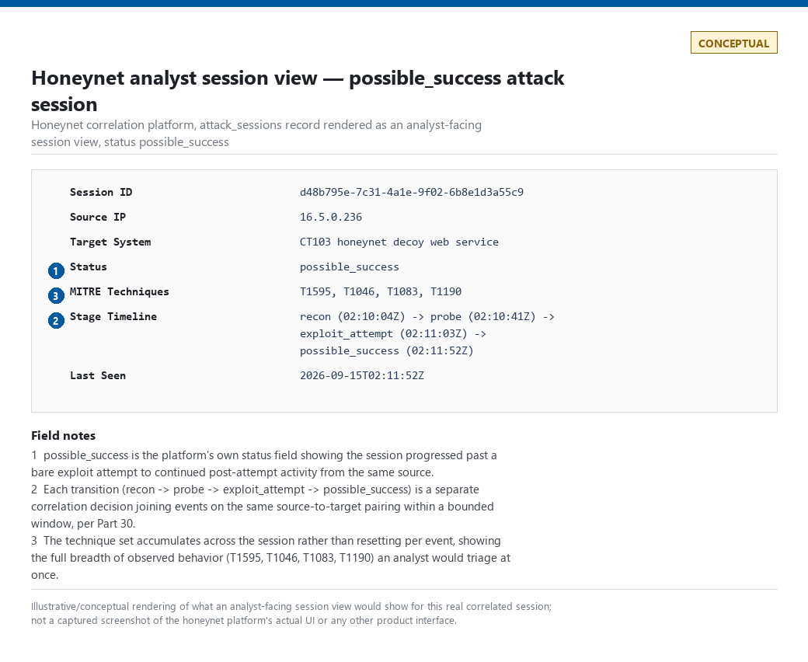
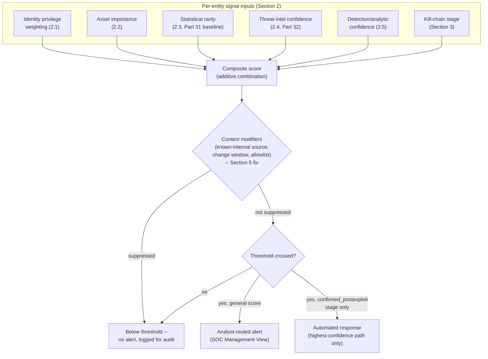

# Part 33 — Risk-Based Detection

## Why this part exists

**[CONCEPT]** Every part in Section G so far has built one input to a decision this part now has to make explicit: Part 30 built correlation — joining two or more individually weak events on a shared entity within a bounded window. Part 31 built baselining — turning raw activity into a "how unusual is this, for this specific entity" score. Part 32 built threat-intelligence confidence — turning "this indicator appears on a feed" into "this indicator, from this source, at this age, means this much." None of those three parts, on their own, tells you when to alert. Risk-Based Alerting (RBA), as defined in TERMINOLOGY.md § Risk-Based Alerting, is the technique that takes those independently-weak signals and several more — identity privilege, asset importance, detection confidence, and how far into a kill chain an entity's activity has progressed — and combines them into a single running score per entity, alerting only when the accumulated score crosses a threshold rather than when any one signal fires alone.

This part is the synthesis point for those inputs, and it is placed last among its own dependencies deliberately: rarity (Part 31) and threat-intel confidence (Part 32) only mean something once you already have the baseline and the reputation-scoring discipline those parts built. What this part adds on top is the weighting model itself — how much each input should count, relative to the others, for a given entity — and the honest failure modes that show up specifically at the point where those inputs get summed. A risk score is not a more sophisticated correlation rule; it is a different kind of claim, with a different kind of failure mode, and the rest of this part is organized around making both the technique and its failure modes concrete rather than abstract.

**MITRE:** This part does not introduce new technique coverage of its own — it is a scoring layer applied on top of analytics built elsewhere in the book, most of which already carry their own MITRE mapping (see the worked examples in §4 and §5 for the specific IDs those underlying analytics use).

---

## 1. What a risk score actually is, and isn't

**[CONCEPT]** A risk score is a running numeric value attached to an Entity (a user, host, service account, or cloud principal — TERMINOLOGY.md § Entity) over a defined time window, incremented by every Signal observed for that entity that the program has decided is worth points. An alert fires when the accumulated score crosses a threshold. That's the entire mechanism. Everything interesting about risk-based detection — and everything that goes wrong with it — lives in three questions the mechanism itself doesn't answer:

- How many points does a given signal deserve, and relative to what?
- Do points from different signals actually combine by addition, or does addition misrepresent how they interact?
- What decays, and how fast, so a score reflects "risky right now" rather than "accumulated every point since the entity was created"?

Risk-based detection is not a replacement for single-event and correlation rules — it is what you reach for specifically when a behavior is only meaningful in combination, and no single constituent signal clears a standalone alerting bar on its own. TERMINOLOGY.md's own example is the right one to keep in mind throughout this part: an off-hours VPN login, an unusual PowerShell invocation, and access to a rarely-touched sensitive share are each, alone, too common to alert on. Summed for one account in one session, they may be worth escalating. The rest of this part is about how to build that sum honestly.

> **Engineering Reality**
> A risk score needs a live entity-scoring table — a per-entity running total, maintained continuously, that most SIEMs and XDR platforms only support natively as of the last few product generations, and often only for a fixed, vendor-defined entity type (a "user risk score," a "host risk score") that may not match the entity granularity your own analytics need. Building this yourself means a stateful aggregation job (a streaming window function, or a periodic batch job against a lookback window) that has to handle late-arriving events, decay, and entity resolution (Part 30) correctly — it is real engineering, not a query-time trick.

---

## 2. The inputs to a score

**[CONCEPT]** Four of the five inputs below already have a home elsewhere in the book; this section states each one specifically as a *scoring input* rather than re-teaching it.

### 2.1 Identity privilege weighting

**[DETECTION ENGINEER]** The same signal means different amounts depending on whose identity produced it. A rare PowerShell invocation from a help-desk account with no elevated group membership is a smaller risk contribution than the identical invocation from an account that is a member of Domain Admins, holds standing access to a production database, or has recently received a sensitive privilege via Event ID 4672 (Special Privileges Assigned). Privilege weighting requires an identity-to-privilege lookup that is refreshed at least as often as your organization's actual privilege-change rate — a stale privilege table scores a demoted account as if it still held the access it lost weeks ago, and misses an account that was just added to a privileged group an hour ago.

Practical privilege tiers, most programs land on something close to this three- or four-tier model rather than a continuous scale, because a continuous scale implies a precision the underlying access-control data rarely supports:

| Privilege tier | Typical membership | Score multiplier (illustrative) |
|---|---|---|
| Standard user | No elevated group membership, no standing admin access | 1.0x |
| Elevated/local admin | Local admin on assigned endpoints, department-scoped elevated role | 1.5x–2x |
| Domain/tenant admin | Domain Admins, Global Administrator (Entra ID), organization-owner cloud role | 3x–5x |
| Service/machine account | Any non-interactive account, regardless of nominal privilege tier | Program-specific — see the False Positive Trap below |

**(CONCEPTUAL SAMPLE)** — illustrative multiplier bands, not a validated production scale.

> **False Positive Trap**
> Service accounts routinely hold high nominal privilege (a backup service account with Domain Admin–equivalent rights to read every file share) but behave with far less entropy than a human account — the same script, the same schedule, the same source host, every day. Scoring a service account purely on its privilege tier multiplier, with no adjustment for its own baseline (Part 31), inflates its score on every routine run and drowns out the rare cases where a service account's *behavior* — not its privilege — actually changes. Score service accounts against their own baseline first, and apply the privilege multiplier to deviation from that baseline, not to raw activity volume.

### 2.2 Asset importance

**[DETECTION ENGINEER]** The target matters as much as the actor. The identical anomalous authentication is a different risk contribution landing on a developer's laptop versus a domain controller, a payment-processing database, or a system holding regulated customer data. Asset importance is usually maintained as a small number of discrete tiers (critical / high / standard / low) tied to a CMDB or asset-inventory field, not computed dynamically — the volatility that makes privilege weighting hard (identities change group membership constantly) is much lower for asset criticality, which changes on the timescale of infrastructure changes, not daily activity.

> **Blind Spot**
> Asset-importance tiering is only as good as the asset inventory it's read from. A newly provisioned host that hasn't yet been tagged in the CMDB defaults to whatever the scoring model treats as "unknown" — commonly the lowest tier, which is the wrong default for a host that turns out to be a new domain controller stood up during a migration and not yet inventoried. An untagged asset should raise, not lower, its contribution to ambiguity in a risk score, or at minimum should be visibly flagged as unscored rather than silently scored low.

### 2.3 Statistical rarity

**[DETECTION ENGINEER]** Part 31 built the baseline; the scoring input here is simply "how far outside that baseline is this observation," expressed as a score contribution rather than a boolean seen-before/never-seen-before flag. A source ASN never seen for this account in 90 days of history is a bigger contribution than a source ASN seen twice in that window, which is itself bigger than one seen daily. §4 below works a full example using this input against real captured telemetry.

### 2.4 Threat-intelligence confidence

**[DETECTION ENGINEER]** Part 32 built the confidence-scoring discipline behind "IP bad ≠ incident" — indicator age, source reliability, prevalence, and local relevance all feed a confidence figure for a given indicator match, rather than treating every hit on a threat-intel list as an equal, binary signal. That confidence figure is the value that should enter a risk score, not a flat point value for "matched a threat-intel indicator." A twelve-hour-old, high-confidence indicator from a paid feed with direct visibility into the observed campaign deserves materially more score than a two-year-old, unattributed IP on a free aggregator list — collapsing both to the same fixed point value throws away exactly the discipline Part 32 built.

### 2.5 Detection confidence

**[DETECTION ENGINEER]** TERMINOLOGY.md §7 keeps Analytic Confidence, Severity, and Priority on three separate axes precisely because authors routinely collapse them into one number. Detection confidence, as a risk-score input, is Analytic Confidence specifically: the measured, disposition-history-derived estimate of how often *this specific analytic's* alerts turn out to be genuinely malicious — not the severity of the underlying technique if true, and not a number assigned once at authoring time and never revisited. A hard-coded Mimikatz command-line match with a 92% measured true-positive rate over its last 200 dispositions should contribute more score, all else equal, than a generic "rare parent-child process pair" heuristic with a 15% measured true-positive rate — and that contribution should shift as the underlying disposition history shifts, not stay fixed at whatever confidence the rule's author guessed on day one.

> **Engineering Reality**
> Most programs do not have 200 dispositions of history for every analytic feeding a risk score, especially newly deployed ones. A new analytic with zero disposition history has no measured confidence to contribute — treating it as either maximum confidence (every match is trusted fully) or zero (every match is ignored) are both wrong defaults. A reasonable middle default — a conservative fixed confidence until a minimum disposition sample size is reached, then switching to the measured figure — needs to be an explicit, documented policy, not an accident of whatever the aggregation code defaults an empty lookup to.

---

## 3. Sequence and kill-chain completion scoring

**[DETECTION ENGINEER]** The inputs in §2 score independent signals for one entity. A separate and equally important scoring dimension is how far a single entity's activity has progressed through an attack sequence — reconnaissance, followed by an exploitation attempt, followed by evidence of post-exploitation activity, is a materially higher-risk pattern than any one of those stages alone, even before any per-signal weighting from §2 is applied. This is Part 30's correlation logic (joining events on a shared entity within a bounded window) applied specifically to *stage progression* rather than to arbitrary event combinations, and it is where a risk score earns its keep against an attacker who deliberately keeps every individual action quiet.

The honeynet correlation platform referenced throughout this book's real lab evidence already implements exactly this pattern, and it is real, captured output — not a constructed example — worth examining directly rather than inventing a synthetic one.



**CONCEPTUAL — illustrative field breakdown; not a captured screenshot.** Depicts the honeynet platform's analyst-facing session view for the `possible_success`-status session shown in the table below, presenting the same status pipeline an analyst would see rendered in the UI rather than as a raw database table. Supports the claim in this section that the honeynet platform already implements stage-based session scoring.

The table below is drawn directly from `lab/evidence/ct103-honeynet-correlated-attack-sessions.txt`, a genuine export from the honeynet's own `attack_sessions` table (CT103, captured 2026-09-15). Each row is one correlated session — the platform's own pipeline, not a hand-built example — already tagged with real MITRE technique IDs and a status reflecting how far the session progressed.

| Session (truncated) | Source IP | Status | MITRE techniques | Stage reached |
|---|---|---|---|---|
| `d48b795e...` | `16.5.0.236` | `possible_success` | T1595, T1046, T1083, T1190 | Exploit attempt + continued post-attempt activity |
| `ba0ab1f3...` | `45.156.128.45` | `exploit_attempt` | T1595, T1046, T1190 | Exploit-shaped request, no follow-on activity observed |
| `315450d4...` | `198.235.24.204` | `possible_success` | T1595, T1046, T1190 | Exploit attempt + continued post-attempt activity |

**MITRE:** T1595 (Active Scanning), T1046 (Network Service Discovery), T1083 (File and Directory Discovery), T1190 (Exploit Public-Facing Application).

This is a genuine kill-chain completion scale, expressed as the platform's own status field rather than a raw event count: `recon` → `probe` → `exploit_attempt` → `possible_success` → `confirmed_postexploit`. Each stage transition is itself a correlation decision (Part 30) — "did a second, different event occur, on the same source-to-target pairing, within a bounded window, that represents progression rather than repetition" — and the score a stage-based model assigns should increase superlinearly with stage reached, not linearly, because each additional stage represents a materially higher-confidence claim about attacker intent than the previous one, not an equal increment.

> **DET-33-01 — Kill-chain stage-weighted session risk score**
>
> A per-source-IP, per-target-system running score, incremented by a stage-specific weight whenever the honeynet correlation logic (or an equivalent SIEM-side correlation search) transitions a session to a new, higher stage within the current scoring window. Stage weights are deliberately superlinear: `recon` = 1 point, `probe` = 3 points, `exploit_attempt` = 10 points, `possible_success` = 40 points, `confirmed_postexploit` = 100 points. A session that reaches `possible_success` (an exploit attempt followed by continued activity from the same source, exactly as the real evidence table above shows for several sessions) crosses a 25-point alerting threshold on that stage transition alone — deliberately, since "exploit attempt with follow-on activity" is the point past which analyst review, not further automated tuning, is the correct next step.

The illustrative query below expresses DET-33-01 as a scheduled aggregation against session-correlation output shaped like the real `attack_sessions` table shown above.

CONCEPTUAL SAMPLE — illustrative SQL against a session-correlation table shaped like the honeynet platform's own schema, not validated against a live SIEM backend.

```sql
WITH stage_scores AS (
    SELECT
        source_ip,
        target_system,
        status,
        last_seen,
        CASE status
            WHEN 'recon'                 THEN 1
            WHEN 'probe'                 THEN 3
            WHEN 'exploit_attempt'       THEN 10
            WHEN 'possible_success'      THEN 40
            WHEN 'confirmed_postexploit' THEN 100
            ELSE 0
        END AS stage_score
    FROM attack_sessions
    WHERE last_seen >= datetime('now', '-1 day')
      AND status IS NOT NULL
)
SELECT source_ip, target_system, status, last_seen, stage_score
FROM stage_scores
WHERE stage_score >= 25;  -- alerting threshold
```

This filters individual session rows, not aggregated groups, so the threshold check belongs in `WHERE`, not `HAVING` — `HAVING` filters post-aggregation groups and this query has no `GROUP BY`. The stage-weight mapping is defined exactly once, inside the `stage_scores` CTE, and the outer query only ever references the resulting `stage_score` column — never duplicate the same `CASE` in both the projection and the filter, since a later edit to the weights (a new stage added, a stage renamed) that only touches one copy would silently desynchronize the displayed score from the threshold check. The `status IS NOT NULL` guard matters in practice: a session the correlation job hasn't classified yet (a race between session creation and the correlation pass) has `status` unset, and the bare `CASE` above would otherwise fall through to `ELSE 0` and silently disappear from the alerting set rather than surfacing as "unclassified, needs review." The same failure mode applies to a non-null status the `CASE` doesn't recognize — a renamed or newly added stage after a platform upgrade — which also falls through to `ELSE 0` with no error raised; watch for a growing count of `stage_score = 0` rows carrying a non-`recon` status string as a sign the mapping has drifted from the schema. A quieter and more common failure than schema drift is the upstream correlation job dying outright — a crashed cron job, a broken feed into `attack_sessions` — in which case this query returns zero rows above threshold with no error at all, indistinguishable from "no attacks happened" unless something separately checks that `attack_sessions` is still receiving fresh rows. Monitor freshness of `last_seen` across the whole table (not just above-threshold rows) as its own health check, rather than inferring the detection is healthy from the absence of high-stage alerts. The query targets a SQLite-shaped correlation table for illustration only; the same logic in a production SIEM would run as a scheduled search over correlated session output, not a raw per-event query. Its main limitation is the same one every stage-based model shares: it trusts the upstream correlation logic's stage assignment completely, and inherits whatever false-negative rate that correlation step has (see the Blind Spot box below).

> **Blind Spot**
> A stage-based score is only as honest as the correlation logic deciding what counts as stage progression versus a second, unrelated hit from the same source. `exploit_attempt` in the real data above is described in the platform's own notes as "exploit-category alert or attack-shaped web request observed" — a heuristic classification, not a confirmed exploit. A session sitting at `exploit_attempt` with no `possible_success` transition is not proof nothing happened next; it may mean the correlation window closed before genuine follow-on activity arrived, or that follow-on activity used a different source IP the correlation logic never joined back to the original session. Kill-chain scoring measures confidence in *observed* progression, not the absence of unobserved progression. Both gaps are also a direct, trivial bypass an attacker (or a NAT'd/proxy-rotating tool with no attacker intent behind it) gets for free: pacing follow-on requests farther apart than the correlation window, or rotating source IP between stages, defeats DET-33-01's stage transition without needing to evade any single per-request signal — the stage-join is the exploitable surface here, not the per-event detections feeding it.

> **False Positive Trap**
> DET-33-01 is scoped to a honeynet's decoy address space specifically because that scoping is what makes "exploit_attempt" a cheap, low-noise signal — a `10.99.99.x` decoy has no legitimate business traffic, so any request-shaped hit there already carries far higher prior probability of being hostile than the identical request would on a production web tier. Running the same stage weights and 25-point threshold against a production, internet-facing host's correlation output does not inherit that low-FP property: authenticated vulnerability scanners, uptime monitors, and crawler bots routinely produce `probe`-and-`exploit_attempt`-shaped request pairs (a scan tool that tries a path-traversal payload, then retries with a variant, looks identical to genuine follow-on activity to a status-only correlation join). Reusing this exact rule outside the honeynet requires an allowlist for known scanner/monitor source ranges before the threshold is trusted the same way.

> **Hunter's Note**
> When a stage-based model is new, don't trust its stage boundaries — hunt them. Pull every session that sat at `exploit_attempt` for more than your correlation window's duration with no stage transition, and manually check whether a `possible_success`-shaped follow-on request actually exists in the raw event stream under a different source IP (NAT, proxy rotation, or a genuinely different attacker reusing the same exploit path). If you find several, the correlation window or the entity key the correlation joins on — not the stage weights — is the thing that needs fixing.

> **Detection Test**
> **Setup:** A honeynet decoy host (or lab-isolated equivalent) with the session-correlation job running and an `attack_sessions`-shaped table populated live.
> **Action:** From a test source IP, send one request matching the correlation platform's `exploit_attempt` heuristic (for example, a path-traversal-shaped request against a decoy web service: `curl "http://<decoy-host>/../../etc/passwd"`), then send a second, different request from the same source IP within the correlation window (a follow-on request to a different path on the same decoy).
> **Expected result:** A new row in `attack_sessions` for that source IP transitions from `exploit_attempt` to `possible_success` between the two requests, and the illustrative query above returns that row with `stage_score` = 40, crossing the 25-point threshold. If the second request arrives after the correlation window closes, the session should remain at `exploit_attempt` (`stage_score` = 10, below threshold) — confirming the window boundary, not just the point values, is what the test is actually validating.

---

## 4. Worked example: a composite entity risk score from real telemetry

**[DETECTION ENGINEER]** This section builds one composite risk score end to end, against two genuine pieces of captured lab evidence for the same host, to make §2's abstract inputs concrete and to set up §5's failure-mode discussion against a real case rather than an invented one.

**Entity:** host `CT104` ("vulnscan," the lab's vulnerability-scanner platform). **Window:** a rolling 1-hour scoring window.

**Signal 1 — failed-authentication burst.** `lab/evidence/ct104-vulnscan-ssh-failed-logins-btmp.txt` (REAL LAB EXAMPLE, captured via `lastb -n 100`) shows dozens of failed SSH logon attempts against the `root` and `admin` accounts from a single source, `192.168.1.126`, arriving at a rate of 10 or more attempts per minute — a textbook brute-force-shaped burst. Against a 30-day baseline for this host (Part 31), any failed-SSH-authentication activity at all is already rare; this volume, in this short a window, is a strong rarity signal. Scored on rarity and volume alone: **+40**.

**Signal 2 — target-account privilege.** The burst targets `root` (this host's highest local privilege) far more often than `admin` (not even a valid local account on this host). Under the privilege-weighting model in §2.1, attempts against a genuinely privileged account carry a higher multiplier than attempts against a nonexistent one. Applying a 2x multiplier to the portion of the burst targeting `root`: **+25** additional.

**Signal 3 — asset importance.** CT104 hosts vulnerability-scan findings for the lab — moderate-to-high asset importance, since a compromise would expose scan data revealing every other host's known weaknesses, but it is not a domain controller or a system holding regulated data. Under a critical/high/standard/low tiering, this asset sits at "high": **+15**.

**Signal 4 — threat-intelligence confidence.** The source IP, `192.168.1.126`, is a private RFC 1918 address. No threat-intelligence feed carries reputation data for internal address space, so this input contributes nothing — not zero-as-in-benign, but zero-as-in-no-data. **+0, with a "no coverage" flag**, not a clean "+0, checked, clean."

**Naive additive total: 40 + 25 + 15 + 0 = 80**, comfortably over a typical 50-point alerting threshold for this program.

**What actually happened:** the lab's own capture notes for this evidence record that `192.168.1.126` resolves, via the Pi-hole DHCP lease table, to `LAPTOP-JB22RNU3` — a known internal device on this network. The burst is a real, internal host's script or tool misconfigured to hammer CT104's SSH daemon with the wrong credentials, not an external attacker's brute-force run. No credential succeeded. This is the exact case TERMINOLOGY.md's Benign Positive entry describes once an analyst dispositions it: the failed-logon-burst detection's logic matched *correctly* — a genuine, unusual burst of failed authentication occurred, exactly as the analytic is built to catch — but the underlying activity, once identity-resolved, carries materially less risk than an unauthenticated external source producing the identical pattern.

> **Blind Spot**
> The Pi-hole DHCP lease table only proves `192.168.1.126` mapped to `LAPTOP-JB22RNU3` for whatever
> interval that lease record actually covers — leases expire and get reassigned to a different
> device, and a lookup performed after the fact (as this one was, during evidence capture rather
> than at alert time) is only trustworthy if the lease's start/end timestamps bracket the burst's
> own timestamps, not merely if the lease table's current entry happens to show that mapping.
> Resolve source-IP-to-hostname via DHCP lease data as close to alert time as possible, and check
> lease-time overlap explicitly, rather than trusting whatever the lease table shows days later.

> **Detection Autopsy — "sum every signal, alert at the threshold, don't ask what's missing"**
>
> **The rule:** A composite risk score computed by adding every available signal's point value with no distinction between "signal present and clean" and "signal not available to check," and no context-based reduction for signals that lower rather than raise confidence of malicious intent.
>
> **Why it shipped:** Pure addition is the simplest possible combination rule, easy to implement as a single `SUM()` over a signals table, and easy to explain to a reviewer: "these are the points, this is the threshold." Every input in §2 already produces a number, so summing them looked like the natural next step.
>
> **How it failed:** The CT104 case above scores 80 points and crosses a 50-point threshold using only positive-contribution signals — there is no mechanism in a pure-sum model for "source resolves to a known internal asset with no external routability" to *reduce* the score, only for new signals to add to it. An analyst opening this alert has to do the identity-resolution work by hand, after the fact, that the model had no slot to represent up front. The same additive model would also have scored an actual external brute-force attempt from an unattributed IP identically — meaning the model cannot distinguish the two cases that most matter to tell apart, using the exact inputs it already had available.
>
> **The fix:** Context modifiers — asset/identity enrichment that can multiply a score down (a known-internal, non-routable source; a confirmed maintenance window; an allowlisted scanner) as well as up — have to be first-class inputs to the model, applied before the threshold check, not left as a manual triage step performed after the score already crossed it. §5 below generalizes this failure beyond this one case.

---

## 5. Why naive score-summing fails

**[DETECTION ENGINEER]** The CT104 example above is one instance of a small number of recurring, nameable failure modes in additive risk scoring — not an exhaustive list, but the ones that show up repeatedly enough to name specifically rather than gesture at "scoring is imperfect."

- **No mechanism for negative evidence.** As shown above, pure addition has no slot for a signal that should *lower* confidence of malicious intent (known-internal source, confirmed change window, allowlisted tooling) — every available operation is "add more points," so the only way to keep a benign-context case under threshold is to suppress or exclude it entirely, which throws away the signal rather than weighing it.
- **Double-counting correlated signals.** Several inputs in §2 are not statistically independent. A privileged account (§2.1) is disproportionately likely to also be flagged as accessing a high-importance asset (§2.2), because privileged accounts are granted access to high-importance assets specifically because they need it. Summing both as if they were independent evidence overweights the combination relative to what either one alone actually tells you, and inflates scores fastest exactly for the population — legitimate admins doing legitimate admin work — a program most needs to keep under threshold.
- **Threshold-gaming by staying under the line.** An attacker (or, as often, an automated tool with no attacker intent behind it, like a misconfigured scanner) who keeps every individual action below the per-signal contribution that would meaningfully move the score evades a pure-threshold model by construction — this is the direct risk-scoring analogue of a brute-force detection tuned only on absolute failure count and blind to a slow, patient low-and-slow attempt spread across a longer window than the score's decay period.
- **Heterogeneous confidence collapsed to one scale.** §2.4's threat-intel confidence and §2.5's detection confidence are both, properly, probability-like estimates with real uncertainty; §2.1's privilege tier and §2.2's asset tier are closer to categorical facts looked up from an inventory. Summing a probabilistic estimate and a categorical fact on the same additive scale, with the same units, asserts a precision neither actually has — a 62%-confidence threat-intel hit and a "this account is in the Domain Admins group" fact are not the same kind of number, and pretending they are by adding them produces a total whose precision is fake.
- **No decay, or the wrong decay window.** A score that never decays accumulates every point an entity has ever generated, turning "risky right now" into "has existed long enough to accumulate points" — the entity equivalent of Alert Fatigue, where the score itself becomes noise. A score that decays too fast erases exactly the low-and-slow accumulation pattern kill-chain scoring (§3) exists to catch. The correct decay window is a property of the specific behavior being modeled, not a single global constant reused across every entity type.
- **Cold-start scoring for new entities.** A newly provisioned host or a newly hired user has no baseline (Part 31's cold-start problem) and no disposition history (§2.5's detection-confidence cold start) — a pure-sum model with no explicit handling for "insufficient data to score confidently" either scores a new entity as maximally risky (every observation is "never seen before," maximizing the rarity input) or, if defaults quietly zero out the missing inputs, as artificially low-risk during exactly the window when a new entity is most likely to be mis-provisioned or actively targeted.

> **SOC Management View**
> A risk score crossing a threshold is not, on its own, a defensible basis for automated response (account disablement, network isolation) unless the program has done the work in this section to make the score's failure modes known and bounded — a false positive from a single-event rule costs one analyst a few minutes of triage; a false positive from an automated response triggered by a risk score costs a legitimate user or service account its access, with a support/escalation cost that scales very differently. Reserve automated response for the highest-confidence stage transitions (§3's `confirmed_postexploit`, for example) and keep threshold-crossing on the general composite score (§4) as an analyst-routed alert, not an automated action, until the scoring model has enough validated history to earn more trust than that.

> **What Would Change My Mind**
> This part treats context modifiers (negative-evidence multipliers applied before the threshold check) as a necessary fix to pure additive summing, not an optional refinement. If a controlled comparison — the same entity population, scored both ways over the same window — showed a multiplicative-context model producing a materially *higher* false-negative rate than the pure-sum model it replaced, specifically because legitimate-seeming context modifiers suppressed genuine attacker activity that had deliberately staged itself to look like a known-internal or allowlisted source, that would be a real argument for reverting to pure summation with tighter allowlist scoping instead — and this section's recommendation would need to change to reflect it.

---

## 6. How the inputs fit together

**[CONCEPT]** Figure 33.1 is the structural summary of §§2–5: five scored inputs, one context-modifier stage that can suppress as well as amplify, and a threshold decision that routes to either analyst triage or — only at the highest-confidence stage — automated response.

**Figure 33.1 — Composite entity risk score: inputs, context modifiers, and threshold routing.** *CONCEPTUAL.* Illustrates the structural relationship between §2's five scoring inputs, §3's kill-chain stage input, the context-modifier stage §5 argues is necessary before any threshold check, and the two different response paths a crossed threshold should route to depending on confidence level. This is a diagram of the book's own recommended model, not a capture of any specific vendor platform's scoring pipeline. Diagram ID `FIG-33-01`.





---

## 7. A hunt for scoring blind spots

**[THREAT HUNTER]** A standing risk-score model, like any standing detection, can be quietly wrong in ways that produce zero alerts rather than an error — Detection Debt applies to a scoring model exactly as it applies to a single-event rule. The hunt below targets the specific failure named in §5: an entity whose individual signals never accumulate enough score to cross threshold, but whose *pattern of staying just under threshold, repeatedly* is itself suspicious.

> **HUNT-33-01 — Entities with sustained near-threshold risk scores**
>
> **Threat Hypothesis:** An entity that repeatedly scores in the top quartile below the alerting threshold, across many scoring windows, without ever crossing it, is more likely than a randomly chosen entity to be either (a) a genuine low-and-slow actor deliberately calibrating activity to this program's specific threshold, or (b) a misconfigured, noisy legitimate tool whose baseline was never corrected — both of which are actionable findings, and neither of which the standing threshold-crossing alert will ever surface on its own.

**[THREAT HUNTER]** Pull the per-entity score history for the lookback window your platform retains, and rank entities by the number of distinct scoring windows in which their score fell within, say, 20% of threshold without crossing it. A one-time near-miss is not interesting; a pattern of near-misses sustained over weeks is.

> **Hunter's Note**
> Watch for overlapping-window double-counting before trusting a high near-miss tally: if the
> scoring window is a rolling 1-hour lookback recomputed every five minutes, one 90-minute burst
> can show up as a dozen or more separate "near-threshold windows" on its own, with nothing
> sustained about it. Bucket by a coarser, non-overlapping unit — one count per calendar day the
> entity was near-threshold at all — before ranking, or the shortlist ends up dominated by single
> bursts that happened to straddle a lot of overlapping window computations, not by genuinely
> repeated behavior.

Cross-reference the resulting shortlist against recent privilege or asset-tier changes (§2.1, §2.2) — an entity that has been quietly near-threshold for months and *just* had its asset tier upgraded is a materially different finding than one whose score profile hasn't changed in that time.

To test the hunt query itself, not just trust its output: seed a synthetic entity in a non-production copy of the score-history table with scores held at roughly 85% of threshold across several consecutive, non-overlapping calendar days, confirm the ranking query surfaces it, then remove the synthetic pattern and confirm it drops off — this validates the bucketing and ranking logic independently of whether any real near-threshold entity currently exists to find. Expect most of a first real run's shortlist to resolve to case (b) — a noisy legitimate tool with an uncorrected baseline — rather than case (a); that is the honest, expected split for a hunt run against a program with ordinary false-positive rates, and a shortlist that comes back 100% one outcome or the other on a first pass is itself worth treating with suspicion before acting on it.

This hunt must end in a documented finding, per TERMINOLOGY.md § Hunt: either a specific entity confirmed as a genuine near-threshold actor or noisy tool (feeding a new analytic candidate or a baseline-correction ticket), or a negative finding naming the actual gap this hunt exposed — for example, "the platform does not retain enough per-window score history to run this hunt reliably past a 30-day lookback," which is itself a finding worth acting on.

---

## 8. Summary

**[CONCEPT]** Risk-based detection earns its place in the book's technique spectrum specifically for the case single-event and correlation rules structurally can't cover: behavior that is only meaningful as a weighted combination of several individually sub-threshold signals. Identity privilege, asset importance, statistical rarity, threat-intel confidence, detection confidence, and kill-chain stage progression are five genuinely different kinds of input, with different volatility, different data quality, and — critically — different appropriate mathematical treatment; treating all five as interchangeable additive point values is the single most common way a risk-scoring program quietly degrades into a differently-shaped version of the alert-fatigue problem it was built to solve. The fix is not a more complex formula for its own sake — it's making the context-modifier stage, the decay policy, and the cold-start handling explicit, tested, and owned with the same rigor Part 22 already requires of any other detection logic.
