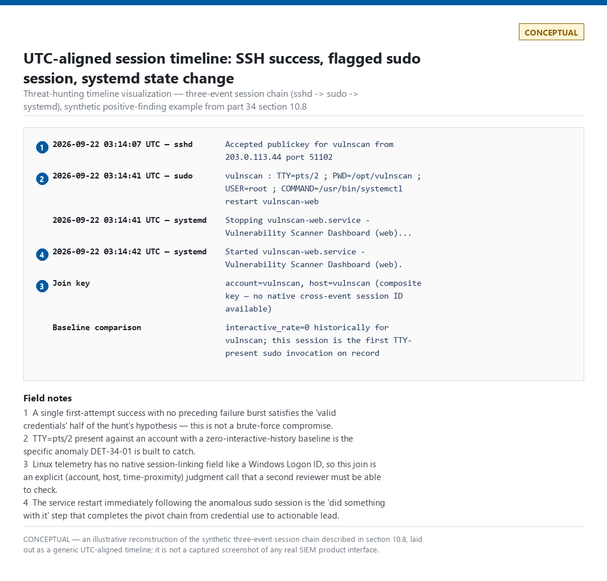
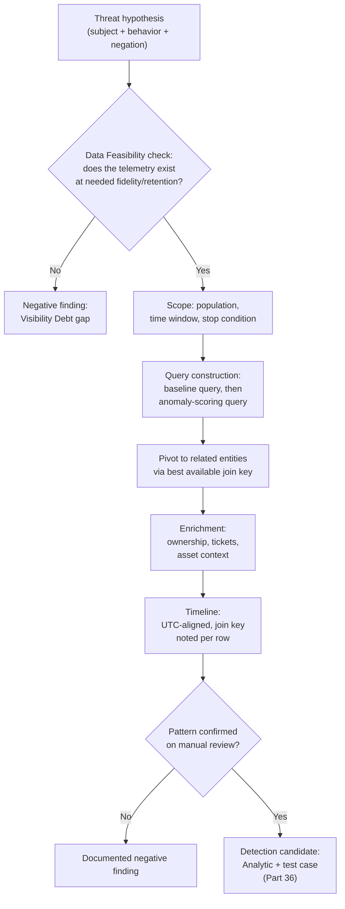

# Part 34 — Threat Hunting Fundamentals

## Why this part exists

**[CONCEPT]** Every other part in this book so far builds standing capability: a detection rule that runs continuously, evaluating telemetry against fixed logic whether or not anyone is watching. A **Hunt** is the opposite shape of work — a time-boxed, human-led investigation into a behavior that has no reliable standing detection, run against real telemetry in the absence of any fired alert (see `TERMINOLOGY.md` § Hunt). This part is where the book's methodology for that discipline gets defined, once, so Parts 35 (Hunt Types) and 36 (Hunt to Detection) can build on it without re-explaining hypothesis formation, scoping, or the pivot/enrichment/timeline mechanics from scratch.

The core discipline problem a hunt solves is the one named in Part 12's DET-12-03 callout and Part 1's coverage discussion: standing detections are built on assumptions — a failure burst precedes a successful takeover, a service account never gets an interactive session — and an attacker who satisfies none of those assumptions produces zero alerts while doing real damage. A hunt is the mechanism for going looking for that gap deliberately, on a schedule, rather than waiting for a red-team exercise or an incident post-mortem to find it after the fact.

This part also defines, in practice, the tactical Hunter's Note voice used from here through the rest of the book — the aside a working hunter would actually say out loud, not a textbook description of hunting theory.

Scope: hypothesis formation, telemetry requirements and Data Feasibility, scoping, query construction, pivoting, enrichment, timeline building, reaching a conclusion, and converting a hunt into a detection candidate — worked end to end against one running example: an attacker with valid credentials using unusual remote-administration methods. This part does not cover the taxonomy of hunt types (IOC-based, TTP-based, anomaly-based, and so on — Part 35) or the deeper pattern-discovery-to-deployed-analytic pipeline (Part 36); it covers the methodology every hunt type and every conversion path runs on top of.

---

## 1. What makes a hunt a hunt, not an alert queue

**[CONCEPT]** A Detection Rule runs continuously and produces an Alert when its logic matches; a hunt runs once, for a bounded period, against a specific hypothesis, and produces either a documented negative finding or a new detection candidate — never both an alert queue and a hunt backlog confused for the same thing. Three properties distinguish a hunt from ordinary alert triage:

- **It starts from a hypothesis, not a fired alert.** Nothing has matched anything yet. The hunter is asking whether something *would* match if it existed, not disposing of something that already fired.
- **It is time-boxed.** A hunt has a defined start and end — a day, a week, a sprint — not an open-ended "keep looking." An unbounded hunt is indistinguishable from a part-time detection-engineering backlog with no deliverable.
- **It must end in an artifact.** Per the Hunt definition in `TERMINOLOGY.md`, the two acceptable endings are a documented negative finding that names the coverage gap it exposed, or a new detection candidate. "Nothing found, moving on" with no write-up is not an acceptable ending — it's the same as never having run the hunt, except now nobody can tell the difference.

**[THREAT HUNTER]** None of this makes hunting mysterious or unstructured. It's a methodology with the same rigor as building a detection rule, aimed at a different target: instead of "does this logic fire correctly on live telemetry," the question is "does this behavior exist in telemetry we already have, and if so, what does it look like." The rest of this part walks that methodology stage by stage.

---

## 2. Forming a threat hypothesis

**[THREAT HUNTER]** A Threat Hypothesis is a specific, falsifiable statement about adversary behavior, written down before any query runs — a subject, a behavior, and an implied negation (`TERMINOLOGY.md` § Threat Hypothesis). "Let's look at unusual sudo activity" is a topic. It has no pass/fail condition, no defined population, and no way to know when the hunt is done. "Accounts scoped to a single automated function should not produce an interactive sudo session, and any account that does deserves review" is a hypothesis — it names the subject (automation-scoped accounts), the behavior (an interactive sudo session), and the negation (should not happen), and it fails cleanly the moment a matching session is found or the search window closes with none.

Three tests separate a real hypothesis from a topic:

1. **Does it name a subject?** Not "attackers" in the abstract — a specific population: an account type, a host role, a network segment.
2. **Does it name a behavior with an implied negation?** Not "does something suspicious" — a concrete action, plus the reason it shouldn't happen for that subject.
3. **Can it fail?** If every possible query result would be interpreted as confirming the hypothesis, it isn't one — it's a foregone conclusion looking for supporting evidence.

> **Detection Autopsy — "alert on any interactive sudo session by a service or automation account"**
>
> **The rule:** Fires whenever a sudo invocation carries a real controlling terminal (a `pts/N` value for an SSH/terminal-emulator session, or a bare `ttyN` — no slash — for a physical console session) in the `TTY` field, and the invoking or target account is tagged as a service/automation identity.
>
> **Why it shipped:** The underlying intuition is correct — a pure-automation account really shouldn't need a human sitting at a terminal to run `sudo` on its behalf — and "TTY field is populated" is a one-line filter, cheap to write and easy to justify in a design review.
>
> **How it failed:** Legitimate break-glass maintenance, CI/CD deploy pipelines that SSH in through a bastion and run a scripted `sudo` command from an operator's own interactive session, and on-call engineers troubleshooting a stuck service all produce exactly this signature — a real TTY, a service-tagged account — with no attacker involved. On a fleet with regular manual maintenance windows, this fired dozens of times a month, all benign, and got muted within a quarter.
>
> **The fix:** Compare against a per-account Baseline of historical TTY-presence rate (Part 31) instead of a static "TTY present = bad" filter, and route flagged sessions to a ticket-linked exception path rather than a bare alert — this is the shape DET-34-01 in §10.9 is built around.

This autopsy is the reason the worked hunt in §10 doesn't start from "TTY present" as its query condition — it starts from a baseline deviation, which is a genuinely different (and more defensible) claim.

---

## 3. Telemetry requirements and Data Feasibility

**[ENGINEERING]** Before writing a single query, check whether the telemetry the hypothesis depends on actually exists, at the fidelity and retention needed — this is Data Feasibility (`TERMINOLOGY.md` § Data Feasibility), and skipping it is the single most common reason a "hunt" burns a day producing nothing but a rediscovery that the required field was never logged. For the running example in this part, that means confirming, before scoping anything:

- SSH authentication success events exist with account, source, and timestamp fields, at a retention depth longer than the hunt's intended lookback window.
- `sudo` invocation records exist with invoking user, target user, command, and — critically — the `TTY` field, since that field is this hunt's core signal.
- Enough history exists to build a per-account baseline (Part 31) *before* the window under active investigation, not just within it — a baseline built from the same seven days being hunted isn't a baseline, it's a tautology.

> **Engineering Reality**
> Whether the `TTY` field survives into a queryable log at all depends on how `sudo` itself is configured, not just on whether the host is logging. A `sudoers` policy with `Defaults !syslog` disables syslog output for sudo entirely; some hardened images strip I/O logging to reduce disk writes. The genuine capture in `lab/evidence/ct100-pihole-sudo-invocations.txt` and `lab/evidence/ct104-vulnscan-sudo-invocations.txt` both retain the field — confirmed by direct inspection, not assumed — but a hunter moving this methodology to a different fleet must verify the same thing there before trusting an empty result set as "no interactive sessions" rather than "no sudo logging at all."

If the telemetry doesn't exist, the hunt's first and only deliverable is a Visibility Debt finding — "this behavior cannot currently be hunted or detected because the required field isn't logged" — which is itself a legitimate, valuable negative finding, not a failure to complete the hunt.

---

## 4. Scoping: population, time window, and stop condition

**[THREAT HUNTER]** Scoping answers three questions before the first query runs, and all three should be written down, not decided informally as the hunt proceeds:

- **Population** — which accounts, hosts, or segments does the hypothesis actually apply to? Scoping every account on every host to a hypothesis about automation-tagged accounts wastes the hunt's time-box reviewing accounts the hypothesis was never about.
- **Time window** — how far back does the hunt look, and is that window long enough to both build a defensible baseline and cover the period of concern? A 1-week lookback that includes the baseline-building period inside the same window it's scoring against will always find the window "consistent with itself."
- **Stop condition** — what does "done" look like? Every in-scope session reviewed and classified, or the retention wall reached, or the time-box elapsed — decide which one governs before starting, so the hunt has a defined end instead of trailing off.

For the running example: population is every account tagged service/automation on the two Linux hosts this book has real telemetry for (CT100, CT104); time window is the longest lookback the available retention actually supports, split into a baseline-build period and a scoring period; stop condition is every flagged session reviewed to a disposition, or retention exhausted, whichever comes first.

---

## 5. Query construction: from hypothesis to a first query

**[THREAT HUNTER]** The first query a hunt runs is almost never the query that finds anything — it's the query that establishes the baseline the second query scores against. Trying to write one clever query that does both at once is a common early mistake; splitting baseline-construction from anomaly-scoring into two separate steps makes each one easier to reason about and easier to defend later.

The following illustrative Splunk SPL builds the baseline step: for every (account, host) pair, what fraction of historical `sudo` invocations carried a real TTY, and how many distinct commands did that account run. This targets an index of Linux `sudo` log lines already parsed into named fields (`user`, `dest`, `tty`, `command`) — a raw `auth.log`/`journalctl` line is unstructured key=value text (see the real excerpts in §10.4), so this assumes the field extraction Part 5 covers has already happened.

CONCEPTUAL SAMPLE — illustrative SPL, field names invented for teaching; verify against your own sourcetype's actual extracted field names before running.

```spl
index=linux_auth sourcetype="linux:sudo" earliest=-60d@d latest=-7d@d
| eval is_interactive=if(match(tty, "^(pts/|tty)"), 1, 0)
| stats
    count as total_invocations,
    sum(is_interactive) as interactive_invocations,
    dc(command) as distinct_commands
    by user, dest
| eval interactive_rate=round(interactive_invocations / total_invocations, 3)
| outputlookup account_sudo_baseline.csv
```

Its main limitation: a 53-day baseline window (day −60 to day −7) is only as good as the assumption that legitimate rare manual maintenance already happened at least once inside it — an account whose only legitimate interactive use happens quarterly will look identical to a genuinely automation-only account here, and that gap is exactly what the What Would Change My Mind box in §10.9 calls out.

---

## 6. Pivoting from one lead to the next entity

**[THREAT HUNTER]** Pivoting means moving from one flagged entity or event to the next related one — the account to its source host, the session to the process it launched, the timestamp to what else happened in the same window — using whatever field actually ties the two together. The quality of a pivot depends entirely on the quality of the join key available, and that's the first thing to check, not assume.

> **Blind Spot**
> Windows gives a hunter a single field — Logon ID — that stitches one authentication session to everything that happened under it, across event types. A bare `auth.log`/`journalctl` capture on Linux gives no equivalent by default: an `sshd` success event and the `sudo` invocations that followed it in the same session share no common session identifier unless auditd is running with a ruleset that populates the `ses` (session ID) field, or unless the hunter falls back to a weaker composite key — (account, host, narrow time window) — and accepts the risk of mis-joining two genuinely different sessions that happen to overlap. Check which case you're in before trusting a pivot's join as precise.

> **Hunter's Note**
> When you're stuck with the weaker composite key, don't trust a PID match across a reboot. `journalctl` groups entries by boot session — the real capture in `lab/evidence/ct100-pihole-sudo-invocations.txt` shows a literal `-- Boot 0f503d6614c64cebacbe41e49aba0346 --` marker splitting two sudo invocations that are otherwise adjacent in the file. Pull that marker (or auditd's own boot ID) before treating a PID as a stable identifier; PIDs recycle within a boot and mean nothing across one.

For the running example, the pivot chain runs: flagged interactive `sudo` session → the SSH authentication event immediately preceding it on the same account and host (was it a valid-credential success with no preceding failure burst, or does it not even satisfy that half of the hypothesis?) → any process, file, or systemd state change in the minutes after the session, on the theory that an attacker using a stolen credential to get interactive access usually does something with it.

---

## 7. Enrichment: turning an anomaly into an actionable lead

**[THREAT HUNTER]** Enrichment attaches context from outside the core telemetry — asset criticality, account ownership, ticket history, threat-intel reputation of a source IP — to a flagged event so an analyst or hunter can act on it without a separate manual lookup for every hit (`TERMINOLOGY.md` § Enrichment names this as this part's own methodology stage). A bare "account X ran an interactive sudo session outside its baseline" is a fact; "account X, owned by the platform team, last reviewed 2026-06-01, with no open maintenance ticket for this window" is a lead someone can triage in under a minute.

> **Hunter's Note**
> Enrich before you build the timeline, not after. Pulling the account's owner and its CMDB/ticketing history costs thirty seconds and routinely resolves half of what looked like an anomaly — a documented one-time maintenance window, an on-call engineer's legitimate emergency fix — before you spend the next hour reconstructing a full session timeline for something that was never suspicious to begin with.

For the running example, the enrichment step pulls: the flagged account's owner and stated purpose from whatever asset/identity inventory exists; whether an open change ticket covers the flagged window; the source IP's internal/external status and, if internal, its DHCP-lease-resolved hostname (the same enrichment step that turned a bare `192.168.1.126` into a known lab device in Part 3's Figure 3.2 and Part 12's Figure 12.1 — the identical technique applies here to any flagged source).

---

## 8. Building a timeline

**[THREAT HUNTER]** A timeline is the ordered reconstruction of everything relevant that happened across every telemetry source touched by the pivot chain, aligned to a single clock. This is where Part 7's time-layer problems and Part 30's Entity Resolution problems both surface at once: events from `sshd`, `sudo`, and `systemd` on the same host usually share a clock but not a shared entity key, and events spanning a DST boundary or a host with drifted local time can silently misorder relative to each other if timestamps are compared as local strings instead of normalized UTC instants.

Build the timeline left to right in true UTC time, one row per event, with the entity-resolution key used to join it noted explicitly next to each row — not left implicit — so a second reviewer can check the join rather than trust it.


**Figure — SIEM hunting workbench timeline for this scenario.** *CONCEPTUAL — illustrative field breakdown; not a captured screenshot.* Illustrates a timeline visualization for this exact scenario — SSH success, flagged sudo session, and systemd state change plotted on one aligned axis — as a stand-in for a real SIEM hunting-workbench UI, since this book's home lab has none deployed and only the raw log sources cited throughout this part. Supports the timeline-construction claim above with a rendered example instead of the tabular description used in §10.7.

---

## 9. Reaching a conclusion: negative finding or detection candidate

**[THREAT HUNTER]** Every hunt ends one of two ways, and both are legitimate:

1. **A documented negative finding** — the hypothesis was tested against real telemetry over the scoped window and population, and nothing matched. The write-up names exactly what was searched, what population and window it covered, and what telemetry gaps (if any) limit confidence in the result. This is the artifact that lets the next hunter — or the same hunter in six months — skip re-deriving what's already been checked.
2. **A new detection candidate** — a pattern was found, confirmed real (or plausibly real) on manual review, and is specific and repeatable enough to become an Analytic. §10.9 and Part 36 cover the conversion mechanics.

> **Hunter's Note**
> A hunt that ends "found nothing, closing it out" with no write-up is indistinguishable, a year later, from a hunt that was never run — and someone will burn another day re-running it from zero, having no way to know it was already covered. The five minutes it takes to write down what you searched and what you didn't have telemetry for is the entire point of the exercise being a hunt and not just idle looking.

---

## 10. Worked hunt: HUNT-34-01 — valid credentials, unusual remote administration

**[THREAT HUNTER]** This section runs the full methodology above, stage by stage, against the scenario named at the top of this part: an attacker holding valid, already-compromised credentials using remote-administration methods inconsistent with how those credentials are normally used. It is seeded directly by the blind spot Part 12 names in its DET-12-03 discussion: an attacker who already holds a correct, stolen credential succeeds on the first authentication attempt, produces zero preceding failures, and is completely invisible to every failure-correlation or brute-force rule built in that part. This hunt goes looking for that exact attacker by a different signal — not the authentication event itself, but what happens with the access afterward.

### 10.1 Threat hypothesis

**Threat Hypothesis (HUNT-34-01):** An account that authenticates via SSH with a valid credential — a successful logon with no preceding failure burst — and is scoped to a single automated function should not subsequently run an interactive `sudo` session (a session attached to a real controlling terminal, spanning commands that vary from that account's established automation pattern). Any account that does is either a legitimate, ticket-linked manual intervention or an attacker operating through that account's valid, already-compromised credential.

### 10.2 Data Feasibility check

Confirmed against this book's own lab evidence before scoping anything further: `lab/evidence/ct104-vulnscan-ssh-failed-logins-btmp.txt` confirms SSH authentication events (via `lastb`/`btmp`) are retained with account, source, and timestamp; `lab/evidence/ct100-pihole-sudo-invocations.txt` and `lab/evidence/ct104-vulnscan-sudo-invocations.txt` confirm `sudo` logging on both hosts carries the `TTY` field where a terminal is actually attached (present as `TTY=pts/1` on one host's genuine capture) and omits it where none is (absent entirely on the other host's genuine scripted-invocation capture) — the exact field-level signal this hypothesis depends on. Both fields exist at usable fidelity; the hunt proceeds.

### 10.3 Scoping

Population: accounts on CT100 ("pihole") and CT104 ("vulnscan") tagged service/automation in this lab's own inventory — `pihole` on CT100 (the gravity-list-update service account) and `vulnscan` on CT104 (the platform's own health-check/monitoring identity). Time window: the full retained history in each host's own `auth.log`/`journalctl` buffer at capture time, split conceptually into a baseline-build period and a most-recent-7-day scoring period. Stop condition: every flagged session reviewed to a disposition, or the retained window exhausted — reached, in this case, when the full captured evidence set was reviewed end to end.

### 10.4 Query construction and the real baseline shape

The two genuine captures already cited across Parts 3, 5, and 7 are the exact baseline contrast this hunt's first query is built to detect programmatically. Read side by side:

**Figure 34.1 (FIG-34-01) — Interactive vs. scripted `sudo` invocation, the field-level baseline signal.** *REAL LAB EXAMPLE.* The same pair of genuine captures first introduced as Figure 3.1 in Part 3, reused here because it is the exact shape this hunt's baseline query scores against. `lab/evidence/ct100-pihole-sudo-invocations.txt` shows root invoking `sudo` with `TTY=pts/1` present — a real interactive terminal, consistent with a human administrator directly managing CT100. `lab/evidence/ct104-vulnscan-sudo-invocations.txt` shows root invoking `sudo` on behalf of the `vulnscan` account with no `TTY` field at all, at a roughly hourly cadence, running one of two fixed `sqlite3` health-check queries each time (an error-count check and, less frequently, an intel-metadata lookup) — the canonical shape of a scheduled, non-interactive automation with a small, repeating command set, not a single invariant command. Captured 2026-09-15 from genuine pre-existing `auth.log`/`journalctl` data on both hosts.

The illustrative query in §5 encodes exactly this: `pihole`-style accounts (any historical TTY presence) baseline as `interactive_rate > 0`; `vulnscan`-style accounts (zero historical TTY presence across every sampled invocation) baseline as `interactive_rate = 0`. The scoring query for the most recent seven days then looks specifically for the second group producing a TTY-present invocation it has never produced before:

CONCEPTUAL SAMPLE — illustrative SPL, continues directly from the baseline query in §5.

```spl
index=linux_auth sourcetype="linux:sudo" earliest=-7d
| eval is_interactive=if(match(tty, "^(pts/|tty)"), 1, 0)
| where is_interactive=1
| lookup account_sudo_baseline.csv user dest OUTPUT interactive_rate
| where interactive_rate=0 OR isnull(interactive_rate)
| eval match_reason=case(isnull(interactive_rate), "no_baseline_history", interactive_rate=0, "zero_interactive_baseline")
```

The `match_reason` field is what lets the two cases named in the paragraph below get routed differently downstream — a single `where` clause finding both is fine for discovery, but an analyst or downstream rule acting on the output needs the distinction made explicit in the data, not left as something to remember from the query logic.

An `interactive_rate` of exactly zero means every historical invocation this account has ever produced, across the full baseline window, was non-interactive — the `vulnscan` shape in Figure 34.1. A null `interactive_rate` means the account has no baseline history at all — new, or never previously observed running `sudo`, which is its own separate finding worth flagging regardless of this specific hypothesis.

> **Engineering Reality**
> "Automation never allocates a TTY" is a property of how the `vulnscan` health-check script happens to invoke `sudo`, not a guarantee of the `sudo`/SSH stack itself. A `sudoers` policy with `Defaults requiretty` — still a real setting on some RHEL/CIS-hardened estates — forces every sudo invocation, scripted or not, to run under an allocated TTY or fail outright. On a host configured that way, every automation account's `interactive_rate` converges toward 1, not 0, and the zero-baseline signal this hunt and DET-34-01 both depend on stops discriminating anything. Check the actual `requiretty`/`use_pty` settings on any fleet before assuming CT100/CT104's baseline shape transfers.

### 10.5 What the "valid credentials" half of the hypothesis requires

**Figure 34.2 (FIG-34-02) — The failure-burst shape this hunt's target must *not* show.** *REAL LAB EXAMPLE.* The same genuine `btmp` capture already cited in Parts 1, 3, 7, and 12 (`lab/evidence/ct104-vulnscan-ssh-failed-logins-btmp.txt`), showing dozens of failed `admin`/`root` SSH attempts from a single source (`192.168.1.126`, a real internal device) within a roughly 15-minute span on 2026-09-14. Reused here as the negative-space definition of "valid credentials": the hypothesis in §10.1 specifically targets a session with *no* comparable burst preceding it on the flagged account. Any flagged interactive session that *does* have a matching failure burst immediately before it belongs to DET-12-02/DET-12-03's coverage instead, and should be routed there rather than treated as a novel finding here.

For every session flagged by the query in §10.4, the pivot in §10.6 checks this condition directly: pull the SSH authentication events for the same account and host in the hour preceding the flagged `sudo` session, and confirm there is no failure burst of the shape in Figure 34.2. A flagged session with a clean, single, first-attempt success satisfies the "valid credentials" half of the hypothesis; a flagged session preceded by a burst does not, and gets reclassified.

### 10.6 Pivoting and enrichment

Each session that survives both filters — TTY-present against a zero-interactive-rate baseline, and no preceding failure burst — gets pivoted forward to the same host's `systemd` journal for the following hour, on the theory that an attacker using freshly obtained interactive access to an administrative account often does something with it: restarts a service, installs or modifies a unit, or opens a new listener.

**Figure 34.3 (FIG-34-03) — Real `systemd` state-change shape used for the post-session pivot.** *REAL LAB EXAMPLE.* The same genuine `journalctl -u vulnscan-web` capture already cited in Parts 3 and 11 (`lab/evidence/ct104-vulnscan-web-systemd-state-changes.txt`), showing the canonical `Stopping → Deactivated successfully → Stopped → Starting → Started` sequence for `vulnscan-web.service` across several restarts on 2026-09-09 and 2026-09-10. In this book's real evidence, these restarts are ordinary developer-driven redeploys, unrelated in time to any session flagged by §10.4's query against the same capture window — there is no genuine anomalous correlation in this dataset. The figure is included to show the pivot's mechanics — what a service-state-change join against a flagged session actually looks like in real log output — not to claim a real intrusion occurred.

Enrichment for any surviving flagged session runs the same three checks named in §7 against this lab's own evidence: whatever ownership record this lab's inventory has for the account, whether the flagged window overlaps a known, ticketed maintenance action, and whether the source IP of the preceding SSH success resolves to a known internal device via the DHCP lease table (as in Figure 34.2's captioning) or is external.

### 10.7 Timeline

For each surviving session, the timeline is built as a single UTC-aligned table with four columns: timestamp, source (which log), event, and the join key used to place it in this session's chain. The join key column matters specifically because of the Blind Spot named in §6 — without a native session-linking field, every row's placement in the chain is an explicit (account, host, time-proximity) judgment call, not a guaranteed-correct join, and writing the key down lets a second reviewer check it.

### 10.8 Conclusion

Applying this hunt's methodology against this book's actual captured lab evidence produces a **documented negative finding**: across the full retained window on both CT100 and CT104, no session satisfies all three conditions at once — TTY-present against a zero-baseline account, no preceding failure burst, and a subsequent service-state change with no linked maintenance ticket. The `pihole` account's interactive sudo use has a nonzero historical baseline (it is a legitimately, regularly hand-administered box), so it never enters the TTY-present-against-zero-baseline pool at all; the `vulnscan` account's sudo invocations in the captured window are uniformly non-interactive and match its established automation pattern exactly. This is a negative finding, not proof of absence — the captured retention window is short relative to a realistic quarterly-maintenance cadence, a limitation the What Would Change My Mind box below states explicitly.

To show what a positive finding would actually look like — since this part's job is to teach the pattern, not just report that this run of it found nothing — the block below is a constructed, clearly synthetic example of the exact session shape this hunt is built to catch. No such session exists in this book's real evidence set.

CONCEPTUAL SAMPLE — synthetic illustrative log excerpt, not a real capture, constructed to show the target pattern.

```text
Sep 22 03:14:07 vulnscan sshd[8841]: Accepted publickey for vulnscan from 203.0.113.44 port 51102
Sep 22 03:14:41 vulnscan sudo[8852]:  vulnscan : TTY=pts/2 ; PWD=/opt/vulnscan ; USER=root ; COMMAND=/usr/bin/systemctl restart vulnscan-web
Sep 22 03:14:41 vulnscan systemd[1]: Stopping vulnscan-web.service - Vulnerability Scanner Dashboard (web)...
Sep 22 03:14:42 vulnscan systemd[1]: Started vulnscan-web.service - Vulnerability Scanner Dashboard (web).
```

Against the baseline in Figure 34.1, this session fails on every count that matters: `vulnscan` has never once produced a `TTY=pts/N` invocation historically (`interactive_rate = 0`); the preceding SSH event is a single first-attempt success with no failure burst, matching the "valid credentials" half of the hypothesis exactly; and it is immediately followed by a service restart with no linked maintenance ticket. This is the shape DET-34-01 below is built to catch.

> **What Would Change My Mind**
> This hunt's negative finding assumes a baseline window long enough to have already observed every genuinely legitimate manual intervention an automation account might need — including rare, infrequent ones. If an audit of this lab's actual operational history showed that `vulnscan` or `pihole` receive legitimate manual maintenance on a cadence longer than the retained baseline window (a quarterly patch cycle, for instance, that simply hasn't occurred yet inside the captured data), the "any TTY-present session against a zero-history baseline is worth investigating" framing would misclassify that legitimate, infrequent case as novel every time, and DET-34-01 would need a ticket-linked exception path from day one rather than as a later tuning fix.

### 10.9 From hunt to detection candidate: DET-34-01

**[DETECTION ENGINEER]** The hunt's methodology — baseline deviation, not a static field check — becomes the detection candidate directly, correcting the exact failure named in the Detection Autopsy in §2. Because this logic depends on a maintained per-account baseline table (Part 31) rather than a self-contained match condition, it is written here as a Sigma-style rule with an explicit note on that dependency, since a bare Sigma rule with no external lookup cannot fully express the baseline-comparison step on its own.

CONCEPTUAL SAMPLE — illustrative Sigma rule; the `sudo_baseline_lookup` correlation step is a placeholder for whatever baseline-table join mechanism your platform actually supports (a scheduled-search lookup in Splunk, a materialized table join in Sentinel/KQL, or an external enrichment step) — verify against your own platform's correlation capabilities before deploying.

```yaml
title: Interactive sudo session on an account with a zero-interactive-history baseline
id: 8f2a1c40-34aa-4e1d-9d3a-7b0c2f34a301
status: experimental
description: >
  Detects a sudo invocation carrying a real controlling terminal (TTY present)
  from an account whose maintained baseline shows no prior interactive sudo
  use, following an SSH authentication success with no preceding failure
  burst on the same account. Requires an external per-account baseline table
  (see Part 31) refreshed on a schedule shorter than the review cadence for
  flagged accounts.
logsource:
  product: linux
  service: sudo
detection:
  sudo_event:
    tty|startswith:
      - 'pts/'
      - 'tty'
  baseline_check:
    sudo_baseline_lookup.interactive_rate: 0
  no_recent_ssh_failure_burst:
    # Figure 34.2's burst is dozens of attempts in minutes, not "zero failures
    # ever" — a hard equality to 0 here would silently miss a real
    # valid-credential walk-in on any account that also had one unrelated,
    # incidental failed login (a mistyped password on a prior attempt) in the
    # same hour, which is not the burst pattern this half of the hypothesis
    # is checking for. Threshold below the burst size instead.
    ssh_failure_count_1h|lte: 4
  condition: sudo_event and baseline_check and no_recent_ssh_failure_burst
falsepositives:
  - Legitimate, infrequent manual maintenance or break-glass access on an
    automation account with no ticket-linkage exception configured.
  - A new account with no baseline history yet (null rather than zero
    interactive_rate) — route these to a separate "new account, no baseline"
    finding rather than this rule.
level: medium
```

**MITRE:** T1078 (Valid Accounts), T1078.003 (Valid Accounts: Local Accounts), T1021.004 (Remote Services: SSH), T1548.003 (Abuse Elevation Control Mechanism: Sudo and Sudo Caching)

This rule has no accumulated Disposition history in this book's own environment — it hasn't been run against live telemetry outside the Detection Test below, only reasoned through against the two real baseline shapes in Figure 34.1. Treat "medium" `level` and the false-positive drivers below as a starting estimate, not a measured rate: on any fleet where automation accounts routinely get emergency manual attention (a small SOC without a mature break-glass ticketing habit, in particular), expect this to fire more than once a week per handful of automation accounts until the ticket-linkage exception path is actually wired up, not left as a documented intent.

> **Blind Spot**
> This entire baseline-deviation approach depends on the attacker's sudo invocation actually allocating a TTY. An attacker already holding the compromised account's SSH credential can run `ssh account@host "sudo cat /etc/shadow"` — or any other single remote command — without requesting a pseudo-terminal; the resulting sudo log line carries no `TTY=` field at all, identical in shape to the `vulnscan`-style scripted-automation pattern this hunt treats as clean. Neither the query in §10.4 nor this rule's `sudo_event` condition distinguishes that from legitimate automation — an attacker who simply omits `-t` evades DET-34-01 completely, not partially. Closing this requires baselining the invoked command itself, not just TTY presence, which is outside this rule's scope (see Part 36).

> **False Positive Trap**
> A legitimate, one-off emergency manual intervention on an automation account — an on-call engineer fixing a stuck job by hand at 3 AM — produces exactly this signature with zero attacker involvement. The fix is not to raise the bar until it stops firing (that just raises the bar for a real attacker too); it's a ticket-linkage exception, per Part 31's exception-handling pattern: if a flagged session's timestamp falls inside an open, approved change ticket's window, suppress it and log the suppression against that ticket rather than tuning the underlying baseline logic.

> **Detection Test**
> **Setup:** A test account on a lab host with an established multi-week `sudo` history containing zero TTY-present invocations (matching the `vulnscan`-shape baseline in Figure 34.1).
> **Action:** SSH into the host interactively with a valid credential for that account, then run `sudo whoami` from that interactive session.
> **Expected result:** A `sudo` log entry with `TTY=pts/N` populated for an account whose baseline lookup returns `interactive_rate = 0`, immediately following an SSH success event with no preceding failure burst — DET-34-01 should fire. A naive static "TTY present" rule (§2's autopsied version) would also fire here; that's expected, not proof the baseline-aware version adds nothing. Re-run the same test on an account with a genuinely mixed interactive/scripted baseline and confirm DET-34-01 does *not* fire — the naive version would have fired anyway, incorrectly.

The following diagram summarizes the full methodology this section walked through, end to end, as the general shape every hunt in this book follows.






**Figure 34.4 (FIG-34-04) — The threat-hunting methodology, hypothesis to artifact.** *CONCEPTUAL.* Illustrates the general stage sequence walked through in §§1–10 of this part, not a capture of any specific team's own hunting-platform workflow. Every stage box corresponds to a numbered section above; the two terminal states (negative finding, detection candidate) are the only acceptable endings per the Hunt definition in `TERMINOLOGY.md`. Rendered above; the Mermaid source above is the tracked version of record.

---

## 11. Managing a hunting program

**[SOC MANAGEMENT]** Everything in §§1–10 is unit-level methodology: how one hunter runs one hunt against one hypothesis. Running a program is a separate decision — how many hunts get time-boxed per quarter, who owns the backlog of hypotheses nobody has tested yet, and how the program's output gets reported upward without rewarding the wrong behavior.

> **SOC Management View**
> A hunting program that only reports "hunts run" and "findings" as headline numbers will look unproductive in exactly the quarters it's working best — a mature detection stack with strong standing coverage should produce mostly negative findings, because the easy gaps have already been converted into rules in prior cycles. Measure a hunting program on hypothesis quality, telemetry-gap discovery, and time-to-write-up for negative findings, not raw hit count; a program that only gets credit for confirmed positive findings will quietly start writing looser hypotheses that are more likely to "find" something, which defeats the discipline this part spent ten sections building.

---

## 12. Coverage summary

**[DETECTION ENGINEER]** The table below maps this part's named hunt and detection candidate to their MITRE ATT&CK techniques, for use in a program-level coverage matrix (Part 41).

| ID | Behavior | MITRE |
|---|---|---|
| `HUNT-34-01` | Valid-credential SSH access followed by baseline-deviating interactive remote administration | T1078 (Valid Accounts), T1078.003 (Valid Accounts: Local Accounts), T1021.004 (Remote Services: SSH) |
| `DET-34-01` | Interactive sudo session on an account with a zero-interactive-history baseline | T1078 (Valid Accounts), T1078.003 (Valid Accounts: Local Accounts), T1021.004 (Remote Services: SSH), T1548.003 (Abuse Elevation Control Mechanism: Sudo and Sudo Caching) |

Part 35 takes the single methodology built here and runs it across seven distinct hunt-type shapes, each with its own worked mini-example; Part 36 expands §10.9's hunt-to-detection conversion into the full pattern-discovery-to-deployed-analytic pipeline, closing the loop back into Part 22's detection-as-code process.
