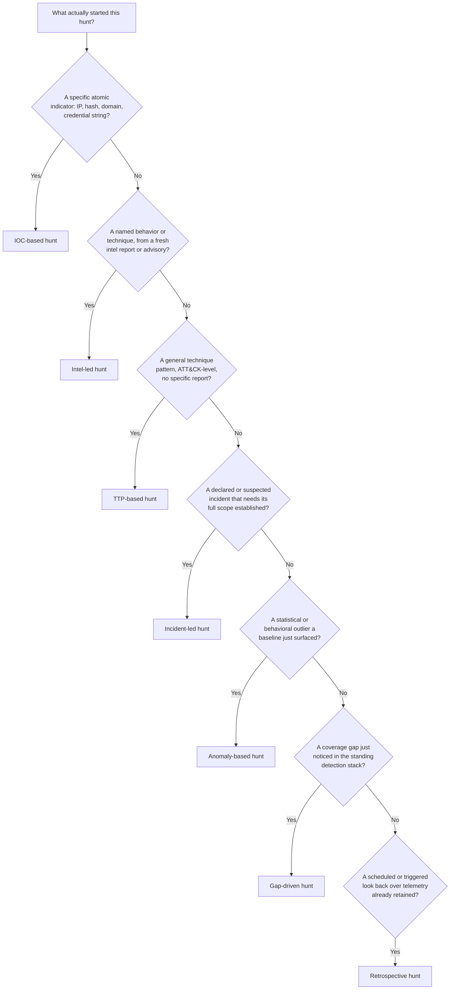

# Part 35 — Hunt Types

## Why this part exists

Part 34 built the mechanics every `Hunt` (TERMINOLOGY.md § Hunt) shares regardless of what starts it: form a `Threat Hypothesis`, check `Data Feasibility`, scope, query, pivot, enrich, build a timeline, conclude. This part does not repeat that skeleton. It covers the seven things that actually differ from hunt to hunt — what triggers the hunt in the first place, and what a defensible ending looks like for that specific trigger. Misclassifying a hunt's type is a real, recurring failure mode: a hunter who treats an incident-led scoping exercise like an open-ended anomaly hunt will burn a time box chasing statistical curiosities instead of answering "how far did this go," and a hunter who treats a fresh intel report like a generic TTP hunt will waste hours rebuilding a hypothesis the intel report already handed them for free.

The seven types below — IOC-based, TTP-based, anomaly-based, intel-led, incident-led, gap-driven, and retrospective — are not mutually exclusive labels a hunt log has to pick exactly one of. A single hunt can start intel-led and finish by discovering a gap. What matters is naming the trigger honestly at the start, because the trigger determines the hypothesis, the hypothesis determines what telemetry is in scope, and the scope determines whether the hunt can even be run against what's actually retained. Part 36 picks up from every one of this part's worked examples and covers the mechanics of turning a hunt's finding into a deployed `Detection Rule` — this part only carries each hunt as far as its own honest ending: a documented negative finding or a detection candidate, never a silent "nothing found, moving on."

Every worked example below runs against real telemetry captured from this book's own home-lab honeynet, DNS resolver, and vulnerability-scanner platform — genuine internet-scanner traffic hitting decoy infrastructure, not invented log lines. Where the underlying evidence is a short captured sample rather than the full retained dataset, the text says so explicitly rather than implying broader coverage than what was actually pulled.

---

## 1. Trigger, not technique, is what defines a hunt type

**[CONCEPT]** Every hunt in this part runs the same Part 34 loop underneath. What changes across the seven types is the answer to one question: what specific thing, external to the hunter's own curiosity, justified spending a time box on this instead of something else? Figure 35.1 sorts the seven types by that trigger question, in the rough order a hunter should actually ask them when a hunt doesn't yet have a label.






**FIG-35-01 — Classifying a hunt by its trigger.** *CONCEPTUAL.* Illustrates the decision order this part uses to organize the seven hunt types — a hunter asking "why am I looking at this right now" rather than a formal taxonomy any single hunt log is required to encode. Not a captured artifact from any hunt-management tool; a structural sketch of this chapter's own organization.

> **Hunter's Note**
> Don't fight to fit a real hunt into exactly one box. The honest label is usually "started as X, turned into Y" — write both down in the hunt log's own hypothesis section rather than picking whichever label makes the writeup read cleaner. A hunt that started IOC-based and ended gap-driven is more useful to the next hunter than one that got silently reclassified after the fact.

---

## 2. IOC-based hunts

### 2.1 What an IOC-based hunt is

**[CONCEPT]** An IOC-based hunt starts from a specific, low-durability artifact — an IP address, a file hash, a domain, a credential string — and asks one question: has this exact indicator touched anything else in the environment? This is the least durable hunt trigger in this part (see TERMINOLOGY.md § IOC vs. IOA vs. TTP), because the indicator stops working the moment an attacker changes it, but it is also the cheapest to run and the easiest to justify: someone already has the artifact in hand, usually from a fired alert, a threat-intel feed, or — as in the worked example below — a hunter's own honeynet noticing the same pattern repeat.

### 2.2 Worked example: HUNT-35-01 — a reused default-credential string across the honeynet's SSH decoy

**[THREAT HUNTER]** The honeynet's SSH decoy (`hp-platform`, running on CT103) logs every credential an inbound connection presents, real or fake, into a `ssh_events` table. A hunter reviewing a routine sample of that table noticed the same source, `176.53.159.196`, presenting the identical credential pair `support`/`support` seven separate times across 2 days, alongside two IP neighbors — `176.53.159.197` and `176.53.159.198` — presenting the same pair once each.

**Threat Hypothesis:** "A source in the `176.53.159.0/24` block is running a sustained, low-and-slow default-credential sweep against this decoy using the fixed pair `support`/`support`, and if it's sweeping this decoy it is plausibly sweeping every other internet-facing SSH listener this environment exposes, not just this one."

**FIG-35-02 — Repeated `support`/`support` credential attempts from `176.53.159.196`.** *REAL LAB EXAMPLE.* Captured from CT103's `ssh_events` table via `sqlite3` against `/opt/hp-platform/data/honeypot.db`, 2026-09-15; underlying events span 2026-09-08 through 2026-09-10. A representative excerpt:

```text
id     ts                           src_ip           dst_port  username  password
10104  2026-09-10T09:07:30.815869Z  176.53.159.196             support   support
10097  2026-09-10T08:21:03.680909Z  176.53.159.196             support   support
10085  2026-09-10T07:44:57.880172Z  176.53.159.196             support   support
10064  2026-09-10T05:56:15.117525Z  176.53.159.196             support   support
10018  2026-09-10T00:48:16.373231Z  176.53.159.198             support   support
10013  2026-09-10T00:37:04.648823Z  176.53.159.197             support   support
```

The hunt's actual query pivots on the indicator — the source IP block, not the credential string alone, since `admin`/`admin` is common enough across unrelated sources to be a separate, weaker signal — and checks whether the same sources appear against the honeynet's other listener, the HTTP decoy's `http_events` table:

```sql
-- Run directly against /opt/hp-platform/data/honeypot.db (sqlite3), the same
-- collector database the ssh_events and http_events captures above come from.
SELECT 'ssh' AS listener, ts, src_ip, username AS actor_field, password AS secondary_field
FROM ssh_events
WHERE src_ip IN ('176.53.159.196', '176.53.159.197', '176.53.159.198')
UNION ALL
SELECT 'http' AS listener, ts, src_ip, credential_user AS actor_field, credential_pass AS secondary_field
FROM http_events
WHERE src_ip IN ('176.53.159.196', '176.53.159.197', '176.53.159.198')
ORDER BY ts;
```

This query only sees the two decoy listeners `hp-platform` itself collects; it cannot see whether the same three addresses touched any production system with its own, differently-shaped auth logs, which is the honest limit of any single-source IOC pivot. Against the sample actually captured for this chapter, the union returns rows only from `ssh_events` — no matching rows from `http_events` in the retained sample. That is itself the hunt's finding, not an inconclusive result: **HUNT-35-01 ends in a documented negative finding** — this specific /24 is, as far as this decoy pair's retained telemetry shows, an SSH-only default-credential sweeper, not a broader web-and-SSH scanner. The finding gets written down with that scope caveat attached, so the next hunter who pivots on the same block doesn't have to re-derive it.

> **Detection Autopsy — the naive single-IP indicator match**
>
> **The rule:** A blocklist entry adds `176.53.159.196` as a known-bad source and alerts on any connection from that exact address.
>
> **Why it shipped:** The IP is the artifact the hunter actually had in hand from the first alert, and a single-value exact match is the fastest thing to write and the easiest to explain in a 5-minute standup.
>
> **How it failed:** The same actor rotates through `.196`, `.197`, and `.198` within the same /24 over the same 48 hours — almost certainly the same hosting block or the same botnet operator cycling source addresses, a trivial evasion against an exact-match rule. The rule silently stops firing the moment the actor's next connection comes from `.197` instead, and "zero matches" looks identical to "the actor stopped," which it didn't.
>
> **The fix:** Match the containing CIDR block (or the ASN, where available) rather than the single address, and treat the rotation itself — several adjacent addresses in a short window presenting the same credential pair — as a second, more durable signal than any one of the addresses alone.

> **Hunter's Note**
> Before writing an IOC-list entry from a hunt finding, always check the neighboring /24 for the same behavior in the same window. It costs one extra query and it's the single most common way a "known-bad IP" list goes stale within days instead of weeks. On a Windows estate, the equivalent reused-credential signal shows up as repeated Event ID 4625 (An account failed to log on) entries against the same target account from a rotating source-address cluster — same pivot logic, different log source.

---

## 3. TTP-based hunts

### 3.1 What a TTP-based hunt is

**[CONCEPT]** A TTP-based hunt starts from a general, durable behavior pattern — a `TTP` (TERMINOLOGY.md § IOC vs. IOA vs. TTP) — rather than any single artifact, and asks whether that pattern is present anywhere in the environment right now, independent of which specific source is currently exhibiting it. The hunt survives an attacker rotating infrastructure precisely because it never depended on the infrastructure in the first place. It differs from an intel-led hunt (§5) in that nothing external prompted it — no fresh advisory, no disclosure — the hunter is generalizing from a pattern already sitting in retained telemetry.

### 3.2 Worked example: HUNT-35-02 — protocol-confusion probing against the decoy fleet

**[THREAT HUNTER]** Reviewing the access log for CT113 — a deliberately vulnerable, internet-exposed phpMyAdmin decoy — a hunter noticed one source, `3.131.220.121`, issue a normal `GET /`, then follow up minutes later with raw bytes matching a TLS `ClientHello` record (`\x16\x03\x01...`) sent to the plain-HTTP port. That's not a malformed HTTP request; it's a scanner checking whether the port secretly speaks TLS, a generic internet-scanning behavior independent of this specific source or this specific decoy.

**Threat Hypothesis:** "Mass internet scanners routinely probe web-facing hosts for protocol mismatch — TLS bytes on an HTTP port, or a connection that never completes a valid HTTP request at all — and this behavior pattern, not any one scanner's IP, is durable enough to hunt for across every internet-facing decoy this environment runs, not just CT113."

**FIG-35-03 — Protocol-confusion probe against CT113's HTTP decoy.** *REAL LAB EXAMPLE.* Captured from CT113's Apache `access.log`, 2026-09-15; the same source also issues a normal `GET /` with a scanning-service referer (`visionheight.com/scan`) before the TLS-byte probe:

```text
3.131.220.121 - - [15/Sep/2026:07:37:54 +0000] "GET / HTTP/1.1" 200 1110 "-" "visionheight.com/scan Mozilla/5.0 ..."
3.131.220.121 - - [15/Sep/2026:07:41:19 +0000] "\x16\x03\x01\x01" 400 539 "-" "-"
3.131.220.121 - - [15/Sep/2026:07:42:44 +0000] "\x16\x03\x01" 400 539 "-" "-"
```

Generalizing the pattern across the decoy fleet means normalizing two structurally different sources first — CT113's Apache text log and CT103's `http_events` sqlite table — into one queryable shape, which is exactly the kind of cross-source join Part 6 (Normalization) covers in depth and this part assumes rather than re-derives. The following Splunk SPL illustrates the shape that normalized query would take.

CONCEPTUAL SAMPLE — assumes CT103's `http_events` table and CT113's Apache `access.log` have both been ingested into one normalized index with common fields `src_ip`, `dest_host`, `raw_request_line`, `status_code`; no such index currently exists for these two decoys.

```spl
index=web_decoys
| where (status_code=400 AND raw_request_line="") OR match(raw_request_line, "^\\x16\\x03")
| stats count, values(dest_host) as decoys_hit by src_ip
| where count >= 2
```

This is illustrative, not a query run against a live index — no such normalized index currently exists for this lab's two decoys, which is itself the honest gap this hunt surfaces. Run informally against the two raw sources separately instead, the pattern (empty/malformed request line, or raw non-ASCII bytes on a port serving plaintext HTTP) shows up from more than one unrelated source across both decoys in the captured windows, which is consistent with the hypothesis: this is generic internet-wide scanner behavior, not a single actor's fingerprint. Mapped to MITRE ATT&CK, this behavior sits under T1595 (Active Scanning) — protocol/port probing prior to any exploitation attempt, tactic TA0043 (Reconnaissance).

**HUNT-35-02 ends in a documented negative finding plus one process gap**: no single actor stands out as targeted reconnaissance against this environment specifically — every source observed fits the profile of an internet-wide mass scanner — but the hunt also surfaces that this environment has no single place to run this query, because the two decoys' logs were never normalized together. That gap becomes an engineering backlog item, not a detection candidate.

---

## 4. Anomaly-based hunts

### 4.1 What an anomaly-based hunt is

**[CONCEPT]** An anomaly-based hunt starts from a statistical or behavioral outlier a `Baseline` (TERMINOLOGY.md § Baseline) surfaces, with no prior claim about what — if anything — is actually wrong. The entire value of this hunt type is that it doesn't require a hypothesis about attacker behavior specifically; it requires only a defensible notion of "expected," and a willingness to conclude "expected, just unusual" as often as "worth escalating." An anomaly-based hunt that always concludes malicious is a hunt type being used to launder confirmation bias, not a real baseline.

### 4.2 Worked example: HUNT-35-03 — a device that shouldn't know `deloitte.com` exists

**[THREAT HUNTER]** A tail of this home lab's Pi-hole DNS query log showed one internal client, `192.168.1.169`, issuing repeated `A`/`AAAA` queries for `mykulprint.atrapa.deloitte.com`, `mykulprint.lan`, and `mykulprint.deloitte.com` — all resolving `NXDOMAIN` — interleaved every 2 seconds across the captured window. This home network has no relationship to Deloitte; the client's hostname pattern (`mykulprint...`) suggests a networked printer.

**Threat Hypothesis:** "A device on this network is querying domain names that don't belong to it, at a frequency and pattern that doesn't match ordinary browsing or update-check traffic, and that deviation from this client's expected DNS behavior is worth understanding regardless of whether it turns out malicious."

**FIG-35-04 — Repeated NXDOMAIN queries against an unrelated enterprise domain from `192.168.1.169`.** *REAL LAB EXAMPLE.* Captured from CT100's `pihole.log`, 2026-09-15 08:32–08:33 UTC:

```text
Sep 15 08:32:47 dnsmasq[2221]: query[A] mykulprint.atrapa.deloitte.com from 192.168.1.169
Sep 15 08:32:47 dnsmasq[2221]: cached mykulprint.atrapa.deloitte.com is NXDOMAIN
Sep 15 08:32:47 dnsmasq[2221]: query[AAAA] mykulprint.lan from 192.168.1.169
Sep 15 08:32:47 dnsmasq[2221]: config mykulprint.lan is NXDOMAIN
Sep 15 08:32:47 dnsmasq[2221]: query[A] mykulprint.deloitte.com from 192.168.1.169
Sep 15 08:32:47 dnsmasq[2221]: cached mykulprint.deloitte.com is NXDOMAIN
```

**[DETECTION ENGINEER]** An anomaly hunt over DNS baselines two properties per client: query *volume* against its own historical norm, and *domain rarity* — has this client, or any client on this network, ever successfully resolved this second-level domain before. The following Sentinel KQL illustrates the shape of that query.

CONCEPTUAL SAMPLE — assumes the pihole/dnsmasq text log has been parsed into a table `dns_queries(ts, client_ip, query_name, query_type, resolution)`.

```kql
dns_queries
| where client_ip == "192.168.1.169"
| summarize QueryCount = count(), DistinctNames = dcount(query_name) by bin(ts, 1h)
| where QueryCount > 20
```

No such parsed table exists yet for this lab's DNS log — it is a flat text file, not a queryable index — so this query is illustrative of the shape a real anomaly hunt over this data would take once Part 5's parsing work exists, not something run as-is.

**HUNT-35-03's actual ending is a documented negative finding, held at low confidence.** The pattern's most likely explanation is mundane: consumer printers frequently ship with a hardcoded or DHCP-inherited DNS search-suffix list from a prior network or factory default, and a printer retrying its own hostname against several suffixes every few seconds while failing to resolve any of them is a known, benign misconfiguration pattern, not beaconing. Nothing in this capture shows a successful resolution, a follow-on connection, or any payload — only failed lookups. The hunt does not close the door entirely, because "benign printer misconfiguration" and "malware querying a domain that happens to resolve NXDOMAIN right now" produce visually identical DNS traffic from the outside.

> **What Would Change My Mind**
> This finding assumes the query pattern is a static, hardcoded suffix list a printer keeps retrying forever. If a follow-up capture showed the queried domain changing over time, or showed the same client successfully resolving one of these names and then opening an outbound connection to the resolved address, that would overturn the "benign misconfiguration" conclusion entirely and reclassify this from an anomaly-hunt negative finding into a live incident-led hunt (§6).

> **Hunter's Note**
> Resist the urge to look up whether `atrapa.deloitte.com` is a real Deloitte subdomain before you've established what the client actually is. Identify the device first (DHCP lease, MAC vendor prefix, physical inventory) — in this case straightforward, since `mykulprint` is a strong hostname hint — and only then decide whether the destination domain's real-world identity matters to the disposition.

---

## 5. Intel-led hunts

### 5.1 What an intel-led hunt is

**[CONCEPT]** An intel-led hunt starts from an external report — a vendor advisory, a CVE disclosure, an ISAC bulletin, a public writeup of active exploitation — and asks whether the specific, now-public technique or indicator the report describes has already touched this environment. Unlike a TTP-based hunt, the hypothesis isn't generalized from internal observation; it's handed to the hunter almost fully formed by the report itself, which makes the hunt cheap to scope but only as good as the report's own accuracy and the hunter's own currency on what's actually being disclosed.

### 5.2 Worked example: HUNT-35-04 — sweeping for a disclosed router RCE path

**[THREAT HUNTER]** CVE-2018-10561 (authentication bypass) and CVE-2018-10562 (command injection), chained together against GPON-based home routers via a request to the path `/GponForm/diag_Form`, is a years-old disclosure that remains under mass, opportunistic internet scanning today — exactly the kind of "old CVE, still worth checking your own logs for" report an intel-led hunt exists to act on.

**Threat Hypothesis:** "If mass scanners are still actively probing `/GponForm/diag_Form` across the internet, that path should show up somewhere in this environment's own web-facing decoy traffic, and finding it confirms the disclosure is still live rather than historical."

```sql
-- Run directly against /opt/hp-platform/data/honeypot.db (sqlite3).
SELECT id, ts, src_ip, method, path, credential_user, credential_pass, user_agent
FROM http_events
WHERE path LIKE '/GponForm/%'
ORDER BY ts;
```

**FIG-35-05 — A live `/GponForm/diag_Form` probe against the honeynet's HTTP decoy.** *REAL LAB EXAMPLE.* Result of the query above, run against CT103's `http_events` table, 2026-09-15; underlying event captured 2026-09-09:

```text
id   ts                                src_ip          method  path                  credential_user  credential_pass
694  2026-09-09T21:36:41.187764+00:00  223.123.43.135  POST    /GponForm/diag_Form    Hello, World
```

**HUNT-35-04 ends in a confirmed positive finding**, promoted directly to a detection candidate rather than a negative writeup: a real, if opportunistic, exploit-shaped request against the exact disclosed path, from a source presenting no credential the honeypot itself supplied — meaning this is inbound scanning traffic, not a replay of anything the decoy leaked. Mapped to MITRE ATT&CK, this is **T1190 (Exploit Public-Facing Application)** — the same tag the honeynet's own correlation logic independently assigned to this session (see HUNT-35-05 below), which cross-validates the hunt's manual conclusion against the platform's automated one rather than relying on either alone.

> **Engineering Reality**
> An intel-led hunt is only as good as how far back the report's disclosure date reaches relative to your own retention window. This lab's honeynet retains the full `http_events` history, so a CVE this old — disclosed in 2018 — is still searchable end to end. A production environment with 30- or 90-day retention on web logs would find this specific hunt structurally impossible to run against anything older than its own retention floor — the hunt's real first step, before writing any query, is checking whether the telemetry to answer the question still exists at all.

---

## 6. Incident-led hunts

### 6.1 What an incident-led hunt is

**[CONCEPT]** An incident-led hunt starts from a `Case` or `Incident` (TERMINOLOGY.md § Case, § Incident) already open, or from an automated system's own severity ladder flagging something as worth manual review, and asks the scoping question an incident always raises: what is the full extent of this, beyond the single alert or session that opened it? This is the hunt type most tightly coupled to `Triage` and `Escalation` — it exists to answer "how far did this go," not "is this activity happening anywhere at all," which is the anomaly hunt's job.

### 6.2 Worked example: HUNT-35-05 — scoping a `possible_success` honeynet session

**[ANALYST]** The honeynet's own correlation pipeline (`correlation.py`) tags every attacker session with a status on a five-step ladder — recon, probe, `exploit_attempt`, `possible_success`, `confirmed_postexploit` — where `possible_success` means the platform observed an exploit-shaped request followed by continued activity from the same source, flagged automatically for manual review rather than auto-closed. Source `16.5.0.236` was tagged `possible_success` in the most recent 20-session sample pulled for this book.

**Threat Hypothesis:** "If `16.5.0.236` achieved something against one target in this decoy environment, the same source may have made repeated attempts across the same day, and the full incident scope is larger than the single flagged session that first drew attention to it."

**[THREAT HUNTER]**

```sql
-- Run directly against /opt/hp-platform/data/honeypot.db (sqlite3).
SELECT session_id, source_ip, first_seen, last_seen, target_system, status, mitre_techniques_json
FROM attack_sessions
WHERE source_ip = '16.5.0.236'
ORDER BY first_seen;
```

**FIG-35-06 — Three `possible_success` sessions from the same source across one day.** *REAL LAB EXAMPLE.* Result of the query above, run against CT103's `attack_sessions` table, 2026-09-15; sessions span the same 24-hour window:

```text
session_id                        first_seen             last_seen               target_system  status            mitre_techniques_json
36593979d0ec46cba837ef975a88a78f  2026-09-15T00:18:26Z   2026-09-15T00:18:29Z    10.99.99.10    possible_success  ["T1595","T1046","T1083","T1190"]
a9644f74cc514c2597e40f054f2057b0  2026-09-15T03:25:42Z   2026-09-15T03:25:44Z    10.99.99.10    possible_success  ["T1595","T1046","T1083","T1190"]
d48b795e47c04c6fbb456b17ddd219b9  2026-09-15T06:08:21Z   2026-09-15T06:08:23Z    10.99.99.10    possible_success  ["T1595","T1046","T1083","T1190"]
```

The pivot the hunt actually needed — recurrence across time, not just a single flagged row — confirms this source hit the same target three separate times over roughly 6 hours, always tagged the same way, never expanding to the other decoy targets (`10.99.99.11`, `10.99.99.12`) visible elsewhere in the same table. **MITRE:** T1595 (Active Scanning), T1046 (Network Service Discovery), T1083 (File and Directory Discovery), T1190 (Exploit Public-Facing Application) — carried forward directly from the platform's own tagging rather than re-derived, since the correlation pipeline already had access to the full session detail this hunt is summarizing.

**HUNT-35-05 ends with a scoped, closed finding, not a detection candidate**: the incident's blast radius is confirmed limited to one target, one source, one technique chain, recurring but not escalating in sophistication across three attempts. That scope statement — not a new rule — is the deliverable an incident-led hunt owes the case file.

> **SOC Management View**
> An automated `possible_success` tag is a routing decision, not a verdict — Escalation (TERMINOLOGY.md § Escalation) to manual review means a human looked, not that impact is confirmed. Budgeting analyst time against every `possible_success` tag from internet-facing decoy infrastructure the same way you'd budget it for a `possible_success` tag against production infrastructure is a mismatch — decoy hits confirm the platform's detection logic works; production hits confirm compromise. Keep the two review queues, and their staffing priority, separate.

---

## 7. Gap-driven hunts

### 7.1 What a gap-driven hunt is

**[CONCEPT]** A gap-driven hunt starts from neither an alert nor an artifact but from a hunter or engineer noticing — usually while reviewing existing rule logic, not while looking at live telemetry — that the standing detection stack has a specific, describable blind spot, and asking whether that blind spot has actually been walked through in practice. This is the hunt type most likely to produce a genuinely new detection candidate, because the entire premise is "nothing would have caught this if it happened," which is exactly the condition Part 34's `Hunt` definition (TERMINOLOGY.md § Hunt) describes.

### 7.2 Worked example: HUNT-35-06 — the failed-login rule that never sees a protocol-negotiation reject

**[DETECTION ENGINEER]** A standard "brute-force SSH" rule — the kind built from repeated `/var/log/btmp` failed-password entries, the same pattern this book's own DET-01-01/DET-03-01 examples use — only evaluates events that reach the authentication stage at all. A connection rejected during the SSH key-exchange or protocol-version negotiation, *before* any username or password is ever offered, produces no `btmp` entry and therefore never reaches that rule's logic. Reviewing that dependency is what surfaced the gap: this class of pre-authentication rejection is structurally invisible to every failed-login detection built on `btmp`, Event ID 4625 (An account failed to log on) as discussed in §2.2, or an equivalent post-negotiation auth-failure source.

**Threat Hypothesis:** "If pre-authentication protocol/algorithm rejection is invisible to the standing failed-login detection, that blind spot is not theoretical — it should already be visible in this environment's raw `sshd` service logs, which log the rejection itself even though no downstream auth-failure record is ever created."

**[THREAT HUNTER]**

**FIG-35-07 — SSH pre-authentication negotiation failures invisible to a `btmp`-based brute-force rule.** *REAL LAB EXAMPLE.* Captured from CT108's `sshd` systemd journal, 2026-09-15; the source, `192.168.1.96`, is this lab's own internal vulnerability scanner performing legacy-algorithm enumeration — a real, if internal, example of the exact log signature the gap describes:

```text
Sep 10 16:21:03 honeynet-edge sshd[539]: Unable to negotiate with 192.168.1.96 port 43036: no matching key exchange method found. Their offer: diffie-hellman-group1-sha1 [preauth]
Sep 10 16:21:03 honeynet-edge sshd[541]: Unable to negotiate with 192.168.1.96 port 43058: no matching host key type found. Their offer: ssh-rsa [preauth]
Sep 10 16:21:03 honeynet-edge sshd[540]: error: Protocol major versions differ: 2 vs. 1
Sep 10 16:21:04 honeynet-edge sshd[550]: Connection closed by 192.168.1.96 port 43082 [preauth]
```

None of these four lines, nor any of the surrounding cluster, appears in `lastb`/`btmp` output for the same host and window — confirmed directly against this book's own captured evidence, where the `btmp`-based failed-login sample (a different host, CT104) shows only post-authentication `admin`/`root` rejections and no `[preauth]` negotiation failures at all, because that class of event structurally cannot appear there. **HUNT-35-06 ends in a new detection candidate**, DET-35-01, closing the gap it found rather than merely documenting it. The Sigma rule below targets any Linux host's `sshd` syslog/journal output (OpenSSH, any recent version that logs negotiation failures in the message text shown):

```yaml
title: SSH pre-authentication negotiation failure (atomic event)
id: 3a7c9e02-1f44-4b6e-9c05-2d8e6a4f7b91
status: test
description: >
  A single SSH connection rejected during protocol/algorithm negotiation before
  any authentication attempt is offered -- the class of pre-auth rejection
  invisible to a btmp/4625-based failed-login rule (see HUNT-35-06). This atomic
  match is deliberately low-severity and is not, by itself, the burst detection;
  see the note below the block for the required aggregation layer.
logsource:
  product: linux
  service: sshd
detection:
  selection:
    Message|contains:
      - 'Unable to negotiate'
      - 'kex_exchange_identification: Connection closed'
      - 'Protocol major versions differ'
      - 'Did not receive identification string from'
  condition: selection
falsepositives:
  - Internal vulnerability scanners performing legacy-cipher/protocol enumeration
  - Load balancers or monitoring probes that never complete a banner exchange
  - Mass internet port scanners (masscan/zmap-style connect-and-disconnect scans) that open the
    TCP port and close it without ever sending an SSH client identification string
level: low
tags:
  - attack.t1595
```

This YAML, as written, matches on every individual negotiation-rejection line — it depends on `Message` carrying one of the four literal substrings above, and nothing else. It is deliberately an atomic building block, not the burst detection its name implies: a real deployment needs the same count-over-time correlation logic Part 24 §4 demonstrated for `btmp`-style bursts (group by source address, 2-minute window, threshold ≥5) layered on top before this fires as an alert, because a single negotiation failure is common and mostly noise — five or more from one source in a short window is the actual signal. Without that aggregation layer, expect this to match dozens of times a day on any network with even one internal vulnerability scanner doing cipher/protocol enumeration (CT108's own capture, source `192.168.1.96`, is that exact false-positive driver, not a hypothetical one), and far more than that once the fourth substring is counted, since "connect and go silent" is the single most common thing a mass internet scanner does to any open port — which is why `level` is set to `low` rather than `medium` or `high`: this rule is meant to feed a downstream count, not page an analyst on its own. It also depends on the log actually containing the literal English-language OpenSSH strings shown; a non-English locale, a non-OpenSSH SSH daemon, or a log pipeline that truncates or re-encodes the `Message` field produces a silent false negative — zero matches, indistinguishable from "no negotiation failures occurred" — with no error raised, the same failure shape TERMINOLOGY.md describes under Schema Drift. The rule also stops short of matching every line in FIG-35-07 on purpose: the fourth captured line, `Connection closed by 192.168.1.96 port 43082 [preauth]`, is a generic preauth-disconnect message OpenSSH also logs for reasons that have nothing to do with algorithm negotiation — a client that completes the version banner exchange and then simply hangs up, which covers everything from `ssh-keyscan` to a health-check probe to an impatient legitimate user. Matching on that string alone would fold ordinary, low-signal disconnects into the same bucket as an actual negotiation failure with no way to tell them apart after the fact, so it's left out; the coverage gap this creates is that a scanner or attacker who completes a clean banner exchange and disconnects before offering any algorithm at all is invisible to DET-35-01 too, not just to the original `btmp` rule.

> **Blind Spot**
> A `btmp`-/4625-based failed-login detection tells you nothing about connections rejected before authentication starts. An attacker (or a scanner) fingerprinting which key-exchange algorithms, host-key types, and protocol versions a server accepts — reconnaissance that can precede a targeted downgrade or exploitation attempt — leaves zero trace in the exact log source most SSH brute-force rules are built on. DET-35-01 exists specifically to close this, not to replace the original rule.

> **Detection Test**
> **Setup:** A Linux host running `sshd`, reachable from a second test host.
> **Action:** `ssh -oKexAlgorithms=diffie-hellman-group1-sha1 -oHostKeyAlgorithms=ssh-rsa testhost` repeated five or more times within 2 minutes.
> **Expected result:** Five or more `sshd` journal/syslog entries containing `Unable to negotiate` or `no matching key exchange method found`, all from the test host's source IP, and zero corresponding entries in `/var/log/btmp` or its platform equivalent for the same window.

---

## 8. Retrospective hunts

### 8.1 What a retrospective hunt is

**[CONCEPT]** A retrospective hunt looks backward through telemetry already retained — triggered by a scheduled cadence, a new correlation capability coming online, or a freshly discovered exposure — to answer whether something already happened before anyone knew to look for it. Its defining constraint, more than any other hunt type in this part, is retention: a retrospective hunt can only be as deep as the data already sitting in storage, and the most common outcome of a retrospective hunt is discovering that the telemetry needed to answer the question was never being kept at all.

### 8.2 Worked example: HUNT-35-07 — dwell time against a router nobody was watching

**[THREAT HUNTER]** A weekly scan run from this lab's vulnerability-scanner platform (CT104) found the network's own gateway router, `192.168.1.254`, exposing nine open ports with 4,432 CVE candidate matches — by far the largest candidate count of any host on the network, and enough to rate the platform's own risk score at 100/6 (Critical).

**FIG-35-08 — A large CVE-candidate surface discovered on the network's own gateway router.** *REAL LAB EXAMPLE.* Captured from CT104's `scanner.log`, weekly scan run 10, 2026-09-13:

```text
2026-09-13 03:10:48,784 INFO [vulnscan.scanning.cve] vulners pass for 192.168.1.254: 4430 CVE candidates across 9 ports
2026-09-13 03:10:53,600 INFO [vulnscan.pipeline] Scan complete for 192.168.1.254 (asset 13): 9 open ports, 4432 findings, risk=100/6 (Critical)
```

**Threat Hypothesis:** "This exposure did not appear the week the scanner found it — an aging router's firmware and open-port surface accumulates gradually — so retained telemetry from before this scan should show whether the router was already being probed or contacted in a way consistent with someone else having found the same surface first."

**[SOC MANAGEMENT]** This is where the hunt runs into its real constraint. The router is production infrastructure, not honeynet decoy infrastructure — none of this lab's honeynet telemetry (CT103, CT108, CT113) covers it, because those collectors are deliberately scoped to sacrificial segments, not the actual gateway. The only retained sources that touch this device at all are the Pi-hole DNS/DHCP logs on CT100, which show DHCP lease activity for other clients on the network but no query or connection activity *from or to* `192.168.1.254` itself in the captured window — the router isn't a DNS client of Pi-hole, and Pi-hole doesn't log connections through the router, only DNS resolutions and lease renewals it directly handles.

**HUNT-35-07 ends in a documented negative finding driven by an honest visibility gap, not a scoped answer**: the question "how long has this router been exposed and was it already found" cannot be answered from anything currently retained, which is `Visibility Debt` (TERMINOLOGY.md § Visibility Debt) in its purest form — a `Telemetry Coverage` gap on a device that matters, discovered only because a hunt tried to use data that turned out not to exist. The hunt's deliverable is not a finding about the router; it's a backlog item to onboard perimeter/router-adjacent logging (connection logs, or at minimum an external port-scan history) before this exact question can be asked again with any hope of an answer.

> **Hunter's Note**
> Before promising a retrospective hunt can answer a dwell-time question, check what's actually retained for the asset in question — not what's retained for the environment in general. A honeynet with rich 90-day retention says nothing about coverage for a production router that was never wired into the same collection pipeline. This check takes 5 minutes and saves a hunt from burning its whole time box discovering, at the end, that the answer was always going to be "we don't know" for a structural reason, not an investigative one.

---

## 9. Choosing and combining hunt types

**[SOC MANAGEMENT]** The table below summarizes what triggered each worked example in this part and how it actually ended — a useful check for any hunt program deciding where to spend a quarter's hunting capacity: a program that only ever runs IOC-based hunts is optimizing for the least durable trigger type available, while a program that never runs gap-driven hunts is relying entirely on outside parties (intel feeds, incident responders) to tell it where its own blind spots are.

| Hunt Type | Started By | This Hunt's Ending | MITRE (If Cited) |
|---|---|---|---|
| IOC-based | A reused artifact (credential string, IP) already in hand | Documented negative finding, IOC-list scope correction | T1110.001 (Password Guessing) |
| TTP-based | A generalized behavior pattern noticed in retained logs | Documented negative finding plus a normalization gap | T1595 (Active Scanning) |
| Anomaly-based | A baseline deviation with no prior malicious hypothesis | Documented negative finding, held at low confidence | — (no clean mapping; see §4.2) |
| Intel-led | A public disclosure naming a specific technique/path | Confirmed positive finding, promoted to detection candidate | T1190 (Exploit Public-Facing Application) |
| Incident-led | An already-open case needing its full scope established | Scoped, closed finding — no new detection needed | T1595 (Active Scanning), T1046 (Network Service Discovery), T1083 (File and Directory Discovery), T1190 (Exploit Public-Facing Application) |
| Gap-driven | A noticed blind spot in existing detection logic | New detection candidate (DET-35-01) | T1595 (Active Scanning) |
| Retrospective | A scheduled or triggered look back over retained history | Documented negative finding driven by a visibility gap | — (unresolved; see §8.2) |

None of the seven types is inherently more valuable than the others — they answer different questions under different constraints, and a mature hunt program runs all seven on some cadence rather than defaulting to whichever is cheapest to staff. Part 36 picks up from here: DET-35-01 (§7.2) is this part's one worked example of a hunt finding converted into a deployed rule, and the pattern-discovery-to-deployed-analytic pipeline that conversion actually follows is that part's full scope, not this one's.
