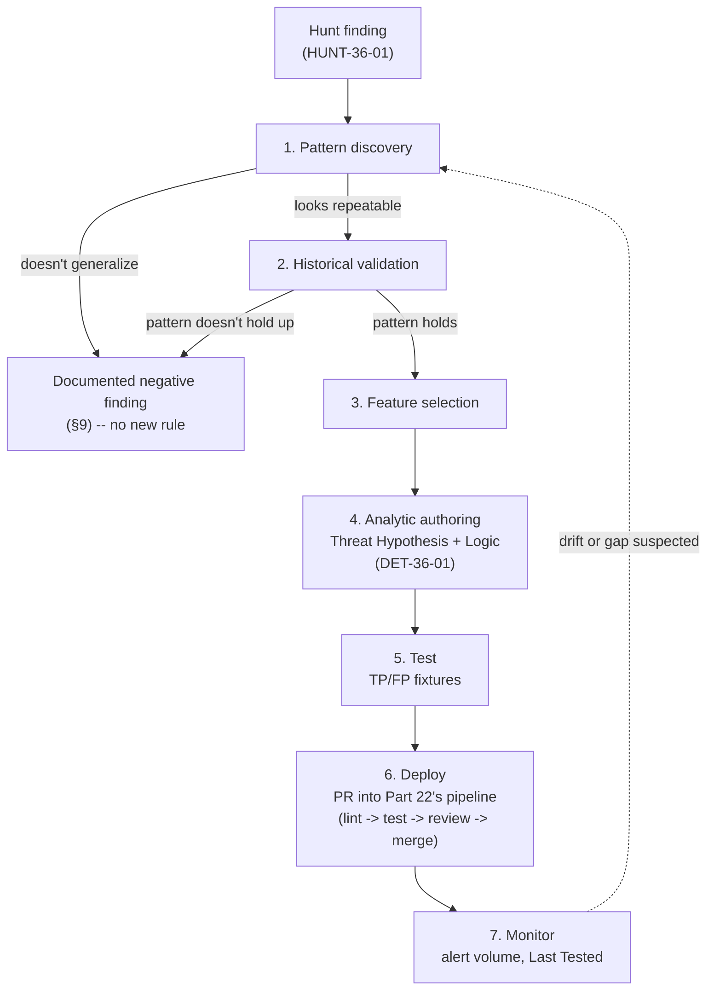

# Part 36 — Hunt to Detection

## Why this part exists

**[CONCEPT]** TERMINOLOGY.md's definition of a Hunt is deliberately strict about how it ends: a Hunt "must end in either a documented negative finding (naming the coverage gap it exposed) or a new detection candidate — never in 'nothing found, moving on' with no artifact left behind." Parts 34 and 35 own how a hunter gets to that ending — hypothesis formation, scoping, pivoting, and the seven hunt types that produce it. This part owns what happens the moment a hunt lands on the second outcome: a pattern the hunter believes is real, repeatable, and worth standing detection against.

That moment is where most hunt programs quietly lose the value they just created. A hunter's validated finding lives in a notebook, a saved search, or a Slack thread with a screenshot of the query that worked — evidence that something real was found, not a deployable capability that keeps finding it. The gap between "I found this by hand, once, against telemetry I already had loaded" and "this is now a Detection Rule with an owner, a test suite, and a place in the pipeline from Part 22" is not automatic, and skipping it is how a genuinely good catch never gets caught again the next time the same behavior recurs.

This part walks that gap as a fixed sequence — pattern discovery, historical validation, feature selection, analytic authoring, test, deploy, monitor — using one real, fully worked case study threaded through every stage: a hunt against this book's own honeynet telemetry that becomes DET-36-01. It closes by naming the opposite case explicitly, because the strict TERMINOLOGY.md definition of Hunt cuts both ways: a hunt that correctly concludes no new rule is warranted is not a failure, and this part is equally about not building the standing detection as it is about building it.

**Scope boundary:** this part does not re-teach hunt methodology (Part 34) or the hunt-type taxonomy (Part 35) — it assumes a hunt has already produced a candidate finding and picks up from there. It does not re-teach the CI/CD mechanics, branching model, or separation-of-duties gate a Detection Rule passes through once it's a pull request — that is entirely Part 22's, and this part deliberately reuses that pipeline rather than describing a parallel "fast path" for hunt-originated rules. It does not own the exhaustive test-case taxonomy for detection testing in general — that is Part 37 — though §6 below shows the specific fixture-building step that feeds into it. And it does not own query syntax for any one platform beyond the single illustrative example in §5; Parts 23–29 own that in depth.

---

## 1. The handoff problem: a hunt finding is not yet a detection

**[CONCEPT]** A Hunt (TERMINOLOGY.md §2) is manual and time-boxed. A Detection Rule (same section) is automated and continuous, with its own lifecycle distinct from the Analytic it implements. Those are different objects with different properties, and treating a hunt's query as though it were already a detection — because it worked, once, when the hunter ran it — skips every step that makes the difference between the two matter: nobody has checked whether the pattern generalizes past the one session that caught the hunter's eye, nobody has picked the specific fields the rule should key on versus the fields that just happened to be visible in the hunter's ad hoc query, and nobody has written the test fixtures a rule needs before it can pass Part 22's CI gates.

The seven-stage sequence this part uses treats the hunt's output as raw material, not a finished product:

**Figure 36.1 — Hunt-to-detection sequence, with the loop back into Part 22's pipeline.** *CONCEPTUAL.* Illustrates the seven stages a hunt's validated finding passes through before it becomes a standing Detection Rule, and the two points where the sequence can legitimately terminate early — no generalizable pattern (back to hunting), or deploy-and-monitor feeding a later hunt when drift is suspected. This is a process diagram of the intended workflow, not a capture from any specific hunt-management product. Diagram ID `FIG-36-01`.





**[THREAT HUNTER]** Two exit points on that diagram matter as much as the happy path. A finding can legitimately die at stage 1 or stage 2 — the rest of this part, and its worked example, cover the case where it doesn't, but §9 covers the case where it correctly does, because a hunt program that turns every finding into a new standing rule regardless of whether the pattern generalizes is building rule sprawl, not detection coverage.

---

## 2. Pattern discovery: recognizing a detection-worthy finding

**[THREAT HUNTER]** Not every interesting thing a hunter notices is a detection candidate. The discriminator is whether the finding has a *mechanism* — a specific, nameable reason the behavior looks the way it does — rather than being a one-off artifact of the exact query the hunter happened to run. "This IP did something weird" is an observation. "This IP sent one request matching a known exploit path, and every source that has done that in this dataset also kept talking to us afterward, while sources that only scanned never came back" is a mechanism, and it's the difference between a screenshot and a hypothesis.

The worked example for the rest of this part starts here. `lab/evidence/ct103-honeynet-correlated-attack-sessions.txt` is a real capture from this book's own honeynet — CT103's `attack_sessions` table, the honeynet platform's own automated correlation of raw connection events into sessions tagged with genuine MITRE ATT&CK technique IDs and a status field (`recon` → `probe` → `exploit_attempt` → `possible_success` → `confirmed_postexploit`). A hunter reviewing the most recent 20 sessions at `exploit_attempt` severity or higher, on 2026-09-15, notices something the honeynet's own correlation logic already flagged but hadn't been turned into an owned, standing analytic anywhere outside that one platform: every session marked `possible_success` in the capture shares a specific two-part shape — an HTTP request matching an exploit-shaped path, T1190 (Exploit Public-Facing Application), followed by at least one further request or connection from the *same source IP* within a short window afterward. Sessions that stayed at `exploit_attempt` — a single exploit-shaped hit with nothing after it — never got the `possible_success` label.

> **Hunter's Note**
> The honeynet's own severity pipeline already did the hard part here — it's tagging `possible_success` sessions for manual review right now, in a live sqlite table. That's not a coincidence to ignore; a hunter's fastest path to a detection-worthy pattern is very often "what is an existing tool already flagging as interesting that nobody has turned into an owned, tested, version-controlled rule yet," not a search built from scratch. Check what your own tooling already thinks is anomalous before you go looking for something new.

**Threat Hypothesis (draft, stage 1):** *A source IP that sends an HTTP request matching a known exploit-shaped path against an internet-facing honeynet decoy, and then sends at least one further request or connection from the same source within a short follow-up window, is exhibiting post-exploitation-probe behavior distinct from an opportunistic scanner that fires and moves on.*

That's a candidate, not yet a validated finding — TERMINOLOGY.md's definition requires a subject, a behavior, and an implied negation, which this has, but a single day's capture from one honeynet is not yet evidence the pattern generalizes. Stage 2 is where that gets checked.

---

## 3. Historical validation: proving the pattern holds beyond the session that caught your eye

**[THREAT HUNTER]** A hunter re-runs the same shape — exploit-shaped request, then same-source follow-up within a window — retrospectively across the full set of sessions in the capture, not just the one row that first caught attention. The result, visible directly in `lab/evidence/ct103-honeynet-correlated-attack-sessions.txt`: of the 20 most recent sessions at `exploit_attempt` or above, 13 are labeled `possible_success` and seven `exploit_attempt`, and the pattern holds across *distinct* source IPs, not one recurring actor — `16.5.0.236`, `45.156.128.131`, `198.235.24.204`, `198.235.24.179`, `205.210.31.194`, `65.49.1.202`, `198.235.24.116`, `77.90.185.125`, `64.62.156.192`, `64.62.156.200`, and `64.62.156.196` each independently show the two-part shape, while `45.156.128.45`, `64.62.197.234`, `64.62.197.68`, `172.110.223.173`, `65.49.1.206`, `199.45.154.32`, and `199.45.154.189` show only the single exploit-shaped hit with no follow-up and correspondingly stay at `exploit_attempt`. `16.5.0.236` alone recurs three separate times in the window (`06:08`, `03:25`, `00:18`), each time reproducing the same two-part shape independently — the same source coming back and repeating the pattern, not one long session miscounted as three.

That's a real signal: the discriminator (follow-up activity within a window versus none) tracks a labeling decision the honeynet's own correlation logic already makes, independently, across 11 distinct source IPs (13 sessions, since `16.5.0.236` repeats three times) in one day. It is not yet strong evidence the pattern generalizes *beyond this honeynet* — a decoy segment with no legitimate traffic at all is a much easier environment to find this pattern in than a real production edge network, where legitimate crawlers, monitoring tools, and retried client connections routinely produce a first request followed by a second one from the same source.

> **What Would Change My Mind**
> This validation is built from one day of one honeynet's capture, where every single inbound packet is definitionally illegitimate — there's no possibility of confusing a real customer's retry behavior with attacker follow-up, because there are no real customers on this segment. If the same two-part shape, applied against a production internet-facing web tier with genuine user and monitoring traffic, showed a false-positive rate high enough that most `possible_success`-equivalent alerts turned out to be a legitimate crawler or health-check retrying the same path, that would mean the honeynet's discriminator doesn't transfer to a real edge environment without an additional feature — and the feature-selection stage in §4 needs to account for that risk before this ships as DET-36-01, not discover it after.

---

## 4. Feature selection: choosing what the rule actually keys on

**[DETECTION ENGINEER]** The temptation at this stage is to encode exactly what the hunter saw — including details that were true of this specific capture but aren't the actual mechanism. `223.123.43.135`'s POST to `/GponForm/diag_Form` in `lab/evidence/ct103-honeynet-http-events-exploit-probes.txt` is a real, currently-still-scanned-for path associated with a GPON router authentication-bypass RCE (CVE-2018-10561/CVE-2018-10562). A rule that matches only that literal path is a signature for one CVE's exploit path, not an implementation of the hunter's actual hypothesis, and it would miss every other exploit-shaped path the honeynet's own correlation logic already generalizes across (the capture's `mitre_techniques_json` tags T1190 (Exploit Public-Facing Application) broadly, not per-CVE).

The features the finished analytic needs, distilled from what stages 2 and 3 actually validated:

- **Exploit-shaped request classification** — not one literal path, but a category: a request matching a maintained list of known exploit/CVE-associated URI patterns (path traversal shapes, known RCE endpoint paths, injection-shaped query strings) — the same category the honeynet's own `http_events` → `attack_sessions` correlation step already applies, generalized rather than copied path-for-path.
- **Source IP as the entity key** — per Part 30's entity-resolution guidance, the join key that ties the exploit-shaped request to the follow-up activity has to be the one identifier both events reliably share. Source IP is the honeynet's available key; in a production environment behind a CDN or load balancer, the real client IP may only survive in an `X-Forwarded-For`-equivalent header, not the TCP source address the edge sees — a Schema Drift risk worth flagging explicitly in the rule's own `Blind Spots` field (§5) rather than discovering it after deployment.
- **A bounded follow-up window** — the correlation is meaningless without a `Correlation Window` (TERMINOLOGY.md §6); the capture's own `possible_success` sessions show follow-up activity arriving within roughly a minute in most rows and up to several minutes in a couple of the longer ones (`4f078ab0…` runs from `04:43:47` to `04:51:07`), so a window in that range is where the validated evidence actually sits — not an arbitrarily longer window invented to "be safe."
- **A discriminator for "genuinely new activity," not just "any second packet"** — this is the feature that stage 3's caution actually resolves. Counting *any* second connection from the same source would flag a legitimate retry or a persistent monitoring client just as readily as a real attacker; the safer version of the feature counts a second event that is itself not a duplicate of the first request (a different path, method, or destination than the initial exploit-shaped hit).

> **False Positive Trap**
> A source that hits a known exploit-shaped path exactly once and never returns — the majority of rows in `lab/evidence/ct103-honeynet-http-events-exploit-probes.txt`, including opportunistic scanners like the ones probing `/mcp`, `/sse`, and `/GponForm/diag_Form` in that capture — is *not* what this rule should fire on, and the honeynet's own correlation logic already agrees: those stay at `exploit_attempt`, not `possible_success`. The fix isn't a threshold on the exploit-shaped-path match itself (raising that bar just makes the rule miss more real exploit attempts); it's making sure the follow-up-activity discriminator is a required second clause, not an optional enrichment — a rule that fires on the exploit-shaped request alone, with the follow-up treated as a confidence booster rather than a gate, reproduces exactly the "every mass-scanner is an alert" volume problem this whole exercise exists to avoid.

---

## 5. Analytic authoring: from Threat Hypothesis to DET-36-01

**[DETECTION ENGINEER]** The Analytic — the implementation-independent logical statement, per TERMINOLOGY.md §2 — is now specific enough to write down without further hunting:

*A source IP sends a request matching a maintained exploit-shaped-path pattern against an internet-facing host, and the same source IP sends at least one further, non-duplicate request or connection to the same or another internet-facing host within N minutes afterward.*

This part reuses Part 22 §4's metadata standard exactly — a hunt-originated rule fills in every field that standard requires; nothing about having a validated hunt behind it exempts a field.

```yaml
# CONCEPTUAL SAMPLE -- illustrative metadata record and Sigma logic for a rule generalized
# from a real hunt finding; the query has not been validated against a live backend. Field
# names follow a generic normalized web-access/network-flow schema; confirm your own
# pipeline's actual field names (Part 6, Normalisation) before deploying unmodified.

ID: DET-36-01
Name: Exploit-shaped web request followed by non-duplicate follow-up activity from the same source
Version: 1.0.0
Status: tested
Threat Hypothesis: >
  A source IP that sends a request matching a known exploit-shaped path against an
  internet-facing host, and then sends at least one further, non-duplicate request or
  connection from the same source within a short follow-up window, is exhibiting
  post-exploitation-probe behavior distinct from an opportunistic scanner that fires once
  and moves on.
Description: >
  Fires when a source IP's request matches a maintained exploit-shaped-path/pattern list
  (path traversal, known RCE endpoint paths, injection-shaped query strings) against a
  monitored internet-facing host, and the same source IP generates at least one further,
  non-duplicate request or connection to a monitored host within the correlation window.
Risk: Medium-High -- a matched exploit-shaped request with real follow-up activity from the
  same source is meaningfully more concerning than a bare scan, though "follow-up activity"
  alone is not confirmation of a successful exploit.
ATT&CK: T1190 (Exploit Public-Facing Application)
Data Sources:
  - Web/application access logs (internet-facing hosts)
  - Network flow or firewall connection logs (internet-facing hosts)
Required Telemetry: >
  Web access logs must capture full request path and source IP per request; network flow
  or a second web-log entry must be available to detect the follow-up event with the same
  source-IP field populated at comparable fidelity across both.
Required Fields:
  - source_ip
  - request_path
  - request_method
  - destination_host
  - event_time
Logic: >
  Stage 1 selection: request_path matches the maintained exploit-shaped-path pattern list.
  Stage 2 selection: any further request or connection event from the same source_ip,
  to any monitored internet-facing host, within the correlation window, where the second
  event's request_path (or destination port/service, for a flow-log match) differs from
  the stage-1 event -- excluding exact duplicate retransmissions of the same request.
  Condition: stage 1 AND stage 2, joined on source_ip.
Time Window: 10-minute correlation window from the stage-1 event.
Entity: source_ip.
Threshold: One stage-1 match plus one qualifying stage-2 match; no count-based threshold
  beyond that pair.
Normal Behaviour: >
  Per lab/evidence/ct103-honeynet-http-events-exploit-probes.txt, most exploit-shaped-path
  hits in this book's own honeynet capture are single, isolated requests from a scanning
  source that never returns -- the exploit_attempt-only rows in
  lab/evidence/ct103-honeynet-correlated-attack-sessions.txt.
Suspicious Behaviour: >
  Per lab/evidence/ct103-honeynet-correlated-attack-sessions.txt, the possible_success rows
  (e.g. source 16.5.0.236, recurring three times in one capture window) show the exploit-
  shaped hit followed by genuine additional activity from the same source within minutes.
Known FP: >
  A legitimate vulnerability scanner or red-team engagement running an authorized exploit-
  shaped-path check as part of a broader scan will trigger this by design -- exclude known
  scanner source ranges at query time. A retrying client behind a shared NAT/proxy IP that
  legitimately hits an exploit-shaped-looking path once, then makes an unrelated second
  request from the same shared address, is a source of noise this rule cannot fully resolve
  without a better entity key than source IP alone (see Blind Spots). A larger and less
  allowlistable driver on a real internet-facing host: mass internet-wide recon suites
  (masscan/httpx/nuclei-style chains, and the same class of research crawler already visible
  in this capture -- Infrawatch, ModatScanner) routinely fire several *distinct*
  exploit-shaped-path probes against one host from a single source IP within seconds as a
  matter of normal operation, not post-exploitation behavior. That reproduces this rule's
  two-part shape exactly, and the source IPs involved rotate across cloud/VPS ranges too
  fast for a static exclusion list to keep up -- an allowlist tuned against last week's
  scanner ranges misses this week's. Because the illustrative `followup_activity` base rule
  in §5 matches any further request rather than specifically another exploit-shaped one,
  this rule as written cannot distinguish "one exploit hit plus one unrelated request" from
  "one exploit hit plus a second, different exploit hit from the same scan" -- both look
  identical to it. A tighter version of stage 2 that requires the follow-up to *also* match
  the exploit-shaped-path list (a second distinct CVE-path, not just a second request) would
  separate "chained vulnerability-scan sweep" from "exploit attempt followed by unrelated
  activity," at the cost of missing a real attacker whose second action is a plain
  reconnaissance request rather than another exploit attempt -- a tradeoff to make
  deliberately, not by default.
Known FN: >
  An attacker who spaces the follow-up request beyond the correlation window, or who
  switches source IP between the exploit attempt and the follow-up (a different exit node,
  a rotating proxy), produces no correlation match at all -- this rule only sees continuity
  of source IP within a bounded window, not continuity of actor. A second, easily missed
  case: an attacker (or exploit tool) that simply resends the *identical* exploit payload --
  same path, method, and body -- one or more times, which is common behavior for
  unreliable exploit scripts and default retry logic in tools like Metasploit, produces no
  qualifying stage-2 event at all, because the stage-2 selection explicitly excludes exact
  duplicate retransmissions to keep single-request scanners from self-triggering (§4's False
  Positive Trap). The two design goals directly trade off against each other: the same
  exclusion that keeps a one-shot scanner from tripping the rule also makes a persistent,
  single-payload attacker invisible to it. A repeated-identical-request count on its own
  (without requiring non-duplication) is a separate, complementary signal worth tracking if
  this gap matters for a given deployment -- not a fix to this rule's own logic, which is
  deliberately scoped to the non-duplicate case.
Blind Spots: >
  This rule cannot distinguish a genuinely successful exploit from a failed attempt that
  happens to be followed by unrelated activity from the same source; "possible_success" in
  the honeynet's own labeling, and in this rule's alert name, means "worth analyst review,"
  not "confirmed compromise." It also depends on source IP surviving as a reliable entity
  key across both stage-1 and stage-2 events -- behind a CDN or load balancer that doesn't
  forward the real client address at comparable fidelity to both the web log and the flow
  log, this rule silently loses its join key and produces zero alerts rather than an error.
Dependencies: >
  Requires the exploit-shaped-path pattern list to be maintained and kept current -- this
  rule's stage-1 selection is only as good as that list's coverage of currently-scanned
  paths, which drifts as new CVEs are disclosed.
Example Query: See fenced Sigma correlation block below.
Correlation Opportunities: >
  Join on Entity with threat-intel reputation (Part 32) for the source IP to raise
  confidence further, and with any subsequent authentication or admin-panel access attempt
  against the same destination host to escalate priority.
Testing Method: >
  Regression-tested against a true-positive fixture (a synthetic replay of the two-part
  shape) and false-positive fixtures drawn from real single-hit scanner rows in
  lab/evidence/ct103-honeynet-http-events-exploit-probes.txt. See §6 and the Detection Test
  box there.
Expected Volume: >
  On this book's own honeynet capture, roughly two alerts for every three exploit-shaped-path
  hits observed (13 of 20 sessions at exploit_attempt-or-above showed the follow-up
  pattern); expected volume on a real production edge network is untested, and the direction
  of the error is not obviously "lower." Legitimate user retries and monitoring traffic were
  structurally impossible to confuse with attacker follow-up on a honeynet with no real
  traffic at all (see the What Would Change My Mind box in §3), which pushes toward lower
  volume in production -- but a honeynet also sees a narrower slice of internet scanning
  behavior than a real internet-facing host does, and the chained multi-path scanner traffic
  named in Known FP above pushes the other way. Treat this rule's real-world volume as
  unknown until measured, not as a smaller version of the honeynet's rate.
Tuning Guidance: >
  If a specific legitimate scanner or monitoring source recurs as a false positive, add it
  to a documented source-IP exclusion list rather than widening the correlation window or
  narrowing the exploit-shaped-path list -- either of those changes reduces the rule's
  ability to catch a genuinely new attacker pattern, too. If the dominant false-positive
  driver turns out to be chained multi-path vulnerability scanners rather than a small,
  nameable set of sources (Known FP above), a source-IP exclusion list will not keep up with
  rotating scanner infrastructure -- the tuning move in that case is tightening stage 2 to
  require a second exploit-shaped match instead of any non-duplicate request, accepting the
  narrower coverage tradeoff that entails, rather than growing an exclusion list that's
  perpetually a week behind.
Threat Hunt Variation: >
  A hunter can extend the correlation window well beyond this rule's 10-minute live setting
  when working retrospectively over longer-retained logs, specifically to check whether a
  slower-moving attacker deliberately spaced their follow-up activity to stay just outside
  this rule's live window -- the same Dwell Time concern Part 34 raises generally, applied
  to this specific rule's known blind spot.
Escalation Context: >
  An analyst should first check whether the source IP is a known/allowlisted scanner or
  pentest engagement (see Known FP), then pull the destination host's own access logs for
  the full session shape before escalating -- a matched stage-2 event that turns out to be
  an unrelated legitimate request from a shared address is a benign positive,
  not a false positive, and should be dispositioned as such.
Owner: detection-engineering-team-edge
Last Tested: 2026-09-15
References:
  - lab/evidence/ct103-honeynet-correlated-attack-sessions.txt (REAL LAB EXAMPLE)
  - lab/evidence/ct103-honeynet-http-events-exploit-probes.txt (REAL LAB EXAMPLE)
```

**MITRE:** T1190 (Exploit Public-Facing Application)

**[DETECTION ENGINEER]** Sigma's correlation-rule format is the natural fit for the two-stage join this analytic needs — a base rule for the exploit-shaped-path match, a second base rule for any qualifying follow-up event, and a correlation rule joining them on the entity key within a bounded window. Backend support for Sigma correlation rules varies by SIEM and converter version as of this writing, so treat the exact keys below as illustrative of the shape, not a guaranteed-portable implementation:

```yaml
# CONCEPTUAL SAMPLE -- illustrative Sigma base detection for DET-36-01's stage-1 selection.
# Not validated against a live backend; "exploit_shaped_paths" is a placeholder reference to
# a maintained pattern list this rule depends on (see Dependencies above), not a literal
# inline list.
title: Request matching an exploit-shaped path
name: exploit_shaped_request
status: experimental
logsource:
  category: webserver
detection:
  selection:
    request_path|contains: exploit_shaped_paths   # maintained pattern list, not inline here
  condition: selection
```

```yaml
# CONCEPTUAL SAMPLE -- illustrative Sigma base detection for DET-36-01's stage-2 selection
# (the non-duplicate follow-up event). Not validated against a live backend.
title: Any further request or connection from a monitored internet-facing source
name: followup_activity
status: experimental
logsource:
  category: webserver
detection:
  selection:
    event_type: request
  condition: selection
```

```yaml
# CONCEPTUAL SAMPLE -- illustrative Sigma correlation rule joining the two base detections
# above on source_ip within a bounded window. Not validated against a live backend; the
# "non-duplicate" clause from DET-36-01's Logic field (excluding exact retransmissions of
# the stage-1 request) is not fully expressible in this fragment and would need to be
# enforced in the followup_activity base rule's own selection logic, not here.
title: Exploit-shaped request followed by non-duplicate follow-up activity from the same source
correlation:
  type: temporal
  rules:
    - exploit_shaped_request
    - followup_activity
  group-by:
    - source_ip
  timespan: 10m
```

The main limitation of this correlation rule, beyond what's already named in the metadata's `Blind Spots` and `Known FN` fields: it is only as strong as `source_ip` surviving as a stable, comparably-fidelity join key across both the web-log and flow-log sources it correlates — the same entity-resolution risk Part 30 names generally.

A second, easily overlooked limitation: this correlation rule implicitly assumes both sources arrive at the SIEM in something close to event-time order. Web-access logs and network-flow logs routinely do not share an ingestion pipeline — flow data is commonly exported in batches every few minutes rather than streamed live — so the stage-2 event can reach the correlation engine well after the stage-1 event's window has already closed by wall-clock arrival time, even though the two events were seconds apart by their own timestamps. Most correlation engines key their window off arrival, not event time, and don't retroactively re-open a closed window when a late event turns out to belong in it. If the flow-log pipeline for a given environment lags the web-log pipeline by more than the 10-minute timespan, this rule will silently under-fire against exactly the kind of real attack it's meant to catch, with no error or empty-result signal to distinguish that from "the pattern didn't occur." Confirm both sources' actual ingestion lag against this rule's timespan before trusting a quiet DET-36-01 as evidence of a quiet environment.

---

## 6. Test: fixtures before the pull request

**[DETECTION ENGINEER]** Part 22 §6 requires both a true-positive and a false-positive fixture before any rule reaches `tested` status, and the hunt itself already produced the material for both — this is the single biggest efficiency a hunt-originated rule has over one designed cold. The false-positive fixture doesn't need to be invented: it's `lab/evidence/ct103-honeynet-http-events-exploit-probes.txt`'s own single-hit scanner rows (the `/mcp`, `/sse`, `/GponForm/diag_Form` requests with no recorded follow-up from the same source), replayed exactly as captured.

> **Detection Test**
> **Setup:** DET-36-01 deployed against a fixture-replay harness loaded with the `exploit_shaped_request` and `followup_activity` base rules from §5, with the maintained pattern list including the GPON-style path used in the real capture.
> **Action:** Replay a synthetic two-part sequence from one source IP -- `POST /GponForm/diag_Form` followed within the 10-minute window by a distinct second request (e.g., `GET /admin`) from the same source -- and separately replay the unmodified single-hit rows from `lab/evidence/ct103-honeynet-http-events-exploit-probes.txt` (source `89.21.67.141`'s single `/sse` request, source `223.123.43.135`'s single `/GponForm/diag_Form` request with no recorded follow-up).
> **Expected result:** One correlation alert on the synthetic two-part sequence, keyed on the shared `source_ip`, referencing both underlying events. Zero alerts from replaying the real single-hit fixture rows -- confirming the rule doesn't reproduce the false-positive pattern §4's False Positive Trap box warned against.

> **Engineering Reality**
> The honeynet's own `attack_sessions` table already does this correlation, in production, today — but its schema (`credential_user`, `credential_pass`, a purpose-built `mitre_techniques_json` column) is shaped for a sqlite-backed honeypot collector, not for a generic web-access or flow-log pipeline. Translating a hunt query that ran cleanly against that specific schema into a rule that runs against your actual production log source's field names is real, non-mechanical work, and it's exactly the point in the pipeline where Schema Drift gets introduced before the rule has even shipped once — a `request_path` field that doesn't exist under that name in your real webserver logs makes DET-36-01 pass every test against its own fixtures and then produce zero alerts in production, silently, on day one.

---

## 7. Deploy: the hunt's finding becomes a pull request

**[ENGINEERING]** Nothing about DET-36-01 having started life as a hunt finding changes how it enters production. It becomes a pull request against the rule repository from Part 22 §1, on a feature branch named for the detection ID, and it clears exactly the same four gates every other change clears: automated lint against the metadata schema (§2's completeness, the `T1190` ID format, the semver `Version`), automated regression testing against the TP/FP fixtures from §6, a technical-adversarial review from a person who is not the hunter who authored it, and a separate merge-approval. The hunter who found the pattern is the `Author` on this PR — not automatically also the `Reviewer` or the `Merge-approver` — because Part 22 §3's separation-of-duties gate does not carry an exception for "I already validated this by hand, myself, before writing the rule." A hunter's own manual validation is exactly the kind of confidence a second, independent reviewer exists to pressure-test, not a substitute for it — the hunter is close to the finding in a way that makes their own blind spots (a pattern that looked airtight against one day of honeynet data, per §3's caution) the hardest ones for them personally to catch.

> **Blind Spot**
> A green pipeline for DET-36-01 — lint passed, fixtures passed, reviewer approved, merge-approver merged — demonstrates the rule matches its own author's understanding of the pattern and the fixtures drawn from it. It does not, on its own, demonstrate that the underlying Threat Hypothesis holds against a real production edge network rather than a honeynet with no legitimate traffic to confuse it — that's the specific limitation §3's What Would Change My Mind box already named, and it doesn't get resolved by the pipeline; it gets resolved by production monitoring (§8) and, eventually, by treating an unusually high alert-and-benign-positive rate as evidence worth re-opening the hunt, not evidence the rule is broken.

---

## 8. Monitor: keeping the loop closed

**[SOC MANAGEMENT]** `Expected Volume` in DET-36-01's metadata is an honest estimate from a one-day honeynet sample, not a production number, and the first real job of monitoring this rule is finding out how wrong that estimate is once it's running against real telemetry. A production alert volume wildly higher than the honeynet-derived estimate is the concrete, checkable signal that the §3 caveat about legitimate-traffic confusion was the right thing to worry about — and the correct response is tuning the rule's exclusions (per its own `Tuning Guidance` field), not quietly raising the alert threshold until the noise goes away without anyone confirming why.

**[ENGINEERING]** `Last Tested` is the field that keeps this rule from becoming exactly the kind of Testing Debt Part 43 names — the exploit-shaped-path pattern list it depends on needs re-validation on a cadence, not a one-time load at authoring time, because new CVE-associated exploit paths get disclosed on their own schedule and an unmaintained pattern list is a stage-1 selection that quietly stops matching anything new while still looking green on every dashboard that only counts whether the rule fires at all.

The loop closes, per Figure 36.1, back into hunting itself: a sustained drop in DET-36-01's alert volume with no corresponding drop in overall exploit-scan traffic against the monitored hosts is a Detection Drift signal worth a fresh hunt, not just a tuning ticket — the always-on edge telemetry a defender would pull for that comparison is the same class of raw connection/protocol-probe log shown in `lab/evidence/ct108-honeynet-edge-ssh-protocol-scan.txt`, though that specific capture is this lab's own CT104 vulnerability scanner probing SSH ciphers internally, not organic external attacker traffic, so it illustrates the log shape of a comparison signal rather than standing in as evidence that real scan volume persisted. That's the same relationship Part 34 and Part 35 describe from the other direction: a gap-driven or retrospective hunt, re-run periodically against a rule that's gone quiet, is one of the few reliable ways to catch a broken correlation rule before an incident does.

---

## 9. When a hunt should not produce a new detection

**[THREAT HUNTER]** DET-36-01's path through this part is the happy case. TERMINOLOGY.md's Hunt definition requires an artifact either way, and a documented negative finding is a complete, legitimate outcome — not a lesser one, and not "nothing found."

A second, smaller hunt against this book's own lab evidence illustrates the negative case directly. `lab/evidence/ct103-honeynet-ssh-honeypot-credentials.txt` shows source `176.53.159.196` (and its near-neighbors `.197`/`.198`) repeatedly submitting the `support`/`support` credential pair against the honeynet's SSH decoy across multiple days — a sustained, low-and-slow password-guessing campaign, T1110.001 (Password Guessing), against one account/password combination from one address family.

**HUNT-36-02 (abbreviated record — Part 34 defines the full hunt-record standard; only the fields this part's argument depends on are shown here):**

- **Threat Hypothesis:** *A sustained, low-and-slow credential-guessing campaign against a single account/password pair from a stable source address is materially different in shape from a one-shot credential-stuffing burst, and existing generic brute-force/failed-authentication threshold detections built around burst volume may not catch the slow version.*
- **Scope / time window:** SSH honeypot captures, `2026-09-08` through `2026-09-10`.
- **Finding:** The campaign is real and sustained — eight `support`/`support` attempts from `176.53.159.196` alone across roughly 6.8 hours (`02:20` to `09:07` on 2026-09-10), plus one each from `.197` and `.198`, 10 attempts total across the address family in about 8.5 hours — but no two attempts from the same source ever land inside the same 30-minute span; consecutive gaps from `176.53.159.196` run from roughly 30 minutes to just under two hours. That's a concrete problem for the specific rule this campaign would need to trip: Part 12 §2's DET-12-02 bins failures into 30-minute windows and requires 10 within a single bin to fire, so this campaign produces at most one failure per bin, forever — lowering the count threshold on that rule doesn't help, because the attempts are never close enough together for a shorter-window rule to accumulate them at all. What *does* generalize is the underlying analytic category, not that specific window: Part 12 §2's own guidance to "tune against your own 30-day per-account baseline, not a fixed constant" describes exactly this shape, and a per-account failed-authentication count rolled up over a day or more, rather than a 30-minute bin, would catch 10 attempts spread across three related source IPs over 8.5 hours without difficulty.
- **Outcome:** **Documented negative finding, with a named caveat.** No new standing detection candidate filed — the underlying analytic category (per-account failed-authentication accumulation, generalized to a rolling window measured in hours or days rather than minutes) already covers this campaign shape in principle, and a second, narrower rule duplicating it would be Documentation Debt and Rule Failure Rate risk for zero additional detection capability. This is not an unconditional "already covered," though: it depends on whichever per-account brute-force rule is actually deployed using that longer rolling window, not the 30-minute illustrative window in Part 12 §2's worked example, which this specific campaign would slip past entirely. The artifact this hunt leaves behind is that check — confirm the deployed rule's actual window against this campaign's own cadence before closing the gap as covered — rather than a rule count.

> **SOC Management View**
> A hunt program's real deliverable is validated detection coverage, not a rule count. A team under pressure to show hunt "output" as a number of new detections shipped has an incentive to file HUNT-36-02 as a new rule anyway, even though the honest finding is a narrower, less flattering one — that an existing analytic category already covers the shape, conditioned on a window check the hunter would still need to go verify — that's a metrics problem worth naming to leadership directly: measure hunts by findings documented (positive or negative) and detection coverage gaps closed, not by rule-count throughput, or the incentive quietly rewards duplicating existing analytics over doing the harder, less visible work of confirming detection coverage that already holds.

---

Part 37 (Detection Testing) picks up immediately where §6 leaves off, with the full test-case taxonomy — missing fields, duplicate events, clock skew, schema change, and the rest — that a hunt-originated fixture corpus like DET-36-01's should be checked against before it's considered genuinely tested rather than merely passing its own two fixtures. Part 41 (Detection Coverage) is where DET-36-01's eventual six-tier coverage tier, and HUNT-36-02's documented confirmation of existing coverage, both get formally tracked.
