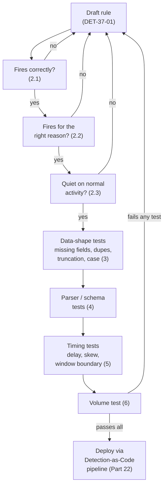

# Part 37 — Detection Testing

## Why this part exists

**[CONCEPT]** A Detection Rule that has never been tested is a hypothesis wearing the clothes of a capability. It has a query, a logsource, a MITRE tag, maybe even a design-review sign-off — and none of that tells you whether it fires when the attack it names actually happens, whether it fires for the reason its own logic claims, or whether it stays quiet on the ordinary Tuesday traffic that makes up the other 99% of the environment. Parts 5 through 7 already showed, one mechanism at a time, how a rule can go silently wrong: a parser renames a field, a schema drifts, a clock skews, a window boundary lands one second off. This part turns those mechanisms into a discipline — a repeatable set of test-case patterns you run against every rule before it ships, and again every time something upstream of it changes.

This part covers thirteen concrete test-case patterns, grouped into four families: whether the rule fires correctly and for the right reason (not just fires at all); how it behaves against damaged or unusual data (missing fields, duplicate events, truncation, case sensitivity, parser failures, schema change); how it behaves against a pipeline that never delivers data instantly or on a perfectly synchronized clock (event delays, clock skew, time-window boundaries); and how it behaves at real production scale (high volume). It closes with a worked test suite against one real detection, built from this project's own lab evidence, and a hunt aimed at the rules nobody has ever tested at all. Part 22 (Detection-as-Code) covers where these tests live in a CI pipeline; this part covers what to actually put in them. Part 38–39 (False Positive/Negative Engineering) and Part 42–43 (Detection Quality, Detection Debt) all assume the vocabulary and test patterns defined here.

---

## 1. What a Detection Test actually validates

**[CONCEPT]** A Detection Test is a concrete, reproducible procedure — an action taken against a lab environment, plus the specific log/SIEM result that action should produce — used to check one claim about a detection rule. It is not a code-style unit test in the software-engineering sense of asserting a function's return value in isolation; it runs the rule against real or realistic telemetry and checks the rule's actual behavior against that telemetry, because a detection rule's correctness is defined entirely in terms of the data it sees, not the syntax it's written in. Every Detection Test box in this book, from Part 5 onward, follows the same three-line template — **Setup**, **Action**, **Expected result** — and this part is where that template gets formalized as the book's standard.

> **Engineering Reality**
> A test that only runs in a clean lab against hand-crafted events validates that the query is syntactically correct — nothing more. Production telemetry is noisier, later, differently-cased, and occasionally truncated in ways a lab capture built specifically to demonstrate the attack never is. Every pattern in this part exists because "it worked in the lab" and "it works in production" are different claims, and only one of them is the one that matters at 3 a.m.

The table below maps each of the thirteen test-case patterns this part covers to the failure mode it catches and where in this part it's worked through in detail.

**Table 37.1 — Detection-test-case patterns at a glance.** The table below supports one decision: which test to write next when a rule ships with no test coverage at all, since running only the first pattern (does it fire) is the single most common gap this part exists to close.

| Pattern | What It Catches | Covered In |
|---|---|---|
| Fires correctly | The rule never matches the attack it's supposed to catch | §2.1 |
| Fires for the right reason | The rule matches, but via a coincidental mechanism, not the named behavior | §2.2 |
| Doesn't fire on normal activity | The rule is unusably noisy against real, benign traffic | §2.3 |
| Missing fields | The rule depends on a field that isn't always populated | §3.1 |
| Duplicate events | At-least-once delivery double-counts a threshold or double-fires an alert | §3.2 |
| Truncation | A length cap cuts the exact substring the rule matches on | §3.3 |
| Case sensitivity | A case-sensitive comparison misses a differently-cased but identical value | §3.4 |
| Parser failures | The parser stops extracting a field the rule needs, with no ingest error | §4.1 |
| Schema change | A vendor/agent upgrade renames or retypes a field the rule references | §4.2 |
| Event delays | Pipeline lag pushes an event outside the rule's correlation window | §5.1 |
| Clock skew | Two sources disagree on "now" by more than the rule's window tolerates | §5.2 |
| Time-window boundaries | An event lands exactly at the edge of a fixed or sliding window | §5.3 |
| High volume | The rule times out, samples, or silently truncates results at real scale | §6.1 |

---

## 2. The three baseline questions

**[DETECTION ENGINEER]** Before any of the data-quality or pipeline-timing patterns matter, every rule has to clear three baseline questions, in this order. Skipping straight to "does it fire" and stopping there is the single most common gap in an otherwise mature detection program — a rule that fires correctly but for the wrong reason, or fires correctly and constantly on benign traffic, is not a working detection just because it technically fired once in a demo.

### 2.1 Fires correctly

**[DETECTION ENGINEER]** The first and most basic test: reproduce the actual attack technique in a lab, and confirm the rule matches the resulting telemetry. This sounds trivial and is skipped surprisingly often — a rule reviewed and approved purely by reading the query, with no one ever running the technique against a real host to see what it actually produces.

> **Detection Test**
> **Setup:** Lab-safe Linux host with sshd configured for password authentication, forwarding auth events to a test index; a threshold-based rule (DET-37-01, built out fully in §7) alerting on more than ten failed SSH authentications from one source IP within a 5-minute window.
> **Action:** From a separate lab host, run a scripted loop attempting SSH login with a wrong password against the target at least fifteen times within one minute — e.g. `for i in $(seq 1 15); do sshpass -p "wrongpass$i" ssh -o StrictHostKeyChecking=no testuser@<target> ; done`.
> **Expected result:** At least one alert from DET-37-01, with the source IP field matching the lab attack host and a matched-event count at or above eleven within the 5-minute window.

### 2.2 Fires for the right reason

**[DETECTION ENGINEER]** A rule can satisfy its own query logic without the underlying behavior being the one the rule claims to detect. This is a distinct failure from a False Positive in the disposition sense (TERMINOLOGY.md § False Positive) — it's a pre-deployment design check on whether the *mechanism* that trips the rule during testing is actually the attack technique, not a benign event shaped just like it.

> **Detection Autopsy — the SSH-burst-then-success rule that fired on a typo**
>
> **The rule:** Fires when a source IP produces several failed SSH authentications followed by one successful authentication within a short window — the textbook shape of a successful password-guessing attempt.
>
> **Why it shipped:** The failed-then-succeeded pattern is exactly how a brute-force tool behaves once it finds the right password, and the query is a straightforward sequence match — easy to explain, easy to demo with a scripted attack.
>
> **How it failed:** During testing, the rule fired reliably — but so did a control test where a real user simply mistyped their own password twice before getting it right on the third attempt from their normal workstation. Both scenarios produce an identical event sequence: two or three failures, one success, same source, same account, tight window. The rule's logic matched correctly in both cases; only one of them was an attack.
>
> **The fix:** Add a discriminator the typo case can't produce — a distinct-username count on the failed attempts (a typo retries the *same* username; password guessing against a fixed account doesn't need to vary username, but credential-stuffing and many automated tools do), or a minimum failed-attempt count well above what a human retry pattern produces (three mistyped attempts is normal; fifteen from a script is not). Testing this rule only against a scripted attack would never have surfaced the typo confound — the test suite has to include the benign look-alike deliberately, not just the attack.

> **What Would Change My Mind**
> This section treats "fires for the right reason" as a design-time check, distinct from tuning a live false-positive rate. If, in practice, a program can show that every rule which fired correctly in a mechanism-check test also had an acceptable live false-positive rate with no further tuning, that would suggest the mechanism check is redundant with post-deployment monitoring. Nothing in this project's own testing supports that conclusion — the typo case above was found in pre-deployment testing precisely because post-deployment false-positive monitoring would have taken a live typo to surface the same gap.

### 2.3 Doesn't fire on normal activity

**[DETECTION ENGINEER]** The inverse of §2.1: replay a representative sample of ordinary, benign traffic through the rule and confirm it stays quiet. Skipping this test is how a rule that "fires correctly" in the lab turns into an unusable, muted-by-week-two alert in production.

> **Detection Test**
> **Setup:** Same environment as §2.1, plus a benign-activity baseline: a day of normal SSH logon activity from known admin accounts, including at least one instance of a legitimate user needing two attempts to get their password right.
> **Action:** Run DET-37-01 against the full benign-activity baseline capture with no attack traffic injected.
> **Expected result:** Zero alerts from DET-37-01 across the entire benign baseline window.

> **False Positive Trap**
> A vulnerability scanner or monitoring tool that authenticates against many hosts on a schedule, using a stale or rotated-but-not-yet-updated credential, produces the exact same failed-authentication burst shape this rule targets — this project's own lab evidence (`lab/evidence/ct104-vulnscan-ssh-failed-logins-btmp.txt`) is itself a burst of dozens of failed SSH attempts per minute from a single internal source, and while in this specific case the source is a misbehaving device rather than a scanner, the shape is identical to legitimate scanner traffic elsewhere. Maintain an explicit allowlist of known scanner/service-account source IPs and exclude them at the query level — do not raise the failure-count threshold to compensate, since that also raises the bar for a real attacker.

---

## 3. Data-shape test cases

**[ENGINEERING]** The three baseline questions assume the rule receives data shaped the way its author expected. The next four patterns test what happens when it doesn't — not because the rule's logic is wrong, but because the data feeding it is missing a field, arrived twice, got cut short, or doesn't match case.

### 3.1 Missing fields

**[ENGINEERING]** A rule that filters or groups on a field which isn't populated on every event of the type it expects will silently under-match, over-match, or error out entirely depending on how the backend handles a null comparison — and which of those three happens is worth confirming directly rather than assuming.

> **Detection Test**
> **Setup:** A copy of the benign/attack event corpus from §2.1–2.3 with one high-value field nulled out on a subset of events — for DET-37-01, the source-IP field on roughly a third of the injected failed-authentication events, simulating a log source that doesn't always populate it (some sshd configurations and some upstream proxies drop or mask the true source address on a portion of connections).
> **Action:** Replay the modified corpus, attack and benign traffic both, through DET-37-01.
> **Expected result:** Document the actual behavior observed — does the rule's count condition simply exclude the null-source events from the per-IP grouping (undercounting the burst, potentially missing the threshold), or does the backend group them together under a null/empty key (falsely correlating unrelated null-source events into one artificial burst)? Either answer is useful; the point of the test is that the answer is known and recorded, not assumed.

### 3.2 Duplicate events

**[ENGINEERING]** Most log-forwarding pipelines guarantee at-least-once delivery, not exactly-once — a forwarder that doesn't get a delivery acknowledgment before a network blip or restart will retry, and the same event lands in the SIEM twice. A count-based or first-seen-based rule that doesn't account for this either double-counts toward a threshold (firing early, or firing on volume that never actually happened) or, for a rule alerting on uniqueness, produces a duplicate alert for the same real event.

> **Detection Test**
> **Setup:** The attack corpus from §2.1, with a subset of the failed-authentication events duplicated verbatim (same timestamp, same fields, same event) to simulate forwarder retransmission.
> **Action:** Replay the duplicated corpus through DET-37-01.
> **Expected result:** Confirm whether the rule's count condition is deduplicating on a stable event identifier before counting, or counting raw event volume. If it's the latter, the threshold effectively lowers itself under duplicate-heavy conditions — document this as a known false-positive driver rather than discovering it the first time a flaky forwarder doubles a benign burst into an alert.

> **Engineering Reality**
> Deduplication requires a stable per-event identifier that survives the trip through the pipeline — many log sources don't emit one natively, and a SIEM-assigned ingest ID changes on every retransmitted copy by definition, since it's assigned at arrival, not at origin. Building a reliable dedup key (a hash of the event's own content and origin timestamp, for example) is itself engineering work with its own failure modes, not a checkbox a SIEM vendor's default settings necessarily hand you for free.

### 3.3 Truncation

**[ENGINEERING]** Part 5 §4 covers the general mechanism — a length cap somewhere in the pipeline cuts a field's content, and the truncated value is what ships downstream with no error. The SSH-specific version: a long or unusual username field (an injection attempt disguised as a username, or a genuinely long service-account name) gets cut at a length limit before it reaches the rule.

> **Detection Test**
> **Setup:** The attack corpus from §2.1, with the username field on the injected failed-authentication attempts set to a value at least twice the length of this pipeline's configured field-length cap.
> **Action:** Replay the corpus through the parser and into DET-37-01.
> **Expected result:** Inspect the parsed event directly — confirm the username field's actual stored length matches or is capped at the pipeline's documented limit, and confirm whether DET-37-01's logic (which in this rule's case keys on source IP, not username) is affected either way. A rule that happens not to reference the truncated field is unaffected by this specific truncation; a rule that does (a username-allowlist filter, for instance) needs its own version of this test against that field specifically.

### 3.4 Case sensitivity

**[ENGINEERING]** Whether a comparison is case-sensitive depends on the query language and the specific operator used, not on the underlying data — and getting this wrong produces a rule that looks correct in every test written by someone who happened to type the test data in the same case as the production allowlist.

Targeting a Microsoft Sentinel/Defender KQL environment, the following illustrative snippet shows the same allowlist filter written two ways:

```kql
// CONCEPTUAL SAMPLE — illustrative KQL. Field/table names are simplified for teaching purposes.
// == is case-sensitive in KQL; a value differing only in case will not match.
SecurityEvent
| where TargetUserName == "svc-backup"

// =~ is case-insensitive and will match "svc-backup", "SVC-Backup", "SVC-BACKUP", etc.
SecurityEvent
| where TargetUserName =~ "svc-backup"
```

This targets a Sentinel/Log Analytics backend specifically because of KQL's documented distinction between `==` (case-sensitive) and `=~` (case-insensitive); the operator names and exact behavior differ by query language, so the discriminator to test is "does my platform's default equality operator match case or not," not this specific KQL syntax.

> **Blind Spot**
> Windows treats account names as case-insensitive for authentication itself, but the value recorded in a field like `TargetUserName` on Event ID 4625 (An account failed to log on) often preserves whatever case the client actually sent. An allowlist exclusion written and tested against `svc-backup` will silently fail to exclude the exact same account logging in as `SVC-Backup` from a differently configured client, if the exclusion uses a case-sensitive comparison — and the rule gives no indication this happened; it just alerts on activity that should have been suppressed.

> **Detection Test**
> **Setup:** A copy of DET-37-01's benign baseline from §2.3, with the allowlisted service account's username re-cased inconsistently across a subset of its legitimate logon events (e.g. `svc-backup`, `SVC-BACKUP`, `Svc-Backup`).
> **Action:** Replay the re-cased benign baseline through the rule's allowlist filter.
> **Expected result:** Zero false alerts from the re-cased benign events if the filter uses a case-insensitive comparison; document the false-positive rate as a known gap if it doesn't, rather than assuming the allowlist "already covers" the account because one cased form of its name is in the list.

---

## 4. Parser and schema test cases

**[ENGINEERING]** Part 5 and Part 6 cover these mechanisms in full; this section is deliberately short and points back to them rather than re-deriving the same material, because the test-case pattern is the same regardless of which specific field or vendor triggers it.

### 4.1 Parser failures

**[ENGINEERING]** Part 5 §2–§6 catalogs the ways a parser can stop extracting a field correctly with no ingest error. The test-case pattern for detection testing purposes is narrow and specific: take a raw event the rule depends on, deliberately mangle it the way a real parser failure would (rename a field, corrupt an encoding, truncate it, drop it from a batch), and confirm what the rule does with the result — silently misses it, silently over-matches, or (best case) gets caught by an independent parser-health monitor before anyone notices the rule went quiet.

> **Detection Test**
> **Setup:** The parser-health monitoring pattern from Part 5 §7, attached to the same log source DET-37-01 depends on.
> **Action:** Following Part 5's own Detection Test procedure (§7.2): manually null or rename the source-IP field in a test copy of the parser config, then replay a batch of previously-good failed-authentication events through it.
> **Expected result:** DET-37-01 stops matching the replayed batch (confirming the dependency exists), and the parser-health null-rate monitor's computed rate for the source-IP field jumps from its baseline within one monitoring cycle (confirming the independent monitor, not just the rule's silence, is what actually surfaces the break).

### 4.2 Schema change

**[ENGINEERING]** Part 5 §8's full case study — a sudo-log field renamed from `user.name` to `user.id` by an ingest-integration upgrade — is the canonical worked example for this pattern, including its own Detection Test (validating DET-05-02, the field-resilient fix) and its own regression monitor (DET-05-03). This part doesn't repeat that case study; it names the general test-case pattern it demonstrates: whenever a log source's underlying integration, agent, or API version changes, re-run every rule depending on that source against a fresh sample of post-change raw events, rather than assuming a version bump that "adds fields" or "improves stability" per the vendor's release notes left every existing field reference intact.

> **Engineering Reality**
> Vendor release notes are written for engineers integrating a format for the first time, not for every team with an existing rule built on the old field names. Treat a scheduled schema-drift re-test as a mandatory step of any log-source or agent version upgrade, the same way a software team treats a dependency bump as requiring a regression run — not an optional follow-up if time allows.

---

## 5. Timing test cases

**[ENGINEERING]** Part 7 covers the mechanisms — four different clocks in a pipeline, drift, delay, DST — in depth. This section is the test-case layer built on top of that vocabulary: three concrete ways a rule's timing assumptions get tested before they get discovered the hard way in production.

### 5.1 Event delays

**[ENGINEERING]** A correlation or threshold rule with a fixed time window assumes every relevant event arrives, and gets evaluated, within that window of when it actually happened. Pipeline delay (Part 7 §4) breaks that assumption without any error — the event arrives, just later than the window assumed, and a rule with a 5-minute window running against a pipeline with an intermittent 6-minute delivery lag for one of its sources will intermittently and silently fail to correlate events a human reviewing the same data an hour later would see as obviously related.

> **Detection Test**
> **Setup:** DET-37-01 configured with its standard 5-minute window; a delay-injection capability in the test harness (or, more simply, a scripted delay before forwarding a subset of test events) able to hold back a portion of the injected failed-authentication events by a controlled amount.
> **Action:** Replay the §2.1 attack corpus with the last three of the fifteen failed-authentication events delayed by six minutes relative to the first twelve.
> **Expected result:** Document whether DET-37-01 still fires on the first twelve events alone (if they clear the count threshold on their own) and whether the delayed three are captured by a subsequent window evaluation or lost to the boundary entirely — this is the same underlying question as §5.3's boundary test, approached from the delivery-timing side rather than the event-timestamp side.

### 5.2 Clock skew

**[ENGINEERING]** Part 7 §3 and its Detection Test (DET-07-01) cover the general clock-drift test pattern — a host's own clock running ahead of or behind true time, detected via drift between a source's self-reported event timestamp and the pipeline's ingestion timestamp for the same event. Applied to this rule: run the DET-07-01 procedure against the specific lab host used for DET-37-01's own attack simulation, confirming that a skewed clock on the attacking or the target host doesn't silently push the burst's events outside the 5-minute count window the same way a delivery delay would.

> **Detection Test**
> **Setup:** The DET-37-01 lab host from §2.1, with NTP sync temporarily disabled (`sudo timedatectl set-ntp false`).
> **Action:** Shift the host's clock forward by six minutes (`sudo timedatectl set-time "$(date -d '+6 minutes')"`), then immediately run the §2.1 attack script.
> **Expected result:** Compare the resulting events' self-reported timestamps against the SIEM's ingestion timestamps for the same batch — they should differ by roughly six minutes. Confirm whether DET-37-01's window evaluation is keyed to the event's own (now-skewed) timestamp or to ingestion time (Part 7 §1's "four clocks" distinction) and document which one this specific rule and backend actually use, since the two produce different outcomes if the skew is large enough to matter. Revert with `sudo timedatectl set-ntp true` immediately after the test.

### 5.3 Time-window boundaries

**[ENGINEERING]** Every fixed or sliding window has an edge, and a threshold rule's behavior exactly at that edge is one of the most commonly untested properties of any detection: is the boundary inclusive or exclusive, does a sliding window re-evaluate continuously or only on a scheduled interval, and does an event that lands one second on the wrong side of a window boundary get silently excluded from a count that would otherwise have crossed the threshold.

> **Detection Test**
> **Setup:** DET-37-01's 5-minute window and eleven-event threshold, run against a scheduled (not continuously streaming) search interval — the more common real-world configuration for a threshold rule in most SIEMs.
> **Action:** Inject exactly ten failed-authentication events from one source in the first four minutes of a window, then one additional event at the four-minute-fifty-nine-second mark — eleven events total, all within the nominal 5-minute window — timed so the eleventh event lands in the final seconds before the scheduled search's next scan.
> **Expected result:** Confirm the rule actually fires on this run. A rule whose scheduled search runs every 5 minutes on a fixed clock boundary (rather than a rolling window anchored to the first matching event) can miss a burst that starts near the end of one scheduled interval and finishes near the start of the next — eleven real events, correctly time-stamped, split across two separate 5-minute buckets that each individually fall under threshold. This is a distinct failure from event delay (§5.1): here, every event arrives on time; the window's own alignment to the clock, not delivery lag, is what causes the split.

> **Blind Spot**
> A fixed, clock-aligned window (evaluated every 5 minutes on the 0:00/5:00/10:00 mark, for instance) has a structural blind spot at every one of its own boundaries: an attacker whose burst straddles the boundary — intentionally or by chance — never accumulates enough count in either individual bucket to cross the threshold, even though the true elapsed-time count across the boundary exceeds it. A rolling window anchored to the first matching event closes this specific gap, at the cost of needing to track more state per source than a simple bucketed count.

---

## 6. Scale test cases

### 6.1 High volume

**[ENGINEERING]** A rule validated against a lab corpus of a few dozen events proves the query's logic is correct; it proves nothing about how that same query behaves against real production volume, where a SIEM's own query engine may cap the number of results a single search returns, sample rather than exhaustively scan a large time range, or simply time out before completing — and a search that returns a partial or sampled result set usually does so without an error a scheduled rule's own alerting logic would notice.

> **Detection Test**
> **Setup:** A load-generation script capable of producing failed-authentication events at a rate well above this environment's normal SSH auth volume — high enough to approximate the volume a real, actively-scanned host or a busy jump box would see, not just the volume a lab demo needs.
> **Action:** Run the load generator against the DET-37-01 test environment for a sustained period covering several of the rule's scheduled-search intervals, at a volume at least an order of magnitude above the §2.1 test corpus.
> **Expected result:** Confirm the rule's scheduled search completes within its own run interval (a search that takes longer than its schedule either overlaps the next run or falls permanently behind) and that the per-source count it computes matches the actual injected volume rather than a capped or sampled subset of it. A rule that behaves correctly at ten events and silently returns a truncated count at ten thousand has not actually been tested for the volume it will see in production.

> **SOC Management View**
> Load-testing a detection rule against realistic production volume takes lab infrastructure and engineering time most teams don't budget for a "simple" threshold rule, which is exactly why this test is the one most often skipped — right up until the rule is deployed against real traffic and either times out silently or turns out to have been sampling a fraction of the events it claimed to be counting the whole time. Budget scale testing as a standard line item for any rule targeting a high-volume log source (authentication, DNS, network flow), not an optional step reserved for rules that already look expensive.

---

## 7. Case study: the full test suite for DET-37-01

**[DETECTION ENGINEER]** The sections above built each test-case pattern one at a time against the same rule. This section names that rule properly and lays out its full test matrix in one place — what a complete, pre-deployment Detection Test suite for a single real detection actually looks like, rather than thirteen separate examples scattered across a chapter.

**DET-37-01 — SSH failed-authentication burst from a single source.** Targeting an illustrative Linux `auth.log`/journald sshd source normalized to ECS-style fields, this rule fires when one source IP produces more failed authentication attempts than a normal mistyped-password pattern would generate, within a short window. This project's own lab evidence (`lab/evidence/ct104-vulnscan-ssh-failed-logins-btmp.txt`) is a genuine, real-world instance of the exact burst shape this rule targets: dozens of failed `admin`/`root` SSH attempts per minute from a single internal source (`192.168.1.126`), captured via `lastb` against `/var/log/btmp` — the OS-level failed-login accounting record populated by the login/PAM stack, a different log source from sshd's own `auth.log` "Failed password" line but recording the same underlying authentication failures. A production deployment of this rule would run against the sshd `auth.log`/journald stream directly; the btmp capture is cited here as real evidence that the burst pattern this rule targets occurs on real infrastructure, not as the literal source the rule below queries.

```yaml
# CONCEPTUAL SAMPLE — illustrative Sigma rule. Field names follow ECS convention; the aggregation
# syntax shown is Sigma's standard count-by-field-over-threshold form. Not validated against a
# specific backend's exact aggregation-translation behavior — confirm against your own SIEM before
# deploying, per the boundary and volume tests in §5.3 and §6.1.
title: SSH Failed-Authentication Burst From a Single Source
id: 37a10000-0037-0001-0000-000000000001
status: experimental
logsource:
  category: authentication
  product: linux
  service: sshd
detection:
  selection:
    event.outcome: 'failure'
    event.action: 'ssh-login'
  filter:
    source.ip|expand: '%allowlisted_scanner_ips%'
  condition: selection and not filter | count() by source.ip > 10
timeframe: 5m
falsepositives:
  - A vulnerability scanner or monitoring tool authenticating with a stale/rotated credential (see
    False Positive Trap, §2.3) — mitigated by the allowlist filter above, not by raising the threshold
  - A legitimate user mistyping a password more than ten times in five minutes (rare, but possible on
    a shared kiosk or accessibility-impaired input device)
  - An SSH client offering multiple keys from an agent (a developer's multi-host `ssh-agent`, or a CI
    runner trying several service-account keys in sequence) logs one failed-authentication line per
    rejected key before the accepted key succeeds — a single legitimate connection with ten or more
    keys loaded produces this rule's entire threshold on its own
level: medium
```

**MITRE:** T1110.001 (Password Guessing), T1110.003 (Password Spraying)

This targets a generic Linux sshd/auth-log source normalized to ECS fields; its main limitation independent of any test-case pattern above is that source-IP-only grouping misses a distributed brute-force attempt spreading the same volume of guesses across many source IPs — that variant needs a username-keyed or account-keyed correlation instead, covered under distributed/credential-stuffing detection design rather than this single-source pattern. The rule also does not distinguish *which* brute-force sub-technique it caught: because `count() by source.ip` never looks at the username field, an attacker retrying one account (T1110.001) and an attacker spraying one guessed password across ten different accounts from the same source IP (T1110.003) produce an identical alert. Both MITRE sub-techniques are tagged above for that reason — dropping either one would understate this rule's actual detection coverage. Treat the false-positive rate as unvalidated against real production SSH traffic: the only quantified evidence behind this rule is this project's own lab capture (dozens of attempts per minute from one misbehaving internal device, comfortably above the ten-in-five-minutes threshold) and the qualitative failure modes in the `falsepositives` list above, not a measured live precision figure — run §2.3's benign-baseline test against your own environment's real SSH volume before trusting the threshold as tuned.

> **Blind Spot**
> The threshold in this rule is a rate — ten failures in five minutes — and any rate-based threshold can be paced around once an attacker knows or guesses the number. A script throttled to eight or nine failed attempts every five minutes runs the identical dictionary against the identical account for hours or days without a single window ever crossing `count() by source.ip > 10`. Nothing about T1110.001/T1110.003 requires the volume this rule was tuned to catch; it only requires patience. Lowering the threshold to close this gap pushes the mistyped-password false positive from the Detection Autopsy in §2.2 back up, since there's no window-and-count adjustment alone that distinguishes a slow, deliberate guesser from an occasional human retry — closing this requires a longer-baseline, session- or account-keyed layer on top of this rule, not a smaller number in this one.

**Table 37.2 (CONCEPTUAL SAMPLE) — DET-37-01's full pre-deployment test matrix.** The table below supports the decision of whether DET-37-01 is actually ready to deploy, by making every test-case pattern's pass/fail status visible in one place rather than scattered across separate test runs with no shared record.

| Test-Case Pattern | Test Reference | Result To Confirm Before Deploy |
|---|---|---|
| Fires correctly | §2.1 Detection Test | Alerts on the scripted attack corpus |
| Fires for the right reason | §2.2 Detection Autopsy | Does not fire on a benign typo-retry sequence |
| Doesn't fire on normal activity | §2.3 Detection Test | Zero alerts on the full benign baseline |
| Missing fields | §3.1 Detection Test | Documented behavior when source IP is null |
| Duplicate events | §3.2 Detection Test | Documented dedup behavior on retransmitted events |
| Truncation | §3.3 Detection Test | Confirmed field-length cap behavior |
| Case sensitivity | §3.4 Detection Test | Allowlist filter matches regardless of source-IP-adjacent field casing |
| Parser failures | §4.1 Detection Test | Independent null-rate monitor catches a broken field mapping |
| Schema change | §4.2 (Part 5 §8 cross-reference) | Rule survives, or is re-tested against, the next log-source upgrade |
| Event delays | §5.1 Detection Test | Documented behavior when late events split across a window |
| Clock skew | §5.2 Detection Test | Documented behavior when source clock and ingestion clock disagree |
| Time-window boundaries | §5.3 Detection Test | Confirmed behavior for a burst straddling a scheduled-search boundary |
| High volume | §6.1 Detection Test | Confirmed search completes within its interval at realistic production volume |






**Figure 37.1 — Detection test gate sequence before production deployment.** *CONCEPTUAL.* Illustrates the order in which this part's thirteen test-case patterns are applied to a rule before it ships, and the feedback loop back to the draft rule whenever any gate fails. This is a conceptual process diagram of the testing sequence described in §2–§6, not a capture from a specific CI pipeline's actual run log. Diagram ID `FIG-37-01`.


---

## 8. Automating detection tests: from one-off validation to a regression suite

**[ENGINEERING]** Every Detection Test box in this part is written as something a person runs once, by hand, before a rule ships. That's necessary but not sufficient — a rule that passed every test in §2–§6 on the day it deployed can still be silently broken six months later by exactly the mechanisms Part 5 and Part 6 describe (a parser upgrade, a schema change), and nothing re-runs these tests automatically unless something is built to do so.

The fix is the same one Part 22 describes for detection logic generally: store each Detection Test's setup and expected result as a repeatable artifact — a stored raw-event corpus (attack and benign both), the exact injection/replay procedure, and the expected match count or field values — and replay it as part of the same CI pipeline that lints and deploys the rule itself, on every rule change and on a recurring schedule independent of any specific change. TERMINOLOGY.md's Adversary Emulation / Atomic Test entry describes the same discipline at the level of a full technique execution against production-like infrastructure; the test corpus described here is the narrower, rule-specific version of that same idea, sized to run in CI on every commit rather than as a scheduled red-team exercise.

> **Engineering Reality**
> A regression test corpus only catches what it contains. A stored corpus built from the §2.1 attack simulation and the §2.3 benign baseline catches a break in either of those two specific scenarios; it does not automatically catch a new benign pattern that didn't exist when the corpus was built, or a new evasion variant of the attack that behaves differently from the original simulation. Treat the corpus itself as something that needs periodic expansion — every real false positive and every real missed detection that Part 38 and Part 39 later document is also a candidate new entry for this rule's regression corpus, not just a one-off tuning fix.

---

## 9. Who tests the tests: hunting for untested detections

**[THREAT HUNTER]** Every pattern above assumes someone deliberately tests a given rule. Some rules never get this treatment at all — inherited from a previous team, imported from a vendor content pack, or shipped years ago by someone no longer at the organization — and nothing about a rule's presence in the SIEM tells you whether it was ever run against a real attack simulation even once.

**HUNT-37-01 — Detections with no recorded test evidence.**

- **Hypothesis:** A meaningful fraction of deployed detection rules in a mature SIEM have never had a Detection Test executed against them and recorded, and that subset is disproportionately likely to be silently broken, untuned, or simply wrong about what it claims to detect.
- **Approach:** Cross-reference the full list of deployed, enabled detection rules — keyed on rule ID and the rule's own last-modified timestamp — against whatever test-record artifact the program actually keeps (a CI test-corpus repository per §8, a change-log field, a wiki page), matching on that same rule ID and comparing the recorded test's date against the rule's last-modified date, not just checking whether a record exists at all. The analysis needs no live telemetry: just an inventory comparison. For any rule with no recorded test evidence, or with a test record older than the rule's most recent logic change, attempt the §2.1/§2.3 pair (does it fire on a reproduced version of its own named technique, does it stay quiet on a benign baseline) as the minimum bar before trusting it further.
- **Disposition:** Rules that pass both baseline tests on first contact get logged as newly test-covered, closing part of the program's Testing Debt (TERMINOLOGY.md § Detection Debt) without further action. Rules that fail either test are detection candidates for immediate rework, not silent removal — a rule that's wrong is still evidence of a real intended use case that needs a correct implementation, not proof the use case itself was mistaken. Expect this cross-reference to carry a nonzero false-negative rate of its own, for the reasons in the Blind Spot below — treat the resulting untested-rule count as a floor on the program's Testing Debt, not an exact figure.

> **Hunter's Note**
> Start this hunt with rule *age* and rule *source* as your cheapest filters, before touching any telemetry: a rule imported wholesale from a vendor content pack, or one with no commit history predating the current detection-as-code repository, is the most likely candidate for "never actually tested against this specific environment's telemetry," even if it's been enabled and silent for years. Silent isn't the same as working — it's frequently the same as never fired because it was broken from day one.

> **Blind Spot**
> An inventory comparison can't distinguish a rule with a fresh, relevant test record from one with a stale record left over from before the rule's query logic was last edited — "has an entry in the test-corpus repo" and "was tested against what the rule looks like today" are different claims, which is why the Approach above matches on last-modified date rather than record presence alone; skipping that date check is this hunt's own equivalent of a false negative, quietly crediting a rule as covered when the coverage no longer matches the deployed logic. The hunt is also only as complete as the rule inventory feeding it: a detection built directly in the SIEM console and never added to the detection-as-code repository is invisible to this cross-reference entirely — a trivial way for an untested rule to sit outside the hunt's field of view indefinitely. Validate the inventory's own completeness against the SIEM's actual enabled-rule count on a recurring basis; a shrinking gap between "rules the hunt can see" and "rules actually enabled" is itself a sign this hunt has silently stopped covering the environment, in the same way a silent detection rule and a well-tested one look identical in the alert queue.

---

## 10. Key takeaways

- "Does it fire" is the first Detection Test, not the only one — a complete suite also checks that the rule fires for the claimed reason, stays quiet on normal activity, and survives missing fields, duplicate events, truncation, case mismatches, parser failures, schema changes, delivery delay, clock skew, window-boundary edge cases, and real production volume.
- Fires-correctly and fires-for-the-right-reason are different claims. A rule can pass the first and fail the second by matching a benign look-alike through the same query logic that matches the real attack — the fix is testing the mechanism deliberately, with a benign confound built into the test corpus on purpose, not discovering the confound live.
- Every data-shape and pipeline-timing pattern in this part traces back to a mechanism Part 5, Part 6, or Part 7 already named in depth; this part is the test-case layer that turns "here's how this can silently break" into "here's the specific thing to run before you find out the hard way."
- A test run once by hand at deployment time answers "was this rule correct on that day." Only a stored, automatically replayed regression corpus — the same discipline Part 22 applies to the rule's own logic — answers "is this rule still correct today," and that question needs asking on every upstream change, not just at ship time.
- A silent, untested rule and a silent, well-tested rule produce identical output in the alert queue: nothing. Testing coverage itself is invisible on a standard alert-volume dashboard, which is exactly why HUNT-37-01 treats the absence of recorded test evidence as its own findable gap, worth hunting for on its own terms.
