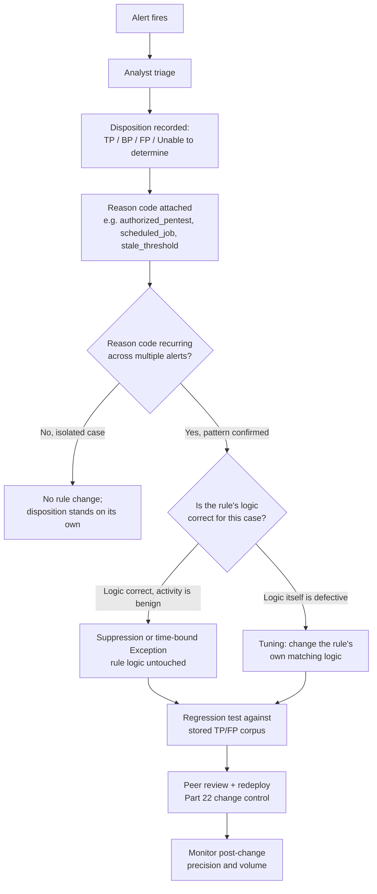

# Part 38 — False Positive Engineering

## Why this part exists

Part 37 defined what it means for a detection rule to be tested — that it fires correctly, fires for the right reason, and survives missing fields, duplicate events, and schema drift. This part covers what happens after a tested rule ships and starts generating real alert volume against real production noise: how to tell a **False Positive** from a **Benign Positive** (TERMINOLOGY.md § False Positive, § Benign Positive) with the same alert sitting in the queue, how to decide whether the fix is a **Suppression** or a **Tuning** change to the rule's own logic (TERMINOLOGY.md § Suppression, § Tuning), when a suppression becomes an **Exception** that needs its own accountability record, and how to report a false-positive rate that a SOC manager can actually trust. This part assumes the vocabulary from Part 1 (the alert/disposition lifecycle), the git-based change-control model from Part 22 (a tuning change is a code change, reviewed the same way), and the baselining concepts from Part 31 (most false-positive fixes are really "we built a threshold before we had a baseline"). Part 39 is this part's mirror — false negatives, the failure mode that produces no alert at all rather than too many.

This part does not cover domain-specific false-positive drivers in depth — those live in each domain part's own False Positive Trap boxes (Parts 8–21). It covers the discipline that turns "this rule is noisy" into a tracked, reviewable, reversible engineering decision instead of a one-off exclusion nobody remembers adding.

## 1. False positive, benign positive, or neither

**[CONCEPT]** A closed alert needs a **Disposition** before it is useful for anything (TERMINOLOGY.md § Disposition) — precision, tuning backlogs, and every quality metric in Part 42 are built from disposition data, and an alert closed with no disposition contributes to none of them. The distinction that matters most for this part is between a **False Positive**, where the rule's own logic is defective, and a **Benign Positive**, where the logic matched exactly what it was designed to match but the underlying activity turns out to be legitimate. Confusing the two leads to the wrong fix: tuning a rule's logic to suppress a benign positive papers over the fact that the logic is correct, while suppressing a genuine false positive without fixing the logic leaves the same defect free to misfire on the next unrelated activity that happens to satisfy it.

Not every closed alert sorts cleanly into one bucket. The following pair of real log excerpts from a home-lab environment illustrates why.

The first is a burst of failed SSH authentication attempts captured on a vulnerability-scanning host, CT104:

```text
Sep 14 01:05 root ssh:notty 192.168.1.126 (failed)
Sep 14 01:05 root ssh:notty 192.168.1.126 (failed)
Sep 14 01:05 root ssh:notty 192.168.1.126 (failed)
... (30 root/admin failed attempts in the same minute, from the same source)
Sep 14 01:17 admin ssh:notty 192.168.1.126 (failed)
```

*(REAL LAB EXAMPLE — condensed from `lab/evidence/ct104-vulnscan-ssh-failed-logins-btmp.txt`, captured via `lastb` on CT104; full 100-line sample spans 2026-09-13 20:31 through 2026-09-14 01:17.)*

A rule watching for "N failed SSH authentications against a small set of usernames within a short window" fires correctly here — dozens of `root` and `admin` attempts land inside a couple of minutes, from one source, against two accounts. Attributed correctly, though: the source IP resolves via the Pi-hole DHCP lease table to a real device already on the network, `LAPTOP-JB22RNU3`, not an external attacker. That single fact does not cleanly settle the disposition. It rules out an inbound intrusion attempt, but it does not make the activity *authorized* — nothing on this network is supposed to be retry-looping SSH logins against `root` and `admin` on a scanner host dozens of times a minute. The honest disposition is **Unable to Determine** pending a conversation with the device's owner, not an automatic Benign Positive just because the source is internal. Whether it later resolves to "misconfigured backup script with a stale saved credential" (benign positive once confirmed) or "that laptop is compromised and is the one doing the scanning" (true positive) changes the correct response completely, and the rule cannot tell you which — only its trigger condition.

**DET-38-02 — SSH failed-authentication burst against a small account set from a single source**

The fields this rule depends on: source address (the host/IP `lastb` resolves from `btmp`, or the `from <ip>` clause on the equivalent `Failed password for ...` line in `auth.log`), target username, and event timestamp, grouped by source address within a rolling window. A representative threshold matching the evidence above: ten or more failed attempts within five minutes, against three or fewer distinct target usernames, from one source address. Widening the username count turns this into a password-spraying detection with a different shape and a different MITRE mapping (T1110.003, Brute Force: Password Spraying), not a variant of the same rule.

> **Blind Spot**
> This detection only sees what PAM records to `btmp` (or the equivalent syslog auth line). An attacker authenticating with a stolen, valid SSH key never fails a login and never appears in `btmp`, regardless of how many hosts they touch. It also can't see failures against a service that doesn't route through PAM at all — a custom application-level login on a nonstandard port produces no `btmp` entry no matter how many times it rejects a password. And it is blind to the same attack spread thin: a credential-stuffing tool or small botnet issuing the same set of guesses from ten or more source addresses, two or three attempts per address, never crosses the ten-per-source threshold at any single address, even though the aggregate attempt volume against the host is identical to the single-source burst this rule is tuned for.

If the source-address field is null, unresolved, or truncated — some `sshd` configurations log a hostname that fails to resolve, and a log-rotation race can truncate the tail of a burst — the rule can't group the attempts by source at all, and the count never crosses threshold. That is a silent false negative, not an error, and it is exactly the kind of missing-field failure mode that belongs in the regression corpus described in §3, not just this rule's design notes.

Expected false-positive rate: low in raw count on a small estate, but each occurrence tends to need the human follow-up shown above rather than an automatic disposition — a handful of Unable to Determine outcomes a month once known scanners are enrolled in an entity inventory, not a high-volume nuisance rule that a SOC would reflexively tune down.

> **Detection Test**
> **Setup:** Any Linux host running `sshd` with PAM-backed `btmp` logging (the default on most distributions).
> **Action:** `for i in $(seq 1 12); do u=root; [ $((i % 2)) -eq 0 ] && u=admin; ssh -o BatchMode=yes -o ConnectTimeout=2 "$u@<test-host>" true; done`, supplying no valid key or password, all from one test source.
> **Expected result:** Twelve or more `lastb` entries for the test host, all sharing the test source's address, split across the two usernames, inside a two-minute window — enough to cross the ten-in-five-minutes threshold above and generate one alert instance for disposition.

The second is a domain-blocklist match on CT100, the Pi-hole DNS host:

```text
Sep 15 08:32 dnsmasq: gravity blocked mobile.events.data.microsoft.com
```

*(REAL LAB EXAMPLE — from `lab/evidence/ct100-pihole-dns-query-log.txt`.)*

A "DNS query to a domain on a reputation blocklist" detection matches this correctly and completely — the domain genuinely is on the gravity blocklist Pi-hole loaded. It is also a Microsoft telemetry endpoint that a Windows client queries as part of normal operation, not evidence of anything malicious. This is close to a textbook benign positive: the rule's logic (blocklist membership) is doing exactly what it claims, and the activity is legitimate. It differs from the SSH case in one important way — there is no ambiguity left to resolve. Nobody needs to go ask a device owner what happened; the domain's purpose is publicly known and stable.

The table below is the taxonomy this part uses for *why* a false positive (the logic-is-wrong case, not the benign-positive case) happens in the first place — it supports deciding, in §3 and §4, whether the fix is a suppression, a rewrite, or neither.

| Cause | What it looks like | Typical fix |
|---|---|---|
| Logic too broad | A condition matches a whole class of activity, only a slice of which is the targeted behavior | Rewrite: narrow the condition with an additional field or a tighter threshold |
| Wrong entity resolution | The rule joins two events on a key that does not actually mean "same entity" in every case (see TERMINOLOGY.md § Entity Key / Entity Resolution) | Rewrite: change the join key or add a resolution step |
| Environmental drift | The rule was correct when written; a new tool, a new scheduled job, or a new account has since started legitimately matching it | Suppression or exception, scoped to the new source, with a review date |
| Coincidental match | Unrelated, unconnected activity happens to satisfy every clause of the rule at once | Rewrite: the clauses need a correlating field tying them together, not just co-occurrence |
| Stale baseline | A static threshold was set once and never revisited as normal volume changed (see Part 31) | Rewrite: move the threshold to a baseline-relative comparison |

> **What Would Change My Mind**
> This taxonomy assumes most production false positives fall into one of these five buckets. If a tuning backlog review found more than a handful of closed false positives that fit none of them, the taxonomy itself would need a sixth category rather than forcing every case into the nearest approximate fit.

## 2. Where false positives actually come from — a worked case study

**[DETECTION ENGINEER]** The most common source of false positives in a mature detection program is not an attacker doing something clever — it is a legitimate, repeating, scripted process that happens to satisfy a rule written with only an interactive human user in mind. The following case study is built from two real `sudo` invocation logs captured across two different lab hosts.

CT104 (a vulnerability-scanner platform) runs a health-check script that polls its own database as a dedicated service account, on an interval of roughly forty to sixty minutes:

```text
Sep 10 05:42:02 vulnscan sudo[2229]: root : PWD=/root ; USER=vulnscan ; COMMAND=/usr/bin/sqlite3 /opt/vulnscan/data/vulnscan.db 'SELECT count(*) FROM scanner_errors;'
Sep 10 05:42:02 vulnscan sudo[2229]: pam_unix(sudo:session): session opened for user vulnscan(uid=999) by (uid=0)
Sep 10 06:38:57 vulnscan sudo[2393]: root : PWD=/root ; USER=vulnscan ; COMMAND=/usr/bin/sqlite3 /opt/vulnscan/data/vulnscan.db 'SELECT count(*) FROM scanner_errors;'
```

*(REAL LAB EXAMPLE — `lab/evidence/ct104-vulnscan-sudo-invocations.txt`, `journalctl _COMM=sudo` on CT104, log lines from 2026-09-10.)*

CT100 (a Pi-hole DNS host) shows the same shape of event for a different reason — root running the blocklist-update script as the `pihole` service account:

```text
Jun 17 09:40:23 pihole sudo[4161]: root : TTY=pts/1 ; PWD=/root ; USER=pihole ; COMMAND=/usr/bin/bash /opt/pihole/gravity.sh --force
```

*(REAL LAB EXAMPLE — `lab/evidence/ct100-pihole-sudo-invocations.txt`.)*

Notice the one field that differs between the two: the Pi-hole entry carries `TTY=pts/1` — a human typed this at an interactive terminal — while every CT104 health-check entry omits the `TTY=` field entirely, because it was invoked by a script with no controlling terminal. This is a genuinely useful, cheap distinguishing field, and it drives the fix below.

**DET-38-01 — Sudo invocation pivoting root to a service account (TTY-presence split for scripted vs. interactive sudo)**

> **Detection Autopsy — "root sudo'ing into a service account is a privilege pivot"**
>
> **The rule:** Fires on any `sudo` invocation where the invoking user is `root` and the target `USER` is a non-human service account — the reasoning being that an attacker who has compromised `root` will often pivot into a service account's context to reach a database or a secret without touching an account-specific rule.
>
> **Why it shipped:** The underlying technique is real (see MITRE line below), the query is a two-field filter, and the design review had no attacker scenario to point to where this pattern *shouldn't* alert.
>
> **How it failed:** CT104's own health-check script performs exactly this pivot every forty to sixty minutes as designed, and equivalent legitimate patterns exist on every host running a scheduled job as a service account — CT100's `gravity.sh` update is a second, independently occurring example on this network alone. The rule produced dozens of false positives a day and zero true positives in its first month.
>
> **The fix:** Split on the `TTY` field. An invocation with no `TTY` is scripted by definition — cron, systemd timer, or an application calling `sudo` directly — and gets evaluated against a baselined command/interval pattern (Part 31) rather than a static allowlist. An invocation *with* a `TTY` is an interactive human pivot and keeps the original, tighter rule, since a real attacker with an interactive shell pivoting to a service account is exactly the case worth keeping.

**MITRE:** T1548.003 (Abuse Elevation Control Mechanism: Sudo and Sudo Caching)

The following is a **CONCEPTUAL SAMPLE** — illustrative field names over a generic Linux `sudo`/`auth.log` source, not a syntax-checked rule for any specific SIEM:

```spl
| index=linux_auth sourcetype=sudo
| eval is_interactive=if(isnotnull(tty) AND tty!="", 1, 0)
| where is_interactive=1
| where invoking_user="root"
| where target_user IN ("vulnscan", "pihole", "svc_backup")  // known service-account targets — see False Positive Trap below for why a hand-maintained list is itself debt
| stats count by invoking_user, target_user, command
```

This query targets a Splunk-shaped index over sudo/auth log lines; it keeps the original rule's two conditions (`invoking_user="root"`, target is a service account) and adds the `TTY`-presence filter as the third. Its main limitation is the hardcoded `target_user` allowlist in the fourth line — that list is exactly the technical debt described in §5, and it needs a review date, not permanent silent maintenance. A UID-range check is more durable than a named list here: the `pam_unix` line in the CT104 evidence above shows `uid=999`, and system/service accounts fall below UID 1000 on most Linux distributions, so `target_uid<1000 AND target_uid!=0` survives a new scheduled job being provisioned without a detection-engineering ticket to update the query — swap to that once the log source is enriched with UID, and drop the named list entirely.

> **Engineering Reality**
> This rule's entire fix rests on `TTY=` being absent from the raw log line for every non-interactive invocation. That's what this lab's `sudo` build does, and it's what the CT104 evidence above shows — but not every `sudo` version and `Defaults` configuration behaves the same way. Some builds log `TTY=unknown` instead of omitting the field when there's no controlling terminal, which is a non-null, non-empty string and would flip `is_interactive` to `1` for a scripted invocation, silently defeating the split this whole detection depends on. Confirm what your specific hosts actually log for a no-TTY invocation before deploying this filter — don't assume the omission behavior transfers from one distribution or `sudo` version to another. The same failure mode shows up a layer earlier if the field extraction for this sourcetype never parses a `tty` field at all: `isnotnull(tty)` returns false for a field that doesn't exist just as readily as for one that's genuinely empty, so a broken or missing extraction silently forces every invocation — interactive or not — onto the non-interactive branch, with no error and no zero-result signal to flag it.

> **Blind Spot**
> The TTY split is easy to defeat deliberately, not just by accident. An attacker who already has an interactive root shell and runs `setsid sudo -u vulnscan ...`, schedules the pivot via `at` or a one-shot `cron` entry, or connects with `ssh -T` (no pseudo-terminal request) strips the controlling terminal the same way a legitimate scripted job does — `TTY=` comes up empty, `is_interactive` evaluates to 0, and the tightened interactive rule never evaluates the event. The invocation then only has a chance of being caught by the scripted-invocation baseline path, which requires the command or interval to deviate from what's already normal for that account — an attacker who mimics the account's usual command shape, or targets an account with no established baseline yet, passes through undetected.

> **False Positive Trap**
> Any service account with a scheduled job that legitimately needs elevated access — backup agents, monitoring health checks, blocklist updaters — will produce a `sudo`-to-service-account pattern indistinguishable from a human pivot on the target-user field alone. The fix here is the `TTY`-presence split shown above, not a per-account allowlist maintained by hand; a hand-maintained allowlist grows by one line every time a new scheduled job ships and nobody remembers to check it against the detection. The split does not close the interactive branch, either: a DBA running `sudo -u postgres psql` or an SRE running `sudo -u www-data bash` at an interactive terminal to troubleshoot produces a `TTY`-present, root-to-service-account pattern identical to the one this rule keeps as its tightened, always-alert case. On any host where interactive admin access to a service account's shell is routine, budget for this as real alert volume — a reason-code pattern for triage, not evidence the interactive branch is low-noise by default.

> **Detection Test**
> **Setup:** Any Linux host with a service account and a cron-invoked script that calls `sudo -u <service_account>`.
> **Action:** `sudo -u svc_test /usr/bin/true` run from a cron job (no controlling terminal) and once again from an interactive SSH session.
> **Expected result:** Two `sudo` log entries with identical `USER=svc_test` and `COMMAND=/usr/bin/true`, differing only in the presence of a `TTY=` field on the interactive invocation. The tuned rule should evaluate the cron-invoked entry as non-interactive and the SSH-invoked entry as the one worth scoring against the baseline.

## 3. The tuning workflow: from disposition to fix

**[DETECTION ENGINEER]** A single closed alert almost never justifies a logic change on its own — one benign positive could be a genuine one-off. A tuning decision is justified by a *pattern* across several dispositions carrying the same reason code, which is why disposition data (§1) has to be captured consistently before any of this works. The workflow below is the same shape whether the fix ends up being a suppression, a rewrite, or a decision to leave the rule alone.





**Figure 38.1 — Tuning decision workflow, from a fired alert to a redeployed rule.** *CONCEPTUAL.* Illustrates the decision sequence a detection engineer works through once a reason code recurs across multiple dispositions — where the fork between suppression and logic tuning happens, and where it rejoins the same regression-test and change-control gate either way. Not a capture from any specific platform's ticketing workflow; the Mermaid source above is the diagram's source of record and stays in the file alongside the rendered image, per §10.

The fork at "Is the rule's logic correct for this case" is the same distinction as §1: if the logic matched what it was built to match and the activity is legitimate, the fix is a suppression or exception (§4) — the rule stays as designed. If the logic itself is the problem, the fix is tuning: an actual change to what the rule evaluates, which needs the same regression test and peer review as any other rule change, because a tuning change that narrows a condition can just as easily create a new false negative (Part 39) as fix the false positive it targeted.

> **Engineering Reality**
> A tuning ticket that only records "excluded X" without recording the disposition pattern that justified it is worthless six months later — the next engineer who inherits the rule has no way to tell whether the exclusion is still covering the case it was written for, or has quietly expanded to cover something it was never meant to. Record the reason code and the disposition count that triggered the change, not just the resulting query diff.

## 4. Suppression vs. rewriting the rule

**[DETECTION ENGINEER]** Suppression and tuning solve different problems and are not interchangeable (TERMINOLOGY.md § Suppression, § Tuning). Suppression filters an alert *after* the rule has already matched correctly — the underlying logic is left alone, and the rule still evaluates true underneath. Tuning changes what the rule matches in the first place. Picking the wrong one either leaves a real defect in place (suppressing a genuine false positive instead of fixing it) or churns rule logic to solve a problem that was never in the logic (rewriting a rule to dodge one legitimate source instead of just excluding that source).

| Signal | Suppress | Rewrite the rule |
|---|---|---|
| The activity triggering the match is legitimate and the logic matched correctly | Yes — this is a benign positive, not a defect | No — nothing is wrong with the logic |
| The match condition itself is too broad, mis-targeted, or missing a correlating field | No — suppressing hides the defect without fixing it | Yes |
| The source is a single, identifiable, stable entity (one service account, one scanner IP) | Yes, scoped to that entity as a time-bound Exception | Only if the same condition also mis-fires on unrelated sources |
| The pattern is structural (an entire class of legitimate activity, not one source) | No — you would be maintaining an ever-growing allowlist | Yes — fix the class-level condition once |

Applying this to the SSH burst evidence from §1: suppressing the source IP `192.168.1.126` entirely is the wrong move on the information available. The disposition is Unable to Determine, not Benign Positive — nothing has confirmed the activity is legitimate, only that the source is internal. The defensible interim action is a **time-bound Exception** (TERMINOLOGY.md § Exception) with an explicit expiry and an open action item to the device's owner, not a permanent allowlist entry:

```text
Exception EX-38-01: rate-limit (not suppress) failed-SSH alerting from 192.168.1.126
  against CT104. Justification: source resolves to a known internal device
  (LAPTOP-JB22RNU3); root cause not yet confirmed. Review date: 2026-09-22.
  Action: contact device owner; escalate to True Positive disposition if the
  pattern recurs after the review date with no explanation.
```

**MITRE:** T1110.001 (Brute Force: Password Guessing)

> **False Positive Trap**
> A source resolving to a "known internal device" is not, by itself, grounds to close an alert as benign. An internal device retry-looping failed authentication against `root` and `admin` dozens of times a minute is the same trigger pattern whether the cause is a misconfigured backup script or that device having been compromised and turned into the attacker's own pivot point. Treat "internal" as a routing input to who investigates, not as a disposition.

> **What Would Change My Mind**
> This section treats a rate-limited, time-bound exception as the correct interim action rather than either a full suppression or an immediate escalation to Incident. If the device owner confirms no legitimate process on `LAPTOP-JB22RNU3` explains the pattern, or if the pattern recurs after the exception's review date, the correct action flips immediately to escalation — this is exactly the kind of exception that must not be allowed to silently renew itself past its review date.

## 5. Exception lists as technical debt

**[SOC MANAGEMENT]** An Exception (TERMINOLOGY.md § Exception) is the accountable unit a suppression should be tracked as — named, scoped, justified, and dated for review — as opposed to an anonymous line added to a shared allowlist with no owner. The distinction matters because an allowlist that only grows, never reviewed and never pruned, is precisely how legitimate tuning work turns into detection debt (Part 43): every entry is individually reasonable at the time it is added, and the aggregate result is a detection rule whose real, enforced logic bears less and less resemblance to what its name and documentation claim it does.

Three specific ways an exception list accrues debt, all avoidable with the same discipline:

- **The excluded entity stops existing but the exception doesn't.** A service account is decommissioned, a scanner is retired, a laptop is wiped and reimaged with a new MAC address — the exception keeps matching a source that no longer represents what it was written to describe, silently narrowing detection coverage for whatever now reuses that IP or hostname.
- **The exception's scope quietly widens.** A one-line fix for a specific command from a specific account, written under deadline pressure, gets copy-edited into a broader pattern match "to be safe," and nobody revisits whether the broader version is still tight enough.
- **Nobody remembers why an exception exists.** An exception with no justification field and no review date is unowned the moment its author changes teams — the next engineer to encounter it has no way to tell a load-bearing exception from a mistake, and the safest-seeming option (leave it alone indefinitely) is exactly how it becomes permanent.

> **SOC Management View**
> An exception list without last-reviewed dates is not a tuning success story — it is an unaudited attack-surface reduction nobody signed off on twice. Treat exception review with the same cadence discipline as detection rules themselves: a standing quarterly pass where every exception either gets re-justified with a new review date or gets removed. A backlog of exceptions with expired review dates is a Detection Debt line item (Part 43), not a footnote, and it belongs on the same dashboard as stale, untested rules.

## 6. Measuring the false-positive rate honestly

**[SOC MANAGEMENT]** Precision — `TP / (TP + FP)` — is the standard way to answer "when this rule fires, how often is it right" (TERMINOLOGY.md § Precision), and it is also the metric most easily made to look better than it is without anyone changing the underlying detection quality at all.

Three specific ways a reported false-positive rate lies:

- **Benign positives counted as false positives, or vice versa, with no stated convention.** A rule with 30 true positives, 8 benign positives, and 2 false positives out of 40 closed alerts has a precision of roughly 94% if benign positives are excluded from the error term and roughly 75% if they are folded in as errors — same underlying data, two very different numbers. State the convention every time the figure is reported, not just once in a methodology footnote nobody rereads.
- **The denominator is measured after suppression, not before.** A rule that used to fire 200 times a day and now fires 20 times a day, all true positives, looks like a precision improvement. If those 20 alerts are the same 200 with 180 of them silently filtered by a suppression rule upstream, the *detection logic* has not improved at all — the suppression layer has just moved the noise out of view before it reaches a disposition. Report suppression rate (TERMINOLOGY.md § Suppression) alongside precision, or the precision figure is measuring the wrong stage of the pipeline.
- **Alerts auto-closed with no analyst disposition are dropped from the calculation entirely.** A SOAR playbook that auto-closes anything matching a low-confidence pattern before it reaches a human never generates disposition data for those alerts — they vanish from the precision calculation instead of counting against it, which makes automation look like it is improving quality when it may just be improving throughput at the cost of visibility into what got auto-closed.

> **What Would Change My Mind**
> This section assumes precision, reported with a stated TP/BP/FP convention and alongside suppression rate, is a workable honesty check for most detection programs. If a program's auto-close rate for low-confidence alerts routinely exceeds the rate of alerts that actually reach a human disposition, precision computed only from disposed alerts would be measuring a shrinking, non-representative slice of total alert volume, and the more informative figure would need to be reported against total alerts generated, not total alerts disposed.

## 7. Hunting the tuning backlog itself

**[THREAT HUNTER]** Most of this part treats tuning as something that happens to individual rules after enough disposition data accumulates. A hunter can also go looking for evidence that the *tuning process itself* has quietly stopped working across a whole rule set — a gap-driven hunt (Part 35) aimed at the detection program's own maintenance discipline rather than at adversary behavior.

**HUNT-38-01 — Stale exception audit**

**Threat Hypothesis:** A meaningful fraction of active exceptions and suppressions in the rule set have passed their stated review date, or reference an entity (service account, IP, hostname) that no longer exists in current inventory, and at least one of them is masking a real coverage gap rather than a genuinely benign pattern.

**Approach:** Pull every active exception/suppression record and join it against two things: the review-date field (flag anything past due) and a current asset/account inventory (flag anything referencing a decommissioned entity). For any hit, pull the disposition history from before the exception was written to confirm the original justification still holds, and re-run the underlying rule *without* the exception against the last 30 days of telemetry to see what it would have caught.

**Finding, or the coverage gap it exposes:** Either the audit closes clean — every exception is current, justified, and still scoped to an entity that exists — which is itself a documented negative finding worth recording (TERMINOLOGY.md § Hunt requires one), or it surfaces exceptions that have outlived the condition they were written for. The latter is a direct input to Part 43's Detection Debt ledger: each stale exception becomes a tracked tuning-debt item with an owner and a resolution deadline, not a silent line removed from a config file with no record it ever existed.

> **Hunter's Note**
> Ask for the exception list's own change history before touching the rules it modifies. An exception added six months ago with three follow-up edits, each widening the match pattern "temporarily," is a stronger lead than one added once and never touched — the touched one is the one where scope crept without anyone re-justifying it against the original reason code.
