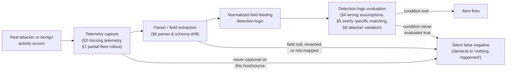
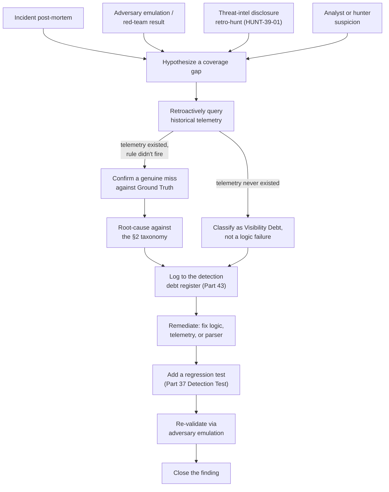

# Part 39 — False Negative Engineering

## Why this part exists

**[CONCEPT]** A False Negative (see TERMINOLOGY.md § False Negative) is malicious or policy-violating activity that met the criteria an analytic was built to catch and produced no alert. Part 38 covered the mirror problem — a detection that fires when it shouldn't — and that problem, however painful, announces itself: a false positive shows up in the queue, an analyst gets annoyed, a tuning ticket gets filed. A false negative produces nothing at all. There is no queue item, no ticket, no analyst annoyance, and no metric that moves. "Zero alerts on this technique this quarter" is consistent with two completely different realities — the technique genuinely didn't occur, or it occurred every week and the rule never saw it — and nothing in the alert stream itself can tell those two apart.

This part is about finding the second reality on purpose, because nothing else will. It works through six concrete mechanisms that turn a working detection into a silent one — missing telemetry, wrong assumptions baked into the logic, overly specific matching, parser changes that silently break field extraction, partial data-source coverage, and attacker variation — plus the schema-change failure mode that cuts across several of them, and it closes with the process a program needs to go looking for false negatives on a schedule, rather than discovering them only when an incident post-mortem or a red team finds one first.

---

## 1. Why false negatives are a structurally different failure mode

**[CONCEPT]** A false positive is a correctness problem inside a system that is otherwise working: the rule ran, produced a result, and the result was wrong. A false negative is a visibility problem about a system that, from every dashboard available to the team running it, looks like it's working fine. Recall (see TERMINOLOGY.md § Recall) — the fraction of actually-malicious activity that produced an alert, out of all such activity that occurred — is the metric this failure mode erodes, and it is the one metric in the whole detection-quality stack that cannot be computed from the alert stream itself. Precision only needs disposed alerts; recall needs Ground Truth (see TERMINOLOGY.md § Ground Truth) about activity that, by definition, never triggered anything to dispose.

That asymmetry has a direct consequence for how this part is organized. Every other part in this book teaches you to build or improve a detection by reasoning forward from telemetry to logic to alert. False-negative engineering runs the other direction: start from a claim that something happened and nothing fired, then work backward through the pipeline — was the telemetry even there, did the parser extract the field correctly, did the logic actually evaluate true against the real data shape, was the matching specific enough to survive the attacker's actual variation — to find which hop silently dropped it. Detective work, not construction work.

> **Engineering Reality**
> "Zero matching events" is a valid, unremarkable result for almost every query language in production use. A rule with a broken field reference, a rule pointed at a log source that stopped flowing three weeks ago, and a rule that's actually working but the technique genuinely didn't happen all return the identical answer: nothing. Nothing in the query result, the scheduled-search status, or the SIEM's health dashboard distinguishes "correctly found no matches" from "incorrectly found no matches" — which is why this failure mode needs its own dedicated review process (§11) rather than a passive wait for someone to notice.

---

## 2. A taxonomy of false-negative causes

**[CONCEPT]** Six mechanisms account for most real false negatives this book has evidence for, plus a seventh — schema drift — that acts as a common trigger for several of the others rather than a fully separate category. The table below names each one, states the mechanism plainly, and states how it's actually found in practice, since "review the rule logic" only catches some of these — several are invisible from the rule's own text.

| Cause | Mechanism | How it's usually found |
|---|---|---|
| Missing telemetry | The needed log source was never onboarded, or the specific field/event type within it was never enabled | Data Feasibility review (TERMINOLOGY.md § Data Feasibility) done retroactively, or an incident post-mortem asking "what would have shown this" |
| Wrong assumption baked into logic | The rule's author encoded a belief about how the environment behaves that is only sometimes true | Comparing the rule's stated logic against real telemetry samples the rule was never tested against |
| Overly specific matching | The rule matches an exact value, string, or narrow numeric range instead of the underlying behavior class | A minor attacker variation (new argument order, new default password, new user agent string) that a slightly broader rule would still have caught |
| Parser/extraction breakage | An agent, API, or log-format change silently changes a field's name, type, or presence, and the rule's field reference goes stale | Field-population monitoring (Part 5, Part 6) catching a field that's gone unexpectedly null or empty |
| Data gaps (partial coverage) | The log source exists and the rule is correct, but the specific host, region, or account involved was never actually inside the collection scope | Fleet/asset inventory reconciled against actual telemetry-source coverage, not just deployment intent |
| Attacker variation | The adversary changes a specific artifact — a tool, a credential pair, a protocol option — while keeping the underlying technique the same | Threat intelligence on technique evolution, or a hunt built explicitly to test whether the standing rule survives a known variant |
| Schema drift | A vendor update, agent migration, or API version change alters field names/types/values with no ingest error (TERMINOLOGY.md § Schema Drift) | Same as parser breakage — this is usually the *cause* of a parser or logic failure, not a distinct symptom on its own |

**Figure 39.1 — Where a false negative enters the pipeline (FIG-39-01).** *CONCEPTUAL.* Traces one occurrence of real activity through telemetry capture, parsing/extraction, normalization, and detection-logic evaluation, marking every hop that can silently route it into the same unrecoverable sink — a result indistinguishable from the activity never having happened. This is a conceptual data-flow sketch of the taxonomy in the table above, not a capture from any specific vendor pipeline.





Every arrow into the sink node is a different root cause with a different fix — the point of §§3–8 is to walk each one individually, with real evidence, so "false negative" stops being a single undifferentiated shrug and becomes a specific, findable defect.

---

## 3. Missing telemetry: detecting what you can't see

**[ENGINEERING]** The cleanest false negative is the one with no possible fix at the detection-logic layer at all: the event the rule needs was never captured, by any source, anywhere in the pipeline. This is Visibility Debt (TERMINOLOGY.md § Visibility Debt) at its most acute — not a source that's collected but unused, but a source that was never collected in the first place.

This project's own Pi-hole DNS query log is a working example of a telemetry boundary, not a gap in itself. CT100 forwards and caches every DNS lookup made by a device that's actually configured to use it as a resolver:

```text
Sep 15 08:32:47 dnsmasq[2221]: query[A] mykulprint.atrapa.deloitte.com from 192.168.1.169
Sep 15 08:32:47 dnsmasq[2221]: cached mykulprint.atrapa.deloitte.com is NXDOMAIN
```

*REAL LAB EXAMPLE.* Captured 2026-09-15 from CT100's `pihole.log` (`lab/evidence/ct100-pihole-dns-query-log.txt`) — a genuine forwarded query for a locally-mistyped hostname, resolved and cached with an NXDOMAIN response. This is exactly the kind of record a DNS-tunneling or beaconing detection (Part 15) needs.

> **Blind Spot**
> A DNS-based detection built entirely on this log source only sees a query at all if the querying device is actually configured to use this resolver, and only sees it in plaintext if the device sends it over ordinary UDP/TCP port 53 rather than DNS-over-HTTPS or DNS-over-TLS. A host with a hardcoded DoH endpoint bypasses the local resolver completely — no `dnsmasq` line is ever written, and a detection built on this telemetry alone is structurally blind to any T1071.004 (DNS) beaconing or exfiltration channel that travels that path. This isn't a tuning problem the rule can fix; it's a Data Feasibility gap (TERMINOLOGY.md § Data Feasibility) that has to be closed by adding a different collection point — egress firewall logging on port 443 to known DoH resolver IPs, or endpoint-level DNS-API hooking — not by writing a cleverer query against the resolver log that was never going to see the traffic.

This is the diagnostic test for a suspected missing-telemetry false negative: ask, concretely, whether the specific activity in question would ever produce a record in the source the rule queries, under any configuration the rule doesn't explicitly require and verify. If the honest answer is "only if the endpoint happens to be configured a certain way, and nothing checks that," the gap is telemetry, not logic, and no amount of rewriting the query fixes it.

---

## 4. Wrong assumptions baked into detection logic

**[DETECTION ENGINEER]** A more common — and more insidious — false-negative source than missing telemetry is a detection that has all the data it needs, but encodes a belief about the environment that is only sometimes true. The belief usually felt safe enough to skip stating out loud when the rule was written, and that's why it survives unexamined until something breaks it.

> **Detection Autopsy — "no TTY means it's automation, not an attacker"**
>
> **The rule:** Flags interactive `sudo` invocations to root or a service account — identified by requiring a `TTY=` field in the sudo log line — and explicitly excludes any invocation with no `TTY=` field, on the theory that a missing TTY means a scheduled or scripted process, not a human attacker at a keyboard.
>
> **Why it shipped:** The exclusion looked reasonable and, on the environment's own legitimate traffic, it was: CT100's real admin sudo activity consistently carries a `TTY=pts/1` field —
>
> ```text
> Jul 07 11:54:58 pihole sudo[33546]:     root : TTY=pts/1 ; PWD=/root ; USER=root ; COMMAND=/usr/bin/ss -tulpn
> ```
> *REAL LAB EXAMPLE.* Captured 2026-09-15 from CT100's `auth.log` (`lab/evidence/ct100-pihole-sudo-invocations.txt`) — a genuine interactive admin session.
>
> and CT104's own automated health-check script's `sudo` invocation has no `TTY=` field at all —
>
> ```text
> Sep 10 05:42:02 vulnscan sudo[2229]:     root : PWD=/root ; USER=vulnscan ; COMMAND=/usr/bin/sqlite3 /opt/vulnscan/data/vulnscan.db 'SELECT count(*) FROM scanner_errors;'
> ```
> *REAL LAB EXAMPLE.* Captured 2026-09-15 from CT104's systemd journal (`lab/evidence/ct104-vulnscan-sudo-invocations.txt`) — a genuine scripted, unattended sudo invocation.
>
> — so the exclusion cut real noise on real data, and nobody who reviewed it saw a false negative, because the exclusion had never yet been tested against an actual attacker.
>
> **How it failed:** `TTY=` is absent whenever `sudo` runs without an allocated pseudo-terminal — which describes the scripted health check, but also describes an attacker running a command non-interactively over SSH (`ssh host "sudo ..."`), a reverse shell invoking `sudo` from a non-TTY pipe, or a cron-triggered persistence mechanism the attacker planted. Every one of those produces a `sudo` log line with no `TTY=` field, identical in that one respect to the benign automation the rule was built to exclude — and the rule's exclusion logic has no way to tell them apart, because it never looked past that one field.
>
> **The fix:** Stop treating TTY absence as a benign signal on its own. Pair it with a positive allowlist of the exact command lines and invoking process lineage expected from known scheduled/scripted `sudo` use (per-script, per-account, reviewed as an Exception — TERMINOLOGY.md § Exception, on the same expiry discipline as any other tuning decision), and alert on any no-TTY `sudo` invocation that isn't an exact match against that allowlist, rather than excluding the entire no-TTY category outright.

**MITRE:** T1548.003 (Sudo and Sudo Caching).

The general pattern behind this failure is worth naming on its own: any field the rule treats as a *proxy* for intent — TTY presence as a proxy for "human," process name as a proxy for "legitimate," source-internal IP range as a proxy for "trusted" — is only as reliable as the assumption that an attacker can't produce the same proxy value while doing something malicious. Write the assumption down explicitly when the rule is authored, and treat it as a testable claim, not settled fact.

> **Blind Spot**
> The allowlist fix itself is a proxy-for-intent problem, one layer down: it matches on command-line text, not on what actually executes. An attacker with write access to `/opt/vulnscan` (or to whatever script an allowlisted command line invokes) who replaces the binary or script at that path — or repoints a cron entry so the same literal command string now runs a modified copy — produces an identical, allowlisted `sudo` invocation that never alerts. Command-line allowlisting confirms the invocation *looks* the same as the one reviewed when the exception was granted; it does not confirm that `/usr/bin/sqlite3`, or the script path, still resolves to the binary that was actually reviewed. Closing this needs the allowlist paired with file-integrity monitoring on the referenced binaries/scripts (Part 12), not command-line text alone.

---

## 5. Overly specific matching

**[DETECTION ENGINEER]** A detection that matches an exact string, a fixed list of values, or a narrow numeric band instead of the behavior class those values are meant to stand in for will miss every case that falls just outside the boundary it drew — and the honeynet's own credential-stuffing capture shows exactly how wide that boundary needs to be for even one unsophisticated attack pattern:

```text
id     ts                           src_ip           dst_port  username  password
-----  ---------------------------  ---------------  --------  --------  -----------------
10117  2026-09-10T09:08:30.443603Z  107.174.80.154             root      ------fuck------
10104  2026-09-10T09:07:30.815869Z  176.53.159.196             support   support
10092  2026-09-10T07:47:47.021592Z  186.242.162.94             admin     admin
10036  2026-09-10T02:26:30.572762Z  47.93.39.183               root      KgW41vmgMK
```

*REAL LAB EXAMPLE.* Captured 2026-09-15 from CT103's `ssh_events` table (`lab/evidence/ct103-honeynet-ssh-honeypot-credentials.txt`) — genuine SSH honeypot captures of real internet scanners' attempted credentials against the honeynet's decoy listener.

A rule authored by looking at a handful of real attack samples and hard-coding the observed username/password pairs — `admin`/`admin`, `support`/`support` — into an exact-match list would catch exactly those two rows and nothing else in this four-row sample: not the abusive troll-string password against `root`, not the fully random 10-character password also tried against `root`. The behavior class this data actually represents — many distinct, low-value credential pairs tried in bulk against one or a handful of usernames, from a rotating set of source addresses — has no fixed enumerable value at all; the specific strings are the least durable part of the pattern (this is the IOC-vs-IOA distinction from TERMINOLOGY.md § IOC vs. IOA vs. TTP in concrete form: the password string is a low-durability IOC, the volume/diversity shape is the durable IOA). A rule keyed to the volume and diversity of attempts per source — count of *distinct* username/password pairs against one destination within a window, regardless of what those values actually are — catches the credential-stuffing behavior itself rather than a snapshot of two of its instances, and survives the attacker rotating every credential pair on the list tomorrow.

> **False Positive Trap**
> Widening a matching rule from exact values to a behavior-based threshold trades one failure mode for another: a legitimate password-manager auto-fill retry loop, a misconfigured monitoring agent retrying a stale credential, or a user who fat-fingers a passphrase several different ways in one login attempt can all produce a small burst of distinct credential attempts from one source. The fix is the same discipline as any other threshold-based rule (Part 38): validate the chosen count/window against your own environment's legitimate retry behavior before deploying, and prefer a threshold justified by an observed baseline over one that merely "feels high enough."

---

## 6. Parser and schema changes that silently break extraction

**[ENGINEERING]** Part 5 covers parsers and Part 6 covers normalization because both are where a Log Source's raw text turns into fields a detection rule can actually reference — and both are where Schema Drift (TERMINOLOGY.md § Schema Drift) does its damage: a vendor update, agent migration, or version bump changes a field's name, format, or wording, the parser either extracts nothing or extracts the wrong thing, and the query still runs and still returns a result. It just returns zero.

CT104's own systemd journal for the `vulnscan-web` service shows a real service-lifecycle wording pattern that a naive rule could easily be built against:

```text
Sep 09 19:26:06 vulnscan systemd[1]: vulnscan-web.service: Deactivated successfully.
Sep 09 19:26:06 vulnscan systemd[1]: Stopped vulnscan-web.service - Vulnerability Scanner Dashboard (web).
Sep 09 19:26:07 vulnscan systemd[1]: Starting vulnscan-web.service - Vulnerability Scanner Dashboard (web)...
Sep 09 19:26:07 vulnscan systemd[1]: Started vulnscan-web.service - Vulnerability Scanner Dashboard (web).
```

*REAL LAB EXAMPLE.* Captured 2026-09-15 from CT104's systemd journal for `vulnscan-web.service` (`lab/evidence/ct104-vulnscan-web-systemd-state-changes.txt`) — a genuine, healthy restart cycle for a real application unit.

A detection built to flag unexpected service stops — say, "alert if a monitored unit logs `Stopped <unit>` with no matching `Starting <unit>` within five minutes" — depends entirely on `systemd` continuing to emit the literal word "Stopped" in that position. A `systemd` version upgrade that changes this wording (several real releases have altered unit-state log phrasing, added or dropped the trailing "successfully," or moved from a `Stopped`/`Started` pair to a differently worded transition set) doesn't error — the parser's regex or `EVAL`-based extraction simply stops matching the new line format, the field the rule references comes back null or the extraction produces zero rows, and the rule goes quiet on every subsequent stop event without producing a single log line anywhere saying so.

> **Engineering Reality**
> The same failure hits any parser built against literal log-line wording rather than a structured field, and it is not limited to open-source daemons — EDR agent upgrades routinely change field lengths, rename JSON keys, or alter how a command line is escaped, all without an ingest error. TERMINOLOGY.md's own Detection Debt example — an EDR migration that truncates `CommandLine` to a shorter length than the previous agent, silently blinding every rule matching against the untruncated field — is the same mechanism at a different layer. The only durable defense is a scheduled Adversary Emulation / Atomic Test (TERMINOLOGY.md § Adversary Emulation) re-run after every agent, parser, or log-source version change, not just at initial deployment — this is what closes Testing Debt (TERMINOLOGY.md § Detection Debt) before an incident does.

---

## 7. Data gaps: partial fleet and log-source rollout

**[ENGINEERING]** A detection can be correctly written, backed by a fully onboarded log source, and still miss real activity simply because the specific host involved was never actually inside that source's collection scope — a rollout gap rather than a design or logic defect. "We ingest Sysmon from the fleet" and "we ingest Sysmon from every host in the fleet" are different claims, and the gap between them is where a false negative in the uncovered minority hides, invisible to a coverage dashboard that reports a single aggregate percentage rather than naming which hosts are missing.

CT104's own failed-SSH-login capture is a real illustration of a detection that worked, on a source that happened to be present — and a reminder of how easily that could not have been the case:

```text
admin    ssh:notty    192.168.1.126    Mon Sep 14 01:17 - 01:17  (00:00)
admin    ssh:notty    192.168.1.126    Mon Sep 14 01:17 - 01:17  (00:00)
root     ssh:notty    192.168.1.126    Mon Sep 14 01:06 - 01:06  (00:00)
```

*REAL LAB EXAMPLE.* Captured 2026-09-15 from CT104's `/var/log/btmp` via `lastb` (`lab/evidence/ct104-vulnscan-ssh-failed-logins-btmp.txt`) — a genuine internal host (`192.168.1.126`) failing SSH authentication against CT104 dozens of times per minute, real evidence a per-host failed-login-burst rule can be validated against.

A rule built on this exact pattern only ever fires for a target host that is actually shipping its `/var/log/btmp` (or equivalent) to the pipeline the rule queries. A fleet where log forwarding was rolled out to 92% of hosts by inventory count — a number that sounds close to complete on a dashboard — still leaves every failed-login burst against the other 8% permanently invisible to this rule, with nothing about the rule's own logic changed or degraded in any way. The fix isn't a detection change at all: it's reconciling the *intended* deployment scope against *actual*, currently-reporting hosts on a recurring basis, and treating any host that drops out of that reconciliation as a Visibility Debt incident in its own right, not a quiet gap in a spreadsheet.

---

## 8. Attacker variation and adaptive evasion

**[THREAT HUNTER]** Every detection covered so far assumes the observed artifact is the artifact an attacker will keep using. Real adversaries — and, in this evidence set, real automated scanning tools — vary the specific parameters of an attack while keeping the underlying goal identical, and a rule keyed to yesterday's exact parameters goes quiet the moment those parameters change, with the technique itself continuing uninterrupted.

CT108's honeynet-edge SSH log captured a real, if internally-sourced, protocol/algorithm enumeration probe:

```text
Sep 10 16:21:03 honeynet-edge sshd[540]: error: Protocol major versions differ: 2 vs. 1
Sep 10 16:21:03 honeynet-edge sshd[539]: Unable to negotiate with 192.168.1.96 port 43036: no matching key exchange method found. Their offer: diffie-hellman-group1-sha1 [preauth]
Sep 10 16:21:03 honeynet-edge sshd[541]: Unable to negotiate with 192.168.1.96 port 43058: no matching host key type found. Their offer: ssh-rsa [preauth]
```

*REAL LAB EXAMPLE.* Captured 2026-09-15 from CT108's `sshd` unit journal (`lab/evidence/ct108-honeynet-edge-ssh-protocol-scan.txt`) — genuine SSH protocol- and algorithm-enumeration traffic from the lab's own vulnerability scanner (`192.168.1.96`) against the honeynet edge, offering legacy key-exchange and host-key algorithms (`diffie-hellman-group1-sha1`, `ssh-rsa`) and an SSHv1 banner.

**MITRE:** T1595.002 (Vulnerability Scanning).

A rule written to fire on this exact algorithm list — `diffie-hellman-group1-sha1`, `ssh-rsa`, and an SSHv1 banner — catches this scanner's current configuration precisely. It does nothing the day the scanning tool's default offer list changes to a different set of legacy or unusual algorithms, or the day a different tool with a different fingerprint runs the same reconnaissance goal. The durable signal here isn't the specific algorithm string; it's "an SSH client negotiation attempt that fails on algorithm mismatch, from a source making many such attempts in a short window" — a shape that survives the exact offered-algorithm list changing, in the same IOC-vs-IOA sense §5 named for credential values.

> **Hunter's Note**
> When you find a rule keyed to an exact list of attacker-controlled values — algorithm names, user-agent strings, file hashes, specific argument text — ask what the attacker would have to change to keep the same operational outcome while defeating the exact match. If the answer is "one configuration line in a tool they already run," that rule has an unbounded evasion path sitting one release away, and it's worth hunting for the behavior-shaped version of the same activity now, rather than waiting for the exact-match rule to silently stop firing after the next update.

---

## 9. Worked example: the SSH credential-stuffing threshold rule and its false-negative failure modes

**[DETECTION ENGINEER]** This section works one detection through from naive version to corrected version to its next blind spot, using CT104's internal brute-force capture and CT103's honeynet credential-stuffing data together — two real telemetry sets that happen to sit on opposite sides of the exact assumption this rule gets wrong.

### 9.1 The naive version

> **Detection Autopsy — "five failed SSH logins from one source in one minute"**
>
> **The rule:** Fires when the same source IP produces five or more failed SSH authentication attempts against one destination host within a 1-minute window.
>
> **Why it shipped:** It matches the textbook brute-force pattern exactly, and it matches real internal telemetry cleanly — CT104's own capture shows a single source (`192.168.1.126`) producing dozens of failed attempts per minute against one destination, precisely the shape the threshold is built to catch. The rule shipped after being validated against exactly this kind of single-source burst and looked, correctly, like a solid detection for that pattern.
>
> **How it failed:** The rule's threshold is keyed entirely to *one source IP*. CT103's honeynet correlation shows the actual credential-stuffing pattern that a botnet-driven campaign produces: many distinct source IPs, each responsible for only a handful of attempts, together making up a sustained campaign against the same handful of usernames —
>
> ```text
> session_id                        source_ip        status            mitre_techniques_json
> --------------------------------  ---------------  ----------------  --------------------------
> d48b795e47c04c6fbb456b17ddd219b9  16.5.0.236       possible_success  ["T1595","T1046","T1083","T1190"]
> 493dd9c65fbf4fcfa0c18fa5a3948b0f  45.156.128.131   possible_success  ["T1595","T1046","T1083","T1190"]
> ba0ab1f38e11455f83e48298d7b45c1e  45.156.128.45    exploit_attempt   ["T1595","T1046","T1190"]
> b7dc2e0c35d54a5c945eb05b9338d9f8  64.62.197.234    exploit_attempt   ["T1595","T1046","T1190"]
> ```
> *REAL LAB EXAMPLE.* Captured 2026-09-15 from CT103's `attack_sessions` table (`lab/evidence/ct103-honeynet-correlated-attack-sessions.txt`) — four of 20 genuine correlated attacker sessions, each from a distinct source address, against the same honeynet target. A single-IP threshold rule evaluates each of these sources independently and never sees the campaign they're jointly part of. This is the same, real "support/support" credential pair repeated by `176.53.159.196` (§5) and its `.197`/`.198` near-neighbors over multiple days — a slow, distributed campaign no per-IP count would ever cross a five-in-one-minute threshold.
>
> Every individual source stays comfortably under the five-per-minute bar. The naive rule combines two of §2's taxonomy entries at once: a wrong assumption baked into the logic (one attacker, one IP) and overly specific matching (the entity key is the source IP, when the actual entity is the credential-stuffing operation spanning many IPs).
>
> **The fix:** Stop keying the count to source IP alone. Aggregate by *destination account* and *credential-pair diversity* within a longer rolling window, so many low-volume sources targeting the same account(s) sum into one visible signal regardless of how many distinct IPs they arrive from.

### 9.2 The corrected rule — DET-39-01

**[DETECTION ENGINEER]** The following targets a generic Splunk deployment ingesting normalized SSH/auth failure events into a common index; adjust field and index names to your own normalized schema before use. It is illustrative of the aggregation shift the fix requires, not a drop-in production rule — the threshold and window are starting assumptions to validate against your own environment's baseline, per Part 31.

CONCEPTUAL SAMPLE — illustrative field/index names and thresholds; validate against your own normalized schema before deploying

```spl
| tstats count as attempt_count, dc(src_ip) as distinct_sources, dc(password_hash) as distinct_creds
    from datamodel=Authentication where Authentication.action="failure" Authentication.app="ssh"
    by Authentication.dest, Authentication.user
| where attempt_count >= 20 AND distinct_sources >= 5
| rename Authentication.dest as dest, Authentication.user as user
| table dest, user, attempt_count, distinct_sources, distinct_creds
```

This assumes a scheduled search run hourly over a trailing 60-minute window (`earliest=-60m@m`) so the rolling-window aggregation comes from the search's own time range rather than a `span` bucketed inside `tstats` — a `span` clause only does useful work in `tstats` when `_time` itself is part of the `by` list, which this query deliberately doesn't need since each scheduled run already covers exactly one window. This aggregates on `dest`/`user` rather than `src_ip`, so a campaign spread across many low-volume sources sums into one row instead of many individually sub-threshold ones — the fix §9.1 calls for. Its main limitation: it depends on `password_hash` (or any stand-in credential fingerprint) being captured at all — a source like CT104's `lastb`-derived btmp read exposes no attempted-password field whatsoever, so `distinct_creds` is unavailable for that source and the query has to fall back to `attempt_count`/`distinct_sources` alone there, which is a materially weaker signal.

> **Blind Spot**
> Both DET-39-01's hourly scheduled search (`earliest=-60m@m`, non-overlapping) and DET-39-02's `bin(TimeGenerated, window)` bucketing (§9.3) evaluate fixed windows aligned to clock boundaries, not a window anchored to when the activity actually happens. A campaign that fires 15 attempts against one `dest`/`user` in the last 10 minutes of one hourly run and another 15 in the first 10 minutes of the next crosses 20 total attempts inside 20 real-world minutes, but each scheduled execution only ever sees 15 of them — under the `attempt_count >= 20` bar both times, and never combined into a single evaluation, because neither query looks back across the boundary it just closed. Closing this needs either a genuinely rolling window (re-running more frequently than the window length, e.g., every 15 minutes over a trailing 60-minute span) or a running total keyed to `dest`/`user` that persists across scheduled-search executions instead of resetting at each boundary.

> **False Positive Trap**
> Aggregating by destination account instead of source IP fixes the distributed-source blind spot, but it also means any event that legitimately drives many distinct sources against one account in a short window will cross the same threshold. A shared service-account password rotation is the concrete case: every host or script still configured with the old credential retries it, from as many source IPs as there are hosts, immediately after the rotation — that burst can match `attempt_count >= 20 AND distinct_sources >= 5` on the very account the rotation was meant to secure, with zero attacker involvement. The fix: correlate against a change-management or credential-rotation feed (a scheduled job, a CI/CD secret-rotation event) and suppress or annotate alerts on `dest`/`user` pairs with a rotation event in the same window, rather than raising the attempt threshold — raising the threshold to dodge rotation noise raises it for a real distributed campaign too.

**MITRE:** T1110.004 (Credential Stuffing), T1110.001 (Password Guessing).

> **Detection Test**
> **Setup:** Lab SSH target with authentication-failure logging enabled, five or more source hosts/containers able to reach it (or a scripted equivalent simulating distinct source IPs).
> **Action:** From each of the five-plus sources, send four failed SSH authentication attempts against the same target account within the same 1-hour window — each individually well under any single-source threshold.
> **Expected result:** DET-39-01 fires on the aggregated `dest`/`user` row once `attempt_count` crosses 20 and `distinct_sources` crosses five, even though no single source individually produced more than four attempts — confirming the aggregation fix actually closes the gap the naive per-IP rule missed.

### 9.3 The blind spot that survives the fix — DET-39-02

**[DETECTION ENGINEER]** DET-39-01 fixes the single-source assumption but inherits a narrower version of §5's problem: it still counts toward one specific `dest`/`user` pair. A campaign that spreads its attempts across many *different* target accounts on the same host — rather than hammering one account from many sources — dilutes below the per-user threshold in exactly the same way the original rule diluted below the per-IP one. The following targets Microsoft Sentinel/Defender KQL and re-aggregates one level higher, by destination host alone, so the same volume is caught regardless of how many distinct accounts it's spread across.

CONCEPTUAL SAMPLE — illustrative table/field names and thresholds; validate against your own normalized schema before deploying

```kql
let window = 1h;
let minDistinctUsers = 5;
let minTotalAttempts = 20;
SSHAuthFailure
| where TimeGenerated >= ago(window)
| summarize TotalAttempts = count(), DistinctUsers = dcount(TargetUser), DistinctSources = dcount(SourceIp) by Bucket = bin(TimeGenerated, window), DestHost
| where TotalAttempts >= minTotalAttempts and DistinctUsers >= minDistinctUsers
```

This re-aggregation catches the same underlying credential-stuffing volume regardless of whether it's concentrated on one account or spread across several. Its main limitation is the one this whole worked example keeps surfacing in a new shape: any fixed grouping key — source IP, then account, now host — is a bet about which axis the campaign will concentrate on, and a sufficiently distributed attacker (many sources, many accounts, many destination hosts, each individually quiet) defeats any single fixed grouping and needs either a much wider correlation scope or a risk-based, cross-entity approach (Part 33) instead of a bounded threshold rule at all. It has a second, quieter dependency: `DistinctUsers` only counts failures where `TargetUser` was actually parsed. CT108's own protocol/algorithm-mismatch rejections (§8) are connection failures that never get far enough to offer a username at all — if `SSHAuthFailure` folds those pre-authentication negotiation failures in alongside real credential attempts, they inflate `TotalAttempts` and `DistinctSources` without ever incrementing `DistinctUsers`, which can push a pure scanning burst over the attempt/source thresholds while looking, on the `DistinctUsers` column alone, nothing like a multi-account credential-stuffing campaign. Filter `SSHAuthFailure` to rows where a credential was actually offered before applying this rule, or the aggregation conflates two different failure mechanisms in the same count.

> **What Would Change My Mind**
> This section treats "aggregate by destination host and account, with a five-source/20-attempt threshold" as sufficient coverage for the credential-stuffing pattern seen in this lab's real data. If a future campaign showed meaningful volume spread thin enough, across enough distinct destination hosts, that no single host ever crossed even DET-39-02's threshold — genuinely low-and-slow at the *fleet* level, not just the host level — that would mean threshold-based aggregation has run out of room entirely, and the right fix would be a fleet-wide risk score (TERMINOLOGY.md § Risk-Based Alerting) accumulating a small amount of suspicion per attempt across every host, rather than a wider version of the same per-host threshold.

---

## 10. Hunting for false negatives directly

**[THREAT HUNTER]** A standing detection only ever tells you about the cases it was built to catch. Finding the cases it wasn't requires deliberately going looking, on a schedule, rather than waiting for an incident to surface the gap first.

**HUNT-39-01 — Retroactive replay against newly disclosed indicators or techniques.**

- **Hypothesis:** A technique or indicator disclosed today (via threat intel, a vendor advisory, or a public incident writeup) was also active against this environment before today, and the standing detection stack — built without knowledge of it — never alerted on it.
- **Approach:** Re-run the new indicator or behavioral pattern against retained historical telemetry rather than only monitoring forward from disclosure date. CT100's DNS query log is a direct example of the kind of retained source this hunt needs: a newly disclosed C2 domain or DGA pattern can be checked against weeks of past `dnsmasq` query records to see whether it was ever queried before anyone had a reason to look for it.
- **Disposition:** A clean historical result is itself a useful negative finding worth recording (this specific indicator wasn't active in this environment during the retained window) — not proof the environment was never exposed, since it only covers what the DNS log's retention window and collection scope actually include (§3, §7). A match against historical data becomes a retroactive incident investigation, not a routine hunt closeout.

**HUNT-39-02 — Distributed credential-stuffing campaigns that stay under every per-entity threshold.**

- **Hypothesis:** A credential-stuffing campaign against this environment currently evades DET-39-01/DET-39-02 by spreading attempts thin enough across sources, accounts, or destination hosts that no single grouping key ever crosses the configured threshold, per the What Would Change My Mind box in §9.3.
- **Approach:** Rather than grouping by any one fixed key, cluster failed-authentication events by shared, low-durability artifacts that tend to survive across a botnet's individual nodes — repeated exact credential pairs (as `176.53.159.196` and its `.197`/`.198` near-neighbors show in CT103's real data, §5, §9.1), shared client-version banners, or adjacent source-address ranges — and look for a cluster whose *combined* volume is significant even though no member of it individually is.
- **Disposition:** A cluster that reproduces a known campaign shape becomes a candidate for a new, differently-keyed detection (widening DET-39-02's grouping to the shared artifact that ties the cluster together). No qualifying cluster found is a genuine negative result, filed with the specific clustering approach tried, so the next review doesn't repeat the identical hunt from scratch.

---

## 11. The formal false-negative review process

**[SOC MANAGEMENT]** Finding one false negative through a hunt or a post-mortem is useful; treating false-negative discovery as a standing, scheduled process is what actually moves Recall over time instead of just closing one gap and waiting for the next incident to find the rest. The loop below is deliberately not a one-off checklist — it names an entry point, a decision point that separates "telemetry problem" from "logic problem" early (so the wrong team doesn't spend a week on the wrong fix), and an exit that feeds back into testing rather than ending at remediation.

**Figure 39.2 — The false-negative review loop (FIG-39-02).** *CONCEPTUAL.* Illustrates how a suspected coverage gap moves from initial trigger through confirmation, root-cause classification against the §2 taxonomy, remediation, and regression testing, closing back into the standing detection-testing cycle rather than ending at a one-time fix. This is a conceptual process sketch of the review workflow, not a capture of any specific ticketing system.





A few points in this loop are worth stating explicitly rather than leaving implicit in the diagram:

- **The retroactive-telemetry-query step comes before root-cause classification, not after.** If the telemetry never existed for the window in question, the finding is Visibility Debt and belongs to the team that owns log-source onboarding, not the team that owns rule logic — sending it straight to a detection engineer to "fix the rule" wastes a review cycle on a problem no rule change can solve.
- **A confirmed miss needs Ground Truth, which is never fully available.** In practice this usually means corroborating evidence from a separate source — a different log, a red-team report, a confession from the incident itself — not a single query result. Treat a suspected miss that can't be corroborated against anything else as an open question, not a closed finding either way.
- **The loop's exit is a regression test, not a fixed rule.** Remediating the specific gap found and stopping there leaves the program with no way to know if the same gap reopens after the next agent upgrade, parser change, or environment shift — which is exactly the schema-drift mechanism from §6 recurring silently a second time.

> **SOC Management View**
> A formal false-negative review has a real cost most coverage dashboards don't budget for: retained historical telemetry long enough to query backward over, red-team or adversary-emulation time to generate confirmable test cases, and analyst/engineer hours spent confirming a *negative* result, which produces no alert count, no closed ticket, and no visible throughput metric to show for the time spent. Programs that measure detection-engineering productivity purely by rules shipped or alerts triaged will systematically underfund this work, because a successful false-negative review's most common outcome — "we checked, and the coverage gap we suspected doesn't actually exist" — looks identical to time spent finding nothing. Budget it as a fixed proportion of detection-engineering capacity on a recurring cadence (quarterly, or after any material telemetry/agent change), not as ad hoc time squeezed in between rule-authoring work, and count a well-documented negative finding as real output, not wasted effort.

---

Remediating a false negative doesn't close as cleanly as remediating a false positive does in Part 38 — there's no falling alert-volume metric to point to as proof it worked. That's exactly why false-negative remediation routes into Part 37's testing discipline and Part 43's Detection Debt tracking rather than ending at the fix itself: "we fixed it" is only verifiable through a regression test and a re-validation, not through a metric that moves on its own. Part 40 picks several of the naive rules seeded across earlier parts — including the per-source-IP brute-force assumption this part's own worked example builds on — and dissects them together as a capstone; Part 41 (Detection Coverage) and Part 43 (Detection Debt) are where the gaps this part finds get tracked at the program level rather than the single-rule level this part has worked at throughout.
