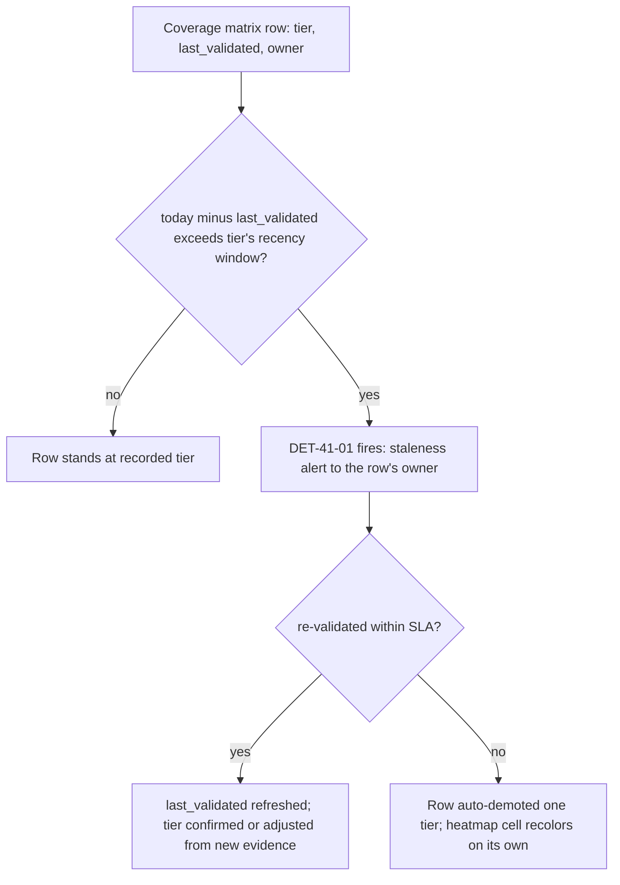

# Part 41 — Detection Coverage

## Why this part exists

**[CONCEPT]** Part 1 used the word "coverage" exactly once and refused to let it stand alone: telemetry coverage (does the data exist) and detection coverage (does a tested, tuned analytic exist that can reliably act on that data) are different claims, and TERMINOLOGY.md defines a six-tier scale — from no visibility through tested/recently validated — specifically because a single aggregate percentage hides which tier any given technique actually sits at. This part delivers that deferred material in full: the exact six tiers, what evidence justifies placing a technique at each one, a worked matrix that mixes all six honestly, and the maintenance discipline that keeps the matrix from decaying into exactly the all-green heatmap it exists to prevent.

The failure mode this part is built to name is specific, not vague: an ATT&CK Navigator heatmap colored by "does at least one rule reference this technique ID" looks identical whether that rule fires reliably against real attacker behavior or has never once been tested, references a field that stopped populating eight months ago, or was disabled in a tuning pass nobody documented. All four of those states render the same green cell. A coverage program that reports a single number — "we cover 340 of 600 ATT&CK techniques" — is reporting the count of green cells, not the count of techniques an attacker would actually fail to execute against a defended estate. This part's job is to make the difference between those two claims impossible to collapse back into one number.

**MITRE:** This part does not introduce new technique coverage of its own. The worked matrix in §4 uses ten real techniques — T1110.003 (Password Spraying), T1558.003 (Kerberoasting), T1003.001 (LSASS Memory), T1071.004 (DNS), T1021.006 (Windows Remote Management), T1055.012 (Process Hollowing), T1098.001 (Additional Cloud Credentials), T1567.002 (Exfiltration to Cloud Storage), T1078.004 (Cloud Accounts), and T1197 (BITS Jobs) — as a teaching sample, not as a claim about any specific organization's actual state.

---

## 1. The all-green heatmap problem

### 1.1 What a heatmap cell actually measures, by default

**[SOC MANAGEMENT]** The default ATT&CK Navigator export most SOC teams generate answers exactly one question: does at least one deployed rule carry this technique's tag in its metadata. That is a Detection Rule inventory count, not a Detection Coverage statement (TERMINOLOGY.md § Detection Rule, § Detection Coverage draws this line explicitly). A rule tagged `attack.t1003.001` that has been silently returning zero results for six months because an EDR migration renamed the field it queries (Visibility Debt manifesting as Parser Debt — TERMINOLOGY.md § Detection Debt) colors the cell exactly as green as a rule that fired correctly against a red-team LSASS dump three weeks ago. Both are "covered" by the metadata-count definition. Only one of them would actually stop anything.

> **Engineering Reality**
> Most SIEM and XDR vendor "MITRE coverage" dashboards compute coverage the metadata-count way — a rule's technique tag counted as covered the moment the rule is created, deployed or not, firing or not, tested or not. This is not a vendor conspiracy; it's the only computation the vendor's own metadata actually supports without a separate coverage-tracking layer. Treat any vendor-native coverage percentage as an upper bound on real coverage, never as the figure itself, and build the six-tier matrix in §2 as a layer on top of, not instead of, that dashboard.

### 1.2 Why "we have coverage for X" fails as a sentence

**[SOC MANAGEMENT]** TERMINOLOGY.md is direct about this: bare "coverage" is an incomplete sentence in this book, and the same rule applies to every part downstream of this one. "We have coverage for lateral movement" answers nothing an analyst, an auditor, or a CISO actually needs. "MULTI-SOURCE DETECTION for T1021.001 (RDP) on the Windows fleet; NO VISIBILITY for T1021.006 (WinRM)" answers all three at once, because it names the technique at sub-technique granularity, the tier, and — implicitly — the scope the claim is bounded to (the Windows fleet, not the whole estate). Every coverage statement in this book, and every one this part asks a reader to write going forward, takes that second shape.

---

## 2. The six-tier detection coverage model

### 2.1 The tiers, defined precisely

**[CONCEPT]** TERMINOLOGY.md § Detection Coverage fixes these six tiers as the standard expression of detection coverage. Report coverage as a distribution across them, never as a single aggregate percentage.

The table below states, for each tier, what evidence justifies the claim and what specifically distinguishes it from the tier on either side — the distinctions are where most coverage-matrix disputes actually live.

| Tier | What it claims | Evidence required | Distinguished from the tier below by |
|---|---|---|---|
| `NO VISIBILITY` | No telemetry exists for this technique at all. | A named, checked absence — not silence. | — (floor tier) |
| `TELEMETRY ONLY` | The needed log source is flowing, but no analytic evaluates it. | A confirmed, populated field/event in the pipeline, with no rule referencing it. | Data exists; nothing reads it yet. |
| `PARTIAL DETECTION` | A deployed analytic exists with a named, specific evasion path. | The analytic's own logic plus a documented gap (a variant it does not match). | An analytic exists at all, vs. none. |
| `RELIABLE DETECTION` | An acceptable false-positive rate against production data, from one telemetry source. | Disposition history (TP/FP counts) over a stated window. | The evasion path from `PARTIAL DETECTION` is closed or narrow enough to accept. |
| `MULTI-SOURCE DETECTION` | Two or more independent sources would each, on their own, catch the technique. | Two analytics, different log sources, each independently validated. | A single source's outage or evasion no longer means total blindness. |
| `TESTED / RECENTLY VALIDATED` | Proven via Adversary Emulation within a defined recency window. | A dated Atomic Test / emulation run, with the analytic firing as expected, inside the program's recency window (commonly 90 days). | The claim is current, not historical. |

**[DETECTION ENGINEER]** Two things about this table are easy to misread on a first pass. First, the tiers are not a maturity ladder every technique should climb to the top of — `TESTED / RECENTLY VALIDATED` on a technique nobody's threat model cares about is wasted validation effort better spent re-testing something that matters. Second, `MULTI-SOURCE DETECTION` and `TESTED / RECENTLY VALIDATED` are not strictly ordered by "better" in every dimension: a single-source rule tested against a real adversary emulation eleven days ago is, for the specific question "would this fire right now," more trustworthy than a two-source rule nobody has emulation-tested in fourteen months. The six-tier scale orders evidentiary strength for the *coverage claim*, not operational risk for every possible reader question — see the What Would Change My Mind box in §6 for the specific case where this ordering itself needs revisiting.

### 2.2 Promotion and regression: tiers are not sticky

**[DETECTION ENGINEER]** A coverage matrix that only ever moves rows upward is not honest — it is a progress log with the regressions edited out. Every tier boundary in §2.1 has a real-world event that pushes a row back down, and a matrix that doesn't model regression will show green cells for techniques that stopped being covered months ago.

**Figure 41.1 — The six-tier detection coverage model, with promotion and regression paths.** *CONCEPTUAL.* Illustrates that every tier boundary has a corresponding regression trigger (dashed arrows) as well as a promotion trigger (solid arrows); this is the book's own recommended state model for a coverage matrix, not a capture of any specific vendor platform's coverage dashboard. §6 develops the regression side of this diagram into a concrete, automatable detection (DET-41-01). Diagram ID `FIG-41-01`.

```mermaid
flowchart LR
    A["NO VISIBILITY"] -->|"log source onboarded"| B["TELEMETRY ONLY"]
    B -->|"analytic built and deployed"| C["PARTIAL DETECTION"]
    C -->|"evasion path closed, FP rate acceptable"| D["RELIABLE DETECTION"]
    D -->|"second independent source validated"| E["MULTI-SOURCE DETECTION"]
    E -->|"adversary emulation passes in-window"| F["TESTED / RECENTLY VALIDATED"]
    F -.->|"recency window expires, no re-test"| E
    E -.->|"one source breaks silently (schema drift)"| D
    D -.->|"new evasion path discovered"| C
    C -.->|"telemetry source stops flowing"| B
    B -.->|"log source decommissioned or defunded"| A
```






> **Blind Spot**
> A coverage matrix that records only the current tier, with no history, cannot answer "how long was this row wrong before anyone noticed." A row silently regressed from `RELIABLE DETECTION` to `TELEMETRY ONLY` by a parser change three months ago and never re-checked looks, in a snapshot view, identical to a row that has genuinely held `RELIABLE DETECTION` the whole time. Store a dated tier-change history per row, not just a current-state field — Part 43 (Detection Debt) depends on that history existing to compute how long debt has been accruing, not just that it exists now.

---

## 3. What a coverage-matrix row needs

### 3.1 The schema

**[DETECTION ENGINEER]** A matrix row that only records a technique ID and a color is not a coverage matrix; it is the same all-green heatmap in a different tool. A row needs, at minimum: the technique or sub-technique ID and name, the assigned tier, the specific telemetry source(s) the claim depends on, the Detection Rule ID(s) implementing it (if any), a dated evidence reference for the current tier, the date of last validation, an owner, and — for any row below `MULTI-SOURCE DETECTION` — a named gap: the specific evasion path, missing source, or untested condition that keeps it from the next tier up. That last field is the one most real matrices skip, and it's the one that turns a status board into an actual backlog.

### 3.2 Grounding a row in real evidence: the honeynet example

**[THREAT HUNTER]** Most of this part's worked examples, by necessity, use illustrative data — a production coverage matrix is internal and specific to one organization's rule set. One real artifact is worth walking through directly, because it shows what a genuine "evidence" field looks like rather than an invented one. The table below is drawn from `lab/evidence/ct103-honeynet-correlated-attack-sessions.txt`, a real export from the honeynet platform's own `attack_sessions` table (CT103, captured 2026-09-15), which the platform itself builds by correlating raw rows from its `ssh_events`, `http_events`, and `network_events` tables.

| Session (truncated) | Source IP | Status | MITRE techniques | What the status means for a coverage claim |
|---|---|---|---|---|
| `d48b795e...` | `16.5.0.236` | `possible_success` | T1595, T1046, T1083, T1190 | An exploit-shaped request was correlated to continued activity from the same source across two of the three raw event tables. |
| `ba0ab1f3...` | `45.156.128.45` | `exploit_attempt` | T1595, T1046, T1190 | An exploit-shaped request was seen; no follow-on activity was correlated to it. |
| `315450d4...` | `198.235.24.204` | `possible_success` | T1595, T1046, T1190 | Same pattern as the first row, different source and target. |

**MITRE:** T1595 (Active Scanning), T1046 (Network Service Discovery), T1083 (File and Directory Discovery), T1190 (Exploit Public-Facing Application).

This is real evidence of `RELIABLE DETECTION` for T1190 within the honeynet's own scope — not `MULTI-SOURCE DETECTION`, and the distinction is worth working through in full because collapsing it is exactly the error §2.1's tier table warns a matrix builder into making. The platform's `http_events` source alone is what promotes a session to `exploit_attempt`: an exploit-shaped web request (traversal/CVE-path/SQLi-like) against the decoy target is sufficient on its own, with or without any correlated `network_events` hit. The `network_events` reconnaissance signal (feeding T1595/T1046) is joined in afterward, on a shared source-IP-to-target key within a bounded window, to decide whether a given `exploit_attempt` gets escalated to `possible_success` — and by the correlation's own logic, neither source alone justifies *that* label. That is the textbook definition of Correlation (TERMINOLOGY.md § Correlation: "no single constituent event would justify an alert on its own"), which is a different claim from Multi-Source Detection (TERMINOLOGY.md § Detection Coverage: "two or more independent sources would each, on their own, catch the technique"). `network_events` alone does not catch T1190 — it catches reconnaissance, a different technique — so T1190 has exactly one source that can detect it here, not two. The honest row is `RELIABLE DETECTION` for T1190, single source (`http_events`), with the `network_events` correlation recorded separately as a confidence signal that helps prioritize which `exploit_attempt` sessions get analyst review first. A row backed by an evidence citation this specific — table name, capture date, join logic — is what §3.1's "evidence reference" field is supposed to force someone to produce; getting the tier itself wrong on top of good evidence is a worse failure mode than a vague citation, because it reads as more credible than it is.

> **Blind Spot**
> Every row in the table above tops out at `possible_success` — the honeynet's own correlation logic detects the *exploit attempt plus follow-on activity*, not confirmed post-exploitation impact. That is a real, specific limit on the coverage claim, not a rounding error: a coverage row for T1190 built from this evidence supports `RELIABLE DETECTION` for "an exploit attempt against this application occurred," optionally annotated with "and the source kept interacting" where the correlation fired, not for "the exploit succeeded and the attacker achieved code execution." Confusing those two claims is exactly the kind of overclaim §1 exists to prevent — the fix isn't to inflate the tier, it's to write the row's scope narrowly enough that the tier claim is actually true.

---

## 4. Worked matrix: ten techniques, honestly mixed

### 4.1 The matrix

**[DETECTION ENGINEER]** The matrix below is a teaching sample (CONCEPTUAL SAMPLE) built to demonstrate an honest spread across all six tiers on one page — a real organization's matrix runs to hundreds of rows and rarely lands so evenly, but a training example that's all green teaches the wrong lesson before the first paragraph of prose does.

| Technique | Tactic | Tier | Telemetry source(s) | Gap keeping it from the next tier | Last validated |
|---|---|---|---|---|---|
| `T1110.003` Password Spraying | Credential Access | RELIABLE DETECTION | IdP sign-in log | Single source; no second independent signal (e.g., network-layer auth telemetry) joined in. | 2026-06-02 |
| `T1558.003` Kerberoasting | Credential Access | PARTIAL DETECTION | `4769` (Kerberos service ticket request) | Rule matches RC4 (`0x17`) ticket requests only; an AES-requesting Kerberoasting tool evades it entirely. | 2026-04-18 |
| `T1003.001` LSASS Memory | Credential Access | MULTI-SOURCE DETECTION | EDR process-access telemetry + Sysmon `10` (ProcessAccess) | Neither source is emulation-tested against the current EDR agent version. | 2025-11-30 |
| `T1071.004` DNS | Command and Control | TELEMETRY ONLY | DNS resolver query log | Logs flow and are queryable; no entropy/rarity analytic has been built against them yet. | — |
| `T1021.006` Windows Remote Management | Lateral Movement | NO VISIBILITY | — | WinRM operational log is not collected from any host in the fleet. | — |
| `T1055.012` Process Hollowing | Defense Evasion | TESTED / RECENTLY VALIDATED | EDR behavioral telemetry | None currently open; re-test due before the 90-day window lapses. | 2026-09-03 |
| `T1098.001` Additional Cloud Credentials | Persistence | PARTIAL DETECTION | Cloud identity provider audit log | Rule matches console-issued credentials; API-issued credentials for the same account bypass the audit event the rule keys on. | 2026-05-11 |
| `T1567.002` Exfiltration to Cloud Storage | Exfiltration | NO VISIBILITY | — | Egress proxy does not decrypt TLS to sanctioned cloud-storage domains; no field exists to distinguish legitimate use from exfiltration. | — |
| `T1078.004` Cloud Accounts | Persistence / Initial Access | RELIABLE DETECTION | Cloud IdP sign-in log (impossible-travel rule) | Single source; no correlation to a second identity signal (e.g., device-compliance state). | 2026-07-20 |
| `T1197` BITS Jobs | Defense Evasion | TELEMETRY ONLY | `4688` (process creation), full command line captured | Command lines are logged; no analytic filters for `bitsadmin`/BITS-job-creation patterns specifically. | — |

Reading the "Last validated" column against the "Tier" column is the point of the exercise: three of the ten rows carry no validation date at all, because `NO VISIBILITY` and `TELEMETRY ONLY` rows have nothing to validate yet — a rule that doesn't exist can't be tested. That is not a defect in the table; it's the honest state, and a matrix that fills those cells with a date anyway (because a template requires one) is manufacturing the same false confidence a green heatmap cell does.

> **What Would Change My Mind**
> This matrix assumes ten rows spread this evenly is a reasonable teaching sample. If a reader's actual production matrix, honestly assessed with this same rigor, showed a similarly even six-way split across hundreds of real techniques, that would be a genuinely unusual and strong program — most real programs skew heavily toward `TELEMETRY ONLY` and `PARTIAL DETECTION`, with a long tail at `NO VISIBILITY` and only a handful of high-priority techniques ever reaching `TESTED / RECENTLY VALIDATED`. A matrix that comes back looking like this table on the first real assessment is worth a second, more skeptical pass before anyone reports it upward.

### 4.2 Case study: T1055.012 through all six tiers

**[DETECTION ENGINEER]** Row six's date didn't appear from nothing; walking one row's actual history is more instructive than the snapshot table alone. A hypothetical but representative history for T1055.012 (Process Hollowing) on a Windows fleet:

- **NO VISIBILITY (baseline):** No process-injection-specific telemetry existed; only Event ID 4688 (Process Creation) was collected, and process hollowing's defining behavior — a process's memory image replaced after creation — leaves no trace in a bare process-creation event.
- **TELEMETRY ONLY:** EDR deployment added behavioral telemetry capturing memory-write and thread-context operations between processes. The field existed and was queryable; no analytic read it yet.
- **PARTIAL DETECTION:** A first analytic matched a suspicious parent-child pairing plus a remote `WriteProcessMemory`-class call into a newly created, still-suspended process — but a variant that hollowed a process already running (rather than one just created for the purpose) evaded it, a gap the analyst documented rather than papered over.
- **RELIABLE DETECTION:** The rule was widened to catch both variants, and thirty days of disposition data against production traffic showed an acceptable false-positive rate — the remaining false positives traced to one specific, allowlisted diagnostic tool, not to the rule's core logic.
- **MULTI-SOURCE DETECTION:** A second, independent analytic — a memory-scanning heuristic run by the EDR's own kernel driver, built and validated separately from the behavioral-telemetry rule above — reached the same acceptable false-positive rate on its own.
- **TESTED / RECENTLY VALIDATED:** An Atomic Red Team run of the T1055.012 test executed on a lab host, both analytics fired as expected, and the result — with a timestamp — was recorded against the matrix row.

> **Detection Test**
> **Setup:** Domain-joined Windows test host, EDR agent installed and reporting, no local admin rights required beyond what the atomic test itself needs.
> **Action:** Execute the Atomic Red Team test corresponding to T1055.012 (Process Hollowing) against a benign target process on the test host.
> **Expected result:** Both analytics referenced in the case study above produce an alert keyed to the test host and the injected process's PID, within the platform's normal alert-latency window; a miss on either analytic is logged as a regression against this matrix row, not silently re-run until it passes.

**[ENGINEERING]** The illustrative query below is the kind of check a coverage-tracking pipeline runs immediately after an atomic test like the one above, to confirm the expected alert actually appeared before marking the row `TESTED / RECENTLY VALIDATED` — it targets a generic SIEM search API returning alert records, not any specific vendor's query language.

```text
CONCEPTUAL SAMPLE -- illustrative post-test verification query, generic search-API shape,
not validated against any specific SIEM's actual query syntax.

search alerts
| where analytic_id in ("DET-11-XX-process-hollowing-behavioral", "DET-11-XX-process-hollowing-memscan")
| where host == "<test-host>"
| where timestamp > "<atomic-test-start-time>"
| stats count() by analytic_id
// expect exactly one row per analytic_id, count >= 1;
// zero rows for either analytic_id is a failed validation, not a row to mark TESTED anyway
```

This check's main limitation is that it only confirms the alert fired at all — it says nothing about alert latency, about whether the fields the analyst needs for triage were populated correctly, or about a second run producing a duplicate alert that a dedup rule silently swallows. Treat a passing result here as necessary, not sufficient, evidence for `TESTED / RECENTLY VALIDATED`.

### 4.3 Falsifying a PARTIAL DETECTION claim

**[THREAT HUNTER]** Row two's gap — an RC4-only Kerberoasting rule evaded by an AES-requesting tool — is exactly the kind of documented gap a hunt should go verify rather than take on faith from whoever wrote it down originally.

> **HUNT-41-01 — Does the RC4-only Kerberoasting rule actually miss AES ticket requests?**
>
> **Threat Hypothesis:** A Kerberoasting tool configured to request AES (`0x11`/`0x12`) service tickets instead of RC4 (`0x17`) should produce Event ID 4769 (Kerberos service ticket request) entries the matrix's `PARTIAL DETECTION` rule for T1558.003 (Kerberoasting) does not match, despite the underlying attacker behavior — requesting a service ticket for an SPN-registered account, offline for cracking — being identical.
>
> **Method:** In an isolated lab domain, request a service ticket for a deliberately weak-password service account using AES-only encryption support, and check whether the existing rule's query — filtered on `TicketEncryptionType = 0x17` — evaluates true against the resulting 4769 event.
>
> **Finding:** Confirmed, as documented: the AES-encrypted request produces a 4769 entry with `TicketEncryptionType` = `0x12`, which the existing rule's filter does not match. The gap recorded in the matrix row is real, not theoretical, and the hunt converts it from an assumed gap into a verified one with a dated finding — the correct outcome per TERMINOLOGY.md § Hunt, which requires either a documented negative finding or a new detection candidate, never "nothing found, moving on."
>
> **New detection candidate:** Dropping the RC4-only filter to also match AES ticket types is not, by itself, a viable fix — it removes the one condition that made the original rule selective without replacing it with anything else. The candidate needs a volume discriminator instead: flag an SPN-registered, non-allowlisted account only when one source account requests service tickets for an unusual number of distinct SPNs within a short window (e.g., more than a handful in an hour), regardless of encryption type. That's the actual Kerberoasting signature — a tool enumerating many SPNs fast — not the ticket's encryption type, which the AES-capable finding above shows is not a reliable discriminator either way. See the False Positive Trap box below before treating either version of this candidate as ready to move the row toward `RELIABLE DETECTION`.

> **False Positive Trap**
> Every AES-capable domain client generates a 4769 with an AES ticket type every time it authenticates to any SPN-mapped service — that's not an edge case, it's the bulk of a domain's normal Kerberos traffic, since AES is the modern Windows default. A rule that flags "AES or RC4 request against a non-allowlisted SPN account" with no other condition matches nearly every legitimate service-ticket request in the environment, the mirror image of the false-positive mechanism the STYLE-GUIDE's own worked Kerberoasting example describes for the original RC4-only rule. Keying the widened rule on request volume/rate per source account, not on ticket presence or encryption type alone, is what keeps it from drowning in exactly the noise dropping the RC4 filter would otherwise create.

---

## 5. Sub-technique granularity is not optional

**[DETECTION ENGINEER]** TERMINOLOGY.md § MITRE ATT&CK Technique / Sub-technique states this directly: a rule tagged only `attack.t1055` with no sub-technique is not specific enough for a coverage matrix row, because parent-technique-only coverage claims obscure which specific implementation paths are and are not detected. T1055 (Process Injection) has around a dozen documented sub-techniques — hollowing, DLL injection, thread execution hijacking, APC injection, and others — and a rule built against one sub-technique's specific mechanism says nothing reliable about the others. A matrix row that reads "T1055 — RELIABLE DETECTION" because one sub-technique's rule works well is the sub-technique-level version of the exact all-green heatmap problem this part opened with: it reports the count of covered mechanisms as if it were coverage of the parent category. Every row in this part's matrix, and every row a reader builds from it, tracks at the sub-technique level wherever ATT&CK defines one, and at the parent level only for techniques (like T1197) that genuinely have none.

---

## 6. Keeping the matrix honest over time

### 6.1 Regression has to be automatic, not a retrospective

**[ENGINEERING]** §2.2 established that every tier has a regression trigger. The operational failure this section exists to prevent is treating regression as something a quarterly review discovers, rather than something the matrix itself detects the moment it happens. A `TESTED / RECENTLY VALIDATED` row whose recency window (commonly 90 days, per TERMINOLOGY.md § Adversary Emulation / Atomic Test) has lapsed with no re-test is not still `TESTED` because nobody's looked at it — it is, factually, back to whatever its evidence actually supports right now, which is usually `MULTI-SOURCE DETECTION` or `RELIABLE DETECTION` depending on what's still validated underneath it.

> **DET-41-01 — Coverage-row staleness alert**
>
> Fires when a matrix row's `last_validated` date exceeds the recency window defined for its current tier, before any human notices on a review cadence. This is a meta-detection: it monitors the coverage program's own state, not attacker telemetry, and its target platform is whatever database or ticketing backend the coverage matrix itself lives in (a dedicated coverage-tracking tool, or a table alongside the detection-rule inventory in the SIEM's own metadata store).

```sql
-- CONCEPTUAL SAMPLE -- illustrative SQL against a coverage-matrix table shaped like the
-- schema in Section 3.1 (technique_id, tier, last_validated, owner); targets a generic
-- relational backend, not validated against any specific coverage-tracking product.
SELECT
    technique_id,
    tier,
    last_validated,
    owner,
    CASE tier
        WHEN 'TESTED_RECENTLY_VALIDATED' THEN 90
        WHEN 'MULTI_SOURCE_DETECTION'    THEN 180
        WHEN 'RELIABLE_DETECTION'        THEN 180
        ELSE NULL  -- PARTIAL/TELEMETRY/NO VISIBILITY rows aren't dated against a recency SLA
    END AS recency_window_days
FROM coverage_matrix
WHERE tier IN ('TESTED_RECENTLY_VALIDATED', 'MULTI_SOURCE_DETECTION', 'RELIABLE_DETECTION')
  AND (
        last_validated IS NULL  -- a row at these tiers with no validation date is the worst
                                 -- case, not a pass -- flag it immediately, don't let a NULL
                                 -- comparison silently drop it from the result set
        OR last_validated < CURRENT_DATE - (CASE tier
             WHEN 'TESTED_RECENTLY_VALIDATED' THEN INTERVAL '90' DAY
             ELSE INTERVAL '180' DAY
           END)
      )
ORDER BY last_validated ASC;
```

Two things about this query are easy to get wrong. First, the `WHERE` clause has to apply each tier's own window from the same `CASE` logic used in the `SELECT` — an earlier draft of this query hard-coded a single 90-day cutoff in the `WHERE` clause while still computing 180 days for `MULTI_SOURCE_DETECTION`/`RELIABLE_DETECTION` in the `SELECT`, which would have flagged those two tiers as stale up to 90 days early on every row, a self-inflicted false-positive staleness storm. Second, `last_validated IS NULL` has to be checked explicitly: a bare `last_validated < ...` comparison against `NULL` evaluates to unknown, not true, so a row that was never validated in the first place — arguably the single worst state a matrix row can be in — would otherwise never appear in this query's output at all. Beyond those two fixes, a 90/180-day window is still a program-chosen policy value, not a universal constant — a technique tied to a fast-moving adversary campaign may need a tighter window than any static tier default provides. A production implementation should read the window from a per-tier or per-technique policy table, not a literal constant in the query.

One more dependency this detection has is easy to miss: the query correctly flags a stale row even when that row's `owner` field is also null, but the resulting alert then has nowhere to route. Treat an owner-less row that's also past its recency window as two findings, not one — a staleness finding and a separate documentation-debt finding (TERMINOLOGY.md § Detection Debt) for the missing owner, since fixing only the first leaves the second to repeat on every future run.

> **Engineering Reality**
> The `WHERE`/`CASE` literals above (`TESTED_RECENTLY_VALIDATED`, `MULTI_SOURCE_DETECTION`, `RELIABLE_DETECTION`) assume `coverage_matrix.tier` stores an underscored enum key — not the display string this part uses everywhere else in prose and tables (`TESTED / RECENTLY VALIDATED`, `MULTI-SOURCE DETECTION`). If your actual coverage-tracking schema stores the tier column as that literal display string, every comparison in this query evaluates false, silently, on every run — zero rows, no error, indistinguishable from "nothing is stale." Confirm the stored representation against your own schema before reusing this query verbatim; this is exactly the kind of parser/schema mismatch §1 warns produces a green (or in this case, silent) result that looks identical to a healthy one.

> **Blind Spot**
> This detection can only see whether `last_validated` is recent — it cannot see whether that date reflects a real re-test. Nothing stops an owner (or an automated job clearing a backlog under deadline pressure) from writing today's date into the row without an atomic test ever having run, exactly as the Detection Test box below demonstrates when it updates `last_validated` "to today" to make the row drop out of the result set. A row can sit at `TESTED / RECENTLY VALIDATED` indefinitely on manually refreshed dates alone. Closing this requires `last_validated` to be written only by the atomic-test pipeline itself, tied to a specific test-run ID — never by direct manual edit of the matrix row.

> **Detection Test**
> **Setup:** A coverage-matrix table matching the §3.1 schema, seeded with one `RELIABLE DETECTION` row whose `last_validated` is 200 days old (past the 180-day window) and one `RELIABLE DETECTION` row whose `last_validated` is 170 days old (still inside it).
> **Action:** Run the query above (or the scheduled job wrapping it) against the seeded table.
> **Expected result:** Only the 200-day row appears in the output. Update its `last_validated` to today and re-run: it drops out of the result set on the next run, confirming the query reacts to new evidence rather than caching a stale verdict.

**Figure 41.2 — The coverage-staleness detection loop.** *CONCEPTUAL.* Illustrates how DET-41-01 closes the regression side of Figure 41.1 into an automatic loop rather than a manual quarterly review; this is the book's own recommended process model, not a capture of any specific coverage-tracking product's workflow. Diagram ID `FIG-41-02`.






> **What Would Change My Mind**
> This section assumes a fixed recency window per tier (90 days for `TESTED / RECENTLY VALIDATED`, 180 for the two tiers below it) is the right default. If a program tracked actual time-to-regression empirically — how long, on average, a `RELIABLE DETECTION` row keeps its false-positive rate acceptable before drifting — and found the real median were substantially shorter than 180 days for a meaningful share of rows, the fixed-window model in this section should be replaced with a per-technique empirical window, not defended as a universal constant.

### 6.2 What this feeds forward

**[SOC MANAGEMENT]** A matrix maintained this way is the direct input to two later parts: Part 42 (Detection Quality) treats this matrix's tier distribution as one of its own quality inputs, and Part 43 (Detection Debt) treats every row stuck below `RELIABLE DETECTION` with a documented gap as a named, dated debt-ledger entry rather than an abstract complaint. Neither of those parts re-derives the six tiers from scratch — they assume this part's matrix already exists and is current.

---

## 7. Reporting coverage upward: the SOC Management View

**[SOC MANAGEMENT]** Everything in §§1–6 is written for the person who builds and maintains the matrix. The tier distribution it produces is also the artifact a CISO or a board actually needs — but only if it's reported as a distribution, not collapsed back into the single aggregate number this part opened by rejecting.

> **SOC Management View**
> Never hand a CISO or a board a single coverage percentage — it invites exactly one follow-up question ("why isn't it higher") that a single number can't answer usefully. Report the tier distribution as a stacked view instead: how many in-scope techniques sit at each of the six tiers, which specific techniques regressed since the last report and why, and which `NO VISIBILITY`/`TELEMETRY ONLY` rows are the next budget or headcount ask. "We moved four techniques from `PARTIAL DETECTION` to `RELIABLE DETECTION` this quarter, and two regressed from `MULTI-SOURCE DETECTION` to `RELIABLE DETECTION` after an EDR migration we're still investigating" is a management-usable sentence. "Coverage is at 71%, up from 68%" is not — it has no failure mode attached, and a number that only ever goes up in a report is the same all-green heatmap this part opened by naming.

---

## 8. Where this goes next

**[CONCEPT]** This part completes the coverage vocabulary Part 1 deferred and hands two direct dependents a matrix to build on rather than a concept to re-explain: Part 42 (Detection Quality) folds this matrix's tier distribution in as one input among several (precision, recall, alert-to-incident ratio); Part 43 (Detection Debt) treats a row stuck below `RELIABLE DETECTION` with a named, dated gap as exactly the kind of accumulated, silently-failing debt that part is organized around. Part 22 (Detection-as-Code) and Part 37 (Detection Testing) are the mechanical prerequisites this part assumed throughout — the versioned rule identity a matrix row points to, and the atomic-test discipline that produces a `TESTED / RECENTLY VALIDATED` claim in the first place. Nothing past this point should report a coverage claim as a bare percentage or an unqualified "we have coverage" — it should name the tier, the technique at sub-technique granularity, and the evidence, every time.
