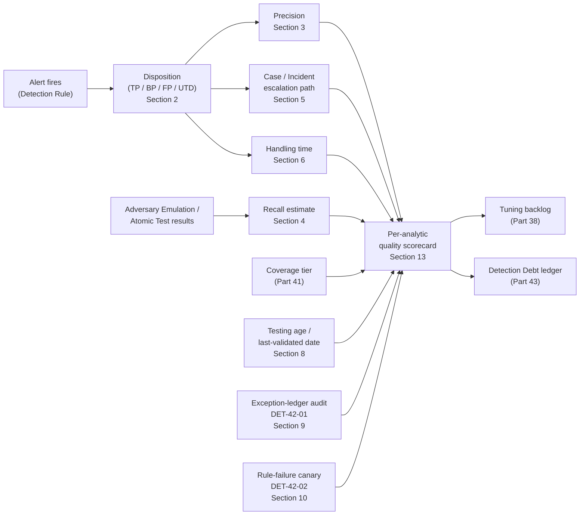

# Part 42 — Detection Quality

## Why this part exists

**[CONCEPT]** Every metric this part covers answers a narrow, specific question, and every one of them is routinely quoted as if it answered a much bigger one. "94% precision" answers "when this rule fires, how often was the analyst right to act on it" — nothing else. It says nothing about the attacks the rule never fired on, how long an analyst spent reaching that verdict, whether the rule was even tested against current tradecraft, or whether half the "closed" alerts behind that number were disposed of by an exhausted analyst clicking through a queue at 2 a.m. A single number, presented alone, always answers a narrower question than the one it gets asked to settle. This part exists to give each metric its exact scope, its formula, its worked example, and — deliberately, for every single one — its real limitation, so a reader can quote precision, recall, alert-to-incident ratio, handling time, coverage, testing age, suppression health, drift, and rule-failure rate without mistaking a narrow answer for a complete one.

This part builds on Part 41's Detection Coverage model (does an analytic exist at all, and at what tier) by asking the next question: given that an analytic exists, is it any good, and how would you know? Part 30 (Correlation Engineering) and Part 33 (Risk-Based Detection) already introduced the machinery — entities, correlation windows, risk scores — that most of these analytics run on; this part measures the output of that machinery, not its internals. Parts 37–39 (Detection Testing, False Positive Engineering, False Negative Engineering) each own one specific failure mode in depth; this part treats their outputs — test results, tuning history, false-negative findings — as inputs to a quality picture rather than re-explaining how to find them. Part 43 (Detection Debt) picks up where this part leaves off: every limitation named below, left unaddressed long enough, becomes a line item in that ledger.

**MITRE:** This part is a measurement layer applied to analytics built and mapped elsewhere in the book; it introduces no new technique coverage of its own. The two meta-detections it does introduce (§9, §10) monitor the detection stack's own health rather than adversary behavior, and are marked accordingly rather than forced into a tenuous ATT&CK mapping.

---

## 1. Why one quality number always lies to you

**[CONCEPT]** Every metric in this part is a projection of a much higher-dimensional reality onto one axis. Precision projects onto "was I right when I fired." Recall projects onto "did I fire when I should have." Handling time projects onto "how long did the queue hold this." None of these projections is wrong — each is a real, computable property of real disposition data — but each one, read alone, invites exactly one predictable mistake: treating the axis you can see as the whole shape.

The discipline this part argues for is triangulation, not a search for one better number. A rule with excellent precision and terrible recall looks clean on a precision dashboard and is quietly missing most of what it was built to catch. A rule with a shrinking alert-to-incident ratio looks like it's improving and may simply have stopped escalating anything. A program with falling median handling time may have gotten faster at triage, or may have gotten worse at looking. Every section below states its metric's formula and worked example first, then states — as its own labeled subsection, not an afterthought — the specific way that metric can look good while the underlying detection capability is not.

> **SOC Management View**
> When a metric in this part is reported upward without its limitation attached, the number has quietly become a target instead of a measurement — and a target, once known, gets optimized directly rather than the underlying goal it was meant to stand in for. A precision figure reported without its BP/FP convention, or an alert-to-incident ratio reported without a parallel recall estimate from testing or hunting, is not lying outright, but it is answering a narrower question than the one the room thinks it's asking. Insist on the limitation clause in the same slide as the number.

---

## 2. Disposition discipline: the raw material every metric is built from

**[ANALYST]** Every metric below is computed from Disposition data (TERMINOLOGY.md § Disposition) — the recorded outcome an analyst or automated logic assigns to a closed Alert. An alert with no disposition, or a disposition assigned carelessly to clear a queue, doesn't just fail to help the metrics; it actively corrupts them, because precision, recall, and every downstream number are arithmetic performed on whatever dispositions exist, with no way to tell a careful one from a rushed one after the fact.

Consider the real failed-SSH-authentication burst this book uses elsewhere as its running identity example (Figure 12.1; `lab/evidence/ct104-vulnscan-ssh-failed-logins-btmp.txt`): dozens of failed `root` and `admin` logon attempts against CT104 within roughly 15 minutes, all from one internal address, `192.168.1.126`, which the lab's own DHCP lease table resolves to a real device, `LAPTOP-JB22RNU3`. This is the exact behavioral shape — a fixed, small account set, high attempt volume, one dominant source — DET-12-02's Analytic logic (TERMINOLOGY.md § Analytic) is built to catch. It is not, however, a case of DET-12-02's own deployed Detection Rule firing: that rule (Part 12 §2.1) queries Microsoft Sentinel's `SigninLogs` table, which carries Entra ID cloud sign-in events, and would never see a Linux SSH/`btmp` auth attempt against an LXC container — the two log sources don't overlap. Catching this specific burst needs a separate, host-based implementation of the same analytic (an auditd- or syslog-sourced query grouping failed attempts by account and source over a window), which this book has not written a dedicated rule ID for. Assume that sibling rule exists and fired correctly for the rest of this walkthrough — the point being illustrated is disposition, not which specific query evaluated true. What even a correctly-firing rule's own logic cannot tell an analyst is *why* that device was doing it, and that single unanswered question is the entire disposition decision:

- If the device owner confirms it's a long-forgotten backup or monitoring script still pointed at CT104 with a stale, hardcoded credential, this closes as a Benign Positive (TERMINOLOGY.md § Benign Positive) — the rule's logic is correct, and the activity, once understood, carries no risk.
- If no such script exists, and the device shows unrelated signs of compromise, this closes as a True Positive, and escalates.
- If nobody can determine which, in the time available, it closes "unable to determine" — a real, honest disposition value, not a euphemism for "false positive" chosen to clear the queue faster.

> **Blind Spot**
> `lastb`/`btmp` output does not expose the attempted password. That single missing field is the reason this specific disposition can't be settled from the SSH log alone: a credential-stuffing tool trying a different guess on every attempt and a single script retrying one hardcoded, now-stale password both produce an identical burst of failed `ssh:notty` lines at this fidelity. Settling the disposition needs a second source — the device owner, an EDR agent on `LAPTOP-JB22RNU3`, or a packet capture — not a sharper SSH-log query.

The reason this matters to a part about metrics, and not just to Part 12's rule-building content, is mechanical: if this alert gets coded False Positive when the honest answer was Benign Positive, precision for the rule that fired looks worse than the rule's logic actually deserves (TERMINOLOGY.md § Precision explicitly separates the two terms for exactly this reason). If it gets coded Benign Positive by a tired analyst who never actually confirmed the script explanation, and the device was in fact compromised, a real intrusion just got filed as harmless and will never surface in a recall calculation, a coverage review, or an incident count. Every section below assumes disposition data of the quality this section describes; none of them can detect disposition data of the quality this section warns against.

---

## 3. Precision, in SOC terms

**[DETECTION ENGINEER]** Precision (TERMINOLOGY.md § Precision) is `TP / (TP + FP)` — the fraction of an analytic's closed alerts that were correct. It answers exactly one question: when this rule fires, how often is it right? It says nothing about what the rule misses.

The convention question TERMINOLOGY.md flags — whether Benign Positives count against the rule — is not a rounding detail; it changes the reported number by a wide margin on the same underlying data. Take a rolling 30-day sample of 40 closed DET-12-02 alerts:

| Disposition | Count |
|---|---|
| True Positive | 9 |
| Benign Positive | 27 |
| False Positive | 4 |

*(CONCEPTUAL SAMPLE — illustrative disposition counts, not captured from a live program.)*

Excluding Benign Positives from the error term (the convention TERMINOLOGY.md treats as standard, since the rule's logic matched correctly in those 27 cases): precision is `9 / (9 + 4)` ≈ 69%. Including Benign Positives in the error term instead: precision is `9 / 40` = 22.5%. Both numbers are arithmetically correct. They are not the same claim. A team reporting the first number is claiming "when this rule's logic is wrong, it's wrong about one time in three"; a team reporting the second is claiming "fewer than one alert in four from this rule turns out to be something an analyst actually needed to act on" — a true statement, but one about analyst workload, not rule correctness.

> **Engineering Reality**
> A merger, an acquired subsidiary's SOC folding into the parent program, or simply two shifts on the same team using different disposition taxonomies will produce two different precision figures for the identical rule and the identical underlying data, with nobody involved having done anything wrong — they used two different, both-defensible formulas and called the result by the same name. State the convention explicitly, in the same sentence as the number, every time it's reported outside the team that computed it.

**Precision's real limitation:** precision is structurally blind to everything the rule never fired on. A rule that fires once a year, correctly, on a real attack has 100% precision and tells you nothing about the seventeen other real attacks of the same type it silently missed. Precision measures the quality of what showed up; it cannot measure the quality of what didn't.

---

## 4. Recall and the ground-truth problem

**[DETECTION ENGINEER]** Recall (TERMINOLOGY.md § Recall) is the fraction of actually-malicious activity an analytic caught, out of all such activity that occurred. It answers "of everything that should have fired, how much did." In practice, recall can only be measured against Ground Truth (TERMINOLOGY.md § Ground Truth) — a full, confirmed list of what actually happened — and that list never fully exists in production. Every recall figure this book reports is really "recall against the intrusions we know about," a lower bound biased by the strength of the same hunting and IR program producing the ground truth in the first place.

A worked example, using an Adversary Emulation exercise (TERMINOLOGY.md § Adversary Emulation / Atomic Test) as the closest thing to a controlled ground-truth sample this book has: a quarterly purple-team exercise runs 12 distinct technique variants against production telemetry; seven produce a fired alert within the exercise window. Measured recall for that exercise is `7 / 12` ≈ 58% — a real, useful number, scoped explicitly to the 12 techniques actually run, not a claim about the program's recall against every technique an attacker might use.

The honeynet correlation output this book reuses across several earlier parts (Figure 1.4; `lab/evidence/ct103-honeynet-correlated-attack-sessions.txt`) is worth a specific caution here, because it looks like a better ground-truth source than it actually is for this purpose. Every connection reaching a honeynet decoy is inherently suspicious — there is no legitimate business traffic to a sacrificial `10.99.99.x` address competing for the analyst's attention, which is exactly why the platform's own correlation pipeline (`recon` → `probe` → `exploit_attempt` → `possible_success` → `confirmed_postexploit`) can tag every session with real MITRE technique IDs with reasonable confidence. That property makes a honeynet an excellent source for validating that specific detection logic fires correctly against real internet traffic. It makes it a poor proxy for enterprise-wide recall precisely because the thing that makes ground truth easy here — no ambiguous legitimate baseline — is exactly the condition production environments don't have. A recall figure computed against honeynet traffic and quoted as evidence of production recall is quoting a number from a population with a different, easier ground-truth problem than the one the claim is actually about.

**Recall's real limitation:** it is only as good as the ground truth it's measured against, and ground truth in production is itself a product of the same hunting and IR capability the recall figure is supposedly evaluating — a genuinely weak hunting program produces both a low true recall and a falsely reassuring high measured recall, because the intrusions it never found never make it into the ground-truth list to be missed against.

**Precision and recall in full: the confusion matrix underneath them.** Both metrics above are drawn from the same underlying 2×2 confusion matrix. Defined against a single fired-or-not-fired alert: TP is a real intrusion correctly alerted; FP is benign activity incorrectly alerted; TN is benign activity correctly not alerted; FN is a real intrusion missed. Two of those four cells never produce a disposition for an analyst to record — TN and FN are, respectively, "benign activity nobody alerted on" and "an intrusion nobody caught" — which is exactly why recall above has to be estimated from a separate, deliberately constructed ground-truth sample rather than read directly off the same disposition table (§2) precision's figure comes from.

```
Precision (Positive Predictive Value)     = TP / (TP + FP)
Recall (Sensitivity, True Positive Rate)  = TP / (TP + FN)
Specificity (True Negative Rate)          = TN / (TN + FP)
False Positive Rate (FPR)                 = FP / (FP + TN) = 1 - Specificity
F1 score                                  = 2 * (Precision * Recall) / (Precision + Recall)
```

- TP — a real intrusion correctly alerted
- FP — benign activity incorrectly alerted
- TN — benign activity correctly not alerted
- FN — a real intrusion missed
- Precision — of the alerts this analytic fired, the fraction that were correct (§3)
- Recall — of the intrusions that actually occurred, the fraction this analytic caught (this section)
- Specificity — of the benign activity that actually occurred, the fraction correctly left un-alerted
- FPR — of the benign activity that actually occurred, the fraction incorrectly alerted — the figure §5's base-rate-fallacy discussion turns on
- F1 — the harmonic mean of precision and recall; a single blended figure, useful only when a reader genuinely needs both weighted equally rather than silently favoring one (§13)

---

## 5. Alert-to-incident ratio

**[SOC MANAGEMENT]** The alert-to-incident ratio is the count of Alerts generated over a period divided by the count of formally declared Incidents (TERMINOLOGY.md § Incident) over the same period — a coarse, program-level signal-to-noise indicator, not a per-rule metric. A SOC ingesting roughly 12,000 alerts a month across all analytics, of which 340 get escalated into a Case (TERMINOLOGY.md § Case) and five of those Cases go on to a formally declared Incident, has an alert-to-incident ratio of roughly 2,400:1 for that month. A ratio this lopsided is not, by itself, evidence of badly built analytics — it is the program-level shape of what intrusion-detection research calls the base-rate fallacy: because genuinely malicious activity is a tiny fraction of total monitored activity, even analytics with respectable individual precision (§3) still produce an aggregate alert stream dominated by non-incidents once that precision is multiplied across realistic event volume (Axelsson, "The Base-Rate Fallacy and the Difficulty of Intrusion Detection," *ACM Transactions on Information and System Security*, Vol. 3, No. 3, 2000: https://doi.org/10.1145/357830.357849).

*(CONCEPTUAL SAMPLE — illustrative monthly volumes, not captured from a live program.)*

Axelsson's paper states this collapse formally, in Bayesian terms, rather than just observing it empirically. Using his paper's own notation: P(I) is the base rate — the prior probability that any given monitored event is a real intrusion; P(A|I) is the true positive rate — the probability of an alarm given that a real intrusion occurred; P(A|not I) is the false positive rate — the probability of an alarm given that no intrusion occurred. The quantity that actually matters operationally, the Bayesian detection rate P(I|A), is the probability that a fired alarm indicates a real intrusion:

```
P(I|A) = [ P(A|I) * P(I) ] / [ P(A|I) * P(I) + P(A|not I) * P(1-I) ]
```

- P(I) — the base rate: the prior probability that a given monitored event is a real intrusion
- P(A|I) — the true positive rate: the probability of an alarm, given that a real intrusion occurred
- P(A|not I) — the false positive rate: the probability of an alarm, given that no intrusion occurred
- P(1-I) — the probability that no intrusion occurred (1 minus the base rate)
- P(I|A) — the Bayesian detection rate: the probability that a real intrusion occurred, given that an alarm fired — the number an analyst actually needs, and the one this section's alert-to-incident ratio is only a coarse, program-level proxy for

P(I) being tiny — a real intrusion is a vanishingly small fraction of all monitored activity, exactly as the 12,000-alert example above illustrates — is exactly why P(I|A) collapses toward zero even when P(A|I) and P(A|not I) individually look respectable: the false-positive term is multiplied against the overwhelming majority share, P(1-I), while the true-positive term is multiplied against the tiny minority share, P(I), so a low base rate punishes any nonzero false-positive rate far more than the numerator can compensate for.

> **SOC Management View**
> This ratio gets quoted in budget conversations as a proxy for "is the SOC drowning in noise," and it's a legitimate one to raise — but a ratio that improves from 2,400:1 to 3,600:1 month over month is consistent with two very different realities: genuinely better precision pushing bad alerts out of the top of the funnel before they ever reach a Case, or a quieter, harder-to-defend shift toward under-declaring Incidents to make the number look better. The ratio alone cannot distinguish these. Pair any reported change in this ratio with a parallel recall signal — testing results, hunt findings, or a documented rationale for why fewer Cases escalated — before treating an improving ratio as good news on its own.

**This metric's real limitation:** the denominator (declared Incidents) is a policy decision, not a fact of nature — two programs looking at identical underlying activity can produce very different ratios purely from how conservatively they declare an Incident, which makes the raw ratio incomparable across organizations and easy to move in the wrong direction by simply escalating less.

---

## 6. Analyst handling time

**[ANALYST]** Handling time is the elapsed duration from an Alert entering an analyst's queue to a Disposition being recorded — the Triage step (TERMINOLOGY.md § Triage) measured in wall-clock time. It is the metric most directly shaped by Enrichment (TERMINOLOGY.md § Enrichment): attaching asset-criticality tier, baseline status, and prior-alert history to an alert automatically removes several manual lookups an analyst would otherwise perform by hand, and that removed lookup time is exactly what shows up as a lower median handling time.

A worked illustration: median handling time for DET-12-02 alerts that close as Benign Positive or False Positive runs around 4.5 minutes, once the analyst's dashboard already surfaces the source device's identity and prior baseline status inline; alerts that escalate to a Case and require pulling parent-process history, prior account activity, and a cross-team confirmation run closer to 28 minutes.

*(CONCEPTUAL SAMPLE — illustrative timings, not captured from a live program.)*

**This metric's real limitation:** a falling median handling time is genuinely ambiguous without a second signal. It's consistent with better enrichment removing real manual work — a good outcome — and it's equally consistent with Alert Fatigue (TERMINOLOGY.md § Alert Fatigue): an analyst pattern-matching a familiar-looking alert against the usual noise and closing it in under a minute without a real look. The two produce the identical number. Distinguishing them needs a separate, periodic quality audit — a second analyst or lead re-reviewing a random sample of already-closed alerts — not a faster read of the handling-time trend line.

---

## 7. Coverage (Part 41) as a quality input

**[DETECTION ENGINEER]** Part 41's six-tier Detection Coverage scale (TERMINOLOGY.md § Detection Coverage) — NO VISIBILITY, TELEMETRY ONLY, PARTIAL DETECTION, RELIABLE DETECTION, MULTI-SOURCE DETECTION, TESTED / RECENTLY VALIDATED — is not a competing metric to the ones above; it is the population every one of them is implicitly scoped to. Precision, recall, and handling time are all computed from disposition data, and disposition data only exists for an analytic that has cleared at least PARTIAL DETECTION — an analytic that fires, on real telemetry, often enough to accumulate closed alerts. NO VISIBILITY and TELEMETRY ONLY rows on a coverage matrix have no alerts, therefore no dispositions, therefore no precision or recall figure at all.

That silent scoping is this section's core point: a program reporting "94% average precision across our detections" is reporting an average over the analytics that exist and fire — never over the technique surface the coverage matrix says the program is supposed to cover. If half the matrix's rows sit at NO VISIBILITY or TELEMETRY ONLY, the quality dashboard is describing the healthy half of a program that, on the coverage axis, is only half built, and the 94% figure will look identical whether the other half is one telemetry-onboarding project away from existing or permanently out of scope.

> **What Would Change My Mind**
> This section treats a quality dashboard as inherently self-selected toward whatever coverage already exists. If a program could show its precision, recall, and handling-time figures computed *inclusive* of every matrix row at PARTIAL DETECTION or above, weighted by the technique surface each row represents rather than by alert count, and that weighted figure tracked closely with the unweighted one currently reported, that would be direct evidence the self-selection bias this section describes isn't materially distorting the picture at that program — and this section's caution would need to be scoped down to "check this before trusting the number," not "assume this is happening."

---

## 8. Detection age and testing age

**[DETECTION ENGINEER]** Detection age is how long an analytic has been deployed unchanged; testing age is how long since it was last validated against real telemetry via an Adversary Emulation or Atomic Test (TERMINOLOGY.md § Adversary Emulation / Atomic Test). The two move independently — a rule can be old and recently tested, or newly written and never tested at all — and the TESTED / RECENTLY VALIDATED coverage tier (§7) is explicitly the only one of the six that encodes a recency window (TERMINOLOGY.md's own worked figure is 90 days) rather than a permanent yes/no state.

This book's own production model (`BOOK-INDEX.md`) applies the identical discipline to itself: every chapter, detection, and hunt file in this rebuild carries a mandatory `last_validated` field, and nothing ships to `released` status without it being current. A detection rule deserves exactly the same field, tracked with the same seriousness, for the identical reason: "we deployed this eighteen months ago and it has never errored" is not evidence it still works — Schema Drift and Detection Drift (TERMINOLOGY.md § Schema Drift, § Detection Drift) both fail silently by producing zero alerts, which reads as "clean" and is actually "unmeasured."

> **Detection Test**
> **Setup:** Any analytic tagged TESTED / RECENTLY VALIDATED on the coverage matrix, past its recency window (90 days is this book's working default; use your program's own).
> **Action:** Re-run the exact same Atomic Test that earned the tag originally against current production telemetry — no changes to the test procedure.
> **Expected result:** The analytic fires as it did on the original validation run. A pass re-earns the recency window from the current date; a failure demotes the row to PARTIAL DETECTION until the cause (schema change, agent migration, rule edit) is found and fixed.

**This metric's real limitation:** a passing re-test only proves the analytic still catches the exact atomic-test variant it was validated against — it says nothing about adversary variation the test never exercised. A Kerberoasting detection that only ever gets re-tested against an RC4-ticket-request atomic test stays green indefinitely while real attacker tooling shifts toward AES-ticket requests specifically to evade the naive version of that rule (the exact naive-rule failure mode this book's Part 40 capstone dissects). Testing age tells you the rule was checked recently; it does not tell you the rule was checked against what an attacker is actually doing now.

---

## 9. Suppression tracking and tuning frequency

**[DETECTION ENGINEER]** Suppression (TERMINOLOGY.md § Suppression) filters an otherwise-matching alert before it reaches an analyst, without touching the rule's own logic — an allowlist entry, a maintenance window, a deduplication rule. Tuning (TERMINOLOGY.md § Tuning) changes the rule's own logic in response to accumulated disposition patterns. Both need the same discipline TERMINOLOGY.md assigns to an Exception (TERMINOLOGY.md § Exception): a named, scoped, justified, and dated carve-out, reviewed on a schedule — not an anonymous, ever-growing filter list nobody remembers the reason for.

The real scripted-sudo pattern already captured on CT104 (`lab/evidence/ct104-vulnscan-sudo-invocations.txt`, introduced as Figure 3.1) is a clean, concrete illustration of exactly the kind of activity that earns a legitimate exception rather than a raised threshold: the `vulnscan` service account runs an identical `sqlite3` query against its own database on a roughly hourly cadence, always the same command, never an attached TTY. A detection watching for anomalous sudo invocations against database files by service accounts would need precisely this pattern excluded — recorded, not silently absorbed into a wider threshold:

> Exception EX-0512: exclude service account `vulnscan` sudo invocations matching command path `/usr/bin/sqlite3 /opt/vulnscan/data/vulnscan.db` from the service-account sudo-anomaly rule. Justification: scripted health-check polling of the platform's own database, confirmed against deployment records. Review date: 2026-12-15.

An exception ledger with entries in this shape can be audited directly for staleness. The illustrative query below targets a Sentinel workspace watchlist maintained as that ledger, flagging entries past their own review date — or missing one entirely — the same "last-validated" discipline §8 applies to detections themselves, applied here to the exclusions written against them.

The following Sentinel KQL query targets a workspace watchlist named `ExceptionRegistry`, populated from the exception ledger rather than raw telemetry.

```kql
// Sentinel KQL — DET-42-01: exception/suppression entries past their documented review date,
// or with no parseable review date at all.
// Targets the ExceptionRegistry watchlist (TERMINOLOGY.md § Exception), not raw telemetry.
// Deliberately does NOT pre-filter with isnotempty(ReviewDate): an exception whose review date
// was never set, or was entered in a format todatetime() can't parse, is exactly as overdue as
// one with a lapsed date, and an isnotempty() guard would silently drop it from this output —
// the one row this audit most needs to surface.
_GetWatchlist("ExceptionRegistry")
| extend ReviewDateTime = todatetime(ReviewDate)
| where isnull(ReviewDateTime) or ReviewDateTime < now()
| project ExceptionId, RuleId, Entity, Justification, ReviewDateTime
| order by ReviewDateTime asc
```

**DET-42-01's main limitation:** it can only see exceptions actually recorded in the registry. A suppression written directly into a rule's own query text — a `NOT` clause added under deadline pressure and never logged as a formal exception — is invisible to this query entirely, which is the exact anonymous-filter-list failure mode Exception's own definition (TERMINOLOGY.md § Exception) warns against. This analytic audits ledger hygiene, not the rule text itself; it needs pairing with a periodic manual or CI-driven review of rule source for undocumented exclusions.

> **Detection Test**
> **Setup:** Three test rows in the `ExceptionRegistry` watchlist: one with `ReviewDate` set to a date in the past, one with `ReviewDate` set in the future, and one with `ReviewDate` left blank (an exception entered without a review date ever being assigned — a real, common data-entry failure, not an edge case).
> **Action:** Run the DET-42-01 query above against the workspace.
> **Expected result:** The past-dated row and the blank-date row both appear — `ReviewDateTime` populated for the former, empty for the latter — and the future-dated row is excluded. If the blank-date row is missing, check that the query hasn't regressed to filtering on `isnotempty(ReviewDate)` before the `todatetime()` conversion: that guard looks like harmless input sanitization but silently exempts exactly the ungoverned entries this audit exists to catch.

Tuning frequency — how often a rule's own logic actually gets changed in response to disposition patterns, as opposed to accumulating suppressions around unchanged logic — deserves the same tracking. A rule with dozens of suppression entries and zero tuning history over the same period is a specific, legible signal: the underlying logic is too broad, and every new source of the same false-positive pattern is getting a fresh exclusion instead of a fix to the condition that keeps generating them.

**MITRE:** N/A — DET-42-01 audits detection-program hygiene (exception-ledger review currency), not adversary behavior; forcing a technique mapping onto it would misrepresent what it detects.

---

## 10. Detection drift and rule-failure monitoring

**[ENGINEERING]** Detection Drift (TERMINOLOGY.md § Detection Drift) is the gradual divergence between what a rule was designed to catch and what it actually catches now, driven by tradecraft change, environment change, or both — and TERMINOLOGY.md is explicit that no single clean metric measures it directly; only proxies exist, the most common being a decline in alert volume with no environmental explanation. Rule Failure Rate (TERMINOLOGY.md § Rule Failure Rate) is narrower and more mechanical: the fraction of deployed rules that are, right now, silently broken — a syntax error, a schema-mismatched field reference, a scheduled search failing without raising its own failure alert. Rule Failure Rate is a pipeline-health metric; Detection Drift is a relevance metric. A rule can fail the first test and pass the second, or the reverse.

Rule-failure monitoring in practice usually takes the shape of an absence-based canary: a synthetic event, injected into the same log source on a fixed schedule by a process independent of production traffic, paired with an analytic that alerts when the canary stops arriving.

The following Sentinel KQL query targets a custom `CanaryEvents_CL` table populated by a dedicated canary-injection script, run every 15 minutes, independent of DET-12-02's production log source.

```kql
// Sentinel KQL — DET-42-02: rule-failure canary. Paired with a synthetic event injected on a
// fixed 15-minute schedule into the same log source DET-12-02 depends on, by a process
// independent of production SSH traffic.
// Window widened to 24h and the missing-canary case explicitly coalesced: filtering to a short
// lookback (e.g. ago(30m)) before summarize means a canary that has been silent LONGER than
// that window produces zero input rows, so summarize's own MAX returns a null LastSeen, the
// datetime_diff against it is null, and "where ... > 20" on a null value is false — the query
// returns NO rows for the exact case (a long, real outage) it most needs to catch. Coalescing
// the null case to a large number keeps the longest, most dangerous outages visible instead of
// silently clearing the alert.
CanaryEvents_CL
| where TimeGenerated > ago(24h)
| where EventType_s == "quality_canary" and SourceRule_s == "DET-12-02"
| summarize LastSeen = max(TimeGenerated)
| extend MinutesSinceLastCanary = coalesce(datetime_diff('minute', now(), LastSeen), 1440)
| where MinutesSinceLastCanary > 20
```

**DET-42-02's main limitation:** a canary event travels through the same ingestion path — connector, parser, index — that it exists to validate. If that shared path fails outright rather than degrading, both the canary and the real production events it stands in for go dark together, and this absence-based alert can itself fail silently for the identical reason, unless it is scheduled and evaluated on infrastructure genuinely independent of the path it monitors (a separate collector, a separate query engine, or at minimum a separate scheduling process that itself gets checked from outside the SIEM).

> **False Positive Trap**
> The canary-injection script is its own single point of failure, independent of the pipeline it exists to validate — an expired service-account credential on the injector host, a missed cron run after a reboot, or a change to the injector's own code stops the canary without anything being wrong in the monitored log source or rule. This produces a DET-42-02 alert that looks identical to a real pipeline break. The fix is not a longer grace window (that just delays detecting a real break); check the injector's own last-run status and exit code as the first triage step, before escalating a DET-42-02 alert as evidence the monitored pipeline itself is down.

> **Detection Test**
> **Setup:** A workspace with the canary-injection script running on its normal 15-minute schedule against `CanaryEvents_CL`, and DET-12-02's own production log source otherwise healthy and unaffected.
> **Action:** Run the test twice. First, pause or kill the canary-injection script only — not the monitored pipeline — for at least 25 minutes, then run the DET-42-02 query above. Second, repeat with the script paused for a full 25 hours instead of 25 minutes.
> **Expected result:** Both runs return exactly one row with `MinutesSinceLastCanary` exceeding 20. The second run is the one that matters: it is the case a naive short-lookback version of this query gets wrong, since the last real canary event has aged out of a 30-minute window entirely, and a query that filters to that short a window before summarizing returns zero rows — silence indistinguishable from "healthy" — for the longest, most dangerous outages. A query that returns nothing on either run is broken in the same silent way it's meant to catch.

> **Engineering Reality**
> Most SIEM platforms will happily let a scheduled search fail — a permissions change, a quota limit, a backend timeout — without surfacing that failure anywhere an analyst would see it; "the query returned zero results" and "the query never ran" produce identical silence on a dashboard that only shows fired alerts. Treat a canary-based absence alert like DET-42-02 as a mandatory pairing for any analytic your program considers business-critical, not an optional extra.

**MITRE:** N/A — DET-42-02 monitors detection-pipeline health (rule execution and telemetry-flow continuity), not adversary behavior.

---

## 11. How the pieces fit together

**[CONCEPT]** Every metric and analytic in this part is a stage in one feedback loop, not a standalone dashboard tile. The diagram below traces that loop from a fired alert through disposition, through the metrics built on disposition data, through the two health checks that run independently of any single alert, to the two downstream ledgers — tuning backlog and detection debt — that everything left unresolved eventually feeds.






**Figure 42.1 (FIG-42-01) — The detection-quality feedback loop, from fired alert to debt ledger.** *CONCEPTUAL.* Illustrates the structural relationship between disposition data (§2), the four disposition-derived metrics (§§3–6), the two inputs that sit outside any single alert (coverage tier and testing age), the two meta-detections that audit the stack's own hygiene rather than any alert (§§9–10), and the two downstream ledgers everything unresolved eventually feeds. This is a diagram of how this part's own sections relate, not a capture of any specific vendor platform's dashboard architecture.


---

## 12. Threat hunting for quality blind spots

**[THREAT HUNTER]** Detection Drift's own definition names the proxy this hunt targets directly: a decline in alert volume with no environmental explanation. Framed as a Threat Hypothesis (TERMINOLOGY.md § Threat Hypothesis): *an analytic whose 90-day alert volume has dropped well below its trailing 180-day baseline, with no logged telemetry, parser, or configuration change on record to explain the drop, is exhibiting drift or silent failure rather than genuine improvement.*

The hunt itself is a straightforward comparison, not a novel query technique: pull per-analytic alert counts for the trailing 180 days, bucket into two 90-day windows, and flag any analytic where the more recent window's count falls below some threshold (start conservative — below 20% of the earlier window is a reasonable first pass) of the earlier one. Cross-reference each flagged analytic against the change log Part 22's detection-as-code pipeline should already be keeping — an EDR agent migration, a parser update, a deliberate tuning change that legitimately reduced false positives all explain a volume drop without indicating drift. An analytic with no matching change-log entry for its drop is the hunt's actual finding.

> **Blind Spot**
> A percentage threshold is statistically meaningless at low volume. An analytic that fires twice in the earlier 90-day window and zero times in the recent one has "dropped" 100% by the identical arithmetic that flags a high-volume rule falling from 500 alerts to 80 — but two data points carry no real evidence of drift versus ordinary week-to-week variance. Set a minimum earlier-window count (10 alerts is a reasonable floor) below which the hunt records the analytic as "insufficient volume to assess" instead of flagging it as a drift candidate; without that floor, every low-and-sporadic-firing analytic in the program re-flags every quarter for no informative reason, and the hunt's own findings become the thing that gets ignored as noise.

Per the Hunt definition (TERMINOLOGY.md § Hunt), this cannot end in "nothing found, moving on." A flagged analytic with no explanation resolves one of two ways: confirmed drift or silent failure, filed as a Detection Debt entry (Part 43) with the specific cause once found — or a documented negative finding naming the analytic as reviewed and cleared, with the review's own reasoning recorded for the next pass.

---

## 13. SOC Management View: a quality scorecard, and the metric you optimize is the metric you lose

**[SOC MANAGEMENT]** Assembled together, this part's metrics form a scorecard, not a single grade: disposition-derived precision (with its convention stated), a recall estimate scoped to its actual test population, alert-to-incident ratio paired with a recall signal so it can't be read alone, median handling time paired with a periodic manual quality audit, coverage tier distribution rather than one aggregate percentage, testing age against the recency window, exception-ledger currency, and rule-failure/canary health. Reviewed together, monthly or quarterly, this scorecard tells a program where it actually stands. Reported as any single figure from that list, it tells a much narrower story than the room asking for it usually assumes.

> **What Would Change My Mind**
> This part treats a consistently improving quality scorecard as good evidence of a healthier program, not proof of one. If a program with a scorecard trending positive across every metric here experienced two or more real intrusions in the same reporting period that no analytic ever alerted on, discovered only through an external notification or a hunt rather than the standing detection stack, that would be strong evidence the scorecard itself was either being gamed on one or more of its inputs or was structurally blind to something none of these metrics cover — and it would need an independent audit (a fresh, second-analyst re-review of a disposition sample; a scoped, unannounced red-team exercise) before the trend line earns trust again.

Every metric in this part can be moved in the direction that looks good without moving the thing it was built to measure: precision improves by recoding ambiguous closes as Benign Positive instead of investigating them; the alert-to-incident ratio improves by declining to escalate; handling time improves by triaging faster and looking less; testing age improves by re-running the same easy atomic test instead of a harder variant. None of that is hypothetical cynicism — it's the direct, mechanical consequence of measuring a proxy and rewarding movement in the proxy. The single discipline that catches all of it at once is the same one this part opened with: never trust one number from this list without at least one other, independently sourced number sitting next to it.

---

## Artifacts introduced in this part

The table below is a reference list for the meta-detections and hunt this part introduced, not a MITRE coverage table — neither DET-42-01, DET-42-02, nor HUNT-42-01 detects adversary behavior; all three monitor the detection program's own health.

| ID | Purpose | Section | MITRE |
|---|---|---|---|
| `DET-42-01` | Flags exception/suppression-ledger entries past their documented review date. | §9 | N/A — program-hygiene analytic |
| `DET-42-02` | Rule-failure canary; alerts on absence of a scheduled synthetic event, signaling a broken rule or pipeline. | §10 | N/A — pipeline-health analytic |
| `HUNT-42-01` | Hunts for analytics with an unexplained alert-volume drop, as a proxy for detection drift or silent failure. | §12 | N/A — targets program-internal drift, not a specific technique |
| `FIG-42-01` | Diagram: the detection-quality feedback loop from fired alert to the tuning backlog and debt ledger. | §11 | — |
