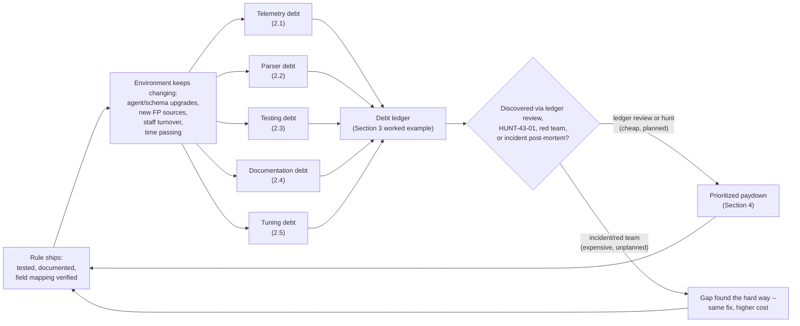

# Part 43 — Detection Debt

## Why this part exists

**[CONCEPT]** Part 41 built a coverage model that refuses to collapse to a single green number. Part 42 built a quality vocabulary — precision, recall, drift, suppression rate, rule failure rate — for measuring what a detection stack actually does versus what it claims to do. Neither part, on its own, explains why the gap between claim and reality keeps reopening even in programs that measure both diligently. This part is that explanation: Detection Debt (TERMINOLOGY.md § Detection Debt) is the accumulated, and usually invisible, erosion of the coverage and quality this book has spent 42 parts teaching you to build. It is placed last among the three deliberately, per `BOOK-INDEX.md`'s own ordering rationale — debt is what happens to coverage and quality over time, not a fourth independent thing to measure alongside them.

The word "debt" is doing real work here, not decorating a metaphor borrowed from software engineering. Ordinary technical debt in application code eventually announces itself — a broken build, a failing test, a stack trace in a log a human reads. Detection debt's defining, distinguishing property is that it fails silently by construction: a detection rule whose field reference no longer matches the current schema returns zero results, and zero results is a valid, unremarkable answer for almost every query language in existence. Nothing pages anyone. The dashboard that counts deployed rules still counts this one. The MITRE coverage matrix still marks the cell green. The only way the gap surfaces is a red-team exercise, an incident post-mortem, or a hunt that happens to look in exactly the right place — which is precisely why this part exists after, not instead of, Parts 41 and 42: the metrics those parts define are the instruments capable of catching debt before an attacker does, but only if someone is actually reading them against a maintained ledger, not just a dashboard.

**MITRE:** This part does not define new technique coverage of its own. The worked ledger example in §3 uses T1110.001 (Password Guessing) — already scoped as a technique in Parts 12 and 14 — to price real debt against a concrete, previously-deployable rule rather than an abstract one.

---

## 1. Detection debt as a ledger, not a feeling

**[CONCEPT]** "Our detections are getting stale" is a feeling. A ledger is a list: one row per detection, one column per debt type, a status per cell, and a date. The distinction matters because a feeling can't be prioritized, staffed, or reported to a budget owner, and a ledger can. This part treats detection debt as exactly five named, independently trackable sub-types — restated here from TERMINOLOGY.md § Detection Debt because the rest of the part builds directly on this split:

| Debt type | What silently breaks | Typical discovery moment |
|---|---|---|
| Telemetry debt | An assumed field or source stops flowing as assumed | A hunt or red-team exercise finds nothing where something should be |
| Parser debt | Fields arrive null or mis-mapped while ingest volume looks healthy | A field-level audit, or a rule that never fires despite matching activity occurring |
| Testing debt | No scheduled re-verification against current telemetry or environment | An adversary-emulation run fails on a rule believed to be working |
| Documentation debt | Rationale, false-positive notes, and dependencies were never recorded | The rule's author leaves, and no one can explain why an exclusion exists |
| Tuning debt | A known false-positive source is identified repeatedly but never fed back into the rule | The same benign activity gets manually dismissed dozens of times |

Each row above is a distinct failure with a distinct fix — the reason to keep them separate rather than lumping everything into one "technical debt" bucket is that the remediation owner, the detection cost, and the urgency differ across all five. Telemetry debt is usually an infrastructure fix (`[ENGINEERING]`); tuning debt is usually a rule-logic fix (`[DETECTION ENGINEER]`); documentation debt is a process fix with no code change at all. A ledger that doesn't distinguish them routes every finding to the same team and the same backlog, regardless of who actually owns the fix.

> **Engineering Reality**
> No commercial SIEM or XDR platform ships a "detection debt" dashboard, because debt is defined relative to what a rule was supposed to do when it shipped — a claim that lives in a design doc or a pull request description, not in telemetry the platform can inspect on its own. Building the ledger is manual, unglamorous work: a spreadsheet or a lightweight internal tool cross-referencing deployed rules against their last-tested date, their field dependencies, and their disposition history. Programs that skip this because "the SIEM would tell us" are the ones a red team finds the debt in first.

---

## 2. The five ledgers, with real telemetry behind each one

**[ENGINEERING]** The taxonomy in §1 is abstract until it's priced against real logs. Each subsection below ties one debt type to genuine captured evidence from this book's home lab, because every one of these failure modes is easier to wave away as theoretical than to actually watch happen against a real pipeline.

### 2.1 Telemetry debt

**[ENGINEERING]** Telemetry debt is the gap between what a coverage spreadsheet says is monitored and what the underlying log source actually captures — Visibility Debt (TERMINOLOGY.md § Visibility Debt) is the specific case of this where the source is onboarded but no analytic exists yet; telemetry debt as used here is the broader and more dangerous case, where a team believes an analytic already covers a behavior and the telemetry it depends on quietly doesn't extend as far as assumed.

`lab/evidence/ct104-vulnscan-ssh-failed-logins-btmp.txt` (REAL LAB EXAMPLE, captured via `lastb -n 100` on CT104) is a genuine record of dozens of failed SSH password attempts against the `root` and `admin` accounts, all from source `192.168.1.126`, arriving at 10 or more attempts per minute — the textbook shape a brute-force rule built on failed-password events is designed to catch. A program that built its "SSH brute-force coverage" claim entirely on this kind of telemetry — password-attempt failures recorded after a successful protocol handshake — would mark the technique green on a coverage matrix and move on.

`lab/evidence/ct108-honeynet-edge-ssh-protocol-scan.txt` (REAL LAB EXAMPLE, captured from the honeynet edge host's own sshd journal) shows a different, earlier stage of SSH interaction that a password-failure-only pipeline never sees at all: connections that never get far enough to attempt a password. `Unable to negotiate with 192.168.1.96 port 43036: no matching key exchange method found. Their offer: diffie-hellman-group1-sha1 [preauth]` and the neighboring `Protocol major versions differ: 2 vs. 1` lines are pre-authentication protocol- and algorithm-negotiation failures — real telemetry, from a real sshd instance, that carries no password-attempt field at all because the connection never reached that stage of the handshake.

> **Blind Spot**
> A detection built exclusively on failed-password events (btmp-derived telemetry, or Event ID 4625 (An account failed to log on) in a Windows-centric estate) has zero visibility into legacy-protocol and cipher/algorithm reconnaissance that never advances past the SSH key-exchange stage. An attacker probing for `diffie-hellman-group1-sha1`, `ssh-rsa`, `ssh-dss`, or an SSHv1 banner response — exactly the pattern in the captured evidence above, generated here by internal vulnerability-scanner traffic rather than an attacker — produces no password-failure event whatsoever. "SSH authentication is monitored" on a coverage spreadsheet is true and, at the same time, silently false for this entire earlier stage of attacker interaction with the same service.

The fix here is not a smarter password-failure rule; failed-password telemetry structurally cannot see a connection that never got that far. Closing this gap means onboarding the sshd/journal-level `Unable to negotiate` and `Protocol major versions differ` event patterns as their own telemetry source, with their own analytic, per Part 41's distinction between `TELEMETRY ONLY` and actual detection coverage. Until that onboarding happens, the coverage claim "SSH authentication: RELIABLE DETECTION" is telemetry debt wearing a green cell.

### 2.2 Parser debt

**[ENGINEERING]** Parser debt is telemetry debt's quieter sibling: the source is onboarded, ingest volume looks completely healthy, and a specific field a rule depends on is null, truncated, or mis-mapped for a subset of events the rule never gets to see correctly. Schema Drift (TERMINOLOGY.md § Schema Drift) is the most common cause, but a parser can also simply be wrong from day one against real-world input that never showed up in the sample data it was built and tested against.

`lab/evidence/ct104-vulnscan-sudo-invocations.txt` (REAL LAB EXAMPLE, captured via `journalctl _COMM=sudo` on CT104) shows the vulnscan platform's own health-check script running as `root` on a regular interval, invoking `sudo` to run queries as the `vulnscan` service account:

```text
Sep 10 07:53:34 vulnscan sudo[2667]:     root : PWD=/root ; USER=vulnscan ; COMMAND=/usr/bin/sqlite3 /opt/vulnscan/data/vulnscan.db 'SELECT key,value FROM config WHERE key IN (\'intel_version\',\'intel_last_success_at\');'
```

Raw log excerpt, not a query — shown as `text` because it is annotated for reading, not executed as-is.

> **Detection Autopsy — the naive `sudo` COMMAND field extractor**
>
> **The rule:** Extracts the executed binary and its arguments from the sudo `COMMAND=` field using a regex that splits on the first space and treats everything after as a single opaque arguments string, then further splits that string on unescaped single quotes to isolate the literal SQL text for a downstream "suspicious SQL keyword" check.
>
> **Why it shipped:** Most sudo command lines in the test data used to build the parser were simple: a binary and one or two flags, no embedded quoting. Splitting on the first space and then on quote characters handled every sample the parser was validated against.
>
> **How it failed:** The real command above embeds a single-quoted SQL string that itself contains escaped single quotes (`\'intel_version\'`) around an inner value, plus a semicolon terminating the SQL statement inside the outer shell quoting. A parser that splits naively on unescaped quotes either truncates the field at the first embedded quote — losing everything from `key,value FROM config...` onward — or throws an extraction error the pipeline logs but no one alerts on, since a per-event parse failure does not fail the overall ingest job. Either way, the field the downstream keyword-matching rule depends on is silently wrong for every event shaped like this one, while the event itself still ingests, still counts toward source volume, and still looks like a healthy log.
>
> **The fix:** Replace the split-on-quote heuristic with a proper shell-argument tokenizer (most languages ship one — Python's `shlex`, for example) that understands nested and escaped quoting, and add a parser-health check that flags the fraction of events in a source where a depended-on field parses to null or empty, reviewed on a schedule rather than discovered by accident.

The broader lesson generalizes past this one command: any field extraction built against a sample of "normal-looking" log lines will parse everything in that sample correctly and nothing tells you it's wrong on the lines it wasn't tested against, because a parse failure and a genuinely empty field produce the same downstream nothing.

> **Engineering Reality**
> An EDR or log-shipping agent upgrade is the single most common real-world trigger for parser debt at scale, because it changes field names, truncation lengths, or encoding for an entire fleet at once with no ingest-level error — "zero matching events" is a valid result for almost every query language, so a rule referencing a renamed or truncated field goes quiet rather than loud. Treat every agent or log-source version upgrade as a mandatory parser-regression check against a small held-out sample of real events, not an assumption that "it still ingests" means "it still parses the same."

### 2.3 Testing debt

**[DETECTION ENGINEER]** Testing debt is the absence of a scheduled re-verification that a deployed rule still fires against current telemetry, after any environment change — an EDR migration, an OS upgrade, a logging-agent version bump, or simply enough time passing that no one remembers the rule exists to re-test it. Part 42's Rule Failure Rate metric measures the *symptom* (a fraction of deployed rules silently broken right now); testing debt is the *practice gap* that lets that fraction grow unnoticed.

`lab/evidence/ct104-vulnscan-web-systemd-state-changes.txt` (REAL LAB EXAMPLE, captured via `journalctl -u vulnscan-web`) shows the canonical `Stopping` → `Deactivated successfully` → `Stopped` → `Starting` → `Started` sequence for a real application unit across several legitimate restart cycles during iterative development. A plausible detection built on this pattern — "alert on more than N stop/start cycles for a production service unit within an hour, as a possible sign of a crash loop or an attacker repeatedly killing a defensive agent" — depends entirely on `journalctl`'s specific line wording and ordering to match. A systemd version change, a journald output-format change, or a migration to a different init system on a subset of hosts can each silently change that exact wording without any ingest error, and a rule that was validated once against one journald version and never re-tested has no way to notice.

> **Detection Test**
> **Setup:** A test host running the same journald/systemd version as production, with a service unit that can be safely restarted repeatedly.
> **Action:** `systemctl restart <unit-name>` issued four or more times within a 5-minute window.
> **Expected result:** The corresponding `Stopping`/`Deactivated successfully`/`Stopped`/`Starting`/`Started` sequence appears in the journal for each cycle, and the crash-loop detection fires once the cycle count crosses its threshold within the window. Re-run this exact test after any systemd, journald, or log-shipping-agent version change on the fleet — not just once at rule authoring time.

> **Blind Spot**
> The pattern this rule and its Detection Test both validate — `Stopping` → `Deactivated successfully` → `Stopped` → `Starting` → `Started` — is systemd's *graceful* shutdown-and-restart sequence, triggered by `systemctl restart` or a clean in-app exit, and it is also the only sequence the captured evidence contains: every cycle in `ct104-vulnscan-web-systemd-state-changes.txt` is a graceful restart during development, none a crash. An attacker sending `SIGKILL` to a defensive agent (or an OOM kill) produces a different sequence with no `Stopping` or `Deactivated successfully` line at all — `Main process exited, code=killed, signal=KILL` followed by `Failed with result 'signal'` — so a rule pattern-matched only on the graceful sequence can miss the exact abrupt-kill scenario named as its own justification, even while catching every ordinary restart cycle perfectly. Validating this rule requires a second Detection Test using `kill -9` against the unit's main PID, not just `systemctl restart`.

> **Detection Test**
> **Setup:** The same test host as above, with the crash-loop rule's telemetry pipeline live and the target unit's main PID known (`systemctl show -p MainPID --value <unit-name>`).
> **Action:** `kill -9 <main-pid>` issued four or more times within a 5-minute window, restarting the unit between kills so each cycle produces a fresh PID to kill.
> **Expected result:** The journal shows `Main process exited, code=killed, signal=KILL` followed by `Failed with result 'signal'` for each cycle, with no `Stopping` or `Deactivated successfully` line at any point. A rule that only matches the graceful sequence will not fire here even though the cycle count crosses the same threshold as the first Detection Test — that non-fire is the failing result this test exists to catch, not an acceptable outcome.

Testing debt is specifically the failure to re-run a test like this one on a schedule tied to actual environment change, rather than on a calendar cadence disconnected from what's actually changing underneath the rule. Part 22's Detection-as-Code discipline — rules stored in version control, replayed against a stored test corpus in CI — is the direct structural fix: a rule that fails its stored test on every pull request that touches a shared parser or schema definition surfaces testing debt automatically, instead of waiting for a human to remember to check.

### 2.4 Documentation debt

**[DETECTION ENGINEER]** Documentation debt is the absence of a recorded rationale, false-positive history, and dependency list for a detection rule — the rule keeps running, but no one who didn't write it can explain why it exists in its current form, what it depends on, or why a given exclusion is there.

The same sudo health-check pattern from §2.2 is also a clean, real example of documentation debt specifically around exceptions. TERMINOLOGY.md § Exception requires a specific, named, time-bounded carve-out — a documented justification and a review date — as the accountable unit an exclusion should be tracked against, precisely because an undocumented exception is exactly what turns into tuning debt (§2.5). If an analyst, seeing `root` repeatedly running `sqlite3` queries against `/opt/vulnscan/data/vulnscan.db` as the `vulnscan` service account every 40–90 minutes, adds a quiet allowlist entry for "root running sqlite3 as vulnscan, seems fine" with no ticket, no justification field, and no review date, the program now has an undocumented gap in a privileged-account-monitoring rule that nobody can evaluate for continued correctness. Six months later, when the vulnscan platform's health-check script is decommissioned and the actual justification for the exclusion no longer exists, the exclusion itself has no expiry to force a re-check — it just keeps silently suppressing whatever it was written to suppress, for a reason nobody can any longer state.

> **SOC Management View**
> Documentation debt is invisible on every technical dashboard because the thing missing is prose, not data — no metric measures "percentage of rules with a written rationale," so it accrues fastest in exactly the programs whose other metrics look healthiest. The actual cost lands later and lands hard: when the engineer who wrote a rule and its exclusions leaves, the rule's effective behavior becomes unauditable, and the safest organizational response — disable the rule and rebuild it from scratch — throws away working detection logic because nobody can certify what it does. Budget documentation time as part of shipping a rule, not as a cleanup task deferred to whenever staffing allows; a rule with no rationale on file is a liability the moment its author's institutional memory becomes unavailable, not a slow-burning inconvenience.

### 2.5 Tuning debt

**[DETECTION ENGINEER]** Tuning debt is the specific case where a false-positive source has already been identified — more than once — and the fix has never been written back into the rule's own logic. TERMINOLOGY.md draws a sharp line between Suppression (filtering an alert after the rule matches, logic untouched) and Tuning (changing the rule's logic itself); tuning debt accrues specifically when a team keeps doing the former, alert after alert, in place of the latter.

The recurring sqlite3 health-check pattern from §2.2 and §2.4 makes this concrete a third way. If an "unexpected root activity against service-account-owned data" rule fires on this pattern every time it runs — and the captured evidence shows it running roughly every 40 to 90 minutes, so this is not a rare edge case but a recurring, near-hourly false positive — an analyst dismissing the same alert dozens of times without ever writing a permanent exclusion into the rule is accumulating tuning debt on every dismissal. Each individual dismissal costs a minute or two of triage time; the accumulated cost is Alert Fatigue (TERMINOLOGY.md § Alert Fatigue) against this specific rule, and the read-through risk that a genuinely different, malicious use of the identical command pattern gets pattern-matched against "oh, that's just the health check" and closed without real review.

> **False Positive Trap**
> A scripted, scheduled service-account interaction — the same command, the same interval, the same source — is close to the easiest false-positive source to fix permanently, because its regularity is itself a distinguishing signal: real attacker activity abusing the same command rarely repeats on an exact interval indefinitely. The fix is a logged rule change — matching on the specific command template plus a schedule-regularity check, per TERMINOLOGY.md § Tuning's own definition of a change made in response to observed disposition data — not a running list of individually dismissed alert IDs that never touches the rule's actual matching logic. If the same dismissal reason recurs three or more times against the same rule, that is the trigger to open a tuning ticket, not to keep dismissing.

---

## 3. Worked example: pricing the ledger for one real detection

**[DETECTION ENGINEER]** The five debt types in §2 are easiest to reason about individually. In practice they accrue against the same rule simultaneously, and a debt ledger has to price all five for one detection at once to be useful for prioritization. This section builds that ledger for a single, concrete rule against the real evidence already introduced above.

**The rule: DET-43-01 — SSH failed-password burst by source.**

> **DET-43-01 — SSH failed-password burst by source**
>
> Fires when a single source address accumulates 10 or more failed SSH password attempts against the same local account within a 5-minute window, drawn from failed-login telemetry (`/var/log/btmp`-derived events on Linux hosts, or Event ID 4625 (An account failed to log on) on Windows hosts, per the Blind Spot box above). This is the rule whose shape matches the real captured burst in `lab/evidence/ct104-vulnscan-ssh-failed-logins-btmp.txt`: dozens of `root`/`admin` attempts from `192.168.1.126` in rapid succession — for example, 18 `root` attempts land inside the single minute of 01:05 in that capture, well past the 10-in-5-minutes threshold.
>
> **MITRE:** T1110.001 (Password Guessing).

DET-43-01 depends on three fields, minimum: a source address, an account name, and a reliable failure-vs-success action field on every event (`Authentication.src`, `Authentication.user`, and `Authentication.action` in the Splunk Authentication data model this section's query targets; `IpAddress` and `TargetUserName` on 4625). If the parser populates the account name but drops or nulls the source address — a NAT'd internal host behind a proxy, or the exact kind of silent field-mapping failure described as parser debt in §2.2 — the rule cannot group attempts by source and simply never fires for that traffic, rather than firing with a blank source field; a missing account name has the same effect. Neither failure mode raises an ingest error, so this rule inherits the general silent-failure property this whole part is about, not just the debt types named for other rules in §2.

What looks the same as an attack: a monitoring or backup script retrying a stale or rotated credential against the same account on a fixed interval, a shared jump host where several legitimate users mistype a password in quick succession, or — as the captured evidence itself shows — an internal host that is simply misconfigured to authenticate with the wrong username/password pair against the wrong target. That last case is exactly what `192.168.1.126` (`LAPTOP-JB22RNU3`, a real device on the lab's own network, per the evidence file's capture notes) produced against CT104: a real burst that satisfies DET-43-01's logic perfectly while representing zero attacker activity. Treat any first-deployment false-positive rate estimate for a rule like this as unvalidated until measured against real disposition data — the Tuning debt row in the ledger below is this rule's realistic long-run state, not an edge case, precisely because a recurring internal misconfiguration produces the identical shape every time it repeats.

> **Detection Test**
> **Setup:** A lab host with SSH exposed and its failed-login telemetry (btmp or the Windows 4625 equivalent) already flowing into the pipeline DET-43-01 queries.
> **Action:** From a second host, attempt 10 or more SSH logins against the same account on the target within a 5-minute window, e.g. `for i in $(seq 1 15); do ssh -o BatchMode=yes -o ConnectTimeout=2 root@<target-host>; done` — the same shape as the genuine burst in `lab/evidence/ct104-vulnscan-ssh-failed-logins-btmp.txt`.
> **Expected result:** 10 or more failed-password events for the same source/account pair inside the window, and DET-43-01 fires. If it doesn't, check the source-address and account-name fields first (see the missing-field note above) before assuming the rule's threshold logic is wrong.

The illustrative query below expresses DET-43-01 against Splunk's Authentication data model, shaped to match btmp-derived failed-SSH telemetry.

CONCEPTUAL SAMPLE — illustrative SPL against Splunk's Authentication data model; not validated against a live index, since no Splunk deployment sits behind the lab evidence this part draws from.

```spl
| tstats count from datamodel=Authentication where Authentication.action="failure"
    Authentication.app="sshd"
    by Authentication.src, Authentication.user, _time span=5m
| where count >= 10
```

Its main limitation is exactly the Blind Spot named in §2.1: it only ever sees connections that reached the password-attempt stage, never the pre-authentication protocol/algorithm-negotiation failures a legacy-protocol scan produces.

> **Blind Spot**
> `tstats ... by ..., _time span=5m` buckets on fixed, clock-aligned 5-minute windows, not a sliding window. A genuine 18-attempt burst split across a bucket boundary — nine attempts at 23:58–00:00, nine more at 00:00–00:02 — never crosses the `count >= 10` threshold in either bucket, despite nearly doubling it across nine minutes of real elapsed time. The rule is also scoped by design to one source/account pair per window: T1110.003 (Password Spraying) — few attempts per account, spread across many accounts, from one source or many — never produces a single source/account pair that reaches 10 in any window, so a spray campaign passes through this rule undetected regardless of its total volume. Neither gap closes by lowering the threshold; both need a sliding-window (or overlapping-bucket) evaluation plus a companion analytic keyed on distinct-accounts-per-source or distinct-sources-per-account, not a stricter version of the same per-pair count.

DET-43-01 shipped clean: it matches the real captured burst, its logic is simple enough to explain in one sentence, and on the day it deployed it had a documented rationale, a passing test, and a clean field mapping. The ledger below is what happens to that same rule after time, environment change, and ordinary operational reality act on it — each row is a distinct, independently-discovered gap, not a single "the rule is bad" verdict.

The table below prices DET-43-01's own debt ledger, one row per debt type, against the evidence and reasoning built up across §2.

| Debt type | Status for DET-43-01 | Evidence / mechanism | Owed fix |
|---|---|---|---|
| Telemetry debt | Open | Zero visibility into pre-auth protocol/algorithm-negotiation failures (§2.1, `ct108-honeynet-edge-ssh-protocol-scan.txt`) — a real attacker doing legacy-cipher reconnaissance never trips this rule | Onboard sshd protocol-negotiation-failure telemetry as its own source with its own analytic |
| Parser debt | Not currently open for this rule | DET-43-01's own fields (source, user, timestamp) are simple and not observed to mis-parse in the captured evidence — flagged clean, not untested, since the field set here is narrower than the sudo-command case in §2.2 | Re-check after any btmp/auth-log parser change; do not assume "simple fields" means "permanently immune" |
| Testing debt | Open | No adversary-emulation record found tying DET-43-01 to a specific atomic test re-run after any recent host or agent change | Schedule a recurring atomic test (Detection Test box, §2.3, adapted for auth-failure telemetry) tied to environment-change events, not a calendar date |
| Documentation debt | Open | No recorded rationale for why the threshold is 10 attempts in 5 minutes rather than some other value, and no note tying that threshold to any measured false-positive history | Write the threshold's origin and any tuning history into the rule's own record, not just into this book's prose |
| Tuning debt | Open | The captured burst itself came from an internal host misconfigured to hammer this target with the wrong credentials (§4 of Part 33's worked example covers the same evidence from a scoring angle, and dispositions it as a Benign Positive, not a False Positive: the rule matched correctly, the activity just carries low risk once identity-resolved) — a recurring, correctly-matched pattern from this specific device, with no on-file exclusion for it | Add a named Exception scoped to this specific device (hostname/MAC or asset ID), with a review date — never a blanket allowlist for all internal/RFC 1918 sources, which would blind DET-43-01 to the lateral-movement SSH brute-forcing an already-compromised internal host is exactly positioned to do |

Table built from real captured lab evidence cross-referenced against this book's own worked examples elsewhere; four of five cells describe a genuinely open gap for a rule that, on paper, "already exists and works."

> **What Would Change My Mind**
> This section treats "shipped clean, no debt yet" as a real, achievable state for a rule on day one — the debt in the table above is presented as something that accrued afterward, not something baked in from authoring. If a controlled audit across several independently authored rules showed that most detection debt is actually present at initial deployment (untested thresholds, unrecorded rationale, unverified field parsing, all from day one) rather than accruing afterward through environment drift, that would be a different problem — an authoring-discipline gap, not a maintenance gap — and this part's framing of debt as something that *accrues over a rule's lifecycle* would need to shift toward treating a large share of it as a pre-existing authoring defect instead.

---

## 4. Paying it down against a limited budget

**[SOC MANAGEMENT]** No detection engineering team has the staffing to pay down every open cell in every rule's ledger simultaneously — that's the actual reason a ledger has to exist at all: without one, "which debt do we fix first" defaults to whichever gap the most recent incident happened to expose, which is exactly how a program ends up fixing the same category of gap repeatedly while a different one sits open for years.

A workable prioritization rule of thumb ranks ledger rows by two independent axes, not one: **blast radius** (how much of the environment, or how severe a technique, the gap affects if exploited before discovery) and **remediation cost** (engineering hours, and whether the fix is a one-time change or a recurring maintenance burden). A telemetry-debt gap on a rule covering a single low-value technique that would take a quarter of onboarding work to close ranks below a documentation-debt gap on a Domain-Admin-adjacent rule that a single engineer can close in an afternoon by writing down what's already understood informally — even though "telemetry debt" sounds more serious as a category name than "documentation debt" does.

> **SOC Management View**
> Detection debt paydown competes for the same engineering hours as building new coverage, and a program that reports "rules shipped this quarter" as its only visible metric will always underinvest in paydown, because paydown produces no new green cell on a coverage matrix — it just prevents an existing green cell from quietly turning out to be false. Track and report a paydown metric alongside a new-coverage metric (ledger rows closed per quarter, by debt type) specifically so debt work is visible to whoever allocates the team's time, not invisible next to a rule-count chart that only grows when someone ships something new.

Not every open ledger row needs to be closed before it can be tolerated — a documented, consciously accepted debt with a stated reason and a review date is a legitimate outcome, and materially different from the same gap sitting open because no one ever looked at the row. The point of the ledger is to make that distinction visible: "known, accepted, reviewed 2026-09-15, next review 2027-03-15" is a defensible risk decision; a blank row with no entry at all is not a decision, it's an accident nobody has noticed yet.

---

## 5. A hunt for debt hiding as silence

**[THREAT HUNTER]** Every debt type in §2 shares the property that made this part necessary in the first place: none of them produce an error. A hunt aimed at detection debt is therefore not a hunt for a behavior an attacker performs — it's a hunt for the absence of expected behavior in the detection stack's own operational signal, which is a legitimate and under-used hunting target in its own right.

> **HUNT-43-01 — Rules with anomalously low or zero alert volume and no negative-finding record**
>
> **Threat Hypothesis:** A deployed detection rule that has produced zero, or a sharply reduced, alert volume over a sustained recent window — with no corresponding drop in the underlying activity it was built to catch, and no documented tuning change that would explain the drop — is more likely than a randomly chosen rule to be silently broken (telemetry, parser, or schema drift) rather than genuinely quiet because the targeted behavior stopped occurring.

**[THREAT HUNTER]** Pull each deployed rule's alert-volume history over its full retained lookback window and flag any rule whose volume in the most recent period sits far below its own historical baseline, with no matching entry in the tuning log (§2.5) or a known environment change that would legitimately explain a real drop in the underlying behavior. For each flagged rule, manually re-run its Detection Test (§2.3) against current telemetry rather than trusting the historical pass record — a rule that passed its test 18 months ago against a since-migrated log source is exactly the case this hunt exists to catch, and the 18-month-old pass record is worthless evidence about the rule's current state.

This hunt must end in a documented finding, per TERMINOLOGY.md § Hunt: either a specific rule confirmed broken (feeding a ledger entry and a remediation ticket, tagged to the specific debt type the re-test reveals) or a specific rule confirmed genuinely, legitimately quiet (worth recording precisely so the next hunt doesn't have to re-investigate the same rule from zero) — never a blanket "checked, looks fine" with no per-rule record. A negative finding that names which rules were checked and cleared is exactly as valuable to the ledger as a positive finding that names which rule was broken; both close a row that was previously an unknown.

> **Hunter's Note**
> Rule Failure Rate (Part 42) is the aggregate metric; this hunt is how you find the specific rules driving it up before the next incident does. Don't wait for the quarterly Rule Failure Rate report to trend badly before running this hunt — by the time an aggregate metric moves, the debt behind it has usually been open for months.

---

## 6. The accrual-and-payoff lifecycle

**[CONCEPT]** The diagram below summarizes the structural argument of §§1–5: a rule ships clean, the environment keeps changing underneath it on multiple independent axes, each axis can accrue its own named debt type without producing an error, and the only paths back to a known-good state run through the ledger review and hunting activity this part describes — never through the rule simply continuing to run without incident.





**FIG-43-01 — The detection debt accrual-and-discovery lifecycle.** *CONCEPTUAL.* Illustrates how a cleanly shipped rule accrues five independently trackable debt types as its environment changes, and contrasts the two discovery paths this part argues are not equivalent in cost: planned ledger review and hunting versus an incident or red-team exercise finding the same gap after the fact. This is a structural diagram of the argument in §§1–5, not a capture of any specific platform's own rule-lifecycle tooling.

---

## 7. Summary

**[CONCEPT]** Detection debt is what Coverage (Part 41) and Quality (Part 42) look like after time, environment drift, and ordinary operational reality act on them — and it is dangerous specifically because none of its five sub-types produce an error when they open. A rule with stale telemetry assumptions, a mis-parsing field, no re-test schedule, no recorded rationale, or a recurring unfixed false positive looks, on every dashboard that only counts deployed rules and green coverage cells, identical to a rule with none of those problems. The fix this part argues for is not a smarter platform feature — no vendor dashboard currently prices this — but a maintained ledger, priced honestly across all five debt types per rule, reviewed on a schedule, and paid down against the same blast-radius-versus-cost logic any other engineering backlog uses. The alternative to a maintained ledger is not "no debt." It's debt discovered by whichever red-team exercise or real intrusion happens to walk through the gap first.
