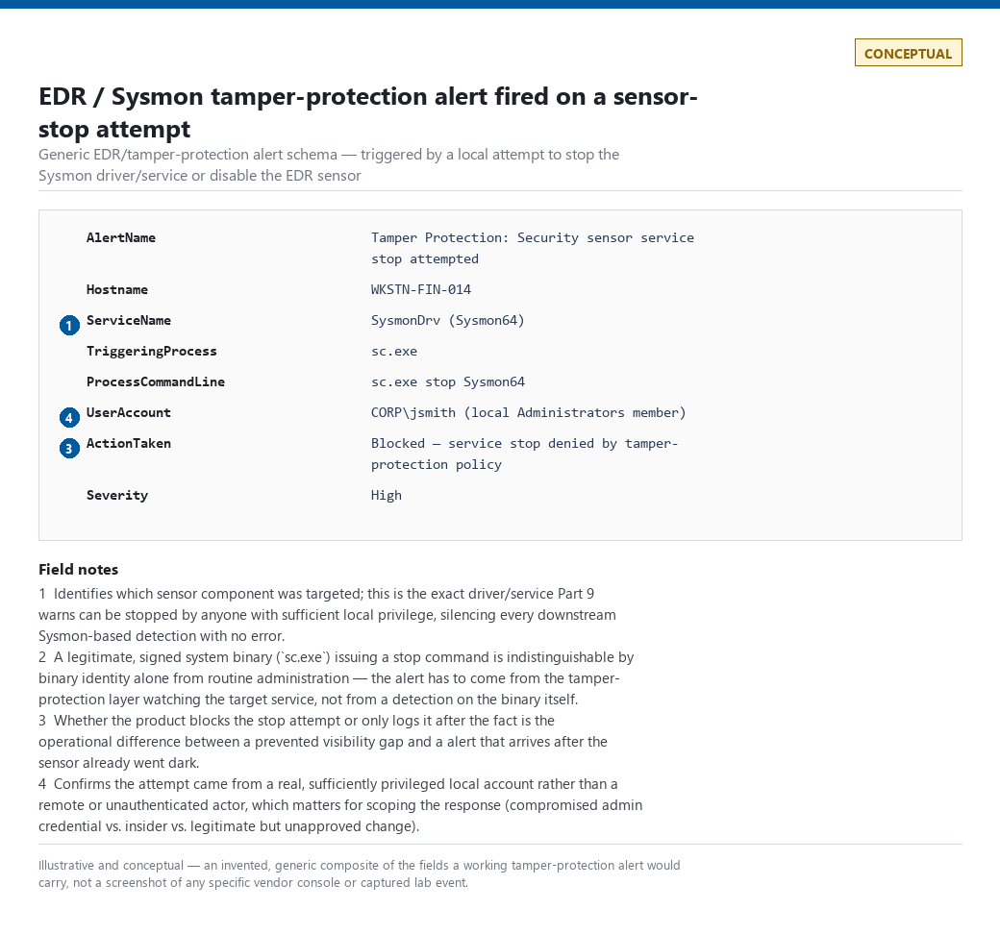
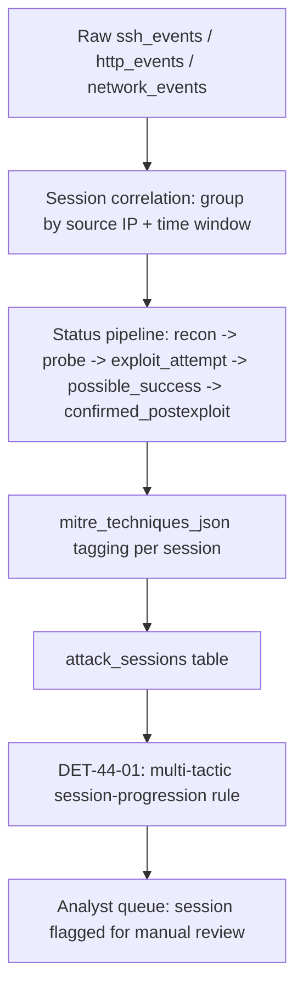

# Part 44 — Adversary Behaviour for Defenders

## Why this part exists

**[CONCEPT]** Parts 8 through 21 each built deep, telemetry-grounded detection logic for one domain — Windows, Sysmon, PowerShell, endpoint, identity, network, DNS, web, email, cloud, AI. None of them asked the question this part asks: when an actual intrusion runs from first foothold to final impact, what does the *sequence* look like across those domains, and where in that sequence does the standing detection stack actually have eyes versus where it's guessing? This part is a bridge, not a rebuild. It walks the 12 ATT&CK tactics from Initial Access through Impact, one at a time, and for each asks the same four questions: what does this behaviour look like, what evidence would actually show it, what's the detection and hunting angle, and — the question the other domain parts don't have room to sit with — what's the specific, named gap in what you can see at this stage. It does not reintroduce a single detection rule that Parts 8–21 already own. Every `DET-` reference below to earlier work is a pointer, not a copy.

Two scope boundaries, stated up front:

- **This is a pure detection-perspective walkthrough, not an offensive tutorial.** No section here explains how to run an exploit, write a C2 implant, or construct a working payload. Where a technique needs to be named to talk about its evidence, it's named at the level a coverage matrix would tag it — technique ID and a one-sentence description — not at the level of a how-to.
- **Reconnaissance (TA0043) and Resource Development (TA0042) are out of scope for this part**, per the tactic range in its title. Part 4 already covers real, captured reconnaissance evidence against this book's own honeynet (`HUNT-04-01`, scanning for exposed MCP endpoints), and that evidence resurfaces below anyway — a real attacker session rarely respects the tidy boundary between "recon" and "initial access," and §8's worked example shows exactly that overlap.

Everywhere this part has real lab evidence that matches a stage's topic, it uses that evidence instead of an invented example — most of it drawn from `lab/evidence/ct103-*` (the honeynet), `lab/evidence/ct108-*` and `lab/evidence/ct113-*` (honeynet-adjacent decoys), and the CT104 vulnerability-scanner host's own logs. Where a stage's canonical evidence is Windows-specific (privilege-group changes, service-installation events, EDR tamper-protection alerts) and this book's home lab has no Windows estate to capture it from, this part says so and substitutes a clearly labeled conceptual illustration rather than inventing a vendor console screenshot — see §6 for the one place that applies here.

---

## 1. A kill-chain view, with the kill chain's own limits stated first

**[CONCEPT]** The 12 tactics below — Initial Access (TA0001), Execution (TA0002), Persistence (TA0003), Privilege Escalation (TA0004), Defense Evasion (TA0005), Credential Access (TA0006), Discovery (TA0007), Lateral Movement (TA0008), Collection (TA0009), Command and Control (TA0011), Exfiltration (TA0010), and Impact (TA0040) — are presented in the order ATT&CK's own matrix lists them, and that order is a reading convenience, not a claim about how any real intrusion unfolds. A real attacker loops (Discovery → Credential Access → Discovery again, at deeper scope, after each lateral hop), skips stages entirely (an attacker who buys already-valid credentials on a criminal marketplace never touches an Initial-Access technique your telemetry would show — they walk in through Credential Access's own supply chain), and runs multiple tactics in parallel within the same few seconds (a single exploit request can be Initial Access and Execution in one HTTP request). §8 below shows this directly in real captured data: one honeynet session gets tagged with a Reconnaissance-tactic technique and an Initial-Access-tactic technique from the same few seconds of traffic, because the exploit probe itself doubled as the scan that found the target.

**[CONCEPT]** Each section below follows the same four-part shape: **behaviour** (what the tactic covers, in plain terms, with the technique IDs a coverage matrix would use), **evidence** (which telemetry sources would actually show it, cross-referenced to the part that owns that telemetry's detection logic), **detection and hunting angle** (a pointer to where the standing rule or hunt methodology lives, not a rebuilt version of it), and **visibility gap** (the specific way this stage can happen with none of the above producing a signal). The visibility-gap framing borrows its vocabulary directly from Part 41's six-tier Detection Coverage scale (`TERMINOLOGY.md` § Detection Coverage) — a stage with a visibility gap is a stage sitting at NO VISIBILITY or TELEMETRY ONLY for the specific variant described, not a stage with no detections at all.

```mermaid
flowchart LR
    IA["Initial Access (TA0001)"] --> EXE["Execution (TA0002)"]
    EXE --> PER["Persistence (TA0003)"]
    PER --> PRIV["Privilege Escalation (TA0004)"]
    PRIV --> DEF["Defense Evasion (TA0005)"]
    DEF --> CRED["Credential Access (TA0006)"]
    CRED --> DISC["Discovery (TA0007)"]
    DISC --> LAT["Lateral Movement (TA0008)"]
    LAT --> COL["Collection (TA0009)"]
    COL --> C2["Command and Control (TA0011)"]
    C2 --> EXF["Exfiltration (TA0010)"]
    EXF --> IMP["Impact (TA0040)"]
    IA -.->|stage skip via bought valid creds| LAT
    CRED -.->|stage skip: no C2, hands-on-keyboard only| DISC
    DISC -.->|loop: deeper enumeration after each hop| CRED
```






**Figure 44.1 (FIG-44-01) — The 12-tactic sequence, with the skip and loop paths a real intrusion actually takes.** *CONCEPTUAL.* Illustrates the ATT&CK reading order (solid arrows) against three concrete ways a real intrusion deviates from it (dashed arrows): entering directly at Lateral Movement on already-valid purchased credentials, an attacker who never establishes outbound Command and Control because every action is hands-on-keyboard through a single initial shell, and the Discovery-to-Credential-Access loop that repeats after every lateral hop into new scope. This is a reading aid, not a capture of any specific incident's actual path.

---

## 2. Initial Access (TA0001)

**[CONCEPT]** Initial Access covers how an adversary first gets a foothold: exploiting an internet-facing application, T1190 (Exploit Public-Facing Application); phishing, T1566 (Phishing); abusing external remote services like VPN or RDP gateways, T1133 (External Remote Services); supply-chain compromise; or simply authenticating with valid, already-obtained credentials, T1078 (Valid Accounts). The last of these is the one that matters most for how this whole part is framed, because it's the one that produces no Initial-Access-specific telemetry at all — see the Blind Spot below.

**[DETECTION ENGINEER]** The evidence for this stage lives almost entirely in Parts 12 (identity access and authentication), 16 (web), and 17 (email) — sign-in logs, WAF/application logs, and mail-gateway telemetry, respectively — with Part 18 owning the cloud-SaaS equivalent (OAuth consent grants, guest-account invites) and Part 19 owning cloud-infrastructure exposure (an overly permissive security group standing in for a phishing email). This part doesn't rebuild any of those rules. What it adds is the real captured shape of one specific Initial-Access technique against this book's own infrastructure: a genuine exploit-path probe against the honeynet's web decoy, captured in `lab/evidence/ct103-honeynet-http-events-exploit-probes.txt` — a `POST /GponForm/diag_Form` request from a real internet source, the well-known path for a GPON router authentication-bypass remote-code-execution chain (CVE-2018-10561/10562) that mass scanners still probe for years after disclosure. That single logged request is everything Initial-Access-stage telemetry for T1190 looks like in practice: one line, one path, no payload visible unless the WAF or reverse proxy logs the request body, and no way to tell from the HTTP log alone whether the exploit actually worked — that verdict depends entirely on what happens on the target *after* the request, which is why Part 16's detection logic for this technique correlates the request pattern against subsequent process or file-system activity rather than alerting on the request in isolation.

**[THREAT HUNTER]** The hunting angle at this stage is mostly retrospective: given a newly disclosed exploit path (a new CVE, a new mass-scanned URI pattern), hunt backward through retained web-access logs for the same path, scoped to the retention window Part 7 established, because the exploit may have been probed — or successfully used — well before the CVE was public. Part 34's hunt methodology covers the mechanics; this stage is one of the more common triggers for a genuinely intel-led hunt (Part 32).

> **Blind Spot**
> T1078 (Valid Accounts) is Initial Access that produces zero Initial-Access telemetry. An attacker authenticating with a stolen, correct credential — bought, phished in a prior campaign, or reused from an unrelated breach — generates the same successful sign-in event a legitimate user produces. Part 12's standing detections for this rely entirely on *downstream* signal (impossible travel, a new device fingerprint, a baseline deviation from Part 31) because the authentication event itself carries no distinguishing feature. If none of those downstream signals fire either — a low-volume, patient attacker using an account whose normal behaviour they've studied — this stage is invisible from the moment of entry through however long it takes a later stage to produce a signal instead.

---

## 3. Execution (TA0002)

**[CONCEPT]** Execution covers getting attacker-controlled code to actually run: command and scripting interpreters, T1059 (Command and Scripting Interpreter), with PowerShell, cmd, and shell sub-techniques; scheduled task or job abuse used to trigger a first run, T1053 (Scheduled Task/Job); and user-execution techniques that rely on a human opening a malicious file or link, T1204 (User Execution). Execution is frequently inseparable in time from Initial Access — the same request that exploits a web application is also the request that causes code to run — which is part of why ATT&CK models them as adjacent, not sequential-only, tactics.

**[DETECTION ENGINEER]** Parts 8–11 own this stage's detection logic in full: Part 8 for native Windows process-creation and command-line auditing, Part 9 for Sysmon Event ID 1 (Process Create) as the higher-fidelity version of the same signal, Part 10 for PowerShell-specific execution telemetry and obfuscation handling, and Part 11 for the cross-OS analytic layer — process-tree reasoning, living-off-the-land binary (LOLBin/LOLBAS/GTFOBins) abuse, and the parent-child lineage model that Part 11's own Detection Autopsy walks through in detail. This part does not re-derive any of it.

**[THREAT HUNTER]** The hunting angle worth naming here specifically is process-tree pivoting from a confirmed Initial-Access finding: once §2's hunt confirms a specific exploit request landed, pivot from that timestamp and source into process-creation telemetry on the target host for the following few minutes, looking for the actual execution the request triggered — this is the literal next step after an Initial-Access hunt closes, and it's how a web-log finding becomes an endpoint finding.

> **Blind Spot**
> Living-off-the-land execution — a legitimate, signed system binary used for an attacker's purpose (`rundll32.exe`, `certutil.exe`, `mshta.exe`, and dozens of others catalogued in LOLBAS/GTFOBins) — defeats any Execution-stage detection built on binary allowlisting or signature status alone, because the binary itself is exactly what it claims to be. Part 11's lineage-tier model exists specifically because binary identity alone is not a sufficient signal at this stage; see that part's own worked teardown of the "unsigned binary = malicious" naive rule, paid off in full in Part 40.

---

## 4. Persistence (TA0003)

**[CONCEPT]** Persistence covers how an adversary survives a reboot, a session end, or a credential rotation: creating or modifying a system service, T1543 (Create or Modify System Process); scheduled tasks/cron/systemd timers, T1053 (Scheduled Task/Job), introduced above; new account creation, T1136 (Create Account); and account manipulation that adds standing access without creating a new account outright, T1098 (Account Manipulation) — the last of these increasingly cloud-native, via an OAuth application granted standing API access rather than any endpoint artifact at all.

**[ENGINEERING]** Endpoint-side persistence evidence — service and scheduled-task creation, registry run keys, cron/systemd unit changes — is Part 11's domain across Windows and Linux; Part 13 owns AD-specific persistence (a Golden or Silver Ticket forged to outlive a password reset); Part 18 owns the cloud/SaaS equivalent. One real, if benign, illustration of the base telemetry shape sits in `lab/evidence/ct104-vulnscan-web-systemd-state-changes.txt`: a genuine `systemd` unit journal showing the canonical `Stopping → Deactivated successfully → Stopped → Starting → Started` sequence for `vulnscan-web.service`, repeating several times across two days as a developer iterated on deploys. Nothing in this specific capture is malicious — it's included here because it's exactly the *shape* a persistence-stage detection has to reason about: the question a real rule has to answer is not "did a service start" but "did a *new* unit file appear, or did an existing one's `ExecStart` change," neither of which a bare start/stop transition log shows on its own. A detection built only on watching for `Started`/`Stopped` lines, with no join against the unit file's own content or a package-manager/config-management provenance check, would treat this benign redeploy cadence identically to an attacker installing a new persistence unit and starting it for the first time.

> **Hunter's Note**
> When you're handed a host with no prior baseline and asked "is anything persisting that shouldn't be," don't start with the service list — start with *when each unit's file was last modified* relative to the host's known-good build or last patch date. A persistence mechanism installed by an attacker has a file timestamp; one shipped by the base image or a legitimate deploy pipeline has a timestamp that clusters with every other file from the same build. One outlier timestamp on one unit file is a far higher-signal pivot than trying to eyeball a service list for a name that "looks wrong."

---

## 5. Privilege Escalation (TA0004)

**[CONCEPT]** Privilege Escalation covers going from the access level Initial Access or Execution granted to a higher one: abusing a legitimate elevation mechanism like `sudo` or UAC, T1548 (Abuse Elevation Control Mechanism), with sudo-caching abuse as its own sub-technique; exploiting a specific vulnerability for privilege escalation, T1068 (Exploitation for Privilege Escalation); and — again — T1078 (Valid Accounts), introduced above, when the "escalation" is simply authenticating as an account that already holds the higher privilege.

**[DETECTION ENGINEER]** Part 13 owns AD/Kerberos-specific privilege-escalation detection (privileged-group membership changes, Kerberoasting as a path to a service account's higher effective privilege); Part 11 owns the cross-OS endpoint layer including sudo/UAC abuse; Part 8 owns the native Windows privilege-related event IDs this depends on. Part 34's own worked hunt (`HUNT-34-01`) already builds and fully validates a baseline-aware detection for exactly one instance of this stage — an interactive `sudo` session on an account with no history of interactive use — using the same real lab evidence referenced there (`lab/evidence/ct100-pihole-sudo-invocations.txt`, showing a genuine human-interactive `sudo` invocation with `TTY=pts/1` present, against `lab/evidence/ct104-vulnscan-sudo-invocations.txt`, showing a genuine scripted, non-interactive automation invocation with no `TTY` field at all). This part points to that worked example rather than reproducing it.

**[THREAT HUNTER]** The hunting angle that generalises past Part 34's specific case: for any account whose intended function is narrow (a service account, an automation identity, a scanner), the baseline isn't "did this account escalate privilege" — it's "did this account's *pattern* of privileged use change," since a legitimately narrow-scope account escalating privilege in exactly the way it always has is expected, and the same account escalating privilege through a mechanism or command shape it's never used before is the actual signal.

> **What Would Change My Mind**
> This section treats interactive-terminal presence (`TTY` populated) as a strong discriminator between human-driven and automation-driven privilege escalation, following Part 34's worked example. If a production audit of a real automation framework showed that a non-trivial share of legitimate scheduled jobs allocate a pseudo-terminal by design — some CI/CD runners and remote-orchestration tools do exactly this to capture interactive-style output — the TTY-presence signal would degrade from "strong discriminator" to "one input among several," and any detection built on it alone, including the worked example this part points to, would need an additional feature (command-shape consistency, invocation source) before shipping.

---

## 6. Defense Evasion (TA0005)

**[CONCEPT]** Defense Evasion covers actions that avoid or disable detection and prevention: clearing or tampering with logs, T1070 (Indicator Removal), including the log-clearing sub-technique; disabling or modifying security tools, T1562 (Impair Defenses); and masquerading, T1036 (Masquerading) — making malicious activity resemble something benign, whether that's a file name mimicking a system binary or a process injected into a trusted host process.

**[ENGINEERING]** This is the one stage where the telemetry chain itself is the primary attack surface, not just the source of evidence about some other attack surface. Part 8 covers native log-clearing evidence (the Security-channel audit-log-cleared event); Part 9 covers Sysmon's own tamper surface — a driver or service that can be stopped by anyone with sufficient local privilege, at which point every downstream Part-9 detection this book describes goes silent with no error; Part 11 covers EDR-agent tampering specifically, including the uncomfortable fact that most managed EDR products don't expose "the agent was disabled" as a first-class, always-on, cannot-be-suppressed alert to the customer by default, the same way they don't guarantee the health-check path itself can't be disabled alongside the sensor.



**Figure 44.4 (FIG-44-04) — EDR/Sysmon tamper-protection alert fields.** *CONCEPTUAL — illustrative field breakdown; not a captured screenshot.* Illustrates the field-level shape of a tamper-protection alert firing after a lab-safe attempt to stop the sensor service — this book's home lab has no managed EDR deployment and no Windows host running Sysmon under tamper-protection policy, so no real captured artifact backs this figure. It supports the Defense Evasion visibility-gap claim below by showing what a *working* tamper alert's fields look like, rather than only describing the gap in prose.

> **Blind Spot**
> A sensor or log pipeline that gets disabled *before* doing anything else is a stage-zero move that defeats every later-stage detection this book describes simultaneously, not just the Defense-Evasion-tagged ones — if the endpoint agent that would have caught Execution, Persistence, and Credential Access is dead, none of those detections were ever going to fire regardless of how well-built they are. The only detection that can actually catch this has to live outside the thing being tampered with: a heartbeat/health-check pipeline that alerts on the *absence* of expected telemetry from a host within a defined window, rather than any signature of the tampering action itself. Part 39 (False Negative Engineering) and Part 43 (Detection Debt) both treat "the sensor went dark and nobody noticed" as the canonical example of a failure mode that produces zero alerts and looks identical to "nothing happened."

---

## 7. Credential Access (TA0006)

**[CONCEPT]** Credential Access covers obtaining account credentials directly: brute-force and password-spray attempts, T1110 (Brute Force), with password-guessing and password-spraying as distinct sub-techniques; OS credential dumping, T1003 (OS Credential Dumping) — LSASS memory, SAM, `/etc/shadow`; and stealing or forging Kerberos tickets, T1558 (Steal or Forge Kerberos Tickets), with Kerberoasting as the most commonly seen sub-technique in the wild.

**[DETECTION ENGINEER]** Part 12 owns brute-force and spray detection against IdP/sign-in-log telemetry; Part 13 owns Kerberos-specific ticket abuse; Part 11 owns cross-OS credential-dumping detection (LSASS access, DPAPI, SSH private-key theft). This book has unusually strong real evidence for exactly one sub-technique here: `lab/evidence/ct103-honeynet-ssh-honeypot-credentials.txt` is a genuine capture of real internet source IPs attempting SSH credential-stuffing and default-credential sweeps against the honeynet's SSH decoy — `admin`/`admin`, `support`/`support`, and a sustained low-and-slow campaign from one source (`176.53.159.196` and near-neighbour addresses `.197`/`.198`) hitting the `support`/`support` combination repeatedly across several days rather than in one loud burst. That last detail is the operationally important one: the source didn't fail fast and move on, it paced its attempts across days — precisely the pattern that defeats a naive "N failures in M minutes" threshold rule, the exact naive-rule pattern seeded in Part 12 and paid off in full in Part 40.

**[THREAT HUNTER]** The hunting angle for the paced-credential-stuffing pattern above: rather than a fixed short window, hunt for the same source-identity-and-target pair recurring across a much longer window (days, not minutes) with a consistent low per-window count — the volume-per-window is deliberately kept under threshold, but the *total* attempt count and the *repetition* of the exact same credential pair against the exact same target over an extended period is itself the signal a short-window rule structurally cannot see.

> **Blind Spot**
> Everything in this section detects the *attempt*. None of it detects a credential obtained by a channel this program has no visibility into at all — purchased from a criminal marketplace, phished in a campaign against a different organisation that reused the password, or leaked in a third-party breach unrelated to this environment. Part 12's own detections, and this part's cross-reference to them, only ever see the moment that already-compromised credential gets *used* — which is why "Valid Accounts" appears as a named blind spot at two other stages in this part (§2, Initial Access; §5, Privilege Escalation) rather than being solved once, here, and forgotten.

---

## 8. Discovery (TA0007)

**[CONCEPT]** Discovery covers an adversary learning about the environment they're now inside: network and service discovery, T1046 (Network Service Discovery); file and directory discovery, T1083 (File and Directory Discovery); and account discovery, T1087 (Account Discovery). Discovery is also the stage where this part's real evidence most directly illustrates the non-linearity named in §1 — the honeynet's own correlation logic tags several real sessions with Discovery-tactic technique IDs *alongside* Reconnaissance- and Initial-Access-tactic IDs from the same short burst of activity, because a single automated tool's request sequence doesn't pause at tactic boundaries.

**[ENGINEERING]** Part 14 owns network-scan detection (port/horizontal/vertical scan patterns); Part 19 owns the cloud-infrastructure equivalent (enumeration API calls against IAM, storage, or compute inventories). This stage has a genuinely useful real-evidence pairing for the false-positive side of the problem specifically: `lab/evidence/ct108-honeynet-edge-ssh-protocol-scan.txt` captures a real sshd log signature — repeated `Unable to negotiate` and `Protocol major versions differ` entries, showing legacy key-exchange and host-key algorithm offers (`diffie-hellman-group1-sha1`, `ssh-rsa`, `ssh-dss`) and a bare SSHv1 banner probe — that is *exactly* the shape a "legacy SSH protocol/algorithm probe" detection rule should fire on. The source of that traffic, in this capture, is `192.168.1.96` — this book's own CT104 vulnerability-scanner host, running an authorised, scheduled internal scan, not an external attacker. The raw log signature is indistinguishable from a genuine external attacker fingerprinting the same host for the same reason (checking which legacy algorithms an sshd instance still accepts); only the source-IP context — internal, known-scanner range, scheduled window — separates the two.

> **False Positive Trap**
> A legacy-SSH-algorithm-probe detection, built purely on the sshd log signature in the example above, fires identically on your own authorised vulnerability scanner and on an external attacker doing reconnaissance for the same weakness. The fix is not a looser rule — it's a source-context join: allowlist known scanner infrastructure by IP range and scheduled-window metadata *at the query level*, the same discipline Part 14 and this book's False Positive Trap convention apply everywhere else, rather than assuming "internal source IP" alone is a safe exclusion (an attacker who has already achieved Lateral Movement is, by definition, an internal source IP running exactly this kind of enumeration).

**Figure 44.2 (FIG-44-02) — A single honeynet session tagged across three tactics in one correlation record.** *REAL LAB EXAMPLE.* Excerpt from `lab/evidence/ct103-honeynet-correlated-attack-sessions.txt`, captured 2026-09-15 from the honeynet collector's genuine `attack_sessions` table. Session `d48b795e47c04c6fbb456b17ddd219b9`, source `16.5.0.236`, status `possible_success`, is tagged `["T1595", "T1046", "T1083", "T1190"]` — Active Scanning (Reconnaissance), Network Service Discovery and File and Directory Discovery (both Discovery), and Exploit Public-Facing Application (Initial Access) — from a session lasting under two seconds. This is genuine attacker-adjacent traffic against the lab's sacrificial honeynet segment, not a captured confirmed intrusion; "possible_success" here means the platform's own logic flagged continued activity from the same source following an exploit-shaped request, which the honeynet operator would still need to review manually before calling it a true positive.

```text
session_id        source_ip   status            mitre_techniques_json
d48b795e...d219b9  16.5.0.236  possible_success  ["T1595","T1046","T1083","T1190"]
```

---

## 9. Lateral Movement (TA0008)

**[CONCEPT]** Lateral Movement covers moving from the initially compromised host or account to others in the environment: abusing remote-service protocols, T1021 (Remote Services), with SSH, RDP, and WinRM as the most common sub-techniques; and — again — T1078 (Valid Accounts), introduced in §2, when the lateral hop is simply reusing the same already-compromised credential against a new target.

**[DETECTION ENGINEER]** Part 13 owns pass-the-hash and pass-the-ticket detection; Part 14 owns the network-layer view of RDP/SSH/SMB lateral movement; Part 11 owns the endpoint-side process-lineage evidence a lateral hop produces on the target host once it lands. Part 34's full worked hunt (`HUNT-34-01`) is this book's fully developed worked example for exactly this stage — an account authenticating via SSH with valid credentials and no preceding failure burst, then running an interactive administrative session inconsistent with that account's established automation pattern — and this part deliberately does not reproduce that hunt's mechanics; see Part 34 §10 for the complete methodology, baseline construction, and the resulting `DET-34-01`.

**[THREAT HUNTER]** The generalisable version of Part 34's hunt: lateral movement via a legitimate remote-administration tool (an RMM product, a config-management agent already deployed for IT operations) is functionally identical, at the log-entry level, to that same tool being used for its intended purpose — the discriminator is never the tool, it's the *entity pairing* (does this specific administrator account normally touch this specific host) and the *behavioural pattern* once connected (does the command sequence resemble routine administration or something else), both of which require the baseline discipline Part 31 establishes.

> **Blind Spot**
> Lateral movement conducted entirely through an organisation's own sanctioned remote-management tooling — the same RMM agent, the same config-management push mechanism the IT team uses every day — produces telemetry that is, in the strict sense, completely accurate: a real administrative tool really did connect and really did run real commands. There is no artifact-level signature to detect here at all; the only detection surface is behavioural deviation from that tool's established, per-account usage pattern, which means a program with no baseline (Part 31) has effectively no detection for this specific lateral-movement path, regardless of how much raw telemetry it collects.

---

## 10. Collection (TA0009)

**[CONCEPT]** Collection covers gathering data of interest before it moves anywhere: data from local systems, T1005 (Data from Local System); from information repositories like wikis or ticketing systems, T1213 (Data from Information Repositories); and email collection, T1114 (Email Collection) — reading or exporting mailbox content directly rather than exfiltrating it through a separate channel.

**[ENGINEERING]** Part 11 owns endpoint-side file-access telemetry that would show bulk local-file staging; Part 17 owns mailbox-access and export-log evidence; Part 19 owns cloud-storage read/download telemetry, with the specific caveat — already covered in that part — that cloud control-plane logging often carries a delivery lag measured in minutes, which matters directly for Collection because a bulk-read event that lands in the log ten minutes after it happened is ten minutes an analyst spent looking at a queue that hadn't caught up yet.

> **Blind Spot**
> Bulk data access through an API call the account was already, legitimately authorised to make — a service account with standing read access to a document store, querying more of that store than it ever has before, but never crossing any hard permission boundary — produces an authorization decision of "allow" at every single step, because every single step genuinely was allowed. The signal here is exclusively volumetric and behavioural (this account has never read this many objects in one session before), which again depends entirely on the baseline discipline in Part 31 existing for that specific account and that specific resource — a program that baselines human user accounts but not service accounts has a Collection-stage blind spot exactly the size of its service-account population.

---

## 11. Command and Control (TA0011)

**[CONCEPT]** Command and Control covers how an adversary maintains an interactive channel back to compromised infrastructure: application-layer protocol abuse, T1071 (Application Layer Protocol), with DNS as its own sub-technique; protocol tunnelling, T1572 (Protocol Tunneling); and proxy use to obscure the true C2 endpoint, T1090 (Proxy).

**[DETECTION ENGINEER]** Part 14 owns beaconing-interval and rare-destination detection at the network layer; Part 15 owns DNS-tunnelling detection exclusively, by this book's own scope agreement between those two parts. This section's real evidence is reconnaissance-adjacent rather than confirmed C2, and it's worth being precise about that distinction rather than overselling it: `lab/evidence/ct103-honeynet-http-events-exploit-probes.txt` and `lab/evidence/ct113-aeronex-legacy-apache-scanner-probes.txt` both show real requests to `/mcp`, `/sse`, `/api/mcp`, and similar paths from sources sharing the user-agent string `Infrawatch/1.0`, alongside a separate `ModatScanner/1.2` (`modat.io`) source — genuine, named internet-wide scanning services mapping which hosts expose live Model Context Protocol endpoints, not a captured C2 channel actually established against this lab. It's included here because it's a preview of what an *established* AI-agent C2 channel's reconnaissance phase looks like against real infrastructure, cross-referenced to Part 21's full treatment of what happens once an MCP endpoint like this is actually live and taking client sessions.

> **Blind Spot**
> C2 that rides an allowed, high-reputation SaaS or CDN endpoint as its transport (a webhook platform, a paste service, a cloud provider's own API surface used as a dead-drop) is structurally indistinguishable at the network layer from legitimate use of that same platform by legitimate tools in the environment, because the destination reputation is genuinely good — the badness is in the *content* of the exchange, which TLS terminates before your network sensor ever sees it, not the destination. Part 14's rare-destination and beaconing-interval logic still has value here (the calling pattern itself can be anomalous even when the destination isn't), but a C2 channel deliberately tuned to mimic that platform's normal call cadence defeats even that.

---

## 12. Exfiltration (TA0010)

**[CONCEPT]** Exfiltration covers data actually leaving the environment: over the existing C2 channel, T1041 (Exfiltration Over C2 Channel); over a separate web service, T1567 (Exfiltration Over Web Service), with exfiltration to cloud storage as a distinct sub-technique; and over an alternative protocol like DNS, T1048 (Exfiltration Over Alternative Protocol) — whose sub-techniques are split by encryption status (symmetric-encrypted, asymmetric-encrypted, unencrypted/obfuscated) rather than by a dedicated DNS-named sub-technique, so DNS-based exfiltration falls under the unencrypted/obfuscated variant — the last of these owned exclusively by Part 15, same as the C2 side of DNS abuse.

**[ENGINEERING]** Part 14 and 15 cover network- and DNS-layer exfiltration volume and destination-rarity signals respectively; Part 19 covers cloud-storage egress, again subject to that domain's control-plane delivery-lag characteristics; Part 17 covers mailbox-forwarding-rule abuse as an exfiltration path that never touches the network layer that Parts 14/15 instrument at all.

> **Blind Spot**
> Exfiltration blended into an already-high-volume, already-authorised sync channel — a cloud storage sync client, a SaaS-to-SaaS integration moving data as part of its normal job — sits inside traffic a volume-based detection has already learned to treat as baseline-normal, precisely because the channel's *normal* volume is high. The signal that actually catches this is a change in *what* is being synced (sensitive-data classification joined to the sync event, per Part 19's enrichment model) rather than *how much*, and a program that only measures volume against this kind of channel is measuring the one dimension this exfiltration path is specifically shaped not to trip.

---

## 13. Impact (TA0040)

**[CONCEPT]** Impact covers the stage where an adversary's goal is realised in a way that directly damages availability, integrity, or trust: data encrypted for extortion, T1486 (Data Encrypted for Impact); inhibiting system recovery by deleting backups or shadow copies, T1490 (Inhibit System Recovery); outright data destruction, T1485 (Data Destruction); stopping a critical service, T1489 (Service Stop); and denial-of-service against availability, T1498 (Network Denial of Service).

**[SOC MANAGEMENT]** Impact-stage detection is deliberately treated as the already-failed case in this book's framing, most fully developed in Part 45's ransomware-specific kill-chain model: by the time mass file encryption or backup deletion is visible in telemetry, every earlier-stage detection and hunt this part describes has already had its chance and missed it, and the operational response shifts from "detect and disrupt" to "contain and recover" — a business-continuity and incident-response conversation (Part 1's Playbook/Runbook distinction) at least as much as a detection-engineering one. A SOC that measures its Impact-stage detection coverage as a success metric is measuring the wrong thing; the metric that actually matters is how many of the 11 stages before it already had a chance to catch the same intrusion first, which is exactly what Part 41's six-tier coverage model, applied per stage rather than per technique, is for.

> **What Would Change My Mind**
> This section's framing assumes pre-encryption signals (Discovery, Credential Access, Lateral Movement, backup/shadow-copy tampering as a Defense-Evasion-adjacent precursor) are reliably observable *before* mass encryption begins, which is the premise Part 45 builds its entire model on. If a documented incident post-mortem showed a ransomware operator achieving encryption within minutes of Initial Access, with no observable Discovery, Credential Access, or Lateral Movement phase at all — a fully automated, single-host, no-lateral-spread encryption event — the pre-encryption-signal model would need a distinct fast-path variant for that scenario, and Impact-stage detection (file-write-rate anomaly, entropy-of-write-content heuristics) would need to move from "last resort" to "primary control" for that specific attack shape.

---

## 14. Worked example: turning stage-tagged sessions into one correlation rule

**[DETECTION ENGINEER]** The honeynet evidence used across §§8 and 11 above comes from a real, working system: the collector backend's own `correlation.py` process groups raw `ssh_events`, `http_events`, and `network_events` rows into sessions, tags each session with MITRE technique IDs, and assigns a status that advances through `recon → probe → exploit_attempt → possible_success → confirmed_postexploit` as more activity from the same source accumulates. That pipeline is not itself a Detection Rule in this book's vocabulary — it's the Entity Resolution and Correlation layer (Part 30) that has to exist *before* a rule like the one below can be written on top of it.






**Figure 44.3 (FIG-44-03) — From raw event streams to a stage-progression alert.** *CONCEPTUAL.* Illustrates the general data-flow shape behind `DET-44-01` below — session correlation, then tactic tagging, then a rule evaluating the tagged session — as an architecture sketch of what the honeynet collector's real pipeline does, not a literal reproduction of its source code.

**[DETECTION ENGINEER]** `DET-44-01` is the analytic layer this part adds on top of that pipeline: rather than alerting on any single tagged technique (which would just be Part 14's or Part 16's existing per-technique rules, restated), it alerts specifically on a session whose tagged techniques span more than one ATT&CK tactic *and* whose status has advanced past the initial probe stage — the session-level signal this part's whole kill-chain framing exists to make legible, distinct from any one stage's own detection. Because every `target_system` in `attack_sessions` is an internal honeynet decoy with no legitimate production traffic, the baseline false-positive rate for this rule is close to zero by construction of the source, not because the query logic itself discriminates anything — the one path back in is the same internal-scanner case named in §8's False Positive Trap: CT104's own vulnerability scanner touching enough distinct request types against the honeynet in one window could legitimately span two tactics and trip this rule exactly like an attacker would.

The following illustrative query targets a schema modeled on the honeynet's real `attack_sessions` table; it has not been validated against any specific vendor SIEM's query engine. It also depends on a field the real table does not have: `attack_sessions` stores `mitre_techniques_json` (a JSON array of technique IDs, per Figure 44.2's excerpt) — there is no `mitre_tactics` field to dedupe directly, since one technique routinely maps to more than one tactic (T1078 (Valid Accounts), named three times elsewhere in this part, maps to four). Getting from technique IDs to a tactic count requires an explicit technique-to-tactic lookup table as a named dependency, not an assumed field:

```spl
CONCEPTUAL SAMPLE — illustrative SPL against a schema modeled on the honeynet's attack_sessions table, not validated against a live SIEM
| inputlookup attack_sessions
| eval mitre_technique_list=json_array_to_mv(mitre_techniques_json)
| lookup technique_to_tactic.csv technique_id AS mitre_technique_list OUTPUT tactic AS mitre_tactic_list
| eval tactic_count=mvcount(mvdedup(mitre_tactic_list))
| where tactic_count >= 2 AND status IN ("possible_success", "confirmed_postexploit")
| eval detection_id="DET-44-01"
| table session_id, source_ip, status, mitre_techniques_json, mitre_tactic_list, tactic_count
```

> **Detection Test**
> **Setup:** Read access to the honeynet collector's `attack_sessions` table (or an ingested copy), plus a `technique_to_tactic.csv` lookup covering at minimum T1595 (Active Scanning), T1046 (Network Service Discovery), T1083 (File and Directory Discovery), and T1190 (Exploit Public-Facing Application) (the four techniques present in the real capture below). No write access required.
> **Action:** Run the query above (or its KQL/native-SIEM equivalent) against the real captured data in `lab/evidence/ct103-honeynet-correlated-attack-sessions.txt`.
> **Expected result:** Session `d48b795e47c04c6fbb456b17ddd219b9` (source `16.5.0.236`) and every other `possible_success`-status row in that capture appears in the output, each resolving to at least two distinct tactics via the lookup (Reconnaissance and/or Discovery plus Initial Access, per Figure 44.2) — confirming the rule's join logic against real, not synthetic, correlated session data.

> **Engineering Reality**
> A session-progression rule like `DET-44-01` is only as good as the correlation layer beneath it, and now also as good as the technique-to-tactic lookup it depends on. If `correlation.py`'s time-window or source-IP grouping logic ever changes — a wider window that merges unrelated scanners into one false "session," or a narrower one that splits one real attacker's activity into several sessions that each look individually unremarkable — `DET-44-01` degrades silently in exactly the shape Part 43 calls Detection Debt: the query still runs, still returns rows, and the rows are simply wrong, with no ingest error to flag it. The same failure mode applies to the lookup itself: if `technique_to_tactic.csv` isn't kept current as ATT&CK adds or reclassifies techniques, or if a session's `mitre_techniques_json` is null or malformed, the `lookup` step silently produces no match, `tactic_count` evaluates low or to zero, and the session drops out of the results — indistinguishable from a session that genuinely spans only one tactic. The concrete way to catch this before an analyst does, rather than discovering it during the next real incident, is the same discipline Part 42's canary detection (`DET-42-02`) applies to any pipeline that can go quiet without an error: track the daily row count and tactic-count distribution `DET-44-01` actually returns against its own trailing baseline, and alert on a sustained drop. A correlation-layer or lookup-table break shows up first as a volume anomaly in this rule's own output — fewer qualifying sessions than the honeynet's steady scan-traffic base rate would predict — not as an ingest failure anywhere upstream that a pipeline dashboard would flag on its own.

> **Blind Spot**
> Every `exploit_attempt`/`possible_success` row in the real capture behind Figure 44.2 already carries T1595, T1046, and T1190 together — three tactics, not two — because this honeynet's commodity scanning traffic bundles reconnaissance and the exploit probe into the same request flurry. That means `tactic_count >= 2` hasn't actually discriminated anything in this dataset beyond what the `status` filter alone would: every session that reaches the required status already clears the threshold by a full tactic to spare. The structural cost shows up in the case this rule was partly built for: an attacker who scouted the target in an earlier session, or from outside this platform's visibility entirely, and returns to send only the exploit-shaped request reaches `possible_success` with a `tactic_count` of one — T1190 alone — and `DET-44-01` never fires. As written, the rule reliably catches noisy, multi-technique commodity scanning and structurally misses the more deliberate, single-technique attacker.

---

## 15. Hunting the stage skip: HUNT-44-01

**[THREAT HUNTER]** **Threat Hypothesis (`HUNT-44-01`):** An account or host observed performing Discovery- or Lateral-Movement-stage behaviour (internal network/service enumeration, or an administrative session on a host that account doesn't normally touch) should have a corresponding Credential-Access- or Initial-Access-stage alert earlier in the same investigation window. An account/host pair showing the later-stage behaviour with no matching earlier-stage alert anywhere in its history is either a standing detection gap at the earlier stage, or evidence of an entry path this part's 12-tactic model doesn't cover at all — insider access, physical access, or a supply-chain foothold that never produced Initial-Access-shaped telemetry to begin with.

**[THREAT HUNTER]** **Pivot approach:** Start from confirmed or high-confidence Lateral-Movement- or Discovery-stage findings (Part 34's `HUNT-34-01` is the fully worked instance of exactly this starting point) and walk backward through that account's or host's alert history across every earlier tactic this part covers, not just the domain-specific alert history any single Part 8–21 rule would surface on its own — this is a genuinely cross-domain pivot, which is the reason this hunt belongs in a bridge chapter rather than any one telemetry-domain part. Where no earlier-stage alert exists, check whether the gap is a Visibility Debt problem (the telemetry existed but no analytic was ever built against it, per Part 41's tier model) or a genuine dark spot (no telemetry existed at all for that stage, for that entity, in that window).

**[THREAT HUNTER]** **Expected finding if the hypothesis holds:** either a specific, nameable detection gap at an earlier stage — feeding directly into Part 36's hunt-to-detection pipeline as a new analytic candidate — or, if the earlier-stage telemetry genuinely never existed for that entity, a documented negative finding that names the exact stage and entity population affected, per this book's own Hunt definition (`TERMINOLOGY.md` § Hunt): a hunt that ends in "found nothing, moving on" with no artifact left behind doesn't count as a completed hunt in this book's vocabulary, and this one is no exception.

> **Hunter's Note**
> Don't run this hunt starting from every account — start from the population where a stage skip would actually be surprising: service accounts and automation identities with a narrow, well-understood function. A human user account showing up at Discovery with no visible Credential-Access precursor is unremarkable (people authenticate and then look around constantly); a service account scoped to one function doing the same thing has a much smaller space of legitimate explanations, which makes the hunt's signal-to-noise ratio dramatically better for that population than for the general user base. Run against the unfiltered general user population instead, expect the false-positive rate to be dominated by exactly this unremarkable case — most "no earlier-stage alert" hits will be ordinary users who authenticated normally and then looked around, not stage-skip attackers — which is the honest number this hunt returns for that population, not a flaw specific to the query.

**[THREAT HUNTER]** This hunt has a structural dependency worth naming rather than assuming away: it only ever starts from a *confirmed* later-stage finding, which means it inherits every blind spot already named at those stages. An attacker who defeats the Lateral-Movement detection this hunt pivots from (§9's sanctioned-RMM blind spot, for instance) never produces the starting finding in the first place, so this hunt never runs against that entity at all — an attacker doesn't need to defeat this hunt directly, only the upstream detection it depends on, and the stage-skip gap it exists to find stays invisible by the same mechanism that made the underlying lateral movement invisible. The same dependency creates a silent-failure mode distinct from a query breaking: if the upstream late-stage detections this hunt pivots from (`HUNT-34-01`'s `DET-34-01` and its equivalents at other stages) degrade or stop firing — the exact failure mode `DET-44-01`'s own Engineering Reality above describes for its correlation layer — this hunt has nothing left to start from and returns zero findings, which looks identical to "no stage-skip gaps exist" rather than "the hunt had no input." A long run of zero findings from `HUNT-44-01` is not, by itself, evidence the program is clean; it's worth periodically checking against Part 41's coverage-tier state for the stages this hunt depends on before treating silence as a clean result.

---

## 16. Where this leaves you

**[CONCEPT]** The table below is this part's own summary, not a coverage-matrix replacement for Part 41 — it maps each tactic to the part that owns its detection logic, so a reader who finishes this bridge chapter knows exactly where to go next for depth.

**Table 44.1 — Tactic-to-owning-part map.** The table below supports one decision: which part to open next for the actual detection logic behind a given stage, since this part deliberately doesn't rebuild any of it.

| Tactic (ID) | Representative Techniques | Owning Part(s) |
|---|---|---|
| Initial Access (`TA0001`) | T1190 (Exploit Public-Facing Application), T1566 (Phishing), T1078 (Valid Accounts), T1133 (External Remote Services) | Parts 12, 16, 17, 18, 19 |
| Execution (`TA0002`) | T1059 (Command and Scripting Interpreter), T1204 (User Execution), T1053 (Scheduled Task/Job) | Parts 8, 9, 10, 11 |
| Persistence (`TA0003`) | T1543 (Create or Modify System Process), T1136 (Create Account), T1098 (Account Manipulation) | Parts 11, 13, 18 |
| Privilege Escalation (`TA0004`) | T1548 (Abuse Elevation Control Mechanism), T1068 (Exploitation for Privilege Escalation), T1078 (Valid Accounts) | Parts 11, 13 |
| Defense Evasion (`TA0005`) | T1070 (Indicator Removal), T1562 (Impair Defenses), T1036 (Masquerading) | Parts 8, 9, 11 |
| Credential Access (`TA0006`) | T1110 (Brute Force), T1003 (OS Credential Dumping), T1558 (Steal or Forge Kerberos Tickets) | Parts 11, 12, 13 |
| Discovery (`TA0007`) | T1046 (Network Service Discovery), T1083 (File and Directory Discovery), T1087 (Account Discovery) | Parts 14, 19 |
| Lateral Movement (`TA0008`) | T1021 (Remote Services), T1078 (Valid Accounts) | Parts 11, 13, 14, 34 |
| Collection (`TA0009`) | T1005 (Data from Local System), T1114 (Email Collection), T1213 (Data from Information Repositories) | Parts 11, 17, 19 |
| Command and Control (`TA0011`) | T1071 (Application Layer Protocol), T1572 (Protocol Tunneling), T1090 (Proxy) | Parts 14, 15, 21 |
| Exfiltration (`TA0010`) | T1041 (Exfiltration Over C2 Channel), T1567 (Exfiltration Over Web Service), T1048 (Exfiltration Over Alternative Protocol) | Parts 14, 15, 17, 19 |
| Impact (`TA0040`) | T1486 (Data Encrypted for Impact), T1490 (Inhibit System Recovery), T1485 (Data Destruction), T1489 (Service Stop) | Part 45 |

**[CONCEPT]** Parts 45 through 48 pick up from here and apply this same stage-by-stage lens to four specific compromise shapes — ransomware, identity compromise, web compromise, and AI compromise — each a deeper, domain-specific version of the walk this part just did generally. Where this part named a Blind Spot in the abstract (Valid Accounts defeating Initial Access, Credential Access, and Privilege Escalation telemetry alike), Part 46 builds the concrete identity-compromise model around exactly that gap. Where this part deferred Impact to "already failed," Part 45 explains precisely what pre-encryption signal budget a real ransomware timeline actually gives a defender to work with.

**Table 44.2 — Detections and hunts introduced in this part.**

| ID | What It Does | Query Language | MITRE |
|---|---|---|---|
| DET-44-01 | Multi-tactic session-progression correlation over honeynet-style tagged sessions | SPL | T1595 (Active Scanning), T1046 (Network Service Discovery), T1083 (File and Directory Discovery), T1190 (Exploit Public-Facing Application) |
| HUNT-44-01 | Backward pivot from a late-stage finding to check for a missing earlier-stage detection, across tactics | — (cross-domain pivot, not a single query) | T1078 (Valid Accounts), T1021 (Remote Services) |

**MITRE:** T1595 (Active Scanning), T1190 (Exploit Public-Facing Application), T1566 (Phishing), T1078 (Valid Accounts), T1133 (External Remote Services), T1059 (Command and Scripting Interpreter), T1204 (User Execution), T1053 (Scheduled Task/Job), T1543 (Create or Modify System Process), T1136 (Create Account), T1098 (Account Manipulation), T1548 (Abuse Elevation Control Mechanism), T1068 (Exploitation for Privilege Escalation), T1070 (Indicator Removal), T1562 (Impair Defenses), T1036 (Masquerading), T1110 (Brute Force), T1003 (OS Credential Dumping), T1558 (Steal or Forge Kerberos Tickets), T1046 (Network Service Discovery), T1083 (File and Directory Discovery), T1087 (Account Discovery), T1021 (Remote Services), T1005 (Data from Local System), T1114 (Email Collection), T1213 (Data from Information Repositories), T1071 (Application Layer Protocol), T1572 (Protocol Tunneling), T1090 (Proxy), T1041 (Exfiltration Over C2 Channel), T1567 (Exfiltration Over Web Service), T1048 (Exfiltration Over Alternative Protocol), T1486 (Data Encrypted for Impact), T1490 (Inhibit System Recovery), T1485 (Data Destruction), T1489 (Service Stop), T1498 (Network Denial of Service).
