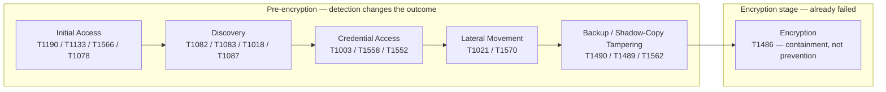
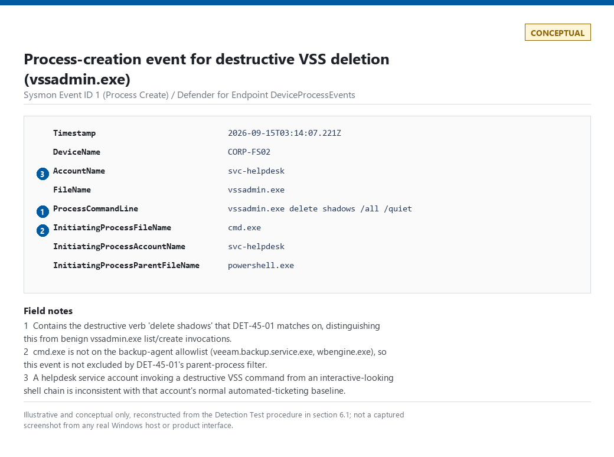
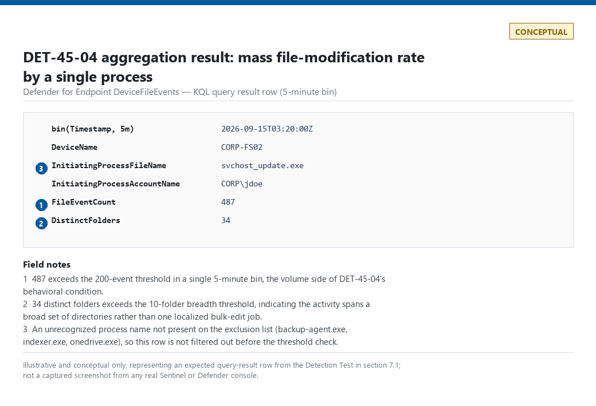
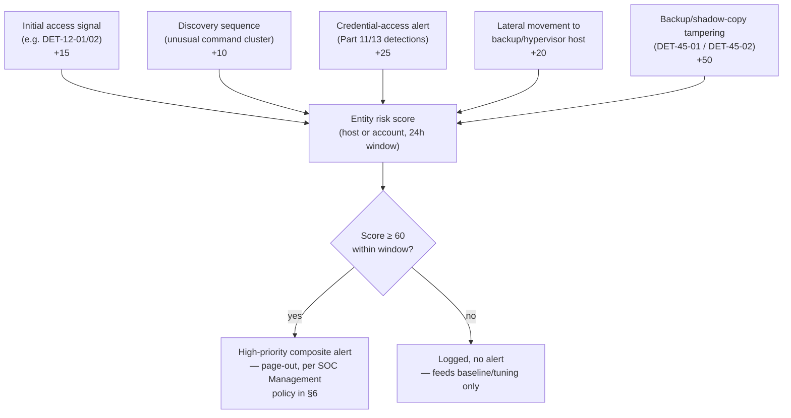

# Part 45 — Ransomware Detection Model

## Why this part exists

Most ransomware write-ups a SOC actually reads are written backwards. They open with the ransom note, walk through the encryption routine, and treat everything that happened in the days or weeks before — the exposed RDP endpoint, the domain enumeration, the LSASS dump, the disabled backups — as backstory to the "real" event. That ordering trains analysts to think of ransomware as an encryption problem, which means the first alert most programs are tuned to catch is the one that fires after the outcome is already unrecoverable without a backup restore.

This part inverts that emphasis deliberately. It builds a kill-chain model for ransomware that treats every stage before encryption as the place detection actually pays off, and treats the encryption stage itself as the already-failed case — the thing you detect to contain blast radius and start recovery faster, not the thing you were ever going to prevent by watching for it. This mirrors how Part 44 framed ATT&CK stages generally (behavior, evidence, detection, hunting angle, visibility gap, per stage) but narrows to one adversary goal end to end, and it leans hardest on the one stage that is close to unique to ransomware as a business model: backup and shadow-copy tampering, covered in depth in §6.

This part does not reintroduce detections already built in their home parts — initial-access credential attacks are Part 12's DET-12-01 through DET-12-05, Kerberos and directory credential abuse is Part 13's territory, and correlation windows and entity keys are Part 30's. Where a stage is already covered elsewhere, this part points there and explains what's specific about the ransomware framing of it. The new material here is the backup/shadow-copy detections, the composite kill-chain scoring model, and the last-resort encryption-stage detection — the parts of the ransomware problem that don't have a natural home in an earlier, technology-organized part.

Scope: initial access, discovery, credential access, and lateral movement as they specifically apply to ransomware operations (with cross-references rather than re-derivation); backup and shadow-copy tampering as the highest-value pre-encryption signal; a composite, risk-scored model for correlating weak signals across all of the above; and encryption-stage detection framed explicitly as containment, not prevention.

---

## 1. The kill-chain model: why encryption-stage detection is the last resort

**[CONCEPT]** A modern ransomware operation is not one action — it's a sequence of stages, each of which produces its own telemetry, each of which is progressively harder for the attacker to avoid producing evidence of. The stage weighting in this part is deliberate: the earlier a stage sits in the chain, the more detection opportunities it offers and the less damage a true positive costs to act on. The later a stage sits, the fewer options remain and the more "detection" really means "faster containment of a loss that has already started."

FIG-45-01 lays out the six stages this part uses and marks the boundary between "detection changes the outcome" and "detection only changes how fast you notice."




**Figure 45.1 (FIG-45-01) — Ransomware kill-chain model, weighted toward pre-encryption signals.** *CONCEPTUAL.* Illustrates the stage sequence this part uses and the deliberate framing boundary between stages where detection can still change the outcome and the encryption stage, where detection only affects containment speed. Not a capture from a real intrusion; see §§2–7 for the per-stage detection content and the real lab evidence cited there. Rendered above; Mermaid source above is the editable version of record.

**[SOC MANAGEMENT]** The practical consequence of this model for a SOC's staffing and alert-routing decisions: backup and shadow-copy tampering alerts (§6) should never sit in a normal analyst queue behind routine triage. By the time that stage fires, the attacker is one scripted step from encryption, and the window to isolate hosts and preserve any remaining backup copies is measured in minutes, not the hours a Tier 1 queue SLA usually allows.

> **What Would Change My Mind**
> This model assumes backup/shadow-copy tampering reliably precedes encryption by enough time to act on. If a future ransomware family routinely encrypted first and tampered with backups afterward (or in parallel, with no exploitable time gap), the "highest-signal pre-encryption stage" claim in §6 would need to move — the tampering event would become a confirmation signal for an incident already underway rather than a warning ahead of one.

---

## 2. Initial access: how ransomware actors actually get in

**[CONCEPT]** Ransomware initial access is not a distinct technique category — it's ordinary initial access (Part 44 §"Initial Access") aimed at an operator who monetizes differently once inside. The dominant paths, consistently reported across ransomware incident data, are:

- **T1190 (Exploit Public-Facing Application)** — an unpatched VPN concentrator, file-transfer appliance, or web application.
- **T1133 (External Remote Services)** — RDP or VPN exposed directly to the internet with weak or reused credentials.
- **T1566 (Phishing)** — most often T1566.001 (Spearphishing Attachment) delivering a loader, less often a direct credential-harvesting page.
- **T1078 (Valid Accounts)** — credentials obtained from an infostealer log, a prior breach dump, or **T1110 (Brute Force)** activity — specifically T1110.003 (Password Spraying) or T1110.004 (Credential Stuffing) — against an exposed authentication endpoint.

**[DETECTION ENGINEER]** The detection logic for each of these paths already exists in its home part: Part 12's DET-12-01 (password spray) and DET-12-02 (single-account brute force) cover the T1078/T1110 path; Part 14 covers exposed-service discovery; Part 17 covers the phishing-delivery path. This part's contribution is narrower: naming which of those existing detections carry the most ransomware-specific weight, and pointing out where they need to feed the composite score in §8 rather than stand alone.

> **Hunter's Note**
> If you only have budget to harden and instrument one initial-access path against ransomware specifically, harden internet-facing RDP and VPN first. Exploit-based initial access (T1190) generates headlines, but exposed remote access with weak or reused credentials is the more consistently reported path across ransomware incident retrospectives, and it's the cheapest one to close — disable direct RDP exposure, put remote access behind an MFA-enforcing gateway, and the brute-force/credential-stuffing detections in Part 12 suddenly have a much smaller legitimate-traffic population to separate from.

The volume this path produces in the wild is not hypothetical. The lab's own SSH honeypot (`lab/evidence/ct103-honeynet-ssh-honeypot-credentials.txt`) logged a sustained, low-and-slow credential-stuffing campaign from one source IP and its near-neighbor addresses (176.53.159.196, .197, .198 — likely the same operator rotating within an assigned block) repeating a `support`/`support` default-credential pair against a decoy SSH listener over multiple days, mixed with opportunistic default-credential sweeps (`admin`/`admin`) from unrelated source blocks. That pattern, at that volume, against an internet-facing SSH or RDP endpoint that fronts real infrastructure rather than a decoy, is exactly the T1078/T1110 population DET-12-01/DET-12-02 are built to separate from noise.

---

## 3. Discovery: mapping the environment before it matters

**[CONCEPT]** Once inside, an operator (human-operated ransomware, not a self-propagating worm) needs to know what's worth encrypting and where the backups live before doing anything destructive. The discovery stage maps cleanly to:

- **T1082 (System Information Discovery)** and **T1083 (File and Directory Discovery)** — inventorying hosts and shares.
- **T1018 (Remote System Discovery)** — enumerating reachable hosts, often via `net view`, `nltest`, or ping sweeps.
- **T1087 (Account Discovery)**, specifically **T1087.002 (Domain Account)** — enumerating privileged groups.
- **T1482 (Domain Trust Discovery)** — mapping trust relationships for lateral reach, commonly via tools like AdFind.

**[DETECTION ENGINEER]** None of these individual commands are rare enough to alert on standing alone — `net group "Domain Admins" /domain` runs legitimately in help-desk scripts constantly. The ransomware-specific detection angle is sequence and density: several discovery commands from the same session, on hosts that don't normally run them interactively, in a tight window. That's a correlation problem (Part 30's entity-key and correlation-window mechanics), not a single-event signature problem, and it's exactly the shape of signal this part's composite score (§8) is built to consume rather than alert on directly.

A structurally similar, real example of scripted-vs-interactive discrimination is visible in the lab's own sudo telemetry. `lab/evidence/ct104-vulnscan-sudo-invocations.txt` shows a recurring, scripted sudo pattern — the same account, the same command template, firing on an automated polling cadence (roughly every 47–113 minutes in the captured window, not a literal fixed timer, but clearly machine-driven rather than an analyst typing commands) — which is the legitimate baseline a discovery-sequence detection needs to model against before it can flag an *interactive*, varied command sequence as anomalous. Part 31's baselining methodology is the direct dependency here: you cannot flag "unusual discovery activity" without first having a working model of "usual."

---

## 4. Credential access: escalating from a foothold to domain-wide reach

**[CONCEPT]** Human-operated ransomware almost always needs credentials beyond the initial foothold — the account that clicked the phishing link is rarely the account with write access to backup infrastructure. The dominant techniques:

- **T1003 (OS Credential Dumping)**, specifically **T1003.001 (LSASS Memory)** — the credential-theft-from-memory pattern covered in depth as Part 11's running example.
- **T1558 (Steal or Forge Kerberos Tickets)**, specifically **T1558.003 (Kerberoasting)** — covered in Part 13.
- **T1552 (Unsecured Credentials)** — credentials left in scripts, config files, or password managers on a compromised host.

**[DETECTION ENGINEER]** This part does not re-derive these detections; Part 11 and Part 13 own that logic and its false-positive analysis. What's specific to the ransomware framing is what the *combination* means: an LSASS-access alert (Part 11) that fires on a host that also produced a discovery-sequence signal (§3) in the preceding hour is a materially different priority than the same alert firing in isolation. That's the composite-score logic in §8 — this stage's job here is to be a documented input to it, not to be re-explained.

> **Blind Spot**
> Every credential-access detection in Parts 11 and 13 depends on the attacker touching a monitored surface — LSASS memory, a Kerberos ticket request, a file scan for stored secrets. An operator who obtains valid domain credentials from an infostealer log purchased on a criminal marketplace, entirely outside your telemetry, produces none of these events and walks straight to T1078 (Valid Accounts) with a credential your program never saw compromised. Credential-access telemetry alone cannot catch this; only the anomalous-use detections in Part 12 (impossible travel, failure-then-success bursts) have a chance, and only if the login itself looks different enough from the account's baseline to trip them.

---

## 5. Lateral movement: staging across the estate

**[CONCEPT]** With credentials in hand, the operator moves toward the systems that matter most for the eventual encryption stage: file servers, hypervisor management interfaces, domain controllers, and — critically for this part — backup infrastructure. The common techniques:

- **T1021 (Remote Services)** — T1021.001 (RDP), T1021.002 (SMB/Windows Admin Shares), T1021.006 (Windows Remote Management).
- **T1570 (Lateral Tool Transfer)** — copying tooling (encryptors, credential-dumping utilities, remote-admin binaries) to newly reached hosts ahead of the final stages.

**[THREAT HUNTER]** The detail worth hunting for specifically in a ransomware context is lateral movement that terminates at backup or hypervisor management infrastructure rather than spreading uniformly across the estate. Ordinary IT lateral movement (patching, software deployment) touches broad host populations; a ransomware operator's lateral movement disproportionately targets the systems that can either be encrypted for maximum leverage or that could stop the operation if left untouched — the backup server and the hypervisor management plane chief among them.

The lab's own honeynet correlation pipeline is a real, working example of the shape this staging detection needs, even though it was built for a different threat population (opportunistic internet scanning rather than a human-operated ransomware crew). `lab/evidence/ct103-honeynet-correlated-attack-sessions.txt` is the honeynet platform's own automated correlation of raw connection events into sessions, tagged with real MITRE technique IDs and staged through a severity pipeline:

```text
source_ip        target_system  status            mitre_techniques_json                 last_seen
---------------  -------------  ----------------  -------------------------------------  --------------------------------
16.5.0.236       10.99.99.10    possible_success  ["T1595", "T1046", "T1083", "T1190"]   2026-09-15T06:08:23.042885+00:00
45.156.128.131   10.99.99.10    possible_success  ["T1595", "T1046", "T1083", "T1190"]   2026-09-15T05:41:53.643995+00:00
45.156.128.45    10.99.99.10    exploit_attempt   ["T1595", "T1046", "T1190"]            2026-09-15T05:40:20.142717+00:00
```

**Figure 45.2 (FIG-45-02) — Honeynet session-level correlation pipeline (excerpt).** *REAL LAB EXAMPLE.* Captured from CT103's `attack_sessions` table (Horizon Grid / hp-platform honeynet collector), capture run 2026-09-15, rows spanning attacker sessions from 2026-09-15T05:40–06:08 UTC against an internal AeroNex decoy target (`10.99.99.10`). Columns trimmed to fit; `session_id` and `notes` omitted from this excerpt but present in the source file. Shows the platform's own recon → probe → exploit_attempt → possible_success → confirmed_postexploit status pipeline with per-session MITRE tagging — the `mitre_techniques_json` values quoted above are the platform's own tags: T1595 (Active Scanning), T1046 (Network Service Discovery), T1083 (File and Directory Discovery), T1190 (Exploit Public-Facing Application) — escalating a session to `possible_success` once an exploit-shaped request is followed by continued activity from the same source. Evidence of what a working session-level correlation output looks like structurally, not a capture of ransomware lateral movement specifically. See Part 30 for the correlation-engineering mechanics behind building a pipeline like this against enterprise lateral-movement telemetry instead of honeynet connection logs.

That five-stage status progression (recon → probe → exploit_attempt → possible_success → confirmed_postexploit) is a directly reusable shape for a ransomware-lateral-movement correlation pipeline: instead of alerting on any single T1021 logon, stage the entity's status forward only as corroborating signals accumulate, and reserve the highest-severity bucket for sessions that reach a host tagged as backup or hypervisor infrastructure.

---

## 6. Backup and shadow-copy tampering: the highest-signal pre-encryption stage

**[CONCEPT]** This is the stage this part weights most heavily, and it's the one detection engineers most often under-invest in relative to its value. Deleting or disabling recovery capability is a *necessary* step for a ransomware operator who wants leverage — a victim with intact, reachable backups can often just restore and ignore the ransom demand — which means this stage is close to mandatory for the attacker, unlike discovery or lateral movement, where a sufficiently narrow operation might skip steps. The dominant techniques:

- **T1490 (Inhibit System Recovery)** — deleting Volume Shadow Copies (`vssadmin.exe delete shadows`, `wmic shadowcopy delete`, `Diskshadow`), disabling Windows recovery options (`bcdedit`), or deleting Windows Server Backup catalogs (`wbadmin delete catalog`, `wbadmin delete systemstatebackup`). The direct hypervisor/Linux analog is deleting VM snapshots via a hypervisor's management interface or CLI — the pattern behind real incidents against ESXi infrastructure, often reached over SSH.
- **T1489 (Service Stop)** — stopping or disabling backup-agent services (Veeam, Windows Server Backup, third-party agents) or security tooling ahead of the encryption run.
- **T1562 (Impair Defenses)**, specifically **T1562.001 (Disable or Modify Tools)** — disabling EDR/AV, and **T1070 (Indicator Removal)**, specifically **T1070.001 (Clear Windows Event Logs)** — clearing the Security event log via Event ID 1102 (The audit log was cleared) to remove evidence of everything that preceded this stage.

> **Engineering Reality**
> There is no dedicated Windows event ID for "a shadow copy was deleted." VSS deletion is a side effect of a command execution, not a first-class logged event in its own right — detection depends entirely on process-creation logging (Sysmon Event ID 1 (Process Create), or Event ID 4688 (A new process has been created) if command-line auditing is enabled via GPO, which it is not by default) capturing the literal command line of `vssadmin.exe`, `wmic.exe`, or `Diskshadow.exe`. If command-line auditing isn't enabled, this entire detection category silently produces nothing, and an empty result set looks identical to "no tampering occurred." A second, narrower version of the same failure mode: Microsoft has been removing `wmic.exe` from default Windows installs on newer builds (it ships as an optional feature rather than a default binary starting with several Windows 11 releases) — a fleet with a mix of build versions will show `wmic shadowcopy delete` activity from older hosts and nothing at all from newer ones for the identical attacker action, which looks like partial coverage rather than the OS-version gap it actually is. Confirm which binaries are actually present on your fleet's builds before treating "no wmic hits" as a clean signal.

**[DETECTION ENGINEER]**

### 6.1 DET-45-01 — Volume Shadow Copy and Windows Backup deletion

The naive version of this rule is a trap worth dissecting before building the real one.

> **Detection Autopsy — "alert on any execution of vssadmin.exe"**
>
> **The rule:** Fires on every process-creation event where the image name is `vssadmin.exe`, regardless of arguments.
>
> **Why it shipped:** VSS deletion is the headline ransomware behavior, `vssadmin.exe` is the tool most write-ups name, and matching the binary name is a one-line filter that's trivial to explain in a design review.
>
> **How it failed:** Legitimate backup software — Windows Server Backup, Veeam, most enterprise backup agents — invokes `vssadmin.exe` constantly for ordinary snapshot creation, listing, and resizing as part of normal backup jobs. On an estate with backup agents deployed broadly, this fires dozens of times a night, every night, none of it an attacker, and the analyst who has to triage it learns within a week that a `vssadmin.exe` alert means "check if it's the backup job" — at which point the rule has trained its own dismissal.
>
> **The fix:** Restrict to the destructive verbs only (`delete`, `resize` with a shrinking target) rather than the binary name alone, and exclude command lines whose parent process is a known, allowlisted backup-agent executable. A backup agent legitimately calling `vssadmin delete shadows` to prune old snapshots as part of a retention policy still needs an explicit allowlist entry, not a blanket exclusion on the binary — see the False Positive Trap below for why the naive fix ("just exclude `vssadmin.exe` from backup hosts entirely") is its own trap.

The following Microsoft Sentinel / Defender KQL query targets Microsoft Defender for Endpoint's process-creation telemetry (`DeviceProcessEvents`) and implements the fixed version.

```kql
// Microsoft Sentinel / Defender for Endpoint KQL — DET-45-01: destructive VSS/backup-catalog
// command lines, excluding known backup-agent parent processes.
DeviceProcessEvents
| where Timestamp > ago(1h)
| where FileName in~ ("vssadmin.exe", "wmic.exe", "diskshadow.exe", "wbadmin.exe")
| where ProcessCommandLine has_any (
      "delete shadows", "delete catalog", "delete systemstatebackup", "delete backup",
      "shadowcopy delete", "resize shadowstorage"
  )
// exclude command lines spawned by an allowlisted backup-agent binary — see FP Trap below
| where InitiatingProcessFileName !in~ ("veeam.backup.service.exe", "wbengine.exe")
| project Timestamp, DeviceName, AccountName, FileName, ProcessCommandLine,
          InitiatingProcessFileName, InitiatingProcessAccountName
```

This query targets telemetry collected via the Defender for Endpoint sensor; it depends entirely on process-creation events reaching the table, so a host with the sensor stopped or tampered with (§6, T1562) produces silent zero results from this exact query, indistinguishable from "no tampering occurred" — the composite score in §8 does *not* currently model a missing-heartbeat input, so it does not compensate for this on its own. Pair this query with a sensor-health/heartbeat check (Part 5) that alerts when a host stops reporting `DeviceProcessEvents` entirely, and treat "known-good hosts producing zero events" as a monitoring alert in its own right, not a clean result. Without that pairing, a healthy-looking dashboard and a sensor an attacker just disabled look identical.

With the backup-agent allowlist actually complete and reviewed, expect this to fire rarely — low single digits per month across a mid-sized estate, mostly from newly onboarded backup tooling nobody added to the allowlist yet. Treat a burst of hits from one parent process as a signal to fix the allowlist, not to suppress the rule: a spike almost always means a new or reconfigured backup agent, not a sudden change in attacker behavior. This estimate is a starting point, not measured production data — track your own disposition history from week one and revise it.

> **False Positive Trap**
> Backup-agent processes routinely issue the exact destructive verbs this rule matches, as part of ordinary retention-policy pruning — an agent deleting a shadow copy older than its configured retention window is indistinguishable at the command-line level from an attacker doing the same thing manually. The fix is not to exclude the binary or the verb; it's to exclude by *parent process identity*, keeping an explicit, reviewed allowlist of backup-agent executables (with the same last-reviewed-date discipline as any other Exception per `TERMINOLOGY.md`), and to treat a destructive VSS command from any parent process *not* on that allowlist as high-confidence regardless of time of day.

> **Blind Spot**
> This detection matches only process-creation events for four named binaries. An operator who deletes shadow copies via the `Win32_ShadowCopy` WMI class instead of `vssadmin.exe` — for example `Get-CimInstance Win32_ShadowCopy | Remove-CimInstance` from PowerShell, or the equivalent invoked over a remote WMI/WinRM session — never spawns any of the four binaries this query matches and produces no destructive-verb command line for it to inspect, evading DET-45-01 completely while achieving the identical outcome. The same class exposes a scriptable `Delete()` method with no `vssadmin.exe` or `wmic.exe` process ever created. Catching this needs COM/WMI method-invocation telemetry, not process-creation logging — track it as a documented gap rather than an assumed-covered case, and treat HUNT-45-01's enumeration angle (§9.1) as similarly blind to the WMI-only path.

> **Detection Test**
> **Setup:** Isolated Windows test host, Defender for Endpoint or Sysmon installed, no production backup agent present.
> **Action:** `vssadmin.exe delete shadows /all /quiet` (this maps to MITRE Adversary Emulation content for T1490 — an Atomic Red Team T1490 test is a reasonable substitute for a manual invocation).
> **Expected result:** One process-creation event (Sysmon Event ID 1, or `DeviceProcessEvents` if using Defender) with `FileName` = `vssadmin.exe` and a command line containing `delete shadows`, `InitiatingProcessFileName` not matching the backup-agent allowlist, and DET-45-01 firing.

**MITRE:** T1490 (Inhibit System Recovery)



**Figure 45.5 (FIG-45-05) — Process-creation event for destructive VSS deletion.** *CONCEPTUAL — illustrative field breakdown; not a captured screenshot.* Shows the field shape a Sysmon Event ID 1 (or Defender `DeviceProcessEvents`) entry would have for `vssadmin.exe delete shadows /all /quiet`, with the full command line and `InitiatingProcessFileName` fields populated, matching the Detection Test above. Would support DET-45-01's field dependencies with a real captured example once a Windows host exists in the author's lab environment to generate it.

### 6.2 DET-45-02 — Backup or hypervisor management service stopped with no matching restart

**[DETECTION ENGINEER]** T1489 (Service Stop) targeting backup infrastructure has a distinctive shape once you have a baseline of what *legitimate* service restarts look like: a deploy, a patch cycle, or a scheduled maintenance window produces a clean `Stopping → Deactivated → Stopped → Starting → Started` sequence, with the "Started" half of that sequence following within a normal maintenance-window duration. An attacker stopping a backup agent ahead of encryption produces the first half of that sequence — and then nothing. The service simply never comes back, because nobody intends it to.

The lab's own systemd journal telemetry shows exactly what the legitimate baseline looks like. `lab/evidence/ct104-vulnscan-web-systemd-state-changes.txt` captured several real restart cycles for a production application service during iterative deploys:

```text
Sep 09 19:26:06 vulnscan systemd[1]: vulnscan-web.service: Deactivated successfully.
Sep 09 19:26:06 vulnscan systemd[1]: Stopped vulnscan-web.service - Vulnerability Scanner Dashboard (web).
Sep 09 19:26:07 vulnscan systemd[1]: Starting vulnscan-web.service - Vulnerability Scanner Dashboard (web)...
Sep 09 19:26:07 vulnscan systemd[1]: Started vulnscan-web.service - Vulnerability Scanner Dashboard (web).
```

**Figure 45.3 (FIG-45-03) — Legitimate service restart cycle in a systemd journal.** *REAL LAB EXAMPLE.* Captured via `journalctl -u vulnscan-web` on CT104 (vulnscan platform host), log lines spanning 2026-09-09 through 2026-09-10, capture run 2026-09-15. Shows the canonical `Stopping → Deactivated → Stopped → Starting → Started` sequence produced by an ordinary deploy/restart cycle — the baseline this detection needs to recognize the anomalous case (a stop with no matching start) rather than treat every service stop as suspicious.

The following Splunk SPL query targets syslog/journald data forwarded from Linux hosts running backup agents, and flags the anomalous half-sequence.

```spl
| index=linux_syslog sourcetype IN ("journald", "syslog") service_name IN ("veeam-agent", "backup-agent")
| eval event_type=case(
    match(_raw, "(?i)stopping|deactivated|stopped"), "stop",
    match(_raw, "(?i)starting|started"), "start"
  )
| stats latest(eval(if(event_type="stop", _time, null()))) as last_stop_time
        latest(eval(if(event_type="start", _time, null()))) as last_start_time
        by host service_name
| where isnotnull(last_stop_time) AND (isnull(last_start_time) OR last_start_time < last_stop_time)
| eval minutes_without_restart = (now() - last_stop_time) / 60
| where minutes_without_restart > 30
```

Two things to get right when adapting this query. First, `stop_time`/`start_time` must each be the *latest* event of their own type, not the earliest event in the window and the latest start — an earlier draft of this query took `earliest(_time)` as the stop time, which silently picks up whichever event (stop, start, or neither) happens to be oldest in the search window and mislabels it; with multiple stop/restart cycles inside one lookback window that bug reports a host as "never restarted" when it plainly did, or misses a second, un-restarted stop that happened after an earlier restart. The `last_stop_time < last_start_time` comparison above is what actually encodes "the most recent stop has no restart after it," which is the behavior the detection's name promises. Second, this query cannot be pointed at ESXi hypervisor management (`hostd`) unmodified: ESXi is not Linux and does not run systemd/journald — `hostd`'s logs arrive as conventional syslog (or via a vCenter/vSphere-specific forwarder), typically under a different sourcetype and without the `Stopping`/`Deactivated`/`Starting` wording this regex matches. Treat hypervisor-management coverage as a separate query against your syslog collector's actual ESXi event format, not a same-query extension of the Linux backup-agent case.

This query depends on the backup host's syslog or journald output actually reaching the SIEM at the expected volume — a host that goes fully dark (agent killed, forwarder stopped) produces no events at all rather than a stop-without-start pair, which this specific query cannot distinguish from "nothing happened here tonight." Pair it with a log-source heartbeat check (Part 5) to close that gap.

> **Blind Spot**
> This detection only sees a stop against the backup-*agent process* itself. An operator who leaves the agent running and instead deletes the backup repository's files, revokes the credentials the agent uses to reach off-host or cloud storage, or corrupts the backup catalog through the vendor's own management API produces no service-stop event at all — the service stays up, keeps reporting healthy, and every backup job it runs afterward simply fails silently against a target that no longer exists. T1490 against the *data* rather than the *service* needs its own detection against backup-repository access/deletion logs or cloud-storage audit trails; DET-45-02 does not extend to cover it.

> **False Positive Trap**
> A host reboot for OS patching stops the backup-agent service as a side effect of shutting down, and if the reboot (plus any post-boot service startup ordering delay) takes longer than the 30-minute threshold above, this fires on ordinary patch-cycle maintenance. Exclude hosts inside an active, ticketed maintenance window (the same maintenance-window suppression mechanism used elsewhere in the book — see `TERMINOLOGY.md` § Suppression) rather than raising the 30-minute threshold across the board, since a longer threshold just gives a real attacker more time before the alert fires.

> **Detection Test**
> **Setup:** Linux test host with a backup-agent service (or a stand-in unit file using one of the same two service-name strings the query matches) running under systemd, journald forwarding configured to the SIEM.
> **Action:** `systemctl stop backup-agent` and do not restart it; wait past the 30-minute window.
> **Expected result:** A `Stopping`/`Deactivated`/`Stopped` sequence in the journal with no following `Starting`/`Started` entry for that unit, and DET-45-02 firing once `minutes_without_restart` exceeds 30 for that host/service pair.

**MITRE:** T1489 (Service Stop)

---

## 7. The encryption stage: detection as containment, not prevention

**[CONCEPT]** By the time file content is actually being encrypted, the framing this part uses shifts completely: nothing at this stage prevents the loss that's already occurring on the hosts where it's running. What detection at this stage buys is containment speed — isolating unaffected hosts and shares before the encryption process reaches them, and starting incident response and restoration before an analyst discovers it manually via a help-desk flood of "I can't open my files" tickets.

**[DETECTION ENGINEER]**

### 7.1 DET-45-04 — Mass file-modification-rate detection

> **Detection Autopsy — "alert when a file is renamed to a known ransomware extension"**
>
> **The rule:** Maintains a list of known ransomware extensions (`.locky`, `.wcry`, and similar) and fires when a file rename matches one.
>
> **Why it shipped:** Early, widely publicized ransomware families used fixed, distinctive extensions, and matching a list feels concrete and low-effort compared to building a behavioral rule.
>
> **How it failed:** Extension lists are trivially defeated — most current ransomware either uses a randomly generated extension per infection or no extension change at all, encrypting file content in place. A rule keyed on a static extension list catches only unsophisticated or very old variants, and the maintenance burden of keeping the list current is a permanent, losing race against a trivially variable attacker choice.
>
> **The fix:** Detect the *behavior* — a high rate of file write/rename operations by a single process against a broad set of files in a short window — rather than the resulting filename. This is strictly harder to evade, since the attacker's actual goal (encrypt many files quickly) can't be hidden the way a cosmetic extension choice can.

The following Microsoft Sentinel / Defender KQL query targets Defender for Endpoint's file-event telemetry (`DeviceFileEvents`) and implements the behavioral version.

```kql
// Microsoft Sentinel / Defender for Endpoint KQL — DET-45-04: high-rate file
// modification/rename by a single process, excluding known bulk-I/O tooling.
DeviceFileEvents
| where Timestamp > ago(10m)
| where ActionType in ("FileModified", "FileRenamed")
| where InitiatingProcessFileName !in~ ("backup-agent.exe", "indexer.exe", "onedrive.exe")
| summarize FileEventCount = count(), DistinctFolders = dcount(FolderPath)
      by InitiatingProcessFileName, InitiatingProcessAccountName, DeviceName, bin(Timestamp, 5m)
| where FileEventCount > 200 and DistinctFolders > 10
```

This query depends on the file-event telemetry volume being retained and query-able at the granularity needed to compute a per-5-minute rate — on a high-write file server, tune the threshold against your own baseline write volume before trusting the default numbers above, since a legitimate bulk operation (a large file-share migration, a backup job's own read-and-verify pass) can exceed 200 events in 5 minutes just as easily as an encryption routine can.

Like DET-45-01, this query depends entirely on `DeviceFileEvents` actually reaching the table: a host with the Defender for Endpoint sensor stopped, uninstalled, or tampered with produces zero rows from this exact query, and zero rows looks identical to "no mass-encryption activity" rather than "no visibility." Because this is the last-resort containment signal — the one stage this part explicitly says has no earlier layer behind it — a silent sensor outage here is the single worst place in this model to go unnoticed. Do not rely on this query's own output to notice its own absence; pair it with a fleet-wide sensor-heartbeat check (Part 5) that alerts independently when a previously-reporting host stops sending file-event telemetry at all.

> **Blind Spot**
> A rate-based detection is blind to an operator who deliberately throttles the encryption process to stay under the threshold, or who encrypts a narrow, high-value target set slowly rather than the whole estate quickly — the "fast, loud" encryption behavior this rule assumes is a choice the attacker makes for speed, not a constraint they're forced into. It's also blind to encryption that happens directly against a backup target (a mounted network share, cloud storage sync folder) if that target isn't covered by the same file-event telemetry as the endpoint being monitored. And it's blind to an operator who spreads the identical total workload across several parallel worker processes on one host: each process individually stays under 200 events and 10 folders in the 5-minute bin the query groups by, even though the host as a whole is being encrypted at the same aggregate rate a single-process run would produce. A companion per-device aggregate (dropping the `InitiatingProcessFileName` grouping) would catch that case, but it would also catch a legitimate multi-process bulk job — trading this blind spot for a different false-positive problem rather than closing it for free.

> **Detection Test**
> **Setup:** Isolated test host with the Defender for Endpoint sensor (or Sysmon Event ID 11 (FileCreate)/2 (FileCreationTime changed) if simulating without Defender), a throwaway directory tree of at least a few hundred small files across 10+ subfolders, no real backup agent present.
> **Action:** Run a benign bulk-rename/rewrite loop (or a KnowBe4/Atomic Red Team ransomware-simulation script such as `atomic-red-team`'s T1486 test) against that directory tree fast enough to exceed 200 file modify/rename events across 10+ distinct folders inside one 5-minute bin.
> **Expected result:** `DeviceFileEvents` rows with `ActionType` `FileModified`/`FileRenamed` for the simulator process, `InitiatingProcessFileName` not on the exclusion list, and DET-45-04 firing once `FileEventCount` and `DistinctFolders` cross their thresholds for that process/device/time bin.

This will also fire on a legitimate bulk file operation run at comparable speed and breadth — that's expected, not a bug in the test; it's the same ambiguity the Blind Spot and the query's own limitation sentence above describe, and it's why this detection is scoped as a last-resort containment signal rather than a high-confidence standalone alert.

**MITRE:** T1486 (Data Encrypted for Impact)



**Figure 45.6 (FIG-45-06) — DET-45-04 aggregation result crossing thresholds.** *CONCEPTUAL — illustrative field breakdown; not a captured screenshot.* Shows the column/value shape a Defender `DeviceFileEvents` query-result row would have when `FileEventCount`/`DistinctFolders` cross the 200/10 thresholds for a single simulated process, from the Detection Test above. Would support DET-45-04's expected query output with a real captured example once a Windows host exists in the author's lab environment to generate it.

> **SOC Management View**
> If DET-45-04 is the first ransomware-related alert your program ever sees on a given incident, that's a program failure to log as a distinct fact from the incident itself — every stage in §§2–6 exists specifically to fire first. Track "time from earliest pre-encryption signal to encryption-stage alert" as its own metric, separate from ordinary mean-time-to-detect, because a program that only ever detects at this stage has functionally no ransomware detection program regardless of how fast this specific alert fires.

---

## 8. Composite detection: scoring the kill chain instead of waiting for one stage to fire

**[DETECTION ENGINEER]** Every stage above, taken alone, is either too noisy to alert on directly (discovery commands, service restarts) or dependent on a single fragile telemetry source (a specific process-creation event). The Risk-Based Alerting model from Part 33 is the natural fit: instead of any single stage producing a standalone alert, each stage's signal contributes points to a running score for the host/account entity, and an alert fires when the accumulated score crosses a threshold within a bounded window — with the backup-tampering signal from §6 weighted heavily enough that it can cross the threshold close to on its own, consistent with this part's overall weighting.






**Figure 45.4 (FIG-45-04) — Composite kill-chain risk-scoring model.** *CONCEPTUAL.* Illustrates how individually weak signals from §§2–6 accumulate against one entity within a bounded window per Part 33's Risk-Based Alerting model, with the backup-tampering signal weighted heavily enough to approach the alert threshold on its own. Point values shown are illustrative starting points, not validated production weights — see the Detection Test discipline in Part 37 before deploying fixed weights unmodified. Rendered above; Mermaid source above is the editable version of record.

**[DETECTION ENGINEER]**

### 8.1 DET-45-03 — Composite ransomware kill-chain risk score

**MITRE:** T1078 (Valid Accounts), T1082 (System Information Discovery), T1003 (OS Credential Dumping), T1021 (Remote Services), T1490 (Inhibit System Recovery)

> **Engineering Reality**
> A composite score is only as good as the entity resolution joining its inputs (Part 30 § "Entity keys"). If the discovery-sequence signal fires on a hostname and the credential-access alert fires on a Kerberos logon session ID, and nothing in your pipeline reliably joins those two identifiers to the same underlying host within the scoring window, the score never accumulates — each signal sits in its own silo, none of them individually crosses the threshold, and the composite model provides zero benefit over the standalone alerts it was meant to improve on. Verify the join keys work end to end before trusting the point values.
>
> This failure mode is silent in production, not just at build time: a broken join doesn't throw an error, it just quietly stops scores from accumulating past whatever a single input contributes. The Detection Test below catches this once, on demand — it does not tell you if the join breaks again three months later after an upstream schema change in one of the contributing detections. Track the composite score's own volume as a monitored metric (distinct entities scored per day, distribution of scores reached): a sustained drop to "every entity tops out at exactly one stage's point value, never more" is the signature of a broken join, not a quiet week for attackers, and should alert on its own rather than waiting to be noticed during the next incident retrospective.

> **Blind Spot**
> The 24-hour window in FIG-45-04 assumes an attacker moves through discovery, credential access, lateral movement, and backup tampering fast enough for all four signals to land in the same day. Human-operated ransomware crews documented in incident retrospectives routinely take days to weeks between initial foothold and backup tampering — the exact deliberate, non-worm-like pacing §3 describes for this actor type. A crew working on that timeline never accumulates a same-window score across stages, and the composite model quietly degrades back to evaluating each standalone alert on its own — the exact weakness this section's opening paragraph says it was built to fix. Widening the window buys slow attackers' signals more time to land together, but at the cost of joining events across a longer span where the entity-resolution dependency above is more likely to drift or break; there's no window length that's simultaneously safe against a patient attacker and cheap to correlate reliably — pick the tradeoff deliberately and document it.

> **Detection Test**
> **Setup:** A test entity (one host or account) with entity resolution already verified working end to end for the specific signal sources you're scoring, and a way to force each contributing detection to fire on demand (an Atomic Red Team test per stage is the most repeatable option).
> **Action:** In sequence, within the scoring window, trigger a discovery-sequence signal (+10) and a lateral-movement-to-backup-host signal (+20) against the same test entity — 30 points, deliberately below the 60-point threshold — and confirm no alert fires; then additionally trigger the credential-access signal (+25), crossing 55, still below threshold, and confirm still no alert; then trigger a backup/shadow-copy-tampering signal (+50), which alone plus any prior points should cross 60.
> **Expected result:** No composite alert after the first two steps (score logged but under threshold — verify the running score itself is visible somewhere, not just the pass/fail outcome, so you can confirm the math rather than trusting a silent "no alert"), and a single high-priority composite alert firing only once the accumulated score for that one entity crosses 60 within the window — not once per contributing signal.

---

## 9. Hunting the pre-encryption stages

**[THREAT HUNTER]** Every stage in §§2–6 has a standing-detection version above; each also has a hunting angle for the gap the standing detection doesn't cover — most usefully, recon-without-action, where an attacker looks at something without yet acting destructively on it.

**[THREAT HUNTER]**

### 9.1 HUNT-45-01 — Shadow-copy and snapshot enumeration without deletion

**Threat Hypothesis:** An attacker staging for backup tampering enumerates existing shadow copies or VM snapshots (`vssadmin list shadows`, `wmic shadowcopy list`, or a hypervisor's snapshot-listing API) before the destructive command, and that enumeration step is not itself covered by DET-45-01, which matches only destructive verbs.

**Method:** Query process-creation telemetry (Sysmon Event ID 1) for `vssadmin.exe list shadows` or `wmic.exe shadowcopy list`-style command lines across the fleet over a rolling 30-day window, join by host to any subsequent DET-45-01 firing within the following 72 hours, and separately flag hosts where the enumeration occurred with no follow-on destructive command yet observed — a candidate leading indicator, not a confirmed tampering event.

**Finding shape:** Either a documented negative finding (no unexplained enumeration observed in the window, which is itself useful evidence the backup-agent allowlist in §6.1 isn't over-broad) or a new detection candidate: alerting on the enumeration command alone from a non-allowlisted parent process, at a lower confidence tier than DET-45-01, feeding the composite score in §8 rather than a standalone page-out.

**MITRE:** T1490 (Inhibit System Recovery)

**[THREAT HUNTER]**

### 9.2 HUNT-45-02 — Fleet-wide backup-agent stop clustering

**Threat Hypothesis:** A ransomware operator stopping backup agents ahead of a coordinated encryption run stops them across multiple hosts within a short window, a pattern DET-45-02's single-host logic doesn't surface on its own.

**Method:** Aggregate DET-45-02-style stop-without-restart events across the fleet over a rolling 24-hour window; look for more than one host in the same window, regardless of whether either individually crossed a standing alert threshold.

**Finding shape:** A documented negative finding naming the current single-host blind spot, or a new fleet-level correlation rule — this is a natural DET-45-02 successor once enough disposition history exists to set a defensible cluster-size threshold.

**MITRE:** T1489 (Service Stop)

---

## 10. SOC management: staffing, policy, and the metrics that matter

**[SOC MANAGEMENT]** Three decisions in this part are genuinely management decisions, not detection-engineering ones, and belong in a risk conversation rather than a rule-tuning backlog:

- **Page-out policy for §6 detections.** DET-45-01 and DET-45-02 should carry a zero-tolerance, immediate-escalation policy analogous to Event ID 1102 handling — a false-positive rate driven by an unreviewed backup-agent allowlist is a scoping problem to fix in the allowlist, not a reason to downgrade the alert's severity.
- **Backup immutability as a risk-acceptance decision.** No detection in §6 substitutes for backups an attacker with domain admin simply cannot delete or encrypt — immutable, offline, or air-gapped backup capacity is a budget line this part's entire pre-encryption emphasis assumes exists somewhere in the recovery plan; detection buys time, immutable backups are what the time is bought for.
- **Metric ownership for "time from first pre-encryption signal to composite alert" (§8).** This is the metric that actually reflects whether the program described in this part works, and it should be tracked and reported at the program level (Part 41's coverage framing, Part 42's quality framing) rather than left as an incidental byproduct of one rule's tuning history.

---

## 11. Coverage summary

The table below maps every detection and hunt introduced in this part to its MITRE technique coverage, for inclusion in `MITRE-COVERAGE.md`.

| ID | Name | MITRE |
|---|---|---|
| `DET-45-01` | Volume Shadow Copy and Windows Backup deletion | T1490 (Inhibit System Recovery) |
| `DET-45-02` | Backup/hypervisor service stopped with no matching restart | T1489 (Service Stop) |
| `DET-45-03` | Composite ransomware kill-chain risk score | T1078 (Valid Accounts), T1082 (System Information Discovery), T1003 (OS Credential Dumping), T1021 (Remote Services), T1490 (Inhibit System Recovery) |
| `DET-45-04` | Mass file-modification-rate detection (encryption stage) | T1486 (Data Encrypted for Impact) |
| `HUNT-45-01` | Shadow-copy/snapshot enumeration without deletion | T1490 (Inhibit System Recovery) |
| `HUNT-45-02` | Fleet-wide backup-agent stop clustering | T1489 (Service Stop) |

Against Part 41's six-tier coverage scale, most of this part's stage-specific detections land at PARTIAL DETECTION or RELIABLE DETECTION rather than MULTI-SOURCE — each depends on a single telemetry source (process-creation logging for §6, file-event telemetry for §7) with a documented evasion path (§6's Engineering Reality box, §7's Blind Spot box). DET-45-03's composite score is the closest thing in this part to MULTI-SOURCE DETECTION, and only once the entity-resolution dependency flagged in its Engineering Reality box is verified working end to end, not merely configured.
